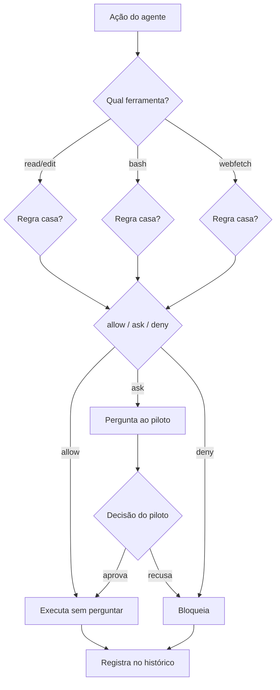

# Capítulo 7: Configuração avançada — permissões, agentes custom e skills

## 1. Introdução

Nos capítulos anteriores, você operou o OpenCode com a configuração padrão — provedores conectados, TUI dominada, automação programática. Agora vamos abrir a sala de máquinas. A configuração avançada é o que transforma o OpenCode de uma ferramenta genérica em uma cabine sob medida: o `opencode.json` profissional com o modelo de precedência de camadas, o sistema de permissões em profundidade que controla exatamente o que o agente pode fazer, os agentes custom que especializam o comportamento e as skills que encapsulam conhecimento reutilizável. Este é o capítulo onde a maioria das pessoas desiste — porque a documentação oficial lista as opções, mas não ensina o raciocínio de projeto por trás delas. Ao dominar isso, você vai escrever configurações que outros copiam — e vai entender por que cada linha existe, o que é o verdadeiro diferencial entre um usuário e um engenheiro de agentes.

## 2. Explica

O modelo de precedência de configuração é a fundação de tudo. O OpenCode mescla múltiplas camadas de configuração, em ordem de prioridade crescente: a configuração remota (`.well-known/opencode` servida pela organização), a global (`~/.config/opencode/opencode.json`), a apontada pela variável `OPENCODE_CONFIG`, a do projeto (`opencode.json` no raiz do repositório), a do diretório `.opencode/`, a definida por `OPENCODE_CONFIG_CONTENT` e, por fim, as managed settings impostas por MDM [1]. O ponto crucial é que essas camadas são **mescladas**, não substituídas: uma chave definida na camada do projeto não apaga as chaves da camada global — ela as sobrepõe pontualmente [1][2]. Entender essa mesclagem é o que permite criar configurações em camadas: defaults globais na máquina, ajustes por projeto no repositório e regras impositivas na organização.

A semântica da mesclagem tem um detalhe que evita horas de confusão: a mesclagem é por chave, não por bloco inteiro. Se a config global define um provedor com três modelos e a config do projeto redefine o mesmo provedor com um modelo, o resultado é a combinação — não a substituição do bloco inteiro [2]. Isso significa que um `opencode.json` de projeto pode ser mínimo e cirúrgico: apenas as chaves que diferem do padrão global. O profissional mantém o arquivo global enxuto (o que vale para todas as máquinas), o arquivo do projeto mínimo (o que vale para aquele repositório) e usa as camadas `OPENCODE_CONFIG` e `OPENCODE_CONFIG_CONTENT` para contextos específicos — CI, ambientes temporários, experimentos — sem tocar em nenhuma configuração persistente [1][2]. Esse é o padrão de engenharia que a mesclagem permite e que a maioria das pessoas nunca descobre.

O sistema de permissões é o coração do controle. Cada ação que o agente pode executar — ler arquivos, editar, rodar bash, buscar na web — é uma ferramenta controlada por uma política de permissão com três estados: `allow` (permite sem perguntar), `ask` (pergunta ao usuário) e `deny` (bloqueia) [3]. A configuração de permissões suporta duas sintaxes: a lista simples (chave `permission` com arrays de ferramentas) e o objeto por comando (chave `permission` com padrões glob que casam comandos específicos de cada ferramenta) [3][4]. O padrão profissional que a documentação recomenda é declarar o `allow` amplo primeiro e as regras específicas de `deny`/`ask` depois — o que parece contra-intuitivo até você entender a semântica: a última regra que casa vence, e o design de uma configuração de permissões é o design de uma lista de exceções [4].

Vale dissertar sobre a filosofia por trás desse padrão, porque ele inverte o instinto de segurança de quem vem de firewalls. Em um firewall tradicional, você nega tudo por padrão e abre portas específicas — o princípio do menor privilégio aplicado à rede. No OpenCode, o `allow` amplo seguido de exceções funciona porque o agente precisa de agilidade para operar: ler, editar e rodar comandos são o combustível do trabalho, e perguntar por cada um tornaria a operação inviável [3][4]. A segurança não está em negar o básico — está em negar o perigoso com precisão: os comandos destrutivos, os arquivos sensíveis, os diretórios fora do projeto. O envelope resultante é amplo no dia a dia e estreito exatamente onde o risco mora — e é esse desenho que o profissional projeta conscientemente, em vez de herdar por acidente.

As permissões especiais merecem atenção individual. O `external_directory` controla o acesso do agente a diretórios fora do worktree do projeto — pede confirmação por padrão, porque um agente com acesso amplo ao sistema de arquivos é um risco. O `doom_loop` detecta o agente chamando a mesma ferramenta três vezes com argumentos idênticos — um loop improdutivo que desperdiça tokens e trava o fluxo; a política padrão é pedir confirmação quando isso acontece [3][5]. E a leitura de arquivos `.env` é negada por padrão — uma decisão de segurança que protege credenciais mesmo quando o agente explora o repositório [5][6]. Juntas, essas permissões desenham o envelope de operação do agente: o que ele pode tocar, o que precisa pedir e o que nunca vai alcançar.

Os agentes custom são a camada de especialização. Há dois tipos: os **primary** (Build e Plan, que você alterna com Tab) e os **subagent** (General, Explore, Scout, invocados por `@`) [7]. Os agentes custom podem ser definidos em JSON (dentro do `opencode.json`, na chave `agent`) ou em Markdown (arquivos `.opencode/agents/*.md` com frontmatter) — e cada um declara seu próprio prompt, modelo, permissões e ferramentas [7][8]. O caso de uso clássico é o agente de revisão de código: mode `subagent`, edição negada, ferramentas de leitura e busca — um revisor especializado que não pode alterar nada [7][9]. A temperatura e o limite de passos (`steps`) também são configuráveis por agente: tarefas criativas querem temperatura alta, tarefas determinísticas querem baixa, e o limite de passos é a válvula de custo que impede o agente de iterar indefinidamente [8][10].

A distinção entre primary e subagent tem consequências de arquitetura que vão além da interface. Um primary agent é uma superfície que você habita — ele define o modo de operação da sessão (Build executa, Plan planeja) e pode invocar subagentes. Um subagent é uma ferramenta que o primary invoca para delegar trabalho especializado — e cada invocação isola o contexto: o subagente recebe a tarefa, trabalha em seu próprio escopo e devolve apenas o resultado ao primary [7][14]. Esse isolamento é o mesmo princípio de gerenciamento de contexto do Capítulo 2 aplicado à delegação: o contexto pesado (exploração de um repositório grande, revisão de um diff extenso) acontece fora do contexto principal, mantendo a sessão principal ágil. O padrão profissional constrói uma biblioteca de subagentes — revisor, explorador, gerador de testes, analista de segurança — e o primary delega com `@nome`, exatamente como um líder delega para especialistas sem sujar as próprias mãos.

As skills completam a tríade de personalização. Uma skill é um diretório com um arquivo `SKILL.md` — frontmatter com `name` e `description`, e o corpo com instruções reutilizáveis — descoberta sob demanda pela ferramenta de skill, em vez de carregada sempre [11]. As skills podem viver em `.opencode/skills/`, `.claude/skills/` e `.agents/skills/`, no projeto e no nível global, o que cria compatibilidade com o ecossistema Claude Code e com agentes em geral [11][12]. O formato é o mesmo que move a indústria hoje: instruções estruturadas que um agente descobre quando a tarefa exige, com permissões e ferramentas associadas por padrão [11][13]. A diferença entre uma skill e um prompt bem escrito é a descoberta: a skill é encontrada automaticamente pela descrição quando relevante, o prompt depende de você lembrar de passá-lo.

O mecanismo de descoberta de skills merece um parágrafo, porque é ele que diferencia a skill do prompt — e é o detalhe que a maioria das pessoas não percebe ao ler a documentação. Quando o agente recebe uma tarefa, a ferramenta de skill consulta as descrições das skills disponíveis e decide quais são relevantes para a tarefa corrente — como um motor de busca sobre o conhecimento da organização [11][13]. Uma skill com a descrição certa — "use quando a tarefa envolver X" — é encontrada no momento exato em que X aparece, sem que ninguém precise lembrar de mencioná-la. Isso tem uma consequência prática enorme: a qualidade da descoberta depende da qualidade das descrições, e escrever uma skill é também escrever o seu índice de busca. O profissional que projeta a biblioteca de skills da organização pensa em termos de descrições precisas e escopos bem definidos — porque é isso que determina se a skill certa aparece na hora certa [11][13].

A personalização completa também passa pelo visual e pelos comandos: o tema da TUI pode ser definido globalmente na config, e os comandos custom — que vimos no Capítulo 5 — podem ser declarados tanto em Markdown quanto na chave `command` do `opencode.json`, com as mesmas variáveis de substituição `$ARGUMENTS` e `$1..$n` [17][18]. A unidade do design é notável: agentes, skills, comandos e permissões vivem no mesmo modelo declarativo, e a mesma sintaxe que define um agente define um comando. Essa coerência é o que torna a configuração avançada aprendível — cada peça nova que você aprende reforça as anteriores [2][17].

Há um padrão de arquitetura de configuração que une todas essas peças e que vale explicitar: o princípio do "config como código" (configuration as code). Todos os artefatos deste capítulo — `opencode.json`, agentes Markdown, skills, comandos — são arquivos de texto que podem ser versionados, revisados e testados como qualquer código [2][17]. Um time que versiona a configuração de agentes no repositório ganha o que nenhuma configuração via interface gráfica oferece: histórico de mudanças, revisão por pares e reprodutibilidade — o mesmo AGENTS.md que o `/init` gera (Capítulo 3) pode apontar para as skills e agentes versionados do time. A configuração como código é o que transforma a personalização de agentes de um exercício individual em uma disciplina de engenharia compartilhada — e é o padrão que as empresas maduras adotam quando o OpenCode deixa de ser uma ferramenta pessoal e vira uma plataforma de time [2][17][12].

Essa disciplina de versionamento tem um efeito colateral que poucos preveem: ela torna a configuração auditável e reversível, o que muda a forma como o time experimenta [2][17]. Quando um agente novo ou uma permissão nova causa um problema, o time reverte o PR da configuração — não improvisa um conserto às cegas. Quando um desenvolvedor pergunta "por que o agente se comporta assim?", a resposta está no histórico do repositório: quem mudou o quê, quando e por quê [2]. E quando um novo membro entra no time, o onboarding de agentes é um `git pull` — a mesma configuração, os mesmos agentes, as mesmas skills, em qualquer máquina [12]. Esse ciclo — versionar, revisar, reverter, herdar — é exatamente o ciclo que transforma ferramentas individuais em plataformas de equipe, e é o mesmo movimento que o Capítulo 9 fará no nível da organização com o remote config e a governança [12][1].

Vale também um mapa da evolução típica da configuração, porque ele prepara você para o que vem: a configuração do profissional começa mínima (um `opencode.json` com modelo e provedor), cresce com as permissões (o envelope do Capítulo 7), ganha agentes custom (a especialização), adquire skills (o conhecimento encapsulado) e termina governada (o Capítulo 9) [1][2][11]. Cada estágio resolve um problema do estágio anterior: as permissões resolvem o risco do envelope amplo, os agentes resolvem a repetição de comportamento, as skills resolvem a repetição de conhecimento e a governança resolve a dispersão da configuração. Esse mapa de cinco estágios — mínimo, permissões, agentes, skills, governança — é a trajetória de maturidade de qualquer operação com agentes, e saber em que estágio você está é o que define o próximo passo da sua configuração [1][2][11][12].

## 3. Ilustra

Pense na configuração avançada como o manual de operação e o sistema de segurança da aeronave — os dois documentos que definem como a cabine se comporta, independentemente de quem está pilotando. O `opencode.json` é o manual em camadas: o manual global da companhia aérea (a config global), o manual do modelo de aeronave (a config do projeto) e o manual do voo específico (o `.opencode/` e o `OPENCODE_CONFIG_CONTENT`). Cada camada complementa a anterior sem reescrevê-la — é a mesclagem que estudamos na Explica, e ela existe para que a manutenção da configuração seja incremental: mudar o manual global não exige reescrever os manuais de cada voo [1][2].



O diagrama mostra o envelope de operação: cada ação do agente passa pelo filtro da ferramenta e da regra de permissão, e a decisão — executar, perguntar ou bloquear — é registrada no histórico. Repare que o `ask` coloca o piloto humano no circuito: é o ponto onde a cabine pede autorização da torre, e é exatamente essa pausa que transforma o agente de um sistema autônomo em uma operação supervisionada [3][4]. O `deny` é a cerca de segurança da pista: certas manobras simplesmente não podem acontecer, não importa o que o agente proponha.

A metáfora das skills merece uma segunda camada, porque o conceito de "conhecimento descoberto sob demanda" é sutil. Pense nas skills como os manuais de procedimentos de emergência da cabine: não estão abertos o tempo todo — seriam ruído — mas o piloto (ou o agente) sabe onde encontrá-los e os consulta exatamente quando o procedimento se aplica. Uma skill de "revisão de segurança" não fica no contexto de toda sessão; ela é descoberta quando a tarefa envolve segurança, e só então suas instruções entram em cena [11]. Esse é o mesmo princípio do gerenciamento de contexto do Capítulo 2 aplicado ao conhecimento: carregar sob demanda, nunca por padrão. Como Piloto de Desenvolvimento, você projeta o sistema de skills da sua organização como uma biblioteca de procedimentos: cada um no lugar certo, descrito com precisão, descoberto quando necessário.

## 4. Técnica

### A sintaxe de permissões em detalhe

Antes dos exemplos, vale dominar a gramática das permissões — porque é ela que destrava o controle fino. A chave `permission` aceita dois formatos que se combinam: o formato de lista (`"allow": ["read", "edit"]`) agrupa ferramentas inteiras, e o formato de objeto (`"bash": [{ "command": "git push --force", "deny": true }]`) aplica regras a comandos específicos de uma ferramenta [3][4]. A ferramenta `bash` é a mais rica nesse formato: você pode negar exatamente os comandos destrutivos (`rm -rf`, `git push --force`), permitir os seguros e pedir confirmação nos ambíguos — tudo por padrão glob no comando. O mesmo mecanismo se aplica a `edit` (negar edição em arquivos específicos como `.env`), a `webfetch` (restringir domínios) e às demais ferramentas [4]. A ordem das regras importa — a última que casa vence — e o padrão profissional é declarar as regras amplas primeiro e as específicas depois, criando uma cascata de exceções que é fácil de ler e de manter [4].

### A configuração passo a passo

A configuração avançada se escreve no `opencode.json` e nos diretórios `.opencode/`. O modelo de precedência, na prática:

```bash
# Camadas de configuração, da mais fraca à mais forte:
# 1. remota  -> .well-known/opencode (servida pela organização)
# 2. global  -> ~/.config/opencode/opencode.json
# 3. env     -> OPENCODE_CONFIG=/caminho/opencode.json
# 4. projeto -> opencode.json (raiz do repositório)
# 5. local   -> .opencode/ (diretório de configuração local)
# 6. content -> OPENCODE_CONFIG_CONTENT='{...}'
# 7. managed -> imposta por MDM (não pode ser sobrescrita)
```

O sistema de permissões em profundidade — com a sintaxe de objeto por comando:

```json
{
  "$schema": "https://opencode.ai/config.json",
  "permission": {
    "allow": [
      "read",
      "edit",
      "grep",
      "glob",
      "bash",
      "task"
    ],
    "ask": [
      "webfetch",
      "websearch",
      "external_directory"
    ],
    "deny": [
      "bash:rm -rf /",
      "bash:git push --force",
      "edit:.env",
      "read:.env"
    ],
    "doom_loop": "ask"
  }
}
```

Esse arquivo mostra o padrão profissional: `allow` amplo para as ferramentas do dia a dia, `ask` para as ações que tocam o mundo externo e o `deny` para as operações destrutivas — com a sintaxe `ferramenta:padrão` que casa comandos específicos [3][4][5]. O `doom_loop` configurado como `ask` adiciona a proteção contra loops improdutivos [5].

Os agentes custom em JSON dentro do `opencode.json`:

```json
{
  "$schema": "https://opencode.ai/config.json",
  "agent": {
    "code-reviewer": {
      "description": "Revisa código com rigor de segurança e qualidade",
      "mode": "subagent",
      "model": "anthropic/claude-sonnet-4-5",
      "temperature": 0.2,
      "tools": {
        "edit": false,
        "bash": false,
        "read": true,
        "grep": true,
        "glob": true
      },
      "prompt": "Você é um revisor de código sênior. Analise o diff, liste problemas de correção, segurança e estilo em ordem de severidade, com referência a arquivo e linha. Nunca edite arquivos."
    }
  }
}
```

Esse agente é o exemplo clássico de especialização: modo subagent (invocado por `@code-reviewer`), edição e bash desabilitadas, temperatura baixa para julgamento determinístico e um prompt que define o papel [7][8][9]. O mesmo agente em Markdown viveria em `.opencode/agents/code-reviewer.md` com o frontmatter equivalente [8].

As skills em Markdown — o padrão da indústria:

```markdown
---
name: revisar-seguranca
description: Revisa o código em busca de vulnerabilidades comuns (injeção, credenciais, exposição de dados). Use quando a tarefa envolver segurança.
---

# Revisão de Segurança

1. Leia os arquivos alterados e procure: SQL injection, XSS, vazamento de credenciais, dados sensíveis em logs.
2. Verifique se credenciais aparecem apenas em variáveis de ambiente.
3. Liste cada achado com severidade, arquivo e linha.
4. Sugira a correção, mas não edite arquivos sem autorização.
```

A skill vive em `.opencode/skills/revisar-seguranca/SKILL.md` e é descoberta pela ferramenta de skill quando a tarefa envolve segurança [11][12]. O limite de passos — a válvula de custo:

```json
{
  "$schema": "https://opencode.ai/config.json",
  "agent": {
    "build": {
      "steps": 100
    },
    "plan": {
      "steps": 50
    }
  }
}
```

O limite de passos por agente é a ferramenta de controle de custo mais direta: cada passo é uma iteração do loop do agente (uma chamada ao modelo), e limitá-lo impede que tarefas abertas virem faturas abertas [8][10][14]. A escolha do número é um trade-off entre autonomia e custo: passos demais deixam o agente iterar à vontade (custo alto, mas mais capacidade de concluir tarefas longas); passos de menos cortam o agente no meio de tarefas complexas (custo baixo, mas qualidade comprometida). O padrão profissional calibra por tipo de tarefa: o agente `build` recebe um teto generoso para tarefas de implementação completa, enquanto agentes de tarefas curtas — um comando de revisão, uma busca — recebem tetos enxutos [8][10][14]. E quando o limite é atingido, o resultado visível é a sessão encerrando com a tarefa incompleta — o sinal claro de que o teto precisa de ajuste, não de ignorância.

A validação da configuração é o último passo técnico que todo profissional faz antes de confiar nela: `opencode debug config` mostra a mesclagem final de todas as camadas — a única forma de confirmar que as regras que você escreveu são as regras que valem, sem surpresas de precedência [2][10]. O reflexo de validar a configuração antes de usá-la — em vez de descobrir o erro em produção — é o mesmo reflexo de rodar testes antes do deploy, e é ele que mantém o envelope de operação sob controle [2][10].

### Uma biblioteca prática de agentes e skills

Para fechar a parte técnica, vale materializar uma biblioteca inicial de agentes e skills — porque os exemplos da documentação são didáticos, mas o valor real aparece na combinação que resolve o dia a dia [7][11]. O primeiro agente da biblioteca é o explorador: um subagente com ferramentas de leitura e busca (read, grep, glob) e edição desabilitada, usado para mapear código desconhecido — "onde está a lógica de autenticação?", "como este módulo se conecta àquele?" — com o resultado devolvido à sessão principal sem poluir o contexto [7][14]. O segundo é o gerador de testes: um subagente com permissão de edição restrita aos arquivos de teste (via globs), temperatura baixa, que recebe uma função e devolve a suíte de casos de borda [8][9]. O terceiro é o revisor de segurança, que já vimos, e o quarto é o escritor de documentação: um agente que lê o código, entende o comportamento e atualiza os docs — com o prompt pedindo para seguir a convenção de documentação do AGENTS.md [12]. Ao lado dos agentes, as skills da biblioteca encapsulam os procedimentos recorrentes: a skill de revisão de PR (o checklist de correção, segurança e estilo), a skill de diagnóstico (o roteiro de `opencode debug` em camadas) e a skill de economia de tokens (as regras de contexto enxuto e MCP seletivo) [11][13]. O que une a biblioteca é o princípio deste capítulo: cada agente é um especialista com ferramentas restritas, cada skill é um procedimento descoberto sob demanda, e a soma é uma operação que não depende da memória de ninguém [7][11][14].

### O padrão de revisão de configuração

Antes da aplicação, vale consolidar o padrão de revisão de configuração que mantém o sistema saudável — porque a configuração avançada não é um artefato estático, é um sistema vivo. O padrão tem três momentos. O primeiro é a revisão de adição: toda config nova entra com justificativa — uma permissão nova, um agente novo, uma skill nova — e com um teste de validação: o `opencode debug config` confirma que a mesclagem produziu o resultado esperado [2][10]. O segundo é a revisão periódica: mensalmente, percorra as permissões e pergunte "esta regra ainda é necessária?" — regras obsoletas acumulam complexidade e superfície de erro, e a poda é parte da manutenção [3][4]. O terceiro é a revisão de incidente: quando o agente faz algo inesperado, a primeira pergunta é "que lacuna de configuração permitiu isso?" — e a correção não é apenas o incidente, é o desenho do envelope [3][5]. Esse padrão de três momentos — adição justificada, poda periódica, correção de lacunas — é o mesmo ciclo de qualquer sistema de configuração maduro, e é ele que impede a configuração avançada de virar um castelo de regras que ninguém entende [2][3][4].

A revisão de configuração tem um instrumento que poucos usam com método, e que vale um parágrafo porque ele torna a revisão objetiva em vez de subjetiva: o teste de permissão dirigido [3][4]. A ideia é verificar o envelope com ações reais em um ambiente de teste — não por leitura, mas por execução: rode um prompt que tenta ler um arquivo `.env` (a permissão deve negar), um prompt que tenta um `rm -rf` em um diretório de teste (o `deny` deve bloquear antes de qualquer dano), um prompt que faz `webfetch` (o `ask` deve interromper para confirmação) e um prompt que invoca uma ferramenta desabilitada do agente (a lista de tools do agente deve rejeitar) [3][4][5]. Cada teste responde a uma pergunta específica do envelope — as credenciais estão protegidas? Os comandos destrutivos estão bloqueados? O mundo externo pede confirmação? As ferramentas do agente estão restritas? — e o conjunto é o equivalente funcional de uma suíte de testes para a sua configuração [3][4]. O profissional roda essa bateria a cada mudança relevante de permissões e antes de expor a configuração a um time inteiro — porque o custo de descobrir uma brecha em produção é sempre maior que o custo de um teste de cinco minutos no ambiente de desenvolvimento [3][4][5].

## 5. Aplica

Cena de contraste. Uma empresa adota o OpenCode sem configurar permissões — o padrão. Na primeira semana, um desenvolvedor pede ao agente para "limpar arquivos temporários" e o agente, com acesso amplo, apaga um diretório que continha artefatos de um release. O `--auto` estava ativo em uma sessão de CI. O incidente não derrubou produção, mas custou um dia de reconstrução e — mais importante — mostrou à equipe que o padrão de permissões é a primeira linha de defesa operacional. O diagnóstico: sem um envelope de operação definido, o agente opera com o maior envelope possível, e "o padrão" nunca é o envelope certo.

Agora a prática correta. A mesma empresa define o padrão em três camadas: a config global define `allow` amplo para leitura e edição, `ask` para bash e web, `deny` para comandos destrutivos; o `opencode.json` do repositório adiciona as exceções específicas do projeto; e o agente de revisão — um subagente sem edição — é usado em todo PR. O `--auto` fica proibido em ambientes que tocam produção. A equipe ganha a produtividade do agente sem o risco do envelope amplo, e a revisão continua humana no ponto de decisão. O diagnóstico técnico dessa prática: a configuração de permissões é o desenho do envelope de operação, e cada projeto merece um envelope desenhado, não herdado [3][4][5].

As armadilhas práticas, em síntese: primeiro, tratar a configuração como um monólito — a mesclagem de camadas existe para que defaults globais e ajustes por projeto coexistam, e quem reescreve tudo em uma camada perde essa flexibilidade [1][2]; segundo, não usar a sintaxe de objeto por comando — a lista simples de ferramentas não controla comandos específicos, e é o objeto por comando que permite negar exatamente `git push --force` [3][4]; terceiro, criar agentes sem restringir ferramentas — um subagente com edição habilitada é um revisor que pode alterar o que revisa [7][9]; quarto, ignorar o limite de passos — sem `steps`, tarefas abertas viram faturas abertas [8][10]; quinto, não usar skills — conhecimento que poderia ser encapsulado em SKILL.md é reescrito em prompts toda vez, com qualidade variável [11][13].

Um cenário de aplicação que consolida o capítulo é a evolução de uma configuração de time — porque ela mostra como as peças se integram em escala real. O time começa com a config global do líder (modelo, provedor, permissões básicas), versionada em um repositório de configuração da equipe [2][17]. A primeira semana adiciona o envelope: `allow` para as ferramentas do dia a dia, `ask` para bash e web, `deny` para o destrutivo — revisado em PR como qualquer código [3][4]. A segunda semana adiciona os agentes: o revisor de PR (subagente sem edição), o explorador de código legado e o gerador de testes — cada um com ferramentas restritas e temperature calibrada [7][8]. A terceira semana adiciona as skills: a de revisão de segurança, a de diagnóstico e a de convenções do time, com descrições precisas para a descoberta sob demanda funcionar [11][13]. E o primeiro incidente — um `--auto` num fluxo de CI — dispara a correção de lacuna: o `deny` é estendido, o incidente vira uma lição documentada na skill e a configuração sai mais forte [3][5]. O que torna essa evolução possível é a disciplina de config como código: cada estágio é um PR, cada mudança é revisável, cada lacuna é corrigível — e a configuração do time evolui com a mesma disciplina do código que o time escreve [2][17].

No mercado, o engenheiro que domina a configuração de agentes é o que as empresas chamam de "agente platform engineer" — o profissional que projeta os envelopes de operação, os agentes especializados e as skills da organização. A tendência é clara nos papers sobre agentes: o controle fino das ferramentas e permissões é um fator determinante de segurança e eficácia, especialmente em agentes autônomos que executam comandos [15][16]. E a base acadêmica mais ampla reforça o valor do design de interfaces e pipelines: o trabalho do OpenHands, que propõe agentes generalistas em plataformas abertas, depende exatamente da configurabilidade que este capítulo descreve — ferramentas, permissões e agentes especializados são os blocos de construção da plataforma [19][20]. A configuração avançada não é um detalhe técnico: é a disciplina de engenharia que transforma uma ferramenta poderosa em uma operação previsível — e é exatamente o que este capítulo te deu.

Um padrão de aplicação que fecha o capítulo com os pés no chão — porque ele mostra o envelope funcionando no dia a dia e não apenas na teoria: o reflexo de configurar antes de delegar [3][7][10]. O profissional não pede ao agente "limpe o diretório de build" e espera o melhor: ele verifica o envelope antes — a permissão de bash cobre o comando? O diretório está dentro do escopo? O comando é destrutivo o suficiente para merecer um `ask`? — e ajusta a configuração com a mesma naturalidade com que ajusta um lint [3][4]. O mesmo reflexo vale para agentes: antes de criar o subagente de revisão, ele define as ferramentas (leitura e busca, sem edição) e o modelo; antes de dar uma skill ao time, ele escreve a descrição com a precisão de quem indexa [7][11][13]. Esse reflexo — configuração antes de delegação — é o que distingue o engenheiro de agentes do usuário empolgado: o primeiro trata o envelope como parte da tarefa, o segundo como burocracia [3][7]. E é exatamente esse reflexo que os próximos capítulos assumem como dado: quando o Capítulo 8 conecta MCPs e o Capítulo 10 protege credenciais, ambos partem do princípio de que a configuração é o primeiro ato de qualquer operação — não um passo depois de um incidente [3][7][10].

## 6. Conclusão

Você abriu a sala de máquinas: o modelo de precedência de camadas e a mesclagem de configurações, o sistema de permissões em profundidade — `allow`/`ask`/`deny`, sintaxe de objeto por comando, `external_directory`, `doom_loop` —, os agentes custom em JSON e Markdown, o limite de passos como válvula de custo e as skills em SKILL.md com descoberta sob demanda [1][3][7][8][10][11]. Você entendeu o padrão de projeto: envelope de operação desenhado, agentes especializados com ferramentas restritas e conhecimento encapsulado em skills.

Recapitulando os três pontos centrais: primeiro, a configuração vive em camadas mescladas — remota, global, projeto, local, managed — e a mesclagem por chave permite arquivos mínimos e cirúrgicos [1][2]. Segundo, as permissões desenham o envelope de operação — allow amplo, ask no externo, deny no destrutivo — e o desenho é uma lista de exceções, não uma lista de proibições [3][4][5]. Terceiro, agentes custom e skills são as camadas de especialização — primary e subagent com ferramentas e permissões próprias, skills descobertas sob demanda — e a configuração como código as torna versionáveis e revisáveis [7][8][11][13].

Seu desafio agora: escreva o `opencode.json` do seu projeto com um envelope de permissões desenhado — allow para o básico, ask para o externo, deny para o destrutivo — e crie um agente subagent de revisão sem edição. E prepare-se para o próximo voo: no Capítulo 8, vamos conectar o copiloto ao mundo — o MCP, os plugins e a gestão de ferramentas que ampliam o OpenCode para além do repositório.

A configuração está no lugar, mas o copiloto ainda pode alcançar mais longe. No Capítulo 8, vamos conectar o agente ao mundo externo: o MCP (Model Context Protocol), os plugins e a gestão de ferramentas — ampliando o copiloto com servidores locais e remotos, eventos e ferramentas custom, e a disciplina de não inflar o contexto.

## 7. Referências Bibliográficas

[1] OPENCODE. *Config — Using the OpenCode JSON config*. Disponível em: https://opencode.ai/docs/config. Acesso em: 03 ago. 2026.

[2] OPENCODE. *Config schema — opencode.ai/config.json*. Disponível em: https://opencode.ai/config.json. Acesso em: 03 ago. 2026.

[3] OPENCODE. *Permissions — Control which actions require approval to run*. Disponível em: https://opencode.ai/docs/permissions. Acesso em: 03 ago. 2026.

[4] OPENCODE. *Permissions — sintaxe de objeto por comando*. Disponível em: https://opencode.ai/docs/permissions. Acesso em: 03 ago. 2026.

[5] OPENCODE. *Permissions — external_directory e doom_loop*. Disponível em: https://opencode.ai/docs/permissions. Acesso em: 03 ago. 2026.

[6] ANOMALYCO. *OpenCode — AI coding agent built for the terminal*. Disponível em: https://opencode.ai. Acesso em: 03 ago. 2026.

[7] OPENCODE. *Agents — Configure and use specialized agents*. Disponível em: https://opencode.ai/docs/agents. Acesso em: 03 ago. 2026.

[8] OPENCODE. *Agents — agentes JSON e Markdown*. Disponível em: https://opencode.ai/docs/agents. Acesso em: 03 ago. 2026.

[9] OPENCODE. *Tools — Manage the tools an LLM can use*. Disponível em: https://opencode.ai/docs/tools. Acesso em: 03 ago. 2026.

[10] OPENCODE. *Agents — temperature e steps*. Disponível em: https://opencode.ai/docs/agents. Acesso em: 03 ago. 2026.

[11] OPENCODE. *Agent Skills — Define reusable behavior via SKILL.md definitions*. Disponível em: https://opencode.ai/docs/skills. Acesso em: 03 ago. 2026.

[12] OPENCODE. *Instructions — AGENTS.md and project instructions*. Disponível em: https://opencode.ai/docs/instructions. Acesso em: 03 ago. 2026.

[13] OPENCODE. *Config — chave agent e skills por padrão*. Disponível em: https://opencode.ai/docs/config. Acesso em: 03 ago. 2026.

[14] BAI, Longju; HUANG, Zhemin; WANG, Xingyao; SUN, Jiao; MIHALCEA, Rada; BRYNJOLFSSON, Erik; PENTLAND, Alex; PEI, Jiaxin. *How Do AI Agents Spend Your Money? Analyzing and Predicting Token Consumption in Agentic Coding Tasks*. arXiv, 2026. Disponível em: https://arxiv.org/abs/2604.22750. Acesso em: 03 ago. 2026.

[15] SIDIK, Bronislav; ROKACH, Lior. *Beyond Static Sandboxing: Learned Capability Governance for Autonomous AI Agents*. In: NeurIPS Agent Safety Workshop, 2026. Disponível em: https://arxiv.org/abs/2604.11839. Acesso em: 03 ago. 2026.

[16] HASAN, Mohammed Mehedi; LI, Hao; FALLAHZADEH, Emad; RAJBAHADUR, Gopi Krishnan; ADAMS, Bram; HASSAN, Ahmed E. *Model Context Protocol (MCP) at First Glance: Studying the Security and Maintainability of MCP Servers*. arXiv, 2026. Disponível em: https://arxiv.org/abs/2506.13538. Acesso em: 03 ago. 2026.

[17] OPENCODE. *Commands — Create custom commands for repetitive tasks*. Disponível em: https://opencode.ai/docs/commands. Acesso em: 03 ago. 2026.

[18] OPENCODE. *Themes — Select a built-in theme or define your own*. Disponível em: https://opencode.ai/docs/themes. Acesso em: 03 ago. 2026.

[19] WANG, Xingyao; LI, Boxuan; SONG, Yufan; XU, Frank F.; TANG, Xiangru; ZHUGE, Mingchen et al. *OpenHands: An Open Platform for AI Software Developers as Generalist Agents*. In: ICLR, 2025. Disponível em: https://arxiv.org/abs/2407.16741. Acesso em: 03 ago. 2026.

[20] YANG, John; JIMENEZ, Carlos E.; WETTIG, Alexander; LIERET, Kilian; YAO, Shunyu; NARASIMHAN, Karthik; PRESS, Ofir. *SWE-agent: Agent-Computer Interfaces Enable Automated Software Engineering*. In: NEURIPS, 2024. Disponível em: https://arxiv.org/abs/2405.15793. Acesso em: 03 ago. 2026.
