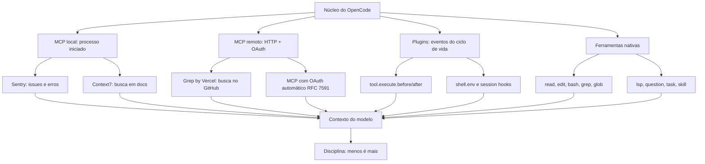

# Capítulo 8: MCP, plugins e ferramentas — ampliando o copiloto

## 1. Introdução

No Capítulo 7, você configurou a cabine sob medida — permissões, agentes custom e skills. Mas o copiloto ainda está limitado ao que o OpenCode sabe fazer nativamente. É hora de conectar o agente ao mundo externo: o MCP (Model Context Protocol), o padrão aberto que a Anthropic introduziu em novembro de 2024 e que o mercado inteiro adotou, conecta o agente a servidores de ferramentas e contexto — issues do Sentry, busca em documentação, busca de código no GitHub [1][2]. Os plugins estendem o próprio OpenCode com eventos e ferramentas custom, e a gestão de ferramentas define o equilíbrio entre poder e custo. Neste capítulo, você vai conectar MCP servers locais e remotos — com OAuth automático —, escrever plugins que respondem a eventos do ciclo de vida e dominar a disciplina de não inflar o contexto com ferramentas pesadas. Ao dominar isso, você transforma o OpenCode em um hub — o ponto central onde o agente alcança todo o seu ecossistema de trabalho.

## 2. Explica

O MCP é um protocolo aberto para conectar ferramentas e contexto externos aos modelos de linguagem. Criado pela Anthropic em novembro de 2024, o protocolo padroniza a comunicação entre o agente (o cliente MCP) e os servidores de ferramentas: em vez de cada integração inventar um formato próprio, um servidor MCP expõe ferramentas e recursos por um contrato comum [1][3]. O OpenCode suporta servidores MCP locais (processos iniciados pelo próprio OpenCode) e remotos (servidores HTTP, incluindo os com autenticação OAuth) [2][4]. A consequência prática é enorme: centenas de integrações MCP — Sentry para issues e erros, Context7 para busca em documentação, Grep by Vercel para busca de código no GitHub — ficam disponíveis com configuração declarativa [2][5]. Cada um desses servidores é um serviço mantido por sua comunidade: o Context7 indexa documentação de bibliotecas e responde sob demanda [18], e o Grep by Vercel indexa repositórios públicos do GitHub para busca de código em larga escala [19]. A qualidade desses servidores varia, e a escolha de qual conectar deve considerar manutenibilidade — o mesmo critério que os papers sobre MCP apontam como o principal risco dos servidores públicos [16][17].

Vale explicar por que o MCP se tornou o padrão de facto da indústria em tão pouco tempo, porque isso ilumina o papel dele na arquitetura do agente. Antes do MCP, cada integração de ferramenta exigia um adaptador específico: o agente precisava conhecer o formato de cada API, e cada nova integração era um projeto. O MCP inverte esse modelo: o servidor expõe um contrato comum — ferramentas com nome, descrição e schema de entrada — e o agente consome qualquer servidor que fale o protocolo [1][3]. É a mesma lógica do USB: um padrão físico único que unificou uma infinidade de dispositivos. Para o OpenCode, a adoção do MCP significa que o ecossistema de integrações cresce sem que o núcleo mude: cada servidor MCP novo é uma capacidade nova disponível por configuração declarativa, não por modificação do agente [2][4]. O custo dessa abertura é o que os papers apontam — a qualidade e a segurança dos servidores variam — e é por isso que a seleção e a auditoria de MCPs são parte do ofício do profissional [16][17].

A configuração MCP vive na chave `mcp` do `opencode.json`. Cada servidor é declarado com um nome e um tipo: `local` (com `command` e `args` para iniciar o processo) ou `remote` (com `url` para o endpoint HTTP) [2][4]. O schema completo da chave `mcp` está documentado no config schema oficial, com os campos de environment, headers e autenticação por servidor [3][20]. Os servidores remotos podem exigir headers, environment e autenticação — e o OpenCode implementa OAuth automático segundo o RFC 7591: ao conectar um servidor remoto com OAuth, o OpenCode abre o fluxo de autorização, armazena o token e renova quando necessário [2][6]. O comando `opencode mcp` gerencia o ciclo de vida: `mcp add` adiciona um servidor, `mcp list` mostra os conectados, `mcp auth` gerencia a autenticação OAuth e `mcp logout` revoga [4][7]. O `mcp debug` diagnostica problemas de conexão [4].

O gerenciamento de ferramentas MCP é onde mora o equilíbrio. Cada ferramenta MCP adicionada ao contexto do modelo consome tokens — e servidores pesados, como o GitHub MCP, tendem a estourar o limite de contexto quando o agente carrega tudo [2][8]. A recomendação oficial é usar MCP com parcimônia, e o OpenCode oferece o controle fino: ferramentas podem ser habilitadas ou desabilitadas por agente (a chave `tools`), e globs como `mymcp_*` selecionam grupos de ferramentas de um servidor [8][9]. A disciplina prática: ativar apenas os MCPs necessários para a tarefa e desabilitar por agente quando o contexto for crítico [2][8].

Vale entender o mecanismo exato do custo, porque ele explica a recomendação de parcimônia com precisão. Quando um servidor MCP está conectado, o OpenCode descreve suas ferramentas para o modelo — nome, descrição, schema de entrada — e essa descrição entra no contexto da sessão. Cada ferramenta adiciona de centenas a milhares de tokens, dependendo da complexidade do schema; um servidor com vinte ferramentas de schemas ricos pode consumir uma fatia significativa da janela de contexto antes mesmo de você pedir qualquer coisa [8][9]. Multiplique isso por vários servidores, e o agente começa a tarefa com o contexto parcialmente ocupado — menos espaço para as instruções, o histórico e o código que realmente importam. É por isso que a recomendação oficial não é retórica: cada MCP conectado é um aluguel permanente de espaço no contexto, e o profissional cobra esse aluguel com disciplina [8].

Os plugins são a camada de extensão do próprio OpenCode. Escritos em JavaScript ou TypeScript, os plugins engancham eventos do ciclo de vida do sistema — `tool.execute.before`, `tool.execute.after`, `session.created`, `session.idle`, `shell.env` — e podem adicionar ferramentas custom por meio do SDK `@opencode-ai/plugin` [10][11]. Os plugins carregam de `.opencode/plugins/`, de `~/.config/opencode/plugins/` e de pacotes npm declarados na chave `plugin` do config [10][12]. O caso de uso típico: um plugin que notifica quando a sessão fica ociosa, que injeta variáveis de ambiente no shell de cada sessão ou que registra métricas de cada execução de ferramenta — telemetria e observabilidade sem tocar no núcleo do OpenCode [10][13]. O registry oficial de plugins inclui integrações como `opencode-helicone-session` e `opencode-wakatime` [13].

O modelo de eventos dos plugins merece um entendimento estrutural, porque ele define o que é possível estender. O ciclo de vida do OpenCode emite eventos em pontos específicos: antes e depois de cada execução de ferramenta (`tool.execute.before/after`), na criação e no encerramento de sessões (`session.created`, `session.idle`), e na montagem do ambiente do shell (`shell.env`) [10][11]. Um plugin é uma coleção de handlers para esses eventos — e cada handler recebe um payload estruturado com o contexto do evento. Essa arquitetura de eventos é o que permite estender o OpenCode sem fork: você não modifica o núcleo, você escuta os pontos de extensão que ele expõe. É o mesmo princípio da arquitetura cliente-servidor do Capítulo 2 — superfícies estáveis, extensão por contratos — aplicado à observabilidade e à automação [10][11][13].

A gestão de ferramentas nativas fecha o quadro. O OpenCode expõe ferramentas como read, edit, bash, grep, glob, webfetch, websearch, task, skill, lsp e question — e cada agente pode habilitar ou desabilitar qualquer uma delas [9][14]. A ferramenta `lsp`, por exemplo, integra o agente ao Language Server Protocol do editor para navegação precisa no código; a `question` permite ao agente perguntar diretamente ao usuário quando precisa de esclarecimento [14]. A decisão de quais ferramentas um agente carrega é uma decisão de contexto e de superfície de ataque: menos ferramentas significa menos tokens e menos risco; mais ferramentas significa mais capacidade — e o profissional equilibra os dois com base na tarefa [8][9][14].

A ferramenta `task` merece um destaque especial, porque ela é a ponte entre os agentes: é ela que permite a um primary agent invocar subagentes programaticamente, em vez de apenas por menção `@` na TUI [9][14]. Com `task`, um agente build pode orquestrar uma sequência de subagentes — explorar, revisar, testar — dentro de uma única execução, distribuindo o trabalho e isolando o contexto de cada etapa. Para automação, essa é a peça que torna possível pipelines agênticos completos: o agente principal planeja, delega e consolida, exatamente como um líder de equipe faria. A combinação de `task` com os subagentes do Capítulo 7 e as permissões por agente é o que dá ao OpenCode a profundidade de um sistema operacional de agentes, não apenas uma ferramenta de chat com ferramentas [9][14][8].

Vale um cenário concreto para mostrar como essas camadas se combinam no dia a dia — porque a soma de MCP, plugins e ferramentas é o que transforma o agente em um hub de trabalho real [2][5]. Um detalhe desse cenário que merece atenção é o papel da observação contínua: a decisão de quais MCPs ficam conectados não é tomada uma vez, mas reavaliada a cada mudança de fluxo — e o critério é sempre o mesmo, o valor entregue contra o custo de contexto [2][8]. Quando o time adota uma biblioteca nova, o Context7 passa a ser consultado com mais frequência e o servidor se justifica; quando um projeto morre, o MCP que servia ele deveria sair da configuração junto [8][18]. Essa ligação entre o ciclo de vida do projeto e o ciclo de vida dos MCPs é a forma prática de aplicar a disciplina de "menos é mais" — não como uma regra fixa, mas como uma decisão contínua, revisada a cada mudança relevante do fluxo de trabalho [2][8]. Imagine uma manhã de segunda-feira: a sua aplicação recebe um erro novo, e o Sentry — conectado como servidor MCP local — registra a issue [5]. Você abre o OpenCode e pede: "investigue a issue #2103 do Sentry e proponha a correção". O agente usa a ferramenta do Sentry para buscar os detalhes do erro (stack trace, contexto, usuários afetados), usa o Context7 para consultar a documentação da biblioteca envolvida na hora em que precisa (a descrição correta da API, sem adivinhar) e usa as ferramentas nativas para ler o código e reprovar o cenário [2][18]. O fluxo inteiro — bug reportado, documentação consultada, causa identificada, correção proposta — acontece dentro de uma única sessão, com cada fonte externa acessada no momento exato em que é necessária [2][5]. É esse fluxo que o MCP viabiliza: não uma coleção de integrações decorativas, mas uma cadeia de contexto externo que entra na sessão quando a tarefa precisa — e a disciplina de parcimônia é o que garante que a cadeia não vire congestionamento [2][8][18].

## 3. Ilustra

Pense no MCP como os instrumentos externos que uma aeronave consulta durante o voo: a torre de controle (meteorologia), o sistema de tráfego aéreo (posição de outras aeronaves) e o centro de manutenção (dados do motor). O piloto não carrega todos os instrumentos o tempo todo — consultá-los tem custo (tempo de rádio, atenção). Ele consulta a meteorologia na decolagem e na aproximação, o tráfego durante a rota e a manutenção quando um alerta acende. O OpenCode faz o mesmo com o MCP: cada servidor é um instrumento externo, cada consulta tem um custo de contexto, e o piloto profissional decide quando cada instrumento está ativo — não todos ao mesmo tempo, para sempre [2][8].



O diagrama mostra o OpenCode como o hub central, com três anéis de extensão — MCP, plugins e ferramentas nativas — todos alimentando o mesmo contexto do modelo. A última caixa é a mais importante: "Disciplina: menos é mais". Cada anel adiciona capacidade, mas cada item adicionado também adiciona tokens e superfície de ataque; o profissional projeta o hub como uma cabine real, onde cada instrumento tem um lugar e um momento [8][9].

A segunda analogia, para o conceito denso de plugins: pense nos plugins como os procedimentos de manutenção programada da aeronave. O motor (o núcleo do OpenCode) é estável e testado; os plugins são os módulos de inspeção que se conectam em pontos específicos — antes de cada ferramenta executar, depois de cada execução, na criação da sessão — sem abrir o motor. Um plugin de métricas é como o gravador de dados de voo: não muda a operação, registra tudo. Um plugin de notificação é como o alarme de manutenção: acende quando algo precisa de atenção. A arquitetura de eventos — `tool.execute.before/after`, `session.*`, `shell.env` — é a interface padronizada que permite esses módulos existirem sem invadir o núcleo [10][11][13].

## 4. Técnica

### A observação do ecossistema MCP

Vale também uma palavra sobre como acompanhar o ecossistema MCP sem se perder, porque a oferta cresce rápido e a qualidade varia muito. O ponto de partida é o protocolo em si — a documentação da Anthropic que o introduziu e o padrão aberto que o mantém [1][3]. A partir daí, a seleção segue critérios objetivos: a manutenibilidade do servidor (frequência de atualização, tamanho da comunidade), a reputação (quem mantém, quem usa), o escopo das ferramentas (quantas expõe, quantas você precisa) e o custo de contexto (quanto cada descrição pesa) [2][8][16]. Os papers sobre MCP são o guia de risco: documentam as classes de ameaças e a variação de qualidade dos servidores públicos, e devem ser o filtro de qualquer seleção [16][17]. E a revisão periódica fecha o ciclo: um servidor que parecia ótimo na conexão pode degradar — observação contínua, desligamento sem culpa [8][10]. Esse processo — entender o padrão, selecionar por critérios, filtrar por risco, revisar sempre — é a disciplina de governança de MCP que o Capítulo 10 completa com a visão de segurança e custo [16][17][8].

### O contrato MCP em detalhe

Antes dos exemplos, vale entender o contrato que o OpenCode usa para falar com os servidores MCP — porque ele define o que é possível configurar. No tipo `local`, o OpenCode inicia o processo: o `command` é o binário (ou `npx -y <pacote>`), o `args` são os argumentos de inicialização e o `environment` injeta variáveis no processo — o padrão para servidores que vivem como processos locais [2][4]. No tipo `remote`, o OpenCode fala HTTP com um servidor já rodando: o `url` é o endpoint, e os `headers` e o `environment` cobrem a autenticação — incluindo o OAuth automático, que segue o fluxo de autorização do RFC 7591 e armazena os tokens [2][6]. O `enabled` liga ou desliga o servidor sem removê-lo da configuração — o padrão que o remote config organizacional usa para entregar MCPs desabilitados por padrão, que cada dev ativa localmente [10][4]. Entender esse contrato — processo vs. HTTP, headers vs. OAuth, enabled vs. presente — é o que permite configurar qualquer servidor MCP do ecossistema sem depender de exemplo pronto [2][4].

### A configuração MCP passo a passo

A configuração MCP no `opencode.json` — os dois tipos de servidor:

```json
{
  "$schema": "https://opencode.ai/config.json",
  "mcp": {
    "sentry": {
      "type": "local",
      "command": "npx",
      "args": ["-y", "@sentry/mcp-server"],
      "environment": {
        "SENTRY_AUTH_TOKEN": "{env:SENTRY_AUTH_TOKEN}"
      }
    },
    "context7": {
      "type": "remote",
      "url": "https://mcp.context7.com/mcp"
    },
    "grep-app": {
      "type": "remote",
      "url": "https://mcp.grep.app/mcp"
    }
  }
}
```

Esse arquivo mostra os padrões reais: servidor local com `command`/`args`/`environment` (Sentry via npx) e servidores remotos com `url` (Context7 e Grep by Vercel) [2][4][5]. A variável de ambiente do token fica fora do arquivo com `{env:...}` — a mesma disciplina do Capítulo 4 [4].

O gerenciamento MCP pela linha de comando:

```bash
# Adiciona um servidor MCP
opencode mcp add sentry --type local --command "npx" --args "-y @sentry/mcp-server"

# Lista os servidores conectados
opencode mcp list

# Autentica um servidor remoto com OAuth
opencode mcp auth context7

# Revoga a autenticação
opencode mcp logout context7

# Diagnostica problemas de conexão
opencode mcp debug
```

O OAuth automático para servidores remotos segue o RFC 7591 — o fluxo de autorização do dispositivo que a maioria dos servidores MCP remotos usa hoje [2][6].

A gestão de ferramentas por agente — o controle fino do contexto:

```json
{
  "$schema": "https://opencode.ai/config.json",
  "agent": {
    "build": {
      "tools": {
        "mcp__sentry_*": false,
        "mcp__context7_*": true
      }
    }
  }
}
```

Os globs `mcp__<servidor>_*` selecionam ferramentas de um servidor específico — permitindo, por exemplo, desativar todas as ferramentas do Sentry no agente build quando o contexto está crítico [8][9].

A disciplina de não inflar o contexto tem uma técnica complementar que vale registrar: a verificação periódica do custo real de cada MCP. O `opencode mcp list` mostra os servidores conectados, e o `opencode stats` mostra o consumo — mas a observação mais direta é qualitativa: quando o agente parece lento ou as respostas degradam, o primeiro suspeito é o contexto entupido de descrições de ferramentas MCP [2][8]. O ritual do profissional: a cada nova conexão de servidor, observe uma sessão de trabalho — se a latência e a qualidade degradarem, o servidor é o candidato a desligar ou a restringir por agente com os globs `mcp__<servidor>_*` [8][9]. Esse feedback empírico — observar, medir, ajustar — é o mesmo ciclo da calibração de steps do Capítulo 7, e é ele que mantém o hub enxuto ao longo do tempo [8][9][10].

Um plugin em TypeScript com o SDK oficial:

```typescript
import { definePlugin } from "@opencode-ai/plugin";

export default definePlugin({
  name: "meu-plugin",
  async "tool.execute.after"({ tool, input, output }) {
    if (tool.name === "bash") {
      const duracao = output.metadata?.durationMs ?? 0;
      if (duracao > 5000) {
        console.log(`[meu-plugin] comando lento: ${input.command} (${duracao}ms)`);
      }
    }
  },
});
```

Esse plugin engata no evento `tool.execute.after` e loga comandos bash lentos — um alerta de desempenho que não existe no núcleo [10][11]. Ele vive em `.opencode/plugins/` e é carregado automaticamente [10][12]. A proteção de `.env` vale também para plugins: o OpenCode protege variáveis sensíveis por padrão, e plugins que precisam de credenciais devem usar o mecanismo de injeção de variáveis em vez de ler arquivos diretamente [12][15].

### A relação entre plugins e MCP

Antes do processo de onboarding, vale estabelecer a fronteira entre plugins e MCP — uma confusão comum quando o ecossistema cresce. O MCP conecta o agente a ferramentas externas: o servidor MCP é um processo ou serviço separado que expõe ferramentas ao agente pelo protocolo [1][2]. O plugin estende o próprio OpenCode: ele roda dentro do processo do OpenCode, engancha eventos internos e pode adicionar ferramentas custom [10][11]. A regra de ouro: MCP é para ferramentas do mundo (issues, docs, buscas), plugin é para comportamento do OpenCode (hooks, métricas, automação interna). Há sobreposição — um plugin pode adicionar uma ferramenta que um MCP também ofereceria — e a escolha entre os dois depende do ciclo de vida: MCP para ferramentas que vivem fora (mantidas por terceiros, evoluem independentes), plugin para comportamento que vive dentro (amarrado à versão do OpenCode, evoluído com ele) [2][10][11]. Entender a fronteira evita a arquitetura errada: um plugin para integrar com o Sentry (ferramenta externa) é reinvenção do que o MCP já faz melhor; um MCP para hookar eventos internos é simplesmente impossível [2][10].

### O fluxo de trabalho com MCP na prática

Vale também um mapa do fluxo de trabalho completo com MCP — porque conectar servidores é fácil, mas operá-los com intenção é o que separa o uso profissional [2][8]. O fluxo tem quatro momentos no dia a dia. O momento da tarefa: quando a tarefa corrente precisa de uma fonte externa — uma issue, uma documentação, uma busca — o agente invoca a ferramenta certa do servidor certo, e o contexto externo entra na sessão naquele momento [2][5]. O momento da observação: durante e depois da sessão, você nota o custo — a latência das respostas, o consumo de tokens — e relaciona com o que foi conectado [2][8]. O momento da calibração: com base na observação, você ajusta — desativa um servidor por agente com os globs `mcp__<servidor>_*`, restringe o escopo de ferramentas ou remove o servidor da configuração [8][9]. E o momento da auditoria: periodicamente, você revisa o hub inteiro — cada servidor ainda tem um dono e um propósito? Cada plugin ainda é necessário? — e poda o que não se sustenta [8][10][16]. Esse ciclo de quatro momentos — tarefa, observação, calibração, auditoria — é o mesmo espírito do ciclo de revisão do Capítulo 7, aplicado ao ecossistema externo: nada conectado sem justificativa, nada conectado sem dono, nada conectado sem revisão [8][16].

### O processo de onboarding de um servidor MCP

Antes da aplicação, vale consolidar o processo de onboarding de um servidor MCP — o passo a passo que transforma a conexão de um servidor de um ato impulsivo em uma decisão de engenharia. O processo tem cinco etapas. A primeira é a avaliação: quem mantém o servidor, com que frequência ele é atualizado, qual a sua reputação — os papers sobre MCP mostram que a manutenibilidade é o principal risco dos servidores públicos [16][17]. A segunda é o escopo: quais ferramentas o servidor expõe e quais delas a sua tarefa realmente precisa — o filtro que evita carregar vinte ferramentas para usar duas [2][8]. A terceira é o custo: quantos tokens as descrições das ferramentas adicionam ao contexto — o cálculo que justifica (ou não) a conexão [8][9]. A quarta é o envelope: quais agentes terão acesso ao servidor, com quais permissões — a configuração por agente via globs [8][9]. A quinta é o monitoramento: depois de conectado, observe o uso — o servidor está sendo usado? O custo é proporcional ao valor? — e desligue o que não se sustenta [8][10]. Esse processo de cinco etapas — avaliar, escopar, calcular, envelopar, monitorar — é o padrão que mantém o hub saudável, e é a tradução prática de tudo o que os papers sobre MCP recomendam [16][17][8].

Um detalhe do onboarding que merece destaque é a conexão entre MCP e automação — porque é no pipeline agêntico que o custo dos servidores aparece com mais clareza, e é lá que a seleção correta mais vale [2][8][10]. Quando um agente roda em automação (Capítulo 6), cada execução monta o contexto com as descrições das ferramentas dos MCPs conectados — e uma automação que roda diariamente multiplica esse custo de montagem pelo número de execuções [2][8]. Um MCP que você conectou para experimentar e esqueceu de remover vira um imposto permanente sobre cada execução do pipeline: o mesmo servidor, o mesmo custo de contexto, todos os dias, sem ninguém usar as ferramentas dele [8][10]. A prática profissional amarra o onboarding ao ciclo de automação: todo MCP conectado entra com um dono e um prazo de avaliação — depois de trinta dias, a pergunta é "este servidor foi usado por alguma automação ou sessão?" — e a resposta negativa leva à remoção ou à restrição por agente [8][10]. Esse vínculo entre a seleção de MCP e a medição do uso é o que transforma a disciplina de contexto do Capítulo 2 em política operacional, e é a mesma ligação que o Capítulo 10 fecha com a análise de custo em escala [8][10][16].

## 5. Aplica

Cena de contraste. Uma equipe empolgada com MCP conecta dez servidores de uma vez — Sentry, Context7, Grep, banco de dados, CI, monitoramento... Na primeira semana, o agente fica perceptivelmente mais lento, as respostas degradam e o custo por sessão dispara. O diagnóstico: cada servidor MCP adiciona ferramentas ao contexto do modelo, e dez servidores somam milhares de tokens de descrição de ferramentas em toda sessão — o contexto fica entupido antes mesmo do trabalho começar. O GitHub MCP, famoso por isso, estoura limites de contexto com frequência [2][8]. A empolgação deu lugar ao custo.

Agora a prática correta. A equipe recua para três servidores, cada um justificado: Sentry para o fluxo de bugs, Context7 para a documentação das libs em uso e Grep para busca no GitHub. Cada servidor é habilitado apenas nos agentes que precisam dele — os globs `mcp__<servidor>_*` desativam o resto — e a regra da equipe é: nenhum servidor MCP novo entra sem justificativa de custo de contexto. O agente volta a ser rápido, o custo normaliza e as integrações que importam funcionam. O diagnóstico técnico dessa prática: MCP é poder com preço, e o preço é medido em tokens de contexto; o profissional projeta o hub com a mesma parcimônia com que projeta qualquer recurso limitado [2][8][9].

As armadilhas práticas, em síntese: primeiro, conectar servidores MCP em excesso — cada um adiciona tokens ao contexto e degrada a qualidade das respostas [2][8]; segundo, ignorar os riscos de segurança documentados nos papers sobre MCP — servidores MCP podem ser vetores de injeção de prompt, exfiltração de dados e ataques de cadeia de suprimentos, e os estudos acadêmicos de 2025 e 2026 documentam essas ameaças em detalhe [16][17]; terceiro, não usar o controle por agente — habilitar tudo para todos é o equivalente a dar todas as chaves da aeronave a todos os passageiros [8][9]; quarto, esquecer que o `.env` é protegido por padrão — plugins e MCPs que precisam de credenciais devem usar injeção de variáveis, não leitura direta de arquivos [12][15]; quinto, escrever plugins sem testar os eventos — um hook errado em `tool.execute.before` pode travar todas as execuções de ferramenta [10][11].

No mercado, a gestão de MCP virou uma disciplina com nome próprio — "MCP governance" — porque os riscos são reais e documentados. Os papers sobre a segurança do MCP mostram que muitos servidores públicos têm manutenibilidade fraca e vulnerabilidades, e que a cadeia de suprimentos de servidores MCP é um vetor de ataque emergente [16][17]. O profissional que conecta o OpenCode ao mundo externo faz isso com o mesmo rigor de quem abre portas em um firewall: cada servidor é uma porta, cada porta tem um dono, um propósito e um custo, e nenhuma fica aberta sem revisão periódica [16][17][8]. Essa é a governança que o Capítulo 10 vai completar com o panorama completo de segurança e custo.

Um checklist prático de auditoria do hub para fechar a aplicação — porque a governança sem instrumentos vira intenção, e o instrumento deste capítulo é um roteiro de revisão periódica [8][16]. Primeiro, a lista: rode `opencode mcp list` e confira cada servidor — nome, tipo, estado — e marque o dono e o propósito de cada um; um servidor sem dono ou sem propósito é um candidato a remoção [4][8]. Segundo, o custo: compare o que cada servidor consome no `opencode stats` com o valor que ele entrega — a métrica que transforma a discussão de MCP de entusiasmo em orçamento [2][8]. Terceiro, o risco: para cada servidor, reavalie a manutenibilidade e a reputação à luz dos papers sobre MCP — um servidor que parou de ser atualizado é uma porta com a fechadura velha [16][17]. Quarto, o envelope: confira se os globs por agente continuam corretos — o servidor certo, nos agentes certos, com as permissões certas [8][9]. Quinto, os plugins: revise a lista de plugins e pergunte se cada um ainda responde a um evento que importa [10][11]. Esse roteiro de cinco passos — listar, medir, avaliar, envelopar, revisar — é a auditoria periódica que mantém o hub enxuto, seguro e barato, e é a ponte exata para o que o Capítulo 10 formaliza: a operação de segurança e custo como disciplina contínua [8][10][16].

Um cenário de aplicação que completa o capítulo com o ecossistema real — porque ele mostra o hub em operação além dos exemplos de configuração: o agente resolvendo um problema com as fontes certas no momento certo [2][5][18]. Considere uma tarefa típica de investigação: "entenda por que a query de relatórios está lenta e proponha a correção". Sem MCP, o agente depende do que está no repositório e do que ele adivinha da documentação. Com o hub bem desenhado, o fluxo muda: o agente usa as ferramentas nativas para achar o código da query (grep, read); consulta o Context7 para a documentação da biblioteca de banco de dados em uso — a assinatura correta, as opções de índice, as armadilhas da versão instalada; e, se o projeto tem um MCP de observabilidade conectado, puxa as métricas da query em produção para confirmar a hipótese antes de propor [2][18]. O resultado é uma investigação que combina código, documentação e dados de produção — o mesmo fluxo que um engenheiro sênior faria com três ferramentas abertas, agora dentro de uma única sessão [2][5][18]. O que esse cenário ensina é a mentalidade do hub: cada fonte externa conectada é uma capacidade a mais de investigação, e a qualidade da investigação depende tanto das fontes quanto do modelo — a mesma conclusão dos papers sobre MCP, agora observada na prática [2][16][18].

## 6. Conclusão

Você ampliou o copiloto: o MCP com servidores locais e remotos — incluindo o OAuth automático do RFC 7591 —, o gerenciamento via `opencode mcp`, os plugins com eventos do ciclo de vida e o SDK `@opencode-ai/plugin`, e a gestão de ferramentas com globs por agente [2][4][10][11][8]. Você conectou exemplos reais — Sentry, Context7, Grep by Vercel — e entendeu o equilíbrio central: cada extensão adiciona capacidade e custo, e a disciplina de não inflar o contexto é parte do ofício [2][5][8]. E você viu os riscos documentados nos papers sobre MCP, preparando o terreno para a governança [16][17].

Recapitulando os três pontos centrais: primeiro, o MCP é o padrão de integração — servidores locais e remotos com OAuth automático, conectados por configuração declarativa, com centenas de integrações disponíveis [1][2][4]. Segundo, o gerenciamento de ferramentas é o equilíbrio central — cada ferramenta custa tokens de contexto, e o controle por agente via globs é a alavanca que mantém o hub enxuto [8][9]. Terceiro, plugins estendem o próprio OpenCode com eventos e ferramentas custom, e a seleção de servidores MCP é uma decisão de engenharia com riscos documentados [10][11][16][17].

Seu desafio agora: conecte um único servidor MCP justificado — o Context7 para as bibliotecas do seu projeto, por exemplo — seguindo o processo de cinco etapas deste capítulo, e observe o custo de contexto com `opencode mcp list` e `opencode stats`. E prepare-se para o próximo voo: no Capítulo 9, vamos colocar a aeronave na malha aérea da empresa — o servidor headless, o web e a colaboração em equipe.

O copiloto está completo — e a cabine está pronta para voar em formação. No Capítulo 9, vamos colocar a aeronave na malha aérea da empresa: o servidor headless, a interface web, o compartilhamento de sessões e a colaboração em equipe — do `opencode serve` ao remote config organizacional, do `/share` ao MDM corporativo.

## 7. Referências Bibliográficas

[1] ANTHROPIC. *Introducing the Model Context Protocol*. Disponível em: https://www.anthropic.com/news/model-context-protocol. Acesso em: 03 ago. 2026.

[2] OPENCODE. *MCP servers — Add local and remote MCP tools*. Disponível em: https://opencode.ai/docs/mcp-servers. Acesso em: 03 ago. 2026.

[3] OPENCODE. *Config — Using the OpenCode JSON config*. Disponível em: https://opencode.ai/docs/config. Acesso em: 03 ago. 2026.

[4] OPENCODE. *MCP servers — configuração e gerenciamento*. Disponível em: https://opencode.ai/docs/mcp-servers. Acesso em: 03 ago. 2026.

[5] SENTRY. *Sentry MCP server*. Disponível em: https://mcp.sentry.dev/mcp. Acesso em: 03 ago. 2026.

[6] OPENCODE. *MCP servers — OAuth automático*. Disponível em: https://opencode.ai/docs/mcp-servers. Acesso em: 03 ago. 2026.

[7] OPENCODE. *CLI — OpenCode CLI options and commands*. Disponível em: https://opencode.ai/docs/cli. Acesso em: 03 ago. 2026.

[8] OPENCODE. *MCP servers — custo de contexto e uso parcimonioso*. Disponível em: https://opencode.ai/docs/mcp-servers. Acesso em: 03 ago. 2026.

[9] OPENCODE. *Tools — Manage the tools an LLM can use*. Disponível em: https://opencode.ai/docs/tools. Acesso em: 03 ago. 2026.

[10] OPENCODE. *Plugins — Write your own plugins to extend OpenCode*. Disponível em: https://opencode.ai/docs/plugins. Acesso em: 03 ago. 2026.

[11] OPENCODE. *Plugins — eventos do ciclo de vida*. Disponível em: https://opencode.ai/docs/plugins. Acesso em: 03 ago. 2026.

[12] OPENCODE. *Plugins — carregamento e proteção de .env*. Disponível em: https://opencode.ai/docs/plugins. Acesso em: 03 ago. 2026.

[13] OPENCODE. *OpenCode ecosystem — plugins*. Disponível em: https://opencode.ai/docs/plugins. Acesso em: 03 ago. 2026.

[14] OPENCODE. *Tools — ferramentas nativas*. Disponível em: https://opencode.ai/docs/tools. Acesso em: 03 ago. 2026.

[15] OPENCODE. *Permissions — Control which actions require approval to run*. Disponível em: https://opencode.ai/docs/permissions. Acesso em: 03 ago. 2026.

[16] HASAN, Mohammed Mehedi; LI, Hao; FALLAHZADEH, Emad; RAJBAHADUR, Gopi Krishnan; ADAMS, Bram; HASSAN, Ahmed E. *Model Context Protocol (MCP) at First Glance: Studying the Security and Maintainability of MCP Servers*. arXiv, 2026. Disponível em: https://arxiv.org/abs/2506.13538. Acesso em: 03 ago. 2026.

[17] HOU, Xinyi; ZHAO, Yanjie; WANG, Shenao; WANG, Haoyu. *Model Context Protocol (MCP): Landscape, Security Threats, and Future Research Directions*. arXiv, 2025. Disponível em: https://arxiv.org/abs/2503.23278. Acesso em: 03 ago. 2026.

[18] CONTEXT7. *Context7 — docs on demand for AI*. Disponível em: https://context7.com. Acesso em: 03 ago. 2026.

[19] VERGEL (VERCEL). *Grep by Vercel*. Disponível em: https://mcp.grep.app. Acesso em: 03 ago. 2026.

[20] OPENCODE. *Config schema — opencode.ai/config.json*. Disponível em: https://opencode.ai/config.json. Acesso em: 03 ago. 2026.
