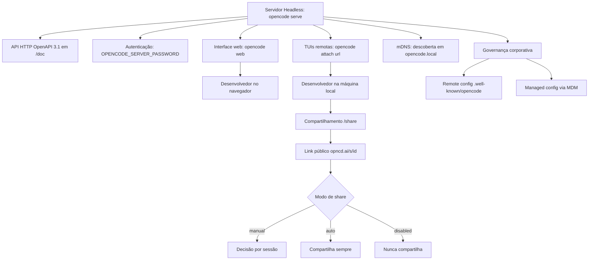

# Capítulo 9: Servidor headless, web e colaboração em equipe

## 1. Introdução

Nos capítulos anteriores, você pilotou a cabine sozinho — TUI, automação, configuração, extensões. Mas o OpenCode foi projetado para ir além do uso individual: a arquitetura cliente-servidor que estudamos no Capítulo 2 tem uma implicação que muda a escala do jogo — o servidor headless pode ser compartilhado, a interface web pode ser aberta no navegador e as sessões podem ser colaborativas. Neste capítulo, você vai montar a infraestrutura de time: o `opencode serve` expondo a API, o `opencode web` abrindo a interface no navegador, o `opencode attach` conectando a TUI a servidores remotos com autenticação, o compartilhamento de sessões e a governança corporativa — do remote config organizacional ao MDM. Ao dominar isso, você leva o OpenCode do seu terminal para a malha aérea da empresa inteira — a Torre de Controle em operação.

## 2. Explica

O modo servidor é a porta de entrada para a colaboração. O comando `opencode serve` inicia o servidor headless — o mesmo motor que roda por baixo da TUI — expondo uma API HTTP com spec OpenAPI 3.1 em `/doc` [1][2]. Os endpoints de sessão, mensagem e evento ficam acessíveis via HTTP, e qualquer cliente — a TUI, o web, um script — pode se conectar a esse servidor [2][3]. A autenticação do servidor é feita por senha: a variável `OPENCODE_SERVER_PASSWORD` habilita basic auth, exigindo que todos os clientes apresentem a senha ao se conectar [2][4]. A interface web, iniciada com `opencode web`, sobe um servidor e abre o OpenCode no navegador — a mesma cabine, em outra superfície [2][5]. E o `opencode attach <url>` conecta uma TUI local a um servidor remoto — o padrão para trabalhar em uma máquina poderosa da empresa a partir da sua máquina local [2][6].

Vale aprofundar o padrão de uso do servidor, porque ele resolve um problema real de infraestrutura de desenvolvimento. Imagine o cenário clássico de empresa: a máquina com o ambiente de build pesado, o banco de dados de staging e as credenciais de teste vive em um servidor da empresa — não no laptop dos devs. Com o OpenCode, esse servidor se torna o ponto central: `opencode serve` roda nele, os desenvolvedores conectam suas TUIs com `opencode attach` e o agente opera onde o ambiente real está [2][6]. A experiência é local — a TUI roda na sua máquina — mas o trabalho acontece no servidor, com acesso ao ambiente completo. Esse padrão, que exigiria um IDE remoto complexo no passado, agora é um comando. E como a API é aberta (OpenAPI 3.1), o time pode construir ferramentas próprias sobre o mesmo servidor: dashboards de sessões, integrações com o sistema de tickets, bots de auditoria [1][3][17].

O compartilhamento de sessões é a camada de colaboração casual. O comando `/share` gera um link público `opncd.ai/s/<share-id>` com a conversa — acessível a qualquer pessoa com o link [7][8]. Os modos de compartilhamento são configuráveis: `manual` (padrão, você decide compartilhar cada sessão), `auto` (compartilha automaticamente) e `disabled` (desliga completamente — recomendado para projetos sensíveis, e a configuração pode ser commitada no repositório) [7][8]. A privacidade é o ponto crítico que a documentação destaca: conversas compartilhadas incluem histórico completo, mensagens e metadados, são públicas a qualquer pessoa com o link e ficam retidas indefinidamente até o `/unshare` [8][9]. A decisão de compartilhar é uma decisão de segurança, não um hábito.

A diferença entre os três modos de compartilhamento vale um parágrafo, porque cada um atende a um cenário de colaboração distinto. O modo `manual` é o padrão e o mais seguro: nada é compartilhado até que você execute `/share` explicitamente — o controle total sobre o que sai da cabine. O modo `auto` é para quem quer zero fricção na colaboração: toda sessão vira um link automaticamente, o que é ótimo para times que revisam trabalho uns dos outros com frequência — e perigoso se o time trabalha com dados sensíveis. O modo `disabled` é o desligamento completo, a escolha para projetos sob NDA, com dados de clientes ou código proprietário — e pode ser commitado no `opencode.json` do repositório, garantindo que ninguém do time compartilhe por engano, mesmo em máquinas pessoais [7][8][9]. O profissional escolhe o modo com base no projeto, não com base no hábito — e revisa a política sempre que o projeto muda de natureza.

A governança corporativa é a camada mais avançada — e a que pouca gente conhece. O remote config permite à organização servir uma configuração padrão em `/.well-known/opencode` no domínio da empresa: defaults como MCP servers da organização desabilitados por padrão, que cada desenvolvedor ativa localmente com `enabled: true` [10][11]. O managed config vai além: instalado em `/Library/Application Support/opencode/` (macOS), `/etc/opencode/` (Linux) ou `%ProgramData%\opencode` (Windows), ele impõe regras que o usuário não pode sobrescrever — e no macOS pode ser distribuído via `.mobileconfig` por ferramentas de MDM como Jamf, Kandji e FleetDM [10][12]. A combinação remote config + managed config cria o modelo de governança completo: defaults convenientes via `.well-known`, regras impositivas via MDM e a liberdade local dentro do envelope [10][12].

O desenho da governança em duas camadas não é acidental — é uma resposta ao problema real de adoção de ferramentas de IA em empresas. Se a organização impõe tudo de cima para baixo, os desenvolvedores sentem a ferramenta como uma camisa de força e procuram desvios; se não impõe nada, cada dev configura do seu jeito e a organização perde visibilidade e controle. O remote config ataca o primeiro problema oferecendo defaults úteis — o caminho de menor resistência já é o caminho correto. O managed config ataca o segundo garantindo um piso de segurança — certas regras simplesmente não podem ser violadas [10][11][12]. A combinação é o desenho maduro: conveniência por padrão, imposição no mínimo necessário e a liberdade profissional dentro do envelope. Empresas que entenderam esse equilíbrio relatam adoção muito mais suave de agentes de codificação, porque a ferramenta respeita o desenvolvedor enquanto protege a organização [12][14].

Há uma dimensão operacional do servidor compartilhado que merece destaque, porque ela muda a forma como o time projeta o ambiente de build: o servidor headless é também a máquina onde o agente opera com o ambiente real [2][6]. No cenário clássico, o desenvolvedor conecta a TUI ao servidor da empresa — e o agente que roda nessa sessão enxerga o ambiente do servidor: o banco de staging, as credenciais de teste, os binários de build, os artefatos de CI [6][14]. A consequência é que a infraestrutura de agentes e a infraestrutura de build convergem: a mesma máquina que compila o software hospeda o agente que o modifica — e isso exige do time a mesma disciplina de ambientes que já existe para o build [2][14]. O servidor de agentes entra no inventário de infraestrutura: monitoramento de disponibilidade, política de atualização, backup do estado das sessões e plano de contingência [2][4]. Quem trata o servidor headless como um serviço — com dono, SLA e runbook — opera a colaboração agêntica com o mesmo rigor de qualquer serviço de produção, e é esse rigor que o checklist de implantação deste capítulo formaliza [2][4][14].

O ecossistema de governança também inclui políticas experimentais — como negar provedores específicos na configuração gerenciada — e a disciplina de auditoria: com o servidor headless, todas as sessões do time podem ser exportadas (Capítulo 6), criando o trilho de rastreabilidade que a conformidade exige [12][13]. Para empresas reguladas, essa capacidade de exportar o histórico completo de interações dos agentes é um diferencial de governança que as ferramentas proprietárias raramente oferecem [13][14]. O mDNS (`--mdns`) adiciona a descoberta de servidores na rede local: com `--mdns`, o servidor anuncia `opencode.local`, e outros devs da mesma rede encontram o servidor sem digitar endereço [2][15].

A fundação dessa camada é a mesma arquitetura que você conheceu no Capítulo 2: o servidor headless com spec OpenAPI 3.1 é o motor único por trás da TUI, do web e do attach — e é essa unidade de arquitetura que torna a governança viável [1][3]. Como a especificação da API é aberta e documentada, a organização pode construir seus próprios clientes e ferramentas de auditoria sobre o mesmo contrato — um nível de extensibilidade que os concorrentes proprietários não oferecem [3][17]. E o protocolo ACP, que vimos no Capítulo 6, completa o quadro: servidores ACP podem expor a mesma operação a ferramentas externas de governança e observabilidade [17][18].

## 3. Ilustra

Pense no servidor headless como a torre de controle de um aeroporto: uma única instalação central que todas as aeronaves (as TUIs dos desenvolvedores) consultam para decolar, navegar e pousar. A torre não é um avião — ela não escreve código — mas sem ela nenhum voo em formação acontece. O `opencode serve` ergue a torre; o `opencode web` abre uma janela panorâmica da torre no navegador; o `opencode attach` conecta cada aeronave à torre, mesmo de longe, com a senha de acesso (`OPENCODE_SERVER_PASSWORD`) como o crachá de autorização [2][4][5][6]. A metáfora captura o essencial: a colaboração não é cada um com sua cabine isolada — é uma malha onde a torre centraliza a operação e cada piloto mantém o controle do próprio voo.



O diagrama mostra as três camadas da Torre de Controle: a infraestrutura de servidor (serve, web, attach, mDNS), o compartilhamento de sessões (share com seus modos) e a governança (remote e managed config). Repare que tudo converge no mesmo servidor headless — a arquitetura cliente-servidor do Capítulo 2, agora em escala de equipe [2][10].

A segunda analogia, para o conceito denso da governança: pense no managed config como as regras de manutenção obrigatória da frota, impostas pelo órgão regulador — não pelos pilotos. O piloto pode escolher a rota (remote config), mas não pode pular a inspeção obrigatória (managed config). A distinção é exatamente a que a governança corporativa precisa: defaults que todos seguem por conveniência (`.well-known/opencode`) e regras que ninguém pode violar (managed config via MDM) [10][12]. Uma empresa que só tem defaults não tem governança — tem sugestões; uma que só tem regras impositivas não tem produtividade — tem burocracia. O equilíbrio é o desenho do sistema.

## 4. Técnica

### A anatomia da API do servidor

Antes do ciclo de vida, vale mapear a anatomia da API que o servidor expõe — porque é ela que sustenta a colaboração e a automação. A spec OpenAPI 3.1 publicada em `/doc` documenta os endpoints de sessão (criar, listar, obter), de mensagem (enviar, listar, obter) e de evento (o stream SSE de progresso) — a mesma espinha dorsal que a TUI usa [1][3]. A API não é uma abstração teórica: cada interação da TUI, do web e do attach é uma chamada a esses endpoints, e a spec aberta permite construir clientes próprios — dashboards, integrações, bots — sobre o mesmo contrato [1][3][17]. Para o operador, a anatomia tem uma consequência prática: o conhecimento dos endpoints é o que permite diagnosticar (ver o que um cliente está fazendo), automatizar (enviar mensagens programaticamente) e integrar (conectar o servidor ao sistema de tickets da empresa) [3][17].

### O ciclo de vida de um servidor compartilhado

Antes dos comandos, vale desenhar o ciclo de vida completo de um servidor compartilhado, porque ele define as decisões de operação. O servidor nasce com `opencode serve` e a senha definida — o primeiro passo é sempre a autenticação, antes de qualquer exposição à rede. O servidor vive consumido por múltiplos clientes: TUIs locais com attach, o web no navegador, scripts de automação consumindo a API [1][2]. O servidor morre com o processo — e é aqui que mora uma lição de operação: um servidor headless não persiste por si só, ele precisa de supervisão de processo (systemd, um serviço do Windows, um contêiner) para sobreviver a quedas e reinicializações [2][4]. E o servidor se renova com o `opencode upgrade`: a atualização deve ser planejada — quem atualiza o servidor atualiza o motor de todos os clientes conectados, e uma atualização mal testada derruba a operação inteira [2][19]. Esse ciclo — nascer autenticado, viver consumido, morrer supervisionado, renovar planejado — é o desenho mental que falta na documentação, e é ele que separa uma demo de uma infraestrutura.

### A infraestrutura de servidor, na prática:

```bash
# Inicia o servidor headless na porta padrão
opencode serve

# Com autenticação por senha (basic auth)
export OPENCODE_SERVER_PASSWORD="senha-forte-do-servidor"
opencode serve

# Com descoberta mDNS na rede local
opencode serve --mdns

# Em uma porta específica
opencode serve --port 4321
```

A spec OpenAPI 3.1 fica exposta em `/doc` — abra no navegador para explorar os endpoints de sessão, mensagem e evento [1][2]. A interface web e a conexão remota:

```bash
# Abre a interface web no navegador
opencode web

# Conecta a TUI local a um servidor remoto (pede a senha)
opencode attach https://servidor-da-empresa:4321

# Com descoberta mDNS, o endereço local é opencode.local
opencode attach http://opencode.local
```

O compartilhamento de sessões e seus modos:

```json
{
  "$schema": "https://opencode.ai/config.json",
  "share": "manual"
}
```

Dentro da TUI, `/share` gera o link público, `/unshare` o revoga [7][8]. Para projetos sensíveis, a configuração `share: "disabled"` pode ser commitada no repositório — garantindo que ninguém do time compartilhe por engano [8][9].

O remote config da organização — defaults servidos pela empresa:

```json
{
  "$schema": "https://opencode.ai/config.json",
  "mcp": {
    "mcp-empresa": {
      "type": "remote",
      "url": "https://mcp.empresa.com/mcp",
      "enabled": false
    }
  }
}
```

Servido em `https://empresa.com/.well-known/opencode`, esse arquivo entrega o default organizacional — o MCP da empresa desabilitado — e cada dev ativa localmente com `enabled: true` [10][11].

A governança com MDM segue os caminhos de instalação por plataforma — e tanto o remote config quanto o managed config seguem o mesmo schema documentado no `opencode.ai/config.json`, o que simplifica a manutenção [10][20]:

```bash
# macOS: /Library/Application Support/opencode/
# Linux: /etc/opencode/
# Windows: %ProgramData%\opencode\

# macOS: distribuição via .mobileconfig (Jamf, Kandji, FleetDM)
# o arquivo managed.json segue o schema do opencode.json,
# mas as regras não podem ser sobrescritas pelo usuário
```

O managed config impõe regras como provedores negados ou permissões obrigatórias — a camada que a organização controla de verdade [10][12][13].

### O modelo de confiança da colaboração

E vale explicitar o modelo de confiança que sustenta a colaboração — porque ele define onde cada proteção é necessária. No centro, o servidor é um ponto de confiança: quem tem a senha controla o acesso, e o `OPENCODE_SERVER_PASSWORD` é a fronteira [2][4]. Nos clientes, a confiança é individual: cada desenvolvedor conecta com suas credenciais e suas permissões — o envelope do Capítulo 7 segue valendo dentro da sessão compartilhada [3][4]. E nos artefatos, a confiança é por exposição: um link de share é público a quem tem o link, uma sessão exportada é tão protegida quanto o arquivo — o modelo de confiança define a política de compartilhamento (manual, auto, disabled) e de arquivamento [7][8][13]. O ponto central: a colaboração não remove as fronteiras individuais — ela adiciona camadas de acesso sobre elas. O desenvolvedor continua com suas permissões dentro da sessão; o que a colaboração adiciona é o servidor como ponto de acesso e o compartilhamento como ponto de exposição [2][4][7]. Entender esse modelo é o que permite desenhar a segurança sem paranoia nem negligência: cada fronteira no lugar certo, cada exposição consciente [4][8].

### Os limites do servidor compartilhado

Vale mapear também os limites do modelo de servidor compartilhado, porque cada limite exige uma decisão de arquitetura. O primeiro é a escala: um servidor único concentra o estado e o custo de todos os clientes — para times grandes, o modelo evolui para múltiplos servidores por time ou por projeto, cada um com seu escopo. O segundo é a segurança: um servidor compartilhado é um ponto único de acesso — a senha protege o perímetro, mas a auditoria de quem fez o quê depende do export disciplinado das sessões [4][13]. O terceiro é a disponibilidade: um servidor headless não persiste por si — a supervisão de processo (systemd, serviço, contêiner) e a estratégia de reinício são infraestrutura, não detalhe [2][4]. O quarto é a evolução: atualizar o servidor atualiza o motor de todos — e uma atualização com quebra derruba a operação inteira, o que exige um processo de rollout testado [2][19]. Cada limite é uma decisão que o profissional documenta, e é essa documentação que transforma a Torre de Controle de um experimento em uma infraestrutura [2][4][13].

### Auditoria e medição da operação

A auditoria completa da operação de equipe:

```bash
# Exporta uma sessão de um dev para o trilho de auditoria
opencode export SESSION_ID

# Mede o consumo da operação toda
opencode stats --project --days 30

# Verifica a configuração mesclada de cada máquina
opencode debug config
```

A combinação export + stats + debug é o ciclo de governança completo: histórico rastreável, custo mensurável e estado verificável — para cada sessão, para cada máquina e para a operação inteira [13][14][2]. O `opencode debug config` merece destaque nesse ciclo, porque ele revela o que cada desenvolvedor está rodando de verdade — a configuração mesclada de todas as camadas, com as credenciais resolvidas — e é o instrumento que transforma a governança de uma política declarada em uma prática verificável: a organização audita o que os devs realmente executam, não o que eles afirmam configurar [2][10][13].

### O checklist de implantação da Torre de Controle

A implantação de um servidor compartilhado segue um checklist que vale memorizar, porque ele condensa as decisões deste capítulo em uma sequência operacional: primeiro, definir a senha (`OPENCODE_SERVER_PASSWORD`) e o escopo de rede (hostname, porta, mDNS); segundo, subir o servidor e validar a API (`/doc`, um endpoint de sessão); terceiro, conectar um cliente de teste — attach e web — e validar a experiência; quarto, servir o remote config (`.well-known/opencode`) e validar a mesclagem em uma máquina de teste; quinto, instalar o managed config (MDM) nas máquinas piloto e validar as regras impositivas; sexto, documentar o ciclo de vida — quem atualiza, quando, e como o rollout acontece [2][4][10][12]. Esse checklist não é burocracia: é a sequência que transforma um comando em uma infraestrutura, e é o mesmo rigor que o Capítulo 3 aplicou à instalação individual, agora em escala de equipe.

### A colaboração assíncrona

Vale uma palavra sobre a colaboração assíncrona, porque ela é o uso menos óbvio — e mais valioso — da arquitetura deste capítulo. O modelo de equipe síncrono é a sala compartilhada: todos conectados ao mesmo servidor, trabalhando ao mesmo tempo. O modelo assíncrono usa os artefatos: um desenvolvedor exporta uma sessão (Capítulo 6), outro a importa e continua de onde o primeiro parou; um dev compartilha uma conversa por link (`/share`) e o colega revisa quando puder; uma sessão de investigação vira um artefato de documentação arquivado no trilho de auditoria [7][8][13]. A colaboração assíncrona é o que permite times distribuídos operarem agentes sem sobreposição de horário, e é também o que transforma o conhecimento do agente em conhecimento da equipe — as sessões exportadas são o trilho de aprendizado contínuo [8][13]. O profissional projeta o fluxo para os dois modelos: o síncrono para o trabalho em tempo real e o assíncrono para a passagem de bastão — e é essa dualidade que faz da Torre de Controle uma infraestrutura completa, não apenas um servidor compartilhado [7][8][13].

### O onboarding de novos desenvolvedores na Torre de Controle

Um teste prático de qualquer infraestrutura de equipe é o onboarding — e a Torre de Controle tem um fluxo de onboarding que vale desenhar porque ele revela se a arquitetura está completa [2][10]. O novo desenvolvedor chega e, no primeiro dia, recebe: a senha ou o método de autenticação do servidor (via cofre de segredos, nunca por mensagem), o endereço do servidor (ou a descoberta por mDNS) e o remote config já servido pela organização no `.well-known/opencode` — os defaults já vêm prontos [2][4][10]. Ele conecta a TUI com `opencode attach`, o managed config impõe as regras mínimas de segurança automaticamente, e o AGENTS.md do repositório — versionado — entrega o contrato do projeto [10][12][16]. Em trinta minutos, o novo dev está operando o agente com o mesmo envelope, as mesmas políticas e o mesmo trilho de auditoria do resto do time — sem configurar nada do zero, sem inventar nada, sem criar uma configuração paralela que a organização nunca vai auditar [10][12][14]. O contraste com o onboarding sem governança é brutal: sem remote config, cada dev novo configura do seu jeito; sem managed config, não há piso de segurança; sem AGENTS.md versionado, o agente trabalha sem contrato [10][12][16]. O onboarding é, portanto, o teste de fogo da Torre de Controle: se ele é rápido e uniforme, a arquitetura está madura; se é lento e divergente, a governança ainda é um documento, não um sistema [2][10][14].

### O desenho de uma política de colaboração

Antes da aplicação, vale consolidar o desenho de uma política de colaboração — o documento operacional que define como o time usa o servidor e o compartilhamento, e que falta na maioria das empresas. A política tem quatro seções. A primeira é o acesso: quem pode conectar ao servidor, com quais credenciais, de quais redes — o desenho do perímetro, com a senha como mínimo e a VPN como camada adicional para redes sensíveis [2][4]. A segunda é o compartilhamento: qual modo de share é o padrão por tipo de projeto — manual para o geral, disabled para o sensível — e quem pode autorizar uma exceção [7][8][9]. A terceira é a governança: quais defaults o remote config serve, quais regras o managed config impõe e como as exceções são aprovadas [10][12]. A quarta é a auditoria: quais sessões são exportadas, com que periodicidade e para onde vão os artefatos — o trilho de rastreabilidade da operação [13][14]. O ponto central do desenho: a política não é um documento para ler, é um sistema para operar — cada seção corresponde a uma camada técnica deste capítulo, e a política só funciona se as camadas estiverem configuradas de verdade [2][10][13].

Vale também uma palavra sobre o servidor como ponto de automação central da equipe, porque a API aberta do Capítulo 2 ganha aqui o seu uso de maior escala: o time constrói ferramentas próprias sobre o mesmo servidor que as TUIs usam [1][3]. O padrão mais comum é a integração com o fluxo de trabalho existente: um script que consulta as sessões ativas via API e publica um resumo no canal do time; um bot que observa os eventos de sessão (o stream SSE) e alerta quando uma automação termina com falha; um dashboard que consome os endpoints de sessão e mostra o uso por desenvolvedor [1][3]. A beleza desse desenho é a ausência de acoplamento: as ferramentas do time usam o mesmo contrato público (a spec OpenAPI 3.1) que qualquer cliente usa, sem depender de extensões privadas — e se o OpenCode mudar, a spec muda junto, mas o contrato continua documentado [1][3]. O cuidado que a política precisa registrar: ferramentas internas sobre a API são código de produção como qualquer outro — versionadas, testadas e auditadas — e não scripts improvisados que ninguém mantém [2][13]. Quando a equipe trata a API do servidor como uma plataforma interna, a Torre de Controle deixa de ser infraestrutura passiva e vira a fundação de automação da equipe inteira [1][3][13].

## 5. Aplica

Cena de contraste. Uma empresa configura um servidor headless compartilhado sem senha — "é só rede interna". Na primeira semana, um desenvolvedor conecta a TUI ao servidor de qualquer lugar, outro usa o web, e tudo parece ótimo. Na segunda semana, alguém percebe que uma sessão com discussão de uma feature não lançada foi compartilhada via `/share` — e o link circulou. O diagnóstico tem duas camadas: o servidor sem `OPENCODE_SERVER_PASSWORD` expôs a API a qualquer um na rede, e o compartilhamento sem política expôs a conversa a qualquer um com o link [4][8]. Duas portas abertas, duas lições.

Agora a prática correta. A mesma empresa configura a senha do servidor, define `share` como `disabled` por padrão no remote config (com exceção local por sessão quando realmente necessário) e instala o managed config via MDM com as regras de provedores e permissões obrigatórias. O export de sessões passa a ser parte do fluxo de auditoria para features sensíveis. A colaboração continua — servidor compartilhado, web, attach — mas dentro do envelope desenhado: autenticada, com política de compartilhamento e com trilho de rastreabilidade [4][8][10][13]. O diagnóstico técnico dessa prática: a colaboração em equipe exige governança em três camadas — autenticação na infraestrutura, política no compartilhamento e regras impositivas na configuração.

As armadilhas práticas, em síntese: primeiro, subir servidor compartilhado sem senha — a API exposta é uma porta aberta para qualquer um da rede [4]; segundo, deixar o `/share` no padrão sem pensar na política — uma conversa com dados sensíveis vira pública com um comando, e o histórico completo vai junto [8][9]; terceiro, ignorar o remote config — a organização que não serve defaults entrega a configuração de cada time ao acaso [10][11]; quarto, achar que MDM é só para macOS — o managed config existe no Linux e no Windows também, e o `.mobileconfig` é apenas o veículo macOS [10][12]; quinto, não auditar — sem export regular das sessões da operação, a conformidade e o diagnóstico de incidentes ficam no escuro [13][14].

Um cenário de escala que fecha a aplicação do capítulo é a empresa que padroniza o servidor como a única via de operação agêntica — porque ele mostra a arquitetura em operação contínua [2][14]. A política da empresa: todo trabalho agêntico acontece em servidores compartilhados por time, nunca em instâncias locais soltas — o que concentra a operação, a medição e a auditoria em pontos controlados [2][13]. Cada time tem o seu servidor (ou o seu namespace no servidor central), com a senha gerenciada pelo cofre, o remote config servindo os defaults da organização e o managed config impondo o piso de segurança [4][10][12]. A medição centralizada — `opencode stats` por projeto — dá à liderança a visão mensal do custo e do uso por time, e o export regular das sessões sensíveis alimenta o trilho de auditoria [13][14]. O que essa padronização compra é previsibilidade: o custo vira orçamento, o uso vira métrica, o risco vira política — e o OpenCode vira uma plataforma corporativa, não um conjunto de ferramentas individuais [2][10][13][14]. O custo dessa centralização é a disciplina operacional que o checklist de implantação deste capítulo descreve — mas é exatamente essa disciplina que separa a empresa que adota agentes da empresa que é adotada por eles [2][14].

No mercado, a adoção corporativa de agentes de codificação está migrando da produtividade individual para a governança de equipe. O relatório DORA mostra que as equipes de alto desempenho tratam a integração de IA como uma decisão de plataforma — com políticas, medição e revisão — não como uma ferramenta individual [14]. Os papers sobre agentes reforçam: a segurança de agentes autônomos em ambientes corporativos exige camadas de governança que vão além do sandbox — exatamente o desenho que este capítulo descreve [16]. E a análise acadêmica do consumo de tokens em coding agents mostra que, em escala de equipe, a medição contínua por projeto e modelo — o `opencode stats` — é o instrumento sem o qual a governança de custo não existe [19]. O OpenCode, com servidor headless, remote config e managed config, é uma das ferramentas mais completas do ecossistema para essa jornada — da cabine individual à torre de controle corporativa [2][10][12][19].

Um cenário de aplicação que fecha o capítulo com a experiência do desenvolvedor — porque a colaboração só funciona se ela for agradável de usar, e o desenho técnico precisa servir à ergonomia [2][6][7]. Considere o desenvolvedor remoto que trabalha de casa: a máquina local é um laptop leve, o ambiente de build pesado vive no servidor da empresa. Com a Torre de Controle, o fluxo dele é: conectar a TUI ao servidor com `opencode attach`, trabalhar exatamente como trabalha localmente — mesma interface, mesmos comandos, mesmas sessões — com o agente operando o ambiente real do servidor [2][6]. Quando ele quer mostrar um trabalho, `/share` gera o link e o colega abre no navegador ou importa a sessão [7]. Quando precisa de ajuda assíncrona, exporta a sessão e o colega continua de onde parou [13]. A experiência percebida é a de um único ambiente contínuo — mas por baixo há a arquitetura inteira deste capítulo: servidor, autenticação, compartilhamento e governança [2][6][13]. A lição de design: a infraestrutura de colaboração bem-feita desaparece da percepção — o desenvolvedor não pensa no servidor, pensa no trabalho — e é exatamente essa transparência que o desenho em camadas deste capítulo entrega [2][6][7].

## 6. Conclusão

Você ergueu a Torre de Controle: o `opencode serve` com API OpenAPI 3.1 e autenticação por senha, o `opencode web` no navegador, o `opencode attach` para conexão remota e o mDNS para descoberta na rede [1][2][4][5][6][15]. Você dominou o compartilhamento de sessões com seus modos e a política de privacidade [7][8][9]. E você desenhou a governança corporativa — remote config via `.well-known/opencode` e managed config via MDM — com o trilho de auditoria do export [10][12][13][14].

Recapitulando os três pontos centrais: primeiro, a infraestrutura de servidor — serve, web, attach, mDNS — transforma o OpenCode de ferramenta individual em plataforma de equipe, com a API aberta como base [1][2][4][6]. Segundo, o compartilhamento de sessões tem modos — manual, auto, disabled — e a política de privacidade é uma decisão de segurança, não um hábito [7][8][9]. Terceiro, a governança corporativa tem duas camadas — remote config para defaults e managed config para regras impositivas — e o trilho de auditoria do export completa o ciclo [10][12][13].

Seu desafio agora: suba um servidor compartilhado de teste com senha, conecte uma TUI via attach e defina a política de colaboração do seu time — acesso, compartilhamento, governança e auditoria. E prepare-se para o voo final: no Capítulo 10, fechamos o livro com o que ninguém te conta — segurança, custo e as armadilhas do ecossistema, revisitando o voo completo do primeiro `/init` à torre corporativa.

A malha aérea da empresa está operacional, e com ela você chegou ao fim da jornada técnica. No Capítulo 10 — o último — vamos fechar o livro com o que ninguém te conta: segurança de verdade, economia de tokens e as armadilhas do ecossistema. O voo completo, do primeiro `/init` à torre corporativa, revisado com o olhar do profissional que cobra pelo que faz.

## 7. Referências Bibliográficas

[1] OPENCODE. *Server — Interact with opencode server over HTTP*. Disponível em: https://opencode.ai/docs/server. Acesso em: 03 ago. 2026.

[2] OPENCODE. *CLI — OpenCode CLI options and commands*. Disponível em: https://opencode.ai/docs/cli. Acesso em: 03 ago. 2026.

[3] OPENCODE. *Server — endpoints de sessão e mensagem*. Disponível em: https://opencode.ai/docs/server. Acesso em: 03 ago. 2026.

[4] OPENCODE. *Server — autenticação com senha*. Disponível em: https://opencode.ai/docs/server. Acesso em: 03 ago. 2026.

[5] OPENCODE. *CLI reference — opencode web*. Disponível em: https://opencode.ai/docs/cli. Acesso em: 03 ago. 2026.

[6] OPENCODE. *CLI reference — opencode attach*. Disponível em: https://opencode.ai/docs/cli. Acesso em: 03 ago. 2026.

[7] OPENCODE. *Share — Share your OpenCode conversations*. Disponível em: https://opencode.ai/docs/share. Acesso em: 03 ago. 2026.

[8] OPENCODE. *Share — modos manual, auto e disabled*. Disponível em: https://opencode.ai/docs/share. Acesso em: 03 ago. 2026.

[9] OPENCODE. *Share — privacidade e retenção*. Disponível em: https://opencode.ai/docs/share. Acesso em: 03 ago. 2026.

[10] OPENCODE. *Config — precedência remota e managed settings*. Disponível em: https://opencode.ai/docs/config. Acesso em: 03 ago. 2026.

[11] OPENCODE. *Config — remote config .well-known/opencode*. Disponível em: https://opencode.ai/docs/config. Acesso em: 03 ago. 2026.

[12] OPENCODE. *Config — managed config e MDM*. Disponível em: https://opencode.ai/docs/config. Acesso em: 03 ago. 2026.

[13] OPENCODE. *Sessions — export session data*. Disponível em: https://opencode.ai/docs/sessions. Acesso em: 03 ago. 2026.

[14] GOOGLE. *Relatório DORA 2025 — State of DevOps*. Disponível em: https://dora.dev. Acesso em: 03 ago. 2026.

[15] OPENCODE. *CLI reference — --mdns e --mdns-domain*. Disponível em: https://opencode.ai/docs/cli. Acesso em: 03 ago. 2026.

[16] SIDIK, Bronislav; ROKACH, Lior. *Beyond Static Sandboxing: Learned Capability Governance for Autonomous AI Agents*. In: NeurIPS Agent Safety Workshop, 2026. Disponível em: https://arxiv.org/abs/2604.11839. Acesso em: 03 ago. 2026.

[17] OPENCODE. *CLI reference — ACP (Agent Client Protocol)*. Disponível em: https://opencode.ai/docs/cli. Acesso em: 03 ago. 2026.

[18] OPENCODE. *Intro — Get started with OpenCode*. Disponível em: https://opencode.ai/docs. Acesso em: 03 ago. 2026.

[19] BAI, Longju; HUANG, Zhemin; WANG, Xingyao; SUN, Jiao; MIHALCEA, Rada; BRYNJOLFSSON, Erik; PENTLAND, Alex; PEI, Jiaxin. *How Do AI Agents Spend Your Money? Analyzing and Predicting Token Consumption in Agentic Coding Tasks*. arXiv, 2026. Disponível em: https://arxiv.org/abs/2604.22750. Acesso em: 03 ago. 2026.

[20] OPENCODE. *Config schema — opencode.ai/config.json*. Disponível em: https://opencode.ai/config.json. Acesso em: 03 ago. 2026.
