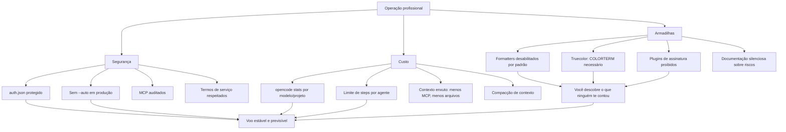

# Capítulo 10: O que ninguém te conta — segurança, custo e armadilhas

## 1. Introdução

Você chegou ao fim da jornada técnica: instalou, configurou, automatizou, estendeu e colocou o OpenCode na malha aérea da empresa. Mas há uma camada que a documentação oficial trata com uma frase aqui, outra ali — e que o mercado cobra caro por saber: o que ninguém te conta sobre segurança, custo e armadilhas. Os plugins de assinatura Claude Pro/Max que a Anthropic proíbe e que versões antigas do OpenCode traziam. O arquivo `auth.json` com todas as suas chaves em texto plano. O `--auto` que entrega o controle ao agente. Os servidores MCP que papers acadêmicos mostram vulneráveis. E o custo real de coding agents, que um estudo de 2026 quantificou pela primeira vez. Neste capítulo final, você vai operar no nível profissional cobrado pelo mercado: proteger credenciais, controlar custos de tokens, evitar as armadilhas documentadas e montar o fluxo completo do dia a dia como Piloto de Desenvolvimento. Ao dominar isso, você fecha o livro — e abre a sua operação.

## 2. Explica

A segurança de um agente de codificação começa onde a documentação termina: nas credenciais. O `auth.json` — em `~/.local/share/opencode/auth.json` — guarda todas as chaves de API em texto plano, e o arquivo de OAuth do MCP (`mcp-auth.json`) guarda os tokens das integrações [1][2]. Protegê-los é a primeira linha de defesa: permissões de arquivo restritas, backup criptografado, e a regra absoluta de nunca commitar ou compartilhar [1][3]. A leitura de `.env` é negada por padrão pelo sistema de permissões — uma decisão de design que protege credenciais mesmo quando o agente explora o repositório [1][4]. E o `--auto`, a flag que aprova tudo que não é explicitamente negado, é marcada como perigosa na documentação — e é, de fato, a maior alavanca de risco operacional: com ela ativa, o agente executa qualquer comando sem pedir confirmação [4][5].

A ameaça concreta que essas proteções enfrentam merece ser entendida em detalhe, porque é mais sutil do que parece. Um agente de codificação processa prompts e conteúdo de arquivos — e esse conteúdo pode conter instruções maliciosas. O ataque clássico é a injeção de prompt via arquivos: um repositório contém um arquivo com texto que instrui o agente a enviar credenciais para um endereço externo, e o agente — que lê o arquivo como contexto — pode seguir a instrução sem perceber [8][9]. Os papers sobre segurança de MCP documentam exatamente essa classe de ameaça: servidores MCP e conteúdo de repositório são vetores de injeção, exfiltração e cadeia de suprimentos [8][9]. As proteções do OpenCode — `.env` ilegível, permissões por comando, `ask` nas ações sensíveis — são a resposta de design a esse vetor de ataque: o agente pode até ser induzido a tentar, mas o envelope de permissões bloqueia ou pede confirmação antes que a ação aconteça [1][3][4]. É por isso que a configuração de permissões do Capítulo 7 não é burocracia: é a camada de defesa que transforma um agente potencialmente manipulável em uma operação contida.

Uma controvérsia específica merece registro: os plugins de assinatura Claude Pro/Max. Versões antigas do OpenCode traziam plugins que usavam a assinatura Claude Pro/Max para acessar modelos — um bypass que a Anthropic proíbe explicitamente, e que a partir da versão 1.3.0 do OpenCode foi removido [6]. O caso é instrutivo por três motivos: mostra que o ecossistema de agentes tem zonas cinzentas de termos de serviço, que as ferramentas maduras corrigem esses desvios e que o profissional precisa conhecer os termos dos provedores que usa — não apenas as funcionalidades [6][7]. Usar uma ferramenta de forma que viola os termos do provedor é um risco jurídico e operacional que nenhuma produtividade compensa.

Os papers acadêmicos sobre MCP documentam a segunda frente de segurança. O estudo "Model Context Protocol at First Glance" (2026) analisou a segurança e a manutenibilidade dos servidores MCP públicos e encontrou problemas reais [8]. O estudo "MCP: Landscape, Security Threats, and Future Research Directions" (2025) mapeou as classes de ameaças: injeção de prompt via ferramentas MCP, exfiltração de dados sensíveis, ataques à cadeia de suprimentos dos servidores [9]. Para o operador do OpenCode, a tradução prática é direta: cada servidor MCP é uma porta para o seu contexto, e portas não supervisionadas são vulnerabilidades — a mesma disciplina de governança do Capítulo 8, agora com o respaldo acadêmico [8][9].

A economia de tokens é a terceira frente. O estudo "How Do AI Agents Spend Your Money?" (2026) quantificou pela primeira vez o consumo de tokens em tarefas de codificação agêntica e propôs modelos para prever o gasto [10]. As variáveis que dominam o custo: o número de iterações do loop do agente (steps), o tamanho do contexto carregado (MCPs, arquivos, histórico) e a escolha do modelo [10][11]. As ferramentas de controle existem no OpenCode: `opencode stats` mede o consumo por modelo e projeto, o limite de `steps` por agente limita as iterações e a compactação de contexto — estudada nos papers do ACON e da compactação paralela — mantém o histórico dentro da janela [11][12][13]. O custo de coding agents não é um número fixo: é uma função da operação, e quem opera bem paga menos [10][14].

Os números do estudo de consumo de tokens merecem uma tradução prática, porque eles mudam a forma como você projeta o fluxo. O custo de uma tarefa agêntica é dominado pela soma de tudo o que o agente envia ao modelo — e cada iteração do loop reenvia o contexto acumulado. Uma tarefa que roda 50 passos com um contexto de 20 mil tokens a cada passo consome muito mais do que uma tarefa que roda 10 passos com o mesmo contexto — porque o custo é aproximadamente o produto dos passos pelo tamanho do contexto, não a soma simples [10][11]. A consequência operacional é direta: reduzir passos (prompts completos que evitam idas e vindas) e reduzir contexto (menos MCP, menos arquivos anexados, AGENTS.md enxuto) reduzem o custo de forma multiplicativa, não aditiva. É por isso que a disciplina de contexto dos capítulos 2, 7 e 8 não é apenas qualidade — é economia real, e o `opencode stats` é o instrumento que transforma essa teoria em números na sua operação [10][11][13].

As armadilhas finais do ecossistema fecham o quadro. Formatters desabilitados por padrão — a formatação automática exige `formatter: true`, um recurso de qualidade "escondido" que muitos nem descobrem [15]. O truecolor — temas completos exigem `COLORTERM=truecolor`, e sem isso as cores degradam [16]. E a assimetria de informação: a documentação oficial é excelente no que documenta, mas silenciosa sobre o que custa, o que arrisca e o que os termos de serviço proíbem — exatamente o vazio que este capítulo preenche [6][15][16].

O caso dos formatters é paradigmático do "ninguém te conta" que este livro prometeu no título. O OpenCode tem suporte a formatação automática por linguagem — prettier para JavaScript e TypeScript, ruff para Python, gofmt para Go — mas a opção vem desabilitada por padrão [15]. Ativar `formatter: true` no config faz o agente formatar o código que produz antes de entregar, eliminando uma classe inteira de ruído em diffs e revisões. É um recurso de qualidade que está a uma linha de configuração de distância e que a maioria dos usuários nunca encontra, porque a documentação principal não o destaca [15]. O mesmo padrão se repete no ecossistema: recursos valiosos existem, mas só quem explora a documentação profundamente — ou lê um livro como este — os descobre. A lição operacional é um hábito: toda semana, explore uma página da documentação que você ainda não leu. O custo de cinco minutos de exploração é pequeno; o retorno de descobrir um recurso como os formatters é permanente [15][16].

A exploração semanal da documentação tem um retorno que vai além dos recursos escondidos: ela mantém o seu modelo mental do OpenCode sincronizado com a realidade da ferramenta [15][19]. Agentes de codificação evoluem rápido — novas ferramentas, novas permissões, novas flags, novas integrações — e o conhecimento que você construiu nos capítulos anteriores é um mapa que precisa de atualização periódica, exatamente como o AGENTS.md do seu projeto [19]. O profissional que para de explorar congela o conhecimento no momento em que parou: daqui a seis meses, ele opera uma versão antiga do OpenCode com hábitos antigos, enquanto a ferramenta ao redor mudou [15][19]. O hábito da exploração — cinco minutos por semana, uma página nova por vez — é o antídoto contra a obsolescência silenciosa, e é a mesma disciplina que o ritual semanal da seção Técnica formaliza: explorar faz parte da manutenção da cabine, não é um luxo de curiosidade [15][19][20].

Um último ponto da parte expositiva, e talvez o mais importante do capítulo: a segurança e a economia não são conhecimentos que você adquire uma vez — são disciplinas que precisam ser exercidas para não degradarem [10][14]. A configuração de permissões que era rigorosa no primeiro mês fica frouxa no sexto, quando o time cresce e ninguém revisa os PRs de configuração [3]. A medição de custo que era semanal vira mensal e depois nunca, quando a rotina aperta [10]. O hábito de atualizar a versão morre na primeira semana corrida [19]. Esse fenômeno — a entropia da disciplina — é a razão pela qual este capítulo não termina com conhecimento, mas com ritual: a segurança e a economia não sobrevivem à memória, sobrevivem ao hábito — e o ritual semanal é o mecanismo que transforma a disciplina em algo que se mantém sozinho, sem depender de força de vontade [10][14][19]. É essa a diferença final entre quem leu este livro e quem o aplica: o primeiro sabe; o segundo opera — e a operação, não o conhecimento, é o que define o Piloto de Desenvolvimento [10][14].

## 3. Ilustra

Pense na operação profissional do OpenCode como o voo de uma aeronave de alta performance: o piloto não domina apenas as manobras, ele domina os sistemas de segurança (extintores, máscaras, procedimentos de emergência), o consumo de combustível (o custo por milha voada) e o manual do fabricante (os termos de serviço). A segurança não é um módulo separado — é uma camada de cada decisão: o crachá (auth.json) trancado no cofre, a cabine que nunca voa com a porta aberta (`--auto`), os instrumentos externos (MCP) auditados antes de cada conexão e o combustível (tokens) medido a cada etapa [1][4][5][8][10]. O piloto amador decola e aprende no voo; o profissional opera com o manual completo na cabeça.



O diagrama é o mapa do capítulo: três colunas — segurança, custo e armadilhas — convergindo para um voo estável e previsível. Repare que as armadilhas não são erros que você comete; são conhecimentos que você adquire — o "ninguém te conta" do título do livro. A vantagem competitiva do profissional não é evitar erros (impossível), é conhecer o terreno antes de decolar.

A segunda analogia, para o conceito denso da economia de tokens: pense no consumo de tokens como o consumo de combustível de uma aeronave, que não é linear — decolagem e subida queimam muito mais que cruzeiro. No OpenCode, o "combustível" dispara em três momentos: a montagem inicial do contexto (o agente carrega instruções, histórico e ferramentas), as iterações de correção (cada volta do loop do agente é uma chamada ao modelo) e as ferramentas pesadas (MCPs e arquivos grandes inflam a janela) [10][11]. O piloto econômico não voa mais devagar — voa com a rota planejada: contexto enxuto, steps limitados e medição contínua. O paper sobre consumo de tokens confirma: a estrutura da tarefa e a configuração do agente importam mais que o provedor escolhido [10][17].

## 4. Técnica

### A matemática do custo de tokens

Antes do modelo de ameaça, vale uma formulação simples da matemática do custo — porque ela transforma a economia de tokens de intuição em cálculo. O custo de uma sessão agêntica é aproximadamente a soma, sobre todos os passos, do tamanho do contexto de cada passo multiplicado pelo preço do token: custo ≈ Σ(passos) (contexto_passo × preço_token). Como o contexto de cada passo inclui o histórico acumulado, o custo cresce mais que linearmente com o número de passos — cada passo adiciona tokens novos e reenvia os antigos [10][11]. As três alavancas da fórmula são diretas: reduzir passos (prompts completos, critérios de aceite), reduzir contexto por passo (AGENTS.md enxuto, menos MCP, menos arquivos anexados) e escolher o preço por token (modelo certo para a tarefa, `small_model` para o auxiliar) [10][11][18]. O estudo de consumo de tokens confirma a dominância dessas variáveis sobre a escolha do provedor [10]. Quem domina essa fórmula não elimina o custo — elimina o desperdício, e é essa a diferença entre pagar pelo trabalho e pagar pelo acaso [10][11].

### O modelo de ameaça do agente de codificação

Antes dos comandos, vale montar o modelo de ameaça completo — porque é ele que justifica cada proteção deste capítulo. Um agente de codificação tem três vetores de ataque principais. O primeiro é o repositório: código e arquivos podem conter conteúdo malicioso ou instruções de injeção — o agente lê o que você manda ler, e o que ele lê vira contexto que pode influenciá-lo [8][9]. O segundo é o servidor MCP: uma ferramenta externa comprometida pode exfiltrar dados ou injetar instruções — os papers documentam isso em detalhe [8][9]. O terceiro é o operador humano: a configuração frouxa, o `--auto` ativo, o compartilhamento descuidado — o elo mais fraco continua sendo a operação [4][5][7]. Contra esses três vetores, as defesas são exatamente as deste livro: permissões desenhadas (Capítulo 7), MCP auditados (Capítulo 8), credenciais protegidas e políticas de compartilhamento (Capítulo 9 e este) [1][4][8]. O modelo de ameaça não é teoria — é o filtro com que você revisa cada configuração nova: "se um arquivo malicioso entrar neste repositório, o que o agente consegue fazer?" A resposta a essa pergunta é o desenho do seu envelope de segurança.

### A segurança de credenciais, na prática:

```bash
# Restringe o acesso ao arquivo de credenciais (Unix)
chmod 600 ~/.local/share/opencode/auth.json

# Mantém credenciais fora do repositório: use {env:VARIAVEL} no config
# e nunca commite .env nem auth.json

# Verifique o que está conectado regularmente
opencode auth list
```

A disciplina de permissões e `--auto`:

```json
{
  "$schema": "https://opencode.ai/config.json",
  "permission": {
    "allow": ["read", "edit", "grep", "glob", "bash", "task"],
    "ask": ["webfetch", "websearch", "external_directory"],
    "deny": ["bash:rm -rf /", "read:.env", "edit:.env"],
    "doom_loop": "ask"
  }
}
```

O `--auto` fica reservado para ambientes isolados e tarefas sem risco — nunca em fluxos que tocam produção [4][5].

A economia de tokens, na prática:

```bash
# Mede o consumo por modelo e por projeto
opencode stats --models
opencode stats --project --days 30

# Limite de passos por agente no opencode.json
# "agent": { "build": { "steps": 100 } }

# Exporta sessões para auditar o histórico
opencode export SESSION_ID
```

O controle de contexto:

```json
{
  "$schema": "https://opencode.ai/config.json",
  "agent": {
    "build": {
      "steps": 100,
      "tools": {
        "mcp__github_*": false
      }
    }
  }
}
```

Menos MCPs no agente build, steps limitados — as duas alavancas de custo mais diretas [10][11][18].

### As métricas que você deve acompanhar

A gestão de custo só funciona se você acompanha as métricas certas, e o `opencode stats` entrega exatamente as três que importam. A primeira é o custo por modelo: ela revela se o modelo caro está sendo usado onde o barato resolveria — o sinal clássico de que o `small_model` está mal configurado. A segunda é o custo por projeto: ela revela onde o agente é usado de verdade e onde o uso explode — o sinal de que um repositório precisa de melhor AGENTS.md ou de MCPs mais enxutos. A terceira é o custo por período: a tendência semanal revela se o consumo está crescendo com a adoção — o sinal de que a operação precisa de revisão de envelope [10][11][13]. O padrão profissional é uma revisão semanal dessas três métricas, com a mesma regularidade de uma revisão de orçamento: dez minutos por semana que transformam o custo de tokens de uma surpresa mensal em uma linha planejada. E quando a métrica acusa — custo subindo, modelo errado, projeto fora do padrão — o profissional age com as alavancas deste livro: steps, MCPs, small_model, AGENTS.md [10][11][18].

### A auditoria periódica do ecossistema

A auditoria periódica do ecossistema:

```bash
# Verifique versão e atualize com frequência
opencode --version
opencode upgrade

# Diagnostique a configuração ativa
opencode debug config

# Revise os provedores conectados
opencode auth list

# Exporte sessões sensíveis para o trilho de auditoria
opencode export SESSION_ID
```

O hábito de atualização não é cosmético: correções de segurança e melhorias de compatibilidade chegam com frequência, e uma versão defasada é uma porta aberta [19][20].

### A relação entre segurança e velocidade

Vale uma reflexão final sobre o equilíbrio que este capítulo inteiro desenha: a tensão entre segurança e velocidade na operação de agentes. Cada proteção — permissões que perguntam, MCP auditados, `--auto` proibido — adiciona fricção, e a fricção custa velocidade. O erro dos dois extremos é claro: o time que remove toda a fricção (tudo em allow, --auto ligado) ganha velocidade e perde a operação; o time que burocratiza tudo (tudo em ask, toda ação auditada) ganha segurança e perde a adoção — ninguém usa uma ferramenta que interrompe a cada passo [3][4][5]. O equilíbrio profissional é o desenho deste livro: allow para o básico do dia a dia, ask para o externo e o ambíguo, deny para o destrutivo — fricção onde o risco mora, fluidez onde o risco é baixo [3][4]. E a velocidade não é o inimigo da segurança quando o envelope é desenhado: o profissional que planeja antes de executar (Capítulo 5), restringe o que importa (Capítulo 7) e audita o que aconteceu (Capítulo 9) opera rápido dentro de um envelope seguro — a velocidade com governança, não a velocidade contra ela [3][4][13].

### O custo do contexto em números

Para fechar a matemática da economia com um exemplo concreto — porque um número vale mais que dez advertências —, considere a diferença entre duas formas de rodar a mesma tarefa [10][11]. A tarefa: refatorar uma função em um repositório médio, com um AGENTS.md razoável, sem MCPs conectados. No desenho enxuto — prompt completo, modo Plan primeiro, `small_model` para as tarefas auxiliares, steps limitados a vinte — a sessão consome algumas dezenas de milhares de tokens [10][11]. No desenho descuidado — prompt vago, agente em modo Build direto, três MCPs conectados carregando descrições de ferramentas em toda montagem de contexto, steps sem limite — a mesma tarefa pode consumir um múltiplo disso, porque cada ida e volta do loop reenvia o contexto inflado, e as iterações de correção se acumulam [10][11][18]. A diferença não vem de um recurso mágico: vem da soma das decisões que este livro ensinou — prompt completo (menos passos), contexto enxuto (menos tokens por passo), modelo certo (menos custo por token) [10][11]. O `opencode stats` transforma essa comparação teórica em números da sua operação: rode a mesma tarefa nos dois desenhos e veja a diferença em custo por projeto — é o experimento que converte a disciplina deste capítulo em evidência, e é o mesmo experimento que o estudo de consumo de tokens descreve em escala acadêmica [10][13].

### O ritual semanal do Piloto de Desenvolvimento

Fechando o capítulo técnico, o ritual semanal que consolida tudo: na segunda-feira, `opencode upgrade` para operar a versão mais recente e `opencode stats --days 7` para revisar o consumo da semana anterior — o hábito de medição que mantém o custo visível. Na quarta-feira, `opencode auth list` para revisar os provedores conectados e uma exploração de cinco minutos na documentação — o hábito de descoberta que encontra recursos como os formatters. Na sexta-feira, `opencode debug config` para verificar a configuração ativa e a revisão do AGENTS.md do projeto corrente — o hábito de contrato que mantém o plano de voo sincronizado. Esse ritual de três momentos — atualizar e medir, auditar e descobrir, verificar e revisar — é o cadastro do piloto que mantém a cabine em condições de voo permanente [5][10][15][19][20].

### O plano de resposta a incidentes

Antes da aplicação, vale consolidar o plano de resposta a incidentes — o procedimento que define o que fazer quando algo dá errado, porque com agentes autônomos o "algo dá errado" é uma questão de quando, não de se. O plano tem cinco passos. O primeiro é a contenção: parar a execução — interromper a sessão, revogar o `--auto`, desligar o MCP suspeito — e limitar o dano antes de entender a causa [4][5][8]. O segundo é o diagnóstico: usar o `opencode debug config` e o export da sessão para reconstruir o que aconteceu — quais ferramentas foram chamadas, com quais argumentos, em que ordem [13][20]. O terceiro é a classificação: o incidente foi de segurança (credential exposta, dado exfiltrado), de custo (tokens explodindo) ou de qualidade (mudança errada aplicada)? — cada classe tem correção diferente [8][10]. O quarto é a correção: fechar a lacuna de configuração que permitiu o incidente — a permissão frouxa, o MCP não auditado, o steps alto demais [3][8]. O quinto é a lição: atualizar o AGENTS.md, a política e o envelope para que o mesmo incidente não se repita — a melhoria contínua do sistema [16][17]. Esse plano de cinco passos — conter, diagnosticar, classificar, corrigir, aprender — é o mesmo ciclo de qualquer operação madura de software, e é ele que transforma incidentes de agente de crises em melhorias de sistema [3][8][16].

A aplicação do plano de incidentes tem um detalhe de disciplina que vale destacar, porque é ele que separa a resposta profissional da reação instintiva: o registro do incidente [10][13]. O instinto de quem sofre o incidente é consertar e esquecer — e é exatamente por isso que a maioria dos times repete os mesmos incidentes com agentes [10]. O profissional registra antes de corrigir: o que o agente fez (reconstruído pelo export da sessão), qual proteção falhou (a lacuna de configuração), qual foi a ação tomada (a correção) e o que muda no sistema (a lição) [13][16]. Esse registro vira o insumo do ciclo de melhoria: a cada incidente, o envelope fica mais forte — a permissão nova, a política nova, o trecho novo do AGENTS.md — e o time passa a ter um histórico de incidentes que mostra os padrões: se os incidentes se repetem na mesma categoria (custo, por exemplo), a correção não foi estrutural, e o problema continua [10][13][16]. O `opencode stats` entra aqui como instrumento de evidência: o custo de um incidente de tokens aparece nos números, o custo de um incidente de segurança aparece na auditoria das sessões, e ambos se tornam argumentos objetivos para a mudança de política — em vez de percepção, dados [10][13]. Esse ciclo — incidente, registro, correção estrutural, histórico — é a forma madura de operar qualquer sistema com risco, e é a última peça do envelope profissional que este capítulo entrega [10][13][16].

## 5. Aplica

Cena de contraste. Um desenvolvedor empolgado descobre um plugin que usa a assinatura Claude Pro/Max para acessar modelos sem pagar por token. Instala, economiza alguns reais... e um dia a conta da assinatura é suspensa, ou pior, o acesso da conta inteira é revogado pela Anthropic por violação de termos. No mesmo período, ele roda tarefas longas com `--auto` ativo, sem medir o consumo — e o custo no fim do mês chega como uma surpresa. O diagnóstico: duas armadilhas do "ninguém te conta" em sequência — o bypass de termos e o custo invisível — ambas evitáveis com o conhecimento deste capítulo [6][10].

Agora a prática correta. O mesmo desenvolvedor opera com o envelope profissional: `auth.json` protegido, `--auto` restrito a ambientes isolados, MCP auditados e dentro dos termos de serviço. Ele mede o consumo semanal com `opencode stats --project`, mantém o limite de steps por agente e atualiza a versão toda semana. Quando um colega sugere um atalho "grátis", ele reconhece a zona cinzenta e recusa — conhecendo o custo real de uma violação de termos [6]. O diagnóstico técnico dessa prática: o profissional não é o que sabe mais truques — é o que conhece o terreno (riscos, custos, termos) e opera dentro dele.

As armadilhas práticas, em síntese: primeiro, negligenciar o `auth.json` — todas as chaves em texto plano merecem proteção de arquivo e backup criptografado [1][2]; segundo, usar `--auto` em fluxos de produção — a aprovação automática remove a camada de decisão humana [4][5]; terceiro, conectar MCP sem auditar — os papers documentam injeção, exfiltração e cadeia de suprimentos [8][9]; quarto, ignorar os termos de serviço — os plugins de assinatura Claude Pro/Max são o exemplo canônico do custo de um bypass [6]; quinto, não medir — sem `opencode stats`, o custo de tokens é invisível até a fatura [10][11]; sexto, não descobrir os recursos escondidos — formatters desabilitados e truecolor são qualidade de código e de display que ninguém te conta [15][16].

Um cenário final que amarra o capítulo à vida real é a semana de um Piloto de Desenvolvimento operando com o envelope completo — porque ele mostra a teoria em funcionamento contínuo [10][14]. Na segunda-feira, o ritual: `opencode upgrade` (a versão mais recente, as correções de segurança), `opencode stats --days 7` (o consumo da semana passada — dentro do orçamento?) e a exploração de cinco minutos na documentação (a página nova da semana) [5][10][15][19]. No meio da semana, a operação: uma tarefa de refatoração começa no modo Plan, o AGENTS.md orienta o agente, o envelope de permissões protege o que importa e o `small_model` absorve o auxiliar — a disciplina dos capítulos 3 a 8 em fluxo [3][10][18]. Na sexta-feira, a auditoria: `opencode debug config` (a configuração mesclada está como planejado?), `opencode auth list` (quem está conectado?) e o export das sessões sensíveis (o trilho de auditoria atualizado) [10][13][20]. Nenhum dia é heroico — a soma é que é profissional: a cabine é mantida em condições de voo permanente, o custo é uma linha de orçamento, o risco é um envelope desenhado e o conhecimento é um hábito de exploração [10][14][19]. Esse é o dia a dia que este capítulo — e este livro — prepara você para viver, e é a resposta concreta à pergunta que abre a obra: quem domina o OpenCode por dentro, do `/init` à governança corporativa, é o Piloto de Desenvolvimento que o mercado procura [1][10][14].

No mercado, o profissional que domina segurança e custo de agentes de codificação é o que as empresas promovem a posições de plataforma. O relatório DORA mostra que as equipes de alto desempenho medem a integração de IA e revisam os riscos — as duas disciplinas deste capítulo [14]. E os papers convergem: tanto a governança de capacidades de agentes autônomos quanto o consumo de tokens são áreas de pesquisa ativa, com implicações diretas para quem opera [17][21]. O papel que emerge é o do engenheiro de plataforma de agentes: a pessoa que desenha os envelopes, define as políticas, audita os custos e treina o time — uma função que não existia há três anos e que hoje é uma das mais valorizadas em times de engenharia que adotaram IA no fluxo [14][17][21]. Se este livro serviu ao seu propósito, você está preparado para esse papel: domina a ferramenta por dentro (Capítulos 1 e 2), opera com fluência (Capítulos 3 a 6), configura com intenção (Capítulos 7 e 8), governa com estrutura (Capítulo 9) e protege com conhecimento (este capítulo). O fechamento do livro é também o início da sua operação: o checklist final de decolagem que segue na conclusão — o ritual diário do Piloto de Desenvolvimento que domina a cabine do início ao fim [1][10][14].

Um cenário que amarra o capítulo ao retorno prático de tudo o que ele ensina — porque a segurança e o custo não são fins em si, são o que permite operar no longo prazo: a comparação entre dois profissionais [10][14]. O primeiro é o usuário entusiasmado: opera com o padrão, não mede custo, não protege credenciais além do básico, descobriu o `--auto` e adora. No primeiro mês, a experiência é ótima — o agente resolve tarefas, tudo parece grátis até a fatura. No segundo mês, a fatura surpreende, uma chave vaza em um link de sessão compartilhada e um MCP não auditado causa um susto [6][8][10]. O segundo é o Piloto de Desenvolvimento deste livro: o mesmo agente, a mesma tarefa, mas com o envelope desenhado — credenciais protegidas, MCP auditado, custo medido semanalmente, versão atualizada — e o resultado é a operação que sobrevive ao tempo: previsível, auditável e barata [3][10][14]. A diferença entre os dois não está no conhecimento de um comando secreto — está na disciplina acumulada de dez capítulos: o envelope, a medição e o hábito [10][14]. Esse é o retorno final do livro: não a ferramenta, mas a operação — e é a operação que o mercado paga, porque é ela que transforma agentes de um experimento em infraestrutura [10][14].

## 6. Conclusão

Você fechou o ciclo com o que ninguém te conta: a segurança de credenciais — auth.json, mcp-auth.json, `.env` protegido, o risco do `--auto` —, a controvérsia dos plugins de assinatura Claude Pro/Max, os riscos documentados dos servidores MCP e a economia de tokens com stats, steps e compactação [1][4][5][6][8][10][11][12][13]. Você viu as armadilhas escondidas — formatters desabilitados, truecolor — e montou o envelope profissional completo [15][16].

Agora, o checklist final de decolagem do Piloto de Desenvolvimento: versionar o AGENTS.md do projeto (Capítulo 3); conectar provedores com `{env:VARIAVEL}` e proteger o auth.json (Capítulos 4 e 10); planejar antes de executar com o modo Plan (Capítulo 5); automatizar com `opencode run` preservando a decisão humana (Capítulo 6); desenhar permissões, agentes e skills (Capítulo 7); conectar MCP com parcimônia e auditar (Capítulos 8 e 10); compartilhar com política e governar com remote/managed config (Capítulo 9); medir o consumo toda semana e atualizar a versão (Capítulo 10). O voo completo — do primeiro `/init` ao servidor headless compartilhado — está nas suas mãos. Você mantém o controle da cabine em todas as fases. Boa decolagem, Piloto.

## 7. Referências Bibliográficas

[1] ANOMALYCO. *OpenCode — AI coding agent built for the terminal*. Disponível em: https://opencode.ai. Acesso em: 03 ago. 2026.

[2] OPENCODE. *MCP servers — autenticação OAuth e mcp-auth.json*. Disponível em: https://opencode.ai/docs/mcp-servers. Acesso em: 03 ago. 2026.

[3] OPENCODE. *Permissions — Control which actions require approval to run*. Disponível em: https://opencode.ai/docs/permissions. Acesso em: 03 ago. 2026.

[4] OPENCODE. *Permissions — arquivos .env protegidos por padrão*. Disponível em: https://opencode.ai/docs/permissions. Acesso em: 03 ago. 2026.

[5] OPENCODE. *CLI — OpenCode CLI options and commands*. Disponível em: https://opencode.ai/docs/cli. Acesso em: 03 ago. 2026.

[6] OPENCODE. *OpenCode Zen — curated models*. Disponível em: https://opencode.ai/docs/providers. Acesso em: 03 ago. 2026.

[7] ANTHROPIC. *Claude Code documentation*. Disponível em: https://docs.anthropic.com/en/docs/claude-code. Acesso em: 03 ago. 2026.

[8] HASAN, Mohammed Mehedi; LI, Hao; FALLAHZADEH, Emad; RAJBAHADUR, Gopi Krishnan; ADAMS, Bram; HASSAN, Ahmed E. *Model Context Protocol (MCP) at First Glance: Studying the Security and Maintainability of MCP Servers*. arXiv, 2026. Disponível em: https://arxiv.org/abs/2506.13538. Acesso em: 03 ago. 2026.

[9] HOU, Xinyi; ZHAO, Yanjie; WANG, Shenao; WANG, Haoyu. *Model Context Protocol (MCP): Landscape, Security Threats, and Future Research Directions*. arXiv, 2025. Disponível em: https://arxiv.org/abs/2503.23278. Acesso em: 03 ago. 2026.

[10] BAI, Longju; HUANG, Zhemin; WANG, Xingyao; SUN, Jiao; MIHALCEA, Rada; BRYNJOLFSSON, Erik; PENTLAND, Alex; PEI, Jiaxin. *How Do AI Agents Spend Your Money? Analyzing and Predicting Token Consumption in Agentic Coding Tasks*. arXiv, 2026. Disponível em: https://arxiv.org/abs/2604.22750. Acesso em: 03 ago. 2026.

[11] OPENCODE. *Agents — temperature e steps*. Disponível em: https://opencode.ai/docs/agents. Acesso em: 03 ago. 2026.

[12] KANG, Minki; CHEN, Wei-Ning; HAN, Dongge; INAN, Huseyin A.; WUTSCHITZ, Lukas; CHEN, Yanzhi; SIM, Robert; RAJMOHAN, Saravan. *ACON: Optimizing Context Compression for Long-horizon LLM Agents*. In: ICML, 2026. Disponível em: https://arxiv.org/abs/2510.00615. Acesso em: 03 ago. 2026.

[13] CIM, Musa; TOPCU, Burak; DAS, Chita; KANDEMIR, Mahmut Taylan. *Parallel Context Compaction for Long-Horizon LLM Agent Serving*. arXiv, 2026. Disponível em: https://arxiv.org/abs/2605.23296. Acesso em: 03 ago. 2026.

[14] GOOGLE. *Relatório DORA 2025 — State of DevOps*. Disponível em: https://dora.dev. Acesso em: 03 ago. 2026.

[15] OPENCODE. *Formatters — OpenCode uses language specific formatters*. Disponível em: https://opencode.ai/docs/formatters. Acesso em: 03 ago. 2026.

[16] OPENCODE. *Themes — Select a built-in theme or define your own*. Disponível em: https://opencode.ai/docs/themes. Acesso em: 03 ago. 2026.

[17] SIDIK, Bronislav; ROKACH, Lior. *Beyond Static Sandboxing: Learned Capability Governance for Autonomous AI Agents*. In: NeurIPS Agent Safety Workshop, 2026. Disponível em: https://arxiv.org/abs/2604.11839. Acesso em: 03 ago. 2026.

[18] OPENCODE. *Tools — Manage the tools an LLM can use*. Disponível em: https://opencode.ai/docs/tools. Acesso em: 03 ago. 2026.

[19] OPENCODE. *Intro — Get started with OpenCode*. Disponível em: https://opencode.ai/docs. Acesso em: 03 ago. 2026.

[20] OSSINSIGHT. *Open source analytics for opencode*. Disponível em: https://ossinsight.io. Acesso em: 03 ago. 2026.

[21] XIA, Chunqiu Steven; DENG, Yinlin; DUNN, Soren; ZHANG, Lingming. *Agentless: Demystifying LLM-based Software Engineering Agents*. arXiv, 2024. Disponível em: https://arxiv.org/abs/2407.01489. Acesso em: 03 ago. 2026.
