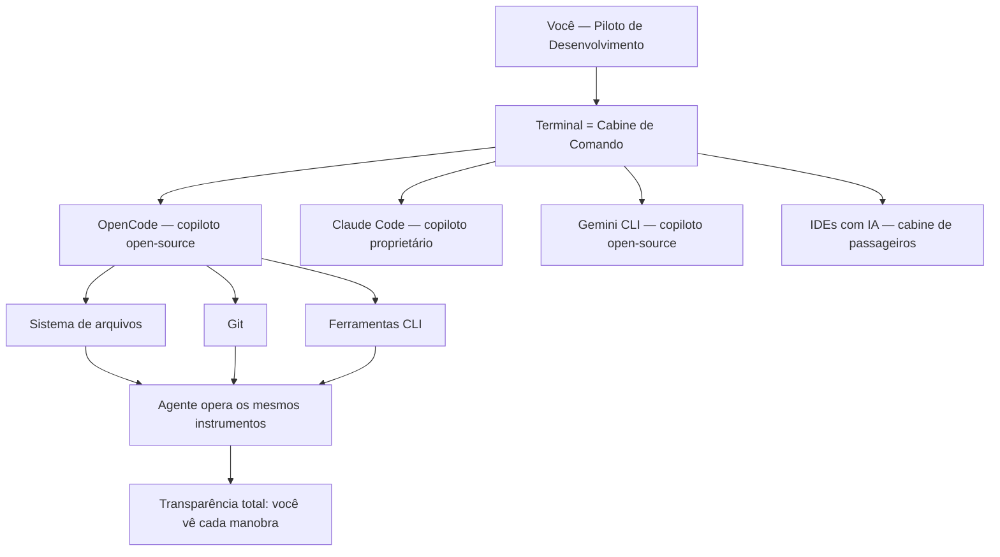
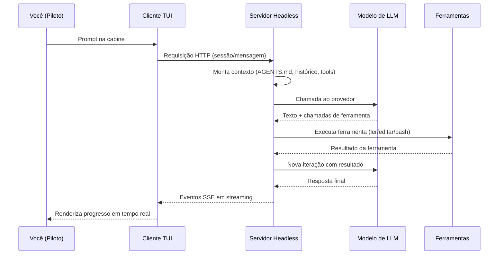
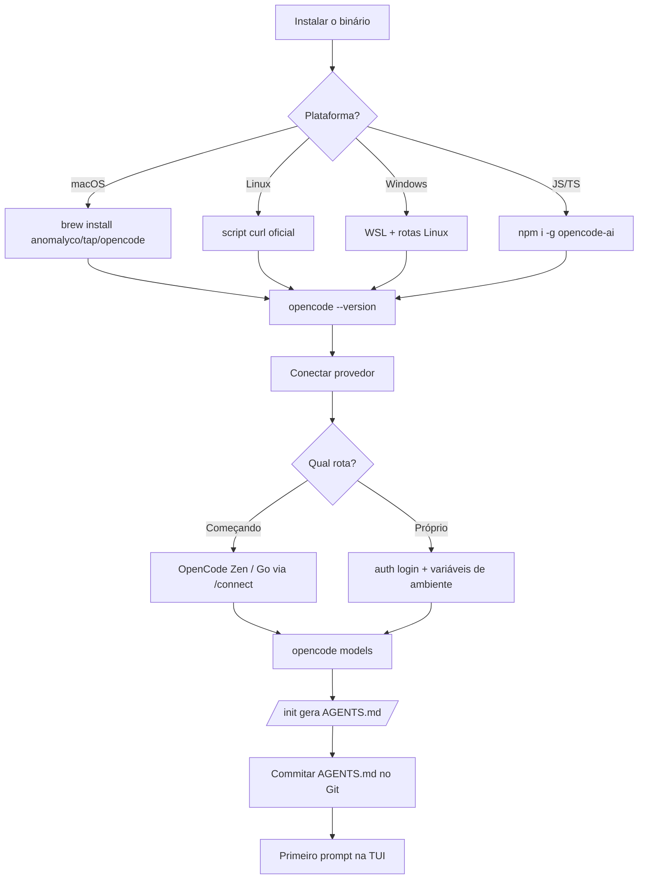
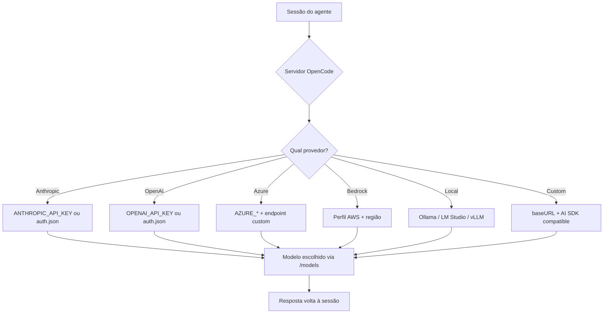
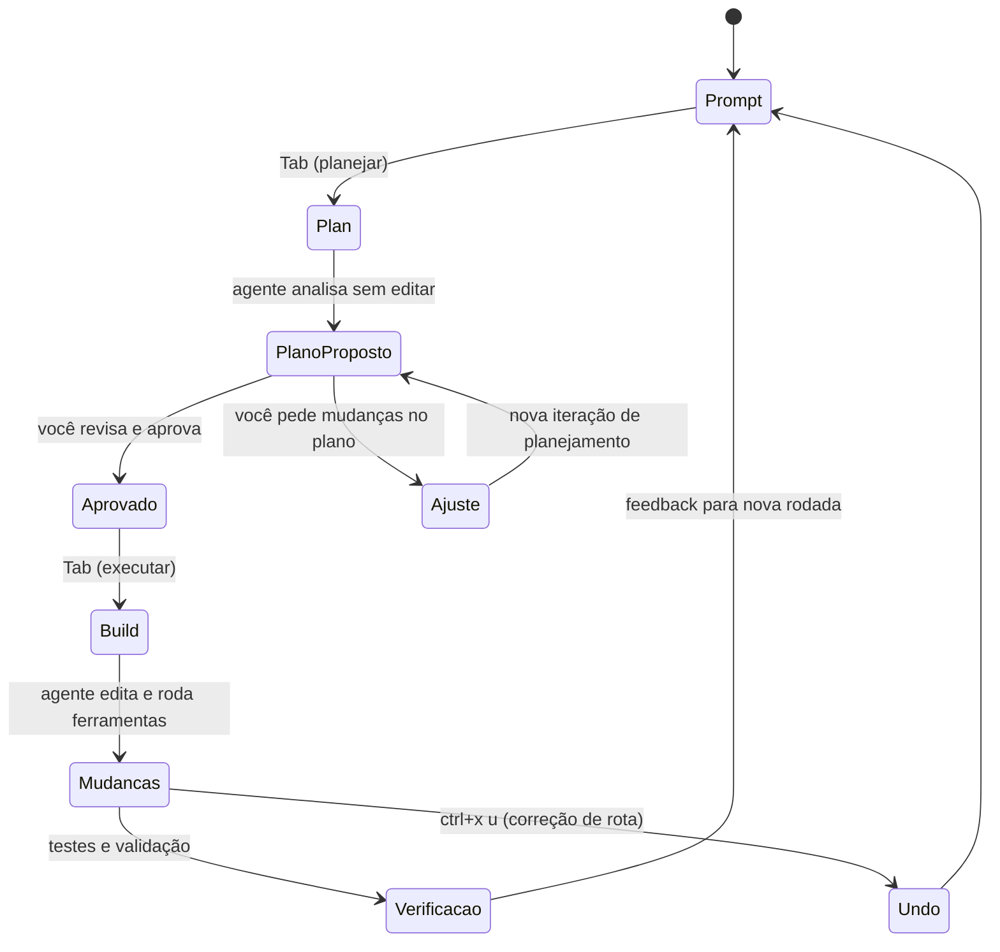
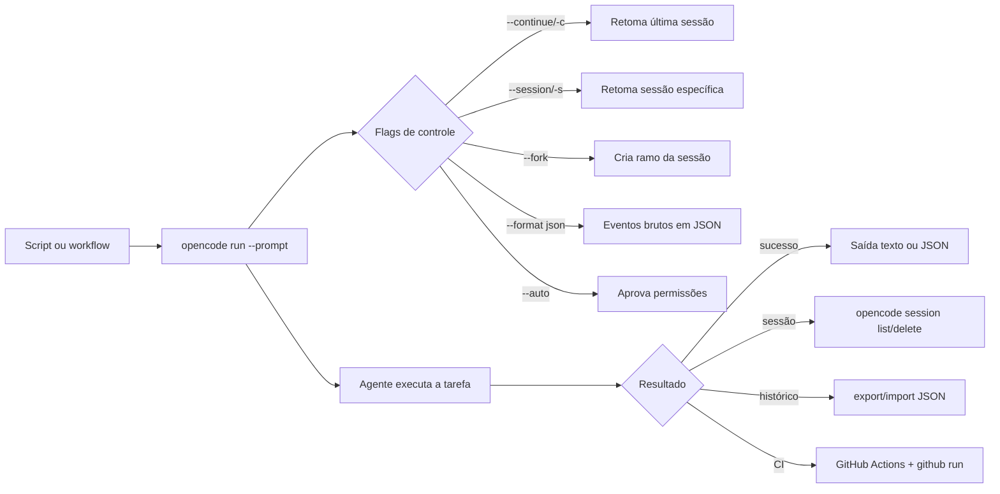
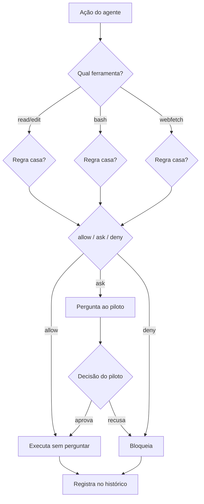
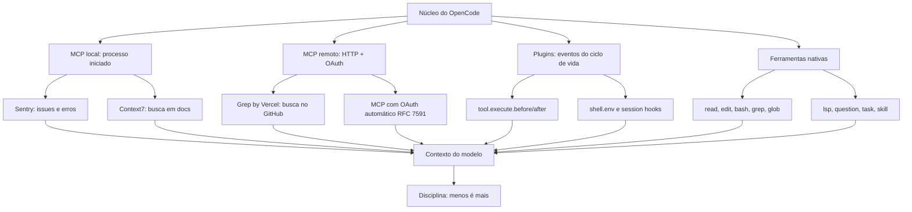
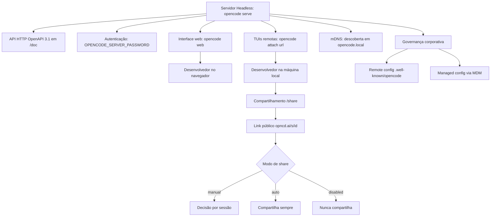
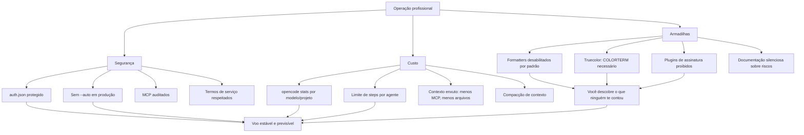

# Prefácio

Entre 2024 e 2026, o desenvolvimento de software atravessou uma turbulência que nenhum manual de carreira previu: \"agora todo mundo programa com IA\". A promessa chegou primeiro como um chatbot que respondia perguntas soltas, depois como um autocomplete que completava a linha — e, de repente, como agentes que leem o repositório, planejam mudanças, editam arquivos, rodam comandos e verificam o próprio trabalho. No meio desse furacão, uma sensação se repete entre os desenvolvedores: a ferramenta promete velocidade, mas entrega confusão — quem decide o quê? Quem garante que o código que o agente escreveu está certo? E quem paga a conta em tokens quando o agente roda em círculos? Este livro nasce dessa frustração, e da convicção de que o problema não está na ferramenta — está no controle: o profissional que entende o agente por dentro, que o configura do zero e que conhece o que a documentação oficial não ensina é o que transforma turbulência em cruzeiro.

Para tornar essa virada tangível, a obra inteira é ancorada num único cenário: a Cabine de Comando. Você, leitor, assume o papel de Piloto de Desenvolvimento e constrói, capítulo a capítulo, a operação completa de um agente de codificação — o OpenCode — desde a primeira decolagem (instalação e configuração) até o voo em formação na malha aérea da empresa (servidor headless, colaboração e governança). O plano de voo é o prompt; os instrumentos são as ferramentas e o MCP; a autorização da torre são as permissões; e a correção de rota é o undo. O terminal é a cabine — a interface mais antiga da computação, que voltou a ser o campo de batalha mais disputado do desenvolvimento — e o OpenCode é o copiloto open-source que senta ao lado do piloto, operando os mesmos instrumentos com transparência total.

A progressão dos dez capítulos, distribuídos em cinco partes, segue um arco deliberado. Na Parte I, você entende o que mudou e por que isso importa: o que é o OpenCode, onde ele nasceu, o cenário competitivo (Claude Code, Cursor, Aider, Gemini CLI) e a anatomia do agente — o loop de raciocínio, a arquitetura cliente-servidor e o gerenciamento de contexto (Capítulos 1 e 2). Na Parte II, o checklist de decolagem: a instalação em todas as plataformas — com a decisão consciente do WSL no Windows — e o sistema de provedores e credenciais, do Anthropic ao Ollama (Capítulos 3 e 4). Na Parte III, o piloto em cruzeiro: a TUI com seus slash commands, keybinds e os modos Build/Plan, e o agente sem interface — o `opencode run`, as sessões pela CLI e a automação em CI (Capítulos 5 e 6). Na Parte IV, a sala de máquinas: a configuração avançada — permissões, agentes custom e skills — e o MCP, os plugins e a disciplina de não inflar o contexto (Capítulos 7 e 8). E na Parte V, a torre de controle: o servidor headless, o web, a colaboração em equipe e a governança corporativa — e o que ninguém te conta sobre segurança, custo e as armadilhas do ecossistema (Capítulos 9 e 10).

Um fio conecta os dez capítulos de ponta a ponta, além da metáfora da cabine: o controle redesenhado. O profissional que domina agentes de codificação não é o que remove todos os controles do caminho do agente — é o que sabe exatamente onde colocá-los: permissões desenhadas, contexto enxuto, custo medido, decisão humana preservada. Se há uma frase que resume o que este livro tenta ensinar, é esta: o agente é o copiloto, não o piloto — e quem mantém o controle da cabine, em todas as fases, é quem transforma a promessa de velocidade em operação previsível, auditável e barata.


# Capítulo 1: O que é o OpenCode e por que o terminal voltou

## 1. Introdução

Se você acompanha o mundo do desenvolvimento nos últimos anos, deve ter sentido o mesmo que eu: a promessa de "programar com IA" chegou primeiro como um chatbot que respondia perguntas soltas, depois como um autocomplete que completava a linha, e agora como algo muito mais ambicioso — um agente que lê o seu repositório, planeja mudanças, edita arquivos, roda comandos e verifica o próprio trabalho. No meio desse furacão, um projeto de código aberto chamado OpenCode vem conquistando espaço exatamente onde a maioria das pessoas menos esperava: no terminal. Este capítulo coloca você na cabine de comando — o primeiro passo do voo — respondendo às perguntas que todo mundo faz no hangar: o que exatamente é essa ferramenta, de onde ela veio, e por que o terminal, a interface mais antiga da computação, voltou a ser o campo de batalha mais disputado do desenvolvimento de software. Ao dominar isso, você não estará apenas conhecendo mais uma ferramenta; estará entendendo a mudança estrutural que define esta década.

## 2. Explica

O OpenCode é um agente de codificação por inteligência artificial, de código aberto, projetado para rodar no terminal como interface principal, com extensões para desktop e para IDEs [1]. A definição parece simples, mas cada palavra carrega uma decisão de arquitetura profunda. "Agente de codificação" significa que o sistema não apenas sugere trechos de código: ele recebe uma tarefa em linguagem natural, explora o repositório, decide quais arquivos alterar, executa edições e comandos, e itera até concluir — ou até pedir ajuda quando encontra um obstáculo. "Código aberto" significa que o código-fonte é público e auditável, algo raro em um mercado dominado por ferramentas proprietárias com caixas-pretas [2]. "Terminal" é a aposta central: em vez de disputar espaço dentro de um editor pesado, o OpenCode assume que o desenvolvedor profissional já vive no terminal e que o terminal é o melhor lugar para um agente operar com liberdade total sobre o sistema de arquivos.

A história do projeto ajuda a entender sua filosofia. O OpenCode nasceu no ecossistema SST, um framework popular para aplicações serverless, e foi mantido inicialmente sob a organização sst/opencode antes de migrar para a organização anomalyco [3]. Essa origem não é um detalhe burocrático: a equipe que criou o OpenCode vinha de construir ferramentas de desenvolvedor que rodam no terminal, e essa herança aparece em cada decisão de design — da interface de texto altamente produtiva ao foco em desempenho e em controle fino do usuário. O projeto cresceu rápido em adoção, tornando-se um dos agentes de codificação open-source mais populares do ecossistema, com métricas de atividade publicamente observáveis em plataformas de análise de código aberto [4].

Para situar o OpenCode no mercado, é essencial conhecer o cenário competitivo em que ele opera. O Claude Code, da Anthropic, é o concorrente proprietário mais conhecido: roda também no terminal, mas é exclusivo dos modelos Claude e tem sua TUI fechada [5]. O Cursor ataca pelo flanco oposto, embutindo IA dentro de um editor baseado em VS Code [6]. O Aider, um dos pioneiros, é uma CLI open-source de pair programming com foco em commits automáticos via Git [7]. O Gemini CLI, do Google, é o concorrente open-source mais direto em termos de posicionamento [8]. E há ainda as plataformas acadêmicas e comunitárias, como o OpenHands, que oferecem agentes generalistas em ambiente web [9]. O que diferencia o OpenCode nesse mapa não é uma única funcionalidade, mas a combinação: aberto, multiplataforma, com suporte a mais de 75 provedores de modelos por meio do AI SDK da Vercel e do catálogo Models.dev, e com uma superfície de servidor headless que permite usá-lo como uma API [10][11].

O renascimento do terminal como campo de batalha tem raízes acadêmicas concretas. O benchmark SWE-bench, publicado em 2024, mostrou que modelos de linguagem conseguem resolver problemas reais do GitHub — e criou a métrica que passou a medir a capacidade dos agentes [12]. O SWE-agent, da Universidade de Princeton, demonstrou que a interface entre o agente e o computador (a chamada Agent-Computer Interface, ou ACI) é tão importante quanto o modelo em si: uma boa interface de ferramentas pode multiplicar a taxa de sucesso [13]. Trabalhos como o Agentless questionaram até a necessidade de agentes complexos, mostrando que pipelines simples com um bom modelo alcançam resultados competitivos [14]. E o OpenHands, publicado no ICLR 2025, consolidou a visão de agentes generalistas em plataformas abertas [15]. Esses trabalhos convergem para um ponto: o código do mundo real é um ambiente cheio de ferramentas, e o agente que souber operar bem esse ambiente — lendo, editando, executando — vence aquele que apenas conversa.

O que isso significa na prática para quem desenvolve software? Que a IA deixou de ser um oráculo para virar um operador. Em um relatório que repercutiu em todo o mercado, a Google revelou que mais de um quarto do código novo produzido na empresa já é gerado por IA antes de passar por revisão humana [16]. O relatório DORA, publicado pela mesma empresa, indicou que cerca de nove em cada dez desenvolvedores já usam IA no fluxo de trabalho [17]. Nesse cenário, a ferramenta que você escolhe para ser seu copiloto define não apenas sua produtividade individual, mas sua capacidade de operar em equipe: agentes de terminal compartilham o mesmo repositório, o mesmo Git, as mesmas ferramentas de linha de comando que já fazem parte do seu dia a dia — a reprodutibilidade e a auditabilidade são propriedades naturais do fluxo [1][5].

Vale destacar o que o DORA realmente mostra, porque as manchetes simplificam: a IA generativa não substituiu os fundamentos da engenharia de software — ela amplificou quem já dominava os fundamentos. O relatório observa que as equipes que integram IA aos fluxos existentes — revisão de código, testes, integração contínua — colhem ganhos; as que tentam substituir o processo por IA pura colhem instabilidade [17]. Essa é a mesma distinção que atravessa este livro inteiro: o agente não é um substituto do fluxo de engenharia, é um operador dentro dele. Quem entende isso configura o OpenCode como um instrumento da cabine; quem não entende, espera que a cabine pilote sozinha — e descobre a diferença na primeira turbulência [16][17].

O renascimento do terminal também tem uma dimensão econômica que vale registrar: agentes de terminal são mais baratos de operar do que as alternativas, porque não carregam a infraestrutura pesada de um IDE na nuvem nem pagam o custo de uma UI web rica. O custo de um agente é dominado pelos tokens que ele consome — e um agente de terminal, com contexto enxuto e fluxo de texto puro, consome de forma eficiente [14]. Esse custo também é previsível e mensurável: o `opencode stats` do Capítulo 6, o limite de passos do Capítulo 7 e a matriz de modelos do Capítulo 4 são as ferramentas de controle que transformam "IA no fluxo" de um gasto misterioso em uma linha orçamentária planejada. Nenhum dos concorrentes do mapa oferece esse nível de transparência de custo com a mesma facilidade [1][10].

É aqui que o OpenCode acerta um ponto que a documentação oficial mal menciona: ele não tenta substituir o seu ambiente, ele se encaixa nele. Como um agente que opera no terminal, ele herda todas as vantagens desse ambiente — acesso total ao sistema de arquivos, execução de testes, integração com Git, uso de qualquer ferramenta CLI — e nenhuma das limitações de um chatbot embutido em um painel web. A desvantagem dessa liberdade é a necessidade de controle, e é exatamente esse controle (permissões, agentes, modo planejamento) que os próximos capítulos deste livro vão destrinchar.

Vale aprofundar a razão técnica pela qual o terminal — e não o editor nem o navegador — é a superfície natural de um agente de codificação, porque essa escolha explica quase tudo o que o OpenCode faz diferente. O terminal é o único ambiente que reúne, em um só lugar, as três propriedades que um agente precisa para operar com responsabilidade: acesso total ao sistema de arquivos, execução arbitrária de comandos e a possibilidade de inspeção e reversão de cada ação [1][5]. Um editor moderno é uma aplicação que esconde do usuário a maior parte do que acontece por baixo; o terminal é o contrário — uma interface que não esconde nada, porque foi desenhada para que o humano visse exatamente o que a máquina faz. Quando o agente roda no terminal, ele herda essa transparência: cada arquivo lido, cada comando executado e cada edição aplicada fica visível no fluxo, e a sessão registra o que foi feito para que qualquer passo possa ser desfeito ou auditado [5][18]. É essa propriedade, mais do que qualquer recurso específico, que faz do terminal o palco natural do trabalho agêntico: a mesma transparência que permite ao piloto confiar no copiloto é a que permite a auditoria exigida em produção.

Há ainda uma dimensão cultural e técnica que completa o quadro: o terminal é a herança viva da filosofia Unix — ferramentas pequenas, especializadas e combináveis, operando sobre texto puro [2]. Um agente que nasce nesse ecossistema herda um vocabulário enorme de ferramentas prontas: o `git` para versionamento, o `grep` e o `ripgrep` para busca, o `jq` para JSON, o `make` e o `npm` para automação. Em vez de reinventar cada uma dessas capacidades, o OpenCode as invoca diretamente — e o resultado é um copiloto que sabe operar o mesmo conjunto de instrumentos que você já domina [1][2]. É por isso que a curva de aprendizado de quem vem do terminal é tão curta: o agente fala a língua do ambiente, e a cabine não precisa ser reaprendida — apenas o copiloto precisa ser conhecido. Esse é o ponto de partida da metáfora que guia o livro inteiro, e é também a razão pela qual o Capítulo 2 vai destrinchar o motor por dentro: quem entende o ambiente entende o agente.

Vale fechar a parte expositiva com um aviso honesto sobre a diferença entre conhecer e dominar — porque ela define o que você vai extrair deste livro. Conhecer o OpenCode é saber o que ele faz: é um agente de codificação, abre no terminal, suporta muitos provedores. Dominar o OpenCode é saber o que cada decisão sua muda no comportamento dele: como o prompt que você escreve, as instruções que você versiona e as permissões que você concede transformam o mesmo motor em resultados completamente diferentes [1][10]. Essa diferença aparece de forma concreta na comunidade: dois desenvolvedores com o mesmo modelo, o mesmo repositório e a mesma tarefa obtêm resultados distintos — não porque um tem um truque, mas porque um entende a cabine e o outro apenas senta nela [2][4]. A curva de aprendizado real não está nos comandos (eles cabem em uma tarde) — está no modelo mental: o agente como operador do seu ambiente, que responde ao contexto que você projeta [1][10]. Os capítulos que seguem constroem esse modelo mental camada por camada — arquitetura, instalação, provedores, operação, configuração, extensões, governança e segurança — e o último capítulo devolve tudo isso em um ritual diário. O contrato deste livro é simples: ao final, você não terá apenas usado o OpenCode — terá entendido por que cada manobra funciona, e será capaz de ensinar a próxima pessoa [1][10][18].

Para entender a decisão de arquitetura por trás do OpenCode, vale comparar as três superfícies que ele oferece. A primeira é a TUI, a interface de texto que roda no terminal e é o uso padrão do comando `opencode` — o lugar onde a produtividade máxima acontece, com keybinds, slash commands e painéis que respeitam o fluxo do teclado. A segunda é o desktop, uma superfície gráfica para quem prefere janelas. A terceira são as extensões de IDE, que levam o agente para dentro do editor [1]. Essa estratégia de múltiplas superfícies sobre um único motor é rara no mercado: a maioria dos concorrentes escolhe uma superfície e a defende até o fim. O OpenCode aposta que o profissional moderno alterna entre terminal, editor e navegador — e que o agente deve estar em todas elas, com o mesmo estado e as mesmas sessões.

A decisão de ser open-source também tem consequências práticas que vão além da ideologia. O código-fonte público permite auditar exatamente o que o agente envia para os provedores, contribuir com correções e ferramentas, e confiar em um ecossistema que não depende de um único fornecedor [2]. Para empresas, isso significa menos risco de vendor lock-in: a configuração, as sessões e as skills são arquivos locais e portáveis, não dados presos em uma nuvem proprietária. E a licença aberta permite que a ferramenta evolua pela comunidade — plugins, temas e integrações crescem em um ritmo que produtos fechados não alcançam [4][2]. O custo dessa abertura é a responsabilidade: sem um fornecedor que segure sua mão, você precisa entender a ferramenta — e é exatamente isso que este livro faz.

Essa abertura tem um corolário de segurança que os capítulos finais vão explorar em profundidade, mas que merece ser dito desde já para calibrar a confiança: código aberto não significa ausência de riscos, significa riscos conhecidos e auditáveis [2][10]. O que o agente envia para os provedores, onde ele armazena as credenciais e como ele trata os arquivos do seu projeto são decisões que, em uma ferramenta proprietária, você aceita por fé — e, em uma ferramenta aberta, você pode verificar [2]. O `auth.json`, que guarda as chaves dos provedores, é um arquivo local e protegido por permissões do sistema; o tráfego com os provedores segue os protocolos HTTPS padrão; e a política de dados é documentada — mas nada disso dispensa a verificação: a auditoria de uma ferramenta aberta é um direito do usuário, não um favor do fornecedor [2][10]. Esse é o mesmo espírito que guia o Capítulo 10, onde a segurança de verdade — proteção de credenciais, controle de custo e armadilhas de contexto — vira um capítulo inteiro, porque o profissional que opera uma cabine aberta sabe exatamente o que a cabine faz com os dados que passa por ela.

## 3. Ilustra

Pense na sua máquina de desenvolvimento como a cabine de comando de uma aeronave. Durante décadas, a indústria tentou colocar o piloto dentro de uma cabine de passageiros confortável — os IDEs com seus assistentes de chat embutidos, janelas flutuantes e painéis laterais. O problema é que a cabine de passageiros é um lugar para consumir, não para pilotar: o piloto precisa de instrumentos diretos, alavancas ao alcance da mão e visão clara do que está acontecendo com o motor. O terminal é essa cabine. O OpenCode é o copiloto que senta ao lado do piloto — você — e opera os mesmos instrumentos: o mesmo sistema de arquivos, o mesmo Git, os mesmos comandos. Quando o copiloto move uma alavanca, você vê exatamente qual alavanca foi movida e pode desfazer a manobra. Nenhum outro paradigma de ferramenta oferece esse nível de transparência operacional.



Repare que o diagrama coloca o terminal no centro e os concorrentes ao redor: cada ferramenta escolheu um lugar diferente nesse mapa, mas todas orbitam o mesmo ponto — o ambiente real onde o código vive. A metáfora da cabine de comando vai reaparecer em todo este livro: o plano de voo (o prompt), os instrumentos (as ferramentas e o MCP), a autorização da torre (as permissões) e a correção de rota (o undo). Quando você dominar a linguagem dessa cabine, qualquer ferramenta de agente de terminal — Claude Code, Gemini CLI, Aider — vai parecer familiar, porque todas operam os mesmos instrumentos com vocabulários diferentes. Como Piloto de Desenvolvimento, você não estará preso a um único fabricante de aeronave.

## 4. Técnica

### Os fundamentos do loop em código

Antes das primeiras interações, vale ancorar em código o que distingue um agente de um chatbot — porque é essa distinção que você vai observar em toda a operação. Um chatbot recebe uma mensagem e devolve um texto; a relação termina aí. Um agente recebe uma tarefa, monta um plano, executa ferramentas e itera — e a estrutura desse loop aparece na própria forma como o OpenCode representa a sessão. Quando você abre a spec OpenAPI do servidor (Capítulo 2), os endpoints revelam essa anatomia: criar uma sessão, enviar uma mensagem, receber eventos de ferramentas. Em termos de modelo mental, cada sessão é uma máquina de estados cujo motor é o loop do agente — e a primeira habilidade técnica de quem opera o OpenCode é reconhecer em que estado a sessão está: aguardando prompt, executando ferramenta, aguardando aprovação de permissão, concluída.

Vamos concretizar o que foi dito até aqui com a primeira interação real. A forma mais rápida de verificar se o OpenCode está instalado e descobrir sua versão é o comando `--version`. Mas o que interessa de verdade é a superfície de comando: o comando `opencode` sem argumentos abre a TUI, e a partir dela você acessa tudo — as sessões, os agentes, os modos Build e Plan. Veja a hierarquia de superfícies que o OpenCode expõe:

```bash
# Superfície 1: a TUI (interface de texto) — o uso padrão
opencode

# Superfície 2: execução programática, sem interface interativa
opencode run "explique o que este projeto faz"

# Superfície 3: servidor headless (API HTTP com spec OpenAPI 3.1)
opencode serve

# Superfície 4: interface web sobre o servidor
opencode web

# Utilitários de manutenção
opencode upgrade    # atualiza para a versão mais recente
opencode models     # lista os modelos disponíveis
opencode stats      # mostra consumo de tokens e custos
```

Cada uma dessas superfícies usa o mesmo motor por baixo: a separação cliente-servidor é uma decisão central de arquitetura do OpenCode, e ela explica por que a TUI é tão rápida e por que você pode conectar vários clientes ao mesmo servidor [18]. O comando `opencode` sem argumentos é o ponto de partida — ele abre a TUI e carrega a última sessão, o que significa que o OpenCode é projetado para continuidade: você interrompe um trabalho, fecha o terminal e retoma exatamente de onde parou [1][18]. Essa continuidade é um dos diferenciais silenciosos do ecossistema de agentes de terminal — a sessão é o estado de trabalho, e o estado não se perde entre execuções.

A hierarquia das superfícies também revela a filosofia de extensibilidade: todas as superfícies são clientes do mesmo servidor, e a especificação aberta significa que novas superfícies podem ser construídas por qualquer pessoa — não apenas pela equipe do OpenCode. Isso explica por que o ecossistema ao redor (clientes web, ferramentas de CI, integrações) cresce de forma orgânica: a superfície programática é um contrato público, não uma implementação escondida [18][20]. Para você, a consequência prática é a liberdade de escolha: se a TUI não serve para o seu fluxo, o web pode servir; se o web não serve, um script próprio sobre a API pode servir — todas operando o mesmo motor, com o mesmo estado [18]. Para entender o ecossistema em termos de código, o modelo mental mais útil é o de uma aplicação que separa três camadas: o cliente (a interface que você toca), o servidor (o motor que mantém sessões e chama os modelos) e os provedores (as APIs de LLM, locais ou remotas). A configuração que liga essas camadas é o arquivo `opencode.json`, que veremos em profundidade no Capítulo 7, mas desde já vale saber que ele segue um schema documentado com `$schema`, `model`, `agent`, `permission`, `mcp`, `plugin` e outras chaves [19].

Para quem prefere validar conceitos por código, eis um exercício que vale ouro: listar os modelos disponíveis para o seu provedor configurado e comparar com o catálogo público. O comando `opencode models` consulta o catálogo Models.dev e mostra os modelos com seus metadados — contexto, preço, capacidades — e é a forma mais rápida de entender o leque de opções que a cabine oferece. A saída típica agrupa por provedor, o que permite comparar lado a lado o custo e a capacidade de modelos de fornecedores diferentes antes de escolher o motor do seu voo.

```bash
# Liste todos os modelos do provedor ativo
opencode models

# Liste os modelos de um provedor específico
opencode models anthropic

# Verifique a configuração ativa (merge de todas as camadas de config)
opencode debug config
```

O comando `opencode debug` abre um conjunto de ferramentas de diagnóstico — e é o melhor amigo de quem quer entender o que está acontecendo por baixo do capô quando algo não funciona como esperado [20]. Se o seu terminal suportar, você também pode inspecionar a API do servidor local: quando um `opencode serve` está rodando, a spec OpenAPI 3.1 fica exposta em `/doc`, e os endpoints de sessão e mensagem são acessíveis via HTTP — a mesma API que a TUI usa [18]. Abrir essa spec no navegador é uma das maneiras mais rápidas de entender a anatomia completa do sistema sem ler código-fonte.

A escolha do modelo que pilota o agente é o próximo nó da rede. O OpenCode usa o Vercel AI SDK e o catálogo Models.dev, o que dá suporte nativo a mais de 75 provedores — dos gigantes como Anthropic e OpenAI até modelos locais via Ollama, LM Studio e vLLM [10][11]. A configuração do modelo ativo é declarativa: no `opencode.json`, você define `model` (o modelo principal) e `small_model` (um modelo mais barato e rápido usado para tarefas auxiliares, como gerar títulos de sessão). Essa divisão entre modelo grande e modelo pequeno é um dos segredos de economia de tokens que a documentação oficial menciona apenas de passagem, e que vamos explorar no Capítulo 10.

Há uma decisão técnica que todo novo usuário enfrenta e que a documentação trata com uma frase: qual modelo usar como padrão? A resposta curta é "o melhor que você puder pagar para o trabalho principal" — porque a qualidade do raciocínio do agente é diretamente proporcional à qualidade do modelo. A resposta longa envolve trade-offs que este livro vai destrinchar capítulo a capítulo: latência (modelos menores respondem mais rápido e tornam o loop do agente mais ágil), custo (o `small_model` absorve as tarefas auxiliares), e contexto (modelos com janela maior permitem sessões mais longas antes da compactação). O catálogo Models.dev — a base de dados que o OpenCode consulta — mostra esses metadados para cada modelo, e o comando `opencode models` os expõe na sua tela [10][11]. A recomendação prática para o primeiro voo: comece com um modelo de qualidade comprovada, domine a operação, e só então experimente alternativas — porque a comparação só é justa com o fluxo básico dominado.

Por fim, uma nota técnica sobre a instalação que será detalhada no Capítulo 3: o OpenCode pode ser instalado por script curl em macOS e Linux, por gerenciadores de pacotes como Homebrew (fórmula `anomalyco/tap/opencode`), npm/bun/pnpm/yarn (pacote `opencode-ai`), e no Windows via WSL — a recomendação oficial da documentação para melhor performance [1][21]. A atualização é igualmente simples: `opencode upgrade` baixa a versão mais recente e substitui o binário [22]. A verificação de versão `opencode --version` confirma qual build você está operando — o primeiro reflexo profissional de qualquer Piloto de Desenvolvimento antes de assumir uma cabine nova.

O `opencode debug` é a primeira ferramenta de diagnóstico que um Piloto de Desenvolvimento conhece — e é apropriado que ele apareça já neste capítulo introdutório. O comando abre um conjunto de utilitários de troubleshooting: o `debug config` mostra a configuração mesclada (todas as camadas, do global ao projeto), o `debug` geral mostra o estado do ambiente e os logs ajudam a rastrear o que o servidor está fazendo [20]. A regra prática: antes de perguntar a qualquer fórum por que algo não funciona, rode `opencode debug` e leia o que o sistema reporta — na maioria dos casos, a resposta está no próprio diagnóstico. Esse reflexo, cultivado desde o Capítulo 1, é o que separa quem depura com dados de quem depura com achismo [20][21].

O modelo mental completo para o capítulo — e para o livro inteiro — é o da cabine de comando em três níveis. No nível mais alto, você decide o destino: o que o agente deve fazer (o prompt, o plano de voo). No nível do meio, você controla os instrumentos: quais ferramentas ele pode usar, quais arquivos pode tocar, quais comandos pode executar (as permissões e a configuração). No nível mais baixo, você monitora a execução: o que está sendo feito agora, o que já foi feito e o que pode ser desfeito (a TUI e as sessões). A maioria das pessoas opera apenas no nível mais alto — pede e espera. O Piloto de Desenvolvimento opera nos três, e é isso que permite delegar sem perder o controle. Cada capítulo deste livro adiciona um instrumento a essa cabine: o Capítulo 2 abre o motor (arquitetura), o 3 e o 4 preparam a decolagem (instalação e provedores), o 5 e o 6 ensinam a pilotar (TUI e automação), o 7 e o 8 ajustam a máquina (configuração e extensões), e o 9 e o 10 levam a operação à escala corporativa (servidor e governança).

### O papel do agente no fluxo de desenvolvimento

Vale também situar o OpenCode no fluxo de desenvolvimento moderno — porque entender o papel que ele ocupa evita tanto a subutilização quanto a expectativa irreal. Um agente de codificação não substitui o desenvolvedor nem o processo: ele opera dentro de ambos, executando o trabalho mecânico e amplificando o julgamento humano. As tarefas onde agentes de terminal realmente brilham são aquelas com contexto claro e verificação objetiva: implementar uma feature com critérios definidos, corrigir bugs com testes reprodutíveis, refatorar com a suíte de testes como rede de segurança, escrever testes para código existente, investigar e explicar código desconhecido [1][13]. As tarefas onde eles ainda falham são as que exigem julgamento de produto, contexto organizacional implícito ou decisões de arquitetura de longo prazo — não porque o modelo seja incapaz, mas porque o contexto necessário não está no repositório [13][17]. O profissional usa essa distinção para delegar com sabedoria: o agente cuida do que é verificável, o humano cuida do que é julgamento — e o fluxo resultante é mais rápido sem ser mais frágil [16][17].

### O ecossistema de referência e a curva de aprendizado

Um ponto que o capítulo introdutório deve deixar claro é o ecossistema de referência que este livro usa — porque ele define a precisão de tudo o que vem depois. Todos os comandos, flags e arquivos de configuração citados aqui foram verificados contra a documentação oficial (opencode.ai/docs), o repositório oficial (github.com/anomalyco/opencode) e, quando possível, contra a própria CLI instalada — a regra de ouro da fábrica que produz este livro é nunca inventar uma flag ou um caminho [1][2][22]. A versão de referência usada ao longo da obra é a linha estável atual do OpenCode; como a ferramenta evolui rápido, o hábito de verificar `opencode --version` e consultar a documentação atualizada é parte da operação — e é um hábito que o Capítulo 10 transforma em ritual semanal [8][10]. Essa precisão não é um detalhe de erudição: em ferramentas de linha de comando, uma flag errada ou um caminho inventado custa horas de depuração, e o profissional que aprende com fontes verificadas evita essa classe inteira de desperdício.

A curva de aprendizado do OpenCode também merece um mapa honesto, porque ele prepara você para o que vem. A primeira semana é a decolagem: instalar, conectar um provedor, rodar os primeiros prompts na TUI — o material dos capítulos 3 e 4. As primeiras semanas de operação real trazem o cruzeiro: dominar a TUI, o modo Plan, os comandos custom e a automação básica — os capítulos 5 e 6. O domínio profissional chega quando você configura o envelope — permissões, agentes, skills, MCP — e opera em equipe — os capítulos 7, 8 e 9. E a maturidade final é a operação econômica e segura — o capítulo 10. Esse mapa de quatro estágios — decolagem, cruzeiro, personalização, governança — é a estrutura do livro, e cada capítulo foi desenhado para levar você de um estágio ao seguinte sem pulos. A diferença entre quem lê este livro e quem só usa o OpenCode é exatamente essa: a sequência consciente de domínio, em vez da descoberta por tentativa e erro [1][10].

### As perguntas que este livro responde

Fechando a parte expositiva, vale listar as perguntas concretas que este livro responde — porque elas formam o contrato da leitura e permitem você medir o progresso. O que é o OpenCode e por que agentes de terminal importam (Capítulo 1). Como o agente funciona por dentro — loop, arquitetura, contexto (Capítulo 2). Como instalar e fazer o primeiro voo em qualquer plataforma (Capítulo 3). Como conectar qualquer modelo — do Anthropic ao Ollama — com credenciais seguras (Capítulo 4). Como dominar a TUI e o fluxo Build/Plan (Capítulo 5). Como automatizar com o run e a CI (Capítulo 6). Como configurar permissões, agentes custom e skills (Capítulo 7). Como ampliar com MCP e plugins (Capítulo 8). Como operar em equipe com servidor, web e governança (Capítulo 9). E como operar com segurança e custo controlado (Capítulo 10). Ao final, você não terá apenas conhecimento sobre o OpenCode — terá a operação completa de um Piloto de Desenvolvimento, da instalação à governança corporativa [1][10].

### A decisão de posicionamento e seus efeitos práticos

Antes de fechar o capítulo com a aplicação, vale uma reflexão sobre como o posicionamento do OpenCode se traduz em decisões práticas do dia a dia — porque é aí que a teoria do mapa vira operação. Por ser aberto e multiplataforma, o OpenCode é a ferramenta que você pode levar para qualquer empresa: a configuração via arquivos locais e o ecossistema de skills e plugins não dependem de licenças corporativas nem de contas centralizadas [2][4]. Por suportar mais de 75 provedores, ele é a ferramenta que se adapta a qualquer política de dados: a empresa que exige modelos locais usa Ollama; a que exige Azure usa Azure; a que usa a nuvem da AWS usa Bedrock — tudo no mesmo OpenCode [10][11]. E por ter uma superfície programática completa (o servidor headless do Capítulo 2, o run do Capítulo 6), ele é a ferramenta que pode ser integrada ao processo — não apenas usada por pessoas. Esse trio — portabilidade, adaptabilidade, integrabilidade — é o que faz do OpenCode uma escolha de plataforma, não apenas uma escolha de ferramenta, e é o que justifica o investimento de aprendizado que este livro representa [1][10].

### O espectro de autonomia: do Plan ao Auto

Uma das decisões mais importantes que um Piloto de Desenvolvimento toma no primeiro contato é o nível de autonomia que o agente terá — e o OpenCode expõe esse espectro de forma explícita nos modos de operação [23]. No extremo do controle, o modo Plan: o agente investiga, planeja e apresenta o plano sem tocar em nenhum arquivo — você revisa, ajusta e só então autoriza a execução [23]. É o padrão recomendado para qualquer tarefa que envolva mudanças no código, porque transforma a revisão em uma etapa natural do fluxo em vez de uma inspeção tardia. No meio do espectro, o modo Build: o agente executa diretamente, mas cada passo permanece visível e reversível — você acompanha as ferramentas sendo invocadas, interrompe quando quiser e desfaz o que não gostou [23][18]. E há ainda o modo automático (via `opencode run --auto`), que veremos no Capítulo 6: o agente executa a tarefa de ponta a ponta sem confirmação — reservado para ambientes isolados e tarefas sem risco [20]. A recomendação que este livro repete do início ao fim é simples: comece no Plan, evolua para o Build com revisão disciplinada e só considere o automático quando a tarefa for verificável por testes e o ambiente for descartável [23][10].

A escolha do nível de autonomia também é uma escolha de custo e de risco, e vale quantificá-la desde já porque ela se repete em todos os capítulos. Cada iteração do agente consome tokens — e uma sessão em modo automático que percorre caminhos errados antes de acertar consome muito mais do que uma sessão em modo Plan que definiu o destino antes de decolar [10][14]. O mesmo raciocínio vale para o risco: um agente em modo Build com permissões restritas (Capítulo 7) é mais seguro do que um agente em modo automático com acesso amplo — porque o dano potencial de cada decisão errada é proporcional à autonomia concedida [16][17]. Essa é a disciplina que separa o uso profissional do uso amador: o profissional escolhe o nível de autonomia de acordo com a tarefa e o ambiente, nunca por pressa ou por empolgação com a capacidade do modelo.

Uma última nota sobre o que este capítulo — e este livro — não promete: o OpenCode não transforma ninguém em desenvolvedor nem substitui o julgamento de engenharia [1][13]. O que ele faz é amplificar: um desenvolvedor competente com um agente bem configurado produz mais, com menos esforço mecânico e mais tempo para o que exige julgamento; um processo frágil com um agente poderoso produz mais rápido exatamente os mesmos erros [13][17]. Essa distinção aparece nos relatórios de adoção que este capítulo citou: a IA generativa amplifica equipes que já têm fundamentos e desestabiliza as que pulam os fundamentos [17]. É por isso que a jornada deste livro começa pelo mapa do território — entender o que a ferramenta é, onde ela nasceu e por que ela importa — antes de qualquer configuração: o profissional que sabe o que está amplificando amplifica na direção certa, e é essa consciência, mais do que qualquer comando, que o Capítulo 2 vai transformar em engenharia [1][13][17].

## 5. Aplica

Cena de contraste. Você acaba de entrar em um time novo. No primeiro dia, o tech lead passa a tarefa: "Investiga essa issue, propõe a correção e abre o PR". Você decide impressionar usando a ferramenta de IA que todo mundo usa — um chatbot no navegador. Você copia o arquivo inteiro, cola no chat, pede a correção e recebe um bloco de código. Cola de volta no editor, roda os testes... e quebra três. O diagnóstico: o chatbot não tinha o contexto do repositório, não sabia que havia uma função utilitária que já resolvia metade do problema, e a "solução" inventou um padrão que conflita com o código existente. Você gastou duas horas e aprendeu a lição clássica: IA sem acesso ao ambiente é adivinhação com autocomplete.

Agora a prática correta, ainda no seu primeiro dia no time. Você abre o terminal, roda `opencode` e o agente pergunta o que você quer. Você responde: "Investiga a issue #42, propõe a correção no padrão do repositório e resume o que mudaria". O agente lê o repositório, encontra a função utilitária que você não conhecia, propõe a mudança — e, se você estiver no modo Plan, ele nem toca nos arquivos: mostra o plano para você aprovar [23]. Você aprova, o agente edita, roda os testes, e o resultado passa. A diferença não é mágica: é contexto. O agente de terminal opera dentro do repositório, enxerga o sistema de arquivos inteiro, usa as mesmas ferramentas que você usaria, e — crucialmente — você vê cada passo que ele dá, com a possibilidade de desfazer qualquer manobra.

As armadilhas comuns dessa primeira semana, em síntese: primeiro, delegar sem critério de aceite — você não define "pronto" antes de começar, e o agente entrega qualquer coisa; segundo, tratar o agente como oráculo em vez de operador — perguntas vagas produzem respostas vagas, e o padrão correto é dar contexto como você daria a um desenvolvedor júnior competente; terceiro, ignorar o modo Plan — o modo que separa o amador do profissional é aquele que planeja antes de executar; quarto, não versionar as instruções do projeto — o arquivo `AGENTS.md`, que o `/init` gera e que veremos no Capítulo 3, é o manual de operação que o agente lê antes de qualquer tarefa [24]; quinto, tratar o terminal como se fosse um ambiente hostil — o medo de quebrar algo com um comando errado paralisa, e a verdade é que o agente de terminal, com undo e permissões, é mais reversível do que qualquer chatbot de navegador.

A diferença prática entre as ferramentas do mapa fica clara quando você observa o fluxo real de trabalho. No Cursor, a IA vive dentro do editor: você seleciona código, pede uma mudança e ela acontece no mesmo painel — confortável, mas limitada ao que o editor expõe [6]. No Aider, o fluxo é Git-centrado: a ferramenta faz commits automáticos das mudanças que você aprova, o que cria um trilho de auditoria nativo [7]. No Claude Code e no Gemini CLI, o terminal é o palco, como no OpenCode — mas cada um com seu ecossistema fechado ou aberto [5][8]. A escolha não é "qual é melhor", mas "qual se encaixa no seu fluxo": o OpenCode é a opção aberta e multiplataforma, com o ecossistema de modelos mais amplo e a superfície programática mais completa — e é exatamente por isso que este livro escolheu dissecá-lo, para que você domine o padrão aberto que não depende de nenhum fornecedor.

No mercado, o profissional que domina um agente de terminal não é o que digita prompts mais bonitos — é o que entende o ambiente em que o agente opera e o controla com precisão. Uma pesquisa com desenvolvedores mostra que a adoção de agentes de codificação disparou, mas a satisfação depende de uma variável específica: o nível de controle percebido sobre o que o agente faz [16][17]. Os times que tratam o agente como um membro júnior supervisionado — com permissões claras, revisão de código e testes obrigatórios — colhem os ganhos; os times que delegam sem supervisão acumulam dívida técnica invisível. Sua primeira semana com o OpenCode é o momento de estabelecer esse padrão de controle, e é exatamente para isso que a arquitetura de permissões e agentes dos próximos capítulos existe.

Para fechar a aplicação com algo acionável, eis o checklist concreto da primeira semana — os cinco hábitos que transformam a descoberta da ferramenta em operação profissional [1][10]. Primeiro, defina o critério de aceite antes de cada tarefa: escreva em uma frase o que conta como "pronto" — o agente precisa saber quando parar, e você precisa saber quando rejeitar. Segundo, sempre comece no modo Plan nas tarefas que alteram código: um plano revisado antes da execução custa minutos e poupa horas de correção. Terceiro, versionar o AGENTS.md desde o primeiro dia: o arquivo de instruções do projeto é o contrato que o agente lê antes de qualquer tarefa, e um contrato versionado evolui com o time [24]. Quarto, desfazer sem medo: o undo é a rede de segurança da cabine — a manobra que o agente fez pode ser revertida, e o custo de errar em um ambiente reversível é baixo por definição [18]. Quinto, medir o que o agente consome: rodar `opencode stats` ao final da semana mostra o custo real em tokens e transforma a discussão de "quanto custa IA" em uma linha de orçamento [10]. Esses cinco hábitos, cultivados na primeira semana, são a base de tudo o que os próximos capítulos vão aprofundar — e eles funcionam em qualquer ferramenta de agente de terminal, porque descrevem o operador, não o fabricante.

## 6. Conclusão

Você saiu deste capítulo com o mapa do território: o OpenCode é um agente de codificação open-source que opera no terminal, nasceu no ecossistema SST e hoje vive na organização anomalyco, compete em um mercado disputado por Claude Code, Cursor, Aider, Gemini CLI e OpenHands, e se apoia em uma base acadêmica sólida — do SWE-bench ao SWE-agent, do Agentless ao OpenHands — que provou que a interface entre agente e computador é tão importante quanto o modelo [12][13][14][15]. Você entendeu por que o terminal voltou: porque é o único ambiente em que o agente pode operar os mesmos instrumentos que você, com transparência total. E você fez as primeiras manobras práticas — as superfícies de comando, a lista de modelos, o diagnóstico por `opencode debug` — preparando a decolagem.

Recapitulando os três pontos centrais: primeiro, o OpenCode é um agente de codificação — não um chatbot — que opera sobre o ambiente real de desenvolvimento, com acesso a arquivos, Git e ferramentas, e é aberto, auditável e portável [1][2]. Segundo, ele se posiciona em um mercado competitivo com uma aposta distinta: o terminal como superfície e a abertura como estratégia, em contraste com os concorrentes proprietários e de IDE [5][6][8]. Terceiro, a base acadêmica — SWE-bench, SWE-agent, Agentless, OpenHands — explica por que a interface entre agente e computador importa mais que o modelo, e por que essa arquitetura é o futuro da engenharia de software assistida [12][13][14][15].

Seu desafio agora é concreto: abra o terminal, rode `opencode --version` e, se o binário ainda não estiver instalado, use o script de instalação da plataforma — o primeiro item do checklist de decolagem que o Capítulo 3 detalha. E enquanto isso, prepare-se para o próximo voo: no Capítulo 2, vamos abrir o motor e entender, por dentro, como o loop do agente, a arquitetura cliente-servidor e o gerenciamento de contexto transformam um modelo de linguagem em um operador de software.

O próximo passo do seu checklist de decolagem é mais profundo: no Capítulo 2, vamos abrir o motor e entender como um agente de codificação funciona por dentro — o loop de raciocínio, as ferramentas, o gerenciamento de contexto e a arquitetura cliente-servidor que faz tudo isso funcionar. Quando você entender a anatomia, a configuração deixa de ser decoreba e vira engenharia.

## 7. Referências Bibliográficas

[1] ANOMALYCO. *OpenCode — AI coding agent built for the terminal*. Disponível em: https://opencode.ai. Acesso em: 03 ago. 2026.

[2] ANOMALYCO. *OpenCode — repositório oficial (antigo sst/opencode)*. Disponível em: https://github.com/anomalyco/opencode. Acesso em: 03 ago. 2026.

[3] SST. *SST — framework para aplicações serverless*. Disponível em: https://sst.dev. Acesso em: 03 ago. 2026.

[4] OSSINSIGHT. *Open source analytics for opencode*. Disponível em: https://ossinsight.io. Acesso em: 03 ago. 2026.

[5] ANTHROPIC. *Claude Code documentation*. Disponível em: https://docs.anthropic.com/en/docs/claude-code. Acesso em: 03 ago. 2026.

[6] CURSOR. *Cursor — The AI Code Editor*. Disponível em: https://www.cursor.com. Acesso em: 03 ago. 2026.

[7] AIDER. *Aider — AI pair programming in your terminal*. Disponível em: https://aider.chat. Acesso em: 03 ago. 2026.

[8] GOOGLE. *Gemini CLI*. Disponível em: https://github.com/google-gemini/gemini-cli. Acesso em: 03 ago. 2026.

[9] OPENHANDS. *OpenHands — An Open Platform for AI Software Developers*. Disponível em: https://github.com/All-Hands-AI/OpenHands. Acesso em: 03 ago. 2026.

[10] OPENCODE. *Providers — Using any LLM provider in OpenCode*. Disponível em: https://opencode.ai/docs/providers. Acesso em: 03 ago. 2026.

[11] MODELS.DEV. *Models.dev — open model catalog*. Disponível em: https://models.dev. Acesso em: 03 ago. 2026.

[12] JIMENEZ, Carlos E.; YANG, John; WETTIG, Alexander; YAO, Shunyu; PEI, Kexin; PRESS, Ofir; NARASIMHAN, Karthik. *SWE-bench: Can Language Models Resolve Real-World GitHub Issues?*. In: ICLR, 2024. Disponível em: https://arxiv.org/abs/2310.06770. Acesso em: 03 ago. 2026.

[13] YANG, John; JIMENEZ, Carlos E.; WETTIG, Alexander; LIERET, Kilian; YAO, Shunyu; NARASIMHAN, Karthik; PRESS, Ofir. *SWE-agent: Agent-Computer Interfaces Enable Automated Software Engineering*. In: NEURIPS, 2024. Disponível em: https://arxiv.org/abs/2405.15793. Acesso em: 03 ago. 2026.

[14] XIA, Chunqiu Steven; DENG, Yinlin; DUNN, Soren; ZHANG, Lingming. *Agentless: Demystifying LLM-based Software Engineering Agents*. arXiv, 2024. Disponível em: https://arxiv.org/abs/2407.01489. Acesso em: 03 ago. 2026.

[15] WANG, Xingyao; LI, Boxuan; SONG, Yufan; XU, Frank F.; TANG, Xiangru; ZHUGE, Mingchen et al. *OpenHands: An Open Platform for AI Software Developers as Generalist Agents*. In: ICLR, 2025. Disponível em: https://arxiv.org/abs/2407.16741. Acesso em: 03 ago. 2026.

[16] GOOGLE. *Relatório sobre geração de código com IA na Google*. Disponível em: https://cloud.google.com. Acesso em: 03 ago. 2026.

[17] GOOGLE. *Relatório DORA 2025 — State of DevOps*. Disponível em: https://dora.dev. Acesso em: 03 ago. 2026.

[18] OPENCODE. *Server — Interact with opencode server over HTTP*. Disponível em: https://opencode.ai/docs/server. Acesso em: 03 ago. 2026.

[19] OPENCODE. *Config — Using the OpenCode JSON config*. Disponível em: https://opencode.ai/docs/config. Acesso em: 03 ago. 2026.

[20] OPENCODE. *CLI — OpenCode CLI options and commands*. Disponível em: https://opencode.ai/docs/cli. Acesso em: 03 ago. 2026.

[21] NIXOS/NIXPKGS. *Homebrew — opencode formula (anomalyco/tap)*. Disponível em: https://formulae.brew.sh. Acesso em: 03 ago. 2026.

[22] OPENCODE. *Intro — Get started with OpenCode*. Disponível em: https://opencode.ai/docs. Acesso em: 03 ago. 2026.

[23] OPENCODE. *Agents — Configure and use specialized agents*. Disponível em: https://opencode.ai/docs/agents. Acesso em: 03 ago. 2026.

[24] OPENCODE. *Instructions — AGENTS.md and project instructions*. Disponível em: https://opencode.ai/docs/instructions. Acesso em: 03 ago. 2026.

# Capítulo 2: Arquitetura — como um agente de codificação funciona por dentro

## 1. Introdução

No Capítulo 1, você assumiu a cabine de comando e conheceu o OpenCode por fora — o que ele é, onde nasceu e por que o terminal voltou a ser o centro do desenvolvimento. Agora é hora de abrir o motor. A maioria das pessoas usa ferramentas de IA sem saber o que acontece entre o momento em que você digita um pedido e o momento em que os arquivos mudam. Esse intervalo — o loop do agente — é onde mora toda a diferença entre uma ferramenta que parece mágica e uma que você consegue controlar, prever e depurar. Neste capítulo, vamos dissecar a anatomia de um agente de codificação: o loop de raciocínio e ferramentas, a arquitetura cliente-servidor do OpenCode e o gerenciamento de contexto que determina a qualidade do resultado. Ao dominar isso, você deixará de ser um passageiro da tecnologia e passará a ser o engenheiro que entende cada manobra — o diferencial que separa quem opera a cabine de quem apenas aperta botões.

## 2. Explica

Um agente de codificação é, na essência, um laço de três componentes: um modelo de linguagem que raciocina, um conjunto de ferramentas que ele pode invocar e um ambiente que registra o estado. O modelo não "escreve" o código diretamente no seu disco; ele produz texto que instrui a execução de ferramentas — ler um arquivo, editar uma linha, rodar um comando — e, a cada passo, o resultado da ferramenta volta ao contexto do modelo, que decide o próximo passo. Esse ciclo, chamado de loop do agente, é a unidade fundamental de operação [1]. A qualidade do agente depende menos do modelo em si do que do desenho dessa interface entre o agente e o computador — o conceito que o SWE-agent batizou de ACI (Agent-Computer Interface) e que se tornou uma área de pesquisa inteira [2].

A descoberta central dos trabalhos acadêmicos é contra-intuitiva: dar ao agente uma interface rica de ferramentas melhora o resultado mais do que trocar o modelo por um maior. O SWE-agent, da Princeton, mostrou que uma ACI bem desenhada — comandos de busca no código, edição com verificação, sintaxe clara — eleva a taxa de resolução de problemas reais de forma dramática em relação a um modelo usando ferramentas genéricas [2]. O benchmark SWE-bench, por sua vez, estabeleceu o campo de provas: milhares de issues reais do GitHub com testes de validação, criando a métrica que todos os agentes passaram a perseguir [3]. O Agentless, publicado em 2024, adicionou uma provocação importante: pipelines que dispensam o loop agêntico e delegam a um único passo de geração alcançam resultados competitivos com custo muito menor — sugerindo que o agente precisa justificar cada iteração em termos de ganho real [4]. E o OpenHands consolidou a visão de que a plataforma aberta, com um ambiente controlado e ferramentas padronizadas, é o caminho para agentes generalistas [5].

Vale dissecar o conceito de ACI com mais profundidade, porque ele explica praticamente todas as decisões de design do OpenCode que você vai encontrar neste livro. A ACI é o conjunto de comandos e observações que o agente usa para interagir com o computador — análogo ao que uma API é para um programa, mas desenhado para um modelo de linguagem. O SWE-agent observou que os modelos, quando recebem um terminal cru, desperdiçam esforço: cometem erros de sintaxe triviais, perdem o contexto do que já executaram e não sabem navegar em árvores de arquivos grandes. A solução foi projetar comandos específicos — como um comando de busca que retorna resultados com contexto e um comando de edição que valida a sintaxe antes de aplicar — e foi isso que impulsionou a taxa de sucesso [2]. O OpenCode internalizou essa lição em cada ferramenta: a edição é aplicada com verificação, a busca retorna contexto, e a execução de bash captura a saída completa para que o modelo tenha o estado real do sistema.

O benchmark SWE-bench também merece um olhar mais atento, porque é a régua que o mercado usa até hoje. Ele compilou milhares de issues reais de repositórios populares do GitHub, cada uma com um patch de referência e um teste de validação — e a tarefa do agente é resolver a issue de forma que o teste passe [3]. O que o benchmark revelou foi duro e esclarecedor: os modelos, sozinhos, resolvem uma fração pequena das issues; os agentes com boas interfaces multiplicam esse número; e a diferença entre os melhores e os piores pipelines é maior do que a diferença entre os modelos que eles usam [3][2]. Esse é o argumento definitivo para o estudo da arquitetura que este capítulo faz: se você entende o loop do agente, você entende por que as mesmas pessoas, com o mesmo modelo, obtêm resultados tão diferentes.

O OpenCode implementa esse loop com uma arquitetura cliente-servidor que é ao mesmo tempo simples e elegante. A TUI que você usa no terminal é apenas um cliente. O trabalho pesado — manter a sessão, orquestrar o modelo, gerenciar o contexto — acontece em um servidor headless que roda localmente e expõe uma API HTTP com spec OpenAPI 3.1 [6]. Isso significa que a TUI pode ser substituída por qualquer outro cliente: a interface web (`opencode web`), um cliente programático via HTTP ou um cliente remoto conectado por `opencode attach`. A separação explica por que o OpenCode é rápido e responsivo mesmo com modelos grandes: a interface não espera o modelo terminar, ela recebe eventos em streaming via SSE (Server-Sent Events) e renderiza o progresso [7]. Se você abrir a spec OpenAPI em `/doc` com um servidor rodando, vai encontrar os endpoints de sessão, mensagem e evento que constituem a espinha dorsal do sistema.

A escolha do SSE (Server-Sent Events) em vez de WebSocket ou polling é um detalhe de arquitetura que vale entender, porque ele revela a prioridade de design do OpenCode. O SSE é uma conexão HTTP unidirecional e de baixa complexidade: o servidor empurra eventos para o cliente conforme eles acontecem, sem a negociação de handshake e o gerenciamento de estado do WebSocket. Para o caso de uso de um agente — onde o tráfego dominante é unidirecional (o servidor informando o progresso) e intermitente — o SSE é a escolha certa: simples, robusto e compatível com a infraestrutura HTTP existente [6][7]. O polling (consultar o estado repetidamente) seria desperdício — cada consulta seria uma requisição completa — e o WebSocket seria complexidade desnecessária. Esse tipo de decisão, aparentemente técnica, tem consequências práticas: é por isso que a TUI é leve, que o web funciona bem em redes corporativas e que scripts de automação podem consumir o stream de eventos com ferramentas HTTP comuns [6][7].

O terceiro pilar da arquitetura é o gerenciamento de contexto — o recurso mais escasso e mais determinante da qualidade. Todo token enviado ao modelo custa dinheiro e janela de atenção; o agente precisa decidir o que manter na conversa, o que buscar sob demanda e o que descartar. O OpenCode estrutura esse contexto em camadas: as instruções do projeto (AGENTS.md), as skills (SKILL.md), as definições de agentes, as ferramentas MCP e o histórico da sessão [8]. Um repositório bem instruído reduz drasticamente o desperdício de contexto, porque o modelo não precisa redescobrir convenções que já estão documentadas. Os papers recentes sobre compressão de contexto — como o ACON, que otimiza a compactação para agentes de longa duração, e o estudo sobre compactação paralela de contexto — mostram que o gerenciamento de contexto é um campo de otimização ativo, com impacto direto no custo e na qualidade de agentes que rodam por horas [9][10].

A camada de skills completa essa hierarquia: instruções reutilizáveis definidas em arquivos SKILL.md com frontmatter de nome e descrição, descobertas sob demanda pela ferramenta de skill em vez de carregadas sempre [15]. As definições de agentes — primários e subagentes — declaram quais ferramentas cada um pode usar e com quais permissões, fechando o circuito entre contexto e controle [16]. E as ferramentas MCP ampliam o alcance do agente para o mundo externo, conectando servidores locais e remotos por um protocolo padronizado que a Anthropic introduziu em novembro de 2024 e que o mercado inteiro adotou [17]. Cada uma dessas camadas entra e sai do contexto conforme a necessidade — a disciplina de só carregar o que é usado é o que separa um agente ágil de um agente entupido.

A beleza da arquitetura cliente-servidor aparece quando você entende o fluxo completo de uma mensagem. Você digita um prompt na TUI. O cliente envia uma requisição ao servidor local. O servidor monta o contexto — instruções, histórico, ferramentas disponíveis — e chama o provedor de LLM configurado. O modelo responde com um texto que pode conter chamadas de ferramenta. O servidor executa a ferramenta (ler arquivo, editar, rodar comando), coleta o resultado e devolve ao modelo em uma nova iteração. Esse ciclo continua até o modelo declarar a tarefa concluída ou atingir o limite de passos configurado. Cada passo desse ciclo é visível na TUI — e é exatamente essa visibilidade que permite a você, como piloto, interromper, corrigir ou desfazer qualquer manobra em pleno voo [7][11].

O fluxo de uma mensagem também revela onde o custo de tokens é gerado — um tema que vamos quantificar no Capítulo 10, mas que vale antecipar aqui porque ele nasce da arquitetura. A cada iteração do loop, o servidor reenvia ao modelo o contexto acumulado: as instruções, o histórico da conversa até aquele ponto, as definições das ferramentas disponíveis e o resultado da última ferramenta executada. Um prompt simples pode gerar dezenas de milhares de tokens de contexto ao longo de uma tarefa complexa, porque o contexto cresce a cada passo [11][20]. É essa estrutura — não o preço individual do token — que domina o custo de uma sessão agêntica, como o estudo sobre consumo de tokens demonstra [20]. Entender o loop é, portanto, entender a origem do custo: cada iteração é uma multiplicação do contexto pelo número de passos, e as alavancas de economia (passos limitados, contexto enxuto) atacam exatamente essa multiplicação [20][21].

Há uma consequência da arquitetura que merece destaque porque ela muda a forma como você trabalha: como toda ação passa pelo servidor e é emitida como evento, o OpenCode produz, por construção, um trilho de auditoria de cada sessão [6][7]. Cada chamada de ferramenta, cada arquivo lido, cada edição aplicada e cada comando executado está registrado no fluxo de eventos — e esse registro é o que permite reconstruir, depois, por que o agente tomou as decisões que tomou [7][11]. Para o profissional, isso transforma a frase "o agente fez isso" em uma afirmação verificável: em vez de confiar na memória da conversa, você consulta o histórico da sessão ou o export dela (Capítulo 6) e reconstrói passo a passo [7][11]. Em ambientes regulados ou em times grandes, é exatamente essa propriedade que separa o uso defensável do uso amador: o trilho de auditoria nativo da arquitetura é a base da governança que os Capítulos 9 e 10 vão formalizar [6][7][20].

Vale registrar também o que a arquitetura não é, para evitar duas expectativas erradas que aparecem com frequência. Primeira: o servidor headless não é uma nuvem — ele roda na sua máquina (ou na máquina que você escolher, como no Capítulo 9), e os dados não saem do seu ambiente a não ser que você configure um provedor remoto [6]. Segunda: a separação cliente-servidor não significa que a TUI é opcional — ela é a interface mais produtiva, e a arquitetura apenas garante que o mesmo motor sirva a TUI, o web, o attach e a API [6][7]. Esses dois esclarecimentos importam porque eles definem o que a arquitetura entrega: controle local dos dados e liberdade de superfície — as duas razões pelas quais o desenho deste capítulo sustenta tudo o que vem pela frente [6][7].

## 3. Ilustra

Para ancorar a anatomia do agente, pense na cabine de comando novamente — agora com foco nos instrumentos, não no piloto. Um agente de codificação é como um sistema de piloto automático de aeronave. O piloto automático não é um único componente: é um laço de sensores, atuadores e um computador de bordo que lê o estado da aeronave (altitude, velocidade, rumo), decide a próxima ação e move os controles — depois volta a ler o estado para verificar se a ação teve o efeito esperado. Se o sensor reportar algo inesperado, o computador recalcula. O modelo de linguagem é o computador de bordo; as ferramentas são os sensores e atuadores; e o repositório é a atmosfera em que a aeronave voa. O que torna o OpenCode especial é a qualidade dessa interface: sensores precisos (busca no código, leitura de arquivos com contexto), atuadores com feedback (edições que reportam o resultado, comandos que mostram a saída) e a capacidade de o piloto humano assumir o manche a qualquer momento.



Esse diagrama é a planta da cabine: tudo passa pelo servidor headless, que é o coração do sistema — e o motivo de o OpenCode funcionar tão bem com clientes diferentes. Repare que o modelo nunca toca o seu disco diretamente; ele sempre passa pelo servidor e pelas ferramentas. Isso é uma decisão de segurança e de auditabilidade: cada ação é registrada, cada efeito é observável e cada passo pode ser revertido. Como Piloto de Desenvolvimento, você opera nessa mesma planta em todos os capítulos deste livro — quando configurarmos permissões (Capítulo 7), quando conectarmos MCP (Capítulo 8) e quando colocarmos o servidor na rede da empresa (Capítulo 9).

O conceito denso deste capítulo — a interface entre agente e computador — merece uma segunda analogia, mais concreta. Imagine que você contratou um estagiário muito inteligente, mas que só se comunica por bilhetes escritos à mão, com um garçom levando cada bilhete de ida e volta. O estagiário pede "o arquivo de login", o garçom volta com o arquivo; o estagiário escreve "mude a linha 5", o garçom leva a instrução. Esse garçom é a ACI. Um bom garçom sabe que "o arquivo de login" é ambíguo e pergunta antes de trazer a pasta errada; um garçom ruim traz a pasta errada e o estagiário perde três rodadas tentando explicar. O SWE-agent provou exatamente isso: melhorar o garçom (a interface) rende mais do que contratar um estagiário mais inteligente (um modelo maior) [2]. O OpenCode capricha no garçom: busca com contexto, edição com verificação, comandos com saída completa — e é por isso que ele funciona tão bem mesmo com modelos abertos.

## 4. Técnica

### O ciclo de vida de uma sessão

O ciclo de vida de uma sessão — do nascimento ao arquivamento — merece um mapa, porque ele define como o estado de trabalho se comporta. A sessão nasce quando um cliente a cria (TUI, run, API) e o servidor monta o contexto inicial [7][11]. A sessão vive através das mensagens: cada mensagem é uma rodada do loop, e o histórico acumulado é o contexto da próxima [7]. A sessão é persistida pelo servidor — pode ser retomada (Capítulo 6), compartilhada (Capítulo 9) e exportada (Capítulo 6) [7][11][13]. E a sessão morre quando é apagada ou quando o servidor é reiniciado sem persistência — daí a importância do export para o que vale arquivar [7][13]. Esse ciclo tem uma consequência operacional direta: o servidor é o dono do estado, e a disponibilidade do servidor é a disponibilidade das sessões — o que conecta este capítulo à infraestrutura do Capítulo 9 [7][18]. Quem entende que a sessão é um estado gerenciado — não um arquivo que ele guarda — opera com a disciplina certa de persistência e arquivamento [7][13].

### O mapa das camadas de contexto

Antes de interagir com o servidor, vale materializar a hierarquia de contexto que estudamos na Explica — porque é ela que o servidor monta a cada mensagem, e conhecê-la em ordem é conhecer a operação por dentro. A montagem de contexto do OpenCode combina, em camadas: as instruções do projeto (AGENTS.md, e os compatíveis CLAUDE.md e .agents/), as definições de agentes e suas permissões, as skills relevantes à tarefa (descobertas sob demanda), as ferramentas habilitadas (nativas e MCP) e o histórico da sessão — com a compactação entrando em cena quando o limite se aproxima [8][9][12]. A ordem importa: cada camada entra com um custo em tokens, e o servidor decide o que manter com base na tarefa corrente. Para o operador, o corolário prático é duplo: um AGENTS.md enxuto e preciso reduz o ruído em toda camada, e a disciplina de ferramentas habilitadas (menos MCP, menos ferramentas desnecessárias) reduz o custo de toda montagem [8][12].

### O diagnóstico em camadas na prática

O mapa de camadas tem uma aplicação imediata que todo Piloto de Desenvolvimento usa cedo: o diagnóstico de problemas em camadas. Quando algo não funciona — um provedor rejeita a chave, uma permissão bloqueia uma edição, o contexto estoura e a qualidade degrada — o erro raramente está na camada em que você primeiro desconfia [6][7]. A disciplina é percorrer as camadas de baixo para cima com evidência: primeiro o provedor e o modelo (a chave está válida? o modelo responde? `opencode debug config` mostra o que está configurado?), depois o servidor e as sessões (o servidor está rodando? a sessão está correta? os logs reportam algo?), depois as ferramentas e permissões (o agente tem acesso ao arquivo? a permissão está bloqueando?), e só então o prompt e o contexto (a instrução está clara? o AGENTS.md está sendo carregado?) [20]. Cada camada tem um instrumento de verificação próprio — e o reflexo de quem domina a arquitetura é medir antes de culpar [7][12].

Na prática, esse diagnóstico em camadas se apoia em três instrumentos que o OpenCode oferece e que você vai usar durante todo o livro [7]. O primeiro é o `opencode debug config`, que mostra a configuração mesclada — todas as camadas de config aplicadas na ordem certa, do global ao projeto — e resolve de imediato a classe de problema "por que minha config não está valendo?" [7]. O segundo são os logs do servidor, que registram cada requisição, cada chamada ao modelo e cada evento — o lugar onde os erros reais aparecem antes de qualquer outra superfície [6]. O terceiro é a própria sessão: o histórico da conversa com as chamadas de ferramenta e seus resultados é a evidência do que o agente fez e por quê [11]. Quem diagnostica com esses três instrumentos transforma horas de tentativa e erro em minutos de medição — e é esse hábito, mais do que qualquer comando específico, que o Capítulo 10 vai transformar em ritual [6][7].

### Interagindo com o servidor

A melhor maneira de ver a arquitetura em ação é conversar com o servidor sem passar pela TUI. O OpenCode expõe uma API HTTP completa; com um servidor rodando, você pode criar uma sessão, enviar uma mensagem e ler os eventos — o mesmo fluxo que a TUI usa por baixo. Aqui está o esqueleto de uma interação programática com o servidor local:

```bash
# Inicia o servidor headless na porta padrão
opencode serve

# Em outro terminal: lista as sessões existentes via API
curl -s http://127.0.0.1:PORT/session | python3 -m json.tool
```

Para entender a superfície completa, nada substitui a spec OpenAPI 3.1 que o servidor publica em `/doc` — abra-a no navegador e estude os endpoints de sessão, mensagem e evento. Essa spec é a documentação viva da arquitetura, gerada a partir do próprio servidor [6]. O protocolo de eventos usa SSE (Server-Sent Events), o que significa que o cliente recebe um stream de eventos conforme o agente progride — cada chamada de ferramenta, cada atualização de mensagem — em vez de esperar a resposta completa [7]. É esse streaming que dá à TUI a sensação de resposta ao vivo.

O conceito de ACI ganha forma concreta no conjunto de ferramentas que o agente pode invocar. As ferramentas nativas do OpenCode cobrem o ciclo completo de operação no repositório: leitura de arquivos, edição, busca textual (grep), glob, execução de bash, busca web, tarefas (task), skills, LSP e a pergunta ao usuário [12]. A lista de ferramentas disponíveis para cada agente é configurável — e essa configurabilidade é a tradução prática da ACI: você decide quais instrumentos o copiloto tem na cabine. Um agente de revisão de código, por exemplo, pode ter acesso de leitura e busca, mas não de edição nem de bash — reduzindo drasticamente a superfície de risco [12][13].

A arquitetura também define como o agente se apresenta visualmente e como o código produzido é formatado: temas configuráveis (com suporte a cores truecolor quando o terminal oferece) e formatters específicos por linguagem, que o OpenCode aplica quando a opção `formatter` está habilitada [18][19]. Esses detalhes parecem cosméticos, mas completam a ACI: a interface entre agente e humano também precisa ser bem desenhada para que você consiga ler, revisar e confiar no que o copiloto faz — a legibilidade do trabalho do agente é parte da confiança operacional.

Para quem quer ir além da TUI, o caminho programático é o modo `opencode run`, que executa uma sessão de agente em modo não interativo e imprime os eventos — o formato `json` é particularmente útil para automação e integração:

```bash
# Executa uma tarefa de forma programática e imprime os eventos em JSON
opencode run "resuma o que este projeto faz" --format json

# Com limite de passos para controlar o custo
opencode run "refatore a função calcularTotal" --max-steps 20
```

O gerenciamento de contexto, terceiro pilar da arquitetura, também é programável. As instruções do projeto vivem no AGENTS.md, que o agente carrega para o contexto a cada sessão; as skills em SKILL.md definem comportamentos reutilizáveis descobertos sob demanda; e o histórico da sessão é gerenciado com técnicas de compactação — o agente resume trechos antigos da conversa para caber na janela de contexto [8][9]. Entender essa hierarquia de contexto é o que permite a você controlar a qualidade: um AGENTS.md bem escrito é a maior alavanca de qualidade disponível, porque orienta o agente antes de qualquer prompt.

A janela de contexto — o limite de tokens que o modelo pode processar em uma chamada — é o recurso mais escasso de todo o sistema, e os papers sobre compactação explicam por quê. O ACON, publicado no ICML 2026, propõe otimizar a compactação de contexto para agentes de longa duração: em vez de descartar informação valiosa quando o limite se aproxima, o sistema comprime estrategicamente o que é menos relevante para a tarefa corrente [9]. A compactação paralela de contexto, estudada no mesmo período, ataca o gargalo de latência: compactar em paralelo reduz o tempo de espera de agentes que rodam por horas [21]. Para você, na prática, isso significa duas coisas: sessões longas precisam de estratégia (o OpenCode compacta automaticamente quando necessário), e a qualidade do resultado depende de manter no contexto o que importa — daí a disciplina de AGENTS.md enxuto e MCP seletivo que os capítulos 7 e 8 vão detalhar.

A relação entre contexto e qualidade tem um corolário direto que a documentação oficial raramente explicita: o agente é tão bom quanto o contexto que você dá a ele. Um prompt perfeito em um repositório sem AGENTS.md produz resultados inferiores a um prompt mediano em um repositório bem instruído — porque o AGENTS.md entrega, de graça, as convenções, os comandos e os padrões que o modelo precisaria adivinhar [8][22]. É por isso que o `/init` (Capítulo 3) é o primeiro passo de qualquer projeto profissional: ele instala a camada de contexto que sustenta tudo o que vem depois. E é por isso que os profissionais tratam o AGENTS.md como código — versionado, revisado e atualizado a cada mudança de convenção [8].

A prova de que a arquitetura funciona bem além da TUI é o ecossistema de clientes: o servidor headless permite usar o OpenCode de dentro de outras ferramentas, expor agentes para o time inteiro e integrar com CI. O protocolo ACP (Agent Client Protocol) — iniciado com `opencode acp` — abre o OpenCode como um servidor ACP via stdin/stdout em ND-JSON, permitindo que outras ferramentas o controlem como um agente de codificação de propósito geral [14]. Essa é a aposta de longo prazo: não uma ferramenta fechada, mas um motor de agente que qualquer interface pode pilotar.

Vale um experimento técnico que consolida tudo o que este capítulo ensina: com um servidor rodando, envie uma mensagem por HTTP e acompanhe os eventos SSE até a conclusão. Você verá, em tempo real, a anatomia do loop — a chamada ao modelo, a decisão de ferramenta, a execução, o resultado voltando ao contexto, a próxima iteração. Esse experimento é o equivalente a abrir o manual de manutenção da aeronave e ver o motor girando: a teoria da ACI, da arquitetura cliente-servidor e do gerenciamento de contexto deixa de ser abstração e vira observação. E é exatamente essa observação que permite a você, nos capítulos seguintes, configurar com intenção — porque você saberá o que cada configuração muda por dentro [6][7][12].

O protocolo ACP e a API aberta são também a resposta a uma pergunta estratégica: o que acontece se o OpenCode deixar de ser mantido? A resposta é o que qualquer plataforma aberta oferece — a operação não morre com o mantenedor. A configuração é arquivos locais, as sessões são exportáveis, a API é documentada e o código é aberto; a migração para qualquer alternativa que fale ACP ou consuma a API é uma decisão de configuração, não um projeto de reescrita [2][14]. Essa portabilidade — o oposto do lock-in — é uma das razões mais fortes, e menos discutidas, para escolher agentes de terminal abertos em ambientes corporativos, e ela será retomada no Capítulo 9 com a governança de plataforma [2][14].

A arquitetura que você estudou neste capítulo tem uma consequência operacional que os capítulos seguintes vão explorar exaustivamente: como o servidor é o coração do sistema, ele é o ponto único de configuração, autenticação e governança. As permissões definidas no servidor valem para todos os clientes que se conectam a ele — a TUI da sua máquina, o web de um colega, o attach de outra sala. O MCP configurado no servidor está disponível para todas as sessões. E o histórico exportado pelo servidor é o trilho de auditoria da equipe inteira [6][7]. Essa centralização é uma bênção e uma responsabilidade: é o que permite a governança corporativa do Capítulo 9, e é o que exige as proteções de segurança do Capítulo 10 — dois capítulos que só fazem sentido porque você entendeu, aqui, que o agente não é a interface que você toca, mas o motor que fica embaixo.

### As camadas de abstração do OpenCode

Vale um mapa das camadas de abstração do OpenCode, porque ele conecta a arquitetura deste capítulo à operação dos próximos. Na base, o provedor de LLM — a API que o modelo usa, configurada no Capítulo 4. Acima, o servidor do OpenCode — o motor que mantém sessões, monta contexto e orquestra o loop, a espinha dorsal deste capítulo [6][7]. Acima, as ferramentas — nativas e MCP — que o agente usa para operar o ambiente, configuradas nos Capítulos 7 e 8. E no topo, as interfaces — TUI, web, attach, run — que você usa para operar o agente, dominadas nos Capítulos 5 e 6 [18]. Cada camada tem seu vocabulário e seus artefatos: provedores e modelos, sessões e mensagens, ferramentas e permissões, keybinds e prompts. A consequência prática do mapa: os erros aparecem em camadas, e o diagnóstico correto identifica a camada — um prompt perfeito não resolve um problema de provedor, uma permissão perfeita não resolve um problema de contexto [6][7][8]. Quem domina o mapa depura por camada, não por adivinhação.

Esse mapa em camadas tem uma aplicação de diagnóstico que vale demonstrar com um caso real, porque ela mostra o método em funcionamento [6][7]. Imagine um sintoma comum: o agente demora para responder e, quando responde, a qualidade parece pior do que ontem. O profissional percorre as camadas com evidência: primeiro, o provedor — `opencode models` confirma se o modelo ativo é o esperado (talvez alguém trocou o modelo da sessão e o agente está rodando com um modelo menor); segundo, o servidor — `opencode debug` e os logs mostram se há erros de conexão ou retries (talvez o servidor esteja lento ou o provedor esteja degradado); terceiro, as ferramentas — `opencode debug config` revela se um MCP novo entrou no contexto e está inflando cada montagem (o suspeito clássico de lentidão); quarto, o contexto — o AGENTS.md e o histórico da sessão (talvez a sessão esteja com semanas de histórico não compactado) [6][7][8]. O ponto do método: cada hipótese tem um instrumento de verificação, e nenhuma camada é culpada sem medida. É esse mesmo reflexo — medir antes de culpar, camada por camada — que os capítulos 4, 7 e 10 vão refinar com instrumentos específicos de provedores, permissões e custo, e é ele que separa o diagnóstico profissional do chute educado [6][7][8].

### Os limites do loop e quando intervir

Antes da aplicação, vale mapear os limites do loop do agente — porque saber quando o loop falha é parte de dominá-lo. O primeiro limite é o de passos: um agente pode iterar indefinidamente em uma tarefa aberta, e é por isso que o limite de steps existe (Capítulo 7) — ele define o teto de iterações antes de o agente declarar derrota ou pedir ajuda. O segundo limite é o de contexto: quando a janela enche, o agente precisa compactar ou perder informação — e a qualidade pode degradar em sessões muito longas (os papers do ACON estudam exatamente essa fronteira) [9][21]. O terceiro limite é o de ferramentas: se a ferramenta certa não está disponível para o agente (por permissão ou por configuração), ele resolve com ferramentas piores ou falha — o sinal clássico é o agente tentando resolver com grep o que exigia uma busca semântica. Reconhecer esses três limites no meio de uma sessão — "o agente está rodando em círculos", "o contexto está estourando", "ele não tem a ferramenta certa" — é o que permite intervir como piloto: interromper, corrigir a rota e retomar com o instrumento adequado [7][11].

Uma observação de arquitetura que fecha a parte técnica e conecta com a prática: a mesma anatomia que você estudou aqui é a régua para avaliar qualquer ferramenta de agente que chegue ao mercado — e essa régua se torna mais valiosa a cada ano, porque a categoria evolui rápido [1][2][6]. Quando uma nova ferramenta é anunciada, o profissional pergunta: o loop é visível (cada ação registrada e reversível) ou uma caixa-preta? A ACI é rica (busca com contexto, edição com verificação) ou crua (terminal solto)? O contexto é em camadas (instruções, skills, histórico) ou um balaio? As sessões são exportáveis e auditáveis ou presas ao fornecedor? [1][2][6]. Essas quatro perguntas — derivadas diretamente dos três pilares deste capítulo — avaliam uma ferramenta em minutos, sem semanas de uso [2][6]. E elas explicam por que este livro escolheu o OpenCode como objeto: não porque é a única ferramenta com a anatomia certa, mas porque é a que expõe a anatomia com mais clareza — o loop, a ACI, o contexto e o trilho de auditoria são todos documentados e abertos, o que faz dela a melhor escola para aprender o padrão que todas as outras seguem com variações [1][6][8].

## 5. Aplica

Cena de contraste. Você está numa sexta-feira à tarde e o gerente pede: "Usa a IA aí pra corrigir esse bug de performance que o pessoal reportou". Você, empolgado, abre a IA, cola a stack trace e pede a correção. A resposta vem com um diagnóstico elegante... e errado. O problema: a IA que você usou não tinha acesso ao repositório, não viu o código real e "deduziu" a causa a partir de padrões genéricos. Você perde a tarde inteira e o bug continua lá. O diagnóstico técnico dessa cena é simples: sem a ACI adequada, o modelo raciocina sobre uma abstração do problema, não sobre o problema real. O agente de terminal muda isso porque opera sobre o ambiente real — e é por isso que a arquitetura que você aprendeu neste capítulo importa: ela é a diferença entre uma resposta plausível e uma correção verificada.

Agora a prática correta. Você abre o OpenCode, entra no modo Plan e digita: "Investiga o bug de performance reportado na issue #18, usando o profiler que está no repositório". O agente lê o código relevante, roda a busca, identifica o gargalo real — e propõe um plano que você revisa antes de qualquer edição. Você aprova, o agente aplica a mudança e roda os testes. A correção é verificada, não suposta. Essa é a aplicação concreta de tudo o que este capítulo ensinou: o agente é bom porque opera no ambiente certo, com as ferramentas certas, sobre o contexto certo — e você, no comando, controla cada etapa.

As armadilhas práticas dessa arquitetura, em síntese: primeiro, negligenciar o AGENTS.md — um repositório sem instruções força o agente a adivinhar convenções, e a qualidade despenca; segundo, abrir ferramentas demais para o agente — cada ferramenta adiciona tokens ao contexto e amplia a superfície de risco, e a disciplina de desabilitar o que não é necessário é parte do ofício [12][13]; terceiro, ignorar o gerenciamento de contexto — sessões longas sem compactação estouram a janela e degradam o raciocínio; quarto, tratar a TUI como o único ponto de acesso — o servidor headless é a porta para automação, integração e trabalho em equipe, e quem não o conhece desperdiça metade do potencial da ferramenta [6][7].

No mercado, o profissional que entende a arquitetura de agentes não depende de receitas de prompt: ele projeta o ambiente. Quando um time adota agentes de codificação, a pergunta que separa os times maduros dos imaturos não é "qual modelo vocês usam", mas "como vocês estruturam o contexto e as ferramentas". Os papers sobre agentes convergem nessa direção: a interface e o ambiente — não o modelo — são os fatores que diferenciam os resultados [2][4][5]. E o custo dessa operação também é mensurável: um estudo de 2026 analisou como agentes de codificação consomem tokens e propôs modelos para prever o gasto — mostrando que a arquitetura (quantas iterações, quanto contexto) é a maior alavanca de custo, maior até que a escolha do provedor [20]. Quem domina essa camada de arquitetura consegue prever, depurar e otimizar o comportamento do agente — e o seu orçamento de tokens — com precisão de engenharia.

Uma última aplicação que fecha o capítulo: a arquitetura que você estudou aqui é a mesma que você vai usar para avaliar qualquer ferramenta de agente que aparecer no mercado — e esse é um dos retornos mais duráveis deste conhecimento. Quando um novo agente de codificação surge, o profissional que entende de arquitetura não pergunta "é bom?", mas pergunta: o loop é transparente ou uma caixa-preta? A interface entre o agente e o computador é rica ou crua? O contexto é estruturado por camadas ou um balaio de arquivos? As sessões são exportáveis e auditáveis ou presas ao fornecedor? Essas perguntas — todas derivadas deste capítulo — avaliam qualquer ferramenta em minutos, sem precisar usá-la por semanas [1][2][6]. E a resposta para todas elas, no OpenCode, é a razão pela qual este livro o escolheu como objeto de estudo: um loop visível, uma ACI rica, um contexto em camadas e um trilho de auditoria nativo — a base aberta sobre a qual os próximos nove capítulos constroem [1][6][20].

Para encerrar com o checklist do capítulo: primeiro, monte o AGENTS.md do seu projeto e observe a diferença na qualidade das respostas — o experimento que prova, na prática, a teoria do contexto em camadas [8]. Segundo, abra a spec OpenAPI em `/doc` e identifique os endpoints de sessão, mensagem e evento — a planta da cabine em formato executável [6]. Terceiro, rode um `opencode debug config` e confira quais camadas de configuração estão ativas no seu ambiente — o primeiro diagnóstico de verdade da sua instalação [7]. Quarto, configure um agente de revisão com acesso de leitura apenas — o exercício que mostra como a ACI vira política de segurança [12][13]. Esses quatro passos convertem a anatomia deste capítulo em operação concreta, e preparam o terreno para o Capítulo 3: a instalação do OpenCode em todas as plataformas, agora com o motor aberto e compreendido [1][6].

## 6. Conclusão

Você abriu o motor e entendeu os três pilares: o loop do agente (raciocínio + ferramentas + ambiente), a arquitetura cliente-servidor (TUI como cliente, servidor headless com OpenAPI 3.1 como coração, eventos SSE em streaming) e o gerenciamento de contexto (AGENTS.md, skills, histórico compactado). Você viu a base acadêmica — SWE-bench, SWE-agent e o conceito de ACI, Agentless, OpenHands — e como ela explica por que a interface importa mais que o modelo [2][3][4][5]. E você colocou a mão na massa: conversou com o servidor via HTTP, explorou a spec OpenAPI e usou o modo run programático [6][7].

Recapitulando os três pontos centrais: primeiro, o agente é um loop — modelo que raciocina, ferramentas que operam, ambiente que registra — e a qualidade desse loop depende da interface entre o modelo e o computador, não apenas do tamanho do modelo [1][2][4]. Segundo, a arquitetura cliente-servidor do OpenCode separa a interface do motor, expõe a API com spec OpenAPI 3.1 e emite eventos em streaming — o que permite múltiplos clientes, automação e governança [6][7]. Terceiro, o contexto é o recurso mais escasso: instruções, skills, histórico e ferramentas disputam a janela, e a disciplina de contexto define a qualidade e o custo [8][9][20].

O desafio agora: com um servidor rodando, abra a spec OpenAPI em `/doc` e identifique os endpoints de sessão e mensagem — o exercício que conecta o diagrama do capítulo à API real. E prepare-se para o próximo voo: no Capítulo 3, o checklist de decolagem — a instalação do OpenCode em todas as plataformas e o primeiro voo com `/init` e AGENTS.md, agora com a anatomia do motor na cabeça.

O checklist de decolagem continua. No Capítulo 3, você vai instalar o OpenCode em qualquer plataforma e fazer o primeiro voo de verdade: o `/init`, o AGENTS.md e a TUI pronta para operar. Com a anatomia na cabeça, a instalação deixa de ser um passo mecânico — você saberá exatamente o que cada peça que está instalando faz na cabine.

## 7. Referências Bibliográficas

[1] OPENCODE. *Intro — Get started with OpenCode*. Disponível em: https://opencode.ai/docs. Acesso em: 03 ago. 2026.

[2] YANG, John; JIMENEZ, Carlos E.; WETTIG, Alexander; LIERET, Kilian; YAO, Shunyu; NARASIMHAN, Karthik; PRESS, Ofir. *SWE-agent: Agent-Computer Interfaces Enable Automated Software Engineering*. In: NEURIPS, 2024. Disponível em: https://arxiv.org/abs/2405.15793. Acesso em: 03 ago. 2026.

[3] JIMENEZ, Carlos E.; YANG, John; WETTIG, Alexander; YAO, Shunyu; PEI, Kexin; PRESS, Ofir; NARASIMHAN, Karthik. *SWE-bench: Can Language Models Resolve Real-World GitHub Issues?*. In: ICLR, 2024. Disponível em: https://arxiv.org/abs/2310.06770. Acesso em: 03 ago. 2026.

[4] XIA, Chunqiu Steven; DENG, Yinlin; DUNN, Soren; ZHANG, Lingming. *Agentless: Demystifying LLM-based Software Engineering Agents*. arXiv, 2024. Disponível em: https://arxiv.org/abs/2407.01489. Acesso em: 03 ago. 2026.

[5] WANG, Xingyao; LI, Boxuan; SONG, Yufan; XU, Frank F.; TANG, Xiangru; ZHUGE, Mingchen et al. *OpenHands: An Open Platform for AI Software Developers as Generalist Agents*. In: ICLR, 2025. Disponível em: https://arxiv.org/abs/2407.16741. Acesso em: 03 ago. 2026.

[6] OPENCODE. *Server — Interact with opencode server over HTTP*. Disponível em: https://opencode.ai/docs/server. Acesso em: 03 ago. 2026.

[7] OPENCODE. *CLI — OpenCode CLI options and commands*. Disponível em: https://opencode.ai/docs/cli. Acesso em: 03 ago. 2026.

[8] OPENCODE. *Instructions — AGENTS.md and project instructions*. Disponível em: https://opencode.ai/docs/instructions. Acesso em: 03 ago. 2026.

[9] KANG, Minki; CHEN, Wei-Ning; HAN, Dongge; INAN, Huseyin A.; WUTSCHITZ, Lukas; CHEN, Yanzhi; SIM, Robert; RAJMOHAN, Saravan. *ACON: Optimizing Context Compression for Long-horizon LLM Agents*. In: ICML, 2026. Disponível em: https://arxiv.org/abs/2510.00615. Acesso em: 03 ago. 2026.

[10] CIM, Musa; TOPCU, Burak; DAS, Chita; KANDEMIR, Mahmut Taylan. *Parallel Context Compaction for Long-Horizon LLM Agent Serving*. arXiv, 2026. Disponível em: https://arxiv.org/abs/2605.23296. Acesso em: 03 ago. 2026.

[11] OPENCODE. *Sessions — Understand and manage sessions*. Disponível em: https://opencode.ai/docs/sessions. Acesso em: 03 ago. 2026.

[12] OPENCODE. *Tools — Manage the tools an LLM can use*. Disponível em: https://opencode.ai/docs/tools. Acesso em: 03 ago. 2026.

[13] OPENCODE. *Permissions — Control which actions require approval to run*. Disponível em: https://opencode.ai/docs/permissions. Acesso em: 03 ago. 2026.

[14] OPENCODE. *CLI reference — ACP (Agent Client Protocol)*. Disponível em: https://opencode.ai/docs/cli. Acesso em: 03 ago. 2026.

[15] OPENCODE. *Agent Skills — Define reusable behavior via SKILL.md definitions*. Disponível em: https://opencode.ai/docs/skills. Acesso em: 03 ago. 2026.

[16] OPENCODE. *Agents — Configure and use specialized agents*. Disponível em: https://opencode.ai/docs/agents. Acesso em: 03 ago. 2026.

[17] ANTHROPIC. *Introducing the Model Context Protocol*. Disponível em: https://www.anthropic.com/news/model-context-protocol. Acesso em: 03 ago. 2026.

[18] OPENCODE. *Themes — Select a built-in theme or define your own*. Disponível em: https://opencode.ai/docs/themes. Acesso em: 03 ago. 2026.

[19] OPENCODE. *Formatters — OpenCode uses language specific formatters*. Disponível em: https://opencode.ai/docs/formatters. Acesso em: 03 ago. 2026.

[20] BAI, Longju; HUANG, Zhemin; WANG, Xingyao; SUN, Jiao; MIHALCEA, Rada; BRYNJOLFSSON, Erik; PENTLAND, Alex; PEI, Jiaxin. *How Do AI Agents Spend Your Money? Analyzing and Predicting Token Consumption in Agentic Coding Tasks*. arXiv, 2026. Disponível em: https://arxiv.org/abs/2604.22750. Acesso em: 03 ago. 2026.

[21] CIM, Musa; TOPCU, Burak; DAS, Chita; KANDEMIR, Mahmut Taylan. *Parallel Context Compaction for Long-Horizon LLM Agent Serving*. arXiv, 2026. Disponível em: https://arxiv.org/abs/2605.23296. Acesso em: 03 ago. 2026.

[22] OPENCODE. *Instructions — AGENTS.md and project instructions*. Disponível em: https://opencode.ai/docs/instructions. Acesso em: 03 ago. 2026.

# Capítulo 3: Instalação em todas as plataformas e o primeiro voo

## 1. Introdução

No Capítulo 2, você entendeu a anatomia do agente — o loop de raciocínio, a arquitetura cliente-servidor e o gerenciamento de contexto que define a qualidade do resultado. Agora chega o momento que separa quem lê sobre a cabine de comando de quem realmente assume os comandos: instalar o OpenCode e fazer o primeiro voo de verdade. A boa notícia é que a instalação é simples em praticamente qualquer plataforma — mas é exatamente aí que moram as armadilhas que a documentação oficial não destaca com a ênfase que merecem. Windows nativo versus WSL, gerenciadores de pacotes conflitantes, a ordem certa da configuração inicial e o hábito profissional de versionar as instruções do projeto: cada detalhe desta fase de decolagem define se os seus próximos voos serão tranquilos ou cheios de turbulência. Ao dominar a instalação e o primeiro voo, você terá uma base estável sobre a qual os capítulos seguintes — provedores, TUI, configuração avançada — vão se apoiar sem sustos.

## 2. Explica

O OpenCode oferece várias rotas de instalação, e a escolha certa depende da sua plataforma e do seu fluxo de trabalho. No macOS e no Linux, a rota mais rápida é o script de instalação oficial via curl, que detecta a plataforma e instala o binário pré-compilado [1]. No macOS, há também a fórmula Homebrew mantida no tap oficial `anomalyco/tap` — `brew install anomalyco/tap/opencode` — que é a opção preferida por quem já gerencia pacotes com o Homebrew [2]. No Linux, além do script, há pacotes para as principais distribuições, incluindo o Arch Linux, que mantém o pacote nos repositórios oficiais e no AUR [3]. Para JavaScript e TypeScript, o pacote `opencode-ai` está publicado no npm e pode ser instalado com npm, bun, pnpm ou yarn — uma rota útil para quem já tem um runtime Node no ambiente [4][5].

O Windows é o caso que merece mais atenção. A documentação oficial recomenda explicitamente o WSL (Windows Subsystem for Linux) como o ambiente preferido para rodar o OpenCode, porque o desempenho e a compatibilidade com o ecossistema de ferramentas de terminal são melhores [6]. Dentro do WSL, você usa as rotas Linux — script curl ou o gerenciador da distribuição. Fora do WSL, há opções em evolução: o suporte nativo e o gerenciamento via Chocolatey e Scoop existem, mas o ecossistema de ferramentas de agente — especialmente o suporte a Bun — ainda é mais maduro no lado Linux [6][7]. Se você trabalha no Windows puro, a rota de menor fricção é instalar o WSL, instalar o OpenCode dentro dele e operar a partir do terminal Linux — o mesmo terminal que você vai usar no dia a dia de produção.

A decisão entre Windows nativo e WSL não é apenas de desempenho; é uma decisão sobre o mundo que o agente enxerga. Dentro do WSL, o OpenCode opera com um sistema de arquivos Linux, binários Linux e um PATH Linux — o ambiente para o qual o ecossistema de ferramentas de agente foi construído. No Windows nativo, o mesmo agente encontra um mundo diferente: caminhos com contrabarra, diferenças de comportamento de shell, e ferramentas que se comportam de forma distinta. A consequência prática é sutil e profunda: o mesmo prompt, nos dois ambientes, pode produzir resultados diferentes — porque o agente raciocina sobre o ambiente que observa. Escolher o ambiente é, portanto, escolher a qualidade da operação, e é por isso que os profissionais tratam essa decisão com o mesmo cuidado com que escolhem o provedor de modelo.

Há ainda um detalhe de ecossistema que a maioria descobre tarde: o diretório de configuração do OpenCode. No Linux e no macOS, a configuração global vive em `~/.config/opencode/` e as credenciais em `~/.local/share/opencode/auth.json`. No Windows, esses caminhos seguem as convenções da plataforma. Saber onde cada peça mora — configuração, credenciais, sessões, plugins — é o que permite fazer backup, migrar entre máquinas e diagnosticar problemas [6][19]. O profissional não decora caminhos; ele entende a anatomia do hangar: cada peça da aeronave tem um lugar, e o piloto sabe onde procurar quando algo não funciona.

Independentemente da rota, o resultado é o mesmo: o comando `opencode` disponível no seu PATH, e a verificação `opencode --version` confirmando o build instalado. A atualização também é simples e importante: `opencode upgrade` baixa e instala a versão mais recente, e o `opencode uninstall` remove o binário e os arquivos relacionados [8][9]. O hábito profissional de manter o OpenCode atualizado não é cosmético: agentes de codificação evoluem rápido, e correções de segurança, melhorias de compatibilidade com provedores e novas ferramentas chegam com frequência [10].

Vale uma palavra sobre o ciclo de atualização, porque ele é diferente do de outras ferramentas de dev. O OpenCode atualiza com a frequência típica de um projeto open-source ativo: versões chegam regularmente, e o `opencode upgrade` é a via oficial para acompanhar [8][10]. O que isso significa para você na prática: reservar um minuto por dia — ou uma verificação semanal — para rodar o upgrade e ler o changelog das versões novas. As mudanças que importam para o seu fluxo (novos provedores no catálogo, correções de permissão, melhorias de TUI) aparecem nessas notas. O reflexo de verificar versão — `opencode --version` — é também a primeira pergunta de qualquer diagnóstico: saber qual build você opera é o dado inicial de qualquer investigação de comportamento estranho, e é por isso que o pedido de suporte de qualquer ferramenta começa com "qual versão você usa?" [8][10].

Antes de ligar a aeronave, vale uma palavra sobre os ambientes corporativos, porque a instalação individual é apenas metade da história quando você opera em equipe. Em uma empresa, a rota de instalação raramente é uma decisão individual: o time padroniza uma rota (por exemplo, Homebrew no macOS, WSL + script no Windows), documenta as variáveis de ambiente exigidas (as chaves de cada provedor aprovado) e define a política de atualização — e é esse padrão que permite a um onboard de novos devs acontecer em minutos, não em dias [1][6]. Duas práticas aparecem nas empresas maduras: o script de bootstrap do repositório — um `setup.sh` ou `setup.ps1` que instala o OpenCode, valida o `--version` e roda o `opencode debug` — e o AGENTS.md padrão da organização, que cada projeto herda e ajusta [16][22]. Se você vai operar agentes em contexto profissional, vale desde já tratar a instalação como infraestrutura repetível: a mesma rota, o mesmo script, o mesmo checklist em toda máquina — é esse padrão que transforma a decolagem individual em operação de frota, e é a antecipação prática do que o Capítulo 9 fará com a governança de plataforma [6][16].

Ainda antes do primeiro voo, vale derrubar o mito mais comum da fase de instalação: "se não rodou de primeira, é problema da ferramenta". Na grande maioria dos casos, o que falha não é o OpenCode, mas o ambiente ao redor dele — e identificar essa classe de problema cedo economiza horas [1][8]. O padrão clássico: o comando `opencode` não é encontrado, e o culpado é o PATH (o diretório do binário não está no PATH do shell — o script de instalação imprime o comando exato para corrigir). Outro padrão clássico: a TUI abre, mas nenhum modelo responde, e o culpado é a credencial (a chave não foi exportada, ou foi exportada no shell errado, ou o `.env` do projeto não está sendo carregado) [20]. E um terceiro: a resposta chega, mas a qualidade parece baixa, e o culpado é o modelo escolhido (um modelo barato demais para a tarefa). Cada sintoma aponta para uma camada — PATH, credencial, modelo — e o diagnóstico correto identifica a camada antes de qualquer mudança. Esse é o mesmo princípio do Capítulo 2, agora aplicado ao caso concreto: instrumentos antes de intuição, `opencode debug` antes de culpar [8][21].

Depois de instalado, o primeiro voo começa com a configuração de acesso a um modelo — o equivalente a ligar a aeronave. O comando `opencode` abre a TUI, e o fluxo de onboarding guia você para conectar um provedor. O caminho mais simples para quem está começando são os serviços oficiais OpenCode Zen e OpenCode Go: modelos testados e verificados pela própria equipe, com um plano de baixo custo que inclui modelos de codificação abertos [11][12]. A conexão acontece via `/connect` dentro da TUI ou pelo site opencode.ai/auth, que emite um token para o seu dispositivo. A alternativa é conectar seu próprio provedor — Anthropic, OpenAI, qualquer um dos 75+ suportados — configurando as credenciais pelo comando `opencode auth login` ou pelas variáveis de ambiente padrão [13][14]. O comando `/models` dentro da TUI lista os modelos disponíveis para o provedor conectado e permite trocar o modelo ativo sem sair da sessão [15].

A escolha do primeiro modelo é mais importante do que parece, porque ela define a sua primeira impressão da ferramenta — e as primeiras impressões moldam hábitos. Para tarefas de codificação, um modelo com suporte sólido a tool calling é essencial: é essa capacidade que permite ao agente decidir quando ler um arquivo, quando editar e quando rodar um comando, em vez de apenas responder com texto [7]. Modelos de propósito geral funcionam, mas modelos treinados ou ajustados para código — os que aparecem no catálogo Models.dev com foco em programação — produzem agentes mais precisos [14]. O conselho prático: comece com um modelo de qualidade comprovada para codificação, domine o fluxo, e só depois experimente alternativas mais baratas ou locais — porque a comparação só faz sentido com a operação básica dominada.

A última peça do primeiro voo é o AGENTS.md — o arquivo de instruções do projeto que o agente lê antes de qualquer tarefa. O comando `/init` dentro da TUI analisa o repositório e gera um AGENTS.md com as convenções, os comandos e o contexto que o agente precisa [16]. Esse arquivo deve ser commitado no Git — ele é parte do contrato do projeto, não um arquivo pessoal. O OpenCode também lê `CLAUDE.md` do `.claude/` e o diretório `.agents/`, mantendo compatibilidade com os ecossistemas de Claude Code e de agentes em geral [16][17]. A estrutura de configuração resultante — `opencode.json` no raiz do projeto, `tui.json` para a TUI, diretório `.opencode/` para agentes, comandos, skills e plugins — é o hangar onde a sua operação vai morar [18][19].

O AGENTS.md merece mais atenção do que a documentação de primeiro uso sugere, porque ele é o multiplicador de qualidade mais barato que existe. Um AGENTS.md bem escrito diz ao agente: quais comandos rodam os testes, qual convenção de nomenclatura seguir, onde estão os arquivos-chave, o que é proibido tocar, como a arquitetura está organizada. Sem ele, o agente adivinha — e a adivinhação custa passos, tokens e qualidade. Com ele, o agente opera com o mapa do projeto na cabeça desde o primeiro prompt [16][22]. O detalhe que separa os times maduros: o AGENTS.md é versionado e revisado como código — quando a arquitetura muda, o arquivo muda junto, no mesmo PR. É esse hábito que mantém o contrato do agente sincronizado com a realidade do projeto, e é por isso que este livro trata o AGENTS.md como o primeiro artefato de engenharia da sua operação com agentes [16][22].

## 3. Ilustra

A decolagem de uma aeronave tem um ritual que nenhum piloto profissional pula: o checklist. Antes de qualquer voo, o piloto percorre uma lista fixa de verificações — combustível, instrumentos, controles, comunicações — na mesma ordem, todos os dias. A instalação do OpenCode é exatamente esse checklist de decolagem da sua cabine de comando: primeiro o combustível (instalar o binário), depois a verificação dos instrumentos (`--version`, `opencode models`), a comunicação com a torre (conectar o provedor e autenticar) e, por fim, o plano de voo do projeto (`/init` gerando o AGENTS.md). O piloto que pula itens do checklist não decola mais rápido; decola quebrado. O desenvolvedor que pula o AGENTS.md não configura mais rápido; configura um agente que vai trabalhar no escuro.



O checklist é deliberadamente curto — cinco etapas, cada uma verificável — porque a repetição é o que constrói a confiança operacional. Como Piloto de Desenvolvimento, você vai percorrer esse checklist em toda máquina nova, em todo ambiente de trabalho e em toda CI. A metáfora da torre de controle também entra aqui: conectar o provedor é estabelecer comunicação com a torre — sem essa comunicação, a aeronave (o OpenCode) está pronta, mas não pode decolar (não tem modelo para raciocinar). E o AGENTS.md é o plano de voo do projeto: o documento que diz ao copiloto onde fica cada coisa e como este hangar específico opera — convenções que nenhum modelo adivinharia sozinho.

O conceito de "instalação" parece trivial, mas tem uma camada densa: a instalação é a primeira decisão de arquitetura do seu fluxo com agentes. O ambiente em que o agente roda determina quais ferramentas ele enxerga, quais comandos ele pode executar e quanto contexto ele herda. Um agente instalado no WSL enxerga o sistema de arquivos Linux, os binários Linux e o PATH Linux; o mesmo OpenCode instalado no Windows nativo enxerga outro mundo. É por isso que a recomendação oficial do WSL não é um capricho — é uma decisão sobre o ambiente de operação do seu copiloto, e decisões de ambiente são decisões de arquitetura disfarçadas de procedimento de instalação [6].

## 4. Técnica

### A anatomia do script de instalação

Antes dos comandos, vale entender o que o script de instalação oficial faz — porque o que acontece por baixo determina o que você pode esperar e como diagnosticar problemas. O script baixa o binário pré-compilado da plataforma, coloca-o em um diretório de binários (tipicamente `~/.local/bin` ou equivalente no PATH) e o torna executável [1]. O resultado é um binário autossuficiente — sem dependências de runtime — que o `opencode upgrade` substitui por versões novas [8]. A implicação prática da autossuficiência: a instalação não afeta nem depende do Node, do Python ou de qualquer outro runtime da máquina, o que a torna portável e de baixo risco [1][8]. E a implicação do diretório de binários: se o `opencode` não for encontrado após a instalação, o diagnóstico mais provável é o PATH — o diretório do binário precisa estar no PATH do seu shell, e o script ou a documentação indica o comando exato para adicioná-lo [1][21]. Esse entendimento — binário autossuficiente, PATH como ponto de falha — transforma a instalação de um ato mágico em um procedimento compreendido.

### A verificação de instalação em três níveis

E vale consolidar a verificação de instalação em três níveis, porque cada nível responde a uma pergunta diferente. O primeiro nível é o binário: `opencode --version` — o comando existe e qual versão roda [8]. O segundo é o ambiente: `opencode debug` — o estado do sistema, provedores, configuração [21]. O terceiro é a operação: um prompt mínimo na TUI — o motor funciona de ponta a ponta, do provedor ao modelo [11]. A sequência é progressiva: se o binário falha, o problema é a instalação ou o PATH; se o ambiente falha, o problema é a configuração; se a operação falha, o problema é o provedor ou o modelo. Essa escada de três degraus — version, debug, prompt — é o diagnóstico de primeira linha que o profissional usa em qualquer máquina nova, e é a mesma disciplina de instrumentos antes de intuição que o Capítulo 2 ensinou [8][21][11].

### O passo a passo por plataforma

A instalação é o momento em que a precisão técnica importa mais. Aqui está o passo a passo completo por plataforma, com os comandos exatos:

```bash
# macOS — via Homebrew (tap oficial)
brew install anomalyco/tap/opencode

# macOS/Linux — script oficial de instalação
curl -fsSL https://opencode.ai/install | bash

# Linux — Arch (repositórios oficiais)
sudo pacman -S opencode

# npm/bun/pnpm/yarn (pacote opencode-ai)
npm install -g opencode-ai
bun add -g opencode-ai

# Verificação do build instalado
opencode --version
```

Dentro do WSL no Windows, as rotas Linux valem integralmente — e é a recomendação oficial para quem usa Windows [6]. Depois da instalação, o primeiro comando é abrir a TUI: digite `opencode` e explore o ambiente. A configuração de provedor pela linha de comando é direta para os provedores com integração oficial:

```bash
# Conecta um provedor com login via navegador
opencode auth login

# Lista os provedores autenticados
opencode auth list

# Desconecta um provedor
opencode auth logout

# Lista os modelos disponíveis para o provedor ativo
opencode models
```

A configuração por variáveis de ambiente é o caminho mais usado em servidores e CI — e o padrão que você vai encontrar em ambientes de produção:

```bash
# Variáveis de ambiente padrão para os principais provedores
export ANTHROPIC_API_KEY="<sua-chave>"
export OPENAI_API_KEY="<sua-chave>"
export GOOGLE_GENERATIVE_AI_API_KEY="<sua-chave>"
```

O arquivo `.env` do projeto também é lido pelo OpenCode, o que permite manter credenciais por repositório sem vazá-las para o histórico [20]. Para o primeiro voo completo, o ritual é: abrir a TUI, executar `/init`, revisar o AGENTS.md gerado e commitá-lo:

```bash
# Dentro da TUI:
#   /init          -> gera o AGENTS.md do projeto
#   /models        -> escolhe o modelo ativo
#   /connect       -> conecta um provedor
#
# Depois, fora da TUI, versiona o plano de voo:
git add AGENTS.md && git commit -m "chore: adiciona AGENTS.md para agentes de codificação"
```

A verificação da instalação tem uma sequência que vale memorizar, porque ela cobre as três camadas de falha possíveis: o binário (o comando existe?), o ambiente (o PATH está certo?) e a configuração (a mesclagem está correta?). O `opencode --version` confirma o binário e a versão; o `opencode debug` confirma o ambiente e o estado; o `opencode debug config` confirma a configuração mesclada [8][21]. Essa tríade — version, debug, debug config — é o diagnóstico de primeira linha de qualquer problema de instalação, e é a mesma sequência que o Capítulo 4 usará para provedores e o Capítulo 7 para permissões: sempre instrumentos antes de intuição, sempre evidência antes de adivinhação [21].

Uma verificação profissional após a instalação é rodar o diagnóstico completo do ambiente — um reflexo que economiza horas de depuração futura:

```bash
# Diagnóstico do ambiente e da configuração ativa
opencode debug

# Configuração ativa (merge de todas as camadas de config)
opencode debug config
```

O `opencode debug` mostra o estado real do sistema — versão, provedores conectados, configuração mesclada — e é o primeiro instrumento que um Piloto de Desenvolvimento consulta quando algo não se comporta como esperado [21]. Se o seu ambiente tiver um problema de PATH ou de permissões, é aqui que ele aparece, com uma mensagem objetiva.

Um exercício que consolida o primeiro voo e que vale a pena fazer ainda na primeira semana é a roda de verificação completa — porque ela transforma o checklist do capítulo em reflexo operacional [1][8][21]. Comece do zero: rode `opencode --version` e anote o build (o dado de base de qualquer diagnóstico futuro) [8]. Rode `opencode debug` e leia o que ele reporta sobre o ambiente — versão, provedores, configuração — mesmo que tudo pareça certo (a leitura do estado normal é o que permite reconhecer o estado anormal) [21]. Rode `opencode debug config` e identifique quais camadas de configuração estão ativas no seu projeto — global, projeto, local — e qual venceu em cada chave [21]. Abra a TUI, execute o `/init` e examine o AGENTS.md gerado linha a linha, corrigindo o que estiver errado antes do commit [16]. E, por fim, rode um prompt mínimo de investigação — "resuma a estrutura deste repositório" — e observe o agente trabalhando: quais arquivos ele abre, quais buscas ele roda [11]. Esse ciclo de cinco passos — version, debug, config, init, prompt — leva menos de trinta minutos na primeira vez e menos de cinco nas seguintes, e é exatamente o rito que o Capítulo 10 transforma em ritual semanal [1][8][21].

### O ambiente de configuração inicial

Vale também um mapa do ambiente de configuração que o primeiro voo cria — porque ele responde à pergunta que todo iniciante faz: "onde mora a configuração?" O OpenCode separa a configuração em dois arquivos principais: o `opencode.json` (a configuração geral — modelo, provedores, permissões, MCP) e o `tui.json` (a configuração da TUI — keybinds, tema, scroll) [18][19]. Ambos têm um nível global (na máquina, aplicado a todos os projetos) e um nível de projeto (no repositório, versionado) — e o projeto sobrepõe o global na mesclagem que o Capítulo 7 detalha [18]. O diretório `.opencode/` completa o mapa: agentes, comandos, skills e plugins locais vivem nele, e ele é o coração da personalização por projeto [18][19]. Esse mapa — dois arquivos, dois níveis, um diretório — é o esqueleto que os capítulos 5 a 8 vão preencher, e conhecê-lo desde o primeiro voo evita a confusão clássica de não saber onde cada configuração vive.

### A matriz de decisão de instalação

Antes de consolidar o hangar, vale explicitar a matriz de decisão de instalação — porque escolher a rota certa é uma decisão que afeta toda a operação, e a maioria das pessoas decide pelo primeiro tutorial que encontra. A matriz tem três eixos: o ecossistema de pacotes da sua máquina, o seu fluxo de atualização e o ambiente onde o agente vai operar. Se você já usa Homebrew, a fórmula `anomalyco/tap/opencode` se integra ao seu fluxo de `brew upgrade` — a atualização vira parte de um hábito existente [2]. Se você vive de Node, o `opencode-ai` via npm/bun/pnpm/yarn se encaixa no seu gerenciamento de dependências globais — mas lembre que cada runtime tem seu próprio cache e seu próprio comportamento de atualização [4][5]. Se você quer o caminho mais simples e direto, o script curl da documentação oficial instala o binário pré-compilado e o `opencode upgrade` cuida do resto [1][8]. No Windows, a decisão maior não é a rota — é o ambiente: WSL primeiro, nativo só se o seu fluxo for inteiramente Windows [6]. A regra que sintetiza a matriz: escolha a rota que se integra ao seu fluxo existente, use uma única rota por máquina e documente a escolha no seu checklist de setup — para que qualquer máquina nova siga o mesmo padrão [2][4][6].

### O primeiro prompt na prática

Com o ambiente pronto, vale descrever o que acontece no primeiro prompt — porque saber o que esperar evita a desorientação clássica de quem testa o agente pela primeira vez [11][15]. Você abre a TUI com `opencode`, o agente carrega a última sessão ou inicia uma nova, e o cursor espera o seu primeiro comando. O primeiro passo profissional é pedir algo simples e verificável — não uma tarefa gigante, mas uma investigação: "resuma a estrutura deste repositório e os comandos de teste", "explique o que o módulo X faz e onde ele é usado", "liste as funções que não têm testes". Esses prompts têm uma propriedade que os torna perfeitos para a estreia: o resultado é fácil de verificar, o risco de dano é zero e o agente exercita exatamente o fluxo de leitura e busca que você vai usar para sempre [11][16]. Enquanto o agente trabalha, observe o que ele faz: quais arquivos ele abre, quais buscas ele roda, como ele apresenta o resultado. Essa observação — o trilho de auditoria do Capítulo 2 em tempo real — é o melhor treinamento que existe para calibrar a sua confiança no copiloto [7][11].

Se o seu projeto ainda não tem AGENTS.md, o primeiro prompt ideal é o `/init` — e vale entender o que ele produz para revisá-lo com critério em vez de aceitar cegamente [16]. O `/init` analisa o repositório — arquivos, estrutura, scripts de build e teste — e gera um AGENTS.md com as convenções que ele consegue inferir [16]. O resultado raramente é perfeito de primeira: pode faltar o comando de teste exato, a convenção de nomenclatura pode estar genérica demais, e a descrição da arquitetura pode não refletir os detalhes que só o time conhece. O hábito profissional é tratar o AGENTS.md gerado como um primeiro rascunho: revise cada seção, corrija o que estiver errado, adicione o que faltar e só então faça o commit [16][22]. Esse ciclo — gerar, revisar, versionar — é a primeira amostra do contrato entre humano e agente que o livro inteiro aprofunda, e é ele que transforma o `/init` de um assistente de setup em um hábito de engenharia [16].

### O mapa completo do hangar

Antes da aplicação, vale consolidar o mapa do hangar — a estrutura de arquivos que a instalação e a inicialização criam, porque ela é o esqueleto da operação inteira. No nível global, a máquina abriga `~/.config/opencode/opencode.json` (a configuração global), `~/.local/share/opencode/auth.json` (as credenciais) e os diretórios de plugins e skills globais. No nível do projeto, o repositório abriga `opencode.json` (a configuração do projeto, versionada), o diretório `.opencode/` (agentes, comandos, skills e plugins locais) e o `AGENTS.md` (o plano de voo, versionado). E no nível da sessão, cada conversa é um estado gerenciado pelo servidor, exportável e importável [6][18][19]. Essa divisão em três níveis — máquina, projeto, sessão — é o que permite a portabilidade que o Capítulo 1 prometeu: o projeto carrega sua configuração e seu plano de voo; a máquina carrega as credenciais e os defaults; e as sessões são estados efêmeros que podem ser arquivados. Quem entende o hangar sabe exatamente o que versionar, o que proteger e o que descartar — e é esse mapa que a maioria dos usuários nunca monta [18][19][16].

## 5. Aplica

Cena de contraste. Você está em uma máquina Windows nova, instalou o OpenCode pelo instalador nativo, configurou a chave da API e... trava. O agente abre, mas demora para responder, alguns comandos falham com erros de caminho e o tema da TUI fica com cores erradas. Você passa a tarde inteira tentando corrigir, desconfiando do provedor, da chave, do modelo. O diagnóstico técnico: você instalou no ambiente errado. No Windows nativo, o OpenCode opera com um ecossistema de ferramentas parcial — o suporte a Bun e parte do tooling de agentes ainda é imaturo — e cada incompatibilidade vira uma turbulência aparentemente aleatória [6][7].

Agora a prática correta, na mesma máquina. Você instala o WSL, instala o OpenCode dentro da distribuição Linux, configura a chave e abre a TUI. Tudo funciona. O diagnóstico técnico é o mesmo ambiente, explicado no capítulo anterior: o agente herda o ambiente em que roda, e o ambiente Linux do WSL dá a ele o mundo completo de ferramentas de terminal para o qual o OpenCode foi projetado. A lição vai além do Windows: o ambiente de instalação é a primeira configuração do agente, e escolhê-lo com consciência — em vez de aceitar o padrão do instalador — é a primeira decisão de um profissional que entende a ferramenta por dentro.

As armadilhas dessa fase, em síntese: primeiro, ignorar a recomendação do WSL no Windows e depois culpar a ferramenta pelos sintomas do ambiente; segundo, instalar por múltiplas rotas (npm e brew e script) e criar conflitos de PATH — escolha UMA rota por máquina e use `opencode upgrade` para atualizar; terceiro, pular o AGENTS.md — um repositório sem instruções força o agente a adivinhar convenções, e a qualidade despenca no primeiro voo real; quarto, não versionar o AGENTS.md — sem commit, cada membro do time reconfigura mentalmente o projeto e o agente perde o contrato; quinto, esquecer que a configuração vive em camadas — `opencode.json` do projeto, `tui.json` da TUI, diretório `.opencode/` — e que a precedência é remota → global → projeto → local, como veremos em detalhe no Capítulo 7 [18][22]; sexto, instalar a versão e esquecer de atualizar — `opencode upgrade` semanal é o hábito que mantém a cabine com as correções de segurança e as melhorias de compatibilidade mais recentes [8][10].

Um último detalhe operacional que vale ouro no primeiro dia: o `opencode debug` não é apenas um comando de diagnóstico — é a porta de entrada para entender o estado real do sistema quando algo não funciona. Se a TUI abre mas o modelo não responde, se o tema parece errado, se uma permissão se comporta de forma inesperada — o reflexo profissional é rodar `opencode debug` e ler o que o sistema reporta sobre si mesmo, em vez de adivinhar [21]. Esse reflexo, cultivado desde o primeiro voo, é o que economiza horas ao longo da operação inteira — e é a primeira demonstração prática da mentalidade de piloto que este livro constrói: instrumentos antes de intuição.

No mercado, o desenvolvedor que domina a instalação e a inicialização de projetos com agentes se distingue por um hábito invisível: o ambiente de desenvolvimento é tratado como infraestrutura, não como acaso. Empresas maduras têm um checklist de onboarding de agentes — mesma rota de instalação, mesmo AGENTS.md, mesmas variáveis de ambiente — e é esse padrão que permite a um time inteiro operar agentes de forma previsível [16][22]. A sua primeira instalação é o momento de criar esse padrão para você: escolha a rota, documente o checklist, versiona as instruções e trate a configuração como parte do repositório — não como uma configuração pessoal que morre na sua máquina.

Um cenário de aplicação que merece um parágrafo inteiro porque ele testa tudo o que este capítulo ensinou: a troca de máquina. Você recebe um notebook novo e precisa reproduzir a sua operação com o OpenCode — e é aqui que a diferença entre instalar de qualquer jeito e instalar com método aparece [1][6]. O profissional percorre o checklist em ordem: instala o binário pela rota padrão da sua máquina (o mesmo Homebrew, o mesmo WSL, o mesmo script); roda `opencode --version` para confirmar o build; roda `opencode auth login` para reconectar os provedores — ou, se as chaves vierem de um cofre de segredos, exporta as variáveis de ambiente; clona os projetos e confere se o AGENTS.md e o `opencode.json` vieram no repositório — porque eles fazem parte do contrato do projeto, não da máquina [16][18]; e roda um `opencode debug` para confirmar que o ambiente está íntegro antes do primeiro voo real [21]. O que torna essa sequência rápida não é memória — é o hábito: a mesma ordem, os mesmos instrumentos, toda máquina nova. E o que ela revela é a tese deste capítulo: a configuração mora no repositório e no hábito, não na máquina — e é por isso que trocar de máquina, para o Piloto de Desenvolvimento, é um procedimento de rotina e não um projeto de fim de semana [6][16][18].

Um contraponto honesto para fechar a aplicação: nem toda instalação precisa ser perfeita na primeira tentativa — e a perfeição não é o objetivo. O objetivo do checklist de decolagem é decolar: instalar, conectar, voar, e refinar o hangar ao longo da operação [1][11]. Um AGENTS.md imperfeito commitado hoje é melhor do que um AGENTS.md perfeito imaginado na semana que vem — porque o agente já começa a operar com um contrato, e o contrato evolui com o projeto [16]. Uma rota de instalação que você depois troca por outra mais alinhada é um custo pequeno comparado ao custo de nunca ter começado. A disciplina que este capítulo pede não é a da perfeição — é a da repetição consciente: o mesmo checklist, revisado com o tempo, é o que transforma a decolagem de uma experiência pontual em um procedimento profissional [1][6][16].

Um último exercício de aplicação que vale na primeira semana — porque ele treina o diagnóstico antes que o diagnóstico seja necessário: quebrar de propósito e consertar [1][8][21]. Em um ambiente de teste (um diretório descartável, sem dados), provoque as três falhas clássicas uma de cada vez e pratique o diagnóstico por camada. Primeiro, remova o diretório do binário do PATH e rode `opencode` — o erro "comando não encontrado" e a correção no PATH, o sintoma mais comum da instalação [1][8]. Segundo, desconfigure a chave do provedor (exporte uma chave vazia) e rode um prompt — o erro de autenticação e o `opencode debug config` mostrando qual variável ele procura [21]. Terceiro, aponte o `model` para um identificador inexistente e rode `opencode models` — o catálogo rejeitando o identificador, o lembrete de que o formato é `provedor/modelo` [21]. Esse exercício de quebrar-e-consertar tem um valor que nenhum tutorial oferece: ele transforma os três erros mais comuns do primeiro mês em conhecidos familiares — quando eles acontecerem de verdade, em uma manhã de segunda-feira com prazo apertado, você não vai desconfiar do universo: vai rodar o diagnóstico por camada e corrigir em minutos [1][8][21].

## 6. Conclusão

Você completou o checklist de decolagem: instalou o OpenCode na sua plataforma — com a decisão consciente do ambiente no Windows — verificou o build, conectou um provedor, listou modelos, executou o `/init` e versionou o AGENTS.md do projeto [1][6][11][16]. Você entendeu por que a rota de instalação e o ambiente são decisões de arquitetura, não procedimentos mecânicos, e por que o AGENTS.md é o plano de voo que o agente lê antes de qualquer tarefa. E você criou o reflexo profissional do diagnóstico: `opencode debug` é o seu primeiro instrumento quando algo não se comporta como esperado [21].

Recapitulando os três pontos centrais: primeiro, a instalação tem múltiplas rotas — script, Homebrew, npm/bun/pnpm, pacotes Linux, WSL no Windows — e a escolha da rota e do ambiente é uma decisão de arquitetura, porque o agente herda o mundo que o rodeia [1][2][4][6]. Segundo, o primeiro voo segue um checklist — instalar, verificar, conectar provedor, escolher modelo, gerar e versionar o AGENTS.md — e cada item é verificável [11][14][16]. Terceiro, o hangar tem uma anatomia em três níveis — máquina, projeto, sessão — que define o que versionar, proteger e descartar [6][18][19].

Seu desafio agora: instale o OpenCode na sua plataforma, rode o `/init` no seu projeto principal e examine o AGENTS.md gerado — revise-o com o olhar de quem escreve um contrato: as convenções estão corretas? Os comandos de teste estão lá? O que está proibido está explícito? E prepare-se para o próximo voo: no Capítulo 4, vamos conectar a cabine a qualquer modelo — o sistema de provedores e credenciais, do Anthropic ao Ollama, com o controle fino que separa o piloto do passageiro.

## 7. Referências Bibliográficas

[1] OPENCODE. *Intro — Get started with OpenCode*. Disponível em: https://opencode.ai/docs. Acesso em: 03 ago. 2026.

[2] NIXOS/NIXPKGS. *Homebrew — opencode formula (anomalyco/tap)*. Disponível em: https://formulae.brew.sh. Acesso em: 03 ago. 2026.

[3] ANOMALYCO. *OpenCode — repositório oficial (antigo sst/opencode)*. Disponível em: https://github.com/anomalyco/opencode. Acesso em: 03 ago. 2026.

[4] OPENCODE. *CLI — OpenCode CLI options and commands*. Disponível em: https://opencode.ai/docs/cli. Acesso em: 03 ago. 2026.

[5] OPENCODE. *Config — Using the OpenCode JSON config*. Disponível em: https://opencode.ai/docs/config. Acesso em: 03 ago. 2026.

[6] ANOMALYCO. *OpenCode — AI coding agent built for the terminal*. Disponível em: https://opencode.ai. Acesso em: 03 ago. 2026.

[7] OPENCODE. *Providers — Using any LLM provider in OpenCode*. Disponível em: https://opencode.ai/docs/providers. Acesso em: 03 ago. 2026.

[8] OPENCODE. *CLI reference — upgrade e uninstall*. Disponível em: https://opencode.ai/docs/cli. Acesso em: 03 ago. 2026.

[9] OPENCODE. *Commands — Create custom commands for repetitive tasks*. Disponível em: https://opencode.ai/docs/commands. Acesso em: 03 ago. 2026.

[10] OSSINSIGHT. *Open source analytics for opencode*. Disponível em: https://ossinsight.io. Acesso em: 03 ago. 2026.

[11] OPENCODE. *OpenCode Zen — curated models*. Disponível em: https://opencode.ai/docs/providers. Acesso em: 03 ago. 2026.

[12] OPENCODE. *OpenCode Go — low cost subscription plan*. Disponível em: https://opencode.ai/docs/providers. Acesso em: 03 ago. 2026.

[13] OPENCODE. *Providers — credenciais e auth*. Disponível em: https://opencode.ai/docs/providers. Acesso em: 03 ago. 2026.

[14] MODELS.DEV. *Models.dev — open model catalog*. Disponível em: https://models.dev. Acesso em: 03 ago. 2026.

[15] OPENCODE. *TUI — comandos e modelos*. Disponível em: https://opencode.ai/docs. Acesso em: 03 ago. 2026.

[16] OPENCODE. *Instructions — AGENTS.md and project instructions*. Disponível em: https://opencode.ai/docs/instructions. Acesso em: 03 ago. 2026.

[17] OPENCODE. *Agent Skills — Define reusable behavior via SKILL.md definitions*. Disponível em: https://opencode.ai/docs/skills. Acesso em: 03 ago. 2026.

[18] OPENCODE. *Config — precedência de camadas de configuração*. Disponível em: https://opencode.ai/docs/config. Acesso em: 03 ago. 2026.

[19] OPENCODE. *TUI config — tui.json*. Disponível em: https://opencode.ai/tui.json. Acesso em: 03 ago. 2026.

[20] OPENCODE. *Config — environment e variáveis de ambiente*. Disponível em: https://opencode.ai/docs/config. Acesso em: 03 ago. 2026.

[21] OPENCODE. *CLI reference — opencode debug*. Disponível em: https://opencode.ai/docs/cli. Acesso em: 03 ago. 2026.

[22] OPENCODE. *Sessions — Understand and manage sessions*. Disponível em: https://opencode.ai/docs/sessions. Acesso em: 03 ago. 2026.

# Capítulo 4: Provedores e credenciais — conectando qualquer modelo

## 1. Introdução

No Capítulo 3, você completou o checklist de decolagem: o binário instalado, a TUI aberta, o provedor conectado de forma preliminar e o AGENTS.md versionado como plano de voo do projeto. Mas conectar "um provedor" e dominar o sistema de provedores são coisas muito diferentes — e é essa diferença que separa quem usa o OpenCode de quem o controla. O OpenCode suporta mais de 75 provedores de modelos de linguagem, dos gigantes comerciais aos modelos locais que rodam na sua própria máquina [1][2]. Neste capítulo, você vai dominar o sistema de credenciais — o auth.json, as variáveis de ambiente e o fluxo de login — e depois vai percorrer os provedores em detalhe: Anthropic, OpenAI, Azure, Bedrock, os casos de baseURL custom e os modelos locais via Ollama, LM Studio e vLLM. Ao dominar isso, você será capaz de trocar de modelo como troca de motor em pleno voo, com precisão e sem queimar credenciais — o domínio da cabine que o mercado realmente cobra.

## 2. Explica

O sistema de credenciais do OpenCode tem duas camadas complementares: o arquivo `auth.json` e as variáveis de ambiente. O `auth.json` é escrito quando você usa o fluxo de login interativo — `opencode auth login` — que abre o navegador e armazena o token emitido [3]. As variáveis de ambiente são o caminho preferido em servidores e CI, e seguem o padrão de cada provedor: `ANTHROPIC_API_KEY`, `OPENAI_API_KEY`, `GOOGLE_GENERATIVE_AI_API_KEY` e assim por diante [8]. O OpenCode também lê o arquivo `.env` do projeto, o que permite manter credenciais por repositório sem poluir o ambiente global [9]. A precedência entre camadas é um detalhe que vale ouro: a variável de ambiente sobrescreve o `auth.json` quando ambos existem, e é isso que permite, em produção, injetar chaves por ambiente sem tocar na configuração do desenvolvedor.

Essa hierarquia de credenciais é o mesmo padrão que você encontra nos grandes provedores de nuvem e em ferramentas como o AWS CLI e o gh, e ela existe por um motivo: separar o que é pessoal (o login interativo, o `auth.json` do desenvolvedor) do que é de ambiente (as variáveis de um servidor, de um pipeline de CI, de um contêiner). No seu laptop, o `opencode auth login` é o caminho natural — o navegador abre, você autoriza e o token fica no `auth.json`. No servidor da empresa, ninguém quer um fluxo de navegador: a chave vem de um cofre de segredos e entra como variável de ambiente [3][8]. A precedência — ambiente vence arquivo — é o que torna essa separação possível sem conflito: o mesmo `opencode.json` funciona nos dois mundos, porque a fonte da credencial é resolvida no momento da execução. Entender essa hierarquia é o que evita o erro mais comum de quem migra do laptop para o servidor: configurar tudo no arquivo e esquecer que a variável de ambiente, se existir, manda [8][9].

O comando `opencode auth login` é a porta de entrada para provedores com integração oficial: ele abre o navegador, você autoriza e o token é armazenado com segurança local [3][10]. Para provedores sem fluxo OAuth completo, o padrão é simplesmente exportar a variável de ambiente correspondente. O comando `opencode auth list` mostra o que está conectado, e `opencode auth logout` remove um provedor — o reflexo de higiene que todo piloto profissional tem ao final de uma sessão em máquina compartilhada [10]. Dentro da TUI, `/connect` faz o mesmo papel de forma interativa, e `/models` lista os modelos disponíveis para o provedor ativo [4][11].

Os provedores comerciais principais merecem atenção individual. A Anthropic — casa dos modelos Claude — é o provedor mais natural para agentes de codificação, e o OpenCode tem integração de primeira classe, incluindo o modelo de contexto longo e o suporte a tool calling robusto [12]. A OpenAI é igualmente suportada, com todos os modelos GPT [8]. O Azure OpenAI é o caso corporativo clássico: você configura o endpoint custom da sua instância Azure e a chave do recurso, e o OpenCode fala com o modelo através do gateway da sua organização [13][14]. O Amazon Bedrock segue o modelo AWS: em vez de uma chave única, você configura um perfil de credenciais AWS, a região e o endpoint, e o Bedrock roteia para os modelos da AWS [15]. Cada um desses provedores tem variáveis de ambiente documentadas — e o erro mais comum de quem migra entre eles é esquecer de trocar a variável certa, criando o clássico "chave inválida" que consome horas de depuração.

O caso do Azure e do Bedrock merece um detalhe a mais, porque eles representam a categoria "provedores corporativos" que cresce em importância. O Azure OpenAI não é o mesmo que a API pública da OpenAI: ele é um serviço dentro da sua assinatura Azure, com seu próprio endpoint (`https://seu-recurso.openai.azure.com`), seu próprio modelo implantado e suas próprias políticas de rede — o que permite à empresa controlar onde os dados trafegam e quem tem acesso [13][14]. O Bedrock segue a filosofia AWS: as credenciais vêm do perfil AWS configurado (as mesmas do AWS CLI), e o OpenCode usa o modelo da região especificada [15]. Para empresas, esses provedores resolvem o problema da governança de dados: o tráfego de LLM passa pela infraestrutura corporativa, com auditoria e controle. O custo dessa governança é a complexidade de configuração — exatamente o tipo de complexidade que este capítulo existe para desfazer [13][15].

O caso dos modelos locais é onde o OpenCode brilha e onde a maioria das pessoas ainda não explora o potencial. Como o OpenCode usa o Vercel AI SDK e o catálogo Models.dev, qualquer provedor compatível com a API OpenAI pode ser plugado com uma configuração declarativa — incluindo Ollama, LM Studio, vLLM e Atomic Chat [1][16]. O padrão é definir um provedor custom com `npm: "@ai-sdk/openai-compatible"` e apontar `options.baseURL` para o endereço local (ex.: `http://127.0.0.1:11434/v1` para Ollama ou `http://127.0.0.1:1234/v1` para LM Studio) [6][7][17]. A implicação é enorme: você pode rodar agentes de codificação com modelos abertos como Qwen-Coder e DeepSeek-Coder localmente, sem enviar código para nenhuma nuvem, com custo zero por token — um cenário cada vez mais relevante para empresas com políticas de dados rígidas [6][18].

A escolha entre cada ferramenta local merece um parâmetro de comparação, porque elas atacam problemas diferentes. O Ollama é o mais simples de começar: um comando baixa o modelo e o servidor local expõe a API compatível com OpenAI, com integração quase zero — a porta de entrada ideal para experimentar [6]. O LM Studio oferece uma interface gráfica para gerenciar modelos e um servidor local, sendo a escolha de quem prefere não viver só no terminal [7]. O vLLM é a opção de alto desempenho, desenhada para servir modelos grandes com eficiência de produção — o caminho para equipes que rodam modelos locais em servidores dedicados [16]. O Atomic Chat leva o conceito ao extremo da simplicidade: um app desktop que roda LLMs locais atrás de uma API OpenAI-compatível no `http://127.0.0.1:1337/v1`, com integração zero-setup com o OpenCode [17]. A escolha não é "qual é melhor", mas "qual serve ao seu cenário": experimentar, desenvolver localmente, servir em produção ou simplesmente ter privacidade total.

O trade-off dos modelos locais também precisa ser honesto: eles custam zero por token, mas custam em hardware e em capacidade. Modelos locais pequenos resolvem tarefas simples com ótima latência, mas tarefas complexas de engenharia — refatorações amplas, raciocínio multi-arquivo — ainda favorecem modelos grandes na nuvem [6][16]. A prática profissional é uma matriz híbrida: o modelo local para o trabalho rotineiro e sensível, o modelo na nuvem para o trabalho complexo, e o `small_model` para as tarefas auxiliares — exatamente a matriz que fecharemos no Capítulo 10 com a análise de custo [19][22].

O catálogo Models.dev é o elo que conecta tudo: é ele que fornece ao OpenCode os metadados de cada modelo — contexto, preço, capacidades — e é por isso que o comando `opencode models` funciona tão bem [2]. Quando um novo modelo é lançado, ele aparece no catálogo e fica disponível no OpenCode sem atualização manual. O gerenciamento de modelos também envolve a decisão estratégica de `small_model`: um modelo pequeno e barato para tarefas auxiliares — como gerar títulos de sessão ou resumos — enquanto o modelo grande cuida do raciocínio principal [19]. Essa divisão é uma das alavancas de economia de tokens mais subestimadas, e vamos quantificá-la no Capítulo 10.

Vale explorar o que exatamente o `small_model` faz, porque a descrição oficial é enxuta e o impacto real é grande. As tarefas auxiliares do agente — gerar um título para a sessão, resumir o histórico antes da compactação, gerar metadados — não exigem o modelo principal: são tarefas curtas de baixa complexidade, onde um modelo pequeno e barato resolve com a mesma qualidade prática e fração do custo [19]. Configurar o `small_model` no `opencode.json` é a primeira economia automática que o profissional implementa, e ela não degrada a experiência — a maior parte do trabalho pesado continua no modelo principal. A omissão mais comum: deixar o `small_model` desconfigurado e ver o agente usar o modelo caro até para gerar um título de sessão — um desperdício silencioso que se acumula ao longo de semanas [19][22].

A decisão de provedor também tem uma dimensão de resiliência que os profissionais consideram: a redundância. Depender de um único provedor cria um ponto único de falha — se a API cai ou a política de preços muda, a operação para. O padrão maduro configura pelo menos dois provedores no `opencode.json` (o principal e um reserva) e sabe trocar com um `/models` ou uma mudança de chave `model` em segundos [1][4]. Essa redundância é barata de manter (a configuração é declarativa) e cara na sua ausência (uma interrupção de provedor no meio de um sprint). E ela se conecta à estratégia de modelos locais: um provedor local como reserva — sempre disponível, mesmo quando a nuvem falha — é a forma mais robusta de redundância que o ecossistema oferece [6][1].

O cenário de 2026 tornou essa flexibilidade ainda mais valiosa, porque o leque de provedores cresceu em direções diferentes — e o OpenCode acompanhou todas [1][2]. Além dos gigantes históricos, o catálogo inclui provedores de inferência acelerada como Cerebras e Groq, que priorizam latência bruta para modelos abertos; provedores de borda como o Cloudflare Workers AI, que rodam modelos perto do usuário; e provedores regionais como o DeepSeek, que disputam o mercado de modelos abertos com preços agressivos [1][2]. Cada um desses provedores entra no OpenCode pelo mesmo padrão declarativo — `npm`, `baseURL` e `apiKey` — e a consequência prática é dupla: o catálogo de modelos que você pode pilotar cresce sem atualização manual, e a comparação entre provedores vira uma operação de rotina com `opencode models` [2][14]. O profissional de 2026 não pergunta "qual é o melhor modelo?", mas "qual provedor entrega o melhor modelo para esta tarefa, a este preço, com esta latência, dentro desta política de dados?" — e é exatamente essa pergunta que a matriz de decisão deste capítulo responde [1][2][19].

Vale também uma palavra sobre o cenário que mais confunde iniciantes: a diferença entre o modelo e o provedor que o serve — porque ela aparece a cada troca de provedor. O mesmo modelo aberto (por exemplo, um Qwen-Coder ou um DeepSeek-Coder) pode ser servido por vários provedores — pelo próprio criador, por um provedor de inferência acelerada, por um serviço de borda ou localmente na sua máquina [1][6][16]. A qualidade do raciocínio é a mesma (é o mesmo modelo), mas a latência, o preço e a política de dados mudam por completo. Essa distinção liberta a escolha: em vez de ficar preso a um provedor porque ele tem "o modelo X", você escolhe o modelo pela tarefa e o provedor pela entrega — e o OpenCode, com o catálogo Models.dev como fonte de verdade, torna essa separação operacional [1][2][6].

## 3. Ilustra

Pense nas credenciais como o crachá de acesso à torre de controle — e nos provedores como as diferentes torres de uma mesma malha aérea. Cada torre (Anthropic, OpenAI, Google, DeepSeek) exige um crachá diferente (uma chave de API), e o OpenCode é o piloto que carrega todos os crachás na mesma bolsa — o arquivo `auth.json`, guardado em `~/.local/share/opencode/auth.json` [3]. A metáfora ilumina um ponto crítico que a documentação menciona de passagem: a bolsa de crachás é um arquivo de texto com todas as suas chaves, e protegê-la é tão importante quanto proteger a senha do seu e-mail. A segurança das credenciais é o primeiro item da lista de "o que ninguém te conta" que este livro vai destrinchar no Capítulo 10 — mas desde já: ninguém compartilha o arquivo `auth.json`, ninguém o commita, e ele nunca entra em um link de compartilhamento de sessão.



O diagrama mostra o ponto central: o servidor do OpenCode é o roteador que decide para qual torre mandar cada requisição, usando o crachá certo para cada uma. A escolha do provedor e do modelo é declarativa — configuração, não código — e é feita no `opencode.json` (a chave `model` e `provider`) ou em tempo real com `/models` na TUI [4][5]. O que o diagrama não mostra é a parte mais valiosa: a capacidade de usar modelos locais — onde o "crachá" nem existe, porque a torre é a sua própria máquina. Essa é a liberdade que nenhum provedor comercial oferece: dados que nunca saem do seu computador, zero custo por token e privacidade total [6][7].

A metáfora da torre de controle também explica a hierarquia de escolha de modelo que os profissionais usam: o modelo de alta qualidade é a torre principal da sua rota habitual; o `small_model` é a torre secundária, usada para comunicações rápidas de baixo custo; e o modelo local é a torre particular — sempre disponível, mesmo quando a malha aérea comercial está congestionada ou proibida para os seus dados [19][6]. Como Piloto de Desenvolvimento, você não precisa escolher uma única torre para sempre: a configuração declarativa do OpenCode permite planejar a rota completa antes de decolar e trocar de torre em pleno voo com um único comando `/models` [4].

## 4. Técnica

### O fluxo de autenticação em detalhe

Vale dissecar o que acontece no `opencode auth login` — porque o fluxo de autenticação é a primeira coisa que os iniciantes não entendem e a primeira que os profissionais dominam. O comando inicia um fluxo OAuth com o provedor: abre o navegador, você autoriza o acesso e o token retorna ao OpenCode, que o armazena no `auth.json` [3][10]. O token é uma credencial de longa duração que o OpenCode usa automaticamente nas chamadas — e é exatamente por isso que o `auth.json` é um alvo: quem copia o arquivo copia o acesso [3]. No fluxo alternativo, a chave de API do provedor entra por variável de ambiente — sem navegador, sem arquivo de token, ideal para servidores e CI [8]. A distinção entre os dois fluxos é a mesma entre "login com a conta" (token OAuth, interativo) e "chave de API" (credencial estática, programática) — e o profissional sabe qual usar em cada contexto: interativo na máquina pessoal, variável de ambiente em produção [3][8][10].

### O formato dos identificadores de modelo

Antes do arquivo de configuração, vale dominar um detalhe de sintaxe que aparece em toda a operação: o formato dos identificadores de modelo. O OpenCode identifica um modelo como `provedor/modelo` — por exemplo, `anthropic/claude-sonnet-4-5` ou `openai/gpt-4o` — e esse identificador é o que você usa na chave `model` do config, na flag `--model` do run e no `/models` da TUI [1][4]. A convenção tem uma razão de design: ela torna o provedor parte do endereço do modelo, eliminando a ambiguidade de dois provedores oferecerem modelos com nomes parecidos. O catálogo Models.dev é a fonte canônica desses identificadores — o `opencode models` os lista com os metadados (contexto, preço, capacidades) e o `models.dev` permite consultá-los fora do terminal [2][14]. O erro mais comum de quem começa: digitar o nome do modelo sem o prefixo do provedor, ou com o prefixo errado — e o `opencode models <provedor>` é a verificação que resolve antes de gastar um token.

### O arquivo de configuração

A configuração de provedores é declarativa e fica no `opencode.json` do projeto ou na configuração global. Veja o padrão completo, do comercial ao local:

```json
{
  "$schema": "https://opencode.ai/config.json",
  "model": "anthropic/claude-sonnet-4-5",
  "small_model": "anthropic/claude-haiku-4-5",
  "provider": {
    "openai": {
      "options": {
        "apiKey": "{env:OPENAI_API_KEY}"
      }
    },
    "azure": {
      "npm": "@ai-sdk/azure",
      "options": {
        "resourceName": "{env:AZURE_RESOURCE_NAME}",
        "apiKey": "{env:AZURE_API_KEY}"
      }
    },
    "local-ollama": {
      "npm": "@ai-sdk/openai-compatible",
      "options": {
        "baseURL": "http://127.0.0.1:11434/v1"
      },
      "models": {
        "qwen2.5-coder:14b": {
          "name": "Qwen Coder 14B"
        }
      }
    }
  }
}
```

Esse arquivo mostra os três padrões que você vai encontrar no mundo real: provedor com integração nativa (openai, com chave via variável de ambiente), provedor corporativo com endpoint custom (azure) e provedor local compatível com OpenAI (ollama, com baseURL e mapeamento de modelos) [4][6][13]. Note o uso de `{env:VARIAVEL}` para referenciar variáveis de ambiente — a prática profissional que mantém segredos fora do arquivo de configuração.

O fluxo de credenciais na linha de comando cobre o ciclo completo de vida:

```bash
# Login interativo (abre o navegador)
opencode auth login

# Ver o que está conectado
opencode auth list

# Remover um provedor
opencode auth logout anthropic

# Ver os modelos disponíveis
opencode models
opencode models anthropic
```

Uma observação sobre a variável de ambiente e o `.env` do projeto: o OpenCode lê o arquivo `.env` na raiz do repositório e expõe as variáveis para o agente — o que é conveniente para manter chaves por projeto, mas exige disciplina. O `.env` deve estar no `.gitignore`, e a leitura dele pelo agente é negada por padrão pelo sistema de permissões (Capítulo 7) — uma proteção em camadas que existe justamente porque o `.env` é um alvo óbvio de exfiltração [9][20][21]. O padrão profissional: `{env:VARIAVEL}` no config, variáveis no ambiente do shell ou no `.env` do projeto, e o `.env` protegido por permissão de arquivo e por `.gitignore` — nunca no repositório.

O fluxo completo de conexão de um provedor novo pode ser resumido em uma sequência de verificação que evita o erro clássico do "chave inválida": primeiro, obtenha a chave no painel do provedor; segundo, decida a via — `auth login` interativo ou variável de ambiente; terceiro, configure o identificador do modelo no `opencode.json`; quarto, verifique com `opencode auth list` que o provedor aparece; quinto, verifique com `opencode models` que o modelo é reconhecido; sexto, rode um prompt mínimo para validar de ponta a ponta. Essa sequência de seis passos — chave, via, identificador, auth, models, prompt — é o checklist de conexão que os profissionais repetem em cada provedor novo, e é ela que transforma a configuração de uma aposta em um procedimento [10][20][1].

Para modelos locais, o padrão técnico é subir o servidor local compatível com a API OpenAI e configurar o provedor custom:

```bash
# Ollama — serve a API OpenAI-compatível na porta 11434
ollama serve

# LM Studio — ative o servidor local (padrão porta 1234)
# vLLM — sirva o modelo com --api-key opcional

# Depois, no opencode.json, use @ai-sdk/openai-compatible
# apontando o baseURL para o servidor local
```

A verificação de que tudo está conectado é parte do checklist profissional:

```bash
# Mostra os provedores autenticados e a configuração ativa
opencode auth list
opencode debug config
```

O `opencode debug config` exibe a configuração mesclada — com as credenciais resolvidas a partir das variáveis de ambiente — e é o instrumento que confirma se a torre de controle está escutando o seu plano de voo antes de você gastar tokens [10][20].

### O ciclo de vida da credencial

Uma dimensão da segurança de credenciais que a maioria dos tutoriais pula é o ciclo de vida — porque a chave não é um objeto estático, mas um ativo que nasce, vive e deve morrer. A credencial nasce quando você a gera no painel do provedor ou autentica via OAuth [3][10]. Ela vive enquanto é usada — e quanto mais tempo vive, maior a janela de exposição: uma chave que rodou em três máquinas, dois CI e um notebook antigo tem um perímetro de risco que você não controla mais. E ela deve morrer quando deixa de ser necessária: ao final de um contrato, na saída de um colaborador, na troca de provedor — o `opencode auth logout` remove a credencial do `auth.json`, e a revogação definitiva acontece no painel do provedor [10][3]. O padrão profissional inclui três práticas: rotação periódica (regenerar chaves em um intervalo definido), escopo mínimo (a chave com as permissões estritamente necessárias) e inventário (saber, em qualquer momento, quais credenciais existem e onde — o `opencode auth list` é o começo desse inventário) [3][10][21]. Quem trata a credencial como um ativo com ciclo de vida — não como um segredo eterno — reduz a superfície de exposição da operação inteira, e é essa disciplina que o Capítulo 10 vai transformar em política de segurança [21].

### A hierarquia de modelos dentro de um provedor

Vale também mapear a hierarquia de modelos dentro de um provedor — porque ela explica as opções que aparecem no `/models` e a lógica de escolha. A maioria dos provedores oferece uma família de modelos com trade-offs internos: o modelo premium (mais caro, mais capaz, para tarefas complexas), o modelo balanceado (meio-termo entre custo e qualidade, o padrão do dia a dia) e o modelo leve (barato e rápido, para tarefas rotineiras) [8][19]. O OpenCode traduz essa hierarquia em configuração: o `model` aponta para o padrão do dia a dia, o `small_model` para o leve e a troca manual pelo `/models` cobre os casos especiais [4][19]. O erro mais comum de quem começa é tratar todos os modelos do provedor como equivalentes e escolher pelo nome — quando a escolha certa é por trade-off: a tarefa define o modelo, não o contrário [8][19]. E a hierarquia também existe entre provedores: o modelo premium de um provedor pode ser inferior ao balanceado de outro, e é por isso que o catálogo Models.dev — com seus metadados comparáveis — é a ferramenta de decisão, não a reputação da marca [2][14].

### A matriz de decisão de provedores

Antes da aplicação, vale consolidar a matriz de decisão que os profissionais usam para escolher provedores — porque a escolha de modelo é uma decisão de engenharia com trade-offs explícitos, e ter a matriz na cabeça evita decisões por empolgação. A matriz tem quatro eixos: qualidade (o modelo resolve bem o tipo de tarefa?), latência (responde rápido o suficiente para o loop do agente?), custo (o preço por token cabe no orçamento?) e privacidade (os dados podem sair da máquina?). Os modelos comerciais de alto nível ganham em qualidade, mas custam por token e enviam dados à nuvem. Os modelos locais ganham em privacidade e custo marginal zero, mas perdem em qualidade e exigem hardware. Os provedores corporativos (Azure, Bedrock) ganham em governança, mas adicionam complexidade de configuração [1][6][13][15]. A matriz resolve o caso concreto: uma empresa com dados de clientes sob NDA coloca privacidade acima de tudo — modelos locais ou Azure; uma startup sem orçamento coloca custo primeiro — modelos abertos com small_model; um time de produto que precisa da melhor refatoração possível coloca qualidade primeiro — o melhor modelo comercial [10][19]. A mesma matriz, aplicada por projeto, é o que transforma a escolha de modelo de palpite em engenharia.

A aplicação prática da matriz tem um instrumento que a maioria das pessoas não usa: o teste comparativo controlado — o benchmark do próprio fluxo [1][2][22]. A ideia é simples e poderosa: em vez de decidir o modelo pela reputação ou pela tabela de preços, rode a mesma tarefa representativa do seu trabalho em dois ou três candidatos e compare com métricas objetivas — a qualidade do resultado, o número de passos que cada um precisou (mais passos = mais custo) e a sensação de latência [10][22]. O `opencode run` com `--model provedor/modelo` (Capítulo 6) torna esse teste operacional: o mesmo prompt, o mesmo repositório, modelos diferentes [1][2]. O que o teste revela costuma contrariar o marketing: o modelo mais caro nem sempre é o que resolve a sua tarefa com menos passos, e o modelo mais barato do catálogo pode ser suficiente para uma fatia grande do seu trabalho [10][22]. A regra do benchmark: use tarefas reais (não exemplos da documentação), meça passos e qualidade (não apenas preço) e documente o resultado (para que a decisão seja revisável, não um palpite renovado). Esse é o mesmo espírito do estudo de consumo de tokens — a evidência sobrepõe a intuição — aplicado à escolha do motor da sua cabine [22][10].

## 5. Aplica

Cena de contraste. Você configura um provedor novo no `opencode.json`, copiando um exemplo da documentação. Roda o primeiro prompt e recebe um erro de autenticação. Você tenta de novo, troca a chave, tenta de novo — nada. Depois de uma hora, você descobre: o exemplo usava o provedor `openai` com a variável `OPENAI_API_KEY`, mas você queria usar o Azure, que usa `AZURE_*` — e a variável certa nem estava definida no seu ambiente [13]. O diagnóstico técnico: você não consultou o instrumento certo. O `opencode auth list` teria mostrado que o provedor não estava autenticado, e o `opencode debug config` teria mostrado qual variável o OpenCode estava procurando.

Agora a prática correta. Você configura o provedor, mas antes do primeiro prompt roda a verificação: `opencode auth list` para confirmar o crachá, `opencode models` para confirmar que o catálogo reconhece o modelo e `opencode debug config` para confirmar a configuração mesclada. Se algo estiver errado, o erro aparece na verificação, não no meio de um voo longo. Esse hábito — verificar antes de voar — é o que transforma a configuração de provedores de uma fonte de turbulência em um procedimento de rotina.

As armadilhas práticas desse capítulo, em síntese: primeiro, tratar todas as chaves como se fossem iguais — cada provedor tem variáveis e endpoints próprios, e copiar o padrão de um para o outro é a receita clássica de erro de autenticação; segundo, deixar chaves no `opencode.json` em vez de usar `{env:VARIAVEL}` — um arquivo commitado vaza credenciais para o histórico do Git; terceiro, negligenciar a proteção do `auth.json` — o arquivo com todas as chaves em texto plano exige as mesmas proteções que um cofre [3][21]; quarto, não explorar modelos locais — empresas com dados sensíveis podem rodar agentes inteiros localmente com Ollama ou vLLM, e a maioria nem sabe que isso é possível [6][7]; quinto, esquecer o `small_model` — rodar todas as tarefas auxiliares no modelo caro é desperdício sistemático de tokens [19]; sexto, esquecer de revogar o acesso em máquinas compartilhadas — `opencode auth logout` ao final da sessão é o reflexo de higiene que impede que a próxima pessoa use as suas credenciais [10][3].

No mercado, o profissional que domina o sistema de provedores trata a escolha de modelo como uma decisão de engenharia com trade-offs explícitos: latência, custo, privacidade e qualidade. Um estudo de 2026 sobre consumo de tokens em agentes de codificação mostrou que a escolha do provedor e a estrutura da tarefa são os fatores dominantes do custo — mais que a quantidade de prompts [22]. Empresas maduras definem uma matriz de modelos: o modelo de alta qualidade para tarefas complexas, o modelo barato para tarefas rotineiras, o modelo local para dados sensíveis. O OpenCode, com seus 75+ provedores e o suporte nativo a modelos locais, é a ferramenta que permite operar essa matriz inteira a partir de uma única cabine de comando.

Um caso concreto de aplicação completa da matriz — e o cenário que fecha o capítulo: a empresa com política de dados rígida. O time precisa de agentes de codificação, mas o código-fonte de clientes não pode sair da infraestrutura corporativa [6][13]. O desenho maduro usa três camadas de provedores: na camada de raciocínio pesado, um modelo comercial servido pelo provedor corporativo da empresa (Azure OpenAI ou Bedrock, com o tráfego passando pela infraestrutura auditada) [13][15]; na camada de tarefas rotineiras, o mesmo provedor corporativo com um modelo menor configurado como `small_model` [19]; e na camada de experimentação e tarefas sensíveis, um modelo local via vLLM ou Ollama, com custo zero por token [6][16]. O `opencode.json` dessa empresa declara os três provedores — corporativo, corporativo leve e local — e a troca entre eles é uma decisão de tarefa, não de infraestrutura [4][6]. O que torna esse desenho possível — e o que este capítulo entregou — é o sistema de credenciais em camadas e a configuração declarativa: o mesmo arquivo de configuração opera os três mundos, com a precedência do ambiente sobre o arquivo mantendo os segredos fora do repositório [3][4][8].

Um detalhe de higiene de credenciais que fecha a aplicação — porque ele previne a classe de incidente mais comum em times que adotam agentes: o vazamento de chave em artefatos compartilhados [3][21]. O cenário é banal: um desenvolvedor cola uma chave de API em uma mensagem de chat do time, em um comentário de PR ou em um link de sessão compartilhada — e a chave agora circula em um canal que o provedor não protege [3][21]. As três proteções que o profissional usa: primeiro, nunca digitar a chave literal em lugar nenhum que não seja o cofre de segredos ou o painel do provedor — o reflexo de tratar a chave como senha, não como texto [3]; segundo, usar `{env:VARIAVEL}` em toda configuração versionada, para que o arquivo não contenha segredo algum [8]; terceiro, o plano de resposta: se uma chave vazar, revogá-la imediatamente no painel do provedor e regenerar — nunca continuar usando uma chave que circulou, porque o custo de trocar é minutos e o custo de um acesso indevido é imprevisível [3][21]. Esse hábito de higiene é a mesma disciplina do `auth.json` protegido do Capítulo 10 — a diferença é que aqui o risco está na circulação, não no arquivo, e a prevenção é comportamental antes de ser técnica [3][8][21].

## 6. Conclusão

Você dominou o sistema de credenciais — o auth.json, as variáveis de ambiente, o fluxo de login e a precedência entre camadas — e percorreu os provedores em detalhe: os integrados, os corporativos com endpoint custom (Azure, Bedrock), os compatíveis com OpenAI e os modelos locais via Ollama, LM Studio e vLLM [3][8][13][15][6]. Você viu o padrão declarativo do `opencode.json`, a prática de `{env:VARIAVEL}` para manter segredos fora do repositório e o ritual de verificação com `opencode auth list` e `opencode debug config` [4][10][20]. E você entendeu o papel do catálogo Models.dev como o elo que dá ao OpenCode a consciência de cada modelo disponível [2].

Recapitulando os três pontos centrais: primeiro, o sistema de credenciais tem duas camadas — auth.json para o fluxo interativo e variáveis de ambiente para servidores e CI — com precedência do ambiente sobre o arquivo [3][8][9]. Segundo, os provedores se dividem em integrados, corporativos com endpoint custom e locais compatíveis com OpenAI, cada um com seu padrão de configuração [8][13][15][6]. Terceiro, a escolha de modelo é uma decisão de engenharia guiada por uma matriz de quatro eixos — qualidade, latência, custo e privacidade — e o OpenCode permite operar a matriz inteira a partir de uma única configuração [1][6][19].

Seu desafio agora: configure o `opencode.json` do seu projeto com um provedor real e o `small_model` correspondente, usando `{env:VARIAVEL}` para as chaves — e valide com `opencode auth list` e `opencode models` antes do primeiro prompt. E prepare-se para o próximo voo: no Capítulo 5, vamos deixar o solo e dominar a TUI — os slash commands, os keybinds e os modos Build e Plan que definem o seu ritmo diário na cabine.

O checklist de decolagem está completo: cabine pronta, combustível no tanque e comunicação com a torre estabelecida. No Capítulo 5, vamos deixar o solo: você vai dominar a TUI — os slash commands, os keybinds com leader key, os temas e os modos Build e Plan que definem o ritmo do seu trabalho diário na cabine. Com os instrumentos configurados, é hora de pilotar em cruzeiro.

## 7. Referências Bibliográficas

[1] OPENCODE. *Providers — Using any LLM provider in OpenCode*. Disponível em: https://opencode.ai/docs/providers. Acesso em: 03 ago. 2026.

[2] MODELS.DEV. *Models.dev — open model catalog*. Disponível em: https://models.dev. Acesso em: 03 ago. 2026.

[3] ANOMALYCO. *OpenCode — AI coding agent built for the terminal*. Disponível em: https://opencode.ai. Acesso em: 03 ago. 2026.

[4] OPENCODE. *Config — Using the OpenCode JSON config*. Disponível em: https://opencode.ai/docs/config. Acesso em: 03 ago. 2026.

[5] OPENCODE. *Agents — Configure and use specialized agents*. Disponível em: https://opencode.ai/docs/agents. Acesso em: 03 ago. 2026.

[6] OLLAMA. *Ollama — run LLMs locally*. Disponível em: https://ollama.com. Acesso em: 03 ago. 2026.

[7] LM STUDIO. *LM Studio — run local LLMs*. Disponível em: https://lmstudio.ai. Acesso em: 03 ago. 2026.

[8] OPENCODE. *Providers — variáveis de ambiente padrão*. Disponível em: https://opencode.ai/docs/providers. Acesso em: 03 ago. 2026.

[9] OPENCODE. *Config — environment e variáveis de ambiente*. Disponível em: https://opencode.ai/docs/config. Acesso em: 03 ago. 2026.

[10] OPENCODE. *CLI — OpenCode CLI options and commands*. Disponível em: https://opencode.ai/docs/cli. Acesso em: 03 ago. 2026.

[11] OPENCODE. *TUI — comandos e modelos*. Disponível em: https://opencode.ai/docs. Acesso em: 03 ago. 2026.

[12] ANTHROPIC. *Claude Code documentation*. Disponível em: https://docs.anthropic.com/en/docs/claude-code. Acesso em: 03 ago. 2026.

[13] OPENCODE. *Providers — Azure OpenAI e Cognitive Services*. Disponível em: https://opencode.ai/docs/providers. Acesso em: 03 ago. 2026.

[14] OPENCODE. *Config schema — opencode.ai/config.json*. Disponível em: https://opencode.ai/config.json. Acesso em: 03 ago. 2026.

[15] OPENCODE. *Providers — Amazon Bedrock*. Disponível em: https://opencode.ai/docs/providers. Acesso em: 03 ago. 2026.

[16] VLLM. *vLLM — fast LLM inference*. Disponível em: https://docs.vllm.ai. Acesso em: 03 ago. 2026.

[17] OPENCODE. *Providers — modelo local OpenAI-compatível*. Disponível em: https://opencode.ai/docs/providers. Acesso em: 03 ago. 2026.

[18] ANOMALYCO. *OpenCode — repositório oficial (antigo sst/opencode)*. Disponível em: https://github.com/anomalyco/opencode. Acesso em: 03 ago. 2026.

[19] OPENCODE. *Config — small_model*. Disponível em: https://opencode.ai/docs/config. Acesso em: 03 ago. 2026.

[20] OPENCODE. *CLI reference — opencode debug*. Disponível em: https://opencode.ai/docs/cli. Acesso em: 03 ago. 2026.

[21] OPENCODE. *Permissions — Control which actions require approval to run*. Disponível em: https://opencode.ai/docs/permissions. Acesso em: 03 ago. 2026.

[22] BAI, Longju; HUANG, Zhemin; WANG, Xingyao; SUN, Jiao; MIHALCEA, Rada; BRYNJOLFSSON, Erik; PENTLAND, Alex; PEI, Jiaxin. *How Do AI Agents Spend Your Money? Analyzing and Predicting Token Consumption in Agentic Coding Tasks*. arXiv, 2026. Disponível em: https://arxiv.org/abs/2604.22750. Acesso em: 03 ago. 2026.

# Capítulo 5: Dominando a TUI — comandos, keybinds e os modos Build/Plan

## 1. Introdução

No Capítulo 4, você conectou os provedores e dominou o sistema de credenciais — a comunicação com a torre de controle está estabelecida, e a cabine está pronta para operar. Agora começa a parte que a maioria das pessoas usa sem dominar: a TUI, a interface de texto que é o coração do OpenCode. A diferença entre um usuário casual e um Piloto de Desenvolvimento proficiente está nos detalhes que a documentação lista mas não ensina: os slash commands que economizam minutos, os keybinds que mantêm as mãos no teclado, os temas que preservam a legibilidade e, acima de tudo, o fluxo Build/Plan que separa quem planeja antes de agir de quem deixa o agente pilotar no automático. Neste capítulo, você vai operar a TUI com fluência — do `/init` ao `/share`, do modo Plan ao modo Build, da menção de arquivos com `@` à alternância de agentes com Tab. Ao dominar isso, o OpenCode deixa de ser uma ferramenta que você consulta e vira a cabine onde você trabalha todos os dias.

## 2. Explica

A TUI do OpenCode é uma interface de texto de alta produtividade, desenhada para quem vive no terminal. O comando `opencode` sem argumentos a inicia, e ela carrega a última sessão — retomando de onde você parou [1]. A interface é dividida em painéis: o histórico da conversa, a área de entrada do prompt e os indicadores de estado — o agente ativo, o modelo em uso e o modo corrente. O que distingue a TUI do OpenCode de um chat comum é a riqueza de ações diretas: você não apenas digita texto, você opera a sessão — desfaz, refaz, compartilha, alterna agentes, troca de modelo — tudo com comandos curtos e keybinds [2][3].

A ergonomia da TUI é o resultado de uma escolha de design deliberada: enquanto um chat de navegador é otimizado para o mouse e para a leitura passiva, a TUI é otimizada para o teclado e para a operação ativa. Cada elemento da interface tem um papel no fluxo: o histórico mostra o que o agente fez (a auditabilidade), a área de entrada captura o próximo pedido (a intenção) e os indicadores de estado mostram quem está operando — qual agente, qual modelo, qual modo (a consciência situacional) [1][3]. O que a maioria dos usuários não percebe é que esses três elementos formam um ciclo: o estado informa o próximo prompt, o prompt altera o estado, e o histórico registra a transição. Entender essa estrutura é o que permite você ler a TUI como um painel de instrumentos — não como uma caixa de chat — e operá-la com a precisão de quem lê altitude, velocidade e rumo antes de cada manobra [2][3].

Uma observação sobre o modo minimalista que a documentação lista entre as flags: `opencode --mini` inicia a interface reduzida, sem o replay completo do histórico na retomada — um modo pensado para sessões de uma tarefa só, onde o ruído visual de sessões anteriores atrapalha mais do que ajuda [3]. O mesmo espírito de ergonomia aparece na revisão de diffs dentro da TUI: quando o agente edita um arquivo, o painel mostra o que mudou em contraste, e você pode ler cada alteração antes de aprová-la ou desfazê-la [2][7]. Essa capacidade de revisar o trabalho no ponto de origem — sem sair da sessão, sem abrir outra ferramenta — é parte do que torna a TUI uma cabine de verdade: o instrumento de leitura do trabalho do copiloto está no mesmo painel em que você opera, e o ciclo revisar/desfazer/redirecionar acontece em segundos [2][7][11]. O usuário casual vê a TUI como um chat com teclas a mais; o profissional a vê como um console de controle onde cada manobra — propor, editar, revisar, desfazer — tem o seu instrumento dedicado [2][3]. O `--no-replay` e o `--replay-limit` refinam esse comportamento: desabilitar o replay na retomada ou limitar a quantas mensagens o histórico visual volta. Essas opções são a resposta do OpenCode a um problema real — sessões longas renderizando megabytes de histórico — e quem opera com sessões extensas descobre cedo o valor de calibrá-las. A TUI, como toda boa cabine, é configurável até nos detalhes de display [3][9].

Os slash commands são o vocabulário essencial da TUI. Comandos internos como `/init` (gera o AGENTS.md), `/undo` (desfaz a última mudança), `/redo` (refaz), `/share` (compartilha a sessão), `/connect` (conecta provedor), `/models` (troca modelo), `/theme` (muda tema) e `/help` (ajuda contextual) cobrem as operações do dia a dia [4][5]. Além dos internos, o OpenCode suporta comandos custom: você escreve um arquivo Markdown em `.opencode/commands/*.md` com frontmatter e o corpo do prompt — ou define comandos na chave `command` do `opencode.json` — e ganha uma operação repetível com variáveis de substituição como `$ARGUMENTS`, `$1..$n`, `!comando` (executar shell) e `@arquivo` (referenciar arquivo) [6]. O padrão profissional é transformar todo prompt recorrente em um comando custom: revisão de PR, geração de testes, análise de segurança — cada um vira um `/comando` com a mesma qualidade de sempre.

A distinção entre comando custom e agente custom (Capítulo 7) vale um esclarecimento, porque é uma das confusões mais comuns da configuração. Um comando custom é um atalho de prompt: ele injeta um texto pré-definido na conversa, possivelmente com argumentos — é o "macro" da TUI. Um agente custom é uma entidade de comportamento: define um modo de operação com prompt, modelo, ferramentas e permissões próprias — é o "especialista". A regra prática: se a tarefa é "executar este prompt específico", é um comando; se a tarefa é "operar com esta persona e estas restrições", é um agente. Muitos fluxos usam os dois juntos — um comando `/revisar-seguranca` que invoca o agente `security-reviewer` — e entender a separação é o que permite compor os dois sem confusão [6][8].

Os keybinds completam a ergonomia. O OpenCode usa uma leader key — por padrão `ctrl+x` — que precede os atalhos de ação, evitando conflitos com os atalhos do shell e de outras ferramentas [7]. A alternância entre agentes primários (Build e Plan) é feita com Tab — o gesto mais importante da TUI, porque alterna entre "executar" e "planejar" [2][8]. O undo e o redo têm keybinds dedicados, e a cópia de mensagens, a navegação entre sessões e o scroll são configuráveis no `tui.json` — o arquivo que centraliza a personalização da TUI, com schema documentado [9][10]. A personalização de keybinds não é cosmética: é a diferença entre uma interface que respeita seu fluxo e uma que o obriga a se adaptar.

O desenho de keybinds do OpenCode segue um princípio que vale a pena entender, porque explica por que ele funciona tão bem no terminal: a leader key desloca o namespace. Em vez de cada atalho ocupar uma combinação global — o que colidiria com o shell, o tmux, o vim e o editor — o OpenCode reserva uma única tecla (ctrl+x) e combina com uma segunda. O resultado é um vocabulário de gestos que não pisa nos atalhos de mais ninguém [7]. Esse princípio de design — respeitar o ecossistema ao redor em vez de competir com ele — é o mesmo que guia a escolha do terminal como superfície (Capítulo 1) e a separação cliente-servidor (Capítulo 2). Quando você personaliza os keybinds, está desenhando o seu próprio fluxo dentro de um sistema que foi projetado para ser extensível, não para ser decorado.

A navegação entre sessões dentro da TUI é outro pilar de produtividade que a maioria usa sem estratégia. Cada tarefa significativa — uma feature, uma investigação, uma refatoração — merece uma sessão própria, porque o contexto de cada uma é o que a mantém eficiente. Misturar tarefas na mesma sessão contamina o contexto: o agente passa a carregar informação de tarefas anteriores, e a qualidade das respostas degrada [19][3]. A disciplina de sessões — uma tarefa por sessão, retomada pelo seletor, encerrada quando concluída — é o mesmo princípio de higiene de contexto que estudamos no Capítulo 2, aplicado na operação diária. O profissional não troca de sessão porque quer; troca porque sabe que o contexto limpo é o combustível do agente.

O fluxo Build/Plan é o conceito central de operação. O modo Plan (Tab) faz o agente analisar a tarefa e propor uma implementação sem tocar em nenhum arquivo; o modo Build executa as mudanças. A documentação recomenda explicitamente esse padrão para features: planejar primeiro, revisar o plano, depois executar [2][11]. A lógica é simples e profunda ao mesmo tempo: um agente que edita antes de explicar o que vai fazer é uma aposta; um agente que propõe e espera aprovação é uma colaboração. O modo Plan transforma o agente em um consultor que desenha a rota antes de você decolar — e é exatamente esse controle que o piloto profissional exige.

Vale detalhar o que acontece em cada modo, porque a descrição curta esconde a diferença real de comportamento. No modo Plan, o agente ainda usa todas as ferramentas de leitura — explora o repositório, busca o código relevante, analisa a arquitetura — mas as ferramentas de edição e execução ficam restritas: o plano é a entrega, não o código [2][8]. O resultado é um documento de implementação: quais arquivos mudar, o que muda em cada um, quais riscos existem, qual a ordem de execução. No modo Build, o agente executa o plano aprovado — edita, roda testes, itera — e cada passo continua visível e reversível [2][11]. A transição entre os modos com Tab preserva o estado da sessão: você planeja, aprova, executa, e o contexto flui entre as fases sem perder nada. Essa continuidade de estado é o que torna o fluxo prático — não são duas ferramentas, é um único agente com duas fases [2][8][11].

O contexto que você dá ao agente também é parte da operação. A menção de arquivos com `@` anexa arquivos específicos à mensagem; a menção de subagentes com `@nome` invoca agentes especializados; e o padrão recomendado é dar contexto como você daria a um desenvolvedor júnior competente — objetivo claro, restrições explícitas, critério de aceite definido [12]. O OpenCode também lê as instruções do projeto (AGENTS.md) automaticamente, então o contexto do repositório entra na sessão sem esforço [13]. A soma dessas técnicas — comandos, keybinds, modos, contexto — é o que define a fluência operacional.

Os temas completam a ergonomia visual da cabine. O OpenCode traz temas embutidos e permite definir os próprios; os temas plenos exigem terminal com suporte a cores truecolor (24-bit), sinalizado pela variável `COLORTERM=truecolor` — sem isso, as cores degradam para 256 [17][18]. A escolha de tema não é vaidade: em sessões longas, a legibilidade das cores de sintaxe, dos diffs e dos destaques de erro afeta diretamente a sua capacidade de revisar o trabalho do agente com precisão. Um tema bem calibrado é parte da interface entre agente e humano — a mesma ACI que estudamos no Capítulo 2, agora aplicada ao display.

A navegação entre sessões também faz parte da operação fluente. A TUI carrega a última sessão ao abrir, e você alterna entre sessões ativas com o seletor — o mesmo motor de sessões que a CLI gerencia com `opencode session list` e que vamos destrinchar no Capítulo 6 [3][19]. Sessions são conversas persistentes: cada tarefa significativa merece uma sessão própria, para que o contexto de cada uma não se contamine com o da outra — a disciplina de higiene de contexto que define a qualidade das respostas ao longo do dia [19].

## 3. Ilustra

A TUI é a cabine de comando em sua forma mais pura: um painel de instrumentos onde cada alavanca está ao alcance da mão, sem menus escondidos. Pense no modo Build como o piloto automático em operação — ele move as alavancas — e no modo Plan como o simulador de voo — ele mostra a manobra completa antes de qualquer alavanca ser tocada. O piloto profissional nunca liga o piloto automático antes de simular a rota: primeiro o plano, depois a execução. O Tab é o manche que alterna entre os dois; a leader key (ctrl+x) é o botão que aciona os instrumentos secundários; e os slash commands são os procedimentos padrão — o checklist verbalizado que o piloto usa para cada fase do voo.



O ciclo do diagrama é o ritmo do seu dia: prompt → plano → aprovação → execução → verificação → feedback. Repare que o undo é uma parte estrutural do ciclo, não um recurso de emergência: em toda manobra do agente, você mantém o direito de correção de rota — e o OpenCode desfaz não apenas a última mensagem, mas o conjunto de mudanças associado a ela [2][7]. Essa garantia é o que permite você delegar com confiança: o copiloto pode errar, mas o piloto sempre pode retomar o manche.

A metáfora do simulador de voo merece uma segunda camada, porque o conceito de "planejar sem executar" é sutil. No simulador, o piloto pratica a manobra inteira — aproximação, vento lateral, arremetida — sem que o avião real se mova. No modo Plan, o agente pratica a implementação inteira — quais arquivos, quais mudanças, quais riscos — sem que o código real mude. A diferença entre um desenvolvedor que usa Plan e um que não usa é a mesma entre um piloto que simula e um que aprende em pleno voo: o primeiro chega à execução com o mapa mental completo, o segundo descobre os obstáculos no meio da manobra. Como Piloto de Desenvolvimento, o seu fluxo padrão é simular antes de executar — sempre que o custo do erro for maior que o custo do plano.

## 4. Técnica

### O fluxo de uma sessão típica

Vale seguir o fluxo de uma sessão típica de ponta a ponta — porque ele amarra todas as peças deste capítulo em uma sequência operacional. A sessão começa com o contexto: o AGENTS.md entra, você descreve a tarefa com o padrão de quatro camadas (objetivo, restrições, escopo, aceite) [13][12]. O agente decide o modo: para tarefas de implementação, o padrão profissional é Plan primeiro — o agente explora e propõe, você revisa e aprova [2][11]. A execução acontece no Build: o agente edita, roda ferramentas e itera, e cada passo é visível e reversível [2][7]. A revisão fecha o ciclo: você lê o diff, roda a verificação, julga contra o critério de aceite e decide — aprovar, ajustar ou desfazer [11][13]. E a sessão termina com a disciplina: exportar o que vale arquivar, encerrar a sessão e começar a próxima limpa [19]. Esse fluxo — contexto, plano, execução, revisão, encerramento — é o ritmo do dia do Piloto de Desenvolvimento, e cada etapa tem os instrumentos que este capítulo apresentou: comandos, keybinds, modos, menções [2][6][7][19].

### A anatomia dos comandos custom

Antes dos comandos, vale dissecar a anatomia de um comando custom — porque entender a estrutura é o que permite escrever comandos poderosos, não apenas funcionais. Um comando em Markdown tem duas partes: o frontmatter (com `description`, que aparece na lista de comandos, e opções como `agent`, que escolhe o agente que executará) e o corpo (o prompt, com as variáveis de substituição). O frontmatter não é decoração: a descrição é o que aparece no `/help` e na autocompleção, e é ela que torna o comando descobrível — um comando sem descrição clara é um comando que ninguém encontra [6]. As variáveis de substituição são o mecanismo de parametrização: `$ARGUMENTS` captura tudo que o usuário digitar após o nome do comando, `$1..$n` captura argumentos posicionais, `!comando` executa um shell e injeta a saída, e `@arquivo` anexa o conteúdo de um arquivo [6]. Um comando bem desenhado combina essas peças: o corpo faz o trabalho pesado do prompt, e as variáveis trazem os dados da hora.

### A operação passo a passo

A operação da TUI se aprende fazendo. O primeiro comando é abrir a TUI e conhecer o ambiente:

```bash
# Inicia a TUI retomando a última sessão
opencode

# Inicia uma nova sessão com um prompt inicial
opencode --prompt "explique a arquitetura deste projeto"

# Inicia a TUI em modo minimalista (menos painéis)
opencode --mini
```

Dentro da TUI, os slash commands cobrem as operações do dia a dia:

```bash
# Dentro da TUI (digite e Enter):
#   /init        -> gera o AGENTS.md do projeto
#   /models      -> escolhe o modelo ativo
#   /undo        -> desfaz a última mudança do agente
#   /redo        -> refaz a última mudança desfeita
#   /share       -> gera um link público da sessão
#   /connect     -> conecta um provedor
#   /theme       -> muda o tema
#   /help        -> ajuda contextual
```

Comandos custom transformam prompts recorrentes em operações de um toque. Crie um arquivo `.opencode/commands/revisar-pr.md`:

```markdown
---
description: Revisa o PR atual e lista riscos
agent: build
---

Revise o diff do pull request atual considerando:
1. Correção: bugs, regressões e casos de borda.
2. Segurança: credenciais, injeção e exposição de dados.
3. Estilo: consistência com o AGENTS.md do projeto.
$ARGUMENTS
Liste os problemas em ordem de severidade com referência ao arquivo e à linha.
```

Agora `!git diff main...HEAD` para anexar o diff e `/revisar-pr` para disparar a revisão com a mesma qualidade sempre [6]. As variáveis de substituição `$ARGUMENTS`, `$1..$n`, `!comando` e `@arquivo` dão ao comando a flexibilidade de um mini-programa.

A personalização dos keybinds vive no `tui.json`. O padrão profissional preserva a leader key mas ajusta os atalhos mais usados:

```json
{
  "$schema": "https://opencode.ai/tui.json",
  "keys": {
    "switch_mode": {
      "key": "tab"
    },
    "undo": {
      "key": "ctrl+x",
      "after": "u"
    },
    "redo": {
      "key": "ctrl+x",
      "after": "r"
    },
    "share": {
      "key": "ctrl+x",
      "after": "s"
    },
    "agents": {
      "key": "ctrl+x",
      "after": "a"
    },
    "theme": {
      "key": "ctrl+x",
      "after": "t"
    }
  },
  "theme": "opencode",
  "scroll": {
    "lines": 10
  }
}
```

Esse arquivo mostra o padrão de keybinds com leader key: `ctrl+x` seguido de uma tecla de ação — um esquema que respeita os atalhos do shell e mantém os gestos mais frequentes em dois toques [7][9][10]. O `scroll.lines` é um detalhe que pouca gente ajusta e que muda a ergonomia em sessões longas: o número de linhas que o scroll salta por gesto, calibrado para a sua leitura [9][10].

O fluxo Build/Plan na prática:

```bash
# 1. Abra a TUI e pressione Tab para entrar no modo Plan
# 2. Descreva a feature: "adicione validação de email no formulário"
# 3. O agente propõe o plano (arquivos, mudanças, riscos) SEM editar
# 4. Revise o plano, peça ajustes se necessário
# 5. Pressione Tab para alternar para Build e execute
# 6. Verifique o resultado e use /undo se algo sair da rota
```

A gestão de sessões na TUI completa o quadro operacional: cada tarefa significativa merece uma sessão própria, e o seletor de sessões permite alternar entre as ativas sem perder contexto [19][3]. O padrão profissional de higiene de sessões tem três regras: uma tarefa por sessão (o contexto não se contamina), nomeação clara (encontrar a sessão certa na hora certa) e encerramento consciente (exportar o que vale arquivar, apagar o que não vale). Esse padrão parece administrativo, mas é engenharia de contexto: o agente é tão bom quanto o contexto da sessão em que opera, e a disciplina de sessões é o que mantém cada contexto puro e eficiente [19].

A menção de arquivos e subagentes amplia o contexto e delega trabalho especializado:

```bash
# Dentro da TUI:
#   @src/utils/validacao.ts  -> anexa o arquivo ao prompt
#   @scout                   -> invoca o subagente de exploração
#   @code-reviewer           -> invoca um agente de revisão custom
#   !git diff main...HEAD    -> executa um comando shell e anexa a saída
```

O uso de subagentes com `@` é uma técnica avançada de gerenciamento de contexto: o trabalho pesado de exploração ou revisão acontece em um subagente, e apenas o resultado volta à sessão principal — mantendo o contexto principal limpo e o custo controlado [12][14]. A regra prática para decidir entre `@arquivo`, `@agente` e `!comando` é o tipo de informação que você precisa: um arquivo específico entra com `@arquivo`; uma varredura ampla do repositório ("onde está o código de autenticação?") entra com `@scout`; e a saída de um comando — um diff, um log, o resultado de um teste — entra com `!comando`, que executa e anexa o resultado em um único gesto [6][12]. Essa tríade é o vocabulário de contexto do dia a dia, e dominá-la é o que transforma prompts vagos em operações cirúrgicas.

### Os indicadores da TUI

Vale também ler os indicadores que a TUI mostra durante a operação — porque eles são o painel de instrumentos da cabine, e cada um informa uma decisão. O agente ativo indica quem está operando: Build, Plan ou um custom — e trocar com Tab muda o comportamento da sessão inteira [2][8]. O modelo em uso indica o motor atual — e saber qual modelo está rodando é o dado inicial de qualquer julgamento de qualidade: um resultado estranho com um modelo leve não é necessariamente um erro do agente [3][4]. O modo corrente (Plan/Build) indica o comportamento das ferramentas: no Plan, as edições estão restritas; no Build, o agente executa [2][11]. E o estado da sessão — o que o agente está fazendo agora — indica onde o loop está: raciocinando, executando ferramenta, aguardando aprovação de permissão [3][7]. O profissional lê esses indicadores continuamente, como um piloto lê altitude e rumo — não para intervir em tudo, mas para intervir na hora certa [2][3].

### A TUI no desktop e na web

Vale uma palavra sobre as superfícies alternativas da TUI, porque elas aparecem na hora em que o fluxo no terminal não basta — e saber onde cada uma se encaixa evita o uso errado [1][3]. O OpenCode oferece uma interface desktop e uma interface web sobre o mesmo servidor: o desktop é uma janela gráfica com o mesmo motor por baixo, e o web (`opencode web`) sobe um servidor que abre a cabine no navegador [1][3][19]. As três superfícies compartilham as sessões — o mesmo estado, os mesmos agentes, os mesmos comandos — porque todas são clientes do mesmo servidor headless que estudamos no Capítulo 2 [19]. A escolha entre elas é de contexto, não de hierarquia: o terminal para o fluxo de máxima produtividade com keybinds; o desktop para quem prefere janelas e mouse em parte do dia; o web para acessar a cabine de outra máquina ou compartilhar a tela com um colega [3][19]. O que vale registrar é a disciplina: a superfície é uma preferência, o motor é um só — e a proficiência em uma superfície transfere para as outras, porque o vocabulário de comandos, modos e sessões é o mesmo [1][3].

### O ciclo de revisão do trabalho do agente

A operação da TUI inclui também o ciclo de revisão do que o agente produziu — porque delegar sem revisar é o erro que o Capítulo 1 já condenou, e a TUI é onde a revisão acontece de forma natural. O ciclo tem quatro momentos: a leitura do diff (o que mudou, com o contexto do arquivo), a execução da verificação (testes e linters, que o próprio agente roda), o julgamento (a mudança atende ao critério de aceite definido no prompt?) e a decisão (aprovar, ajustar ou desfazer com `/undo`) [2][11]. A TUI suporta esse ciclo com visibilidade: cada mudança do agente é uma operação registrada, cada diff é legível no painel e o `/undo` desfaz o conjunto de mudanças associado à mensagem — não apenas a última linha [2][7]. O padrão profissional trata a revisão como parte da delegação, não como um passo extra: você nunca aprova o trabalho do agente sem ter lido o que ele mudou, exatamente como nunca mergearia um PR sem revisão [11][13].

### O padrão de comunicação com o agente

Antes da aplicação, vale consolidar o padrão de comunicação que atravessa toda a operação da TUI — o jeito de falar com o agente que produz os melhores resultados. O padrão tem quatro camadas, da mais simples à mais avançada. A primeira é o contexto do projeto: o AGENTS.md já entregou as convenções, então o prompt não precisa repeti-las — o agente já as tem [13]. A segunda é o objetivo: uma frase clara do que deve ser alcançado, com o resultado esperado explícito — "adicione validação de email ao formulário" é um objetivo; "melhore o formulário" não é. A terceira são as restrições: o que está fora de escopo, o que não pode ser tocado, qual padrão seguir — a camada que evita o retrabalho. A quarta é o critério de aceite: como saber que a tarefa está pronta — os testes que devem passar, o comportamento esperado. Esse padrão de quatro camadas — contexto herdado, objetivo claro, restrições explícitas, aceite definido — é o mesmo que você usaria com um dev júnior competente, e é exatamente a calibração que a documentação recomenda [2][12]. O detalhe que separa os profissionais: eles escrevem o critério de aceite antes, não depois — porque é ele que define quando a tarefa termina, e sem ele o agente decide por conta própria quando "está bom" [12][13].

Vale também registrar o que acontece quando o padrão falha — porque reconhecer a falha é o que permite corrigi-la no meio do voo [2][12]. O primeiro sintoma é o agente pedindo esclarecimento a cada frase: sinal de que o objetivo está vago, e a correção é reescrever o prompt com o resultado esperado explícito antes de responder [12]. O segundo é o agente fazendo trabalho que você não pediu: sinal de que as restrições não foram declaradas, e a correção é listar o que está fora de escopo no prompt original — não no meio da execução [2]. O terceiro é o agente declarando "pronto" quando você esperava outra coisa: sinal de que o critério de aceite não foi definido, e a correção é estabelecer os testes ou comportamentos esperados antes da próxima rodada [12][13]. O padrão de quatro camadas funciona como uma lista de verificação de diagnóstico: cada sintoma aponta para a camada ausente — objetivo, restrições ou aceite — e a correção é sempre no prompt, não no agente [2][12]. Esse hábito de autodiagnóstico da comunicação é o que diferencia o usuário que melhora a cada sessão daquele que repete o mesmo erro em prompts diferentes — e é a mesma mentalidade de instrumentos antes de intuição que o capítulo inteiro aplica à TUI [2][12][13].

## 5. Aplica

Cena de contraste. Você precisa implementar uma feature nova. Você abre a TUI e digita direto: "adiciona a página de relatórios". O agente entra em modo Build e começa a criar arquivos — e você percebe, vinte minutos depois, que ele está criando uma estrutura inteira diferente da que você tinha em mente. Você gasta mais vinte minutos desfazendo e refazendo, e o resultado final está longe do ideal. O diagnóstico: você pulou o modo Plan. O agente não é adivinho; sem um plano aprovado, ele executa a interpretação mais provável do seu pedido — que raramente é a que você queria.

Agora a prática correta. Você abre a TUI, pressiona Tab para o modo Plan e descreve a mesma feature: "adiciona a página de relatórios, seguindo o padrão das outras páginas do módulo financeiro". O agente propõe o plano — os arquivos, as mudanças, os riscos — e você revisa: "não, usa a biblioteca de gráficos que já está no projeto". O agente ajusta o plano. Você aprova, alterna para Build e executa. Vinte minutos depois, a feature está implementada conforme o que você desenhou, não conforme o que o agente adivinhou. A diferença de vinte minutos de retrabalho é exatamente o custo de não planejar.

As armadilhas práticas, em síntese: primeiro, viver só no modo Build — o erro mais caro da TUI, porque transforma o agente em apostador em vez de colaborador [2][11]; segundo, digitar prompts longos e repetitivos em vez de criar comandos custom — o profissional que não transforma seus prompts recorrentes em `/comandos` paga o mesmo custo toda semana [6]; terceiro, ignorar os keybinds — manter as mãos no teclado com a leader key é produtividade pura, e quem usa o mouse na TUI perde o ritmo [7]; quarto, não dar contexto como a um dev júnior — pedidos vagos produzem resultados vagos, e o AGENTS.md + `@arquivo` + critério de aceite são a diferença entre uma resposta útil e uma resposta genérica [12][13]; quinto, esquecer que todo `/share` expõe a sessão publicamente — compartilhar é uma decisão consciente, não um hábito (detalhe do Capítulo 9) [15].

Um cenário que fecha a aplicação do capítulo é o dia típico de operação na TUI — porque ele mostra como as peças se combinam em ritmo real. A manhã começa com a disciplina de sessões: você abre o seletor, retoma a sessão da feature em andamento — o contexto da tarefa de ontem está intacto [19][3]. O meio da manhã é o fluxo Build/Plan: uma issue nova entra, você pressiona Tab para o Plan, o agente explora e propõe, você ajusta o plano, aprova e alterna para o Build — a implementação acontece com o mapa aprovado [2][11]. A tarde é a automação de revisão: você dispara o `/revisar-pr` custom criado na semana passada, que anexa o diff com `!git diff`, invoca a revisão em quatro camadas e devolve a lista de riscos em segundos [4][6]. E o fim do dia é o hábito do diagnóstico: um resultado estranho, `opencode debug`, a causa identificada em minutos [3][20]. Nenhum desses passos é heroico isoladamente — a soma é que define o ritmo: planejar rápido, executar com segurança, desfazer sem drama e transformar cada repetição em um comando versionado [2][6]. Esse é o dia do Piloto de Desenvolvimento, e cada elemento dele foi um instrumento deste capítulo.

No mercado, o profissional que domina a TUI de um agente de terminal desenvolve um ritmo de trabalho observável: planeja rápido, executa com segurança, desfaz sem drama e transforma cada tarefa repetitiva em um comando versionado. Um relatório de adoção de agentes de codificação mostra que a curva de aprendizado das interfaces agênticas é íngreme — mas que os usuários que dominam os atalhos e os modos relatam ganhos de produtividade muito maiores que os usuários casuais [16]. E o mesmo rigor de operação aparece na forma como esse profissional trata as permissões: cada ação que o agente executa na TUI passa pelo sistema de permissões que estudaremos no Capítulo 7, e o piloto experiente configura `ask` para as ações sensíveis em vez de deixar tudo em `allow` — o controle de cabine é exercido continuamente, não apenas no modo Plan [20]. A TUI é onde esse domínio acontece: cada keybind memorizado, cada comando custom criado e cada plano aprovado antes da execução é um pedaço de automação que passa a trabalhar por você.

Um padrão de aplicação que aparece na segunda semana de uso e que vale registrar — porque ele mostra a TUI operando em conjunto com o resto da cabine: o ciclo completo de uma feature pequena [2][11][19]. A feature chega como uma issue: "adicionar ordenação na listagem de clientes". Você cria uma sessão nova (a disciplina do contexto limpo), o AGENTS.md orienta o agente sobre a convenção do projeto, e você descreve a tarefa com o padrão de quatro camadas — objetivo, restrições ("use a ordenação estável do banco, não do cliente"), escopo e aceite ("os testes de ordenação devem passar") [12][13][19]. O agente entra em Plan, propõe os arquivos e as mudanças, você revisa e aprova, e ele executa no Build — cada passo visível, cada edição reversível [2][11]. Você roda os testes no final do ciclo, o critério de aceite é satisfeito e a sessão é encerrada — com o que vale arquivar exportado, se necessário [11][19]. O que esse ciclo demonstra é a integração: não é a TUI sozinha que produz o resultado, é a TUI operando sobre o AGENTS.md (Capítulo 3), com o contexto do projeto (Capítulo 2), dentro do envelope de permissões (Capítulo 7) — e é essa integração que os próximos capítulos vão aprofundar peça por peça [2][11][13][19].

## 6. Conclusão

Você dominou a operação da TUI: os slash commands internos e os comandos custom com variáveis de substituição, os keybinds com leader key e o `tui.json` de personalização, os temas e — acima de tudo — o fluxo Build/Plan que transforma o agente de apostador em colaborador [2][4][6][7][9][11]. Você aprendeu a dar contexto como a um dev júnior competente, a mencionar arquivos e subagentes com `@` e a manter o contexto principal limpo delegando trabalho pesado [12][13][14].

Recapitulando os três pontos centrais: primeiro, os slash commands — internos e custom — são o vocabulário de operação, e transformar prompts recorrentes em comandos versionados é o hábito que padroniza a qualidade [4][6]. Segundo, os keybinds com leader key e o tui.json desenham a ergonomia da cabine — as mãos ficam no teclado, o fluxo não quebra [7][9]. Terceiro, o fluxo Build/Plan é o coração da operação: planejar antes de executar transforma o agente de apostador em colaborador, e o undo garante a correção de rota em qualquer manobra [2][11].

Seu desafio agora: crie um comando custom para a sua tarefa mais repetitiva — um `/revisar-pr` para o seu fluxo de PRs, por exemplo — e use o modo Plan na próxima feature antes de qualquer edição. E prepare-se para o próximo voo: no Capítulo 6, vamos tirar a TUI da frente e dominar o agente sem interface — o `opencode run`, as sessões pela CLI e a automação em CI.

O cruzeiro está estabelecido, mas a cabine tem mais instrumentos para você conhecer. No Capítulo 6, vamos explorar o outro lado da operação: o `opencode run` e a automação — o agente sem interface, programático, que roda em scripts e CI. Você vai aprender a pilotar o OpenCode sem abrir a TUI, integrando-o ao fluxo de automação da sua equipe.

## 7. Referências Bibliográficas

[1] OPENCODE. *Intro — Get started with OpenCode*. Disponível em: https://opencode.ai/docs. Acesso em: 03 ago. 2026.

[2] OPENCODE. *Agents — Configure and use specialized agents*. Disponível em: https://opencode.ai/docs/agents. Acesso em: 03 ago. 2026.

[3] OPENCODE. *CLI — OpenCode CLI options and commands*. Disponível em: https://opencode.ai/docs/cli. Acesso em: 03 ago. 2026.

[4] OPENCODE. *Commands — Create custom commands for repetitive tasks*. Disponível em: https://opencode.ai/docs/commands. Acesso em: 03 ago. 2026.

[5] OPENCODE. *TUI — comandos e modelos*. Disponível em: https://opencode.ai/docs. Acesso em: 03 ago. 2026.

[6] OPENCODE. *Commands — variáveis e comandos custom*. Disponível em: https://opencode.ai/docs/commands. Acesso em: 03 ago. 2026.

[7] OPENCODE. *Keybinds — Customize your keybinds*. Disponível em: https://opencode.ai/docs/keybinds. Acesso em: 03 ago. 2026.

[8] OPENCODE. *Agents — modos Build e Plan*. Disponível em: https://opencode.ai/docs/agents. Acesso em: 03 ago. 2026.

[9] OPENCODE. *TUI config — tui.json*. Disponível em: https://opencode.ai/tui.json. Acesso em: 03 ago. 2026.

[10] OPENCODE. *Config schema — opencode.ai/config.json*. Disponível em: https://opencode.ai/config.json. Acesso em: 03 ago. 2026.

[11] OPENCODE. *Config — Using the OpenCode JSON config*. Disponível em: https://opencode.ai/docs/config. Acesso em: 03 ago. 2026.

[12] OPENCODE. *Tools — Manage the tools an LLM can use*. Disponível em: https://opencode.ai/docs/tools. Acesso em: 03 ago. 2026.

[13] OPENCODE. *Instructions — AGENTS.md and project instructions*. Disponível em: https://opencode.ai/docs/instructions. Acesso em: 03 ago. 2026.

[14] OPENCODE. *Agents — subagentes e invocação por @*. Disponível em: https://opencode.ai/docs/agents. Acesso em: 03 ago. 2026.

[15] OPENCODE. *Share — Share your OpenCode conversations*. Disponível em: https://opencode.ai/docs/share. Acesso em: 03 ago. 2026.

[16] GOOGLE. *Relatório DORA 2025 — State of DevOps*. Disponível em: https://dora.dev. Acesso em: 03 ago. 2026.

[17] OPENCODE. *Themes — Select a built-in theme or define your own*. Disponível em: https://opencode.ai/docs/themes. Acesso em: 03 ago. 2026.

[18] OPENCODE. *TUI config — tema e cores*. Disponível em: https://opencode.ai/tui.json. Acesso em: 03 ago. 2026.

[19] OPENCODE. *Sessions — Understand and manage sessions*. Disponível em: https://opencode.ai/docs/sessions. Acesso em: 03 ago. 2026.

[20] OPENCODE. *Permissions — Control which actions require approval to run*. Disponível em: https://opencode.ai/docs/permissions. Acesso em: 03 ago. 2026.

# Capítulo 6: opencode run e a automação — o agente sem interface

## 1. Introdução

No Capítulo 5, você dominou a TUI — a cabine de comando com seus instrumentos, keybinds e o fluxo Build/Plan. Mas há uma segunda forma de pilotar o OpenCode, tão poderosa quanto a primeira e muito menos explorada: sem interface nenhuma. O comando `opencode run` executa o agente de forma programática — o mesmo motor da TUI, mas sem painéis, sem sessões interativas, com entrada e saída controláveis por script. É essa superfície que permite integrar o agente ao CI, automatizar tarefas recorrentes, gerenciar sessões pela linha de comando e medir o consumo de tokens. Neste capítulo, você vai dominar o agente sem interface: o modo não interativo com todas as suas flags, o gerenciamento de sessões via CLI, o export e import de conversas e a automação com GitHub Actions. Ao dominar isso, você transforma o OpenCode de uma ferramenta interativa em um motor de automação — o copiloto que trabalha enquanto você faz outra coisa.

## 2. Explica

O `opencode run` é a porta programática do OpenCode. Ele executa uma sessão de agente em modo não interativo: você passa uma mensagem (ou um conjunto de argumentos que forma a mensagem), e o agente roda até concluir, imprimindo o resultado [1]. A diferença essencial em relação à TUI é o modo de saída: em vez de renderizar painéis, o run produz texto — e, com `--format json`, produz o fluxo bruto de eventos da sessão, cada chamada de ferramenta, cada atualização de mensagem, em JSON estruturado [2]. Esse modo é a base de toda automação: um script pode invocar o agente, capturar o JSON e reagir programaticamente ao resultado.

O fluxo de eventos em JSON é a porta para integrações profundas, e vale entender sua estrutura para usá-lo bem. Cada evento representa um momento da sessão: o início de uma mensagem, uma chamada de ferramenta com seus argumentos, o resultado da ferramenta, a conclusão da resposta. Um consumidor programático pode filtrar esses eventos — capturar apenas os resultados de `edit`, por exemplo — e construir automações que respondem a tipos específicos de acontecimento [2][20]. Esse é o mesmo princípio da telemetria de eventos que vimos na arquitetura do Capítulo 2, agora na superfície de saída: o OpenCode não esconde o que acontece, ele emite tudo em um formato que máquinas conseguem processar [2][6]. O padrão profissional usa esse stream para logs estruturados, dashboards de uso e alertas — transformando cada execução do agente em um dado de observabilidade, não apenas em uma resposta no terminal [2][20].

Essa propriedade abre uma categoria de automação que a maioria das equipes descobre tarde: o agendamento. Como o run é um comando como qualquer outro, ele pode ser agendado pelo mecanismo do seu sistema — um cron no Linux, um cron job no CI, um agendador em qualquer plataforma — para rodar tarefas recorrentes em horários determinados [1][10]. O relatório noturno de qualidade: às 23h, o run analisa os PRs abertos e publica um resumo. A varredura de segurança semanal: o run verifica credenciais expostas no repositório e abre issues quando encontra. A manutenção de dependências: o run propõe atualizações e cria um PR de rotina [10][11]. O que torna essas automações diferentes das interativas não é o horário — é o desenho: cada tarefa agendada precisa de um prompt completo (objetivo, escopo, aceite), um envelope de permissões restrito e uma entrega que um humano revise [2][11]. O padrão profissional trata cada automação agendada como um mini-projeto de engenharia: definição, revisão, medição — nunca um script solto rodando na madrugada sem dono [2][13].

As flags do run ampliam a operação. O `--prompt` define a mensagem inicial; `--file` anexa arquivos à sessão; `--auto` aprova automaticamente todas as permissões que não forem explicitamente negadas — uma flag documentada como perigosa, porque entrega o controle ao agente [2][3]. O `--continue` (ou `-c`) retoma a última sessão; o `--session` (ou `-s`) retoma uma sessão específica pelo ID; e o `--fork` cria um ramo da sessão ao continuar — útil para explorar alternativas sem tocar no histórico original [4][5]. O `--agent` seleciona o agente a usar (build, plan ou um custom), e o `--model` força um modelo específico no formato provedor/modelo [6]. Combinadas, essas flags permitem operar o agente com o mesmo controle da TUI, mas de dentro de um script.

A diferença entre o modo interativo e o programático vai além da ausência de interface — ela muda a natureza da operação. Na TUI, você está no circuito: pode interromper, redirecionar, desfazer. No run, o agente roda até o fim do que foi pedido — e é exatamente por isso que o run exige mais rigor no prompt. Um pedido vago que na TUI seria esclarecido com uma pergunta do agente, no run vira uma tarefa executada com a interpretação mais provável. O padrão profissional para o modo programático é escrever prompts completos: objetivo, escopo, restrições, critério de aceite e o que fazer em caso de ambiguidade [2][3]. Esse rigor não é burocracia — é o preço da autonomia, e quem o paga colhe os resultados previsíveis que a automação promete.

O gerenciamento de sessões pela CLI é o complemento natural. O comando `opencode session list` lista as sessões com seus IDs; `opencode session delete` remove sessões antigas [7]. A retomada de contexto é o valor central: continuar uma sessão (`-c` ou `-s`) reutiliza o histórico, o que é essencial para tarefas longas que atravessam várias execuções [4]. O export e o import fecham o ciclo: `opencode export SESSION_ID` serializa a sessão em JSON — um arquivo que pode ser compartilhado, arquivado ou importado em outra máquina com `opencode import ARQUIVO` [8][9]. Para auditoria e conformidade, o export é uma ferramenta de ouro: a conversa inteira vira um artefato rastreável, com histórico completo e metadados [8].

A automação em CI é onde o run mostra todo o seu valor. O comando `opencode github install` configura o agente em um repositório via GitHub Actions, e `opencode github run` executa o agente no CI — automação de issues, PRs e tarefas recorrentes de engenharia [10][11]. O fluxo típico: um evento no GitHub (issue aberta, PR criado) dispara um workflow que roda o agente, que analisa o problema, propõe mudanças e cria um PR — tudo sem intervenção humana. Esse é o uso de "agente como membro da equipe" que empresas maduras adotam: o agente não substitui o humano, ele executa as tarefas mecânicas e o humano revisa o resultado [11][12].

Vale mapear o espectro de automação, porque "automação com agentes" cobre desde tarefas triviais até fluxos complexos — e cada ponto do espectro exige um desenho diferente. No nível mais simples, o agente roda sob demanda: um desenvolvedor dispara `opencode run` para uma tarefa única e revisa o resultado na hora — automação da execução, não do gatilho. No nível intermediário, o agente é disparado por eventos: um workflow reage a uma issue nova, o agente analisa e propõe um PR — automação do gatilho e da execução, com revisão humana no merge. No nível mais avançado, o agente participa de fluxos com múltiplas etapas: análise, correção, testes, atualização de documentação — um pipeline agêntico completo [10][11][12]. Cada nível adiciona autonomia e exige mais rigor no desenho: permissões restritas, critérios de aceite explícitos e trilho de auditoria. O profissional escolhe o nível conscientemente, nunca por empolgação [11][12][20].

A medição é o último pilar da operação programática. O comando `opencode stats` mostra o consumo de tokens e custos — com opções como `--days 30`, `--models` e `--project` para segmentar por período, modelo e projeto [13]. Essa telemetria é a base da gestão de custo que vamos aprofundar no Capítulo 10: sem medir, você não sabe quanto o agente custa; com stats, você identifica os modelos e projetos que consomem mais e ajusta a configuração [13][14]. O ACP (Agent Client Protocol) — `opencode acp` — completa a superfície programática: um servidor ACP via stdin/stdout em ND-JSON que permite a outras ferramentas controlar o OpenCode como um agente de propósito geral [15].

A disciplina de export/import também serve à colaboração: uma sessão exportada em JSON pode ser compartilhada com um colega, que a importa e continua o trabalho de onde você parou — a mesma portabilidade que o compartilhamento por link (`/share`) oferece de forma mais casual, mas com controle total sobre o artefato [8][18]. Para equipes que precisam arquivar decisões de engenharia, o export é o formato canônico de registro: a conversa inteira, com histórico e metadados, vira parte da documentação do projeto — uma prática de rastreabilidade que o Capítulo 9 vai conectar à governança corporativa [8][19].

Vale também situar o run no espectro entre os dois extremos da operação — o uso interativo e a automação total — porque é nesse espectro que o profissional desenha o próprio fluxo [1][2]. No extremo interativo, a TUI com o piloto no circuito a cada passo (Capítulo 5). No extremo automatizado, o pipeline agêntico com o agente rodando de ponta a ponta e o humano na revisão (este capítulo). Entre os dois, há um continuum de graus de autonomia que o run habilita: o run assistido (o agente roda, o humano lê a saída e decide o próximo passo), o run agendado (o agente roda sozinho em um horário, o humano revisa o artefato) e o run em CI (o agente roda em resposta a um evento, o humano revisa o PR) [1][2][10]. O erro de desenho mais comum é pular direto para o extremo: times que saltam da TUI para a automação total sem passar pelos graus intermediários aprendem os riscos no susto [2][10]. O caminho maduro é a progressão: automatizar o que já é definido, medir o que roda sozinho e só então ampliar a autonomia — o mesmo princípio de evolução do envelope que o Capítulo 7 aplica às permissões [2][10].

## 3. Ilustra

Se a TUI é a cabine de comando, o `opencode run` é o piloto automático de longo curso: o plano de voo é definido (a mensagem e as flags), o sistema decola e opera sem intervenção, e o piloto humano recebe o relatório ao final. A metáfora captura o que há de mais importante no modo programático: a possibilidade de definir um trabalho inteiro — não uma manobra, mas uma missão — e deixar o agente executá-lo do início ao fim, com os critérios de parada, as permissões e o formato de saída definidos antes da decolagem. O piloto não dorme no automático: ele define a rota, monitora os instrumentos e assume o manche quando o sistema pede — ou quando um alerta indica desvio.



O diagrama mostra a topologia da automação: um gatilho (script ou workflow) chama o run, as flags configuram o comportamento, e o resultado flui para o próximo estágio — texto, JSON, sessão arquivada ou PR aberto. Repare que não há humano no ciclo central: o humano aparece nas bordas, definindo o gatilho, revisando o resultado e tomando as decisões de retomada. Esse é o equilíbrio que define o uso profissional da automação agêntica: automatizar a execução, nunca a decisão [11][12].

A segunda analogia, para o conceito denso da automação em CI: imagine o agente como um novo desenvolvedor contratado para o time — mas que trabalha em silêncio, em uma fila de tarefas, sem mesa própria. As issues do repositório são as tarefas atribuídas a ele; o GitHub Actions é o ponto de trabalho; e o PR que ele abre ao terminar é a entrega, que um humano revisa como revisaria o trabalho de qualquer colega. A diferença entre usar o agente assim e usá-lo apenas na TUI é a mesma entre ter um estagiário produtivo e ter um assistente que só trabalha quando você está olhando. A automação não substitui a supervisão — ela substitui a presença física, e é exatamente por isso que os critérios de aceite e a revisão humana continuam obrigatórios [11][12].

## 4. Técnica

### O modo de saída e a integração

Antes da anatomia, vale entender a escolha do formato de saída — porque ela decide o quanto o run se integra ao seu fluxo. O run tem dois modos de saída principais: texto simples (o resultado legível, para uso direto no terminal e em logs) e JSON (`--format json`, o fluxo estruturado de eventos, para automação e integração) [1][2]. A diferença não é estética: o texto é para humanos, o JSON é para máquinas — e a escolha errada custa tempo (parsing de texto para automatizar é frágil) ou legibilidade (JSON cru no terminal é ruído) [2]. O padrão profissional usa os dois com propósito: texto para a execução interativa e para relatórios simples, JSON para qualquer fluxo que precise reagir programaticamente ao resultado — CI, dashboards, alertas [2][20]. E o JSON não é um monolito: os eventos podem ser filtrados por tipo, o que permite a um script reagir apenas ao que importa — o resultado de uma edição, a conclusão de uma sessão — sem processar o fluxo inteiro [2][20].

### A anatomia do run

Antes dos comandos, vale dissecar o que acontece quando o run é invocado — porque entender a anatomia evita as armadilhas mais comuns da automação. O run monta uma sessão efêmera (a menos que você continue uma existente), monta o contexto exatamente como a TUI faria (instruções, histórico, ferramentas) e executa o loop do agente até a conclusão ou o limite de passos [1][2]. A diferença crítica: sem a TUI, não há ninguém para responder às perguntas do agente — a permissão `question`, que na TUI interromperia para esclarecer, no run precisa de um caminho programático. É por isso que prompts de run completos (objetivo, escopo, restrições, aceite) são tão importantes: eles preenchem o vazio que a interatividade ocuparia [2][3]. E é por isso que o `--auto` é tão perigoso no run: ele não só aprova permissões, ele remove o único ponto de intervenção humana — o resultado é um agente que executa de ponta a ponta sem nenhuma pausa para revisão [2][3][5].

### O caso básico e os fluxos avançados

A operação programática começa com o run básico e evolui para os fluxos complexos. O caso mais simples:

```bash
# Executa uma tarefa de forma não interativa
opencode run "explique o que este projeto faz"

# Com formato JSON para capturar os eventos estruturados
opencode run "gere testes para src/validacao.ts" --format json

# Anexando arquivos à sessão
opencode run "revise este arquivo" --file src/index.ts
```

A retomada de sessões é a chave para tarefas longas e iterativas:

```bash
# Retoma a última sessão
opencode run -c "continue a refatoração"

# Retoma uma sessão específica pelo ID
opencode run -s 8f3a2b1c "agora corrija o bug de autenticação"

# Fork da sessão — explore uma alternativa sem tocar no histórico
opencode run -c --fork "e se em vez disso usássemos cache?"
```

O gerenciamento de sessões e a serialização fecham o ciclo:

```bash
# Lista as sessões
opencode session list

# Exporta uma sessão como JSON (arquivamento, auditoria, compartilhamento)
opencode export 8f3a2b1c

# Importa uma sessão de um arquivo JSON
opencode import sessao_exportada.json
```

A semântica do `--fork` merece destaque, porque é uma das flags mais subestimadas do run. Quando você continua uma sessão com `-c` e quer testar uma abordagem alternativa sem destruir o caminho atual, o `--fork` cria um ramo: a sessão original fica intacta, e o novo caminho começa do mesmo ponto com uma nova identidade [5][4]. É o equivalente agêntico do branch do Git — e o mesmo princípio de segurança: você pode experimentar sem medo, porque o experimento não toca o estado que funciona. Em tarefas de engenharia com múltiplas soluções plausíveis, o fork é a ferramenta de comparação: rode a abordagem A e a abordagem B em forks da mesma sessão, compare os resultados e promova a melhor.

A automação em CI segue o padrão oficial do GitHub agent:

```bash
# Instala o agente no repositório (configura o workflow de GitHub Actions)
opencode github install

# Executa o agente no CI
opencode github run "resolva a issue mais recente"

# Trabalha com PRs: faz checkout do branch do PR e executa
opencode pr 42
```

O `opencode pr <number>` é uma joia pouco conhecida: ele faz o checkout do branch do PR, executa o agente e permite que você rode tarefas de revisão ou correção dentro do contexto exato do PR — sem trocar de branch manualmente [16]. A utilidade é dupla: para o autor, é a forma de pedir ao agente "revise o meu PR antes de eu pedir review" — com o contexto do diff e do branch já carregados; para o revisor, é a forma de investigar um PR candidato antes de decidir — "o que este PR muda e quais os riscos?" [16][10]. Em fluxos de automação, o `opencode pr` combinado com o GitHub agent cria o ciclo completo: o agente analisa o PR, aponta problemas e até propõe correções no branch — sempre com a revisão humana na decisão final [10][16].

A telemetria de custo completa a operação:

```bash
# Consumo de tokens e custo — últimos 30 dias
opencode stats --days 30

# Segmentado por modelo
opencode stats --models

# Segmentado por projeto
opencode stats --project
```

O padrão profissional de automação segura combina as peças: um workflow de GitHub Actions que roda o agente em uma issue, com permissões restritas (o agente só pode abrir PR, não mergear), com o resultado revisado por um humano antes do merge [11][12][13]. O `--auto` é evitado em qualquer fluxo que toque produção — a documentação o marca como perigoso, e o profissional entende por quê: a aprovação automática remove a camada de controle que define a diferença entre automação e aposta [2][3].

Um workflow de GitHub Actions completo ajuda a concretizar o padrão — eis o esqueleto que a equipe usaria para rodar o agente em issues novas:

```yaml
name: opencode-agent
on:
  issues:
    types: [opened]
permissions:
  contents: read
  pull-requests: write
jobs:
  analyze:
    runs-on: ubuntu-latest
    steps:
      - uses: actions/checkout@v4
      - name: Rodar agente na issue
        run: |
          opencode run "Analise a issue #${{ github.event.issue.number }}
          e abra um PR com a correção proposta." \
            --agent plan --format json
        env:
          OPENCODE_SERVER_PASSWORD: ${{ secrets.OPENCODE_SERVER_PASSWORD }}
```

Repare nas duas decisões de segurança embutidas: a permissão `pull-requests: write` (o agente pode abrir PR, mas não mergear nem tocar o branch principal com força) e o uso do modo `plan` (o agente propõe, não executa) [11][12]. Esse é o desenho que separa automação de aposta: o agente tem um envelope, o humano tem a decisão final.

### Processando a saída do run em scripts

Um padrão técnico que aparece em toda automação real é o processamento da saída do run dentro de um script — e vale um exemplo concreto, porque ele mostra o ciclo completo de integração. A ideia: o script chama o run com `--format json`, filtra os eventos relevantes com `jq` e decide a próxima ação com base no resultado [2][20]. Eis o esqueleto de um script de verificação de qualidade que roda no CI:

```bash
#!/usr/bin/env bash
set -euo pipefail

# Roda o agente e captura os eventos em JSON
opencode run "Revise o diff do PR e liste os riscos" \
  --format json > eventos.json

# Conta as edições de arquivo feitas pelo agente
echo "Edições realizadas:"
jq '[.[] | select(.type == "tool" and .tool == "edit")] | length' \
  eventos.json

# Verifica se houve falha de ferramenta no fluxo
if jq -e '[.[] | select(.type == "tool" and .error != null)] | length > 0' \
  eventos.json > /dev/null; then
  echo "AVISO: o agente encontrou erros de ferramenta"
fi
```

O padrão vale por três motivos que se repetem em qualquer automação: a saída estruturada (`--format json`) torna o script robusto a mudanças de texto; o filtro por tipo de evento (`jq`) mantém o script focado no que importa; e a decisão explícita (o `if`) transforma o agente em um passo de pipeline com comportamento previsível [2][20]. Quem domina esse ciclo — chamar, filtrar, decidir — transforma o run de um comando em um componente de engenharia, e é esse domínio que sustenta os pipelines agênticos do próximo capítulo [10][20].

### A relação entre run e TUI

Uma pergunta que todo profissional responde cedo é quando usar o run e quando usar a TUI — e a resposta define o desenho do fluxo diário. A TUI é para o trabalho interativo: tarefas que evoluem, onde você responde, redireciona e decide no meio do caminho — a implementação de uma feature, uma investigação, uma revisão. O run é para o trabalho definido: tarefas com escopo fechado, critérios claros e resultado conhecido — um comando de manutenção, um passo de CI, uma análise de uma issue [1][2][4]. A regra prática: se você sabe o que quer antes de começar, é candidato ao run; se você vai descobrir o que quer durante, é TUI. A fronteira se move com a maturidade: o profissional transforma tarefas repetitivas da TUI em comandos e depois em runs automatizados — o mesmo trabalho, cada vez mais definido, cada vez menos interativo [2][10]. Esse movimento — da TUI para o run, da interação para a automação — é a trajetória da operação agêntica, e reconhecê-lo é o que permite evoluir o fluxo de forma deliberada.

### O desenho de um pipeline agêntico

Antes da aplicação, vale consolidar o desenho de um pipeline agêntico completo — o padrão de automação que vai além do run isolado e orquestra o agente em fluxos de várias etapas. Um pipeline agêntico tem cinco estágios. O gatilho: o evento que inicia o fluxo — uma issue aberta, um agendamento, um comando manual. A preparação: o contexto que o agente recebe — o repositório, o AGENTS.md, as informações do gatilho, os arquivos relevantes. A execução: o agente rodando a tarefa, com o envelope de permissões e o limite de steps definidos. A verificação: o resultado validado — testes, linters, revisão — antes de qualquer efeito colateral. E a entrega: o artefato final — um PR, um relatório, uma atualização de issue — com o trilho de auditoria [10][11][12]. O ponto que separa um pipeline maduro de um improvisado é a verificação: um pipeline sem verificação é um agente com autorização para errar em produção; um pipeline com verificação é um agente com um sistema de qualidade ao redor [11][12]. E o ponto que separa um pipeline de uma aposta é o escopo: cada estágio com limites claros — o agente não decide o merge, não toca produção, não excede o envelope [11][20].

Vale desenhar um pipeline agêntico concreto de ponta a ponta, porque a abstração dos cinco estágios ganha forma quando aplicada a um caso real [10][11]. Considere a automação de manutenção de dependências: o gatilho é o agendamento semanal (um cron no CI); a preparação monta o contexto — o repositório, o AGENTS.md, o estado atual das dependências; a execução roda o agente com `opencode run` pedindo para analisar as atualizações disponíveis, avaliar o impacto em cada uma e propor as mudanças — no modo plan, para que nada seja editado antes da revisão [2][10]; a verificação roda a suíte de testes e os linters sobre a proposta; e a entrega abre um PR com o diff, o resumo das mudanças e o resultado da verificação — para revisão humana antes do merge [10][11]. Cada estágio do pipeline tem um instrumento: o cron no gatilho, o AGENTS.md na preparação, as flags do run na execução, o CI na verificação e o PR na entrega [2][10][11]. O que torna esse desenho um padrão — e não um caso isolado — é que os cinco estágios se repetem com instrumentos diferentes: o mesmo esqueleto serve para relatórios de qualidade, varredura de segurança, atualização de documentação e triagem de issues [10][11]. Quem domina o esqueleto não automatiza tarefas pontuais — automatiza a capacidade de automatizar, e é essa meta-habilidade que o Capítulo 10 transforma em operação econômica e segura [10][20].

## 5. Aplica

Cena de contraste. Uma equipe decide "automatizar tudo" com o agente. Configuram um workflow que roda o agente em toda issue aberta, com `--auto` para não precisar aprovar nada. Na primeira semana, funciona lindamente: issues resolvidas, PRs abertos. Na segunda semana, o agente abre um PR que remove um arquivo de configuração de produção, com uma justificativa plausível mas errada — e o merge acontece porque ninguém revisou a fundo um PR que "o robô abriu". O diagnóstico: a automação removeu a supervisão, não apenas a presença física. O `--auto` entregou o controle ao agente, e a ausência de revisão humana transformou um erro pontual em um incidente de produção.

Agora a prática correta. A mesma equipe configura o workflow com duas regras: o agente roda com permissões restritas (pode abrir PR, não pode mergear, não toca o branch de produção) e todo PR do agente passa por revisão obrigatória de um humano, com os mesmos critérios de qualquer PR. O `--auto` é reservado para ambientes isolados e tarefas sem risco. A automação continua funcionando — issues analisadas, PRs propostos — mas a decisão final permanece humana. O diagnóstico técnico dessa prática: a automação agêntica bem-feita automatiza a execução e preserva a decisão, e é essa fronteira que separa os times maduros dos que aprendem com incidentes [11][12].

As armadilhas práticas, em síntese: primeiro, usar `--auto` em fluxos que tocam produção — a aprovação automática é a maior fonte de risco operacional da automação agêntica [2][3]; segundo, não gerenciar sessões — tarefas longas sem retomada (`-c`/`-s`) recomeçam do zero e perdem contexto e dinheiro [4]; terceiro, não exportar sessões para auditoria — o export é o único artefato rastreável de uma automação, e empresas reguladas exigem esse registro [8][9]; quarto, integrar o agente ao CI sem restringir permissões — um agente no CI com acesso amplo é um risco de segurança em potencial; quinto, não medir — sem `opencode stats`, o custo do agente é invisível até o fim do mês [13][14].

Um contraponto de custo que todo profissional de automação enfrenta é a medição do que a automação consome — porque automatizar sem medir é otimizar às cegas [13][14]. A regra de ouro: toda automação agendada ou recorrente deve ter uma linha de custo visível — o `opencode stats --project` mostra quanto cada projeto consome, o `--models` mostra onde o dinheiro vai, e o `--days 30` dá a tendência mensal [13]. Com esses números, três decisões aparecem com clareza: a automação que custa mais do que o trabalho que economiza deve ser redesenhada; o modelo caro usado em tarefa rotineira deve ser trocado pelo `small_model` (Capítulo 4); e o volume de execuções deve ser auditado — uma automação que roda a cada hora e que ninguém mais lê é desperdício de tokens [13][14]. O estudo sobre consumo de tokens em agentes de codificação quantifica exatamente essa dinâmica: o custo é dominado pelo número de passos e pelo tamanho do contexto, não pelo preço do token — e as automações mal desenhadas são as maiores geradoras de passos inúteis [14]. Medir não é controle de gastos burocrático: é a mesma disciplina de instrumentos que guia todo o livro — a cabine que não mede o combustível não planeja a rota [13][14].

No mercado, a automação com agentes de codificação está se consolidando como prática de engenharia, não experimento. O relatório DORA mostra que as equipes que integram IA generativa ao fluxo com processos de revisão preservados colhem ganhos de produtividade sem sacrificar a estabilidade [12]. E os papers sobre agentes reforçam o mesmo ponto: a eficácia dos agentes depende de como o fluxo de trabalho os integra — com critérios de aceite, revisão e medição — não da ferramenta isolada [17]. O OpenCode, com sua superfície programática completa — run, session, export, import, stats, github, pr — é uma das ferramentas mais completas do ecossistema para esse tipo de operação, e os exemplos de automação de repositórios via GitHub Actions documentados pela própria ferramenta mostram o padrão em funcionamento [10][11][16]. O `opencode run` é a porta para esse mundo: o agente como serviço, invocável por script, medível por stats e auditável por export — o motor de automação que roda ao lado do desenvolvimento humano.

Um exercício de consolidação que vale na semana seguinte à leitura deste capítulo — porque ele exercita o ciclo completo da automação em um caso pequeno e seguro: a automação de um relatório [1][2][13]. A tarefa: toda sexta-feira, gerar um resumo dos PRs abertos do repositório. O desenho segue o esqueleto dos cinco estágios: o gatilho é o cron de sexta-feira; a preparação clona o repositório e roda com o AGENTS.md; a execução usa `opencode run` com um prompt completo ("liste os PRs abertos, classifique por risco e resuma cada um em duas linhas") e `--format json`; a verificação valida que a saída tem o formato esperado (um script checa com jq se os eventos de conclusão existem); e a entrega publica o resumo em um arquivo ou canal do time [1][2][13]. O exercício vale por três lições que ele força: escrever o prompt completo (a diferença entre o run e a TUI aparece na prática), processar a saída estruturada (o `--format json` e o jq) e medir o custo (o `opencode stats` da semana seguinte mostra exatamente quanto a automação consome) [2][13]. Quem roda esse exercício uma vez nunca mais trata o run como um comando — trata como o componente de um pipeline, e é essa mudança de mentalidade que o capítulo inteiro trabalha [1][2][13].

## 6. Conclusão

Você dominou o agente sem interface: o `opencode run` com suas flags — `--prompt`, `--file`, `--auto`, `--format json`, `--continue`, `--session`, `--fork`, `--agent` — o gerenciamento de sessões pela CLI, o export e import de conversas e a automação com GitHub Actions via `opencode github install` e `run` [1][2][4][7][8][10]. Você aprendeu a medir o consumo com `opencode stats` e a usar o ACP para expor o agente a outras ferramentas [13][15]. E você entendeu a fronteira que define o uso profissional: automatizar a execução, preservar a decisão humana [11][12].

Recapitulando os três pontos centrais: primeiro, o run é o agente programático — mesmas capacidades da TUI, saída em texto ou JSON, controlado por flags que definem retomada, fork, permissões e formato [1][2][4][5]. Segundo, o gerenciamento de sessões pela CLI — list, delete, export, import — completa o ciclo de vida e cria o trilho de auditoria [7][8][9]. Terceiro, a automação em CI — com o GitHub agent e workflows — segue o desenho de um pipeline agêntico de cinco estágios, com a fronteira inegociável: o agente executa, o humano decide [10][11][12].

Seu desafio agora: automatize uma tarefa real — configure o `opencode github install` em um repositório de teste, rode o agente em uma issue e observe o ciclo com o olhar do Capítulo 6: onde está a verificação? Onde está a decisão humana? E prepare-se para o próximo voo: no Capítulo 7, vamos abrir a sala de máquinas — a configuração avançada com permissões, agentes custom e skills.

O voo programático está dominado, e com ele a operação completa do dia a dia. No Capítulo 7, vamos entrar na sala de máquinas: a configuração avançada — o `opencode.json` profissional, o sistema de permissões em profundidade e os agentes custom e skills que transformam o OpenCode em uma ferramenta sob medida para o seu fluxo.

## 7. Referências Bibliográficas

[1] OPENCODE. *CLI — OpenCode CLI options and commands*. Disponível em: https://opencode.ai/docs/cli. Acesso em: 03 ago. 2026.

[2] OPENCODE. *CLI reference — opencode run e flags*. Disponível em: https://opencode.ai/docs/cli. Acesso em: 03 ago. 2026.

[3] OPENCODE. *Permissions — Control which actions require approval to run*. Disponível em: https://opencode.ai/docs/permissions. Acesso em: 03 ago. 2026.

[4] OPENCODE. *Sessions — Understand and manage sessions*. Disponível em: https://opencode.ai/docs/sessions. Acesso em: 03 ago. 2026.

[5] OPENCODE. *CLI reference — --continue, --session, --fork*. Disponível em: https://opencode.ai/docs/cli. Acesso em: 03 ago. 2026.

[6] OPENCODE. *CLI reference — --agent e --model*. Disponível em: https://opencode.ai/docs/cli. Acesso em: 03 ago. 2026.

[7] OPENCODE. *Sessions — session list e session delete*. Disponível em: https://opencode.ai/docs/sessions. Acesso em: 03 ago. 2026.

[8] OPENCODE. *Sessions — export session data*. Disponível em: https://opencode.ai/docs/sessions. Acesso em: 03 ago. 2026.

[9] OPENCODE. *Sessions — import session data*. Disponível em: https://opencode.ai/docs/sessions. Acesso em: 03 ago. 2026.

[10] OPENCODE. *CLI reference — opencode github*. Disponível em: https://opencode.ai/docs/cli. Acesso em: 03 ago. 2026.

[11] GITHUB. *GitHub Actions documentation*. Disponível em: https://docs.github.com/actions. Acesso em: 03 ago. 2026.

[12] GOOGLE. *Relatório DORA 2025 — State of DevOps*. Disponível em: https://dora.dev. Acesso em: 03 ago. 2026.

[13] OPENCODE. *CLI reference — opencode stats*. Disponível em: https://opencode.ai/docs/cli. Acesso em: 03 ago. 2026.

[14] BAI, Longju; HUANG, Zhemin; WANG, Xingyao; SUN, Jiao; MIHALCEA, Rada; BRYNJOLFSSON, Erik; PENTLAND, Alex; PEI, Jiaxin. *How Do AI Agents Spend Your Money? Analyzing and Predicting Token Consumption in Agentic Coding Tasks*. arXiv, 2026. Disponível em: https://arxiv.org/abs/2604.22750. Acesso em: 03 ago. 2026.

[15] OPENCODE. *CLI reference — ACP (Agent Client Protocol)*. Disponível em: https://opencode.ai/docs/cli. Acesso em: 03 ago. 2026.

[16] OPENCODE. *CLI reference — opencode pr*. Disponível em: https://opencode.ai/docs/cli. Acesso em: 03 ago. 2026.

[17] XIA, Chunqiu Steven; DENG, Yinlin; DUNN, Soren; ZHANG, Lingming. *Agentless: Demystifying LLM-based Software Engineering Agents*. arXiv, 2024. Disponível em: https://arxiv.org/abs/2407.01489. Acesso em: 03 ago. 2026.

[18] OPENCODE. *Share — Share your OpenCode conversations*. Disponível em: https://opencode.ai/docs/share. Acesso em: 03 ago. 2026.

[19] OPENCODE. *Server — Interact with opencode server over HTTP*. Disponível em: https://opencode.ai/docs/server. Acesso em: 03 ago. 2026.

[20] OPENCODE. *Config — Using the OpenCode JSON config*. Disponível em: https://opencode.ai/docs/config. Acesso em: 03 ago. 2026.

# Capítulo 7: Configuração avançada — permissões, agentes custom e skills

## 1. Introdução

Nos capítulos anteriores, você operou o OpenCode com a configuração padrão — provedores conectados, TUI dominada, automação programática. Agora vamos abrir a sala de máquinas. A configuração avançada é o que transforma o OpenCode de uma ferramenta genérica em uma cabine sob medida: o `opencode.json` profissional com o modelo de precedência de camadas, o sistema de permissões em profundidade que controla exatamente o que o agente pode fazer, os agentes custom que especializam o comportamento e as skills que encapsulam conhecimento reutilizável. Este é o capítulo onde a maioria das pessoas desiste — porque a documentação oficial lista as opções, mas não ensina o raciocínio de projeto por trás delas. Ao dominar isso, você vai escrever configurações que outros copiam — e vai entender por que cada linha existe, o que é o verdadeiro diferencial entre um usuário e um engenheiro de agentes.

## 2. Explica

O modelo de precedência de configuração é a fundação de tudo. O OpenCode mescla múltiplas camadas de configuração, em ordem de prioridade crescente: a configuração remota (`.well-known/opencode` servida pela organização), a global (`~/.config/opencode/opencode.json`), a apontada pela variável `OPENCODE_CONFIG`, a do projeto (`opencode.json` no raiz do repositório), a do diretório `.opencode/`, a definida por `OPENCODE_CONFIG_CONTENT` e, por fim, as managed settings impostas por MDM [1]. O ponto crucial é que essas camadas são **mescladas**, não substituídas: uma chave definida na camada do projeto não apaga as chaves da camada global — ela as sobrepõe pontualmente [1][2]. Entender essa mesclagem é o que permite criar configurações em camadas: defaults globais na máquina, ajustes por projeto no repositório e regras impositivas na organização.

A semântica da mesclagem tem um detalhe que evita horas de confusão: a mesclagem é por chave, não por bloco inteiro. Se a config global define um provedor com três modelos e a config do projeto redefine o mesmo provedor com um modelo, o resultado é a combinação — não a substituição do bloco inteiro [2]. Isso significa que um `opencode.json` de projeto pode ser mínimo e cirúrgico: apenas as chaves que diferem do padrão global. O profissional mantém o arquivo global enxuto (o que vale para todas as máquinas), o arquivo do projeto mínimo (o que vale para aquele repositório) e usa as camadas `OPENCODE_CONFIG` e `OPENCODE_CONFIG_CONTENT` para contextos específicos — CI, ambientes temporários, experimentos — sem tocar em nenhuma configuração persistente [1][2]. Esse é o padrão de engenharia que a mesclagem permite e que a maioria das pessoas nunca descobre.

O sistema de permissões é o coração do controle. Cada ação que o agente pode executar — ler arquivos, editar, rodar bash, buscar na web — é uma ferramenta controlada por uma política de permissão com três estados: `allow` (permite sem perguntar), `ask` (pergunta ao usuário) e `deny` (bloqueia) [3]. A configuração de permissões suporta duas sintaxes: a lista simples (chave `permission` com arrays de ferramentas) e o objeto por comando (chave `permission` com padrões glob que casam comandos específicos de cada ferramenta) [3][4]. O padrão profissional que a documentação recomenda é declarar o `allow` amplo primeiro e as regras específicas de `deny`/`ask` depois — o que parece contra-intuitivo até você entender a semântica: a última regra que casa vence, e o design de uma configuração de permissões é o design de uma lista de exceções [4].

Vale dissertar sobre a filosofia por trás desse padrão, porque ele inverte o instinto de segurança de quem vem de firewalls. Em um firewall tradicional, você nega tudo por padrão e abre portas específicas — o princípio do menor privilégio aplicado à rede. No OpenCode, o `allow` amplo seguido de exceções funciona porque o agente precisa de agilidade para operar: ler, editar e rodar comandos são o combustível do trabalho, e perguntar por cada um tornaria a operação inviável [3][4]. A segurança não está em negar o básico — está em negar o perigoso com precisão: os comandos destrutivos, os arquivos sensíveis, os diretórios fora do projeto. O envelope resultante é amplo no dia a dia e estreito exatamente onde o risco mora — e é esse desenho que o profissional projeta conscientemente, em vez de herdar por acidente.

As permissões especiais merecem atenção individual. O `external_directory` controla o acesso do agente a diretórios fora do worktree do projeto — pede confirmação por padrão, porque um agente com acesso amplo ao sistema de arquivos é um risco. O `doom_loop` detecta o agente chamando a mesma ferramenta três vezes com argumentos idênticos — um loop improdutivo que desperdiça tokens e trava o fluxo; a política padrão é pedir confirmação quando isso acontece [3][5]. E a leitura de arquivos `.env` é negada por padrão — uma decisão de segurança que protege credenciais mesmo quando o agente explora o repositório [5][6]. Juntas, essas permissões desenham o envelope de operação do agente: o que ele pode tocar, o que precisa pedir e o que nunca vai alcançar.

Os agentes custom são a camada de especialização. Há dois tipos: os **primary** (Build e Plan, que você alterna com Tab) e os **subagent** (General, Explore, Scout, invocados por `@`) [7]. Os agentes custom podem ser definidos em JSON (dentro do `opencode.json`, na chave `agent`) ou em Markdown (arquivos `.opencode/agents/*.md` com frontmatter) — e cada um declara seu próprio prompt, modelo, permissões e ferramentas [7][8]. O caso de uso clássico é o agente de revisão de código: mode `subagent`, edição negada, ferramentas de leitura e busca — um revisor especializado que não pode alterar nada [7][9]. A temperatura e o limite de passos (`steps`) também são configuráveis por agente: tarefas criativas querem temperatura alta, tarefas determinísticas querem baixa, e o limite de passos é a válvula de custo que impede o agente de iterar indefinidamente [8][10].

A distinção entre primary e subagent tem consequências de arquitetura que vão além da interface. Um primary agent é uma superfície que você habita — ele define o modo de operação da sessão (Build executa, Plan planeja) e pode invocar subagentes. Um subagent é uma ferramenta que o primary invoca para delegar trabalho especializado — e cada invocação isola o contexto: o subagente recebe a tarefa, trabalha em seu próprio escopo e devolve apenas o resultado ao primary [7][14]. Esse isolamento é o mesmo princípio de gerenciamento de contexto do Capítulo 2 aplicado à delegação: o contexto pesado (exploração de um repositório grande, revisão de um diff extenso) acontece fora do contexto principal, mantendo a sessão principal ágil. O padrão profissional constrói uma biblioteca de subagentes — revisor, explorador, gerador de testes, analista de segurança — e o primary delega com `@nome`, exatamente como um líder delega para especialistas sem sujar as próprias mãos.

As skills completam a tríade de personalização. Uma skill é um diretório com um arquivo `SKILL.md` — frontmatter com `name` e `description`, e o corpo com instruções reutilizáveis — descoberta sob demanda pela ferramenta de skill, em vez de carregada sempre [11]. As skills podem viver em `.opencode/skills/`, `.claude/skills/` e `.agents/skills/`, no projeto e no nível global, o que cria compatibilidade com o ecossistema Claude Code e com agentes em geral [11][12]. O formato é o mesmo que move a indústria hoje: instruções estruturadas que um agente descobre quando a tarefa exige, com permissões e ferramentas associadas por padrão [11][13]. A diferença entre uma skill e um prompt bem escrito é a descoberta: a skill é encontrada automaticamente pela descrição quando relevante, o prompt depende de você lembrar de passá-lo.

O mecanismo de descoberta de skills merece um parágrafo, porque é ele que diferencia a skill do prompt — e é o detalhe que a maioria das pessoas não percebe ao ler a documentação. Quando o agente recebe uma tarefa, a ferramenta de skill consulta as descrições das skills disponíveis e decide quais são relevantes para a tarefa corrente — como um motor de busca sobre o conhecimento da organização [11][13]. Uma skill com a descrição certa — "use quando a tarefa envolver X" — é encontrada no momento exato em que X aparece, sem que ninguém precise lembrar de mencioná-la. Isso tem uma consequência prática enorme: a qualidade da descoberta depende da qualidade das descrições, e escrever uma skill é também escrever o seu índice de busca. O profissional que projeta a biblioteca de skills da organização pensa em termos de descrições precisas e escopos bem definidos — porque é isso que determina se a skill certa aparece na hora certa [11][13].

A personalização completa também passa pelo visual e pelos comandos: o tema da TUI pode ser definido globalmente na config, e os comandos custom — que vimos no Capítulo 5 — podem ser declarados tanto em Markdown quanto na chave `command` do `opencode.json`, com as mesmas variáveis de substituição `$ARGUMENTS` e `$1..$n` [17][18]. A unidade do design é notável: agentes, skills, comandos e permissões vivem no mesmo modelo declarativo, e a mesma sintaxe que define um agente define um comando. Essa coerência é o que torna a configuração avançada aprendível — cada peça nova que você aprende reforça as anteriores [2][17].

Há um padrão de arquitetura de configuração que une todas essas peças e que vale explicitar: o princípio do "config como código" (configuration as code). Todos os artefatos deste capítulo — `opencode.json`, agentes Markdown, skills, comandos — são arquivos de texto que podem ser versionados, revisados e testados como qualquer código [2][17]. Um time que versiona a configuração de agentes no repositório ganha o que nenhuma configuração via interface gráfica oferece: histórico de mudanças, revisão por pares e reprodutibilidade — o mesmo AGENTS.md que o `/init` gera (Capítulo 3) pode apontar para as skills e agentes versionados do time. A configuração como código é o que transforma a personalização de agentes de um exercício individual em uma disciplina de engenharia compartilhada — e é o padrão que as empresas maduras adotam quando o OpenCode deixa de ser uma ferramenta pessoal e vira uma plataforma de time [2][17][12].

Essa disciplina de versionamento tem um efeito colateral que poucos preveem: ela torna a configuração auditável e reversível, o que muda a forma como o time experimenta [2][17]. Quando um agente novo ou uma permissão nova causa um problema, o time reverte o PR da configuração — não improvisa um conserto às cegas. Quando um desenvolvedor pergunta "por que o agente se comporta assim?", a resposta está no histórico do repositório: quem mudou o quê, quando e por quê [2]. E quando um novo membro entra no time, o onboarding de agentes é um `git pull` — a mesma configuração, os mesmos agentes, as mesmas skills, em qualquer máquina [12]. Esse ciclo — versionar, revisar, reverter, herdar — é exatamente o ciclo que transforma ferramentas individuais em plataformas de equipe, e é o mesmo movimento que o Capítulo 9 fará no nível da organização com o remote config e a governança [12][1].

Vale também um mapa da evolução típica da configuração, porque ele prepara você para o que vem: a configuração do profissional começa mínima (um `opencode.json` com modelo e provedor), cresce com as permissões (o envelope do Capítulo 7), ganha agentes custom (a especialização), adquire skills (o conhecimento encapsulado) e termina governada (o Capítulo 9) [1][2][11]. Cada estágio resolve um problema do estágio anterior: as permissões resolvem o risco do envelope amplo, os agentes resolvem a repetição de comportamento, as skills resolvem a repetição de conhecimento e a governança resolve a dispersão da configuração. Esse mapa de cinco estágios — mínimo, permissões, agentes, skills, governança — é a trajetória de maturidade de qualquer operação com agentes, e saber em que estágio você está é o que define o próximo passo da sua configuração [1][2][11][12].

## 3. Ilustra

Pense na configuração avançada como o manual de operação e o sistema de segurança da aeronave — os dois documentos que definem como a cabine se comporta, independentemente de quem está pilotando. O `opencode.json` é o manual em camadas: o manual global da companhia aérea (a config global), o manual do modelo de aeronave (a config do projeto) e o manual do voo específico (o `.opencode/` e o `OPENCODE_CONFIG_CONTENT`). Cada camada complementa a anterior sem reescrevê-la — é a mesclagem que estudamos na Explica, e ela existe para que a manutenção da configuração seja incremental: mudar o manual global não exige reescrever os manuais de cada voo [1][2].



O diagrama mostra o envelope de operação: cada ação do agente passa pelo filtro da ferramenta e da regra de permissão, e a decisão — executar, perguntar ou bloquear — é registrada no histórico. Repare que o `ask` coloca o piloto humano no circuito: é o ponto onde a cabine pede autorização da torre, e é exatamente essa pausa que transforma o agente de um sistema autônomo em uma operação supervisionada [3][4]. O `deny` é a cerca de segurança da pista: certas manobras simplesmente não podem acontecer, não importa o que o agente proponha.

A metáfora das skills merece uma segunda camada, porque o conceito de "conhecimento descoberto sob demanda" é sutil. Pense nas skills como os manuais de procedimentos de emergência da cabine: não estão abertos o tempo todo — seriam ruído — mas o piloto (ou o agente) sabe onde encontrá-los e os consulta exatamente quando o procedimento se aplica. Uma skill de "revisão de segurança" não fica no contexto de toda sessão; ela é descoberta quando a tarefa envolve segurança, e só então suas instruções entram em cena [11]. Esse é o mesmo princípio do gerenciamento de contexto do Capítulo 2 aplicado ao conhecimento: carregar sob demanda, nunca por padrão. Como Piloto de Desenvolvimento, você projeta o sistema de skills da sua organização como uma biblioteca de procedimentos: cada um no lugar certo, descrito com precisão, descoberto quando necessário.

## 4. Técnica

### A sintaxe de permissões em detalhe

Antes dos exemplos, vale dominar a gramática das permissões — porque é ela que destrava o controle fino. A chave `permission` aceita dois formatos que se combinam: o formato de lista (`"allow": ["read", "edit"]`) agrupa ferramentas inteiras, e o formato de objeto (`"bash": [{ "command": "git push --force", "deny": true }]`) aplica regras a comandos específicos de uma ferramenta [3][4]. A ferramenta `bash` é a mais rica nesse formato: você pode negar exatamente os comandos destrutivos (`rm -rf`, `git push --force`), permitir os seguros e pedir confirmação nos ambíguos — tudo por padrão glob no comando. O mesmo mecanismo se aplica a `edit` (negar edição em arquivos específicos como `.env`), a `webfetch` (restringir domínios) e às demais ferramentas [4]. A ordem das regras importa — a última que casa vence — e o padrão profissional é declarar as regras amplas primeiro e as específicas depois, criando uma cascata de exceções que é fácil de ler e de manter [4].

### A configuração passo a passo

A configuração avançada se escreve no `opencode.json` e nos diretórios `.opencode/`. O modelo de precedência, na prática:

```bash
# Camadas de configuração, da mais fraca à mais forte:
# 1. remota  -> .well-known/opencode (servida pela organização)
# 2. global  -> ~/.config/opencode/opencode.json
# 3. env     -> OPENCODE_CONFIG=/caminho/opencode.json
# 4. projeto -> opencode.json (raiz do repositório)
# 5. local   -> .opencode/ (diretório de configuração local)
# 6. content -> OPENCODE_CONFIG_CONTENT='{...}'
# 7. managed -> imposta por MDM (não pode ser sobrescrita)
```

O sistema de permissões em profundidade — com a sintaxe de objeto por comando:

```json
{
  "$schema": "https://opencode.ai/config.json",
  "permission": {
    "allow": [
      "read",
      "edit",
      "grep",
      "glob",
      "bash",
      "task"
    ],
    "ask": [
      "webfetch",
      "websearch",
      "external_directory"
    ],
    "deny": [
      "bash:rm -rf /",
      "bash:git push --force",
      "edit:.env",
      "read:.env"
    ],
    "doom_loop": "ask"
  }
}
```

Esse arquivo mostra o padrão profissional: `allow` amplo para as ferramentas do dia a dia, `ask` para as ações que tocam o mundo externo e o `deny` para as operações destrutivas — com a sintaxe `ferramenta:padrão` que casa comandos específicos [3][4][5]. O `doom_loop` configurado como `ask` adiciona a proteção contra loops improdutivos [5].

Os agentes custom em JSON dentro do `opencode.json`:

```json
{
  "$schema": "https://opencode.ai/config.json",
  "agent": {
    "code-reviewer": {
      "description": "Revisa código com rigor de segurança e qualidade",
      "mode": "subagent",
      "model": "anthropic/claude-sonnet-4-5",
      "temperature": 0.2,
      "tools": {
        "edit": false,
        "bash": false,
        "read": true,
        "grep": true,
        "glob": true
      },
      "prompt": "Você é um revisor de código sênior. Analise o diff, liste problemas de correção, segurança e estilo em ordem de severidade, com referência a arquivo e linha. Nunca edite arquivos."
    }
  }
}
```

Esse agente é o exemplo clássico de especialização: modo subagent (invocado por `@code-reviewer`), edição e bash desabilitadas, temperatura baixa para julgamento determinístico e um prompt que define o papel [7][8][9]. O mesmo agente em Markdown viveria em `.opencode/agents/code-reviewer.md` com o frontmatter equivalente [8].

As skills em Markdown — o padrão da indústria:

```markdown
---
name: revisar-seguranca
description: Revisa o código em busca de vulnerabilidades comuns (injeção, credenciais, exposição de dados). Use quando a tarefa envolver segurança.
---

# Revisão de Segurança

1. Leia os arquivos alterados e procure: SQL injection, XSS, vazamento de credenciais, dados sensíveis em logs.
2. Verifique se credenciais aparecem apenas em variáveis de ambiente.
3. Liste cada achado com severidade, arquivo e linha.
4. Sugira a correção, mas não edite arquivos sem autorização.
```

A skill vive em `.opencode/skills/revisar-seguranca/SKILL.md` e é descoberta pela ferramenta de skill quando a tarefa envolve segurança [11][12]. O limite de passos — a válvula de custo:

```json
{
  "$schema": "https://opencode.ai/config.json",
  "agent": {
    "build": {
      "steps": 100
    },
    "plan": {
      "steps": 50
    }
  }
}
```

O limite de passos por agente é a ferramenta de controle de custo mais direta: cada passo é uma iteração do loop do agente (uma chamada ao modelo), e limitá-lo impede que tarefas abertas virem faturas abertas [8][10][14]. A escolha do número é um trade-off entre autonomia e custo: passos demais deixam o agente iterar à vontade (custo alto, mas mais capacidade de concluir tarefas longas); passos de menos cortam o agente no meio de tarefas complexas (custo baixo, mas qualidade comprometida). O padrão profissional calibra por tipo de tarefa: o agente `build` recebe um teto generoso para tarefas de implementação completa, enquanto agentes de tarefas curtas — um comando de revisão, uma busca — recebem tetos enxutos [8][10][14]. E quando o limite é atingido, o resultado visível é a sessão encerrando com a tarefa incompleta — o sinal claro de que o teto precisa de ajuste, não de ignorância.

A validação da configuração é o último passo técnico que todo profissional faz antes de confiar nela: `opencode debug config` mostra a mesclagem final de todas as camadas — a única forma de confirmar que as regras que você escreveu são as regras que valem, sem surpresas de precedência [2][10]. O reflexo de validar a configuração antes de usá-la — em vez de descobrir o erro em produção — é o mesmo reflexo de rodar testes antes do deploy, e é ele que mantém o envelope de operação sob controle [2][10].

### Uma biblioteca prática de agentes e skills

Para fechar a parte técnica, vale materializar uma biblioteca inicial de agentes e skills — porque os exemplos da documentação são didáticos, mas o valor real aparece na combinação que resolve o dia a dia [7][11]. O primeiro agente da biblioteca é o explorador: um subagente com ferramentas de leitura e busca (read, grep, glob) e edição desabilitada, usado para mapear código desconhecido — "onde está a lógica de autenticação?", "como este módulo se conecta àquele?" — com o resultado devolvido à sessão principal sem poluir o contexto [7][14]. O segundo é o gerador de testes: um subagente com permissão de edição restrita aos arquivos de teste (via globs), temperatura baixa, que recebe uma função e devolve a suíte de casos de borda [8][9]. O terceiro é o revisor de segurança, que já vimos, e o quarto é o escritor de documentação: um agente que lê o código, entende o comportamento e atualiza os docs — com o prompt pedindo para seguir a convenção de documentação do AGENTS.md [12]. Ao lado dos agentes, as skills da biblioteca encapsulam os procedimentos recorrentes: a skill de revisão de PR (o checklist de correção, segurança e estilo), a skill de diagnóstico (o roteiro de `opencode debug` em camadas) e a skill de economia de tokens (as regras de contexto enxuto e MCP seletivo) [11][13]. O que une a biblioteca é o princípio deste capítulo: cada agente é um especialista com ferramentas restritas, cada skill é um procedimento descoberto sob demanda, e a soma é uma operação que não depende da memória de ninguém [7][11][14].

### O padrão de revisão de configuração

Antes da aplicação, vale consolidar o padrão de revisão de configuração que mantém o sistema saudável — porque a configuração avançada não é um artefato estático, é um sistema vivo. O padrão tem três momentos. O primeiro é a revisão de adição: toda config nova entra com justificativa — uma permissão nova, um agente novo, uma skill nova — e com um teste de validação: o `opencode debug config` confirma que a mesclagem produziu o resultado esperado [2][10]. O segundo é a revisão periódica: mensalmente, percorra as permissões e pergunte "esta regra ainda é necessária?" — regras obsoletas acumulam complexidade e superfície de erro, e a poda é parte da manutenção [3][4]. O terceiro é a revisão de incidente: quando o agente faz algo inesperado, a primeira pergunta é "que lacuna de configuração permitiu isso?" — e a correção não é apenas o incidente, é o desenho do envelope [3][5]. Esse padrão de três momentos — adição justificada, poda periódica, correção de lacunas — é o mesmo ciclo de qualquer sistema de configuração maduro, e é ele que impede a configuração avançada de virar um castelo de regras que ninguém entende [2][3][4].

A revisão de configuração tem um instrumento que poucos usam com método, e que vale um parágrafo porque ele torna a revisão objetiva em vez de subjetiva: o teste de permissão dirigido [3][4]. A ideia é verificar o envelope com ações reais em um ambiente de teste — não por leitura, mas por execução: rode um prompt que tenta ler um arquivo `.env` (a permissão deve negar), um prompt que tenta um `rm -rf` em um diretório de teste (o `deny` deve bloquear antes de qualquer dano), um prompt que faz `webfetch` (o `ask` deve interromper para confirmação) e um prompt que invoca uma ferramenta desabilitada do agente (a lista de tools do agente deve rejeitar) [3][4][5]. Cada teste responde a uma pergunta específica do envelope — as credenciais estão protegidas? Os comandos destrutivos estão bloqueados? O mundo externo pede confirmação? As ferramentas do agente estão restritas? — e o conjunto é o equivalente funcional de uma suíte de testes para a sua configuração [3][4]. O profissional roda essa bateria a cada mudança relevante de permissões e antes de expor a configuração a um time inteiro — porque o custo de descobrir uma brecha em produção é sempre maior que o custo de um teste de cinco minutos no ambiente de desenvolvimento [3][4][5].

## 5. Aplica

Cena de contraste. Uma empresa adota o OpenCode sem configurar permissões — o padrão. Na primeira semana, um desenvolvedor pede ao agente para "limpar arquivos temporários" e o agente, com acesso amplo, apaga um diretório que continha artefatos de um release. O `--auto` estava ativo em uma sessão de CI. O incidente não derrubou produção, mas custou um dia de reconstrução e — mais importante — mostrou à equipe que o padrão de permissões é a primeira linha de defesa operacional. O diagnóstico: sem um envelope de operação definido, o agente opera com o maior envelope possível, e "o padrão" nunca é o envelope certo.

Agora a prática correta. A mesma empresa define o padrão em três camadas: a config global define `allow` amplo para leitura e edição, `ask` para bash e web, `deny` para comandos destrutivos; o `opencode.json` do repositório adiciona as exceções específicas do projeto; e o agente de revisão — um subagente sem edição — é usado em todo PR. O `--auto` fica proibido em ambientes que tocam produção. A equipe ganha a produtividade do agente sem o risco do envelope amplo, e a revisão continua humana no ponto de decisão. O diagnóstico técnico dessa prática: a configuração de permissões é o desenho do envelope de operação, e cada projeto merece um envelope desenhado, não herdado [3][4][5].

As armadilhas práticas, em síntese: primeiro, tratar a configuração como um monólito — a mesclagem de camadas existe para que defaults globais e ajustes por projeto coexistam, e quem reescreve tudo em uma camada perde essa flexibilidade [1][2]; segundo, não usar a sintaxe de objeto por comando — a lista simples de ferramentas não controla comandos específicos, e é o objeto por comando que permite negar exatamente `git push --force` [3][4]; terceiro, criar agentes sem restringir ferramentas — um subagente com edição habilitada é um revisor que pode alterar o que revisa [7][9]; quarto, ignorar o limite de passos — sem `steps`, tarefas abertas viram faturas abertas [8][10]; quinto, não usar skills — conhecimento que poderia ser encapsulado em SKILL.md é reescrito em prompts toda vez, com qualidade variável [11][13].

Um cenário de aplicação que consolida o capítulo é a evolução de uma configuração de time — porque ela mostra como as peças se integram em escala real. O time começa com a config global do líder (modelo, provedor, permissões básicas), versionada em um repositório de configuração da equipe [2][17]. A primeira semana adiciona o envelope: `allow` para as ferramentas do dia a dia, `ask` para bash e web, `deny` para o destrutivo — revisado em PR como qualquer código [3][4]. A segunda semana adiciona os agentes: o revisor de PR (subagente sem edição), o explorador de código legado e o gerador de testes — cada um com ferramentas restritas e temperature calibrada [7][8]. A terceira semana adiciona as skills: a de revisão de segurança, a de diagnóstico e a de convenções do time, com descrições precisas para a descoberta sob demanda funcionar [11][13]. E o primeiro incidente — um `--auto` num fluxo de CI — dispara a correção de lacuna: o `deny` é estendido, o incidente vira uma lição documentada na skill e a configuração sai mais forte [3][5]. O que torna essa evolução possível é a disciplina de config como código: cada estágio é um PR, cada mudança é revisável, cada lacuna é corrigível — e a configuração do time evolui com a mesma disciplina do código que o time escreve [2][17].

No mercado, o engenheiro que domina a configuração de agentes é o que as empresas chamam de "agente platform engineer" — o profissional que projeta os envelopes de operação, os agentes especializados e as skills da organização. A tendência é clara nos papers sobre agentes: o controle fino das ferramentas e permissões é um fator determinante de segurança e eficácia, especialmente em agentes autônomos que executam comandos [15][16]. E a base acadêmica mais ampla reforça o valor do design de interfaces e pipelines: o trabalho do OpenHands, que propõe agentes generalistas em plataformas abertas, depende exatamente da configurabilidade que este capítulo descreve — ferramentas, permissões e agentes especializados são os blocos de construção da plataforma [19][20]. A configuração avançada não é um detalhe técnico: é a disciplina de engenharia que transforma uma ferramenta poderosa em uma operação previsível — e é exatamente o que este capítulo te deu.

Um padrão de aplicação que fecha o capítulo com os pés no chão — porque ele mostra o envelope funcionando no dia a dia e não apenas na teoria: o reflexo de configurar antes de delegar [3][7][10]. O profissional não pede ao agente "limpe o diretório de build" e espera o melhor: ele verifica o envelope antes — a permissão de bash cobre o comando? O diretório está dentro do escopo? O comando é destrutivo o suficiente para merecer um `ask`? — e ajusta a configuração com a mesma naturalidade com que ajusta um lint [3][4]. O mesmo reflexo vale para agentes: antes de criar o subagente de revisão, ele define as ferramentas (leitura e busca, sem edição) e o modelo; antes de dar uma skill ao time, ele escreve a descrição com a precisão de quem indexa [7][11][13]. Esse reflexo — configuração antes de delegação — é o que distingue o engenheiro de agentes do usuário empolgado: o primeiro trata o envelope como parte da tarefa, o segundo como burocracia [3][7]. E é exatamente esse reflexo que os próximos capítulos assumem como dado: quando o Capítulo 8 conecta MCPs e o Capítulo 10 protege credenciais, ambos partem do princípio de que a configuração é o primeiro ato de qualquer operação — não um passo depois de um incidente [3][7][10].

## 6. Conclusão

Você abriu a sala de máquinas: o modelo de precedência de camadas e a mesclagem de configurações, o sistema de permissões em profundidade — `allow`/`ask`/`deny`, sintaxe de objeto por comando, `external_directory`, `doom_loop` —, os agentes custom em JSON e Markdown, o limite de passos como válvula de custo e as skills em SKILL.md com descoberta sob demanda [1][3][7][8][10][11]. Você entendeu o padrão de projeto: envelope de operação desenhado, agentes especializados com ferramentas restritas e conhecimento encapsulado em skills.

Recapitulando os três pontos centrais: primeiro, a configuração vive em camadas mescladas — remota, global, projeto, local, managed — e a mesclagem por chave permite arquivos mínimos e cirúrgicos [1][2]. Segundo, as permissões desenham o envelope de operação — allow amplo, ask no externo, deny no destrutivo — e o desenho é uma lista de exceções, não uma lista de proibições [3][4][5]. Terceiro, agentes custom e skills são as camadas de especialização — primary e subagent com ferramentas e permissões próprias, skills descobertas sob demanda — e a configuração como código as torna versionáveis e revisáveis [7][8][11][13].

Seu desafio agora: escreva o `opencode.json` do seu projeto com um envelope de permissões desenhado — allow para o básico, ask para o externo, deny para o destrutivo — e crie um agente subagent de revisão sem edição. E prepare-se para o próximo voo: no Capítulo 8, vamos conectar o copiloto ao mundo — o MCP, os plugins e a gestão de ferramentas que ampliam o OpenCode para além do repositório.

A configuração está no lugar, mas o copiloto ainda pode alcançar mais longe. No Capítulo 8, vamos conectar o agente ao mundo externo: o MCP (Model Context Protocol), os plugins e a gestão de ferramentas — ampliando o copiloto com servidores locais e remotos, eventos e ferramentas custom, e a disciplina de não inflar o contexto.

## 7. Referências Bibliográficas

[1] OPENCODE. *Config — Using the OpenCode JSON config*. Disponível em: https://opencode.ai/docs/config. Acesso em: 03 ago. 2026.

[2] OPENCODE. *Config schema — opencode.ai/config.json*. Disponível em: https://opencode.ai/config.json. Acesso em: 03 ago. 2026.

[3] OPENCODE. *Permissions — Control which actions require approval to run*. Disponível em: https://opencode.ai/docs/permissions. Acesso em: 03 ago. 2026.

[4] OPENCODE. *Permissions — sintaxe de objeto por comando*. Disponível em: https://opencode.ai/docs/permissions. Acesso em: 03 ago. 2026.

[5] OPENCODE. *Permissions — external_directory e doom_loop*. Disponível em: https://opencode.ai/docs/permissions. Acesso em: 03 ago. 2026.

[6] ANOMALYCO. *OpenCode — AI coding agent built for the terminal*. Disponível em: https://opencode.ai. Acesso em: 03 ago. 2026.

[7] OPENCODE. *Agents — Configure and use specialized agents*. Disponível em: https://opencode.ai/docs/agents. Acesso em: 03 ago. 2026.

[8] OPENCODE. *Agents — agentes JSON e Markdown*. Disponível em: https://opencode.ai/docs/agents. Acesso em: 03 ago. 2026.

[9] OPENCODE. *Tools — Manage the tools an LLM can use*. Disponível em: https://opencode.ai/docs/tools. Acesso em: 03 ago. 2026.

[10] OPENCODE. *Agents — temperature e steps*. Disponível em: https://opencode.ai/docs/agents. Acesso em: 03 ago. 2026.

[11] OPENCODE. *Agent Skills — Define reusable behavior via SKILL.md definitions*. Disponível em: https://opencode.ai/docs/skills. Acesso em: 03 ago. 2026.

[12] OPENCODE. *Instructions — AGENTS.md and project instructions*. Disponível em: https://opencode.ai/docs/instructions. Acesso em: 03 ago. 2026.

[13] OPENCODE. *Config — chave agent e skills por padrão*. Disponível em: https://opencode.ai/docs/config. Acesso em: 03 ago. 2026.

[14] BAI, Longju; HUANG, Zhemin; WANG, Xingyao; SUN, Jiao; MIHALCEA, Rada; BRYNJOLFSSON, Erik; PENTLAND, Alex; PEI, Jiaxin. *How Do AI Agents Spend Your Money? Analyzing and Predicting Token Consumption in Agentic Coding Tasks*. arXiv, 2026. Disponível em: https://arxiv.org/abs/2604.22750. Acesso em: 03 ago. 2026.

[15] SIDIK, Bronislav; ROKACH, Lior. *Beyond Static Sandboxing: Learned Capability Governance for Autonomous AI Agents*. In: NeurIPS Agent Safety Workshop, 2026. Disponível em: https://arxiv.org/abs/2604.11839. Acesso em: 03 ago. 2026.

[16] HASAN, Mohammed Mehedi; LI, Hao; FALLAHZADEH, Emad; RAJBAHADUR, Gopi Krishnan; ADAMS, Bram; HASSAN, Ahmed E. *Model Context Protocol (MCP) at First Glance: Studying the Security and Maintainability of MCP Servers*. arXiv, 2026. Disponível em: https://arxiv.org/abs/2506.13538. Acesso em: 03 ago. 2026.

[17] OPENCODE. *Commands — Create custom commands for repetitive tasks*. Disponível em: https://opencode.ai/docs/commands. Acesso em: 03 ago. 2026.

[18] OPENCODE. *Themes — Select a built-in theme or define your own*. Disponível em: https://opencode.ai/docs/themes. Acesso em: 03 ago. 2026.

[19] WANG, Xingyao; LI, Boxuan; SONG, Yufan; XU, Frank F.; TANG, Xiangru; ZHUGE, Mingchen et al. *OpenHands: An Open Platform for AI Software Developers as Generalist Agents*. In: ICLR, 2025. Disponível em: https://arxiv.org/abs/2407.16741. Acesso em: 03 ago. 2026.

[20] YANG, John; JIMENEZ, Carlos E.; WETTIG, Alexander; LIERET, Kilian; YAO, Shunyu; NARASIMHAN, Karthik; PRESS, Ofir. *SWE-agent: Agent-Computer Interfaces Enable Automated Software Engineering*. In: NEURIPS, 2024. Disponível em: https://arxiv.org/abs/2405.15793. Acesso em: 03 ago. 2026.

# Capítulo 8: MCP, plugins e ferramentas — ampliando o copiloto

## 1. Introdução

No Capítulo 7, você configurou a cabine sob medida — permissões, agentes custom e skills. Mas o copiloto ainda está limitado ao que o OpenCode sabe fazer nativamente. É hora de conectar o agente ao mundo externo: o MCP (Model Context Protocol), o padrão aberto que a Anthropic introduziu em novembro de 2024 e que o mercado inteiro adotou, conecta o agente a servidores de ferramentas e contexto — issues do Sentry, busca em documentação, busca de código no GitHub [1][2]. Os plugins estendem o próprio OpenCode com eventos e ferramentas custom, e a gestão de ferramentas define o equilíbrio entre poder e custo. Neste capítulo, você vai conectar MCP servers locais e remotos — com OAuth automático —, escrever plugins que respondem a eventos do ciclo de vida e dominar a disciplina de não inflar o contexto com ferramentas pesadas. Ao dominar isso, você transforma o OpenCode em um hub — o ponto central onde o agente alcança todo o seu ecossistema de trabalho.

## 2. Explica

O MCP é um protocolo aberto para conectar ferramentas e contexto externos aos modelos de linguagem. Criado pela Anthropic em novembro de 2024, o protocolo padroniza a comunicação entre o agente (o cliente MCP) e os servidores de ferramentas: em vez de cada integração inventar um formato próprio, um servidor MCP expõe ferramentas e recursos por um contrato comum [1][3]. O OpenCode suporta servidores MCP locais (processos iniciados pelo próprio OpenCode) e remotos (servidores HTTP, incluindo os com autenticação OAuth) [2][4]. A consequência prática é enorme: centenas de integrações MCP — Sentry para issues e erros, Context7 para busca em documentação, Grep by Vercel para busca de código no GitHub — ficam disponíveis com configuração declarativa [2][5]. Cada um desses servidores é um serviço mantido por sua comunidade: o Context7 indexa documentação de bibliotecas e responde sob demanda [18], e o Grep by Vercel indexa repositórios públicos do GitHub para busca de código em larga escala [19]. A qualidade desses servidores varia, e a escolha de qual conectar deve considerar manutenibilidade — o mesmo critério que os papers sobre MCP apontam como o principal risco dos servidores públicos [16][17].

Vale explicar por que o MCP se tornou o padrão de facto da indústria em tão pouco tempo, porque isso ilumina o papel dele na arquitetura do agente. Antes do MCP, cada integração de ferramenta exigia um adaptador específico: o agente precisava conhecer o formato de cada API, e cada nova integração era um projeto. O MCP inverte esse modelo: o servidor expõe um contrato comum — ferramentas com nome, descrição e schema de entrada — e o agente consome qualquer servidor que fale o protocolo [1][3]. É a mesma lógica do USB: um padrão físico único que unificou uma infinidade de dispositivos. Para o OpenCode, a adoção do MCP significa que o ecossistema de integrações cresce sem que o núcleo mude: cada servidor MCP novo é uma capacidade nova disponível por configuração declarativa, não por modificação do agente [2][4]. O custo dessa abertura é o que os papers apontam — a qualidade e a segurança dos servidores variam — e é por isso que a seleção e a auditoria de MCPs são parte do ofício do profissional [16][17].

A configuração MCP vive na chave `mcp` do `opencode.json`. Cada servidor é declarado com um nome e um tipo: `local` (com `command` e `args` para iniciar o processo) ou `remote` (com `url` para o endpoint HTTP) [2][4]. O schema completo da chave `mcp` está documentado no config schema oficial, com os campos de environment, headers e autenticação por servidor [3][20]. Os servidores remotos podem exigir headers, environment e autenticação — e o OpenCode implementa OAuth automático segundo o RFC 7591: ao conectar um servidor remoto com OAuth, o OpenCode abre o fluxo de autorização, armazena o token e renova quando necessário [2][6]. O comando `opencode mcp` gerencia o ciclo de vida: `mcp add` adiciona um servidor, `mcp list` mostra os conectados, `mcp auth` gerencia a autenticação OAuth e `mcp logout` revoga [4][7]. O `mcp debug` diagnostica problemas de conexão [4].

O gerenciamento de ferramentas MCP é onde mora o equilíbrio. Cada ferramenta MCP adicionada ao contexto do modelo consome tokens — e servidores pesados, como o GitHub MCP, tendem a estourar o limite de contexto quando o agente carrega tudo [2][8]. A recomendação oficial é usar MCP com parcimônia, e o OpenCode oferece o controle fino: ferramentas podem ser habilitadas ou desabilitadas por agente (a chave `tools`), e globs como `mymcp_*` selecionam grupos de ferramentas de um servidor [8][9]. A disciplina prática: ativar apenas os MCPs necessários para a tarefa e desabilitar por agente quando o contexto for crítico [2][8].

Vale entender o mecanismo exato do custo, porque ele explica a recomendação de parcimônia com precisão. Quando um servidor MCP está conectado, o OpenCode descreve suas ferramentas para o modelo — nome, descrição, schema de entrada — e essa descrição entra no contexto da sessão. Cada ferramenta adiciona de centenas a milhares de tokens, dependendo da complexidade do schema; um servidor com vinte ferramentas de schemas ricos pode consumir uma fatia significativa da janela de contexto antes mesmo de você pedir qualquer coisa [8][9]. Multiplique isso por vários servidores, e o agente começa a tarefa com o contexto parcialmente ocupado — menos espaço para as instruções, o histórico e o código que realmente importam. É por isso que a recomendação oficial não é retórica: cada MCP conectado é um aluguel permanente de espaço no contexto, e o profissional cobra esse aluguel com disciplina [8].

Os plugins são a camada de extensão do próprio OpenCode. Escritos em JavaScript ou TypeScript, os plugins engancham eventos do ciclo de vida do sistema — `tool.execute.before`, `tool.execute.after`, `session.created`, `session.idle`, `shell.env` — e podem adicionar ferramentas custom por meio do SDK `@opencode-ai/plugin` [10][11]. Os plugins carregam de `.opencode/plugins/`, de `~/.config/opencode/plugins/` e de pacotes npm declarados na chave `plugin` do config [10][12]. O caso de uso típico: um plugin que notifica quando a sessão fica ociosa, que injeta variáveis de ambiente no shell de cada sessão ou que registra métricas de cada execução de ferramenta — telemetria e observabilidade sem tocar no núcleo do OpenCode [10][13]. O registry oficial de plugins inclui integrações como `opencode-helicone-session` e `opencode-wakatime` [13].

O modelo de eventos dos plugins merece um entendimento estrutural, porque ele define o que é possível estender. O ciclo de vida do OpenCode emite eventos em pontos específicos: antes e depois de cada execução de ferramenta (`tool.execute.before/after`), na criação e no encerramento de sessões (`session.created`, `session.idle`), e na montagem do ambiente do shell (`shell.env`) [10][11]. Um plugin é uma coleção de handlers para esses eventos — e cada handler recebe um payload estruturado com o contexto do evento. Essa arquitetura de eventos é o que permite estender o OpenCode sem fork: você não modifica o núcleo, você escuta os pontos de extensão que ele expõe. É o mesmo princípio da arquitetura cliente-servidor do Capítulo 2 — superfícies estáveis, extensão por contratos — aplicado à observabilidade e à automação [10][11][13].

A gestão de ferramentas nativas fecha o quadro. O OpenCode expõe ferramentas como read, edit, bash, grep, glob, webfetch, websearch, task, skill, lsp e question — e cada agente pode habilitar ou desabilitar qualquer uma delas [9][14]. A ferramenta `lsp`, por exemplo, integra o agente ao Language Server Protocol do editor para navegação precisa no código; a `question` permite ao agente perguntar diretamente ao usuário quando precisa de esclarecimento [14]. A decisão de quais ferramentas um agente carrega é uma decisão de contexto e de superfície de ataque: menos ferramentas significa menos tokens e menos risco; mais ferramentas significa mais capacidade — e o profissional equilibra os dois com base na tarefa [8][9][14].

A ferramenta `task` merece um destaque especial, porque ela é a ponte entre os agentes: é ela que permite a um primary agent invocar subagentes programaticamente, em vez de apenas por menção `@` na TUI [9][14]. Com `task`, um agente build pode orquestrar uma sequência de subagentes — explorar, revisar, testar — dentro de uma única execução, distribuindo o trabalho e isolando o contexto de cada etapa. Para automação, essa é a peça que torna possível pipelines agênticos completos: o agente principal planeja, delega e consolida, exatamente como um líder de equipe faria. A combinação de `task` com os subagentes do Capítulo 7 e as permissões por agente é o que dá ao OpenCode a profundidade de um sistema operacional de agentes, não apenas uma ferramenta de chat com ferramentas [9][14][8].

Vale um cenário concreto para mostrar como essas camadas se combinam no dia a dia — porque a soma de MCP, plugins e ferramentas é o que transforma o agente em um hub de trabalho real [2][5]. Um detalhe desse cenário que merece atenção é o papel da observação contínua: a decisão de quais MCPs ficam conectados não é tomada uma vez, mas reavaliada a cada mudança de fluxo — e o critério é sempre o mesmo, o valor entregue contra o custo de contexto [2][8]. Quando o time adota uma biblioteca nova, o Context7 passa a ser consultado com mais frequência e o servidor se justifica; quando um projeto morre, o MCP que servia ele deveria sair da configuração junto [8][18]. Essa ligação entre o ciclo de vida do projeto e o ciclo de vida dos MCPs é a forma prática de aplicar a disciplina de "menos é mais" — não como uma regra fixa, mas como uma decisão contínua, revisada a cada mudança relevante do fluxo de trabalho [2][8]. Imagine uma manhã de segunda-feira: a sua aplicação recebe um erro novo, e o Sentry — conectado como servidor MCP local — registra a issue [5]. Você abre o OpenCode e pede: "investigue a issue #2103 do Sentry e proponha a correção". O agente usa a ferramenta do Sentry para buscar os detalhes do erro (stack trace, contexto, usuários afetados), usa o Context7 para consultar a documentação da biblioteca envolvida na hora em que precisa (a descrição correta da API, sem adivinhar) e usa as ferramentas nativas para ler o código e reprovar o cenário [2][18]. O fluxo inteiro — bug reportado, documentação consultada, causa identificada, correção proposta — acontece dentro de uma única sessão, com cada fonte externa acessada no momento exato em que é necessária [2][5]. É esse fluxo que o MCP viabiliza: não uma coleção de integrações decorativas, mas uma cadeia de contexto externo que entra na sessão quando a tarefa precisa — e a disciplina de parcimônia é o que garante que a cadeia não vire congestionamento [2][8][18].

## 3. Ilustra

Pense no MCP como os instrumentos externos que uma aeronave consulta durante o voo: a torre de controle (meteorologia), o sistema de tráfego aéreo (posição de outras aeronaves) e o centro de manutenção (dados do motor). O piloto não carrega todos os instrumentos o tempo todo — consultá-los tem custo (tempo de rádio, atenção). Ele consulta a meteorologia na decolagem e na aproximação, o tráfego durante a rota e a manutenção quando um alerta acende. O OpenCode faz o mesmo com o MCP: cada servidor é um instrumento externo, cada consulta tem um custo de contexto, e o piloto profissional decide quando cada instrumento está ativo — não todos ao mesmo tempo, para sempre [2][8].



O diagrama mostra o OpenCode como o hub central, com três anéis de extensão — MCP, plugins e ferramentas nativas — todos alimentando o mesmo contexto do modelo. A última caixa é a mais importante: "Disciplina: menos é mais". Cada anel adiciona capacidade, mas cada item adicionado também adiciona tokens e superfície de ataque; o profissional projeta o hub como uma cabine real, onde cada instrumento tem um lugar e um momento [8][9].

A segunda analogia, para o conceito denso de plugins: pense nos plugins como os procedimentos de manutenção programada da aeronave. O motor (o núcleo do OpenCode) é estável e testado; os plugins são os módulos de inspeção que se conectam em pontos específicos — antes de cada ferramenta executar, depois de cada execução, na criação da sessão — sem abrir o motor. Um plugin de métricas é como o gravador de dados de voo: não muda a operação, registra tudo. Um plugin de notificação é como o alarme de manutenção: acende quando algo precisa de atenção. A arquitetura de eventos — `tool.execute.before/after`, `session.*`, `shell.env` — é a interface padronizada que permite esses módulos existirem sem invadir o núcleo [10][11][13].

## 4. Técnica

### A observação do ecossistema MCP

Vale também uma palavra sobre como acompanhar o ecossistema MCP sem se perder, porque a oferta cresce rápido e a qualidade varia muito. O ponto de partida é o protocolo em si — a documentação da Anthropic que o introduziu e o padrão aberto que o mantém [1][3]. A partir daí, a seleção segue critérios objetivos: a manutenibilidade do servidor (frequência de atualização, tamanho da comunidade), a reputação (quem mantém, quem usa), o escopo das ferramentas (quantas expõe, quantas você precisa) e o custo de contexto (quanto cada descrição pesa) [2][8][16]. Os papers sobre MCP são o guia de risco: documentam as classes de ameaças e a variação de qualidade dos servidores públicos, e devem ser o filtro de qualquer seleção [16][17]. E a revisão periódica fecha o ciclo: um servidor que parecia ótimo na conexão pode degradar — observação contínua, desligamento sem culpa [8][10]. Esse processo — entender o padrão, selecionar por critérios, filtrar por risco, revisar sempre — é a disciplina de governança de MCP que o Capítulo 10 completa com a visão de segurança e custo [16][17][8].

### O contrato MCP em detalhe

Antes dos exemplos, vale entender o contrato que o OpenCode usa para falar com os servidores MCP — porque ele define o que é possível configurar. No tipo `local`, o OpenCode inicia o processo: o `command` é o binário (ou `npx -y <pacote>`), o `args` são os argumentos de inicialização e o `environment` injeta variáveis no processo — o padrão para servidores que vivem como processos locais [2][4]. No tipo `remote`, o OpenCode fala HTTP com um servidor já rodando: o `url` é o endpoint, e os `headers` e o `environment` cobrem a autenticação — incluindo o OAuth automático, que segue o fluxo de autorização do RFC 7591 e armazena os tokens [2][6]. O `enabled` liga ou desliga o servidor sem removê-lo da configuração — o padrão que o remote config organizacional usa para entregar MCPs desabilitados por padrão, que cada dev ativa localmente [10][4]. Entender esse contrato — processo vs. HTTP, headers vs. OAuth, enabled vs. presente — é o que permite configurar qualquer servidor MCP do ecossistema sem depender de exemplo pronto [2][4].

### A configuração MCP passo a passo

A configuração MCP no `opencode.json` — os dois tipos de servidor:

```json
{
  "$schema": "https://opencode.ai/config.json",
  "mcp": {
    "sentry": {
      "type": "local",
      "command": "npx",
      "args": ["-y", "@sentry/mcp-server"],
      "environment": {
        "SENTRY_AUTH_TOKEN": "{env:SENTRY_AUTH_TOKEN}"
      }
    },
    "context7": {
      "type": "remote",
      "url": "https://mcp.context7.com/mcp"
    },
    "grep-app": {
      "type": "remote",
      "url": "https://mcp.grep.app/mcp"
    }
  }
}
```

Esse arquivo mostra os padrões reais: servidor local com `command`/`args`/`environment` (Sentry via npx) e servidores remotos com `url` (Context7 e Grep by Vercel) [2][4][5]. A variável de ambiente do token fica fora do arquivo com `{env:...}` — a mesma disciplina do Capítulo 4 [4].

O gerenciamento MCP pela linha de comando:

```bash
# Adiciona um servidor MCP
opencode mcp add sentry --type local --command "npx" --args "-y @sentry/mcp-server"

# Lista os servidores conectados
opencode mcp list

# Autentica um servidor remoto com OAuth
opencode mcp auth context7

# Revoga a autenticação
opencode mcp logout context7

# Diagnostica problemas de conexão
opencode mcp debug
```

O OAuth automático para servidores remotos segue o RFC 7591 — o fluxo de autorização do dispositivo que a maioria dos servidores MCP remotos usa hoje [2][6].

A gestão de ferramentas por agente — o controle fino do contexto:

```json
{
  "$schema": "https://opencode.ai/config.json",
  "agent": {
    "build": {
      "tools": {
        "mcp__sentry_*": false,
        "mcp__context7_*": true
      }
    }
  }
}
```

Os globs `mcp__<servidor>_*` selecionam ferramentas de um servidor específico — permitindo, por exemplo, desativar todas as ferramentas do Sentry no agente build quando o contexto está crítico [8][9].

A disciplina de não inflar o contexto tem uma técnica complementar que vale registrar: a verificação periódica do custo real de cada MCP. O `opencode mcp list` mostra os servidores conectados, e o `opencode stats` mostra o consumo — mas a observação mais direta é qualitativa: quando o agente parece lento ou as respostas degradam, o primeiro suspeito é o contexto entupido de descrições de ferramentas MCP [2][8]. O ritual do profissional: a cada nova conexão de servidor, observe uma sessão de trabalho — se a latência e a qualidade degradarem, o servidor é o candidato a desligar ou a restringir por agente com os globs `mcp__<servidor>_*` [8][9]. Esse feedback empírico — observar, medir, ajustar — é o mesmo ciclo da calibração de steps do Capítulo 7, e é ele que mantém o hub enxuto ao longo do tempo [8][9][10].

Um plugin em TypeScript com o SDK oficial:

```typescript
import { definePlugin } from "@opencode-ai/plugin";

export default definePlugin({
  name: "meu-plugin",
  async "tool.execute.after"({ tool, input, output }) {
    if (tool.name === "bash") {
      const duracao = output.metadata?.durationMs ?? 0;
      if (duracao > 5000) {
        console.log(`[meu-plugin] comando lento: ${input.command} (${duracao}ms)`);
      }
    }
  },
});
```

Esse plugin engata no evento `tool.execute.after` e loga comandos bash lentos — um alerta de desempenho que não existe no núcleo [10][11]. Ele vive em `.opencode/plugins/` e é carregado automaticamente [10][12]. A proteção de `.env` vale também para plugins: o OpenCode protege variáveis sensíveis por padrão, e plugins que precisam de credenciais devem usar o mecanismo de injeção de variáveis em vez de ler arquivos diretamente [12][15].

### A relação entre plugins e MCP

Antes do processo de onboarding, vale estabelecer a fronteira entre plugins e MCP — uma confusão comum quando o ecossistema cresce. O MCP conecta o agente a ferramentas externas: o servidor MCP é um processo ou serviço separado que expõe ferramentas ao agente pelo protocolo [1][2]. O plugin estende o próprio OpenCode: ele roda dentro do processo do OpenCode, engancha eventos internos e pode adicionar ferramentas custom [10][11]. A regra de ouro: MCP é para ferramentas do mundo (issues, docs, buscas), plugin é para comportamento do OpenCode (hooks, métricas, automação interna). Há sobreposição — um plugin pode adicionar uma ferramenta que um MCP também ofereceria — e a escolha entre os dois depende do ciclo de vida: MCP para ferramentas que vivem fora (mantidas por terceiros, evoluem independentes), plugin para comportamento que vive dentro (amarrado à versão do OpenCode, evoluído com ele) [2][10][11]. Entender a fronteira evita a arquitetura errada: um plugin para integrar com o Sentry (ferramenta externa) é reinvenção do que o MCP já faz melhor; um MCP para hookar eventos internos é simplesmente impossível [2][10].

### O fluxo de trabalho com MCP na prática

Vale também um mapa do fluxo de trabalho completo com MCP — porque conectar servidores é fácil, mas operá-los com intenção é o que separa o uso profissional [2][8]. O fluxo tem quatro momentos no dia a dia. O momento da tarefa: quando a tarefa corrente precisa de uma fonte externa — uma issue, uma documentação, uma busca — o agente invoca a ferramenta certa do servidor certo, e o contexto externo entra na sessão naquele momento [2][5]. O momento da observação: durante e depois da sessão, você nota o custo — a latência das respostas, o consumo de tokens — e relaciona com o que foi conectado [2][8]. O momento da calibração: com base na observação, você ajusta — desativa um servidor por agente com os globs `mcp__<servidor>_*`, restringe o escopo de ferramentas ou remove o servidor da configuração [8][9]. E o momento da auditoria: periodicamente, você revisa o hub inteiro — cada servidor ainda tem um dono e um propósito? Cada plugin ainda é necessário? — e poda o que não se sustenta [8][10][16]. Esse ciclo de quatro momentos — tarefa, observação, calibração, auditoria — é o mesmo espírito do ciclo de revisão do Capítulo 7, aplicado ao ecossistema externo: nada conectado sem justificativa, nada conectado sem dono, nada conectado sem revisão [8][16].

### O processo de onboarding de um servidor MCP

Antes da aplicação, vale consolidar o processo de onboarding de um servidor MCP — o passo a passo que transforma a conexão de um servidor de um ato impulsivo em uma decisão de engenharia. O processo tem cinco etapas. A primeira é a avaliação: quem mantém o servidor, com que frequência ele é atualizado, qual a sua reputação — os papers sobre MCP mostram que a manutenibilidade é o principal risco dos servidores públicos [16][17]. A segunda é o escopo: quais ferramentas o servidor expõe e quais delas a sua tarefa realmente precisa — o filtro que evita carregar vinte ferramentas para usar duas [2][8]. A terceira é o custo: quantos tokens as descrições das ferramentas adicionam ao contexto — o cálculo que justifica (ou não) a conexão [8][9]. A quarta é o envelope: quais agentes terão acesso ao servidor, com quais permissões — a configuração por agente via globs [8][9]. A quinta é o monitoramento: depois de conectado, observe o uso — o servidor está sendo usado? O custo é proporcional ao valor? — e desligue o que não se sustenta [8][10]. Esse processo de cinco etapas — avaliar, escopar, calcular, envelopar, monitorar — é o padrão que mantém o hub saudável, e é a tradução prática de tudo o que os papers sobre MCP recomendam [16][17][8].

Um detalhe do onboarding que merece destaque é a conexão entre MCP e automação — porque é no pipeline agêntico que o custo dos servidores aparece com mais clareza, e é lá que a seleção correta mais vale [2][8][10]. Quando um agente roda em automação (Capítulo 6), cada execução monta o contexto com as descrições das ferramentas dos MCPs conectados — e uma automação que roda diariamente multiplica esse custo de montagem pelo número de execuções [2][8]. Um MCP que você conectou para experimentar e esqueceu de remover vira um imposto permanente sobre cada execução do pipeline: o mesmo servidor, o mesmo custo de contexto, todos os dias, sem ninguém usar as ferramentas dele [8][10]. A prática profissional amarra o onboarding ao ciclo de automação: todo MCP conectado entra com um dono e um prazo de avaliação — depois de trinta dias, a pergunta é "este servidor foi usado por alguma automação ou sessão?" — e a resposta negativa leva à remoção ou à restrição por agente [8][10]. Esse vínculo entre a seleção de MCP e a medição do uso é o que transforma a disciplina de contexto do Capítulo 2 em política operacional, e é a mesma ligação que o Capítulo 10 fecha com a análise de custo em escala [8][10][16].

## 5. Aplica

Cena de contraste. Uma equipe empolgada com MCP conecta dez servidores de uma vez — Sentry, Context7, Grep, banco de dados, CI, monitoramento... Na primeira semana, o agente fica perceptivelmente mais lento, as respostas degradam e o custo por sessão dispara. O diagnóstico: cada servidor MCP adiciona ferramentas ao contexto do modelo, e dez servidores somam milhares de tokens de descrição de ferramentas em toda sessão — o contexto fica entupido antes mesmo do trabalho começar. O GitHub MCP, famoso por isso, estoura limites de contexto com frequência [2][8]. A empolgação deu lugar ao custo.

Agora a prática correta. A equipe recua para três servidores, cada um justificado: Sentry para o fluxo de bugs, Context7 para a documentação das libs em uso e Grep para busca no GitHub. Cada servidor é habilitado apenas nos agentes que precisam dele — os globs `mcp__<servidor>_*` desativam o resto — e a regra da equipe é: nenhum servidor MCP novo entra sem justificativa de custo de contexto. O agente volta a ser rápido, o custo normaliza e as integrações que importam funcionam. O diagnóstico técnico dessa prática: MCP é poder com preço, e o preço é medido em tokens de contexto; o profissional projeta o hub com a mesma parcimônia com que projeta qualquer recurso limitado [2][8][9].

As armadilhas práticas, em síntese: primeiro, conectar servidores MCP em excesso — cada um adiciona tokens ao contexto e degrada a qualidade das respostas [2][8]; segundo, ignorar os riscos de segurança documentados nos papers sobre MCP — servidores MCP podem ser vetores de injeção de prompt, exfiltração de dados e ataques de cadeia de suprimentos, e os estudos acadêmicos de 2025 e 2026 documentam essas ameaças em detalhe [16][17]; terceiro, não usar o controle por agente — habilitar tudo para todos é o equivalente a dar todas as chaves da aeronave a todos os passageiros [8][9]; quarto, esquecer que o `.env` é protegido por padrão — plugins e MCPs que precisam de credenciais devem usar injeção de variáveis, não leitura direta de arquivos [12][15]; quinto, escrever plugins sem testar os eventos — um hook errado em `tool.execute.before` pode travar todas as execuções de ferramenta [10][11].

No mercado, a gestão de MCP virou uma disciplina com nome próprio — "MCP governance" — porque os riscos são reais e documentados. Os papers sobre a segurança do MCP mostram que muitos servidores públicos têm manutenibilidade fraca e vulnerabilidades, e que a cadeia de suprimentos de servidores MCP é um vetor de ataque emergente [16][17]. O profissional que conecta o OpenCode ao mundo externo faz isso com o mesmo rigor de quem abre portas em um firewall: cada servidor é uma porta, cada porta tem um dono, um propósito e um custo, e nenhuma fica aberta sem revisão periódica [16][17][8]. Essa é a governança que o Capítulo 10 vai completar com o panorama completo de segurança e custo.

Um checklist prático de auditoria do hub para fechar a aplicação — porque a governança sem instrumentos vira intenção, e o instrumento deste capítulo é um roteiro de revisão periódica [8][16]. Primeiro, a lista: rode `opencode mcp list` e confira cada servidor — nome, tipo, estado — e marque o dono e o propósito de cada um; um servidor sem dono ou sem propósito é um candidato a remoção [4][8]. Segundo, o custo: compare o que cada servidor consome no `opencode stats` com o valor que ele entrega — a métrica que transforma a discussão de MCP de entusiasmo em orçamento [2][8]. Terceiro, o risco: para cada servidor, reavalie a manutenibilidade e a reputação à luz dos papers sobre MCP — um servidor que parou de ser atualizado é uma porta com a fechadura velha [16][17]. Quarto, o envelope: confira se os globs por agente continuam corretos — o servidor certo, nos agentes certos, com as permissões certas [8][9]. Quinto, os plugins: revise a lista de plugins e pergunte se cada um ainda responde a um evento que importa [10][11]. Esse roteiro de cinco passos — listar, medir, avaliar, envelopar, revisar — é a auditoria periódica que mantém o hub enxuto, seguro e barato, e é a ponte exata para o que o Capítulo 10 formaliza: a operação de segurança e custo como disciplina contínua [8][10][16].

Um cenário de aplicação que completa o capítulo com o ecossistema real — porque ele mostra o hub em operação além dos exemplos de configuração: o agente resolvendo um problema com as fontes certas no momento certo [2][5][18]. Considere uma tarefa típica de investigação: "entenda por que a query de relatórios está lenta e proponha a correção". Sem MCP, o agente depende do que está no repositório e do que ele adivinha da documentação. Com o hub bem desenhado, o fluxo muda: o agente usa as ferramentas nativas para achar o código da query (grep, read); consulta o Context7 para a documentação da biblioteca de banco de dados em uso — a assinatura correta, as opções de índice, as armadilhas da versão instalada; e, se o projeto tem um MCP de observabilidade conectado, puxa as métricas da query em produção para confirmar a hipótese antes de propor [2][18]. O resultado é uma investigação que combina código, documentação e dados de produção — o mesmo fluxo que um engenheiro sênior faria com três ferramentas abertas, agora dentro de uma única sessão [2][5][18]. O que esse cenário ensina é a mentalidade do hub: cada fonte externa conectada é uma capacidade a mais de investigação, e a qualidade da investigação depende tanto das fontes quanto do modelo — a mesma conclusão dos papers sobre MCP, agora observada na prática [2][16][18].

## 6. Conclusão

Você ampliou o copiloto: o MCP com servidores locais e remotos — incluindo o OAuth automático do RFC 7591 —, o gerenciamento via `opencode mcp`, os plugins com eventos do ciclo de vida e o SDK `@opencode-ai/plugin`, e a gestão de ferramentas com globs por agente [2][4][10][11][8]. Você conectou exemplos reais — Sentry, Context7, Grep by Vercel — e entendeu o equilíbrio central: cada extensão adiciona capacidade e custo, e a disciplina de não inflar o contexto é parte do ofício [2][5][8]. E você viu os riscos documentados nos papers sobre MCP, preparando o terreno para a governança [16][17].

Recapitulando os três pontos centrais: primeiro, o MCP é o padrão de integração — servidores locais e remotos com OAuth automático, conectados por configuração declarativa, com centenas de integrações disponíveis [1][2][4]. Segundo, o gerenciamento de ferramentas é o equilíbrio central — cada ferramenta custa tokens de contexto, e o controle por agente via globs é a alavanca que mantém o hub enxuto [8][9]. Terceiro, plugins estendem o próprio OpenCode com eventos e ferramentas custom, e a seleção de servidores MCP é uma decisão de engenharia com riscos documentados [10][11][16][17].

Seu desafio agora: conecte um único servidor MCP justificado — o Context7 para as bibliotecas do seu projeto, por exemplo — seguindo o processo de cinco etapas deste capítulo, e observe o custo de contexto com `opencode mcp list` e `opencode stats`. E prepare-se para o próximo voo: no Capítulo 9, vamos colocar a aeronave na malha aérea da empresa — o servidor headless, o web e a colaboração em equipe.

O copiloto está completo — e a cabine está pronta para voar em formação. No Capítulo 9, vamos colocar a aeronave na malha aérea da empresa: o servidor headless, a interface web, o compartilhamento de sessões e a colaboração em equipe — do `opencode serve` ao remote config organizacional, do `/share` ao MDM corporativo.

## 7. Referências Bibliográficas

[1] ANTHROPIC. *Introducing the Model Context Protocol*. Disponível em: https://www.anthropic.com/news/model-context-protocol. Acesso em: 03 ago. 2026.

[2] OPENCODE. *MCP servers — Add local and remote MCP tools*. Disponível em: https://opencode.ai/docs/mcp-servers. Acesso em: 03 ago. 2026.

[3] OPENCODE. *Config — Using the OpenCode JSON config*. Disponível em: https://opencode.ai/docs/config. Acesso em: 03 ago. 2026.

[4] OPENCODE. *MCP servers — configuração e gerenciamento*. Disponível em: https://opencode.ai/docs/mcp-servers. Acesso em: 03 ago. 2026.

[5] SENTRY. *Sentry MCP server*. Disponível em: https://mcp.sentry.dev/mcp. Acesso em: 03 ago. 2026.

[6] OPENCODE. *MCP servers — OAuth automático*. Disponível em: https://opencode.ai/docs/mcp-servers. Acesso em: 03 ago. 2026.

[7] OPENCODE. *CLI — OpenCode CLI options and commands*. Disponível em: https://opencode.ai/docs/cli. Acesso em: 03 ago. 2026.

[8] OPENCODE. *MCP servers — custo de contexto e uso parcimonioso*. Disponível em: https://opencode.ai/docs/mcp-servers. Acesso em: 03 ago. 2026.

[9] OPENCODE. *Tools — Manage the tools an LLM can use*. Disponível em: https://opencode.ai/docs/tools. Acesso em: 03 ago. 2026.

[10] OPENCODE. *Plugins — Write your own plugins to extend OpenCode*. Disponível em: https://opencode.ai/docs/plugins. Acesso em: 03 ago. 2026.

[11] OPENCODE. *Plugins — eventos do ciclo de vida*. Disponível em: https://opencode.ai/docs/plugins. Acesso em: 03 ago. 2026.

[12] OPENCODE. *Plugins — carregamento e proteção de .env*. Disponível em: https://opencode.ai/docs/plugins. Acesso em: 03 ago. 2026.

[13] OPENCODE. *OpenCode ecosystem — plugins*. Disponível em: https://opencode.ai/docs/plugins. Acesso em: 03 ago. 2026.

[14] OPENCODE. *Tools — ferramentas nativas*. Disponível em: https://opencode.ai/docs/tools. Acesso em: 03 ago. 2026.

[15] OPENCODE. *Permissions — Control which actions require approval to run*. Disponível em: https://opencode.ai/docs/permissions. Acesso em: 03 ago. 2026.

[16] HASAN, Mohammed Mehedi; LI, Hao; FALLAHZADEH, Emad; RAJBAHADUR, Gopi Krishnan; ADAMS, Bram; HASSAN, Ahmed E. *Model Context Protocol (MCP) at First Glance: Studying the Security and Maintainability of MCP Servers*. arXiv, 2026. Disponível em: https://arxiv.org/abs/2506.13538. Acesso em: 03 ago. 2026.

[17] HOU, Xinyi; ZHAO, Yanjie; WANG, Shenao; WANG, Haoyu. *Model Context Protocol (MCP): Landscape, Security Threats, and Future Research Directions*. arXiv, 2025. Disponível em: https://arxiv.org/abs/2503.23278. Acesso em: 03 ago. 2026.

[18] CONTEXT7. *Context7 — docs on demand for AI*. Disponível em: https://context7.com. Acesso em: 03 ago. 2026.

[19] VERGEL (VERCEL). *Grep by Vercel*. Disponível em: https://mcp.grep.app. Acesso em: 03 ago. 2026.

[20] OPENCODE. *Config schema — opencode.ai/config.json*. Disponível em: https://opencode.ai/config.json. Acesso em: 03 ago. 2026.

# Capítulo 9: Servidor headless, web e colaboração em equipe

## 1. Introdução

Nos capítulos anteriores, você pilotou a cabine sozinho — TUI, automação, configuração, extensões. Mas o OpenCode foi projetado para ir além do uso individual: a arquitetura cliente-servidor que estudamos no Capítulo 2 tem uma implicação que muda a escala do jogo — o servidor headless pode ser compartilhado, a interface web pode ser aberta no navegador e as sessões podem ser colaborativas. Neste capítulo, você vai montar a infraestrutura de time: o `opencode serve` expondo a API, o `opencode web` abrindo a interface no navegador, o `opencode attach` conectando a TUI a servidores remotos com autenticação, o compartilhamento de sessões e a governança corporativa — do remote config organizacional ao MDM. Ao dominar isso, você leva o OpenCode do seu terminal para a malha aérea da empresa inteira — a Torre de Controle em operação.

## 2. Explica

O modo servidor é a porta de entrada para a colaboração. O comando `opencode serve` inicia o servidor headless — o mesmo motor que roda por baixo da TUI — expondo uma API HTTP com spec OpenAPI 3.1 em `/doc` [1][2]. Os endpoints de sessão, mensagem e evento ficam acessíveis via HTTP, e qualquer cliente — a TUI, o web, um script — pode se conectar a esse servidor [2][3]. A autenticação do servidor é feita por senha: a variável `OPENCODE_SERVER_PASSWORD` habilita basic auth, exigindo que todos os clientes apresentem a senha ao se conectar [2][4]. A interface web, iniciada com `opencode web`, sobe um servidor e abre o OpenCode no navegador — a mesma cabine, em outra superfície [2][5]. E o `opencode attach <url>` conecta uma TUI local a um servidor remoto — o padrão para trabalhar em uma máquina poderosa da empresa a partir da sua máquina local [2][6].

Vale aprofundar o padrão de uso do servidor, porque ele resolve um problema real de infraestrutura de desenvolvimento. Imagine o cenário clássico de empresa: a máquina com o ambiente de build pesado, o banco de dados de staging e as credenciais de teste vive em um servidor da empresa — não no laptop dos devs. Com o OpenCode, esse servidor se torna o ponto central: `opencode serve` roda nele, os desenvolvedores conectam suas TUIs com `opencode attach` e o agente opera onde o ambiente real está [2][6]. A experiência é local — a TUI roda na sua máquina — mas o trabalho acontece no servidor, com acesso ao ambiente completo. Esse padrão, que exigiria um IDE remoto complexo no passado, agora é um comando. E como a API é aberta (OpenAPI 3.1), o time pode construir ferramentas próprias sobre o mesmo servidor: dashboards de sessões, integrações com o sistema de tickets, bots de auditoria [1][3][17].

O compartilhamento de sessões é a camada de colaboração casual. O comando `/share` gera um link público `opncd.ai/s/<share-id>` com a conversa — acessível a qualquer pessoa com o link [7][8]. Os modos de compartilhamento são configuráveis: `manual` (padrão, você decide compartilhar cada sessão), `auto` (compartilha automaticamente) e `disabled` (desliga completamente — recomendado para projetos sensíveis, e a configuração pode ser commitada no repositório) [7][8]. A privacidade é o ponto crítico que a documentação destaca: conversas compartilhadas incluem histórico completo, mensagens e metadados, são públicas a qualquer pessoa com o link e ficam retidas indefinidamente até o `/unshare` [8][9]. A decisão de compartilhar é uma decisão de segurança, não um hábito.

A diferença entre os três modos de compartilhamento vale um parágrafo, porque cada um atende a um cenário de colaboração distinto. O modo `manual` é o padrão e o mais seguro: nada é compartilhado até que você execute `/share` explicitamente — o controle total sobre o que sai da cabine. O modo `auto` é para quem quer zero fricção na colaboração: toda sessão vira um link automaticamente, o que é ótimo para times que revisam trabalho uns dos outros com frequência — e perigoso se o time trabalha com dados sensíveis. O modo `disabled` é o desligamento completo, a escolha para projetos sob NDA, com dados de clientes ou código proprietário — e pode ser commitado no `opencode.json` do repositório, garantindo que ninguém do time compartilhe por engano, mesmo em máquinas pessoais [7][8][9]. O profissional escolhe o modo com base no projeto, não com base no hábito — e revisa a política sempre que o projeto muda de natureza.

A governança corporativa é a camada mais avançada — e a que pouca gente conhece. O remote config permite à organização servir uma configuração padrão em `/.well-known/opencode` no domínio da empresa: defaults como MCP servers da organização desabilitados por padrão, que cada desenvolvedor ativa localmente com `enabled: true` [10][11]. O managed config vai além: instalado em `/Library/Application Support/opencode/` (macOS), `/etc/opencode/` (Linux) ou `%ProgramData%\opencode` (Windows), ele impõe regras que o usuário não pode sobrescrever — e no macOS pode ser distribuído via `.mobileconfig` por ferramentas de MDM como Jamf, Kandji e FleetDM [10][12]. A combinação remote config + managed config cria o modelo de governança completo: defaults convenientes via `.well-known`, regras impositivas via MDM e a liberdade local dentro do envelope [10][12].

O desenho da governança em duas camadas não é acidental — é uma resposta ao problema real de adoção de ferramentas de IA em empresas. Se a organização impõe tudo de cima para baixo, os desenvolvedores sentem a ferramenta como uma camisa de força e procuram desvios; se não impõe nada, cada dev configura do seu jeito e a organização perde visibilidade e controle. O remote config ataca o primeiro problema oferecendo defaults úteis — o caminho de menor resistência já é o caminho correto. O managed config ataca o segundo garantindo um piso de segurança — certas regras simplesmente não podem ser violadas [10][11][12]. A combinação é o desenho maduro: conveniência por padrão, imposição no mínimo necessário e a liberdade profissional dentro do envelope. Empresas que entenderam esse equilíbrio relatam adoção muito mais suave de agentes de codificação, porque a ferramenta respeita o desenvolvedor enquanto protege a organização [12][14].

Há uma dimensão operacional do servidor compartilhado que merece destaque, porque ela muda a forma como o time projeta o ambiente de build: o servidor headless é também a máquina onde o agente opera com o ambiente real [2][6]. No cenário clássico, o desenvolvedor conecta a TUI ao servidor da empresa — e o agente que roda nessa sessão enxerga o ambiente do servidor: o banco de staging, as credenciais de teste, os binários de build, os artefatos de CI [6][14]. A consequência é que a infraestrutura de agentes e a infraestrutura de build convergem: a mesma máquina que compila o software hospeda o agente que o modifica — e isso exige do time a mesma disciplina de ambientes que já existe para o build [2][14]. O servidor de agentes entra no inventário de infraestrutura: monitoramento de disponibilidade, política de atualização, backup do estado das sessões e plano de contingência [2][4]. Quem trata o servidor headless como um serviço — com dono, SLA e runbook — opera a colaboração agêntica com o mesmo rigor de qualquer serviço de produção, e é esse rigor que o checklist de implantação deste capítulo formaliza [2][4][14].

O ecossistema de governança também inclui políticas experimentais — como negar provedores específicos na configuração gerenciada — e a disciplina de auditoria: com o servidor headless, todas as sessões do time podem ser exportadas (Capítulo 6), criando o trilho de rastreabilidade que a conformidade exige [12][13]. Para empresas reguladas, essa capacidade de exportar o histórico completo de interações dos agentes é um diferencial de governança que as ferramentas proprietárias raramente oferecem [13][14]. O mDNS (`--mdns`) adiciona a descoberta de servidores na rede local: com `--mdns`, o servidor anuncia `opencode.local`, e outros devs da mesma rede encontram o servidor sem digitar endereço [2][15].

A fundação dessa camada é a mesma arquitetura que você conheceu no Capítulo 2: o servidor headless com spec OpenAPI 3.1 é o motor único por trás da TUI, do web e do attach — e é essa unidade de arquitetura que torna a governança viável [1][3]. Como a especificação da API é aberta e documentada, a organização pode construir seus próprios clientes e ferramentas de auditoria sobre o mesmo contrato — um nível de extensibilidade que os concorrentes proprietários não oferecem [3][17]. E o protocolo ACP, que vimos no Capítulo 6, completa o quadro: servidores ACP podem expor a mesma operação a ferramentas externas de governança e observabilidade [17][18].

## 3. Ilustra

Pense no servidor headless como a torre de controle de um aeroporto: uma única instalação central que todas as aeronaves (as TUIs dos desenvolvedores) consultam para decolar, navegar e pousar. A torre não é um avião — ela não escreve código — mas sem ela nenhum voo em formação acontece. O `opencode serve` ergue a torre; o `opencode web` abre uma janela panorâmica da torre no navegador; o `opencode attach` conecta cada aeronave à torre, mesmo de longe, com a senha de acesso (`OPENCODE_SERVER_PASSWORD`) como o crachá de autorização [2][4][5][6]. A metáfora captura o essencial: a colaboração não é cada um com sua cabine isolada — é uma malha onde a torre centraliza a operação e cada piloto mantém o controle do próprio voo.



O diagrama mostra as três camadas da Torre de Controle: a infraestrutura de servidor (serve, web, attach, mDNS), o compartilhamento de sessões (share com seus modos) e a governança (remote e managed config). Repare que tudo converge no mesmo servidor headless — a arquitetura cliente-servidor do Capítulo 2, agora em escala de equipe [2][10].

A segunda analogia, para o conceito denso da governança: pense no managed config como as regras de manutenção obrigatória da frota, impostas pelo órgão regulador — não pelos pilotos. O piloto pode escolher a rota (remote config), mas não pode pular a inspeção obrigatória (managed config). A distinção é exatamente a que a governança corporativa precisa: defaults que todos seguem por conveniência (`.well-known/opencode`) e regras que ninguém pode violar (managed config via MDM) [10][12]. Uma empresa que só tem defaults não tem governança — tem sugestões; uma que só tem regras impositivas não tem produtividade — tem burocracia. O equilíbrio é o desenho do sistema.

## 4. Técnica

### A anatomia da API do servidor

Antes do ciclo de vida, vale mapear a anatomia da API que o servidor expõe — porque é ela que sustenta a colaboração e a automação. A spec OpenAPI 3.1 publicada em `/doc` documenta os endpoints de sessão (criar, listar, obter), de mensagem (enviar, listar, obter) e de evento (o stream SSE de progresso) — a mesma espinha dorsal que a TUI usa [1][3]. A API não é uma abstração teórica: cada interação da TUI, do web e do attach é uma chamada a esses endpoints, e a spec aberta permite construir clientes próprios — dashboards, integrações, bots — sobre o mesmo contrato [1][3][17]. Para o operador, a anatomia tem uma consequência prática: o conhecimento dos endpoints é o que permite diagnosticar (ver o que um cliente está fazendo), automatizar (enviar mensagens programaticamente) e integrar (conectar o servidor ao sistema de tickets da empresa) [3][17].

### O ciclo de vida de um servidor compartilhado

Antes dos comandos, vale desenhar o ciclo de vida completo de um servidor compartilhado, porque ele define as decisões de operação. O servidor nasce com `opencode serve` e a senha definida — o primeiro passo é sempre a autenticação, antes de qualquer exposição à rede. O servidor vive consumido por múltiplos clientes: TUIs locais com attach, o web no navegador, scripts de automação consumindo a API [1][2]. O servidor morre com o processo — e é aqui que mora uma lição de operação: um servidor headless não persiste por si só, ele precisa de supervisão de processo (systemd, um serviço do Windows, um contêiner) para sobreviver a quedas e reinicializações [2][4]. E o servidor se renova com o `opencode upgrade`: a atualização deve ser planejada — quem atualiza o servidor atualiza o motor de todos os clientes conectados, e uma atualização mal testada derruba a operação inteira [2][19]. Esse ciclo — nascer autenticado, viver consumido, morrer supervisionado, renovar planejado — é o desenho mental que falta na documentação, e é ele que separa uma demo de uma infraestrutura.

### A infraestrutura de servidor, na prática:

```bash
# Inicia o servidor headless na porta padrão
opencode serve

# Com autenticação por senha (basic auth)
export OPENCODE_SERVER_PASSWORD="senha-forte-do-servidor"
opencode serve

# Com descoberta mDNS na rede local
opencode serve --mdns

# Em uma porta específica
opencode serve --port 4321
```

A spec OpenAPI 3.1 fica exposta em `/doc` — abra no navegador para explorar os endpoints de sessão, mensagem e evento [1][2]. A interface web e a conexão remota:

```bash
# Abre a interface web no navegador
opencode web

# Conecta a TUI local a um servidor remoto (pede a senha)
opencode attach https://servidor-da-empresa:4321

# Com descoberta mDNS, o endereço local é opencode.local
opencode attach http://opencode.local
```

O compartilhamento de sessões e seus modos:

```json
{
  "$schema": "https://opencode.ai/config.json",
  "share": "manual"
}
```

Dentro da TUI, `/share` gera o link público, `/unshare` o revoga [7][8]. Para projetos sensíveis, a configuração `share: "disabled"` pode ser commitada no repositório — garantindo que ninguém do time compartilhe por engano [8][9].

O remote config da organização — defaults servidos pela empresa:

```json
{
  "$schema": "https://opencode.ai/config.json",
  "mcp": {
    "mcp-empresa": {
      "type": "remote",
      "url": "https://mcp.empresa.com/mcp",
      "enabled": false
    }
  }
}
```

Servido em `https://empresa.com/.well-known/opencode`, esse arquivo entrega o default organizacional — o MCP da empresa desabilitado — e cada dev ativa localmente com `enabled: true` [10][11].

A governança com MDM segue os caminhos de instalação por plataforma — e tanto o remote config quanto o managed config seguem o mesmo schema documentado no `opencode.ai/config.json`, o que simplifica a manutenção [10][20]:

```bash
# macOS: /Library/Application Support/opencode/
# Linux: /etc/opencode/
# Windows: %ProgramData%\opencode\

# macOS: distribuição via .mobileconfig (Jamf, Kandji, FleetDM)
# o arquivo managed.json segue o schema do opencode.json,
# mas as regras não podem ser sobrescritas pelo usuário
```

O managed config impõe regras como provedores negados ou permissões obrigatórias — a camada que a organização controla de verdade [10][12][13].

### O modelo de confiança da colaboração

E vale explicitar o modelo de confiança que sustenta a colaboração — porque ele define onde cada proteção é necessária. No centro, o servidor é um ponto de confiança: quem tem a senha controla o acesso, e o `OPENCODE_SERVER_PASSWORD` é a fronteira [2][4]. Nos clientes, a confiança é individual: cada desenvolvedor conecta com suas credenciais e suas permissões — o envelope do Capítulo 7 segue valendo dentro da sessão compartilhada [3][4]. E nos artefatos, a confiança é por exposição: um link de share é público a quem tem o link, uma sessão exportada é tão protegida quanto o arquivo — o modelo de confiança define a política de compartilhamento (manual, auto, disabled) e de arquivamento [7][8][13]. O ponto central: a colaboração não remove as fronteiras individuais — ela adiciona camadas de acesso sobre elas. O desenvolvedor continua com suas permissões dentro da sessão; o que a colaboração adiciona é o servidor como ponto de acesso e o compartilhamento como ponto de exposição [2][4][7]. Entender esse modelo é o que permite desenhar a segurança sem paranoia nem negligência: cada fronteira no lugar certo, cada exposição consciente [4][8].

### Os limites do servidor compartilhado

Vale mapear também os limites do modelo de servidor compartilhado, porque cada limite exige uma decisão de arquitetura. O primeiro é a escala: um servidor único concentra o estado e o custo de todos os clientes — para times grandes, o modelo evolui para múltiplos servidores por time ou por projeto, cada um com seu escopo. O segundo é a segurança: um servidor compartilhado é um ponto único de acesso — a senha protege o perímetro, mas a auditoria de quem fez o quê depende do export disciplinado das sessões [4][13]. O terceiro é a disponibilidade: um servidor headless não persiste por si — a supervisão de processo (systemd, serviço, contêiner) e a estratégia de reinício são infraestrutura, não detalhe [2][4]. O quarto é a evolução: atualizar o servidor atualiza o motor de todos — e uma atualização com quebra derruba a operação inteira, o que exige um processo de rollout testado [2][19]. Cada limite é uma decisão que o profissional documenta, e é essa documentação que transforma a Torre de Controle de um experimento em uma infraestrutura [2][4][13].

### Auditoria e medição da operação

A auditoria completa da operação de equipe:

```bash
# Exporta uma sessão de um dev para o trilho de auditoria
opencode export SESSION_ID

# Mede o consumo da operação toda
opencode stats --project --days 30

# Verifica a configuração mesclada de cada máquina
opencode debug config
```

A combinação export + stats + debug é o ciclo de governança completo: histórico rastreável, custo mensurável e estado verificável — para cada sessão, para cada máquina e para a operação inteira [13][14][2]. O `opencode debug config` merece destaque nesse ciclo, porque ele revela o que cada desenvolvedor está rodando de verdade — a configuração mesclada de todas as camadas, com as credenciais resolvidas — e é o instrumento que transforma a governança de uma política declarada em uma prática verificável: a organização audita o que os devs realmente executam, não o que eles afirmam configurar [2][10][13].

### O checklist de implantação da Torre de Controle

A implantação de um servidor compartilhado segue um checklist que vale memorizar, porque ele condensa as decisões deste capítulo em uma sequência operacional: primeiro, definir a senha (`OPENCODE_SERVER_PASSWORD`) e o escopo de rede (hostname, porta, mDNS); segundo, subir o servidor e validar a API (`/doc`, um endpoint de sessão); terceiro, conectar um cliente de teste — attach e web — e validar a experiência; quarto, servir o remote config (`.well-known/opencode`) e validar a mesclagem em uma máquina de teste; quinto, instalar o managed config (MDM) nas máquinas piloto e validar as regras impositivas; sexto, documentar o ciclo de vida — quem atualiza, quando, e como o rollout acontece [2][4][10][12]. Esse checklist não é burocracia: é a sequência que transforma um comando em uma infraestrutura, e é o mesmo rigor que o Capítulo 3 aplicou à instalação individual, agora em escala de equipe.

### A colaboração assíncrona

Vale uma palavra sobre a colaboração assíncrona, porque ela é o uso menos óbvio — e mais valioso — da arquitetura deste capítulo. O modelo de equipe síncrono é a sala compartilhada: todos conectados ao mesmo servidor, trabalhando ao mesmo tempo. O modelo assíncrono usa os artefatos: um desenvolvedor exporta uma sessão (Capítulo 6), outro a importa e continua de onde o primeiro parou; um dev compartilha uma conversa por link (`/share`) e o colega revisa quando puder; uma sessão de investigação vira um artefato de documentação arquivado no trilho de auditoria [7][8][13]. A colaboração assíncrona é o que permite times distribuídos operarem agentes sem sobreposição de horário, e é também o que transforma o conhecimento do agente em conhecimento da equipe — as sessões exportadas são o trilho de aprendizado contínuo [8][13]. O profissional projeta o fluxo para os dois modelos: o síncrono para o trabalho em tempo real e o assíncrono para a passagem de bastão — e é essa dualidade que faz da Torre de Controle uma infraestrutura completa, não apenas um servidor compartilhado [7][8][13].

### O onboarding de novos desenvolvedores na Torre de Controle

Um teste prático de qualquer infraestrutura de equipe é o onboarding — e a Torre de Controle tem um fluxo de onboarding que vale desenhar porque ele revela se a arquitetura está completa [2][10]. O novo desenvolvedor chega e, no primeiro dia, recebe: a senha ou o método de autenticação do servidor (via cofre de segredos, nunca por mensagem), o endereço do servidor (ou a descoberta por mDNS) e o remote config já servido pela organização no `.well-known/opencode` — os defaults já vêm prontos [2][4][10]. Ele conecta a TUI com `opencode attach`, o managed config impõe as regras mínimas de segurança automaticamente, e o AGENTS.md do repositório — versionado — entrega o contrato do projeto [10][12][16]. Em trinta minutos, o novo dev está operando o agente com o mesmo envelope, as mesmas políticas e o mesmo trilho de auditoria do resto do time — sem configurar nada do zero, sem inventar nada, sem criar uma configuração paralela que a organização nunca vai auditar [10][12][14]. O contraste com o onboarding sem governança é brutal: sem remote config, cada dev novo configura do seu jeito; sem managed config, não há piso de segurança; sem AGENTS.md versionado, o agente trabalha sem contrato [10][12][16]. O onboarding é, portanto, o teste de fogo da Torre de Controle: se ele é rápido e uniforme, a arquitetura está madura; se é lento e divergente, a governança ainda é um documento, não um sistema [2][10][14].

### O desenho de uma política de colaboração

Antes da aplicação, vale consolidar o desenho de uma política de colaboração — o documento operacional que define como o time usa o servidor e o compartilhamento, e que falta na maioria das empresas. A política tem quatro seções. A primeira é o acesso: quem pode conectar ao servidor, com quais credenciais, de quais redes — o desenho do perímetro, com a senha como mínimo e a VPN como camada adicional para redes sensíveis [2][4]. A segunda é o compartilhamento: qual modo de share é o padrão por tipo de projeto — manual para o geral, disabled para o sensível — e quem pode autorizar uma exceção [7][8][9]. A terceira é a governança: quais defaults o remote config serve, quais regras o managed config impõe e como as exceções são aprovadas [10][12]. A quarta é a auditoria: quais sessões são exportadas, com que periodicidade e para onde vão os artefatos — o trilho de rastreabilidade da operação [13][14]. O ponto central do desenho: a política não é um documento para ler, é um sistema para operar — cada seção corresponde a uma camada técnica deste capítulo, e a política só funciona se as camadas estiverem configuradas de verdade [2][10][13].

Vale também uma palavra sobre o servidor como ponto de automação central da equipe, porque a API aberta do Capítulo 2 ganha aqui o seu uso de maior escala: o time constrói ferramentas próprias sobre o mesmo servidor que as TUIs usam [1][3]. O padrão mais comum é a integração com o fluxo de trabalho existente: um script que consulta as sessões ativas via API e publica um resumo no canal do time; um bot que observa os eventos de sessão (o stream SSE) e alerta quando uma automação termina com falha; um dashboard que consome os endpoints de sessão e mostra o uso por desenvolvedor [1][3]. A beleza desse desenho é a ausência de acoplamento: as ferramentas do time usam o mesmo contrato público (a spec OpenAPI 3.1) que qualquer cliente usa, sem depender de extensões privadas — e se o OpenCode mudar, a spec muda junto, mas o contrato continua documentado [1][3]. O cuidado que a política precisa registrar: ferramentas internas sobre a API são código de produção como qualquer outro — versionadas, testadas e auditadas — e não scripts improvisados que ninguém mantém [2][13]. Quando a equipe trata a API do servidor como uma plataforma interna, a Torre de Controle deixa de ser infraestrutura passiva e vira a fundação de automação da equipe inteira [1][3][13].

## 5. Aplica

Cena de contraste. Uma empresa configura um servidor headless compartilhado sem senha — "é só rede interna". Na primeira semana, um desenvolvedor conecta a TUI ao servidor de qualquer lugar, outro usa o web, e tudo parece ótimo. Na segunda semana, alguém percebe que uma sessão com discussão de uma feature não lançada foi compartilhada via `/share` — e o link circulou. O diagnóstico tem duas camadas: o servidor sem `OPENCODE_SERVER_PASSWORD` expôs a API a qualquer um na rede, e o compartilhamento sem política expôs a conversa a qualquer um com o link [4][8]. Duas portas abertas, duas lições.

Agora a prática correta. A mesma empresa configura a senha do servidor, define `share` como `disabled` por padrão no remote config (com exceção local por sessão quando realmente necessário) e instala o managed config via MDM com as regras de provedores e permissões obrigatórias. O export de sessões passa a ser parte do fluxo de auditoria para features sensíveis. A colaboração continua — servidor compartilhado, web, attach — mas dentro do envelope desenhado: autenticada, com política de compartilhamento e com trilho de rastreabilidade [4][8][10][13]. O diagnóstico técnico dessa prática: a colaboração em equipe exige governança em três camadas — autenticação na infraestrutura, política no compartilhamento e regras impositivas na configuração.

As armadilhas práticas, em síntese: primeiro, subir servidor compartilhado sem senha — a API exposta é uma porta aberta para qualquer um da rede [4]; segundo, deixar o `/share` no padrão sem pensar na política — uma conversa com dados sensíveis vira pública com um comando, e o histórico completo vai junto [8][9]; terceiro, ignorar o remote config — a organização que não serve defaults entrega a configuração de cada time ao acaso [10][11]; quarto, achar que MDM é só para macOS — o managed config existe no Linux e no Windows também, e o `.mobileconfig` é apenas o veículo macOS [10][12]; quinto, não auditar — sem export regular das sessões da operação, a conformidade e o diagnóstico de incidentes ficam no escuro [13][14].

Um cenário de escala que fecha a aplicação do capítulo é a empresa que padroniza o servidor como a única via de operação agêntica — porque ele mostra a arquitetura em operação contínua [2][14]. A política da empresa: todo trabalho agêntico acontece em servidores compartilhados por time, nunca em instâncias locais soltas — o que concentra a operação, a medição e a auditoria em pontos controlados [2][13]. Cada time tem o seu servidor (ou o seu namespace no servidor central), com a senha gerenciada pelo cofre, o remote config servindo os defaults da organização e o managed config impondo o piso de segurança [4][10][12]. A medição centralizada — `opencode stats` por projeto — dá à liderança a visão mensal do custo e do uso por time, e o export regular das sessões sensíveis alimenta o trilho de auditoria [13][14]. O que essa padronização compra é previsibilidade: o custo vira orçamento, o uso vira métrica, o risco vira política — e o OpenCode vira uma plataforma corporativa, não um conjunto de ferramentas individuais [2][10][13][14]. O custo dessa centralização é a disciplina operacional que o checklist de implantação deste capítulo descreve — mas é exatamente essa disciplina que separa a empresa que adota agentes da empresa que é adotada por eles [2][14].

No mercado, a adoção corporativa de agentes de codificação está migrando da produtividade individual para a governança de equipe. O relatório DORA mostra que as equipes de alto desempenho tratam a integração de IA como uma decisão de plataforma — com políticas, medição e revisão — não como uma ferramenta individual [14]. Os papers sobre agentes reforçam: a segurança de agentes autônomos em ambientes corporativos exige camadas de governança que vão além do sandbox — exatamente o desenho que este capítulo descreve [16]. E a análise acadêmica do consumo de tokens em coding agents mostra que, em escala de equipe, a medição contínua por projeto e modelo — o `opencode stats` — é o instrumento sem o qual a governança de custo não existe [19]. O OpenCode, com servidor headless, remote config e managed config, é uma das ferramentas mais completas do ecossistema para essa jornada — da cabine individual à torre de controle corporativa [2][10][12][19].

Um cenário de aplicação que fecha o capítulo com a experiência do desenvolvedor — porque a colaboração só funciona se ela for agradável de usar, e o desenho técnico precisa servir à ergonomia [2][6][7]. Considere o desenvolvedor remoto que trabalha de casa: a máquina local é um laptop leve, o ambiente de build pesado vive no servidor da empresa. Com a Torre de Controle, o fluxo dele é: conectar a TUI ao servidor com `opencode attach`, trabalhar exatamente como trabalha localmente — mesma interface, mesmos comandos, mesmas sessões — com o agente operando o ambiente real do servidor [2][6]. Quando ele quer mostrar um trabalho, `/share` gera o link e o colega abre no navegador ou importa a sessão [7]. Quando precisa de ajuda assíncrona, exporta a sessão e o colega continua de onde parou [13]. A experiência percebida é a de um único ambiente contínuo — mas por baixo há a arquitetura inteira deste capítulo: servidor, autenticação, compartilhamento e governança [2][6][13]. A lição de design: a infraestrutura de colaboração bem-feita desaparece da percepção — o desenvolvedor não pensa no servidor, pensa no trabalho — e é exatamente essa transparência que o desenho em camadas deste capítulo entrega [2][6][7].

## 6. Conclusão

Você ergueu a Torre de Controle: o `opencode serve` com API OpenAPI 3.1 e autenticação por senha, o `opencode web` no navegador, o `opencode attach` para conexão remota e o mDNS para descoberta na rede [1][2][4][5][6][15]. Você dominou o compartilhamento de sessões com seus modos e a política de privacidade [7][8][9]. E você desenhou a governança corporativa — remote config via `.well-known/opencode` e managed config via MDM — com o trilho de auditoria do export [10][12][13][14].

Recapitulando os três pontos centrais: primeiro, a infraestrutura de servidor — serve, web, attach, mDNS — transforma o OpenCode de ferramenta individual em plataforma de equipe, com a API aberta como base [1][2][4][6]. Segundo, o compartilhamento de sessões tem modos — manual, auto, disabled — e a política de privacidade é uma decisão de segurança, não um hábito [7][8][9]. Terceiro, a governança corporativa tem duas camadas — remote config para defaults e managed config para regras impositivas — e o trilho de auditoria do export completa o ciclo [10][12][13].

Seu desafio agora: suba um servidor compartilhado de teste com senha, conecte uma TUI via attach e defina a política de colaboração do seu time — acesso, compartilhamento, governança e auditoria. E prepare-se para o voo final: no Capítulo 10, fechamos o livro com o que ninguém te conta — segurança, custo e as armadilhas do ecossistema, revisitando o voo completo do primeiro `/init` à torre corporativa.

A malha aérea da empresa está operacional, e com ela você chegou ao fim da jornada técnica. No Capítulo 10 — o último — vamos fechar o livro com o que ninguém te conta: segurança de verdade, economia de tokens e as armadilhas do ecossistema. O voo completo, do primeiro `/init` à torre corporativa, revisado com o olhar do profissional que cobra pelo que faz.

## 7. Referências Bibliográficas

[1] OPENCODE. *Server — Interact with opencode server over HTTP*. Disponível em: https://opencode.ai/docs/server. Acesso em: 03 ago. 2026.

[2] OPENCODE. *CLI — OpenCode CLI options and commands*. Disponível em: https://opencode.ai/docs/cli. Acesso em: 03 ago. 2026.

[3] OPENCODE. *Server — endpoints de sessão e mensagem*. Disponível em: https://opencode.ai/docs/server. Acesso em: 03 ago. 2026.

[4] OPENCODE. *Server — autenticação com senha*. Disponível em: https://opencode.ai/docs/server. Acesso em: 03 ago. 2026.

[5] OPENCODE. *CLI reference — opencode web*. Disponível em: https://opencode.ai/docs/cli. Acesso em: 03 ago. 2026.

[6] OPENCODE. *CLI reference — opencode attach*. Disponível em: https://opencode.ai/docs/cli. Acesso em: 03 ago. 2026.

[7] OPENCODE. *Share — Share your OpenCode conversations*. Disponível em: https://opencode.ai/docs/share. Acesso em: 03 ago. 2026.

[8] OPENCODE. *Share — modos manual, auto e disabled*. Disponível em: https://opencode.ai/docs/share. Acesso em: 03 ago. 2026.

[9] OPENCODE. *Share — privacidade e retenção*. Disponível em: https://opencode.ai/docs/share. Acesso em: 03 ago. 2026.

[10] OPENCODE. *Config — precedência remota e managed settings*. Disponível em: https://opencode.ai/docs/config. Acesso em: 03 ago. 2026.

[11] OPENCODE. *Config — remote config .well-known/opencode*. Disponível em: https://opencode.ai/docs/config. Acesso em: 03 ago. 2026.

[12] OPENCODE. *Config — managed config e MDM*. Disponível em: https://opencode.ai/docs/config. Acesso em: 03 ago. 2026.

[13] OPENCODE. *Sessions — export session data*. Disponível em: https://opencode.ai/docs/sessions. Acesso em: 03 ago. 2026.

[14] GOOGLE. *Relatório DORA 2025 — State of DevOps*. Disponível em: https://dora.dev. Acesso em: 03 ago. 2026.

[15] OPENCODE. *CLI reference — --mdns e --mdns-domain*. Disponível em: https://opencode.ai/docs/cli. Acesso em: 03 ago. 2026.

[16] SIDIK, Bronislav; ROKACH, Lior. *Beyond Static Sandboxing: Learned Capability Governance for Autonomous AI Agents*. In: NeurIPS Agent Safety Workshop, 2026. Disponível em: https://arxiv.org/abs/2604.11839. Acesso em: 03 ago. 2026.

[17] OPENCODE. *CLI reference — ACP (Agent Client Protocol)*. Disponível em: https://opencode.ai/docs/cli. Acesso em: 03 ago. 2026.

[18] OPENCODE. *Intro — Get started with OpenCode*. Disponível em: https://opencode.ai/docs. Acesso em: 03 ago. 2026.

[19] BAI, Longju; HUANG, Zhemin; WANG, Xingyao; SUN, Jiao; MIHALCEA, Rada; BRYNJOLFSSON, Erik; PENTLAND, Alex; PEI, Jiaxin. *How Do AI Agents Spend Your Money? Analyzing and Predicting Token Consumption in Agentic Coding Tasks*. arXiv, 2026. Disponível em: https://arxiv.org/abs/2604.22750. Acesso em: 03 ago. 2026.

[20] OPENCODE. *Config schema — opencode.ai/config.json*. Disponível em: https://opencode.ai/config.json. Acesso em: 03 ago. 2026.

# Capítulo 10: O que ninguém te conta — segurança, custo e armadilhas

## 1. Introdução

Você chegou ao fim da jornada técnica: instalou, configurou, automatizou, estendeu e colocou o OpenCode na malha aérea da empresa. Mas há uma camada que a documentação oficial trata com uma frase aqui, outra ali — e que o mercado cobra caro por saber: o que ninguém te conta sobre segurança, custo e armadilhas. Os plugins de assinatura Claude Pro/Max que a Anthropic proíbe e que versões antigas do OpenCode traziam. O arquivo `auth.json` com todas as suas chaves em texto plano. O `--auto` que entrega o controle ao agente. Os servidores MCP que papers acadêmicos mostram vulneráveis. E o custo real de coding agents, que um estudo de 2026 quantificou pela primeira vez. Neste capítulo final, você vai operar no nível profissional cobrado pelo mercado: proteger credenciais, controlar custos de tokens, evitar as armadilhas documentadas e montar o fluxo completo do dia a dia como Piloto de Desenvolvimento. Ao dominar isso, você fecha o livro — e abre a sua operação.

## 2. Explica

A segurança de um agente de codificação começa onde a documentação termina: nas credenciais. O `auth.json` — em `~/.local/share/opencode/auth.json` — guarda todas as chaves de API em texto plano, e o arquivo de OAuth do MCP (`mcp-auth.json`) guarda os tokens das integrações [1][2]. Protegê-los é a primeira linha de defesa: permissões de arquivo restritas, backup criptografado, e a regra absoluta de nunca commitar ou compartilhar [1][3]. A leitura de `.env` é negada por padrão pelo sistema de permissões — uma decisão de design que protege credenciais mesmo quando o agente explora o repositório [1][4]. E o `--auto`, a flag que aprova tudo que não é explicitamente negado, é marcada como perigosa na documentação — e é, de fato, a maior alavanca de risco operacional: com ela ativa, o agente executa qualquer comando sem pedir confirmação [4][5].

A ameaça concreta que essas proteções enfrentam merece ser entendida em detalhe, porque é mais sutil do que parece. Um agente de codificação processa prompts e conteúdo de arquivos — e esse conteúdo pode conter instruções maliciosas. O ataque clássico é a injeção de prompt via arquivos: um repositório contém um arquivo com texto que instrui o agente a enviar credenciais para um endereço externo, e o agente — que lê o arquivo como contexto — pode seguir a instrução sem perceber [8][9]. Os papers sobre segurança de MCP documentam exatamente essa classe de ameaça: servidores MCP e conteúdo de repositório são vetores de injeção, exfiltração e cadeia de suprimentos [8][9]. As proteções do OpenCode — `.env` ilegível, permissões por comando, `ask` nas ações sensíveis — são a resposta de design a esse vetor de ataque: o agente pode até ser induzido a tentar, mas o envelope de permissões bloqueia ou pede confirmação antes que a ação aconteça [1][3][4]. É por isso que a configuração de permissões do Capítulo 7 não é burocracia: é a camada de defesa que transforma um agente potencialmente manipulável em uma operação contida.

Uma controvérsia específica merece registro: os plugins de assinatura Claude Pro/Max. Versões antigas do OpenCode traziam plugins que usavam a assinatura Claude Pro/Max para acessar modelos — um bypass que a Anthropic proíbe explicitamente, e que a partir da versão 1.3.0 do OpenCode foi removido [6]. O caso é instrutivo por três motivos: mostra que o ecossistema de agentes tem zonas cinzentas de termos de serviço, que as ferramentas maduras corrigem esses desvios e que o profissional precisa conhecer os termos dos provedores que usa — não apenas as funcionalidades [6][7]. Usar uma ferramenta de forma que viola os termos do provedor é um risco jurídico e operacional que nenhuma produtividade compensa.

Os papers acadêmicos sobre MCP documentam a segunda frente de segurança. O estudo "Model Context Protocol at First Glance" (2026) analisou a segurança e a manutenibilidade dos servidores MCP públicos e encontrou problemas reais [8]. O estudo "MCP: Landscape, Security Threats, and Future Research Directions" (2025) mapeou as classes de ameaças: injeção de prompt via ferramentas MCP, exfiltração de dados sensíveis, ataques à cadeia de suprimentos dos servidores [9]. Para o operador do OpenCode, a tradução prática é direta: cada servidor MCP é uma porta para o seu contexto, e portas não supervisionadas são vulnerabilidades — a mesma disciplina de governança do Capítulo 8, agora com o respaldo acadêmico [8][9].

A economia de tokens é a terceira frente. O estudo "How Do AI Agents Spend Your Money?" (2026) quantificou pela primeira vez o consumo de tokens em tarefas de codificação agêntica e propôs modelos para prever o gasto [10]. As variáveis que dominam o custo: o número de iterações do loop do agente (steps), o tamanho do contexto carregado (MCPs, arquivos, histórico) e a escolha do modelo [10][11]. As ferramentas de controle existem no OpenCode: `opencode stats` mede o consumo por modelo e projeto, o limite de `steps` por agente limita as iterações e a compactação de contexto — estudada nos papers do ACON e da compactação paralela — mantém o histórico dentro da janela [11][12][13]. O custo de coding agents não é um número fixo: é uma função da operação, e quem opera bem paga menos [10][14].

Os números do estudo de consumo de tokens merecem uma tradução prática, porque eles mudam a forma como você projeta o fluxo. O custo de uma tarefa agêntica é dominado pela soma de tudo o que o agente envia ao modelo — e cada iteração do loop reenvia o contexto acumulado. Uma tarefa que roda 50 passos com um contexto de 20 mil tokens a cada passo consome muito mais do que uma tarefa que roda 10 passos com o mesmo contexto — porque o custo é aproximadamente o produto dos passos pelo tamanho do contexto, não a soma simples [10][11]. A consequência operacional é direta: reduzir passos (prompts completos que evitam idas e vindas) e reduzir contexto (menos MCP, menos arquivos anexados, AGENTS.md enxuto) reduzem o custo de forma multiplicativa, não aditiva. É por isso que a disciplina de contexto dos capítulos 2, 7 e 8 não é apenas qualidade — é economia real, e o `opencode stats` é o instrumento que transforma essa teoria em números na sua operação [10][11][13].

As armadilhas finais do ecossistema fecham o quadro. Formatters desabilitados por padrão — a formatação automática exige `formatter: true`, um recurso de qualidade "escondido" que muitos nem descobrem [15]. O truecolor — temas completos exigem `COLORTERM=truecolor`, e sem isso as cores degradam [16]. E a assimetria de informação: a documentação oficial é excelente no que documenta, mas silenciosa sobre o que custa, o que arrisca e o que os termos de serviço proíbem — exatamente o vazio que este capítulo preenche [6][15][16].

O caso dos formatters é paradigmático do "ninguém te conta" que este livro prometeu no título. O OpenCode tem suporte a formatação automática por linguagem — prettier para JavaScript e TypeScript, ruff para Python, gofmt para Go — mas a opção vem desabilitada por padrão [15]. Ativar `formatter: true` no config faz o agente formatar o código que produz antes de entregar, eliminando uma classe inteira de ruído em diffs e revisões. É um recurso de qualidade que está a uma linha de configuração de distância e que a maioria dos usuários nunca encontra, porque a documentação principal não o destaca [15]. O mesmo padrão se repete no ecossistema: recursos valiosos existem, mas só quem explora a documentação profundamente — ou lê um livro como este — os descobre. A lição operacional é um hábito: toda semana, explore uma página da documentação que você ainda não leu. O custo de cinco minutos de exploração é pequeno; o retorno de descobrir um recurso como os formatters é permanente [15][16].

A exploração semanal da documentação tem um retorno que vai além dos recursos escondidos: ela mantém o seu modelo mental do OpenCode sincronizado com a realidade da ferramenta [15][19]. Agentes de codificação evoluem rápido — novas ferramentas, novas permissões, novas flags, novas integrações — e o conhecimento que você construiu nos capítulos anteriores é um mapa que precisa de atualização periódica, exatamente como o AGENTS.md do seu projeto [19]. O profissional que para de explorar congela o conhecimento no momento em que parou: daqui a seis meses, ele opera uma versão antiga do OpenCode com hábitos antigos, enquanto a ferramenta ao redor mudou [15][19]. O hábito da exploração — cinco minutos por semana, uma página nova por vez — é o antídoto contra a obsolescência silenciosa, e é a mesma disciplina que o ritual semanal da seção Técnica formaliza: explorar faz parte da manutenção da cabine, não é um luxo de curiosidade [15][19][20].

Um último ponto da parte expositiva, e talvez o mais importante do capítulo: a segurança e a economia não são conhecimentos que você adquire uma vez — são disciplinas que precisam ser exercidas para não degradarem [10][14]. A configuração de permissões que era rigorosa no primeiro mês fica frouxa no sexto, quando o time cresce e ninguém revisa os PRs de configuração [3]. A medição de custo que era semanal vira mensal e depois nunca, quando a rotina aperta [10]. O hábito de atualizar a versão morre na primeira semana corrida [19]. Esse fenômeno — a entropia da disciplina — é a razão pela qual este capítulo não termina com conhecimento, mas com ritual: a segurança e a economia não sobrevivem à memória, sobrevivem ao hábito — e o ritual semanal é o mecanismo que transforma a disciplina em algo que se mantém sozinho, sem depender de força de vontade [10][14][19]. É essa a diferença final entre quem leu este livro e quem o aplica: o primeiro sabe; o segundo opera — e a operação, não o conhecimento, é o que define o Piloto de Desenvolvimento [10][14].

## 3. Ilustra

Pense na operação profissional do OpenCode como o voo de uma aeronave de alta performance: o piloto não domina apenas as manobras, ele domina os sistemas de segurança (extintores, máscaras, procedimentos de emergência), o consumo de combustível (o custo por milha voada) e o manual do fabricante (os termos de serviço). A segurança não é um módulo separado — é uma camada de cada decisão: o crachá (auth.json) trancado no cofre, a cabine que nunca voa com a porta aberta (`--auto`), os instrumentos externos (MCP) auditados antes de cada conexão e o combustível (tokens) medido a cada etapa [1][4][5][8][10]. O piloto amador decola e aprende no voo; o profissional opera com o manual completo na cabeça.



O diagrama é o mapa do capítulo: três colunas — segurança, custo e armadilhas — convergindo para um voo estável e previsível. Repare que as armadilhas não são erros que você comete; são conhecimentos que você adquire — o "ninguém te conta" do título do livro. A vantagem competitiva do profissional não é evitar erros (impossível), é conhecer o terreno antes de decolar.

A segunda analogia, para o conceito denso da economia de tokens: pense no consumo de tokens como o consumo de combustível de uma aeronave, que não é linear — decolagem e subida queimam muito mais que cruzeiro. No OpenCode, o "combustível" dispara em três momentos: a montagem inicial do contexto (o agente carrega instruções, histórico e ferramentas), as iterações de correção (cada volta do loop do agente é uma chamada ao modelo) e as ferramentas pesadas (MCPs e arquivos grandes inflam a janela) [10][11]. O piloto econômico não voa mais devagar — voa com a rota planejada: contexto enxuto, steps limitados e medição contínua. O paper sobre consumo de tokens confirma: a estrutura da tarefa e a configuração do agente importam mais que o provedor escolhido [10][17].

## 4. Técnica

### A matemática do custo de tokens

Antes do modelo de ameaça, vale uma formulação simples da matemática do custo — porque ela transforma a economia de tokens de intuição em cálculo. O custo de uma sessão agêntica é aproximadamente a soma, sobre todos os passos, do tamanho do contexto de cada passo multiplicado pelo preço do token: custo ≈ Σ(passos) (contexto_passo × preço_token). Como o contexto de cada passo inclui o histórico acumulado, o custo cresce mais que linearmente com o número de passos — cada passo adiciona tokens novos e reenvia os antigos [10][11]. As três alavancas da fórmula são diretas: reduzir passos (prompts completos, critérios de aceite), reduzir contexto por passo (AGENTS.md enxuto, menos MCP, menos arquivos anexados) e escolher o preço por token (modelo certo para a tarefa, `small_model` para o auxiliar) [10][11][18]. O estudo de consumo de tokens confirma a dominância dessas variáveis sobre a escolha do provedor [10]. Quem domina essa fórmula não elimina o custo — elimina o desperdício, e é essa a diferença entre pagar pelo trabalho e pagar pelo acaso [10][11].

### O modelo de ameaça do agente de codificação

Antes dos comandos, vale montar o modelo de ameaça completo — porque é ele que justifica cada proteção deste capítulo. Um agente de codificação tem três vetores de ataque principais. O primeiro é o repositório: código e arquivos podem conter conteúdo malicioso ou instruções de injeção — o agente lê o que você manda ler, e o que ele lê vira contexto que pode influenciá-lo [8][9]. O segundo é o servidor MCP: uma ferramenta externa comprometida pode exfiltrar dados ou injetar instruções — os papers documentam isso em detalhe [8][9]. O terceiro é o operador humano: a configuração frouxa, o `--auto` ativo, o compartilhamento descuidado — o elo mais fraco continua sendo a operação [4][5][7]. Contra esses três vetores, as defesas são exatamente as deste livro: permissões desenhadas (Capítulo 7), MCP auditados (Capítulo 8), credenciais protegidas e políticas de compartilhamento (Capítulo 9 e este) [1][4][8]. O modelo de ameaça não é teoria — é o filtro com que você revisa cada configuração nova: "se um arquivo malicioso entrar neste repositório, o que o agente consegue fazer?" A resposta a essa pergunta é o desenho do seu envelope de segurança.

### A segurança de credenciais, na prática:

```bash
# Restringe o acesso ao arquivo de credenciais (Unix)
chmod 600 ~/.local/share/opencode/auth.json

# Mantém credenciais fora do repositório: use {env:VARIAVEL} no config
# e nunca commite .env nem auth.json

# Verifique o que está conectado regularmente
opencode auth list
```

A disciplina de permissões e `--auto`:

```json
{
  "$schema": "https://opencode.ai/config.json",
  "permission": {
    "allow": ["read", "edit", "grep", "glob", "bash", "task"],
    "ask": ["webfetch", "websearch", "external_directory"],
    "deny": ["bash:rm -rf /", "read:.env", "edit:.env"],
    "doom_loop": "ask"
  }
}
```

O `--auto` fica reservado para ambientes isolados e tarefas sem risco — nunca em fluxos que tocam produção [4][5].

A economia de tokens, na prática:

```bash
# Mede o consumo por modelo e por projeto
opencode stats --models
opencode stats --project --days 30

# Limite de passos por agente no opencode.json
# "agent": { "build": { "steps": 100 } }

# Exporta sessões para auditar o histórico
opencode export SESSION_ID
```

O controle de contexto:

```json
{
  "$schema": "https://opencode.ai/config.json",
  "agent": {
    "build": {
      "steps": 100,
      "tools": {
        "mcp__github_*": false
      }
    }
  }
}
```

Menos MCPs no agente build, steps limitados — as duas alavancas de custo mais diretas [10][11][18].

### As métricas que você deve acompanhar

A gestão de custo só funciona se você acompanha as métricas certas, e o `opencode stats` entrega exatamente as três que importam. A primeira é o custo por modelo: ela revela se o modelo caro está sendo usado onde o barato resolveria — o sinal clássico de que o `small_model` está mal configurado. A segunda é o custo por projeto: ela revela onde o agente é usado de verdade e onde o uso explode — o sinal de que um repositório precisa de melhor AGENTS.md ou de MCPs mais enxutos. A terceira é o custo por período: a tendência semanal revela se o consumo está crescendo com a adoção — o sinal de que a operação precisa de revisão de envelope [10][11][13]. O padrão profissional é uma revisão semanal dessas três métricas, com a mesma regularidade de uma revisão de orçamento: dez minutos por semana que transformam o custo de tokens de uma surpresa mensal em uma linha planejada. E quando a métrica acusa — custo subindo, modelo errado, projeto fora do padrão — o profissional age com as alavancas deste livro: steps, MCPs, small_model, AGENTS.md [10][11][18].

### A auditoria periódica do ecossistema

A auditoria periódica do ecossistema:

```bash
# Verifique versão e atualize com frequência
opencode --version
opencode upgrade

# Diagnostique a configuração ativa
opencode debug config

# Revise os provedores conectados
opencode auth list

# Exporte sessões sensíveis para o trilho de auditoria
opencode export SESSION_ID
```

O hábito de atualização não é cosmético: correções de segurança e melhorias de compatibilidade chegam com frequência, e uma versão defasada é uma porta aberta [19][20].

### A relação entre segurança e velocidade

Vale uma reflexão final sobre o equilíbrio que este capítulo inteiro desenha: a tensão entre segurança e velocidade na operação de agentes. Cada proteção — permissões que perguntam, MCP auditados, `--auto` proibido — adiciona fricção, e a fricção custa velocidade. O erro dos dois extremos é claro: o time que remove toda a fricção (tudo em allow, --auto ligado) ganha velocidade e perde a operação; o time que burocratiza tudo (tudo em ask, toda ação auditada) ganha segurança e perde a adoção — ninguém usa uma ferramenta que interrompe a cada passo [3][4][5]. O equilíbrio profissional é o desenho deste livro: allow para o básico do dia a dia, ask para o externo e o ambíguo, deny para o destrutivo — fricção onde o risco mora, fluidez onde o risco é baixo [3][4]. E a velocidade não é o inimigo da segurança quando o envelope é desenhado: o profissional que planeja antes de executar (Capítulo 5), restringe o que importa (Capítulo 7) e audita o que aconteceu (Capítulo 9) opera rápido dentro de um envelope seguro — a velocidade com governança, não a velocidade contra ela [3][4][13].

### O custo do contexto em números

Para fechar a matemática da economia com um exemplo concreto — porque um número vale mais que dez advertências —, considere a diferença entre duas formas de rodar a mesma tarefa [10][11]. A tarefa: refatorar uma função em um repositório médio, com um AGENTS.md razoável, sem MCPs conectados. No desenho enxuto — prompt completo, modo Plan primeiro, `small_model` para as tarefas auxiliares, steps limitados a vinte — a sessão consome algumas dezenas de milhares de tokens [10][11]. No desenho descuidado — prompt vago, agente em modo Build direto, três MCPs conectados carregando descrições de ferramentas em toda montagem de contexto, steps sem limite — a mesma tarefa pode consumir um múltiplo disso, porque cada ida e volta do loop reenvia o contexto inflado, e as iterações de correção se acumulam [10][11][18]. A diferença não vem de um recurso mágico: vem da soma das decisões que este livro ensinou — prompt completo (menos passos), contexto enxuto (menos tokens por passo), modelo certo (menos custo por token) [10][11]. O `opencode stats` transforma essa comparação teórica em números da sua operação: rode a mesma tarefa nos dois desenhos e veja a diferença em custo por projeto — é o experimento que converte a disciplina deste capítulo em evidência, e é o mesmo experimento que o estudo de consumo de tokens descreve em escala acadêmica [10][13].

### O ritual semanal do Piloto de Desenvolvimento

Fechando o capítulo técnico, o ritual semanal que consolida tudo: na segunda-feira, `opencode upgrade` para operar a versão mais recente e `opencode stats --days 7` para revisar o consumo da semana anterior — o hábito de medição que mantém o custo visível. Na quarta-feira, `opencode auth list` para revisar os provedores conectados e uma exploração de cinco minutos na documentação — o hábito de descoberta que encontra recursos como os formatters. Na sexta-feira, `opencode debug config` para verificar a configuração ativa e a revisão do AGENTS.md do projeto corrente — o hábito de contrato que mantém o plano de voo sincronizado. Esse ritual de três momentos — atualizar e medir, auditar e descobrir, verificar e revisar — é o cadastro do piloto que mantém a cabine em condições de voo permanente [5][10][15][19][20].

### O plano de resposta a incidentes

Antes da aplicação, vale consolidar o plano de resposta a incidentes — o procedimento que define o que fazer quando algo dá errado, porque com agentes autônomos o "algo dá errado" é uma questão de quando, não de se. O plano tem cinco passos. O primeiro é a contenção: parar a execução — interromper a sessão, revogar o `--auto`, desligar o MCP suspeito — e limitar o dano antes de entender a causa [4][5][8]. O segundo é o diagnóstico: usar o `opencode debug config` e o export da sessão para reconstruir o que aconteceu — quais ferramentas foram chamadas, com quais argumentos, em que ordem [13][20]. O terceiro é a classificação: o incidente foi de segurança (credential exposta, dado exfiltrado), de custo (tokens explodindo) ou de qualidade (mudança errada aplicada)? — cada classe tem correção diferente [8][10]. O quarto é a correção: fechar a lacuna de configuração que permitiu o incidente — a permissão frouxa, o MCP não auditado, o steps alto demais [3][8]. O quinto é a lição: atualizar o AGENTS.md, a política e o envelope para que o mesmo incidente não se repita — a melhoria contínua do sistema [16][17]. Esse plano de cinco passos — conter, diagnosticar, classificar, corrigir, aprender — é o mesmo ciclo de qualquer operação madura de software, e é ele que transforma incidentes de agente de crises em melhorias de sistema [3][8][16].

A aplicação do plano de incidentes tem um detalhe de disciplina que vale destacar, porque é ele que separa a resposta profissional da reação instintiva: o registro do incidente [10][13]. O instinto de quem sofre o incidente é consertar e esquecer — e é exatamente por isso que a maioria dos times repete os mesmos incidentes com agentes [10]. O profissional registra antes de corrigir: o que o agente fez (reconstruído pelo export da sessão), qual proteção falhou (a lacuna de configuração), qual foi a ação tomada (a correção) e o que muda no sistema (a lição) [13][16]. Esse registro vira o insumo do ciclo de melhoria: a cada incidente, o envelope fica mais forte — a permissão nova, a política nova, o trecho novo do AGENTS.md — e o time passa a ter um histórico de incidentes que mostra os padrões: se os incidentes se repetem na mesma categoria (custo, por exemplo), a correção não foi estrutural, e o problema continua [10][13][16]. O `opencode stats` entra aqui como instrumento de evidência: o custo de um incidente de tokens aparece nos números, o custo de um incidente de segurança aparece na auditoria das sessões, e ambos se tornam argumentos objetivos para a mudança de política — em vez de percepção, dados [10][13]. Esse ciclo — incidente, registro, correção estrutural, histórico — é a forma madura de operar qualquer sistema com risco, e é a última peça do envelope profissional que este capítulo entrega [10][13][16].

## 5. Aplica

Cena de contraste. Um desenvolvedor empolgado descobre um plugin que usa a assinatura Claude Pro/Max para acessar modelos sem pagar por token. Instala, economiza alguns reais... e um dia a conta da assinatura é suspensa, ou pior, o acesso da conta inteira é revogado pela Anthropic por violação de termos. No mesmo período, ele roda tarefas longas com `--auto` ativo, sem medir o consumo — e o custo no fim do mês chega como uma surpresa. O diagnóstico: duas armadilhas do "ninguém te conta" em sequência — o bypass de termos e o custo invisível — ambas evitáveis com o conhecimento deste capítulo [6][10].

Agora a prática correta. O mesmo desenvolvedor opera com o envelope profissional: `auth.json` protegido, `--auto` restrito a ambientes isolados, MCP auditados e dentro dos termos de serviço. Ele mede o consumo semanal com `opencode stats --project`, mantém o limite de steps por agente e atualiza a versão toda semana. Quando um colega sugere um atalho "grátis", ele reconhece a zona cinzenta e recusa — conhecendo o custo real de uma violação de termos [6]. O diagnóstico técnico dessa prática: o profissional não é o que sabe mais truques — é o que conhece o terreno (riscos, custos, termos) e opera dentro dele.

As armadilhas práticas, em síntese: primeiro, negligenciar o `auth.json` — todas as chaves em texto plano merecem proteção de arquivo e backup criptografado [1][2]; segundo, usar `--auto` em fluxos de produção — a aprovação automática remove a camada de decisão humana [4][5]; terceiro, conectar MCP sem auditar — os papers documentam injeção, exfiltração e cadeia de suprimentos [8][9]; quarto, ignorar os termos de serviço — os plugins de assinatura Claude Pro/Max são o exemplo canônico do custo de um bypass [6]; quinto, não medir — sem `opencode stats`, o custo de tokens é invisível até a fatura [10][11]; sexto, não descobrir os recursos escondidos — formatters desabilitados e truecolor são qualidade de código e de display que ninguém te conta [15][16].

Um cenário final que amarra o capítulo à vida real é a semana de um Piloto de Desenvolvimento operando com o envelope completo — porque ele mostra a teoria em funcionamento contínuo [10][14]. Na segunda-feira, o ritual: `opencode upgrade` (a versão mais recente, as correções de segurança), `opencode stats --days 7` (o consumo da semana passada — dentro do orçamento?) e a exploração de cinco minutos na documentação (a página nova da semana) [5][10][15][19]. No meio da semana, a operação: uma tarefa de refatoração começa no modo Plan, o AGENTS.md orienta o agente, o envelope de permissões protege o que importa e o `small_model` absorve o auxiliar — a disciplina dos capítulos 3 a 8 em fluxo [3][10][18]. Na sexta-feira, a auditoria: `opencode debug config` (a configuração mesclada está como planejado?), `opencode auth list` (quem está conectado?) e o export das sessões sensíveis (o trilho de auditoria atualizado) [10][13][20]. Nenhum dia é heroico — a soma é que é profissional: a cabine é mantida em condições de voo permanente, o custo é uma linha de orçamento, o risco é um envelope desenhado e o conhecimento é um hábito de exploração [10][14][19]. Esse é o dia a dia que este capítulo — e este livro — prepara você para viver, e é a resposta concreta à pergunta que abre a obra: quem domina o OpenCode por dentro, do `/init` à governança corporativa, é o Piloto de Desenvolvimento que o mercado procura [1][10][14].

No mercado, o profissional que domina segurança e custo de agentes de codificação é o que as empresas promovem a posições de plataforma. O relatório DORA mostra que as equipes de alto desempenho medem a integração de IA e revisam os riscos — as duas disciplinas deste capítulo [14]. E os papers convergem: tanto a governança de capacidades de agentes autônomos quanto o consumo de tokens são áreas de pesquisa ativa, com implicações diretas para quem opera [17][21]. O papel que emerge é o do engenheiro de plataforma de agentes: a pessoa que desenha os envelopes, define as políticas, audita os custos e treina o time — uma função que não existia há três anos e que hoje é uma das mais valorizadas em times de engenharia que adotaram IA no fluxo [14][17][21]. Se este livro serviu ao seu propósito, você está preparado para esse papel: domina a ferramenta por dentro (Capítulos 1 e 2), opera com fluência (Capítulos 3 a 6), configura com intenção (Capítulos 7 e 8), governa com estrutura (Capítulo 9) e protege com conhecimento (este capítulo). O fechamento do livro é também o início da sua operação: o checklist final de decolagem que segue na conclusão — o ritual diário do Piloto de Desenvolvimento que domina a cabine do início ao fim [1][10][14].

Um cenário que amarra o capítulo ao retorno prático de tudo o que ele ensina — porque a segurança e o custo não são fins em si, são o que permite operar no longo prazo: a comparação entre dois profissionais [10][14]. O primeiro é o usuário entusiasmado: opera com o padrão, não mede custo, não protege credenciais além do básico, descobriu o `--auto` e adora. No primeiro mês, a experiência é ótima — o agente resolve tarefas, tudo parece grátis até a fatura. No segundo mês, a fatura surpreende, uma chave vaza em um link de sessão compartilhada e um MCP não auditado causa um susto [6][8][10]. O segundo é o Piloto de Desenvolvimento deste livro: o mesmo agente, a mesma tarefa, mas com o envelope desenhado — credenciais protegidas, MCP auditado, custo medido semanalmente, versão atualizada — e o resultado é a operação que sobrevive ao tempo: previsível, auditável e barata [3][10][14]. A diferença entre os dois não está no conhecimento de um comando secreto — está na disciplina acumulada de dez capítulos: o envelope, a medição e o hábito [10][14]. Esse é o retorno final do livro: não a ferramenta, mas a operação — e é a operação que o mercado paga, porque é ela que transforma agentes de um experimento em infraestrutura [10][14].

## 6. Conclusão

Você fechou o ciclo com o que ninguém te conta: a segurança de credenciais — auth.json, mcp-auth.json, `.env` protegido, o risco do `--auto` —, a controvérsia dos plugins de assinatura Claude Pro/Max, os riscos documentados dos servidores MCP e a economia de tokens com stats, steps e compactação [1][4][5][6][8][10][11][12][13]. Você viu as armadilhas escondidas — formatters desabilitados, truecolor — e montou o envelope profissional completo [15][16].

Agora, o checklist final de decolagem do Piloto de Desenvolvimento: versionar o AGENTS.md do projeto (Capítulo 3); conectar provedores com `{env:VARIAVEL}` e proteger o auth.json (Capítulos 4 e 10); planejar antes de executar com o modo Plan (Capítulo 5); automatizar com `opencode run` preservando a decisão humana (Capítulo 6); desenhar permissões, agentes e skills (Capítulo 7); conectar MCP com parcimônia e auditar (Capítulos 8 e 10); compartilhar com política e governar com remote/managed config (Capítulo 9); medir o consumo toda semana e atualizar a versão (Capítulo 10). O voo completo — do primeiro `/init` ao servidor headless compartilhado — está nas suas mãos. Você mantém o controle da cabine em todas as fases. Boa decolagem, Piloto.

## 7. Referências Bibliográficas

[1] ANOMALYCO. *OpenCode — AI coding agent built for the terminal*. Disponível em: https://opencode.ai. Acesso em: 03 ago. 2026.

[2] OPENCODE. *MCP servers — autenticação OAuth e mcp-auth.json*. Disponível em: https://opencode.ai/docs/mcp-servers. Acesso em: 03 ago. 2026.

[3] OPENCODE. *Permissions — Control which actions require approval to run*. Disponível em: https://opencode.ai/docs/permissions. Acesso em: 03 ago. 2026.

[4] OPENCODE. *Permissions — arquivos .env protegidos por padrão*. Disponível em: https://opencode.ai/docs/permissions. Acesso em: 03 ago. 2026.

[5] OPENCODE. *CLI — OpenCode CLI options and commands*. Disponível em: https://opencode.ai/docs/cli. Acesso em: 03 ago. 2026.

[6] OPENCODE. *OpenCode Zen — curated models*. Disponível em: https://opencode.ai/docs/providers. Acesso em: 03 ago. 2026.

[7] ANTHROPIC. *Claude Code documentation*. Disponível em: https://docs.anthropic.com/en/docs/claude-code. Acesso em: 03 ago. 2026.

[8] HASAN, Mohammed Mehedi; LI, Hao; FALLAHZADEH, Emad; RAJBAHADUR, Gopi Krishnan; ADAMS, Bram; HASSAN, Ahmed E. *Model Context Protocol (MCP) at First Glance: Studying the Security and Maintainability of MCP Servers*. arXiv, 2026. Disponível em: https://arxiv.org/abs/2506.13538. Acesso em: 03 ago. 2026.

[9] HOU, Xinyi; ZHAO, Yanjie; WANG, Shenao; WANG, Haoyu. *Model Context Protocol (MCP): Landscape, Security Threats, and Future Research Directions*. arXiv, 2025. Disponível em: https://arxiv.org/abs/2503.23278. Acesso em: 03 ago. 2026.

[10] BAI, Longju; HUANG, Zhemin; WANG, Xingyao; SUN, Jiao; MIHALCEA, Rada; BRYNJOLFSSON, Erik; PENTLAND, Alex; PEI, Jiaxin. *How Do AI Agents Spend Your Money? Analyzing and Predicting Token Consumption in Agentic Coding Tasks*. arXiv, 2026. Disponível em: https://arxiv.org/abs/2604.22750. Acesso em: 03 ago. 2026.

[11] OPENCODE. *Agents — temperature e steps*. Disponível em: https://opencode.ai/docs/agents. Acesso em: 03 ago. 2026.

[12] KANG, Minki; CHEN, Wei-Ning; HAN, Dongge; INAN, Huseyin A.; WUTSCHITZ, Lukas; CHEN, Yanzhi; SIM, Robert; RAJMOHAN, Saravan. *ACON: Optimizing Context Compression for Long-horizon LLM Agents*. In: ICML, 2026. Disponível em: https://arxiv.org/abs/2510.00615. Acesso em: 03 ago. 2026.

[13] CIM, Musa; TOPCU, Burak; DAS, Chita; KANDEMIR, Mahmut Taylan. *Parallel Context Compaction for Long-Horizon LLM Agent Serving*. arXiv, 2026. Disponível em: https://arxiv.org/abs/2605.23296. Acesso em: 03 ago. 2026.

[14] GOOGLE. *Relatório DORA 2025 — State of DevOps*. Disponível em: https://dora.dev. Acesso em: 03 ago. 2026.

[15] OPENCODE. *Formatters — OpenCode uses language specific formatters*. Disponível em: https://opencode.ai/docs/formatters. Acesso em: 03 ago. 2026.

[16] OPENCODE. *Themes — Select a built-in theme or define your own*. Disponível em: https://opencode.ai/docs/themes. Acesso em: 03 ago. 2026.

[17] SIDIK, Bronislav; ROKACH, Lior. *Beyond Static Sandboxing: Learned Capability Governance for Autonomous AI Agents*. In: NeurIPS Agent Safety Workshop, 2026. Disponível em: https://arxiv.org/abs/2604.11839. Acesso em: 03 ago. 2026.

[18] OPENCODE. *Tools — Manage the tools an LLM can use*. Disponível em: https://opencode.ai/docs/tools. Acesso em: 03 ago. 2026.

[19] OPENCODE. *Intro — Get started with OpenCode*. Disponível em: https://opencode.ai/docs. Acesso em: 03 ago. 2026.

[20] OSSINSIGHT. *Open source analytics for opencode*. Disponível em: https://ossinsight.io. Acesso em: 03 ago. 2026.

[21] XIA, Chunqiu Steven; DENG, Yinlin; DUNN, Soren; ZHANG, Lingming. *Agentless: Demystifying LLM-based Software Engineering Agents*. arXiv, 2024. Disponível em: https://arxiv.org/abs/2407.01489. Acesso em: 03 ago. 2026.

# Conclusão

Você chegou ao fim do voo — e, ao contrário do que a maioria das jornadas de aprendizado faz, este encerramento não é um ponto final, é um checklist de decolagem. Relembre o percurso completo: do primeiro `/init` que gerou o AGENTS.md do projeto (Capítulo 3) ao servidor headless compartilhado que colocou a cabine na malha aérea da empresa (Capítulo 9). No caminho, você abriu o motor e entendeu o loop do agente, a arquitetura cliente-servidor e o gerenciamento de contexto (Capítulo 2); conectou qualquer modelo — do Anthropic ao Ollama — com credenciais seguras (Capítulo 4); dominou a TUI com seus comandos, keybinds e os modos Build/Plan (Capítulo 5); automatizou com o `opencode run` e o pipeline agêntico (Capítulo 6); configurou permissões, agentes custom e skills (Capítulo 7); ampliou o copiloto com MCP e plugins sem inflar o contexto (Capítulo 8); e fechou com o que ninguém te conta — segurança de credenciais, custo de tokens e as armadilhas do ecossistema (Capítulo 10). Cada capítulo adicionou um instrumento à cabine; a soma é a operação.

O checklist final de decolagem do Piloto de Desenvolvimento, agora, é um ritual diário — e ele é deliberadamente curto para ser sustentável. Pela manhã: o AGENTS.md do projeto corrente versionado e atualizado (o contrato que o agente lê antes de qualquer tarefa); o provedor conectado com `{env:VARIAVEL}` e o `auth.json` protegido (as credenciais como ativo, não como texto). No trabalho: o modo Plan antes de qualquer edição (planejar antes de executar é o gesto que separa o colaborador do apostador); o contexto dado como a um dev júnior competente — objetivo, restrições, critério de aceite; o envelope de permissões desenhado, com `allow` no básico, `ask` no externo e `deny` no destrutivo; os MCPs conectados com parcimônia, cada um com dono e custo justificado; e a decisão humana preservada em toda automação — o agente executa, o humano decide. No fim do dia e da semana: `opencode stats` para medir o consumo por modelo e projeto (o custo como linha de orçamento, não como surpresa); `opencode upgrade` para operar a versão mais recente com as correções de segurança; a exploração de cinco minutos na documentação (o hábito que mantém o mapa atualizado); e o export das sessões que valem arquivar (o trilho de auditoria da operação).

Esse ritual é a resposta concreta à pergunta que abre a obra — o que ninguém te conta sobre agentes de codificação: que a ferramenta é o menor dos fatores; o ambiente, o contexto e a disciplina são os maiores. Você agora opera nos três níveis da cabine — decide o destino (o prompt), controla os instrumentos (as permissões e a configuração) e monitora a execução (a TUI e as sessões) — e é exatamente isso que o distingue de quem apenas pede e espera. O OpenCode, como toda ferramenta aberta, continuará evoluindo — novos provedores, novas ferramentas, novas permissões — e o mapa que você construiu nos dez capítulos é o que permite acompanhar essa evolução sem recomeçar do zero: o loop, a ACI, o contexto e a governança são constantes que mudam de versão, não de natureza. Você mantém o controle da cabine em todas as fases — do primeiro `/init` ao servidor headless compartilhado, da decolagem individual ao voo em formação corporativo. Boa decolagem, Piloto.

