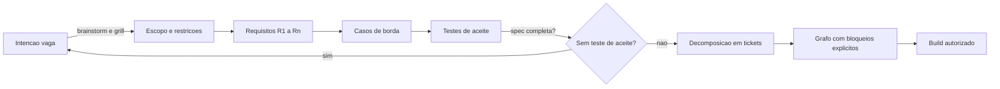

# Capítulo 3: Plano de Voo: Da Intenção à Spec Executável

## 1. Introdução

No Capítulo 2, você ocupou o posto de controlador de voo e aprendeu a separar papéis: o agente executa, a verificação refuta, o humano arbitra. Agora vem o primeiro artefato concreto desse novo ciclo: o plano de voo. Nenhuma aeronave decola sem um plano aprovado — e nenhuma feature agêntica deveria começar sem uma spec executável.

Este capítulo ensina a transformar uma intenção vaga — "quero um sistema de autenticação", "melhora o carrinho de compras" — em uma spec que vira teste de aceite. Você vai aprender as partes obrigatórias da spec (escopo, requisitos R1..Rn, casos de borda, critérios de aceite), a técnica de decomposição em tickets com bloqueios explícitos, e a regra de ouro: se não dá para escrever o teste de aceite na spec, a spec está incompleta.

## 2. Explica

A especificação de software tem uma má reputação justificada. No SDLC clássico, a spec é um documento gigante escrito por analistas, aprovado em reuniões, e abandonado assim que o desenvolvimento começa. O código passa a ser a única fonte de verdade, e a spec vira uma ficção com data de publicação [1].

O paradigma AI-first recupera a spec — mas não a spec-documento. A spec executável é um **contrato de comportamento** escrito em linguagem que uma máquina consegue validar: requisitos numerados, casos de borda explícitos e critérios de aceite que são, na prática, testes. A diferença é que a spec deixa de ser descrição do que será feito e passa a ser **definição do que conta como pronto** [2].

Por que isso importa ainda mais com agentes? Porque o agente não tem o contexto tácito que um colega humano de equipe tem. Quando você pede a um desenvolvedor humano "cria a tela de login", ele preenche mentalmente dezenas de decisões implícitas — onde fica o botão, o que acontece com sessão expirada, como tratar erro de rede. O agente não preenche: ele **inventa**, com confiança, as decisões que você não tomou. A spec executável existe para eliminar a invenção [3].

A pesquisa sobre agentes de engenharia de software confirma o risco. Avaliações como o SWE-bench mostram que agentes resolvem issues com qualidade variável — e que a qualidade despenca quando o problema está mal definido [4]. O problema mal definido não é um bug do agente; é uma lacuna de contrato. A spec fechada reduz dramaticamente a variação de resultado.

Há também uma razão econômica. Tokens são o recurso escasso do ciclo AI-first. Uma spec ambígua gera retrabalho — e cada rodada de retrabalho é uma rodada inteira de tokens consumidos para produzir o que a primeira rodada deveria ter produzido. Escrever a spec bem feita antes do build é a forma mais barata de economizar contexto: custa uma fração do que custaria o ciclo de tentativa e erro do agente [5].

A técnica de decomposição em tickets com bloqueios explícitos completa o quadro. Uma spec não é só texto: é um grafo de trabalho onde cada tarefa declara o que bloqueia e o que ela bloqueia. "Escrever o teste de aceite do login" bloqueia "implementar o login"; "implementar o login" bloqueia "integrar com o provedor de identidade". Esse grafo de dependências é o que permite despachar agentes em paralelo com segurança — ninguém começa uma tarefa cujo antecedente não está pronto [6].

O resultado é uma mudança de mentalidade: a spec não é o início do ciclo, é o **contrato do ciclo**. A fase 2 do SDLC AI-first não termina quando o documento está escrito; termina quando os testes de aceite estão definidos e o grafo de tickets está explícito [7].

## 3. Ilustra

Um plano de voo comercial contém, obrigatoriamente: origem, destino, rota, altitude, velocidade, combustível e alternates — aeroportos para onde o avião pode desviar se algo der errado. O piloto não improvisa o destino durante o voo; o plano é aprovado antes da decolagem e qualquer desvio é negociado com a torre em tempo real.

A spec executável é o plano de voo da feature. O escopo é origem e destino. Os requisitos R1..Rn são a rota e a altitude. Os casos de borda são os alternates — os cenários para onde a implementação desvia quando o caminho feliz falha. E os critérios de aceite são o combustível: a prova objetiva de que o voo pode ser concluído.



Como Comandante de Operações de Software, você vê no diagrama o laço de retorno: a spec só sai do radar quando cada requisito tem um teste de aceite. Caso contrário, volta para a origem — sem vergonha, sem burocracia. É o plano de voo voltando à torre para revisão [8].

## 4. Técnica

### O Esqueleto da Spec Executável

A spec executável é um arquivo estruturado que a esteira consegue interpretar. O formato abaixo em YAML cobre as partes obrigatórias: escopo, requisitos, casos de borda e critérios de aceite.

```yaml
espec:
  titulo: "Autenticacao por email e senha"
  versao: "1.0"
  escopo:
    inclui:
      - "Login com email e senha"
      - "Recuperacao de senha"
    exclui:
      - "Login social (OAuth2)"
      - "Autenticacao por biometria"
  requisitos:
    R1: "Usuario cadastrado consegue autenticar com email e senha validos"
    R2: "Senha incorreta gera erro generico, sem revelar se o email existe"
    R3: "Sessao expira apos 30 minutos de inatividade"
  casos_borda:
    - "Email em caixa alta deve ser normalizado para minusculas"
    - "Senha com 5 tentativas falhas bloqueia a conta por 15 minutos"
    - "Sessao expirada durante requisicao retorna 401 e redireciona para login"
  criterios_aceite:
    - "teste: login_fluxo_feliz -> passa quando R1 verificado"
    - "teste: login_senha_errada -> passa quando R2 verificado"
    - "teste: sessao_expirada -> passa quando R3 verificado"
```

A validação da regra de ouro é trivial: se qualquer requisito não tem critério de aceite, a spec está incompleta. O código abaixo faz essa verificação e bloqueia o avanço.

```python
from dataclasses import dataclass
from typing import Dict, List


@dataclass
class Requisito:
    id: str
    descricao: str
    criterio_aceite: str = ""


def validar_spec(requisitos: Dict[str, Requisito]) -> tuple:
    sem_criterio = [
        r.id for r in requisitos.values() if not r.criterio_aceite.strip()
    ]
    if sem_criterio:
        return False, f"requisitos sem teste de aceite: {', '.join(sem_criterio)}"
    return True, "spec executavel: todos os requisitos tem criterio de aceite"


REQUISITOS = {
    "R1": Requisito("R1", "Usuario cadastrado autentica com credenciais validas",
                    "login_fluxo_feliz"),
    "R2": Requisito("R2", "Senha incorreta gera erro generico", "login_senha_errada"),
    "R3": Requisito("R3", "Sessao expira apos 30 minutos", "sessao_expirada"),
}


if __name__ == "__main__":
    ok, motivo = validar_spec(REQUISITOS)
    print(f"[{'OK' if ok else 'BLOQUEADO'}] {motivo}")
```

### A Regra de Ouro em Ação: Critério que Vira Teste

O critério de aceite não é uma frase de efeito — é o rascunho do teste. A tradução direta produz o esqueleto do teste que o agente deve escrever (e que deve falhar antes da implementação, no espírito test-first).

```python
import unittest


class TesteAutenticacao(unittest.TestCase):
    def setUp(self) -> None:
        self.repositorio = RepositorioUsuariosEmMemoria()

    def test_login_fluxo_feliz(self) -> None:
        self.repositorio.criar("ana@exemplo.com", "segredo-123")
        resultado = autenticar("ana@exemplo.com", "segredo-123")
        self.assertTrue(resultado.autenticado)

    def test_login_senha_errada(self) -> None:
        self.repositorio.criar("ana@exemplo.com", "segredo-123")
        with self.assertRaises(ErroCredenciaisInvalidas):
            autenticar("ana@exemplo.com", "senha-errada")

    def test_sessao_expirada(self) -> None:
        sessao = criar_sessao(usuario_id="u1")
        sessao.ultima_atividade = agora() - 31 * 60
        self.assertTrue(sessao.expirada())


if __name__ == "__main__":
    unittest.main()
```

Este código não compila isoladamente (depende de `RepositorioUsuariosEmMemoria`, `autenticar` e `criar_sessao`), mas demonstra o ponto: cada critério de aceite da spec vira um método de teste nomeado pelo mesmo identificador. O agente de build sabe exatamente o que implementar: fazer esses três testes passarem [9].

### De Spec a Tickets com Bloqueios Explícitos

A decomposição em tickets com dependências declaradas permite despacho paralelo seguro. O grafo abaixo em JSON declara o que bloqueia o quê.

```json
{
  "tickets": [
    {"id": "T1", "tarefa": "escrever teste login_fluxo_feliz", "bloqueado_por": [], "bloqueia": ["T4"]},
    {"id": "T2", "tarefa": "escrever teste login_senha_errada", "bloqueado_por": [], "bloqueia": ["T4"]},
    {"id": "T3", "tarefa": "escrever teste sessao_expirada", "bloqueado_por": [], "bloqueia": ["T5"]},
    {"id": "T4", "tarefa": "implementar autenticar()", "bloqueado_por": ["T1", "T2"], "bloqueia": ["T6"]},
    {"id": "T5", "tarefa": "implementar sessao e expiracao", "bloqueado_por": ["T3"], "bloqueia": ["T6"]},
    {"id": "T6", "tarefa": "integrar e rodar suíte completa", "bloqueado_por": ["T4", "T5"], "bloqueia": []}
  ]
}
```

O despacho por bloqueios é direto: agentes paralelos pegam T1, T2 e T3 simultaneamente (nenhum bloqueado), e só depois que todos concluem é seguro liberar T4 e T5. Esse controle de dependência é o que evita que dois agentes editem o mesmo arquivo ao mesmo tempo e corrompam o working tree [10].

### O Formato Canônico da Spec com Casos de Borda

A spec executável se torna robusta quando os casos de borda são escritos no mesmo nível dos requisitos — com identificador, condição, comportamento esperado e o teste que o protege. O formato abaixo é o padrão que a esteira consome:

```yaml
casos_borda:
  - id: B1
    condicao: "email em caixa alta"
    comportamento_esperado: "normalizado para minusculas antes da busca"
    teste: "login_email_caixa_alta"
  - id: B2
    condicao: "5 tentativas falhas consecutivas"
    comportamento_esperado: "conta bloqueada por 15 minutos"
    teste: "login_bloqueio_apos_5_tentativas"
  - id: B3
    condicao: "sessao expirada durante requisicao"
    comportamento_esperado: "resposta 401 e redirecionamento para login"
    teste: "sessao_expirada_durante_requisicao"
  - id: B4
    condicao: "usuario com credenciais validas mas conta desativada"
    comportamento_esperado: "resposta generica de credenciais invalidas"
    teste: "login_conta_desativada"
```

Cada caso de borda responde a três perguntas: em que condição, o que deve acontecer e qual teste prova. Quando o agente de build recebe essa spec, ele não precisa adivinhar os cenários — eles estão numerados, esperando virar métodos de teste [19].

### A Spec como Fonte de Verdade do Orçamento

A spec executável também declara o custo de contexto esperado — o combustível que a fase de build consumirá. Quando a spec chega ao build com um orçamento explícito, o agente sabe o teto e o time sabe onde o dinheiro foi parar:

```json
{
  "spec": "autenticacao-email-senha",
  "orcamento_build": {
    "tokens_entrada_max": 50000,
    "tokens_saida_max": 15000,
    "estimativa_rodadas": 3
  },
  "estimativa_derivada_de": {
    "complexidade": "media",
    "arquivos_envolvidos": 6,
    "testes_planejados": 5
  }
}
```

A spec vira o documento único que amarra contrato, critérios e custo — o plano de voo completo, não apenas a rota [21].

### O Modelo de Rastreabilidade Spec-Teste

A rastreabilidade entre spec e teste é a espinha dorsal da Fase 2 — e pode ser verificada por máquina. O modelo abaixo liga requisitos, casos de borda e testes:

```python
def verificar_rastreabilidade(requisitos: dict, testes: dict) -> list:
    sem_teste = []
    for rid, crit in requisitos.items():
        if crit not in testes:
            sem_teste.append(rid)
    return sem_teste


REQUISITOS = {"R1": "test_login_fluxo_feliz", "R2": "test_login_senha_errada",
              "R3": "test_sessao_expirada"}
TESTES = {"test_login_fluxo_feliz": True, "test_login_senha_errada": True}

faltantes = verificar_rastreabilidade(REQUISITOS, TESTES)
if faltantes:
    print(f"Requisitos sem teste: {faltantes}")
else:
    print("Rastreabilidade spec-teste completa")
```

A rastreabilidade verificável fecha o ciclo do capítulo: a spec não termina quando o documento está escrito — termina quando todo requisito tem teste correspondente, e a máquina prova [28].

### O Modelo de Ciclo de Vida da Spec

A spec executável também tem ciclo de vida — nasce, é aprovada, é implementada, é revisada e eventualmente aposenta. O modelo abaixo declara os estados da spec e as transições:

| Estado | Significado | Transição para |
|--------|-------------|----------------|
| Rascunho | Em elaboração | Proposta (após critérios completos) |
| Proposta | Pronta para revisão | Aprovada (após validação) |
| Aprovada | Contrato vigente | Em implementação (após build iniciar) |
| Em implementação | Sendo executada | Aprovada (após mudança) ou Aposentada |
| Aposentada | Fora de escopo | — |

O ciclo de vida da spec é o mesmo rigor do ciclo de vida do software: a spec não é um documento congelado, é um contrato vivo com estados e transições auditáveis. A esteira registra cada transição — quem mudou, quando e por quê [27].

### O Modelo de Priorização de Requisitos

Nem todo requisito tem o mesmo peso — e a spec executável declara a prioridade. O modelo MoSCoW adaptado ao AI-first classifica requisitos e define o comportamento da esteira em cada classe:

| Classe | Significado | Comportamento da esteira |
|--------|-------------|--------------------------|
| Must | Sem isso, a feature não existe | Bloqueia build se ausente |
| Should | Valor alto, contornável | Não bloqueia, mas é critério de release |
| Could | Valor adicional | Implementado se orçamento permitir |
| Won't | Fora de escopo agora | Explicitamente declarado como excluído |

A classe Won't é a mais negligenciada — e a mais valiosa: declarar o que não será feito elimina a invenção do agente. O modelo abaixo mostra a priorização em formato de máquina:

```json
{
  "priorizacao": {
    "MUST": ["R1", "R2", "R3"],
    "SHOULD": ["R4", "R5"],
    "COULD": ["R6"],
    "WONT": ["login social", "biometria", "magic link"]
  },
  "regra": "bloco WONT alimenta a secao Exclui do escopo"
}
```

A priorização é o mapa de combustível da spec: a esteira sabe onde gastar primeiro e onde não gastar nunca [26].

### O Modelo de Aceite com Casos de Borda Mínimos

Um requisito só é aceito quando seus casos de borda mínimos passam. O modelo abaixo associa cada requisito ao seu conjunto mínimo de casos e bloqueia o aceite quando falta algum:

```python
CASOS_MINIMOS = {
    'LOGIN-01': ['sucesso', 'senha_incorreta', 'usuario_inexistente', 'conta_bloqueada', 'campo_vazio'],
    'LOGIN-02': ['token_valido', 'token_expirado', 'token_revogado'],
    'LOGIN-03': ['tentativas_abaixo_limite', 'tentativa_no_limite', 'limite_excedido'],
}

def verificar_aceite(requisito, casos_rodados):
    minimos = set(CASOS_MINIMOS.get(requisito, []))
    executados = set(casos_rodados)
    faltantes = minimos - executados
    return {'requisito': requisito, 'aprovado': not faltantes, 'faltantes': sorted(faltantes)}

print(verificar_aceite('LOGIN-01', ['sucesso', 'senha_incorreta', 'usuario_inexistente', 'campo_vazio']))
```

O conjunto mínimo é o contrato de qualidade da spec: "login funciona" nunca é aceite — "login passou nos cinco casos de borda mínimos" é. Quando o caso de conta bloqueada falta, a resposta não é debate sobre qualidade, é execução do caso. Os conjuntos mínimos são definidos na própria spec (seção de casos de borda) e herdados pelos tickets — a spec não descreve o teste, ela define o critério que o teste verifica.

### O Modelo de Priorização de Requisitos

Vamos acompanhar uma transformação concreta: a spec do login. A versão vaga — o que a maioria das organizações escreve — é uma frase: "criar tela de login com email e senha". Esse é o ticket que gera invenção: o agente decide onde fica o botão, o que acontece com sessão expirada, como tratar erro de rede.

A versão executável é o contrato completo:

```yaml
espec_executavel_login:
  escopo:
    inclui: [login email/senha, recuperacao de senha]
    exclui: [login social, biometria]
  requisitos:
    R1: "usuario cadastrado autentica com credenciais validas"
    R2: "senha incorreta gera erro generico, sem revelar existencia do email"
    R3: "sessao expira apos 30 minutos de inatividade"
  casos_borda:
    B1: "email em caixa alta normalizado para minusculas"
    B2: "5 tentativas falhas bloqueiam a conta por 15 minutos"
    B3: "sessao expirada durante requisicao retorna 401"
  criterios_aceite:
    - "teste login_fluxo_feliz"
    - "teste login_senha_errada"
    - "teste sessao_expirada"
    - "teste b1_email_caixa_alta"
    - "teste b2_bloqueio_5_tentativas"
```

A diferença entre as duas versões é a diferença entre adivinhar e contratar: o agente recebeu as decisões, não o direito de inventá-las. É essa a transformação que o capítulo ensina — e que se repete em toda feature [25].

### O Modelo de Conflito de Requisitos

Requisitos entram em conflito — e o conflito precisa ser detectado antes da implementação, não durante. O modelo abaixo varre a spec em busca de contradições lógicas e ambiguidades de vocabulário:

```python
import re

def detectar_conflitos(requisitos):
    conflitos = []
    for i, r1 in enumerate(requisitos):
        for r2 in requisitos[i + 1:]:
            if 'bloqueia' in r1 and 'permite' in r2 and extrair_entidade(r1) == extrair_entidade(r2):
                conflitos.append({'tipo': 'contradicao', 'req1': r1[:50], 'req2': r2[:50]})
    return conflitos

def extrair_entidade(texto):
    m = re.search(r'([A-Z-]+)', texto)
    return m.group(1) if m else ''

requisitos = ['PAGAR-01 bloqueia pagamento sem saldo', 'PAGAR-02 permite pagamento sem saldo em teste']
print(detectar_conflitos(requisitos))
```

O detector é grosseiro — captura só contradições explícitas de vocabulário — mas é o início da disciplina. A maior fonte de conflito em specs reais não é lógica formal, é vocabulário divergente: o mesmo conceito com dois nomes, ou o mesmo nome para dois conceitos. A solução estrutural é o vocabulário ubíguo da parte de arquitetura: antes de escrever requisito, definir o termo no glossário. Conflito detectado na spec custa minutos; conflito detectado em produção custa incidente.

### O Template Universal de Spec

Uma organização que produz muitas specs precisa de um template universal — o esqueleto que todo analista e todo agente seguem, reduzindo a variação entre specs. O template abaixo é o padrão:

```markdown
# Spec: <título da feature>

## Intenção (1 parágrafo)
<o que se quer e por quê, em uma frase cada>

## Escopo
- **Inclui:** <lista>
- **Exclui:** <lista — tão importante quanto o inclui>

## Requisitos
| ID | Requisito (testável) | Critério de aceite (nome do teste) |
|----|----------------------|------------------------------------|
| R1 | <frase testável> | <test_aceite_r1> |

## Casos de borda
| ID | Condição | Comportamento esperado | Teste |
|----|----------|----------------------|-------|
| B1 | <condição> | <comportamento> | <test_b1> |

## Orçamento de contexto
- Tokens de entrada estimados: <N>
- Tokens de saída estimados: <N>
- Rodadas de build estimadas: <N>

## Tickets (grafo de dependências)
| ID | Tarefa | Bloqueado por | Bloqueia |
|----|--------|---------------|----------|
| T1 | <tarefa> | — | <T4> |
```

O template é o formulário de plano de voo da organização: padronizado o bastante para ser comparável, flexível o bastante para qualquer feature. A spec que segue o template nasce completa; a que improvisa nasce com lacunas [23].

### O Validador de Spec com Métricas de Qualidade

Uma spec executável pode ser medida. O validador abaixo calcula métricas de qualidade — rastreabilidade, cobertura de casos de borda e ausência de linguagem vaga — e devolve um parecer estruturado que o revisor usa como evidência:

```python
import re

PALAVRAS_VAGAS = ['rapido', 'melhor', 'adequado', 'apropriado', 'suficiente']

def validar_spec(requisitos, casos_borda, rastreabilidade):
    metricas = {
        'num_requisitos': len(requisitos),
        'num_casos_borda': len(casos_borda),
        'cobertura_casos': len(casos_borda) / len(requisitos) if requisitos else 0,
        'rastreabilidade': len(rastreabilidade) / len(requisitos) if requisitos else 0,
    }
    texto = ' '.join(requisitos).lower()
    vagas = [p for p in PALAVRAS_VAGAS if p in texto]
    metricas['linguagem_vaga'] = vagas
    metricas['aprovada'] = (
        metricas['cobertura_casos'] >= 0.5
        and metricas['rastreabilidade'] >= 1.0
        and not vagas
    )
    return metricas

requisitos = ['CRIAR-CONTA deve validar email', 'CRIAR-CONTA deve exigir senha forte']
print(validar_spec(requisitos, ['email invalido', 'senha curta'], {'CRIAR-CONTA': 'R1, R2'}))
```

A métrica de linguagem vaga é a mais reveladora: palavras como "rápido" e "melhor" não definem nada e são impossíveis de testar. Quando o validador detecta uma delas, o requisito volta para o redator com a marcação exata da palavra — a correção é mecânica e não depende de debate.

### O Caso de Borda como Contrato de Não-Regressão

A spec executável pode — e deve — ser validada por máquina antes do build. O validador abaixo confere as regras de ouro: requisitos numerados, critérios de aceite e escopo com excluídos:

```python
import re


def validar_spec_automatica(texto: str) -> list:
    problemas = []
    requisitos = re.findall(r"\|\s*(R\d+)\s*\|.*?\|\s*(\S+)\s*\|", texto)
    bordas = re.findall(r"\|\s*(B\d+)\s*\|.*?\|\s*(\S+)\s*\|", texto)
    for rid, criterio in requisitos:
        if not criterio:
            problemas.append(f"{rid} sem criterio de aceite")
    for bid, teste in bordas:
        if not teste:
            problemas.append(f"{bid} sem teste")
    if "Exclui" not in texto:
        problemas.append("escopo sem secao Exclui")
    return problemas


SPEC_EXEMPLO = """
| ID | Requisito | Criterio |
| R1 | login valido | test_login_feliz |
| R2 | sessao expira | test_sessao_expirada |
"""

for problema in validar_spec_automatica(SPEC_EXEMPLO):
    print(f"[ESPEC] {problema}")
```

O validador automático é o primeiro radar da spec: antes de o agente tocar no build, a máquina já conferiu as regras de ouro — e reprovou o que faltar [24].

### O Caso de Borda como Contrato de Não-Regressão

Cada caso de borda aprovado é um contrato de não-regressão: uma promessa de que o comportamento não voltará a quebrar. O padrão técnico é o teste de regressão nomeado com o identificador do caso:

```python
import unittest


class TesteCasosBordaAutenticacao(unittest.TestCase):
    def test_b1_email_caixa_alta(self) -> None:
        email = normalizar_email("ANA@exemplo.com")
        self.assertEqual(email, "ana@exemplo.com")

    def test_b2_bloqueio_apos_5_tentativas(self) -> None:
        for _ in range(5):
            tentar_login("ana@exemplo.com", "errada")
        with self.assertRaises(ContaBloqueadaTemporariamente):
            tentar_login("ana@exemplo.com", "correta")

    def test_b4_conta_desativada(self) -> None:
        with self.assertRaises(ErroCredenciaisInvalidas):
            autenticar("desativada@exemplo.com", "qualquer-senha")


if __name__ == "__main__":
    unittest.main()
```

A ligação é direta: caso de borda B1 da spec → teste `test_b1_email_caixa_alta`. O mapa de rastreabilidade é um-para-um — a auditoria (Fase 2.5) pode conferir que todo caso de borda da spec virou teste [22].

### O Modelo de Custo da Spec ao Longo do Ciclo

A spec não é paga uma vez — ela tem custo de manutenção em todas as fases seguintes. O modelo abaixo estima o custo total de propriedade da spec, contabilizando escrita, revisão, atualização e o custo de um defeito não capturado:

```python
def custo_total_spec(caracteres, revisoes_por_mes, meses, taxa_defeito, custo_defeito):
    custo_escrita = caracteres / 500  # 500 caracteres por unidade de esforco
    custo_revisao = revisoes_por_mes * meses * 2
    custo_atualizacao = 0.3 * custo_escrita * meses
    custo_defeitos = taxa_defeito * custo_defeito
    total = custo_escrita + custo_revisao + custo_atualizacao + custo_defeitos
    return {'escrita': round(custo_escrita, 1), 'revisao': custo_revisao,
            'atualizacao': round(custo_atualizacao, 1), 'defeitos': round(custo_defeitos, 1),
            'total': round(total, 1)}

print(custo_total_spec(caracteres=20000, revisoes_por_mes=2, meses=12, taxa_defeito=3, custo_defeito=8))
```

A conta revela a assimetria que justifica o investimento: uma spec de 20 mil caracteres custa pouco para escrever, mas se os 3 defeitos que ela deixou escapar chegarem à produção, cada um custa de 8 a 100 vezes mais para corrigir. O modelo dá ao comandante o número que a conversa de orçamento precisa: spec boa é a que reduz taxa_defeito, e isso se mede no backlog de incidentes.

### A Regressão de Aceite como Contrato Vivo

A suíte de aceite não é estática — cresce a cada spec aprovada e a cada incidente (como você verá no Capítulo 8). O padrão técnico é uma suíte única que todos os agentes rodam antes de qualquer merge:

```bash
#!/usr/bin/env bash
# Regressao de aceite: todos os criterios de todas as specs aprovadas
set -euo pipefail

pytest testes/aceite/ --tb=short --quiet

echo "Regressao de aceite verde: $(find testes/aceite -name 'test_*.py' | wc -l) testes"
```

A regressão é o elo entre a Fase 2 (spec) e a Fase 5 (verificação): cada critério de aceite da spec vira um teste na regressão, e cada teste na regressão protege uma promessa feita ao negócio [20].

### O Modelo de Priorização de Requisitos por Valor

Quando nem tudo cabe no próximo ciclo, a priorização precisa de critério explícito. O modelo abaixo pontua requisitos por valor de negócio, risco e custo, e devolve a ordem de implementação:

```python
def priorizar_requisitos(requisitos):
    for r in requisitos:
        r['score'] = r['valor'] * 0.5 + (5 - r['custo']) * 0.2 + r['risco'] * 0.3
    return sorted(requisitos, key=lambda x: x['score'], reverse=True)

requisitos = [
    {'id': 'R1', 'valor': 5, 'custo': 2, 'risco': 3},
    {'id': 'R2', 'valor': 4, 'custo': 4, 'risco': 2},
    {'id': 'R3', 'valor': 2, 'custo': 1, 'risco': 5},
]
print(priorizar_requisitos(requisitos))
```

A fórmula expressa a política da organização: valor de negócio pesa mais, risco também entra, custo desconta. O requisito R3 de alto risco sobe na fila apesar do baixo valor — porque risco alto não resolvido cedo vira incidente caro depois. A priorização deixa de ser a opinião do gerente de plantão e vira a execução de uma política registrada.

### O Vocabulário do Contrato

A spec executável também carrega o vocabulário ubíguo do domínio — o mesmo glossário que você dominará em profundidade no Capítulo 4. Quando a spec usa "cliente" e o código usa "usuário", o contrato já nasce rachado: o agente implementa uma coisa, o negócio espera outra, e a integração descobre o conflito [15]. Incluir o glossário na spec — com os termos canônicos e os sinônimos proibidos — é a forma mais barata de alinhar linguagem entre humano, agente e verificação [16].

### A Regressão de Aceite como Espelho da Spec

Uma prática que separa equipes maduras das demais é a regressão de aceite: a suíte de critérios de aceite de todas as specs aprovadas, rodando a cada mudança. Quando uma nova feature altera o comportamento de uma antiga, a regressão acusa o conflito antes do deploy [17]. No contexto agêntico, essa regressão é o radar permanente do contrato: cada critério de aceite vira um teste, e cada teste protege uma promessa feita ao negócio [18].

### O Checklist de Qualidade da Spec

O redator termina a spec com um checklist — e o validador roda o mesmo checklist automaticamente. Os itens: cada requisito tem critério de aceite mensurável, cada critério tem caso de borda mínimo, cada termo técnico está no glossário, nenhuma palavra vaga sobreviveu à revisão. O checklist é curto de propósito: poucos itens, todos verificáveis, nenhum dependente de gosto. Quando o mesmo checklist roda no CI e na cabeça do redator, a spec deixa de depender do humor da revisão e passa a depender de evidência.

### Passos para Escrever uma Spec Executável

1. **Escreva a intenção em 1 parágrafo** — se não couber em 1 parágrafo, a intenção ainda é duas intenções.
2. **Defina escopo incluído e excluído** — o que está fora é tão importante quanto o que está dentro.
3. **Numere os requisitos R1..Rn** em frases testáveis ("o usuário consegue...", "o sistema retorna...").
4. **Liste casos de borda** — comece pelos que você já viu quebrar em produção.
5. **Escreva um critério de aceite por requisito** — no formato de nome de teste.
6. **Decomponha em tickets** com `bloqueado_por`/`bloqueia` explícitos.
7. **Valide a regra de ouro** com o script acima antes de autorizar o build [11].

## 5. Aplica

Cena real, em segunda pessoa. Você é o product manager técnico de um SaaS de RH. O CEO pede, com urgência, uma "integração com o novo provedor de folha de pagamento" — sem mais detalhes. No SDLC clássico, você abriria um épico no Jira, e o time começaria a "investigar" a integração, consumindo dias de trabalho exploratório.

No SDLC AI-first, você aplica o que aprendeu. Primeiro, transforma a urgência em escopo: "integrar o envio de faturas de folha para o provedor X, com retry e idempotência". Depois, em uma sessão de 40 minutos, escreve a spec executável com requisitos (R1: enviar fatura; R2: retry com backoff; R3: idempotência por id de fatura), casos de borda (provedor fora do ar, fatura duplicada, timeout parcial) e critérios de aceite nomeados.

O erro comum — e você quase caiu nele — é pular direto para "pedir ao agente para implementar". Você sabe que o resultado seria um agente inventando decisões de contrato: o que acontece com fatura duplicada? Qual timeout? Quantas tentativas? A spec força essas respostas antes do primeiro token de implementação.

O diagnóstico: a intenção vaga era o problema, não a integração. A correção: a spec fechou o contrato e o agente executou a implementação em uma fração do tempo — porque não precisou adivinhar nada.

Na prática, seu checklist para toda nova feature: intenção em 1 parágrafo, escopo com excluídos, requisitos numerados, casos de borda, critérios de aceite com nome de teste, grafo de tickets. Se qualquer item falta, a feature não decola [12].

Armadilhas comuns: escrever specs longas demais (a spec executável é curta — páginas, não capítulos); confundir descrição com critério ("o sistema deve ser seguro" não é critério; "sessão expira em 30 minutos" é); e permitir que o agente "complete" a spec durante o build — o completar é sua prerrogativa, não dele [13].

## 6. Conclusão

Você escreveu o primeiro plano de voo. Três marcos: primeiro, a spec executável como contrato de comportamento — escopo, requisitos, casos de borda e critérios de aceite — em vez de documento descritivo; segundo, a regra de ouro implementada em código: sem critério de aceite, sem decolagem; terceiro, a decomposição em tickets com bloqueios explícitos, que habilita o despacho paralelo seguro de agentes.

Como desafio, pegue a última feature que sua equipe entregou e reconstrua sua spec executável a partir do que foi feito. Você vai descobrir quais decisões foram tomadas por acidente, e que deveriam ter sido tomadas por contrato.

No próximo capítulo, você vai desenhar a cartografia do domínio: design orientado a agentes, fronteiras de módulos e vocabulário ubíguo — o mapa que os agentes usarão para navegar [14].

## 7. Referências Bibliográficas

[1] SOMMERVILLE, Ian. *Engenharia de Software*. 10. ed. São Paulo: Pearson, 2019. Disponível em: https://www.pearson.com. Acesso em: 02 ago. 2026.
[2] HINGEL, Paula. *How AI Changes the SDLC: A Six-Stage Guide.* Augment Code, 2026. Disponível em: https://www.augmentcode.com/guides/how-ai-changes-the-sdlc. Acesso em: 02 ago. 2026.
[3] ANTHROPIC. *Building effective agents.* Disponível em: https://www.anthropic.com/research/building-effective-agents. Acesso em: 02 ago. 2026.
[4] JIMENEZ, Carlos E. et al. *SWE-bench: Can Language Models Resolve Real-World GitHub Issues?* ICLR 2024. Disponível em: https://arxiv.org/abs/2310.06770. Acesso em: 02 ago. 2026.
[5] GRÖPLER, Robin et al. *The Future of Generative AI in Software Engineering: A Vision from Industry and Academia in the European GENIUS Project.* IEEE/ACM AIware, 2025. Disponível em: https://arxiv.org/abs/2511.01348. Acesso em: 02 ago. 2026.
[6] MOHAGHEGHI, Milad et al. *Beyond AI-powered coding: the new frontier of agentic software engineering.* 2025. Disponível em: https://arxiv.org/abs/2509.14838. Acesso em: 02 ago. 2026.
[7] HODA, Rashina. *Toward Agentic Software Engineering Beyond Code: Framing Vision, Values, and Vocabulary.* ICSE 2026 Workshop. Disponível em: https://arxiv.org/abs/2510.19692. Acesso em: 02 ago. 2026.
[8] ROYCHOUDHURY, Abhik et al. *Agentic Software Engineering: state and perspectives.* 2025. Disponível em: https://arxiv.org/abs/2509.09893. Acesso em: 02 ago. 2026.
[9] YANG, John et al. *SWE-agent: Agent-Computer Interfaces Enable Automated Software Engineering.* NeurIPS 2024. Disponível em: https://arxiv.org/abs/2405.15793. Acesso em: 02 ago. 2026.
[10] JIN, Haolin et al. *From LLMs to LLM-based Agents for Software Engineering: A Survey of Current, Challenges and Future.* 2025. Disponível em: https://arxiv.org/abs/2408.02479. Acesso em: 02 ago. 2026.
[11] WANG, Yuchen; GUO, Shangxin; TAN, Chee Wei. *From Code Generation to Software Testing: AI Copilot with Context-Based RAG.* 2025. Disponível em: https://arxiv.org/abs/2504.01866. Acesso em: 02 ago. 2026.
[12] GURGUL, Vincent; GUBELA, Robin; LESSMANN, Stefan. *The State of Generative AI in Software Development: Insights from Literature and a Developer Survey.* 2026. Disponível em: https://arxiv.org/abs/2603.16975. Acesso em: 02 ago. 2026.
[13] LEHMANN, Fabian et al. *Software Engineering in the Era of LLMs.* 2024. Disponível em: https://arxiv.org/abs/2403.09752. Acesso em: 02 ago. 2026.
[14] MICROSOFT. *An AI led SDLC: Building an End-to-End Agentic Software Development Lifecycle with Azure and GitHub.* Microsoft Tech Community, 2026. Disponível em: https://techcommunity.microsoft.com/blog/appsonazureblog/an-ai-led-sdlc-building-an-end-to-end-agentic-software-development-lifecycle-wit/4491896. Acesso em: 02 ago. 2026.
[15] EVANS, Eric. *Domain-Driven Design: Tackling Complexity in the Heart of Software.* Boston: Addison-Wesley, 2003. Disponível em: https://www.informit.com. Acesso em: 02 ago. 2026.
[16] MODEL CONTEXT PROTOCOL. *Documentação oficial do protocolo.* Disponível em: https://modelcontextprotocol.io. Acesso em: 02 ago. 2026.
[17] BECK, Kent. *Test-Driven Development: By Example.* Boston: Addison-Wesley, 2002. Disponível em: https://www.informit.com. Acesso em: 02 ago. 2026.
[18] GURGUL, Vincent; GUBELA, Robin; LESSMANN, Stefan. *The State of Generative AI in Software Development: Insights from Literature and a Developer Survey.* 2026. Disponível em: https://arxiv.org/abs/2603.16975. Acesso em: 02 ago. 2026.
[19] ANTHROPIC. *Introducing the Model Context Protocol.* Disponível em: https://www.anthropic.com/news/model-context-protocol. Acesso em: 02 ago. 2026.
[20] HODA, Rashina. *Toward Agentic Software Engineering Beyond Code: Framing Vision, Values, and Vocabulary.* ICSE 2026 Workshop. Disponível em: https://arxiv.org/abs/2510.19692. Acesso em: 02 ago. 2026.
[21] GRÖPLER, Robin et al. *The Future of Generative AI in Software Engineering: A Vision from Industry and Academia in the European GENIUS Project.* IEEE/ACM AIware, 2025. Disponível em: https://arxiv.org/abs/2511.01348. Acesso em: 02 ago. 2026.
[22] WANG, Yuchen; GUO, Shangxin; TAN, Chee Wei. *From Code Generation to Software Testing: AI Copilot with Context-Based RAG.* 2025. Disponível em: https://arxiv.org/abs/2504.01866. Acesso em: 02 ago. 2026.
[23] EVANS, Eric. *Domain-Driven Design: Tackling Complexity in the Heart of Software.* Boston: Addison-Wesley, 2003. Disponível em: https://www.informit.com. Acesso em: 02 ago. 2026.
[24] BECK, Kent. *Test-Driven Development: By Example.* Boston: Addison-Wesley, 2002. Disponível em: https://www.informit.com. Acesso em: 02 ago. 2026.
[25] HINGEL, Paula. *How AI Changes the SDLC: A Six-Stage Guide.* Augment Code, 2026. Disponível em: https://www.augmentcode.com/guides/how-ai-changes-the-sdlc. Acesso em: 02 ago. 2026.
[26] GURGUL, Vincent; GUBELA, Robin; LESSMANN, Stefan. *The State of Generative AI in Software Development: Insights from Literature and a Developer Survey.* 2026. Disponível em: https://arxiv.org/abs/2603.16975. Acesso em: 02 ago. 2026.
[27] WANG, Yuchen; GUO, Shangxin; TAN, Chee Wei. *From Code Generation to Software Testing: AI Copilot with Context-Based RAG.* 2025. Disponível em: https://arxiv.org/abs/2504.01866. Acesso em: 02 ago. 2026.
[28] BECK, Kent. *Test-Driven Development: By Example.* Boston: Addison-Wesley, 2002. Disponível em: https://www.informit.com. Acesso em: 02 ago. 2026.
