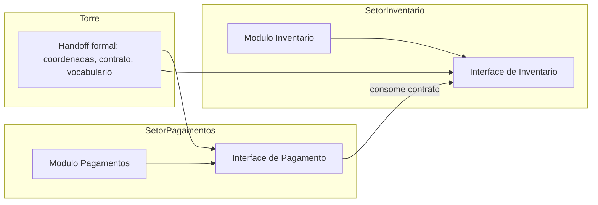

# Capítulo 4: Cartografia do Domínio: Design Orientado a Agentes

## 1. Introdução

No Capítulo 3, você transformou intenção vaga em spec executável — o plano de voo que autoriza a decolagem. Mas um plano de voo sem mapa é perigoso: o piloto sabe para onde vai, mas não conhece o terreno. Este capítulo desenha o mapa — a cartografia do domínio que os agentes usarão para navegar pelo código sem colidir uns com os outros.

Você vai aprender modelagem de domínio orientada a agentes: vocabulário ubíguo, fronteiras de módulos (deep modules), registros de decisão de arquitetura (ADRs) e o princípio de interfaces primeiro. O objetivo é um design tão explícito que dois agentes paralelos trabalhem em módulos diferentes sem precisar conversar — porque o contrato entre eles já está escrito no mapa.

## 2. Explica

Design de software sempre foi sobre fronteiras: o que cada módulo sabe, o que ele expõe e o que ele esconde. No design orientado a humanos, essas fronteiras são negociadas em reuniões e lembradas por convenção. No design orientado a agentes, elas precisam ser **escritas** — porque o agente não tem memória das reuniões e não respeita convenções não declaradas [1].

O vocabulário ubíguo é o primeiro instrumento da cartografia. É um glossário canônico do domínio: cada conceito de negócio tem um único nome, usado em código, spec, testes e conversa. Sem vocabulário ubíguo, o agente recebe "cliente" em um ticket e "usuário" em outro, e implementa dois conceitos diferentes para a mesma coisa — ou o mesmo código para duas coisas diferentes [2].

A fronteira de módulo é o segundo instrumento. O princípio do deep module — módulos profundos, com interface pequena e implementação rica — é particularmente poderoso no contexto agêntico: a interface pequena é o contrato que o agente consumidor precisa ler; a implementação rica é o território onde o agente produtor pode trabalhar com liberdade. Quanto menor a superfície de contrato, menor o custo de contexto para os agentes que a consomem [3].

O terceiro instrumento é o registro de decisão de arquitetura (ADR). Uma decisão de design não é um fato consumado — é uma escolha entre alternativas com trade-offs. O ADR registra o contexto, a decisão e as consequências. Para o agente, o ADR responde à pergunta que nenhum código responde: por que esta estrutura existe? Sem ADRs, o agente que encontra uma decisão estranha "corrige" para o que parece óbvio — e quebra o que funcionava [4].

Por que "interfaces primeiro"? Porque a interface é o ponto de contrato entre agente consumidor e agente produtor. Se a interface está definida antes, os dois lados podem trabalhar em paralelo: o consumidor programa contra a interface (com um stub), o produtor implementa contra a interface (com testes). Quando ambos terminam, a integração é uma cerimônia — não uma negociação [5].

A literatura de engenharia de software com LLMs reforça a importância desses artefatos. Estudos mostram que agentes navegam melhor em codebases com fronteiras claras e documentação de decisões — e que a qualidade da navegação cai drasticamente em codebases "espaguete" sem contratos explícitos [6]. O design não é um luxo estético: é a infraestrutura de navegação dos seus executantes.

Há ainda a dimensão da economia de contexto. Cada agente carrega apenas o contexto necessário: o agente do módulo de pagamentos não precisa ler o módulo de inventário — só precisa da interface. A cartografia do domínio é, portanto, também uma estratégia de lean context: dividir o mapa para que cada navegador carregue só o seu quadrante [7].

## 3. Ilustra

A cartografia aérea moderna separa o espaço aéreo em setores. Cada controlador é responsável por um setor e conhece apenas as rotas do seu quadrante; quando uma aeronave cruza a fronteira do setor, o controle é transferido com um handoff formal — coordenadas, altitude e intenção. Nenhum controlador precisa conhecer o mapa inteiro do país; cada um conhece profundamente o seu setor e superficialmente as fronteiras dos vizinhos.

Esse é exatamente o design orientado a agentes. Os módulos são os setores. As interfaces são as fronteiras com protocolo de handoff. O vocabulário ubíguo é a fraseologia padrão — a linguagem comum que torna o handoff inequívoco. E os ADRs são os manuais de procedimento de cada setor.



Como Comandante de Operações de Software, você nota o detalhe crucial: os setores não se falam diretamente. O módulo de pagamentos não importa o módulo de inventário — consome a interface dele. Dois agentes, um em cada setor, nunca colidem, porque não pisam no território um do outro [8].

## 4. Técnica

### Vocabulário Ubíguo em Código

O vocabulário ubíguo pode e deve ser verificado por máquina. O glossário abaixo vira uma lista de termos canônicos que um CI verifica nos diffs.

```json
{
  "glossario": {
    "cliente": "termo canonico (nao usar: usuario, consumidor, assinante)",
    "fatura": "termo canonico (nao usar: cobranca, boleto, conta)",
    "assinatura": "termo canonico (nao usar: plano, pacote, contrato)",
    "reembolso": "termo canonico (nao usar: estorno, devolucao, refund)"
  },
  "regras": [
    "todo identificador de dominio deve usar um termo do glossario",
    "sinonimos listados em parenteses sao proibidos em codigo e spec"
  ]
}
```

O validador do glossário escaneia o diff e falha se um sinônimo proibido aparece fora de comentário de glossário:

```python
import re
import sys
from pathlib import Path

GLOSSARIO = {
    "usuario": "cliente",
    "consumidor": "cliente",
    "cobranca": "fatura",
    "estorno": "reembolso",
    "refund": "reembolso",
}

RE_COMENTARIO = re.compile(r"^\s*#", re.MULTILINE)


def validar_vocabulario(caminho: str) -> int:
    texto = Path(caminho).read_text(encoding="utf-8")
    sem_comentarios = RE_COMENTARIO.sub("", texto)
    violacoes = []
    for sinonimo, canonico in GLOSSARIO.items():
        if re.search(rf"\b{sinonimo}\b", sem_comentarios, re.IGNORECASE):
            violacoes.append(f"'{sinonimo}' -> use '{canonico}'")
    if violacoes:
        print("VOCABULARIO UBIGUO VIOLADO:")
        for v in violacoes:
            print(f"  - {v}")
        return 1
    print("Vocabulario ubiquo respeitado")
    return 0


if __name__ == "__main__":
    sys.exit(validar_vocabulario(sys.argv[1] if len(sys.argv) > 1 else "codigo.py"))
```

### Deep Modules: Interface Primeiro

A definição da interface antes da implementação é um contrato de trabalho paralelo. O exemplo em TypeScript define a fronteira do módulo de pagamentos antes de qualquer implementação:

```typescript
// contrato/interface do Modulo Pagamentos
// consumidores programam contra ESTA interface (stub do lado consumidor)
export interface ProvedorPagamento {
  criarFatura(clienteId: string, valorCentavos: number): Promise<Fatura>;
  confirmarPagamento(faturaId: string, referenciaExterna: string): Promise<StatusPagamento>;
  estornar(faturaId: string, motivo: string): Promise<Reembolso>;
}

export interface Fatura {
  id: string;
  clienteId: string;
  valorCentavos: number;
  status: "pendente" | "paga" | "cancelada";
}

export interface Reembolso {
  id: string;
  faturaId: string;
  valorCentavos: number;
}

export type StatusPagamento = "confirmado" | "falhou" | "em_analise";
```

O produtor implementa contra a mesma interface, com testes que validam o contrato:

```typescript
import { ProvedorPagamento, Fatura } from "./interface";

export class ProvedorPagamentoEmMemoria implements ProvedorPagamento {
  private faturas = new Map<string, Fatura>();
  private sequencia = 0;

  async criarFatura(clienteId: string, valorCentavos: number): Promise<Fatura> {
    const fatura: Fatura = {
      id: `fat-${++this.sequencia}`,
      clienteId,
      valorCentavos,
      status: "pendente",
    };
    this.faturas.set(fatura.id, fatura);
    return fatura;
  }

  async confirmarPagamento(faturaId: string, referenciaExterna: string): Promise<StatusPagamento> {
    const fatura = this.faturas.get(faturaId);
    if (!fatura) throw new Error("fatura inexistente");
    if (fatura.status !== "pendente") return "falhou";
    fatura.status = "paga";
    return "confirmado";
  }

  async estornar(faturaId: string, motivo: string): Promise<Reembolso> {
    const fatura = this.faturas.get(faturaId);
    if (!fatura) throw new Error("fatura inexistente");
    fatura.status = "cancelada";
    return { id: `reb-${faturaId}`, faturaId, valorCentavos: fatura.valorCentavos };
  }
}
```

A chave do deep module está na relação: a interface tem 3 métodos (superfície pequena), a implementação gerencia estado e regras (profundidade). Um agente consumidor lê 20 linhas de interface; um agente produtor explora a implementação inteira. A fronteira protege ambos [9].

### ADR: Registro de Decisão de Arquitetura

O ADR é o artefato que impede o agente de "melhorar" uma decisão que ele não entende:

```markdown
# ADR-007: Faturas versionadas, não atualizadas in-place

## Contexto
Regulamentação exige trilha de auditoria de alterações em faturas. Atualizar
in-place destrói o histórico e confunde o agente de auditoria.

## Decisao
Toda alteracao cria uma nova versao da fatura (versionamento append-only).
A fatura corrente e a de maior versao.

## Consequencias
- Positivas: trilha completa, auditoria trivial, concorrencia segura.
- Negativas: armazenamento maior, leitura precisa filtrar por versao.

## Alternativas rejeitadas
- Atualizacao in-place: simples, mas sem trilha (rejeitada por regulamentacao).
- Event sourcing completo: poderoso, mas complexidade excessiva para o caso.
```

O ADR em formato estruturado permite que a esteira o valide e o apresente ao agente antes que ele toque no módulo [10].

### O Registro de Módulos como Fonte de Verdade

O mapa do domínio precisa de uma fonte de verdade única e consultável por máquina: o registro de módulos. Cada módulo declara sua interface, seus ADRs e seus contratos de handoff — e o CI valida que o código implementado respeita o registro.

```json
{
  "modulos": [
    {
      "id": "pagamentos",
      "responsabilidade": "criar faturas, confirmar pagamentos, estornar",
      "interface": "contrato/interface_pagamentos.ts",
      "adrs": ["ADR-007", "ADR-011"],
      "handoff_consome": ["cliente", "inventario"],
      "handoff_oferece": ["fatura", "reembolso"],
      "agentes_permitidos": ["agente-pagamentos", "agente-revisor"]
    },
    {
      "id": "inventario",
      "responsabilidade": "estoque, reserva e baixa de itens",
      "interface": "contrato/interface_inventario.ts",
      "adrs": ["ADR-003"],
      "handoff_consome": ["produto"],
      "handoff_oferece": ["estoque"],
      "agentes_permitidos": ["agente-inventario"]
    }
  ]
}
```

O registro é o mapa oficial: quem consome o quê, quem pode pisar onde, e quais decisões regem cada setor. Um agente que tenta acessar um módulo sem estar na lista de permitidos é bloqueado pelo harness — a fronteira em código, não em convenção [18].

### O Validador de Fronteiras no CI

A fronteira precisa ser fiscalizada. O validador abaixo impede que o código do módulo de pagamentos importe implementação interna do módulo de inventário — apenas a interface pública é permitida:

```python
import re
import sys
from pathlib import Path

RE_IMPORT = re.compile(r"^(?:from|import)\s+([\w\.]+)", re.MULTILINE)

FRONTEIRAS = {
    "modulo_pagamentos": {"permitidos": ["cliente", "inventario.interface"],
                           "proibidos": ["inventario.repositorio", "inventario.servico"]},
}


def validar_fronteiras(modulo: str, caminho: Path) -> int:
    texto = caminho.read_text(encoding="utf-8")
    importacoes = [m.group(1) for m in RE_IMPORT.finditer(texto)]
    regras = FRONTEIRAS[modulo]
    violacoes = [i for i in importacoes
                 if any(i.startswith(p) for p in regras["proibidos"])]
    if violacoes:
        print(f"FRONTEIRA VIOLADA em {caminho.name}:")
        for v in violacoes:
            print(f"  - import proibido: {v}")
        return 1
    print(f"Fronteiras do modulo {modulo} respeitadas")
    return 0


if __name__ == "__main__":
    sys.exit(validar_fronteiras("modulo_pagamentos",
                                Path("src/pagamentos/servico.py")))
```

O validador é o guardião do handoff: o setor vizinho só é alcançado pela porta certa (a interface), nunca pela porta dos fundos (a implementação) [19].

### O Handoff Entre Setores

A transferência de controle entre setores — o handoff — é o momento em que a cartografia paga o investimento. Quando o agente do setor de pagamentos precisa de dados do setor de inventário, ele não atravessa a fronteira: solicita via interface, com contrato explícito [14]. Esse protocolo de handoff é idêntico ao dos controladores de voo: coordenadas, altitude e intenção são passadas de forma padronizada, e o controlador receptor assume sem ambiguidade. No código, o handoff vira uma chamada de API documentada — nunca um acesso direto ao banco do vizinho [15].

### Fronteiras Como Célula de Contenção

Há uma razão estrutural para as fronteiras importarem mais no AI-first: elas são as células de contenção do contexto. Um agente que navega por um módulo sem fronteiras carrega o módulo inteiro no contexto — arquivos, históricos, decisões antigas. Com fronteiras, ele carrega a interface e os ADRs do setor: uma fração dos tokens com o dobro de sinal [16]. A cartografia do domínio é, portanto, também uma estratégia de lean context, como você verá em profundidade no Capítulo 9 — o mapa define quanto combustível cada navegador consome [17].

### O Glossário como Contrato de Contexto

O glossário ubíguo não é só uma lista — é um contrato de contexto que define o que os agentes veem e o que nunca devem ver. O formato abaixo vai além dos sinônimos: declara o escopo de cada termo e o contexto de uso permitido:

```yaml
glossario_estendido:
  cliente:
    sinonimos_proibidos: [usuario, consumidor, assinante]
    escopo: "entidade juridica ou pessoa que contrata servicos"
    uso_permitido: [spec, codigo, testes, docs]
    uso_proibido: [infra, deploy, metricas]
  fatura:
    sinonimos_proibidos: [cobranca, boleto, conta]
    escopo: "documento financeiro versionado (append-only)"
    uso_permitido: [spec, codigo, testes, relatorios]
    uso_proibido: [logs de infra]
```

O escopo por termo resolve o problema clássico do vocabulário ubíguo: a mesma palavra com significados diferentes em contextos diferentes. O agente sabe que "cliente" em contexto de infra não é permitido — e o CI do glossário fiscaliza [20].

### O Modelo de Migração de Monólito em Setores

A migração de um monólito para setores é o caso mais comum de aplicação da cartografia — e o mais arriscado. O modelo abaixo é o plano de migração incremental:

| Fase | Ação | Risco | Gate |
|------|------|-------|------|
| 1 | Mapear o monólito: responsabilidades, dependências, dados | Baixo | Mapa revisado |
| 2 | Extrair o setor de menor risco (cliente) com interface | Médio | Testes de contrato verdes |
| 3 | Migrar tráfego para o setor novo com canário | Médio | Sinais vitais saudáveis |
| 4 | Extrair os setores seguintes (pagamentos, inventário) | Alto | Cada um com gate próprio |
| 5 | Remover o acoplamento legado quando nenhum consumidor restar | Alto | Zero referências ao monólito |

O plano de migração é a cartografia em movimento: cada fase tem risco e gate, e a migração nunca anda mais rápido que a evidência [28].

### O Validador de ADRs em Código

Os ADRs podem ser validados por máquina — garantindo que toda decisão registrada tem contexto, consequências e alternativas. O validador abaixo confere a completude do ADR:

```python
import json
from pathlib import Path

CAMPOS_OBRIGATORIOS = ["id", "titulo", "contexto", "decisao",
                       "consequencias", "alternativas_rejeitadas"]


def validar_adr(caminho: Path) -> tuple:
    try:
        dados = json.loads(caminho.read_text(encoding="utf-8"))
    except ValueError as exc:
        return False, f"ADR invalido: {exc}"
    adr = dados["adrs"][0]
    faltantes = [c for c in CAMPOS_OBRIGATORIOS if c not in adr]
    if faltantes:
        return False, f"ADR sem campos: {', '.join(faltantes)}"
    if not adr["alternativas_rejeitadas"]:
        return False, "ADR sem alternativas rejeitadas"
    return True, f"ADR {adr['id']} completo e valido"


if __name__ == "__main__":
    ok, motivo = validar_adr(Path("adr_exemplo.json"))
    print(f"[{'OK' if ok else 'FALHA'}] {motivo}")
```

O validador de ADRs é o guardião da memória de decisão: o agente que encontra um ADR incompleto o devolve para revisão — nunca decide no lugar da decisão registrada [27].

### O Modelo de Módulos com Profundidade

O deep module é o padrão de design que maximiza a razão entre valor e superfície. O modelo abaixo avalia a profundidade de um módulo — a métrica que o Comandante usa para julgar se a fronteira está bem desenhada:

```python
def profundidade_modulo(metodos_interface: int, linhas_implementacao: int) -> float:
    """Quanto maior a razao, mais profundo o modulo (interface pequena, corpo rico)."""
    return round(linhas_implementacao / max(metodos_interface, 1), 1)


MODULOS = [
    ("pagamentos", 3, 1200),
    ("inventario", 2, 800),
    ("legado_espaguete", 40, 3000),
]

for nome, metodos, linhas in MODULOS:
    p = profundidade_modulo(metodos, linhas)
    avaliacao = "profundo (bom)" if p > 200 else ("mediano" if p > 80 else "raso (ruim)")
    print(f"{nome}: profundidade={p} -> {avaliacao}")
```

A métrica de profundidade é o radar da arquitetura: o módulo legado com 40 métodos na interface e corpo raso é o sinal clássico de fronteira ruim — o agente consumidor precisa ler quase tudo para entender quase nada [26].

### O Modelo de Teste de Contrato com Versionamento

O teste de contrato precisa saber com qual versão da interface está falando. O modelo abaixo associa cada contrato a um schema versionado e detecta incompatibilidades de versão antes do deploy:

```python
class RegistroDeContratos:
    def __init__(self):
        self.contratos = {}

    def publicar(self, servico, versao, schema):
        self.contratos.setdefault(servico, {})[versao] = schema

    def verificar(self, servico, versao_consumidor, versao_provedor):
        schema_consumidor = self.contratos.get(servico, {}).get(versao_consumidor)
        schema_provedor = self.contratos.get(servico, {}).get(versao_provedor)
        if schema_consumidor is None or schema_provedor is None:
            return {'compativel': False, 'motivo': 'versao inexistente'}
        faltantes = set(schema_consumidor.get('campos', [])) - set(schema_provedor.get('campos', []))
        return {'compativel': not faltantes, 'campos_faltantes': sorted(faltantes)}

registro = RegistroDeContratos()
registro.publicar('cobranca', 'v2', {'campos': ['id', 'valor', 'status', 'cupom']})
registro.publicar('cobranca', 'v1', {'campos': ['id', 'valor', 'status']})
print(registro.verificar('cobranca', 'v2', 'v1'))
```

A incompatibilidade detectada aqui — consumidor v2 pedindo o campo cupom que o provedor v1 não entrega — é exatamente o tipo de quebra que explode em produção com deploy descoordenado. O registro versionado transforma a compatibilidade em verificação mecânica: nenhuma versão nova de contrato entra sem o teste de compatibilidade contra todas as versões consumidas. É a diferença entre contrato implícito (quebra silenciosa) e contrato explícito (quebra bloqueada no CI).

### O Modelo de Interface como Contrato de Contexto

Vamos aplicar a cartografia em um caso concreto: o redesenho de um monólito de cobrança em setores. O monólito tem 40 mil linhas, um único deploy e um acoplamento total entre cliente, fatura e inventário. O redesenho segue a sequência da cartografia:

1. **Extraia o vocabulário ubíguo**: cliente, fatura, reembolso, produto — os termos canônicos que o negócio usa.
2. **Identifique as responsabilidades**: pagamentos (faturas, cobranças, estornos), inventário (estoque, reserva), cliente (cadastro, endereços).
3. **Desenhe as interfaces primeiro**: a interface de pagamento com 3 métodos; a de inventário com 2.
4. **Registre os ADRs**: fatura versionada (ADR-007), estoque com reserva (ADR-003).
5. **Defina os handoffs**: pagamentos consome cliente; checkout consome pagamentos e inventário.

O passo 3 é o mais importante — e o mais difícil culturalmente. A tentação é começar pela implementação; a disciplina é congelar a interface antes de qualquer linha de código. O agente do setor de pagamentos trabalha contra a interface; o agente do checkout também. A integração vira cerimônia, não negociação [24].

### O Modelo de Interface como Contrato de Contexto

A interface não é só um contrato de tipos — é um contrato de contexto. O modelo abaixo declara, para cada interface, o contexto que o agente consumidor precisa carregar:

```json
{
  "interfaces": [
    {
      "id": "interface_pagamentos",
      "metodos": ["criarFatura", "confirmarPagamento", "estornar"],
      "contexto_consumidor": {
        "tipos_necessarios": ["Fatura", "StatusPagamento", "Reembolso"],
        "adrs_obrigatorios": ["ADR-007"],
        "termos_glossario": ["fatura", "reembolso"]
      }
    }
  ]
}
```

O contrato de contexto responde à pergunta que o Capítulo 9 aprofundará: quanto combustível o agente consumidor gasta? A resposta é o mínimo declarado na interface — tipos, ADRs e termos — e nada além. A fronteira que protege o território também protege o contexto [25].

### O Modelo de Custo da Migração em Setores

Migrar um monólito em setores custa caro se feita às cegas. O modelo abaixo estima o esforço de extração de cada setor candidato, usando tamanho, número de dependências e acoplamento com o núcleo como preditores:

```python
def custo_extracao(linhas, dependencias, acoplamento_nucleo):
    esforco = 15 * (linhas / 1000)
    esforco += 4 * dependencias
    esforco += 20 * acoplamento_nucleo
    risco = acoplamento_nucleo * 10
    return {'esforco_dias': round(esforco, 1), 'risco': round(risco, 1),
            'prioridade': 'alta' if acoplamento_nucleo < 0.3 else 'baixa'}

print(custo_extracao(linhas=8000, dependencias=12, acoplamento_nucleo=0.8))
print(custo_extracao(linhas=8000, dependencias=12, acoplamento_nucleo=0.1))
```

A leitura contraintuitiva do modelo: o setor mais acoplado ao núcleo é o mais arriscado, mas também o mais valioso de extrair — é nele que as mudanças quebram tudo. A estratégia recomendada é começar pelos setores de baixo acoplamento (ganho rápido, pouco risco) e deixar os setores centrais para quando a esteira de testes de contrato já estiver provando a segurança das extrações.

### O Modelo de Observabilidade do Setor

O setor, depois de extraído, precisa de observabilidade própria — ou a operação fica cega. O modelo abaixo registra para cada setor seus endpoints, métricas e dono, e detecta setores órfãos:

```python
class ObservabilidadeDeSetores:
    def __init__(self):
        self.setores = {}

    def registrar(self, nome, endpoints, metricas, dono):
        self.setores[nome] = {'endpoints': endpoints, 'metricas': metricas, 'dono': dono, 'alertas': 0}

    def setores_orfaos(self):
        return [n for n, s in self.setores.items() if not s['dono'] or not s['metricas']]

    def registrar_alerta(self, nome):
        self.setores[nome]['alertas'] += 1

obs = ObservabilidadeDeSetores()
obs.registrar('pagamentos', ['/cobrar', '/estornar'], ['latencia', 'erros'], 'time-pag')
obs.registrar('relatorios', ['/relatorio'], [], '')
print(obs.setores_orfaos())
```

O setor de relatórios, sem métricas e sem dono, é órfão — e setor órfão é risco operacional: quando quebrar, ninguém saberá por que nem quem é responsável. A regra de extração é simples: um setor só é considerado extraído quando tem endpoints, métricas e dono registrados. Observabilidade não é luxo da fase de produção — é critério de conclusão da migração em setores.

### O Mapa de Dependências entre Módulos

O registro de módulos declara quem consome o quê; o mapa de dependências — o grafo de handoffs — é o que permite o despacho paralelo seguro. O grafo abaixo declara as arestas de consumo entre setores:

```yaml
dependencias:
  pagamentos:
    consome: [cliente, inventario.interface]
    e_consumido_por: [checkout, relatorios]
    proibido_consumir: [inventario.implementacao, cobranca_legada]
  inventario:
    consome: [produto]
    e_consumido_por: [checkout, pagamentos]
    proibido_consumir: [pagamentos.implementacao]
  checkout:
    consome: [pagamentos.interface, inventario.interface, cliente]
    e_consumido_por: [frontend]
    proibido_consumir: []
```

O mapa de dependências é o radar da cartografia: mostra onde os agentes podem colidir antes de colidirem. Dois agentes que consomem o mesmo módulo só editam o próprio setor — a aresta de consumo é unidirecional e declarada [22].

### O Monitor de Acoplamento como Gate de CI

A profundidade dos módulos se degrada aos poucos — um import aqui, uma dependência ali — e ninguém percebe até ser tarde demais. O monitor abaixo roda no CI e bloqueia o merge quando o acoplamento entre módulos ultrapassa o limiar:

```python
import re
from collections import defaultdict

class MonitorDeAcoplamento:
    def __init__(self, limite_imports=5):
        self.limite = limite_imports
        self.dependencias = defaultdict(set)

    def alimentar(self, modulo, imports):
        self.dependencias[modulo].update(imports)

    def verificar(self):
        violacoes = []
        for modulo, deps in self.dependencias.items():
            if len(deps) > self.limite:
                violacoes.append({'modulo': modulo, 'dependencias': sorted(deps), 'contagem': len(deps)})
        return {'aprovado': not violacoes, 'violacoes': violacoes}

monitor = MonitorDeAcoplamento(limite_imports=4)
monitor.alimentar('pagamentos', {'usuario', 'cobranca', 'notificacao', 'auditoria', 'relatorio', 'catalogo'})
print(monitor.verificar())
```

O número de dependências diretas é uma métrica grosseira, mas é a mais barata de coletar e a mais fácil de discutir em review: "este módulo depende de seis outros, cinco é o limite". Quando o monitor acusa, a conversa não é sobre a métrica — é sobre por que o módulo de pagamentos precisa conhecer o catálogo. Na maioria dos casos a resposta é um acoplamento acidental que a refatoração em setores elimina.

### O Teste de Contrato entre Módulos

As fronteiras não são apenas declaradas — são testadas. O teste de contrato entre módulos valida que o consumidor e o produtor falam a mesma língua:

```python
import unittest


class TesteContratoPagamentosInventario(unittest.TestCase):
    """Valida o handoff entre o setor de pagamentos e o de inventario."""

    def test_contrato_estoque_na_interface(self) -> None:
        """Pagamentos so acessa inventario via interface publica."""
        import modulo_pagamentos
        self.assertTrue(hasattr(modulo_pagamentos, "consultar_estoque"))

    def test_contrato_fatura_na_interface(self) -> None:
        """Checkout so acessa pagamentos via interface publica."""
        import modulo_checkout
        self.assertTrue(hasattr(modulo_checkout, "fatura_da_interface"))

    def test_sem_acesso_interno(self) -> None:
        """Nenhum modulo importa implementacao interna do vizinho."""
        import modulo_pagamentos
        self.assertFalse(hasattr(modulo_pagamentos, "_repositorio_interno"))


if __name__ == "__main__":
    unittest.main()
```

O teste de contrato é o handoff ensaiado: cada fronteira crítica tem um teste que prova que o protocolo funciona — e falha ruidosamente quando alguém tenta usar a porta dos fundos [23].

### O ADR como Contrato de Decisão

O ADR estruturado é consultável por máquina — e a esteira pode injetá-lo no contexto do agente antes de cada edição no módulo afetado:

```json
{
  "adrs": [
    {
      "id": "ADR-007",
      "data": "2026-05-12",
      "titulo": "Faturas versionadas, nao atualizadas in-place",
      "modulos_afetados": ["pagamentos"],
      "contexto": "regulamentacao exige trilha de auditoria de alteracoes",
      "decisao": "append-only com versao corrente = maior versao",
      "consequencias": {
        "positivas": ["trilha completa", "auditoria trivial", "concorrencia segura"],
        "negativas": ["armazenamento maior", "leitura filtra por versao"]
      },
      "alternativas_rejeitadas": [
        "atualizacao in-place (sem trilha)",
        "event sourcing completo (complexidade excessiva)"
      ]
    }
  ]
}
```

O ADR em formato estruturado transforma a memória de decisão em dado operacional: quando o agente toca em pagamentos, o harness injeta o ADR-007 no contexto — a decisão antiga vira contexto do presente [21].

### O Modelo de Fronteira com Política de Acesso

A fronteira entre módulos precisa de política de acesso — o que cada lado pode chamar. O modelo abaixo define e valida a política de acesso entre módulos:

```python
class PoliticaDeAcesso:
    def __init__(self):
        self.regras = {}

    def permitir(self, origem, destino, operacao):
        self.regras.setdefault(origem, []).append({'destino': destino, 'operacao': operacao})

    def verificar(self, origem, destino, operacao):
        permitidas = self.regras.get(origem, [])
        return any(p['destino'] == destino and p['operacao'] == operacao for p in permitidas)

p = PoliticaDeAcesso()
p.permitir('cobranca', 'usuario', 'ler')
print(p.verificar('cobranca', 'usuario', 'ler'))
print(p.verificar('cobranca', 'usuario', 'gravar'))
```

A política de acesso torna a fronteira explícita: cobrança pode ler do módulo de usuário, mas não gravar. A assimetria de leitura/gravação é o coração do deep module — cada módulo esconde sua escrita e expõe leituras controladas. Quando o teste de contrato da fronteira roda no CI com a política carregada, a violação é bloqueada na hora e a conversa sobre por que cobrança precisava gravar direto em usuário acontece antes do merge, não depois do incidente.

### A Métrica do Mapa

A cartografia também precisa de régua. Três métricas simples respondem se o mapa está funcionando: taxa de integração sem conflito (quanto menos cirurgia de merge, melhor o desenho de fronteiras), tokens por navegação (quanto menor o contexto de um agente para trabalhar no setor, melhor a divisão) e retrabalho por fronteira (quantas vezes o agente consumidor precisou voltar à interface porque ela não cobria o caso) [18]. Onde o mapa falha, a métrica mostra antes do incidente — o radar da arquitetura, não o boletim do acidente [19].

### O Ritual de Revisão de Fronteiras

As fronteiras entre módulos precisam de revisão periódica — o mapa que estava certo na migração pode ter degradado. O ritual é simples e fixo: a cada ciclo, o time revisa o mapa de dependências, roda o monitor de acoplamento e o teste de contrato, e responde três perguntas — o que deveria estar separado e está junto, o que deveria estar junto e está separado, qual fronteira ninguém entende mais. As respostas viram tickets de refatoração ou decisões registradas de manter como está. Fronteira sem revisão é fronteira que apodrece.

### Passos para Desenhar o Mapa

1. **Extraia o vocabulário ubíguo** da spec e do negócio — liste os termos canônicos e os proibidos.
2. **Identifique os setores** (módulos) e suas responsabilidades únicas.
3. **Escreva as interfaces primeiro** — em código, com tipos explícitos, antes de qualquer implementação.
4. **Registre cada decisão de arquitetura em ADR** — contexto, decisão, consequências, alternativas rejeitadas.
5. **Configure o CI do vocabulário** — o validador falha se um sinônimo proibido entra no diff.
6. **Divida o mapa em quadrantes** para que cada agente carregue só o contexto do seu setor [11].

## 5. Aplica

Cena real, em segunda pessoa. Sua equipe de plataforma está migrando um monólito para serviços. Você contrata dois agentes de IA para acelerar: o Agente A cuida do "módulo de clientes", o Agente B do "módulo de faturas". Sem cartografia, o resultado é previsível: o Agente A cria uma classe `Usuario` com método `getCobrancas()`; o Agente B cria `Cliente` com `getFaturas()`. Quando a integração chega, os dois módulos não conversam, o time gasta duas semanas costurando os contratos, e um dos agentes "refatora" o código do outro — porque cada um achou que o território era seu.

O erro não foi usar dois agentes. O erro foi despachá-los **sem mapa**. Faltaram os três instrumentos do capítulo: o vocabulário ubíguo (Cliente ou Usuario? Fatura ou Cobranca?), as interfaces primeiro (ninguém definiu o contrato entre os módulos), e os ADRs (a regra de fatura versionada existia só na cabeça do arquiteto).

O diagnóstico, ligado à teoria: fronteiras não declaradas são fronteiras disputadas. A correção prática:

1. **Congele 1 dia para a cartografia** antes de soltar os agentes: glossário, interfaces, ADRs.
2. **Compartilhe o mapa com os dois agentes** como parte do contexto inicial (custa tokens uma vez; economiza retrabalho sempre).
3. **Configure o CI de vocabulário** — o Agente A que escrever `Usuario` em vez de `Cliente` tem o diff reprovado automaticamente.
4. **Programe o handoff**: quando o módulo A precisar do B, o contrato é a interface, nunca o código interno.

Armadilhas comuns: desenhar o mapa inteiro antes de começar (mapa demais também é desperdício — desenhe só os setores que serão tocados na iteração); interfaces inchadas (toda feature nova vira método na interface — resistir; interface pequena é contrato, interface grande é acoplamento); e ADRs que ninguém lê (o ADR só funciona se a esteira o injeta no contexto do agente antes da edição) [12].

## 6. Conclusão

Você desenhou o mapa do domínio. Três marcos: primeiro, o vocabulário ubíguo como linguagem canônica verificável por máquina — o CI reprova sinônimo fora do glossário; segundo, as interfaces primeiro como fronteiras de trabalho paralelo — deep modules que protegem consumidores e produtores; terceiro, os ADRs como memória das decisões — o antídoto contra o agente que "melhora" o que não entende.

Como desafio, desenhe a cartografia de um módulo legado seu: glossário, interfaces existentes (mesmo implícitas) e um ADR para a decisão mais estranha que você encontrar.

No próximo capítulo, você liga os motores: harness, skills, MCPs e worktrees — o ecossistema de execução que coloca o mapa em movimento [13].

## 7. Referências Bibliográficas

[1] JIN, Haolin et al. *From LLMs to LLM-based Agents for Software Engineering: A Survey of Current, Challenges and Future.* 2025. Disponível em: https://arxiv.org/abs/2408.02479. Acesso em: 02 ago. 2026.
[2] EVANS, Eric. *Domain-Driven Design: Tackling Complexity in the Heart of Software.* Boston: Addison-Wesley, 2003. Disponível em: https://www.informit.com. Acesso em: 02 ago. 2026.
[3] OUSTERHOUT, John. *A Philosophy of Software Design.* 2. ed. Stanford: Yaknyam Press, 2021. Disponível em: https://web.stanford.edu/~ouster/cgi-bin/book.php. Acesso em: 02 ago. 2026.
[4] NYGARD, Michael. *Documenting Software Architectures: Views and Beyond.* 2. ed. Boston: Addison-Wesley, 2010. Disponível em: https://www.sei.cmu.edu. Acesso em: 02 ago. 2026.
[5] ANTHROPIC. *Building effective agents.* Disponível em: https://www.anthropic.com/research/building-effective-agents. Acesso em: 02 ago. 2026.
[6] LEHMANN, Fabian et al. *Software Engineering in the Era of LLMs.* 2024. Disponível em: https://arxiv.org/abs/2403.09752. Acesso em: 02 ago. 2026.
[7] GRÖPLER, Robin et al. *The Future of Generative AI in Software Engineering: A Vision from Industry and Academia in the European GENIUS Project.* IEEE/ACM AIware, 2025. Disponível em: https://arxiv.org/abs/2511.01348. Acesso em: 02 ago. 2026.
[8] MOHAGHEGHI, Milad et al. *Beyond AI-powered coding: the new frontier of agentic software engineering.* 2025. Disponível em: https://arxiv.org/abs/2509.14838. Acesso em: 02 ago. 2026.
[9] YANG, John et al. *SWE-agent: Agent-Computer Interfaces Enable Automated Software Engineering.* NeurIPS 2024. Disponível em: https://arxiv.org/abs/2405.15793. Acesso em: 02 ago. 2026.
[10] HODA, Rashina. *Toward Agentic Software Engineering Beyond Code: Framing Vision, Values, and Vocabulary.* ICSE 2026 Workshop. Disponível em: https://arxiv.org/abs/2510.19692. Acesso em: 02 ago. 2026.
[11] ROYCHOUDHURY, Abhik et al. *Agentic Software Engineering: state and perspectives.* 2025. Disponível em: https://arxiv.org/abs/2509.09893. Acesso em: 02 ago. 2026.
[12] GURGUL, Vincent; GUBELA, Robin; LESSMANN, Stefan. *The State of Generative AI in Software Development: Insights from Literature and a Developer Survey.* 2026. Disponível em: https://arxiv.org/abs/2603.16975. Acesso em: 02 ago. 2026.
[13] MICROSOFT. *An AI led SDLC: Building an End-to-End Agentic Software Development Lifecycle with Azure and GitHub.* Microsoft Tech Community, 2026. Disponível em: https://techcommunity.microsoft.com/blog/appsonazureblog/an-ai-led-sdlc-building-an-end-to-end-agentic-software-development-lifecycle-wit/4491896. Acesso em: 02 ago. 2026.
[14] ROYCHOUDHURY, Abhik et al. *Agentic Software Engineering: state and perspectives.* 2025. Disponível em: https://arxiv.org/abs/2509.09893. Acesso em: 02 ago. 2026.
[15] CLARKE, Peter et al. *Model Context Protocol: overview e adoção.* 2025. Disponível em: https://arxiv.org/abs/2504.11423. Acesso em: 02 ago. 2026.
[16] GRÖPLER, Robin et al. *The Future of Generative AI in Software Engineering: A Vision from Industry and Academia in the European GENIUS Project.* IEEE/ACM AIware, 2025. Disponível em: https://arxiv.org/abs/2511.01348. Acesso em: 02 ago. 2026.
[17] WANG, Yuchen; GUO, Shangxin; TAN, Chee Wei. *From Code Generation to Software Testing: AI Copilot with Context-Based RAG.* 2025. Disponível em: https://arxiv.org/abs/2504.01866. Acesso em: 02 ago. 2026.
[18] FORSGREN, Nicole; HUMBLE, Jez; KIM, Gene. *Accelerate: The Science of Lean Software and DevOps.* Portland: IT Revolution Press, 2018. Disponível em: https://itrevolution.com. Acesso em: 02 ago. 2026.
[19] HODA, Rashina. *Toward Agentic Software Engineering Beyond Code: Framing Vision, Values, and Vocabulary.* ICSE 2026 Workshop. Disponível em: https://arxiv.org/abs/2510.19692. Acesso em: 02 ago. 2026.
[20] JIN, Haolin et al. *From LLMs to LLM-based Agents for Software Engineering: A Survey of Current, Challenges and Future.* 2025. Disponível em: https://arxiv.org/abs/2408.02479. Acesso em: 02 ago. 2026.
[21] NYGARD, Michael. *Documenting Software Architectures: Views and Beyond.* 2. ed. Boston: Addison-Wesley, 2010. Disponível em: https://www.sei.cmu.edu. Acesso em: 02 ago. 2026.
[22] OUSTERHOUT, John. *A Philosophy of Software Design.* 2. ed. Stanford: Yaknyam Press, 2021. Disponível em: https://web.stanford.edu/~ouster/cgi-bin/book.php. Acesso em: 02 ago. 2026.
[23] CHACON, Scott; STRAUB, Ben. *Pro Git.* 2. ed. Nova York: Apress, 2014. Disponível em: https://git-scm.com/book. Acesso em: 02 ago. 2026.
[24] EVANS, Eric. *Domain-Driven Design: Tackling Complexity in the Heart of Software.* Boston: Addison-Wesley, 2003. Disponível em: https://www.informit.com. Acesso em: 02 ago. 2026.
[25] WANG, Yuchen; GUO, Shangxin; TAN, Chee Wei. *From Code Generation to Software Testing: AI Copilot with Context-Based RAG.* 2025. Disponível em: https://arxiv.org/abs/2504.01866. Acesso em: 02 ago. 2026.
[26] OUSTERHOUT, John. *A Philosophy of Software Design.* 2. ed. Stanford: Yaknyam Press, 2021. Disponível em: https://web.stanford.edu/~ouster/cgi-bin/book.php. Acesso em: 02 ago. 2026.
[27] NYGARD, Michael. *Documenting Software Architectures: Views and Beyond.* 2. ed. Boston: Addison-Wesley, 2010. Disponível em: https://www.sei.cmu.edu. Acesso em: 02 ago. 2026.
[28] JIN, Haolin et al. *From LLMs to LLM-based Agents for Software Engineering: A Survey of Current, Challenges and Future.* 2025. Disponível em: https://arxiv.org/abs/2408.02479. Acesso em: 02 ago. 2026.
