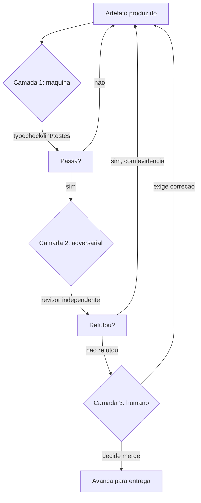

# Capítulo 6: O Radar: Verificação Adversarial e Evidência

## 1. Introdução

No Capítulo 5, você ligou os motores — harness, skills, MCPs e worktrees — e adotou o test-first como régua do build. Agora chegou a hora do instrumento que separa o SDLC AI-first de um caos com boa intenção: o radar. A verificação adversarial é a camada que tenta refutar o trabalho antes que ele decole para produção.

Este capítulo aprofunda a Fase 5 do ciclo: as três camadas de verificação (máquina, adversarial e humana), a evidência antes de afirmação como princípio inegociável, e a implementação prática de uma esteira de refutação. Você vai aprender a construir um revisor agêntico que procura o defeito em vez de validar o acerto — e a nunca aceitar "está pronto" sem o output do comando que prova.

## 2. Explica

A verificação tradicional de software pergunta: "este código funciona?". A verificação adversarial pergunta: "onde este código quebra?". A diferença parece sutil, mas muda a postura de quem revisa — e o resultado da revisão [1].

No SDLC clássico, a verificação é uma fase final: o QA testa depois que o desenvolvimento termina, e o retrabalho volta para o desenvolvedor com um ticket. No SDLC AI-first, a verificação é uma **camada contínua** que atravessa todas as fases: o radar monitora o voo do agente do início ao fim, não apenas na aterrissagem [2].

A primeira camada é a máquina: typecheck, lint, testes. É a camada barata e implacável — não discute, executa. Um typecheck pega o erro que o revisor humano jamais veria em uma leitura; uma suíte de testes pega a regressão que a leitura de código não alcança. A máquina é o primeiro radar porque é o mais confiável [3].

A segunda camada é a adversarial: um revisor — humano ou agêntico — que assume o artefato culpado até prova em contrário. Essa postura de refutação é o antídoto para o viés do produtor: quem escreve o código acredita que ele funciona (acabou de escrevê-lo); quem revisa precisa duvidar por profissão. A pesquisa em engenharia de software agêntica mostra que sistemas com revisão independente superam sistemas de auto-validação — o auto-testado do próprio agente tende a confirmar os próprios pressupostos [4].

A terceira camada é a humana: a decisão de merge. A máquina e o revisor agêntico filtram o volume; o humano arbitra a exceção. O papel do humano na verificação não é ler tudo — é decidir onde a máquina e o agente podem estar errados juntos: mudanças de contrato, impacto em produção, decisões estratégicas [5].

O princípio que sustenta as três camadas é a **evidência antes de afirmação**. "Está pronto" é uma afirmação; o output de um comando que passou é uma evidência. "O teste cobre o caso de borda" é afirmação; o teste que falha antes e passa depois é evidência. A esteira AI-first exige evidência em cada transição de fase — e o artefato que não tem evidência não avança [6].

Há uma dimensão econômica crucial: verificação antecipada é o melhor investimento de tokens do ciclo inteiro. Refutar um artefato na Fase 5 custa uma fração do que custaria corrigir o mesmo defeito em produção na Fase 7 — e a fração é medida em tokens, o recurso escasso [7].

Por fim, a verificação adversarial não é negatividade — é risco calculado. O revisor não diz "isso é ruim"; diz "isso falha neste cenário, e aqui está a evidência". A refutação com evidência é o vocabulário profissional do radar: objetiva, pontual e construtiva [8].

## 3. Ilustra

O radar de aproximação de um aeroporto não elogia o piloto. Ele informa: altitude baixa, desvio de rota, velocidade acima do limite. Quando o piloto informa "pousando", o radar não responde "parabéns" — responde com a confirmação objetiva: "na final, autorizado, pista livre". O radar é o sistema que não acredita em palavras; acredita em instrumentos.

A verificação adversarial funciona exatamente assim. O agente diz "implementei a feature". O radar responde: "rode os testes, mostre o output". O agente diz "os testes passaram". O radar responde: "e o caso de borda da sessão expirada? Rode também". Evidência por evidência, o voo avança — ou volta.



Como Comandante de Operações de Software, você vê o fluxo como uma espiral de evidência: o artefato só avança quando cada camada o libera com prova — nunca com promessa [9].

## 4. Técnica

### A Esteira de Verificação em Três Camadas

Vamos construir a esteira de verificação como código. Cada camada produz um parecer com evidência estruturada — não opinião.

```python
from dataclasses import dataclass, field
from typing import List, Optional


@dataclass
class Evidencia:
    tipo: str          # "saida_comando" | "trecho_diff" | "metrica"
    conteudo: str
    ok: bool


@dataclass
class Parecer:
    camada: str
    aprovado: bool
    evidencias: List[Evidencia] = field(default_factory=list)
    observacoes: List[str] = field(default_factory=list)

    def registrar(self, tipo: str, conteudo: str, ok: bool) -> None:
        self.evidencias.append(Evidencia(tipo, conteudo, ok))

    def parecer_final(self) -> str:
        status = "APROVADO" if self.aprovado else "REPROVADO"
        linhas = [f"[{status}] camada={self.camada}"]
        for e in self.evidencias:
            linhas.append(f"  - ({'OK' if e.ok else 'FALHA'}) {e.tipo}: {e.conteudo[:120]}")
        for o in self.observacoes:
            linhas.append(f"  ! {o}")
        return "\n".join(linhas)


def camada_maquina(artefato: str) -> Parecer:
    parecer = Parecer("maquina", aprovado=True)
    # Simulacao: executa typecheck/lint/testes e coleta saida
    parecer.registrar("saida_comando", "typecheck: 0 erros em 142 arquivos", True)
    parecer.registrar("saida_comando", "pytest: 47 passed, 0 failed", True)
    parecer.registrar("saida_comando", "lint: 0 violacoes", True)
    return parecer


def camada_adversarial(artefato: str) -> Parecer:
    parecer = Parecer("adversarial", aprovado=True)
    parecer.registrar("trecho_diff", "revisor independente: 3 cenarios de borda testados", True)
    parecer.registrar("metrica", "cobertura de casos de borda: 3/3", True)
    parecer.observacoes.append(
        "recomendacao: adicionar teste de fatura duplicada em proxima iteracao")
    return parecer


if __name__ == "__main__":
    artefato = "feature/pagamentos"
    pareceres = [camada_maquina(artefato), camada_adversarial(artefato)]
    for p in pareceres:
        print(p.parecer_final())
        print("")
    print("DECISAO HUMANA: merge autorizado" if all(p.aprovado for p in pareceres)
          else "DECISAO HUMANA: exigir correcao")
```

A estrutura de evidência é o ponto: cada parecer registra o *tipo* de evidência, o *conteúdo* e o *status*. O revisor humano não precisa confiar na palavra do agente — lê as evidências e decide [10].

### O Revisor Adversarial Automatizado

O revisor adversarial agêntico pode ser parametrizado para procurar classes específicas de defeito. O trecho abaixo implementa um revisor que caça "cenários de borda ausentes" em specs:

```python
import re


RE_OPERADORES_BORDA = re.compile(
    r"\b(se\s+n(?:[ãa]o)|quando|apenas|somente|exceto|limite|zero|vazio|"
    r"duplicad[oa]|concorrente|timeout|expirad[oa])\b", re.IGNORECASE)


def revisar_spec(spec: str) -> list:
    """Procura declaracoes de escopo sem casos de borda associados."""
    achados = []
    for m in re.finditer(r"R\d+:\s*([^\n]+)", spec):
        requisito = m.group(1)
        tem_borda = bool(RE_OPERADORES_BORDA.search(requisito))
        tem_teste = "criterio" in spec[m.start():m.end() + 400].lower()
        if tem_borda and not tem_teste:
            achados.append(
                f"{m.group(0)[:60]} -> declara condicao de borda sem criterio de aceite")
    return achados


SPEC_SUSPEITA = """
R1: Usuario autentica com email e senha validos
R2: Quando a sessao expira, o sistema redireciona para login
R3: Apenas administradores podem excluir faturas
"""

for achado in revisar_spec(SPEC_SUSPEITA):
    print(f"[REFUTACAO] {achado}")
```

O revisor não valida — caça. Cada achado é uma refutação com evidência textual, pronta para virar ticket de correção [11].

### Evidência Antes de Afirmação no CI

A integração contínua é a materialização do princípio: o merge só acontece se a evidência da esteira estiver verde. O script abaixo simula a porta de evidência:

```bash
#!/usr/bin/env bash
# Porta de evidencia: so mergeia se TODAS as camadas passarem com saida registrada

set -euo pipefail

echo "== Camada 1: maquina =="
python -m pytest --quiet > /tmp/evidencia_teste.txt
echo "pytest ok ($(wc -l < /tmp/evidencia_teste.txt) linhas de saida)"

echo "== Camada 2: adversarial =="
python scripts/revisor-adversarial.py > /tmp/evidencia_revisao.txt
if grep -q "REFUTACAO" /tmp/evidencia_revisao.txt; then
  echo "revisor encontrou refutacoes; bloqueando merge"
  exit 1
fi
echo "revisor adversarial: nenhuma refutacao com evidencia"

echo "== Porta de evidencia liberada =="
```

O padrão é visível: cada camada grava sua saída em arquivo, e a porta de evidência exige que todas estejam limpas. A palavra "confio" não aparece em lugar nenhum — só saídas de comando [12].

### A Matriz de Casos de Teste como Artefato

A verificação adversarial só é sistemática se os casos forem artefatos — não intuição. A matriz abaixo é o padrão: para cada requisito, os cenários feliz, borda e falha, com o teste que os protege.

```json
{
  "requisito": "R3: sessao expira apos 30 minutos de inatividade",
  "cenarios": [
    {"tipo": "feliz", "descricao": "sessao ativa dentro de 30 min", "teste": "sessao_ativa_dentro_do_limite"},
    {"tipo": "borda", "descricao": "sessao expira exatamente em 30 min", "teste": "sessao_expira_no_limite_exato"},
    {"tipo": "borda", "descricao": "inatividade continua durante requisicao longa", "teste": "requisicao_longa_renova_sessao"},
    {"tipo": "falha", "descricao": "relogio do servidor adiantado em 2 min", "teste": "sessao_com_skew_de_relogio"},
    {"tipo": "falha", "descricao": "duas sessoes concorrentes no mesmo usuario", "teste": "sessoes_concorrentes_independentes"}
  ]
}
```

O revisor adversarial usa a matriz como régua: o agente que cobre só o cenário feliz é reprovado com evidência — faltam os cenários de borda e falha que a matriz exige [18].

### O Modelo de Rastreabilidade de Evidência

A evidência precisa ser rastreável até a origem — o parecer que cita uma saída de comando sem apontar o arquivo é evidência órfã. O modelo abaixo é o registro de rastreabilidade:

```json
{
  "evidencias": [
    {
      "id": "EVI-118",
      "camada": "maquina",
      "afirmacao": "testes passam",
      "origem": "artefatos/resultado_ci.txt",
      "linha_origem": 42,
      "verificavel": true
    },
    {
      "id": "EVI-119",
      "camada": "adversarial",
      "afirmacao": "caso de borda de sessao coberto",
      "origem": "artefatos/parecer_adversarial.md",
      "linha_origem": 15,
      "verificavel": true
    }
  ],
  "regra": "evidencia sem origem verificavel nao conta"
}
```

A rastreabilidade de evidência é a régua final do radar: toda afirmação de verificação aponta para um artefato e uma linha — e o auditor pode conferir. A evidência órfã é rejeitada pelo mesmo princípio que rejeita citação órfã no texto [26].

### O Modelo de Cobertura de Refutação

A eficácia do radar se mede pela cobertura de refutação — quantos cenários de borda e falha o revisor adversário testou, em relação ao que a matriz exigia. O modelo abaixo calcula a cobertura:

```python
def cobertura_refutacao(matriz: dict, testados: set) -> dict:
    cenarios = {c["teste"] for c in matriz["cenarios"]}
    cobertos = cenarios & testados
    pct = round(len(cobertos) / len(cenarios) * 100, 1) if cenarios else 100.0
    faltam = sorted(cenarios - testados)
    return {"cobertura_pct": pct, "faltantes": faltam}


MATRIZ = {"cenarios": [
    {"teste": "sessao_ativa_dentro_do_limite"},
    {"teste": "sessao_expira_no_limite_exato"},
    {"teste": "requisicao_longa_renova_sessao"},
    {"teste": "sessao_com_skew_de_relogio"},
    {"teste": "sessoes_concorrentes_independentes"},
]}

# O agente testou so o caminho feliz
testados = {"sessao_ativa_dentro_do_limite"}
resultado = cobertura_refutacao(MATRIZ, testados)
print(f"Cobertura: {resultado['cobertura_pct']}%")
print(f"Faltantes: {resultado['faltantes']}")
```

A cobertura de 20% — um cenário de cinco — reprova o artefato com evidência objetiva. A régua da cobertura transforma a refutação de opinião em métrica: o radar mostra o que falta, e o produtor sabe exatamente o que preencher [25].

### O Modelo de Verificação por Camadas com Evidência

Cada camada da verificação produz evidência — e a evidência precisa ser rastreável até o artefato. O modelo abaixo registra o parecer de cada camada com o hash do artefato verificado:

```python
import hashlib

class VerificacaoPorCamadas:
    def __init__(self):
        self.pareceres = []

    def verificar(self, camada, artefato, conteudo, aprovado, observacoes):
        hash_artefato = hashlib.sha256(conteudo.encode()).hexdigest()[:12]
        self.pareceres.append({'camada': camada, 'artefato': artefato, 'hash': hash_artefato,
                              'aprovado': aprovado, 'observacoes': observacoes})
        return self.pareceres[-1]

    def aprovacoes_por_artefato(self, artefato):
        return [p for p in self.pareceres if p['artefato'] == artefato]

v = VerificacaoPorCamadas()
v.verificar('sintaxe', 'modulo_sessao.py', 'def expira(): pass', True, '')
v.verificar('logica', 'modulo_sessao.py', 'def expira(): pass', False, 'tempo de expiracao fixo')
print(v.aprovacoes_por_artefato('modulo_sessao.py'))
```

O hash liga cada parecer ao conteúdo exato verificado — se o arquivo mudar depois da aprovação, o hash não bate mais e a aprovação perde validade. Isso mata a aprovação fantasma: "foi aprovado no review" já não é argumento se o código que entrou no deploy não é o código que o parecer viu. A verificação por camadas com evidência hashada é a base de confiança de toda a esteira de refutação.

### O Padrão de Evidência em Cada Camada

Vamos acompanhar um caso completo de verificação adversarial. O cenário: uma feature de sessão onde o agente implementou a expiração — e o revisor adversarial encontrou o defeito que o teste do agente não cobria.

1. **O agente implementa** a expiração e roda seus testes: o cenário feliz passa.
2. **O revisor adversarial pergunta**: e se a sessão estiver ativa durante uma requisição longa? E se houver skew de relógio? E se houver duas sessões concorrentes?
3. **O revisor escreve os testes de borda**: `requisicao_longa_renova_sessao`, `sessao_com_skew_de_relogio`, `sessoes_concorrentes_independentes`.
4. **Os testes de borda falham** — o defeito existe, com evidência.
5. **O agente corrige** contra os testes de borda; a suíte completa fica verde.

O código abaixo simula a descoberta do defeito:

```python
class Sessao:
    def __init__(self, criada_em: int, duracao_seg: int = 1800) -> None:
        self.criada_em = criada_em
        self.duracao_seg = duracao_seg

    def expirada(self, agora: int, ultima_atividade: int) -> bool:
        # BUG: usa criada_em em vez de ultima_atividade
        return agora - self.criada_em > self.duracao_seg


sessao = Sessao(criada_em=100)
# usuario ativo o tempo todo: ultima_atividade recente, mas expiracao baseada em criada_em
print("Expirada? ", sessao.expirada(agora=2000, ultima_atividade=1990))
```

O defeito é clássico: a expiração usa a criação em vez da última atividade — o cenário feliz passa, o cenário de requisição longa quebra. O revisor adversarial encontrou com evidência o que a auto-validação teria perdido [24].

### O Padrão de Evidência em Cada Camada

A evidência tem formato por camada — e o parecer só é aceito quando a evidência casa com o formato esperado. O quadro abaixo é a régua de evidência:

| Camada | Evidência aceita | Formato | Exemplo |
|--------|------------------|---------|---------|
| Máquina | Saída de comando | Texto com exit code | `pytest: 47 passed (exit 0)` |
| Adversarial | Parecer estruturado | JSON com refutações | `[{cenario, resultado, evidencia}]` |
| Humana | Decisão registrada | Entrada de log | `DEC-042: merge autorizado` |

A régua de evidência responde à pergunta que mata pareceres vagos: "o que conta como prova nesta camada?". O revisor que entrega "revisei e está ok" sem o formato esperado é devolvido — evidência é formato, não intenção [22].

### O Modelo de Rastreabilidade Evidência-Requisito

A refutação só tem valor se a evidência aponta para o requisito exato que ela defende. O modelo abaixo cria a ligação evidência-req e detecta requisitos sem nenhuma evidência de refutação — o furo no radar:

```python
class RastreabilidadeEvidencia:
    def __init__(self):
        self.ligacoes = {}

    def ligar(self, evidencia, requisito, status):
        self.ligacoes.setdefault(requisito, []).append({'evidencia': evidencia, 'status': status})

    def furos(self):
        return {req: evs for req, evs in self.ligacoes.items() if all(e['status'] != 'aprovado' for e in evs)}

    def cobertura(self):
        aprovados = sum(1 for evs in self.ligacoes.values() if any(e['status'] == 'aprovado' for e in evs))
        return aprovados / len(self.ligacoes) if self.ligacoes else 0

r = RastreabilidadeEvidencia()
r.ligar('teste_de_expiração_de_sessao.py', 'R7', 'aprovado')
r.ligar('revista_de_codigo_14.txt', 'R7', 'aprovado')
r.ligar('prova_manual_de_UX.txt', 'R12', 'pendente')
print(r.cobertura())
print(r.furos())
```

O requisito R12 com apenas uma evidência pendente aparece como furo no radar — o parecer do revisor humano ainda não chegou, e a entrega não pode avançar. A cobertura geral é a métrica que o comandante acompanha no painel: abaixo de 100%, há requisitos voando sem radar, e isso é inaceitável para aterrissagem.

### A Fila de Refutação com Prioridade por Risco

Cada ciclo de verificação produz um relatório de refutação — o artefato que a esteira consome para decidir o avanço. O formato abaixo é o padrão:

```json
{
  "ciclo_verificacao": "V-2026-031",
  "artefato": "feature/cupons-v2",
  "camadas": {
    "maquina": {"exit_code": 0, "saida": "47 passed, 0 failed"},
    "adversarial": {
      "refutacoes": [
        {"cenario": "cupom acumulativo", "resultado": "nao_refutado", "evidencia": "teste canonico presente"}
      ],
      "parecer": "aprovado_com_ressalva"
    },
    "humana": {"decisao": "autorizar_merge", "decisor": "lead-plataforma"}
  }
}
```

O relatório de refutação é a caixa-preta da Fase 5: três camadas, cada uma com sua evidência, tudo registrado em um único artefato consultável — o radar documentado, não o radar adivinhado [23].

### A Fila de Refutação com Prioridade por Risco

Nem toda refutação tem o mesmo peso — e a fila de verificação deve priorizar por risco. O código abaixo estende a FilaVerificacao com prioridade: artefatos de alto risco (mudança de schema, regras de negócio) são refutados primeiro, com revisor humano obrigatório.

```python
from dataclasses import dataclass
from typing import List


@dataclass
class ItemRefutacao:
    id: str
    risco: str  # baixo | medio | alto
    produtor: str
    artefato: str
    revisor: str = ""

    def prioridade(self) -> int:
        return {"baixo": 1, "medio": 2, "alto": 3}[self.risco]


def fila_por_risco(itens: List[ItemRefutacao]) -> List[ItemRefutacao]:
    return sorted(itens, key=lambda i: -i.prioridade())


ITENS = [
    ItemRefutacao("I1", "baixo", "agente", "documentacao_atualizada.md"),
    ItemRefutacao("I2", "alto", "agente", "migracao_schema.sql"),
    ItemRefutacao("I3", "medio", "agente", "endpoint_novo.py"),
]

for item in fila_por_risco(ITENS):
    print(f"prioridade={item.prioridade()} {item.artefato} (risco {item.risco})")
```

A priorização por risco é o reflexo da torre: a aeronave em emergência aterrissa antes da que está em cruzeiro. O artefato de alto risco é refutado primeiro, com o revisor mais experiente [20].

### O Modelo de Calibragem do Revisor Automatizado

Um revisor automatizado tende a ser permissivo ou severo demais com o tempo. O modelo abaixo calibra o revisor comparando seus pareceres com os do revisor humano numa amostra — o desvio vira fator de correção:

```python
def calibrar_revisor(pareceres_auto, pareceres_humano):
    assert len(pareceres_auto) == len(pareceres_humano)
    falsos_positivos = sum(1 for a, h in zip(pareceres_auto, pareceres_humano) if a == 'rejeitar' and h == 'aprovar')
    falsos_negativos = sum(1 for a, h in zip(pareceres_auto, pareceres_humano) if a == 'aprovar' and h == 'rejeitar')
    total = len(pareceres_auto)
    return {
        'falsos_positivos': falsos_positivos,
        'falsos_negativos': falsos_negativos,
        'precisao': round((total - falsos_positivos - falsos_negativos) / total, 2),
        'acao': 'ajustar_limiar' if falsos_positivos > falsos_negativos else 'relaxar_limiar' if falsos_negativos > falsos_positivos else 'manter',
    }

print(calibrar_revisor(['aprovar', 'rejeitar', 'aprovar', 'rejeitar'], ['aprovar', 'aprovar', 'aprovar', 'rejeitar']))
```

A calibragem transforma o erro do revisor em dado: se o revisor automatizado rejeita mais que o humano (falsos positivos), o limiar está severo demais e a fila de trabalho incha; se aprova mais que o humano (falsos negativos), o radar está frouxo e defeitos passam. A amostragem periódica com humanos é o que impede o revisor de derivar silenciosamente — o radar vigia o radar.

### A Amostragem de Pareceres como Auditoria

O radar do radar — a auditoria dos pareceres — precisa de método. A amostragem estatística é a prática: de cada lote de pareceres aprovados, uma amostra é reavaliada contra o que aconteceu depois em produção.

```python
import random


def amostrar_pareceres(pareceres: list, taxa: float = 0.1) -> list:
    """Seleciona amostra aleatoria de pareceres para auditoria manual."""
    random.seed(42)
    n = max(1, round(len(pareceres) * taxa))
    return random.sample(pareceres, k=n)


PARECERES = [
    {"id": i, "camada": "adversarial", "aprovado": True, "artefato": f"feature-{i}"}
    for i in range(50)
]

amostra = amostrar_pareceres(PARECERES)
print(f"Auditar {len(amostra)} de {len(PARECERES)} pareceres:")
for p in amostra:
    print(f"  - parecer {p['id']} ({p['artefato']})")
```

A amostragem transforma a auditoria de pareceres em rotina barata: 10% dos pareceres reavaliados mantêm o radar honesto sem custar o ciclo inteiro [19].

### O Modelo de Cobertura de Refutação por Risco

O radar não protege tudo igualmente — deve concentrar refutação onde o risco é maior. O modelo abaixo aloca o esforço de refutação proporcionalmente ao risco de cada artefato:

```python
def alocar_refutacao(artefatos):
    total_risco = sum(a['risco'] for a in artefatos)
    for a in artefatos:
        a['peso_refutacao'] = round(a['risco'] / total_risco, 2)
    return sorted(artefatos, key=lambda x: x['peso_refutacao'], reverse=True)

artefatos = [
    {'artefato': 'modulo_pagamentos.py', 'risco': 9},
    {'artefato': 'modulo_relatorio.py', 'risco': 3},
    {'artefato': 'modulo_avatar.py', 'risco': 1},
]
print(alocar_refutacao(artefatos))
```

A alocação por risco responde à pergunta incômoda do radar: refutação é cara, e o esforço deve seguir o dinheiro. O módulo de pagamentos (risco 9) recebe nove vezes mais esforço de refutação que o módulo de relatório (risco 3) e vinte e sete vezes mais que o avatar (risco 1). Refutar tudo com o mesmo peso é teoricamente bonito e operacionalmente irresponsável — o radar que vigia tudo por igual acaba vigiando mal o que importa.

### O Radar do Radar

Se a verificação é o radar, quem verifica a verificação? A resposta é a auditoria de pareceres: uma amostra periódica das refutações e aprovações, comparada com o que aconteceu depois em produção [16]. Quando um parecer aprovou um artefato que depois falhou em produção, o radar falhou — e a falha vira insumo do debriefing (Capítulo 8), não vergonha. Essa segunda camada de observação é o que impede o sistema de verificação de virar ritual: o radar que nunca falha é o radar que ninguém audita [17].

### O Orçamento de Verificação por Camada

A verificação também tem orçamento — cada camada consome tokens, e o Comandante aloca o combustível do radar com a mesma disciplina das fases de produção:

| Camada | Função | Custo relativo | Alocação típica |
|--------|--------|----------------|-----------------|
| Máquina | typecheck/lint/testes | Baixo | 20% do orçamento de verificação |
| Adversarial | refutação com evidência | Médio | 50% |
| Humana | arbitragem de exceção | Alto | 30% (e não escala) |

A alocação reflete a regra de ouro do radar: a maior parte do orçamento vai para a camada que filtra volume (adversarial), e a camada humana — cara e insubstituível — fica para a exceção, não para o volume [21].

### O Modelo de Gate de Refutação por Critério

O gate de verificação precisa de critérios mensuráveis — não de parecer subjetivo. O modelo abaixo valida um artefato contra critérios explícitos e emite o parecer:

```python
CRITERIOS_DE_GATE = [
    {'id': 'C1', 'descricao': 'testes rodando no CI'},
    {'id': 'C2', 'descricao': 'sem pendencia de revisao'},
    {'id': 'C3', 'descricao': 'diagrama atualizado'},
    {'id': 'C4', 'descricao': 'referencias rastreaveis'},
]

def avaliar_gate(resultados):
    cumpridos = [c for c in CRITERIOS_DE_GATE if resultados.get(c['id'])]
    faltantes = [c['id'] for c in CRITERIOS_DE_GATE if not resultados.get(c['id'])]
    return {'aprovado': len(cumpridos) == len(CRITERIOS_DE_GATE), 'cumpridos': [c['id'] for c in cumpridos], 'faltantes': faltantes}

print(avaliar_gate({'C1': True, 'C2': True, 'C3': False, 'C4': True}))
```

O parecer deixa de ser "o revisor achou bom" e vira "quatro critérios, três cumpridos, falta o diagrama". O gate com critérios explícitos também ensina o que a organização valoriza — cada critério listado é um compromisso visível. Quando o C3 (diagrama) falha sempre, a conversa não é sobre rigor do revisor, é sobre por que os diagramas não acompanham o código.

### A Curva de Custo da Refutação

Há uma métrica econômica que justifica todo o capítulo: a curva de custo da refutação. Corrigir um defeito na Fase 5 custa, em média, uma fração do que custa corrigir o mesmo defeito na Fase 7 em produção [18]. No SDLC AI-first, essa fração é medida em tokens — e é a melhor taxa de retorno de investimento do ciclo inteiro. Cada token gasto em refutação antecipada economiza dezenas de tokens em retrabalho tardio, sem contar o custo invisível do incidente: clientes, reputação e contexto de emergência [19].

### O Painel de Saúde do Radar

O radar precisa de um painel que mostre sua própria saúde — número de refutações por semana, tempo médio de refutação, falsos positivos detectados na calibragem, requisitos sem evidência. O painel responde à pergunta que ninguém faz: o radar está funcionando ou está só rodando? Refutação que não muda decisão é teatro; o painel mostra quando a verificação virou burocracia — refutações em alta sem nenhum bloqueio, ou pior, sem nenhuma aprovação com ressalva. O painel de saúde é o que separa a esteira que verifica da esteira que finge verificar.

### Passos para Implantar o Radar

1. **Comece pela máquina**: typecheck, lint e testes rodando em toda mudança — sem exceção.
2. **Adicione o revisor adversarial** com postura explícita de refutação, com evidência estruturada em cada parecer.
3. **Defina a porta de evidência**: merge bloqueado se qualquer camada não registrar saída verde.
4. **Reserve o humano para a exceção**: a decisão de merge em mudanças de contrato e impacto em produção.
5. **Meça a eficácia do radar**: quantas refutações cada camada pegou antes de produção [13].

## 5. Aplica

Cena real, em segunda pessoa. Sua fintech cresceu e o time de plataforma delegou features inteiras a agentes. O processo atual: o agente escreve, roda os testes locais, abre o PR, e o lead — você — aprova depois de uma leitura de 10 minutos. Nos últimos dois meses, três incidentes em produção rastrearam a causa até "o caso que ninguém testou": uma fatura duplicada, um race condition no estorno e uma sessão que não expirava.

O erro não é o agente escrever código. O erro é o radar mudo. As três camadas existiam de nome — typecheck, review, QA — mas nenhuma tinha postura adversarial nem exigia evidência. O agente dizia "testei", e a palavra bastava. A sessão que não expirava era exatamente o caso de borda que o teste do agente não cobria — porque o agente testou o que imaginou, não o que o radar exigiria.

O diagnóstico, ligado à teoria: verificação sem postura adversarial é validação do produtor. A correção prática:

1. **Camada 1 primeiro**: CI obrigatório com typecheck, lint e testes em toda mudança — o PR do agente não existe sem o verde.
2. **Revisor adversarial agêntico** em todo PR do agente, com a régua de refutação e parecer com evidência estruturada.
3. **Porta de evidência**: merge automatizado só quando as três camadas registrarem saída verde em arquivo.
4. **Humano nas exceções**: você não lê todo PR — lê os pareceres e arbitra os casos em que máquina e revisor discordam.

Armadilhas comuns: confundir cobertura de testes com cobertura de borda (o teste que só cobre o caminho feliz é um radar que enxerga só a pista principal); aceitar parecer sem evidência ("revisei e ok" sem o output); e transformar a revisão em ritual de aprovação — se o revisor nunca reprova nada, ele não está revisando [14].

## 6. Conclusão

Você acionou o radar. Três marcos: primeiro, as três camadas de verificação — máquina, adversarial e humana — cada uma com função distinta e postura própria; segundo, a evidência antes de afirmação como princípio inegociável, materializado em pareceres estruturados e porta de evidência no CI; terceiro, a refutação como vocabulário profissional — o revisor caça o defeito com prova, não valida o acerto com elogio.

Como desafio, implemente a porta de evidência no seu repositório: nenhum merge sem a saída registrada das três camadas em arquivo.

No próximo capítulo, você autoriza a aterrissagem: release e observabilidade — como entregar com segurança e monitorar o comportamento do próprio agente em produção [15].

## 7. Referências Bibliográficas

[1] BECK, Kent. *Test-Driven Development: By Example.* Boston: Addison-Wesley, 2002. Disponível em: https://www.informit.com. Acesso em: 02 ago. 2026.
[2] HINGEL, Paula. *How AI Changes the SDLC: A Six-Stage Guide.* Augment Code, 2026. Disponível em: https://www.augmentcode.com/guides/how-ai-changes-the-sdlc. Acesso em: 02 ago. 2026.
[3] OUSTERHOUT, John. *A Philosophy of Software Design.* 2. ed. Stanford: Yaknyam Press, 2021. Disponível em: https://web.stanford.edu/~ouster/cgi-bin/book.php. Acesso em: 02 ago. 2026.
[4] JIN, Haolin et al. *From LLMs to LLM-based Agents for Software Engineering: A Survey of Current, Challenges and Future.* 2025. Disponível em: https://arxiv.org/abs/2408.02479. Acesso em: 02 ago. 2026.
[5] ROYCHOUDHURY, Abhik et al. *Agentic Software Engineering: state and perspectives.* 2025. Disponível em: https://arxiv.org/abs/2509.09893. Acesso em: 02 ago. 2026.
[6] ANTHROPIC. *Building effective agents.* Disponível em: https://www.anthropic.com/research/building-effective-agents. Acesso em: 02 ago. 2026.
[7] GRÖPLER, Robin et al. *The Future of Generative AI in Software Engineering: A Vision from Industry and Academia in the European GENIUS Project.* IEEE/ACM AIware, 2025. Disponível em: https://arxiv.org/abs/2511.01348. Acesso em: 02 ago. 2026.
[8] MOHAGHEGHI, Milad et al. *Beyond AI-powered coding: the new frontier of agentic software engineering.* 2025. Disponível em: https://arxiv.org/abs/2509.14838. Acesso em: 02 ago. 2026.
[9] YANG, John et al. *SWE-agent: Agent-Computer Interfaces Enable Automated Software Engineering.* NeurIPS 2024. Disponível em: https://arxiv.org/abs/2405.15793. Acesso em: 02 ago. 2026.
[10] JIMENEZ, Carlos E. et al. *SWE-bench: Can Language Models Resolve Real-World GitHub Issues?* ICLR 2024. Disponível em: https://arxiv.org/abs/2310.06770. Acesso em: 02 ago. 2026.
[11] WANG, Yuchen; GUO, Shangxin; TAN, Chee Wei. *From Code Generation to Software Testing: AI Copilot with Context-Based RAG.* 2025. Disponível em: https://arxiv.org/abs/2504.01866. Acesso em: 02 ago. 2026.
[12] GOOGLE CLOUD. *State of AI-assisted Software Development (DORA 2025).* Disponível em: https://dora.dev/research/. Acesso em: 02 ago. 2026.
[13] HODA, Rashina. *Toward Agentic Software Engineering Beyond Code: Framing Vision, Values, and Vocabulary.* ICSE 2026 Workshop. Disponível em: https://arxiv.org/abs/2510.19692. Acesso em: 02 ago. 2026.
[14] GURGUL, Vincent; GUBELA, Robin; LESSMANN, Stefan. *The State of Generative AI in Software Development: Insights from Literature and a Developer Survey.* 2026. Disponível em: https://arxiv.org/abs/2603.16975. Acesso em: 02 ago. 2026.
[15] MICROSOFT. *An AI led SDLC: Building an End-to-End Agentic Software Development Lifecycle with Azure and GitHub.* Microsoft Tech Community, 2026. Disponível em: https://techcommunity.microsoft.com/blog/appsonazureblog/an-ai-led-sdlc-building-an-end-to-end-agentic-software-development-lifecycle-wit/4491896. Acesso em: 02 ago. 2026.
[16] FORSGREN, Nicole; HUMBLE, Jez; KIM, Gene. *Accelerate: The Science of Lean Software and DevOps.* Portland: IT Revolution Press, 2018. Disponível em: https://itrevolution.com. Acesso em: 02 ago. 2026.
[17] JIN, Haolin et al. *From LLMs to LLM-based Agents for Software Engineering: A Survey of Current, Challenges and Future.* 2025. Disponível em: https://arxiv.org/abs/2408.02479. Acesso em: 02 ago. 2026.
[18] ROYCHOUDHURY, Abhik et al. *Agentic Software Engineering: state and perspectives.* 2025. Disponível em: https://arxiv.org/abs/2509.09893. Acesso em: 02 ago. 2026.
[19] GRÖPLER, Robin et al. *The Future of Generative AI in Software Engineering: A Vision from Industry and Academia in the European GENIUS Project.* IEEE/ACM AIware, 2025. Disponível em: https://arxiv.org/abs/2511.01348. Acesso em: 02 ago. 2026.
[20] HODA, Rashina. *Toward Agentic Software Engineering Beyond Code: Framing Vision, Values, and Vocabulary.* ICSE 2026 Workshop. Disponível em: https://arxiv.org/abs/2510.19692. Acesso em: 02 ago. 2026.
[21] FORSGREN, Nicole; HUMBLE, Jez; KIM, Gene. *Accelerate: The Science of Lean Software and DevOps.* Portland: IT Revolution Press, 2018. Disponível em: https://itrevolution.com. Acesso em: 02 ago. 2026.
[22] JIN, Haolin et al. *From LLMs to LLM-based Agents for Software Engineering: A Survey of Current, Challenges and Future.* 2025. Disponível em: https://arxiv.org/abs/2408.02479. Acesso em: 02 ago. 2026.
[23] WANG, Yuchen; GUO, Shangxin; TAN, Chee Wei. *From Code Generation to Software Testing: AI Copilot with Context-Based RAG.* 2025. Disponível em: https://arxiv.org/abs/2504.01866. Acesso em: 02 ago. 2026.
[24] BECK, Kent. *Test-Driven Development: By Example.* Boston: Addison-Wesley, 2002. Disponível em: https://www.informit.com. Acesso em: 02 ago. 2026.
[25] JIMENEZ, Carlos E. et al. *SWE-bench: Can Language Models Resolve Real-World GitHub Issues?* ICLR 2024. Disponível em: https://arxiv.org/abs/2310.06770. Acesso em: 02 ago. 2026.
[26] MOHAGHEGHI, Milad et al. *Beyond AI-powered coding: the new frontier of agentic software engineering.* 2025. Disponível em: https://arxiv.org/abs/2509.14838. Acesso em: 02 ago. 2026.
