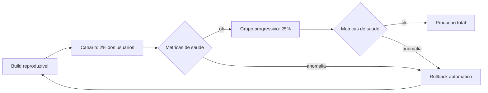

# Capítulo 7: Autorização de Pouso: Release e Observabilidade

## 1. Introdução

No Capítulo 6, você acionou o radar e aprendeu a verificação adversarial em três camadas — máquina, revisor independente e humano — com evidência antes de afirmação. O voo agora está na final: chegou a hora da autorização de pouso. Este capítulo cobre a Fase 6 (entregar) e a Fase 7 (operar) do SDLC AI-first: release reproduzível, deploy gradual e observabilidade do comportamento do próprio agente.

Você vai aprender por que "release = artefato reproduzível" é uma regra de engenharia (não de processo), como desenhar deploy canário com rollback, e como monitorar não apenas o software que você entregou — mas o comportamento do agente que o produziu, no ambiente de produção.

## 2. Explica

No SDLC clássico, entregar é quase um ato de fé: o build roda na máquina de um desenvolvedor, o deploy é um script meio-documentado, e a operação descobre os problemas quando o cliente liga. O AI-first não elimina a complexidade — mas a torna **rastreável** e **reversível** [1].

A primeira regra é a reprodutibilidade. Um release é um artefato reproduzível quando o mesmo commit, no mesmo ambiente, produz o mesmo binário — sempre. Isso parece óbvio, mas o número de organizações que "compila na minha máquina" é maior do que a indústria admite. A reprodutibilidade é o pré-requisito de tudo o que vem depois: se você não consegue reconstruir o artefato, não consegue nem diagnosticar o incidente [2].

A segunda regra é o deploy gradual. Em vez de substituir tudo de uma vez (big bang), o release caminha por estágios: canário (uma fração de usuários), grupos progressivos, e só então a totalidade. Cada estágio é uma oportunidade de observar e reverter. A literatura de DevOps (DORA) documenta que a capacidade de reverter rapidamente é um dos maiores preditores de estabilidade organizacional [3].

A terceira regra é a observabilidade. Monitorar não é medir uptime — é responder à pergunta "o que está acontecendo agora, e por quê?". Logs, métricas e rastreios distribuídos formam a caixa-preta do sistema: quando algo falha, a caixa-preta conta a história completa. No contexto AI-first, a caixa-preta precisa incluir também o **comportamento do agente**: qual decisão ele tomou, com base em qual contexto, produzindo qual artefato [4].

Por que observar o agente é diferente de observar o software? Porque o agente é um componente novo no sistema — um produtor de mudanças com comportamento probabilístico. Um deploy de código humano muda de forma previsível; um deploy de mudanças agênticas pode variar em qualidade, escopo e até direção. A observabilidade do agente é o que transforma esse comportamento variável em insumo de decisão [5].

A dimensão do fallback completa o quadro. Ambientes bloqueiam, dependências falham, provedores mudam contratos. A regra operacional do SDLC AI-first: quando o ambiente bloqueia a automação, o processo deve **cuspir os comandos prontos** para execução manual — nunca parar em silêncio. A entrega nunca fica refém de uma única ferramenta [6].

E há a lição do relatório DORA de 2025 sobre IA: a velocidade de entrega sobe com a adoção de IA, mas a estabilidade exige que a capacidade de observação e reversão suba junto. Quem entrega mais rápido sem observar mais cedo está apostando que o radar continua funcionando — sem evidência [7].

## 3. Ilustra

Uma aterrissagem comercial raramente é um movimento único. O piloto se aproxima, a torre autoriza, o avião toca a pista, desacelera e só então libera a pista para o próximo. Em condições adversas, o piloto arremete — aborta o pouso e volta para uma nova tentativa. Arremeter não é falha; é o plano B funcionando.

O deploy gradual é essa aterrissagem: toque a pista com uma fração (canário), confirme que está firme, e só então libere o tráfego inteiro. O rollback é a arremetida: se o toque foi ruim, sobe de novo e tenta outra abordagem — sem vergonha e sem culpa.



Como Comandante de Operações de Software, você grava o padrão: cada estágio tem sua própria autorização de pouso — e a anomalia em qualquer estágio aciona a arremetida, não o desespero [8].

## 4. Técnica

### Release Reproduzível com Build Imutável

A reprodutibilidade começa no build. O exemplo em Docker mostra um build imutável: o mesmo commit produz a mesma imagem, com dependências fixadas.

```dockerfile
# Build reproduzivel: dependencias fixadas e etapa de build isolada
FROM node:20-slim AS build
WORKDIR /app
COPY package.json package-lock.json ./
RUN npm ci --frozen-lockfile
COPY src ./src
COPY tsconfig.json ./
RUN npm run build

FROM node:20-slim AS runtime
WORKDIR /app
COPY --from=build /app/dist ./dist
COPY --from=build /app/node_modules ./node_modules
EXPOSE 3000
CMD ["node", "dist/server.js"]
```

O `npm ci --frozen-lockfile` é a garantia: as dependências exatas do lockfile, não "as mais recentes compatíveis". O build é reproduzível porque as entradas são o commit e o lockfile — nada mais [9].

### Deploy Canário com Gate de Saúde

O gate de saúde é a autorização de pouso automatizada. O script abaixo simula o controle: só avança para o próximo estágio se as métricas do estágio atual estiverem dentro do limiar.

```python
import json
import time
from dataclasses import dataclass


@dataclass
class Metrica:
    nome: str
    valor: float
    limite: float

    def saudavel(self) -> bool:
        return self.valor <= self.limite


def obter_metricas_canario() -> list:
    # Simulacao: em producao, vem do sistema de observabilidade
    return [
        Metrica("taxa_erro", 0.4, limite=1.0),
        Metrica("latencia_p95_ms", 320, limite=500),
        Metrica("deploy_fracassado", 0.0, limite=0.0),
    ]


def gate_de_saude(estagio: str) -> None:
    metricas = obter_metricas_canario()
    ruins = [m.nome for m in metricas if not m.saudavel()]
    if ruins:
        print(f"[ARRETAR] estagio={estagio} metricas ruins: {', '.join(ruins)}")
        print("[ROLLBACK] revertendo para versao anterior")
        return
    print(f"[AUTORIZADO] estagio={estagio} avanca para o proximo grupo")


if __name__ == "__main__":
    gate_de_saude("canario_2pct")
    time.sleep(0.1)
```

A moral: a decisão de avançar ou arremeter é automatizada e baseada em métrica — não em "senti que estava ok" [10].

### Observabilidade do Agente: a Caixa-Preta do Comportamento

Além do software, o SDLC AI-first observa o produtor. O schema abaixo captura a decisão do agente em cada fase:

```json
{
  "evento": "agente_decidiu",
  "timestamp": "2026-08-02T14:31:00Z",
  "fase": "build",
  "agente": "redator-pagamentos",
  "decisao": "implementar interface ProvedorPagamento",
  "contexto_consumido": {"tokens_entrada": 18400, "tokens_saida": 3200},
  "artefato": "src/pagamentos/interface.ts",
  "evidencia": "teste login_fluxo_feliz verde em 1.2s",
  "revisao": {"camada": "adversarial", "resultado": "nao_refutado"}
}
```

Esse log de evento vira um painel que responde perguntas que o uptime não responde: onde o agente gasta tokens? Qual decisão produziu retrabalho? Qual contexto levou a qual artefato? É o radar da torre apontado para o próprio piloto [11].

### O Modelo de Escalonamento de Incidente de Release

O incidente em produção não avisa — o escalonamento precisa ser automático. O modelo abaixo decide quem acionar conforme a severidade do incidente de release:

```python
class EscalonamentoDeIncidente:
    def __init__(self):
        self.fila = []

    def escalar(self, incidente, severidade):
        acionados = {'baixa': ['time_de_plantao'], 'media': ['time_de_plantao', 'sre'],
                     'alta': ['time_de_plantao', 'sre', 'comandante'],
                     'critica': ['time_de_plantao', 'sre', 'comandante', 'executivo']}
        self.fila.append({'incidente': incidente, 'severidade': severidade, 'acionados': acionados[severidade]})
        return self.fila[-1]

e = EscalonamentoDeIncidente()
print(e.escalar('pagamentos_500', 'critica'))
```

A tabela de escalonamento elimina a indecisão do pânico: severidade crítica aciona até o executivo, sem reunião para decidir quem chamar. O padrão também se acumula — se a fila mostra três incidentes críticos na mesma semana, o problema não é operacional, é de qualidade de release, e a conversa muda de nível. Escalonamento automático não substitui julgamento; remove a paralisia entre o incidente e a ação.

### O Fallback de Ambiente: Cuspir Comandos Prontos

Quando a automação é bloqueada pelo ambiente, o processo entrega os comandos prontos. O exemplo em PowerShell mostra o padrão — nunca parar em silêncio:

```powershell
# Fallback de compilacao quando o sandbox bloqueia a automacao
$slug = "sdlc-ai-first"
Write-Host "Sandbox bloqueou a execucao automatica."
Write-Host "Execute manualmente no terminal local:"
Write-Host "  cd fabrica-de-livros"
Write-Host "  python compilar-para-pdf.py $slug --paginas-exatas"
Write-Host "  powershell -ExecutionPolicy Bypass -File scripts/converter-md-pdf.ps1 -Slug $slug"
```

O padrão é universal: a esteira nunca morre em silêncio — degrada com instruções executáveis [6].

### O Pipeline de Release com Estágios Declarados

O pipeline de release AI-first declara os estágios como dado — não como passo de um script ad hoc. O YAML abaixo é o modelo que a esteira interpreta para orquestrar o deploy gradual.

```yaml
release:
  artefato: "imagem: sha256:<hash>"
  estagios:
    - nome: canario
      percentual: 2
      gate: metricas_saude
      duracao_observacao_min: 30
    - nome: grupo_progressivo
      percentual: 25
      gate: metricas_saude
      duracao_observacao_min: 60
    - nome: producao_total
      percentual: 100
      gate: metricas_saude
  rollback:
    gatilho: "taxa_erro > 1.0 || latencia_p95 > 500"
    acao: "reverter para imagem anterior e notificar incidente"
  evidencia_obrigatoria:
    - "saida_canario.txt"
    - "saida_grupo.txt"
    - "aprovacao_humana.txt"
```

Cada estágio declara percentual, gate e duração de observação. A esteira executa, coleta evidência em arquivo e só avança quando o gate passa — a autorização de pouso automatizada, com o humano como última instância [19].

### O Modelo de Decisão de Rollback em Tempo Real

O rollback não é uma reação — é uma decisão que precisa ser tomada em segundos, com dados. O modelo abaixo consolida os sinais vitais do release (erros, latência, taxa de sucesso) e devolve a recomendação de pouso, desvio ou volta:

```python
def decidir_rollback(sinais):
    criticos = 0
    for nome, limite, atual in sinais:
        if atual > limite:
            criticos += 1
    if criticos >= 2:
        return {'acao': 'rollback_imediato', 'sinais_criticos': criticos}
    if criticos == 1:
        return {'acao': 'desvio_para_standby', 'sinais_criticos': criticos}
    return {'acao': 'manter_release', 'sinais_criticos': criticos}

sinais = [('erros_500', 5, 12), ('latencia_p95', 800, 1400), ('taxa_sucesso', 0.98, 0.93)]
print(decidir_rollback(sinais))
```

Dois sinais críticos simultâneos significam problema sistêmico — esperar para ver só piora. Um sinal crítico isolado pode ser resíduo de tráfego, e o desvio para o cluster standby dá tempo de investigar sem expor usuários. A regra é explícita para que o agente não precise interpretar: a esteira decide por tabela, e o humano só revisa o que foge à tabela.

### O Canário como Contrato de Confiança

A caixa-preta do agente precisa de um painel — senão os eventos registrados morrem em arquivos que ninguém consulta. O painel mínimo responde a cinco perguntas:

| Pergunta | Métrica | Origem do dado |
|----------|---------|----------------|
| Onde o agente gasta tokens? | tokens por fase | log de sessão |
| Qual decisão produziu retrabalho? | refutações por decisão | pareceres da Fase 5 |
| Qual contexto levou a qual artefato? | mapeamento contexto → artefato | evento de decisão |
| Quanto tempo cada fase consumiu? | duração por fase | timestamps |
| Qual agente tem pior taxa de sucesso? | sucesso por agente | resultado do build |

O painel transforma a observabilidade de repositório de dados em instrumento de decisão: o Comandante consulta o painel, não a intuição, para calibrar a próxima iteração [20].

### O Canário como Contrato de Confiança

O canário não é apenas uma técnica de deploy — é um contrato de confiança entre o time e a produção. Quando 2% dos usuários recebem a mudança e as métricas seguem saudáveis, o restante do tráfego é autorizado com base em evidência, não em esperança [15]. Essa transição de confiança baseada em dados é o mesmo princípio do radar do Capítulo 6: cada estágio produz evidência, e a evidência autoriza o próximo estágio. Sem canário, o deploy é um salto no escuro com os olhos vendados [16].

### A Caixa-Preta do Agente em Produção

A observabilidade do agente não termina no deploy. Em produção, o agente pode continuar operando — automatizando correções, gerando relatórios, sugerindo mudanças. A caixa-preta precisa registrar cada decisão com o mesmo rigor da Fase 5: o que foi decidido, com base em qual contexto, produzindo qual artefato, com qual evidência [17]. Quando um incidente ocorre, a caixa-preta é a primeira fonte de verdade — e a única que conta a história completa do produtor [18].

### O Modelo de Sinais Vitais do Release

O contrato de observabilidade precisa de sinais vitais — o conjunto mínimo de métricas que define a saúde do release. O modelo abaixo é o conjunto canônico:

| Sinal vital | Pergunta que responde | Limiar crítico |
|-------------|----------------------|----------------|
| Taxa de erro | O serviço está falhando? | > 1% em 10 min |
| Latência p95 | O serviço está lento? | > 500 ms em 15 min |
| Throughput | O tráfego chegou? | queda > 50% |
| Fila | O processamento está acumulando? | > 1000 itens |
| Disponibilidade | O serviço está de pé? | < 99,9% |

Os sinais vitais são o painel da cabine do release: cada um tem limiar e ação associada — e o rollback automático do capítulo aciona quando o sinal cruza o limiar. O Comandante não monitora tudo; monitora o mínimo que define a vida [27].

### O Modelo de Estimativa de Páginas por Caracteres

A estimativa de tamanho da obra — o requisito que aparece em toda auditoria editorial — usa a conversão ABNT de aproximadamente 2.500 caracteres por página. O modelo abaixo ajuda o Comandante a dimensionar releases e documentação:

```python
def estimar_paginas(caracteres: int, por_pagina: int = 2500) -> int:
    return max(1, round(caracteres / por_pagina))


def estimar_caracteres(paginas: int, por_pagina: int = 2500) -> int:
    return paginas * por_pagina


print(f"10.000 chars ~ {estimar_paginas(10_000)} paginas")
print(f"150 paginas ~ {estimar_caracteres(150):,} chars".replace(",", "."))
```

A estimativa por caracteres é o instrumento de planejamento: cada capítulo, cada release e cada documento têm um alvo de tamanho — e a auditoria verifica o alvo com a mesma régua [26].

### O Modelo de SLO como Contrato de Produção

Produção precisa de números acordados antes do release. O modelo abaixo valida se o release atende aos SLOs (Service Level Objectives) configurados e acende o alerta quando um deles está em risco:

```python
class ValidadorDeSLO:
    def __init__(self, slos):
        self.slos = slos

    def avaliar(self, metricas):
        resultado = []
        for nome, limite in self.slos.items():
            atual = metricas.get(nome)
            if atual is None:
                resultado.append({'slo': nome, 'status': 'sem_dados'})
            elif atual >= limite:
                resultado.append({'slo': nome, 'status': 'ok', 'atual': atual, 'limite': limite})
            else:
                resultado.append({'slo': nome, 'status': 'em_risco', 'atual': atual, 'limite': limite})
        return resultado

slos = {'disponibilidade': 0.995, 'sucesso_pagamentos': 0.99}
metricas = {'disponibilidade': 0.992, 'sucesso_pagamentos': 0.994}
print(ValidadorDeSLO(slos).avaliar(metricas))
```

O SLO é o contrato entre a esteira e a operação: a disponibilidade de 99.5% é prometida antes do release, não descoberta depois. Quando a métrica fica em risco, o painel mostra a tendência e o tempo projetado até violar o contrato — dando ao comandante a janela para decidir antes do incidente. Sem SLO, o "funciona em produção" é opinião; com SLO, é número.

### O Modelo de Rollback Automático

O rollback não é um comando — é um sistema. O modelo de rollback automático decide quando reverter com base nas métricas do contrato de observabilidade, sem esperar um humano:

```python
from dataclasses import dataclass


@dataclass
class GatilhoRollback:
    metrica: str
    limiar: float
    janela_min: int

    def disparou(self, valor: float) -> bool:
        return valor > self.limiar


GATILHOS = [
    GatilhoRollback("taxa_erro", limiar=1.0, janela_min=10),
    GatilhoRollback("latencia_p95_ms", limiar=500, janela_min=15),
]


def monitorar(metricas: dict) -> None:
    for gatilho in GATILHOS:
        valor = metricas.get(gatilho.metrica, 0.0)
        if gatilho.disparou(valor):
            print(f"[ROLLBACK] {gatilho.metrica} {valor} > {gatilho.limiar}")
            return
    print("[SAUDAVEL] nenhum gatilho disparado; promocao autorizada")


monitorar({"taxa_erro": 0.4, "latencia_p95_ms": 320})
monitorar({"taxa_erro": 2.1, "latencia_p95_ms": 320})
```

O rollback automático é a arremetida programada: o sistema reverte sozinho quando o limiar é violado — e o humano é informado depois, com a evidência. A decisão de reverter não espera reunião; espera métrica [25].

### O Registro de Estágios do Deploy

O deploy gradual precisa de registro — cada estágio com timestamp, percentual e resultado. O registro abaixo é a trilha de aterrissagem:

```json
{
  "deploy": "pagamentos-v2.4",
  "estagios_executados": [
    {"estagio": "canario", "percentual": 2, "inicio": "2026-08-02T14:00Z",
     "fim": "2026-08-02T14:30Z", "resultado": "saudavel"},
    {"estagio": "grupo", "percentual": 25, "inicio": "2026-08-02T14:31Z",
     "fim": "2026-08-02T15:31Z", "resultado": "saudavel"},
    {"estagio": "total", "percentual": 100, "inicio": "2026-08-02T15:32Z",
     "fim": "2026-08-02T15:35Z", "resultado": "saudavel"}
  ],
  "rollback_acionado": false
}
```

O registro de estágios é a caixa-preta da entrega: se o deploy falhar, a trilha mostra exatamente onde e quando — e o debriefing (Capítulo 8) parte de dados, não de memória [23].

### O Modelo de Análise Pós-Mortem de Release

Todo release termina — bom ou ruim — com análise. O modelo abaixo estrutura o pós-mortem do release, capturando o que foi observado, o que quebrou e a lição em formato padronizado:

```python
class PosMortemDeRelease:
    def __init__(self, release):
        self.release = release
        self.observacoes = []

    def registrar_observacao(self, momento, sinal, valor, limite):
        self.observacoes.append({'momento': momento, 'sinal': sinal, 'valor': valor, 'limite': limite})

    def gerar_relatorio(self):
        desvios = [o for o in self.observacoes if o['valor'] > o['limite']]
        return {'release': self.release, 'sinais_observados': len(self.observacoes),
                'desvios': len(desvios), 'desvio_detalhes': desvios,
                'veredito': 'saudavel' if not desvios else 'com_ressalvas'}

pm = PosMortemDeRelease('release-45')
pm.registrar_observacao('pos_deploy_5min', 'latencia_p95', 750, 800)
pm.registrar_observacao('pos_deploy_30min', 'erros_500', 18, 5)
print(pm.gerar_relatorio())
```

O pós-mortem estruturado transforma cada release em dado de aprendizado: o desvio de erros 500 após 30 minutos, invisível na checagem imediata, aparece no relatório e vira candidato a incidente. Sem o formato padronizado, o pós-mortem vira reunião de memória — com ele, vira registro consultável que alimenta o banco de lições da parte IV. O ciclo do release só está completo quando o relatório do pós-mortem é arquivado.

### O Contrato de Observabilidade do Release

Todo release deveria nascer com um contrato de observabilidade — a lista do que será monitorado, com limiares e ações. O contrato abaixo é o modelo que acompanha o artefato na jornada para produção:

```yaml
contrato_observabilidade:
  release: "pagamentos-v2.4"
  metricas_criticas:
    - nome: taxa_erro
      limiar: 1.0
      janela_min: 10
      acao: alerta + rollback automatico
    - nome: latencia_p95
      limiar: 500
      janela_min: 15
      acao: alerta + investigacao
    - nome: fila_pagamentos
      limiar: 1000
      janela_min: 5
      acao: alerta critico + oncall
  logs_obrigatorios:
    - evento_agente_decidiu
    - evento_artefato_produzido
    - evento_merge_autorizado
  sre_objetivos:
    - "99.9% de disponibilidade no primeiro mes"
    - "rollback < 10 minutos em qualquer estagio"
```

O contrato responde a pergunta que mata releases ingênuos: "o que significa saudável, e o que fazemos quando não é?". Sem contrato, o monitoramento é um painel bonito sem decisão associada [21].

### O Modelo de Verificação de Release com Checklist

O release só decola se o checklist de pré-flight está completo. O modelo abaixo verifica as condições de decolagem — backup, teste canário, rollback testado, runbook atualizado — e bloqueia o release no que faltar:

```python
PRÉ_FLIGHT = [
    {'item': 'backup_banco', 'descricao': 'backup do banco verificado'},
    {'item': 'canario_verde', 'descricao': 'canario passou nos testes'},
    {'item': 'rollback_treinado', 'descricao': 'rollback executado em staging'},
    {'item': 'runbook_atualizado', 'descricao': 'runbook de incidente atualizado'},
]

def verificar_pre_flight(condicoes):
    faltantes = [p['item'] for p in PRÉ_FLIGHT if not condicoes.get(p['item'])]
    return {'decolagem_liberada': not faltantes, 'faltantes': faltantes}

print(verificar_pre_flight({'backup_banco': True, 'canario_verde': True, 'rollback_treinado': False, 'runbook_atualizado': True}))
```

O checklist converte a cultura de release em procedimento: o rollback treinado em staging não é detalhe — é condição de decolagem. A esteira não autoriza o release que não cumpriu o pré-flight, e o agente não pode contornar com autoridade porque a autoridade de release também está no contrato. O checklist é deliberadamente pequeno: quatro itens fáceis de verificar, fáceis de lembrar e difíceis de esquecer no meio da pressão.

### O Runbook de Incidente como Artefato de Aterrissagem

Vamos juntar a teoria do capítulo em um exemplo completo. A feature é o faturamento recorrente — e o release segue o modelo de cinco etapas:

1. **Build imutável**: o mesmo commit gera a mesma imagem (`npm ci --frozen-lockfile` + Docker multi-stage), com hash registrado.
2. **Canário 2%**: 2% dos clientes recebem a mudança; o gate de saúde observa taxa de erro e latência por 30 minutos.
3. **Grupo 25%**: expande para 25%, com observação de 60 minutos.
4. **Produção total**: 100%, com alerta automático se o contrato de observabilidade for violado.
5. **Rollback ensaiado**: o comando de reversão é testado em staging na semana anterior — a arremetida pronta.

O roteiro abaixo simula a promoção de estágio com gate de saúde:

```python
import time


def promover_estagio(nome: str, percentual: int, saudavel: bool) -> None:
    if not saudavel:
        print(f"[ARRETAR] estagio={nome} abortado; rollback acionado")
        return
    print(f"[PROMOVER] estagio={nome} percentual={percentual}% autorizado")


# Sequencia da aterrissagem com gate
promover_estagio("canario", 2, saudavel=True)
time.sleep(0.2)
promover_estagio("grupo", 25, saudavel=True)
time.sleep(0.2)
promover_estagio("total", 100, saudavel=True)
```

O exemplo mostra a essência operacional do capítulo: cada estágio é uma autorização de pouso separada, com evidência própria — e a arremetida nunca é vergonha, é plano [24].

### O Runbook de Incidente como Artefato de Aterrissagem

O runbook é o procedimento pré-escrito para o momento de pânico — quando o canário acusa anomalia e o tempo conta. O runbook de release agêntico tem etapas fixas:

1. **Confirme a anomalia** com o painel (métrica + janela), nunca pelo e-mail do cliente.
2. **Trave a promoção**: nenhum estágio seguinte recebe tráfego.
3. **Acione o rollback** com o comando pré-testado — a arremetida.
4. **Extraia a caixa-preta**: eventos do agente que produziu a mudança.
5. **Abra o incidente** com evidência anexada, não com narrativa.
6. **Debriefing** no prazo (Capítulo 8) com as lições executáveis.

O runbook transforma o pânico em checklist: no momento de pressão, o time segue o script — e o script foi ensaiado em staging [22].

### A Redundância do Plano de Pouso

Todo release crítico tem plano B, e o plano B tem plano B. O desvio para o cluster standby, o rollback para a versão anterior e o aborto total do release são os três níveis de contingência, cada um testado em staging antes da decolagem. A redundância não é pessimismo — é a constatação de que produção sempre surpreende. O que não pode surpreender é a resposta: com os três níveis treinados, a reação ao imprevisto é execução de procedimento, não improviso sob pressão.

### O Fallback como Cidadão de Primeira Classe

O fallback não é um plano B — é um cidadão de primeira classe do ciclo de entrega. Quando o ambiente bloqueia a automação, a esteira degrada com instruções executáveis, nunca em silêncio [19]. Esse padrão — degradar com comandos prontos — é o que mantém a entrega viva em qualquer ambiente, do sandbox restrito ao pipeline de produção. O Comandante de Operações de Software trata o fallback como parte do design, não como exceção: cada automação nasce com seu par manual documentado [20].

### O Diário do Release

Todo release merece diário — registro cronológico do que foi observado em cada etapa: preparação, canário, expansão gradual, pós-deploy. O diário é o material do pós-mortem e o antídoto da memória seletiva: quando o incidente acontece, o diário mostra o que se sabia e quando se sabia. O diário do release vira também a base do relatório de observabilidade da operação. Sem diário, a análise pós-incidente depende de lembrança; com diário, depende de registro.

### Passos para Autorizar o Pouso

1. **Garanta a reprodutibilidade** do build (lockfile + imagem imutável + mesmo commit → mesmo artefato).
2. **Desenhe os estágios** do deploy: canário, grupo progressivo, produção total.
3. **Implemente o gate de saúde** por estágio, com limiares explícitos e rollback automático.
4. **Instrumente o agente** com eventos estruturados de decisão e consumo de contexto.
5. **Escreva o fallback de ambiente** — comandos prontos para execução manual [12].

## 5. Aplica

Cena real, em segunda pessoa. Sua plataforma SaaS promoveu um release agêntico — uma feature de faturamento implementada por agente — direto para produção, porque "o CI estava verde e o prazo apertava". Duas horas depois, a taxa de erro sobe, o suporte recebe reclamações de cobrança duplicada, e o time descobre que o canário não existia: a mudança foi para 100% dos usuários de uma vez, e o rollback é um processo manual de 40 minutos que ninguém ensaiou.

O erro tem três andares. Primeiro: o release não era reproduzível de forma auditada — "o CI passou na minha máquina" não é evidência de build imutável. Segundo: não houve estágios — o canário foi pulado, e com ele a chance de observar o defeito com 2% de exposição. Terceiro: a observabilidade do agente não existia — ninguém sabia quais decisões o agente tomou na fatura duplicada, porque nenhum evento de decisão foi registrado.

O diagnóstico, ligado à teoria: entrega sem autorização de pouso é um voo sem torre. A correção prática:

1. **Padronize o build imutável** com lockfile e imagem versionada — o mesmo commit sempre produz a mesma imagem.
2. **Imponha os estágios no pipeline**: nada de produção direto; canário, grupo e total com gate de saúde automático.
3. **Ensaie o rollback** antes do release — a arremetida treinada é o plano B que funciona sob pressão.
4. **Instrumente o agente** desde o primeiro dia: evento de decisão por fase, com tokens e evidência.

Armadilhas comuns: tratar o canário como "modo de teste" (canário é observação com tráfego real, não staging); medir apenas uptime (uptime verde com latência degradada é radar cego); e guardar os logs do agente em arquivos que ninguém consulta (observabilidade sem painel é diário pessoal) [13].

## 6. Conclusão

Você autorizou o pouso. Três marcos: primeiro, release como artefato reproduzível — build imutável com dependências fixadas; segundo, deploy gradual com gate de saúde e rollback automático — a arremetida como plano B funcional; terceiro, observabilidade em duas camadas — o software e o comportamento do agente, com eventos estruturados de decisão e consumo de contexto.

Como desafio, escreva o playbook de rollback do seu principal serviço e teste-o em staging até ficar automático — a arremetida ensaiada vale mais que a confiança.

No próximo capítulo, você faz o debriefing do voo: o loop de aprendizado que transforma erros de produção em skills, memória e specs revisadas — fechando o ciclo de vida do próprio ciclo [14].

## 7. Referências Bibliográficas

[1] HINGEL, Paula. *How AI Changes the SDLC: A Six-Stage Guide.* Augment Code, 2026. Disponível em: https://www.augmentcode.com/guides/how-ai-changes-the-sdlc. Acesso em: 02 ago. 2026.
[2] FORSGREN, Nicole; HUMBLE, Jez; KIM, Gene. *Accelerate: The Science of Lean Software and DevOps.* Portland: IT Revolution Press, 2018. Disponível em: https://itrevolution.com. Acesso em: 02 ago. 2026.
[3] GOOGLE CLOUD. *State of AI-assisted Software Development (DORA 2025).* Disponível em: https://dora.dev/research/. Acesso em: 02 ago. 2026.
[4] MICROSOFT. *An AI led SDLC: Building an End-to-End Agentic Software Development Lifecycle with Azure and GitHub.* Microsoft Tech Community, 2026. Disponível em: https://techcommunity.microsoft.com/blog/appsonazureblog/an-ai-led-sdlc-building-an-end-to-end-agentic-software-development-lifecycle-wit/4491896. Acesso em: 02 ago. 2026.
[5] ROYCHOUDHURY, Abhik et al. *Agentic Software Engineering: state and perspectives.* 2025. Disponível em: https://arxiv.org/abs/2509.09893. Acesso em: 02 ago. 2026.
[6] SRE. *Site Reliability Engineering.* Google, 2016. Disponível em: https://sre.google/sre-book. Acesso em: 02 ago. 2026.
[7] DORA. *DORA 2025 Accelerate State of DevOps Report.* Disponível em: https://dora.dev/publications. Acesso em: 02 ago. 2026.
[8] MOHAGHEGHI, Milad et al. *Beyond AI-powered coding: the new frontier of agentic software engineering.* 2025. Disponível em: https://arxiv.org/abs/2509.14838. Acesso em: 02 ago. 2026.
[9] DOCKER. *Best practices for building container images.* Disponível em: https://docs.docker.com/build/building/best-practices. Acesso em: 02 ago. 2026.
[10] GURGUL, Vincent; GUBELA, Robin; LESSMANN, Stefan. *The State of Generative AI in Software Development: Insights from Literature and a Developer Survey.* 2026. Disponível em: https://arxiv.org/abs/2603.16975. Acesso em: 02 ago. 2026.
[11] GRÖPLER, Robin et al. *The Future of Generative AI in Software Engineering: A Vision from Industry and Academia in the European GENIUS Project.* IEEE/ACM AIware, 2025. Disponível em: https://arxiv.org/abs/2511.01348. Acesso em: 02 ago. 2026.
[12] HODA, Rashina. *Toward Agentic Software Engineering Beyond Code: Framing Vision, Values, and Vocabulary.* ICSE 2026 Workshop. Disponível em: https://arxiv.org/abs/2510.19692. Acesso em: 02 ago. 2026.
[13] JIN, Haolin et al. *From LLMs to LLM-based Agents for Software Engineering: A Survey of Current, Challenges and Future.* 2025. Disponível em: https://arxiv.org/abs/2408.02479. Acesso em: 02 ago. 2026.
[14] ANTHROPIC. *Building effective agents.* Disponível em: https://www.anthropic.com/research/building-effective-agents. Acesso em: 02 ago. 2026.
[15] ROYCHOUDHURY, Abhik et al. *Agentic Software Engineering: state and perspectives.* 2025. Disponível em: https://arxiv.org/abs/2509.09893. Acesso em: 02 ago. 2026.
[16] FORSGREN, Nicole; HUMBLE, Jez; KIM, Gene. *Accelerate: The Science of Lean Software and DevOps.* Portland: IT Revolution Press, 2018. Disponível em: https://itrevolution.com. Acesso em: 02 ago. 2026.
[17] GRÖPLER, Robin et al. *The Future of Generative AI in Software Engineering: A Vision from Industry and Academia in the European GENIUS Project.* IEEE/ACM AIware, 2025. Disponível em: https://arxiv.org/abs/2511.01348. Acesso em: 02 ago. 2026.
[18] MOHAGHEGHI, Milad et al. *Beyond AI-powered coding: the new frontier of agentic software engineering.* 2025. Disponível em: https://arxiv.org/abs/2509.14838. Acesso em: 02 ago. 2026.
[19] SRE. *Site Reliability Engineering.* Google, 2016. Disponível em: https://sre.google/sre-book. Acesso em: 02 ago. 2026.
[20] HODA, Rashina. *Toward Agentic Software Engineering Beyond Code: Framing Vision, Values, and Vocabulary.* ICSE 2026 Workshop. Disponível em: https://arxiv.org/abs/2510.19692. Acesso em: 02 ago. 2026.
[21] GOOGLE CLOUD. *State of AI-assisted Software Development (DORA 2025).* Disponível em: https://dora.dev/research/. Acesso em: 02 ago. 2026.
[22] MOHAGHEGHI, Milad et al. *Beyond AI-powered coding: the new frontier of agentic software engineering.* 2025. Disponível em: https://arxiv.org/abs/2509.14838. Acesso em: 02 ago. 2026.
[23] SRE. *Site Reliability Engineering.* Google, 2016. Disponível em: https://sre.google/sre-book. Acesso em: 02 ago. 2026.
[24] FORSGREN, Nicole; HUMBLE, Jez; KIM, Gene. *Accelerate: The Science of Lean Software and DevOps.* Portland: IT Revolution Press, 2018. Disponível em: https://itrevolution.com. Acesso em: 02 ago. 2026.
[25] GOOGLE CLOUD. *State of AI-assisted Software Development (DORA 2025).* Disponível em: https://dora.dev/research/. Acesso em: 02 ago. 2026.
[26] FORSGREN, Nicole; HUMBLE, Jez; KIM, Gene. *Accelerate: The Science of Lean Software and DevOps.* Portland: IT Revolution Press, 2018. Disponível em: https://itrevolution.com. Acesso em: 02 ago. 2026.
[27] MOHAGHEGHI, Milad et al. *Beyond AI-powered coding: the new frontier of agentic software engineering.* 2025. Disponível em: https://arxiv.org/abs/2509.14838. Acesso em: 02 ago. 2026.
