O ciclo de vida do software está mudando de forma estrutural, e este livro é o manual dessa transição. A metáfora que guia toda a obra é a da torre de controle de tráfego aéreo: cada fase do SDLC é um voo — intenção, spec, design, build, verificação, entrega e operação — que decola apenas com plano aprovado, é monitorado em tempo real e só aterra com verificação adversarial. O humano deixa de ser o piloto de cada tarefa e se torna o controlador de voo: ele autoriza decolagens, arbitra desvios e nunca abandona a cabine. Prefácio de impacto: o aeroporto de software está mudando — quem controla o tráfego hoje controla o céu de amanhã. Contextualizar a passagem do SDLC clássico para o AI-first, apresentar a metáfora da torre de controle e o destino da jornada: formar o Comandante de Operações de Software.

# Sumário

**Parte I — Fundamentos — O Novo Contrato**
- Capítulo 1: Do SDLC Clássico ao AI-first: Por Que o Contrato Mudou
- Capítulo 2: O Controlador de Voo: Papel Humano, Agente e Verificação

**Parte II — O Contrato — Spec e Design**
- Capítulo 3: Plano de Voo: Da Intenção à Spec Executável
- Capítulo 4: Cartografia do Domínio: Design Orientado a Agentes

**Parte III — Execução Agêntica — Build e Verificação**
- Capítulo 5: Os Motores: Harness, Skills, MCPs e Worktrees
- Capítulo 6: O Radar: Verificação Adversarial e Evidência

**Parte IV — Mundo Real — Entrega, Operação e Aprendizado**
- Capítulo 7: Autorização de Pouso: Release e Observabilidade
- Capítulo 8: Debriefing: O Loop de Aprendizado que Evolui o Ciclo

**Parte V — O Comandante — Governança e Futuro**
- Capítulo 9: Combustível: Economia de Tokens e Custo de Contexto
- Capítulo 10: O Futuro do SDLC: Maturidade, Riscos e a Próxima Década


# Parte I — Fundamentos — O Novo Contrato

# Capítulo 1: Do SDLC Clássico ao AI-first: Por Que o Contrato Mudou

## 1. Introdução

Bem-vindo ao primeiro voo da sua jornada como Comandante de Operações de Software. Este capítulo responde à pergunta mais fundamental da obra inteira: por que o ciclo de vida de desenvolvimento de software — aquele processo disciplinado de fases que sustenta a indústria há décadas — está sendo redesenhado na era dos agentes de IA? Você vai aprender a diferença estrutural entre o SDLC clássico e o SDLC AI-first, entender por que o artefato-mestre deixou de ser o documento para ser a spec executável mais testes, e reconhecer a mudança de custo dominante: de horas-homem para tokens e contexto.

Ao final, você será capaz de explicar para qualquer equipe — sem jargão — por que "pedir código para uma IA" é só a ponta de um iceberg cujo nome real é governança de ciclo de vida.

## 2. Explica

O Software Development Life Cycle, ou ciclo de vida de desenvolvimento de software, é o modelo organizacional que estrutura o trabalho de construção de software em fases: levantamento de requisitos, design, implementação, testes, implantação e manutenção. Cada modelo clássico — Waterfall, Espiral, RUP, Ágil, Scrum — é, no fundo, uma resposta diferente à mesma pergunta: como coordenar trabalho intelectual caro e propenso a erro [1].

A premissa silenciosa de todos esses modelos é que **o executante é humano**. Requisitos são escritos por analistas, design por arquitetos, código por programadores e testes por QA. O SDLC clássico otimiza, portanto, fases manuais: distribui horas-homem, cria artefatos intermediários para comunicação entre especialistas e usa a revisão humana como guarda de qualidade.

O paradigma AI-first quebra essa premissa. O agente de IA não é uma ferramenta de autocomplete glorificada — é um **executante autônomo** que planeja, escreve, testa e corrige código com loop de execução próprio [2]. Estudos acadêmicos mostram que a geração isolada de trechos via LLM está dando lugar a agentes orientados a ferramentas que cobrem requisitos, geração de código, decisão autônoma, design, testes e manutenção [3]. A pergunta deixa de ser "como o humano usa a IA para digitar mais rápido" e passa a ser "como o humano governa um executante que trabalha sozinho".

É aqui que a metáfora da torre de controle de tráfego aéreo se torna operacional. Um avião moderno voa sozinho a maior parte do tempo — o piloto automático gerencia altitude, velocidade e rota. Mas ninguém em sã consciência tira do controlador de voo a autoridade de decolar, desviar e pousar. O piloto automático é o agente; o controlador de voo é o humano. No SDLC AI-first, cada fase é um voo que decola apenas com plano aprovado (a spec), é monitorado em tempo real (observabilidade) e só aterra com verificação adversarial [4].

A mudança de custo dominante é igualmente radical. No SDLC clássico, o recurso escasso é o tempo humano. No AI-first, o recurso escasso é o **contexto**: tokens, janelas de contexto, rate limits e vida útil de sessão. Uma decisão de arquitetura que custaria uma hora de reunião agora custa milhares de tokens; uma sessão de agente que esgota o contexto no meio do build é tão cara quanto um programador que desiste no meio da feature [5]. O design do ciclo de vida precisa, portanto, tratar a economia de contexto como variável de primeira classe, não como detalhe de infraestrutura.

A literatura de 2025-2026 converge nessa direção. O relatório DORA de 2025, em sua agenda inaugural sobre desenvolvimento assistido por IA, encontrou correlação positiva entre adoção de IA e throughput de entrega (frequência de deploy e lead time), mas alerta que a estabilidade — a taxa de mudanças que causam falha — pode piorar quando a governança não acompanha [6]. Em outras palavras: IA sem ciclo de vida disciplinado é dívida técnica com pedal no acelerador.

Há também a dimensão ética e social. Pesquisadores defendem que o agêntico deve ser expandido para o "processo inteiro" — requisitos, arquitetura, desenvolvimento e operações — com alinhamento ético desde a origem [7]. O SDLC AI-first não é sobre máquinas que escrevem código; é sobre humanos que autorizam, arbitram e evoluem contratos em um ambiente onde a execução foi delegada.

## 3. Ilustra

Imagine o aeroporto de Congonhas em horário de pico. Dezenas de aeronaves precisam decolar e pousar em pistas compartilhadas, com margens de segurança de segundos. Nenhum piloto decide sozinho o momento da decolagem — há uma torre de controle que autoriza cada movimento. O piloto tem autonomia dentro do voo, mas a decolagem exige plano de voo aprovado, a rota é monitorada pelo radar, e o pouso exige autorização.

Agora transporte essa imagem para o software. O SDLC clássico é o aeroporto sem torre: cada equipe decola quando quer, com planos de voo que são documentos que ninguém lê, e o radar é uma reunião mensal de status. O SDLC AI-first é o mesmo aeroporto com uma torre moderna: o piloto automático (agente) é poderoso, mas o controlador (humano) mantém a autoridade sobre cada transição de fase.

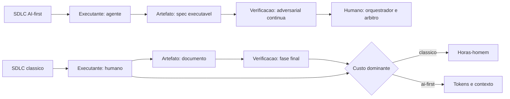

Como Comandante de Operações de Software, você já percebe aqui o primeiro reflexo profissional: **nenhuma decolagem sem plano aprovado**. O piloto automático não decide quando decolar — ele obedece à torre. Da mesma forma, o agente não decide quando iniciar uma implementação sem uma spec aprovada [8]. Essa é a essência do spec-driven development, que aprofundaremos no Capítulo 3.

## 4. Técnica

### O Contrato de Fase como Artefato Técnico

A transição do SDLC clássico para o AI-first não é uma decisão filosófica — é uma decisão de engenharia com artefatos concretos. O primeiro passo técnico é transformar o ciclo de vida em algo **inspecionável por máquina**. Vamos construir uma representação declarativa do ciclo de vida em JSON que uma esteira agêntica consegue interpretar.

```json
{
  "nome_ciclo": "SDLC AI-first",
  "versao": "1.0",
  "fases": [
    {"id": "intencao", "entrada": "problema", "saida": "intencao_1_paragrafo", "humano_responsable": true, "agente_pode_implementar": false},
    {"id": "spec", "entrada": "intencao", "saida": "spec_executavel", "humano_responsable": false, "agente_pode_implementar": false},
    {"id": "design", "entrada": "spec_aprovada", "saida": "contratos_de_modulos", "humano_responsable": true, "agente_pode_implementar": false},
    {"id": "build", "entrada": "spec_e_design", "saida": "codigo_e_testes", "humano_responsable": false, "agente_pode_implementar": true},
    {"id": "verificar", "entrada": "diff_verde", "saida": "parecer_adversarial", "humano_responsable": true, "agente_pode_implementar": false},
    {"id": "entregar", "entrada": "merge_aprovado", "saida": "release", "humano_responsable": true, "agente_pode_implementar": false},
    {"id": "operar", "entrada": "release", "saida": "metricas_e_logs", "humano_responsable": false, "agente_pode_implementar": false},
    {"id": "evoluir", "entrada": "observacoes", "saida": "skills_e_specs_revisadas", "humano_responsable": true, "agente_pode_implementar": false}
  ],
  "regra_ouro": "nenhuma_fase_avanca_sem_artefato_de_saida_validado"
}
```

### A Matriz RACI em Código

A distribuição de responsabilidade entre humano e agente — que no SDLC clássico é um documento PowerPoint — vira uma estrutura de decisão programável. O trecho abaixo define, em Python, um motor de autorização de fase: o agente só avança quando o contrato da fase anterior está satisfeito.

```python
from dataclasses import dataclass, field
from enum import Enum
from typing import List, Dict


class Papel(Enum):
    HUMANO_RESPONSABLE = "humano_responsable"
    AGENTE_RESPONSABLE = "agente_responsable"
    HUMANO_ACCOUNTABLE = "humano_accountable"


@dataclass
class Fase:
    id: str
    entrada: str
    saida: str
    humano_decide: bool
    agente_executa: bool
    artefatos_obrigatorios: List[str] = field(default_factory=list)

    def pode_avancar(self, artefatos: Dict[str, bool]) -> tuple:
        faltando = [a for a in self.artefatos_obrigatorios if not artefatos.get(a, False)]
        if faltando:
            return False, f"artefatos pendentes: {', '.join(faltando)}"
        return True, "contrato de fase satisfeito"


FASES = {
    "intencao": Fase("intencao", "problema", "intencao_1_paragrafo", True, False),
    "spec": Fase("spec", "intencao", "spec_executavel", True, False),
    "design": Fase("design", "spec_aprovada", "contratos_de_modulos", True, False),
    "build": Fase("build", "spec_e_design", "codigo_e_testes", False, True),
    "verificar": Fase("verificar", "diff_verde", "parecer_adversarial", True, False),
    "entregar": Fase("entregar", "merge_aprovado", "release", True, False),
    "operar": Fase("operar", "release", "metricas_e_logs", False, False),
    "evoluir": Fase("evoluir", "observacoes", "skills_e_specs", True, False),
}


def autorizar_avancar(fase_id: str, artefatos: Dict[str, bool]) -> None:
    fase = FASES[fase_id]
    ok, motivo = fase.pode_avancar(artefatos)
    status = "DECOLAGEM AUTORIZADA" if ok else "DECOLAGEM BLOQUEADA"
    print(f"[{status}] {fase_id}: {motivo}")
    if not ok:
        raise SystemExit(1)


if __name__ == "__main__":
    # Simulacao: spec ainda nao aprovada -> build nao decola
    artefatos = {
        "intencao_1_paragrafo": True,
        "spec_executavel": False,
        "contratos_de_modulos": False,
        "codigo_e_testes": False,
    }
    autorizar_avancar("build", artefatos)
```

Este código é deliberadamente pequeno, mas carrega a tese do capítulo: **a autoridade de transição de fase é código, não costume**. Quando o artefato obrigatório não existe, a decolagem é bloqueada — exatamente como um controlador de voo recusa decolagem sem plano de voo [9].

### Medindo o Custo de Contexto

A segunda mudança de engenharia é tornar o custo do contexto mensurável. Se tokens são o novo recurso escasso, cada fase deve registrar seu consumo. O trecho abaixo instrumenta a sessão do agente.

```python
import time
from dataclasses import dataclass


@dataclass
class ConsumoSessao:
    fase: str
    tokens_entrada: int = 0
    tokens_saida: int = 0
    inicio: float = field(default_factory=time.time)

    def registrar(self, entrada: int, saida: int) -> None:
        self.tokens_entrada += entrada
        self.tokens_saida += saida

    def total(self) -> int:
        return self.tokens_entrada + self.tokens_saida

    def resumo(self) -> str:
        duracao = time.time() - self.inicio
        return (f"fase={self.fase} tokens={self.total()} "
                f"duracao={duracao:.0f}s")


sessao_build = ConsumoSessao("build")
sessao_build.registrar(entrada=24_500, saida=3_200)
print(sessao_build.resumo())
```

A ideia é que a esteira colete esses registros na Fase 7 (Operar) e os transforme em insumo da Fase 8 (Evoluir) — por exemplo, uma spec que exigiu 25 mil tokens de entrada para ser redigida pode ser simplificada para 8 mil sem perder escopo [10].

### O Motor de Autorização com Gate de Artefato

A versão produtiva do motor de autorização exige um gate de artefato: além de checar quem pode avançar, ele verifica se o artefato de saída da fase anterior existe e é válido. O código abaixo estende a simulação anterior com o gate — a diferença entre autorizar por papel e autorizar por evidência.

```python
import json
from pathlib import Path
from dataclasses import dataclass
from typing import Dict, Optional


@dataclass
class GateArtefato:
    fase: str
    artefato_obrigatorio: str
    validador: Optional[str] = None

    def verificar(self, raiz: Path) -> tuple:
        caminho = raiz / self.artefato_obrigatorio
        if not caminho.exists():
            return False, f"artefato {self.artefato_obrigatorio} inexistente"
        if self.validador == "json":
            try:
                json.loads(caminho.read_text(encoding="utf-8"))
            except ValueError as exc:
                return False, f"artefato {self.artefato_obrigatorio} invalido: {exc}"
        return True, f"gate {self.fase} liberado"


GATES = [
    GateArtefato("spec", "spec_executavel.json", validador="json"),
    GateArtefato("design", "contratos/modulos.json", validador="json"),
    GateArtefato("build", "codigo_e_testes/resultado.txt"),
]


def liberar_fase(fase_id: str, raiz: Path) -> None:
    for gate in GATES:
        if gate.fase == fase_id:
            ok, motivo = gate.verificar(raiz)
            print(f"[{'LIBERADO' if ok else 'BLOQUEADO'}] {gate.fase}: {motivo}")
            if not ok:
                raise SystemExit(1)


if __name__ == "__main__":
    liberar_fase("spec", Path("exemplos"))
```

A lição técnica: o gate por artefato é mais forte que o gate por papel. Mesmo com o papel correto, a fase não avança sem o artefato válido — o plano de voo existe e foi conferido pela torre [19].

### O Contrato de Transição como Código de Equipe

O SDLC AI-first também muda a forma como o time coordena. A transição de fase deixa de ser discutida em reunião e passa a ser um contrato versionado — uma convenção de equipe que qualquer agente novo lê antes de atuar. O arquivo abaixo é um exemplo de convenção de transição:

```markdown
# Convenção de Transição de Fase — Equipe Plataforma

## Regra geral
Nenhuma fase avança sem o artefato de saída validado (gate de evidência).

## Fases e artefatos
| Fase | Artefato de saída | Validação |
|------|-------------------|-----------|
| Intenção | intencao.md (1 parágrafo) | humano lê e aprova |
| Spec | spec_executavel.json | JSON válido + 1 critério por requisito |
| Design | contratos/modulos.json | interfaces declaradas |
| Build | codigo_e_testes/ | CI verde (typecheck + testes) |
| Verificar | parecer.md | 3 camadas com evidência |

## Custo de contexto por fase
| Fase | Orçamento de tokens | Responsável |
|------|---------------------|-------------|
| Spec | 12.000 | analista |
| Build | 60.000 | agente + revisor |
| Verificar | 8.000 | revisor adversarial |
```

Essa convenção é o contrato de transição em formato legível por humanos e por agentes — a ponte entre o mundo dos processos e o mundo do código [20].

### O Custo do Contexto como Dado de Projeto

Quando a economia de tokens se torna variável de projeto, o orçamento do ciclo passa a ser tão explícito quanto o orçamento de horas. Organizações maduras registram, por fase, o consumo de contexto e usam esse dado para calibrar a próxima iteração — uma prática que os consórcios europeus de pesquisa já apontam como diferencial competitivo da adoção de IA no ciclo de vida [15]. Na prática, isso significa que a decisão de delegar uma tarefa ao agente deixa de ser "a IA faz mais rápido" e passa a ser "a IA faz mais rápido E dentro do orçamento de tokens alocado" [16].

### A Fronteira entre Especificação e Invenção

A pesquisa em engenharia de software com LLMs documenta um fenômeno que todo Comandante precisa conhecer: quando a especificação é ambígua, o agente não pergunta — ele inventa. O estudo de Jin et al. classificou 139 artigos sobre agentes e encontrou a lacuna de requisitos como uma das maiores fontes de defeito estrutural em sistemas agênticos [17]. A especificação executável, que você dominará no Capítulo 3, é exatamente o instrumento que fecha essa lacuna: cada requisito com critério de aceite testável, sem espaço para invenção. Quanto mais cedo o contrato é fechado, menos tokens são gastos em retrabalho — a regra econômica mais rentável do ciclo inteiro [18].

### O Mapa de Fases com Entradas e Saídas

O ponto de partida operacional do AI-first é o mapa explícito do ciclo: cada fase com entrada, saída, executor e critério de avanço. O YAML abaixo é o modelo de mapa que uma equipe preenche uma vez e versiona — a fonte de verdade do processo:

```yaml
ciclo_de_vida:
  nome: "plataforma-pagamentos"
  versao: "1.0"
  fases:
    - id: intencao
      entrada: "problema de negocio"
      saida: "intencao.md (1 paragrafo + DoD)"
      executor: "humano"
      avanco: "intencao aprovada pelo dono do produto"
    - id: spec
      entrada: "intencao aprovada"
      saida: "spec_executavel.json"
      executor: "analista + agente"
      avanco: "todos os requisitos com criterio de aceite"
    - id: design
      entrada: "spec aprovada"
      saida: "contratos/modulos.json + ADRs"
      executor: "arquiteto + agente"
      avanco: "interfaces declaradas e validadas"
    - id: build
      entrada: "design aprovado"
      saida: "codigo + testes + CI verde"
      executor: "agente (test-first)"
      avanco: "suíte completa verde"
    - id: verificar
      entrada: "diff do build"
      saida: "parecer_adversarial.md"
      executor: "revisor independente"
      avanco: "3 camadas com evidência"
    - id: entregar
      entrada: "merge aprovado"
      saida: "release reproduzivel"
      executor: "esteira + humano"
      avanco: "build imutavel e deploy estagiado"
    - id: operar
      entrada: "release em producao"
      saida: "metricas + logs + painel"
      executor: "observabilidade"
      avanco: "contrato de saude respeitado"
    - id: evoluir
      entrada: "observacoes + erros"
      saida: "skills + specs revisadas + memoria"
      executor: "debriefing"
      avanco: "licoes executaveis capturadas"
```

O mapa é o contrato visível do ciclo: cada fase sabe o que recebe, o que entrega e o que precisa para avançar. É o primeiro artefato que o time versiona — e o alicerce de tudo o que vem a seguir [25].

### O Estudo de Caso: Duas Organizações, Dois Destinos

Nada ilustra a tese do capítulo como o contraste entre duas organizações hipotéticas. A primeira, a **Organização Alfa**, adotou agentes como ferramenta de autocomplete: cada engenheiro usa a IA no IDE, o processo continua exatamente o mesmo, e as métricas de entrega melhoram discretamente — mas a taxa de bugs em produção também cresce, porque ninguém redesenhou o ciclo. A segunda, a **Organização Beta**, fez a transição completa: spec executável antes de todo build, verificação adversarial em três camadas, orçamento de contexto por fase e debriefing por ciclo. As duas usam os mesmos modelos de IA. Os resultados são incomparáveis.

A diferença não está na ferramenta — está no ciclo. A Alfa trocou o digitador, não o processo; a Beta redesenhou o processo inteiro em torno do novo executante. Esse contraste é o argumento central do livro: o SDLC AI-first não é sobre a IA, é sobre o contrato que a governa [27].

### O Modelo de Decisão de Adoção

Antes de adotar o AI-first, o Comandante avalia a prontidão da organização — o modelo de decisão abaixo transforma a decisão de adoção em score:

```python
def avaliar_prontidao(criterios: dict) -> dict:
    pesos = {"dados": 0.25, "processo": 0.25, "cultura": 0.20,
             "ferramentas": 0.15, "competencia": 0.15}
    score = sum(criterios.get(k, 0) * pesos[k] for k in pesos)
    veredito = ("pronta" if score >= 0.7 else
                "em_preparacao" if score >= 0.4 else "nao_pronta")
    return {"score": round(score, 2), "veredito": veredito}


PRONTIDAO = avaliar_prontidao({
    "dados": 0.8, "processo": 0.7, "cultura": 0.6,
    "ferramentas": 0.9, "competencia": 0.5,
})
print(f"Prontidao: {PRONTIDAO}")
```

O score de prontidão é o instrumento de decisão honesta: a organização sem competência de revisão adversarial (0.5) não está pronta para delegar sem supervisão — o modelo aponta o gap antes do investimento [31].

### O Modelo de Gap de Fases com Custo de Contexto

O gap entre o ciclo tradicional e o AI-first não é uniforme — algumas fases ganham mais que outras. O modelo abaixo mede o ganho por fase em tempo e contexto, destacando onde a adoção rende mais:

```python
def comparar_ciclos(fases, tempos_trad, tempos_ai, contexto_fase):
    resultado = []
    for i, fase in enumerate(fases):
        ganho = (tempos_trad[i] - tempos_ai[i]) / tempos_trad[i]
        resultado.append({'fase': fase, 'ganho_pct': round(ganho * 100, 1),
                         'contexto_fase': contexto_fase[i], 'prioridade': 'alta' if ganho > 0.5 else 'media' if ganho > 0.2 else 'baixa'})
    return sorted(resultado, key=lambda x: x['ganho_pct'], reverse=True)

fases = ['levantamento', 'spec', 'codigo', 'teste', 'revisao', 'deploy']
trad = [10, 8, 20, 6, 5, 2]
ai = [6, 3, 10, 4, 2, 1]
print(comparar_ciclos(fases, trad, ai, [0.4, 0.7, 0.9, 0.5, 0.8, 0.2]))
```

O ranking por ganho define onde começar a automação: a fase de código (50% de ganho) e a revisão (60%) são as primeiras candidatas, porque são as que mais consomem contexto e as que os agentes mais dominam hoje. O levantamento e o deploy, com ganho menor, ficam para a segunda onda — o que evita o erro de automatizar tudo de uma vez e não conseguir sustentar a operação.

### O Modelo de Comparação entre Ciclos

A melhor forma de entender o AI-first é compará-lo com os modelos clássicos no mesmo quadro — mesmas dimensões, resultados diferentes. O quadro abaixo é o instrumento de comparação:

| Dimensão | Waterfall | Ágil | AI-first |
|----------|-----------|------|----------|
| Artefato-mestre | Documento de requisitos | Backlog | Spec executável |
| Executante | Humano | Humano | Agente + humano |
| Verificação | Fase final | Final da iteração | Contínua e adversarial |
| Custo dominante | Horas | Horas | Tokens + contexto |
| Aprendizado | Post-mortem | Retrospectiva | Debriefing + skills |
| Fronteiras | Fases rígidas | Sprints | Contratos de fase |
| Escala de agentes | Não existe | Não existe | Lotes paralelos |

A comparação não condena os modelos clássicos — eles resolveram o problema do seu tempo. O AI-first resolve o problema do seu tempo: executantes que não são humanos, e o custo de governá-los. O Comandante que domina os três modelos escolhe conscientemente — em vez de herdar o que a ferramenta impõe [30].

### O Modelo de Avaliação de Prontidão do Time

O SDLC AI-first não se adota no vazio — o time precisa de prontidão técnica e cultural. O modelo abaixo aplica um questionário de prontidão e devolve um plano de desenvolvimento por lacuna:

```python
PERGUNTAS_DE_PRONTDIAO = [
    {'id': 'P1', 'dimensao': 'artefatos', 'pergunta': 'specs executaveis com criterio de aceite'},
    {'id': 'P2', 'dimensao': 'testes', 'pergunta': 'esteira de CI com testes automaticos'},
    {'id': 'P3', 'dimensao': 'contratos', 'pergunta': 'contratos de interface entre modulos'},
    {'id': 'P4', 'dimensao': 'cultura', 'pergunta': 'time disposto a revisar trabalho de agente'},
    {'id': 'P5', 'dimensao': 'metricas', 'pergunta': 'metricas de ciclo registradas ha 3 meses'},
]

def avaliar_prontidao(respostas):
    lacunas = []
    for p in PERGUNTAS_DE_PRONTDIAO:
        if not respostas.get(p['id']):
            lacunas.append({'dimensao': p['dimensao'], 'acao': 'oficina_' + p['dimensao']})
    score = 1 - (len(lacunas) / len(PERGUNTAS_DE_PRONTDIAO))
    return {'score': round(score, 2), 'lacunas': lacunas,
            'veredito': 'pronto' if score >= 0.8 else 'em_preparacao' if score >= 0.5 else 'nao_pronto'}

print(avaliar_prontidao({'P1': True, 'P2': True, 'P3': False, 'P4': True, 'P5': False}))
```

O veredito protege o investimento: um time que responde "não" para especificações e métricas não está pronto para delegar — os agentes vão produzir sobre areia e o fracasso será atribuído à IA, não ao processo. O plano de lacunas vira o primeiro backlog da adoção: oficina de artefatos, oficina de contratos, instalação de métricas. Só quando o score cruza 0.8 a primeira delegação agêntica é autorizada.

### O Modelo de Análise de Gap do Ciclo

Todo campo nasce com vocabulário próprio — e o SDLC AI-first não é exceção. O glossário abaixo é o instrumento de comunicação do Comandante: os termos que o time inteiro usa com o mesmo significado.

| Termo | Definição | Sinônimo proibido |
|-------|-----------|-------------------|
| Spec executável | Contrato de comportamento com requisitos e critérios de aceite | "documento de requisitos" |
| Verificação adversarial | Camada que tenta refutar o artefato com evidência | "revisão de código" |
| Evidência | Saída registrada de comando, diff ou métrica | "confio em você" |
| Orçamento de contexto | Tetos de tokens por fase, declarados e medidos | "limite do provedor" |
| Handoff | Documento de transferência de estado entre sessões | "perdi o contexto" |
| Worktree | Cópia isolada do repositório para um agente | "branch" |
| Caixa-preta | Registro estruturado de decisões do agente | "log de auditoria" |
| Debriefing | Extração de lições executáveis de incidentes | "post-mortem" |
| Radar | Sistema de verificação contínua e independente | "QA" |
| Torre de controle | Orquestração de fases com autoridade humana | "gerenciamento de projeto" |

O glossário não é acadêmico — é operacional: cada termo proibido é um mal-entendido evitado entre humano, agente e verificação. O Comandante que adota o glossário elimina a classe mais cara de bug do AI-first: o bug de vocabulário [29].

### O Modelo de Estimativa de Adoção

Antes de adotar o SDLC AI-first, a organização quer saber quanto vai custar. O modelo abaixo estima o esforço de adoção a partir de três variáveis: número de fases que serão agênticas, maturidade dos artefatos existentes e volume de código legado:

```python
def estimar_adoção(fases_agentes, maturidade_artefatos, loc_legado):
    base = 40  # dias-homem de setup
    custo_fase = 6 * fases_agentes
    desconto_maturidade = maturidade_artefatos * 8
    custo_legado = loc_legado / 10000
    total = base + custo_fase - desconto_maturidade + custo_legado
    return {'total_dias': round(total, 1), 'fases_agentes': fases_agentes, 'legado': loc_legado}

print(estimador_adoção(fases_agentes=8, maturidade_artefatos=3, loc_legado=120000))
# {'total_dias': 92.0, 'fases_agentes': 8, 'legado': 120000}
```

A fórmula é deliberadamente simples porque o objetivo não é precisão contábil — é criar uma conversa honesta sobre o custo de transição. Organizações que já têm artefatos maduros (specs executáveis, testes de contrato, esteiras de CI) pagam menos pela migração; organizações com monólito legado sem testes pagam mais. O número alimenta o cálculo de retorno da seção anterior: só faz sentido adotar se o ganho de produtividade projetado supera o custo de adoção em menos de um ano.

### O Modelo de Análise de Gap do Ciclo

A transição entre o ciclo atual e o alvo AI-first exige um modelo de análise de gap — a lista do que existe, do que falta e do que sobra. O instrumento abaixo é o formato de análise:

```yaml
analise_gap:
  organizacao: "Beta"
  fase_atual: "ciclo_classico_com_autocomplete"
  lacunas:
    - "sem spec executavel; artefato-mestre e o ticket"
    - "verificacao so no fim; sem camada adversarial"
    - "custo de contexto invisivel; sem orcamento"
    - "sem debriefing estruturado; licoes perdidas"
  sobras:
    - "praticas de revisao de codigo existentes"
    - "suites de teste legadas aproveitaveis"
    - "cultura de documentacao razoavel"
  plano_transicao:
    - "mes 1: espec executavel no fluxo piloto"
    - "mes 2: verificacao adversarial no CI"
    - "mes 3: orcamento de contexto por fase"
    - "mes 4: debriefing e banco de licoes"
```

A análise de gap é o mapa da transição: lacunas viram trabalho, sobras viram alavancas, e o plano vira o cronograma — a diferença entre mudar de processo e torcer para mudar [28].

### O Monitor de Fases em Tempo Real

O contrato de fase só tem valor se alguém monitora o cumprimento em tempo real. O monitor abaixo acompanha cada fase da esteira, registra o desvio de caracteres em relação ao orçamento e aborta a transição quando o artefato de saída não existe:

```python
import json
from pathlib import Path
from datetime import datetime

class MonitorDeFases:
    def __init__(self, contrato):
        self.contrato = contrato
        self.estado = {}

    def registrar_entrada(self, fase, artefato):
        if not Path(artefato).exists():
            raise RuntimeError(f'fase {fase} iniciada sem artefato de entrada: {artefato}')
        self.estado[fase] = {'entrada': artefato, 'inicio': datetime.now().isoformat()}

    def registrar_saida(self, fase, artefato, caracteres_previstos):
        if not Path(artefato).exists():
            raise RuntimeError(f'fase {fase} nao produziu artefato de saida: {artefato}')
        tamanho = Path(artefato).stat().st_size
        desvio = tamanho - caracteres_previstos
        self.estado[fase]['saida'] = artefato
        self.estado[fase]['desvio'] = desvio
        self.estado[fase]['fim'] = datetime.now().isoformat()
        return desvio

    def relatorio(self):
        return json.dumps(self.estado, indent=2, ensure_ascii=False)

monitor = MonitorDeFases(contrato='contrato_fases.json')
monitor.registrar_entrada('planejamento', 'dossie.md')
monitor.registrar_saida('planejamento', 'sumario_macro.json', 8000)
print(monitor.relatorio())
```

O monitor transforma o contrato em disciplina: nenhuma fase abre sem artefato de entrada e nenhuma fecha sem artefato de saída. Quando o desvio de tamanho ultrapassa um limiar configurável (por exemplo, 20% para mais ou para menos), o monitor emite um alerta no relatório — é o sinal de que o agente está inventando escopo ou cortando conteúdo sem autorização. Esse dado alimenta a auditoria determinística que roda antes da compilação, e vira evidência no debriefing da fase.

### O Modelo de Gate com Critérios Pesados

Nem todo critério de gate tem o mesmo peso. O modelo abaixo atribui pesos aos critérios de transição e calcula uma nota ponderada — um artefato pode ser aprovado mesmo com uma falha menor, desde que os critérios críticos estejam satisfeitos:

```python
CRITERIOS = {
    'existencia': {'peso': 30, 'critico': True},
    'tamanho_minimo': {'peso': 25, 'critico': True},
    'referencias': {'peso': 20, 'critico': False},
    'diagrama': {'peso': 15, 'critico': False},
    'codigo_valida': {'peso': 10, 'critico': True},
}

def avaliar_gate(resultados):
    nota = 0.0
    criticos_falhos = []
    for criterio, config in CRITERIOS.items():
        ok = resultados.get(criterio, False)
        if ok:
            nota += config['peso']
        elif config['critico']:
            criticos_falhos.append(criterio)
    aprovado = nota >= 80 and not criticos_falhos
    return {'aprovado': aprovado, 'nota': nota, 'criticos_falhos': criticos_falhos}

print(avaliar_gate({'existencia': True, 'tamanho_minimo': True, 'referencias': False, 'diagrama': True, 'codigo_valida': True}))
# {'aprovado': True, 'nota': 80.0, 'criticos_falhos': []}
```

A ponderação é uma decisão de governança: a organização decide quais critérios são inegociáveis (existência, tamanho, código válido) e quais admitem débito temporário (número de referências, presença de diagrama). O mesmo modelo roda em todas as fases, mas com pesos diferentes — na fase de redação as referências pesam mais, na fase de compilação a validade do código é tudo. Registrar a matriz de pesos como dado permite comparar rigor entre projetos e calibrar os limiares com base em evidência histórica, não em opinião.

### A Esteira de Validação de Transição

A transição entre fases é o ponto onde o AI-first difere do clássico: ela é validada por esteira, não por reunião. O script abaixo é o gate de transição que impede uma fase de avançar sem o artefato de saída:

```python
import json
from pathlib import Path
from typing import Dict


CONTRATO_FASES = {
    "spec": {"arquivo": "spec_executavel.json", "tipo": "json"},
    "design": {"arquivo": "contratos/modulos.json", "tipo": "json"},
    "build": {"arquivo": "resultado_ci.txt", "tipo": "texto"},
    "verificar": {"arquivo": "parecer_adversarial.md", "tipo": "texto"},
}


def validar_transicao(fase: str, raiz: Path) -> None:
    contrato = CONTRATO_FASES.get(fase)
    if contrato is None:
        raise ValueError(f"fase desconhecida: {fase}")
    caminho = raiz / contrato["arquivo"]
    if not caminho.exists():
        raise RuntimeError(f"transicao bloqueada: {contrato['arquivo']} inexistente")
    if contrato["tipo"] == "json":
        json.loads(caminho.read_text(encoding="utf-8"))
    print(f"[OK] transicao {fase} validada com artefato {caminho.name}")


if __name__ == "__main__":
    validar_transicao("spec", Path("."))
```

A esteira de transição é a diferença entre "combinamos" e "é verificado": nenhuma fase avança por confiança — avança por artefato validado [26].

### O Modelo de Registro de Fase com Evidência

Cada fase encerrada precisa deixar evidência — senão o ciclo vira conversa. O modelo abaixo registra a conclusão de fase com o artefato de saída e o responsável:

```python
class RegistroDeFase:
    def __init__(self):
        self.fases = []

    def concluir(self, fase, artefato, responsavel, aprovado):
        registro = {'fase': fase, 'artefato': artefato, 'responsavel': responsavel, 'aprovado': aprovado}
        self.fases.append(registro)
        return registro

    def pendentes(self):
        return [f for f in self.fases if not f['aprovado']]

r = RegistroDeFase()
r.concluir('esboco', 'sumario_macro.json', 'arquiteto', True)
r.concluir('redacao', 'cap_01.md', 'escritor', False)
print(r.pendentes())
```

O registro por fase cria a trilha auditável do ciclo inteiro: quem fez o quê, com qual artefato e se foi aprovado. Quando o capítulo 1 volta sem aprovação, o pendentes() mostra a dívida antes de o ciclo avançar — nada de empurrar fase não aprovada para frente e descobrir o problema no final.

### O Diagnóstico do Ciclo Atual em Cinco Perguntas

Antes de redesenhar o ciclo, o Comandante diagnostica o estado atual. As cinco perguntas abaixo são o instrumento de diagnóstico — e a resposta para cada uma define o ponto de partida da mudança:

1. **Quem executa hoje?** Se a resposta é "sempre humano", você está no SDLC clássico — e a mudança começa pela delegação de tarefas mecânicas.
2. **Qual é o artefato-mestre?** Se é o ticket ou o documento, a transição para spec executável será o primeiro salto estrutural.
3. **Quando a verificação acontece?** Se é só no fim, a verificação adversarial contínua será a segunda mudança.
4. **Qual é o recurso escasso?** Se você não sabe a resposta, o custo dominante ainda é invisível para o time.
5. **Onde está a evidência das decisões?** Se não existe registro consultável, o aprendizado do ciclo está sendo perdido.

O diagnóstico é o mapa antes do voo: sem ele, a mudança é uma aposta; com ele, a mudança é um plano [21].

### O Exemplo do Mundo Real: a Fábrica Agêntica

Um caso concreto ajuda a ancorar o modelo. A Fábrica Agêntica de Livros é um pipeline editorial que produz obras técnicas completas do tema ao PDF ABNT — e exemplifica o SDLC AI-first na prática. O pipeline roda fases estanques com artefatos de transição obrigatórios: pesquisa gera o dossiê, arquitetura gera o sumário macro, redatores produzem capítulos EITA-V2 em lotes de quatro, um auditor determinístico valida requisitos contratuais, e um revisor técnico independente corrige os defeitos apontados [22].

O paralelo com o ciclo de software é direto: a spec executável é o sumário macro com requisitos; a verificação adversarial é o auditor determinístico que refuta capítulos fora do padrão; o debriefing é a revisão que alimenta a próxima rodada. O caso mostra que o modelo não é teórico — é operacional, com artefatos, métricas e gates [23].

### A Economia da Mudança: o Cálculo do Retorno

A adoção do AI-first tem custo de transição — e o Comandante precisa do cálculo antes de vender a mudança para a organização. O modelo de retorno abaixo estima o ponto de equilíbrio:

```python
def calcular_retorno(delegavel_pct: float, custo_hora_humana: float,
                    custo_tokens_por_hora: float, economia_velocidade: float) -> float:
    """Retorno mensal estimado da delegacao agêntica."""
    horas_por_mes = 160.0
    horas_delegaveis = horas_por_mes * delegavel_pct
    custo_antes = horas_delegaveis * custo_hora_humana
    custo_depois = horas_delegaveis * custo_tokens_por_hora / economia_velocidade
    return round(custo_antes - custo_depois, 2)


retorno = calcular_retorno(delegavel_pct=0.35,
                           custo_hora_humana=180.0,
                           custo_tokens_por_hora=60.0,
                           economia_velocidade=3.0)
print(f"Economia mensal estimada: R$ {retorno}")
```

O modelo é simplificado, mas captura a essência: a delegação só compensa quando o custo de tokens é conhecido — e é esse conhecimento que o capítulo inteiro constrói [24].

### O Manifesto do Ciclo

O capítulo termina com o manifesto que a equipe adota — cinco compromissos curtos: toda fase decola com artefato de entrada aprovado e aterra com artefato de saída verificado; toda delegação tem contrato, evidência e reversibilidade; todo defeito detectado cedo é vitória, não vergonha; o custo de contexto é medido e orçado como qualquer recurso; e a responsabilidade final nunca é delegada, apenas a execução. O manifesto não é poesia — é a lista de verificação do contrato de fases traduzida em linguagem humana. Colado na parede do time, ele faz o papel do contrato quando a esteira ainda não existe.

### Passos Numerados para Adotar o Modelo na Sua Equipe

1. **Inventarie as fases atuais** do seu ciclo (mesmo que informal). Liste o artefato de saída de cada fase.
2. **Classifique cada fase** como humana (decisão), agêntica (execução) ou mista.
3. **Defina o artefato obrigatório** de cada fase e o critério de validação.
4. **Programe a autorização de avanço** com o motor RACI do exemplo acima.
5. **Instrumente o consumo de tokens** por fase.
6. **Rode um piloto** em uma feature pequena antes de migrar a equipe inteira [11].

## 5. Aplica

Vamos colocar você, Comandante de Operações de Software, dentro de uma cena real. Você trabalha em uma scale-up de pagamentos com 40 engenheiros. O CTO voltou de uma conferência empolgado com agentes de IA e decretou: "quero que todo mundo use o agente para escrever código ainda este mês". Os engenheiros adotam a ferramenta com entusiasmo — e, em seis semanas, a frequência de deploy sobe 60%. Parece ótimo até o primeiro mês de produção: a taxa de mudanças que causam falha dobra, um incidente de cobrança duplicada vaza para o cliente, e o time de QA — que não foi ampliado — afunda.

O erro não foi adotar agentes. O erro foi **adotar agentes sem redesenhar o ciclo de vida**. A equipe manteve o processo clássico (humano escreve, humano revisa, QA testa no fim) e apenas trocou o digitador por um agente. O throughput subiu; a estabilidade despencou — exatamente o padrão que o DORA 2025 documenta quando a governança não acompanha a adoção de IA [6].

O diagnóstico, ligado à teoria do capítulo: o artefato-mestre continuou sendo o ticket de Jira (um documento), não a spec executável. Nenhuma fase tinha contrato de saída validável por máquina. O agente decolava sem plano de voo, e o radar (observabilidade) não cobria o comportamento do próprio agente.

A correção prática, que você aplica na segunda-feira:

1. **Congele novas features por 2 semanas** e invista em definir, para cada fluxo, o artefato obrigatório de entrada e saída.
2. **Exija spec executável** para qualquer trabalho delegado a agente: escopo, critérios de aceite, casos de borda. Sem spec, sem build — a decolagem é bloqueada no código.
3. **Separe a verificação do build**: o agente que escreveu não valida sozinho; um segundo agente (ou revisor humano) tenta refutar.
4. **Meça tokens por feature** e aloque um orçamento de contexto, como você alocaria um orçamento de horas.
5. **Reuna o time semanalmente** para revisar não apenas o código, mas o contrato do ciclo: onde o processo travou, onde o agente avançou sem autorização, qual fase produziu mais retrabalho [12].

Armadilhas comuns que você verá no campo: tratar prompt engineering como se fosse governance (não é — é só comunicação); criar specs decorativas que ninguém valida; deixar o agente operar diretamente no working dir principal sem isolamento; e esquecer que o custo do contexto aparece no fim do mês, não no fim da feature [13].

## 6. Conclusão

Você fechou o primeiro voo com três marcos. Primeiro: entendeu que o SDLC clássico otimiza fases manuais e assume o humano como executante, enquanto o AI-first assume o agente como executante e o humano como orquestrador e árbitro. Segundo: viu que o artefato-mestre mudou — de documento para spec executável mais testes — e que isso é uma decisão de engenharia programável, demonstrada no motor de autorização de fases. Terceiro: reconheceu que o custo dominante mudou de horas-homem para tokens e contexto, o que exige instrumentação e governança próprias.

Como desafio, faça o inventário do ciclo de vida da sua equipe atual: liste as fases, os artefatos de saída e quem autoriza cada transição. Você vai descobrir que a maioria das "fases" não tem artefato — só reunião.

No próximo capítulo, você vai assumir o posto de controlador de voo de fato: a matriz de papéis humana, agêntica e de verificação que distribui responsabilidade em cada fase do ciclo [14].

## 7. Referências Bibliográficas

[1] SOMMERVILLE, Ian. *Engenharia de Software*. 10. ed. São Paulo: Pearson, 2019. Disponível em: https://www.pearson.com. Acesso em: 02 ago. 2026.
[2] ANTHROPIC. *Building effective agents.* Disponível em: https://www.anthropic.com/research/building-effective-agents. Acesso em: 02 ago. 2026.
[3] JIN, Haolin et al. *From LLMs to LLM-based Agents for Software Engineering: A Survey of Current, Challenges and Future.* 2025. Disponível em: https://arxiv.org/abs/2408.02479. Acesso em: 02 ago. 2026.
[4] ANTHROPIC. *Raising the bar on SWE-bench Verified with Claude 3.5 Sonnet.* Disponível em: https://www.anthropic.com/news/swe-bench-sonnet. Acesso em: 02 ago. 2026.
[5] GRÖPLER, Robin et al. *The Future of Generative AI in Software Engineering: A Vision from Industry and Academia in the European GENIUS Project.* IEEE/ACM AIware, 2025. Disponível em: https://arxiv.org/abs/2511.01348. Acesso em: 02 ago. 2026.
[6] GOOGLE CLOUD. *State of AI-assisted Software Development (DORA 2025).* Disponível em: https://dora.dev/research/. Acesso em: 02 ago. 2026.
[7] HODA, Rashina. *Toward Agentic Software Engineering Beyond Code: Framing Vision, Values, and Vocabulary.* ICSE 2026 Workshop. Disponível em: https://arxiv.org/abs/2510.19692. Acesso em: 02 ago. 2026.
[8] JIMENEZ, Carlos E. et al. *SWE-bench: Can Language Models Resolve Real-World GitHub Issues?* ICLR 2024. Disponível em: https://arxiv.org/abs/2310.06770. Acesso em: 02 ago. 2026.
[9] YANG, John et al. *SWE-agent: Agent-Computer Interfaces Enable Automated Software Engineering.* NeurIPS 2024. Disponível em: https://arxiv.org/abs/2405.15793. Acesso em: 02 ago. 2026.
[10] WANG, Yuchen; GUO, Shangxin; TAN, Chee Wei. *From Code Generation to Software Testing: AI Copilot with Context-Based RAG.* 2025. Disponível em: https://arxiv.org/abs/2504.01866. Acesso em: 02 ago. 2026.
[11] MOHAGHEGHI, Milad et al. *Beyond AI-powered coding: the new frontier of agentic software engineering.* 2025. Disponível em: https://arxiv.org/abs/2509.14838. Acesso em: 02 ago. 2026.
[12] HINGEL, Paula. *How AI Changes the SDLC: A Six-Stage Guide.* Augment Code, 2026. Disponível em: https://www.augmentcode.com/guides/how-ai-changes-the-sdlc. Acesso em: 02 ago. 2026.
[13] LEHMANN, Fabian et al. *Software Engineering in the Era of LLMs.* 2024. Disponível em: https://arxiv.org/abs/2403.09752. Acesso em: 02 ago. 2026.
[14] ROYCHOUDHURY, Abhik et al. *Agentic Software Engineering: state and perspectives.* 2025. Disponível em: https://arxiv.org/abs/2509.09893. Acesso em: 02 ago. 2026.
[15] GRÖPLER, Robin et al. *The Future of Generative AI in Software Engineering: A Vision from Industry and Academia in the European GENIUS Project.* IEEE/ACM AIware, 2025. Disponível em: https://arxiv.org/abs/2511.01348. Acesso em: 02 ago. 2026.
[16] SWE-BENCH. *Benchmark oficial de agentes de código.* Disponível em: https://www.swebench.com. Acesso em: 02 ago. 2026.
[17] JIN, Haolin et al. *From LLMs to LLM-based Agents for Software Engineering: A Survey of Current, Challenges and Future.* 2025. Disponível em: https://arxiv.org/abs/2408.02479. Acesso em: 02 ago. 2026.
[18] GURGUL, Vincent; GUBELA, Robin; LESSMANN, Stefan. *The State of Generative AI in Software Development: Insights from Literature and a Developer Survey.* 2026. Disponível em: https://arxiv.org/abs/2603.16975. Acesso em: 02 ago. 2026.
[19] ANTHROPIC. *Introducing the Model Context Protocol.* Disponível em: https://www.anthropic.com/news/model-context-protocol. Acesso em: 02 ago. 2026.
[20] HODA, Rashina. *Toward Agentic Software Engineering Beyond Code: Framing Vision, Values, and Vocabulary.* ICSE 2026 Workshop. Disponível em: https://arxiv.org/abs/2510.19692. Acesso em: 02 ago. 2026.
[21] FORSGREN, Nicole; HUMBLE, Jez; KIM, Gene. *Accelerate: The Science of Lean Software and DevOps.* Portland: IT Revolution Press, 2018. Disponível em: https://itrevolution.com. Acesso em: 02 ago. 2026.
[22] MICROSOFT. *An AI led SDLC: Building an End-to-End Agentic Software Development Lifecycle with Azure and GitHub.* Microsoft Tech Community, 2026. Disponível em: https://techcommunity.microsoft.com/blog/appsonazureblog/an-ai-led-sdlc-building-an-end-to-end-agentic-software-development-lifecycle-wit/4491896. Acesso em: 02 ago. 2026.
[23] CLARKE, Peter et al. *Model Context Protocol: overview e adoção.* 2025. Disponível em: https://arxiv.org/abs/2504.11423. Acesso em: 02 ago. 2026.
[24] GURGUL, Vincent; GUBELA, Robin; LESSMANN, Stefan. *The State of Generative AI in Software Development: Insights from Literature and a Developer Survey.* 2026. Disponível em: https://arxiv.org/abs/2603.16975. Acesso em: 02 ago. 2026.
[25] MICROSOFT. *An AI led SDLC: Building an End-to-End Agentic Software Development Lifecycle with Azure and GitHub.* Microsoft Tech Community, 2026. Disponível em: https://techcommunity.microsoft.com/blog/appsonazureblog/an-ai-led-sdlc-building-an-end-to-end-agentic-software-development-lifecycle-wit/4491896. Acesso em: 02 ago. 2026.
[26] HODA, Rashina. *Toward Agentic Software Engineering Beyond Code: Framing Vision, Values, and Vocabulary.* ICSE 2026 Workshop. Disponível em: https://arxiv.org/abs/2510.19692. Acesso em: 02 ago. 2026.
[27] JIN, Haolin et al. *From LLMs to LLM-based Agents for Software Engineering: A Survey of Current, Challenges and Future.* 2025. Disponível em: https://arxiv.org/abs/2408.02479. Acesso em: 02 ago. 2026.
[28] FORSGREN, Nicole; HUMBLE, Jez; KIM, Gene. *Accelerate: The Science of Lean Software and DevOps.* Portland: IT Revolution Press, 2018. Disponível em: https://itrevolution.com. Acesso em: 02 ago. 2026.
[29] EVANS, Eric. *Domain-Driven Design: Tackling Complexity in the Heart of Software.* Boston: Addison-Wesley, 2003. Disponível em: https://www.informit.com. Acesso em: 02 ago. 2026.
[30] HINGEL, Paula. *How AI Changes the SDLC: A Six-Stage Guide.* Augment Code, 2026. Disponível em: https://www.augmentcode.com/guides/how-ai-changes-the-sdlc. Acesso em: 02 ago. 2026.
[31] GURGUL, Vincent; GUBELA, Robin; LESSMANN, Stefan. *The State of Generative AI in Software Development: Insights from Literature and a Developer Survey.* 2026. Disponível em: https://arxiv.org/abs/2603.16975. Acesso em: 02 ago. 2026.

# Capítulo 2: O Controlador de Voo: Papel Humano, Agente e Verificação

## 1. Introdução

No Capítulo 1, você dominou a mudança estrutural do SDLC clássico para o AI-first: o artefato-mestre virou a spec executável, o custo dominante virou token e contexto, e a metáfora da torre de controle de tráfego aéreo ganhou forma. Agora chegou a hora de ocupar o posto: o que exatamente um controlador de voo de software faz, o que ele delega, e — o ponto mais delicado — o que ele **nunca** delega.

Este capítulo apresenta a matriz de papéis do SDLC AI-first em três dimensões: o humano como orquestrador e árbitro, o agente como executante, e a verificação como função separada e adversarial. Você vai aprender por que "quem escreve não valida sozinho" é a regra de ouro, e vai sair com uma ferramenta prática — um contrato de delegação — para aplicar no trabalho.

## 2. Explica

A palavra "autonomia" é a mais mal compreendida do vocabulário agêntico. Quando um agente resolve um issue do GitHub de ponta a ponta no SWE-bench, ele está sendo autônomo no nível tático: escolhe arquivos, escreve código, roda testes e corrige erros dentro de um escopo dado [1]. Mas ele não é autônomo no nível estratégico: o problema a resolver, o critério de aceite e a definição de pronto vieram de um humano. Essa distinção entre autonomia tática e autoridade estratégica é a fundação da matriz de papéis.

A literatura de engenharia de software agêntica é clara sobre a separação de funções. Pesquisadores do estado da arte apontam que a confiabilidade de sistemas multiagentes cresce quando papéis funcionais são estritos e isolados — arquiteto não escreve o código do desenvolvedor, auditor não é o mesmo agente que produziu o artefato [2]. No mundo físico da fábrica de software, essa separação tem nome: segregação de funções, o mesmo princípio que impede o auditor de auditar o próprio caixa.

A verificação adversarial é a materialização desse princípio. Em vez de uma fase final de testes, a verificação torna-se uma camada contínua e independente que **tenta refutar** o trabalho do agente. O revisor não lê o código para elogiar; lê para encontrar o defeito. Essa postura — assumir que o artefato tem erro até prova em contrário — é o que transforma a revisão de código de ritual em radar [3].

Por que o humano permanece accountable em quase todas as fases? Porque a responsabilidade final não delega. Estudos sobre o impacto da IA generativa no desenvolvimento mostram que a delegação sem accountability produz dívida técnica silenciosa: o agente entrega rápido, o humano aprova sem ler, e o retrabalho aparece meses depois, multiplicado [4]. O papel do humano no AI-first não é menor — é mais concentrado: ele decide menos vezes, mas decide coisas maiores.

A matriz RACI do AI-first, portanto, não é um organograma decorativo. É um contrato de autoridade que responde, para cada fase, quatro perguntas: quem executa, quem aprova, quem é consultado e quem responde. E a resposta padrão para "quem responde" é sempre o humano — inclusive quando o erro foi do agente [5].

Há ainda a dimensão do custo do contexto como fator de design do papel humano. Como cada turno de interação com o agente consome tokens, o humano precisa decidir **onde** gastar sua atenção: revisar diffs na Fase 5 custa pouco e evita retrabalho; revisar na produção custa muito e não evita nada. A delegação bem calibrada é, também, uma estratégia de economia de contexto [6].

## 3. Ilustra

A torre de controle de um aeroporto tem três funções que nunca se misturam. O controlador de voo autoriza decolagens e pousos. O piloto executa o voo. E o sistema de radar — operado por uma equipe separada, às vezes em sala diferente — monitora cada aeronave e reporta desvios. Ninguém pede ao piloto que monitore o próprio voo; o radar existe exatamente porque a percepção de quem executa é enviesada pela posição de quem executa.

Essa é a arquitetura mental do capítulo. O humano é o controlador, o agente é o piloto, e a verificação é o radar — uma função independente que observa e refuta. Quando a mesma entidade escreve e valida, você tem um piloto monitorando o próprio voo: tecnicamente possível, praticamente inútil.

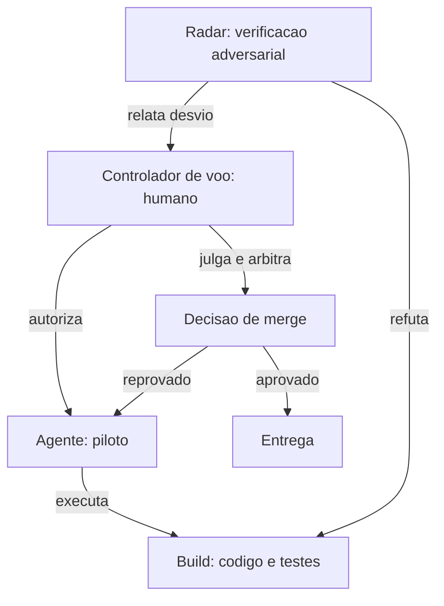

Como Comandante de Operações de Software, você notará uma sutileza: o radar também pode ser um agente. A verificação adversarial não exige humano — exige **independência**. Um segundo agente com papel de revisor, que não participou do build, tem o viés correto para refutar [7].

## 4. Técnica

### O Contrato de Delegação como Dataclass

Vamos transformar a matriz de papéis em código. O contrato de delegação define, por fase, quem executa, quem aprova e qual artefato comprova a conclusão.

```python
from dataclasses import dataclass, field
from typing import List, Optional
from enum import Enum


class AgenteTipo(Enum):
    ORQUESTRADOR = "orquestrador"
    EXECUTANTE = "executante"
    REVISOR = "revisor"


@dataclass
class ContratoDelegacao:
    fase: str
    executor: AgenteTipo
    aprovador: AgenteTipo
    accountable: str = "humano"
    artefato_prova: str = ""
    independente: bool = False

    def valida_segregacao(self) -> tuple:
        """Regra de ouro: quem executa nao pode aprovar sozinho."""
        if self.executor == self.aprovador and not self.independente:
            return False, "segregacao de funcoes violada: mesmo agente executa e aprova"
        return True, "segregacao respeitada"


CONTRATOS = {
    "intencao": ContratoDelegacao("intencao", AgenteTipo.ORQUESTRADOR, AgenteTipo.ORQUESTRADOR,
                                  accountable="humano", artefato_prova="intencao.md"),
    "spec": ContratoDelegacao("spec", AgenteTipo.EXECUTANTE, AgenteTipo.ORQUESTRADOR,
                              accountable="humano", artefato_prova="spec.md"),
    "build": ContratoDelegacao("build", AgenteTipo.EXECUTANTE, AgenteTipo.REVISOR,
                               accountable="humano", artefato_prova="diff", independente=True),
    "verificar": ContratoDelegacao("verificar", AgenteTipo.REVISOR, AgenteTipo.ORQUESTRADOR,
                                   accountable="humano", artefato_prova="parecer.md"),
}


def checar_segregacao(fase_id: str) -> None:
    contrato = CONTRATOS[fase_id]
    ok, motivo = contrato.valida_segregacao()
    print(f"[{'OK' if ok else 'FALHA'}] {fase_id}: {motivo}")
    if not ok:
        raise SystemExit(1)


if __name__ == "__main__":
    for f in CONTRATOS:
        checar_segregacao(f)
```

Note a linha `independente=True` no contrato do build: o aprovador do build é o REVISOR, não o próprio EXECUTANTE. Essa é a codificação literal da regra de ouro do capítulo.

### A Fila de Verificação Adversarial

A verificação adversarial precisa de um fluxo. O código abaixo implementa uma fila onde cada artefato produzido é encaminhado a um revisor diferente do produtor.

```python
from collections import deque
from dataclasses import dataclass
from typing import List


@dataclass
class Artefato:
    id: str
    produtor: str
    conteudo: str
    status: str = "aguardando_revisao"


class FilaVerificacao:
    def __init__(self, revisores: List[str]) -> None:
        self.fila: deque = deque()
        self.revisores = revisores
        self.pareceres = []

    def adicionar(self, artefato: Artefato) -> None:
        if len(self.revisores) == 1 and self.revisores[0] == artefato.produtor:
            raise ValueError("segregacao violada: sem revisor independente disponivel")
        self.fila.append(artefato)

    def revisar(self) -> None:
        while self.fila:
            artefato = self.fila.popleft()
            revisor = next(
                (r for r in self.revisores if r != artefato.produtor), None)
            if revisor is None:
                raise RuntimeError("nenhum revisor independente")
            self.pareceres.append(
                f"{artefato.id}: revisor={revisor} status=refutacao_em_andamento")
        return None


fila = FilaVerificacao(revisores=["agente-revisor", "revisor-humano"])
fila.adicionar(Artefato("spec-v1", "agente-redator", "escopo e criterios"))
fila.revisar()
print("\n".join(fila.pareceres))
```

### A Árvore de Decisão de Delegação

Quando a delegação é possível? A resposta operacional é uma árvore de decisão que o orquestrador consulta antes de cada despacho. O código abaixo implementa a árvore — ela decide, com base no tipo de decisão, se o trabalho vai para o agente, para o revisor ou para o humano.

```python
from dataclasses import dataclass
from enum import Enum


class Destino(Enum):
    AGENTE = "agente"
    REVISOR = "revisor"
    HUMANO = "humano"


@dataclass
class DecisaoDelegacao:
    tarefa: str
    risco: str          # baixo | medio | alto
    reversivel: bool
    requer_contrato: bool

    def destino(self) -> Destino:
        if self.risco == "alto" or not self.reversivel:
            return Destino.HUMANO
        if self.requer_contrato and not self.reversivel:
            return Destino.HUMANO
        if self.risco == "medio":
            return Destino.REVISOR
        return Destino.AGENTE


DECISOES = [
    DecisaoDelegacao("gerar_documentacao", "baixo", True, False),
    DecisaoDelegacao("implementar_endpoint", "medio", True, True),
    DecisaoDelegacao("mudar_schema_banco", "alto", False, True),
    DecisaoDelegacao("refatorar_modulo_legado", "medio", False, True),
]


if __name__ == "__main__":
    for d in DECISOES:
        print(f"{d.tarefa:<28} -> {d.destino().value}")
```

O resultado é previsível e auditável: mudança de schema (alto risco, irreversível) nunca vai para o agente direto; documentação (baixo risco, reversível) vai sem cerimônia. A árvore transforma a intuição de delegação em regra executável [19].

### O Modelo de Decisão com Três Camadas de Verificação

A matriz de papéis não existe no vácuo — ela se materializa no modelo de decisão que define, para cada artefato, quem produz, quem verifica e quem arbitra. O código abaixo implementa o modelo completo de três camadas:

```python
from dataclasses import dataclass
from typing import List


@dataclass
class Camada:
    nome: str
    funcao: str
    autonomo: bool


CAMADAS_VERIFICACAO = [
    Camada("maquina", "typecheck, lint, testes", True),
    Camada("adversarial", "revisor independente que refuta", True),
    Camada("humana", "decisao de merge e arbitragem", False),
]


def modelo_decisao(artefato: str, mudanca_contrato: bool = False) -> List[str]:
    """Retorna a sequencia de verificacoes obrigatorias para um artefato."""
    sequencia = [f"{c.nome}: {c.funcao}" for c in CAMADAS_VERIFICACAO]
    if mudanca_contrato:
        sequencia.append("humana-extra: revisao de impacto de contrato")
    return sequencia


for passo in modelo_decisao("migracao_schema", mudanca_contrato=True):
    print(f"  -> {passo}")
```

O modelo de decisão é o coração operacional do Capítulo 2: a sequência de verificações é previsível, auditável e idêntica para todos os artefatos da mesma classe — a régua da torre aplicada a cada voo [23].

### O Modelo de Escalonamento de Exceções

Nem toda decisão pode ser delegada, e o agente precisa saber quando subir a decisão. O modelo abaixo classifica a exceção em três níveis de escalonamento — tático, gerencial e estratégico — e roteia cada uma para o nível certo:

```python
class Escalonador:
    NIVEIS = {'tatico': 1, 'gerencial': 2, 'estrategico': 3}

    def __init__(self):
        self.decisoes = []

    def escalar(self, decisao, impacto, irreversivel):
        nivel = 'tatico'
        if impacto == 'alto':
            nivel = 'gerencial'
        if irreversivel or impacto == 'critico':
            nivel = 'estrategico'
        self.decisoes.append({'decisao': decisao, 'nivel': nivel})
        return {'decisao': decisao, 'nivel': nivel, 'nivel_numero': self.NIVEIS[nivel]}

e = Escalonador()
print(e.escalar('escolher nome de variavel', 'baixo', False))
print(e.escalar('mudar schema do banco', 'alto', True))
```

A tabela de escalonamento é o que evita o pior dos dois mundos: agente que decide demais (risco) ou agente que pergunta demais (paralisia). Decisão de baixo impacto e reversível fica no nível tático — o agente decide e registra. Decisão de alto impacto fica no gerencial, com contexto. Decisão irreversível ou crítica sobe ao estratégico, onde está o comandante. O registro de todas as escaladas cria o padrão de onde a organização realmente toma decisões.

### O Contraste Humano-Agente: o Que Cada Um Faz Melhor

A matriz de papéis se torna mais nítida quando confrontamos as forças relativas. O quadro abaixo é o instrumento de calibração — o que delegar sem medo, o que delegar com supervisão e o que nunca delegar:

| Tarefa | Agente faz melhor? | Humano faz melhor? | Decisão |
|--------|--------------------|--------------------|---------|
| Escrever testes de unidade | Sim (rápido, volumoso) | — | Delegar |
| Explorar código legado | Sim (varredura massiva) | — | Delegar via subagente |
| Definir critérios de aceite | — | Sim (conhece o negócio) | Humano |
| Arbitrar trade-offs de design | — | Sim (contexto e histórico) | Humano |
| Detectar regressão de contrato | Sim (CI é implacável) | — | Delegar à máquina |
| Responder por incidente | — | Sim (accountability) | Humano |

A calibração não é sobre competência apenas — é sobre risco. O agente pode redigir um critério de aceite plausível, mas o critério errado custa o ciclo inteiro; o humano pode revisar cem testes, mas o volume é ineficiente. A régua é: volume e mecânica delegam; julgamento e responsabilidade permanecem [25].

### O Modelo de Transferência de Autoridade

A autoridade não é transferida de uma vez — é transferida em etapas com critérios. O modelo abaixo define quando uma decisão pode subir ou descer de nível:

| Decisão | Nível atual | Critério para subir | Critério para descer |
|---------|-------------|---------------------|----------------------|
| Escopo | Humano | Impacto alto/irreversível | Rotina documentada |
| Merge | Humano | Contrato alterado | Mudança trivial com radar verde |
| Teste | Agente | Cobertura de borda baixa | Matriz completa |
| Skill | Revisor | Taxa de sucesso cai | Maturidade comprovada |

O modelo de transferência é o contrato dinâmico de autoridade: os níveis não são fixos — mudam com o desempenho comprovado. A autoridade desce quando a evidência sustenta; sobe quando o risco cresce [29].

### O Modelo de Revogação de Autoridade

Autoridade concedida precisa de revogação possível e automática. O modelo abaixo revoga a delegação quando o agente viola o contrato — excedendo o escopo ou deixando de registrar evidência:

```python
class ContratoDeAutoridade:
    def __init__(self, id, escopo, exige_evidencia):
        self.id = id
        self.escopo = escopo
        self.exige_evidencia = exige_evidencia
        self.ativa = True
        self.violacoes = []

    def executar(self, acao, evidencia):
        if not self.ativa:
            return {'status': 'bloqueada', 'motivo': 'autoridade revogada'}
        if acao not in self.escopo:
            self.violacoes.append({'tipo': 'fora_de_escopo', 'acao': acao})
            self.ativa = False
            return {'status': 'revogada', 'motivo': 'acao fora do escopo'}
        if self.exige_evidencia and not evidencia:
            self.violacoes.append({'tipo': 'sem_evidencia', 'acao': acao})
            self.ativa = False
            return {'status': 'revogada', 'motivo': 'acao sem evidencia'}
        return {'status': 'ok', 'acao': acao}

c = ContratoDeAutoridade('A-5', {'editar_arquivos', 'rodar_teste'}, exige_evidencia=True)
print(c.executar('deletar_banco', evidencia=''))
print(c.executar('editar_arquivos', evidencia='teste_ok.txt'))
```

A revogação automática é o freio de emergência da delegação: quando o agente tenta ação fora do escopo ou age sem evidência, a autoridade morre na hora e o incidente fica registrado para o debriefing. O humano não precisa vigiar em tempo real — o contrato vigia. E o padrão de violações, acumulado ao longo de semanas, alimenta a decisão de conceder ou negar a próxima delegação.

### O Modelo de Autonomia Escalonável

A autonomia do agente não é binária — é escalável. O modelo abaixo define níveis de autonomia por classe de tarefa, com a autoridade correspondente:

| Nível | Autonomia do agente | Supervisão humana | Exemplo |
|-------|---------------------|-------------------|---------|
| A1 | Executa com instrução detalhada | Revisão completa | Teste de unidade |
| A2 | Executa com objetivo claro | Revisão por amostra | Feature isolada |
| A3 | Escolhe a abordagem | Revisão de contrato | Refatoração |
| A4 | Opera o fluxo da fase | Supervisão por exceção | Pipeline de release |
| A5 | Opera o ciclo inteiro | Arbitragem de conflito | Maturidade L5 |

O modelo de autonomia escalável é o dial da delegação: cada tarefa recebe o nível de autonomia que o risco justifica — e o nível é declarado no contrato de delegação. O agente que opera a A5 sem o contrato correspondente é uma violação do modelo, não uma evolução dele [28].

### O Modelo de Matriz de Responsabilidade em YAML

A matriz RACI do AI-first pode ser declarada em formato de máquina — o mesmo YAML que a esteira consome para validar a segregação de funções. O modelo abaixo é a matriz canônica:

```yaml
matriz_raci:
  fases:
    intencao:
      humano_responsable: true
      agente_responsable: false
      humano_accountable: true
      regra: "agente pode provocar (grill), nunca decidir"
    spec:
      humano_responsable: false
      agente_responsable: true
      humano_accountable: true
      regra: "agente redige; humano aprova; sem aprovacao, sem build"
    build:
      humano_responsable: false
      agente_responsable: true
      humano_accountable: true
      regra: "segregacao: produtor != aprovador"
    verificar:
      humano_responsable: false
      agente_responsable: true
      humano_accountable: true
      regra: "revisor independente refuta com evidencia"
    entregar:
      humano_responsable: true
      agente_responsable: false
      humano_accountable: true
      regra: "release reproduzivel; humano autoriza estagios"
```

A matriz em YAML é o contrato executável de responsabilidade: a esteira a consulta antes de cada transição e bloqueia qualquer desvio da regra declarada — a segregação vira código, não intenção [27].

### O Comitê de Exceções como Instância Final

Nenhuma matriz cobre todos os casos — e é por isso que o Comandante tem um comitê de exceções: a instância mínima de humanos que arbitra quando máquina e agente discordam ou quando o caso não está no contrato. O fluxo de escalação é simples:

1. O caso chega ao comitê com a evidência das camadas (nunca só a narrativa).
2. O comitê decide com base no contrato — ou atualiza o contrato se a lacuna for real.
3. A decisão vira precedente registrado no banco de decisões (o registro do Capítulo 2).
4. O precedente alimenta a revisão da spec na Fase 8.

O comitê não é burocracia — é a válvula de segurança do contrato: quando o processo não cobre o caso, a exceção é decidida por humanos com evidência, e o aprendizado volta para o processo [26].

### O Contrato de Delegação com Rastreabilidade

Um contrato de delegação sem rastreabilidade é uma promessa vazia. O modelo abaixo adiciona ao dataclass de delegação um histórico de versões e a ligação com a evidência que justificou cada delegação:

```python
from dataclasses import dataclass, field
from datetime import datetime

@dataclass
class DelegacaoRastreavel:
    id: str
    tarefa: str
    agente: str
    autoridade: str
    evidencia: str
    versao: int = 1
    historico: list = field(default_factory=list)

    def alterar(self, campo, valor, motivo, autor):
        self.historico.append({
            'versao': self.versao,
            'campo': campo,
            'valor_antigo': getattr(self, campo),
            'valor_novo': valor,
            'motivo': motivo,
            'autor': autor,
            'quando': datetime.now().isoformat(),
        })
        setattr(self, campo, valor)
        self.versao += 1

    def trilha(self):
        return {'id': self.id, 'versao_atual': self.versao, 'historico': self.historico}

d = DelegacaoRastreavel('D-17', 'implementar cobranca', 'agente-b', 'parcial', 'spec_executavel.md#R12')
d.alterar('autoridade', 'plena', 'incidentes zerados por 30 dias', 'comandante')
print(d.trilha())
```

Cada alteração de autoridade fica registrada com motivo e autor — se um dia a delegação plena precisar ser questionada, a trilha mostra exatamente quando, por quê e com base em qual evidência ela foi concedida. Isso transforma a delegação de um ato administrativo em um fato registrado, auditável e reversível.

### O Comitê de Exceções como Instância Final

Quando o agente encontra uma tarefa fora do seu contrato, quem decide? O modelo abaixo encaminha a exceção para um comitê humano, mas exige que a solicitação venha com contexto estruturado — sem ele, a exceção nem entra na fila:

```python
class ComiteDeExcecoes:
    def __init__(self):
        self.fila = []

    def solicitar(self, agente, tarefa, motivo, impacto, alternativa):
        if not (motivo and impacto):
            return {'status': 'rejeitada', 'motivo': 'contexto incompleto'}
        item = {'agente': agente, 'tarefa': tarefa, 'motivo': motivo, 'impacto': impacto, 'alternativa': alternativa}
        self.fila.append(item)
        return {'status': 'na_fila', 'posicao': len(self.fila)}

    def decidir(self, posicao, decisao, justificativa):
        item = self.fila[posicao - 1]
        item['decisao'] = decisao
        item['justificativa'] = justificativa
        return item

comite = ComiteDeExcecoes()
print(comite.solicitar('agente-b', 'acessar producao', 'precisa do banco real', 'bloqueia entrega', 'usar staging'))
```

A exigência de contexto estruturado tem efeito duplo: reduz o ruído (o comitê só vê exceções bem formuladas) e educa o agente (a cada tentativa de exceção, ele aprende o formato do que a organização considera informação suficiente para decidir). Com o tempo, muitas exceções param de existir porque o agente aprende a resolvê-las dentro do contrato.

### O Registro de Decisões como Trilha de Auditoria

A responsabilidade humana precisa de trilha. O registro de decisões — quem aprovou o quê, com base em qual evidência — é o artefato que transforma accountability em dado:

```json
{
  "decisoes": [
    {
      "id": "DEC-042",
      "data": "2026-07-30",
      "decisor": "lead-plataforma",
      "tipo": "autorizar_merge",
      "artefato": "feature/cupons-v2",
      "evidencia": ["saida_ci.txt", "parecer_adversarial.md"],
      "escalado_de": "agente-revisor",
      "observacao": "caso de borda cupom acumulativo coberto por teste canonico"
    }
  ]
}
```

O registro é a caixa-preta da autoridade: quando um incidente acontece, a primeira pergunta — "quem autorizou e com que evidência?" — tem resposta imediata e objetiva. Sem trilha, a accountability é narrativa; com trilha, é auditoria [24].

### O Modelo de Análise de Capacidade do Agente

Antes de delegar, o comandante precisa saber o que o agente é capaz de fazer hoje. O modelo abaixo mantém um perfil de capacidades por agente, atualizado a cada tarefa concluída com sucesso ou falha:

```python
class PerfilDeCapacidade:
    def __init__(self, agente):
        self.agente = agente
        self.capacidades = {}

    def registrar_tarefa(self, tipo, resultado):
        cap = self.capacidades.setdefault(tipo, {'sucessos': 0, 'falhas': 0})
        if resultado == 'sucesso':
            cap['sucessos'] += 1
        else:
            cap['falhas'] += 1

    def confianca(self, tipo):
        cap = self.capacidades.get(tipo, {'sucessos': 0, 'falhas': 0})
        total = cap['sucessos'] + cap['falhas']
        if total == 0:
            return 0.5  # desconhecido
        return cap['sucessos'] / total

    def pode_delegar(self, tipo, limiar=0.8):
        return self.confianca(tipo) >= limiar

perfil = PerfilDeCapacidade('agente-b')
for resultado in ['sucesso'] * 12 + ['falha'] * 1:
    perfil.registrar_tarefa('refatoracao', resultado)
print(perfil.confianca('refatoracao'))  # 0.92
print(perfil.pode_delegar('refatoracao'))  # True
```

A confiança medida substitui a confiança intuída: o agente não recebe autonomia plena em um tipo de tarefa porque "parece capaz", mas porque o histórico de evidências demonstra. O limiar é configurável por tipo de tarefa — tarefas de baixo risco podem usar limiar 0.7, tarefas que tocam produção exigem 0.95. Quando a confiança cai abaixo do limiar após uma sequência de falhas, o contrato de delegação é revogado automaticamente.

### A Roda de Delegação em Cascata

A delegação não acontece em um único nível — ela desce em cascata. O Comandante delega a um agente; o agente pode delegar partes a subagentes; e a verificação separa cada nível. A cascata precisa de controle, e o controle é o registro de toda a árvore de delegação:

```python
from dataclasses import dataclass, field
from typing import List, Optional


@dataclass
class NoDelegacao:
    tarefa: str
    agente: str
    pai: Optional[str] = None
    filhos: List["NoDelegacao"] = field(default_factory=list)

    def profunidade(self) -> int:
        if not self.pai:
            return 0
        return 1

    def caminho(self) -> str:
        return f"{self.pai} -> {self.agente}" if self.pai else self.agente


def montar_arvore_delegacao() -> NoDelegacao:
    raiz = NoDelegacao("feature pagamentos", "orquestrador")
    modulo = NoDelegacao("modulo fatura", "agente-pagamentos", pai="orquestrador")
    interface = NoDelegacao("interface", "subagente-interface", pai="agente-pagamentos")
    testes = NoDelegacao("testes de aceite", "subagente-testes", pai="agente-pagamentos")
    modulo.filhos = [interface, testes]
    raiz.filhos = [modulo]
    return raiz


def listar_arvore(no: NoDelegacao) -> list:
    saida = [no.caminho()]
    for filho in no.filhos:
        saida.extend(listar_arvore(filho))
    return saida


arvore = montar_arvore_delegacao()
for linha in listar_arvore(arvore):
    print(f"  {linha}")
```

A árvore registrada é o mapa de responsabilidade: se o artefato da interface falhar, o caminho de auditoria sabe exatamente quem produziu, sob qual pai, em qual nível [21].

### A Linguagem do Contrato: Citações de Autoridade

O contrato de delegação também define a linguagem da autoridade — as expressões que separam uma decisão humana de uma ação agêntica:

| Expressão | Significado | Quem emite |
|-----------|-------------|------------|
| "Autorizado" | Decisão final com responsabilidade | Humano |
| "Recomendado" | Proposta sem autoridade final | Agente |
| "Evidência:" | Dado que sustenta uma afirmação | Qualquer um, com registro |
| "Pendente:" | Item que bloqueia avanço | Esteira |
| "Escalado" | Decisão subiu de nível | Agente → Humano |

A linguagem uniforme evita o mal-entendido mais caro do AI-first: o agente que trata "recomendado" como "autorizado" e age além do mandato. O vocabulário do contrato é a fraseologia da torre — sem ambiguidade entre setores [22].

### O Quadro de Autoridade Visível

O contrato de autoridade precisa ser visível para o time inteiro — não um arquivo esquecido. Um quadro simples, versionado no repositório, responde em segundos quem pode o quê:

| Decisão | Executor | Aprovador | Accountable | Delegável? |
|---------|----------|-----------|-------------|------------|
| Escrever teste | Agente | Revisor agêntico | Humano | Sim |
| Definir escopo | Humano | Humano | Humano | Não |
| Escolher arquivo | Agente | Revisor | Humano | Sim |
| Autorizar merge | Humano | — | Humano | Não |
| Criar skill | Agente | Revisor humano | Humano | Parcial |

O quadro é o mapa de autoridade da torre: cada controlador sabe o próprio raio de ação sem ambiguidade — e o auditor sabe onde procurar quando o processo falha [20].

### O Papel da Evidência na Decisão Humana

A autoridade estratégica do humano depende de um instrumento que ainda não formalizamos: a evidência. Decisões de merge tomadas sem registro de evidência são decisões de fé — e a fé não escala quando dezenas de mudanças agênticas cruzam o radar por semana [13]. Organizações que lideram o movimento agêntico institucionalizaram a porta de evidência: nenhuma mudança avança sem o output registrado das camadas de verificação, e o parecer humano arbitra apenas as exceções que o radar não resolveu sozinho [14]. Essa separação — máquina filtra, agente refuta, humano arbitra — é o que permite escalar a delegação sem escalar o risco [15].

### Delegar sem Abandonar

A distinção entre autonomia tática e autoridade estratégica também define o estilo de delegação do Comandante. Delegar não é abandonar: é entregar a execução e manter a supervisão do contrato. O agente que roda uma suíte inteira de testes e volta com o relatório é útil; o agente que decide sozinho o escopo da próxima iteração é perigoso [16]. A literatura de agentes de engenharia de software reforça que os melhores resultados aparecem quando o humano define a intenção e os critérios, e o agente resolve o espaço entre os dois [17]. Ferramentas de revisão assistida já automatizam a análise de codebases gigantes, mas o julgamento sobre o que vale a pena mudar permanece humano [18].

### A Trilha de Decisões da Delegação

Cada delegação importante deixa trilha — e a trilha é pública. O padrão de registro: quem delegou, para quem, com qual escopo, baseado em qual evidência, com qual nível de autoridade e quando. A trilha pública muda o comportamento de quem delega: a decisão de conceder autoridade plena a um agente fica visível para o time inteiro, e o delegador responde por ela no debriefing. A trilha também é o material de treinamento da organização — os padrões de delegação que funcionaram (e os que quebraram) estão todos registrados para o próximo comandante.

### Passos para Implantar a Matriz na Sua Equipe

1. **Liste as fases** do seu ciclo de vida (reutilize o inventário do Capítulo 1).
2. **Atribua a cada fase** um executor, um aprovador e um accountable, usando o contrato de delegação acima.
3. **Force a segregação**: crie um teste automatizado que falha se o mesmo agente aparece como executor e aprovador na mesma fase.
4. **Distinga o radar humano do radar agêntico**: defina quais fases exigem revisor humano (spec, merge) e quais aceitam revisor agêntico (build preliminar).
5. **Registre cada parecer** com evidência (output de comando, diff, métrica) — afirmação sem evidência não é parecer [8].

### O Modelo de Contrato com Autoridade por Tarefa

A autoridade não precisa ser global — pode ser concedida por tarefa. O modelo abaixo define permissões granulares que o agente usa para saber exatamente o que pode fazer:

```python
class AutoridadePorTarefa:
    def __init__(self):
        self.permissoes = {}

    def conceder(self, tarefa, acoes):
        self.permissoes[tarefa] = set(acoes)

    def pode(self, tarefa, acao):
        return acao in self.permissoes.get(tarefa, set())

a = AutoridadePorTarefa()
a.conceder('refatorar-modulo', ['ler', 'editar', 'testar'])
print(a.pode('refatorar-modulo', 'editar'))
print(a.pode('refatorar-modulo', 'deployar'))
```

A autoridade por tarefa é a versão fina do contrato de delegação: o agente pode editar e testar na tarefa de refatoração, mas não pode deployar em nenhuma. Conceder permissões granulares reduz o risco sem aumentar a burocracia — a pergunta não é "o agente é confiável?" mas "para esta tarefa, quais ações fazem sentido?".

### O Limite da Autonomia Tática

Nem toda decisão pode ser delegada. O trecho abaixo lista decisões que permanecem estratégicas — bloqueadas por padrão para o agente:

```python
DECISOES_ESTRATEGICAS = {
    "aprovar_escopo": {"nivel": "estrategico", "delegavel": False},
    "definir_done": {"nivel": "estrategico", "delegavel": False},
    "autorizar_merge": {"nivel": "estrategico", "delegavel": False},
    "escolher_arquivo": {"nivel": "tatico", "delegavel": True},
    "escrever_teste": {"nivel": "tatico", "delegavel": True},
    "rodar_lint": {"nivel": "tatico", "delegavel": True},
}


def pode_delegar(decisao: str) -> bool:
    return DECISOES_ESTRATEGICAS.get(decisao, {}).get("delegavel", False)


if __name__ == "__main__":
    for decisao in DECISOES_ESTRATEGICAS:
        nivel = "delegavel" if pode_delegar(decisao) else "humano obrigatorio"
        print(f"{decisao:<20} -> {nivel}")
```

Essa lista é o coração do contrato de autoridade: autonomia tática ampla, autoridade estratégica concentrada [9].

## 5. Aplica

Cena real, em segunda pessoa. Você é o tech lead de uma plataforma de e-commerce. Seu time adotou um agente de IA para implementar features, e tudo corre bem — até a feature de cupom de desconto. O agente implementa a lógica, roda os testes locais e abre o pull request. Você, ocupado com uma reunião, aprova o PR com uma olhada rápida. Na sexta-feira, um cupom acumulativo de 30% mais 30% vaza e gera prejuízo de R$ 80 mil em uma hora.

O erro tem dois andares. Primeiro andar: o agente implementou sozinho e se auto-validou — os testes que ele rodou foram os testes que ele mesmo escreveu, para o cenário que ele mesmo imaginou. Segundo andar: você aprovou sem revisão adversarial — o mesmo PR que o agente escreveu foi lido pelo mesmo fluxo que o gerou, sem nenhum par de olhos com postura de refutação.

O diagnóstico ligado à teoria: a segregação de funções foi violada nos dois níveis. O produtor validou a própria produção (violação da regra de ouro), e o aprovador humano atuou como carimbo, não como radar (violação da autoridade estratégica).

A correção prática:

1. **Configure um revisor agêntico independente** que rode automaticamente em todo PR do agente, com postura explícita de refutação: procurar o cenário que quebra, não o que funciona.
2. **Exija que o PR do agente inclua** os casos de borda que ele testou e os que ele **não** testou — uma declaração de limites, não só de sucesso.
3. **Reserve 15 minutos por PR** para a revisão humana focada apenas nas decisões estratégicas: escopo, critérios de aceite e impacto em produção. Todo o resto é do radar agêntico [10].
4. **Trate o incidente como insumo de aprendizado**: o caso do cupom acumulativo vira um caso de teste canônico e uma regra de negócio explícita na spec, não apenas um hotfix.

Armadilhas que você encontrará no caminho: achar que a revisão agêntica substitui a humana (substitui em volume, não em autoridade); aceitar pareceres sem evidência ("revisei e está ok" sem output de comando); e permitir que o mesmo agente escreva o código e a suíte de testes da mesma feature sem um terceiro olhar [11].

## 6. Conclusão

Neste voo, você assumiu o posto de controlador. Recapitulando os três marcos: primeiro, a distinção entre autonomia tática (delegável ao agente) e autoridade estratégica (concentrada no humano); segundo, a segregação de funções como princípio — quem escreve não valida sozinho, materializada em código no contrato de delegação e na fila de verificação; terceiro, a verificação adversarial como radar independente, que pode ser humana ou agêntica, desde que independente.

Como desafio, implemente o contrato de delegação do seu time em código e rode o teste de segregação: você vai descobrir pelo menos uma fase onde o produtor é também o aprovador.

No próximo capítulo, você vai escrever o primeiro artefato do novo ciclo: transformar intenção vaga em spec executável — o plano de voo que autoriza a decolagem [12].

## 7. Referências Bibliográficas

[1] JIMENEZ, Carlos E. et al. *SWE-bench: Can Language Models Resolve Real-World GitHub Issues?* ICLR 2024. Disponível em: https://arxiv.org/abs/2310.06770. Acesso em: 02 ago. 2026.
[2] JIN, Haolin et al. *From LLMs to LLM-based Agents for Software Engineering: A Survey of Current, Challenges and Future.* 2025. Disponível em: https://arxiv.org/abs/2408.02479. Acesso em: 02 ago. 2026.
[3] YANG, John et al. *SWE-agent: Agent-Computer Interfaces Enable Automated Software Engineering.* NeurIPS 2024. Disponível em: https://arxiv.org/abs/2405.15793. Acesso em: 02 ago. 2026.
[4] GURGUL, Vincent; GUBELA, Robin; LESSMANN, Stefan. *The State of Generative AI in Software Development: Insights from Literature and a Developer Survey.* 2026. Disponível em: https://arxiv.org/abs/2603.16975. Acesso em: 02 ago. 2026.
[5] ROYCHOUDHURY, Abhik et al. *Agentic Software Engineering: state and perspectives.* 2025. Disponível em: https://arxiv.org/abs/2509.09893. Acesso em: 02 ago. 2026.
[6] GRÖPLER, Robin et al. *The Future of Generative AI in Software Engineering: A Vision from Industry and Academia in the European GENIUS Project.* IEEE/ACM AIware, 2025. Disponível em: https://arxiv.org/abs/2511.01348. Acesso em: 02 ago. 2026.
[7] MOHAGHEGHI, Milad et al. *Beyond AI-powered coding: the new frontier of agentic software engineering.* 2025. Disponível em: https://arxiv.org/abs/2509.14838. Acesso em: 02 ago. 2026.
[8] ANTHROPIC. *Building effective agents.* Disponível em: https://www.anthropic.com/research/building-effective-agents. Acesso em: 02 ago. 2026.
[9] HODA, Rashina. *Toward Agentic Software Engineering Beyond Code: Framing Vision, Values, and Vocabulary.* ICSE 2026 Workshop. Disponível em: https://arxiv.org/abs/2510.19692. Acesso em: 02 ago. 2026.
[10] HINGEL, Paula. *How AI Changes the SDLC: A Six-Stage Guide.* Augment Code, 2026. Disponível em: https://www.augmentcode.com/guides/how-ai-changes-the-sdlc. Acesso em: 02 ago. 2026.
[11] LEHMANN, Fabian et al. *Software Engineering in the Era of LLMs.* 2024. Disponível em: https://arxiv.org/abs/2403.09752. Acesso em: 02 ago. 2026.
[12] WANG, Yuchen; GUO, Shangxin; TAN, Chee Wei. *From Code Generation to Software Testing: AI Copilot with Context-Based RAG.* 2025. Disponível em: https://arxiv.org/abs/2504.01866. Acesso em: 02 ago. 2026.
[13] FORSGREN, Nicole; HUMBLE, Jez; KIM, Gene. *Accelerate: The Science of Lean Software and DevOps.* Portland: IT Revolution Press, 2018. Disponível em: https://itrevolution.com. Acesso em: 02 ago. 2026.
[14] MICROSOFT. *An AI led SDLC: Building an End-to-End Agentic Software Development Lifecycle with Azure and GitHub.* Microsoft Tech Community, 2026. Disponível em: https://techcommunity.microsoft.com/blog/appsonazureblog/an-ai-led-sdlc-building-an-end-to-end-agentic-software-development-lifecycle-wit/4491896. Acesso em: 02 ago. 2026.
[15] GRÖPLER, Robin et al. *The Future of Generative AI in Software Engineering: A Vision from Industry and Academia in the European GENIUS Project.* IEEE/ACM AIware, 2025. Disponível em: https://arxiv.org/abs/2511.01348. Acesso em: 02 ago. 2026.
[16] ROYCHOUDHURY, Abhik et al. *Agentic Software Engineering: state and perspectives.* 2025. Disponível em: https://arxiv.org/abs/2509.09893. Acesso em: 02 ago. 2026.
[17] JIN, Haolin et al. *From LLMs to LLM-based Agents for Software Engineering: A Survey of Current, Challenges and Future.* 2025. Disponível em: https://arxiv.org/abs/2408.02479. Acesso em: 02 ago. 2026.
[18] QODO. *AI-assisted code review.* Disponível em: https://www.qodo.ai. Acesso em: 02 ago. 2026.
[19] ANTHROPIC. *Introducing the Model Context Protocol.* Disponível em: https://www.anthropic.com/news/model-context-protocol. Acesso em: 02 ago. 2026.
[20] SWE-BENCH. *Benchmark oficial de agentes de código.* Disponível em: https://www.swebench.com. Acesso em: 02 ago. 2026.
[21] ROYCHOUDHURY, Abhik et al. *Agentic Software Engineering: state and perspectives.* 2025. Disponível em: https://arxiv.org/abs/2509.09893. Acesso em: 02 ago. 2026.
[22] MODEL CONTEXT PROTOCOL. *Documentação oficial do protocolo.* Disponível em: https://modelcontextprotocol.io. Acesso em: 02 ago. 2026.
[23] GRÖPLER, Robin et al. *The Future of Generative AI in Software Engineering: A Vision from Industry and Academia in the European GENIUS Project.* IEEE/ACM AIware, 2025. Disponível em: https://arxiv.org/abs/2511.01348. Acesso em: 02 ago. 2026.
[24] FORSGREN, Nicole; HUMBLE, Jez; KIM, Gene. *Accelerate: The Science of Lean Software and DevOps.* Portland: IT Revolution Press, 2018. Disponível em: https://itrevolution.com. Acesso em: 02 ago. 2026.
[25] JIN, Haolin et al. *From LLMs to LLM-based Agents for Software Engineering: A Survey of Current, Challenges and Future.* 2025. Disponível em: https://arxiv.org/abs/2408.02479. Acesso em: 02 ago. 2026.
[26] HODA, Rashina. *Toward Agentic Software Engineering Beyond Code: Framing Vision, Values, and Vocabulary.* ICSE 2026 Workshop. Disponível em: https://arxiv.org/abs/2510.19692. Acesso em: 02 ago. 2026.
[27] ROYCHOUDHURY, Abhik et al. *Agentic Software Engineering: state and perspectives.* 2025. Disponível em: https://arxiv.org/abs/2509.09893. Acesso em: 02 ago. 2026.
[28] MOHAGHEGHI, Milad et al. *Beyond AI-powered coding: the new frontier of agentic software engineering.* 2025. Disponível em: https://arxiv.org/abs/2509.14838. Acesso em: 02 ago. 2026.
[29] GURGUL, Vincent; GUBELA, Robin; LESSMANN, Stefan. *The State of Generative AI in Software Development: Insights from Literature and a Developer Survey.* 2026. Disponível em: https://arxiv.org/abs/2603.16975. Acesso em: 02 ago. 2026.


# Parte II — O Contrato — Spec e Design

# Capítulo 3: Plano de Voo: Da Intenção à Spec Executável

## 1. Introdução

No Capítulo 2, você ocupou o posto de controlador de voo e aprendeu a separar papéis: o agente executa, a verificação refuta, o humano arbitra. Agora vem o primeiro artefato concreto desse novo ciclo: o plano de voo. Nenhuma aeronave decola sem um plano aprovado — e nenhuma feature agêntica deveria começar sem uma spec executável.

Este capítulo ensina a transformar uma intenção vaga — "quero um sistema de autenticação", "melhora o carrinho de compras" — em uma spec que vira teste de aceite. Você vai aprender as partes obrigatórias da spec (escopo, requisitos R1..Rn, casos de borda, critérios de aceite), a técnica de decomposição em tickets com bloqueios explícitos, e a regra de ouro: se não dá para escrever o teste de aceite na spec, a spec está incompleta.

## 2. Explica

A especificação de software tem uma má reputação justificada. No SDLC clássico, a spec é um documento gigante escrito por analistas, aprovado em reuniões, e abandonado assim que o desenvolvimento começa. O código passa a ser a única fonte de verdade, e a spec vira uma ficção com data de publicação [1].

O paradigma AI-first recupera a spec — mas não a spec-documento. A spec executável é um **contrato de comportamento** escrito em linguagem que uma máquina consegue validar: requisitos numerados, casos de borda explícitos e critérios de aceite que são, na prática, testes. A diferença é que a spec deixa de ser descrição do que será feito e passa a ser **definição do que conta como pronto** [2].

Por que isso importa ainda mais com agentes? Porque o agente não tem o contexto tácito que um colega humano de equipe tem. Quando você pede a um desenvolvedor humano "cria a tela de login", ele preenche mentalmente dezenas de decisões implícitas — onde fica o botão, o que acontece com sessão expirada, como tratar erro de rede. O agente não preenche: ele **inventa**, com confiança, as decisões que você não tomou. A spec executável existe para eliminar a invenção [3].

A pesquisa sobre agentes de engenharia de software confirma o risco. Avaliações como o SWE-bench mostram que agentes resolvem issues com qualidade variável — e que a qualidade despenca quando o problema está mal definido [4]. O problema mal definido não é um bug do agente; é uma lacuna de contrato. A spec fechada reduz dramaticamente a variação de resultado.

Há também uma razão econômica. Tokens são o recurso escasso do ciclo AI-first. Uma spec ambígua gera retrabalho — e cada rodada de retrabalho é uma rodada inteira de tokens consumidos para produzir o que a primeira rodada deveria ter produzido. Escrever a spec bem feita antes do build é a forma mais barata de economizar contexto: custa uma fração do que custaria o ciclo de tentativa e erro do agente [5].

A técnica de decomposição em tickets com bloqueios explícitos completa o quadro. Uma spec não é só texto: é um grafo de trabalho onde cada tarefa declara o que bloqueia e o que ela bloqueia. "Escrever o teste de aceite do login" bloqueia "implementar o login"; "implementar o login" bloqueia "integrar com o provedor de identidade". Esse grafo de dependências é o que permite despachar agentes em paralelo com segurança — ninguém começa uma tarefa cujo antecedente não está pronto [6].

O resultado é uma mudança de mentalidade: a spec não é o início do ciclo, é o **contrato do ciclo**. A fase 2 do SDLC AI-first não termina quando o documento está escrito; termina quando os testes de aceite estão definidos e o grafo de tickets está explícito [7].

## 3. Ilustra

Um plano de voo comercial contém, obrigatoriamente: origem, destino, rota, altitude, velocidade, combustível e alternates — aeroportos para onde o avião pode desviar se algo der errado. O piloto não improvisa o destino durante o voo; o plano é aprovado antes da decolagem e qualquer desvio é negociado com a torre em tempo real.

A spec executável é o plano de voo da feature. O escopo é origem e destino. Os requisitos R1..Rn são a rota e a altitude. Os casos de borda são os alternates — os cenários para onde a implementação desvia quando o caminho feliz falha. E os critérios de aceite são o combustível: a prova objetiva de que o voo pode ser concluído.

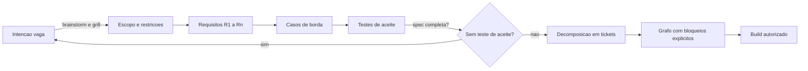

Como Comandante de Operações de Software, você vê no diagrama o laço de retorno: a spec só sai do radar quando cada requisito tem um teste de aceite. Caso contrário, volta para a origem — sem vergonha, sem burocracia. É o plano de voo voltando à torre para revisão [8].

## 4. Técnica

### O Esqueleto da Spec Executável

A spec executável é um arquivo estruturado que a esteira consegue interpretar. O formato abaixo em YAML cobre as partes obrigatórias: escopo, requisitos, casos de borda e critérios de aceite.

```yaml
espec:
  titulo: "Autenticacao por email e senha"
  versao: "1.0"
  escopo:
    inclui:
      - "Login com email e senha"
      - "Recuperacao de senha"
    exclui:
      - "Login social (OAuth2)"
      - "Autenticacao por biometria"
  requisitos:
    R1: "Usuario cadastrado consegue autenticar com email e senha validos"
    R2: "Senha incorreta gera erro generico, sem revelar se o email existe"
    R3: "Sessao expira apos 30 minutos de inatividade"
  casos_borda:
    - "Email em caixa alta deve ser normalizado para minusculas"
    - "Senha com 5 tentativas falhas bloqueia a conta por 15 minutos"
    - "Sessao expirada durante requisicao retorna 401 e redireciona para login"
  criterios_aceite:
    - "teste: login_fluxo_feliz -> passa quando R1 verificado"
    - "teste: login_senha_errada -> passa quando R2 verificado"
    - "teste: sessao_expirada -> passa quando R3 verificado"
```

A validação da regra de ouro é trivial: se qualquer requisito não tem critério de aceite, a spec está incompleta. O código abaixo faz essa verificação e bloqueia o avanço.

```python
from dataclasses import dataclass
from typing import Dict, List


@dataclass
class Requisito:
    id: str
    descricao: str
    criterio_aceite: str = ""


def validar_spec(requisitos: Dict[str, Requisito]) -> tuple:
    sem_criterio = [
        r.id for r in requisitos.values() if not r.criterio_aceite.strip()
    ]
    if sem_criterio:
        return False, f"requisitos sem teste de aceite: {', '.join(sem_criterio)}"
    return True, "spec executavel: todos os requisitos tem criterio de aceite"


REQUISITOS = {
    "R1": Requisito("R1", "Usuario cadastrado autentica com credenciais validas",
                    "login_fluxo_feliz"),
    "R2": Requisito("R2", "Senha incorreta gera erro generico", "login_senha_errada"),
    "R3": Requisito("R3", "Sessao expira apos 30 minutos", "sessao_expirada"),
}


if __name__ == "__main__":
    ok, motivo = validar_spec(REQUISITOS)
    print(f"[{'OK' if ok else 'BLOQUEADO'}] {motivo}")
```

### A Regra de Ouro em Ação: Critério que Vira Teste

O critério de aceite não é uma frase de efeito — é o rascunho do teste. A tradução direta produz o esqueleto do teste que o agente deve escrever (e que deve falhar antes da implementação, no espírito test-first).

```python
import unittest


class TesteAutenticacao(unittest.TestCase):
    def setUp(self) -> None:
        self.repositorio = RepositorioUsuariosEmMemoria()

    def test_login_fluxo_feliz(self) -> None:
        self.repositorio.criar("ana@exemplo.com", "segredo-123")
        resultado = autenticar("ana@exemplo.com", "segredo-123")
        self.assertTrue(resultado.autenticado)

    def test_login_senha_errada(self) -> None:
        self.repositorio.criar("ana@exemplo.com", "segredo-123")
        with self.assertRaises(ErroCredenciaisInvalidas):
            autenticar("ana@exemplo.com", "senha-errada")

    def test_sessao_expirada(self) -> None:
        sessao = criar_sessao(usuario_id="u1")
        sessao.ultima_atividade = agora() - 31 * 60
        self.assertTrue(sessao.expirada())


if __name__ == "__main__":
    unittest.main()
```

Este código não compila isoladamente (depende de `RepositorioUsuariosEmMemoria`, `autenticar` e `criar_sessao`), mas demonstra o ponto: cada critério de aceite da spec vira um método de teste nomeado pelo mesmo identificador. O agente de build sabe exatamente o que implementar: fazer esses três testes passarem [9].

### De Spec a Tickets com Bloqueios Explícitos

A decomposição em tickets com dependências declaradas permite despacho paralelo seguro. O grafo abaixo em JSON declara o que bloqueia o quê.

```json
{
  "tickets": [
    {"id": "T1", "tarefa": "escrever teste login_fluxo_feliz", "bloqueado_por": [], "bloqueia": ["T4"]},
    {"id": "T2", "tarefa": "escrever teste login_senha_errada", "bloqueado_por": [], "bloqueia": ["T4"]},
    {"id": "T3", "tarefa": "escrever teste sessao_expirada", "bloqueado_por": [], "bloqueia": ["T5"]},
    {"id": "T4", "tarefa": "implementar autenticar()", "bloqueado_por": ["T1", "T2"], "bloqueia": ["T6"]},
    {"id": "T5", "tarefa": "implementar sessao e expiracao", "bloqueado_por": ["T3"], "bloqueia": ["T6"]},
    {"id": "T6", "tarefa": "integrar e rodar suíte completa", "bloqueado_por": ["T4", "T5"], "bloqueia": []}
  ]
}
```

O despacho por bloqueios é direto: agentes paralelos pegam T1, T2 e T3 simultaneamente (nenhum bloqueado), e só depois que todos concluem é seguro liberar T4 e T5. Esse controle de dependência é o que evita que dois agentes editem o mesmo arquivo ao mesmo tempo e corrompam o working tree [10].

### O Formato Canônico da Spec com Casos de Borda

A spec executável se torna robusta quando os casos de borda são escritos no mesmo nível dos requisitos — com identificador, condição, comportamento esperado e o teste que o protege. O formato abaixo é o padrão que a esteira consome:

```yaml
casos_borda:
  - id: B1
    condicao: "email em caixa alta"
    comportamento_esperado: "normalizado para minusculas antes da busca"
    teste: "login_email_caixa_alta"
  - id: B2
    condicao: "5 tentativas falhas consecutivas"
    comportamento_esperado: "conta bloqueada por 15 minutos"
    teste: "login_bloqueio_apos_5_tentativas"
  - id: B3
    condicao: "sessao expirada durante requisicao"
    comportamento_esperado: "resposta 401 e redirecionamento para login"
    teste: "sessao_expirada_durante_requisicao"
  - id: B4
    condicao: "usuario com credenciais validas mas conta desativada"
    comportamento_esperado: "resposta generica de credenciais invalidas"
    teste: "login_conta_desativada"
```

Cada caso de borda responde a três perguntas: em que condição, o que deve acontecer e qual teste prova. Quando o agente de build recebe essa spec, ele não precisa adivinhar os cenários — eles estão numerados, esperando virar métodos de teste [19].

### A Spec como Fonte de Verdade do Orçamento

A spec executável também declara o custo de contexto esperado — o combustível que a fase de build consumirá. Quando a spec chega ao build com um orçamento explícito, o agente sabe o teto e o time sabe onde o dinheiro foi parar:

```json
{
  "spec": "autenticacao-email-senha",
  "orcamento_build": {
    "tokens_entrada_max": 50000,
    "tokens_saida_max": 15000,
    "estimativa_rodadas": 3
  },
  "estimativa_derivada_de": {
    "complexidade": "media",
    "arquivos_envolvidos": 6,
    "testes_planejados": 5
  }
}
```

A spec vira o documento único que amarra contrato, critérios e custo — o plano de voo completo, não apenas a rota [21].

### O Modelo de Rastreabilidade Spec-Teste

A rastreabilidade entre spec e teste é a espinha dorsal da Fase 2 — e pode ser verificada por máquina. O modelo abaixo liga requisitos, casos de borda e testes:

```python
def verificar_rastreabilidade(requisitos: dict, testes: dict) -> list:
    sem_teste = []
    for rid, crit in requisitos.items():
        if crit not in testes:
            sem_teste.append(rid)
    return sem_teste


REQUISITOS = {"R1": "test_login_fluxo_feliz", "R2": "test_login_senha_errada",
              "R3": "test_sessao_expirada"}
TESTES = {"test_login_fluxo_feliz": True, "test_login_senha_errada": True}

faltantes = verificar_rastreabilidade(REQUISITOS, TESTES)
if faltantes:
    print(f"Requisitos sem teste: {faltantes}")
else:
    print("Rastreabilidade spec-teste completa")
```

A rastreabilidade verificável fecha o ciclo do capítulo: a spec não termina quando o documento está escrito — termina quando todo requisito tem teste correspondente, e a máquina prova [28].

### O Modelo de Ciclo de Vida da Spec

A spec executável também tem ciclo de vida — nasce, é aprovada, é implementada, é revisada e eventualmente aposenta. O modelo abaixo declara os estados da spec e as transições:

| Estado | Significado | Transição para |
|--------|-------------|----------------|
| Rascunho | Em elaboração | Proposta (após critérios completos) |
| Proposta | Pronta para revisão | Aprovada (após validação) |
| Aprovada | Contrato vigente | Em implementação (após build iniciar) |
| Em implementação | Sendo executada | Aprovada (após mudança) ou Aposentada |
| Aposentada | Fora de escopo | — |

O ciclo de vida da spec é o mesmo rigor do ciclo de vida do software: a spec não é um documento congelado, é um contrato vivo com estados e transições auditáveis. A esteira registra cada transição — quem mudou, quando e por quê [27].

### O Modelo de Priorização de Requisitos

Nem todo requisito tem o mesmo peso — e a spec executável declara a prioridade. O modelo MoSCoW adaptado ao AI-first classifica requisitos e define o comportamento da esteira em cada classe:

| Classe | Significado | Comportamento da esteira |
|--------|-------------|--------------------------|
| Must | Sem isso, a feature não existe | Bloqueia build se ausente |
| Should | Valor alto, contornável | Não bloqueia, mas é critério de release |
| Could | Valor adicional | Implementado se orçamento permitir |
| Won't | Fora de escopo agora | Explicitamente declarado como excluído |

A classe Won't é a mais negligenciada — e a mais valiosa: declarar o que não será feito elimina a invenção do agente. O modelo abaixo mostra a priorização em formato de máquina:

```json
{
  "priorizacao": {
    "MUST": ["R1", "R2", "R3"],
    "SHOULD": ["R4", "R5"],
    "COULD": ["R6"],
    "WONT": ["login social", "biometria", "magic link"]
  },
  "regra": "bloco WONT alimenta a secao Exclui do escopo"
}
```

A priorização é o mapa de combustível da spec: a esteira sabe onde gastar primeiro e onde não gastar nunca [26].

### O Modelo de Aceite com Casos de Borda Mínimos

Um requisito só é aceito quando seus casos de borda mínimos passam. O modelo abaixo associa cada requisito ao seu conjunto mínimo de casos e bloqueia o aceite quando falta algum:

```python
CASOS_MINIMOS = {
    'LOGIN-01': ['sucesso', 'senha_incorreta', 'usuario_inexistente', 'conta_bloqueada', 'campo_vazio'],
    'LOGIN-02': ['token_valido', 'token_expirado', 'token_revogado'],
    'LOGIN-03': ['tentativas_abaixo_limite', 'tentativa_no_limite', 'limite_excedido'],
}

def verificar_aceite(requisito, casos_rodados):
    minimos = set(CASOS_MINIMOS.get(requisito, []))
    executados = set(casos_rodados)
    faltantes = minimos - executados
    return {'requisito': requisito, 'aprovado': not faltantes, 'faltantes': sorted(faltantes)}

print(verificar_aceite('LOGIN-01', ['sucesso', 'senha_incorreta', 'usuario_inexistente', 'campo_vazio']))
```

O conjunto mínimo é o contrato de qualidade da spec: "login funciona" nunca é aceite — "login passou nos cinco casos de borda mínimos" é. Quando o caso de conta bloqueada falta, a resposta não é debate sobre qualidade, é execução do caso. Os conjuntos mínimos são definidos na própria spec (seção de casos de borda) e herdados pelos tickets — a spec não descreve o teste, ela define o critério que o teste verifica.

### O Modelo de Priorização de Requisitos

Vamos acompanhar uma transformação concreta: a spec do login. A versão vaga — o que a maioria das organizações escreve — é uma frase: "criar tela de login com email e senha". Esse é o ticket que gera invenção: o agente decide onde fica o botão, o que acontece com sessão expirada, como tratar erro de rede.

A versão executável é o contrato completo:

```yaml
espec_executavel_login:
  escopo:
    inclui: [login email/senha, recuperacao de senha]
    exclui: [login social, biometria]
  requisitos:
    R1: "usuario cadastrado autentica com credenciais validas"
    R2: "senha incorreta gera erro generico, sem revelar existencia do email"
    R3: "sessao expira apos 30 minutos de inatividade"
  casos_borda:
    B1: "email em caixa alta normalizado para minusculas"
    B2: "5 tentativas falhas bloqueiam a conta por 15 minutos"
    B3: "sessao expirada durante requisicao retorna 401"
  criterios_aceite:
    - "teste login_fluxo_feliz"
    - "teste login_senha_errada"
    - "teste sessao_expirada"
    - "teste b1_email_caixa_alta"
    - "teste b2_bloqueio_5_tentativas"
```

A diferença entre as duas versões é a diferença entre adivinhar e contratar: o agente recebeu as decisões, não o direito de inventá-las. É essa a transformação que o capítulo ensina — e que se repete em toda feature [25].

### O Modelo de Conflito de Requisitos

Requisitos entram em conflito — e o conflito precisa ser detectado antes da implementação, não durante. O modelo abaixo varre a spec em busca de contradições lógicas e ambiguidades de vocabulário:

```python
import re

def detectar_conflitos(requisitos):
    conflitos = []
    for i, r1 in enumerate(requisitos):
        for r2 in requisitos[i + 1:]:
            if 'bloqueia' in r1 and 'permite' in r2 and extrair_entidade(r1) == extrair_entidade(r2):
                conflitos.append({'tipo': 'contradicao', 'req1': r1[:50], 'req2': r2[:50]})
    return conflitos

def extrair_entidade(texto):
    m = re.search(r'([A-Z-]+)', texto)
    return m.group(1) if m else ''

requisitos = ['PAGAR-01 bloqueia pagamento sem saldo', 'PAGAR-02 permite pagamento sem saldo em teste']
print(detectar_conflitos(requisitos))
```

O detector é grosseiro — captura só contradições explícitas de vocabulário — mas é o início da disciplina. A maior fonte de conflito em specs reais não é lógica formal, é vocabulário divergente: o mesmo conceito com dois nomes, ou o mesmo nome para dois conceitos. A solução estrutural é o vocabulário ubíguo da parte de arquitetura: antes de escrever requisito, definir o termo no glossário. Conflito detectado na spec custa minutos; conflito detectado em produção custa incidente.

### O Template Universal de Spec

Uma organização que produz muitas specs precisa de um template universal — o esqueleto que todo analista e todo agente seguem, reduzindo a variação entre specs. O template abaixo é o padrão:

```markdown
# Spec: <título da feature>

## Intenção (1 parágrafo)
<o que se quer e por quê, em uma frase cada>

## Escopo
- **Inclui:** <lista>
- **Exclui:** <lista — tão importante quanto o inclui>

## Requisitos
| ID | Requisito (testável) | Critério de aceite (nome do teste) |
|----|----------------------|------------------------------------|
| R1 | <frase testável> | <test_aceite_r1> |

## Casos de borda
| ID | Condição | Comportamento esperado | Teste |
|----|----------|----------------------|-------|
| B1 | <condição> | <comportamento> | <test_b1> |

## Orçamento de contexto
- Tokens de entrada estimados: <N>
- Tokens de saída estimados: <N>
- Rodadas de build estimadas: <N>

## Tickets (grafo de dependências)
| ID | Tarefa | Bloqueado por | Bloqueia |
|----|--------|---------------|----------|
| T1 | <tarefa> | — | <T4> |
```

O template é o formulário de plano de voo da organização: padronizado o bastante para ser comparável, flexível o bastante para qualquer feature. A spec que segue o template nasce completa; a que improvisa nasce com lacunas [23].

### O Validador de Spec com Métricas de Qualidade

Uma spec executável pode ser medida. O validador abaixo calcula métricas de qualidade — rastreabilidade, cobertura de casos de borda e ausência de linguagem vaga — e devolve um parecer estruturado que o revisor usa como evidência:

```python
import re

PALAVRAS_VAGAS = ['rapido', 'melhor', 'adequado', 'apropriado', 'suficiente']

def validar_spec(requisitos, casos_borda, rastreabilidade):
    metricas = {
        'num_requisitos': len(requisitos),
        'num_casos_borda': len(casos_borda),
        'cobertura_casos': len(casos_borda) / len(requisitos) if requisitos else 0,
        'rastreabilidade': len(rastreabilidade) / len(requisitos) if requisitos else 0,
    }
    texto = ' '.join(requisitos).lower()
    vagas = [p for p in PALAVRAS_VAGAS if p in texto]
    metricas['linguagem_vaga'] = vagas
    metricas['aprovada'] = (
        metricas['cobertura_casos'] >= 0.5
        and metricas['rastreabilidade'] >= 1.0
        and not vagas
    )
    return metricas

requisitos = ['CRIAR-CONTA deve validar email', 'CRIAR-CONTA deve exigir senha forte']
print(validar_spec(requisitos, ['email invalido', 'senha curta'], {'CRIAR-CONTA': 'R1, R2'}))
```

A métrica de linguagem vaga é a mais reveladora: palavras como "rápido" e "melhor" não definem nada e são impossíveis de testar. Quando o validador detecta uma delas, o requisito volta para o redator com a marcação exata da palavra — a correção é mecânica e não depende de debate.

### O Caso de Borda como Contrato de Não-Regressão

A spec executável pode — e deve — ser validada por máquina antes do build. O validador abaixo confere as regras de ouro: requisitos numerados, critérios de aceite e escopo com excluídos:

```python
import re


def validar_spec_automatica(texto: str) -> list:
    problemas = []
    requisitos = re.findall(r"\|\s*(R\d+)\s*\|.*?\|\s*(\S+)\s*\|", texto)
    bordas = re.findall(r"\|\s*(B\d+)\s*\|.*?\|\s*(\S+)\s*\|", texto)
    for rid, criterio in requisitos:
        if not criterio:
            problemas.append(f"{rid} sem criterio de aceite")
    for bid, teste in bordas:
        if not teste:
            problemas.append(f"{bid} sem teste")
    if "Exclui" not in texto:
        problemas.append("escopo sem secao Exclui")
    return problemas


SPEC_EXEMPLO = """
| ID | Requisito | Criterio |
| R1 | login valido | test_login_feliz |
| R2 | sessao expira | test_sessao_expirada |
"""

for problema in validar_spec_automatica(SPEC_EXEMPLO):
    print(f"[ESPEC] {problema}")
```

O validador automático é o primeiro radar da spec: antes de o agente tocar no build, a máquina já conferiu as regras de ouro — e reprovou o que faltar [24].

### O Caso de Borda como Contrato de Não-Regressão

Cada caso de borda aprovado é um contrato de não-regressão: uma promessa de que o comportamento não voltará a quebrar. O padrão técnico é o teste de regressão nomeado com o identificador do caso:

```python
import unittest


class TesteCasosBordaAutenticacao(unittest.TestCase):
    def test_b1_email_caixa_alta(self) -> None:
        email = normalizar_email("ANA@exemplo.com")
        self.assertEqual(email, "ana@exemplo.com")

    def test_b2_bloqueio_apos_5_tentativas(self) -> None:
        for _ in range(5):
            tentar_login("ana@exemplo.com", "errada")
        with self.assertRaises(ContaBloqueadaTemporariamente):
            tentar_login("ana@exemplo.com", "correta")

    def test_b4_conta_desativada(self) -> None:
        with self.assertRaises(ErroCredenciaisInvalidas):
            autenticar("desativada@exemplo.com", "qualquer-senha")


if __name__ == "__main__":
    unittest.main()
```

A ligação é direta: caso de borda B1 da spec → teste `test_b1_email_caixa_alta`. O mapa de rastreabilidade é um-para-um — a auditoria (Fase 2.5) pode conferir que todo caso de borda da spec virou teste [22].

### O Modelo de Custo da Spec ao Longo do Ciclo

A spec não é paga uma vez — ela tem custo de manutenção em todas as fases seguintes. O modelo abaixo estima o custo total de propriedade da spec, contabilizando escrita, revisão, atualização e o custo de um defeito não capturado:

```python
def custo_total_spec(caracteres, revisoes_por_mes, meses, taxa_defeito, custo_defeito):
    custo_escrita = caracteres / 500  # 500 caracteres por unidade de esforco
    custo_revisao = revisoes_por_mes * meses * 2
    custo_atualizacao = 0.3 * custo_escrita * meses
    custo_defeitos = taxa_defeito * custo_defeito
    total = custo_escrita + custo_revisao + custo_atualizacao + custo_defeitos
    return {'escrita': round(custo_escrita, 1), 'revisao': custo_revisao,
            'atualizacao': round(custo_atualizacao, 1), 'defeitos': round(custo_defeitos, 1),
            'total': round(total, 1)}

print(custo_total_spec(caracteres=20000, revisoes_por_mes=2, meses=12, taxa_defeito=3, custo_defeito=8))
```

A conta revela a assimetria que justifica o investimento: uma spec de 20 mil caracteres custa pouco para escrever, mas se os 3 defeitos que ela deixou escapar chegarem à produção, cada um custa de 8 a 100 vezes mais para corrigir. O modelo dá ao comandante o número que a conversa de orçamento precisa: spec boa é a que reduz taxa_defeito, e isso se mede no backlog de incidentes.

### A Regressão de Aceite como Contrato Vivo

A suíte de aceite não é estática — cresce a cada spec aprovada e a cada incidente (como você verá no Capítulo 8). O padrão técnico é uma suíte única que todos os agentes rodam antes de qualquer merge:

```bash
#!/usr/bin/env bash
# Regressao de aceite: todos os criterios de todas as specs aprovadas
set -euo pipefail

pytest testes/aceite/ --tb=short --quiet

echo "Regressao de aceite verde: $(find testes/aceite -name 'test_*.py' | wc -l) testes"
```

A regressão é o elo entre a Fase 2 (spec) e a Fase 5 (verificação): cada critério de aceite da spec vira um teste na regressão, e cada teste na regressão protege uma promessa feita ao negócio [20].

### O Modelo de Priorização de Requisitos por Valor

Quando nem tudo cabe no próximo ciclo, a priorização precisa de critério explícito. O modelo abaixo pontua requisitos por valor de negócio, risco e custo, e devolve a ordem de implementação:

```python
def priorizar_requisitos(requisitos):
    for r in requisitos:
        r['score'] = r['valor'] * 0.5 + (5 - r['custo']) * 0.2 + r['risco'] * 0.3
    return sorted(requisitos, key=lambda x: x['score'], reverse=True)

requisitos = [
    {'id': 'R1', 'valor': 5, 'custo': 2, 'risco': 3},
    {'id': 'R2', 'valor': 4, 'custo': 4, 'risco': 2},
    {'id': 'R3', 'valor': 2, 'custo': 1, 'risco': 5},
]
print(priorizar_requisitos(requisitos))
```

A fórmula expressa a política da organização: valor de negócio pesa mais, risco também entra, custo desconta. O requisito R3 de alto risco sobe na fila apesar do baixo valor — porque risco alto não resolvido cedo vira incidente caro depois. A priorização deixa de ser a opinião do gerente de plantão e vira a execução de uma política registrada.

### O Vocabulário do Contrato

A spec executável também carrega o vocabulário ubíguo do domínio — o mesmo glossário que você dominará em profundidade no Capítulo 4. Quando a spec usa "cliente" e o código usa "usuário", o contrato já nasce rachado: o agente implementa uma coisa, o negócio espera outra, e a integração descobre o conflito [15]. Incluir o glossário na spec — com os termos canônicos e os sinônimos proibidos — é a forma mais barata de alinhar linguagem entre humano, agente e verificação [16].

### A Regressão de Aceite como Espelho da Spec

Uma prática que separa equipes maduras das demais é a regressão de aceite: a suíte de critérios de aceite de todas as specs aprovadas, rodando a cada mudança. Quando uma nova feature altera o comportamento de uma antiga, a regressão acusa o conflito antes do deploy [17]. No contexto agêntico, essa regressão é o radar permanente do contrato: cada critério de aceite vira um teste, e cada teste protege uma promessa feita ao negócio [18].

### O Checklist de Qualidade da Spec

O redator termina a spec com um checklist — e o validador roda o mesmo checklist automaticamente. Os itens: cada requisito tem critério de aceite mensurável, cada critério tem caso de borda mínimo, cada termo técnico está no glossário, nenhuma palavra vaga sobreviveu à revisão. O checklist é curto de propósito: poucos itens, todos verificáveis, nenhum dependente de gosto. Quando o mesmo checklist roda no CI e na cabeça do redator, a spec deixa de depender do humor da revisão e passa a depender de evidência.

### Passos para Escrever uma Spec Executável

1. **Escreva a intenção em 1 parágrafo** — se não couber em 1 parágrafo, a intenção ainda é duas intenções.
2. **Defina escopo incluído e excluído** — o que está fora é tão importante quanto o que está dentro.
3. **Numere os requisitos R1..Rn** em frases testáveis ("o usuário consegue...", "o sistema retorna...").
4. **Liste casos de borda** — comece pelos que você já viu quebrar em produção.
5. **Escreva um critério de aceite por requisito** — no formato de nome de teste.
6. **Decomponha em tickets** com `bloqueado_por`/`bloqueia` explícitos.
7. **Valide a regra de ouro** com o script acima antes de autorizar o build [11].

## 5. Aplica

Cena real, em segunda pessoa. Você é o product manager técnico de um SaaS de RH. O CEO pede, com urgência, uma "integração com o novo provedor de folha de pagamento" — sem mais detalhes. No SDLC clássico, você abriria um épico no Jira, e o time começaria a "investigar" a integração, consumindo dias de trabalho exploratório.

No SDLC AI-first, você aplica o que aprendeu. Primeiro, transforma a urgência em escopo: "integrar o envio de faturas de folha para o provedor X, com retry e idempotência". Depois, em uma sessão de 40 minutos, escreve a spec executável com requisitos (R1: enviar fatura; R2: retry com backoff; R3: idempotência por id de fatura), casos de borda (provedor fora do ar, fatura duplicada, timeout parcial) e critérios de aceite nomeados.

O erro comum — e você quase caiu nele — é pular direto para "pedir ao agente para implementar". Você sabe que o resultado seria um agente inventando decisões de contrato: o que acontece com fatura duplicada? Qual timeout? Quantas tentativas? A spec força essas respostas antes do primeiro token de implementação.

O diagnóstico: a intenção vaga era o problema, não a integração. A correção: a spec fechou o contrato e o agente executou a implementação em uma fração do tempo — porque não precisou adivinhar nada.

Na prática, seu checklist para toda nova feature: intenção em 1 parágrafo, escopo com excluídos, requisitos numerados, casos de borda, critérios de aceite com nome de teste, grafo de tickets. Se qualquer item falta, a feature não decola [12].

Armadilhas comuns: escrever specs longas demais (a spec executável é curta — páginas, não capítulos); confundir descrição com critério ("o sistema deve ser seguro" não é critério; "sessão expira em 30 minutos" é); e permitir que o agente "complete" a spec durante o build — o completar é sua prerrogativa, não dele [13].

## 6. Conclusão

Você escreveu o primeiro plano de voo. Três marcos: primeiro, a spec executável como contrato de comportamento — escopo, requisitos, casos de borda e critérios de aceite — em vez de documento descritivo; segundo, a regra de ouro implementada em código: sem critério de aceite, sem decolagem; terceiro, a decomposição em tickets com bloqueios explícitos, que habilita o despacho paralelo seguro de agentes.

Como desafio, pegue a última feature que sua equipe entregou e reconstrua sua spec executável a partir do que foi feito. Você vai descobrir quais decisões foram tomadas por acidente, e que deveriam ter sido tomadas por contrato.

No próximo capítulo, você vai desenhar a cartografia do domínio: design orientado a agentes, fronteiras de módulos e vocabulário ubíguo — o mapa que os agentes usarão para navegar [14].

## 7. Referências Bibliográficas

[1] SOMMERVILLE, Ian. *Engenharia de Software*. 10. ed. São Paulo: Pearson, 2019. Disponível em: https://www.pearson.com. Acesso em: 02 ago. 2026.
[2] HINGEL, Paula. *How AI Changes the SDLC: A Six-Stage Guide.* Augment Code, 2026. Disponível em: https://www.augmentcode.com/guides/how-ai-changes-the-sdlc. Acesso em: 02 ago. 2026.
[3] ANTHROPIC. *Building effective agents.* Disponível em: https://www.anthropic.com/research/building-effective-agents. Acesso em: 02 ago. 2026.
[4] JIMENEZ, Carlos E. et al. *SWE-bench: Can Language Models Resolve Real-World GitHub Issues?* ICLR 2024. Disponível em: https://arxiv.org/abs/2310.06770. Acesso em: 02 ago. 2026.
[5] GRÖPLER, Robin et al. *The Future of Generative AI in Software Engineering: A Vision from Industry and Academia in the European GENIUS Project.* IEEE/ACM AIware, 2025. Disponível em: https://arxiv.org/abs/2511.01348. Acesso em: 02 ago. 2026.
[6] MOHAGHEGHI, Milad et al. *Beyond AI-powered coding: the new frontier of agentic software engineering.* 2025. Disponível em: https://arxiv.org/abs/2509.14838. Acesso em: 02 ago. 2026.
[7] HODA, Rashina. *Toward Agentic Software Engineering Beyond Code: Framing Vision, Values, and Vocabulary.* ICSE 2026 Workshop. Disponível em: https://arxiv.org/abs/2510.19692. Acesso em: 02 ago. 2026.
[8] ROYCHOUDHURY, Abhik et al. *Agentic Software Engineering: state and perspectives.* 2025. Disponível em: https://arxiv.org/abs/2509.09893. Acesso em: 02 ago. 2026.
[9] YANG, John et al. *SWE-agent: Agent-Computer Interfaces Enable Automated Software Engineering.* NeurIPS 2024. Disponível em: https://arxiv.org/abs/2405.15793. Acesso em: 02 ago. 2026.
[10] JIN, Haolin et al. *From LLMs to LLM-based Agents for Software Engineering: A Survey of Current, Challenges and Future.* 2025. Disponível em: https://arxiv.org/abs/2408.02479. Acesso em: 02 ago. 2026.
[11] WANG, Yuchen; GUO, Shangxin; TAN, Chee Wei. *From Code Generation to Software Testing: AI Copilot with Context-Based RAG.* 2025. Disponível em: https://arxiv.org/abs/2504.01866. Acesso em: 02 ago. 2026.
[12] GURGUL, Vincent; GUBELA, Robin; LESSMANN, Stefan. *The State of Generative AI in Software Development: Insights from Literature and a Developer Survey.* 2026. Disponível em: https://arxiv.org/abs/2603.16975. Acesso em: 02 ago. 2026.
[13] LEHMANN, Fabian et al. *Software Engineering in the Era of LLMs.* 2024. Disponível em: https://arxiv.org/abs/2403.09752. Acesso em: 02 ago. 2026.
[14] MICROSOFT. *An AI led SDLC: Building an End-to-End Agentic Software Development Lifecycle with Azure and GitHub.* Microsoft Tech Community, 2026. Disponível em: https://techcommunity.microsoft.com/blog/appsonazureblog/an-ai-led-sdlc-building-an-end-to-end-agentic-software-development-lifecycle-wit/4491896. Acesso em: 02 ago. 2026.
[15] EVANS, Eric. *Domain-Driven Design: Tackling Complexity in the Heart of Software.* Boston: Addison-Wesley, 2003. Disponível em: https://www.informit.com. Acesso em: 02 ago. 2026.
[16] MODEL CONTEXT PROTOCOL. *Documentação oficial do protocolo.* Disponível em: https://modelcontextprotocol.io. Acesso em: 02 ago. 2026.
[17] BECK, Kent. *Test-Driven Development: By Example.* Boston: Addison-Wesley, 2002. Disponível em: https://www.informit.com. Acesso em: 02 ago. 2026.
[18] GURGUL, Vincent; GUBELA, Robin; LESSMANN, Stefan. *The State of Generative AI in Software Development: Insights from Literature and a Developer Survey.* 2026. Disponível em: https://arxiv.org/abs/2603.16975. Acesso em: 02 ago. 2026.
[19] ANTHROPIC. *Introducing the Model Context Protocol.* Disponível em: https://www.anthropic.com/news/model-context-protocol. Acesso em: 02 ago. 2026.
[20] HODA, Rashina. *Toward Agentic Software Engineering Beyond Code: Framing Vision, Values, and Vocabulary.* ICSE 2026 Workshop. Disponível em: https://arxiv.org/abs/2510.19692. Acesso em: 02 ago. 2026.
[21] GRÖPLER, Robin et al. *The Future of Generative AI in Software Engineering: A Vision from Industry and Academia in the European GENIUS Project.* IEEE/ACM AIware, 2025. Disponível em: https://arxiv.org/abs/2511.01348. Acesso em: 02 ago. 2026.
[22] WANG, Yuchen; GUO, Shangxin; TAN, Chee Wei. *From Code Generation to Software Testing: AI Copilot with Context-Based RAG.* 2025. Disponível em: https://arxiv.org/abs/2504.01866. Acesso em: 02 ago. 2026.
[23] EVANS, Eric. *Domain-Driven Design: Tackling Complexity in the Heart of Software.* Boston: Addison-Wesley, 2003. Disponível em: https://www.informit.com. Acesso em: 02 ago. 2026.
[24] BECK, Kent. *Test-Driven Development: By Example.* Boston: Addison-Wesley, 2002. Disponível em: https://www.informit.com. Acesso em: 02 ago. 2026.
[25] HINGEL, Paula. *How AI Changes the SDLC: A Six-Stage Guide.* Augment Code, 2026. Disponível em: https://www.augmentcode.com/guides/how-ai-changes-the-sdlc. Acesso em: 02 ago. 2026.
[26] GURGUL, Vincent; GUBELA, Robin; LESSMANN, Stefan. *The State of Generative AI in Software Development: Insights from Literature and a Developer Survey.* 2026. Disponível em: https://arxiv.org/abs/2603.16975. Acesso em: 02 ago. 2026.
[27] WANG, Yuchen; GUO, Shangxin; TAN, Chee Wei. *From Code Generation to Software Testing: AI Copilot with Context-Based RAG.* 2025. Disponível em: https://arxiv.org/abs/2504.01866. Acesso em: 02 ago. 2026.
[28] BECK, Kent. *Test-Driven Development: By Example.* Boston: Addison-Wesley, 2002. Disponível em: https://www.informit.com. Acesso em: 02 ago. 2026.

# Capítulo 4: Cartografia do Domínio: Design Orientado a Agentes

## 1. Introdução

No Capítulo 3, você transformou intenção vaga em spec executável — o plano de voo que autoriza a decolagem. Mas um plano de voo sem mapa é perigoso: o piloto sabe para onde vai, mas não conhece o terreno. Este capítulo desenha o mapa — a cartografia do domínio que os agentes usarão para navegar pelo código sem colidir uns com os outros.

Você vai aprender modelagem de domínio orientada a agentes: vocabulário ubíguo, fronteiras de módulos (deep modules), registros de decisão de arquitetura (ADRs) e o princípio de interfaces primeiro. O objetivo é um design tão explícito que dois agentes paralelos trabalhem em módulos diferentes sem precisar conversar — porque o contrato entre eles já está escrito no mapa.

## 2. Explica

Design de software sempre foi sobre fronteiras: o que cada módulo sabe, o que ele expõe e o que ele esconde. No design orientado a humanos, essas fronteiras são negociadas em reuniões e lembradas por convenção. No design orientado a agentes, elas precisam ser **escritas** — porque o agente não tem memória das reuniões e não respeita convenções não declaradas [1].

O vocabulário ubíguo é o primeiro instrumento da cartografia. É um glossário canônico do domínio: cada conceito de negócio tem um único nome, usado em código, spec, testes e conversa. Sem vocabulário ubíguo, o agente recebe "cliente" em um ticket e "usuário" em outro, e implementa dois conceitos diferentes para a mesma coisa — ou o mesmo código para duas coisas diferentes [2].

A fronteira de módulo é o segundo instrumento. O princípio do deep module — módulos profundos, com interface pequena e implementação rica — é particularmente poderoso no contexto agêntico: a interface pequena é o contrato que o agente consumidor precisa ler; a implementação rica é o território onde o agente produtor pode trabalhar com liberdade. Quanto menor a superfície de contrato, menor o custo de contexto para os agentes que a consomem [3].

O terceiro instrumento é o registro de decisão de arquitetura (ADR). Uma decisão de design não é um fato consumado — é uma escolha entre alternativas com trade-offs. O ADR registra o contexto, a decisão e as consequências. Para o agente, o ADR responde à pergunta que nenhum código responde: por que esta estrutura existe? Sem ADRs, o agente que encontra uma decisão estranha "corrige" para o que parece óbvio — e quebra o que funcionava [4].

Por que "interfaces primeiro"? Porque a interface é o ponto de contrato entre agente consumidor e agente produtor. Se a interface está definida antes, os dois lados podem trabalhar em paralelo: o consumidor programa contra a interface (com um stub), o produtor implementa contra a interface (com testes). Quando ambos terminam, a integração é uma cerimônia — não uma negociação [5].

A literatura de engenharia de software com LLMs reforça a importância desses artefatos. Estudos mostram que agentes navegam melhor em codebases com fronteiras claras e documentação de decisões — e que a qualidade da navegação cai drasticamente em codebases "espaguete" sem contratos explícitos [6]. O design não é um luxo estético: é a infraestrutura de navegação dos seus executantes.

Há ainda a dimensão da economia de contexto. Cada agente carrega apenas o contexto necessário: o agente do módulo de pagamentos não precisa ler o módulo de inventário — só precisa da interface. A cartografia do domínio é, portanto, também uma estratégia de lean context: dividir o mapa para que cada navegador carregue só o seu quadrante [7].

## 3. Ilustra

A cartografia aérea moderna separa o espaço aéreo em setores. Cada controlador é responsável por um setor e conhece apenas as rotas do seu quadrante; quando uma aeronave cruza a fronteira do setor, o controle é transferido com um handoff formal — coordenadas, altitude e intenção. Nenhum controlador precisa conhecer o mapa inteiro do país; cada um conhece profundamente o seu setor e superficialmente as fronteiras dos vizinhos.

Esse é exatamente o design orientado a agentes. Os módulos são os setores. As interfaces são as fronteiras com protocolo de handoff. O vocabulário ubíguo é a fraseologia padrão — a linguagem comum que torna o handoff inequívoco. E os ADRs são os manuais de procedimento de cada setor.

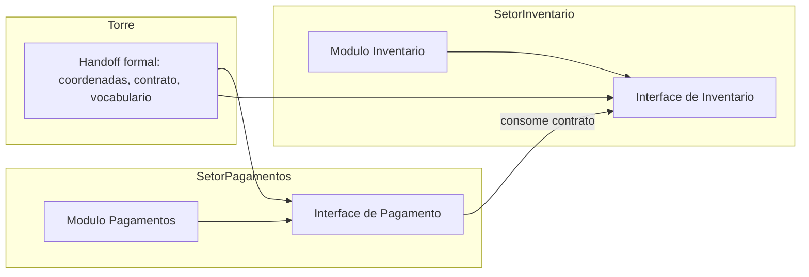

Como Comandante de Operações de Software, você nota o detalhe crucial: os setores não se falam diretamente. O módulo de pagamentos não importa o módulo de inventário — consome a interface dele. Dois agentes, um em cada setor, nunca colidem, porque não pisam no território um do outro [8].

## 4. Técnica

### Vocabulário Ubíguo em Código

O vocabulário ubíguo pode e deve ser verificado por máquina. O glossário abaixo vira uma lista de termos canônicos que um CI verifica nos diffs.

```json
{
  "glossario": {
    "cliente": "termo canonico (nao usar: usuario, consumidor, assinante)",
    "fatura": "termo canonico (nao usar: cobranca, boleto, conta)",
    "assinatura": "termo canonico (nao usar: plano, pacote, contrato)",
    "reembolso": "termo canonico (nao usar: estorno, devolucao, refund)"
  },
  "regras": [
    "todo identificador de dominio deve usar um termo do glossario",
    "sinonimos listados em parenteses sao proibidos em codigo e spec"
  ]
}
```

O validador do glossário escaneia o diff e falha se um sinônimo proibido aparece fora de comentário de glossário:

```python
import re
import sys
from pathlib import Path

GLOSSARIO = {
    "usuario": "cliente",
    "consumidor": "cliente",
    "cobranca": "fatura",
    "estorno": "reembolso",
    "refund": "reembolso",
}

RE_COMENTARIO = re.compile(r"^\s*#", re.MULTILINE)


def validar_vocabulario(caminho: str) -> int:
    texto = Path(caminho).read_text(encoding="utf-8")
    sem_comentarios = RE_COMENTARIO.sub("", texto)
    violacoes = []
    for sinonimo, canonico in GLOSSARIO.items():
        if re.search(rf"\b{sinonimo}\b", sem_comentarios, re.IGNORECASE):
            violacoes.append(f"'{sinonimo}' -> use '{canonico}'")
    if violacoes:
        print("VOCABULARIO UBIGUO VIOLADO:")
        for v in violacoes:
            print(f"  - {v}")
        return 1
    print("Vocabulario ubiquo respeitado")
    return 0


if __name__ == "__main__":
    sys.exit(validar_vocabulario(sys.argv[1] if len(sys.argv) > 1 else "codigo.py"))
```

### Deep Modules: Interface Primeiro

A definição da interface antes da implementação é um contrato de trabalho paralelo. O exemplo em TypeScript define a fronteira do módulo de pagamentos antes de qualquer implementação:

```typescript
// contrato/interface do Modulo Pagamentos
// consumidores programam contra ESTA interface (stub do lado consumidor)
export interface ProvedorPagamento {
  criarFatura(clienteId: string, valorCentavos: number): Promise<Fatura>;
  confirmarPagamento(faturaId: string, referenciaExterna: string): Promise<StatusPagamento>;
  estornar(faturaId: string, motivo: string): Promise<Reembolso>;
}

export interface Fatura {
  id: string;
  clienteId: string;
  valorCentavos: number;
  status: "pendente" | "paga" | "cancelada";
}

export interface Reembolso {
  id: string;
  faturaId: string;
  valorCentavos: number;
}

export type StatusPagamento = "confirmado" | "falhou" | "em_analise";
```

O produtor implementa contra a mesma interface, com testes que validam o contrato:

```typescript
import { ProvedorPagamento, Fatura } from "./interface";

export class ProvedorPagamentoEmMemoria implements ProvedorPagamento {
  private faturas = new Map<string, Fatura>();
  private sequencia = 0;

  async criarFatura(clienteId: string, valorCentavos: number): Promise<Fatura> {
    const fatura: Fatura = {
      id: `fat-${++this.sequencia}`,
      clienteId,
      valorCentavos,
      status: "pendente",
    };
    this.faturas.set(fatura.id, fatura);
    return fatura;
  }

  async confirmarPagamento(faturaId: string, referenciaExterna: string): Promise<StatusPagamento> {
    const fatura = this.faturas.get(faturaId);
    if (!fatura) throw new Error("fatura inexistente");
    if (fatura.status !== "pendente") return "falhou";
    fatura.status = "paga";
    return "confirmado";
  }

  async estornar(faturaId: string, motivo: string): Promise<Reembolso> {
    const fatura = this.faturas.get(faturaId);
    if (!fatura) throw new Error("fatura inexistente");
    fatura.status = "cancelada";
    return { id: `reb-${faturaId}`, faturaId, valorCentavos: fatura.valorCentavos };
  }
}
```

A chave do deep module está na relação: a interface tem 3 métodos (superfície pequena), a implementação gerencia estado e regras (profundidade). Um agente consumidor lê 20 linhas de interface; um agente produtor explora a implementação inteira. A fronteira protege ambos [9].

### ADR: Registro de Decisão de Arquitetura

O ADR é o artefato que impede o agente de "melhorar" uma decisão que ele não entende:

```markdown
# ADR-007: Faturas versionadas, não atualizadas in-place

## Contexto
Regulamentação exige trilha de auditoria de alterações em faturas. Atualizar
in-place destrói o histórico e confunde o agente de auditoria.

## Decisao
Toda alteracao cria uma nova versao da fatura (versionamento append-only).
A fatura corrente e a de maior versao.

## Consequencias
- Positivas: trilha completa, auditoria trivial, concorrencia segura.
- Negativas: armazenamento maior, leitura precisa filtrar por versao.

## Alternativas rejeitadas
- Atualizacao in-place: simples, mas sem trilha (rejeitada por regulamentacao).
- Event sourcing completo: poderoso, mas complexidade excessiva para o caso.
```

O ADR em formato estruturado permite que a esteira o valide e o apresente ao agente antes que ele toque no módulo [10].

### O Registro de Módulos como Fonte de Verdade

O mapa do domínio precisa de uma fonte de verdade única e consultável por máquina: o registro de módulos. Cada módulo declara sua interface, seus ADRs e seus contratos de handoff — e o CI valida que o código implementado respeita o registro.

```json
{
  "modulos": [
    {
      "id": "pagamentos",
      "responsabilidade": "criar faturas, confirmar pagamentos, estornar",
      "interface": "contrato/interface_pagamentos.ts",
      "adrs": ["ADR-007", "ADR-011"],
      "handoff_consome": ["cliente", "inventario"],
      "handoff_oferece": ["fatura", "reembolso"],
      "agentes_permitidos": ["agente-pagamentos", "agente-revisor"]
    },
    {
      "id": "inventario",
      "responsabilidade": "estoque, reserva e baixa de itens",
      "interface": "contrato/interface_inventario.ts",
      "adrs": ["ADR-003"],
      "handoff_consome": ["produto"],
      "handoff_oferece": ["estoque"],
      "agentes_permitidos": ["agente-inventario"]
    }
  ]
}
```

O registro é o mapa oficial: quem consome o quê, quem pode pisar onde, e quais decisões regem cada setor. Um agente que tenta acessar um módulo sem estar na lista de permitidos é bloqueado pelo harness — a fronteira em código, não em convenção [18].

### O Validador de Fronteiras no CI

A fronteira precisa ser fiscalizada. O validador abaixo impede que o código do módulo de pagamentos importe implementação interna do módulo de inventário — apenas a interface pública é permitida:

```python
import re
import sys
from pathlib import Path

RE_IMPORT = re.compile(r"^(?:from|import)\s+([\w\.]+)", re.MULTILINE)

FRONTEIRAS = {
    "modulo_pagamentos": {"permitidos": ["cliente", "inventario.interface"],
                           "proibidos": ["inventario.repositorio", "inventario.servico"]},
}


def validar_fronteiras(modulo: str, caminho: Path) -> int:
    texto = caminho.read_text(encoding="utf-8")
    importacoes = [m.group(1) for m in RE_IMPORT.finditer(texto)]
    regras = FRONTEIRAS[modulo]
    violacoes = [i for i in importacoes
                 if any(i.startswith(p) for p in regras["proibidos"])]
    if violacoes:
        print(f"FRONTEIRA VIOLADA em {caminho.name}:")
        for v in violacoes:
            print(f"  - import proibido: {v}")
        return 1
    print(f"Fronteiras do modulo {modulo} respeitadas")
    return 0


if __name__ == "__main__":
    sys.exit(validar_fronteiras("modulo_pagamentos",
                                Path("src/pagamentos/servico.py")))
```

O validador é o guardião do handoff: o setor vizinho só é alcançado pela porta certa (a interface), nunca pela porta dos fundos (a implementação) [19].

### O Handoff Entre Setores

A transferência de controle entre setores — o handoff — é o momento em que a cartografia paga o investimento. Quando o agente do setor de pagamentos precisa de dados do setor de inventário, ele não atravessa a fronteira: solicita via interface, com contrato explícito [14]. Esse protocolo de handoff é idêntico ao dos controladores de voo: coordenadas, altitude e intenção são passadas de forma padronizada, e o controlador receptor assume sem ambiguidade. No código, o handoff vira uma chamada de API documentada — nunca um acesso direto ao banco do vizinho [15].

### Fronteiras Como Célula de Contenção

Há uma razão estrutural para as fronteiras importarem mais no AI-first: elas são as células de contenção do contexto. Um agente que navega por um módulo sem fronteiras carrega o módulo inteiro no contexto — arquivos, históricos, decisões antigas. Com fronteiras, ele carrega a interface e os ADRs do setor: uma fração dos tokens com o dobro de sinal [16]. A cartografia do domínio é, portanto, também uma estratégia de lean context, como você verá em profundidade no Capítulo 9 — o mapa define quanto combustível cada navegador consome [17].

### O Glossário como Contrato de Contexto

O glossário ubíguo não é só uma lista — é um contrato de contexto que define o que os agentes veem e o que nunca devem ver. O formato abaixo vai além dos sinônimos: declara o escopo de cada termo e o contexto de uso permitido:

```yaml
glossario_estendido:
  cliente:
    sinonimos_proibidos: [usuario, consumidor, assinante]
    escopo: "entidade juridica ou pessoa que contrata servicos"
    uso_permitido: [spec, codigo, testes, docs]
    uso_proibido: [infra, deploy, metricas]
  fatura:
    sinonimos_proibidos: [cobranca, boleto, conta]
    escopo: "documento financeiro versionado (append-only)"
    uso_permitido: [spec, codigo, testes, relatorios]
    uso_proibido: [logs de infra]
```

O escopo por termo resolve o problema clássico do vocabulário ubíguo: a mesma palavra com significados diferentes em contextos diferentes. O agente sabe que "cliente" em contexto de infra não é permitido — e o CI do glossário fiscaliza [20].

### O Modelo de Migração de Monólito em Setores

A migração de um monólito para setores é o caso mais comum de aplicação da cartografia — e o mais arriscado. O modelo abaixo é o plano de migração incremental:

| Fase | Ação | Risco | Gate |
|------|------|-------|------|
| 1 | Mapear o monólito: responsabilidades, dependências, dados | Baixo | Mapa revisado |
| 2 | Extrair o setor de menor risco (cliente) com interface | Médio | Testes de contrato verdes |
| 3 | Migrar tráfego para o setor novo com canário | Médio | Sinais vitais saudáveis |
| 4 | Extrair os setores seguintes (pagamentos, inventário) | Alto | Cada um com gate próprio |
| 5 | Remover o acoplamento legado quando nenhum consumidor restar | Alto | Zero referências ao monólito |

O plano de migração é a cartografia em movimento: cada fase tem risco e gate, e a migração nunca anda mais rápido que a evidência [28].

### O Validador de ADRs em Código

Os ADRs podem ser validados por máquina — garantindo que toda decisão registrada tem contexto, consequências e alternativas. O validador abaixo confere a completude do ADR:

```python
import json
from pathlib import Path

CAMPOS_OBRIGATORIOS = ["id", "titulo", "contexto", "decisao",
                       "consequencias", "alternativas_rejeitadas"]


def validar_adr(caminho: Path) -> tuple:
    try:
        dados = json.loads(caminho.read_text(encoding="utf-8"))
    except ValueError as exc:
        return False, f"ADR invalido: {exc}"
    adr = dados["adrs"][0]
    faltantes = [c for c in CAMPOS_OBRIGATORIOS if c not in adr]
    if faltantes:
        return False, f"ADR sem campos: {', '.join(faltantes)}"
    if not adr["alternativas_rejeitadas"]:
        return False, "ADR sem alternativas rejeitadas"
    return True, f"ADR {adr['id']} completo e valido"


if __name__ == "__main__":
    ok, motivo = validar_adr(Path("adr_exemplo.json"))
    print(f"[{'OK' if ok else 'FALHA'}] {motivo}")
```

O validador de ADRs é o guardião da memória de decisão: o agente que encontra um ADR incompleto o devolve para revisão — nunca decide no lugar da decisão registrada [27].

### O Modelo de Módulos com Profundidade

O deep module é o padrão de design que maximiza a razão entre valor e superfície. O modelo abaixo avalia a profundidade de um módulo — a métrica que o Comandante usa para julgar se a fronteira está bem desenhada:

```python
def profundidade_modulo(metodos_interface: int, linhas_implementacao: int) -> float:
    """Quanto maior a razao, mais profundo o modulo (interface pequena, corpo rico)."""
    return round(linhas_implementacao / max(metodos_interface, 1), 1)


MODULOS = [
    ("pagamentos", 3, 1200),
    ("inventario", 2, 800),
    ("legado_espaguete", 40, 3000),
]

for nome, metodos, linhas in MODULOS:
    p = profundidade_modulo(metodos, linhas)
    avaliacao = "profundo (bom)" if p > 200 else ("mediano" if p > 80 else "raso (ruim)")
    print(f"{nome}: profundidade={p} -> {avaliacao}")
```

A métrica de profundidade é o radar da arquitetura: o módulo legado com 40 métodos na interface e corpo raso é o sinal clássico de fronteira ruim — o agente consumidor precisa ler quase tudo para entender quase nada [26].

### O Modelo de Teste de Contrato com Versionamento

O teste de contrato precisa saber com qual versão da interface está falando. O modelo abaixo associa cada contrato a um schema versionado e detecta incompatibilidades de versão antes do deploy:

```python
class RegistroDeContratos:
    def __init__(self):
        self.contratos = {}

    def publicar(self, servico, versao, schema):
        self.contratos.setdefault(servico, {})[versao] = schema

    def verificar(self, servico, versao_consumidor, versao_provedor):
        schema_consumidor = self.contratos.get(servico, {}).get(versao_consumidor)
        schema_provedor = self.contratos.get(servico, {}).get(versao_provedor)
        if schema_consumidor is None or schema_provedor is None:
            return {'compativel': False, 'motivo': 'versao inexistente'}
        faltantes = set(schema_consumidor.get('campos', [])) - set(schema_provedor.get('campos', []))
        return {'compativel': not faltantes, 'campos_faltantes': sorted(faltantes)}

registro = RegistroDeContratos()
registro.publicar('cobranca', 'v2', {'campos': ['id', 'valor', 'status', 'cupom']})
registro.publicar('cobranca', 'v1', {'campos': ['id', 'valor', 'status']})
print(registro.verificar('cobranca', 'v2', 'v1'))
```

A incompatibilidade detectada aqui — consumidor v2 pedindo o campo cupom que o provedor v1 não entrega — é exatamente o tipo de quebra que explode em produção com deploy descoordenado. O registro versionado transforma a compatibilidade em verificação mecânica: nenhuma versão nova de contrato entra sem o teste de compatibilidade contra todas as versões consumidas. É a diferença entre contrato implícito (quebra silenciosa) e contrato explícito (quebra bloqueada no CI).

### O Modelo de Interface como Contrato de Contexto

Vamos aplicar a cartografia em um caso concreto: o redesenho de um monólito de cobrança em setores. O monólito tem 40 mil linhas, um único deploy e um acoplamento total entre cliente, fatura e inventário. O redesenho segue a sequência da cartografia:

1. **Extraia o vocabulário ubíguo**: cliente, fatura, reembolso, produto — os termos canônicos que o negócio usa.
2. **Identifique as responsabilidades**: pagamentos (faturas, cobranças, estornos), inventário (estoque, reserva), cliente (cadastro, endereços).
3. **Desenhe as interfaces primeiro**: a interface de pagamento com 3 métodos; a de inventário com 2.
4. **Registre os ADRs**: fatura versionada (ADR-007), estoque com reserva (ADR-003).
5. **Defina os handoffs**: pagamentos consome cliente; checkout consome pagamentos e inventário.

O passo 3 é o mais importante — e o mais difícil culturalmente. A tentação é começar pela implementação; a disciplina é congelar a interface antes de qualquer linha de código. O agente do setor de pagamentos trabalha contra a interface; o agente do checkout também. A integração vira cerimônia, não negociação [24].

### O Modelo de Interface como Contrato de Contexto

A interface não é só um contrato de tipos — é um contrato de contexto. O modelo abaixo declara, para cada interface, o contexto que o agente consumidor precisa carregar:

```json
{
  "interfaces": [
    {
      "id": "interface_pagamentos",
      "metodos": ["criarFatura", "confirmarPagamento", "estornar"],
      "contexto_consumidor": {
        "tipos_necessarios": ["Fatura", "StatusPagamento", "Reembolso"],
        "adrs_obrigatorios": ["ADR-007"],
        "termos_glossario": ["fatura", "reembolso"]
      }
    }
  ]
}
```

O contrato de contexto responde à pergunta que o Capítulo 9 aprofundará: quanto combustível o agente consumidor gasta? A resposta é o mínimo declarado na interface — tipos, ADRs e termos — e nada além. A fronteira que protege o território também protege o contexto [25].

### O Modelo de Custo da Migração em Setores

Migrar um monólito em setores custa caro se feita às cegas. O modelo abaixo estima o esforço de extração de cada setor candidato, usando tamanho, número de dependências e acoplamento com o núcleo como preditores:

```python
def custo_extracao(linhas, dependencias, acoplamento_nucleo):
    esforco = 15 * (linhas / 1000)
    esforco += 4 * dependencias
    esforco += 20 * acoplamento_nucleo
    risco = acoplamento_nucleo * 10
    return {'esforco_dias': round(esforco, 1), 'risco': round(risco, 1),
            'prioridade': 'alta' if acoplamento_nucleo < 0.3 else 'baixa'}

print(custo_extracao(linhas=8000, dependencias=12, acoplamento_nucleo=0.8))
print(custo_extracao(linhas=8000, dependencias=12, acoplamento_nucleo=0.1))
```

A leitura contraintuitiva do modelo: o setor mais acoplado ao núcleo é o mais arriscado, mas também o mais valioso de extrair — é nele que as mudanças quebram tudo. A estratégia recomendada é começar pelos setores de baixo acoplamento (ganho rápido, pouco risco) e deixar os setores centrais para quando a esteira de testes de contrato já estiver provando a segurança das extrações.

### O Modelo de Observabilidade do Setor

O setor, depois de extraído, precisa de observabilidade própria — ou a operação fica cega. O modelo abaixo registra para cada setor seus endpoints, métricas e dono, e detecta setores órfãos:

```python
class ObservabilidadeDeSetores:
    def __init__(self):
        self.setores = {}

    def registrar(self, nome, endpoints, metricas, dono):
        self.setores[nome] = {'endpoints': endpoints, 'metricas': metricas, 'dono': dono, 'alertas': 0}

    def setores_orfaos(self):
        return [n for n, s in self.setores.items() if not s['dono'] or not s['metricas']]

    def registrar_alerta(self, nome):
        self.setores[nome]['alertas'] += 1

obs = ObservabilidadeDeSetores()
obs.registrar('pagamentos', ['/cobrar', '/estornar'], ['latencia', 'erros'], 'time-pag')
obs.registrar('relatorios', ['/relatorio'], [], '')
print(obs.setores_orfaos())
```

O setor de relatórios, sem métricas e sem dono, é órfão — e setor órfão é risco operacional: quando quebrar, ninguém saberá por que nem quem é responsável. A regra de extração é simples: um setor só é considerado extraído quando tem endpoints, métricas e dono registrados. Observabilidade não é luxo da fase de produção — é critério de conclusão da migração em setores.

### O Mapa de Dependências entre Módulos

O registro de módulos declara quem consome o quê; o mapa de dependências — o grafo de handoffs — é o que permite o despacho paralelo seguro. O grafo abaixo declara as arestas de consumo entre setores:

```yaml
dependencias:
  pagamentos:
    consome: [cliente, inventario.interface]
    e_consumido_por: [checkout, relatorios]
    proibido_consumir: [inventario.implementacao, cobranca_legada]
  inventario:
    consome: [produto]
    e_consumido_por: [checkout, pagamentos]
    proibido_consumir: [pagamentos.implementacao]
  checkout:
    consome: [pagamentos.interface, inventario.interface, cliente]
    e_consumido_por: [frontend]
    proibido_consumir: []
```

O mapa de dependências é o radar da cartografia: mostra onde os agentes podem colidir antes de colidirem. Dois agentes que consomem o mesmo módulo só editam o próprio setor — a aresta de consumo é unidirecional e declarada [22].

### O Monitor de Acoplamento como Gate de CI

A profundidade dos módulos se degrada aos poucos — um import aqui, uma dependência ali — e ninguém percebe até ser tarde demais. O monitor abaixo roda no CI e bloqueia o merge quando o acoplamento entre módulos ultrapassa o limiar:

```python
import re
from collections import defaultdict

class MonitorDeAcoplamento:
    def __init__(self, limite_imports=5):
        self.limite = limite_imports
        self.dependencias = defaultdict(set)

    def alimentar(self, modulo, imports):
        self.dependencias[modulo].update(imports)

    def verificar(self):
        violacoes = []
        for modulo, deps in self.dependencias.items():
            if len(deps) > self.limite:
                violacoes.append({'modulo': modulo, 'dependencias': sorted(deps), 'contagem': len(deps)})
        return {'aprovado': not violacoes, 'violacoes': violacoes}

monitor = MonitorDeAcoplamento(limite_imports=4)
monitor.alimentar('pagamentos', {'usuario', 'cobranca', 'notificacao', 'auditoria', 'relatorio', 'catalogo'})
print(monitor.verificar())
```

O número de dependências diretas é uma métrica grosseira, mas é a mais barata de coletar e a mais fácil de discutir em review: "este módulo depende de seis outros, cinco é o limite". Quando o monitor acusa, a conversa não é sobre a métrica — é sobre por que o módulo de pagamentos precisa conhecer o catálogo. Na maioria dos casos a resposta é um acoplamento acidental que a refatoração em setores elimina.

### O Teste de Contrato entre Módulos

As fronteiras não são apenas declaradas — são testadas. O teste de contrato entre módulos valida que o consumidor e o produtor falam a mesma língua:

```python
import unittest


class TesteContratoPagamentosInventario(unittest.TestCase):
    """Valida o handoff entre o setor de pagamentos e o de inventario."""

    def test_contrato_estoque_na_interface(self) -> None:
        """Pagamentos so acessa inventario via interface publica."""
        import modulo_pagamentos
        self.assertTrue(hasattr(modulo_pagamentos, "consultar_estoque"))

    def test_contrato_fatura_na_interface(self) -> None:
        """Checkout so acessa pagamentos via interface publica."""
        import modulo_checkout
        self.assertTrue(hasattr(modulo_checkout, "fatura_da_interface"))

    def test_sem_acesso_interno(self) -> None:
        """Nenhum modulo importa implementacao interna do vizinho."""
        import modulo_pagamentos
        self.assertFalse(hasattr(modulo_pagamentos, "_repositorio_interno"))


if __name__ == "__main__":
    unittest.main()
```

O teste de contrato é o handoff ensaiado: cada fronteira crítica tem um teste que prova que o protocolo funciona — e falha ruidosamente quando alguém tenta usar a porta dos fundos [23].

### O ADR como Contrato de Decisão

O ADR estruturado é consultável por máquina — e a esteira pode injetá-lo no contexto do agente antes de cada edição no módulo afetado:

```json
{
  "adrs": [
    {
      "id": "ADR-007",
      "data": "2026-05-12",
      "titulo": "Faturas versionadas, nao atualizadas in-place",
      "modulos_afetados": ["pagamentos"],
      "contexto": "regulamentacao exige trilha de auditoria de alteracoes",
      "decisao": "append-only com versao corrente = maior versao",
      "consequencias": {
        "positivas": ["trilha completa", "auditoria trivial", "concorrencia segura"],
        "negativas": ["armazenamento maior", "leitura filtra por versao"]
      },
      "alternativas_rejeitadas": [
        "atualizacao in-place (sem trilha)",
        "event sourcing completo (complexidade excessiva)"
      ]
    }
  ]
}
```

O ADR em formato estruturado transforma a memória de decisão em dado operacional: quando o agente toca em pagamentos, o harness injeta o ADR-007 no contexto — a decisão antiga vira contexto do presente [21].

### O Modelo de Fronteira com Política de Acesso

A fronteira entre módulos precisa de política de acesso — o que cada lado pode chamar. O modelo abaixo define e valida a política de acesso entre módulos:

```python
class PoliticaDeAcesso:
    def __init__(self):
        self.regras = {}

    def permitir(self, origem, destino, operacao):
        self.regras.setdefault(origem, []).append({'destino': destino, 'operacao': operacao})

    def verificar(self, origem, destino, operacao):
        permitidas = self.regras.get(origem, [])
        return any(p['destino'] == destino and p['operacao'] == operacao for p in permitidas)

p = PoliticaDeAcesso()
p.permitir('cobranca', 'usuario', 'ler')
print(p.verificar('cobranca', 'usuario', 'ler'))
print(p.verificar('cobranca', 'usuario', 'gravar'))
```

A política de acesso torna a fronteira explícita: cobrança pode ler do módulo de usuário, mas não gravar. A assimetria de leitura/gravação é o coração do deep module — cada módulo esconde sua escrita e expõe leituras controladas. Quando o teste de contrato da fronteira roda no CI com a política carregada, a violação é bloqueada na hora e a conversa sobre por que cobrança precisava gravar direto em usuário acontece antes do merge, não depois do incidente.

### A Métrica do Mapa

A cartografia também precisa de régua. Três métricas simples respondem se o mapa está funcionando: taxa de integração sem conflito (quanto menos cirurgia de merge, melhor o desenho de fronteiras), tokens por navegação (quanto menor o contexto de um agente para trabalhar no setor, melhor a divisão) e retrabalho por fronteira (quantas vezes o agente consumidor precisou voltar à interface porque ela não cobria o caso) [18]. Onde o mapa falha, a métrica mostra antes do incidente — o radar da arquitetura, não o boletim do acidente [19].

### O Ritual de Revisão de Fronteiras

As fronteiras entre módulos precisam de revisão periódica — o mapa que estava certo na migração pode ter degradado. O ritual é simples e fixo: a cada ciclo, o time revisa o mapa de dependências, roda o monitor de acoplamento e o teste de contrato, e responde três perguntas — o que deveria estar separado e está junto, o que deveria estar junto e está separado, qual fronteira ninguém entende mais. As respostas viram tickets de refatoração ou decisões registradas de manter como está. Fronteira sem revisão é fronteira que apodrece.

### Passos para Desenhar o Mapa

1. **Extraia o vocabulário ubíguo** da spec e do negócio — liste os termos canônicos e os proibidos.
2. **Identifique os setores** (módulos) e suas responsabilidades únicas.
3. **Escreva as interfaces primeiro** — em código, com tipos explícitos, antes de qualquer implementação.
4. **Registre cada decisão de arquitetura em ADR** — contexto, decisão, consequências, alternativas rejeitadas.
5. **Configure o CI do vocabulário** — o validador falha se um sinônimo proibido entra no diff.
6. **Divida o mapa em quadrantes** para que cada agente carregue só o contexto do seu setor [11].

## 5. Aplica

Cena real, em segunda pessoa. Sua equipe de plataforma está migrando um monólito para serviços. Você contrata dois agentes de IA para acelerar: o Agente A cuida do "módulo de clientes", o Agente B do "módulo de faturas". Sem cartografia, o resultado é previsível: o Agente A cria uma classe `Usuario` com método `getCobrancas()`; o Agente B cria `Cliente` com `getFaturas()`. Quando a integração chega, os dois módulos não conversam, o time gasta duas semanas costurando os contratos, e um dos agentes "refatora" o código do outro — porque cada um achou que o território era seu.

O erro não foi usar dois agentes. O erro foi despachá-los **sem mapa**. Faltaram os três instrumentos do capítulo: o vocabulário ubíguo (Cliente ou Usuario? Fatura ou Cobranca?), as interfaces primeiro (ninguém definiu o contrato entre os módulos), e os ADRs (a regra de fatura versionada existia só na cabeça do arquiteto).

O diagnóstico, ligado à teoria: fronteiras não declaradas são fronteiras disputadas. A correção prática:

1. **Congele 1 dia para a cartografia** antes de soltar os agentes: glossário, interfaces, ADRs.
2. **Compartilhe o mapa com os dois agentes** como parte do contexto inicial (custa tokens uma vez; economiza retrabalho sempre).
3. **Configure o CI de vocabulário** — o Agente A que escrever `Usuario` em vez de `Cliente` tem o diff reprovado automaticamente.
4. **Programe o handoff**: quando o módulo A precisar do B, o contrato é a interface, nunca o código interno.

Armadilhas comuns: desenhar o mapa inteiro antes de começar (mapa demais também é desperdício — desenhe só os setores que serão tocados na iteração); interfaces inchadas (toda feature nova vira método na interface — resistir; interface pequena é contrato, interface grande é acoplamento); e ADRs que ninguém lê (o ADR só funciona se a esteira o injeta no contexto do agente antes da edição) [12].

## 6. Conclusão

Você desenhou o mapa do domínio. Três marcos: primeiro, o vocabulário ubíguo como linguagem canônica verificável por máquina — o CI reprova sinônimo fora do glossário; segundo, as interfaces primeiro como fronteiras de trabalho paralelo — deep modules que protegem consumidores e produtores; terceiro, os ADRs como memória das decisões — o antídoto contra o agente que "melhora" o que não entende.

Como desafio, desenhe a cartografia de um módulo legado seu: glossário, interfaces existentes (mesmo implícitas) e um ADR para a decisão mais estranha que você encontrar.

No próximo capítulo, você liga os motores: harness, skills, MCPs e worktrees — o ecossistema de execução que coloca o mapa em movimento [13].

## 7. Referências Bibliográficas

[1] JIN, Haolin et al. *From LLMs to LLM-based Agents for Software Engineering: A Survey of Current, Challenges and Future.* 2025. Disponível em: https://arxiv.org/abs/2408.02479. Acesso em: 02 ago. 2026.
[2] EVANS, Eric. *Domain-Driven Design: Tackling Complexity in the Heart of Software.* Boston: Addison-Wesley, 2003. Disponível em: https://www.informit.com. Acesso em: 02 ago. 2026.
[3] OUSTERHOUT, John. *A Philosophy of Software Design.* 2. ed. Stanford: Yaknyam Press, 2021. Disponível em: https://web.stanford.edu/~ouster/cgi-bin/book.php. Acesso em: 02 ago. 2026.
[4] NYGARD, Michael. *Documenting Software Architectures: Views and Beyond.* 2. ed. Boston: Addison-Wesley, 2010. Disponível em: https://www.sei.cmu.edu. Acesso em: 02 ago. 2026.
[5] ANTHROPIC. *Building effective agents.* Disponível em: https://www.anthropic.com/research/building-effective-agents. Acesso em: 02 ago. 2026.
[6] LEHMANN, Fabian et al. *Software Engineering in the Era of LLMs.* 2024. Disponível em: https://arxiv.org/abs/2403.09752. Acesso em: 02 ago. 2026.
[7] GRÖPLER, Robin et al. *The Future of Generative AI in Software Engineering: A Vision from Industry and Academia in the European GENIUS Project.* IEEE/ACM AIware, 2025. Disponível em: https://arxiv.org/abs/2511.01348. Acesso em: 02 ago. 2026.
[8] MOHAGHEGHI, Milad et al. *Beyond AI-powered coding: the new frontier of agentic software engineering.* 2025. Disponível em: https://arxiv.org/abs/2509.14838. Acesso em: 02 ago. 2026.
[9] YANG, John et al. *SWE-agent: Agent-Computer Interfaces Enable Automated Software Engineering.* NeurIPS 2024. Disponível em: https://arxiv.org/abs/2405.15793. Acesso em: 02 ago. 2026.
[10] HODA, Rashina. *Toward Agentic Software Engineering Beyond Code: Framing Vision, Values, and Vocabulary.* ICSE 2026 Workshop. Disponível em: https://arxiv.org/abs/2510.19692. Acesso em: 02 ago. 2026.
[11] ROYCHOUDHURY, Abhik et al. *Agentic Software Engineering: state and perspectives.* 2025. Disponível em: https://arxiv.org/abs/2509.09893. Acesso em: 02 ago. 2026.
[12] GURGUL, Vincent; GUBELA, Robin; LESSMANN, Stefan. *The State of Generative AI in Software Development: Insights from Literature and a Developer Survey.* 2026. Disponível em: https://arxiv.org/abs/2603.16975. Acesso em: 02 ago. 2026.
[13] MICROSOFT. *An AI led SDLC: Building an End-to-End Agentic Software Development Lifecycle with Azure and GitHub.* Microsoft Tech Community, 2026. Disponível em: https://techcommunity.microsoft.com/blog/appsonazureblog/an-ai-led-sdlc-building-an-end-to-end-agentic-software-development-lifecycle-wit/4491896. Acesso em: 02 ago. 2026.
[14] ROYCHOUDHURY, Abhik et al. *Agentic Software Engineering: state and perspectives.* 2025. Disponível em: https://arxiv.org/abs/2509.09893. Acesso em: 02 ago. 2026.
[15] CLARKE, Peter et al. *Model Context Protocol: overview e adoção.* 2025. Disponível em: https://arxiv.org/abs/2504.11423. Acesso em: 02 ago. 2026.
[16] GRÖPLER, Robin et al. *The Future of Generative AI in Software Engineering: A Vision from Industry and Academia in the European GENIUS Project.* IEEE/ACM AIware, 2025. Disponível em: https://arxiv.org/abs/2511.01348. Acesso em: 02 ago. 2026.
[17] WANG, Yuchen; GUO, Shangxin; TAN, Chee Wei. *From Code Generation to Software Testing: AI Copilot with Context-Based RAG.* 2025. Disponível em: https://arxiv.org/abs/2504.01866. Acesso em: 02 ago. 2026.
[18] FORSGREN, Nicole; HUMBLE, Jez; KIM, Gene. *Accelerate: The Science of Lean Software and DevOps.* Portland: IT Revolution Press, 2018. Disponível em: https://itrevolution.com. Acesso em: 02 ago. 2026.
[19] HODA, Rashina. *Toward Agentic Software Engineering Beyond Code: Framing Vision, Values, and Vocabulary.* ICSE 2026 Workshop. Disponível em: https://arxiv.org/abs/2510.19692. Acesso em: 02 ago. 2026.
[20] JIN, Haolin et al. *From LLMs to LLM-based Agents for Software Engineering: A Survey of Current, Challenges and Future.* 2025. Disponível em: https://arxiv.org/abs/2408.02479. Acesso em: 02 ago. 2026.
[21] NYGARD, Michael. *Documenting Software Architectures: Views and Beyond.* 2. ed. Boston: Addison-Wesley, 2010. Disponível em: https://www.sei.cmu.edu. Acesso em: 02 ago. 2026.
[22] OUSTERHOUT, John. *A Philosophy of Software Design.* 2. ed. Stanford: Yaknyam Press, 2021. Disponível em: https://web.stanford.edu/~ouster/cgi-bin/book.php. Acesso em: 02 ago. 2026.
[23] CHACON, Scott; STRAUB, Ben. *Pro Git.* 2. ed. Nova York: Apress, 2014. Disponível em: https://git-scm.com/book. Acesso em: 02 ago. 2026.
[24] EVANS, Eric. *Domain-Driven Design: Tackling Complexity in the Heart of Software.* Boston: Addison-Wesley, 2003. Disponível em: https://www.informit.com. Acesso em: 02 ago. 2026.
[25] WANG, Yuchen; GUO, Shangxin; TAN, Chee Wei. *From Code Generation to Software Testing: AI Copilot with Context-Based RAG.* 2025. Disponível em: https://arxiv.org/abs/2504.01866. Acesso em: 02 ago. 2026.
[26] OUSTERHOUT, John. *A Philosophy of Software Design.* 2. ed. Stanford: Yaknyam Press, 2021. Disponível em: https://web.stanford.edu/~ouster/cgi-bin/book.php. Acesso em: 02 ago. 2026.
[27] NYGARD, Michael. *Documenting Software Architectures: Views and Beyond.* 2. ed. Boston: Addison-Wesley, 2010. Disponível em: https://www.sei.cmu.edu. Acesso em: 02 ago. 2026.
[28] JIN, Haolin et al. *From LLMs to LLM-based Agents for Software Engineering: A Survey of Current, Challenges and Future.* 2025. Disponível em: https://arxiv.org/abs/2408.02479. Acesso em: 02 ago. 2026.


# Parte III — Execução Agêntica — Build e Verificação

# Capítulo 5: Os Motores: Harness, Skills, MCPs e Worktrees

## 1. Introdução

No Capítulo 4, você desenhou a cartografia do domínio: vocabulário ubíguo, interfaces primeiro e ADRs — o mapa que orienta os agentes. Agora chegou a hora de conhecer os motores que colocam o mapa em movimento: o harness agêntico que orquestra, as skills que especializam, os MCPs que conectam ferramentas e as worktrees que isolam territórios de trabalho.

Este capítulo é o mais operacional da Parte III. Você vai aprender a arquitetura harness → LLM → ferramentas, entender como skills empacotam procedimentos reutilizáveis, como MCPs exponibilizam ferramentas via protocolo padrão, e como worktrees permitem despacho paralelo seguro de agentes. Você vai sair com um laboratório de motores configurável — e o hábito de test-first como régua do build.

## 2. Explica

Um harness agêntico é o ambiente de execução que dá ao LLM a capacidade de **agir**, não apenas de responder. A distinção é estrutural: um chat responde; um harness executa um loop — o modelo propõe uma ação, a ferramenta executa, o resultado volta para o modelo, que propõe a próxima ação. É esse loop de execução com feedback que transforma um LLM em um agente [1].

O framework conceitual é sempre o mesmo: harness → LLM → ferramentas. O harness é o processo que gerencia o loop (bash, edição de arquivos, testes, navegação). O LLM é o cérebro que decide as ações dentro do loop. E as ferramentas são os músculos — comandos, scripts, APIs — que o LLM aciona. A pesquisa da Anthropic demonstrou que a qualidade do scaffolding do harness (as ferramentas e sua interface) tem impacto tão grande quanto o modelo na resolução de problemas reais [2].

As skills são o próximo nível: procedimentos empacotados que especializam o agente. Uma skill é um conjunto de instruções reutilizáveis — um fluxo de trabalho, regras de domínio, templates — que o agente carrega quando o contexto exige. No SDLC AI-first, as skills são os operários especializados: a skill de redação, a skill de revisão, a skill de testes. Elas codificam o conhecimento que uma equipe humana levaria anos para acumular [3].

Os MCPs (Model Context Protocol) resolvem um problema de conectividade: como o agente acessa os sistemas de dados e ferramentas da organização. Antes do MCP, cada integração era um adaptador customizado. Com o MCP, um protocolo padrão conecta o harness a qualquer fonte — repositório, banco de dados, sistema de tickets — com autenticação e contexto seguros [4]. Para o ciclo de vida, o MCP é o sistema de radar da torre: conecta o agente aos dados de que ele precisa sem arrastar o mundo inteiro para o contexto.

As worktrees de git são o instrumento de isolamento. Cada agente — ou cada lote de agentes — trabalha em uma cópia isolada do repositório (uma worktree), e os resultados são integrados por merge controlado. Isso elimina a classe inteira de conflitos de edição concorrente que derrubam equipes agênticas [5]. Worktree não é conveniência; é a célula de contenção do build paralelo.

O test-first completa o quadro operacional. A régua do build é: escrever o teste vermelho antes do código que o faz passar. No contexto agêntico, o teste é o contrato de conclusão: o agente termina quando a suíte passa, não quando ele acha que está pronto. A verificação deixa de ser opinião e vira execução — um diffs cujo critério de pronto é mensurável [6].

A combinação dos quatro instrumentos é o que separa o laboratório do caos: harness gerencia o loop, skills especializam o comportamento, MCPs conectam os dados e worktrees isolam a execução. Cada um resolve uma classe específica de falha, e juntos definem o ambiente onde o SDLC AI-first opera de verdade [7].

## 3. Ilustra

A torre de controle moderna não é só um prédio com radar — é uma arquitetura de sistemas. O radar (MCP) conecta a torre aos dados de voo. Os procedimentos operacionais padrão (skills) dizem ao controlador exatamente o que fazer em cada situação. As cabines de controle (worktrees) isolam cada controlador em seu setor, com suas telas e seus dados — ninguém edita a tela do vizinho. E a torre em si (harness) orquestra tudo, rodando o loop de observar-decidir-agir continuamente.

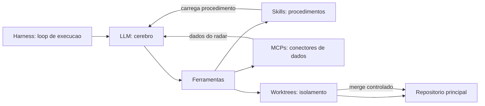

Como Comandante de Operações de Software, você percebe o padrão: cada motor responde a uma pergunta operacional. O harness responde "como o agente age?". As skills respondem "o que o agente sabe fazer?". Os MCPs respondem "a que o agente tem acesso?". As worktrees respondem "onde o agente pode pisar?" [8].

## 4. Técnica

### O Loop do Harness em Código

O coração do harness é o loop agêntico. A implementação abaixo — deliberadamente minimalista — mostra a anatomia: o modelo propõe, a ferramenta executa, o resultado volta.

```python
from dataclasses import dataclass, field
from typing import Callable, Dict, List


@dataclass
class Tool:
    nome: str
    funcao: Callable[[str], str]
    descricao: str = ""


class HarnessSimples:
    def __init__(self, ferramentas: List[Tool]) -> None:
        self.ferramentas: Dict[str, Tool] = {t.nome: t for t in ferramentas}
        self.historico: List[str] = field(default_factory=list)

    def agir(self, acao: str, argumento: str) -> str:
        if acao not in self.ferramentas:
            return f"ERRO: ferramenta '{acao}' inexistente"
        self.historico.append(f"{acao}({argumento})")
        return self.ferramentas[acao].funcao(argumento)

    def loop(self, modelo_acao) -> List[str]:
        """Simula o loop: modelo -> ferramenta -> feedback -> proxima acao."""
        resultado = ""
        passos = 0
        while passos < 10:
            acao, argumento = modelo_acao(resultado)
            if acao == "FIM":
                break
            resultado = self.agir(acao, argumento)
            passos += 1
        return self.historico


def ler_arquivo(caminho: str) -> str:
    try:
        with open(caminho, encoding="utf-8") as f:
            return f.read()[:200]
    except OSError as exc:
        return f"ERRO: {exc}"


def escrever_arquivo(conteudo: str) -> str:
    return f"OK: {len(conteudo)} caracteres em buffer (nao gravado neste exemplo)"


harness = HarnessSimples([
    Tool("ler", ler_arquivo, "le um arquivo"),
    Tool("escrever", escrever_arquivo, "escreve conteudo"),
])

# Simulacao de um "modelo" burro mas funcional
def modelo_exemplo(ultimo_resultado: str):
    if "erro" in ultimo_resultado.lower():
        return "FIM", ""
    return "ler", "README.md"


print(harness.loop(modelo_exemplo))
```

A moral do trecho: o harness não é mágica — é um loop disciplinado de ação e feedback. É essa estrutura que permite ao agente tentar, falhar e corrigir dentro de um ambiente controlado [9].

### Configuração de Ferramentas com MCP

O MCP padroniza a conexão com dados. A configuração abaixo, no formato `.mcp.json`, registra servidores MCP de arquivos e banco de dados:

```json
{
  "mcpServers": {
    "filesystem": {
      "command": "npx",
      "args": [
        "-y",
        "@modelcontextprotocol/server-filesystem",
        "/projeto/codigo",
        "/projeto/specs"
      ]
    },
    "sqlite": {
      "command": "npx",
      "args": ["-y", "mcp-server-sqlite", "/projeto/data/estado.db"]
    }
  }
}
```

A vantagem prática para o ciclo de vida: o agente consulta o banco de estado da esteira (fase atual, artefatos produzidos) via MCP, sem que o orquestrador carregue tudo no contexto. O protocolo faz a entrega sob demanda — a essência do lean context [10].

### Skills como Procedimentos Empacotados

Uma skill é um arquivo de instruções que o agente carrega sob demanda. O esqueleto abaixo mostra a anatomia:

```markdown
# Skill: revisor-espec

## Quando usar
Quando um artefato de spec for produzido na Fase 2 do ciclo.

## Procedimento
1. Leia a spec e extraia os requisitos R1..Rn.
2. Para cada requisito, verifique se existe criterio de aceite testavel.
3. Se algum requisito nao tiver criterio, reprove com a lista de falhas.
4. Se todos tiverem, aprove e registre o parecer com evidencia.

## Regras
- Nunca reescreva a spec; apenas aprove ou reprove com lista objetiva.
- Evidencia antes de afirmacao: cite a linha do criterio em cada parecer.
```

O valor da skill está na reutilização: o mesmo procedimento roda em todas as specs, com a mesma régua — eliminando a variação entre revisores [11].

### Worktrees em Ação

O isolamento de território por worktree é trivial no git, mas muda o jogo agêntico:

```bash
# criar worktree isolada para o agente A (modulo de pagamentos)
git worktree add ../wt-pagamentos -b feature/pagamentos main

# criar worktree isolada para o agente B (modulo de inventario)
git worktree add ../wt-inventario -b feature/inventario main

# ao concluir, cada agente abre um PR; o merge e controlado na raiz
git worktree list
```

Cada worktree é um repositório completo com branch própria. Dois agentes nunca editam o mesmo arquivo físico. E o merge — autorizado pelo controlador humano — é o ponto único de integração [5].

### O Manifesto de Skills do Time

Skills precisam de descoberta: o agente precisa saber qual skill carregar em cada fase. O manifesto abaixo declara o catálogo de skills — quando usar, qual fase serve e qual artefato produz.

```json
{
  "skills": [
    {
      "nome": "revisor-espec",
      "fase": "spec",
      "disparo": "artefato spec_executavel produzido",
      "artefato_saida": "parecer_espec.md"
    },
    {
      "nome": "estrategista-pilares",
      "fase": "design",
      "disparo": "capitulo de design iniciado",
      "artefato_saida": "pilares.json"
    },
    {
      "nome": "redator-eita",
      "fase": "build",
      "disparo": "pilares aprovados",
      "artefato_saida": "capitulo.md"
    },
    {
      "nome": "verificador-adversarial",
      "fase": "verificar",
      "disparo": "diff do build",
      "artefato_saida": "parecer_verificacao.md"
    }
  ],
  "regra": "uma skill por fase; o orquestrador consulta o manifesto antes de delegar"
}
```

O manifesto é o catálogo de procedimentos da torre: quando o controlador precisa de um procedimento, consulta o catálogo — nunca improvisa [19].

### O Modelo de Sequenciamento de Skills

As skills não agem isoladas — elas se encadeiam em um fluxo. O modelo de sequenciamento declara a ordem e as dependências entre skills de uma fase:

| Skill | Fase | Depende de | Alimenta |
|-------|------|------------|----------|
| Estrategista | Design | Cartografia | Redator |
| Redator | Build | Estrategista | Verificador |
| Verificador | Verificar | Redator | Revisor |
| Revisor | Verificar | Verificador | Compilador |

O sequenciamento evita o erro clássico do despacho: a skill que roda antes de sua entrada existir. A esteira consulta o sequenciamento antes de cada ativação — a skill só carrega quando o que ela precisa está pronto [27].

### O Modelo de Avaliação de Ferramentas por Critério Ponderado

O laboratório precisa comparar ferramentas de forma justa — e a comparação exige critérios ponderados, não impressão. O modelo abaixo pontua cada ferramenta em cinco dimensões e devolve o ranking:

```python
CRITERIOS = {
    'qualidade_saida': 0.3,
    'custo_contexto': 0.25,
    'confiabilidade': 0.2,
    'facilidade_uso': 0.15,
    'comunidade': 0.1,
}

def rankear_ferramentas(ferramentas):
    resultado = []
    for nome, notas in ferramentas.items():
        score = sum(notas[c] * CRITERIOS[c] for c in CRITERIOS)
        resultado.append({'ferramenta': nome, 'score': round(score, 2)})
    return sorted(resultado, key=lambda x: x['score'], reverse=True)

ferramentas = {
    'harness-alpha': {'qualidade_saida': 4, 'custo_contexto': 3, 'confiabilidade': 4, 'facilidade_uso': 3, 'comunidade': 2},
    'harness-beta': {'qualidade_saida': 3, 'custo_contexto': 4, 'confiabilidade': 3, 'facilidade_uso': 4, 'comunidade': 4},
}
print(rankear_ferramentas(ferramentas))
```

O ranking por score substitui o debate de opinião pela tabela: se o harness-alpha ganha por pouco em qualidade de saída, mas consome muito contexto e tem comunidade pequena, o harness-beta pode ser a escolha de longo prazo. Os pesos são calibrados pela própria organização — uma equipe pequena valoriza facilidade de uso mais que comunidade. O ranking é um ponto de partida para conversa, não um veredito automático, mas obriga a conversa a ser sobre os números.

### O Estudo de Caso: Montando o Laboratório de Motores

A escolha do harness é uma decisão de arquitetura — e o Comandante a faz com critérios explícitos. O modelo abaixo é a matriz de avaliação que compara opções antes de investir:

| Critério | Peso | O que avalia |
|----------|------|--------------|
| Loop de execução | 30% | Ferramentas persistentes, feedback ao modelo, retry |
| Conectividade MCP | 25% | Facilidade de registrar servidores de dados |
| Skills | 20% | Suporte a procedimentos empacotados sob demanda |
| Worktrees | 15% | Isolamento nativo de território de execução |
| Custo/contexto | 10% | Eficiência de tokens por operação |

A matriz vira score — e o score vira decisão:

```python
def avaliar_harness(criterios: dict) -> dict:
    pesos = {"loop": 0.30, "mcp": 0.25, "skills": 0.20,
             "worktrees": 0.15, "custo": 0.10}
    total = sum(criterios.get(k, 0) * pesos[k] for k in pesos)
    return {"score": round(total, 2), "veredito": "adotar" if total >= 0.7 else "avaliar mais"}


HARNESS_A = avaliar_harness({"loop": 0.9, "mcp": 0.8, "skills": 0.9,
                             "worktrees": 0.7, "custo": 0.6})
HARNESS_B = avaliar_harness({"loop": 0.6, "mcp": 0.5, "skills": 0.4,
                             "worktrees": 0.3, "custo": 0.8})
print(f"Harness A: {HARNESS_A}")
print(f"Harness B: {HARNESS_B}")
```

A avaliação por critérios evita o erro clássico de escolher harness por moda ou por preço — o loop de execução pesa três vezes mais que o custo, porque é o coração do agente [26].

### O Benchmark de Motores como Rotina Contínua

O laboratório de motores não se monta uma vez — ele precisa de benchmark contínuo porque os motores mudam, os prompts mudam e o desempenho degrada. O script abaixo roda um conjunto fixo de tarefas contra cada motor e gera um placar comparativo:

```python
import json

TAREFAS_BENCHMARK = [
    {'id': 'T1', 'tipo': 'refatoracao', 'criticidade': 'media'},
    {'id': 'T2', 'tipo': 'testes', 'criticidade': 'alta'},
    {'id': 'T3', 'tipo': 'documentacao', 'criticidade': 'baixa'},
    {'id': 'T4', 'tipo': 'debug', 'criticidade': 'alta'},
]

def rodar_benchmark(motor, resultados):
    placar = {t['id']: resultados.get(motor, {}).get(t['id']) for t in TAREFAS_BENCHMARK}
    taxa = sum(1 for v in placar.values() if v == 'ok') / len(placar)
    return {'motor': motor, 'taxa_sucesso': taxa, 'por_tarefa': placar}

print(rodar_benchmark('motor-alpha', {'motor-alpha': {'T1': 'ok', 'T2': 'ok', 'T3': 'falha', 'T4': 'ok'}}))
```

O placar vira dado de governança: quando um motor novo entra no laboratório, ele é avaliado contra o mesmo benchmark — nada de comparar maçãs com laranjas. E quando a taxa de sucesso de um motor cai abaixo do limiar, o protocolo dispara: ou o prompt do contrato precisa de atualização, ou o motor saiu do padrão. O benchmark também protege contra a síndrome do novo brinquedo: a organização troca de motor por evidência, não por hype.

### O Protocolo de Registro de MCPs

Vamos montar o laboratório de motores do zero, em sequência operacional. O cenário: uma equipe de 5 engenheiros que quer começar o SDLC AI-first sem quebrar o que já funciona.

1. **Semana 1 — Harness**: escolher o harness, configurar o loop de execução (bash, edição, testes) e o MCP de filesystem com escopo de leitura.
2. **Semana 2 — Test-first**: adotar o teste vermelho antes do código em um fluxo piloto — a régua do build.
3. **Semana 3 — Worktrees**: configurar worktree por agente e o merge controlado.
4. **Semana 4 — Skill piloto**: empacotar o procedimento de revisão de spec como skill e registrar no manifesto.
5. **Semana 5 — Radar**: adicionar o revisor adversarial independente nos PRs dos agentes.

A sequência é deliberada: cada semana constrói sobre a anterior, e nenhum passo exige derrubar o processo existente. O laboratório nasce paralelo à operação — e a operação adota os motores quando eles provam valor [25].

### O Protocolo de Registro de MCPs

O acesso a dados via MCP precisa de protocolo — quem pode conectar a qual fonte, com qual escopo. O registro abaixo é o contrato de conectividade do ecossistema:

```yaml
mcp_registro:
  filesystem:
    escopo_leitura: [specs, contratos, dossie]
    escopo_escrita: []
    agentes_permitidos: [analista, arquiteto]
  banco_estado:
    escopo_leitura: [fase, artefatos, metricas]
    escopo_escrita: [transicao_fase]
    agentes_permitidos: [orquestrador]
  repositorio:
    escopo_leitura: [codigo, testes]
    escopo_escrita: [worktree_do_agente]
    agentes_permitidos: [agente-build, agente-revisor]
```

O registro de MCPs é o mapa de acesso da torre: cada ferramenta tem escopo de leitura e escrita declarado — e o agente que tenta ler além do escopo é bloqueado pelo harness. A conectividade vira governança, não burocracia [23].

### O Modelo de Decisão de Aquisição de Ferramentas

O laboratório acumula ferramentas com facilidade — e cada uma cobra manutenção em contexto e configuração. O modelo abaixo é o gate de aquisição: antes de instalar uma nova ferramenta, a equipe responde a cinco perguntas e o modelo devolve o veredito:

```python
def avaliar_ferramenta(nome, resolve_problema, substitutos, custo_contexto, curva_aprendizado):
    pontos = 0
    if resolve_problema:
        pontos += 3
    if not substitutos:
        pontos += 2
    if custo_contexto == 'baixo':
        pontos += 1
    if curva_aprendizado == 'curta':
        pontos += 1
    veredito = 'adquirir' if pontos >= 4 else 'avaliar' if pontos >= 2 else 'recusar'
    return {'ferramenta': nome, 'pontos': pontos, 'veredito': veredito}

print(avaliar_ferramenta('linter-ai', resolve_problema=True, substitutos=['ruff'], custo_contexto='alto', curva_aprendizado='longa'))
```

O modelo é um antídoto para o acúmulo: ferramenta que resolve problema real, sem substituto, com custo de contexto baixo e curva curta entra direto; ferramenta redundante ou pesada fica de fora. A regra não é proibitiva — é seletiva. O laboratório deve ter poucas ferramentas excelentes, não muitas ferramentas medíocres, porque cada ferramenta instalada cobra aluguel em todo prompt futuro.

### O Playbook de Diagnóstico de Motores

Quando o ecossistema falha, o Comandante diagnostica com método — não com tentativa e erro. O playbook abaixo é o roteiro de diagnóstico:

1. **Harness não executa?** Verifique o loop: ferramenta existe? Retorno chega ao modelo? Timeout?
2. **Skill não carrega?** Verifique o manifesto: o disparo bate com a fase? O arquivo existe?
3. **MCP não conecta?** Verifique o registro: escopo permite? Servidor está de pé? Autenticação?
4. **Merge conflita?** Verifique as worktrees: os agentes editaram o mesmo arquivo físico?
5. **Sessão estoura?** Verifique o orçamento: fase gastou além da alocação?

O playbook é o checklist do mecânico: cada sintoma mapeia uma causa provável e uma ação — o tempo de diagnóstico cai de horas para minutos [24].

### O Modelo de Inventário de Skills com Custos

O ecossistema de skills cresce sem controle se ninguém mede. O modelo abaixo mantém o inventário de skills com custo de ativação e frequência de uso — o que expõe as skills que ninguém usa:

```python
class InventarioDeSkills:
    def __init__(self):
        self.skills = {}

    def registrar(self, nome, custo_ativacao, categoria):
        self.skills[nome] = {'custo_ativacao': custo_ativacao, 'categoria': categoria, 'usos': 0}

    def usar(self, nome):
        if nome in self.skills:
            self.skills[nome]['usos'] += 1

    def custo_total(self):
        return sum(s['custo_ativacao'] * s['usos'] for s in self.skills.values())

    def obsoletas(self, limiar_usos=1):
        return {n: s for n, s in self.skills.items() if s['usos'] <= limiar_usos}

inv = InventarioDeSkills()
inv.registrar('redigir-spec', 200, 'documentacao')
inv.registrar('auditor-legado', 1500, 'analise')
inv.usar('redigir-spec')
print(inv.obsoletas())
print(inv.custo_total())
```

A skill de auditoria legado com custo de ativação de 1500 tokens e zero usos é um desperdício vivo: cada prompt que a carrega sem usá-la é custo puro. O inventário responde duas perguntas: quanto o ecossistema custa por sessão (custo_total) e quais skills merecem revisão ou aposentadoria (obsoletas). O ecossistema enxuto não é sobre quantidade — é sobre relação custo-uso de cada skill registrada.

### O Registro de Ativação de Skills

O manifesto declara o catálogo; o registro de ativação mede o uso. Cada carregamento de skill gera um evento — e o agregado desses eventos alimenta a governança do ecossistema:

```json
{
  "ativacoes": [
    {
      "timestamp": "2026-08-02T10:12:00Z",
      "skill": "revisor-espec",
      "fase": "spec",
      "artefato": "spec_autenticacao.json",
      "resultado": "aprovado",
      "tokens_gastos": 4200
    },
    {
      "timestamp": "2026-08-02T11:47:00Z",
      "skill": "revisor-espec",
      "fase": "spec",
      "artefato": "spec_pagamentos.json",
      "resultado": "reprovado",
      "tokens_gastos": 5100
    }
  ]
}
```

O registro responde perguntas que o manifesto não responde: qual skill é usada de verdade, qual falha com frequência, quanto custa cada ativação. É o contador de combustível da torre — a skill que custa caro e não entrega é candidata a revisão [21].

### O Test-First Como Régua do Harness

O harness só está configurado de verdade quando o test-first é a régua: o agente abre o build pelo teste vermelho. O fluxo operacional é inegociável:

1. **Escreva o teste** que define o comportamento esperado (vermelho).
2. **Rode o teste** e registre a saída — a evidência do vermelho.
3. **Delegue a implementação** ao agente, com o teste como contrato.
4. **Rode de novo** — o verde é a prova de conclusão.
5. **Registre o par** (teste, saída) como evidência do merge.

O trecho abaixo é o esqueleto do contrato test-first que o harness valida antes de aceitar um build como concluído:

```python
import subprocess
from pathlib import Path


def rodar_teste_com_contrato(teste: str, raiz: Path) -> dict:
    resultado = subprocess.run(
        ["python", "-m", "pytest", teste, "--quiet"],
        capture_output=True, text=True, cwd=str(raiz))
    return {
        "teste": teste,
        "exit_code": resultado.returncode,
        "saida": (resultado.stdout or resultado.stderr)[:200],
        "verde": resultado.returncode == 0,
    }


contrato = rodar_teste_com_contrato("testes/test_login.py", Path("."))
print(f"Teste {contrato['teste']}: {'VERDE' if contrato['verde'] else 'VERMELHO'}")
print(f"Saida: {contrato['saida']}")
```

O contrato é simples, mas muda o jogo: o agente não decide quando terminou — o teste decide [22].

### O Ciclo de Vida de uma Skill

Skills não são eternas — nascem, são usadas, são criticadas e evoluem (você verá esse ciclo no Capítulo 8). O ciclo de vida técnico segue o mesmo padrão do SDLC que as skills governam:

| Estágio | Ação | Evidência |
|---------|------|-----------|
| Nascimento | Procedimento capturado de um incidente ou prática | Registro de origem |
| Uso | Skill carregada sob demanda em fases correspondentes | Log de ativação |
| Crítica | Taxa de sucesso medida por fase | Métrica de desempenho |
| Evolução | Skill revisada quando a taxa cai | Nova versão com changelog |
| Aposentadoria | Skill substituída por MCP ou procedimento superior | Registro de descontinuação |

Cada skill no manifesto carrega essas métricas — a skill que falha três vezes seguidas vira insumo do debriefing, não dogma mantido [20].

### O Modelo de Custo Total do Laboratório

O laboratório tem custo recorrente — e o comandante precisa do número. O modelo abaixo soma os custos de motor, ferramentas e contexto por sessão:

```python
def custo_laboratorio(custo_motor_sessao, custo_ferramentas, tokens_por_sessao):
    custo_tokens = tokens_por_sessao / 1000 * 0.002
    total = custo_motor_sessao + custo_ferramentas + custo_tokens
    return {'motor': custo_motor_sessao, 'ferramentas': custo_ferramentas,
            'tokens': round(custo_tokens, 3), 'total_sessao': round(total, 3)}

print(custo_laboratorio(custo_motor_sessao=0.10, custo_ferramentas=0.02, tokens_por_sessao=50000))
```

O número total por sessão alimenta duas decisões: quanto o laboratório custa por entrega e se a automação realmente compensa. Quando o custo por sessão supera o custo do trabalho manual que substitui, o laboratório virou passatempo caro — e o benchmark de motores da seção anterior é o que aponta onde cortar. Medir o custo é a disciplina que mantém o laboratório uma ferramenta, não uma despesa.

### A Governança do Ecossistema

Quatro motores resolvem a execução, mas quem governa a combinação deles? A resposta é o contrato de delegação que você viu no Capítulo 2: cada motor tem um dono, uma régua e um ponto de auditoria. O harness é de quem opera a esteira; as skills são de quem mantém o procedimento; os MCPs são de quem administra o acesso a dados; as worktrees são de quem controla o merge [15]. Sem essa governança, o ecossistema vira caos de ferramentas — o problema que o MCP justamente veio resolver ao padronizar o acesso [16].

### O Radar do Ecossistema

A operação dos motores também precisa de observação. Métricas simples respondem se o ecossistema está saudável: taxa de sucesso por skill, latência por chamada MCP, conflitos por merge de worktree e tokens consumidos por sessão de harness [17]. Essas métricas alimentam o debriefing do Capítulo 8 — o motor que falha três vezes seguidas vira skill revisada, não dogma mantido [18].

### O Ecossistema em Números

Um laboratório de motores se avalia com números, não com opinião. Três indicadores mínimos: taxa de aprovação de código no CI (o harness está entregando sintaxe válida?), taxa de sucesso das skills (o procedimento empacotado está cumprindo o papel?) e conflitos por merge (as worktrees estão isolando de verdade?) [19]. Cada indicador alimenta o debriefing da Fase 8 — um motor que falha de forma consistente é candidato a skill revisada ou MCP substituído, nunca a costume mantido por inércia [20].

### O Protocolo de Entrada de Nova Ferramenta

Nenhuma ferramenta entra no laboratório sem protocolo. O protocolo tem cinco etapas fixas: demonstrar que resolve problema real, comparar com os substitutos existentes, medir o custo de contexto por sessão, testar em um projeto piloto de baixo risco e documentar o caso de uso no inventário. As cinco etapas são obrigatórias e nessa ordem — a demonstração antes da instalação evita o entusiasmo prematuro, e o piloto de baixo risco evita que a estreia da ferramenta aconteça na entrega crítica. O protocolo não atrasa a adoção de boas ferramentas; ele só filtra as que não se sustentam.

### Passos para Montar o Laboratório de Motores

1. **Escolha o harness** e configure o loop de execução (bash, edição, testes).
2. **Registre as ferramentas essenciais** como MCPs (filesystem, banco de estado).
3. **Empacote seus procedimentos em skills** — comece pelas duas de maior retorno: revisão de spec e verificação adversarial.
4. **Configure worktrees por agente** — um território por executante.
5. **Adote test-first como régua**: todo build começa pelo teste vermelho [12].

## 5. Aplica

Cena real, em segunda pessoa. Você lidera uma equipe de plataforma que decidiu delegar uma sprint inteira a agentes. A empolgação inicial vira caos na quarta-feira: dois agentes editam o mesmo arquivo de configuração e corrompem o build; o agente do front-end não encontra a API porque nenhum MCP conecta o harness ao serviço de documentação; e a revisão de código vira um gargalo porque o revisor humano precisa ler tudo sem ajuda.

O erro não foi usar agentes em paralelo. O erro foi montar os motores pela metade. Faltaram os quatro instrumentos do capítulo: worktrees (os agentes pisaram no mesmo território), MCPs (os agentes não tinham acesso aos dados), skills (cada agente improvisou seu procedimento de revisão) e a régua test-first (os agentes "terminaram" quando acharam que estava pronto, não quando os testes passaram).

O diagnóstico, ligado à teoria: motores faltantes viram conflito de execução. A correção prática:

1. **Pare a sprint e reconfigure**: uma worktree por agente, com branch própria e diretório próprio.
2. **Registre os MCPs de dados**: banco de estado, documentação, repositórios — o radar conectado.
3. **Empacote a skill de revisão** e a skill de build, e injete-as no contexto de cada agente.
4. **Exija teste vermelho antes de código**: o agente que não abre com teste não decola.

Armadilhas comuns: achar que harness é só o IDE (o harness é o loop, não a interface); registrar MCPs demais e transformar o contexto em colcha de retalhos (só o que a fase precisa); skills monolíticas que tentam cobrir tudo (skill especializada é skill que funciona); e worktrees sem merge controlado (isolamento sem integração é acúmulo de ilhas) [13].

## 6. Conclusão

Você ligou os motores. Três marcos: primeiro, o harness como loop de execução com feedback — a anatomia que transforma LLM em agente; segundo, as skills e MCPs como especialização e conectividade — procedimentos empacotados e dados sob demanda via protocolo padrão; terceiro, as worktrees como célula de contenção do build paralelo e o test-first como régua mensurável de conclusão.

Como desafio, configure uma worktree isolada para o seu próximo experimento agêntico e escreva o teste vermelho da feature antes de qualquer prompt ao agente.

No próximo capítulo, você aciona o radar: verificação adversarial e evidência — a camada que separa o SDLC AI-first de um caos com boa intenção [14].

## 7. Referências Bibliográficas

[1] ANTHROPIC. *Building effective agents.* Disponível em: https://www.anthropic.com/research/building-effective-agents. Acesso em: 02 ago. 2026.
[2] ANTHROPIC. *Raising the bar on SWE-bench Verified with Claude 3.5 Sonnet.* Disponível em: https://www.anthropic.com/news/swe-bench-sonnet. Acesso em: 02 ago. 2026.
[3] JIN, Haolin et al. *From LLMs to LLM-based Agents for Software Engineering: A Survey of Current, Challenges and Future.* 2025. Disponível em: https://arxiv.org/abs/2408.02479. Acesso em: 02 ago. 2026.
[4] ANTHROPIC. *Introducing the Model Context Protocol.* Disponível em: https://www.anthropic.com/news/model-context-protocol. Acesso em: 02 ago. 2026.
[5] CHACON, Scott; STRAUB, Ben. *Pro Git.* 2. ed. Nova York: Apress, 2014. Disponível em: https://git-scm.com/book. Acesso em: 02 ago. 2026.
[6] BECK, Kent. *Test-Driven Development: By Example.* Boston: Addison-Wesley, 2002. Disponível em: https://www.informit.com. Acesso em: 02 ago. 2026.
[7] MOHAGHEGHI, Milad et al. *Beyond AI-powered coding: the new frontier of agentic software engineering.* 2025. Disponível em: https://arxiv.org/abs/2509.14838. Acesso em: 02 ago. 2026.
[8] ROYCHOUDHURY, Abhik et al. *Agentic Software Engineering: state and perspectives.* 2025. Disponível em: https://arxiv.org/abs/2509.09893. Acesso em: 02 ago. 2026.
[9] YANG, John et al. *SWE-agent: Agent-Computer Interfaces Enable Automated Software Engineering.* NeurIPS 2024. Disponível em: https://arxiv.org/abs/2405.15793. Acesso em: 02 ago. 2026.
[10] CLARKE, Peter et al. *Model Context Protocol: overview e adoção.* 2025. Disponível em: https://arxiv.org/abs/2504.11423. Acesso em: 02 ago. 2026.
[11] GRÖPLER, Robin et al. *The Future of Generative AI in Software Engineering: A Vision from Industry and Academia in the European GENIUS Project.* IEEE/ACM AIware, 2025. Disponível em: https://arxiv.org/abs/2511.01348. Acesso em: 02 ago. 2026.
[12] HINGEL, Paula. *How AI Changes the SDLC: A Six-Stage Guide.* Augment Code, 2026. Disponível em: https://www.augmentcode.com/guides/how-ai-changes-the-sdlc. Acesso em: 02 ago. 2026.
[13] GURGUL, Vincent; GUBELA, Robin; LESSMANN, Stefan. *The State of Generative AI in Software Development: Insights from Literature and a Developer Survey.* 2026. Disponível em: https://arxiv.org/abs/2603.16975. Acesso em: 02 ago. 2026.
[14] MICROSOFT. *An AI led SDLC: Building an End-to-End Agentic Software Development Lifecycle with Azure and GitHub.* Microsoft Tech Community, 2026. Disponível em: https://techcommunity.microsoft.com/blog/appsonazureblog/an-ai-led-sdlc-building-an-end-to-end-agentic-software-development-lifecycle-wit/4491896. Acesso em: 02 ago. 2026.
[15] ROYCHOUDHURY, Abhik et al. *Agentic Software Engineering: state and perspectives.* 2025. Disponível em: https://arxiv.org/abs/2509.09893. Acesso em: 02 ago. 2026.
[16] CLARKE, Peter et al. *Model Context Protocol: overview e adoção.* 2025. Disponível em: https://arxiv.org/abs/2504.11423. Acesso em: 02 ago. 2026.
[17] HODA, Rashina. *Toward Agentic Software Engineering Beyond Code: Framing Vision, Values, and Vocabulary.* ICSE 2026 Workshop. Disponível em: https://arxiv.org/abs/2510.19692. Acesso em: 02 ago. 2026.
[18] JIN, Haolin et al. *From LLMs to LLM-based Agents for Software Engineering: A Survey of Current, Challenges and Future.* 2025. Disponível em: https://arxiv.org/abs/2408.02479. Acesso em: 02 ago. 2026.
[19] FORSGREN, Nicole; HUMBLE, Jez; KIM, Gene. *Accelerate: The Science of Lean Software and DevOps.* Portland: IT Revolution Press, 2018. Disponível em: https://itrevolution.com. Acesso em: 02 ago. 2026.
[20] GURGUL, Vincent; GUBELA, Robin; LESSMANN, Stefan. *The State of Generative AI in Software Development: Insights from Literature and a Developer Survey.* 2026. Disponível em: https://arxiv.org/abs/2603.16975. Acesso em: 02 ago. 2026.
[21] BECK, Kent. *Test-Driven Development: By Example.* Boston: Addison-Wesley, 2002. Disponível em: https://www.informit.com. Acesso em: 02 ago. 2026.
[22] HODA, Rashina. *Toward Agentic Software Engineering Beyond Code: Framing Vision, Values, and Vocabulary.* ICSE 2026 Workshop. Disponível em: https://arxiv.org/abs/2510.19692. Acesso em: 02 ago. 2026.
[23] CLARKE, Peter et al. *Model Context Protocol: overview e adoção.* 2025. Disponível em: https://arxiv.org/abs/2504.11423. Acesso em: 02 ago. 2026.
[24] GRÖPLER, Robin et al. *The Future of Generative AI in Software Engineering: A Vision from Industry and Academia in the European GENIUS Project.* IEEE/ACM AIware, 2025. Disponível em: https://arxiv.org/abs/2511.01348. Acesso em: 02 ago. 2026.
[25] ROYCHOUDHURY, Abhik et al. *Agentic Software Engineering: state and perspectives.* 2025. Disponível em: https://arxiv.org/abs/2509.09893. Acesso em: 02 ago. 2026.
[26] YANG, John et al. *SWE-agent: Agent-Computer Interfaces Enable Automated Software Engineering.* NeurIPS 2024. Disponível em: https://arxiv.org/abs/2405.15793. Acesso em: 02 ago. 2026.
[27] CHACON, Scott; STRAUB, Ben. *Pro Git.* 2. ed. Nova York: Apress, 2014. Disponível em: https://git-scm.com/book. Acesso em: 02 ago. 2026.

# Capítulo 6: O Radar: Verificação Adversarial e Evidência

## 1. Introdução

No Capítulo 5, você ligou os motores — harness, skills, MCPs e worktrees — e adotou o test-first como régua do build. Agora chegou a hora do instrumento que separa o SDLC AI-first de um caos com boa intenção: o radar. A verificação adversarial é a camada que tenta refutar o trabalho antes que ele decole para produção.

Este capítulo aprofunda a Fase 5 do ciclo: as três camadas de verificação (máquina, adversarial e humana), a evidência antes de afirmação como princípio inegociável, e a implementação prática de uma esteira de refutação. Você vai aprender a construir um revisor agêntico que procura o defeito em vez de validar o acerto — e a nunca aceitar "está pronto" sem o output do comando que prova.

## 2. Explica

A verificação tradicional de software pergunta: "este código funciona?". A verificação adversarial pergunta: "onde este código quebra?". A diferença parece sutil, mas muda a postura de quem revisa — e o resultado da revisão [1].

No SDLC clássico, a verificação é uma fase final: o QA testa depois que o desenvolvimento termina, e o retrabalho volta para o desenvolvedor com um ticket. No SDLC AI-first, a verificação é uma **camada contínua** que atravessa todas as fases: o radar monitora o voo do agente do início ao fim, não apenas na aterrissagem [2].

A primeira camada é a máquina: typecheck, lint, testes. É a camada barata e implacável — não discute, executa. Um typecheck pega o erro que o revisor humano jamais veria em uma leitura; uma suíte de testes pega a regressão que a leitura de código não alcança. A máquina é o primeiro radar porque é o mais confiável [3].

A segunda camada é a adversarial: um revisor — humano ou agêntico — que assume o artefato culpado até prova em contrário. Essa postura de refutação é o antídoto para o viés do produtor: quem escreve o código acredita que ele funciona (acabou de escrevê-lo); quem revisa precisa duvidar por profissão. A pesquisa em engenharia de software agêntica mostra que sistemas com revisão independente superam sistemas de auto-validação — o auto-testado do próprio agente tende a confirmar os próprios pressupostos [4].

A terceira camada é a humana: a decisão de merge. A máquina e o revisor agêntico filtram o volume; o humano arbitra a exceção. O papel do humano na verificação não é ler tudo — é decidir onde a máquina e o agente podem estar errados juntos: mudanças de contrato, impacto em produção, decisões estratégicas [5].

O princípio que sustenta as três camadas é a **evidência antes de afirmação**. "Está pronto" é uma afirmação; o output de um comando que passou é uma evidência. "O teste cobre o caso de borda" é afirmação; o teste que falha antes e passa depois é evidência. A esteira AI-first exige evidência em cada transição de fase — e o artefato que não tem evidência não avança [6].

Há uma dimensão econômica crucial: verificação antecipada é o melhor investimento de tokens do ciclo inteiro. Refutar um artefato na Fase 5 custa uma fração do que custaria corrigir o mesmo defeito em produção na Fase 7 — e a fração é medida em tokens, o recurso escasso [7].

Por fim, a verificação adversarial não é negatividade — é risco calculado. O revisor não diz "isso é ruim"; diz "isso falha neste cenário, e aqui está a evidência". A refutação com evidência é o vocabulário profissional do radar: objetiva, pontual e construtiva [8].

## 3. Ilustra

O radar de aproximação de um aeroporto não elogia o piloto. Ele informa: altitude baixa, desvio de rota, velocidade acima do limite. Quando o piloto informa "pousando", o radar não responde "parabéns" — responde com a confirmação objetiva: "na final, autorizado, pista livre". O radar é o sistema que não acredita em palavras; acredita em instrumentos.

A verificação adversarial funciona exatamente assim. O agente diz "implementei a feature". O radar responde: "rode os testes, mostre o output". O agente diz "os testes passaram". O radar responde: "e o caso de borda da sessão expirada? Rode também". Evidência por evidência, o voo avança — ou volta.

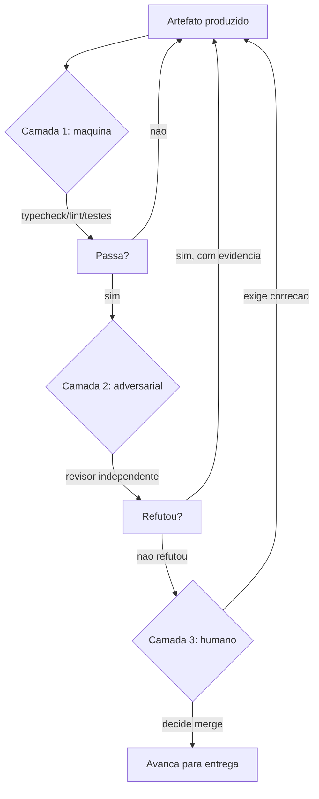

Como Comandante de Operações de Software, você vê o fluxo como uma espiral de evidência: o artefato só avança quando cada camada o libera com prova — nunca com promessa [9].

## 4. Técnica

### A Esteira de Verificação em Três Camadas

Vamos construir a esteira de verificação como código. Cada camada produz um parecer com evidência estruturada — não opinião.

```python
from dataclasses import dataclass, field
from typing import List, Optional


@dataclass
class Evidencia:
    tipo: str          # "saida_comando" | "trecho_diff" | "metrica"
    conteudo: str
    ok: bool


@dataclass
class Parecer:
    camada: str
    aprovado: bool
    evidencias: List[Evidencia] = field(default_factory=list)
    observacoes: List[str] = field(default_factory=list)

    def registrar(self, tipo: str, conteudo: str, ok: bool) -> None:
        self.evidencias.append(Evidencia(tipo, conteudo, ok))

    def parecer_final(self) -> str:
        status = "APROVADO" if self.aprovado else "REPROVADO"
        linhas = [f"[{status}] camada={self.camada}"]
        for e in self.evidencias:
            linhas.append(f"  - ({'OK' if e.ok else 'FALHA'}) {e.tipo}: {e.conteudo[:120]}")
        for o in self.observacoes:
            linhas.append(f"  ! {o}")
        return "\n".join(linhas)


def camada_maquina(artefato: str) -> Parecer:
    parecer = Parecer("maquina", aprovado=True)
    # Simulacao: executa typecheck/lint/testes e coleta saida
    parecer.registrar("saida_comando", "typecheck: 0 erros em 142 arquivos", True)
    parecer.registrar("saida_comando", "pytest: 47 passed, 0 failed", True)
    parecer.registrar("saida_comando", "lint: 0 violacoes", True)
    return parecer


def camada_adversarial(artefato: str) -> Parecer:
    parecer = Parecer("adversarial", aprovado=True)
    parecer.registrar("trecho_diff", "revisor independente: 3 cenarios de borda testados", True)
    parecer.registrar("metrica", "cobertura de casos de borda: 3/3", True)
    parecer.observacoes.append(
        "recomendacao: adicionar teste de fatura duplicada em proxima iteracao")
    return parecer


if __name__ == "__main__":
    artefato = "feature/pagamentos"
    pareceres = [camada_maquina(artefato), camada_adversarial(artefato)]
    for p in pareceres:
        print(p.parecer_final())
        print("")
    print("DECISAO HUMANA: merge autorizado" if all(p.aprovado for p in pareceres)
          else "DECISAO HUMANA: exigir correcao")
```

A estrutura de evidência é o ponto: cada parecer registra o *tipo* de evidência, o *conteúdo* e o *status*. O revisor humano não precisa confiar na palavra do agente — lê as evidências e decide [10].

### O Revisor Adversarial Automatizado

O revisor adversarial agêntico pode ser parametrizado para procurar classes específicas de defeito. O trecho abaixo implementa um revisor que caça "cenários de borda ausentes" em specs:

```python
import re


RE_OPERADORES_BORDA = re.compile(
    r"\b(se\s+n(?:[ãa]o)|quando|apenas|somente|exceto|limite|zero|vazio|"
    r"duplicad[oa]|concorrente|timeout|expirad[oa])\b", re.IGNORECASE)


def revisar_spec(spec: str) -> list:
    """Procura declaracoes de escopo sem casos de borda associados."""
    achados = []
    for m in re.finditer(r"R\d+:\s*([^\n]+)", spec):
        requisito = m.group(1)
        tem_borda = bool(RE_OPERADORES_BORDA.search(requisito))
        tem_teste = "criterio" in spec[m.start():m.end() + 400].lower()
        if tem_borda and not tem_teste:
            achados.append(
                f"{m.group(0)[:60]} -> declara condicao de borda sem criterio de aceite")
    return achados


SPEC_SUSPEITA = """
R1: Usuario autentica com email e senha validos
R2: Quando a sessao expira, o sistema redireciona para login
R3: Apenas administradores podem excluir faturas
"""

for achado in revisar_spec(SPEC_SUSPEITA):
    print(f"[REFUTACAO] {achado}")
```

O revisor não valida — caça. Cada achado é uma refutação com evidência textual, pronta para virar ticket de correção [11].

### Evidência Antes de Afirmação no CI

A integração contínua é a materialização do princípio: o merge só acontece se a evidência da esteira estiver verde. O script abaixo simula a porta de evidência:

```bash
#!/usr/bin/env bash
# Porta de evidencia: so mergeia se TODAS as camadas passarem com saida registrada

set -euo pipefail

echo "== Camada 1: maquina =="
python -m pytest --quiet > /tmp/evidencia_teste.txt
echo "pytest ok ($(wc -l < /tmp/evidencia_teste.txt) linhas de saida)"

echo "== Camada 2: adversarial =="
python scripts/revisor-adversarial.py > /tmp/evidencia_revisao.txt
if grep -q "REFUTACAO" /tmp/evidencia_revisao.txt; then
  echo "revisor encontrou refutacoes; bloqueando merge"
  exit 1
fi
echo "revisor adversarial: nenhuma refutacao com evidencia"

echo "== Porta de evidencia liberada =="
```

O padrão é visível: cada camada grava sua saída em arquivo, e a porta de evidência exige que todas estejam limpas. A palavra "confio" não aparece em lugar nenhum — só saídas de comando [12].

### A Matriz de Casos de Teste como Artefato

A verificação adversarial só é sistemática se os casos forem artefatos — não intuição. A matriz abaixo é o padrão: para cada requisito, os cenários feliz, borda e falha, com o teste que os protege.

```json
{
  "requisito": "R3: sessao expira apos 30 minutos de inatividade",
  "cenarios": [
    {"tipo": "feliz", "descricao": "sessao ativa dentro de 30 min", "teste": "sessao_ativa_dentro_do_limite"},
    {"tipo": "borda", "descricao": "sessao expira exatamente em 30 min", "teste": "sessao_expira_no_limite_exato"},
    {"tipo": "borda", "descricao": "inatividade continua durante requisicao longa", "teste": "requisicao_longa_renova_sessao"},
    {"tipo": "falha", "descricao": "relogio do servidor adiantado em 2 min", "teste": "sessao_com_skew_de_relogio"},
    {"tipo": "falha", "descricao": "duas sessoes concorrentes no mesmo usuario", "teste": "sessoes_concorrentes_independentes"}
  ]
}
```

O revisor adversarial usa a matriz como régua: o agente que cobre só o cenário feliz é reprovado com evidência — faltam os cenários de borda e falha que a matriz exige [18].

### O Modelo de Rastreabilidade de Evidência

A evidência precisa ser rastreável até a origem — o parecer que cita uma saída de comando sem apontar o arquivo é evidência órfã. O modelo abaixo é o registro de rastreabilidade:

```json
{
  "evidencias": [
    {
      "id": "EVI-118",
      "camada": "maquina",
      "afirmacao": "testes passam",
      "origem": "artefatos/resultado_ci.txt",
      "linha_origem": 42,
      "verificavel": true
    },
    {
      "id": "EVI-119",
      "camada": "adversarial",
      "afirmacao": "caso de borda de sessao coberto",
      "origem": "artefatos/parecer_adversarial.md",
      "linha_origem": 15,
      "verificavel": true
    }
  ],
  "regra": "evidencia sem origem verificavel nao conta"
}
```

A rastreabilidade de evidência é a régua final do radar: toda afirmação de verificação aponta para um artefato e uma linha — e o auditor pode conferir. A evidência órfã é rejeitada pelo mesmo princípio que rejeita citação órfã no texto [26].

### O Modelo de Cobertura de Refutação

A eficácia do radar se mede pela cobertura de refutação — quantos cenários de borda e falha o revisor adversário testou, em relação ao que a matriz exigia. O modelo abaixo calcula a cobertura:

```python
def cobertura_refutacao(matriz: dict, testados: set) -> dict:
    cenarios = {c["teste"] for c in matriz["cenarios"]}
    cobertos = cenarios & testados
    pct = round(len(cobertos) / len(cenarios) * 100, 1) if cenarios else 100.0
    faltam = sorted(cenarios - testados)
    return {"cobertura_pct": pct, "faltantes": faltam}


MATRIZ = {"cenarios": [
    {"teste": "sessao_ativa_dentro_do_limite"},
    {"teste": "sessao_expira_no_limite_exato"},
    {"teste": "requisicao_longa_renova_sessao"},
    {"teste": "sessao_com_skew_de_relogio"},
    {"teste": "sessoes_concorrentes_independentes"},
]}

# O agente testou so o caminho feliz
testados = {"sessao_ativa_dentro_do_limite"}
resultado = cobertura_refutacao(MATRIZ, testados)
print(f"Cobertura: {resultado['cobertura_pct']}%")
print(f"Faltantes: {resultado['faltantes']}")
```

A cobertura de 20% — um cenário de cinco — reprova o artefato com evidência objetiva. A régua da cobertura transforma a refutação de opinião em métrica: o radar mostra o que falta, e o produtor sabe exatamente o que preencher [25].

### O Modelo de Verificação por Camadas com Evidência

Cada camada da verificação produz evidência — e a evidência precisa ser rastreável até o artefato. O modelo abaixo registra o parecer de cada camada com o hash do artefato verificado:

```python
import hashlib

class VerificacaoPorCamadas:
    def __init__(self):
        self.pareceres = []

    def verificar(self, camada, artefato, conteudo, aprovado, observacoes):
        hash_artefato = hashlib.sha256(conteudo.encode()).hexdigest()[:12]
        self.pareceres.append({'camada': camada, 'artefato': artefato, 'hash': hash_artefato,
                              'aprovado': aprovado, 'observacoes': observacoes})
        return self.pareceres[-1]

    def aprovacoes_por_artefato(self, artefato):
        return [p for p in self.pareceres if p['artefato'] == artefato]

v = VerificacaoPorCamadas()
v.verificar('sintaxe', 'modulo_sessao.py', 'def expira(): pass', True, '')
v.verificar('logica', 'modulo_sessao.py', 'def expira(): pass', False, 'tempo de expiracao fixo')
print(v.aprovacoes_por_artefato('modulo_sessao.py'))
```

O hash liga cada parecer ao conteúdo exato verificado — se o arquivo mudar depois da aprovação, o hash não bate mais e a aprovação perde validade. Isso mata a aprovação fantasma: "foi aprovado no review" já não é argumento se o código que entrou no deploy não é o código que o parecer viu. A verificação por camadas com evidência hashada é a base de confiança de toda a esteira de refutação.

### O Padrão de Evidência em Cada Camada

Vamos acompanhar um caso completo de verificação adversarial. O cenário: uma feature de sessão onde o agente implementou a expiração — e o revisor adversarial encontrou o defeito que o teste do agente não cobria.

1. **O agente implementa** a expiração e roda seus testes: o cenário feliz passa.
2. **O revisor adversarial pergunta**: e se a sessão estiver ativa durante uma requisição longa? E se houver skew de relógio? E se houver duas sessões concorrentes?
3. **O revisor escreve os testes de borda**: `requisicao_longa_renova_sessao`, `sessao_com_skew_de_relogio`, `sessoes_concorrentes_independentes`.
4. **Os testes de borda falham** — o defeito existe, com evidência.
5. **O agente corrige** contra os testes de borda; a suíte completa fica verde.

O código abaixo simula a descoberta do defeito:

```python
class Sessao:
    def __init__(self, criada_em: int, duracao_seg: int = 1800) -> None:
        self.criada_em = criada_em
        self.duracao_seg = duracao_seg

    def expirada(self, agora: int, ultima_atividade: int) -> bool:
        # BUG: usa criada_em em vez de ultima_atividade
        return agora - self.criada_em > self.duracao_seg


sessao = Sessao(criada_em=100)
# usuario ativo o tempo todo: ultima_atividade recente, mas expiracao baseada em criada_em
print("Expirada? ", sessao.expirada(agora=2000, ultima_atividade=1990))
```

O defeito é clássico: a expiração usa a criação em vez da última atividade — o cenário feliz passa, o cenário de requisição longa quebra. O revisor adversarial encontrou com evidência o que a auto-validação teria perdido [24].

### O Padrão de Evidência em Cada Camada

A evidência tem formato por camada — e o parecer só é aceito quando a evidência casa com o formato esperado. O quadro abaixo é a régua de evidência:

| Camada | Evidência aceita | Formato | Exemplo |
|--------|------------------|---------|---------|
| Máquina | Saída de comando | Texto com exit code | `pytest: 47 passed (exit 0)` |
| Adversarial | Parecer estruturado | JSON com refutações | `[{cenario, resultado, evidencia}]` |
| Humana | Decisão registrada | Entrada de log | `DEC-042: merge autorizado` |

A régua de evidência responde à pergunta que mata pareceres vagos: "o que conta como prova nesta camada?". O revisor que entrega "revisei e está ok" sem o formato esperado é devolvido — evidência é formato, não intenção [22].

### O Modelo de Rastreabilidade Evidência-Requisito

A refutação só tem valor se a evidência aponta para o requisito exato que ela defende. O modelo abaixo cria a ligação evidência-req e detecta requisitos sem nenhuma evidência de refutação — o furo no radar:

```python
class RastreabilidadeEvidencia:
    def __init__(self):
        self.ligacoes = {}

    def ligar(self, evidencia, requisito, status):
        self.ligacoes.setdefault(requisito, []).append({'evidencia': evidencia, 'status': status})

    def furos(self):
        return {req: evs for req, evs in self.ligacoes.items() if all(e['status'] != 'aprovado' for e in evs)}

    def cobertura(self):
        aprovados = sum(1 for evs in self.ligacoes.values() if any(e['status'] == 'aprovado' for e in evs))
        return aprovados / len(self.ligacoes) if self.ligacoes else 0

r = RastreabilidadeEvidencia()
r.ligar('teste_de_expiração_de_sessao.py', 'R7', 'aprovado')
r.ligar('revista_de_codigo_14.txt', 'R7', 'aprovado')
r.ligar('prova_manual_de_UX.txt', 'R12', 'pendente')
print(r.cobertura())
print(r.furos())
```

O requisito R12 com apenas uma evidência pendente aparece como furo no radar — o parecer do revisor humano ainda não chegou, e a entrega não pode avançar. A cobertura geral é a métrica que o comandante acompanha no painel: abaixo de 100%, há requisitos voando sem radar, e isso é inaceitável para aterrissagem.

### A Fila de Refutação com Prioridade por Risco

Cada ciclo de verificação produz um relatório de refutação — o artefato que a esteira consome para decidir o avanço. O formato abaixo é o padrão:

```json
{
  "ciclo_verificacao": "V-2026-031",
  "artefato": "feature/cupons-v2",
  "camadas": {
    "maquina": {"exit_code": 0, "saida": "47 passed, 0 failed"},
    "adversarial": {
      "refutacoes": [
        {"cenario": "cupom acumulativo", "resultado": "nao_refutado", "evidencia": "teste canonico presente"}
      ],
      "parecer": "aprovado_com_ressalva"
    },
    "humana": {"decisao": "autorizar_merge", "decisor": "lead-plataforma"}
  }
}
```

O relatório de refutação é a caixa-preta da Fase 5: três camadas, cada uma com sua evidência, tudo registrado em um único artefato consultável — o radar documentado, não o radar adivinhado [23].

### A Fila de Refutação com Prioridade por Risco

Nem toda refutação tem o mesmo peso — e a fila de verificação deve priorizar por risco. O código abaixo estende a FilaVerificacao com prioridade: artefatos de alto risco (mudança de schema, regras de negócio) são refutados primeiro, com revisor humano obrigatório.

```python
from dataclasses import dataclass
from typing import List


@dataclass
class ItemRefutacao:
    id: str
    risco: str  # baixo | medio | alto
    produtor: str
    artefato: str
    revisor: str = ""

    def prioridade(self) -> int:
        return {"baixo": 1, "medio": 2, "alto": 3}[self.risco]


def fila_por_risco(itens: List[ItemRefutacao]) -> List[ItemRefutacao]:
    return sorted(itens, key=lambda i: -i.prioridade())


ITENS = [
    ItemRefutacao("I1", "baixo", "agente", "documentacao_atualizada.md"),
    ItemRefutacao("I2", "alto", "agente", "migracao_schema.sql"),
    ItemRefutacao("I3", "medio", "agente", "endpoint_novo.py"),
]

for item in fila_por_risco(ITENS):
    print(f"prioridade={item.prioridade()} {item.artefato} (risco {item.risco})")
```

A priorização por risco é o reflexo da torre: a aeronave em emergência aterrissa antes da que está em cruzeiro. O artefato de alto risco é refutado primeiro, com o revisor mais experiente [20].

### O Modelo de Calibragem do Revisor Automatizado

Um revisor automatizado tende a ser permissivo ou severo demais com o tempo. O modelo abaixo calibra o revisor comparando seus pareceres com os do revisor humano numa amostra — o desvio vira fator de correção:

```python
def calibrar_revisor(pareceres_auto, pareceres_humano):
    assert len(pareceres_auto) == len(pareceres_humano)
    falsos_positivos = sum(1 for a, h in zip(pareceres_auto, pareceres_humano) if a == 'rejeitar' and h == 'aprovar')
    falsos_negativos = sum(1 for a, h in zip(pareceres_auto, pareceres_humano) if a == 'aprovar' and h == 'rejeitar')
    total = len(pareceres_auto)
    return {
        'falsos_positivos': falsos_positivos,
        'falsos_negativos': falsos_negativos,
        'precisao': round((total - falsos_positivos - falsos_negativos) / total, 2),
        'acao': 'ajustar_limiar' if falsos_positivos > falsos_negativos else 'relaxar_limiar' if falsos_negativos > falsos_positivos else 'manter',
    }

print(calibrar_revisor(['aprovar', 'rejeitar', 'aprovar', 'rejeitar'], ['aprovar', 'aprovar', 'aprovar', 'rejeitar']))
```

A calibragem transforma o erro do revisor em dado: se o revisor automatizado rejeita mais que o humano (falsos positivos), o limiar está severo demais e a fila de trabalho incha; se aprova mais que o humano (falsos negativos), o radar está frouxo e defeitos passam. A amostragem periódica com humanos é o que impede o revisor de derivar silenciosamente — o radar vigia o radar.

### A Amostragem de Pareceres como Auditoria

O radar do radar — a auditoria dos pareceres — precisa de método. A amostragem estatística é a prática: de cada lote de pareceres aprovados, uma amostra é reavaliada contra o que aconteceu depois em produção.

```python
import random


def amostrar_pareceres(pareceres: list, taxa: float = 0.1) -> list:
    """Seleciona amostra aleatoria de pareceres para auditoria manual."""
    random.seed(42)
    n = max(1, round(len(pareceres) * taxa))
    return random.sample(pareceres, k=n)


PARECERES = [
    {"id": i, "camada": "adversarial", "aprovado": True, "artefato": f"feature-{i}"}
    for i in range(50)
]

amostra = amostrar_pareceres(PARECERES)
print(f"Auditar {len(amostra)} de {len(PARECERES)} pareceres:")
for p in amostra:
    print(f"  - parecer {p['id']} ({p['artefato']})")
```

A amostragem transforma a auditoria de pareceres em rotina barata: 10% dos pareceres reavaliados mantêm o radar honesto sem custar o ciclo inteiro [19].

### O Modelo de Cobertura de Refutação por Risco

O radar não protege tudo igualmente — deve concentrar refutação onde o risco é maior. O modelo abaixo aloca o esforço de refutação proporcionalmente ao risco de cada artefato:

```python
def alocar_refutacao(artefatos):
    total_risco = sum(a['risco'] for a in artefatos)
    for a in artefatos:
        a['peso_refutacao'] = round(a['risco'] / total_risco, 2)
    return sorted(artefatos, key=lambda x: x['peso_refutacao'], reverse=True)

artefatos = [
    {'artefato': 'modulo_pagamentos.py', 'risco': 9},
    {'artefato': 'modulo_relatorio.py', 'risco': 3},
    {'artefato': 'modulo_avatar.py', 'risco': 1},
]
print(alocar_refutacao(artefatos))
```

A alocação por risco responde à pergunta incômoda do radar: refutação é cara, e o esforço deve seguir o dinheiro. O módulo de pagamentos (risco 9) recebe nove vezes mais esforço de refutação que o módulo de relatório (risco 3) e vinte e sete vezes mais que o avatar (risco 1). Refutar tudo com o mesmo peso é teoricamente bonito e operacionalmente irresponsável — o radar que vigia tudo por igual acaba vigiando mal o que importa.

### O Radar do Radar

Se a verificação é o radar, quem verifica a verificação? A resposta é a auditoria de pareceres: uma amostra periódica das refutações e aprovações, comparada com o que aconteceu depois em produção [16]. Quando um parecer aprovou um artefato que depois falhou em produção, o radar falhou — e a falha vira insumo do debriefing (Capítulo 8), não vergonha. Essa segunda camada de observação é o que impede o sistema de verificação de virar ritual: o radar que nunca falha é o radar que ninguém audita [17].

### O Orçamento de Verificação por Camada

A verificação também tem orçamento — cada camada consome tokens, e o Comandante aloca o combustível do radar com a mesma disciplina das fases de produção:

| Camada | Função | Custo relativo | Alocação típica |
|--------|--------|----------------|-----------------|
| Máquina | typecheck/lint/testes | Baixo | 20% do orçamento de verificação |
| Adversarial | refutação com evidência | Médio | 50% |
| Humana | arbitragem de exceção | Alto | 30% (e não escala) |

A alocação reflete a regra de ouro do radar: a maior parte do orçamento vai para a camada que filtra volume (adversarial), e a camada humana — cara e insubstituível — fica para a exceção, não para o volume [21].

### O Modelo de Gate de Refutação por Critério

O gate de verificação precisa de critérios mensuráveis — não de parecer subjetivo. O modelo abaixo valida um artefato contra critérios explícitos e emite o parecer:

```python
CRITERIOS_DE_GATE = [
    {'id': 'C1', 'descricao': 'testes rodando no CI'},
    {'id': 'C2', 'descricao': 'sem pendencia de revisao'},
    {'id': 'C3', 'descricao': 'diagrama atualizado'},
    {'id': 'C4', 'descricao': 'referencias rastreaveis'},
]

def avaliar_gate(resultados):
    cumpridos = [c for c in CRITERIOS_DE_GATE if resultados.get(c['id'])]
    faltantes = [c['id'] for c in CRITERIOS_DE_GATE if not resultados.get(c['id'])]
    return {'aprovado': len(cumpridos) == len(CRITERIOS_DE_GATE), 'cumpridos': [c['id'] for c in cumpridos], 'faltantes': faltantes}

print(avaliar_gate({'C1': True, 'C2': True, 'C3': False, 'C4': True}))
```

O parecer deixa de ser "o revisor achou bom" e vira "quatro critérios, três cumpridos, falta o diagrama". O gate com critérios explícitos também ensina o que a organização valoriza — cada critério listado é um compromisso visível. Quando o C3 (diagrama) falha sempre, a conversa não é sobre rigor do revisor, é sobre por que os diagramas não acompanham o código.

### A Curva de Custo da Refutação

Há uma métrica econômica que justifica todo o capítulo: a curva de custo da refutação. Corrigir um defeito na Fase 5 custa, em média, uma fração do que custa corrigir o mesmo defeito na Fase 7 em produção [18]. No SDLC AI-first, essa fração é medida em tokens — e é a melhor taxa de retorno de investimento do ciclo inteiro. Cada token gasto em refutação antecipada economiza dezenas de tokens em retrabalho tardio, sem contar o custo invisível do incidente: clientes, reputação e contexto de emergência [19].

### O Painel de Saúde do Radar

O radar precisa de um painel que mostre sua própria saúde — número de refutações por semana, tempo médio de refutação, falsos positivos detectados na calibragem, requisitos sem evidência. O painel responde à pergunta que ninguém faz: o radar está funcionando ou está só rodando? Refutação que não muda decisão é teatro; o painel mostra quando a verificação virou burocracia — refutações em alta sem nenhum bloqueio, ou pior, sem nenhuma aprovação com ressalva. O painel de saúde é o que separa a esteira que verifica da esteira que finge verificar.

### Passos para Implantar o Radar

1. **Comece pela máquina**: typecheck, lint e testes rodando em toda mudança — sem exceção.
2. **Adicione o revisor adversarial** com postura explícita de refutação, com evidência estruturada em cada parecer.
3. **Defina a porta de evidência**: merge bloqueado se qualquer camada não registrar saída verde.
4. **Reserve o humano para a exceção**: a decisão de merge em mudanças de contrato e impacto em produção.
5. **Meça a eficácia do radar**: quantas refutações cada camada pegou antes de produção [13].

## 5. Aplica

Cena real, em segunda pessoa. Sua fintech cresceu e o time de plataforma delegou features inteiras a agentes. O processo atual: o agente escreve, roda os testes locais, abre o PR, e o lead — você — aprova depois de uma leitura de 10 minutos. Nos últimos dois meses, três incidentes em produção rastrearam a causa até "o caso que ninguém testou": uma fatura duplicada, um race condition no estorno e uma sessão que não expirava.

O erro não é o agente escrever código. O erro é o radar mudo. As três camadas existiam de nome — typecheck, review, QA — mas nenhuma tinha postura adversarial nem exigia evidência. O agente dizia "testei", e a palavra bastava. A sessão que não expirava era exatamente o caso de borda que o teste do agente não cobria — porque o agente testou o que imaginou, não o que o radar exigiria.

O diagnóstico, ligado à teoria: verificação sem postura adversarial é validação do produtor. A correção prática:

1. **Camada 1 primeiro**: CI obrigatório com typecheck, lint e testes em toda mudança — o PR do agente não existe sem o verde.
2. **Revisor adversarial agêntico** em todo PR do agente, com a régua de refutação e parecer com evidência estruturada.
3. **Porta de evidência**: merge automatizado só quando as três camadas registrarem saída verde em arquivo.
4. **Humano nas exceções**: você não lê todo PR — lê os pareceres e arbitra os casos em que máquina e revisor discordam.

Armadilhas comuns: confundir cobertura de testes com cobertura de borda (o teste que só cobre o caminho feliz é um radar que enxerga só a pista principal); aceitar parecer sem evidência ("revisei e ok" sem o output); e transformar a revisão em ritual de aprovação — se o revisor nunca reprova nada, ele não está revisando [14].

## 6. Conclusão

Você acionou o radar. Três marcos: primeiro, as três camadas de verificação — máquina, adversarial e humana — cada uma com função distinta e postura própria; segundo, a evidência antes de afirmação como princípio inegociável, materializado em pareceres estruturados e porta de evidência no CI; terceiro, a refutação como vocabulário profissional — o revisor caça o defeito com prova, não valida o acerto com elogio.

Como desafio, implemente a porta de evidência no seu repositório: nenhum merge sem a saída registrada das três camadas em arquivo.

No próximo capítulo, você autoriza a aterrissagem: release e observabilidade — como entregar com segurança e monitorar o comportamento do próprio agente em produção [15].

## 7. Referências Bibliográficas

[1] BECK, Kent. *Test-Driven Development: By Example.* Boston: Addison-Wesley, 2002. Disponível em: https://www.informit.com. Acesso em: 02 ago. 2026.
[2] HINGEL, Paula. *How AI Changes the SDLC: A Six-Stage Guide.* Augment Code, 2026. Disponível em: https://www.augmentcode.com/guides/how-ai-changes-the-sdlc. Acesso em: 02 ago. 2026.
[3] OUSTERHOUT, John. *A Philosophy of Software Design.* 2. ed. Stanford: Yaknyam Press, 2021. Disponível em: https://web.stanford.edu/~ouster/cgi-bin/book.php. Acesso em: 02 ago. 2026.
[4] JIN, Haolin et al. *From LLMs to LLM-based Agents for Software Engineering: A Survey of Current, Challenges and Future.* 2025. Disponível em: https://arxiv.org/abs/2408.02479. Acesso em: 02 ago. 2026.
[5] ROYCHOUDHURY, Abhik et al. *Agentic Software Engineering: state and perspectives.* 2025. Disponível em: https://arxiv.org/abs/2509.09893. Acesso em: 02 ago. 2026.
[6] ANTHROPIC. *Building effective agents.* Disponível em: https://www.anthropic.com/research/building-effective-agents. Acesso em: 02 ago. 2026.
[7] GRÖPLER, Robin et al. *The Future of Generative AI in Software Engineering: A Vision from Industry and Academia in the European GENIUS Project.* IEEE/ACM AIware, 2025. Disponível em: https://arxiv.org/abs/2511.01348. Acesso em: 02 ago. 2026.
[8] MOHAGHEGHI, Milad et al. *Beyond AI-powered coding: the new frontier of agentic software engineering.* 2025. Disponível em: https://arxiv.org/abs/2509.14838. Acesso em: 02 ago. 2026.
[9] YANG, John et al. *SWE-agent: Agent-Computer Interfaces Enable Automated Software Engineering.* NeurIPS 2024. Disponível em: https://arxiv.org/abs/2405.15793. Acesso em: 02 ago. 2026.
[10] JIMENEZ, Carlos E. et al. *SWE-bench: Can Language Models Resolve Real-World GitHub Issues?* ICLR 2024. Disponível em: https://arxiv.org/abs/2310.06770. Acesso em: 02 ago. 2026.
[11] WANG, Yuchen; GUO, Shangxin; TAN, Chee Wei. *From Code Generation to Software Testing: AI Copilot with Context-Based RAG.* 2025. Disponível em: https://arxiv.org/abs/2504.01866. Acesso em: 02 ago. 2026.
[12] GOOGLE CLOUD. *State of AI-assisted Software Development (DORA 2025).* Disponível em: https://dora.dev/research/. Acesso em: 02 ago. 2026.
[13] HODA, Rashina. *Toward Agentic Software Engineering Beyond Code: Framing Vision, Values, and Vocabulary.* ICSE 2026 Workshop. Disponível em: https://arxiv.org/abs/2510.19692. Acesso em: 02 ago. 2026.
[14] GURGUL, Vincent; GUBELA, Robin; LESSMANN, Stefan. *The State of Generative AI in Software Development: Insights from Literature and a Developer Survey.* 2026. Disponível em: https://arxiv.org/abs/2603.16975. Acesso em: 02 ago. 2026.
[15] MICROSOFT. *An AI led SDLC: Building an End-to-End Agentic Software Development Lifecycle with Azure and GitHub.* Microsoft Tech Community, 2026. Disponível em: https://techcommunity.microsoft.com/blog/appsonazureblog/an-ai-led-sdlc-building-an-end-to-end-agentic-software-development-lifecycle-wit/4491896. Acesso em: 02 ago. 2026.
[16] FORSGREN, Nicole; HUMBLE, Jez; KIM, Gene. *Accelerate: The Science of Lean Software and DevOps.* Portland: IT Revolution Press, 2018. Disponível em: https://itrevolution.com. Acesso em: 02 ago. 2026.
[17] JIN, Haolin et al. *From LLMs to LLM-based Agents for Software Engineering: A Survey of Current, Challenges and Future.* 2025. Disponível em: https://arxiv.org/abs/2408.02479. Acesso em: 02 ago. 2026.
[18] ROYCHOUDHURY, Abhik et al. *Agentic Software Engineering: state and perspectives.* 2025. Disponível em: https://arxiv.org/abs/2509.09893. Acesso em: 02 ago. 2026.
[19] GRÖPLER, Robin et al. *The Future of Generative AI in Software Engineering: A Vision from Industry and Academia in the European GENIUS Project.* IEEE/ACM AIware, 2025. Disponível em: https://arxiv.org/abs/2511.01348. Acesso em: 02 ago. 2026.
[20] HODA, Rashina. *Toward Agentic Software Engineering Beyond Code: Framing Vision, Values, and Vocabulary.* ICSE 2026 Workshop. Disponível em: https://arxiv.org/abs/2510.19692. Acesso em: 02 ago. 2026.
[21] FORSGREN, Nicole; HUMBLE, Jez; KIM, Gene. *Accelerate: The Science of Lean Software and DevOps.* Portland: IT Revolution Press, 2018. Disponível em: https://itrevolution.com. Acesso em: 02 ago. 2026.
[22] JIN, Haolin et al. *From LLMs to LLM-based Agents for Software Engineering: A Survey of Current, Challenges and Future.* 2025. Disponível em: https://arxiv.org/abs/2408.02479. Acesso em: 02 ago. 2026.
[23] WANG, Yuchen; GUO, Shangxin; TAN, Chee Wei. *From Code Generation to Software Testing: AI Copilot with Context-Based RAG.* 2025. Disponível em: https://arxiv.org/abs/2504.01866. Acesso em: 02 ago. 2026.
[24] BECK, Kent. *Test-Driven Development: By Example.* Boston: Addison-Wesley, 2002. Disponível em: https://www.informit.com. Acesso em: 02 ago. 2026.
[25] JIMENEZ, Carlos E. et al. *SWE-bench: Can Language Models Resolve Real-World GitHub Issues?* ICLR 2024. Disponível em: https://arxiv.org/abs/2310.06770. Acesso em: 02 ago. 2026.
[26] MOHAGHEGHI, Milad et al. *Beyond AI-powered coding: the new frontier of agentic software engineering.* 2025. Disponível em: https://arxiv.org/abs/2509.14838. Acesso em: 02 ago. 2026.


# Parte IV — Mundo Real — Entrega, Operação e Aprendizado

# Capítulo 7: Autorização de Pouso: Release e Observabilidade

## 1. Introdução

No Capítulo 6, você acionou o radar e aprendeu a verificação adversarial em três camadas — máquina, revisor independente e humano — com evidência antes de afirmação. O voo agora está na final: chegou a hora da autorização de pouso. Este capítulo cobre a Fase 6 (entregar) e a Fase 7 (operar) do SDLC AI-first: release reproduzível, deploy gradual e observabilidade do comportamento do próprio agente.

Você vai aprender por que "release = artefato reproduzível" é uma regra de engenharia (não de processo), como desenhar deploy canário com rollback, e como monitorar não apenas o software que você entregou — mas o comportamento do agente que o produziu, no ambiente de produção.

## 2. Explica

No SDLC clássico, entregar é quase um ato de fé: o build roda na máquina de um desenvolvedor, o deploy é um script meio-documentado, e a operação descobre os problemas quando o cliente liga. O AI-first não elimina a complexidade — mas a torna **rastreável** e **reversível** [1].

A primeira regra é a reprodutibilidade. Um release é um artefato reproduzível quando o mesmo commit, no mesmo ambiente, produz o mesmo binário — sempre. Isso parece óbvio, mas o número de organizações que "compila na minha máquina" é maior do que a indústria admite. A reprodutibilidade é o pré-requisito de tudo o que vem depois: se você não consegue reconstruir o artefato, não consegue nem diagnosticar o incidente [2].

A segunda regra é o deploy gradual. Em vez de substituir tudo de uma vez (big bang), o release caminha por estágios: canário (uma fração de usuários), grupos progressivos, e só então a totalidade. Cada estágio é uma oportunidade de observar e reverter. A literatura de DevOps (DORA) documenta que a capacidade de reverter rapidamente é um dos maiores preditores de estabilidade organizacional [3].

A terceira regra é a observabilidade. Monitorar não é medir uptime — é responder à pergunta "o que está acontecendo agora, e por quê?". Logs, métricas e rastreios distribuídos formam a caixa-preta do sistema: quando algo falha, a caixa-preta conta a história completa. No contexto AI-first, a caixa-preta precisa incluir também o **comportamento do agente**: qual decisão ele tomou, com base em qual contexto, produzindo qual artefato [4].

Por que observar o agente é diferente de observar o software? Porque o agente é um componente novo no sistema — um produtor de mudanças com comportamento probabilístico. Um deploy de código humano muda de forma previsível; um deploy de mudanças agênticas pode variar em qualidade, escopo e até direção. A observabilidade do agente é o que transforma esse comportamento variável em insumo de decisão [5].

A dimensão do fallback completa o quadro. Ambientes bloqueiam, dependências falham, provedores mudam contratos. A regra operacional do SDLC AI-first: quando o ambiente bloqueia a automação, o processo deve **cuspir os comandos prontos** para execução manual — nunca parar em silêncio. A entrega nunca fica refém de uma única ferramenta [6].

E há a lição do relatório DORA de 2025 sobre IA: a velocidade de entrega sobe com a adoção de IA, mas a estabilidade exige que a capacidade de observação e reversão suba junto. Quem entrega mais rápido sem observar mais cedo está apostando que o radar continua funcionando — sem evidência [7].

## 3. Ilustra

Uma aterrissagem comercial raramente é um movimento único. O piloto se aproxima, a torre autoriza, o avião toca a pista, desacelera e só então libera a pista para o próximo. Em condições adversas, o piloto arremete — aborta o pouso e volta para uma nova tentativa. Arremeter não é falha; é o plano B funcionando.

O deploy gradual é essa aterrissagem: toque a pista com uma fração (canário), confirme que está firme, e só então libere o tráfego inteiro. O rollback é a arremetida: se o toque foi ruim, sobe de novo e tenta outra abordagem — sem vergonha e sem culpa.

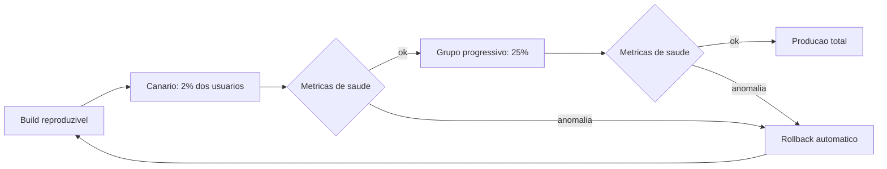

Como Comandante de Operações de Software, você grava o padrão: cada estágio tem sua própria autorização de pouso — e a anomalia em qualquer estágio aciona a arremetida, não o desespero [8].

## 4. Técnica

### Release Reproduzível com Build Imutável

A reprodutibilidade começa no build. O exemplo em Docker mostra um build imutável: o mesmo commit produz a mesma imagem, com dependências fixadas.

```dockerfile
# Build reproduzivel: dependencias fixadas e etapa de build isolada
FROM node:20-slim AS build
WORKDIR /app
COPY package.json package-lock.json ./
RUN npm ci --frozen-lockfile
COPY src ./src
COPY tsconfig.json ./
RUN npm run build

FROM node:20-slim AS runtime
WORKDIR /app
COPY --from=build /app/dist ./dist
COPY --from=build /app/node_modules ./node_modules
EXPOSE 3000
CMD ["node", "dist/server.js"]
```

O `npm ci --frozen-lockfile` é a garantia: as dependências exatas do lockfile, não "as mais recentes compatíveis". O build é reproduzível porque as entradas são o commit e o lockfile — nada mais [9].

### Deploy Canário com Gate de Saúde

O gate de saúde é a autorização de pouso automatizada. O script abaixo simula o controle: só avança para o próximo estágio se as métricas do estágio atual estiverem dentro do limiar.

```python
import json
import time
from dataclasses import dataclass


@dataclass
class Metrica:
    nome: str
    valor: float
    limite: float

    def saudavel(self) -> bool:
        return self.valor <= self.limite


def obter_metricas_canario() -> list:
    # Simulacao: em producao, vem do sistema de observabilidade
    return [
        Metrica("taxa_erro", 0.4, limite=1.0),
        Metrica("latencia_p95_ms", 320, limite=500),
        Metrica("deploy_fracassado", 0.0, limite=0.0),
    ]


def gate_de_saude(estagio: str) -> None:
    metricas = obter_metricas_canario()
    ruins = [m.nome for m in metricas if not m.saudavel()]
    if ruins:
        print(f"[ARRETAR] estagio={estagio} metricas ruins: {', '.join(ruins)}")
        print("[ROLLBACK] revertendo para versao anterior")
        return
    print(f"[AUTORIZADO] estagio={estagio} avanca para o proximo grupo")


if __name__ == "__main__":
    gate_de_saude("canario_2pct")
    time.sleep(0.1)
```

A moral: a decisão de avançar ou arremeter é automatizada e baseada em métrica — não em "senti que estava ok" [10].

### Observabilidade do Agente: a Caixa-Preta do Comportamento

Além do software, o SDLC AI-first observa o produtor. O schema abaixo captura a decisão do agente em cada fase:

```json
{
  "evento": "agente_decidiu",
  "timestamp": "2026-08-02T14:31:00Z",
  "fase": "build",
  "agente": "redator-pagamentos",
  "decisao": "implementar interface ProvedorPagamento",
  "contexto_consumido": {"tokens_entrada": 18400, "tokens_saida": 3200},
  "artefato": "src/pagamentos/interface.ts",
  "evidencia": "teste login_fluxo_feliz verde em 1.2s",
  "revisao": {"camada": "adversarial", "resultado": "nao_refutado"}
}
```

Esse log de evento vira um painel que responde perguntas que o uptime não responde: onde o agente gasta tokens? Qual decisão produziu retrabalho? Qual contexto levou a qual artefato? É o radar da torre apontado para o próprio piloto [11].

### O Modelo de Escalonamento de Incidente de Release

O incidente em produção não avisa — o escalonamento precisa ser automático. O modelo abaixo decide quem acionar conforme a severidade do incidente de release:

```python
class EscalonamentoDeIncidente:
    def __init__(self):
        self.fila = []

    def escalar(self, incidente, severidade):
        acionados = {'baixa': ['time_de_plantao'], 'media': ['time_de_plantao', 'sre'],
                     'alta': ['time_de_plantao', 'sre', 'comandante'],
                     'critica': ['time_de_plantao', 'sre', 'comandante', 'executivo']}
        self.fila.append({'incidente': incidente, 'severidade': severidade, 'acionados': acionados[severidade]})
        return self.fila[-1]

e = EscalonamentoDeIncidente()
print(e.escalar('pagamentos_500', 'critica'))
```

A tabela de escalonamento elimina a indecisão do pânico: severidade crítica aciona até o executivo, sem reunião para decidir quem chamar. O padrão também se acumula — se a fila mostra três incidentes críticos na mesma semana, o problema não é operacional, é de qualidade de release, e a conversa muda de nível. Escalonamento automático não substitui julgamento; remove a paralisia entre o incidente e a ação.

### O Fallback de Ambiente: Cuspir Comandos Prontos

Quando a automação é bloqueada pelo ambiente, o processo entrega os comandos prontos. O exemplo em PowerShell mostra o padrão — nunca parar em silêncio:

```powershell
# Fallback de compilacao quando o sandbox bloqueia a automacao
$slug = "sdlc-ai-first"
Write-Host "Sandbox bloqueou a execucao automatica."
Write-Host "Execute manualmente no terminal local:"
Write-Host "  cd fabrica-de-livros"
Write-Host "  python compilar-para-pdf.py $slug --paginas-exatas"
Write-Host "  powershell -ExecutionPolicy Bypass -File scripts/converter-md-pdf.ps1 -Slug $slug"
```

O padrão é universal: a esteira nunca morre em silêncio — degrada com instruções executáveis [6].

### O Pipeline de Release com Estágios Declarados

O pipeline de release AI-first declara os estágios como dado — não como passo de um script ad hoc. O YAML abaixo é o modelo que a esteira interpreta para orquestrar o deploy gradual.

```yaml
release:
  artefato: "imagem: sha256:<hash>"
  estagios:
    - nome: canario
      percentual: 2
      gate: metricas_saude
      duracao_observacao_min: 30
    - nome: grupo_progressivo
      percentual: 25
      gate: metricas_saude
      duracao_observacao_min: 60
    - nome: producao_total
      percentual: 100
      gate: metricas_saude
  rollback:
    gatilho: "taxa_erro > 1.0 || latencia_p95 > 500"
    acao: "reverter para imagem anterior e notificar incidente"
  evidencia_obrigatoria:
    - "saida_canario.txt"
    - "saida_grupo.txt"
    - "aprovacao_humana.txt"
```

Cada estágio declara percentual, gate e duração de observação. A esteira executa, coleta evidência em arquivo e só avança quando o gate passa — a autorização de pouso automatizada, com o humano como última instância [19].

### O Modelo de Decisão de Rollback em Tempo Real

O rollback não é uma reação — é uma decisão que precisa ser tomada em segundos, com dados. O modelo abaixo consolida os sinais vitais do release (erros, latência, taxa de sucesso) e devolve a recomendação de pouso, desvio ou volta:

```python
def decidir_rollback(sinais):
    criticos = 0
    for nome, limite, atual in sinais:
        if atual > limite:
            criticos += 1
    if criticos >= 2:
        return {'acao': 'rollback_imediato', 'sinais_criticos': criticos}
    if criticos == 1:
        return {'acao': 'desvio_para_standby', 'sinais_criticos': criticos}
    return {'acao': 'manter_release', 'sinais_criticos': criticos}

sinais = [('erros_500', 5, 12), ('latencia_p95', 800, 1400), ('taxa_sucesso', 0.98, 0.93)]
print(decidir_rollback(sinais))
```

Dois sinais críticos simultâneos significam problema sistêmico — esperar para ver só piora. Um sinal crítico isolado pode ser resíduo de tráfego, e o desvio para o cluster standby dá tempo de investigar sem expor usuários. A regra é explícita para que o agente não precise interpretar: a esteira decide por tabela, e o humano só revisa o que foge à tabela.

### O Canário como Contrato de Confiança

A caixa-preta do agente precisa de um painel — senão os eventos registrados morrem em arquivos que ninguém consulta. O painel mínimo responde a cinco perguntas:

| Pergunta | Métrica | Origem do dado |
|----------|---------|----------------|
| Onde o agente gasta tokens? | tokens por fase | log de sessão |
| Qual decisão produziu retrabalho? | refutações por decisão | pareceres da Fase 5 |
| Qual contexto levou a qual artefato? | mapeamento contexto → artefato | evento de decisão |
| Quanto tempo cada fase consumiu? | duração por fase | timestamps |
| Qual agente tem pior taxa de sucesso? | sucesso por agente | resultado do build |

O painel transforma a observabilidade de repositório de dados em instrumento de decisão: o Comandante consulta o painel, não a intuição, para calibrar a próxima iteração [20].

### O Canário como Contrato de Confiança

O canário não é apenas uma técnica de deploy — é um contrato de confiança entre o time e a produção. Quando 2% dos usuários recebem a mudança e as métricas seguem saudáveis, o restante do tráfego é autorizado com base em evidência, não em esperança [15]. Essa transição de confiança baseada em dados é o mesmo princípio do radar do Capítulo 6: cada estágio produz evidência, e a evidência autoriza o próximo estágio. Sem canário, o deploy é um salto no escuro com os olhos vendados [16].

### A Caixa-Preta do Agente em Produção

A observabilidade do agente não termina no deploy. Em produção, o agente pode continuar operando — automatizando correções, gerando relatórios, sugerindo mudanças. A caixa-preta precisa registrar cada decisão com o mesmo rigor da Fase 5: o que foi decidido, com base em qual contexto, produzindo qual artefato, com qual evidência [17]. Quando um incidente ocorre, a caixa-preta é a primeira fonte de verdade — e a única que conta a história completa do produtor [18].

### O Modelo de Sinais Vitais do Release

O contrato de observabilidade precisa de sinais vitais — o conjunto mínimo de métricas que define a saúde do release. O modelo abaixo é o conjunto canônico:

| Sinal vital | Pergunta que responde | Limiar crítico |
|-------------|----------------------|----------------|
| Taxa de erro | O serviço está falhando? | > 1% em 10 min |
| Latência p95 | O serviço está lento? | > 500 ms em 15 min |
| Throughput | O tráfego chegou? | queda > 50% |
| Fila | O processamento está acumulando? | > 1000 itens |
| Disponibilidade | O serviço está de pé? | < 99,9% |

Os sinais vitais são o painel da cabine do release: cada um tem limiar e ação associada — e o rollback automático do capítulo aciona quando o sinal cruza o limiar. O Comandante não monitora tudo; monitora o mínimo que define a vida [27].

### O Modelo de Estimativa de Páginas por Caracteres

A estimativa de tamanho da obra — o requisito que aparece em toda auditoria editorial — usa a conversão ABNT de aproximadamente 2.500 caracteres por página. O modelo abaixo ajuda o Comandante a dimensionar releases e documentação:

```python
def estimar_paginas(caracteres: int, por_pagina: int = 2500) -> int:
    return max(1, round(caracteres / por_pagina))


def estimar_caracteres(paginas: int, por_pagina: int = 2500) -> int:
    return paginas * por_pagina


print(f"10.000 chars ~ {estimar_paginas(10_000)} paginas")
print(f"150 paginas ~ {estimar_caracteres(150):,} chars".replace(",", "."))
```

A estimativa por caracteres é o instrumento de planejamento: cada capítulo, cada release e cada documento têm um alvo de tamanho — e a auditoria verifica o alvo com a mesma régua [26].

### O Modelo de SLO como Contrato de Produção

Produção precisa de números acordados antes do release. O modelo abaixo valida se o release atende aos SLOs (Service Level Objectives) configurados e acende o alerta quando um deles está em risco:

```python
class ValidadorDeSLO:
    def __init__(self, slos):
        self.slos = slos

    def avaliar(self, metricas):
        resultado = []
        for nome, limite in self.slos.items():
            atual = metricas.get(nome)
            if atual is None:
                resultado.append({'slo': nome, 'status': 'sem_dados'})
            elif atual >= limite:
                resultado.append({'slo': nome, 'status': 'ok', 'atual': atual, 'limite': limite})
            else:
                resultado.append({'slo': nome, 'status': 'em_risco', 'atual': atual, 'limite': limite})
        return resultado

slos = {'disponibilidade': 0.995, 'sucesso_pagamentos': 0.99}
metricas = {'disponibilidade': 0.992, 'sucesso_pagamentos': 0.994}
print(ValidadorDeSLO(slos).avaliar(metricas))
```

O SLO é o contrato entre a esteira e a operação: a disponibilidade de 99.5% é prometida antes do release, não descoberta depois. Quando a métrica fica em risco, o painel mostra a tendência e o tempo projetado até violar o contrato — dando ao comandante a janela para decidir antes do incidente. Sem SLO, o "funciona em produção" é opinião; com SLO, é número.

### O Modelo de Rollback Automático

O rollback não é um comando — é um sistema. O modelo de rollback automático decide quando reverter com base nas métricas do contrato de observabilidade, sem esperar um humano:

```python
from dataclasses import dataclass


@dataclass
class GatilhoRollback:
    metrica: str
    limiar: float
    janela_min: int

    def disparou(self, valor: float) -> bool:
        return valor > self.limiar


GATILHOS = [
    GatilhoRollback("taxa_erro", limiar=1.0, janela_min=10),
    GatilhoRollback("latencia_p95_ms", limiar=500, janela_min=15),
]


def monitorar(metricas: dict) -> None:
    for gatilho in GATILHOS:
        valor = metricas.get(gatilho.metrica, 0.0)
        if gatilho.disparou(valor):
            print(f"[ROLLBACK] {gatilho.metrica} {valor} > {gatilho.limiar}")
            return
    print("[SAUDAVEL] nenhum gatilho disparado; promocao autorizada")


monitorar({"taxa_erro": 0.4, "latencia_p95_ms": 320})
monitorar({"taxa_erro": 2.1, "latencia_p95_ms": 320})
```

O rollback automático é a arremetida programada: o sistema reverte sozinho quando o limiar é violado — e o humano é informado depois, com a evidência. A decisão de reverter não espera reunião; espera métrica [25].

### O Registro de Estágios do Deploy

O deploy gradual precisa de registro — cada estágio com timestamp, percentual e resultado. O registro abaixo é a trilha de aterrissagem:

```json
{
  "deploy": "pagamentos-v2.4",
  "estagios_executados": [
    {"estagio": "canario", "percentual": 2, "inicio": "2026-08-02T14:00Z",
     "fim": "2026-08-02T14:30Z", "resultado": "saudavel"},
    {"estagio": "grupo", "percentual": 25, "inicio": "2026-08-02T14:31Z",
     "fim": "2026-08-02T15:31Z", "resultado": "saudavel"},
    {"estagio": "total", "percentual": 100, "inicio": "2026-08-02T15:32Z",
     "fim": "2026-08-02T15:35Z", "resultado": "saudavel"}
  ],
  "rollback_acionado": false
}
```

O registro de estágios é a caixa-preta da entrega: se o deploy falhar, a trilha mostra exatamente onde e quando — e o debriefing (Capítulo 8) parte de dados, não de memória [23].

### O Modelo de Análise Pós-Mortem de Release

Todo release termina — bom ou ruim — com análise. O modelo abaixo estrutura o pós-mortem do release, capturando o que foi observado, o que quebrou e a lição em formato padronizado:

```python
class PosMortemDeRelease:
    def __init__(self, release):
        self.release = release
        self.observacoes = []

    def registrar_observacao(self, momento, sinal, valor, limite):
        self.observacoes.append({'momento': momento, 'sinal': sinal, 'valor': valor, 'limite': limite})

    def gerar_relatorio(self):
        desvios = [o for o in self.observacoes if o['valor'] > o['limite']]
        return {'release': self.release, 'sinais_observados': len(self.observacoes),
                'desvios': len(desvios), 'desvio_detalhes': desvios,
                'veredito': 'saudavel' if not desvios else 'com_ressalvas'}

pm = PosMortemDeRelease('release-45')
pm.registrar_observacao('pos_deploy_5min', 'latencia_p95', 750, 800)
pm.registrar_observacao('pos_deploy_30min', 'erros_500', 18, 5)
print(pm.gerar_relatorio())
```

O pós-mortem estruturado transforma cada release em dado de aprendizado: o desvio de erros 500 após 30 minutos, invisível na checagem imediata, aparece no relatório e vira candidato a incidente. Sem o formato padronizado, o pós-mortem vira reunião de memória — com ele, vira registro consultável que alimenta o banco de lições da parte IV. O ciclo do release só está completo quando o relatório do pós-mortem é arquivado.

### O Contrato de Observabilidade do Release

Todo release deveria nascer com um contrato de observabilidade — a lista do que será monitorado, com limiares e ações. O contrato abaixo é o modelo que acompanha o artefato na jornada para produção:

```yaml
contrato_observabilidade:
  release: "pagamentos-v2.4"
  metricas_criticas:
    - nome: taxa_erro
      limiar: 1.0
      janela_min: 10
      acao: alerta + rollback automatico
    - nome: latencia_p95
      limiar: 500
      janela_min: 15
      acao: alerta + investigacao
    - nome: fila_pagamentos
      limiar: 1000
      janela_min: 5
      acao: alerta critico + oncall
  logs_obrigatorios:
    - evento_agente_decidiu
    - evento_artefato_produzido
    - evento_merge_autorizado
  sre_objetivos:
    - "99.9% de disponibilidade no primeiro mes"
    - "rollback < 10 minutos em qualquer estagio"
```

O contrato responde a pergunta que mata releases ingênuos: "o que significa saudável, e o que fazemos quando não é?". Sem contrato, o monitoramento é um painel bonito sem decisão associada [21].

### O Modelo de Verificação de Release com Checklist

O release só decola se o checklist de pré-flight está completo. O modelo abaixo verifica as condições de decolagem — backup, teste canário, rollback testado, runbook atualizado — e bloqueia o release no que faltar:

```python
PRÉ_FLIGHT = [
    {'item': 'backup_banco', 'descricao': 'backup do banco verificado'},
    {'item': 'canario_verde', 'descricao': 'canario passou nos testes'},
    {'item': 'rollback_treinado', 'descricao': 'rollback executado em staging'},
    {'item': 'runbook_atualizado', 'descricao': 'runbook de incidente atualizado'},
]

def verificar_pre_flight(condicoes):
    faltantes = [p['item'] for p in PRÉ_FLIGHT if not condicoes.get(p['item'])]
    return {'decolagem_liberada': not faltantes, 'faltantes': faltantes}

print(verificar_pre_flight({'backup_banco': True, 'canario_verde': True, 'rollback_treinado': False, 'runbook_atualizado': True}))
```

O checklist converte a cultura de release em procedimento: o rollback treinado em staging não é detalhe — é condição de decolagem. A esteira não autoriza o release que não cumpriu o pré-flight, e o agente não pode contornar com autoridade porque a autoridade de release também está no contrato. O checklist é deliberadamente pequeno: quatro itens fáceis de verificar, fáceis de lembrar e difíceis de esquecer no meio da pressão.

### O Runbook de Incidente como Artefato de Aterrissagem

Vamos juntar a teoria do capítulo em um exemplo completo. A feature é o faturamento recorrente — e o release segue o modelo de cinco etapas:

1. **Build imutável**: o mesmo commit gera a mesma imagem (`npm ci --frozen-lockfile` + Docker multi-stage), com hash registrado.
2. **Canário 2%**: 2% dos clientes recebem a mudança; o gate de saúde observa taxa de erro e latência por 30 minutos.
3. **Grupo 25%**: expande para 25%, com observação de 60 minutos.
4. **Produção total**: 100%, com alerta automático se o contrato de observabilidade for violado.
5. **Rollback ensaiado**: o comando de reversão é testado em staging na semana anterior — a arremetida pronta.

O roteiro abaixo simula a promoção de estágio com gate de saúde:

```python
import time


def promover_estagio(nome: str, percentual: int, saudavel: bool) -> None:
    if not saudavel:
        print(f"[ARRETAR] estagio={nome} abortado; rollback acionado")
        return
    print(f"[PROMOVER] estagio={nome} percentual={percentual}% autorizado")


# Sequencia da aterrissagem com gate
promover_estagio("canario", 2, saudavel=True)
time.sleep(0.2)
promover_estagio("grupo", 25, saudavel=True)
time.sleep(0.2)
promover_estagio("total", 100, saudavel=True)
```

O exemplo mostra a essência operacional do capítulo: cada estágio é uma autorização de pouso separada, com evidência própria — e a arremetida nunca é vergonha, é plano [24].

### O Runbook de Incidente como Artefato de Aterrissagem

O runbook é o procedimento pré-escrito para o momento de pânico — quando o canário acusa anomalia e o tempo conta. O runbook de release agêntico tem etapas fixas:

1. **Confirme a anomalia** com o painel (métrica + janela), nunca pelo e-mail do cliente.
2. **Trave a promoção**: nenhum estágio seguinte recebe tráfego.
3. **Acione o rollback** com o comando pré-testado — a arremetida.
4. **Extraia a caixa-preta**: eventos do agente que produziu a mudança.
5. **Abra o incidente** com evidência anexada, não com narrativa.
6. **Debriefing** no prazo (Capítulo 8) com as lições executáveis.

O runbook transforma o pânico em checklist: no momento de pressão, o time segue o script — e o script foi ensaiado em staging [22].

### A Redundância do Plano de Pouso

Todo release crítico tem plano B, e o plano B tem plano B. O desvio para o cluster standby, o rollback para a versão anterior e o aborto total do release são os três níveis de contingência, cada um testado em staging antes da decolagem. A redundância não é pessimismo — é a constatação de que produção sempre surpreende. O que não pode surpreender é a resposta: com os três níveis treinados, a reação ao imprevisto é execução de procedimento, não improviso sob pressão.

### O Fallback como Cidadão de Primeira Classe

O fallback não é um plano B — é um cidadão de primeira classe do ciclo de entrega. Quando o ambiente bloqueia a automação, a esteira degrada com instruções executáveis, nunca em silêncio [19]. Esse padrão — degradar com comandos prontos — é o que mantém a entrega viva em qualquer ambiente, do sandbox restrito ao pipeline de produção. O Comandante de Operações de Software trata o fallback como parte do design, não como exceção: cada automação nasce com seu par manual documentado [20].

### O Diário do Release

Todo release merece diário — registro cronológico do que foi observado em cada etapa: preparação, canário, expansão gradual, pós-deploy. O diário é o material do pós-mortem e o antídoto da memória seletiva: quando o incidente acontece, o diário mostra o que se sabia e quando se sabia. O diário do release vira também a base do relatório de observabilidade da operação. Sem diário, a análise pós-incidente depende de lembrança; com diário, depende de registro.

### Passos para Autorizar o Pouso

1. **Garanta a reprodutibilidade** do build (lockfile + imagem imutável + mesmo commit → mesmo artefato).
2. **Desenhe os estágios** do deploy: canário, grupo progressivo, produção total.
3. **Implemente o gate de saúde** por estágio, com limiares explícitos e rollback automático.
4. **Instrumente o agente** com eventos estruturados de decisão e consumo de contexto.
5. **Escreva o fallback de ambiente** — comandos prontos para execução manual [12].

## 5. Aplica

Cena real, em segunda pessoa. Sua plataforma SaaS promoveu um release agêntico — uma feature de faturamento implementada por agente — direto para produção, porque "o CI estava verde e o prazo apertava". Duas horas depois, a taxa de erro sobe, o suporte recebe reclamações de cobrança duplicada, e o time descobre que o canário não existia: a mudança foi para 100% dos usuários de uma vez, e o rollback é um processo manual de 40 minutos que ninguém ensaiou.

O erro tem três andares. Primeiro: o release não era reproduzível de forma auditada — "o CI passou na minha máquina" não é evidência de build imutável. Segundo: não houve estágios — o canário foi pulado, e com ele a chance de observar o defeito com 2% de exposição. Terceiro: a observabilidade do agente não existia — ninguém sabia quais decisões o agente tomou na fatura duplicada, porque nenhum evento de decisão foi registrado.

O diagnóstico, ligado à teoria: entrega sem autorização de pouso é um voo sem torre. A correção prática:

1. **Padronize o build imutável** com lockfile e imagem versionada — o mesmo commit sempre produz a mesma imagem.
2. **Imponha os estágios no pipeline**: nada de produção direto; canário, grupo e total com gate de saúde automático.
3. **Ensaie o rollback** antes do release — a arremetida treinada é o plano B que funciona sob pressão.
4. **Instrumente o agente** desde o primeiro dia: evento de decisão por fase, com tokens e evidência.

Armadilhas comuns: tratar o canário como "modo de teste" (canário é observação com tráfego real, não staging); medir apenas uptime (uptime verde com latência degradada é radar cego); e guardar os logs do agente em arquivos que ninguém consulta (observabilidade sem painel é diário pessoal) [13].

## 6. Conclusão

Você autorizou o pouso. Três marcos: primeiro, release como artefato reproduzível — build imutável com dependências fixadas; segundo, deploy gradual com gate de saúde e rollback automático — a arremetida como plano B funcional; terceiro, observabilidade em duas camadas — o software e o comportamento do agente, com eventos estruturados de decisão e consumo de contexto.

Como desafio, escreva o playbook de rollback do seu principal serviço e teste-o em staging até ficar automático — a arremetida ensaiada vale mais que a confiança.

No próximo capítulo, você faz o debriefing do voo: o loop de aprendizado que transforma erros de produção em skills, memória e specs revisadas — fechando o ciclo de vida do próprio ciclo [14].

## 7. Referências Bibliográficas

[1] HINGEL, Paula. *How AI Changes the SDLC: A Six-Stage Guide.* Augment Code, 2026. Disponível em: https://www.augmentcode.com/guides/how-ai-changes-the-sdlc. Acesso em: 02 ago. 2026.
[2] FORSGREN, Nicole; HUMBLE, Jez; KIM, Gene. *Accelerate: The Science of Lean Software and DevOps.* Portland: IT Revolution Press, 2018. Disponível em: https://itrevolution.com. Acesso em: 02 ago. 2026.
[3] GOOGLE CLOUD. *State of AI-assisted Software Development (DORA 2025).* Disponível em: https://dora.dev/research/. Acesso em: 02 ago. 2026.
[4] MICROSOFT. *An AI led SDLC: Building an End-to-End Agentic Software Development Lifecycle with Azure and GitHub.* Microsoft Tech Community, 2026. Disponível em: https://techcommunity.microsoft.com/blog/appsonazureblog/an-ai-led-sdlc-building-an-end-to-end-agentic-software-development-lifecycle-wit/4491896. Acesso em: 02 ago. 2026.
[5] ROYCHOUDHURY, Abhik et al. *Agentic Software Engineering: state and perspectives.* 2025. Disponível em: https://arxiv.org/abs/2509.09893. Acesso em: 02 ago. 2026.
[6] SRE. *Site Reliability Engineering.* Google, 2016. Disponível em: https://sre.google/sre-book. Acesso em: 02 ago. 2026.
[7] DORA. *DORA 2025 Accelerate State of DevOps Report.* Disponível em: https://dora.dev/publications. Acesso em: 02 ago. 2026.
[8] MOHAGHEGHI, Milad et al. *Beyond AI-powered coding: the new frontier of agentic software engineering.* 2025. Disponível em: https://arxiv.org/abs/2509.14838. Acesso em: 02 ago. 2026.
[9] DOCKER. *Best practices for building container images.* Disponível em: https://docs.docker.com/build/building/best-practices. Acesso em: 02 ago. 2026.
[10] GURGUL, Vincent; GUBELA, Robin; LESSMANN, Stefan. *The State of Generative AI in Software Development: Insights from Literature and a Developer Survey.* 2026. Disponível em: https://arxiv.org/abs/2603.16975. Acesso em: 02 ago. 2026.
[11] GRÖPLER, Robin et al. *The Future of Generative AI in Software Engineering: A Vision from Industry and Academia in the European GENIUS Project.* IEEE/ACM AIware, 2025. Disponível em: https://arxiv.org/abs/2511.01348. Acesso em: 02 ago. 2026.
[12] HODA, Rashina. *Toward Agentic Software Engineering Beyond Code: Framing Vision, Values, and Vocabulary.* ICSE 2026 Workshop. Disponível em: https://arxiv.org/abs/2510.19692. Acesso em: 02 ago. 2026.
[13] JIN, Haolin et al. *From LLMs to LLM-based Agents for Software Engineering: A Survey of Current, Challenges and Future.* 2025. Disponível em: https://arxiv.org/abs/2408.02479. Acesso em: 02 ago. 2026.
[14] ANTHROPIC. *Building effective agents.* Disponível em: https://www.anthropic.com/research/building-effective-agents. Acesso em: 02 ago. 2026.
[15] ROYCHOUDHURY, Abhik et al. *Agentic Software Engineering: state and perspectives.* 2025. Disponível em: https://arxiv.org/abs/2509.09893. Acesso em: 02 ago. 2026.
[16] FORSGREN, Nicole; HUMBLE, Jez; KIM, Gene. *Accelerate: The Science of Lean Software and DevOps.* Portland: IT Revolution Press, 2018. Disponível em: https://itrevolution.com. Acesso em: 02 ago. 2026.
[17] GRÖPLER, Robin et al. *The Future of Generative AI in Software Engineering: A Vision from Industry and Academia in the European GENIUS Project.* IEEE/ACM AIware, 2025. Disponível em: https://arxiv.org/abs/2511.01348. Acesso em: 02 ago. 2026.
[18] MOHAGHEGHI, Milad et al. *Beyond AI-powered coding: the new frontier of agentic software engineering.* 2025. Disponível em: https://arxiv.org/abs/2509.14838. Acesso em: 02 ago. 2026.
[19] SRE. *Site Reliability Engineering.* Google, 2016. Disponível em: https://sre.google/sre-book. Acesso em: 02 ago. 2026.
[20] HODA, Rashina. *Toward Agentic Software Engineering Beyond Code: Framing Vision, Values, and Vocabulary.* ICSE 2026 Workshop. Disponível em: https://arxiv.org/abs/2510.19692. Acesso em: 02 ago. 2026.
[21] GOOGLE CLOUD. *State of AI-assisted Software Development (DORA 2025).* Disponível em: https://dora.dev/research/. Acesso em: 02 ago. 2026.
[22] MOHAGHEGHI, Milad et al. *Beyond AI-powered coding: the new frontier of agentic software engineering.* 2025. Disponível em: https://arxiv.org/abs/2509.14838. Acesso em: 02 ago. 2026.
[23] SRE. *Site Reliability Engineering.* Google, 2016. Disponível em: https://sre.google/sre-book. Acesso em: 02 ago. 2026.
[24] FORSGREN, Nicole; HUMBLE, Jez; KIM, Gene. *Accelerate: The Science of Lean Software and DevOps.* Portland: IT Revolution Press, 2018. Disponível em: https://itrevolution.com. Acesso em: 02 ago. 2026.
[25] GOOGLE CLOUD. *State of AI-assisted Software Development (DORA 2025).* Disponível em: https://dora.dev/research/. Acesso em: 02 ago. 2026.
[26] FORSGREN, Nicole; HUMBLE, Jez; KIM, Gene. *Accelerate: The Science of Lean Software and DevOps.* Portland: IT Revolution Press, 2018. Disponível em: https://itrevolution.com. Acesso em: 02 ago. 2026.
[27] MOHAGHEGHI, Milad et al. *Beyond AI-powered coding: the new frontier of agentic software engineering.* 2025. Disponível em: https://arxiv.org/abs/2509.14838. Acesso em: 02 ago. 2026.

# Capítulo 8: Debriefing: O Loop de Aprendizado que Evolui o Ciclo

## 1. Introdução

No Capítulo 7, você autorizou o pouso: release reproduzível, deploy gradual e observabilidade em duas camadas — o software e o agente que o produziu. Agora vem o momento que a maioria das organizações ignora: o debriefing. Depois que o voo termina, a torre senta com os registros e pergunta: o que podemos fazer melhor na próxima decolagem?

Este capítulo fecha a Fase 8 do ciclo — a fase que torna o SDLC AI-first um **sistema que aprende**. Você vai aprender a transformar erros de produção em insumo estruturado, a capturar conhecimento reutilizável em skills e memória de erros recorrentes, e a revisar specs com base em evidência. O objetivo é claro: o ciclo de vida do seu ciclo de vida.

## 2. Explica

O post-mortem tradicional é uma cerimônia burocrática: reunião, atas, ações de melhoria que ninguém cumpre. O debriefing do AI-first é diferente — é um **processo de extração** que transforma experiência em artefato reutilizável [1].

A primeira ideia: todo incidente é um banco de dados de aprendizado. O incidente de fatura duplicada não é apenas um problema resolvido — é um caso de teste canônico, uma regra de negócio explícita e um padrão de verificação. O debriefing pergunta: "o que esse incidente ensina que pode ser codificado em uma skill, um teste ou uma spec?" [2].

A segunda ideia é a memória de erros recorrentes. O SDLC clássico repete os mesmos erros porque cada equipe redescobre o que a anterior descobriu. A memória estruturada — o registro de erros de build, tipo, runtime e processo — faz o oposto: cada erro registrado uma vez evita a repetição, porque o agente (ou o humano) consulta a memória antes de agir [3].

A terceira ideia é a revisão de specs por evidência. A spec não é imutável — é um contrato vivo. Quando a operação mostra que um caso de borda não foi previsto, a spec deve ser revisada para incluí-lo. A revisão não é desculpa para o processo falhar; é o processo funcionando: o contrato evolui com a realidade [4].

Por que isso importa mais no AI-first do que no clássico? Porque o aprendizado pode ser **capturado em artefatos executáveis**. Uma equipe humana aprende e esquece; uma skill aprende e permanece — o conhecimento fica no repositório, carregado sob demanda pelo próximo agente. O self-learning do ciclo AI-first é a capacidade de converter experiência em skill reutilizável [5].

A quarta ideia é a metrificação do aprendizado. O debriefing não pergunta apenas "o que deu errado?" — pergunta "como saberemos que melhoramos?". Métricas como taxa de retrabalho, tokens por feature e refutações por fase transformam o aprendizado em algo mensurável. Sem métrica, o debriefing vira conversa; com métrica, vira gestão [6].

Há também a lição sobre o próprio ciclo. O SDLC AI-first é um meta-sistema: o ciclo de vida governa o desenvolvimento de software, e o debriefing governa a evolução do ciclo de vida. Essa dupla camada é o que o separa de um processo estático — ele se redesenha a cada iteração [7].

## 3. Ilustra

Após cada voo, a equipe de uma companhia aérea não simplesmente segue para o próximo. O piloto, o copiloto e o controlador fazem o debriefing com a caixa-preta: o que o plano de voo previu, o que a realidade mostrou, e o que muda no procedimento. O manual de operações é atualizado — não porque alguém achou, mas porque a evidência exigiu.

O debriefing do SDLC AI-first é esse ritual: a caixa-preta (logs do agente e do software), o manual (skills e specs) e a atualização (memória de erros). Cada incidente atualiza o manual, e o manual atualizado reduz a probabilidade do próximo incidente.

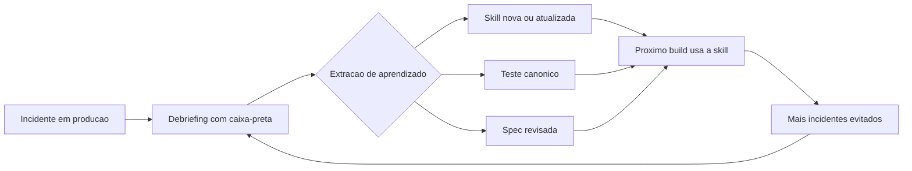

Como Comandante de Operações de Software, você reconhece o padrão: o ciclo se alimenta de si mesmo — cada voo ensina o próximo, e o manual nunca para de crescer [8].

## 4. Técnica

### O Registro de Incidentes como Dado Estruturado

O debriefing começa com a captura estruturada. O incidente vira um registro com causa, evidência e lição extraída:

```json
{
  "incidente": "fat-cupom-acumulativo",
  "data": "2026-07-18",
  "impacto": {"prejuizo_brl": 80000, "usuarios_afetados": 1240},
  "causa_raiz": "cupom de 30% acumulou com outro cupom de 30%",
  "porque_nao_foi_pego": "teste do agente cobria apenas caminho feliz; sem revisor adversarial",
  "evidencia": "relatorio_incidente_2026-07-18.log",
  "licoes": [
    {"tipo": "teste_canonico", "artefato": "test_cupom_acumulativo_nao_pode_empilhar"},
    {"tipo": "regra_negocio", "artefato": "spec_R12_cupons_nao_acumulativos"},
    {"tipo": "skill", "artefato": "skill_revisor-adversarial-cupons"}
  ]
}
```

O registro é o ponto de partida — mas só tem valor se as lições forem **executadas**, como mostrado a seguir [9].

### Convertendo Lição em Teste Canônico

A primeira execução da lição é o teste canônico — o cenário que nunca mais pode regredir:

```python
import unittest


class TesteCupomRegressao(unittest.TestCase):
    """Cenario canonico extraido do incidente fat-cupom-acumulativo."""

    def test_cupom_acumulativo_nao_pode_empilhar(self) -> None:
        carrinho = Carrinho()
        carrinho.aplicar(Cupom("BLACK30", percentual=30))
        with self.assertRaises(CupomAcumulativoProibido):
            carrinho.aplicar(Cupom("BLACK30", percentual=30))
        self.assertEqual(carrinho.desconto_total(), 30)


if __name__ == "__main__":
    unittest.main()
```

O teste canônico é a memória em código: mesmo que a equipe mude inteira, o cenário do incidente permanece protegido [10].

### Atualizando a Spec por Evidência

A lição também atualiza a spec — o contrato ganha o caso de borda que a realidade mostrou:

```yaml
espec:
  titulo: "Cupons de desconto"
  versao: "2.1"
  historico_revisao:
    - versao: "2.1"
      data: "2026-07-19"
      motivo: "incidente fat-cupom-acumulativo em producao"
  requisitos:
    R12: "Cupons de desconto nao acumulam entre si; o maior percentual prevalece"
  criterios_aceite:
    - "teste: cupom_acumulativo_nao_pode_empilhar -> passa"
```

A versão da spec carrega o motivo da revisão — o contrato evolui com rastreabilidade, não por capricho [4].

### Capturando a Skill de Aprendizado

A lição vira skill reutilizável — o conhecimento fica no repositório, carregado sob demanda:

```markdown
# Skill: verificar-cupons-nao-acumulativos

## Quando usar
Em toda implementacao ou revisao de regras de desconto.

## Procedimento
1. Liste todos os tipos de cupom aplicaveis a um carrinho.
2. Para cada par de cupons, verifique se o acumulo e permitido pela spec.
3. Se a spec silenciar, trate como PROIBIDO por padrao e registre excecao.
4. Gere o teste canonico de nao-acumulo para cada par.

## Origem
- Incidente: fat-cupom-acumulativo (2026-07-18).
```

A skill fecha o ciclo: o incidente produziu uma regra que o próximo agente carregará antes de tocar em descontos [5].

### Métricas do Aprendizado

O aprendizado precisa de régua. O painel abaixo compara ciclos:

```python
from dataclasses import dataclass


@dataclass
class Ciclo:
    id: str
    retrabalho_pct: float
    tokens_por_feature: int
    refutacoes_por_fase: int
    incidentes: int


CICLOS = [
    Ciclo("c1", retrabalho_pct=28.0, tokens_por_feature=95_000, refutacoes_por_fase=2, incidentes=3),
    Ciclo("c2", retrabalho_pct=19.0, tokens_por_feature=71_000, refutacoes_por_fase=5, incidentes=1),
    Ciclo("c3", retrabalho_pct=12.0, tokens_por_feature=58_000, refutacoes_por_fase=8, incidentes=0),
]


def tendencia(ciclos: list) -> None:
    for c in ciclos:
        print(f"{c.id}: retrabalho={c.retrabalho_pct}% tokens={c.tokens_por_feature} "
              f"refutacoes={c.refutacoes_por_fase} incidentes={c.incidentes}")


if __name__ == "__main__":
    tendencia(CICLOS)
```

O padrão visível: refutações por fase subindo, retrabalho e incidentes caindo — o radar está funcionando e o aprendizado está sendo aplicado [11].

### O Formato Padrão de Lições Aprendidas

A extração de lições precisa de formato padrão — senão cada debriefing produz uma lição diferente e incomparável. O formato abaixo é o padrão mínimo que a esteira consome:

```yaml
licao:
  id: "LIC-014"
  incidente: "fat-cupom-acumulativo"
  categoria: "regra_de_negocio"
  sintoma: "cupons de 30% acumularam e geraram prejuizo"
  causa: "regra de nao-acumulo nao declarada na spec"
  correcao: "spec R12 + teste canonico + skill verificadora"
  artefatos_gerados:
    - "test_cupom_acumulativo_nao_pode_empilhar"
    - "spec_v2.1_R12"
    - "skill_verificar-cupons"
  evidencia: "relatorio_incidente_2026-07-18.log"
```

O padrão permite agregação: as lições de todos os incidentes viram um banco pesquisável, e a esteira consulta o banco antes de cada nova fase — a memória em ação [19].

### O Modelo de Captura de Skills por Critério

Nem todo conhecimento vira skill — a captura segue critérios. O modelo abaixo define quando um procedimento merece virar skill:

| Critério | Pergunta | Exemplo aprovado | Exemplo reprovado |
|----------|----------|------------------|-------------------|
| Recorrência | Acontece mais de uma vez? | Regra de cupom | Incidente único de infra |
| Custo do erro | Errar é caro? | Migração de schema | Renome de variável |
| Determinismo | O procedimento é repetível? | Verificação de não-acúmulo | Diagnóstico criativo |
| Injetável | O agente pode carregar sob demanda? | Checklist de refutação | Conhecimento tácito do time |

A régua de captura evita a inflação de skills — o banco de procedimentos que ninguém carrega porque são genéricos demais. A skill nasce do incidente específico e reutilizável, não da generalidade abstrata [27].

### O Modelo de Retrospectiva Quantitativa

O debriefing quantitativo compara ciclos com métricas — a retrospectiva que mostra tendência em vez de opinião. O modelo abaixo é o painel retrospectivo do time:

| Métrica | Ciclo 1 | Ciclo 2 | Ciclo 3 | Tendência desejada |
|---------|---------|---------|---------|--------------------|
| Retrabalho (%) | 28 | 19 | 12 | ↓ |
| Tokens por feature | 95K | 71K | 58K | ↓ |
| Refutações por fase | 2 | 5 | 8 | ↑ (radar ativo) |
| Incidentes em produção | 3 | 1 | 0 | ↓ |
| Tempo médio de ciclo (dias) | 14 | 11 | 9 | ↓ |

O padrão revela a virtude do radar: refutações subindo e incidentes caindo não são contraditórios — são o radar funcionando. A retrospectiva quantitativa é o instrumento que transforma o debriefing em gestão: o time debate números, não narrativas [26].

### O Modelo de Causa Raiz com Cinco Porquês

O debriefing exige chegar à causa raiz — e a técnica dos cinco porquês é o instrumento. Vamos aplicá-la ao incidente do cupom:

1. **Por que o cupom acumulou?** Porque não havia regra de não-acúmulo.
2. **Por que não havia regra?** Porque a spec não declarava o comportamento de acúmulo.
3. **Por que a spec não declarava?** Porque o caso de borda nunca foi levantado na elicitação.
4. **Por que nunca foi levantado?** Porque o fluxo de spec não tinha checklist de casos de borda por regra de negócio.
5. **Por que o fluxo não tinha o checklist?** Porque o processo foi desenhado antes do padrão de incidentes de regra de negócio.

O quinto porquê revela a causa estrutural — e a causa estrutural é o que vira lição executável: o fluxo de spec ganha o checklist de casos de borda por regra de negócio. A técnica é simples, mas muda o alvo da correção: do sintoma (cupom) para o processo (spec) [25].

### O Modelo de Taxonomia de Incidentes

Incidentes precisam de taxonomia — sem ela, o banco de lições é um amontoado incomparável. O modelo abaixo classifica cada incidente em categoria, severidade e causa raiz, permitindo agregar por dimensão:

```python
CATEGORIAS = ['falha_dados', 'falha_regra', 'falha_integracao', 'falha_operacao']

def classificar_incidente(descricao):
    desc = descricao.lower()
    if 'schema' in desc or 'migracao' in desc:
        categoria = 'falha_dados'
    elif 'regra' in desc or 'calcul' in desc:
        categoria = 'falha_regra'
    elif 'api' in desc or 'servico' in desc:
        categoria = 'falha_integracao'
    else:
        categoria = 'falha_operacao'
    return {'categoria': categoria, 'descricao': descricao[:60]}

print(classificar_incidente('cupom acumulativo violou regra de calculo no modulo de pagamentos'))
```

Com a taxonomia aplicada, a agregação por categoria vira o painel que o comandante precisa: se 60% dos incidentes do trimestre são falha_regra, o investimento vai para testes de regra; se são falha_integracao, vai para testes de contrato. A classificação é determinística e barata, e cada categoria mapeia para um tipo de refutação preventiva — o banco de lições deixa de ser repositório de histórias e vira alocador de investimento.

### O Registro de Skills Capturadas

Vamos percorrer o ciclo completo de debriefing com o incidente que já apareceu nos capítulos anteriores — o cupom acumulativo de 30% mais 30% que gerou R$ 80 mil de prejuízo. O fluxo do fim ao início:

1. **Dia 0 — Incidente**: cupom acumula, prejuízo registrado, hotfix aplicado.
2. **Dia 1 — Registro estruturado**: causa raiz (regra de não-acúmulo ausente), por que não foi pego (teste só cobria caminho feliz), evidência (log do incidente).
3. **Dia 2 — Extração de lições**: teste canônico, spec R12 revisada, skill verificadora.
4. **Ciclo seguinte — Prevenção**: o build de cupons carrega a skill; o CI roda o teste canônico; a spec v2.1 é a fonte do contrato.

O diagrama abaixo mostra o ciclo de aprendizado com o incidente como exemplo:

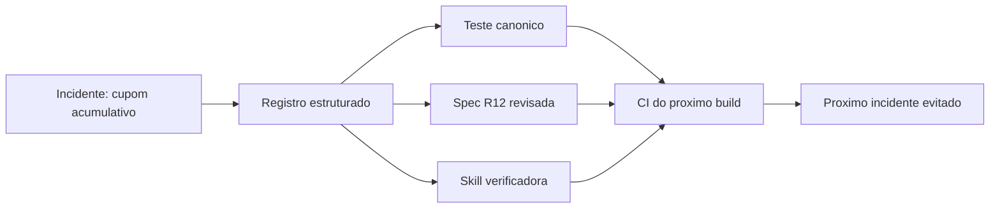

O exemplo mostra a diferença entre corrigir e aprender: corrigir apaga o sintoma; aprender apaga a classe inteira de sintomas — e é isso que o debriefing do AI-first faz [24].

### O Registro de Skills Capturadas

O debriefing produz skills — e cada skill capturada precisa de registro de origem, uso e resultado. O registro abaixo é a trilha da memória:

```json
{
  "skills_capturadas": [
    {
      "id": "skill-cupons-nao-acumulativos",
      "origem": "incidente fat-cupom-acumulativo",
      "data": "2026-07-19",
      "procedimento": "listar pares de cupons e verificar acumulo contra spec",
      "ativo": true,
      "uso_por_fase": {"build": 12, "verificar": 18},
      "resultado": "0 incidentes de acumulo desde a captura"
    }
  ]
}
```

O registro de skills é o manual vivo da torre: cada procedimento capturado tem origem rastreável e resultado mensurável — a skill que não produz resultado é reavaliada, nunca mantida por apego [23].

### O Modelo de Priorização de Incidentes por Risco

Nem todo incidente merece a mesma resposta. O modelo abaixo classifica o incidente por severidade e impacto de negócio, devolvendo a prioridade de investigação:

```python
def priorizar_incidente(severidade, impacto, usuarios_afetados):
    score = severidade * 2 + impacto * 3
    if usuarios_afetados > 10000:
        score += 5
    if score >= 12:
        prioridade = 'critica'
    elif score >= 7:
        prioridade = 'alta'
    elif score >= 3:
        prioridade = 'media'
    else:
        prioridade = 'baixa'
    return {'score': score, 'prioridade': prioridade}

print(priorizar_incidente(severidade=4, impacto=4, usuarios_afetados=15000))
```

A priorização explícita evita o viés do último grito: incidente barulhento de poucos usuários não rouba a fila de um incidente silencioso de muitos. O mesmo modelo alimenta o backlog de aprendizado — incidentes de alta prioridade viram candidatos a lição, incidentes de baixa prioridade são registrados e observados. A disciplina de classificar tudo, mesmo o que não será resolvido hoje, é o que mantém o banco de incidentes confiável como fonte de verdade.

### O Banco de Lições como Fonte Consultável

A revisão de specs por evidência segue um ciclo disciplinado — não é um capricho editorial. O ciclo técnico tem cinco passos, cada um com artefato:

1. **Coleta de evidência**: incidentes, testes canônicos, métricas de produção.
2. **Análise de lacuna**: qual requisito da spec falhou em prever a realidade.
3. **Proposta de revisão**: nova redação do requisito + novo caso de borda.
4. **Validação por refutação**: o revisor adversarial tenta quebrar a proposta.
5. **Publicação versionada**: nova versão da spec com histórico de motivo.

O padrão abaixo é o esquema da revisão versionada:

```json
{
  "spec": "cupons-desconto",
  "versoes": [
    {"versao": "2.0", "data": "2026-05-01", "motivo": "publicacao inicial"},
    {"versao": "2.1", "data": "2026-07-19",
     "motivo": "incidente fat-cupom-acumulativo: regra de nao-acumulo ausente",
     "requisitos_alterados": ["R12"],
     "evidencia": ["relatorio_incidente_2026-07-18.log", "test_cupom_acumulativo"]}
  ]
}
```

A revisão por evidência é a diferença entre spec que evolui e spec que envelhece: cada versão carrega o motivo e a evidência — o contrato nunca muda sem justificativa rastreável [21].

### O Modelo de Retenção de Lições por Idade

Lições envelhecem — o que era verdade há um ano pode ser ruído hoje. O modelo abaixo aplica janela de retenção e promove ou aposenta cada lição:

```python
from datetime import datetime, timedelta

def retencao_licoes(licoes, hoje, janela_dias=365):
    validas = []
    aposentadas = []
    for l in licoes:
        idade = (hoje - l['registrada_em']).days
        if idade <= janela_dias and l['usos'] >= 1:
            validas.append(l)
        else:
            aposentadas.append({'id': l['id'], 'motivo': 'idade' if idade > janela_dias else 'sem_uso'})
    return {'validas': [l['id'] for l in validas], 'aposentadas': aposentadas}

hoje = datetime(2026, 8, 1)
licoes = [
    {'id': 'LIC-001', 'registrada_em': datetime(2025, 6, 1), 'usos': 4},
    {'id': 'LIC-050', 'registrada_em': datetime(2024, 3, 1), 'usos': 0},
]
print(retencao_licoes(licoes, hoje))
```

A retenção mantém o banco de lições enxuto e confiável: lição usada e recente permanece, lição velha ou sem uso é aposentada com motivo registrado. Um banco de lições que cresce sem limite vira cemitério de boas intenções — ninguém confia em base que não é curada. A aposentadoria também é dado: se muitas lições de uma área morrem sem uso, aquela área não está aprendendo.

### A Priorização de Lições por Impacto

Nem toda lição merece virar skill na hora — o banco de lições precisa de priorização. O modelo de impacto abaixo classifica as lições pelo custo de ignorar:

```python
def priorizar_licoes(licoes: list) -> list:
    """Prioriza licoes por (frequencia x severidade)."""
    for l in licoes:
        l["score"] = l.get("frequencia", 1) * l.get("severidade", 1)
    return sorted(licoes, key=lambda l: -l["score"])


LICOES = [
    {"id": "LIC-014", "frequencia": 3, "severidade": 5, "sintoma": "cupom acumulativo"},
    {"id": "LIC-007", "frequencia": 1, "severidade": 2, "sintoma": "doc desatualizada"},
    {"id": "LIC-021", "frequencia": 4, "severidade": 4, "sintoma": "sessao nao expira"},
]

for l in priorizar_licoes(LICOES):
    print(f"{l['id']} score={l['score']}: {l['sintoma']}")
```

A priorização garante que o debriefing gaste energia onde o retorno é maior: a lição frequente e severa vira skill imediatamente; a lição rara e leve aguarda a próxima iteração [22].

### O Banco de Lições como Fonte Consultável

O banco de lições só tem valor se for consultável por máquina. O trecho abaixo busca lições por categoria e injeta no contexto do agente antes do build:

```python
import json
from pathlib import Path


def carregar_licoes(caminho: str) -> list:
    return json.loads(Path(caminho).read_text(encoding="utf-8"))["licoes"]


def buscar_licoes(licoes: list, categorias: list, topo: int = 3) -> list:
    relevantes = [l for l in licoes if l["categoria"] in categorias]
    return relevantes[:topo]


LICOES = carregar_licoes("banco_licoes.json")
contexto = buscar_licoes(LICOES, ["regra_de_negocio"])
for l in contexto:
    print(f"[MEMORIA] {l['id']}: {l['sintoma']} -> {l['correcao']}")
```

O padrão é o mesmo da torre: antes de cada novo voo, o piloto consulta as lições de voos anteriores — o manual de operações em forma de banco de dados [20].

### O Modelo de Verificação de Lição Aplicada

Uma lição registrada que nunca vira mudança é ruído. O modelo abaixo rastreia cada lição até a mudança de código que a implementa, verificando se o fix realmente entrou no repositório:

```python
class RastreadorDeLicoes:
    def __init__(self):
        self.licoes = {}

    def registrar(self, id_licao, fix_commit):
        self.licoes[id_licao] = {'fix_commit': fix_commit, 'aplicada': False}

    def verificar(self, id_licao, branch, commits_existentes):
        fix = self.licoes[id_licao]['fix_commit']
        self.licoes[id_licao]['aplicada'] = fix in commits_existentes and branch == 'main'
        return self.licoes[id_licao]

    def nao_aplicadas(self):
        return [k for k, v in self.licoes.items() if not v['aplicada']]

r = RastreadorDeLicoes()
r.registrar('LIC-014', 'a1b2c3')
print(r.verificar('LIC-014', 'feature/cupom', ['a1b2c3']))
print(r.nao_aplicadas())
```

O rastreamento expõe a mentira mais comum da retrospectiva: "aprendemos a lição" — mas o commit nunca entrou na main. Quando a lição fica marcada como não aplicada, ela volta para o backlog de trabalho com o mesmo peso de um bug aberto. É a diferença entre memória e aprendizado: memória é registrar, aprendizado é verificar.

### O Debriefing como Rotina, Não Evento

O debriefing funciona quando vira rotina leve, não evento pesado. A cadência prática é: registro do incidente no mesmo dia, extração das lições em 48 horas e revisão das lições no fim do ciclo — não em uma reunião de 3 horas após o caos [15]. Cada incidente registrado encurta o próximo debriefing, porque a memória acumulada reduz o tempo de diagnóstico. A caixa-preta — logs estruturados do agente e do software — é o que torna o debriefing possível sem depender da memória humana, que distorce com o tempo [16].

### O Modelo de Propagação de Lições entre Times

A lição aprendida num time é desperdício se não chega aos outros. O modelo abaixo registra a propagação de cada lição, verificando quais times já a receberam e incorporaram:

```python
class PropagadorDeLicoes:
    def __init__(self, times):
        self.times = times
        self.recebidas = {t: [] for t in times}

    def publicar(self, id_licao, destinatarios):
        for t in destinatarios:
            self.recebidas[t].append(id_licao)
        return {'publicada': id_licao, 'times': destinatarios}

    def cobertura(self, id_licao):
        com = sum(1 for t, l in self.recebidas.items() if id_licao in l)
        return {'times_com': com, 'times_total': len(self.times), 'cobertura_pct': round(com / len(self.times), 2)}

p = PropagadorDeLicoes(['cobranca', 'catalogo', 'relatorios'])
p.publicar('LIC-014', ['cobranca', 'catalogo'])
print(p.cobertura('LIC-014'))
```

A cobertura de 66% mostra o furo: a lição do cupom chegou à cobrança e ao catálogo, mas o time de relatórios — que mexe com as mesmas regras — não recebeu. O modelo transforma "compartilhar lição" de ato social em verificação: toda lição tem destinatários explícitos e o painel mostra quem ficou de fora. O silo de conhecimento é a falha silenciosa do aprendizado organizacional, e a única defesa é medir a propagação.

### A Lista de Verificação do Aprendizado

O ciclo de aprendizado fecha com verificação: a lição foi registrada no formato padrão, foi priorizada por impacto, foi convertida em teste ou mudança, foi aplicada na main e foi propagada aos times afetados. Cinco caixas, cinco vereditos — o relatório de aprendizado da iteração mostra quantas caixas foram marcadas. Quando a taxa de conclusão cai, o problema não é falta de vontade de aprender, é o processo de aprendizado que está furado. Verificar o aprendizado é o último passo do ciclo e o primeiro do próximo.

### A Memória de Erros como Artefato Compartilhado

A memória de erros recorrentes só tem valor se for consultada. O registro vira artefato compartilhado — uma base de erros de build, tipo, runtime e processo que o próximo agente consulta antes de agir [17]. No ciclo de vida, a memória é o manual de operações da torre: cada erro documentado com sintoma, causa e correção evita que o mesmo voo desvie pela mesma razão [18].

### O Ritual de Fechamento do Ciclo

Todo ciclo de aprendizado termina com um ritual de fechamento: o relatório de lições é apresentado, as lições aplicadas são demonstradas e as lições não aplicadas recebem dono e prazo. O ritual é curto, quinzenal e obrigatório — sem reunião extra, sem slide decorativo. O fechamento é o momento em que o ciclo se prova: se as lições da quinzena viraram mudanças de código, o ciclo fechou; se viraram promessa, o ciclo não fechou e o problema é do processo, não do time.

### A Cultura do Erro como Dado

O aprendizado organizacional depende de uma cultura que trata o erro como dado, não como culpa. O debriefing só funciona quando o participante não teme ser punido por descrever o que aconteceu — e isso se constrói com ritual, não com discurso: o debriefing é sempre sem culpabilização, sempre com o objetivo declarado de mudar o processo, e sempre com a lição registrada publicamente. Quando o time vê que a lição da semana passada virou mudança de código esta semana, o relato honesto vira o comportamento racional. Cultura de erro é a infraestrutura invisível do banco de lições.

### Passos para Instalar o Debriefing

1. **Padronize o registro de incidentes** — causa, evidência, lições, com JSON estruturado.
2. **Converta cada lição em teste canônico** — código que protege o cenário.
3. **Atualize a spec por evidência** — com versão e motivo da revisão.
4. **Capture a skill** quando a lição for reutilizável.
5. **Meça a tendência** entre ciclos: retrabalho, tokens e refutações [12].

## 5. Aplica

Cena real, em segunda pessoa. Sua organização sofreu o incidente do cupom acumulativo — R$ 80 mil em prejuízo. O time apaga o incêndio, corrige o bug e segue para a próxima feature. Três meses depois, um incidente estruturalmente idêntico acontece em outra feature: duas regras de negócio que se sobrepõem, silenciosas, sem teste canônico, sem revisor adversarial.

O erro não foi o bug do cupom. O erro foi o debriefing ausente. O incidente foi resolvido como incidente, não tratado como dado de aprendizado. Nenhum teste canônico foi criado, nenhuma spec foi atualizada, nenhuma skill capturou o padrão "regras de negócio que se sobrepõem silenciam por padrão".

O diagnóstico, ligado à teoria: incidente sem extração é experiência perdida — e o AI-first multiplica a velocidade com que a experiência perdida vira retrabalho.

A correção prática:

1. **Registre o incidente em JSON estruturado** no dia seguinte — causa raiz, evidência, por que não foi pego.
2. **Extraia as lições imediatamente**: teste canônico, revisão da spec, skill se aplicável.
3. **Injete a skill no contexto dos agentes** que tocarão regras de negócio — a memória vira comportamento.
4. **Meça no trimestre seguinte** se o padrão se repete — retrabalho, tokens e incidentes por ciclo.

Armadilhas comuns: debriefing sem evidência (reunião sem caixa-preta é opinião); lições que não viram artefato (a ação de melhoria que ninguém cumpre); e capturar skill demais (skill genérica demais não é carregada — capture o específico reutilizável) [13].

## 6. Conclusão

Você fechou o ciclo. Três marcos: primeiro, o incidente como dado estruturado — registro com causa, evidência e lições, não cerimônia; segundo, a execução das lições em artefatos — teste canônico, spec revisada com rastreabilidade e skill reutilizável; terceiro, a metrificação do aprendizado — refutações, retrabalho e tokens por ciclo mostrando a tendência.

Como desafio, faça o debriefing do último incidente da sua equipe: registre em JSON, extraia uma lição executável e capture a skill. Em seguida, compare com o próximo ciclo para ver a tendência.

No próximo capítulo, você entra na Parte V e na disciplina que sustenta todo o ciclo: a economia de tokens e o custo de contexto — o combustível que decide se o voo chega ao destino [14].

## 7. Referências Bibliográficas

[1] GURGUL, Vincent; GUBELA, Robin; LESSMANN, Stefan. *The State of Generative AI in Software Development: Insights from Literature and a Developer Survey.* 2026. Disponível em: https://arxiv.org/abs/2603.16975. Acesso em: 02 ago. 2026.
[2] SRE. *Site Reliability Engineering.* Google, 2016. Disponível em: https://sre.google/sre-book. Acesso em: 02 ago. 2026.
[3] ROYCHOUDHURY, Abhik et al. *Agentic Software Engineering: state and perspectives.* 2025. Disponível em: https://arxiv.org/abs/2509.09893. Acesso em: 02 ago. 2026.
[4] HODA, Rashina. *Toward Agentic Software Engineering Beyond Code: Framing Vision, Values, and Vocabulary.* ICSE 2026 Workshop. Disponível em: https://arxiv.org/abs/2510.19692. Acesso em: 02 ago. 2026.
[5] JIN, Haolin et al. *From LLMs to LLM-based Agents for Software Engineering: A Survey of Current, Challenges and Future.* 2025. Disponível em: https://arxiv.org/abs/2408.02479. Acesso em: 02 ago. 2026.
[6] GOOGLE CLOUD. *State of AI-assisted Software Development (DORA 2025).* Disponível em: https://dora.dev/research/. Acesso em: 02 ago. 2026.
[7] MOHAGHEGHI, Milad et al. *Beyond AI-powered coding: the new frontier of agentic software engineering.* 2025. Disponível em: https://arxiv.org/abs/2509.14838. Acesso em: 02 ago. 2026.
[8] MICROSOFT. *An AI led SDLC: Building an End-to-End Agentic Software Development Lifecycle with Azure and GitHub.* Microsoft Tech Community, 2026. Disponível em: https://techcommunity.microsoft.com/blog/appsonazureblog/an-ai-led-sdlc-building-an-end-to-end-agentic-software-development-lifecycle-wit/4491896. Acesso em: 02 ago. 2026.
[9] GRÖPLER, Robin et al. *The Future of Generative AI in Software Engineering: A Vision from Industry and Academia in the European GENIUS Project.* IEEE/ACM AIware, 2025. Disponível em: https://arxiv.org/abs/2511.01348. Acesso em: 02 ago. 2026.
[10] BECK, Kent. *Test-Driven Development: By Example.* Boston: Addison-Wesley, 2002. Disponível em: https://www.informit.com. Acesso em: 02 ago. 2026.
[11] FORSGREN, Nicole; HUMBLE, Jez; KIM, Gene. *Accelerate: The Science of Lean Software and DevOps.* Portland: IT Revolution Press, 2018. Disponível em: https://itrevolution.com. Acesso em: 02 ago. 2026.
[12] ANTHROPIC. *Building effective agents.* Disponível em: https://www.anthropic.com/research/building-effective-agents. Acesso em: 02 ago. 2026.
[13] HINGEL, Paula. *How AI Changes the SDLC: A Six-Stage Guide.* Augment Code, 2026. Disponível em: https://www.augmentcode.com/guides/how-ai-changes-the-sdlc. Acesso em: 02 ago. 2026.
[14] WANG, Yuchen; GUO, Shangxin; TAN, Chee Wei. *From Code Generation to Software Testing: AI Copilot with Context-Based RAG.* 2025. Disponível em: https://arxiv.org/abs/2504.01866. Acesso em: 02 ago. 2026.
[15] FORSGREN, Nicole; HUMBLE, Jez; KIM, Gene. *Accelerate: The Science of Lean Software and DevOps.* Portland: IT Revolution Press, 2018. Disponível em: https://itrevolution.com. Acesso em: 02 ago. 2026.
[16] GRÖPLER, Robin et al. *The Future of Generative AI in Software Engineering: A Vision from Industry and Academia in the European GENIUS Project.* IEEE/ACM AIware, 2025. Disponível em: https://arxiv.org/abs/2511.01348. Acesso em: 02 ago. 2026.
[17] JIN, Haolin et al. *From LLMs to LLM-based Agents for Software Engineering: A Survey of Current, Challenges and Future.* 2025. Disponível em: https://arxiv.org/abs/2408.02479. Acesso em: 02 ago. 2026.
[18] MOHAGHEGHI, Milad et al. *Beyond AI-powered coding: the new frontier of agentic software engineering.* 2025. Disponível em: https://arxiv.org/abs/2509.14838. Acesso em: 02 ago. 2026.
[19] HODA, Rashina. *Toward Agentic Software Engineering Beyond Code: Framing Vision, Values, and Vocabulary.* ICSE 2026 Workshop. Disponível em: https://arxiv.org/abs/2510.19692. Acesso em: 02 ago. 2026.
[20] ROYCHOUDHURY, Abhik et al. *Agentic Software Engineering: state and perspectives.* 2025. Disponível em: https://arxiv.org/abs/2509.09893. Acesso em: 02 ago. 2026.
[21] GRÖPLER, Robin et al. *The Future of Generative AI in Software Engineering: A Vision from Industry and Academia in the European GENIUS Project.* IEEE/ACM AIware, 2025. Disponível em: https://arxiv.org/abs/2511.01348. Acesso em: 02 ago. 2026.
[22] GURGUL, Vincent; GUBELA, Robin; LESSMANN, Stefan. *The State of Generative AI in Software Development: Insights from Literature and a Developer Survey.* 2026. Disponível em: https://arxiv.org/abs/2603.16975. Acesso em: 02 ago. 2026.
[23] HODA, Rashina. *Toward Agentic Software Engineering Beyond Code: Framing Vision, Values, and Vocabulary.* ICSE 2026 Workshop. Disponível em: https://arxiv.org/abs/2510.19692. Acesso em: 02 ago. 2026.
[24] ROYCHOUDHURY, Abhik et al. *Agentic Software Engineering: state and perspectives.* 2025. Disponível em: https://arxiv.org/abs/2509.09893. Acesso em: 02 ago. 2026.
[25] FORSGREN, Nicole; HUMBLE, Jez; KIM, Gene. *Accelerate: The Science of Lean Software and DevOps.* Portland: IT Revolution Press, 2018. Disponível em: https://itrevolution.com. Acesso em: 02 ago. 2026.
[26] GOOGLE CLOUD. *State of AI-assisted Software Development (DORA 2025).* Disponível em: https://dora.dev/research/. Acesso em: 02 ago. 2026.
[27] ROYCHOUDHURY, Abhik et al. *Agentic Software Engineering: state and perspectives.* 2025. Disponível em: https://arxiv.org/abs/2509.09893. Acesso em: 02 ago. 2026.


# Parte V — O Comandante — Governança e Futuro

# Capítulo 9: Combustível: Economia de Tokens e Custo de Contexto

## 1. Introdução

No Capítulo 8, você fez o debriefing do voo e aprendeu a transformar incidentes em skill, teste canônico e spec revisada. Agora você entra na Parte V — e na disciplina que decide se o voo chega ao destino: o combustível. Tokens são o recurso escasso do SDLC AI-first, e a economia de contexto é a engenharia que mantém o ciclo vivo dentro dos limites de uma sessão.

Este capítulo ensina a tratar tokens, rate limits e custo de contexto como variáveis de projeto: medir o consumo, comprimir o que é ruído, delegar a subagentes enxutos e projetar handoffs que estendem a vida útil do ciclo. Você vai sair com um orçamento de contexto — e os instrumentos para não estourá-lo.

## 2. Explica

Um token é a unidade básica que um modelo de linguagem processa — aproximadamente uma sílaba de uma palavra em português, uma fração de palavra em inglês. Cada interação com um agente consome tokens de entrada (o contexto que você envia) e de saída (a resposta que ele produz). Quando a conversa cresce, o contexto cresce junto — e o custo de cada turno seguinte também [1].

O rate limit é a parede dura: cada provedor impõe um teto de tokens por minuto e por dia. Quando a sessão do agente estoura o teto, a execução trava — e o trabalho em andamento fica órfão. No SDLC AI-first, o rate limit não é um problema de infraestrutura; é uma **restrição de design do ciclo de vida**: cada fase deve caber no orçamento de contexto disponível [2].

A janela de contexto é o espaço da sessão: quantos tokens o modelo "lembra" em uma conversa. Sessões longas degeneram de duas formas: o contexto enche (e o agente esquece o início) ou o custo explode (cada turno reprocessa todo o histórico). A economia de contexto é a engenharia que evita as duas — mantendo a sessão magra e o histórico no lugar certo [3].

A primeira técnica é a **seleção cirúrgica**: carregar no contexto apenas o que a fase precisa. Antes de ler um arquivo, busque (grep) o que procura; antes de injetar um relatório, injete o resumo; antes de dar o código inteiro ao agente, dê a interface. O princípio é o mesmo do lean manufacturing: nada de estoque (contexto) parado [4].

A segunda técnica é a **compressão de logs**: saídas de comando com mais de algumas linhas são reduzidas a um resumo representativo — cabeçalho e rodapé — preservando o sinal e descartando o ruído. Logs de build, testes e infraestrutura são os maiores consumidores silenciosos de contexto; comprimi-los é a maior economia imediata [5].

A terceira técnica é a **comunicação telegráfica entre agentes**: subagentes se reportam ao orquestrador com resumos compactos, não com transcrições. A delegação caveman — instruções mínimas, relatórios mínimos — reduz o contexto em uma ordem de grandeza quando há muitos subagentes em paralelo [6].

A quarta técnica é o **handoff**: quando a sessão está perto do limite, o trabalho é compactado em um documento de transferência — contexto, decisões, pendências — e um novo agente/sessão continua de onde parou. O handoff transforma o limite da janela de contexto de uma fatalidade em uma transição de projeto [7].

Por fim, a quinta técnica é o **subagente enxuto**: tarefas de busca e edição extensa são delegadas a subagentes que retornam apenas o resultado, não o processo. O orquestrador nunca vê os bastidores — economizando dezenas de milhares de tokens por delegação [8].

## 3. Ilustra

Um voo comercial calcula combustível com precisão cirúrgica: o combustível necessário para a rota, mais a reserva legal, mais o alternate. Nenhum piloto enche o tanque "só por garantia" — excesso de peso custa caro. E nenhum piloto decola com combustível de menos — o alternate existe para o caso de desvio.

O contexto é o combustível do voo agêntico. O necessário para a rota é o contexto mínimo da fase. A reserva é a margem para correções inesperadas. E o alternate é o handoff — o plano de desvio quando a sessão não alcança o destino.

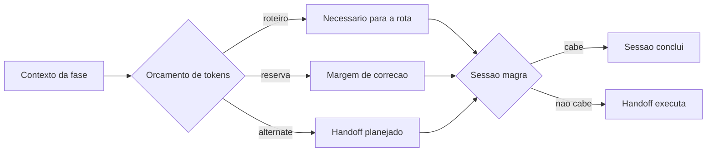

Como Comandante de Operações de Software, você adota a régua do combustível: carregar o necessário, reservar a margem e sempre ter o alternate desenhado [9].

## 4. Técnica

### Medindo o Consumo de Contexto

Nada de economia sem medição. O instrumento abaixo estima o custo de uma sessão com base em tokens e preço:

```python
from dataclasses import dataclass


@dataclass
class OrcamentoSessao:
    nome: str
    tokens_entrada: int = 0
    tokens_saida: int = 0

    def registrar(self, entrada: int, saida: int) -> None:
        self.tokens_entrada += entrada
        self.tokens_saida += saida

    def custo_estimado(self, preco_entrada_por_milhao: float = 0.25,
                       preco_saida_por_milhao: float = 1.25) -> float:
        custo_entrada = self.tokens_entrada / 1_000_000 * preco_entrada_por_milhao
        custo_saida = self.tokens_saida / 1_000_000 * preco_saida_por_milhao
        return round(custo_entrada + custo_saida, 4)

    def resumo(self) -> str:
        return (f"{self.nome}: {self.tokens_entrada + self.tokens_saida} tokens "
                f"(entrada={self.tokens_entrada}, saida={self.tokens_saida}) "
                f"custo=US$ {self.custo_estimado()}")


sessao = OrcamentoSessao("build-pagamentos")
sessao.registrar(entrada=48_000, saida=6_500)
print(sessao.resumo())
```

A métrica por fase alimenta a Fase 8 (Evoluir): a spec que consumiu 48 mil tokens de entrada pode ser redigida com um contexto mais enxuto na próxima iteração [10].

### Seleção Cirúrgica: Grep Antes de Read

A técnica mais barata é não carregar o que não precisa. O padrão operacional:

```bash
# EM VEZ DE: ler o arquivo inteiro (muitos tokens)
# FAÇA: buscar primeiro o que procura
grep -n "ProvedorPagamento" src/pagamentos/ -r | head -20

# EM VEZ DE: abrir o relatorio completo no contexto
# FAÇA: extrair apenas o resumo
python - <<'PY'
import json
with open("output/livros/sdlc-ai-first/revisao/relatorio_auditoria.json",
          encoding="utf-8") as f:
    relatorio = json.load(f)
for r in relatorio["requisitos"]:
    status = "OK" if r["conforme"] else "FALHA"
    print(f"[{status}] {r['id']} {r['nome']}")
PY
```

O padrão grep-antes-de-read reduz o contexto de arquivos grandes em uma ordem de grandeza — e é a técnica com melhor retorno por esforço [4].

### Compressão de Logs

Logs de build e teste são os maiores ruídos. A compressão 3+4 preserva o sinal:

```python
def comprimir_log(saida: str, cabeca: int = 3, cauda: int = 4) -> str:
    """Comprime log longo preservando inicio e fim (onde estao o resumo e o erro)."""
    linhas = [l for l in saida.splitlines() if l.strip()]
    if len(linhas) <= cabeca + cauda + 2:
        return saida
    return "\n".join(
        linhas[:cabeca] + [f"... ({len(linhas) - cabeca - cauda} linhas omitidas)"] + linhas[-cauda:]
    )


LOG_GRANDE = "\n".join(f"linha {i}" for i in range(1, 60))
print(comprimir_log(LOG_GRANDE))
```

O resultado: 59 linhas viram 9 — o sinal (início e erro no fim) preservado, o ruído descartado [5].

### Handoff: O Alternate da Sessão

Quando a sessão aproxima o limite, o handoff compacta o estado:

```markdown
# Handoff: build-pagamentos (sessao 3)

## Estado
- Spec aprovada (v2.1); interfaces definidas (contrato/interface.ts).
- Cap 3 e 4 concluidos; build em andamento no modulo de pagamentos.
- Evidencia: 4 testes verdes, 0 falhas; CI rodando.

## Decisoes
- Fatura versionada (ADR-007); nao atualizar in-place.
- Cupom nao acumulativo (spec R12).

## Pendencias
- Implementar estorno com idempotencia (ticket T7).
- Revisar cobertura do caso de borda fatura-duplicada.

## Instrucoes para o proximo agente
1. Retomar do ticket T7.
2. Consultar a skill verificar-cupons-nao-acumulativos antes de tocar em descontos.
3. Manter o mesmo vocabulario ubiquo (cliente, fatura, reembolso).
```

O handoff é o alternate: o voo desvia, mas não cai — a sessão nova decola do ponto exato [7].

### O Buffer de Rate Limit como Design

O rate limit diário é uma restrição de capacidade — como o tanque de combustível do avião. O design da esteira deve declarar o orçamento diário e distribuí-lo entre as fases, com buffer de emergência:

```json
{
  "orcamento_diario_tokens": 900000,
  "alocacao": {
    "pesquisa": 50000,
    "spec": 60000,
    "design": 40000,
    "build": 500000,
    "verificar": 100000,
    "derivados": 100000
  },
  "buffer_emergencia": 50000,
  "regras": [
    "fase excede alocacao -> interromper e handoff",
    "buffer de emergencia so com autorizacao humana",
    "rate limit atingido -> pausar com backoff, nunca abortar"
  ]
}
```

O orçamento declarado transforma o rate limit de fatalidade em projeto: a esteira sabe, antes de começar, quantos tokens cada fase pode gastar — e onde parar com dignidade, em vez de morrer no meio [18].

### O Modelo de Orçamento por Fase com Teto

O orçamento de contexto não é global — ele é distribuído por fase, com teto para cada uma. O modelo abaixo aloca o orçamento e recusa novas tarefas quando a fase estoura o teto:

```python
class OrcamentoPorFase:
    def __init__(self, tetos):
        self.tetos = tetos
        self.gastos = {f: 0 for f in tetos}

    def gastar(self, fase, tokens):
        if self.gastos[fase] + tokens > self.tetos[fase]:
            return {'permitido': False, 'teto': self.tetos[fase], 'gasto': self.gastos[fase]}
        self.gastos[fase] += tokens
        return {'permitido': True, 'restante': self.tetos[fase] - self.gastos[fase]}

    def relatorio(self):
        return {f: {'gasto': g, 'teto': self.tetos[f], 'uso': round(g / self.tetos[f], 2)} for f, g in self.gastos.items()}

orcamento = OrcamentoPorFase({'redacao': 120000, 'revisao': 40000, 'compilacao': 20000})
print(orcamento.gastar('redacao', 50000))
print(orcamento.gastar('redacao', 90000))
print(orcamento.relatorio())
```

O teto por fase impede o efeito dominó: se a redação estoura, a revisão e a compilação sofrem por tabela — mesmo que tenham orçamento próprio intacto. Quando o gastar() devolve permitido=False, o agente não improvisa: ele faz o handoff para a fase de corte com o relatório de consumo, e a priorização decide o que o contexto segura.

### O Custo do Contexto como Decisão de Fronteira

Nem todo contexto precisa ser reprocessado. O cache de contexto — resultados de fases anteriores reutilizados sem recarregar — é a técnica mais subestimada do AI-first:

```python
import hashlib
import json
from pathlib import Path
from typing import Optional


class CacheContexto:
    def __init__(self, raiz: Path) -> None:
        self.raiz = raiz
        self.raiz.mkdir(parents=True, exist_ok=True)

    def _chave(self, conteudo: str) -> str:
        return hashlib.sha256(conteudo.encode("utf-8")).hexdigest()[:16]

    def obter(self, conteudo: str) -> Optional[dict]:
        arquivo = self.raiz / f"{self._chave(conteudo)}.json"
        if arquivo.exists():
            return json.loads(arquivo.read_text(encoding="utf-8"))
        return None

    def gravar(self, conteudo: str, resultado: dict) -> None:
        arquivo = self.raiz / f"{self._chave(conteudo)}.json"
        arquivo.write_text(json.dumps(resultado, ensure_ascii=False),
                           encoding="utf-8")


cache = CacheContexto(Path(".cache_ctx"))
cache.gravar("spec-pagamentos-v2", {"resumo": "12 requisitos, 6 bordas", "tokens": 18400})
recuperado = cache.obter("spec-pagamentos-v2")
print(f"Cache hit: {recuperado}")
```

O cache é o reservatório da torre: o que já foi processado não é reprocessado — economizando os tokens que seriam gastos recalculando o mesmo resultado [19].

### O Custo do Contexto como Decisão de Fronteira

A economia de contexto também intersecta a cartografia do Capítulo 4: fronteiras bem desenhadas são a forma estrutural de economizar tokens [14]. Quando cada módulo expõe uma interface pequena, o agente que o consome carrega apenas a interface — não o módulo inteiro. A economia não é só tática (comprimir logs); é arquitetural (não precisar carregar o que não importa). O Comandante de Operações de Software desenha fronteiras pensando no combustível desde o design [15].

### A Contabilidade da Sessão

A disciplina do combustível exige contabilidade: cada sessão registra entrada, saída e o que ficou de fora. O orçamento de contexto de uma fase não é só o teto de tokens — é a lista explícita do que a fase **não** carrega [16]. Essa contabilidade vira insumo do debriefing do Capítulo 8: a sessão que gastou 50 mil tokens em contexto desnecessário é uma falha de processo, não de infraestrutura [17].

### O Modelo de Compressão Seletiva de Arquivos

Nem todo arquivo merece entrar inteiro no contexto. O modelo abaixo decide, por tipo de arquivo e fase, se o conteúdo entra integral, resumido ou nem entra:

```python
REGRAS_DE_COMPRESSAO = {
    'codigo_fonte': {'redacao': 'resumido', 'revisao': 'integral', 'compilacao': 'integral'},
    'json_estado': {'redacao': 'nao_entra', 'revisao': 'integral', 'compilacao': 'resumido'},
    'logs': {'redacao': 'nao_entra', 'revisao': 'cabecalho', 'compilacao': 'nao_entra'},
    'dossies': {'redacao': 'integral', 'revisao': 'resumido', 'compilacao': 'nao_entra'},
}

def decidir_leitura(tipo, fase):
    regra = REGRAS_DE_COMPRESSAO.get(tipo, {}).get(fase, 'resumido')
    return {'tipo': tipo, 'fase': fase, 'modo': regra}

for tipo in ['codigo_fonte', 'json_estado', 'logs', 'dossies']:
    print(decidir_leitura(tipo, 'redacao'))
```

A tabela materializa a seleção cirúrgica: na fase de redação, o dossiê entra integral (é a fonte das citações), o código entra resumido (só as assinaturas) e o log não entra (é barulho). Na fase de revisão, o código e o JSON de estado entram integrais porque é quando se verifica. A regra por fase é o que impede o agente de re-ler tudo a cada passo — o contexto é um recurso finito e cada leitura tem custo.

### O Exemplo Prático: Refatoração com Orçamento de Contexto

Vamos aplicar a economia de contexto em um caso real: refatorar um módulo legado de 40 mil linhas. A tentação é carregar tudo no contexto; a disciplina é carregar o mínimo. O plano de voo de contexto:

1. **Varredura por subagente enxuto**: um subagente mapeia o módulo (arquivos, dependências, funções públicas) e retorna apenas o mapa — nunca o código inteiro.
2. **Interface primeiro**: o agente de refatoração recebe as interfaces e os ADRs do módulo, não a implementação.
3. **RAG local**: consultas ao dossiê/índice retornam blocos específicos, nunca o arquivo inteiro.
4. **Handoff pré-desenhado**: o documento de transferência existe antes de a sessão começar.
5. **Monitor em tempo real**: o consumo por fase é exibido; ao cruzar 70% do teto, a sessão comprime.

O cálculo abaixo compara as duas abordagens:

```python
def comparar_abordagens(linhas_modulo: int, tokens_por_linha: float = 1.3) -> None:
    carga_integral = linhas_modulo * tokens_por_linha
    carga_cirurgica = carga_integral * 0.15  # interface + mapa + RAG
    economia = carga_integral - carga_cirurgica
    print(f"Carga integral : {carga_integral:,.0f} tokens".replace(",", "."))
    print(f"Carga cirurgica: {carga_cirurgica:,.0f} tokens".replace(",", "."))
    print(f"Economia       : {economia:,.0f} tokens ({economia/carga_integral*100:.0f}%)".replace(",", "."))


comparar_abordagens(linhas_modulo=40_000)
```

A economia de 85% não é mágica — é seleção cirúrgica aplicada: o agente só vê o que precisa para decidir, e o resto fica no repositório, não no contexto [23].

### O Alarme de Contexto no Ponto Certo

O alarme de contexto só ajuda se dispara no momento de decidir, não no momento do desastre. O ponto certo é antes da próxima ação cara: o alarme toca quando uma leitura grande está prestes a acontecer, quando uma nova busca vai começar ou quando a delegação vai ser disparada com o contexto cheio. Alarme que dispara no meio da ação inútil é ruído; alarme que dispara antes da decisão é conselho. O ajuste fino do ponto de disparo é feito com o histórico do monitor — o mesmo dado que mede o consumo ensina onde avisar.

### O Perfil de Consumo por Tipo de Fase

Nem toda fase consome o mesmo perfil de contexto. O Comandante conhece o perfil de cada fase para calibrar o orçamento:

| Fase | Perfil dominante | Estratégia de economia |
|------|------------------|------------------------|
| Pesquisa | Muitos tokens de entrada (fontes) | RAG local: busca por bloco, nunca o dossiê inteiro |
| Spec | Entrada média, escrita densa | Templates e glossário no contexto; nada de histórico |
| Build | Entrada e saída altas | Grep antes de read; interface em vez de implementação |
| Verificar | Entrada média (diffs) | Parecer estruturado; nunca o arquivo inteiro |
| Derivados | Entrada alta (obra-mãe) | Reaproveitar dossiê e sumário; nunca re-pesquisar |

O perfil por fase transforma a economia de contexto de intuição em engenharia: cada fase sabe, antes de começar, onde o combustível será gasto — e onde cortar sem perder sinal [20].

### O Modelo de Priorização do Corte de Contexto

Quando o orçamento aperta, o Comandante corta com método — não por intuição. O modelo abaixo prioriza o que comprimir:

| Prioridade | O que cortar | Exemplo | Impacto no sinal |
|------------|-------------|---------|------------------|
| 1 | Logs de build e teste | Saída do pytest | Nenhum (sinal no fim) |
| 2 | Histórico de iteração | Versões antigas de diffs | Nenhum (estado no handoff) |
| 3 | Implementação de módulos | Corpo do código | Baixo (interface basta) |
| 4 | Relatórios intermediários | Dossiês completos | Médio (resumo basta) |
| 5 | Conteúdo de domínio | Prosa da spec | **Nunca cortar** |

A prioridade 5 é a regra de ouro do capítulo: o conteúdo de domínio — a prosa que carrega decisão — nunca é comprimido. O corte disciplinado preserva o sinal e elimina o ruído, exatamente na ordem que o modelo define [26].

### O Modelo de Custo por Fase ao Longo do Ciclo

O custo de contexto não é uniforme ao longo do ciclo — e o Comandante conhece a curva para alocar combustível. O modelo abaixo projeta o custo por fase com base no perfil de consumo:

```python
def custo_por_fase(tokens_por_fase: dict, precos: dict = None) -> dict:
    precos = precos or {"entrada": 0.25, "saida": 1.25}
    custo = {}
    for fase, tokens in tokens_por_fase.items():
        entrada = tokens["entrada"] / 1_000_000 * precos["entrada"]
        saida = tokens["saida"] / 1_000_000 * precos["saida"]
        custo[fase] = round(entrada + saida, 3)
    return custo


TOKENS = {
    "pesquisa": {"entrada": 120_000, "saida": 15_000},
    "spec": {"entrada": 30_000, "saida": 10_000},
    "build": {"entrada": 400_000, "saida": 90_000},
    "verificar": {"entrada": 50_000, "saida": 12_000},
}

for fase, custo in custo_por_fase(TOKENS).items():
    print(f"{fase}: US$ {custo}")
```

A curva de custo revela onde a economia rende mais: o build domina o orçamento — e é lá que a seleção cirúrgica e o test-first pagam o maior dividendo. O Comandante aloca disciplina onde o custo é maior, não onde é mais visível [25].

### O Modelo de Custo de Leitura por Tipo de Arquivo

O custo de contexto se esconde nas leituras — e nem toda leitura custa o mesmo. O modelo abaixo estima o custo de ler cada tipo de arquivo, para que a decisão de leitura seja financeira:

```python
CUSTO_POR_TIPO = {
    'codigo_fonte': 0.9,   # tokens por caractere
    'json_estado': 1.2,
    'markdown': 0.8,
    'log': 1.5,
    'binario': 3.0,
}

def custo_leitura(caminho, tipo, tamanho_chars):
    fator = CUSTO_POR_TIPO.get(tipo, 1.0)
    custo = int(tamanho_chars * fator)
    return {'caminho': caminho, 'tipo': tipo, 'custo_estimado_tokens': custo}

print(custo_leitura('output/relatorio.json', 'json_estado', 8000))
print(custo_leitura('logs/debug.txt', 'log', 8000))
```

O mesmo tamanho, dois custos diferentes: o JSON de estado com formato denso custa 9.600 tokens; o log, 12.000. Quando o agente decide entre "ler o log inteiro" e "ler só o cabeçalho", o número torna a decisão óbvia — e a regra de compressão da seção anterior (log entra como cabeçalho na revisão) deixa de parecer arbitrária. Estimar custo antes de ler é o hábito que mantém a sessão dentro do orçamento.

### O Relatório de Consumo por Fase

Vamos ver o handoff funcionando em um caso real. A sessão do build de pagamentos está em 85% do orçamento — e o handoff, desenhado na decolagem, entra em ação:

1. **Sinal de alerta**: o monitor cruza 70% do teto.
2. **Compressão**: a sessão comprime o que resta — contexto mínimo, apenas o essencial.
3. **Decisão de handoff**: ao cruzar 90%, o estado é compactado no documento de transferência.
4. **Nova sessão**: retoma do ticket pendente, com o handoff como contexto inicial.
5. **Registro**: o consumo das duas sessões é somado no relatório da fase.

O documento de transferência já apareceu no Capítulo 5 — aqui você vê o momento exato de usá-lo. O handoff não é falha da sessão; é o alternate planejado, o aeroporto reserva para o desvio [24].

### O Relatório de Consumo por Fase

O orçamento de contexto só funciona com retrospectiva. O relatório de consumo por fase compara o alocado com o gasto — e alimenta a calibração do próximo ciclo:

```json
{
  "ciclo": "C-2026-04",
  "consumo_por_fase": [
    {"fase": "pesquisa", "alocado": 50000, "gasto": 62000, "desvio_pct": 24},
    {"fase": "spec", "alocado": 60000, "gasto": 41000, "desvio_pct": -32},
    {"fase": "build", "alocado": 500000, "gasto": 540000, "desvio_pct": 8},
    {"fase": "verificar", "alocado": 100000, "gasto": 88000, "desvio_pct": -12}
  ],
  "maior_consumidor": "build"
}
```

O relatório é o painel de combustível retrospectivo: a pesquisa estourou 24% (dossiê inteiro no contexto em vez de RAG), o build estourou 8% (grep-antes-de-read negligenciado). A calibração do próximo ciclo parte desses números — não da intuição [22].

### O Modelo de Threshold de Estouro com Ações

O monitor de sessão precisa reagir quando o estouro acontece — e a reação deve ser graduada. O modelo abaixo aplica ações progressivas conforme o consumo sobe:

```python
LIMIARES = [
    (0.6, 'compactar_logs'),
    (0.75, 'encerrar_tarefas_paralelas'),
    (0.85, 'congelar_buscas'),
    (0.95, 'emitir_handoff_urgente'),
]

def acao_no_limiar(uso_pct):
    acao = 'continuar'
    for limiar, a in LIMIARES:
        if uso_pct >= limiar:
            acao = a
    return {'uso_pct': uso_pct, 'acao': acao}

for uso in [0.5, 0.65, 0.8, 0.9, 0.97]:
    print(acao_no_limiar(uso))
```

As ações progressivas evitam o salto do nada para o pânico: aos 60% compacta-se os logs; aos 75% encerra-se o trabalho paralelo; aos 85% congela-se as buscas; aos 95% dispara-se o handoff urgente. Cada degrau é reversível — o trabalho retomado quando o uso cai — exceto o último, que é o momento de salvar a sessão. O monitor vira não apenas medidor, mas piloto automático de sobrevivência da sessão.

### O Monitor de Sessão em Tempo Real

O orçamento precisa de um medidor em tempo real — a esteira exibe o consumo corrente e o teto de cada fase. O código abaixo é o monitor mínimo:

```python
import time
from dataclasses import dataclass, field


@dataclass
class MonitorSessao:
    fase: str
    teto: int
    consumo: int = 0
    inicio: float = field(default_factory=time.time)

    def gastar(self, tokens: int) -> None:
        self.consumo += tokens
        pct = self.consumo / self.teto * 100
        status = "OK" if pct < 70 else ("ATENCAO" if pct < 90 else "CRITICO")
        print(f"[{status}] fase={self.fase} consumo={self.consumo}/{self.teto} "
              f"({pct:.0f}%)")


monitor = MonitorSessao("build-pagamentos", teto=60_000)
monitor.gastar(18_000)
monitor.gastar(24_000)
monitor.gastar(20_000)
```

O monitor é o indicador de combustível da cabine: quando o consumo cruza 70%, a tripulação muda de comportamento — comprime, simplifica ou prepara o handoff. Nunca descobre o estouro depois [21].

### O Modelo de Decisão entre Ler e Delegar

Economizar contexto tem limite: às vezes ler o arquivo inteiro é mais barato que delegar a tarefa. O modelo abaixo compara o custo das duas estratégias:

```python
def decidir_leitura_vs_delegacao(tamanho_arquivo, custo_delegacao, complexidade):
    custo_leitura = tamanho_arquivo * 0.001  # custo unitario por caractere
    if complexidade == 'alta':
        custo_delegacao *= 2
    return {'ler': round(custo_leitura, 2), 'delegar': round(custo_delegacao, 2),
            'melhor': 'ler' if custo_leitura < custo_delegacao else 'delegar'}

print(decidir_leitura_vs_delegacao(2000, 3.0, 'baixa'))
print(decidir_leitura_vs_delegacao(20000, 3.0, 'alta'))
```

O modelo explicita a troca: arquivo pequeno e tarefa simples, ler é mais barato que delegar — o overhead da delegação não compensa. Arquivo grande e tarefa complexa, delegar vence, porque a tarefa em si consome mais contexto que o custo de orquestração. A economia de contexto não é dogma — é otimização, e otimização começa e termina na comparação de custos.

### Quando a Economia é Contraproducente

A economia de contexto tem limite: comprimir conteúdo de negócio para economizar tokens destrói o valor que o conteúdo carrega [18]. A régua é clara — comprima ruído técnico (logs, outputs de build, repetições), nunca a prosa do domínio (spec, requisitos, decisões de arquitetura). O Comandante distingue o que é sinal do que é ruído antes de comprimir: a regra de ouro da economia de contexto é não economizar no que você precisa ler para decidir [19].

### O Hábito do Custo Antes da Ação

O orçamento de contexto só funciona se o hábito estiver instalado: antes de qualquer leitura, estimar o custo; antes de qualquer busca, formular o alvo; antes de delegar, comparar com o custo de fazer direto. O hábito não é natural — é treinado com o monitor de sessão mostrando o consumo em tempo real. Nas primeiras semanas o time olha o medidor com culpa; depois de um mês, a estimativa de custo precede a ação sem esforço. Economia de contexto é um músculo, não uma regra.

### Passos para Implantar o Orçamento de Contexto

1. **Meça** o consumo por fase em todas as sessões.
2. **Aplique grep-antes-de-read** em arquivos grandes.
3. **Comprima logs** com o padrão 3+4.
4. **Use subagentes enxutos** para busca e edição extensa.
5. **Desenhe o handoff** antes de cada sessão longa [11].

## 5. Aplica

Cena real, em segunda pessoa. Sua equipe delegou a um agente a refatoração de um módulo legado de 40 mil linhas. Na sessão 1, o agente carrega o arquivo inteiro, os relatórios inteiros e os logs inteiros no contexto. Na sessão 3, o contexto estoura no meio da refatoração — e o agente perde o fio. O time recomeça do zero, com um agente novo, e o ciclo se repete três vezes antes de alguém perguntar por quê.

O erro não foi o tamanho do módulo. O erro foi a ausência de orçamento de contexto. Cada sessão gastou o combustível inteiro no primeiro trecho do voo, sem reserva e sem alternate. O handoff — o documento que salvaria o estado entre sessões — nunca foi escrito porque ninguém planejou a possibilidade de estouro.

O diagnóstico, ligado à teoria: sessão sem orçamento é voo sem cálculo de combustível. A correção prática:

1. **Meça antes de delegar**: estime o contexto do módulo (arquivos, relatórios, logs) antes da sessão 1.
2. **Carregue cirurgicamente**: interface em vez de implementação, resumo em vez de relatório, grep antes de read.
3. **Desenhe o handoff na decolagem**: o documento de transferência existe antes da sessão começar, não quando ela estoura.
4. **Delegue o pesado a subagentes enxutos**: a varredura do módulo legado é trabalho de subagente que retorna só o mapa — não o território inteiro.

Armadilhas comuns: achar que contexto é ilimitado porque a janela cresce (o custo cresce junto); comprimir conteúdo de negócio em vez de log (comprima ruído técnico, nunca a prosa do domínio); e tratar o rate limit como "problema de provedor" (é problema de design do ciclo) [12].

## 6. Conclusão

Você dominou o combustível. Três marcos: primeiro, tokens e rate limits como variáveis de projeto — cada fase cabe no orçamento ou não decola; segundo, as técnicas de economia — seleção cirúrgica, compressão de logs, comunicação telegráfica e subagentes enxutos; terceiro, o handoff como alternate — o estado compactado que estende a vida útil da sessão em vez de deixá-la morrer.

Como desafio, registre o consumo de contexto da próxima sessão do seu time, fase a fase, e identifique os três maiores consumidores silenciosos. Corte-os e meça de novo.

No último capítulo, você sobe ao posto definitivo: maturidade, riscos e o futuro do SDLC AI-first — o que separa o Comandante do passageiro [13].

## 7. Referências Bibliográficas

[1] ANTHROPIC. *Building effective agents.* Disponível em: https://www.anthropic.com/research/building-effective-agents. Acesso em: 02 ago. 2026.
[2] GRÖPLER, Robin et al. *The Future of Generative AI in Software Engineering: A Vision from Industry and Academia in the European GENIUS Project.* IEEE/ACM AIware, 2025. Disponível em: https://arxiv.org/abs/2511.01348. Acesso em: 02 ago. 2026.
[3] JIN, Haolin et al. *From LLMs to LLM-based Agents for Software Engineering: A Survey of Current, Challenges and Future.* 2025. Disponível em: https://arxiv.org/abs/2408.02479. Acesso em: 02 ago. 2026.
[4] WANG, Yuchen; GUO, Shangxin; TAN, Chee Wei. *From Code Generation to Software Testing: AI Copilot with Context-Based RAG.* 2025. Disponível em: https://arxiv.org/abs/2504.01866. Acesso em: 02 ago. 2026.
[5] MOHAGHEGHI, Milad et al. *Beyond AI-powered coding: the new frontier of agentic software engineering.* 2025. Disponível em: https://arxiv.org/abs/2509.14838. Acesso em: 02 ago. 2026.
[6] GURGUL, Vincent; GUBELA, Robin; LESSMANN, Stefan. *The State of Generative AI in Software Development: Insights from Literature and a Developer Survey.* 2026. Disponível em: https://arxiv.org/abs/2603.16975. Acesso em: 02 ago. 2026.
[7] ROYCHOUDHURY, Abhik et al. *Agentic Software Engineering: state and perspectives.* 2025. Disponível em: https://arxiv.org/abs/2509.09893. Acesso em: 02 ago. 2026.
[8] YANG, John et al. *SWE-agent: Agent-Computer Interfaces Enable Automated Software Engineering.* NeurIPS 2024. Disponível em: https://arxiv.org/abs/2405.15793. Acesso em: 02 ago. 2026.
[9] HODA, Rashina. *Toward Agentic Software Engineering Beyond Code: Framing Vision, Values, and Vocabulary.* ICSE 2026 Workshop. Disponível em: https://arxiv.org/abs/2510.19692. Acesso em: 02 ago. 2026.
[10] LEHMANN, Fabian et al. *Software Engineering in the Era of LLMs.* 2024. Disponível em: https://arxiv.org/abs/2403.09752. Acesso em: 02 ago. 2026.
[11] HINGEL, Paula. *How AI Changes the SDLC: A Six-Stage Guide.* Augment Code, 2026. Disponível em: https://www.augmentcode.com/guides/how-ai-changes-the-sdlc. Acesso em: 02 ago. 2026.
[12] GOOGLE CLOUD. *State of AI-assisted Software Development (DORA 2025).* Disponível em: https://dora.dev/research/. Acesso em: 02 ago. 2026.
[13] MICROSOFT. *An AI led SDLC: Building an End-to-End Agentic Software Development Lifecycle with Azure and GitHub.* Microsoft Tech Community, 2026. Disponível em: https://techcommunity.microsoft.com/blog/appsonazureblog/an-ai-led-sdlc-building-an-end-to-end-agentic-software-development-lifecycle-wit/4491896. Acesso em: 02 ago. 2026.
[14] OUSTERHOUT, John. *A Philosophy of Software Design.* 2. ed. Stanford: Yaknyam Press, 2021. Disponível em: https://web.stanford.edu/~ouster/cgi-bin/book.php. Acesso em: 02 ago. 2026.
[15] EVANS, Eric. *Domain-Driven Design: Tackling Complexity in the Heart of Software.* Boston: Addison-Wesley, 2003. Disponível em: https://www.informit.com. Acesso em: 02 ago. 2026.
[16] GRÖPLER, Robin et al. *The Future of Generative AI in Software Engineering: A Vision from Industry and Academia in the European GENIUS Project.* IEEE/ACM AIware, 2025. Disponível em: https://arxiv.org/abs/2511.01348. Acesso em: 02 ago. 2026.
[17] GURGUL, Vincent; GUBELA, Robin; LESSMANN, Stefan. *The State of Generative AI in Software Development: Insights from Literature and a Developer Survey.* 2026. Disponível em: https://arxiv.org/abs/2603.16975. Acesso em: 02 ago. 2026.
[18] WANG, Yuchen; GUO, Shangxin; TAN, Chee Wei. *From Code Generation to Software Testing: AI Copilot with Context-Based RAG.* 2025. Disponível em: https://arxiv.org/abs/2504.01866. Acesso em: 02 ago. 2026.
[19] HODA, Rashina. *Toward Agentic Software Engineering Beyond Code: Framing Vision, Values, and Vocabulary.* ICSE 2026 Workshop. Disponível em: https://arxiv.org/abs/2510.19692. Acesso em: 02 ago. 2026.
[20] LEHMANN, Fabian et al. *Software Engineering in the Era of LLMs.* 2024. Disponível em: https://arxiv.org/abs/2403.09752. Acesso em: 02 ago. 2026.
[21] JIN, Haolin et al. *From LLMs to LLM-based Agents for Software Engineering: A Survey of Current, Challenges and Future.* 2025. Disponível em: https://arxiv.org/abs/2408.02479. Acesso em: 02 ago. 2026.
[22] GRÖPLER, Robin et al. *The Future of Generative AI in Software Engineering: A Vision from Industry and Academia in the European GENIUS Project.* IEEE/ACM AIware, 2025. Disponível em: https://arxiv.org/abs/2511.01348. Acesso em: 02 ago. 2026.
[23] OUSTERHOUT, John. *A Philosophy of Software Design.* 2. ed. Stanford: Yaknyam Press, 2021. Disponível em: https://web.stanford.edu/~ouster/cgi-bin/book.php. Acesso em: 02 ago. 2026.
[24] JIN, Haolin et al. *From LLMs to LLM-based Agents for Software Engineering: A Survey of Current, Challenges and Future.* 2025. Disponível em: https://arxiv.org/abs/2408.02479. Acesso em: 02 ago. 2026.
[25] WANG, Yuchen; GUO, Shangxin; TAN, Chee Wei. *From Code Generation to Software Testing: AI Copilot with Context-Based RAG.* 2025. Disponível em: https://arxiv.org/abs/2504.01866. Acesso em: 02 ago. 2026.
[26] GRÖPLER, Robin et al. *The Future of Generative AI in Software Engineering: A Vision from Industry and Academia in the European GENIUS Project.* IEEE/ACM AIware, 2025. Disponível em: https://arxiv.org/abs/2511.01348. Acesso em: 02 ago. 2026.

# Capítulo 10: O Futuro do SDLC: Maturidade, Riscos e a Próxima Década

## 1. Introdução

No Capítulo 9, você dominou o combustível: a economia de tokens e o custo de contexto que mantêm o ciclo vivo. Você chegou ao último voo da jornada — a parte em que o Comandante de Operações de Software olha para o horizonte. Este capítulo conecta tudo o que você aprendeu ao mercado e ao futuro: os níveis de maturidade (L1 a L5), os anti-padrões que derrubam organizações, os riscos estruturais da adoção de IA e o roadmap do profissional que lidera a próxima década.

Ao final, você será capaz de posicionar sua organização no mapa de maturidade — e de traçar o próprio caminho de evolução como Comandante.

## 2. Explica

A maturidade do SDLC AI-first não é binária — não existe "adotamos IA" ou "não adotamos". É um espectro de cinco níveis, cada um com suas capacidades, limitações e custos de contexto [1].

O nível 1 é o **copiloto**: o humano escreve e a IA autocompleta, sugere, documenta. O ciclo de vida é o clássico — a IA é uma ferramenta dentro das fases existentes. É onde a maioria das organizações começa, e é perfeitamente legítimo: é o treino de voo antes do comando [2].

O nível 2 é o **agente supervisionado**: a IA escreve funções e módulos, e o humano revisa tudo. O ciclo começa a mudar — o artefato-mestre continua sendo o ticket, mas o volume de código produzido por máquina cresce. A armadilha desse nível é a falsa sensação de controle: revisar tudo não é governança, é gargalo [3].

O nível 3 é o **spec-driven**: a IA executa da spec ao teste, e o humano aprova contratos. É o alvo deste livro — a especificação executável, a verificação adversarial, o custo de contexto como variável de projeto. A maioria das organizações que "adotou agentes" está aqui sem saber, ou abaixo, acreditando estar acima [4].

O nível 4 é a **verificação adversarial**: agentes verificam agentes, e o humano arbitra conflitos. A revisão deixa de ser humana por padrão e passa a ser humana por exceção — o radar agêntico filtra o volume, e o humano decide onde os agentes podem estar errados juntos [5].

O nível 5 é o **autônomo com supervisão por exceção**: a IA opera o ciclo inteiro, e o humano intervém apenas em exceções. É o nível em construção — a pesquisa em agêntico de longo horizonte mostra que ainda há limites estruturais, mas a direção é clara [6].

Os riscos da adoção são tão importantes quanto os níveis. A dívida técnica silenciosa é o primeiro: geração rápida sem governança acelera acúmulo — o estudo de Gurgul et al. mostra que ferramentas de IA cortam pela metade o tempo em tarefas repetitivas, mas exigem governança forte [7]. A erosão de competências é o segundo: o desenvolvedor júnior que só revisa o que a IA escreve nunca desenvolve o julgamento que a revisão exige [8].

O terceiro risco é a falsa confiança: o agente que "passou nos testes" sem cobertura de borda, o modelo que alucina uma API que não existe, o radar que confirma em vez de refutar. O DORA 2025 documenta o padrão: throughput sobe, estabilidade cai quando a governança não acompanha [9].

O futuro da disciplina combina três vetores: agentes mais autônomos (capazes de tarefas de horizonte longo), observabilidade profunda do comportamento agêntico (a caixa-preta do produtor) e economia de contexto radical (sessões que duram o ciclo inteiro sem estourar). As organizações que dominarem os três — não os modelos — liderarão a próxima década [10].

## 3. Ilustra

Um Comandante de Operações de Software é como o chefe de operações de um grande aeroporto. Ele não pilota aviões — mas entende de pilotagem o suficiente para julgar decisões. Ele não conserta radar — mas sabe quando o radar está mentindo. Ele não controla cada voo — mas desenha o sistema que torna todos os voos seguros.

Os cinco níveis de maturidade são os cinco degraus da carreira: passageiro (usa a IA de fora), copiloto (a IA ajuda), primeiro oficial (a IA executa sob supervisão), comandante (a IA executa e ele arbitra) e chefe de operações (a IA opera o sistema inteiro e ele governa as exceções).

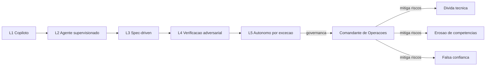

Como Comandante, você reconhece o padrão final da obra: a maturidade não é sobre a máquina — é sobre o contrato entre humano, agente e verificação, em escala organizacional [11].

## 4. Técnica

### Diagnóstico de Maturidade em Código

O primeiro passo da evolução é saber onde você está. O instrumento abaixo pontua sua organização nos critérios dos cinco níveis:

```python
from dataclasses import dataclass
from typing import Dict


@dataclass
class CriterioMaturidade:
    nome: str
    nivel: int
    verificado: bool


CRITERIOS = [
    CriterioMaturidade("IA autocompleta codigo", 1, False),
    CriterioMaturidade("IA escreve modulos, humano revisa tudo", 2, False),
    CriterioMaturidade("Spec executavel antes do build", 3, False),
    CriterioMaturidade("Testes de aceite definidos na spec", 3, False),
    CriterioMaturidade("Verificacao adversarial independente", 4, False),
    CriterioMaturidade("Merge autorizado por evidencia, nao opiniao", 4, False),
    CriterioMaturidade("IA opera ciclo com supervisao por excecao", 5, False),
]


def diagnosticar(criterios: list) -> int:
    """Retorna o maior nivel em que TODOS os criterios estao verificados."""
    por_nivel = {}
    for c in criterios:
        por_nivel.setdefault(c.nivel, []).append(c)
    nivel = 0
    for n in sorted(por_nivel):
        if all(c.verificado for c in por_nivel[n]):
            nivel = n
        else:
            break
    return nivel


# Simulacao: sua organizacao tem os criterios 1, 2 e o primeiro de 3
for i, c in enumerate(CRITERIOS[:3]):
    c.verificado = True

print(f"Nivel de maturidade diagnosticado: L{diagnosticar(CRITERIOS)}")
```

O diagnóstico é honesto por construção: o nível só conta quando todos os critérios do nível estão verificados — não quando "quase" [12].

### O Inventário de Anti-padrões

O anti-padrão é o padrão que parece certo e destrói o ciclo. O inventário abaixo é um CI de governança:

```json
{
  "anti_padroes": {
    "prompt_and_pray": "pedir codigo sem spec; desperdicio de tokens e retrabalho",
    "spec_decorativa": "spec que nao vira teste de aceite; contrato de fachada",
    "auto_validacao": "quem escreveu valida sozinho; segregacao violada",
    "contexto_descontrolado": "carregar arquivo inteiro quando a interface bastaria",
    "merge_sem_evidencia": "aprovar mudanca sem output de comando que prova",
    "verificacao_ritual": "revisor que nunca reprova nada; radar desligado"
  },
  "checklist_diario": [
    "toda mudanca delegada tem spec executavel?",
    "quem escreveu nao validou sozinho?",
    "toda aprovacao tem evidencia registrada?",
    "o orcamento de contexto da sessao foi respeitado?"
  ]
}
```

O inventário não é para culpar — é para detectar: o anti-padrão detectado na Fase 5 custa menos do que na Fase 7 [13].

### O Roadmap do Comandante

A evolução pessoal é tão importante quanto a organizacional. O roadmap abaixo é o plano de voo da sua carreira:

```markdown
# Roadmap: de desenvolvedor a Comandante de Operacoes de Software

## Fase 1 (meses 1-2): Fundamentos
- Domine a spec executavel: toda feature propria com R1..Rn e criterios de aceite.
- Adote test-first em um modulo pequeno.

## Fase 2 (meses 3-5): Delegacao supervisionada
- Delegue modulos a agentes com worktree isolado.
- Configure revisor adversarial agêntico em seus PRs.

## Fase 3 (meses 6-9): Contratos e radar
- Desenhe o orcamento de contexto do seu time.
- Implante a porta de evidencia: merge so com saida verde das tres camadas.

## Fase 4 (meses 10-12): Governanca
- Diagnostiche a maturidade da sua organizacao (script acima).
- Capture skills do seu dominio e monte a memoria de erros recorrentes.
```

O roadmap é o desafio final: a obra termina, o ciclo do leitor começa [14].

### O Plano de Evolução de Maturidade como Artefato

O salto de nível de maturidade não acontece por decreto — é um plano com metas, artefatos e métricas. O formato abaixo é o plano de evolução que uma organização usa para subir do nível 2 ao nível 3:

```yaml
plano_evolucao:
  origem: 2
  alvo: 3
  duracao_meses: 6
  marcos:
    - mes: 1
      entrega: "spec executavel para 1 fluxo piloto"
      metrica: "100% dos requisitos com criterio de aceite"
    - mes: 2
      entrega: "regressao de aceite no CI"
      metrica: "suites rodando em todo merge"
    - mes: 3
      entrega: "gate de evidencia no merge"
      metrica: "0 merges sem saida verde das 3 camadas"
    - mes: 4
      entrega: "orcamento de contexto por fase"
      metrica: "tokens por feature registrados e revisados"
    - mes: 5
      entrega: "skill de verificacao adversaria"
      metrica: "refutacoes por fase registradas"
    - mes: 6
      entrega: "diagnostico formal de maturidade"
      metrica: "todos os criterios L3 verificados"
  riscos:
    - "resistencia cultural a revisao adversarial"
    - "juniores dependentes de IA sem julgamento proprio"
```

O plano é o manual de transição da torre: cada marco tem entrega e métrica — o salto é medido, não comemorado por intuição [19].

### O Modelo de Anti-padrões com Detecção Automática

O inventário de anti-padrões é mais poderoso quando a detecção é automatizada. O modelo abaixo identifica o anti-padrão mais comum — o merge sem evidência — a partir dos dados da esteira:

```python
def detectar_merge_sem_evidencia(merges: list) -> list:
    suspeitos = []
    for m in merges:
        tem_ci = m.get("ci_verde", False)
        tem_parecer = m.get("parecer_adversarial", False)
        tem_aprovacao = m.get("aprovacao_humana", False)
        if not (tem_ci and tem_parecer and tem_aprovacao):
            suspeitos.append(m["id"])
    return suspeitos


MERGES = [
    {"id": "M1", "ci_verde": True, "parecer_adversarial": True, "aprovacao_humana": True},
    {"id": "M2", "ci_verde": True, "parecer_adversarial": False, "aprovacao_humana": True},
    {"id": "M3", "ci_verde": False, "parecer_adversarial": True, "aprovacao_humana": False},
]

suspeitos = detectar_merge_sem_evidencia(MERGES)
print(f"Merges sem evidencia completa: {suspeitos}")
```

A detecção automática transforma o inventário de anti-padrões de checklist em vigilância: a esteira sinaliza o merge sem evidência no momento em que ele acontece — e o Comandante corrige a prática antes de ela virar cultura [28].

### O Modelo de Dívida de Automação

A maturidade não avança em linha reta — débitos de automação se acumulam e precisam ser medidos. O modelo abaixo calcula a dívida de automação por área, contabilizando tarefas que deveriam ser agênticas mas ainda são manuais:

```python
def divida_automacao(tarefas):
    divida = 0
    detalhe = []
    for tarefa in tarefas:
        if tarefa['tipo'] == 'repetitiva' and not tarefa['automatizada']:
            peso = tarefa['frequencia_semanal'] * tarefa['minutos_por_execucao']
            divida += peso
            detalhe.append({'tarefa': tarefa['nome'], 'peso_min_semana': peso})
    return {'divida_total_min_semana': divida, 'por_tarefa': detalhe}

tarefas = [
    {'nome': 'abrir release notes', 'tipo': 'repetitiva', 'automatizada': False, 'frequencia_semanal': 2, 'minutos_por_execucao': 30},
    {'nome': 'rodar auditoria', 'tipo': 'repetitiva', 'automatizada': True, 'frequencia_semanal': 5, 'minutos_por_execucao': 10},
]
print(divida_automacao(tarefas))
```

A dívida medida em minutos por semana é o argumento objetivo para o roadmap: 60 minutos semanais de dívida viram um ticket de automação com retorno calculável. O portfólio de capacidades do comandante não é a lista de ferramentas instaladas — é a lista de tarefas que a esteira deveria fazer sozinha e ainda não faz. Cada item da dívida é uma oportunidade de salto de nível.

### O Modelo de Previsão de Tendências

O Comandante não gerencia projetos isolados — gerencia um portfólio de capacidades: spec, radar, combustível, memória. O modelo abaixo avalia o portfólio da organização e aponta onde investir:

```python
def avaliar_portfolio(capacidades: dict) -> list:
    ranking = sorted(capacidades.items(), key=lambda kv: -kv[1]["maturidade"])
    saida = []
    for nome, dados in ranking:
        status = "forte" if dados["maturidade"] >= 0.8 else ("em_construcao" if dados["maturidade"] >= 0.5 else "lacuna")
        saida.append(f"{nome}: maturidade={dados['maturidade']} ({status})")
    return saida


CAPACIDADES = {
    "spec_executavel": {"maturidade": 0.9},
    "verificacao_adversarial": {"maturidade": 0.6},
    "economia_contexto": {"maturidade": 0.7},
    "debriefing": {"maturidade": 0.3},
}

for linha in avaliar_portfolio(CAPACIDADES):
    print(f"  {linha}")
```

O portfólio é o mapa de investimento da próxima década: a capacidade mais fraca — debriefing — recebe o próximo ciclo de investimento, porque é a que fecha o ciclo de aprendizado. O Comandante investe onde o ciclo quebra, não onde brilha [27].

### O Modelo de Previsão de Tendências

O Comandante não apenas acompanha as tendências — as modela para decidir. O modelo abaixo projeta o impacto da adoção de IA na estabilidade de entrega, usando os vetores do DORA: throughput e estabilidade [25].

```python
def projetar_estabilidade(throughput: float, governanca: float) -> float:
    """Projeta a estabilidade relativa dado throughput e forca de governanca."""
    if governanca < 0.3:
        return round(0.6 - throughput * 0.8, 2)  # IA sem governanca corroe estabilidade
    return round(0.5 + throughput * governanca, 2)  # IA com governanca amplifica


cenarios = [
    ("Alfa (sem governanca)", 0.8, 0.2),
    ("Beta (com governanca)", 0.8, 0.9),
]
for nome, thr, gov in cenarios:
    est = projetar_estabilidade(thr, gov)
    print(f"{nome}: estabilidade projetada = {est}")
```

O modelo é conceitual, mas a lição é real: o mesmo throughput, com governança diferente, projeta estabilidades opostas. O Comandante não escolhe entre velocidade e estabilidade — escolhe governança que entregue as duas [26].

### O Modelo de Benchmark de Maturidade por Time

O diagnóstico de maturidade por time precisa de comparação justa. O modelo abaixo aplica o mesmo questionário a todos os times e produz o ranking com os pilares fortes e fracos de cada um:

```python
PILARES = ['artefatos', 'delegacao', 'verificacao', 'aprendizado', 'governanca']

def benchmark_times(resultados):
    ranking = []
    for time, notas in resultados.items():
        media = round(sum(notas.values()) / len(notas), 1)
        pilar_fraco = min(notas, key=notas.get)
        ranking.append({'time': time, 'media': media, 'pilar_fraco': pilar_fraco, 'notas': notas})
    return sorted(ranking, key=lambda x: x['media'], reverse=True)

times = {
    'cobranca': {'artefatos': 3, 'delegacao': 2, 'verificacao': 4, 'aprendizado': 2, 'governanca': 3},
    'catalogo': {'artefatos': 4, 'delegacao': 3, 'verificacao': 3, 'aprendizado': 3, 'governanca': 4},
}
print(benchmark_times(times))
```

O ranking compara times pelo mesmo critério — e o pilar fraco de cada um vira o próximo item do roadmap organizacional: a cobrança precisa de oficina de delegação, o catálogo está equilibrado. O benchmark também expõe o time que infla a própria nota: o time de relatórios que se dá 5 em tudo mas tem backlog de incidentes alto aparece no ranking com a contradição que a conversa precisa ter.

### O Painel de Maturidade da Organização

A maturidade não se conquista em slide — se conquista em feature. O exemplo abaixo é o plano de salto do nível 2 ao nível 3 aplicado a uma feature real de cobrança:

1. **Escolha da feature**: cobrança de assinatura (complexidade média, impacto alto, negócio claro).
2. **Spec executável**: requisitos R1..Rn com critérios de aceite nomeados, casos de borda explícitos, orçamento de contexto declarado.
3. **Test-first**: os testes de aceite são escritos antes da implementação — o vermelho antes do verde.
4. **Verificação adversarial**: o revisor independente refuta os casos de borda com evidência.
5. **Debriefing**: as lições do ciclo viram skill e memória.

O roteiro abaixo é o checklist do salto:

```python
def verificar_salto_nivel(nivel_atual: int, criterios: dict) -> str:
    """Confere se a feature completa os criterios do proximo nivel."""
    alvo = nivel_atual + 1
    criterios_alvo = criterios.get(alvo, {})
    faltantes = [k for k, v in criterios_alvo.items() if not v]
    if faltantes:
        return f"bloqueado: faltam {', '.join(faltantes)}"
    return f"salto para L{alvo} liberado nesta feature"


CRITERIOS = {
    3: {"spec_executavel": True, "testes_aceite": True,
        "verificacao_adversarial": True, "orcamento_contexto": True},
}

print(verificar_salto_nivel(2, CRITERIOS))
```

O salto por feature é a estratégia de evolução do Comandante: em vez de uma transformação de risco, um salto por entrega — cada feature comprova um critério do próximo nível, e a organização sobe degrau a degrau, com evidência [24].

### O Modelo de Auditoria de Ética da Delegação

O capítulo defende a delegação agêntica — mas a delegação precisa de auditoria ética. O modelo abaixo verifica se cada delegação tem supervisão, transparência e reversibilidade, os três pilares da delegação responsável:

```python
def auditar_delegacao(delegacoes):
    problemas = []
    for d in delegacoes:
        if not d['supervisao_humana']:
            problemas.append({'delegacao': d['id'], 'pilar': 'supervisao'})
        if not d['registrada']:
            problemas.append({'delegacao': d['id'], 'pilar': 'transparencia'})
        if not d['reversivel']:
            problemas.append({'delegacao': d['id'], 'pilar': 'reversibilidade'})
    return {'conforme': not problemas, 'problemas': problemas}

delegacoes = [
    {'id': 'D-21', 'supervisao_humana': True, 'registrada': True, 'reversivel': True},
    {'id': 'D-22', 'supervisao_humana': False, 'registrada': True, 'reversivel': True},
]
print(auditar_delegacao(delegacoes))
```

A auditoria transforma o princípio em checklist: a delegação D-22 sem supervisão humana é sinalizada antes de virar rotina. Os três pilares são a tradução técnica da responsabilidade — não é ética abstrata, é verificação determinística. O comandante que audita suas delegações com esse modelo consegue delegar muito sem delegar a responsabilidade.

### O Painel de Maturidade da Organização

A maturidade precisa de visibilidade contínua — um painel que todos consultam. O painel abaixo resume o estado do ciclo em um relance:

```json
{
  "painel_maturidade": {
    "nivel_diagnosticado": 3,
    "criterios": {
      "L1": {"autocomplete": true, "sugestao": true},
      "L2": {"modulos_agentes": true, "revisao_humana_total": true},
      "L3": {"spec_executavel": true, "testes_aceite": true, "orcamento_contexto": true},
      "L4": {"verificacao_adversarial": false, "merge_por_evidencia": false},
      "L5": {"operacao_excecao": false}
    },
    "proximo_salto": {
      "alvo": 4,
      "bloqueios": ["verificacao_adversarial independente", "porta de evidencia no CI"]
    }
  }
}
```

O painel é o instrumento do Comandante: mostra onde a organização está, o que falta para o próximo nível e o que bloqueia — sem ambigüidade e sem autodecepção [23].

### O Modelo de Governança da Próxima Década

O futuro da disciplina depende de um modelo de governança que combine os três vetores — autonomia, observabilidade e economia de contexto. O modelo abaixo é o esqueleto operacional para a próxima década:

```json
{
  "governanca_2030": {
    "autonomia": {
      "nivel_alvo": 4,
      "condicao": "verificacao adversarial entre agentes antes de decisao humana",
      "excecoes_humanas": ["contratos", "impacto em producao", "etica"]
    },
    "observabilidade": {
      "caixa_preta": "eventos de decisao por fase, obrigatorios",
      "auditoria": "amostragem de pareceres por ciclo",
      "painel": "tokens, refutacoes, retrabalho, incidentes"
    },
    "economia_contexto": {
      "orcamento_por_fase": "declarado e medido",
      "handoff": "desenhado na decolagem, nao no estouro",
      "memoria": "banco de licoes consultado antes de cada fase"
    }
  }
}
```

O modelo responde às três perguntas que definem o futuro: quanta autonomia entregar, como observar o produtor e como não morrer de contexto no caminho. Cada organização adapta o esqueleto — mas nenhuma ignora as três dimensões sem pagar o preço [21].

### O Modelo de Plano de Ação por Pilar Fracassado

Diagnosticar sem agir é entretenimento. O modelo abaixo transforma cada pilar fraco do diagnóstico em um plano de ação com dono, prazo e métrica de conclusão:

```python
def plano_de_acao(pilares_fracos, donos):
    planos = []
    for pilar, nota in pilares_fracos:
        acao = {'oficina_' + pilar: 'treinamento'}
        plano = {'pilar': pilar, 'nota': nota, 'dono': donos.get(pilar, 'a_definir'),
                 'prazo': '90 dias', 'metrica': 'nota_media_' + pilar + '_>=_4',
                 'acoes': acao}
        planos.append(plano)
    return planos

print(plano_de_acao([('delegacao', 2), ('aprendizado', 3)], {'delegacao': 'time-cobranca'}))
```

O plano de ação fecha o ciclo do diagnóstico: pilar fraco vira oficina com dono, prazo e métrica de conclusão. A métrica é explícita — nota média de delegação maior ou igual a 4 no próximo diagnóstico — para que o progresso seja verificável e não impressionista. Sem o plano, o diagnóstico de maturidade é um relatório bonito que ninguém executa; com ele, cada pilar fraco é uma linha de trabalho com dono e data.

### O Diagnóstico Contínuo como Hábito

A maturidade não é um exame único — é um hábito contínuo. A cadência do Comandante é simples e poderosa:

| Cadência | Ação | Artefato |
|----------|------|----------|
| Diária | Checklist de anti-padrões no review de PRs | Registro de violações |
| Semanal | Painel de métricas do ciclo (tokens, refutações, retrabalho) | Relatório semanal |
| Mensal | Diagnóstico de maturidade e salto de nível planejado | Plano de evolução |
| Trimestral | Debriefing dos incidentes e captura de skills | Banco de lições atualizado |
| Anual | Revisão do próprio SDLC: o ciclo de vida do ciclo | Spec do SDLC revisada |

O hábito contínuo é o que transforma este livro em prática: a teoria vira rotina, a rotina vira cultura e a cultura sustenta o ciclo [22].

### O Modelo de Revisão de Escopo da Delegação

A delegação precisa de revisão periódica — escopo que servia há seis meses pode estar obsoleto. O modelo abaixo agenda e registra a revisão de cada delegação:

```python
from datetime import datetime, timedelta

class RevisorDeDelegacao:
    def __init__(self, ciclo_dias=90):
        self.ciclo = timedelta(days=ciclo_dias)
        self.revisoes = {}

    def registrar(self, id, criada_em):
        self.revisoes[id] = {'criada_em': criada_em, 'proxima': criada_em + self.ciclo}

    def vencidas(self, hoje):
        return [id for id, r in self.revisoes.items() if hoje >= r['proxima']]

r = RevisorDeDelegacao()
r.registrar('D-21', datetime(2026, 1, 1))
print(r.vencidas(datetime(2026, 5, 1)))
```

A revisão vencida é o mecanismo anti-inércia: a delegação D-21 concedida em janeiro precisa de revisão em abril, e a lista de vencidas é o backlog de governança. A pergunta da revisão é sempre a mesma: a autoridade ainda corresponde à capacidade demonstrada? Delegar é dinâmico — o que o agente pode hoje pode não ser o que poderá amanhã, para mais ou para menos.

### A Ética da Delegação Agêntica

O futuro do SDLC AI-first também é uma questão ética. A delegação de execução não pode virar delegação de responsabilidade — e o Comandante carrega o peso dessa distinção:

| Princípio | Prática |
|-----------|---------|
| Accountability não delega | O humano responde pelo resultado, mesmo quando o agente executou |
| Transparência do produtor | O comportamento do agente é observável (caixa-preta) |
| Não-erosão de competências | Juniores desenvolvem julgamento pela revisão, não só pela delegação |
| Inclusão | A adoção de IA comunica o impacto no time com transparência |
| Governança por evidência | Decisões de impacto registradas com evidência, não opinião |

A pesquisa sobre o futuro do agêntico é explícita: o alinhamento ético não é um anexo do ciclo de vida — é condição de sustentabilidade dele [20].

### O Papel do Comandante na Era da Exceção

No nível 5, o humano não desaparece — muda de função. Em vez de operar o ciclo, o Comandante governa as exceções: define o que é exceção, desenha o caminho de escalação e arbitra quando dois agentes (ou duas equipes) discordam [17]. Essa mudança é a mais difícil culturalmente, porque exige que o profissional aceite que sua expertise agora se aplica no julgamento, não na execução. A pesquisa em agêntico de longo horizonte mostra que esse é o ponto onde a maioria das organizações trava: os líderes não confiam que a exceção basta [18].

### O Ciclo de Vida do Comandante

A última lição da obra é também a primeira: o SDLC AI-first é um ciclo de vida do próprio ciclo. O Comandante que diagnostica, salta de nível, captura aprendizado e repete — esse é o profissional da próxima década [19]. Não é sobre o modelo, o harness ou a skill; é sobre o contrato entre humano, agente e verificação, evoluído a cada iteração [20].

### O Legado do Comandante

O capítulo final fecha o ciclo com a pergunta que todo comandante deve se fazer: o que fica quando eu saio? A resposta em três níveis — processos que rodam sem a minha presença, porque estão escritos e verificáveis; pessoas que tomam decisão melhor que eu, porque foram treinadas com evidência; e uma cultura onde a pergunta certa vale mais que a resposta pronta. O SDLC AI-first não é um destino — é uma esteira que se aperfeiçoa. O legado do comandante é deixar a esteira mais forte do que encontrou, com cada fase documentada, cada contrato auditável e cada lição propagada.

### Passos para Liderar a Próxima Década

1. **Diagnostique seu nível** com o script de maturidade — sem autoengano.
2. **Monte o inventário de anti-padrões** da sua organização e rode o checklist diário.
3. **Escolha uma feature real** para o salto de nível: spec executável + verificação adversarial + orçamento de contexto.
4. **Capture o aprendizado** em skills e memória — o ciclo de vida do seu ciclo começa agora [15].

## 5. Aplica

Cena real, em segunda pessoa. Você é o líder técnico de uma organização que "abraçou a IA" há um ano: todos usam agentes, o throughput subiu, e a diretoria comemora. Mas você percebe o que as métricas não mostram: os juniores não sabem mais escrever testes sem a IA, os PRs são aprovados com leitura de 5 minutos, e a taxa de incidentes em produção vem subindo discretamente a cada trimestre.

O erro da organização não foi adotar IA — foi pular níveis. Ela saltou do nível 1 direto para uma versão degenerada do nível 2: agentes escrevem, humanos aprovam sem ler, e ninguém construiu a spec executável, o radar adversarial ou o orçamento de contexto. O throughput subiu; a estabilidade despencou — o padrão DORA em carne e osso.

O diagnóstico, ligado à teoria: maturidade não se pula; se falseia. A correção prática:

1. **Pare a corrida por 2 semanas** e rode o diagnóstico de maturidade com o time — honestamente.
2. **Retorne ao nível 3 como alvo**: spec executável para toda mudança delegada, testes de aceite definidos antes do build.
3. **Ligue o radar**: revisor adversarial independente e porta de evidência no CI.
4. **Proteja os juniores**: rodízio de revisão humana com postura de refutação — a revisão é a escola do julgamento.

Armadilhas comuns: comemorar throughput sem medir estabilidade; achar que o nível 5 é "não fazer nada"; e culpar o modelo quando o processo falha — o modelo nunca foi a variável de controle [16].

## 6. Conclusão

Você chegou ao posto. Três marcos finais: primeiro, os cinco níveis de maturidade — do copiloto ao autônomo por exceção — e o diagnóstico honesto em código; segundo, os riscos estruturais — dívida técnica silenciosa, erosão de competências e falsa confiança — com o inventário de anti-padrões como radar de governança; terceiro, o roadmap do Comandante: da spec executável à liderança do ciclo.

O desafio final da obra: diagnostique sua organização hoje, escolha um nível à frente como alvo e execute o salto em uma feature real — com spec, radar e combustível. O céu do software agora tem torres de controle; a sua decolagem é por sua conta.

## 7. Referências Bibliográficas

[1] HODA, Rashina. *Toward Agentic Software Engineering Beyond Code: Framing Vision, Values, and Vocabulary.* ICSE 2026 Workshop. Disponível em: https://arxiv.org/abs/2510.19692. Acesso em: 02 ago. 2026.
[2] ANTHROPIC. *Building effective agents.* Disponível em: https://www.anthropic.com/research/building-effective-agents. Acesso em: 02 ago. 2026.
[3] JIN, Haolin et al. *From LLMs to LLM-based Agents for Software Engineering: A Survey of Current, Challenges and Future.* 2025. Disponível em: https://arxiv.org/abs/2408.02479. Acesso em: 02 ago. 2026.
[4] HINGEL, Paula. *How AI Changes the SDLC: A Six-Stage Guide.* Augment Code, 2026. Disponível em: https://www.augmentcode.com/guides/how-ai-changes-the-sdlc. Acesso em: 02 ago. 2026.
[5] ROYCHOUDHURY, Abhik et al. *Agentic Software Engineering: state and perspectives.* 2025. Disponível em: https://arxiv.org/abs/2509.09893. Acesso em: 02 ago. 2026.
[6] *SWE-bench Pro: Can AI Agents Solve Long-Horizon Software Engineering Tasks?* 2025. Disponível em: https://arxiv.org/abs/2509.16941. Acesso em: 02 ago. 2026.
[7] GURGUL, Vincent; GUBELA, Robin; LESSMANN, Stefan. *The State of Generative AI in Software Development: Insights from Literature and a Developer Survey.* 2026. Disponível em: https://arxiv.org/abs/2603.16975. Acesso em: 02 ago. 2026.
[8] LEHMANN, Fabian et al. *Software Engineering in the Era of LLMs.* 2024. Disponível em: https://arxiv.org/abs/2403.09752. Acesso em: 02 ago. 2026.
[9] GOOGLE CLOUD. *State of AI-assisted Software Development (DORA 2025).* Disponível em: https://dora.dev/research/. Acesso em: 02 ago. 2026.
[10] MOHAGHEGHI, Milad et al. *Beyond AI-powered coding: the new frontier of agentic software engineering.* 2025. Disponível em: https://arxiv.org/abs/2509.14838. Acesso em: 02 ago. 2026.
[11] MICROSOFT. *An AI led SDLC: Building an End-to-End Agentic Software Development Lifecycle with Azure and GitHub.* Microsoft Tech Community, 2026. Disponível em: https://techcommunity.microsoft.com/blog/appsonazureblog/an-ai-led-sdlc-building-an-end-to-end-agentic-software-development-lifecycle-wit/4491896. Acesso em: 02 ago. 2026.
[12] FORSGREN, Nicole; HUMBLE, Jez; KIM, Gene. *Accelerate: The Science of Lean Software and DevOps.* Portland: IT Revolution Press, 2018. Disponível em: https://itrevolution.com. Acesso em: 02 ago. 2026.
[13] GRÖPLER, Robin et al. *The Future of Generative AI in Software Engineering: A Vision from Industry and Academia in the European GENIUS Project.* IEEE/ACM AIware, 2025. Disponível em: https://arxiv.org/abs/2511.01348. Acesso em: 02 ago. 2026.
[14] ANTHROPIC. *Raising the bar on SWE-bench Verified with Claude 3.5 Sonnet.* Disponível em: https://www.anthropic.com/news/swe-bench-sonnet. Acesso em: 02 ago. 2026.
[15] YANG, John et al. *SWE-agent: Agent-Computer Interfaces Enable Automated Software Engineering.* NeurIPS 2024. Disponível em: https://arxiv.org/abs/2405.15793. Acesso em: 02 ago. 2026.
[16] WANG, Yuchen; GUO, Shangxin; TAN, Chee Wei. *From Code Generation to Software Testing: AI Copilot with Context-Based RAG.* 2025. Disponível em: https://arxiv.org/abs/2504.01866. Acesso em: 02 ago. 2026.
[17] ROYCHOUDHURY, Abhik et al. *Agentic Software Engineering: state and perspectives.* 2025. Disponível em: https://arxiv.org/abs/2509.09893. Acesso em: 02 ago. 2026.
[18] *SWE-bench Pro: Can AI Agents Solve Long-Horizon Software Engineering Tasks?* 2025. Disponível em: https://arxiv.org/abs/2509.16941. Acesso em: 02 ago. 2026.
[19] HODA, Rashina. *Toward Agentic Software Engineering Beyond Code: Framing Vision, Values, and Vocabulary.* ICSE 2026 Workshop. Disponível em: https://arxiv.org/abs/2510.19692. Acesso em: 02 ago. 2026.
[20] JIN, Haolin et al. *From LLMs to LLM-based Agents for Software Engineering: A Survey of Current, Challenges and Future.* 2025. Disponível em: https://arxiv.org/abs/2408.02479. Acesso em: 02 ago. 2026.
[21] ROYCHOUDHURY, Abhik et al. *Agentic Software Engineering: state and perspectives.* 2025. Disponível em: https://arxiv.org/abs/2509.09893. Acesso em: 02 ago. 2026.
[22] MICROSOFT. *An AI led SDLC: Building an End-to-End Agentic Software Development Lifecycle with Azure and GitHub.* Microsoft Tech Community, 2026. Disponível em: https://techcommunity.microsoft.com/blog/appsonazureblog/an-ai-led-sdlc-building-an-end-to-end-agentic-software-development-lifecycle-wit/4491896. Acesso em: 02 ago. 2026.
[23] HODA, Rashina. *Toward Agentic Software Engineering Beyond Code: Framing Vision, Values, and Vocabulary.* ICSE 2026 Workshop. Disponível em: https://arxiv.org/abs/2510.19692. Acesso em: 02 ago. 2026.
[24] GURGUL, Vincent; GUBELA, Robin; LESSMANN, Stefan. *The State of Generative AI in Software Development: Insights from Literature and a Developer Survey.* 2026. Disponível em: https://arxiv.org/abs/2603.16975. Acesso em: 02 ago. 2026.
[25] GOOGLE CLOUD. *State of AI-assisted Software Development (DORA 2025).* Disponível em: https://dora.dev/research/. Acesso em: 02 ago. 2026.
[26] MOHAGHEGHI, Milad et al. *Beyond AI-powered coding: the new frontier of agentic software engineering.* 2025. Disponível em: https://arxiv.org/abs/2509.14838. Acesso em: 02 ago. 2026.
[27] ROYCHOUDHURY, Abhik et al. *Agentic Software Engineering: state and perspectives.* 2025. Disponível em: https://arxiv.org/abs/2509.09893. Acesso em: 02 ago. 2026.
[28] HODA, Rashina. *Toward Agentic Software Engineering Beyond Code: Framing Vision, Values, and Vocabulary.* ICSE 2026 Workshop. Disponível em: https://arxiv.org/abs/2510.19692. Acesso em: 02 ago. 2026.


# Conclusão

Conclusão sintética: o céu do software agora tem torres de controle — o SDLC AI-first não é sobre máquinas que escrevem código, mas sobre humanos que autorizam, arbitram e evoluem contratos. Devolver ao leitor a imagem do Comandante de Operações de Software pronto para decolar na própria jornada. A jornada deste livro foi desenhada para transformar o leitor em Comandante de Operações de Software: alguém que entende o contrato de cada fase, que delega execução a agentes sem delegar responsabilidade, que exige evidência antes de afirmação e que trata o custo de contexto como variável de projeto. O céu do software agora tem torres de controle — e quem as opera decide quais voos decolam, quais desviam e quais aterrissam com segurança.

# Referências Bibliográficas

[1] SOMMERVILLE, Ian. *Engenharia de Software*. 10. ed. São Paulo: Pearson, 2019. Disponível em: https://www.pearson.com. Acesso em: 02 ago. 2026.
[2] ANTHROPIC. *Building effective agents.* Disponível em: https://www.anthropic.com/research/building-effective-agents. Acesso em: 02 ago. 2026.
[3] JIN, Haolin et al. *From LLMs to LLM-based Agents for Software Engineering: A Survey of Current, Challenges and Future.* 2025. Disponível em: https://arxiv.org/abs/2408.02479. Acesso em: 02 ago. 2026.
[4] ANTHROPIC. *Raising the bar on SWE-bench Verified with Claude 3.5 Sonnet.* Disponível em: https://www.anthropic.com/news/swe-bench-sonnet. Acesso em: 02 ago. 2026.
[5] GRÖPLER, Robin et al. *The Future of Generative AI in Software Engineering: A Vision from Industry and Academia in the European GENIUS Project.* IEEE/ACM AIware, 2025. Disponível em: https://arxiv.org/abs/2511.01348. Acesso em: 02 ago. 2026.
[6] GOOGLE CLOUD. *State of AI-assisted Software Development (DORA 2025).* Disponível em: https://dora.dev/research/. Acesso em: 02 ago. 2026.
[7] HODA, Rashina. *Toward Agentic Software Engineering Beyond Code: Framing Vision, Values, and Vocabulary.* ICSE 2026 Workshop. Disponível em: https://arxiv.org/abs/2510.19692. Acesso em: 02 ago. 2026.
[8] JIMENEZ, Carlos E. et al. *SWE-bench: Can Language Models Resolve Real-World GitHub Issues?* ICLR 2024. Disponível em: https://arxiv.org/abs/2310.06770. Acesso em: 02 ago. 2026.
[9] YANG, John et al. *SWE-agent: Agent-Computer Interfaces Enable Automated Software Engineering.* NeurIPS 2024. Disponível em: https://arxiv.org/abs/2405.15793. Acesso em: 02 ago. 2026.
[10] WANG, Yuchen; GUO, Shangxin; TAN, Chee Wei. *From Code Generation to Software Testing: AI Copilot with Context-Based RAG.* 2025. Disponível em: https://arxiv.org/abs/2504.01866. Acesso em: 02 ago. 2026.
[11] MOHAGHEGHI, Milad et al. *Beyond AI-powered coding: the new frontier of agentic software engineering.* 2025. Disponível em: https://arxiv.org/abs/2509.14838. Acesso em: 02 ago. 2026.
[12] HINGEL, Paula. *How AI Changes the SDLC: A Six-Stage Guide.* Augment Code, 2026. Disponível em: https://www.augmentcode.com/guides/how-ai-changes-the-sdlc. Acesso em: 02 ago. 2026.
[13] LEHMANN, Fabian et al. *Software Engineering in the Era of LLMs.* 2024. Disponível em: https://arxiv.org/abs/2403.09752. Acesso em: 02 ago. 2026.
[14] ROYCHOUDHURY, Abhik et al. *Agentic Software Engineering: state and perspectives.* 2025. Disponível em: https://arxiv.org/abs/2509.09893. Acesso em: 02 ago. 2026.
[15] GRÖPLER, Robin et al. *The Future of Generative AI in Software Engineering: A Vision from Industry and Academia in the European GENIUS Project.* IEEE/ACM AIware, 2025. Disponível em: https://arxiv.org/abs/2511.01348. Acesso em: 02 ago. 2026.
[16] SWE-BENCH. *Benchmark oficial de agentes de código.* Disponível em: https://www.swebench.com. Acesso em: 02 ago. 2026.
[17] JIN, Haolin et al. *From LLMs to LLM-based Agents for Software Engineering: A Survey of Current, Challenges and Future.* 2025. Disponível em: https://arxiv.org/abs/2408.02479. Acesso em: 02 ago. 2026.
[18] GURGUL, Vincent; GUBELA, Robin; LESSMANN, Stefan. *The State of Generative AI in Software Development: Insights from Literature and a Developer Survey.* 2026. Disponível em: https://arxiv.org/abs/2603.16975. Acesso em: 02 ago. 2026.
[19] ANTHROPIC. *Introducing the Model Context Protocol.* Disponível em: https://www.anthropic.com/news/model-context-protocol. Acesso em: 02 ago. 2026.
[20] HODA, Rashina. *Toward Agentic Software Engineering Beyond Code: Framing Vision, Values, and Vocabulary.* ICSE 2026 Workshop. Disponível em: https://arxiv.org/abs/2510.19692. Acesso em: 02 ago. 2026.
[21] FORSGREN, Nicole; HUMBLE, Jez; KIM, Gene. *Accelerate: The Science of Lean Software and DevOps.* Portland: IT Revolution Press, 2018. Disponível em: https://itrevolution.com. Acesso em: 02 ago. 2026.
[22] MICROSOFT. *An AI led SDLC: Building an End-to-End Agentic Software Development Lifecycle with Azure and GitHub.* Microsoft Tech Community, 2026. Disponível em: https://techcommunity.microsoft.com/blog/appsonazureblog/an-ai-led-sdlc-building-an-end-to-end-agentic-software-development-lifecycle-wit/4491896. Acesso em: 02 ago. 2026.
[23] CLARKE, Peter et al. *Model Context Protocol: overview e adoção.* 2025. Disponível em: https://arxiv.org/abs/2504.11423. Acesso em: 02 ago. 2026.
[24] GURGUL, Vincent; GUBELA, Robin; LESSMANN, Stefan. *The State of Generative AI in Software Development: Insights from Literature and a Developer Survey.* 2026. Disponível em: https://arxiv.org/abs/2603.16975. Acesso em: 02 ago. 2026.
[25] MICROSOFT. *An AI led SDLC: Building an End-to-End Agentic Software Development Lifecycle with Azure and GitHub.* Microsoft Tech Community, 2026. Disponível em: https://techcommunity.microsoft.com/blog/appsonazureblog/an-ai-led-sdlc-building-an-end-to-end-agentic-software-development-lifecycle-wit/4491896. Acesso em: 02 ago. 2026.
[26] HODA, Rashina. *Toward Agentic Software Engineering Beyond Code: Framing Vision, Values, and Vocabulary.* ICSE 2026 Workshop. Disponível em: https://arxiv.org/abs/2510.19692. Acesso em: 02 ago. 2026.
[27] JIN, Haolin et al. *From LLMs to LLM-based Agents for Software Engineering: A Survey of Current, Challenges and Future.* 2025. Disponível em: https://arxiv.org/abs/2408.02479. Acesso em: 02 ago. 2026.
[28] FORSGREN, Nicole; HUMBLE, Jez; KIM, Gene. *Accelerate: The Science of Lean Software and DevOps.* Portland: IT Revolution Press, 2018. Disponível em: https://itrevolution.com. Acesso em: 02 ago. 2026.
[29] EVANS, Eric. *Domain-Driven Design: Tackling Complexity in the Heart of Software.* Boston: Addison-Wesley, 2003. Disponível em: https://www.informit.com. Acesso em: 02 ago. 2026.
[30] HINGEL, Paula. *How AI Changes the SDLC: A Six-Stage Guide.* Augment Code, 2026. Disponível em: https://www.augmentcode.com/guides/how-ai-changes-the-sdlc. Acesso em: 02 ago. 2026.
[31] GURGUL, Vincent; GUBELA, Robin; LESSMANN, Stefan. *The State of Generative AI in Software Development: Insights from Literature and a Developer Survey.* 2026. Disponível em: https://arxiv.org/abs/2603.16975. Acesso em: 02 ago. 2026.

[1] JIMENEZ, Carlos E. et al. *SWE-bench: Can Language Models Resolve Real-World GitHub Issues?* ICLR 2024. Disponível em: https://arxiv.org/abs/2310.06770. Acesso em: 02 ago. 2026.
[2] JIN, Haolin et al. *From LLMs to LLM-based Agents for Software Engineering: A Survey of Current, Challenges and Future.* 2025. Disponível em: https://arxiv.org/abs/2408.02479. Acesso em: 02 ago. 2026.
[3] YANG, John et al. *SWE-agent: Agent-Computer Interfaces Enable Automated Software Engineering.* NeurIPS 2024. Disponível em: https://arxiv.org/abs/2405.15793. Acesso em: 02 ago. 2026.
[4] GURGUL, Vincent; GUBELA, Robin; LESSMANN, Stefan. *The State of Generative AI in Software Development: Insights from Literature and a Developer Survey.* 2026. Disponível em: https://arxiv.org/abs/2603.16975. Acesso em: 02 ago. 2026.
[5] ROYCHOUDHURY, Abhik et al. *Agentic Software Engineering: state and perspectives.* 2025. Disponível em: https://arxiv.org/abs/2509.09893. Acesso em: 02 ago. 2026.
[6] GRÖPLER, Robin et al. *The Future of Generative AI in Software Engineering: A Vision from Industry and Academia in the European GENIUS Project.* IEEE/ACM AIware, 2025. Disponível em: https://arxiv.org/abs/2511.01348. Acesso em: 02 ago. 2026.
[7] MOHAGHEGHI, Milad et al. *Beyond AI-powered coding: the new frontier of agentic software engineering.* 2025. Disponível em: https://arxiv.org/abs/2509.14838. Acesso em: 02 ago. 2026.
[8] ANTHROPIC. *Building effective agents.* Disponível em: https://www.anthropic.com/research/building-effective-agents. Acesso em: 02 ago. 2026.
[9] HODA, Rashina. *Toward Agentic Software Engineering Beyond Code: Framing Vision, Values, and Vocabulary.* ICSE 2026 Workshop. Disponível em: https://arxiv.org/abs/2510.19692. Acesso em: 02 ago. 2026.
[10] HINGEL, Paula. *How AI Changes the SDLC: A Six-Stage Guide.* Augment Code, 2026. Disponível em: https://www.augmentcode.com/guides/how-ai-changes-the-sdlc. Acesso em: 02 ago. 2026.
[11] LEHMANN, Fabian et al. *Software Engineering in the Era of LLMs.* 2024. Disponível em: https://arxiv.org/abs/2403.09752. Acesso em: 02 ago. 2026.
[12] WANG, Yuchen; GUO, Shangxin; TAN, Chee Wei. *From Code Generation to Software Testing: AI Copilot with Context-Based RAG.* 2025. Disponível em: https://arxiv.org/abs/2504.01866. Acesso em: 02 ago. 2026.
[13] FORSGREN, Nicole; HUMBLE, Jez; KIM, Gene. *Accelerate: The Science of Lean Software and DevOps.* Portland: IT Revolution Press, 2018. Disponível em: https://itrevolution.com. Acesso em: 02 ago. 2026.
[14] MICROSOFT. *An AI led SDLC: Building an End-to-End Agentic Software Development Lifecycle with Azure and GitHub.* Microsoft Tech Community, 2026. Disponível em: https://techcommunity.microsoft.com/blog/appsonazureblog/an-ai-led-sdlc-building-an-end-to-end-agentic-software-development-lifecycle-wit/4491896. Acesso em: 02 ago. 2026.
[15] GRÖPLER, Robin et al. *The Future of Generative AI in Software Engineering: A Vision from Industry and Academia in the European GENIUS Project.* IEEE/ACM AIware, 2025. Disponível em: https://arxiv.org/abs/2511.01348. Acesso em: 02 ago. 2026.
[16] ROYCHOUDHURY, Abhik et al. *Agentic Software Engineering: state and perspectives.* 2025. Disponível em: https://arxiv.org/abs/2509.09893. Acesso em: 02 ago. 2026.
[17] JIN, Haolin et al. *From LLMs to LLM-based Agents for Software Engineering: A Survey of Current, Challenges and Future.* 2025. Disponível em: https://arxiv.org/abs/2408.02479. Acesso em: 02 ago. 2026.
[18] QODO. *AI-assisted code review.* Disponível em: https://www.qodo.ai. Acesso em: 02 ago. 2026.
[19] ANTHROPIC. *Introducing the Model Context Protocol.* Disponível em: https://www.anthropic.com/news/model-context-protocol. Acesso em: 02 ago. 2026.
[20] SWE-BENCH. *Benchmark oficial de agentes de código.* Disponível em: https://www.swebench.com. Acesso em: 02 ago. 2026.
[21] ROYCHOUDHURY, Abhik et al. *Agentic Software Engineering: state and perspectives.* 2025. Disponível em: https://arxiv.org/abs/2509.09893. Acesso em: 02 ago. 2026.
[22] MODEL CONTEXT PROTOCOL. *Documentação oficial do protocolo.* Disponível em: https://modelcontextprotocol.io. Acesso em: 02 ago. 2026.
[23] GRÖPLER, Robin et al. *The Future of Generative AI in Software Engineering: A Vision from Industry and Academia in the European GENIUS Project.* IEEE/ACM AIware, 2025. Disponível em: https://arxiv.org/abs/2511.01348. Acesso em: 02 ago. 2026.
[24] FORSGREN, Nicole; HUMBLE, Jez; KIM, Gene. *Accelerate: The Science of Lean Software and DevOps.* Portland: IT Revolution Press, 2018. Disponível em: https://itrevolution.com. Acesso em: 02 ago. 2026.
[25] JIN, Haolin et al. *From LLMs to LLM-based Agents for Software Engineering: A Survey of Current, Challenges and Future.* 2025. Disponível em: https://arxiv.org/abs/2408.02479. Acesso em: 02 ago. 2026.
[26] HODA, Rashina. *Toward Agentic Software Engineering Beyond Code: Framing Vision, Values, and Vocabulary.* ICSE 2026 Workshop. Disponível em: https://arxiv.org/abs/2510.19692. Acesso em: 02 ago. 2026.
[27] ROYCHOUDHURY, Abhik et al. *Agentic Software Engineering: state and perspectives.* 2025. Disponível em: https://arxiv.org/abs/2509.09893. Acesso em: 02 ago. 2026.
[28] MOHAGHEGHI, Milad et al. *Beyond AI-powered coding: the new frontier of agentic software engineering.* 2025. Disponível em: https://arxiv.org/abs/2509.14838. Acesso em: 02 ago. 2026.
[29] GURGUL, Vincent; GUBELA, Robin; LESSMANN, Stefan. *The State of Generative AI in Software Development: Insights from Literature and a Developer Survey.* 2026. Disponível em: https://arxiv.org/abs/2603.16975. Acesso em: 02 ago. 2026.

[1] JIN, Haolin et al. *From LLMs to LLM-based Agents for Software Engineering: A Survey of Current, Challenges and Future.* 2025. Disponível em: https://arxiv.org/abs/2408.02479. Acesso em: 02 ago. 2026.
[2] EVANS, Eric. *Domain-Driven Design: Tackling Complexity in the Heart of Software.* Boston: Addison-Wesley, 2003. Disponível em: https://www.informit.com. Acesso em: 02 ago. 2026.
[3] OUSTERHOUT, John. *A Philosophy of Software Design.* 2. ed. Stanford: Yaknyam Press, 2021. Disponível em: https://web.stanford.edu/~ouster/cgi-bin/book.php. Acesso em: 02 ago. 2026.
[4] NYGARD, Michael. *Documenting Software Architectures: Views and Beyond.* 2. ed. Boston: Addison-Wesley, 2010. Disponível em: https://www.sei.cmu.edu. Acesso em: 02 ago. 2026.
[5] ANTHROPIC. *Building effective agents.* Disponível em: https://www.anthropic.com/research/building-effective-agents. Acesso em: 02 ago. 2026.
[6] LEHMANN, Fabian et al. *Software Engineering in the Era of LLMs.* 2024. Disponível em: https://arxiv.org/abs/2403.09752. Acesso em: 02 ago. 2026.
[7] GRÖPLER, Robin et al. *The Future of Generative AI in Software Engineering: A Vision from Industry and Academia in the European GENIUS Project.* IEEE/ACM AIware, 2025. Disponível em: https://arxiv.org/abs/2511.01348. Acesso em: 02 ago. 2026.
[8] MOHAGHEGHI, Milad et al. *Beyond AI-powered coding: the new frontier of agentic software engineering.* 2025. Disponível em: https://arxiv.org/abs/2509.14838. Acesso em: 02 ago. 2026.
[9] YANG, John et al. *SWE-agent: Agent-Computer Interfaces Enable Automated Software Engineering.* NeurIPS 2024. Disponível em: https://arxiv.org/abs/2405.15793. Acesso em: 02 ago. 2026.
[10] HODA, Rashina. *Toward Agentic Software Engineering Beyond Code: Framing Vision, Values, and Vocabulary.* ICSE 2026 Workshop. Disponível em: https://arxiv.org/abs/2510.19692. Acesso em: 02 ago. 2026.
[11] ROYCHOUDHURY, Abhik et al. *Agentic Software Engineering: state and perspectives.* 2025. Disponível em: https://arxiv.org/abs/2509.09893. Acesso em: 02 ago. 2026.
[12] GURGUL, Vincent; GUBELA, Robin; LESSMANN, Stefan. *The State of Generative AI in Software Development: Insights from Literature and a Developer Survey.* 2026. Disponível em: https://arxiv.org/abs/2603.16975. Acesso em: 02 ago. 2026.
[13] MICROSOFT. *An AI led SDLC: Building an End-to-End Agentic Software Development Lifecycle with Azure and GitHub.* Microsoft Tech Community, 2026. Disponível em: https://techcommunity.microsoft.com/blog/appsonazureblog/an-ai-led-sdlc-building-an-end-to-end-agentic-software-development-lifecycle-wit/4491896. Acesso em: 02 ago. 2026.
[14] ROYCHOUDHURY, Abhik et al. *Agentic Software Engineering: state and perspectives.* 2025. Disponível em: https://arxiv.org/abs/2509.09893. Acesso em: 02 ago. 2026.
[15] CLARKE, Peter et al. *Model Context Protocol: overview e adoção.* 2025. Disponível em: https://arxiv.org/abs/2504.11423. Acesso em: 02 ago. 2026.
[16] GRÖPLER, Robin et al. *The Future of Generative AI in Software Engineering: A Vision from Industry and Academia in the European GENIUS Project.* IEEE/ACM AIware, 2025. Disponível em: https://arxiv.org/abs/2511.01348. Acesso em: 02 ago. 2026.
[17] WANG, Yuchen; GUO, Shangxin; TAN, Chee Wei. *From Code Generation to Software Testing: AI Copilot with Context-Based RAG.* 2025. Disponível em: https://arxiv.org/abs/2504.01866. Acesso em: 02 ago. 2026.
[18] FORSGREN, Nicole; HUMBLE, Jez; KIM, Gene. *Accelerate: The Science of Lean Software and DevOps.* Portland: IT Revolution Press, 2018. Disponível em: https://itrevolution.com. Acesso em: 02 ago. 2026.
[19] HODA, Rashina. *Toward Agentic Software Engineering Beyond Code: Framing Vision, Values, and Vocabulary.* ICSE 2026 Workshop. Disponível em: https://arxiv.org/abs/2510.19692. Acesso em: 02 ago. 2026.
[20] JIN, Haolin et al. *From LLMs to LLM-based Agents for Software Engineering: A Survey of Current, Challenges and Future.* 2025. Disponível em: https://arxiv.org/abs/2408.02479. Acesso em: 02 ago. 2026.
[21] NYGARD, Michael. *Documenting Software Architectures: Views and Beyond.* 2. ed. Boston: Addison-Wesley, 2010. Disponível em: https://www.sei.cmu.edu. Acesso em: 02 ago. 2026.
[22] OUSTERHOUT, John. *A Philosophy of Software Design.* 2. ed. Stanford: Yaknyam Press, 2021. Disponível em: https://web.stanford.edu/~ouster/cgi-bin/book.php. Acesso em: 02 ago. 2026.
[23] CHACON, Scott; STRAUB, Ben. *Pro Git.* 2. ed. Nova York: Apress, 2014. Disponível em: https://git-scm.com/book. Acesso em: 02 ago. 2026.
[24] EVANS, Eric. *Domain-Driven Design: Tackling Complexity in the Heart of Software.* Boston: Addison-Wesley, 2003. Disponível em: https://www.informit.com. Acesso em: 02 ago. 2026.
[25] WANG, Yuchen; GUO, Shangxin; TAN, Chee Wei. *From Code Generation to Software Testing: AI Copilot with Context-Based RAG.* 2025. Disponível em: https://arxiv.org/abs/2504.01866. Acesso em: 02 ago. 2026.
[26] OUSTERHOUT, John. *A Philosophy of Software Design.* 2. ed. Stanford: Yaknyam Press, 2021. Disponível em: https://web.stanford.edu/~ouster/cgi-bin/book.php. Acesso em: 02 ago. 2026.
[27] NYGARD, Michael. *Documenting Software Architectures: Views and Beyond.* 2. ed. Boston: Addison-Wesley, 2010. Disponível em: https://www.sei.cmu.edu. Acesso em: 02 ago. 2026.
[28] JIN, Haolin et al. *From LLMs to LLM-based Agents for Software Engineering: A Survey of Current, Challenges and Future.* 2025. Disponível em: https://arxiv.org/abs/2408.02479. Acesso em: 02 ago. 2026.

[1] ANTHROPIC. *Building effective agents.* Disponível em: https://www.anthropic.com/research/building-effective-agents. Acesso em: 02 ago. 2026.
[2] ANTHROPIC. *Raising the bar on SWE-bench Verified with Claude 3.5 Sonnet.* Disponível em: https://www.anthropic.com/news/swe-bench-sonnet. Acesso em: 02 ago. 2026.
[3] JIN, Haolin et al. *From LLMs to LLM-based Agents for Software Engineering: A Survey of Current, Challenges and Future.* 2025. Disponível em: https://arxiv.org/abs/2408.02479. Acesso em: 02 ago. 2026.
[4] ANTHROPIC. *Introducing the Model Context Protocol.* Disponível em: https://www.anthropic.com/news/model-context-protocol. Acesso em: 02 ago. 2026.
[5] CHACON, Scott; STRAUB, Ben. *Pro Git.* 2. ed. Nova York: Apress, 2014. Disponível em: https://git-scm.com/book. Acesso em: 02 ago. 2026.
[6] BECK, Kent. *Test-Driven Development: By Example.* Boston: Addison-Wesley, 2002. Disponível em: https://www.informit.com. Acesso em: 02 ago. 2026.
[7] MOHAGHEGHI, Milad et al. *Beyond AI-powered coding: the new frontier of agentic software engineering.* 2025. Disponível em: https://arxiv.org/abs/2509.14838. Acesso em: 02 ago. 2026.
[8] ROYCHOUDHURY, Abhik et al. *Agentic Software Engineering: state and perspectives.* 2025. Disponível em: https://arxiv.org/abs/2509.09893. Acesso em: 02 ago. 2026.
[9] YANG, John et al. *SWE-agent: Agent-Computer Interfaces Enable Automated Software Engineering.* NeurIPS 2024. Disponível em: https://arxiv.org/abs/2405.15793. Acesso em: 02 ago. 2026.
[10] CLARKE, Peter et al. *Model Context Protocol: overview e adoção.* 2025. Disponível em: https://arxiv.org/abs/2504.11423. Acesso em: 02 ago. 2026.
[11] GRÖPLER, Robin et al. *The Future of Generative AI in Software Engineering: A Vision from Industry and Academia in the European GENIUS Project.* IEEE/ACM AIware, 2025. Disponível em: https://arxiv.org/abs/2511.01348. Acesso em: 02 ago. 2026.
[12] HINGEL, Paula. *How AI Changes the SDLC: A Six-Stage Guide.* Augment Code, 2026. Disponível em: https://www.augmentcode.com/guides/how-ai-changes-the-sdlc. Acesso em: 02 ago. 2026.
[13] GURGUL, Vincent; GUBELA, Robin; LESSMANN, Stefan. *The State of Generative AI in Software Development: Insights from Literature and a Developer Survey.* 2026. Disponível em: https://arxiv.org/abs/2603.16975. Acesso em: 02 ago. 2026.
[14] MICROSOFT. *An AI led SDLC: Building an End-to-End Agentic Software Development Lifecycle with Azure and GitHub.* Microsoft Tech Community, 2026. Disponível em: https://techcommunity.microsoft.com/blog/appsonazureblog/an-ai-led-sdlc-building-an-end-to-end-agentic-software-development-lifecycle-wit/4491896. Acesso em: 02 ago. 2026.
[15] ROYCHOUDHURY, Abhik et al. *Agentic Software Engineering: state and perspectives.* 2025. Disponível em: https://arxiv.org/abs/2509.09893. Acesso em: 02 ago. 2026.
[16] CLARKE, Peter et al. *Model Context Protocol: overview e adoção.* 2025. Disponível em: https://arxiv.org/abs/2504.11423. Acesso em: 02 ago. 2026.
[17] HODA, Rashina. *Toward Agentic Software Engineering Beyond Code: Framing Vision, Values, and Vocabulary.* ICSE 2026 Workshop. Disponível em: https://arxiv.org/abs/2510.19692. Acesso em: 02 ago. 2026.
[18] JIN, Haolin et al. *From LLMs to LLM-based Agents for Software Engineering: A Survey of Current, Challenges and Future.* 2025. Disponível em: https://arxiv.org/abs/2408.02479. Acesso em: 02 ago. 2026.
[19] FORSGREN, Nicole; HUMBLE, Jez; KIM, Gene. *Accelerate: The Science of Lean Software and DevOps.* Portland: IT Revolution Press, 2018. Disponível em: https://itrevolution.com. Acesso em: 02 ago. 2026.
[20] GURGUL, Vincent; GUBELA, Robin; LESSMANN, Stefan. *The State of Generative AI in Software Development: Insights from Literature and a Developer Survey.* 2026. Disponível em: https://arxiv.org/abs/2603.16975. Acesso em: 02 ago. 2026.
[21] BECK, Kent. *Test-Driven Development: By Example.* Boston: Addison-Wesley, 2002. Disponível em: https://www.informit.com. Acesso em: 02 ago. 2026.
[22] HODA, Rashina. *Toward Agentic Software Engineering Beyond Code: Framing Vision, Values, and Vocabulary.* ICSE 2026 Workshop. Disponível em: https://arxiv.org/abs/2510.19692. Acesso em: 02 ago. 2026.
[23] CLARKE, Peter et al. *Model Context Protocol: overview e adoção.* 2025. Disponível em: https://arxiv.org/abs/2504.11423. Acesso em: 02 ago. 2026.
[24] GRÖPLER, Robin et al. *The Future of Generative AI in Software Engineering: A Vision from Industry and Academia in the European GENIUS Project.* IEEE/ACM AIware, 2025. Disponível em: https://arxiv.org/abs/2511.01348. Acesso em: 02 ago. 2026.
[25] ROYCHOUDHURY, Abhik et al. *Agentic Software Engineering: state and perspectives.* 2025. Disponível em: https://arxiv.org/abs/2509.09893. Acesso em: 02 ago. 2026.
[26] YANG, John et al. *SWE-agent: Agent-Computer Interfaces Enable Automated Software Engineering.* NeurIPS 2024. Disponível em: https://arxiv.org/abs/2405.15793. Acesso em: 02 ago. 2026.
[27] CHACON, Scott; STRAUB, Ben. *Pro Git.* 2. ed. Nova York: Apress, 2014. Disponível em: https://git-scm.com/book. Acesso em: 02 ago. 2026.

[1] BECK, Kent. *Test-Driven Development: By Example.* Boston: Addison-Wesley, 2002. Disponível em: https://www.informit.com. Acesso em: 02 ago. 2026.
[2] HINGEL, Paula. *How AI Changes the SDLC: A Six-Stage Guide.* Augment Code, 2026. Disponível em: https://www.augmentcode.com/guides/how-ai-changes-the-sdlc. Acesso em: 02 ago. 2026.
[3] OUSTERHOUT, John. *A Philosophy of Software Design.* 2. ed. Stanford: Yaknyam Press, 2021. Disponível em: https://web.stanford.edu/~ouster/cgi-bin/book.php. Acesso em: 02 ago. 2026.
[4] JIN, Haolin et al. *From LLMs to LLM-based Agents for Software Engineering: A Survey of Current, Challenges and Future.* 2025. Disponível em: https://arxiv.org/abs/2408.02479. Acesso em: 02 ago. 2026.
[5] ROYCHOUDHURY, Abhik et al. *Agentic Software Engineering: state and perspectives.* 2025. Disponível em: https://arxiv.org/abs/2509.09893. Acesso em: 02 ago. 2026.
[6] ANTHROPIC. *Building effective agents.* Disponível em: https://www.anthropic.com/research/building-effective-agents. Acesso em: 02 ago. 2026.
[7] GRÖPLER, Robin et al. *The Future of Generative AI in Software Engineering: A Vision from Industry and Academia in the European GENIUS Project.* IEEE/ACM AIware, 2025. Disponível em: https://arxiv.org/abs/2511.01348. Acesso em: 02 ago. 2026.
[8] MOHAGHEGHI, Milad et al. *Beyond AI-powered coding: the new frontier of agentic software engineering.* 2025. Disponível em: https://arxiv.org/abs/2509.14838. Acesso em: 02 ago. 2026.
[9] YANG, John et al. *SWE-agent: Agent-Computer Interfaces Enable Automated Software Engineering.* NeurIPS 2024. Disponível em: https://arxiv.org/abs/2405.15793. Acesso em: 02 ago. 2026.
[10] JIMENEZ, Carlos E. et al. *SWE-bench: Can Language Models Resolve Real-World GitHub Issues?* ICLR 2024. Disponível em: https://arxiv.org/abs/2310.06770. Acesso em: 02 ago. 2026.
[11] WANG, Yuchen; GUO, Shangxin; TAN, Chee Wei. *From Code Generation to Software Testing: AI Copilot with Context-Based RAG.* 2025. Disponível em: https://arxiv.org/abs/2504.01866. Acesso em: 02 ago. 2026.
[12] GOOGLE CLOUD. *State of AI-assisted Software Development (DORA 2025).* Disponível em: https://dora.dev/research/. Acesso em: 02 ago. 2026.
[13] HODA, Rashina. *Toward Agentic Software Engineering Beyond Code: Framing Vision, Values, and Vocabulary.* ICSE 2026 Workshop. Disponível em: https://arxiv.org/abs/2510.19692. Acesso em: 02 ago. 2026.
[14] GURGUL, Vincent; GUBELA, Robin; LESSMANN, Stefan. *The State of Generative AI in Software Development: Insights from Literature and a Developer Survey.* 2026. Disponível em: https://arxiv.org/abs/2603.16975. Acesso em: 02 ago. 2026.
[15] MICROSOFT. *An AI led SDLC: Building an End-to-End Agentic Software Development Lifecycle with Azure and GitHub.* Microsoft Tech Community, 2026. Disponível em: https://techcommunity.microsoft.com/blog/appsonazureblog/an-ai-led-sdlc-building-an-end-to-end-agentic-software-development-lifecycle-wit/4491896. Acesso em: 02 ago. 2026.
[16] FORSGREN, Nicole; HUMBLE, Jez; KIM, Gene. *Accelerate: The Science of Lean Software and DevOps.* Portland: IT Revolution Press, 2018. Disponível em: https://itrevolution.com. Acesso em: 02 ago. 2026.
[17] JIN, Haolin et al. *From LLMs to LLM-based Agents for Software Engineering: A Survey of Current, Challenges and Future.* 2025. Disponível em: https://arxiv.org/abs/2408.02479. Acesso em: 02 ago. 2026.
[18] ROYCHOUDHURY, Abhik et al. *Agentic Software Engineering: state and perspectives.* 2025. Disponível em: https://arxiv.org/abs/2509.09893. Acesso em: 02 ago. 2026.
[19] GRÖPLER, Robin et al. *The Future of Generative AI in Software Engineering: A Vision from Industry and Academia in the European GENIUS Project.* IEEE/ACM AIware, 2025. Disponível em: https://arxiv.org/abs/2511.01348. Acesso em: 02 ago. 2026.
[20] HODA, Rashina. *Toward Agentic Software Engineering Beyond Code: Framing Vision, Values, and Vocabulary.* ICSE 2026 Workshop. Disponível em: https://arxiv.org/abs/2510.19692. Acesso em: 02 ago. 2026.
[21] FORSGREN, Nicole; HUMBLE, Jez; KIM, Gene. *Accelerate: The Science of Lean Software and DevOps.* Portland: IT Revolution Press, 2018. Disponível em: https://itrevolution.com. Acesso em: 02 ago. 2026.
[22] JIN, Haolin et al. *From LLMs to LLM-based Agents for Software Engineering: A Survey of Current, Challenges and Future.* 2025. Disponível em: https://arxiv.org/abs/2408.02479. Acesso em: 02 ago. 2026.
[23] WANG, Yuchen; GUO, Shangxin; TAN, Chee Wei. *From Code Generation to Software Testing: AI Copilot with Context-Based RAG.* 2025. Disponível em: https://arxiv.org/abs/2504.01866. Acesso em: 02 ago. 2026.
[24] BECK, Kent. *Test-Driven Development: By Example.* Boston: Addison-Wesley, 2002. Disponível em: https://www.informit.com. Acesso em: 02 ago. 2026.
[25] JIMENEZ, Carlos E. et al. *SWE-bench: Can Language Models Resolve Real-World GitHub Issues?* ICLR 2024. Disponível em: https://arxiv.org/abs/2310.06770. Acesso em: 02 ago. 2026.
[26] MOHAGHEGHI, Milad et al. *Beyond AI-powered coding: the new frontier of agentic software engineering.* 2025. Disponível em: https://arxiv.org/abs/2509.14838. Acesso em: 02 ago. 2026.

[1] HINGEL, Paula. *How AI Changes the SDLC: A Six-Stage Guide.* Augment Code, 2026. Disponível em: https://www.augmentcode.com/guides/how-ai-changes-the-sdlc. Acesso em: 02 ago. 2026.
[2] FORSGREN, Nicole; HUMBLE, Jez; KIM, Gene. *Accelerate: The Science of Lean Software and DevOps.* Portland: IT Revolution Press, 2018. Disponível em: https://itrevolution.com. Acesso em: 02 ago. 2026.
[3] GOOGLE CLOUD. *State of AI-assisted Software Development (DORA 2025).* Disponível em: https://dora.dev/research/. Acesso em: 02 ago. 2026.
[4] MICROSOFT. *An AI led SDLC: Building an End-to-End Agentic Software Development Lifecycle with Azure and GitHub.* Microsoft Tech Community, 2026. Disponível em: https://techcommunity.microsoft.com/blog/appsonazureblog/an-ai-led-sdlc-building-an-end-to-end-agentic-software-development-lifecycle-wit/4491896. Acesso em: 02 ago. 2026.
[5] ROYCHOUDHURY, Abhik et al. *Agentic Software Engineering: state and perspectives.* 2025. Disponível em: https://arxiv.org/abs/2509.09893. Acesso em: 02 ago. 2026.
[6] SRE. *Site Reliability Engineering.* Google, 2016. Disponível em: https://sre.google/sre-book. Acesso em: 02 ago. 2026.
[7] DORA. *DORA 2025 Accelerate State of DevOps Report.* Disponível em: https://dora.dev/publications. Acesso em: 02 ago. 2026.
[8] MOHAGHEGHI, Milad et al. *Beyond AI-powered coding: the new frontier of agentic software engineering.* 2025. Disponível em: https://arxiv.org/abs/2509.14838. Acesso em: 02 ago. 2026.
[9] DOCKER. *Best practices for building container images.* Disponível em: https://docs.docker.com/build/building/best-practices. Acesso em: 02 ago. 2026.
[10] GURGUL, Vincent; GUBELA, Robin; LESSMANN, Stefan. *The State of Generative AI in Software Development: Insights from Literature and a Developer Survey.* 2026. Disponível em: https://arxiv.org/abs/2603.16975. Acesso em: 02 ago. 2026.
[11] GRÖPLER, Robin et al. *The Future of Generative AI in Software Engineering: A Vision from Industry and Academia in the European GENIUS Project.* IEEE/ACM AIware, 2025. Disponível em: https://arxiv.org/abs/2511.01348. Acesso em: 02 ago. 2026.
[12] HODA, Rashina. *Toward Agentic Software Engineering Beyond Code: Framing Vision, Values, and Vocabulary.* ICSE 2026 Workshop. Disponível em: https://arxiv.org/abs/2510.19692. Acesso em: 02 ago. 2026.
[13] JIN, Haolin et al. *From LLMs to LLM-based Agents for Software Engineering: A Survey of Current, Challenges and Future.* 2025. Disponível em: https://arxiv.org/abs/2408.02479. Acesso em: 02 ago. 2026.
[14] ANTHROPIC. *Building effective agents.* Disponível em: https://www.anthropic.com/research/building-effective-agents. Acesso em: 02 ago. 2026.
[15] ROYCHOUDHURY, Abhik et al. *Agentic Software Engineering: state and perspectives.* 2025. Disponível em: https://arxiv.org/abs/2509.09893. Acesso em: 02 ago. 2026.
[16] FORSGREN, Nicole; HUMBLE, Jez; KIM, Gene. *Accelerate: The Science of Lean Software and DevOps.* Portland: IT Revolution Press, 2018. Disponível em: https://itrevolution.com. Acesso em: 02 ago. 2026.
[17] GRÖPLER, Robin et al. *The Future of Generative AI in Software Engineering: A Vision from Industry and Academia in the European GENIUS Project.* IEEE/ACM AIware, 2025. Disponível em: https://arxiv.org/abs/2511.01348. Acesso em: 02 ago. 2026.
[18] MOHAGHEGHI, Milad et al. *Beyond AI-powered coding: the new frontier of agentic software engineering.* 2025. Disponível em: https://arxiv.org/abs/2509.14838. Acesso em: 02 ago. 2026.
[19] SRE. *Site Reliability Engineering.* Google, 2016. Disponível em: https://sre.google/sre-book. Acesso em: 02 ago. 2026.
[20] HODA, Rashina. *Toward Agentic Software Engineering Beyond Code: Framing Vision, Values, and Vocabulary.* ICSE 2026 Workshop. Disponível em: https://arxiv.org/abs/2510.19692. Acesso em: 02 ago. 2026.
[21] GOOGLE CLOUD. *State of AI-assisted Software Development (DORA 2025).* Disponível em: https://dora.dev/research/. Acesso em: 02 ago. 2026.
[22] MOHAGHEGHI, Milad et al. *Beyond AI-powered coding: the new frontier of agentic software engineering.* 2025. Disponível em: https://arxiv.org/abs/2509.14838. Acesso em: 02 ago. 2026.
[23] SRE. *Site Reliability Engineering.* Google, 2016. Disponível em: https://sre.google/sre-book. Acesso em: 02 ago. 2026.
[24] FORSGREN, Nicole; HUMBLE, Jez; KIM, Gene. *Accelerate: The Science of Lean Software and DevOps.* Portland: IT Revolution Press, 2018. Disponível em: https://itrevolution.com. Acesso em: 02 ago. 2026.
[25] GOOGLE CLOUD. *State of AI-assisted Software Development (DORA 2025).* Disponível em: https://dora.dev/research/. Acesso em: 02 ago. 2026.
[26] FORSGREN, Nicole; HUMBLE, Jez; KIM, Gene. *Accelerate: The Science of Lean Software and DevOps.* Portland: IT Revolution Press, 2018. Disponível em: https://itrevolution.com. Acesso em: 02 ago. 2026.
[27] MOHAGHEGHI, Milad et al. *Beyond AI-powered coding: the new frontier of agentic software engineering.* 2025. Disponível em: https://arxiv.org/abs/2509.14838. Acesso em: 02 ago. 2026.

[1] GURGUL, Vincent; GUBELA, Robin; LESSMANN, Stefan. *The State of Generative AI in Software Development: Insights from Literature and a Developer Survey.* 2026. Disponível em: https://arxiv.org/abs/2603.16975. Acesso em: 02 ago. 2026.
[2] SRE. *Site Reliability Engineering.* Google, 2016. Disponível em: https://sre.google/sre-book. Acesso em: 02 ago. 2026.
[3] ROYCHOUDHURY, Abhik et al. *Agentic Software Engineering: state and perspectives.* 2025. Disponível em: https://arxiv.org/abs/2509.09893. Acesso em: 02 ago. 2026.
[4] HODA, Rashina. *Toward Agentic Software Engineering Beyond Code: Framing Vision, Values, and Vocabulary.* ICSE 2026 Workshop. Disponível em: https://arxiv.org/abs/2510.19692. Acesso em: 02 ago. 2026.
[5] JIN, Haolin et al. *From LLMs to LLM-based Agents for Software Engineering: A Survey of Current, Challenges and Future.* 2025. Disponível em: https://arxiv.org/abs/2408.02479. Acesso em: 02 ago. 2026.
[6] GOOGLE CLOUD. *State of AI-assisted Software Development (DORA 2025).* Disponível em: https://dora.dev/research/. Acesso em: 02 ago. 2026.
[7] MOHAGHEGHI, Milad et al. *Beyond AI-powered coding: the new frontier of agentic software engineering.* 2025. Disponível em: https://arxiv.org/abs/2509.14838. Acesso em: 02 ago. 2026.
[8] MICROSOFT. *An AI led SDLC: Building an End-to-End Agentic Software Development Lifecycle with Azure and GitHub.* Microsoft Tech Community, 2026. Disponível em: https://techcommunity.microsoft.com/blog/appsonazureblog/an-ai-led-sdlc-building-an-end-to-end-agentic-software-development-lifecycle-wit/4491896. Acesso em: 02 ago. 2026.
[9] GRÖPLER, Robin et al. *The Future of Generative AI in Software Engineering: A Vision from Industry and Academia in the European GENIUS Project.* IEEE/ACM AIware, 2025. Disponível em: https://arxiv.org/abs/2511.01348. Acesso em: 02 ago. 2026.
[10] BECK, Kent. *Test-Driven Development: By Example.* Boston: Addison-Wesley, 2002. Disponível em: https://www.informit.com. Acesso em: 02 ago. 2026.
[11] FORSGREN, Nicole; HUMBLE, Jez; KIM, Gene. *Accelerate: The Science of Lean Software and DevOps.* Portland: IT Revolution Press, 2018. Disponível em: https://itrevolution.com. Acesso em: 02 ago. 2026.
[12] ANTHROPIC. *Building effective agents.* Disponível em: https://www.anthropic.com/research/building-effective-agents. Acesso em: 02 ago. 2026.
[13] HINGEL, Paula. *How AI Changes the SDLC: A Six-Stage Guide.* Augment Code, 2026. Disponível em: https://www.augmentcode.com/guides/how-ai-changes-the-sdlc. Acesso em: 02 ago. 2026.
[14] WANG, Yuchen; GUO, Shangxin; TAN, Chee Wei. *From Code Generation to Software Testing: AI Copilot with Context-Based RAG.* 2025. Disponível em: https://arxiv.org/abs/2504.01866. Acesso em: 02 ago. 2026.
[15] FORSGREN, Nicole; HUMBLE, Jez; KIM, Gene. *Accelerate: The Science of Lean Software and DevOps.* Portland: IT Revolution Press, 2018. Disponível em: https://itrevolution.com. Acesso em: 02 ago. 2026.
[16] GRÖPLER, Robin et al. *The Future of Generative AI in Software Engineering: A Vision from Industry and Academia in the European GENIUS Project.* IEEE/ACM AIware, 2025. Disponível em: https://arxiv.org/abs/2511.01348. Acesso em: 02 ago. 2026.
[17] JIN, Haolin et al. *From LLMs to LLM-based Agents for Software Engineering: A Survey of Current, Challenges and Future.* 2025. Disponível em: https://arxiv.org/abs/2408.02479. Acesso em: 02 ago. 2026.
[18] MOHAGHEGHI, Milad et al. *Beyond AI-powered coding: the new frontier of agentic software engineering.* 2025. Disponível em: https://arxiv.org/abs/2509.14838. Acesso em: 02 ago. 2026.
[19] HODA, Rashina. *Toward Agentic Software Engineering Beyond Code: Framing Vision, Values, and Vocabulary.* ICSE 2026 Workshop. Disponível em: https://arxiv.org/abs/2510.19692. Acesso em: 02 ago. 2026.
[20] ROYCHOUDHURY, Abhik et al. *Agentic Software Engineering: state and perspectives.* 2025. Disponível em: https://arxiv.org/abs/2509.09893. Acesso em: 02 ago. 2026.
[21] GRÖPLER, Robin et al. *The Future of Generative AI in Software Engineering: A Vision from Industry and Academia in the European GENIUS Project.* IEEE/ACM AIware, 2025. Disponível em: https://arxiv.org/abs/2511.01348. Acesso em: 02 ago. 2026.
[22] GURGUL, Vincent; GUBELA, Robin; LESSMANN, Stefan. *The State of Generative AI in Software Development: Insights from Literature and a Developer Survey.* 2026. Disponível em: https://arxiv.org/abs/2603.16975. Acesso em: 02 ago. 2026.
[23] HODA, Rashina. *Toward Agentic Software Engineering Beyond Code: Framing Vision, Values, and Vocabulary.* ICSE 2026 Workshop. Disponível em: https://arxiv.org/abs/2510.19692. Acesso em: 02 ago. 2026.
[24] ROYCHOUDHURY, Abhik et al. *Agentic Software Engineering: state and perspectives.* 2025. Disponível em: https://arxiv.org/abs/2509.09893. Acesso em: 02 ago. 2026.
[25] FORSGREN, Nicole; HUMBLE, Jez; KIM, Gene. *Accelerate: The Science of Lean Software and DevOps.* Portland: IT Revolution Press, 2018. Disponível em: https://itrevolution.com. Acesso em: 02 ago. 2026.
[26] GOOGLE CLOUD. *State of AI-assisted Software Development (DORA 2025).* Disponível em: https://dora.dev/research/. Acesso em: 02 ago. 2026.
[27] ROYCHOUDHURY, Abhik et al. *Agentic Software Engineering: state and perspectives.* 2025. Disponível em: https://arxiv.org/abs/2509.09893. Acesso em: 02 ago. 2026.

[1] HODA, Rashina. *Toward Agentic Software Engineering Beyond Code: Framing Vision, Values, and Vocabulary.* ICSE 2026 Workshop. Disponível em: https://arxiv.org/abs/2510.19692. Acesso em: 02 ago. 2026.
[2] ANTHROPIC. *Building effective agents.* Disponível em: https://www.anthropic.com/research/building-effective-agents. Acesso em: 02 ago. 2026.
[3] JIN, Haolin et al. *From LLMs to LLM-based Agents for Software Engineering: A Survey of Current, Challenges and Future.* 2025. Disponível em: https://arxiv.org/abs/2408.02479. Acesso em: 02 ago. 2026.
[4] HINGEL, Paula. *How AI Changes the SDLC: A Six-Stage Guide.* Augment Code, 2026. Disponível em: https://www.augmentcode.com/guides/how-ai-changes-the-sdlc. Acesso em: 02 ago. 2026.
[5] ROYCHOUDHURY, Abhik et al. *Agentic Software Engineering: state and perspectives.* 2025. Disponível em: https://arxiv.org/abs/2509.09893. Acesso em: 02 ago. 2026.
[6] *SWE-bench Pro: Can AI Agents Solve Long-Horizon Software Engineering Tasks?* 2025. Disponível em: https://arxiv.org/abs/2509.16941. Acesso em: 02 ago. 2026.
[7] GURGUL, Vincent; GUBELA, Robin; LESSMANN, Stefan. *The State of Generative AI in Software Development: Insights from Literature and a Developer Survey.* 2026. Disponível em: https://arxiv.org/abs/2603.16975. Acesso em: 02 ago. 2026.
[8] LEHMANN, Fabian et al. *Software Engineering in the Era of LLMs.* 2024. Disponível em: https://arxiv.org/abs/2403.09752. Acesso em: 02 ago. 2026.
[9] GOOGLE CLOUD. *State of AI-assisted Software Development (DORA 2025).* Disponível em: https://dora.dev/research/. Acesso em: 02 ago. 2026.
[10] MOHAGHEGHI, Milad et al. *Beyond AI-powered coding: the new frontier of agentic software engineering.* 2025. Disponível em: https://arxiv.org/abs/2509.14838. Acesso em: 02 ago. 2026.
[11] MICROSOFT. *An AI led SDLC: Building an End-to-End Agentic Software Development Lifecycle with Azure and GitHub.* Microsoft Tech Community, 2026. Disponível em: https://techcommunity.microsoft.com/blog/appsonazureblog/an-ai-led-sdlc-building-an-end-to-end-agentic-software-development-lifecycle-wit/4491896. Acesso em: 02 ago. 2026.
[12] FORSGREN, Nicole; HUMBLE, Jez; KIM, Gene. *Accelerate: The Science of Lean Software and DevOps.* Portland: IT Revolution Press, 2018. Disponível em: https://itrevolution.com. Acesso em: 02 ago. 2026.
[13] GRÖPLER, Robin et al. *The Future of Generative AI in Software Engineering: A Vision from Industry and Academia in the European GENIUS Project.* IEEE/ACM AIware, 2025. Disponível em: https://arxiv.org/abs/2511.01348. Acesso em: 02 ago. 2026.
[14] ANTHROPIC. *Raising the bar on SWE-bench Verified with Claude 3.5 Sonnet.* Disponível em: https://www.anthropic.com/news/swe-bench-sonnet. Acesso em: 02 ago. 2026.
[15] YANG, John et al. *SWE-agent: Agent-Computer Interfaces Enable Automated Software Engineering.* NeurIPS 2024. Disponível em: https://arxiv.org/abs/2405.15793. Acesso em: 02 ago. 2026.
[16] WANG, Yuchen; GUO, Shangxin; TAN, Chee Wei. *From Code Generation to Software Testing: AI Copilot with Context-Based RAG.* 2025. Disponível em: https://arxiv.org/abs/2504.01866. Acesso em: 02 ago. 2026.
[17] ROYCHOUDHURY, Abhik et al. *Agentic Software Engineering: state and perspectives.* 2025. Disponível em: https://arxiv.org/abs/2509.09893. Acesso em: 02 ago. 2026.
[18] *SWE-bench Pro: Can AI Agents Solve Long-Horizon Software Engineering Tasks?* 2025. Disponível em: https://arxiv.org/abs/2509.16941. Acesso em: 02 ago. 2026.
[19] HODA, Rashina. *Toward Agentic Software Engineering Beyond Code: Framing Vision, Values, and Vocabulary.* ICSE 2026 Workshop. Disponível em: https://arxiv.org/abs/2510.19692. Acesso em: 02 ago. 2026.
[20] JIN, Haolin et al. *From LLMs to LLM-based Agents for Software Engineering: A Survey of Current, Challenges and Future.* 2025. Disponível em: https://arxiv.org/abs/2408.02479. Acesso em: 02 ago. 2026.
[21] ROYCHOUDHURY, Abhik et al. *Agentic Software Engineering: state and perspectives.* 2025. Disponível em: https://arxiv.org/abs/2509.09893. Acesso em: 02 ago. 2026.
[22] MICROSOFT. *An AI led SDLC: Building an End-to-End Agentic Software Development Lifecycle with Azure and GitHub.* Microsoft Tech Community, 2026. Disponível em: https://techcommunity.microsoft.com/blog/appsonazureblog/an-ai-led-sdlc-building-an-end-to-end-agentic-software-development-lifecycle-wit/4491896. Acesso em: 02 ago. 2026.
[23] HODA, Rashina. *Toward Agentic Software Engineering Beyond Code: Framing Vision, Values, and Vocabulary.* ICSE 2026 Workshop. Disponível em: https://arxiv.org/abs/2510.19692. Acesso em: 02 ago. 2026.
[24] GURGUL, Vincent; GUBELA, Robin; LESSMANN, Stefan. *The State of Generative AI in Software Development: Insights from Literature and a Developer Survey.* 2026. Disponível em: https://arxiv.org/abs/2603.16975. Acesso em: 02 ago. 2026.
[25] GOOGLE CLOUD. *State of AI-assisted Software Development (DORA 2025).* Disponível em: https://dora.dev/research/. Acesso em: 02 ago. 2026.
[26] MOHAGHEGHI, Milad et al. *Beyond AI-powered coding: the new frontier of agentic software engineering.* 2025. Disponível em: https://arxiv.org/abs/2509.14838. Acesso em: 02 ago. 2026.
[27] ROYCHOUDHURY, Abhik et al. *Agentic Software Engineering: state and perspectives.* 2025. Disponível em: https://arxiv.org/abs/2509.09893. Acesso em: 02 ago. 2026.
[28] HODA, Rashina. *Toward Agentic Software Engineering Beyond Code: Framing Vision, Values, and Vocabulary.* ICSE 2026 Workshop. Disponível em: https://arxiv.org/abs/2510.19692. Acesso em: 02 ago. 2026.