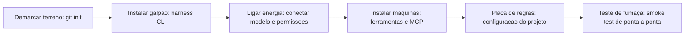

# Capítulo 3: Instalando seu canteiro: preparando o ambiente

# Capítulo 3: Instalando seu canteiro: preparando o ambiente

## Introdução

No Capítulo 2 você desenhou a planta do prédio: as quatro camadas da arquitetura agêntica — Tela, Harness, LLM e Tools — e o papel de cada uma no fluxo completo. A planta está pronta, mas o terreno ainda está vazio. Este capítulo é o primeiro dia de obra de verdade: instalar e configurar o seu canteiro de trabalho, preparar o ambiente, o editor e o repositório git, e verificar que cada camada está de pé antes de começar a construir.

A preparação do ambiente é a etapa mais subestimada do desenvolvimento agêntico — e a que mais separa quem desiste na primeira semana de quem chega ao deploy. Um harness instalado às pressas, um repositório mal inicializado ou um agente sem acesso às ferramentas certas transformam qualquer projeto em um campo de batalha. Ao final deste capítulo, você terá um ambiente completo e verificado: harness operacional, editor conectado, repositório git com histórico limpo e um primeiro comando de teste executando de ponta a ponta.

## Explica

### Por que a ordem de instalação importa

Antes de listar comandos, vale entender por que a ordem é importante. O ambiente agêntico é uma pilha com dependências: primeiro o sistema operacional e as ferramentas base (git, runtime da linguagem), depois o harness — que é o agente em si — e só então as conexões: o editor, as ferramentas MCP e o repositório. Inverter essa ordem — instalar o agente antes do git, por exemplo — funciona na maioria das vezes, mas produz falhas sutis: o harness não encontra o git, o editor não enxerga as ferramentas, o repositório não respeita as regras do projeto. Instalar na ordem certa é a diferença entre um canteiro organizado e um canteiro onde cada ferramenta foi comprada em lojas diferentes e ninguém sabe quem conecta o quê.

### O que exatamente é "instalar o harness"

Instalar o harness é, na prática, instalar o programa que executa o loop do agente na sua máquina: um CLI que você invoca no terminal, que abre uma sessão de conversa com o modelo, que lê os arquivos do projeto, executa comandos com a sua autorização e usa ferramentas externas. A maioria dos harnesses de 2026 é distribuída como pacote de linha de comando — um binário instalável via gerenciador de pacotes — e configurada por um arquivo de configuração na pasta do usuário, com uma camada extra de configuração por projeto (que estudaremos nos Capítulos 6 e 13).

Três conceitos aparecem em qualquer harness, independentemente da marca:

- **Sessão**: uma conversa contínua com o agente, com contexto acumulado. Recomeçar uma sessão do zero é comum e saudável — cada sessão tem um custo de contexto.
- **Configuração por projeto**: arquivos na raiz do repositório que o agente lê automaticamente — instruções, regras, comandos permitidos. É onde o projeto "ensina" o agente sobre si mesmo.
- **Permissões e modos**: o harness opera com níveis de autonomia — desde exigir aprovação para cada comando até executar tudo sozinho dentro de limites configurados. A escolha do nível é uma decisão de governança, não de conveniência.

### Git como fundação do canteiro

O git não é "uma ferramenta opcional" no fluxo AIDD — é a fundação. O DORA, que estuda alta performance de engenharia há anos, lista o controle de versão rigoroso como um dos sete pilares que separam equipes de elite das demais. Para o desenvolvimento agêntico, o git tem um papel adicional e decisivo: é o diário de bordo do canteiro. Cada commit é um marco da obra que permite ao agente (e a você) voltar no tempo, comparar versões, entender o que mudou e reverter decisões ruins. Sem git, um agente autônomo trabalhando em um projeto é um operário cego: não sabe o que mudou, não consegue desfazer, não tem memória do próprio trabalho.

Por isso este capítulo trata git como parte da instalação, e não como "um tópico de versionamento que veremos depois". Um projeto AIDD começa com git inicializado antes da primeira linha de código — e com commits pequenos e frequentes, que são o equivalente a fotografar a obra a cada etapa para o registro histórico.

### O conceito de "verificação de sanidade"

A última peça conceitual é o *smoke test* — o teste de fumaça, a verificação de sanidade. Depois de instalar tudo, você não pode simplesmente assumir que funciona: precisa provar. Um harness bem instalado responde a um comando trivial; um git bem configurado registra commits; um repositório bem estruturado tem uma árvore limpa e um `.gitignore` que mantém artefatos fora do histórico. A verificação é rápida — cinco minutos — e economiza horas de diagnóstico depois.

## Ilustra

### O Canteiro no Dia Um: da Terra Batida ao Galpão de Ferramentas

Imagine o dia um da obra real. O terreno está limpo, mas vazio. A primeira tarefa do mestre de obras não é assentar tijolos — é montar a infraestrutura: demarcar o terreno (repositório), instalar o galpão de ferramentas (harness), ligar a energia e a água (conexões e permissões) e colocar uma placa na entrada com as regras do canteiro (configuração do projeto). Só quando essa infraestrutura está de pé é que o primeiro tijolo faz sentido.

A ordem parece burocrática, mas tem lógica: se você assentar tijolos sem demarcar o terreno, não sabe os limites da obra; se instalar ferramentas sem galpão, elas estragam na chuva; se ligar a energia sem placa de regras, o primeiro operário faz o que bem entende. Cada etapa da preparação existe para que as etapas seguintes — as de construção de verdade — possam acontecer com segurança e rastreabilidade.



### O Galpão sem Demarcação: Por Que a Ordem é o Segredo

Aqui está o ponto contraintuitivo deste capítulo, e por isso ele merece a segunda camada de analogia. A primeira camada mostrou a sequência do dia um. A segunda é sobre por que pular a demarcação — o git — condena o resto da obra, mesmo com as melhores ferramentas.

Imagine dois canteiros idênticos no dia um. No primeiro, o mestre demarca o terreno antes de tudo: cada estaca registrada, cada área documentada, uma cerca ao redor da obra. No segundo, o mestre acha demarcação "burocracia": vai direto instalar o galpão e as máquinas. Na primeira semana, o segundo canteiro parece mais rápido — máquinas rodando, paredes subindo. Na quinta semana, chega o dia em que uma parede precisa ser deslocada dois metros. No primeiro canteiro, o mestre consulta as estacas, entende o impacto, move com segurança. No segundo, ninguém sabe onde ficava cada coisa, uma máquina derruba uma parede que não devia, e a obra perde dois dias. Como Mestre de Obras, você vai descobrir que o git não é um imposto: é a memória da obra, e sem memória, velocidade vira caos.

## Técnica

### Passo a Passo: a Instalação Completa

Este é o passo a passo de instalação que você vai executar na sua máquina. Os comandos usam o gerenciador de pacotes da sua plataforma; substitua pelos equivalentes do seu sistema operacional.

#### Etapa 1: Ferramentas base

Antes do harness, verifique as ferramentas fundacionais. Git é obrigatório; o runtime da sua linguagem principal (Python, Node) será necessário já no Capítulo 4:

```bash
# Verifique o que já está instalado
git --version
python --version
node --version

# Se algo faltar, instale pelo gerenciador de pacotes da sua plataforma
# macOS (Homebrew):
#   brew install git
# Debian/Ubuntu:
#   sudo apt update && sudo apt install -y git
# Windows: use o instalador oficial ou winget install --id Git.Git
```

#### Etapa 2: Instalar o harness

O harness é instalado como um pacote de linha de comando. O comando exato depende da ferramenta escolhida, mas o padrão é sempre o mesmo:

```bash
# Padrão típico de instalação de harness (exemplos por ecossistema)
# Via npm (Node):
#   npm install -g <nome-do-harness>
# Via pip (Python):
#   pip install <nome-do-harness>
# Via instalador oficial:
#   curl -fsSL https://instalador.exemplo.com/install.sh | bash

# Após instalar, verifique a versão:
<harness> --version
```

Se a instalação do harness pedir login em uma conta de modelo — quase todos pedem, para autenticar o acesso ao LLM — faça o login. Esse passo conecta a camada Harness à camada LLM da arquitetura do Capítulo 2.

#### Etapa 3: Configurar o nível de permissão inicial

Antes do primeiro uso, decida o nível de autonomia. Para iniciantes, a recomendação é o modo com aprovação explícita para comandos que alteram arquivos ou executam processos:

```bash
# Exemplo conceitual de configuração de permissões (varia por harness)
# Modo 1: aprovar cada comando (mais seguro, recomendado para iniciantes)
# Modo 2: aprovar apenas comandos destrutivos (para quem já confia no fluxo)
# Modo 3: execução autônoma dentro de regras (após governança madura, Cap. 13)
```

Guarde essa escolha: ela será refinada nos Capítulos 13 (hooks e governança) e 16 (economia de tokens), mas começar com aprovação explícita é o caminho seguro.

#### Etapa 4: Inicializar o repositório do projeto

Com as ferramentas prontas, crie a estrutura do projeto e inicialize o git:

```bash
# Crie a pasta do projeto TorreDeControle
mkdir torrecontrole
cd torrecontrole

# Inicialize o repositório
git init

# Crie o arquivo .gitignore — o diário não registra lixo
cat > .gitignore << 'EOF'
# Dependências
node_modules/
venv/
__pycache__/
*.pyc

# Artefatos e ambiente
.env
*.log
dist/
build/

# Sistema
.DS_Store
Thumbs.db
EOF

# Commit inicial — a primeira estaca do diário de bordo
git add .gitignore
git commit -m "chore: inicia o canteiro com gitignore padrao"
```

O `.gitignore` é mais importante do que parece: sem ele, o agente (e o git) rastreiam lixo, inflam o repositório e poluem o diário de bordo. A regra de ouro: **nunca commitar o que é gerado, só o que é fonte**.

#### Etapa 5: Estrutura de pastas do projeto

Defina a estrutura mínima que o projeto vai usar — e registre-a no git desde o início:

```bash
# Estrutura inicial do TorreDeControle
mkdir -p app/services app/api frontend tests docs

# Documente a estrutura no README — o agente vai ler isto
cat > README.md << 'EOF'
# TorreDeControle

Aplicativo web de gestão de tarefas de equipe — projeto prático do livro
"AI Driven Development: Do Zero ao Deploy".

## Estrutura
- app/            código da aplicação
  - services/     lógica de negócio
  - api/          endpoints REST
- frontend/       interface web
- tests/          testes automatizados
- docs/           especificação e documentação

## Comandos
(serão definidos nos próximos capítulos)
EOF

git add README.md
git commit -m "docs: estrutura inicial do projeto"
```

#### Etapa 6: O teste de fumaça

Agora a verificação de sanidade — provar que a pilha inteira funciona:

```bash
# 1. O harness responde?
<harness> "responda apenas: canteiro pronto"

# 2. O git registra?
git log --oneline

# 3. O harness enxerga o projeto?
#   (abra uma sessão na raiz do projeto e pergunte a estrutura)
```

O teste de fumaça passa quando: o harness responde de verdade, o git mostra os dois commits e o agente, ao ser perguntado "qual a estrutura deste projeto?", descreve a árvore de pastas corretamente — prova de que ele está lendo o repositório e o README.

### Script de Verificação Automatizada

Para que o teste de fumaça não dependa da memória, registre-o num script executável. Este é um exemplo em Python que verifica as três condições da sanidade:

```python
# verificar_ambiente.py — Smoke test do canteiro
import shutil
import subprocess
import sys
from pathlib import Path

REQUISITOS = ["git", "python", "node"]
PASTAS = ["app", "app/services", "app/api", "frontend", "tests", "docs"]

def verificar_ferramentas() -> list[str]: """Retorna a lista de ferramentas base ausentes no sistema.""" ausentes = [] for ferramenta in REQUISITOS: if shutil.which(ferramenta) is None: ausentes.append(ferramenta) return ausentes

def verificar_repositorio() -> list[str]: """Verifica se o diretorio e um repositorio git com commits.""" problemas = [] if not (Path(".git").exists()): problemas.append("diretorio .git ausente (rode git init)") return problemas try: resultado = subprocess.run( ["git", "log", "--oneline"], capture_output=True, text=True, check=True, ) if not resultado.stdout.strip(): problemas.append("repositorio sem commits (fac'a o commit inicial)") except subprocess.CalledProcessError: problemas.append("git nao esta funcional neste diretorio") return problemas

def verificar_estrutura() -> list[str]:
    """Verifica se as pastas esperadas existem."""
    return [f"pasta {p} ausente" for p in PASTAS if not Path(p).is_dir()]

def main() -> None: problemas: list[str] = [] problemas += verificar_ferramentas() problemas += verificar_repositorio() problemas += verificar_estrutura() if problemas: print("CANTEIRO COM PROBLEMAS:") for p in problemas: print(f"  - {p}") sys.exit(1) print("CANTEIRO PRONTO: ferramentas, git e estrutura OK")

if __name__ == "__main__":
    main()
```

Rode `python verificar_ambiente.py` e ele deve imprimir `CANTEIRO PRONTO`. Este script — e o hábito de automatizar verificações — vai se repetir ao longo de toda a obra, porque agentes confiam em verificações determinísticas, não em "eu acho que está tudo certo".

## Aplica

### A Cena de Contraste: O Canteiro Sem Cerca

Imagine a segunda-feira em que você decide "não perder tempo com configuração" e vai direto pedir código ao agente. Você instalou o harness às pressas, não inicializou git ("depois eu versiono"), e começou a conversar. Na quarta-feira, o projeto tem 30 arquivos, três versões de funcionalidade misturadas e nenhum registro do que o agente fez. O agente tenta refatorar, quebra o que funcionava, e você não consegue voltar atrás — porque não existe diário de bordo. A tarde vira uma reconstituição arqueológica: abrir arquivo por arquivo tentando lembrar o que era de verdade.

O diagnóstico: você pulou a fundação. Sem git, o agente opera sem memória e sem reversão; sem estrutura, ele espalha arquivos aleatoriamente; sem teste de fumaça, você nem sabe se o harness está lendo o projeto direito. A culpa não é do agente — é do canteiro sem demarcação.

A correção: você recomeça com método. Uma hora de setup, e o projeto ganha git com histórico, estrutura documentada e teste de fumaça passando. Na semana seguinte, o mesmo agente trabalha o dobro: cada mudança é um commit rastreável, cada refatoração pode ser revertida, e o repositório é a memória que faltava. O tempo "perdido" no setup foi o maior investimento da semana.

### Armadilhas Comuns na Preparação do Ambiente

- **Instalar sem verificar versões**: harness, git e runtimes têm requisitos mínimos; instale as versões atuais e anote as versões no README para reprodutibilidade.
- **Committar artefatos e segredos**: o `.env` com chaves de API não pode entrar no git — é a falha de segurança número um de projetos iniciantes; o `.gitignore` é sua primeira linha de defesa.
- **Usar apenas a Tela sem entender o harness**: depender 100% do chat da IDE sem conhecer o CLI do harness limita o que você consegue configurar; o Capítulo 6 mostra como o projeto fala com o agente por arquivos.
- **Ignorar o teste de fumaça**: "vai funcionar" não é verificação. Rode o smoke test depois de qualquer mudança de ambiente.
- **Começar o projeto em pastas fora do repositório**: o agente precisa do contexto do repositório — trabalhe sempre na raiz do projeto versionado.

### Exercício Prático

Execute o passo a passo completo deste capítulo na sua máquina: instale o harness, inicialize o repositório da TorreDeControle com `.gitignore` e `README.md`, crie a estrutura de pastas, faça os commits iniciais e rode `verificar_ambiente.py` até o `CANTEIRO PRONTO`. Registre no README as versões das ferramentas instaladas.

### Aprofundamento: Diagnóstico de Instalação (os erros mais comuns)

O passo a passo funciona na maioria das máquinas — mas quando não funciona, o problema quase sempre está numa lista curta de causas. Este é o guia de diagnóstico dos erros mais comuns de instalação, com sintoma, causa e correção:

| Sintoma | Causa mais provável | Correção |
|---|---|---|
| `command not found` após instalar | O diretório do pacote não está no PATH | Reabra o terminal; adicione o diretório ao PATH no arquivo de perfil do shell |
| O harness instala, mas não autentica | Sessão de login expirada ou token ausente | Refaça o login; verifique se o token não está em variável de ambiente conflitante |
| O agente não enxerga o projeto | Sessão aberta fora da raiz do repositório | Abra a sessão na raiz (`cd torrecontrole`) e reinicie |
| Git reclama de identidade | `user.name` e `user.email` não configurados | `git config --global user.name "Seu Nome"` e `git config --global user.email "voce@exemplo.com"` |
| Teste de fumaça falha na estrutura | Pastas criadas na máquina, mas não commitadas | Confira que as pastas estão na raiz e commitadas; o verificador lê do disco, não do git |
| Permissões negadas no terminal | O harness pediu aprovação e foi negada | Revise a permissão no diálogo do harness; aprovações negadas não persistem para sempre |

O padrão do diagnóstico é o mesmo de toda a obra: **sintoma → causa provável → correção verificável**. Não adivinhe: siga a linha, aplique a correção e reexecute o teste de fumaça para provar que resolveu. Se duas correções seguidas não resolverem, o problema não está na lista — e aí a pesquisa dirigida (buscar o erro exato na documentação do harness, com o texto literal da mensagem) é mais rápida que tentar ao acaso.

```bash
# Triagem rápida de ambiente em um comando:
# Verifica PATH, git config e estrutura num único golpe
which git && git --version
which python && python --version
git config --global user.name || echo "IDENTIDADE GIT NAO CONFIGURADA"
test -d app && echo "estrutura OK" || echo "pastas do projeto ausentes"
```

Um ambiente com identidade git configurada, PATH correto e estrutura no lugar é o terreno demarcado do Capítulo 3 — e é a fundação silenciosa de todos os capítulos seguintes.

### Aprofundamento: O Primeiro Dia de Obra em Checklist

O Capítulo 3 termina com o checklist do primeiro dia — a lista que transforma a instalação de processo em rotina. Ela consolida o capítulo em doze passos verificáveis, na ordem exata:

```markdown
# Checklist do Dia Um — Canteiro Pronto

## Ferramentas base
1. [ ] git instalado e configurado (user.name e user.email).
2. [ ] Runtime da linguagem instalado (python/node).

## Harness
3. [ ] Harness instalado e autenticado.
4. [ ] Nível de permissão inicial definido (aprovação explícita).

## Repositório
5. [ ] Pasta do projeto criada e git init executado.
6. [ ] .gitignore criado (nunca commitar artefatos e segredos).
7. [ ] README.md com estrutura e comandos.
8. [ ] Estrutura de pastas criada e commitada.
9. [ ] Commit inicial realizado (diário de bordo aberto).

## Verificação
10. [ ] verificar_ambiente.py aprovando (CANTEIRO PRONTO).
11. [ ] Teste de fumaça: agente descreve a estrutura do projeto.
12. [ ] Versões das ferramentas registradas no README.
```

O checklist tem duas propriedades: ele é *a prova do canteiro pronto* — se os doze itens estão marcados, o ambiente sustenta os próximos capítulos; e ele é *reutilizável* — o mesmo checklist serve para o primeiro dia de qualquer projeto futuro, porque a ordem (ferramentas → harness → repositório → verificação) é invariante. Como o painel de testes do Capítulo 14 e o painel de operação do Capítulo 19, o checklist do dia um é a verificação determinística no lugar da confiança — o padrão que atravessa o livro inteiro.

## Conclusão

Neste capítulo você preparou o canteiro de verdade: instalou as ferramentas base e o harness, configurou o nível de permissão inicial, inicializou o repositório git com `.gitignore` e estrutura documentada, e provou a sanidade do ambiente com um teste de fumaça automatizado. A lição central é a ordem: demarcar antes de construir, registrar antes de avançar, verificar antes de confiar.

Seu desafio: ter o ambiente completo e verificado — harness operacional, repositório com commits iniciais e `verificar_ambiente.py` passando — antes de seguir para o Capítulo 4.

No Capítulo 4, você vai fazer o primeiro diálogo de engenharia: escrever seu primeiro prompt bem estruturado, usando o canteiro que acabou de montar para pedir a primeira entrega real da TorreDeControle.