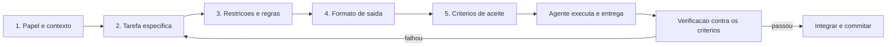

# Capítulo 4: O primeiro diálogo: escrevendo seu primeiro prompt de engenharia

# Capítulo 4: O primeiro diálogo: escrevendo seu primeiro prompt de engenharia

## Introdução

No Capítulo 3, seu canteiro ficou pronto: harness instalado, repositório versionado, estrutura documentada e o teste de fumaça passando. Agora vem o momento que você esperava desde o dia um: conversar com o agente e pedir a primeira entrega real do projeto TorreDeControle. Mas há um detalhe que separa quem conversa de quem constrói: a qualidade do diálogo. Um mesmo agente, com o mesmo cérebro e as mesmas ferramentas, produz resultados radicalmente diferentes dependendo de como o pedido é formulado — não por magia, mas porque o pedido determina o contexto que o modelo recebe.

Este capítulo é o primeiro curso de engenharia de prompt aplicada a agentes de código. Você vai aprender a estrutura de um prompt de engenharia eficaz, os erros mais comuns de quem está começando — que custam horas de retrabalho — e vai escrever, passo a passo, o primeiro prompt real da TorreDeControle: o pedido para criar o modelo de domínio inicial. Ao final, você terá um repertório de padrões de prompt que vai usar em todos os capítulos restantes.

## Explica

### Por que prompt ainda importa na era dos agentes

Uma objeção legítima precisa ser enfrentada logo de início: "se os agentes são autônomos, por que eu preciso aprender a escrever prompts?" A resposta tem duas partes. Primeiro, autonomia não significa telepatia: o agente executa o que compreende, e a compreensão começa na instrução. Segundo, e mais importante, a engenharia de prompt evoluiu — na era dos agentes, ela virou *engenharia de contexto*: o prompt é apenas a primeira peça do contexto que o agente recebe, ao lado dos arquivos do projeto, das regras e da memória. Mas o prompt continua sendo a peça que você controla diretamente em cada interação.

Um bom prompt para agente de código tem uma função específica: reduzir a ambiguidade até o ponto em que o modelo pode agir com confiança. Cada ambiguidade não resolvida no prompt vira uma suposição do modelo — e suposições em código são bugs em potencial. Quando você diz "crie o modelo de tarefas", o agente pode assumir que tarefas têm prioridade, que o status é um enum ou que o responsável é obrigatório — cada uma dessas suposições pode estar errada para o seu domínio. O prompt eficaz não elimina todas as suposições (isso seria impossível), mas elimina as perigosas.

### A anatomia de um prompt de engenharia

Existe uma estrutura canônica para prompts de código que sobreviveu à transição de chat para agentes, porque ela espelha como um bom briefing de engenharia funciona. Ela tem cinco partes:

1. **Papel e contexto**: quem o agente é e em que projeto está trabalhando. Ex.: "Você é o desenvolvedor sênior do projeto TorreDeControle, um app de gestão de tarefas em Python/FastAPI."
2. **Tarefa específica**: o que fazer, com verbo no imperativo e escopo delimitado. Ex.: "Crie o modelo de domínio da entidade Tarefa."
3. **Restrições e regras**: o que não fazer e as convenções a respeitar. Ex.: "Use apenas a biblioteca padrão e pydantic; não crie a camada de API ainda."
4. **Formato de saída**: como entregar. Ex.: "Entregue o arquivo `app/models/tarefa.py` completo, com docstring e tipagem."
5. **Critérios de aceite**: como saber se o trabalho está pronto. Ex.: "O arquivo deve compilar com `python -m py_compile` e cobrir os campos da especificação RF3."

Cada parte tem uma função: o papel calibra o tom e o nível técnico; a tarefa define o objetivo; as restrições limitam o espaço de solução; o formato elimina a surpresa de entrega; os critérios de aceite permitem verificação. Um prompt com as cinco partes é uma especificação em miniatura — e a especificação, como você verá no Capítulo 7, é o contrato central do AIDD.

### O ciclo prompt → plano → código → revisão

Um erro conceitual comum de iniciantes é achar que um prompt bom resolve tudo de uma vez — "pedi, recebi, pronto". Na prática, o fluxo eficaz com agentes é iterativo: o prompt inicial é o ponto de partida de um ciclo em que o agente propõe um plano, você ajusta, ele implementa, você revisa, e a próxima iteração refina o pedido. A qualidade não está em acertar o prompt de primeira: está em usar o resultado de cada iteração para melhorar o próximo prompt. Esse é o mesmo princípio do canteiro: a primeira parede quase nunca fica perfeita; o que importa é o ciclo de inspeção e ajuste.

### Prompt não é o mesmo que programar

A última distinção conceitual é a mais sutil: escrever um bom prompt não é programar — mas é uma habilidade de engenharia com a mesma natureza. Prompts são artefatos de engenharia: têm especificação, versões, testes (você testa se o prompt produz o resultado certo) e manutenção. A diferença é que o "código" do prompt é linguagem natural, e o "compilador" é um modelo probabilístico — o que torna a reprodutibilidade mais difícil e a verificação mais importante. Por isso este livro trata prompt como artefato versionável: os prompts do projeto moram em arquivos (skills, no Capítulo 9; specs, no Capítulo 7), não na sua cabeça nem no histórico do chat.

## Ilustra

### O Briefing do Mestre de Obras

Volte ao canteiro. Você não entrega uma planta e espera que o operário leia sua mente — você faz um briefing. Um bom briefing de obra tem cinco partes: o papel da equipe ("vocês são a equipe de fundação"), a tarefa ("assentem as estacas da ala norte"), as restrições ("não toquem na ala sul; usem apenas concreto classe C25"), o formato de entrega ("relatório com fotos e medições") e os critérios de aceite ("a vistoria do engenheiro precisa aprovar"). O mesmo briefing, dado a duas equipes diferentes, produz obras compatíveis — porque o que os coordena é o documento, não o talento individual.

O prompt de engenharia é exatamente esse briefing. O agente não é um gênio que adivinha intenções; é um operário altamente competente que precisa de um briefing à altura da competência. Um briefing vago — "faz aí o modelo de tarefas" — produz um resultado genérico, correto na superfície e errado no detalhe, como uma parede assentada sem especificação de concreto.



### O Briefing Frouxo vs. o Briefing de Engenharia

Aqui está o ponto contraintuitivo deste capítulo — a segunda camada de analogia. A primeira mostrou a anatomia do briefing. A segunda é sobre por que *mais* texto no prompt quase sempre é pior, e *mais estrutura* quase sempre é melhor.

Imagine dois mestres de obras dando o briefing da mesma estaca. O primeiro fala por vinte minutos: conta a história do terreno, as dificuldades do cliente, opiniões sobre o clima, e termina com "então faz aí, você entendeu". O segundo fala por dois minutos: papel, tarefa, restrições, formato, critérios — e encerra. Qual equipe entrega a estaca certa? A segunda, invariavelmente. O problema do primeiro briefing não é a falta de informação — é o excesso de ruído, que dilui a instrução e abre espaço para interpretações divergentes.

Com prompts é idêntico: instruções longas e difusas degradam a precisão do modelo, porque o sinal se perde no ruído. Estrutura curta e densa — cinco partes, cada uma com uma frase — domina parágrafos longos. Como Mestre de Obras, você vai internalizar esta regra: **prompt bom é prompt estruturado, não prompt longo**.

## Técnica

### Padrão 1: O Prompt Completo de Cinco Partes

O primeiro padrão é o prompt completo, com as cinco partes. Este é o prompt que você vai usar para pedir o modelo de domínio da TorreDeControle — guarde-o, ele será refinado ao longo da obra:

```markdown
## Papel e contexto
Você é o desenvolvedor sênior do projeto TorreDeControle, um aplicativo web de
gestão de tarefas de equipe em Python com FastAPI. O projeto usa pydantic para
validação e segue a especificação em docs/especificacao.md.

## Tarefa específica
Crie o modelo de domínio da entidade Tarefa conforme o requisito RF3 da
especificação (título, descrição, status, prioridade, responsável).

## Restrições e regras
- Use apenas pydantic (sem ORM, sem banco de dados ainda).
- Não crie a camada de API nem os endpoints.
- Siga o padrão de nomes em inglês para campos e snake_case para arquivos.
- Não use campos opcionais onde a especificação exige obrigatórios.

## Formato de saída
Entregue o arquivo app/models/tarefa.py completo, com docstring explicando o
modelo e tipagem em todos os campos.

## Critérios de aceite
1. O arquivo compila com: python -m py_compile app/models/tarefa.py
2. Os campos refletem exatamente o RF3 da especificação.
3. Status e prioridade são Enum com os valores definidos no RF3.
```

### Padrão 2: Prompt de Refinamento (Iteração)

O segundo padrão é para a segunda rodada — quando o resultado veio parcial e você precisa de ajuste. A regra de ouro: **nunca diga apenas "está errado"; diga o que está errado e o que espera**. O prompt de refinamento tem três partes: o que está bom, o que precisa mudar, e o critério de aceite do ajuste:

```markdown
O que está bom:
- A estrutura do modelo está correta e o arquivo compila.

O que precisa mudar:
1. O campo status está como string; deve ser Enum com os valores
   ("a_fazer", "em_andamento", "concluida") conforme RF3.
2. A prioridade deve ter default "media" e não ser obrigatória.

Critério de aceite:
- O arquivo continua compilando e o Enum está definido no mesmo arquivo.
```

Esse padrão evita o ciclo frustrante de "refaça" genérico — o agente sabe exatamente o que ajustar, e a iteração converge em uma ou duas rodadas em vez de cinco.

### Padrão 3: Prompt de Verificação (Questionar Antes de Codar)

O terceiro padrão é o mais valioso para iniciantes: o prompt de verificação, em que você pede ao agente para *questionar* o briefing antes de executar. Ele transforma o agente de executor passivo em parceiro de engenharia:

```markdown
Antes de implementar o modelo de Tarefa (RF3), me faça as perguntas que um
desenvolvedor sênior faria sobre esta especificação. Aponte:
1. Ambiguidades no requisito (campos não especificados, defaults implícitos).
2. Decisões de design que eu preciso tomar antes de codar.
3. Conflitos com a estrutura existente do projeto.

Não escreva código ainda — apenas as perguntas e decisões pendentes.
```

Este padrão é poderoso porque aproveita a capacidade do modelo de identificar lacunas — e transforma o diálogo em um loop de engenharia real, em que você responde as perguntas e só então pede a implementação. Na prática, ele economiza mais tempo do que qualquer outro padrão deste capítulo.

### O Prompt da Primeira Entrega Real

Agora a aplicação completa: o prompt que você vai executar de verdade, integrando os três padrões. Ele pede ao agente o modelo de domínio inicial, com verificação prévia:

```python
# primeiro_dialogo.py — Ajuda a montar o prompt da primeira entrega
from dataclasses import dataclass

@dataclass class PromptDeEngenharia: papel: str tarefa: str restricoes: list[str] formato_saida: str criterios_aceite: list[str]

def montar(self) -> str: """Monta o prompt completo no formato de cinco partes.""" restricoes = "\n".join(f"- {r}" for r in self.restricoes) criterios = "\n".join(f"{i}. {c}" for i, c in enumerate(self.criterios_aceite, 1)) return f""" ## Papel e contexto {papel}

## Tarefa específica
{tarefa}

## Restrições e regras
{restricoes}

## Formato de saída
{formato_saida}

## Critérios de aceite
{criterios}
"""

def montar_prompt_tarefa() -> str: """Monta o prompt da primeira entrega: modelo de dominio RF3.""" prompt = PromptDeEngenharia( papel="Você é o desenvolvedor sênior do projeto TorreDeControle (FastAPI).", tarefa="Crie o modelo de domínio da entidade Tarefa conforme RF3.", restricoes=[ "Use apenas pydantic, sem ORM.", "Não crie a camada de API.", "Status e prioridade como Enum.", ], formato_saida="Arquivo app/models/tarefa.py completo, com docstring e tipagem.", criterios_aceite=[ "Compila com python -m py_compile.", "Campos refletem exatamente o RF3.", "Enums com valores do RF3.", ], ) return prompt.montar()

def main() -> None:
    """Imprime o prompt pronto para colar na sessão do agente."""
    print(montar_prompt_tarefa())

if __name__ == "__main__":
    main()
```

Rode `python primeiro_dialogo.py` e cole a saída na sessão do seu agente. O resultado deve ser o arquivo `app/models/tarefa.py` — a primeira entrega real da obra. Depois, rode a verificação: `python -m py_compile app/models/tarefa.py`.

### A Verificação da Entrega

Entregue não é sinônimo de pronto. Depois que o agente produzir o arquivo, a verificação é sua responsabilidade — e ela segue os critérios de aceite do prompt:

```bash
# 1. O arquivo compila?
python -m py_compile app/models/tarefa.py && echo "COMPILA OK"

# 2. O arquivo reflete a especificação?
#   (compare os campos com o RF3 de docs/especificacao.md)

# 3. Commitar a entrega no diário de bordo
git add app/models/tarefa.py
git commit -m "feat: modelo de dominio da entidade Tarefa (RF3)"
```

O commit é parte do fluxo: cada entrega aprovada vira um marco no diário de bordo, exatamente como cada etapa vistoriada vira registro no canteiro.

## Aplica

### A Cena de Contraste: O Prompt de Uma Frase

Imagine sua primeira noite real com o agente, empolgado. Você abre a sessão e digita: "cria o modelo de tarefas aí". O agente responde com um modelo — competente na superfície: campos nome, descrição, data — e você, sem conferir a especificação, aceita e pede o próximo. Três dias depois, o frontend que o agente construiu em cima desse modelo quebra: o status era string solta, a prioridade não existia, e o "responsável" virou um campo de texto livre em vez de referência a usuário. A reescrita custa um dia inteiro de trabalho.

O diagnóstico: o prompt de uma frase delegou as decisões de design para o modelo — que não tinha como saber o RF3, os Enums, o padrão de nomes ou as restrições de camada. O agente não errou: ele executou perfeitamente a instrução vaga que recebeu. O erro foi no briefing.

A correção: você adota o prompt de cinco partes e o padrão de verificação. Na semana seguinte, o mesmo agente, com o prompt estruturado, entrega o modelo de Tarefa correto de primeira — com Enum, defaults e tipagem — e o frontend construído depois não quebra. A diferença não foi o modelo: foi o briefing. Você passou de "espectador de código gerado" para "mestre de obras que especifica e verifica".

### Armadilhas Comuns de Prompts para Iniciantes

- **Prompt de uma frase**: "cria aí" delega todas as decisões ao modelo. Use a estrutura de cinco partes.
- **Prompt sem critérios de aceite**: sem critérios, não há como saber se a entrega está pronta — e o agente não tem como verificar o próprio trabalho.
- **Prompt longo e difuso**: mais texto não é melhor; estrutura curta e densa domina. Se o prompt passa de uma tela, quebre em etapas.
- **"Refaça" genérico**: diga o que está bom, o que muda e o critério de aceite — ou a iteração vira um ping-pong infinito.
- **Pular o prompt de verificação**: pedir ao agente que aponte ambiguidades antes de codar economiza mais tempo do que qualquer outro hábito.
- **Não versionar os prompts**: prompts bons são artefatos reutilizáveis — guarde-os como skills (Capítulo 9) ou specs (Capítulo 7), nunca só no histórico do chat.

### Exercício Prático

Execute o prompt completo da TorreDeControle (via `primeiro_dialogo.py`), verifique a entrega com `py_compile`, faça o commit e responda no seu diário de projeto: quais decisões o prompt de cinco partes tirou das mãos do modelo? Quais suposições você ainda vê no arquivo entregue?

### Aprofundamento: A Biblioteca de Prompts do Mestre de Obras

Um bom prompt é um artefato que se reutiliza — e o profissional mantém uma biblioteca de prompts testados, versionados como skills no Capítulo 9. Aqui estão quatro prompts prontos, de aplicação imediata, que cobrem as situações mais comuns do dia a dia agêntico:

**1. Prompt de Exploração (quando você não conhece o código):**

```markdown
Explore a estrutura deste projeto e me explique em 10 linhas: o que ele faz,
quais são as camadas principais, onde mora a lógica de negócio e quais são os
pontos de entrada. Não modifique nada; apenas reporte.
```

**2. Prompt de Diagnóstico (quando algo quebrou):**

```markdown
O seguinte erro aconteceu: <cole a mensagem exata>. Investigue as causas
possíveis no código e me explique: (1) o que a mensagem diz que aconteceu,
(2) onde no código isso pode nascer, (3) como confirmar cada hipótese com um
teste ou log. Não corrija nada ainda.
```

**3. Prompt de Implementação com Verificação (o padrão do Capítulo 8):**

```markdown
Implemente <tarefa> conforme a especificação <referência>. Critérios de
aceite: <lista>. Ao terminar, rode <comando de verificação> e reporte o
resultado real. Não entregue até a verificação passar.
```

**4. Prompt de Revisão (o protocolo do Capítulo 15):**

```markdown
Revise a entrega <arquivos> contra <spec> e <manual>. Reporte: conformidade,
violaçoes, riscos e sugestoes — cada item apontando o trecho exato. Veredito:
APROVADO, APROVADO COM RESSALVAS ou REJEITADO.
```

A biblioteca tem três regras: (1) prompts testados viram skills — se você usou o mesmo prompt três vezes, ele merece virar arquivo; (2) prompts não são sagrados — cada uso que revela ambiguidade é uma revisão do prompt; (3) o prompt é o começo, não o fim — o ciclo de iteração do Capítulo 4 continua valendo mesmo com o melhor prompt. A biblioteca não substitui o método: é o método, armazenado de forma reutilizável.

### Aprofundamento: A Roda do Diálogo Agêntico

O ciclo prompt → resposta → iteração do Capítulo 4 ganha uma forma visual que você vai reconhecer em todos os capítulos seguintes: a **roda do diálogo**. Ela tem seis posições, e cada uma tem uma pergunta que a ativa:

1. **Pedir** — "O que eu quero que o agente faça?" (o prompt de cinco partes).
2. **Planejar** — "Qual o passo a passo antes do código?" (o agente propõe; você ajusta).
3. **Executar** — "O agente implementa a fatia" (com as restrições do prompt).
4. **Verificar** — "O critério de aceite passou?" (comando real, resultado real).
5. **Refinar** — "O que precisa mudar?" (o prompt de refinamento: o que está bom, o que muda, critério).
6. **Registrar** — "O que ficou de aprendizado?" (a decisão vai para o diário, o prompt testado vira skill).

A roda é o motor de todo o livro: o Capítulo 4 a apresenta, o Capítulo 8 a usa no scaffolding, o Capítulo 14 no TDD com agente, o Capítulo 19 na iteração de produção. A propriedade mais importante da roda é que ela *não para de girar*: mesmo a melhor entrega alimenta o passo 6 (registrar), que melhora o passo 1 da próxima rodada. É o loop de melhoria contínua em miniatura — e é o que diferencia o diálogo dirigido do ping-pong de conversa.

```bash
# Diagnostico da roda: onde o dialogo travou?
# 1. Pedido vago? -> reforque as cinco partes
# 2. Sem plano? -> peça o plano antes do codigo
# 3. Verificacao pulada? -> rode o criterio de aceite
# 4. Iteracao sem direcao? -> use o prompt de refinamento
```

## Conclusão

Neste capítulo você fez o primeiro diálogo de engenharia com o agente: aprendeu a anatomia do prompt de cinco partes — papel, tarefa, restrições, formato, critérios —, os padrões de refinamento e de verificação, e aplicou tudo na primeira entrega real da TorreDeControle, o modelo de domínio da entidade Tarefa. A lição central: prompt não é texto, é especificação — e especificação boa é estruturada, curta e verificável.

Seu desafio: ter a primeira entrega commitada — `app/models/tarefa.py` compilando e refletindo o RF3 — e ter respondido às perguntas do exercício no seu diário de projeto.

No Capítulo 5, vamos construir a fundação invisível: a engenharia de contexto, o entendimento das janelas de contexto e o motivo pelo qual a qualidade do que você entrega ao modelo importa mais do que o tamanho da janela.