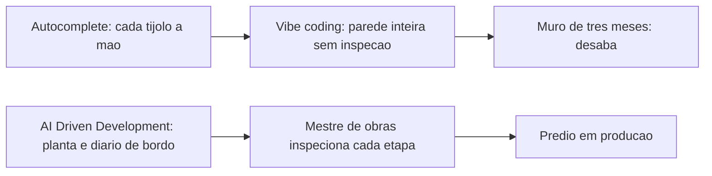
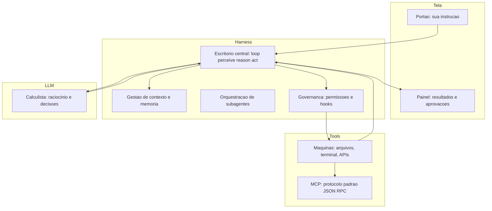
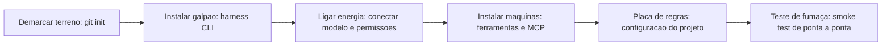
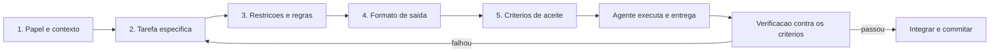

# Fundamentos — O Terreno Baldio


# Capítulo 1: O que é AI Driven Development (e o que ele não é)

# Capítulo 1: O que é AI Driven Development (e o que ele não é)

## Introdução

Você está diante de um terreno baldio. Não há planta, não há fundação, não há nada além de terra batida e a promessa de um prédio. Este livro é a construção desse prédio — um projeto real de software chamado **TorreDeControle**, que você vai erguer do zero até a entrega das chaves, isto é, até o deploy em produção. E a ferramenta que vai transformar você em mestre de obras não é um editor mais bonito nem um autocomplete mais inteligente: é uma forma nova de desenvolver software, em que agentes de inteligência artificial participam de cada etapa da construção, da primeira estaca à vistoria final.

Antes de assentar a fundação, porém, você precisa saber exatamente o que está construindo. Este capítulo define com precisão o que é AI Driven Development (AIDD), separa o termo de vizinhos confusos como *vibe coding* e *autocomplete*, e mostra, com dados de mercado, por que 2026 é o ano em que essa forma de trabalhar deixou de ser promessa de laboratório para se tornar o padrão do setor. Ao final, você será capaz de explicar para qualquer pessoa — inclusive para um recrutador — o que é AIDD, o que ele não é, e por que essa distinção muda a forma como você vai encarar o resto desta obra.

## Explica

Comece pela definição que vamos usar em toda a obra: AI Driven Development é a abordagem em que fluxos inteiros do ciclo de vida de software — requisitos, especificação, código, testes, revisão, integração e deploy — são impulsionados e orquestrados por agentes de IA, com o engenheiro humano atuando como arquiteto, auditor e decisor final. Repare no que essa definição inclui e no que ela exclui. Ela não diz "usar IA para escrever código": isso é autocomplete. Ela diz que a IA participa do fluxo inteiro, da concepção à operação — e é exatamente essa abrangência que a diferencia de tudo que veio antes.

A distinção mais importante para quem está começando é entre três modos de trabalho que parecem a mesma coisa, mas não são. O primeiro é o *vibe coding*, termo cunhado por Andrej Karpathy em fevereiro de 2025 para descrever o fluxo em que o desenvolvedor conversa com a IA em linguagem natural e aceita o código gerado em bloco, sem revisar linha a linha. O segundo é o *agentic coding* (engenharia agêntica), em que agentes autônomos executam tarefas complexas de ponta a ponta — refatoração profunda, migração de framework, geração de suíte de testes — mantendo o julgamento de engenharia e a responsabilidade final com o humano. O terceiro, e mais amplo, é o AIDD propriamente dito: o guarda-chuva metodológico e estratégico que engloba governança, dados, segurança, métricas e integração com plataformas internas, dentro do qual vibe coding e agentic coding são apenas peças táticas.

Essa hierarquia tem consequências práticas imediatas. Se você trata AIDD como sinônimo de "aceitar código gerado por IA", vai medir sucesso pela quantidade de linhas aceitas — e vai colher os frutos amargos do débito técnico acumulado. O relatório DORA de 2025, que acompanha milhares de equipes de engenharia, encontrou o que os pesquisadores chamam de *Efeito Espelho*: a IA não cria excelência organizacional sozinha, ela amplifica o que já existe. Equipes com processos estruturados ganham velocidade e estabilidade; equipes caóticas veem a instabilidade e o atrito aumentarem na mesma proporção. Em outras palavras: a IA é uma ferramenta que amplia o seu método — se o método não existe, a IA amplifica o caos.

Os números ajudam a dimensionar o fenômeno. Cerca de 90% dos profissionais de desenvolvimento já utilizam IA em algum grau no trabalho, e projeções do Gartner colocam a adoção de IA agêntica crescendo a uma taxa composta de aproximadamente 119% ao ano. A McKinsey, por sua vez, observa que, embora mais de 70% das empresas já tenham adotado IA generativa em algum ponto da operação, apenas uma pequena fração conseguiu escalar agentes de forma lucrativa em toda a organização — a diferença entre as que escalam e as que não escalam não é o modelo, é o sistema ao redor do modelo.

Pare e reflita sobre o que essa última frase significa para você. Se a diferença entre ganhar velocidade e afundar em dívida técnica é o sistema ao redor do modelo, então o seu trabalho nesta obra é construir esse sistema. É por isso que o Capítulo 2 apresenta as quatro camadas da arquitetura agêntica — Tela, Harness, LLM e Tools — e é por isso que metade dos capítulos deste livro trata de contexto, memória, habilidades, governança e revisão, e não apenas de "como pedir código". A ferramenta é o veículo; o sistema é a estrada.

Uma ressalva honesta antes de continuar: AIDD não é uma bala de prata, e este livro não vai vendê-lo como tal. Estudos recentes mostram que o ganho real de produtividade depende fortemente da complexidade da tarefa e da maturidade do uso — em arquiteturas muito complexas, o ganho é menor do que as manchetes sugerem. Pesquisas de revisão sistemática sobre agentes baseados em LLM na engenharia de software mapeiam tanto as capacidades quanto as limitações estruturais: os agentes são excelentes em tarefas bem definidas com feedback rápido, e frágeis em horizontes longos com requisitos ambíguos. A maturidade, portanto, não é uma propriedade da ferramenta: é uma propriedade sua, construída capítulo a capítulo.

## Ilustra

### O Terreno Baldio e a Primeira Estaca

Volte ao seu terreno baldio. Na era do autocomplete, o terreno era operado assim: você empurrava um carrinho de mão com tijolos — o editor completava linhas, sugeria nomes, consertava parênteses — mas cada tijolo era assentado pela sua mão, um a um, e o prédio crescia na velocidade do seu braço. Era trabalho honesto, mas lento, e o gargalo era você.

O *vibe coding* mudou uma coisa: em vez de você assentar cada tijolo, você descreve a parede em linguagem natural e um operário incrivelmente rápido a ergue inteira. O problema é que ninguém inspeciona a argamassa. A parede fica de pé por um tempo — e depois desaba no "muro de três meses", quando o acúmulo de pequenos erros estruturais torna impossível adicionar um andar novo sem derrubar os antigos. AI Driven Development é outra coisa: você não é o operário nem o espectador. Você é o mestre de obras. O canteiro tem planta (especificação), tem diário de bordo (rastreabilidade), tem inspetor (revisão) e tem um protocolo de entrega (deploy). Os operários — os agentes — trabalham rápido, mas cada etapa passa por inspeção antes de o prédio subir.



### O Que o Vibe Coding Erra: a Argamassa Invisível

Aqui está o ponto mais difícil deste capítulo — e por isso ele merece uma segunda camada de analogia. A primeira camada mostrou a mecânica geral: autocomplete constrói devagar, vibe coding constrói rápido e arriscado, AIDD constrói com inspeção. A segunda camada é sobre o que torna o vibe coding traiçoeiro: a argamassa invisível.

Imagine que você contrata um pedreiro que trabalha dez vezes mais rápido que qualquer outro, mas que nunca te mostra a mistura que usa. As paredes parecem perfeitas por fora — reboco liso, cantos retos. Mas a argamassa dele tem um segredo: às vezes é concreto, às vezes é farinha com água. Você só descobre qual foi usada quando o prédio balança. Com código é idêntico: o código gerado por IA parece sintaticamente perfeito, com nomes de variáveis sensatos e indentação impecável — e é exatamente aí que mora o perigo, porque "parecer plausível" não é o mesmo que "funcionar de verdade". A revisão linha a linha é a vistoria que detecta a argamassa errada antes de ela virar estrutura. Como Mestre de Obras, você vai perceber ao longo desta obra que revisar não é desconfiança: é o ato de engenharia mais importante do canteiro.

## Técnica

### A Matriz de Decisão: Vibe, Agentic ou AIDD?

A primeira ferramenta técnica deste livro é uma matriz de decisão que você vai usar em toda a sua carreira. Ela responde à pergunta prática: "neste projeto, em que modo eu devo trabalhar?" A resposta depende de duas variáveis: o custo do erro e a durabilidade do artefato.

| Variável | Pergunta | Vibe coding | Agentic coding | AIDD completo |
|---|---|---|---|---|
| Custo do erro | "O que acontece se estiver sutilmente errado?" | Baixo (protótipo descartável) | Médio | Alto (produção, dado de usuário) |
| Durabilidade | "Este código vive por quanto tempo?" | Dias/semanas | Meses | Anos |
| Supervisão | "Quem audita o quê?" | Leitura rápida | Revisão de PR | Diário de bordo + revisão + CI |
| Exemplo | Script de uso único | MVP para validar ideia | Produto em produção |

O critério de corte é direto: se o erro custa caro ou o código vai viver muito, você precisa de pelo menos o modo agentic com revisão — e idealmente o fluxo AIDD completo que este livro ensina. Se é um script que você apaga amanhã, vibe coding é perfeitamente aceitável e não há vergonha nisso.

### O Primeiro Projeto: Especificação Inicial da TorreDeControle

Durante toda a obra, você vai construir o **TorreDeControle**: um aplicativo web de gestão de tarefas de equipe, com autenticação, quadro de tarefas, histórico de atividades e uma API REST documentada. A escolha não é acidental: é um domínio simples o suficiente para um iniciante entender cada peça, e rico o suficiente para exercitar todas as camadas do AIDD — especificação, modelagem de domínio, scaffolding, testes, CI/CD e deploy.

O primeiro artefato técnico que você vai criar é o arquivo de especificação inicial, em Markdown, que será refinado no Capítulo 7 (spec-driven development). Este é o esqueleto:

```markdown
# TorreDeControle — Especificação Inicial

## Problema
Times pequenos perdem o controle das tarefas em planilhas e conversas de chat.
Nenhuma ferramenta simples entrega quadro, histórico e API num pacote único.

## Usuários
- Membro de equipe: cria e move tarefas, comenta, acompanha histórico.
- Gestor: cria projetos, atribui tarefas, vê o quadro completo.

## Requisitos funcionais (primeiro corte)
1. RF1 — Cadastro e login de usuários (email + senha).
2. RF2 — CRUD de projetos (nome, descrição).
3. RF3 — CRUD de tarefas (título, descrição, status, prioridade, responsável).
4. RF4 — Quadro Kanban: mover tarefa entre colunas (a fazer, em andamento, concluída).
5. RF5 — Histórico de atividades por tarefa (quem fez o quê, quando).
6. RF6 — API REST JSON com autenticação por token.

## Requisitos não funcionais (primeiro corte)
1. RNF1 — Código em Python (FastAPI) no backend e HTML/CSS/JS vanilla no frontend.
2. RNF2 — Testes automatizados para toda a lógica de negócio.
3. RNF3 — Deploy em plataforma de nuvem com CI/CD.
4. RNF4 — Logs estruturados e observabilidade básica.
```

Você não precisa entender cada requisito agora — eles serão desdobrados e questionados pelo agente ao longo da obra. O que importa neste momento é registrar o hábito: **todo projeto AIDD começa com um documento de intenção**, porque o agente só pode ser audaz quando existe um contrato claro do que está sendo construído.

### O Fluxo de Trabalho em Cinco Etapas

Para fechar a parte técnica, aqui está o fluxo de trabalho AIDD em cinco etapas que usaremos como espinha dorsal da obra — o equivalente ao protocolo de inspeção do canteiro:

1. **Especificar**: escrever (ou refinar) o documento de intenção — problema, usuários, requisitos. É a planta do prédio.
2. **Planejar**: o agente propõe a arquitetura e o passo a passo; você aprova ou ajusta antes de qualquer código.
3. **Executar em fatias pequenas**: o agente implementa uma fatia pequena e testável de cada vez — nunca um andar inteiro de uma vez. Lotes pequenos são um dos sete pilares que o DORA associa a alta performance.
4. **Revisar e validar**: cada fatia passa por revisão, testes e verificação de sintaxe antes de ser integrada.
5. **Integrar e entregar**: a fatia é integrada ao tronco, passa pelo pipeline e segue para o deploy.

Este fluxo vai aparecer, com variações, em praticamente todos os capítulos. Ele é o método; o resto são as ferramentas que o sustentam.

## Aplica

### A Cena de Contraste: o Primeiro Deploy do Iniciante

Feche os olhos e se imagine na sexta-feira à noite do seu primeiro projeto com IA. Você passou o dia conversando com o agente, aceitou dezenas de blocos de código "que funcionavam na hora", e agora o produto está lindo — na sua máquina. É hora de publicar. Você roda o deploy, e na segunda-feira de manhã, o cliente liga: a página está fora do ar. Você abre o terminal, e lá está o erro: uma migração de banco que o agente gerou — e você aceitou sem ler — apagou uma tabela inteira. O código parecia perfeito. A argamassa era farinha.

O diagnóstico: você operou no modo vibe coding num projeto de durabilidade longa e custo de erro alto. O erro não foi da IA — foi da ausência de sistema ao redor dela. O Efeito Espelho previa exatamente isso: a IA amplificou a ausência de revisão e transformou uma migração rotineira em incidente.

A correção: você volta ao método. Antes de qualquer deploy, o fluxo passa a ser (1) especificação revisada, (2) revisão de código por par ou por agente revisor, (3) testes automatizados rodando em CI, (4) migração testada em ambiente de staging antes de produção. A partir da próxima semana, o deploy de sexta-feira vira o deploy contínuo, pequeno e verificado — e o incidente não se repete. Como Mestre de Obras, você aprendeu na pele que velocidade sem inspeção não é velocidade: é acidente adiado.

### Armadilhas Comuns de Quem Está Começando

Além da cena acima, guarde estas armadilhas como síntese rápida:

- **Confundir velocidade com progresso**: aceitar 500 linhas por hora sem revisão não é produzir — é acumular risco. O DORA mede estabilidade e tempo de entrega, não volume de código.
- **Medir sucesso por linhas aceitas**: a métrica certa é "alterações aceitas em revisão e que não quebraram produção" — taxa de reversão e taxa de falha de mudança são os indicadores reais.
- **Achar que AIDD é só prompt**: a maior parte do valor está no contexto, nas ferramentas, na revisão e na governança — não na frase mágica digitada no chat.
- **Ignorar o custo dos tokens em projetos longos**: o Capítulo 16 é dedicado à economia severa de contexto, mas registre desde já: projetos de meses precisam de disciplina de orçamento de contexto desde o dia um.
- **Tratar agente como substituto de entendimento**: o agente executa; você entende. Em domínios regulados, a supervisão humana graduada é requisito — autonomia crescente exige controle redesenhado na mesma proporção.

### Exercício Prático

Aplique a matriz de decisão a um projeto real seu: um projeto pessoal que você considera iniciar. Anote as respostas das duas variáveis (custo do erro e durabilidade) e a recomendação resultante. Depois, escreva a especificação inicial da TorreDeControle num arquivo `especificacao.md`, com problema, usuários e pelo menos cinco requisitos funcionais. Esse exercício de dez minutos é o primeiro hábito do Mestre de Obras: **decidir o modo de trabalho e registrar a intenção antes de escrever a primeira linha**.

### Aprofundamento: Escolhendo Sua Primeira Ferramenta em 2026

Como você está começando, a primeira decisão prática do canteiro é *qual ferramenta usar para o resto da obra*. Em vez de receita de boca, aqui está o método de escolha — que aplica a matriz de decisão a si mesma. Três critérios, nesta ordem de peso:

1. **Tipo de harness**: o harness é a camada que você vai configurar em quase todos os capítulos — terminal (mais configurável, mais controle) ou IDE (mais integrado, menos controle). Para um iniciante que quer entender a arquitetura, o terminal ensina mais; para quem quer produtividade imediata, a IDE entrega mais cedo.
2. **Modelo disponível**: o harness é apenas o veículo do modelo. A qualidade da sua experiência depende mais do modelo que você consegue acessar do que da marca do harness — e trocar de harness é mais barato que trocar de modelo.
3. **Ecossistema**: skills, MCP e comunidade. A riqueza do ecossistema de um harness multiplica o que você consegue fazer sem reinventar (os Capítulos 9-11 exploram isso).

| Critério | Harness de terminal | IDE com agente |
|---|---|---|
| Controle de configuração | Alto (arquivos, hooks) | Médio (painéis) |
| Curva de aprendizado do método | Ensina a arquitetura | Entrega resultado rápido |
| Skills e MCP | Maduros e explícitos | Crescendo rápido |
| Melhor para | Quem quer dominar o método | Quem quer entregar hoje |

A recomendação prática para este livro: comece no terminal (ou no modo terminal do seu harness), porque os capítulos 3, 6, 13 e 16 configuram arquivos, hooks e economia — coisas que a IDE esconde. Quando o método estiver automático, a IDE vira uma Tela a mais — intercambiável, como a arquitetura do Capítulo 2 prevê.

```bash
# Passo a passo minimo para decidir sem paralisia:
# 1. Instale um harness de terminal (ou ative o modo terminal do seu)
# 2. Rode um hello world agêntico: peça para criar um arquivo e commitar
# 3. Pergunte a si mesmo: entendi o que aconteceu? Se sim, siga com ele
# 4. Se a ferramenta te esconder o que faz, troque — entendimento > aparência
```

Essa é a mesma distinção que você verá no Capítulo 20: ferramentas envelhecem, método persiste. A escolha de hoje importa menos que o hábito de escolher com método.

### Aprofundamento: As Três Perguntas que Definem o Modo de Trabalho

A matriz de decisão do Capítulo 1 tem uma versão conversacional — as três perguntas que você faz a si mesmo antes de qualquer projeto, e que resumem o critério de corte em linguagem de mestre de obras:

1. **"O que acontece se estiver sutilmente errado e ninguém perceber por três semanas?"** Se a resposta for "nada grave" (script descartável, protótipo de um fim de semana), o vibe coding basta. Se envolver dado de usuário, dinheiro ou disponibilidade, você precisa do fluxo completo.
2. **"Quanto tempo este código vai viver?"** Dias ou semanas de vida curta toleram menos infraestrutura; meses e anos de vida longa cobram a fundação — especificação, testes, governança — desde o dia um, porque o custo de adicionar a fundação depois é exponencial.
3. **"Quem vai tocar este código além de mim?"** Se a resposta for "só eu, por um tempo", o mínimo viável de processo basta. Se for um time — ou agentes futuros que você não conhece — o diário de bordo (rastreabilidade) vira obrigatório, porque quem tocar o código depois vai precisar entender o *porquê* das decisões, não apenas o *o quê*.

As três perguntas formam o critério de corte do Capítulo 1 em formato de conversa de elevador — e elas têm uma propriedade que as torna úteis em qualquer contexto: são *perguntas sobre o artefato e sua vida*, não sobre a ferramenta. O modo de trabalho não é decidido pela ferramenta que você abre, mas pelo que o código vai ser e por quanto tempo vai viver — e é essa inversão (artefato antes de ferramenta) que separa o mestre de obras do dono do martelo.

## Conclusão

Neste capítulo você aprendeu três coisas que sustentam toda a obra: primeiro, AI Driven Development é a orquestração de agentes de IA em todo o ciclo de vida do software — não um autocomplete sofisticado; segundo, a diferença operacional entre vibe coding, agentic coding e AIDD está no sistema ao redor do modelo, não na ferramenta; terceiro, o Efeito Espelho do DORA mostra que a IA amplifica o método existente — e, portanto, seu maior ativo é o método, que você começou a construir com a matriz de decisão, a especificação inicial da TorreDeControle e o fluxo de cinco etapas.

Seu desafio: classificar um projeto real seu na matriz de decisão e escrever a especificação inicial (problema, usuários, 5+ requisitos) em Markdown.

No Capítulo 2, vamos desenhar a planta do prédio: as quatro camadas da arquitetura agêntica — Tela, Harness, LLM e Tools — e onde cada peça do ecossistema de 2026 se encaixa nessa estrutura. Você já sabe o que é AIDD; agora vai entender por dentro como ele funciona.

# Capítulo 2: As quatro camadas: Tela, Harness, LLM e Tools

# Capítulo 2: As quatro camadas: Tela, Harness, LLM e Tools

## Introdução

No Capítulo 1, você assentou a primeira estaca do seu entendimento: AI Driven Development é a orquestração de agentes de IA em todo o ciclo de vida do software, e o que separa quem ganha velocidade de quem afunda em dívida técnica é o sistema ao redor do modelo. Agora é hora de desenhar a planta do prédio. Todo ecossistema de desenvolvimento agêntico, das ferramentas mais famosas às mais obscuras, é construído sobre a mesma arquitetura de quatro camadas: a **Tela**, onde você interage; o **Harness**, que transforma o modelo em agente; o **LLM**, o cérebro; e as **Tools**, as mãos que tocam o mundo real.

Compreender essa arquitetura não é curiosidade acadêmica — é uma necessidade operacional. Quando algo dá errado no seu canteiro — um agente que apaga um arquivo indevido, um prompt que não obedece, uma ferramenta que devolve dados errados — o diagnóstico começa por saber em qual camada o problema mora. Ao final deste capítulo, você vai conseguir olhar para qualquer ferramenta de IA de desenvolvimento e mapear instantaneamente onde cada peça se encaixa, o que cada camada faz e quem é responsável por quê — exatamente como um mestre de obras lê a planta e sabe qual equipe é acionada em cada etapa.

## Explica

### A camada de Tela: a interface onde tudo começa

A primeira camada é a mais visível e, paradoxalmente, a menos importante do ponto de vista da arquitetura. A **Tela** é o ponto de contato entre você e o sistema: pode ser uma IDE com painel de chat, como Cursor e Windsurf; uma interface de linha de comando interativa, como as usadas pelos agentes de terminal; ou uma aplicação web. A Tela captura suas instruções, renderiza o fluxo de pensamento do agente, exibe as mudanças propostas nos arquivos e gerencia os diálogos de aprovação — aqueles momentos em que o agente pergunta "posso executar este comando?" e você decide.

A Tela importa menos do que parece porque ela é intercambiável: o mesmo agente, com o mesmo cérebro e as mesmas ferramentas, pode ser operado de uma IDE, de um terminal ou de uma API. A escolha da Tela é uma questão de ergonomia pessoal e de fluxo de trabalho — não de capacidade. Esse insight vai poupar você de muita ansiedade de ferramentas: não existe "a melhor interface", existe a interface que se encaixa no seu método.

### A camada de Harness: o esqueleto que transforma modelo em agente

A segunda camada é o coração deste livro: o **Harness** — também chamado de *scaffolding* ou *agentic harness* na literatura recente. É a infraestrutura de software que envolve o modelo de linguagem e o transforma em um agente autônomo. Um LLM sozinho é uma função que recebe texto e devolve texto; um harness o envolve com o *loop de agente* — o ciclo perceive-reason-act — que permite planejar, executar ferramentas, observar resultados e iterar até concluir a tarefa.

O harness é responsável por quatro funções críticas: (1) o **loop de execução**, que mantém o agente trabalhando em direção a um objetivo; (2) a **gestão de contexto**, que decide o que entra na janela do modelo a cada passo; (3) a **orquestração de subagentes**, que despacha tarefas especializadas para agentes-filhos; e (4) a **governança**, que aplica permissões, hooks e políticas de segurança entre o agente e o mundo. Quando as pessoas dizem que "o agente sabe fazer X", quem de fato sabe fazer X é o harness que foi construído para isso — não o modelo.

Um ponto sutil que separa engenharia de marketing: nem todo sistema com um LLM é um agente. Sistemas em que o modelo executa passos dentro de um caminho pré-definido pelo engenheiro são chamados de *workflows*; agentes são sistemas em que o próprio modelo decide dinamicamente os próximos passos, observando o resultado de cada ação antes de decidir a seguinte. Essa distinção, documentada pela equipe que criou um dos harnesses mais influentes do mercado, é a mesma que separa automação com IA embutida de agentic coding de verdade.

### A camada de LLM: o cérebro (que não é único)

A terceira camada é o **LLM** — o modelo de linguagem que prevê tokens, interpreta instruções, raciocina sobre o estado e gera tanto texto quanto chamadas estruturadas de ferramentas. A arquitetura moderna raramente usa um único modelo: sistemas agênticos de produção empregam *roteamento de modelos*, despachando tarefas de planejamento, escrita, crítica e validação para o modelo mais adequado em termos de latência, custo e capacidade.

A característica mais importante do LLM, para o seu trabalho diário, é a sua janela de contexto: a quantidade de informação que ele consegue considerar simultaneamente. Janelas maiores não resolvem dados desorganizados — o fenômeno conhecido como *context rot* degrada o desempenho quando o contexto é mal arquitetado, mesmo com janelas gigantes. É por isso que o harness, e não o modelo, é onde o valor é criado: a qualidade do agente é limitada pela qualidade do contexto que você entrega a ele a cada passo.

### A camada de Tools: as mãos que tocam o mundo

A quarta camada conecta o agente ao mundo exterior: sistema de arquivos, terminal, banco de dados, APIs de terceiros. É aqui que entra o **Model Context Protocol (MCP)**, o padrão aberto criado pela Anthropic que padroniza a comunicação entre o harness e ferramentas externas usando mensagens JSON-RPC. O MCP expõe três capacidades fundamentais: **Resources** (dados legíveis, como arquivos e logs), **Prompts** (workflows reutilizáveis) e **Tools** (funções executáveis que o modelo pode acionar).

A segurança desta camada é o calcanhar de Aquiles do ecossistema. Como o LLM lê descrições em linguagem natural das ferramentas para decidir quando usá-las, servidores MCP maliciosos podem embutir instruções adversariais invisíveis — o ataque conhecido como *tool poisoning* — levando o agente a exfiltrar dados confidenciais sem que o usuário perceba. Governança de ferramentas é, portanto, uma disciplina de primeira classe, não um detalhe de segurança: o Capítulo 11 é inteiramente dedicado a construir ferramentas próprias com blindagem.

### Como as camadas conversam

O fluxo completo é: você digita um pedido na Tela; a Tela envia para o Harness; o Harness monta o contexto (instruções, memória, estado do repositório) e chama o LLM; o LLM raciocina e devolve uma decisão — que pode ser texto ou uma chamada de ferramenta; o Harness valida a chamada contra as permissões, executa a Tools, observa o resultado e volta ao LLM com o novo estado; o ciclo repete até a tarefa estar completa ou o limite de iterações ser atingido. Cada camada tem uma responsabilidade isolada, e é exatamente esse isolamento que permite trocar qualquer camada sem reescrever as outras — você pode trocar o LLM, mudar de Tela ou adicionar Tools sem tocar no resto.

## Ilustra

### O Canteiro em Quatro Frentes de Trabalho

Pense no seu canteiro de obras com quatro frentes de trabalho, cada uma com uma função distinta e um capataz responsável. A **Tela** é o portão de entrada do canteiro: é onde o cliente (você) conversa com a obra, recebe relatórios de progresso e assina as ordens de serviço. O portão não constrói nada — mas é por ele que toda instrução entra e todo resultado sai.

O **Harness** é o escritório central do canteiro: o mestre de obras que recebe a planta, quebra a obra em etapas, despacha tarefas para as equipes, mantém o diário de bordo e aplica as regras de segurança. É o harness que decide quem trabalha agora, o que cada equipe precisa saber e quando o trabalho de uma frente depende do resultado de outra. Sem escritório central, você tem operários (modelos) competentes mas desorganizados — cada um construindo o que entendeu, sem coordenação.

O **LLM** é o conjunto de engenheiros calculistas: o cérebro que resolve cada problema específico quando recebe o problema e o contexto. Eles não saem do escritório, não tocam material — recebem uma planta e devolvem um cálculo. As **Tools** são as mãos: as máquinas, as guindastes, os caminhões, os bancos de dados e as APIs que realmente movem material, gravam concreto e comunicam com fornecedores. Uma frente de trabalho só executa quando o escritório (harness) valida e autoriza a máquina (tool) a operar.



### O Turno Sem Escritório Central: Por Que a Coordenação é Tudo

Aqui está o ponto contraintuitivo deste capítulo — e ele merece uma segunda camada de analogia. A primeira camada mostrou as quatro frentes e seus papéis. A segunda é sobre por que o harness — a camada que você provavelmente nunca tinha ouvido falar — é mais importante que o modelo que você paga mensalidade.

Imagine dois canteiros idênticos, com as mesmas máquinas e os mesmos engenheiros calculistas. No primeiro, existe escritório central: as ordens são coordenadas, o diário de bordo registra tudo, e as máquinas só operam com autorização. No segundo, não há escritório: cada engenheiro conversa diretamente com cada máquina quando acha necessário. Qual dos dois entrega o prédio? O primeiro, sempre. O segundo produz paredes que não se encaixam, concreto derramado no lugar errado e nenhum registro do que foi feito. A diferença não está nas máquinas nem nos engenheiros — está na camada invisível que os coordena. Como Mestre de Obras, você vai descobrir que a maior parte do seu tempo de configuração não será gasto escolhendo o modelo: será gasto construindo o harness — o contexto, as regras, as ferramentas e os fluxos que o modelo usa.

## Técnica

### O Diagrama de Blocos do seu Próprio Sistema

Agora vamos materializar a teoria. O primeiro exercício técnico é desenhar o diagrama de blocos do seu próprio setup, identificando as quatro camadas e as peças concretas de cada uma. Use esta tabela como guia de mapeamento, preenchendo com as ferramentas que você tem disponíveis:

| Camada | Função | Exemplos de 2026 |
|---|---|---|
| Tela | Interface de interação | IDE com chat, terminal interativo, web UI |
| Harness | Loop, contexto, subagentes, governança | Agent CLI, orquestradores, harnesses de código aberto |
| LLM | Raciocínio e decisão | Modelos de fronteira e modelos de tarefa específica |
| Tools | Acesso ao mundo | Sistema de arquivos, terminal, MCP, APIs, banco de dados |

A percepção importante: a maioria das ferramentas comerciais empacota várias camadas no mesmo produto. Um IDE com chat embute Tela + um harness próprio + acesso a modelos + ferramentas de edição. Não há nada de errado nisso — mas quando você entende que são camadas distintas, consegue tomar decisões melhores: usar o harness do seu IDE para tarefas rápidas, e um harness de terminal mais configurável para projetos longos, conectando ambos às mesmas ferramentas via MCP.

### Configurando a Primeira Conexão MCP

A parte prática mais valiosa deste capítulo é conectar seu harness a uma ferramenta externa via MCP. O processo ilustra perfeitamente o desacoplamento entre camadas: a ferramenta (Tools) não precisa saber qual modelo você usa (LLM), nem qual interface você opera (Tela) — ela apenas fala o protocolo padrão.

O fluxo de configuração típico, que você fará em detalhe no Capítulo 10, é:

1. Instalar o servidor MCP da ferramenta que você quer conectar (por exemplo, um servidor de acesso a banco de dados ou a uma API de terceiros).
2. Registrar o servidor na configuração do seu harness, indicando o comando de inicialização e o transporte (stdio ou HTTP).
3. Reiniciar a sessão do agente para que ele descubra as novas ferramentas.
4. Testar com um comando que force o uso da ferramenta.

A configuração típica no arquivo de configuração do harness se parece com isto:

```json
{
  "mcpServers": {
    "banco_local": {
      "command": "uvx",
      "args": ["mcp-server-sqlite", "--db-path", "./torrecontrole.db"],
      "env": {}
    },
    "api_tempo": {
      "command": "uvx",
      "args": ["mcp-server-http", "--base-url", "https://api.exemplo.com"],
      "env": { "API_KEY": "<seu-token>" }
    }
  }
}
```

### Um Harness Mínimo em Python: Entendendo o Loop por Dentro

Para realmente entender o harness, nada melhor que construir um mínimo viável. Este código implementa o loop perceive-reason-act mais simples possível: recebe um objetivo, chama o modelo, decide se precisa de uma ferramenta e executa. Ele não usa uma API real — simula o modelo com uma função local — mas mostra exatamente onde cada camada se encaixa:

```python
# harness_minimo.py — O loop do agente por dentro
from dataclasses import dataclass, field
from typing import Callable

@dataclass
class Ferramenta:
    nome: str
    descricao: str
    funcao: Callable[[str], str]

@dataclass
class AgenteMinimo:
    nome: str
    simular_llm: Callable[[str, list[Ferramenta]], str]
    ferramentas: list[Ferramenta] = field(default_factory=list)
    max_iteracoes: int = 5

def executar(self, objetivo: str) -> str: """Loop perceive-reason-act: raciocina, age, observa e itera.""" estado = objetivo for _ in range(self.max_iteracoes): decisao = self.simular_llm(estado, self.ferramentas) if decisao.startswith("CONCLUIDO:"): return decisao.removeprefix("CONCLUIDO:") for f in self.ferramentas: if decisao.startswith(f"USAR:{f.nome}:"): argumento = decisao.split(":", 2) resultado = f.funcao(argumento) estado = f"Resultado de {f.nome}: {resultado}" break return "Limite de iteracoes atingido"

def calculadora(texto: str) -> str:
    """Executa uma expressao aritmetica simples recebida do agente."""
    try:
        return str(eval(texto, {"__builtins__": {}}, {}))
    except Exception as erro:
        return f"erro: {erro}"

def llm_simulado(estado: str, ferramentas: list[Ferramenta]) -> str: """Simula o raciocinio do modelo: se a entrada pede calculo, usa a tool.""" if "quanto" in estado.lower() or "+" in estado or "-" in estado: if "Resultado" not in estado: return "USAR:calculadora:2 + 2" return "CONCLUIDO:o resultado e 4" return "CONCLUIDO:nao ha calculo para fazer"

def main() -> None: agente = AgenteMinimo( nome="MestreDeObras", simular_llm=llm_simulado, ferramentas=[Ferramenta("calculadora", "soma numeros", calculadora)], ) print(agente.executar("Quanto e 2 + 2?")) print(agente.executar("Ola, apenas registre o pedido."))

if __name__ == "__main__":
    main()
```

Execute e observe: o agente não "sabe" calcular — ele sabe *delegar* para a ferramenta, exatamente como um harness real delega para tools. Essa é a mecânica fundamental de toda a arquitetura agêntica.

### O Protocolo de Verificação de Camadas

Para fechar, aqui está o protocolo de diagnóstico que você usará quando algo der errado — o equivalente ao checklist de inspeção do canteiro. Quando um agente falhar, identifique a camada antes de culpar o modelo:

1. **Falha na Tela**: a interface travou, o resultado não renderiza, a aprovação não chega. Troque de Tela para confirmar.
2. **Falha no Harness**: o agente age sem rumo, esquece o objetivo, não respeita permissões. Revise contexto, prompt do sistema e governança.
3. **Falha no LLM**: raciocínio errado, alucinação, má qualidade de resposta. Revise o contexto entregue — e só então considere outro modelo.
4. **Falha na Tools**: a ferramenta devolve erro, dado errado ou não responde. Verifique a ferramenta e o servidor MCP isoladamente.

## Aplica

### A Cena de Contraste: O Agente Que "Sumiu com os Arquivos"

Imagine a quinta-feira em que você decide confiar seu projeto ao agente pela primeira vez, sem entender a arquitetura. Você abre a Tela, digita "reestruture a pasta de módulos", e aceita todas as sugestões de plano sem ler. Na sexta, o projeto não compila: arquivos sumiram, imports quebrados, e o agente — questionado — responde com confiança que "não fez nada demais". Você culpa o modelo: "esta IA é ruim". Você está errado, e o erro é a lição deste capítulo.

O diagnóstico: o que falhou foi a **governança do harness**. O agente não tinha regra sobre mover arquivos, não havia permissão explícita para operações destrutivas, e o diário de bordo não registrou as ações — então nem você nem ninguém consegue reconstruir o que aconteceu. O modelo raciocinou perfeitamente dentro do que o harness permitiu. A culpa não está no cérebro; está na ausência do escritório central.

A correção: você instala as regras de governança no harness (permissões para operações de arquivo, hooks de pré-execução para operações destrutivas, registro obrigatório de ações no diário de bordo) e configura o checkpoint de aprovação para operações irreversíveis. Na semana seguinte, o mesmo agente, no mesmo projeto, reestrutura a pasta — mas cada movimento está registrado, e a operação destrutiva é bloqueada até você aprovar. A arquitetura não mudou; o harness passou a cumprir o seu papel.

### Armadilhas Comuns ao Mapear as Camadas

- **Culpar o modelo por falha de harness**: a maioria das falhas de agentes é falha de contexto, permissão ou fluxo — não de raciocínio. Diagnostique a camada antes de trocar o modelo.
- **Trocar de ferramenta para resolver dor de processo**: "vou migrar do terminal para a IDE" não resolve contexto mal arquitetado; o problema viaja com você.
- **Ignorar a camada de ferramentas**: conexões MCP não configuradas ou mal seguras são responsáveis por mais incidentes do que a maioria das equipes imagina — incluindo exfiltração via tool poisoning.
- **Achar que janela grande dispensa contexto**: context rot atinge janelas grandes tanto quanto pequenas; o que importa é o que entra, não o tamanho do container.
- **Não registrar o mapa das camadas do próprio projeto**: escreva no AGENTS.md do seu projeto quais camadas existem, quais ferramentas estão conectadas e quem aprova o quê. O Capítulo 6 mostra como.

### Exercício Prático

Execute o `harness_minimo.py` e observe as duas saídas. Depois, monte o mapa das quatro camadas do seu próprio ambiente: liste a Tela que você usa, o harness, o modelo e as ferramentas conectadas — incluindo qualquer servidor MCP configurado. Se algum item estiver em branco, anote como pendência para os Capítulos 3 e 10 resolverem.

### Aprofundamento: O Checklist de Diagnóstico de Camada

O protocolo de verificação de camadas do Capítulo 2 merece um checklist concreto — a lista que você consulta quando o agente falha, em vez de culpar o modelo por reflexo. Este é o fluxo de diagnóstico completo:

| Sintoma observado | Camada suspeita | Teste de confirmação | Ação típica |
|---|---|---|---|
| A interface trava ou não renderiza | Tela | O mesmo agente funciona em outra Tela? | Trocar/atualizar a Tela |
| O agente age sem rumo, esquece o objetivo | Harness (loop/contexto) | O prompt do sistema e o contexto estão corretos? | Rever contexto e regras |
| O agente desrespeita permissões | Harness (governança) | As permissões e hooks estão aplicados? | Rever governança (Cap. 13) |
| Raciocínio errado ou alucinação | LLM (contexto entregue) | O contexto estava completo e correto? | Melhorar contexto; só então trocar modelo |
| A ferramenta devolve erro ou dado errado | Tools | O servidor MCP responde isoladamente? | Verificar a tool isolada |
| Comando executado sem efeito esperado | Tools → Harness | A chamada de tool chegou ao servidor? | Rastrear a chamada |

O checklist tem uma propriedade que vale ouro: ele força a pergunta certa antes da ação. O erro mais comum de iniciante é pular direto para "trocar o modelo" — quando o diagnóstico de camada mostra que o problema era contexto mal arquitetado (Harness), permissão faltando (Governança) ou servidor fora do ar (Tools). O modelo é a última coisa a trocar, não a primeira — porque trocar o modelo sem corrigir a camada é levar o mesmo defeito para outro cérebro.

```bash
# Triagem rápida de camada em um comando:
# 1. A tool funciona sozinha? (Tools) -> teste isolado do servidor
# 2. O harness registra a chamada? (Harness) -> trilha de auditoria
# 3. Só entao considere o modelo (LLM) como causa
```

O checklist de diagnóstico é o hábito que transforma você de usuário frustrado em engenheiro que lê a planta — e é a base prática de tudo que o Capítulo 15 automatiza com o revisor agêntico.

## Conclusão

Neste capítulo você desenhou a planta do prédio: a arquitetura de quatro camadas — Tela, Harness, LLM e Tools — com responsabilidades isoladas e intercambiáveis; o harness como o escritório central que transforma modelo em agente, com loop, contexto, subagentes e governança; e o MCP como o protocolo que padroniza a comunicação com as ferramentas. Você também construiu um harness mínimo e entendeu por dentro o ciclo perceive-reason-act que sustenta todo o ecossistema.

Seu desafio: executar o harness mínimo, mapear as quatro camadas do seu ambiente e anotar as pendências — antes de avançar, você deve saber em qual camada cada peça da sua caixa de ferramentas se encaixa.

No Capítulo 3, vamos abrir o canteiro de verdade: instalar e configurar o seu harness, preparar o ambiente, o editor e o repositório git — colocando em prática, na sua máquina, a planta que você acabou de desenhar.

# Capítulo 3: Instalando seu canteiro: preparando o ambiente

# Capítulo 3: Instalando seu canteiro: preparando o ambiente

## Introdução

No Capítulo 2 você desenhou a planta do prédio: as quatro camadas da arquitetura agêntica — Tela, Harness, LLM e Tools — e o papel de cada uma no fluxo completo. A planta está pronta, mas o terreno ainda está vazio. Este capítulo é o primeiro dia de obra de verdade: instalar e configurar o seu canteiro de trabalho, preparar o ambiente, o editor e o repositório git, e verificar que cada camada está de pé antes de começar a construir.

A preparação do ambiente é a etapa mais subestimada do desenvolvimento agêntico — e a que mais separa quem desiste na primeira semana de quem chega ao deploy. Um harness instalado às pressas, um repositório mal inicializado ou um agente sem acesso às ferramentas certas transformam qualquer projeto em um campo de batalha. Ao final deste capítulo, você terá um ambiente completo e verificado: harness operacional, editor conectado, repositório git com histórico limpo e um primeiro comando de teste executando de ponta a ponta.

## Explica

### Por que a ordem de instalação importa

Antes de listar comandos, vale entender por que a ordem é importante. O ambiente agêntico é uma pilha com dependências: primeiro o sistema operacional e as ferramentas base (git, runtime da linguagem), depois o harness — que é o agente em si — e só então as conexões: o editor, as ferramentas MCP e o repositório. Inverter essa ordem — instalar o agente antes do git, por exemplo — funciona na maioria das vezes, mas produz falhas sutis: o harness não encontra o git, o editor não enxerga as ferramentas, o repositório não respeita as regras do projeto. Instalar na ordem certa é a diferença entre um canteiro organizado e um canteiro onde cada ferramenta foi comprada em lojas diferentes e ninguém sabe quem conecta o quê.

### O que exatamente é "instalar o harness"

Instalar o harness é, na prática, instalar o programa que executa o loop do agente na sua máquina: um CLI que você invoca no terminal, que abre uma sessão de conversa com o modelo, que lê os arquivos do projeto, executa comandos com a sua autorização e usa ferramentas externas. A maioria dos harnesses de 2026 é distribuída como pacote de linha de comando — um binário instalável via gerenciador de pacotes — e configurada por um arquivo de configuração na pasta do usuário, com uma camada extra de configuração por projeto (que estudaremos nos Capítulos 6 e 13).

Três conceitos aparecem em qualquer harness, independentemente da marca:

- **Sessão**: uma conversa contínua com o agente, com contexto acumulado. Recomeçar uma sessão do zero é comum e saudável — cada sessão tem um custo de contexto.
- **Configuração por projeto**: arquivos na raiz do repositório que o agente lê automaticamente — instruções, regras, comandos permitidos. É onde o projeto "ensina" o agente sobre si mesmo.
- **Permissões e modos**: o harness opera com níveis de autonomia — desde exigir aprovação para cada comando até executar tudo sozinho dentro de limites configurados. A escolha do nível é uma decisão de governança, não de conveniência.

### Git como fundação do canteiro

O git não é "uma ferramenta opcional" no fluxo AIDD — é a fundação. O DORA, que estuda alta performance de engenharia há anos, lista o controle de versão rigoroso como um dos sete pilares que separam equipes de elite das demais. Para o desenvolvimento agêntico, o git tem um papel adicional e decisivo: é o diário de bordo do canteiro. Cada commit é um marco da obra que permite ao agente (e a você) voltar no tempo, comparar versões, entender o que mudou e reverter decisões ruins. Sem git, um agente autônomo trabalhando em um projeto é um operário cego: não sabe o que mudou, não consegue desfazer, não tem memória do próprio trabalho.

Por isso este capítulo trata git como parte da instalação, e não como "um tópico de versionamento que veremos depois". Um projeto AIDD começa com git inicializado antes da primeira linha de código — e com commits pequenos e frequentes, que são o equivalente a fotografar a obra a cada etapa para o registro histórico.

### O conceito de "verificação de sanidade"

A última peça conceitual é o *smoke test* — o teste de fumaça, a verificação de sanidade. Depois de instalar tudo, você não pode simplesmente assumir que funciona: precisa provar. Um harness bem instalado responde a um comando trivial; um git bem configurado registra commits; um repositório bem estruturado tem uma árvore limpa e um `.gitignore` que mantém artefatos fora do histórico. A verificação é rápida — cinco minutos — e economiza horas de diagnóstico depois.

## Ilustra

### O Canteiro no Dia Um: da Terra Batida ao Galpão de Ferramentas

Imagine o dia um da obra real. O terreno está limpo, mas vazio. A primeira tarefa do mestre de obras não é assentar tijolos — é montar a infraestrutura: demarcar o terreno (repositório), instalar o galpão de ferramentas (harness), ligar a energia e a água (conexões e permissões) e colocar uma placa na entrada com as regras do canteiro (configuração do projeto). Só quando essa infraestrutura está de pé é que o primeiro tijolo faz sentido.

A ordem parece burocrática, mas tem lógica: se você assentar tijolos sem demarcar o terreno, não sabe os limites da obra; se instalar ferramentas sem galpão, elas estragam na chuva; se ligar a energia sem placa de regras, o primeiro operário faz o que bem entende. Cada etapa da preparação existe para que as etapas seguintes — as de construção de verdade — possam acontecer com segurança e rastreabilidade.



### O Galpão sem Demarcação: Por Que a Ordem é o Segredo

Aqui está o ponto contraintuitivo deste capítulo, e por isso ele merece a segunda camada de analogia. A primeira camada mostrou a sequência do dia um. A segunda é sobre por que pular a demarcação — o git — condena o resto da obra, mesmo com as melhores ferramentas.

Imagine dois canteiros idênticos no dia um. No primeiro, o mestre demarca o terreno antes de tudo: cada estaca registrada, cada área documentada, uma cerca ao redor da obra. No segundo, o mestre acha demarcação "burocracia": vai direto instalar o galpão e as máquinas. Na primeira semana, o segundo canteiro parece mais rápido — máquinas rodando, paredes subindo. Na quinta semana, chega o dia em que uma parede precisa ser deslocada dois metros. No primeiro canteiro, o mestre consulta as estacas, entende o impacto, move com segurança. No segundo, ninguém sabe onde ficava cada coisa, uma máquina derruba uma parede que não devia, e a obra perde dois dias. Como Mestre de Obras, você vai descobrir que o git não é um imposto: é a memória da obra, e sem memória, velocidade vira caos.

## Técnica

### Passo a Passo: a Instalação Completa

Este é o passo a passo de instalação que você vai executar na sua máquina. Os comandos usam o gerenciador de pacotes da sua plataforma; substitua pelos equivalentes do seu sistema operacional.

#### Etapa 1: Ferramentas base

Antes do harness, verifique as ferramentas fundacionais. Git é obrigatório; o runtime da sua linguagem principal (Python, Node) será necessário já no Capítulo 4:

```bash
# Verifique o que já está instalado
git --version
python --version
node --version

# Se algo faltar, instale pelo gerenciador de pacotes da sua plataforma
# macOS (Homebrew):
#   brew install git
# Debian/Ubuntu:
#   sudo apt update && sudo apt install -y git
# Windows: use o instalador oficial ou winget install --id Git.Git
```

#### Etapa 2: Instalar o harness

O harness é instalado como um pacote de linha de comando. O comando exato depende da ferramenta escolhida, mas o padrão é sempre o mesmo:

```bash
# Padrão típico de instalação de harness (exemplos por ecossistema)
# Via npm (Node):
#   npm install -g <nome-do-harness>
# Via pip (Python):
#   pip install <nome-do-harness>
# Via instalador oficial:
#   curl -fsSL https://instalador.exemplo.com/install.sh | bash

# Após instalar, verifique a versão:
<harness> --version
```

Se a instalação do harness pedir login em uma conta de modelo — quase todos pedem, para autenticar o acesso ao LLM — faça o login. Esse passo conecta a camada Harness à camada LLM da arquitetura do Capítulo 2.

#### Etapa 3: Configurar o nível de permissão inicial

Antes do primeiro uso, decida o nível de autonomia. Para iniciantes, a recomendação é o modo com aprovação explícita para comandos que alteram arquivos ou executam processos:

```bash
# Exemplo conceitual de configuração de permissões (varia por harness)
# Modo 1: aprovar cada comando (mais seguro, recomendado para iniciantes)
# Modo 2: aprovar apenas comandos destrutivos (para quem já confia no fluxo)
# Modo 3: execução autônoma dentro de regras (após governança madura, Cap. 13)
```

Guarde essa escolha: ela será refinada nos Capítulos 13 (hooks e governança) e 16 (economia de tokens), mas começar com aprovação explícita é o caminho seguro.

#### Etapa 4: Inicializar o repositório do projeto

Com as ferramentas prontas, crie a estrutura do projeto e inicialize o git:

```bash
# Crie a pasta do projeto TorreDeControle
mkdir torrecontrole
cd torrecontrole

# Inicialize o repositório
git init

# Crie o arquivo .gitignore — o diário não registra lixo
cat > .gitignore << 'EOF'
# Dependências
node_modules/
venv/
__pycache__/
*.pyc

# Artefatos e ambiente
.env
*.log
dist/
build/

# Sistema
.DS_Store
Thumbs.db
EOF

# Commit inicial — a primeira estaca do diário de bordo
git add .gitignore
git commit -m "chore: inicia o canteiro com gitignore padrao"
```

O `.gitignore` é mais importante do que parece: sem ele, o agente (e o git) rastreiam lixo, inflam o repositório e poluem o diário de bordo. A regra de ouro: **nunca commitar o que é gerado, só o que é fonte**.

#### Etapa 5: Estrutura de pastas do projeto

Defina a estrutura mínima que o projeto vai usar — e registre-a no git desde o início:

```bash
# Estrutura inicial do TorreDeControle
mkdir -p app/services app/api frontend tests docs

# Documente a estrutura no README — o agente vai ler isto
cat > README.md << 'EOF'
# TorreDeControle

Aplicativo web de gestão de tarefas de equipe — projeto prático do livro
"AI Driven Development: Do Zero ao Deploy".

## Estrutura
- app/            código da aplicação
  - services/     lógica de negócio
  - api/          endpoints REST
- frontend/       interface web
- tests/          testes automatizados
- docs/           especificação e documentação

## Comandos
(serão definidos nos próximos capítulos)
EOF

git add README.md
git commit -m "docs: estrutura inicial do projeto"
```

#### Etapa 6: O teste de fumaça

Agora a verificação de sanidade — provar que a pilha inteira funciona:

```bash
# 1. O harness responde?
<harness> "responda apenas: canteiro pronto"

# 2. O git registra?
git log --oneline

# 3. O harness enxerga o projeto?
#   (abra uma sessão na raiz do projeto e pergunte a estrutura)
```

O teste de fumaça passa quando: o harness responde de verdade, o git mostra os dois commits e o agente, ao ser perguntado "qual a estrutura deste projeto?", descreve a árvore de pastas corretamente — prova de que ele está lendo o repositório e o README.

### Script de Verificação Automatizada

Para que o teste de fumaça não dependa da memória, registre-o num script executável. Este é um exemplo em Python que verifica as três condições da sanidade:

```python
# verificar_ambiente.py — Smoke test do canteiro
import shutil
import subprocess
import sys
from pathlib import Path

REQUISITOS = ["git", "python", "node"]
PASTAS = ["app", "app/services", "app/api", "frontend", "tests", "docs"]

def verificar_ferramentas() -> list[str]: """Retorna a lista de ferramentas base ausentes no sistema.""" ausentes = [] for ferramenta in REQUISITOS: if shutil.which(ferramenta) is None: ausentes.append(ferramenta) return ausentes

def verificar_repositorio() -> list[str]: """Verifica se o diretorio e um repositorio git com commits.""" problemas = [] if not (Path(".git").exists()): problemas.append("diretorio .git ausente (rode git init)") return problemas try: resultado = subprocess.run( ["git", "log", "--oneline"], capture_output=True, text=True, check=True, ) if not resultado.stdout.strip(): problemas.append("repositorio sem commits (fac'a o commit inicial)") except subprocess.CalledProcessError: problemas.append("git nao esta funcional neste diretorio") return problemas

def verificar_estrutura() -> list[str]:
    """Verifica se as pastas esperadas existem."""
    return [f"pasta {p} ausente" for p in PASTAS if not Path(p).is_dir()]

def main() -> None: problemas: list[str] = [] problemas += verificar_ferramentas() problemas += verificar_repositorio() problemas += verificar_estrutura() if problemas: print("CANTEIRO COM PROBLEMAS:") for p in problemas: print(f"  - {p}") sys.exit(1) print("CANTEIRO PRONTO: ferramentas, git e estrutura OK")

if __name__ == "__main__":
    main()
```

Rode `python verificar_ambiente.py` e ele deve imprimir `CANTEIRO PRONTO`. Este script — e o hábito de automatizar verificações — vai se repetir ao longo de toda a obra, porque agentes confiam em verificações determinísticas, não em "eu acho que está tudo certo".

## Aplica

### A Cena de Contraste: O Canteiro Sem Cerca

Imagine a segunda-feira em que você decide "não perder tempo com configuração" e vai direto pedir código ao agente. Você instalou o harness às pressas, não inicializou git ("depois eu versiono"), e começou a conversar. Na quarta-feira, o projeto tem 30 arquivos, três versões de funcionalidade misturadas e nenhum registro do que o agente fez. O agente tenta refatorar, quebra o que funcionava, e você não consegue voltar atrás — porque não existe diário de bordo. A tarde vira uma reconstituição arqueológica: abrir arquivo por arquivo tentando lembrar o que era de verdade.

O diagnóstico: você pulou a fundação. Sem git, o agente opera sem memória e sem reversão; sem estrutura, ele espalha arquivos aleatoriamente; sem teste de fumaça, você nem sabe se o harness está lendo o projeto direito. A culpa não é do agente — é do canteiro sem demarcação.

A correção: você recomeça com método. Uma hora de setup, e o projeto ganha git com histórico, estrutura documentada e teste de fumaça passando. Na semana seguinte, o mesmo agente trabalha o dobro: cada mudança é um commit rastreável, cada refatoração pode ser revertida, e o repositório é a memória que faltava. O tempo "perdido" no setup foi o maior investimento da semana.

### Armadilhas Comuns na Preparação do Ambiente

- **Instalar sem verificar versões**: harness, git e runtimes têm requisitos mínimos; instale as versões atuais e anote as versões no README para reprodutibilidade.
- **Committar artefatos e segredos**: o `.env` com chaves de API não pode entrar no git — é a falha de segurança número um de projetos iniciantes; o `.gitignore` é sua primeira linha de defesa.
- **Usar apenas a Tela sem entender o harness**: depender 100% do chat da IDE sem conhecer o CLI do harness limita o que você consegue configurar; o Capítulo 6 mostra como o projeto fala com o agente por arquivos.
- **Ignorar o teste de fumaça**: "vai funcionar" não é verificação. Rode o smoke test depois de qualquer mudança de ambiente.
- **Começar o projeto em pastas fora do repositório**: o agente precisa do contexto do repositório — trabalhe sempre na raiz do projeto versionado.

### Exercício Prático

Execute o passo a passo completo deste capítulo na sua máquina: instale o harness, inicialize o repositório da TorreDeControle com `.gitignore` e `README.md`, crie a estrutura de pastas, faça os commits iniciais e rode `verificar_ambiente.py` até o `CANTEIRO PRONTO`. Registre no README as versões das ferramentas instaladas.

### Aprofundamento: Diagnóstico de Instalação (os erros mais comuns)

O passo a passo funciona na maioria das máquinas — mas quando não funciona, o problema quase sempre está numa lista curta de causas. Este é o guia de diagnóstico dos erros mais comuns de instalação, com sintoma, causa e correção:

| Sintoma | Causa mais provável | Correção |
|---|---|---|
| `command not found` após instalar | O diretório do pacote não está no PATH | Reabra o terminal; adicione o diretório ao PATH no arquivo de perfil do shell |
| O harness instala, mas não autentica | Sessão de login expirada ou token ausente | Refaça o login; verifique se o token não está em variável de ambiente conflitante |
| O agente não enxerga o projeto | Sessão aberta fora da raiz do repositório | Abra a sessão na raiz (`cd torrecontrole`) e reinicie |
| Git reclama de identidade | `user.name` e `user.email` não configurados | `git config --global user.name "Seu Nome"` e `git config --global user.email "voce@exemplo.com"` |
| Teste de fumaça falha na estrutura | Pastas criadas na máquina, mas não commitadas | Confira que as pastas estão na raiz e commitadas; o verificador lê do disco, não do git |
| Permissões negadas no terminal | O harness pediu aprovação e foi negada | Revise a permissão no diálogo do harness; aprovações negadas não persistem para sempre |

O padrão do diagnóstico é o mesmo de toda a obra: **sintoma → causa provável → correção verificável**. Não adivinhe: siga a linha, aplique a correção e reexecute o teste de fumaça para provar que resolveu. Se duas correções seguidas não resolverem, o problema não está na lista — e aí a pesquisa dirigida (buscar o erro exato na documentação do harness, com o texto literal da mensagem) é mais rápida que tentar ao acaso.

```bash
# Triagem rápida de ambiente em um comando:
# Verifica PATH, git config e estrutura num único golpe
which git && git --version
which python && python --version
git config --global user.name || echo "IDENTIDADE GIT NAO CONFIGURADA"
test -d app && echo "estrutura OK" || echo "pastas do projeto ausentes"
```

Um ambiente com identidade git configurada, PATH correto e estrutura no lugar é o terreno demarcado do Capítulo 3 — e é a fundação silenciosa de todos os capítulos seguintes.

### Aprofundamento: O Primeiro Dia de Obra em Checklist

O Capítulo 3 termina com o checklist do primeiro dia — a lista que transforma a instalação de processo em rotina. Ela consolida o capítulo em doze passos verificáveis, na ordem exata:

```markdown
# Checklist do Dia Um — Canteiro Pronto

## Ferramentas base
1. [ ] git instalado e configurado (user.name e user.email).
2. [ ] Runtime da linguagem instalado (python/node).

## Harness
3. [ ] Harness instalado e autenticado.
4. [ ] Nível de permissão inicial definido (aprovação explícita).

## Repositório
5. [ ] Pasta do projeto criada e git init executado.
6. [ ] .gitignore criado (nunca commitar artefatos e segredos).
7. [ ] README.md com estrutura e comandos.
8. [ ] Estrutura de pastas criada e commitada.
9. [ ] Commit inicial realizado (diário de bordo aberto).

## Verificação
10. [ ] verificar_ambiente.py aprovando (CANTEIRO PRONTO).
11. [ ] Teste de fumaça: agente descreve a estrutura do projeto.
12. [ ] Versões das ferramentas registradas no README.
```

O checklist tem duas propriedades: ele é *a prova do canteiro pronto* — se os doze itens estão marcados, o ambiente sustenta os próximos capítulos; e ele é *reutilizável* — o mesmo checklist serve para o primeiro dia de qualquer projeto futuro, porque a ordem (ferramentas → harness → repositório → verificação) é invariante. Como o painel de testes do Capítulo 14 e o painel de operação do Capítulo 19, o checklist do dia um é a verificação determinística no lugar da confiança — o padrão que atravessa o livro inteiro.

## Conclusão

Neste capítulo você preparou o canteiro de verdade: instalou as ferramentas base e o harness, configurou o nível de permissão inicial, inicializou o repositório git com `.gitignore` e estrutura documentada, e provou a sanidade do ambiente com um teste de fumaça automatizado. A lição central é a ordem: demarcar antes de construir, registrar antes de avançar, verificar antes de confiar.

Seu desafio: ter o ambiente completo e verificado — harness operacional, repositório com commits iniciais e `verificar_ambiente.py` passando — antes de seguir para o Capítulo 4.

No Capítulo 4, você vai fazer o primeiro diálogo de engenharia: escrever seu primeiro prompt bem estruturado, usando o canteiro que acabou de montar para pedir a primeira entrega real da TorreDeControle.

# Capítulo 4: O primeiro diálogo: escrevendo seu primeiro prompt de engenharia

# Capítulo 4: O primeiro diálogo: escrevendo seu primeiro prompt de engenharia

## Introdução

No Capítulo 3, seu canteiro ficou pronto: harness instalado, repositório versionado, estrutura documentada e o teste de fumaça passando. Agora vem o momento que você esperava desde o dia um: conversar com o agente e pedir a primeira entrega real do projeto TorreDeControle. Mas há um detalhe que separa quem conversa de quem constrói: a qualidade do diálogo. Um mesmo agente, com o mesmo cérebro e as mesmas ferramentas, produz resultados radicalmente diferentes dependendo de como o pedido é formulado — não por magia, mas porque o pedido determina o contexto que o modelo recebe.

Este capítulo é o primeiro curso de engenharia de prompt aplicada a agentes de código. Você vai aprender a estrutura de um prompt de engenharia eficaz, os erros mais comuns de quem está começando — que custam horas de retrabalho — e vai escrever, passo a passo, o primeiro prompt real da TorreDeControle: o pedido para criar o modelo de domínio inicial. Ao final, você terá um repertório de padrões de prompt que vai usar em todos os capítulos restantes.

## Explica

### Por que prompt ainda importa na era dos agentes

Uma objeção legítima precisa ser enfrentada logo de início: "se os agentes são autônomos, por que eu preciso aprender a escrever prompts?" A resposta tem duas partes. Primeiro, autonomia não significa telepatia: o agente executa o que compreende, e a compreensão começa na instrução. Segundo, e mais importante, a engenharia de prompt evoluiu — na era dos agentes, ela virou *engenharia de contexto*: o prompt é apenas a primeira peça do contexto que o agente recebe, ao lado dos arquivos do projeto, das regras e da memória. Mas o prompt continua sendo a peça que você controla diretamente em cada interação.

Um bom prompt para agente de código tem uma função específica: reduzir a ambiguidade até o ponto em que o modelo pode agir com confiança. Cada ambiguidade não resolvida no prompt vira uma suposição do modelo — e suposições em código são bugs em potencial. Quando você diz "crie o modelo de tarefas", o agente pode assumir que tarefas têm prioridade, que o status é um enum ou que o responsável é obrigatório — cada uma dessas suposições pode estar errada para o seu domínio. O prompt eficaz não elimina todas as suposições (isso seria impossível), mas elimina as perigosas.

### A anatomia de um prompt de engenharia

Existe uma estrutura canônica para prompts de código que sobreviveu à transição de chat para agentes, porque ela espelha como um bom briefing de engenharia funciona. Ela tem cinco partes:

1. **Papel e contexto**: quem o agente é e em que projeto está trabalhando. Ex.: "Você é o desenvolvedor sênior do projeto TorreDeControle, um app de gestão de tarefas em Python/FastAPI."
2. **Tarefa específica**: o que fazer, com verbo no imperativo e escopo delimitado. Ex.: "Crie o modelo de domínio da entidade Tarefa."
3. **Restrições e regras**: o que não fazer e as convenções a respeitar. Ex.: "Use apenas a biblioteca padrão e pydantic; não crie a camada de API ainda."
4. **Formato de saída**: como entregar. Ex.: "Entregue o arquivo `app/models/tarefa.py` completo, com docstring e tipagem."
5. **Critérios de aceite**: como saber se o trabalho está pronto. Ex.: "O arquivo deve compilar com `python -m py_compile` e cobrir os campos da especificação RF3."

Cada parte tem uma função: o papel calibra o tom e o nível técnico; a tarefa define o objetivo; as restrições limitam o espaço de solução; o formato elimina a surpresa de entrega; os critérios de aceite permitem verificação. Um prompt com as cinco partes é uma especificação em miniatura — e a especificação, como você verá no Capítulo 7, é o contrato central do AIDD.

### O ciclo prompt → plano → código → revisão

Um erro conceitual comum de iniciantes é achar que um prompt bom resolve tudo de uma vez — "pedi, recebi, pronto". Na prática, o fluxo eficaz com agentes é iterativo: o prompt inicial é o ponto de partida de um ciclo em que o agente propõe um plano, você ajusta, ele implementa, você revisa, e a próxima iteração refina o pedido. A qualidade não está em acertar o prompt de primeira: está em usar o resultado de cada iteração para melhorar o próximo prompt. Esse é o mesmo princípio do canteiro: a primeira parede quase nunca fica perfeita; o que importa é o ciclo de inspeção e ajuste.

### Prompt não é o mesmo que programar

A última distinção conceitual é a mais sutil: escrever um bom prompt não é programar — mas é uma habilidade de engenharia com a mesma natureza. Prompts são artefatos de engenharia: têm especificação, versões, testes (você testa se o prompt produz o resultado certo) e manutenção. A diferença é que o "código" do prompt é linguagem natural, e o "compilador" é um modelo probabilístico — o que torna a reprodutibilidade mais difícil e a verificação mais importante. Por isso este livro trata prompt como artefato versionável: os prompts do projeto moram em arquivos (skills, no Capítulo 9; specs, no Capítulo 7), não na sua cabeça nem no histórico do chat.

## Ilustra

### O Briefing do Mestre de Obras

Volte ao canteiro. Você não entrega uma planta e espera que o operário leia sua mente — você faz um briefing. Um bom briefing de obra tem cinco partes: o papel da equipe ("vocês são a equipe de fundação"), a tarefa ("assentem as estacas da ala norte"), as restrições ("não toquem na ala sul; usem apenas concreto classe C25"), o formato de entrega ("relatório com fotos e medições") e os critérios de aceite ("a vistoria do engenheiro precisa aprovar"). O mesmo briefing, dado a duas equipes diferentes, produz obras compatíveis — porque o que os coordena é o documento, não o talento individual.

O prompt de engenharia é exatamente esse briefing. O agente não é um gênio que adivinha intenções; é um operário altamente competente que precisa de um briefing à altura da competência. Um briefing vago — "faz aí o modelo de tarefas" — produz um resultado genérico, correto na superfície e errado no detalhe, como uma parede assentada sem especificação de concreto.



### O Briefing Frouxo vs. o Briefing de Engenharia

Aqui está o ponto contraintuitivo deste capítulo — a segunda camada de analogia. A primeira mostrou a anatomia do briefing. A segunda é sobre por que *mais* texto no prompt quase sempre é pior, e *mais estrutura* quase sempre é melhor.

Imagine dois mestres de obras dando o briefing da mesma estaca. O primeiro fala por vinte minutos: conta a história do terreno, as dificuldades do cliente, opiniões sobre o clima, e termina com "então faz aí, você entendeu". O segundo fala por dois minutos: papel, tarefa, restrições, formato, critérios — e encerra. Qual equipe entrega a estaca certa? A segunda, invariavelmente. O problema do primeiro briefing não é a falta de informação — é o excesso de ruído, que dilui a instrução e abre espaço para interpretações divergentes.

Com prompts é idêntico: instruções longas e difusas degradam a precisão do modelo, porque o sinal se perde no ruído. Estrutura curta e densa — cinco partes, cada uma com uma frase — domina parágrafos longos. Como Mestre de Obras, você vai internalizar esta regra: **prompt bom é prompt estruturado, não prompt longo**.

## Técnica

### Padrão 1: O Prompt Completo de Cinco Partes

O primeiro padrão é o prompt completo, com as cinco partes. Este é o prompt que você vai usar para pedir o modelo de domínio da TorreDeControle — guarde-o, ele será refinado ao longo da obra:

```markdown
## Papel e contexto
Você é o desenvolvedor sênior do projeto TorreDeControle, um aplicativo web de
gestão de tarefas de equipe em Python com FastAPI. O projeto usa pydantic para
validação e segue a especificação em docs/especificacao.md.

## Tarefa específica
Crie o modelo de domínio da entidade Tarefa conforme o requisito RF3 da
especificação (título, descrição, status, prioridade, responsável).

## Restrições e regras
- Use apenas pydantic (sem ORM, sem banco de dados ainda).
- Não crie a camada de API nem os endpoints.
- Siga o padrão de nomes em inglês para campos e snake_case para arquivos.
- Não use campos opcionais onde a especificação exige obrigatórios.

## Formato de saída
Entregue o arquivo app/models/tarefa.py completo, com docstring explicando o
modelo e tipagem em todos os campos.

## Critérios de aceite
1. O arquivo compila com: python -m py_compile app/models/tarefa.py
2. Os campos refletem exatamente o RF3 da especificação.
3. Status e prioridade são Enum com os valores definidos no RF3.
```

### Padrão 2: Prompt de Refinamento (Iteração)

O segundo padrão é para a segunda rodada — quando o resultado veio parcial e você precisa de ajuste. A regra de ouro: **nunca diga apenas "está errado"; diga o que está errado e o que espera**. O prompt de refinamento tem três partes: o que está bom, o que precisa mudar, e o critério de aceite do ajuste:

```markdown
O que está bom:
- A estrutura do modelo está correta e o arquivo compila.

O que precisa mudar:
1. O campo status está como string; deve ser Enum com os valores
   ("a_fazer", "em_andamento", "concluida") conforme RF3.
2. A prioridade deve ter default "media" e não ser obrigatória.

Critério de aceite:
- O arquivo continua compilando e o Enum está definido no mesmo arquivo.
```

Esse padrão evita o ciclo frustrante de "refaça" genérico — o agente sabe exatamente o que ajustar, e a iteração converge em uma ou duas rodadas em vez de cinco.

### Padrão 3: Prompt de Verificação (Questionar Antes de Codar)

O terceiro padrão é o mais valioso para iniciantes: o prompt de verificação, em que você pede ao agente para *questionar* o briefing antes de executar. Ele transforma o agente de executor passivo em parceiro de engenharia:

```markdown
Antes de implementar o modelo de Tarefa (RF3), me faça as perguntas que um
desenvolvedor sênior faria sobre esta especificação. Aponte:
1. Ambiguidades no requisito (campos não especificados, defaults implícitos).
2. Decisões de design que eu preciso tomar antes de codar.
3. Conflitos com a estrutura existente do projeto.

Não escreva código ainda — apenas as perguntas e decisões pendentes.
```

Este padrão é poderoso porque aproveita a capacidade do modelo de identificar lacunas — e transforma o diálogo em um loop de engenharia real, em que você responde as perguntas e só então pede a implementação. Na prática, ele economiza mais tempo do que qualquer outro padrão deste capítulo.

### O Prompt da Primeira Entrega Real

Agora a aplicação completa: o prompt que você vai executar de verdade, integrando os três padrões. Ele pede ao agente o modelo de domínio inicial, com verificação prévia:

```python
# primeiro_dialogo.py — Ajuda a montar o prompt da primeira entrega
from dataclasses import dataclass

@dataclass class PromptDeEngenharia: papel: str tarefa: str restricoes: list[str] formato_saida: str criterios_aceite: list[str]

def montar(self) -> str: """Monta o prompt completo no formato de cinco partes.""" restricoes = "\n".join(f"- {r}" for r in self.restricoes) criterios = "\n".join(f"{i}. {c}" for i, c in enumerate(self.criterios_aceite, 1)) return f""" ## Papel e contexto {papel}

## Tarefa específica
{tarefa}

## Restrições e regras
{restricoes}

## Formato de saída
{formato_saida}

## Critérios de aceite
{criterios}
"""

def montar_prompt_tarefa() -> str: """Monta o prompt da primeira entrega: modelo de dominio RF3.""" prompt = PromptDeEngenharia( papel="Você é o desenvolvedor sênior do projeto TorreDeControle (FastAPI).", tarefa="Crie o modelo de domínio da entidade Tarefa conforme RF3.", restricoes=[ "Use apenas pydantic, sem ORM.", "Não crie a camada de API.", "Status e prioridade como Enum.", ], formato_saida="Arquivo app/models/tarefa.py completo, com docstring e tipagem.", criterios_aceite=[ "Compila com python -m py_compile.", "Campos refletem exatamente o RF3.", "Enums com valores do RF3.", ], ) return prompt.montar()

def main() -> None:
    """Imprime o prompt pronto para colar na sessão do agente."""
    print(montar_prompt_tarefa())

if __name__ == "__main__":
    main()
```

Rode `python primeiro_dialogo.py` e cole a saída na sessão do seu agente. O resultado deve ser o arquivo `app/models/tarefa.py` — a primeira entrega real da obra. Depois, rode a verificação: `python -m py_compile app/models/tarefa.py`.

### A Verificação da Entrega

Entregue não é sinônimo de pronto. Depois que o agente produzir o arquivo, a verificação é sua responsabilidade — e ela segue os critérios de aceite do prompt:

```bash
# 1. O arquivo compila?
python -m py_compile app/models/tarefa.py && echo "COMPILA OK"

# 2. O arquivo reflete a especificação?
#   (compare os campos com o RF3 de docs/especificacao.md)

# 3. Commitar a entrega no diário de bordo
git add app/models/tarefa.py
git commit -m "feat: modelo de dominio da entidade Tarefa (RF3)"
```

O commit é parte do fluxo: cada entrega aprovada vira um marco no diário de bordo, exatamente como cada etapa vistoriada vira registro no canteiro.

## Aplica

### A Cena de Contraste: O Prompt de Uma Frase

Imagine sua primeira noite real com o agente, empolgado. Você abre a sessão e digita: "cria o modelo de tarefas aí". O agente responde com um modelo — competente na superfície: campos nome, descrição, data — e você, sem conferir a especificação, aceita e pede o próximo. Três dias depois, o frontend que o agente construiu em cima desse modelo quebra: o status era string solta, a prioridade não existia, e o "responsável" virou um campo de texto livre em vez de referência a usuário. A reescrita custa um dia inteiro de trabalho.

O diagnóstico: o prompt de uma frase delegou as decisões de design para o modelo — que não tinha como saber o RF3, os Enums, o padrão de nomes ou as restrições de camada. O agente não errou: ele executou perfeitamente a instrução vaga que recebeu. O erro foi no briefing.

A correção: você adota o prompt de cinco partes e o padrão de verificação. Na semana seguinte, o mesmo agente, com o prompt estruturado, entrega o modelo de Tarefa correto de primeira — com Enum, defaults e tipagem — e o frontend construído depois não quebra. A diferença não foi o modelo: foi o briefing. Você passou de "espectador de código gerado" para "mestre de obras que especifica e verifica".

### Armadilhas Comuns de Prompts para Iniciantes

- **Prompt de uma frase**: "cria aí" delega todas as decisões ao modelo. Use a estrutura de cinco partes.
- **Prompt sem critérios de aceite**: sem critérios, não há como saber se a entrega está pronta — e o agente não tem como verificar o próprio trabalho.
- **Prompt longo e difuso**: mais texto não é melhor; estrutura curta e densa domina. Se o prompt passa de uma tela, quebre em etapas.
- **"Refaça" genérico**: diga o que está bom, o que muda e o critério de aceite — ou a iteração vira um ping-pong infinito.
- **Pular o prompt de verificação**: pedir ao agente que aponte ambiguidades antes de codar economiza mais tempo do que qualquer outro hábito.
- **Não versionar os prompts**: prompts bons são artefatos reutilizáveis — guarde-os como skills (Capítulo 9) ou specs (Capítulo 7), nunca só no histórico do chat.

### Exercício Prático

Execute o prompt completo da TorreDeControle (via `primeiro_dialogo.py`), verifique a entrega com `py_compile`, faça o commit e responda no seu diário de projeto: quais decisões o prompt de cinco partes tirou das mãos do modelo? Quais suposições você ainda vê no arquivo entregue?

### Aprofundamento: A Biblioteca de Prompts do Mestre de Obras

Um bom prompt é um artefato que se reutiliza — e o profissional mantém uma biblioteca de prompts testados, versionados como skills no Capítulo 9. Aqui estão quatro prompts prontos, de aplicação imediata, que cobrem as situações mais comuns do dia a dia agêntico:

**1. Prompt de Exploração (quando você não conhece o código):**

```markdown
Explore a estrutura deste projeto e me explique em 10 linhas: o que ele faz,
quais são as camadas principais, onde mora a lógica de negócio e quais são os
pontos de entrada. Não modifique nada; apenas reporte.
```

**2. Prompt de Diagnóstico (quando algo quebrou):**

```markdown
O seguinte erro aconteceu: <cole a mensagem exata>. Investigue as causas
possíveis no código e me explique: (1) o que a mensagem diz que aconteceu,
(2) onde no código isso pode nascer, (3) como confirmar cada hipótese com um
teste ou log. Não corrija nada ainda.
```

**3. Prompt de Implementação com Verificação (o padrão do Capítulo 8):**

```markdown
Implemente <tarefa> conforme a especificação <referência>. Critérios de
aceite: <lista>. Ao terminar, rode <comando de verificação> e reporte o
resultado real. Não entregue até a verificação passar.
```

**4. Prompt de Revisão (o protocolo do Capítulo 15):**

```markdown
Revise a entrega <arquivos> contra <spec> e <manual>. Reporte: conformidade,
violaçoes, riscos e sugestoes — cada item apontando o trecho exato. Veredito:
APROVADO, APROVADO COM RESSALVAS ou REJEITADO.
```

A biblioteca tem três regras: (1) prompts testados viram skills — se você usou o mesmo prompt três vezes, ele merece virar arquivo; (2) prompts não são sagrados — cada uso que revela ambiguidade é uma revisão do prompt; (3) o prompt é o começo, não o fim — o ciclo de iteração do Capítulo 4 continua valendo mesmo com o melhor prompt. A biblioteca não substitui o método: é o método, armazenado de forma reutilizável.

### Aprofundamento: A Roda do Diálogo Agêntico

O ciclo prompt → resposta → iteração do Capítulo 4 ganha uma forma visual que você vai reconhecer em todos os capítulos seguintes: a **roda do diálogo**. Ela tem seis posições, e cada uma tem uma pergunta que a ativa:

1. **Pedir** — "O que eu quero que o agente faça?" (o prompt de cinco partes).
2. **Planejar** — "Qual o passo a passo antes do código?" (o agente propõe; você ajusta).
3. **Executar** — "O agente implementa a fatia" (com as restrições do prompt).
4. **Verificar** — "O critério de aceite passou?" (comando real, resultado real).
5. **Refinar** — "O que precisa mudar?" (o prompt de refinamento: o que está bom, o que muda, critério).
6. **Registrar** — "O que ficou de aprendizado?" (a decisão vai para o diário, o prompt testado vira skill).

A roda é o motor de todo o livro: o Capítulo 4 a apresenta, o Capítulo 8 a usa no scaffolding, o Capítulo 14 no TDD com agente, o Capítulo 19 na iteração de produção. A propriedade mais importante da roda é que ela *não para de girar*: mesmo a melhor entrega alimenta o passo 6 (registrar), que melhora o passo 1 da próxima rodada. É o loop de melhoria contínua em miniatura — e é o que diferencia o diálogo dirigido do ping-pong de conversa.

```bash
# Diagnostico da roda: onde o dialogo travou?
# 1. Pedido vago? -> reforque as cinco partes
# 2. Sem plano? -> peça o plano antes do codigo
# 3. Verificacao pulada? -> rode o criterio de aceite
# 4. Iteracao sem direcao? -> use o prompt de refinamento
```

## Conclusão

Neste capítulo você fez o primeiro diálogo de engenharia com o agente: aprendeu a anatomia do prompt de cinco partes — papel, tarefa, restrições, formato, critérios —, os padrões de refinamento e de verificação, e aplicou tudo na primeira entrega real da TorreDeControle, o modelo de domínio da entidade Tarefa. A lição central: prompt não é texto, é especificação — e especificação boa é estruturada, curta e verificável.

Seu desafio: ter a primeira entrega commitada — `app/models/tarefa.py` compilando e refletindo o RF3 — e ter respondido às perguntas do exercício no seu diário de projeto.

No Capítulo 5, vamos construir a fundação invisível: a engenharia de contexto, o entendimento das janelas de contexto e o motivo pelo qual a qualidade do que você entrega ao modelo importa mais do que o tamanho da janela.

# Para se aprofundar

Quer ir além? Estas são fontes confiáveis para continuar a jornada:

- **Model Context Protocol** — documentação oficial do protocolo que conecta agentes ao mundo real: https://modelcontextprotocol.io
- **SWE-bench** — benchmark de referência para avaliar agentes de codificação: https://www.swebench.com
- **DORA / Google Cloud** — relatórios de produtividade e ROI da engenharia com IA: https://dora.dev
- **Anthropic** — engenharia e boas práticas de agentes e contextos: https://www.anthropic.com
- **Sourcegraph** — guia prático de engenharia de contexto para agentes: https://sourcegraph.com/blog/context-engineering

E, claro, o livro completo **AI Driven Development: Do Zero ao Deploy** aprofunda cada um desses temas com o projeto TorreDeControle do início ao fim.

# Próximos Passos

Você acabou de percorrer o essencial de **AI Driven Development: Do Zero ao Deploy** — e o projeto **TorreDeControle**, que nasceu como um terreno baldio, agora está de pé.

Se este ebook foi útil, o livro completo leva a jornada muito mais longe: vinte capítulos, cinco partes e o projeto prático do início ao fim — do primeiro prompt à entrega das chaves em produção, com testes, revisão autônoma, CI/CD, deploy na nuvem e monitoramento.

**O que fazer agora:**

1. **Aplique hoje**: escolha uma ideia pequena e construa com o agente usando o que você aprendeu aqui. A prática consolida.
2. **Aprofunde**: siga para o próximo ebook da série ou para o livro completo *AI Driven Development: Do Zero ao Deploy*.
3. **Compartilhe**: se este conteúdo acelerou o seu aprendizado, indique para alguém que também está começando na jornada agêntica.

O terreno baldio da sua próxima ideia está esperando. Até a entrega das chaves!

**Heverton Eduardo Peres** — Especialista em Marketing e Desenvolvimento de Soluções

