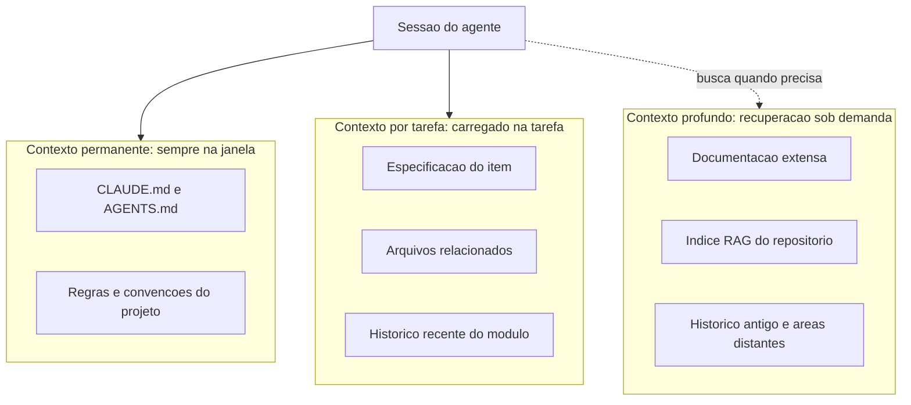

# Capítulo 5: Engenharia de contexto: a fundação invisível

# Capítulo 5: Engenharia de contexto: a fundação invisível

## Introdução

No Capítulo 4, você aprendeu que prompt é especificação — e escreveu o primeiro prompt de engenharia da TorreDeControle, que produziu o modelo de domínio da entidade Tarefa. Mas há uma camada que sustenta todo diálogo com o agente e que a maioria dos iniciantes descobre tarde demais: o **contexto**. O prompt é a peça visível; o contexto é a fundação invisível sobre a qual todo raciocínio do modelo se apoia. Um prompt perfeito entregue a um modelo sem o contexto certo ainda falha — porque o modelo não sabe o que ele deveria saber sobre o seu projeto.

Este capítulo é o curso de engenharia de contexto: o que são janelas de contexto e por que tamanho não resolve qualidade; o fenômeno do *context rot* e do *Lost in the Middle*; e como arquitetar o contexto de um projeto real para que o agente receba, a cada passo, exatamente o que precisa — nem mais, nem menos. Ao final, você vai dominar o conceito que separa o desenvolvedor que "usa IA" do engenheiro que *dirige* IA, e vai aplicar isso diretamente ao projeto TorreDeControle.

## Explica

### O que é a janela de contexto e por que ela esgota

A janela de contexto é a quantidade de informação que o modelo considera simultaneamente ao gerar cada resposta: instruções, histórico da conversa, conteúdo de arquivos, saídas de ferramentas. Em 2026, janelas de centenas de milhares de tokens são comuns — mas a janela não é infinita e, mais importante, não é grátis: cada token no contexto custa latência e dinheiro, e janelas gigantes degradam o desempenho quando o conteúdo é mal organizado.

O erro de iniciante é tratar a janela como um container a ser preenchido: "o modelo aceita 200 mil tokens, então vou jogar o repositório inteiro nele". A pesquisa em engenharia de contexto mostra o oposto: modelos degradam de forma consistente quando a informação relevante está no meio de muita informação irrelevante — o fenômeno chamado *Lost in the Middle*, em que o modelo "esquece" o que está no meio da janela mesmo com espaço de sobra. Mais contexto não é melhor contexto; contexto relevante é melhor contexto.

### Context rot: a degradação silenciosa de sessões longas

O segundo fenômeno crítico é o *context rot*: a degradação gradual da qualidade do raciocínio conforme uma sessão longa acumula histórico. Cada interação adiciona tokens — decisões antigas, trechos de código antigos, correções já superadas — e o modelo passa a pesar informação obsoleta junto com a atual. Sessões de horas tendem a produzir respostas piores que sessões frescas com o mesmo contexto essencial.

A implicação prática é contraintuitiva e vale ouro: **recomeçar a sessão não é perder progresso — é higiene**. A prática profissional de 2026 combina sessões curtas com *memória externa* — arquivos de estado, notas persistentes, documentos de decisão — que sobrevivem ao reset da sessão. O conhecimento não mora na janela; mora no repositório, e a janela é apenas o palco onde ele é usado a cada ato.

### Arquitetar contexto: o princípio do just-in-time

Se a janela é cara e rotativa, a disciplina correta é arquitetar o contexto como uma fábrica entrega material: just-in-time. O agente deve receber, a cada passo, apenas o que precisa para o passo atual — instruções do projeto (CLAUDE.md/AGENTS.md, Capítulo 6), a especificação do que está sendo feito (Capítulo 7), as habilidades relevantes (Capítulo 9), as ferramentas conectadas (Capítulos 10-11). Tudo o que não for necessário ao passo atual fica fora da janela — disponível sob demanda.

Essa arquitetura tem três níveis, que você vai construir ao longo da obra:

- **Nível 1 — Contexto permanente (sempre na janela)**: instruções do projeto, regras de conduta, convenções. Pequeno, estável, carregado em toda sessão.
- **Nível 2 — Contexto por tarefa (sob demanda)**: especificação do item atual, arquivos relacionados, histórico recente do módulo. Carregado quando a tarefa começa.
- **Nível 3 — Contexto profundo (recuperação)**: documentação extensa, histórico antigo, código de áreas distantes. Não entra na janela; é buscado quando necessário.

O desenho desse sistema de três níveis é a "fundação invisível" do título: ninguém vê, mas é ela que sustenta o prédio. O Capítulo 16 (economia de tokens) vai tratar do custo; este capítulo trata da arquitetura.

### O papel da recuperação (RAG) no contexto

O Nível 3 depende de um mecanismo de recuperação: dado um tópico, buscar os trechos relevantes e injetá-los na janela. É o papel dos índices de dossiê e das buscas semânticas — a mesma técnica que você viu na Fábrica Agêntica com `indexar-dossie.py` e que agentes de produção usam para navegar repositórios gigantes. A recuperação transforma o problema de "caber tudo na janela" em "achar o certo quando preciso" — e é essa troca que torna projetos grandes viáveis com agentes.

## Ilustra

### O Depósito de Materiais do Canteiro

Volte ao canteiro de obras. Imagine o depósito de materiais: cimento, vigas, tijolos, ferramentas, documentos. Agora imagine dois mestres de obras. O primeiro enche o canteiro inteiro de material no dia um: cada centímetro do terreno coberto por pilhas, o que o obriga a caminhar por entre montes para achar uma viga, e o material que está no fundo é esquecido até apodrecer. O segundo mantém o depósito organizado por zonas, movimenta o material just-in-time — a viga chega quando a viga é necessária — e mantém um catálogo do que existe em cada zona.

O primeiro mestre trabalha com a "janela de contexto do canteiro" cheia; o segundo, com o canteiro enxuto e o depósito arquitetado. Qual entrega o prédio? O segundo — e por uma margem enorme, porque o tempo que o primeiro gasta procurando material é tempo que não constrói. Com o modelo é idêntico: jogar o repositório inteiro na janela é encher o canteiro de material; arquitetar contexto é manter o depósito organizado e movimentar material na hora certa.



### O Operário que Esquece o Meio da Tarde

Aqui está o ponto contraintuitivo — a segunda camada de analogia. A primeira mostrou o depósito arquitetado vs. o canteiro entupido. A segunda é sobre o *Lost in the Middle* e o *context rot* — e por que "janela maior" não resolve o problema, da mesma forma que "depósito maior" não resolve desorganização.

Imagine um operário com memória de um dia inteiro — ele se lembra de tudo que aconteceu hoje, desde o café da manhã até o fim do expediente. No fim do dia, você pergunta: "o que o cliente pediu às 10 da manhã para a ala norte?" O operário hesita. Ele se lembra do início do dia (o café, a primeira reunião) e do fim do dia (a última parede), mas o meio da tarde — as 10 da manhã, o pedido exato do cliente — está embaralhado com horas de ruído. Não é falta de memória: é excesso de informação sem organização. Aumentar a memória dele para dois dias não ajudaria em nada — o ruído só cresceria.

Com os modelos é a mesma coisa: o *Lost in the Middle* é o operário que esquece as 10 da manhã, e o *context rot* é o operário que, depois de oito horas de instruções acumuladas, começa a obedecer a instrução velha em vez da nova. Como Mestre de Obras, a solução não é dar mais memória ao operário: é dar a ele um caderno (memória externa) e sessões curtas focadas, mantendo o conhecimento no depósito — no repositório — em vez de na cabeça dele.

## Técnica

### Ferramenta 1: O Mapa de Contexto do Projeto

A primeira ferramenta técnica é o mapa de contexto: um documento que registra, para o seu projeto, o que vive em cada um dos três níveis. Este é o mapa inicial da TorreDeControle:

```markdown
# Mapa de Contexto — TorreDeControle

## Nível 1: Permanente (sempre na janela)
- CLAUDE.md: regras do projeto, convenções, comandos de verificação.
- Especificação resumida (1 página) em docs/especificacao.md.

## Nível 2: Por tarefa (carregado quando a tarefa começa)
- Especificação do item em andamento (ex.: RF3, modelo de Tarefa).
- Arquivos do módulo em edição (app/models/, app/services/).
- Histórico recente do módulo (últimos 3 commits).

## Nível 3: Recuperação (buscado sob demanda)
- Documentação completa e decisões antigas em docs/.
- Índice de código (via ferramentas de busca do harness).
- Logs e histórico de decisões em docs/decisoes/.

## Regra de ouro
- Se um arquivo não é necessário à tarefa atual, ele não entra na janela.
- Se a sessão ultrapassa ~30 minutos de trabalho contínuo, recomece com
  o contexto essencial e a memória externa.
```

Esse mapa não é decorativo: é o documento que você consulta (e entrega ao agente) sempre que inicia uma tarefa nova. Ele força a decisão consciente do que entra na janela.

### Ferramenta 2: A Rotina de Higiene de Sessão

A segunda ferramenta é a rotina de higiene — o protocolo que impede o context rot na prática. A rotina tem três passos:

1. **Iniciar sessão enxuta**: ao abrir a sessão, carregar apenas Nível 1 + o item da tarefa (Nível 2). Nada mais.
2. **Descarregar decisões**: ao concluir uma etapa, registrar a decisão e o resultado na memória externa — `docs/decisoes/` ou o commit do próprio código. O conhecimento migra da janela para o repositório.
3. **Recomeçar quando degradar**: se a sessão ficar longa ou as respostas começarem a piorar, recomeçar a sessão com o contexto essencial. O progresso não se perde: está no repositório e nas notas.

Para automatizar o passo 2, aqui está um script que registra decisões no formato de diário de bordo:

```python
# diario_decisoes.py — Registra decisoes de engenharia na memoria externa
from datetime import date
from pathlib import Path
from typing import Optional

ARQUIVO_DIARIO = Path("docs/decisoes.md")

def registrar_decisao( titulo: str, contexto: str, decisao: str, alternativa: str, consequencias: str, ) -> None: """Registra uma decisao de engenharia no formato ADR simplificado.""" hoje = date.today().isoformat() entrada = f""" ## {hoje} — {titulo}

**Contexto**: {contexto}

**Decisão**: {decisao}

**Alternativa considerada**: {alternativa}

**Consequências**: {consequencias}
"""
    ARQUIVO_DIARIO.parent.mkdir(parents=True, exist_ok=True)
    with ARQUIVO_DIARIO.open("a", encoding="utf-8") as f:
        f.write(entrada)
    print(f"Decisao registrada em {ARQUIVO_DIARIO}")

def main() -> None: """Registra a primeira decisao do projeto como exemplo.""" registrar_decisao( titulo="Modelo de dominio da Tarefa sem ORM", contexto="RF3 exige entidade Tarefa; o projeto ainda nao tem banco definido.", decisao="Modelo com pydantic puro, sem ORM, para manter a camada de dominio isolada.", alternativa="Usar SQLAlchemy desde o inicio.", consequencias="Facilita testes unitarios; exige mapeamento posterior ao definir o banco.", )

if __name__ == "__main__":
    main()
```

A rotina inteira — sessão enxuta, descarga de decisões, recomeço — é o que mantém o contexto do seu projeto saudável durante semanas de trabalho, em vez de degradar a cada sessão.

### Ferramenta 3: O Prompt de Resumo de Contexto

A terceira ferramenta é o prompt de resumo de contexto — a ponte entre sessões. Quando você precisa trocar de sessão (ou de agente), não perca o estado: peça um resumo estruturado e salve-o na memória externa:

```markdown
Resuma o estado atual do trabalho em exatamente 4 seções:

1. O que está pronto (com commits e arquivos principais).
2. O que está em andamento (tarefa atual e próximo passo).
3. Decisões tomadas que não devem ser repetidas.
4. Pendências e riscos conhecidos.

Seja objetivo: máximo 200 palavras por seção. Este resumo será usado como
ponto de partida de uma nova sessão.
```

Salvar a saída em `docs/estado_sessao.md` é o equivalente a deixar o diário de bordo do canteiro aberto na página certa antes de apagar as luzes — a obra continua de onde parou.

### A Verificação da Fundação

Para fechar, aqui está o protocolo de verificação da fundação de contexto — as perguntas que você faz a si mesmo antes de cada sessão de trabalho:

1. O Nível 1 (regras do projeto) está atualizado e pequeno?
2. A tarefa atual tem especificação própria (Nível 2)?
3. Algum arquivo grande está na janela sem necessidade (Nível 3 vazado)?
4. A última decisão foi registrada na memória externa?
5. Há quanto tempo a sessão está aberta? É hora de recomeçar?

Se qualquer resposta indicar problema, corrija antes de continuar — fundação frágil derruba o prédio, por mais bonitas que sejam as paredes.

## Aplica

### A Cena de Contraste: A Sessão de Seis Horas

Imagine a segunda-feira em que você decide "terminar de vez" o módulo de autenticação da TorreDeControle numa única sessão longa. Você abre o agente às 9h, joga a especificação inteira, o modelo antigo, o histórico de chat do mês passado e o repositório inteiro na conversa "para garantir que ele saiba tudo". Às 11h, as respostas começam a ficar estranhas: o agente reescreve código que já estava pronto, ignora uma decisão tomada às 9h30 e mistura o modelo novo com o antigo. Às 15h, o módulo está pior do que começou, e você passa a tarde desfazendo o que o agente fez.

O diagnóstico: context rot em ação. A janela acumulou horas de histórico, informação obsoleta e ruído — e o modelo passou a dar peso demais ao que entrou primeiro e ao que entrou por último, perdendo o meio. O agente não "enlouqueceu": a fundação invisível apodreceu, e o prédio balançou.

A correção: você adota a rotina de higiene. Sessões curtas e focadas, decisões registradas no diário via `diario_decisoes.py`, resumo de contexto ao trocar de sessão e recomeço quando a qualidade degrada. Na semana seguinte, o módulo de autenticação é construído em três sessões limpas — cada uma começando com o estado certo — e termina em metade do tempo. O que mudou não foi o modelo: foi a fundação.

### Armadilhas Comuns na Engenharia de Contexto

- **Jogar o repositório inteiro na janela**: causa Lost in the Middle — informação relevante perdida no meio do ruído. Use os três níveis.
- **Sessões infinitas**: sessões de horas degradam. Recomece com memória externa; o progresso vive no repositório, não na janela.
- **Confiar no histórico do chat como memória**: histórico de chat é contexto rotável; decisões importantes vão para o diário (arquivo), não para o chat.
- **Ignorar o Nível 3**: sem recuperação, projetos grandes exigem janelas gigantes — o caminho caro e frágil. Índices e busca sob demanda resolvem.
- **Manter o CLAUDE.md inchado**: contexto permanente deve ser pequeno e estável; se cresceu demais, a disciplina do Capítulo 6 (e a economia do Capítulo 16) vai enxugá-lo.
- **Tratar o mapa de contexto como documento morto**: o mapa só vale se for consultado e atualizado a cada mudança estrutural do projeto.

### Exercício Prático

Crie o `docs/mapa_contexto.md` da TorreDeControle com os três níveis, rode `diario_decisoes.py` para registrar a decisão do modelo sem ORM, e execute o prompt de resumo de contexto numa sessão curta do seu agente — salvando o resumo em `docs/estado_sessao.md`. Depois, feche e reabra a sessão usando o resumo como ponto de partida, e compare a qualidade da primeira resposta.

### Aprofundamento: O Protocolo de Sessão em Três Tempos

A rotina de higiene do Capítulo 5 ganha uma versão operacional em três tempos — o protocolo que você aplica a cada sessão de trabalho real. Ele integra as ferramentas do capítulo num fluxo único:

**Tempo 1 — Preparação (2 minutos):**

1. Leia o `docs/mapa_contexto.md` e confirme o Nível 1 (manual) atualizado.
2. Identifique o item da tarefa e carregue o Nível 2 (spec do item, arquivos relacionados).
3. Registre mentalmente (ou no diário) o objetivo da sessão em uma frase.

**Tempo 2 — Execução enxuta:**

1. Abra a sessão do agente com apenas o contexto dos Níveis 1-2 — nada de histórico antigo.
2. Trabalhe em fatias pequenas; a cada fatia concluída, descarregue a decisão no diário (`diario_decisoes.py`).
3. Se a sessão ultrapassar ~30 minutos de trabalho contínuo, avalie recomeçar com resumo.

**Tempo 3 — Encerramento (2 minutos):**

1. Rode o prompt de resumo de contexto e salve em `docs/estado_sessao.md`.
2. Confira que toda decisão importante virou entrada no diário.
3. Feche a sessão com o estado registrado — a próxima sessão começa do resumo, não do zero nem do histórico inchado.

O protocolo em três tempos é o equivalente ao fechamento de expediente do canteiro: apagar as luzes com o diário em dia, o depósito organizado e a placa do andar atualizada. É a aplicação prática de tudo que o capítulo teorizou — e é o hábito que impede o context rot de voltar silenciosamente.

```bash
# Checklist do encerramento de sessão (Tempo 3) em um comando:
test -f docs/estado_sessao.md && echo "resumo salvo" || echo "RESUMO NAO SALVO"
test -f docs/decisoes.md && echo "diario presente" || echo "DIARIO AUSENTE"
```

### Aprofundamento: O Orçamento de Contexto por Tipo de Tarefa

A arquitetura de três níveis do Capítulo 5 ganha uma régua prática: quanto de contexto cada tipo de tarefa *merece* — porque tarefas diferentes têm necessidades de contexto diferentes, e o desperdício típico é dar contexto demais para tarefas que precisam de pouco. A régua de referência:

| Tipo de tarefa | Nível de contexto ideal | Erro típico de iniciante |
|---|---|---|
| Pergunta rápida (sintaxe, significado) | Nível 1 + trecho citado | Jogar a documentação inteira |
| Implementação de fatia | Nível 1 + 2 (spec do item + arquivos do módulo) | Jogar o repositório inteiro |
| Diagnóstico de bug | Nível 2 + logs + arquivos suspeitos | Reabrir a sessão gigante antiga |
| Refatoração ampla | Nível 1 + 2 + índice do Nível 3 | Ler arquivo por arquivo sem índice |
| Revisão de entrega | Nível 1 + diff da entrega + spec | Ler o projeto inteiro para revisar um diff |

A régua tem duas leituras. A primeira é a do *mínimo necessário*: cada tipo de tarefa tem um piso de contexto — abaixo dele, a resposta degrada. A segunda é a do *teto razoável*: cada tipo tem um teto além do qual o contexto extra é ruído pago. O erro mais comum é operar no teto para tarefas de piso baixo — a pergunta rápida com a documentação inteira na janela é o desperdício mais frequente do fluxo agêntico. A régua não substitui o julgamento: calibra o julgamento, tarefa a tarefa, até ele virar automático — o mesmo processo de automatização que você verá no Capítulo 16 com os tokens.

## Conclusão

Neste capítulo você construiu a fundação invisível do seu trabalho com agentes: entendeu a janela de contexto e por que tamanho não resolve qualidade; aprendeu os fenômenos do context rot e do Lost in the Middle; e arquitetou o contexto do projeto em três níveis — permanente, por tarefa e recuperação sob demanda — com ferramentas concretas: o mapa de contexto, a rotina de higiene de sessão e o resumo de contexto. A lição central: o conhecimento mora no repositório, e a janela é apenas o palco onde ele é usado — mantenha o palco enxuto e o depósito organizado.

Seu desafio: ter o `docs/mapa_contexto.md` criado, a primeira decisão registrada no diário e uma sessão recomeçada com resumo de contexto — provando na prática que a fundação sustenta.

No Capítulo 6, vamos escrever o manual de bordo do agente: os arquivos CLAUDE.md e AGENTS.md, a regra de ouro do que entra e do que fica fora, e o manual real da TorreDeControle.