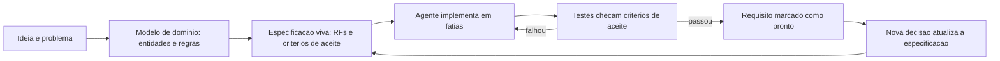
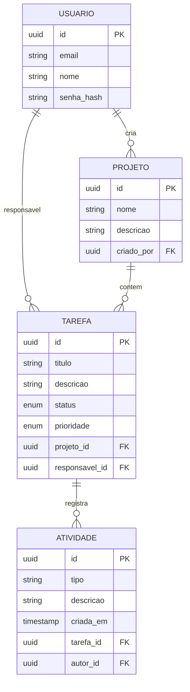

# Capítulo 7: Modelando o domínio: especificando antes de codar

# Capítulo 7: Modelando o domínio: especificando antes de codar

## Introdução

No Capítulo 6 você escreveu o manual de bordo da TorreDeControle — o AGENTS.md e o CLAUDE.md que definem as regras do canteiro. Agora vamos mudar o foco do *como* para o *o quê*: antes de o agente assentar mais um tijolo, o projeto precisa de uma planta detalhada. Esta é a disciplina do **spec-driven development**: transformar a ideia da TorreDeControle em uma especificação verificável que guia todos os agentes — e que permite saber, em qualquer momento, se o trabalho está ou não de acordo com o combinado.

Especificar antes de codar parece burocracia para quem vem do vibe coding, mas é exatamente o oposto: é a ferramenta que transforma o caos do código gerado em construção dirigida. O agente só pode ser audaz quando existe um contrato claro — e a especificação é esse contrato. Este capítulo ensina a modelar o domínio: identificar entidades, relacionamentos, regras de negócio e critérios de aceite, e registrar tudo num formato que humanos leem e agentes executam. Ao final, a TorreDeControle terá uma especificação de domínio completa, pronta para o scaffolding do Capítulo 8.

## Explica

### Por que especificar antes de codar

O argumento central do spec-driven development é simples e devastador: **o custo de mudar um requisito cresce exponencialmente quanto mais tarde ele é descoberto**. Mudar uma frase na especificação custa minutos; mudar a mesma decisão depois de implementada em três camadas custa horas — e depois de deployada, custa incidentes. A especificação antecipa decisões para o ponto mais barato da cadeia, exatamente como a planta antecipa decisões de engenharia para antes da primeira estaca.

Há um segundo argumento, específico do mundo agêntico: agentes sem especificação *inventam* o domínio. Quando você pede "crie o modelo de tarefas" sem especificar, o agente decide — com confiança e boa intenção — o que é tarefa, o que é status, o que é prioridade. Cada invenção pode estar errada para o seu negócio, e o código que nasce sobre ela carrega o erro estruturalmente. A especificação transfere as decisões de domínio do modelo para você — que é quem conhece o negócio.

### O que é modelagem de domínio

Modelagem de domínio é a prática de representar o conhecimento do negócio em termos de entidades, atributos, relacionamentos e regras — de forma independente de tecnologia. No caso da TorreDeControle: Usuário, Projeto, Tarefa, Atividade são entidades; Tarefa pertence a Projeto e tem um responsável (Usuário) são relacionamentos; "uma tarefa só pode estar em uma coluna por vez" é regra de negócio. O modelo de domínio é a ponte entre a linguagem do negócio e o código — e a qualidade dessa ponte determina se o software fala a língua do cliente ou uma língua inventada.

Um bom modelo de domínio tem três propriedades:

- **Fidelidade**: reflete as regras reais do negócio, não as suposições do desenvolvedor.
- **Estabilidade**: nomes e conceitos resistem a mudanças de tecnologia — a camada de domínio não muda quando o banco muda.
- **Testabilidade**: as regras podem ser verificadas por testes independentes da interface.

### O formato da especificação verificável

Uma especificação verificável — o artefato central do spec-driven development — tem estrutura fixa que permite checagem objetiva. Os elementos obrigatórios:

1. **Problema e objetivo**: o que o produto resolve, para quem. 2.

**Glossário**: termos do domínio com definições precisas (evita que o agente invente vocabulário). 3. **Entidades e relacionamentos**: o modelo de domínio — entidades, atributos, tipos, cardinalidades.

4. **Regras de negócio**: invariantes que o sistema deve sempre respeitar. 5.

**Requisitos funcionais (RF)**: o que o sistema faz, numerados e testáveis. 6. **Requisitos não funcionais (RNF)**: restrições de qualidade — desempenho, segurança, observabilidade.

7. **Critérios de aceite por requisito**: condições verificáveis de "pronto".

Cada requisito com critérios de aceite é o que permite o ciclo agêntico de verdade: o agente implementa, os testes checam os critérios, e "pronto" deixa de ser opinião para ser verificação.

### Especificação viva: o documento que evolui

A especificação deste livro é *viva*: começa simples (você escreveu o esqueleto no Capítulo 1) e evolui com o projeto — decisões novas entram, requisitos mudam, e o documento permanece a fonte da verdade. A alternativa — especificação de gaveta, escrita uma vez e nunca consultada — é pior que não ter especificação, porque dá falsa segurança. A prática correta: a especificação mora no repositório (Nível 2 do contexto), é consultada pelo agente em toda tarefa e é atualizada a cada decisão de domínio.

## Ilustra

### A Planta Detalhada do Prédio

Volte ao canteiro de obras. O briefing do Capítulo 4 definiu a tarefa; a placa de regras do Capítulo 6 definiu as restrições; mas nenhum dos dois é a planta. A planta é o documento que mostra cada cômodo, cada viga, cada instalação — com medidas, materiais e especificações. Nenhum pedreiro assenta uma parede "do jeito que acha melhor" quando existe planta; ele consulta o desenho, porque o desenho concentra decisões que, tomadas na obra, custariam caro demais para reverter.

O spec-driven development é a planta do software. A especificação da TorreDeControle é o desenho que mostra cada entidade, cada regra e cada requisito — e que permite ao agente (o pedreiro) trabalhar com autonomia *dentro* do desenho, sem inventar a planta. A diferença entre uma obra com planta e uma sem planta é a mesma entre código que cresce conforme o combinado e código que cresce conforme a imaginação do último agente que tocou nele.



### O Pedreiro que Desenha a Própria Planta: Por Que Inventar o Domínio é Caro

Aqui está o ponto contraintuitivo — a segunda camada de analogia. A primeira mostrou a planta como concentradora de decisões. A segunda é sobre o que acontece quando a planta não existe: alguém a desenha no meio da obra — e esse alguém é o mais rápido, não o mais informado.

Imagine uma obra grande sem planta detalhada. Cada equipe assenta o que entende: a equipe de elétrica passa fios onde acha melhor, a de hidráulica usa tubos do tamanho que tinha em estoque, a de estrutura calcula viga com margem "para garantir". O prédio fica de pé — por um tempo. Mas quando o cliente pede um cômodo novo, ninguém sabe onde passam os fios, que tubo suporta a pressão, e a obra vira um quebra-cabeça arqueológico. Com código agêntico é idêntico: sem especificação, cada agente desenha a planta do próprio pedaço — e o sistema inteiro vira um quebra-cabeça de suposições incompatíveis. Como Mestre de Obras, a especificação não é papelada: é a garantia de que todas as equipes — e todos os agentes — constroem o mesmo prédio.

## Técnica

### Passo 1: Refinando o Glossário do Domínio

O primeiro passo técnico é o glossário — a linguagem comum entre negócio, humano e agente. Este é o glossário inicial da TorreDeControle:

```markdown
# Glossário — TorreDeControle

- **Tarefa**: unidade de trabalho atribuída a um responsável, com status e prioridade, pertencente a um projeto. Toda tarefa tem histórico de atividades. - **Projeto**: agrupamento de tarefas com nome e descrição, criado por um gestor.

- **Usuário**: pessoa com conta na plataforma; pode ser gestor (cria projetos) ou membro (trabalha em tarefas). - **Status**: estado do ciclo de vida da tarefa — "a_fazer", "em_andamento", "concluida". Transições definidas por regra de negócio.

- **Prioridade**: grau de urgência da tarefa — "baixa", "media", "alta", "critica". - **Atividade**: registro imutável de uma ação sobre uma tarefa (criou, moveu, comentou), com autor e data/hora. - **Quadro**: visão Kanban do projeto, com colunas derivadas do status.

```

O glossário é a primeira linha de defesa contra a *inconsistência terminológica* — o mesmo conceito chamado de nomes diferentes em lugares diferentes, o pesadelo de qualquer repositório.

### Passo 2: O Modelo de Domínio em Diagrama

O segundo passo é visualizar o modelo. Este é o diagrama ER da TorreDeControle — e ele servirá de base para o banco de dados do Capítulo 18:



Repare nas cardinalidades: um usuário cria muitos projetos; um projeto contém muitas tarefas; uma tarefa gera muitas atividades. O diagrama é a especificação visual que o agente usa para não inventar relacionamentos.

### Passo 3: As Regras de Negócio Verificáveis

O terceiro passo são as regras de negócio — invariantes que o sistema deve sempre respeitar. Regras boas são escritas de forma que possam virar testes:

```markdown
# Regras de negócio — TorreDeControle

RN1: Uma tarefa pertence a exatamente um projeto (FK obrigatória). RN2: Uma tarefa só pode ser movida para "concluida" se o responsável estiver definido (não pode concluir tarefa sem dono). RN3: Transições de status permitidas: a_fazer -> em_andamento; em_andamento -> a_fazer | concluida; concluida é terminal.

RN4: Toda alteração de tarefa gera uma Atividade com autor e data/hora. RN5: Prioridade default é "media"; "critica" só pode ser atribuída por gestor. RN6: Email de usuário é único no sistema.

RN7: Uma tarefa "concluida" não pode receber nova atividade de movimentação. ```

Cada RN é um candidato a teste unitário — e essa é a ponte direta para o Capítulo 14 (testes dirigidos por IA). O agente implementa a RN; o teste prova que ela vale; o critério de aceite fecha o ciclo.

### Passo 4: Requisitos com Critérios de Aceite

O quarto passo transforma o esqueleto do Capítulo 1 em requisitos com critérios de aceite. Formato padronizado:

```markdown
## RF3 — CRUD de tarefas

**Descrição**: o usuário pode criar, listar, atualizar e excluir tarefas,
respeitando as regras de negócio RN1-RN7.

**Critérios de aceite**: 1. Criar tarefa exige título, projeto_id e responsavel_id (se status diferente de "a_fazer"); prioridade default "media". 2.

Listar tarefas suporta filtro por projeto e por status, com paginação. 3. Atualizar status segue RN3: transições inválidas retornam erro 422.

4. Excluir tarefa só é permitido para gestor do projeto; exclusão apaga as atividades associadas (RN4 aplicada). 5.

Toda operação retorna a Atividade correspondente no corpo da resposta.

**Testes de aceite** (a criar no Capítulo 14):
- test_criar_tarefa_sem_responsavel_falha_quando_em_andamento
- test_transicao_invalida_retorna_422
- test_exclusao_por_membro_retorna_403
```

O requisito agora é executável: o agente sabe exatamente o que construir, e os testes sabem exatamente o que verificar. "Pronto" vira uma proposição verificável.

### O Verificador de Especificação

Para fechar a parte técnica, aqui está a ferramenta que verifica a saúde da especificação — cada RF tem critérios? cada critério é acionável?:

```python
# verificar_spec.py — Verifica a completude da especificacao do projeto
import re
from pathlib import Path

ARQUIVO_SPEC = Path("docs/especificacao.md")

def extrair_requisitos(texto: str, prefixo: str) -> list[str]:
    """Extrai blocos de requisitos do tipo RFx ou RNx."""
    return re.findall(rf"{prefixo}\d+", texto)

def verificar_especificacao() -> None: """Checa a estrutura minima: glossario, entidades, regras e criterios.""" if not ARQUIVO_SPEC.exists(): print("ERRO: docs/especificacao.md ausente") return texto = ARQUIVO_SPEC.read_text(encoding="utf-8") rf = extrair_requisitos(texto, "RF") rn = extrair_requisitos(texto, "RN") tem_glossario = "Gloss" in texto tem_criterios = "Crit" in texto print(f"Requisitos funcionais (RF): {len(rf)} unicos") print(f"Regras de negocio (RN):    {len(rn)} unicos") print(f"Glossario presente:        {tem_glossario}") print(f"Criterios de aceite:       {tem_criterios}") if not (tem_glossario and tem_criterios and rf and rn): print("ESPECIFICACAO INCOMPLETA: complete glossario, regras e criterios") return print("ESPECIFICACAO OK: estrutura minima presente")

def main() -> None:
    verificar_especificacao()

if __name__ == "__main__":
    main()
```

Rode `python verificar_spec.py` e a especificação deve reportar estrutura OK — o mesmo padrão de verificação determinística que sustenta toda a obra.

## Aplica

### A Cena de Contraste: A Tarefa Sem Dona

Imagine a quarta-feira em que o produto da TorreDeControle já tem um usuário real — seu colega de equipe — e você pede ao agente para "adicionar a regra de concluir tarefa". Sem especificação, o agente implementa a transição `em_andamento -> concluida` sem exigir responsável. Na sexta, o colega conclui uma tarefa que estava órfã, e o relatório semanal do gestor mostra uma tarefa "concluída" sem dono — e o gestor pergunta, com razão, quem fez o quê. Você descobre que a RN2 (não concluir tarefa sem responsável) nunca existiu: ela estava na sua cabeça, não na especificação.

O diagnóstico: a regra de negócio não foi registrada — e o agente, fiel à ausência de contrato, implementou o que parecia óbvio. O erro não foi do agente: foi da especificação incompleta. Cada regra na cabeça do desenvolvedor e fora do repositório é uma regra que o agente vai violar com a melhor das intenções.

A correção: você registra RN2 na especificação com critério de aceite ("criar/atualizar tarefa exige responsável quando status diferente de a_fazer"), e o agente implementa com o teste correspondente. Na semana seguinte, a transição inválida é bloqueada por código — não por lembrança. A lição: especificação não é documentação para burocracia; é a memória do negócio que o agente consulta.

### Armadilhas Comuns na Modelagem de Domínio

- **Modelo de domínio espelhando tabelas de banco**: o domínio é a linguagem do negócio; o banco é tecnologia. Primeiro o domínio, depois o banco (Capítulo 18).
- **Regras de negócio na cabeça**: toda regra que não está na especificação será violada por algum agente. Registre antes de implementar.
- **RF sem critérios de aceite**: requisito sem critério é opinião — "está pronto?" não tem resposta objetiva.
- **Glossário incompleto**: termos ambíguos ("dono", "responsável", "gestor") geram inconsistência terminológica no código. Defina no glossário.
- **Especificação de gaveta**: documento que não evolui vira mentira. Atualize a cada decisão; a spec é viva.
- **Spec escrita pelo agente sem revisão**: o agente pode redigir a spec, mas a revisão do domínio é sua — você conhece o negócio; ele conhece o padrão.

### Exercício Prático

Complete a especificação da TorreDeControle com: glossário (termos do domínio), o modelo ER do diagrama, as sete regras de negócio (RN1-RN7) e os critérios de aceite do RF3. Rode `verificar_spec.py` até reportar estrutura OK, e commite a especificação no repositório.

### Aprofundamento: O Dicionário de Regras e a Sessão de Questionamento

Duas técnicas elevam a modelagem de domínio do Capítulo 7 de boa para profissional:

**Técnica A — O dicionário de regras em tabela.** O glossário define termos; o dicionário de regras organiza as RNs em formato tabular, que o agente (e o revisor do Capítulo 15) consome sem ambiguidade. O formato é sempre o mesmo: ID, regra em uma frase, entidades envolvidas, e o teste que a provaria.

| ID | Regra | Entidades | Teste |
|---|---|---|---|
| RN1 | Tarefa pertence a exatamente um projeto | Tarefa, Projeto | test_rn1_tarefa_sem_projeto_falha |
| RN2 | Concluir exige responsável | Tarefa, Usuário | test_rn2_concluir_sem_responsavel_bloqueada |
| RN3 | Transições de status restritas | Tarefa | test_rn3_transicoes_* |
| RN4 | Toda alteração gera atividade | Tarefa, Atividade | test_rn4_alteracao_gera_atividade |
| RN5 | Prioridade crítica só gestor | Tarefa, Usuário | test_rn5_critica_so_gestor |
| RN6 | Email único | Usuário | test_rn6_email_unico |
| RN7 | Concluída não recebe movimentação | Tarefa, Atividade | test_rn7_concluida_sem_movimentacao |

O dicionário de regras é a ponte direta para o Capítulo 14: cada linha da tabela é um teste esperando para nascer, e a coluna "Teste" é o critério de aceite em forma de nome.

**Técnica B — A sessão de questionamento da spec.** Antes de fechar qualquer spec, rode uma sessão de questionamento com o agente — o mesmo padrão de verificação do Capítulo 4, agora em escala de documento:

```markdown
Revise a especificação completa e me faça as perguntas que um product
manager faria: (1) quais requisitos estão ambíguos ou incompletos? (2) quais
regras de negócio podem conflitar entre si? (3) quais critérios de aceite
estão vagos demais para virar teste? (4) o que está faltando para o domínio
funcionar de ponta a ponta? Liste por prioridade, sem reescrever nada.
```

A sessão de questionamento é o último portão da spec antes de ela virar contrato — e ela custa minutos, enquanto um requisito mal especificado custa dias de implementação errada. A spec boa não é a que o agente escreve sem objeção: é a que sobrevive a uma rodada de perguntas difíceis.

### Aprofundamento: A Versão da Especificação e o Controle de Mudanças

A especificação viva do Capítulo 7 precisa de um mecanismo de controle de mudanças — porque viva não significa volátil. Sem controle, a spec muda a cada opinião e vira areia movediça; com controle, ela evolui com decisão e rastreabilidade. O mecanismo mínimo tem três peças:

1. **Versão na spec**: o documento abre com número de versão e data — `v1.2 — 2026-08-07`. Toda mudança relevante incrementa a versão.
2. **Registro de mudanças (changelog)**: no fim da spec, a tabela de alterações — versão, data, o que mudou, quem decidiu. A rastreabilidade que o Capítulo 15 audita.
3. **Gatilhos de mudança**: mudanças entram por gatilho, não por impulso — um novo requisito do negócio, um bug que revelou regra faltante, uma decisão de arquitetura que altera o domínio.

| Versão | Data | Mudança | Decidido por |
|---|---|---|---|
| v1.0 | 2026-07-01 | Versão inicial (esqueleto do Capítulo 1) | Autor |
| v1.1 | 2026-07-15 | RN5 (prioridade crítica só gestor) adicionada | Gestor do produto |
| v1.2 | 2026-08-07 | Critérios de aceite do RF3 detalhados | Revisão técnica |

O controle de mudanças é o que mantém a spec *autoritativa*: quando o agente (Capítulo 8), o testador (Capítulo 14) e o revisor (Capítulo 15) consultam a spec, todos veem a mesma versão — e quando algo muda, o changelog diz quem decidiu e por quê. Sem esse mecanismo, a spec viva vira spec líquida: cada consulta pode encontrar uma verdade diferente, e o contrato do Capítulo 7 perde a função de contrato.

## Conclusão

Neste capítulo você modelou o domínio da TorreDeControle: entendeu por que especificar antes de codar é a decisão mais barata da cadeia — e a mais cara de adiar; construiu o glossário, o modelo ER, as regras de negócio e os requisitos com critérios de aceite; e criou a ferramenta de verificação da especificação. A lição central: a especificação é o contrato que transfere as decisões de domínio do agente para você — e transforma "pronto" de opinião em verificação.

Seu desafio: a especificação completa da TorreDeControle commitada, com glossário, modelo, RN1-RN7 e critérios de aceite — verificada pelo script.

No Capítulo 8, vamos erguer o primeiro andar: usar o agente para gerar o esqueleto do projeto — o scaffolding completo — revisando e entendendo cada arquivo gerado antes de integrá-lo.