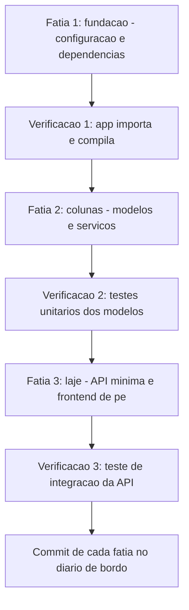

# Capítulo 8: O primeiro andar: gerando o esqueleto do projeto

# Capítulo 8: O primeiro andar: gerando o esqueleto do projeto

## Introdução

No Capítulo 7 você desenhou a planta detalhada: glossário, modelo de domínio, regras de negócio e requisitos com critérios de aceite — a especificação viva da TorreDeControle. Agora é hora de erguer o primeiro andar: gerar o esqueleto do projeto, o scaffolding completo que materializa a planta em arquivos. Este é o momento em que a TorreDeControle deixa de ser ideia e vira código — e o momento em que a diferença entre *deixar o agente fazer* e *dirigir o agente para fazer* fica mais visível.

O scaffolding é a operação em que o agente mais brilha — e a que mais esconde perigos. O agente gera dezenas de arquivos em minutos: configuração, modelos, testes, frontend. A tentação é aceitar tudo e correr para a próxima feature. Este capítulo ensina o protocolo oposto: gerar com plano, revisar camada por camada, verificar com comandos reais e commitar apenas o que passa — o mesmo protocolo de inspeção do canteiro aplicado à obra de software. Ao final, a TorreDeControle terá um esqueleto completo, verificado e commitado, e você terá o hábito que sustenta todo o resto da obra: revisar o que o agente gera.

## Explica

### O que é scaffolding e por que o agente é bom nisso

Scaffolding é a geração da estrutura inicial de um projeto: arquivos de configuração, estrutura de pastas, modelos, dependências, testes de fumaça e um esqueleto executável. É uma tarefa de *padrão* — milhares de projetos começam da mesma forma — e por isso os agentes são excepcionais nela: o padrão está no treinamento deles, e a especificação (que você escreveu no Capítulo 7) os ancora no domínio específico. Um agente com a spec da TorreDeControle não gera um "hello world" genérico: gera a estrutura que implementa RF1-RF6.

A economia é brutal: scaffolding manual de um projeto completo consome horas de trabalho repetitivo; scaffolding com agente consome minutos de geração e uma hora de revisão — e a revisão é onde o valor humano está.

### O perigo do código que "parece certo"

O problema central do scaffolding com agente é o mesmo que você viu no Capítulo 1: código plausível que não funciona. O agente gera arquivos que *parecem* corretos — imports que existem na sua cabeça, configurações que "deveriam" funcionar, testes que "deveriam" passar — mas que só a verificação real revela. A diferença entre um iniciante e um profissional agêntico não é a velocidade de geração: é o reflexo de verificar tudo que foi gerado antes de confiar.

Por isso o scaffolding tem um protocolo obrigatório: **gerar → revisar → verificar → commitar**, nesta ordem, sem pular etapas. Gerar sem revisar é aceitar a argamassa sem vistoriar; revisar sem verificar é confiar nos olhos quando existe medidor; verificar sem commitar é perder o trabalho na próxima mudança.

### Revisar o que o agente gerou: o que olhar

Revisar código gerado não é "ler tudo linha a linha" — é uma inspeção dirigida com três frentes:

1. **Estrutura vs. especificação**: os arquivos gerados implementam a planta? As entidades, regras e requisitos da spec aparecem no código?
2. **Convenções do projeto**: o código segue o AGENTS.md — nomes, camadas, padrões? (O agente deveria, mas não se confia, verifica-se.)
3. **Verificabilidade**: os comandos de verificação do manual passam de verdade — compilação, testes, importação?

A revisão dirigida leva minutos e encontra o que a leitura exaustiva encontraria em horas — porque ela sabe o que procurar.

### O papel do commit no fluxo de scaffolding

O scaffolding não é um evento único: é uma sequência de fatias, cada uma commitada como marco. A regra do Capítulo 3 continua valendo, agora com força total: commit pequeno, commit frequente, commit verificado. Cada fatia aprovada vira um ponto de retorno no diário de bordo — e é o que permite ao agente (e a você) experimentar sem medo de destruir o que funciona. Um scaffolding entregue num único commit gigante é um risco que se esconde atrás da aparência de progresso.

## Ilustra

### A Fundação, as Colunas e o Primeiro Laje

Volte ao canteiro. A planta está pronta, e o primeiro andar começa com uma sequência precisa: a fundação (estrutura de pastas e configuração), as colunas (modelos e serviços — o esqueleto estrutural), e o primeiro laje (a API mínima e o frontend de pé). Nenhum pedreiro ergue o andar de uma vez: cada etapa é executada, inspecionada e registrada antes da próxima. O concreto é derramado, o engenheiro vistoria, o laje é assentado sobre a vistoria — não sobre a esperança.

O scaffolding com agente é essa mesma sequência. O "primeiro andar" da TorreDeControle não é "o projeto completo": é a estrutura verificável que sustenta as próximas etapas — a fundação onde o resto da obra vai se apoiar. O agente executa cada etapa; você vistoria cada etapa; o diário de bordo registra cada etapa.



### O Andar Erguido em Um Só Dia: Por Que Fatias Importam

Aqui está o ponto contraintuitivo — a segunda camada de analogia. A primeira mostrou a sequência de fatias. A segunda é sobre por que tentar erguer o andar inteiro de uma vez — o "scaffolding de um comando só" — termina em retrabalho.

Imagine dois canteiros erguendo o mesmo primeiro andar. O primeiro usa o método das fatias: fundação vistoriada, colunas vistoriadas, laje vistoriada — quatro etapas, quatro inspeções, quatro registros. O segundo decide "erguer tudo hoje": os operários trabalham em paralelo, cada um na sua área, e ao fim do dia o andar está "de pé" — na aparência. Na primeira chuva, descobre-se que a fundação de uma área não suporta a laje da outra, e parte do andar precisa ser demolida. Qual canteiro terminou mais rápido? O primeiro — porque o segundo reconstruiu o que construiu errado.

Com o scaffolding é idêntico: o agente que gera tudo de uma vez produz um monte de arquivos que *parecem* um projeto; o método das fatias produz uma estrutura verificada a cada passo, onde o erro aparece na etapa em que nasceu — barato para corrigir — e não no fim, quando custa uma demolição. Como Mestre de Obras, você vai recusar a tentação do "tudo de uma vez": velocidade sem verificação é dívida com juros compostos.

## Técnica

### O Plano de Scaffolding da TorreDeControle

Antes de pedir qualquer código ao agente, o plano. Este é o plano de fatias que você vai executar — e que você entrega ao agente como o contrato da operação:

```markdown
# Plano de scaffolding — TorreDeControle

## Fatia 1 — Fundação
- Criar estrutura de pastas conforme AGENTS.md.
- Criar requirements.txt com FastAPI, uvicorn, pydantic, pytest, httpx.
- Criar app/__init__.py, app/api/__init__.py, app/models/__init__.py.
- Criar config básica de execução (uvicorn).
- Verificação: `python -m compileall app/` e `python -c "import app"`.

## Fatia 2 — Colunas (domínio)
- Implementar modelos pydantic: Usuario, Projeto, Tarefa, Atividade (RF1-RF6).
- Implementar Enums de Status e Prioridade (RN3, RN5).
- Implementar services: criar_tarefa, mover_tarefa, listar_tarefas (RN1-RN7).
- Verificação: testes unitários dos modelos + services.

## Fatia 3 — Laje (API e frontend)
- Implementar endpoints REST mínimos (RF1-RF6) na camada app/api.
- Implementar autenticação por token (RF1, RFC 6750).
- Implementar frontend estático mínimo consumindo a API.
- Verificação: teste de integração da API (httpx TestClient).

## Regras da operação
- Cada fatia termina com verificação real e commit conventional.
- Nenhuma fatia avança sem a anterior verificada.
- Sem ORM e sem banco ainda (decisão do Capítulo 7 mantida).
```

### Fatia 1 na prática: o prompt de scaffolding

Este é o prompt de scaffolding da Fatia 1, seguindo o padrão de cinco partes do Capítulo 4:

```markdown
## Papel e contexto
Você é o desenvolvedor sênior do projeto TorreDeControle (FastAPI + frontend
estático), com a especificação em docs/especificacao.md e as regras em AGENTS.md.

## Tarefa específica
Execute a Fatia 1 do plano de scaffolding: crie a estrutura de pastas, o
requirements.txt com as dependências listadas e os __init__.py das camadas.

## Restrições e regras
- Siga exatamente a estrutura do AGENTS.md (app/models, app/services, app/api).
- Use apenas as dependências do requirements.txt.
- Não crie código de negócio ainda (apenas estrutura e configuração).
- Não crie banco de dados nem ORM.

## Formato de saída
Lista dos arquivos criados, com o conteúdo resumido de cada um, e o comando
de verificação executado com o resultado real.

## Critérios de aceite
1. python -m compileall app/ retorna 0.
2. python -c "import app" retorna sem erro.
3. requirements.txt contém exatamente as dependências do plano.
```

Execute este prompt na sua sessão e o agente entrega a Fatia 1. Depois — e só depois — a Fatia 2. O plano não é papel: é o controle de qualidade da operação.

### O Script de Verificação do Esqueleto

Para não depender de memória, o script de verificação do esqueleto — o medidor do canteiro. Ele verifica a integridade da estrutura e roda as verificações de cada fatia:

```python
# verificar_esqueleto.py — Verifica a integridade do scaffolding
import subprocess
import sys
from pathlib import Path

ARQUIVOS_OBRIGATORIOS = [ "requirements.txt", "app/__init__.py", "app/models/__init__.py", "app/services/__init__.py", "app/api/__init__.py", ] DEPENDENCIAS = ["fastapi", "uvicorn", "pydantic", "pytest", "httpx"]

def arquivos_ausentes() -> list[str]:
    """Retorna os arquivos obrigatorios que nao existem."""
    return [a for a in ARQUIVOS_OBRIGATORIOS if not Path(a).exists()]

def compila() -> bool: """Verifica se a arvore app/ compila sem erros de sintaxe.""" try: subprocess.run( ["python", "-m", "compileall", "-q", "app"], capture_output=True, check=True, ) return True except subprocess.CalledProcessError: return False

def importa() -> bool: """Verifica se o pacote app importa sem erros.""" try: subprocess.run( ["python", "-c", "import app"], capture_output=True, check=True, ) return True except subprocess.CalledProcessError: return False

def dependencias_faltantes() -> list[str]:
    """Retorna dependencias do plano ausentes no requirements.txt."""
    if not Path("requirements.txt").exists():
        return DEPENDENCIAS
    conteudo = Path("requirements.txt").read_text(encoding="utf-8").lower()
    return [d for d in DEPENDENCIAS if d not in conteudo]

def main() -> None: """Checklist de sanidade do esqueleto gerado.""" problemas: list[str] = [] problemas += [f"faltando {a}" for a in arquivos_ausentes()] problemas += [f"dependencia {d} ausente" for d in dependencias_faltantes()] if not compila(): problemas.append("arvore app/ nao compila") if not importa(): problemas.append("pacote app nao importa") if problemas: print("ESQUELETO COM PROBLEMAS:") for p in problemas: print(f"  - {p}") sys.exit(1) print("ESQUELETO OK: estrutura, dependencias, compilacao e import OK")

if __name__ == "__main__":
    main()
```

O padrão se repete: cada fatia tem uma verificação, e a verificação é um script, não um palpite. Rode `verificar_esqueleto.py` após a Fatia 1 e ele deve aprovar.

### A Revisão Dirigida do que o Agente Gerou

Depois da verificação automática, a revisão dirigida — a inspeção humana que o script não substitui. Para a Fatia 2 (modelos e services), o checklist:

1. **Especificação**: os Enums de Status têm exatamente os valores da RN3? A prioridade tem default "media" (RN5)?
2. **Regras**: mover_tarefa valida as transições da RN3? criar_tarefa exige responsável quando status ≠ a_fazer (RN2)?
3. **Camadas**: os services não tocam HTTP? As validações estão na camada certa (AGENTS.md)?
4. **Qualidade**: docstrings existem? Tipagem está completa? Não há código morto nem imports fantasmas?

Se qualquer item falhar, o prompt de refinamento do Capítulo 4 entra em ação: "o que está bom, o que muda, critério de aceite" — e a iteração converge.

### O Fluxo Completo das Três Fatias

O fluxo executado de ponta a ponta, na sua sessão:

```bash
# Fatia 1 — fundação
#   (prompt do plano acima; verificar_esqueleto.py aprova)
git add -A && git commit -m "feat: fundacao do scaffolding (estrutura e config)"

# Fatia 2 — colunas (modelos e services com testes)
#   (prompt de implementacao; testes unitarios passam)
git add -A && git commit -m "feat: modelos e services do dominio (RF1-RF6)"

# Fatia 3 — laje (API minima e frontend)
#   (prompt de implementacao; teste de integracao passa)
git add -A && git commit -m "feat: API REST minima e frontend estatico (RF1-RF6)"
```

Três fatias, três verificações, três commits — o esqueleto completo, verificável e rastreável.

## Aplica

### A Cena de Contraste: O Scaffolding de Um Comando Só

Imagine o sábado em que você decide "não perder tempo com fatias" e pede ao agente: "cria o projeto TorreDeControle completo". O agente gera 47 arquivos em cinco minutos. Você roda o servidor e... funciona! Empolgado, você commita tudo de uma vez e avança para as features. Dois dias depois, o primeiro requisito novo chega — e o problema aparece: adicionar autenticação real exige mexer em configs que ninguém revisou; os testes unitários "que existiam" não rodam porque dependiam de um fixture esquecido; e a estrutura de camadas, que o AGENTS.md mandava respeitar, foi violada em três arquivos. O esqueleto "pronto" vira uma reforma: cada feature nova exige consertar o que o scaffolding escondeu.

O diagnóstico: você pulou o protocolo gerar → revisar → verificar → commitar. O código parecia certo — e o "parecer" era a armadilha do Capítulo 1 de volta, em escala de projeto.

A correção: você reexecuta o scaffolding em fatias — mesmo projeto, mesmo agente, mas com plano, verificação e revisão a cada etapa. O esqueleto final é o mesmo em aparência, mas cada arquivo foi vistoriado, cada teste roda de verdade, e o commit de cada fatia permite voltar atrás. Na semana seguinte, a autenticação nova entra limpa — porque a fundação foi inspecionada quando foi construída, não quando o prédio já estava em pé.

### Armadilhas Comuns no Scaffolding com Agente

- **Aceitar tudo sem revisar**: "funcionou na minha máquina" não é verificação; a revisão dirigida (spec, regras, camadas) é obrigatória.
- **Um commit gigante**: scaffolding num único commit esconde erros e impede reversão cirúrgica. Fatias + commits pequenos.
- **Pular as verificações por confiança**: o agente é competente, mas não é medidor. Scripts de verificação rodam sempre.
- **Deixar o agente violar o AGENTS.md**: se o código gerado não segue as camadas do manual, o manual não está sendo lido — ou o prompt não o citou. Corrija o prompt, não o código.
- **Scaffolding sem spec**: gerar esqueleto sem a especificação do Capítulo 7 produz estrutura genérica, que depois precisa ser refeita para o domínio.
- **Frontend "mágico"**: o agente adora gerar frontends com bibliotecas pesadas. Para o esqueleto, mantenha simples — HTML/CSS/JS estáticos conforme o plano.

### Exercício Prático

Execute o plano de três fatias na sua TorreDeControle, com verificação e commit a cada fatia. Ao final, rode `verificar_esqueleto.py`, a suite de testes e confirme os três commits no log. Registre no diário de decisões as escolhas que o agente tomou e que você revisou.

### Aprofundamento: O Checklist de Revisão de Fatia

O protocolo do Capítulo 8 funciona melhor com um checklist concreto — a lista que você lê (ou entrega ao revisor agêntico) ao inspecionar cada fatia. Esta é a versão genérica, aplicável a qualquer fatia de scaffolding ou feature:

| # | Item de revisão | Pergunta que decide | Verificação |
|---|---|---|---|
| 1 | Estrutura vs. spec | A fatia implementa exatamente o item da spec? | Comparar arquivos com os RFs/RNs citados |
| 2 | Camadas | O código respeita o AGENTS.md (models/services/api)? | Buscar imports cruzados entre camadas |
| 3 | Convenções | Nomes, padrão de commit e estrutura seguem o manual? | Conferir contra a seção Convenções |
| 4 | Verificabilidade | Os comandos do manual passam de verdade? | Rodar compileall + testes |
| 5 | Código morto | Há imports não usados, funções órfãs, debug prints? | Buscar símbolos sem referência |
| 6 | Tratamento de erro | Os caminhos de erro estão cobertos, não só o feliz? | Testar os casos de falha |
| 7 | Escopo da fatia | A fatia não vazou para fora do combinado? | Conferir que nada extra entrou |

O checklist tem duas propriedades importantes. Primeira: ele é *uma lista, não um ensaio* — cada item é uma pergunta binária, e o tempo de revisão de uma fatia cai para minutos. Segunda: ele é *reutilizável como skill* — no Capítulo 9, este checklist vira o corpo da skill de revisão, e no Capítulo 15 ele vira parte do prompt do revisor agêntico. O que você está construindo aqui não é só o hábito de revisar: é o instrumento de revisão que será automatizado depois.

```bash
# Mini-triage de camadas em um comando (item 2 do checklist):
# Procura imports entre camadas que violariam o AGENTS.md
grep -rn "from app.api" app/services/ app/models/ 2>/dev/null && echo "VAZAMENTO DE CAMADA" || echo "camadas ok"
```

### Aprofundamento: O Quadro de Fatias do Scaffolding

O scaffolding em fatias funciona melhor com visibilidade — e o quadro de fatias é o instrumento que mostra, em qualquer momento, em que etapa a obra está. O quadro é uma tabela que cresce a cada fatia concluída e que o agente consulta para saber o que já existe antes de propor o próximo passo:

| Fatia | Entrega | Verificação | Status | Commit |
|---|---|---|---|---|
| 1 — Fundação | Estrutura, requirements, __init__ | compileall + import | concluída | feat: fundacao |
| 2 — Colunas | Modelos e services com testes | pytest unitários | concluída | feat: dominio |
| 3 — Laje | API mínima e frontend | teste de integração | concluída | feat: api e frontend |
| 4 — (próxima) | Autenticação RF1 | testes de RF1 | planejada | — |

O quadro tem três usos: (1) *para o agente* — ao receber uma nova tarefa, ele lê o quadro e sabe o que já está construído e verificado, evitando duplicar ou contradizer; (2) *para o revisor* — o Capítulo 15 compara a entrega com o quadro e confirma que a fatia não vazou escopo; (3) *para você* — o quadro é o mapa de progresso do canteiro, o equivalente do painel de testes do Capítulo 14 e do painel de operação do Capítulo 19. A disciplina do quadro é a mesma do checklist do Capítulo 3: visibilidade determinística no lugar da memória — se o quadro diz que a fatia 2 está concluída, a verificação da fatia 2 passou; se não passou, o quadro não mente.

## Conclusão

Neste capítulo você ergueu o primeiro andar da TorreDeControle: aprendeu o protocolo gerar → revisar → verificar → commitar; executou o scaffolding em três fatias — fundação, colunas e laje — cada uma com verificação real e commit rastreado; e internalizou a disciplina da revisão dirigida: estrutura vs. especificação, convenções do manual e verificabilidade. A lição central: o agente gera rápido, mas quem constrói é o protocolo — fatias, verificação e revisão transformam geração em engenharia.

Seu desafio: o esqueleto da TorreDeControle completo e verificado — três commits, `verificar_esqueleto.py` aprovando e testes passando.

No Capítulo 9, vamos equipar o canteiro com conhecimento reutilizável: as skills — instruções modulares carregadas sob demanda que padronizam os fluxos repetitivos do projeto e economizam contexto.