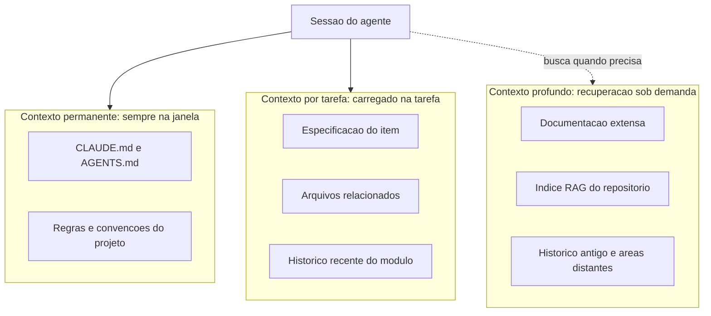
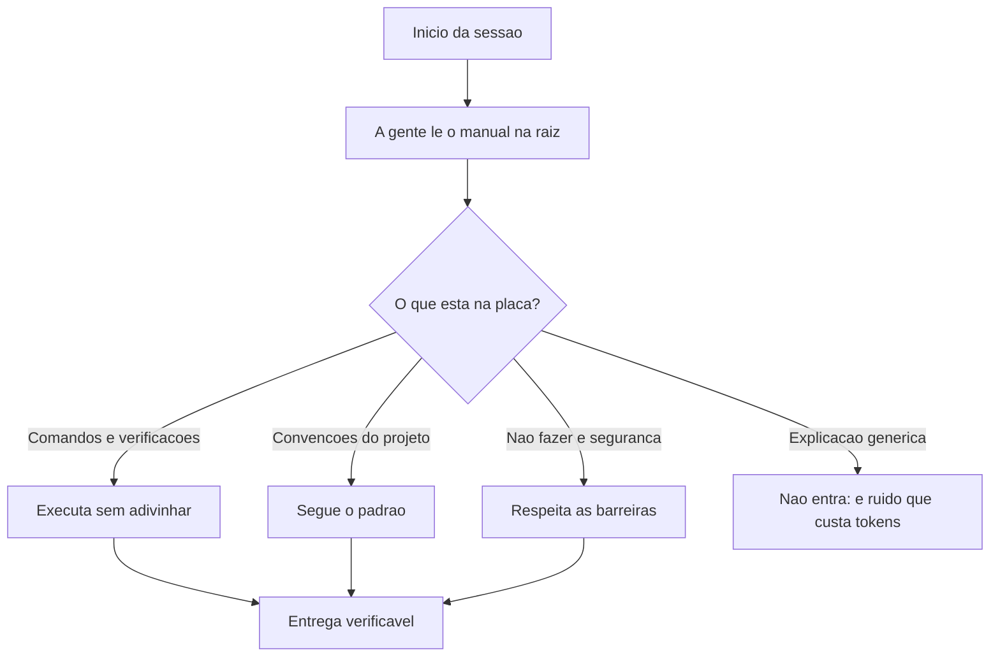
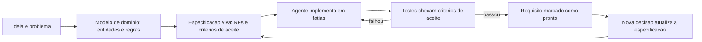
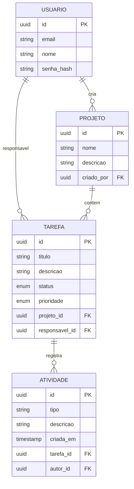
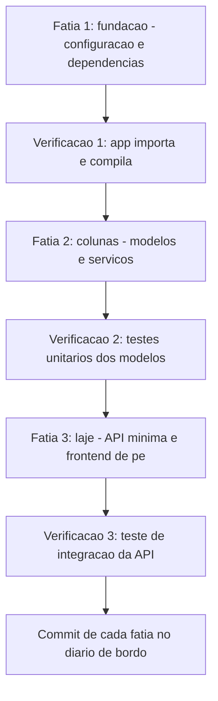

# Na Prática — Erguendo a Estrutura


# Capítulo 5: Engenharia de contexto: a fundação invisível

# Capítulo 5: Engenharia de contexto: a fundação invisível

## Introdução

No Capítulo 4, você aprendeu que prompt é especificação — e escreveu o primeiro prompt de engenharia da TorreDeControle, que produziu o modelo de domínio da entidade Tarefa. Mas há uma camada que sustenta todo diálogo com o agente e que a maioria dos iniciantes descobre tarde demais: o **contexto**. O prompt é a peça visível; o contexto é a fundação invisível sobre a qual todo raciocínio do modelo se apoia. Um prompt perfeito entregue a um modelo sem o contexto certo ainda falha — porque o modelo não sabe o que ele deveria saber sobre o seu projeto.

Este capítulo é o curso de engenharia de contexto: o que são janelas de contexto e por que tamanho não resolve qualidade; o fenômeno do *context rot* e do *Lost in the Middle*; e como arquitetar o contexto de um projeto real para que o agente receba, a cada passo, exatamente o que precisa — nem mais, nem menos. Ao final, você vai dominar o conceito que separa o desenvolvedor que "usa IA" do engenheiro que *dirige* IA, e vai aplicar isso diretamente ao projeto TorreDeControle.

## Explica

### O que é a janela de contexto e por que ela esgota

A janela de contexto é a quantidade de informação que o modelo considera simultaneamente ao gerar cada resposta: instruções, histórico da conversa, conteúdo de arquivos, saídas de ferramentas. Em 2026, janelas de centenas de milhares de tokens são comuns — mas a janela não é infinita e, mais importante, não é grátis: cada token no contexto custa latência e dinheiro, e janelas gigantes degradam o desempenho quando o conteúdo é mal organizado.

O erro de iniciante é tratar a janela como um container a ser preenchido: "o modelo aceita 200 mil tokens, então vou jogar o repositório inteiro nele". A pesquisa em engenharia de contexto mostra o oposto: modelos degradam de forma consistente quando a informação relevante está no meio de muita informação irrelevante — o fenômeno chamado *Lost in the Middle*, em que o modelo "esquece" o que está no meio da janela mesmo com espaço de sobra. Mais contexto não é melhor contexto; contexto relevante é melhor contexto.

### Context rot: a degradação silenciosa de sessões longas

O segundo fenômeno crítico é o *context rot*: a degradação gradual da qualidade do raciocínio conforme uma sessão longa acumula histórico. Cada interação adiciona tokens — decisões antigas, trechos de código antigos, correções já superadas — e o modelo passa a pesar informação obsoleta junto com a atual. Sessões de horas tendem a produzir respostas piores que sessões frescas com o mesmo contexto essencial.

A implicação prática é contraintuitiva e vale ouro: **recomeçar a sessão não é perder progresso — é higiene**. A prática profissional de 2026 combina sessões curtas com *memória externa* — arquivos de estado, notas persistentes, documentos de decisão — que sobrevivem ao reset da sessão. O conhecimento não mora na janela; mora no repositório, e a janela é apenas o palco onde ele é usado a cada ato.

### Arquitetar contexto: o princípio do just-in-time

Se a janela é cara e rotativa, a disciplina correta é arquitetar o contexto como uma fábrica entrega material: just-in-time. O agente deve receber, a cada passo, apenas o que precisa para o passo atual — instruções do projeto (CLAUDE.md/AGENTS.md, Capítulo 6), a especificação do que está sendo feito (Capítulo 7), as habilidades relevantes (Capítulo 9), as ferramentas conectadas (Capítulos 10-11). Tudo o que não for necessário ao passo atual fica fora da janela — disponível sob demanda.

Essa arquitetura tem três níveis, que você vai construir ao longo da obra:

- **Nível 1 — Contexto permanente (sempre na janela)**: instruções do projeto, regras de conduta, convenções. Pequeno, estável, carregado em toda sessão.
- **Nível 2 — Contexto por tarefa (sob demanda)**: especificação do item atual, arquivos relacionados, histórico recente do módulo. Carregado quando a tarefa começa.
- **Nível 3 — Contexto profundo (recuperação)**: documentação extensa, histórico antigo, código de áreas distantes. Não entra na janela; é buscado quando necessário.

O desenho desse sistema de três níveis é a "fundação invisível" do título: ninguém vê, mas é ela que sustenta o prédio. O Capítulo 16 (economia de tokens) vai tratar do custo; este capítulo trata da arquitetura.

### O papel da recuperação (RAG) no contexto

O Nível 3 depende de um mecanismo de recuperação: dado um tópico, buscar os trechos relevantes e injetá-los na janela. É o papel dos índices de dossiê e das buscas semânticas — a mesma técnica que você viu na Fábrica Agêntica com `indexar-dossie.py` e que agentes de produção usam para navegar repositórios gigantes. A recuperação transforma o problema de "caber tudo na janela" em "achar o certo quando preciso" — e é essa troca que torna projetos grandes viáveis com agentes.

## Ilustra

### O Depósito de Materiais do Canteiro

Volte ao canteiro de obras. Imagine o depósito de materiais: cimento, vigas, tijolos, ferramentas, documentos. Agora imagine dois mestres de obras. O primeiro enche o canteiro inteiro de material no dia um: cada centímetro do terreno coberto por pilhas, o que o obriga a caminhar por entre montes para achar uma viga, e o material que está no fundo é esquecido até apodrecer. O segundo mantém o depósito organizado por zonas, movimenta o material just-in-time — a viga chega quando a viga é necessária — e mantém um catálogo do que existe em cada zona.

O primeiro mestre trabalha com a "janela de contexto do canteiro" cheia; o segundo, com o canteiro enxuto e o depósito arquitetado. Qual entrega o prédio? O segundo — e por uma margem enorme, porque o tempo que o primeiro gasta procurando material é tempo que não constrói. Com o modelo é idêntico: jogar o repositório inteiro na janela é encher o canteiro de material; arquitetar contexto é manter o depósito organizado e movimentar material na hora certa.



### O Operário que Esquece o Meio da Tarde

Aqui está o ponto contraintuitivo — a segunda camada de analogia. A primeira mostrou o depósito arquitetado vs. o canteiro entupido. A segunda é sobre o *Lost in the Middle* e o *context rot* — e por que "janela maior" não resolve o problema, da mesma forma que "depósito maior" não resolve desorganização.

Imagine um operário com memória de um dia inteiro — ele se lembra de tudo que aconteceu hoje, desde o café da manhã até o fim do expediente. No fim do dia, você pergunta: "o que o cliente pediu às 10 da manhã para a ala norte?" O operário hesita. Ele se lembra do início do dia (o café, a primeira reunião) e do fim do dia (a última parede), mas o meio da tarde — as 10 da manhã, o pedido exato do cliente — está embaralhado com horas de ruído. Não é falta de memória: é excesso de informação sem organização. Aumentar a memória dele para dois dias não ajudaria em nada — o ruído só cresceria.

Com os modelos é a mesma coisa: o *Lost in the Middle* é o operário que esquece as 10 da manhã, e o *context rot* é o operário que, depois de oito horas de instruções acumuladas, começa a obedecer a instrução velha em vez da nova. Como Mestre de Obras, a solução não é dar mais memória ao operário: é dar a ele um caderno (memória externa) e sessões curtas focadas, mantendo o conhecimento no depósito — no repositório — em vez de na cabeça dele.

## Técnica

### Ferramenta 1: O Mapa de Contexto do Projeto

A primeira ferramenta técnica é o mapa de contexto: um documento que registra, para o seu projeto, o que vive em cada um dos três níveis. Este é o mapa inicial da TorreDeControle:

```markdown
# Mapa de Contexto — TorreDeControle

## Nível 1: Permanente (sempre na janela)
- CLAUDE.md: regras do projeto, convenções, comandos de verificação.
- Especificação resumida (1 página) em docs/especificacao.md.

## Nível 2: Por tarefa (carregado quando a tarefa começa)
- Especificação do item em andamento (ex.: RF3, modelo de Tarefa).
- Arquivos do módulo em edição (app/models/, app/services/).
- Histórico recente do módulo (últimos 3 commits).

## Nível 3: Recuperação (buscado sob demanda)
- Documentação completa e decisões antigas em docs/.
- Índice de código (via ferramentas de busca do harness).
- Logs e histórico de decisões em docs/decisoes/.

## Regra de ouro
- Se um arquivo não é necessário à tarefa atual, ele não entra na janela.
- Se a sessão ultrapassa ~30 minutos de trabalho contínuo, recomece com
  o contexto essencial e a memória externa.
```

Esse mapa não é decorativo: é o documento que você consulta (e entrega ao agente) sempre que inicia uma tarefa nova. Ele força a decisão consciente do que entra na janela.

### Ferramenta 2: A Rotina de Higiene de Sessão

A segunda ferramenta é a rotina de higiene — o protocolo que impede o context rot na prática. A rotina tem três passos:

1. **Iniciar sessão enxuta**: ao abrir a sessão, carregar apenas Nível 1 + o item da tarefa (Nível 2). Nada mais.
2. **Descarregar decisões**: ao concluir uma etapa, registrar a decisão e o resultado na memória externa — `docs/decisoes/` ou o commit do próprio código. O conhecimento migra da janela para o repositório.
3. **Recomeçar quando degradar**: se a sessão ficar longa ou as respostas começarem a piorar, recomeçar a sessão com o contexto essencial. O progresso não se perde: está no repositório e nas notas.

Para automatizar o passo 2, aqui está um script que registra decisões no formato de diário de bordo:

```python
# diario_decisoes.py — Registra decisoes de engenharia na memoria externa
from datetime import date
from pathlib import Path
from typing import Optional

ARQUIVO_DIARIO = Path("docs/decisoes.md")

def registrar_decisao( titulo: str, contexto: str, decisao: str, alternativa: str, consequencias: str, ) -> None: """Registra uma decisao de engenharia no formato ADR simplificado.""" hoje = date.today().isoformat() entrada = f""" ## {hoje} — {titulo}

**Contexto**: {contexto}

**Decisão**: {decisao}

**Alternativa considerada**: {alternativa}

**Consequências**: {consequencias}
"""
    ARQUIVO_DIARIO.parent.mkdir(parents=True, exist_ok=True)
    with ARQUIVO_DIARIO.open("a", encoding="utf-8") as f:
        f.write(entrada)
    print(f"Decisao registrada em {ARQUIVO_DIARIO}")

def main() -> None: """Registra a primeira decisao do projeto como exemplo.""" registrar_decisao( titulo="Modelo de dominio da Tarefa sem ORM", contexto="RF3 exige entidade Tarefa; o projeto ainda nao tem banco definido.", decisao="Modelo com pydantic puro, sem ORM, para manter a camada de dominio isolada.", alternativa="Usar SQLAlchemy desde o inicio.", consequencias="Facilita testes unitarios; exige mapeamento posterior ao definir o banco.", )

if __name__ == "__main__":
    main()
```

A rotina inteira — sessão enxuta, descarga de decisões, recomeço — é o que mantém o contexto do seu projeto saudável durante semanas de trabalho, em vez de degradar a cada sessão.

### Ferramenta 3: O Prompt de Resumo de Contexto

A terceira ferramenta é o prompt de resumo de contexto — a ponte entre sessões. Quando você precisa trocar de sessão (ou de agente), não perca o estado: peça um resumo estruturado e salve-o na memória externa:

```markdown
Resuma o estado atual do trabalho em exatamente 4 seções:

1. O que está pronto (com commits e arquivos principais).
2. O que está em andamento (tarefa atual e próximo passo).
3. Decisões tomadas que não devem ser repetidas.
4. Pendências e riscos conhecidos.

Seja objetivo: máximo 200 palavras por seção. Este resumo será usado como
ponto de partida de uma nova sessão.
```

Salvar a saída em `docs/estado_sessao.md` é o equivalente a deixar o diário de bordo do canteiro aberto na página certa antes de apagar as luzes — a obra continua de onde parou.

### A Verificação da Fundação

Para fechar, aqui está o protocolo de verificação da fundação de contexto — as perguntas que você faz a si mesmo antes de cada sessão de trabalho:

1. O Nível 1 (regras do projeto) está atualizado e pequeno?
2. A tarefa atual tem especificação própria (Nível 2)?
3. Algum arquivo grande está na janela sem necessidade (Nível 3 vazado)?
4. A última decisão foi registrada na memória externa?
5. Há quanto tempo a sessão está aberta? É hora de recomeçar?

Se qualquer resposta indicar problema, corrija antes de continuar — fundação frágil derruba o prédio, por mais bonitas que sejam as paredes.

## Aplica

### A Cena de Contraste: A Sessão de Seis Horas

Imagine a segunda-feira em que você decide "terminar de vez" o módulo de autenticação da TorreDeControle numa única sessão longa. Você abre o agente às 9h, joga a especificação inteira, o modelo antigo, o histórico de chat do mês passado e o repositório inteiro na conversa "para garantir que ele saiba tudo". Às 11h, as respostas começam a ficar estranhas: o agente reescreve código que já estava pronto, ignora uma decisão tomada às 9h30 e mistura o modelo novo com o antigo. Às 15h, o módulo está pior do que começou, e você passa a tarde desfazendo o que o agente fez.

O diagnóstico: context rot em ação. A janela acumulou horas de histórico, informação obsoleta e ruído — e o modelo passou a dar peso demais ao que entrou primeiro e ao que entrou por último, perdendo o meio. O agente não "enlouqueceu": a fundação invisível apodreceu, e o prédio balançou.

A correção: você adota a rotina de higiene. Sessões curtas e focadas, decisões registradas no diário via `diario_decisoes.py`, resumo de contexto ao trocar de sessão e recomeço quando a qualidade degrada. Na semana seguinte, o módulo de autenticação é construído em três sessões limpas — cada uma começando com o estado certo — e termina em metade do tempo. O que mudou não foi o modelo: foi a fundação.

### Armadilhas Comuns na Engenharia de Contexto

- **Jogar o repositório inteiro na janela**: causa Lost in the Middle — informação relevante perdida no meio do ruído. Use os três níveis.
- **Sessões infinitas**: sessões de horas degradam. Recomece com memória externa; o progresso vive no repositório, não na janela.
- **Confiar no histórico do chat como memória**: histórico de chat é contexto rotável; decisões importantes vão para o diário (arquivo), não para o chat.
- **Ignorar o Nível 3**: sem recuperação, projetos grandes exigem janelas gigantes — o caminho caro e frágil. Índices e busca sob demanda resolvem.
- **Manter o CLAUDE.md inchado**: contexto permanente deve ser pequeno e estável; se cresceu demais, a disciplina do Capítulo 6 (e a economia do Capítulo 16) vai enxugá-lo.
- **Tratar o mapa de contexto como documento morto**: o mapa só vale se for consultado e atualizado a cada mudança estrutural do projeto.

### Exercício Prático

Crie o `docs/mapa_contexto.md` da TorreDeControle com os três níveis, rode `diario_decisoes.py` para registrar a decisão do modelo sem ORM, e execute o prompt de resumo de contexto numa sessão curta do seu agente — salvando o resumo em `docs/estado_sessao.md`. Depois, feche e reabra a sessão usando o resumo como ponto de partida, e compare a qualidade da primeira resposta.

### Aprofundamento: O Protocolo de Sessão em Três Tempos

A rotina de higiene do Capítulo 5 ganha uma versão operacional em três tempos — o protocolo que você aplica a cada sessão de trabalho real. Ele integra as ferramentas do capítulo num fluxo único:

**Tempo 1 — Preparação (2 minutos):**

1. Leia o `docs/mapa_contexto.md` e confirme o Nível 1 (manual) atualizado.
2. Identifique o item da tarefa e carregue o Nível 2 (spec do item, arquivos relacionados).
3. Registre mentalmente (ou no diário) o objetivo da sessão em uma frase.

**Tempo 2 — Execução enxuta:**

1. Abra a sessão do agente com apenas o contexto dos Níveis 1-2 — nada de histórico antigo.
2. Trabalhe em fatias pequenas; a cada fatia concluída, descarregue a decisão no diário (`diario_decisoes.py`).
3. Se a sessão ultrapassar ~30 minutos de trabalho contínuo, avalie recomeçar com resumo.

**Tempo 3 — Encerramento (2 minutos):**

1. Rode o prompt de resumo de contexto e salve em `docs/estado_sessao.md`.
2. Confira que toda decisão importante virou entrada no diário.
3. Feche a sessão com o estado registrado — a próxima sessão começa do resumo, não do zero nem do histórico inchado.

O protocolo em três tempos é o equivalente ao fechamento de expediente do canteiro: apagar as luzes com o diário em dia, o depósito organizado e a placa do andar atualizada. É a aplicação prática de tudo que o capítulo teorizou — e é o hábito que impede o context rot de voltar silenciosamente.

```bash
# Checklist do encerramento de sessão (Tempo 3) em um comando:
test -f docs/estado_sessao.md && echo "resumo salvo" || echo "RESUMO NAO SALVO"
test -f docs/decisoes.md && echo "diario presente" || echo "DIARIO AUSENTE"
```

### Aprofundamento: O Orçamento de Contexto por Tipo de Tarefa

A arquitetura de três níveis do Capítulo 5 ganha uma régua prática: quanto de contexto cada tipo de tarefa *merece* — porque tarefas diferentes têm necessidades de contexto diferentes, e o desperdício típico é dar contexto demais para tarefas que precisam de pouco. A régua de referência:

| Tipo de tarefa | Nível de contexto ideal | Erro típico de iniciante |
|---|---|---|
| Pergunta rápida (sintaxe, significado) | Nível 1 + trecho citado | Jogar a documentação inteira |
| Implementação de fatia | Nível 1 + 2 (spec do item + arquivos do módulo) | Jogar o repositório inteiro |
| Diagnóstico de bug | Nível 2 + logs + arquivos suspeitos | Reabrir a sessão gigante antiga |
| Refatoração ampla | Nível 1 + 2 + índice do Nível 3 | Ler arquivo por arquivo sem índice |
| Revisão de entrega | Nível 1 + diff da entrega + spec | Ler o projeto inteiro para revisar um diff |

A régua tem duas leituras. A primeira é a do *mínimo necessário*: cada tipo de tarefa tem um piso de contexto — abaixo dele, a resposta degrada. A segunda é a do *teto razoável*: cada tipo tem um teto além do qual o contexto extra é ruído pago. O erro mais comum é operar no teto para tarefas de piso baixo — a pergunta rápida com a documentação inteira na janela é o desperdício mais frequente do fluxo agêntico. A régua não substitui o julgamento: calibra o julgamento, tarefa a tarefa, até ele virar automático — o mesmo processo de automatização que você verá no Capítulo 16 com os tokens.

## Conclusão

Neste capítulo você construiu a fundação invisível do seu trabalho com agentes: entendeu a janela de contexto e por que tamanho não resolve qualidade; aprendeu os fenômenos do context rot e do Lost in the Middle; e arquitetou o contexto do projeto em três níveis — permanente, por tarefa e recuperação sob demanda — com ferramentas concretas: o mapa de contexto, a rotina de higiene de sessão e o resumo de contexto. A lição central: o conhecimento mora no repositório, e a janela é apenas o palco onde ele é usado — mantenha o palco enxuto e o depósito organizado.

Seu desafio: ter o `docs/mapa_contexto.md` criado, a primeira decisão registrada no diário e uma sessão recomeçada com resumo de contexto — provando na prática que a fundação sustenta.

No Capítulo 6, vamos escrever o manual de bordo do agente: os arquivos CLAUDE.md e AGENTS.md, a regra de ouro do que entra e do que fica fora, e o manual real da TorreDeControle.

# Capítulo 6: CLAUDE.md e AGENTS.md: o manual de bordo do agente

# Capítulo 6: CLAUDE.md e AGENTS.md: o manual de bordo do agente

## Introdução

No Capítulo 5 você construiu a fundação invisível: entendeu que o conhecimento do projeto mora no repositório — não na janela do modelo — e arquitetou o contexto em três níveis. Agora vamos escrever o documento mais importante do Nível 1: o **manual de bordo do agente**. Na prática, isso são arquivos na raiz do repositório — `CLAUDE.md`, `AGENTS.md`, `README.md` — que o agente lê automaticamente no início de cada sessão e que definem como ele deve se comportar no seu projeto.

A diferença entre um projeto com manual de bordo e um sem ele é a diferença entre contratar um operário que conhece as regras do canteiro e contratar um que aprende as regras na marra — às custas da obra. Este capítulo ensina o que são esses arquivos, a regra de ouro do que entra e do que fica fora (baseada em pesquisa acadêmica de 2026), e escreve, passo a passo, o manual real da TorreDeControle. Ao final, seu agente vai começar cada sessão já sabendo: quem é o projeto, o que ele constrói, como verificar, o que não fazer.

## Explica

### Os três arquivos e suas funções

Três arquivos compõem o manual de bordo moderno, com papéis complementares:

- **README.md**: o cartão de visita do projeto, para humanos — e o primeiro documento que o agente lê quando explora um repositório desconhecido. Descreve o que o projeto faz e como executá-lo.
- **CLAUDE.md**: o manual de diretrizes persistentes lido nativamente pelo agente da Anthropic no início de cada sessão. É o contrato entre o humano e o agente: regras, convenções, comandos, arquitetura.
- **AGENTS.md**: o padrão aberto, agnóstico de ferramenta, mantido pela Agentic AI Foundation sob a Linux Foundation, lido por Codex, Copilot, Gemini CLI, Cursor e Claude Code — o denominador comum da indústria.

A regra prática de 2026: **escreva o AGENTS.md como o manual universal e o CLAUDE.md como a camada específica do seu harness** — ou mantenha ambos apontando para o mesmo conteúdo, como este próprio repositório da Fábrica Agêntica faz com seus hardlinks. O importante não é a marca do arquivo: é existir um contrato explícito entre projeto e agente.

### A regra de ouro: o que entra e o que fica fora

A pergunta central é: o que vai no manual? A resposta foi objeto de pesquisa empírica em 2026 — e o resultado contraria o senso comum. Pesquisadores do ETH Zurich demonstraram que arquivos de contexto **gerados automaticamente por LLMs** reduzem a taxa de sucesso das tarefas em até 3% e aumentam os custos de inferência em mais de 20%, por redundância com a documentação nativa do repositório. Em contraste, arquivos **redigidos manualmente** por engenheiros, focados estritamente em *detalhes não inferíveis*, geram ganhos reais de desempenho e eficiência.

A regra de ouro decorre diretamente dessa pesquisa: **o manual deve conter apenas o que o agente não consegue descobrir sozinho lendo o código**. O que é não inferível?

- Comandos de build, teste e verificação (o agente não deve adivinhar: `python -m pytest tests/`).
- Convenções do projeto que não estão no código (nomes, camadas, padrões de commit).
- Restrições de segurança e "não fazer" (nunca commitar `.env`, nunca rodar `git push --force`).
- Arquitetura e decisões de design que não são visíveis no código.

O que é inferível e **não deve** entrar: explicações genéricas de "o que é FastAPI", documentação que duplica o código, regras universais que qualquer agente já conhece. Cada linha desnecessária custa tokens em toda sessão — e pior, dilui o sinal das linhas necessárias.

### O custo de um manual inchado

O manual não é gratuito: ele entra na janela de **toda** sessão, para **todo** pedido. Um AGENTS.md de 5 mil tokens é um imposto permanente sobre cada interação com o agente — e um imposto sobre a qualidade, porque linha de ruído compete com linha de sinal. A disciplina do manual é a mesma da fundação do Capítulo 5: enxuto, estável, essencial. O que não é essencial vai para fora — para skills (Capítulo 9), specs (Capítulo 7) ou documentação sob demanda (Nível 3).

### O manual como contrato, não como desejo

A última distinção conceitual: o manual de bordo não é uma carta de intenções ("gostaríamos que o agente fosse cuidadoso") — é um contrato com regras verificáveis. "Seja cuidadoso" não é regra; "nunca rode comandos destrutivos sem aprovação explícita" é regra. A diferença está na verificabilidade: regras boas podem ser checadas (o agente fez ou não fez), e é essa checagem que sustenta a governança do Capítulo 13.

## Ilustra

### A Placa de Regras do Canteiro

Volte ao canteiro de obras. Na entrada, há uma placa com as regras: horário de trabalho, uso obrigatório de capacete, proibido fumar, caminhão de concreto só com autorização. Nenhuma regra da placa explica o que é um capacete — todo operário sabe. A placa registra apenas o que é específico daquele canteiro: as regras que o operário não pode adivinhar e que, se violadas, custam caro.

O manual de bordo é essa placa. Ele não ensina o agente a programar (isso ele sabe); registra o que é específico do seu projeto: como verificar, o que não fazer, onde mora cada coisa. Um canteiro sem placa funciona até o primeiro acidente; um projeto sem manual funciona até a primeira regra violada — e a violação silenciosa, em código, é a mais cara de todas.



### A Placa que Explica o Capacete: Por Que Manual Inchado é Pior

Aqui está o ponto contraintuitivo — a segunda camada de analogia. A primeira mostrou a placa de regras. A segunda é sobre por que encher a placa de obviedades não protege ninguém — e ainda atrapalha quem lê.

Imagine uma placa de canteiro com cinquenta itens: os vinte que importam, mais trinta que explicam o óbvio — "um capacete é usado na cabeça", "cimento é um pó que endurece com água", "tijolos são retangulares". O operário lê a placa no primeiro dia, e as trinta obviedades competem com as vinte regras reais. No segundo dia, ele já não lê a placa — está longa demais. No terceiro dia, a regra que ele esqueceu é justamente uma das vinte verdadeiras.

Com o manual é idêntico: cada explicação genérica que entra no AGENTS.md compete com as regras reais, e quando o manual fica grande demais, o agente — como o operário — passa a ler com menos atenção ou a dar peso menor ao documento inteiro. Como Mestre de Obras, a disciplina é a mesma da fundação: menos, porém essencial. A placa perfeita tem dez itens, todos não inferíveis, todos verificáveis.

## Técnica

### O AGENTS.md da TorreDeControle

Agora vamos escrever o manual real. Este é o AGENTS.md da TorreDeControle, aplicando a regra de ouro: apenas comandos, convenções e restrições não inferíveis:

```markdown
# AGENTS.md — TorreDeControle

Aplicativo web de gestão de tarefas de equipe (FastAPI + frontend estático).
Este arquivo é o contrato entre o projeto e os agentes que trabalham nele.
Leia antes de qualquer tarefa.

## Comandos e verificações
- Testes: `python -m pytest tests/` (obrigatório após qualquer mudança).
- Sintaxe: `python -m compileall app/` (rápido, roda antes dos testes).
- Servidor local: `python -m uvicorn app.api.main:app --reload`.
- Dependências: `pip install -r requirements.txt` (use venv).

## Estrutura e convenções
- `app/models/`: modelos de domínio (pydantic puro, SEM ORM).
- `app/services/`: lógica de negócio (sem HTTP, sem acesso direto a banco).
- `app/api/`: endpoints REST (thin layer: chamam services, não contêm regras).
- `frontend/`: HTML/CSS/JS estáticos consumindo a API.
- `tests/`: testes espelhando a estrutura de app/.
- Nomes de campos em inglês, snake_case; arquivos Python em snake_case.
- Commits no padrão conventional: `feat:`, `fix:`, `docs:`, `refactor:`.

## Regras de segurança (não negociáveis)
- NUNCA commitar `.env`, segredos ou arquivos gerados (ver .gitignore).
- NUNCA rodar comandos destrutivos (git push --force, drop de tabela) sem
  aprovação explícita do humano.
- NUNCA instalar pacotes sem registrar em requirements.txt.
- Migrações de banco só após revisão em ambiente de desenvolvimento.

## Arquitetura (decisões que não estão no código)
- Camada de domínio isolada (pydantic) para facilitar testes unitários.
- API REST JSON com autenticação por token (RFC 6750).
- Sem ORM até o Capítulo 8 definir o banco; depois, SQLAlchemy em app/db.

## Fluxo de trabalho do agente
1. Leia docs/especificacao.md e o mapa de contexto (docs/mapa_contexto.md).
2. Proponha o plano em fatias pequenas antes de codar.
3. Implemente com testes; rode `python -m pytest tests/` ao finalizar.
4. Faça commit conventional após cada fatia aprovada.
```

Repare no que esse manual **não** contém: não explica o que é FastAPI, não descreve a sintaxe de Python, não define o que é REST. Tudo isso é inferível — o agente sabe. O que ele registra é o não inferível: os comandos exatos, as convenções internas, as barreiras de segurança e as decisões de arquitetura invisíveis.

### O CLAUDE.md como camada específica

Se o seu harness lê CLAUDE.md, adicione a camada específica — regras de sessão e de comportamento próprias do agente que você usa:

```markdown
# CLAUDE.md — TorreDeControle

Siga o AGENTS.md da raiz para comandos, convenções e segurança.
Regras específicas de sessão:

- Trabalhe em fatias pequenas; nunca reescreva arquivos inteiros sem pedir. - Ao executar comandos, mostre o resultado real (não resuma de memória). - Se uma tarefa exigir mais de ~20 ações, proponha dividir em etapas e confirme antes de continuar.

- Registre decisões importantes em docs/decisoes.md (formato ADR). - Antes de terminar, rode as verificações do AGENTS.md e reporte o resultado. ```

A divisão de papéis é limpa: AGENTS.md é o contrato universal do projeto; CLAUDE.md é o contrato de sessão do seu agente. Juntos, formam o manual completo — e o CLAUDE.md pode simplesmente referenciar o AGENTS.md para evitar duplicação.

### O Gerador de Manual: Verificando o Manual Contra o Repositório

Para fechar a parte técnica, aqui está uma ferramenta que verifica se o manual está atualizado em relação ao repositório — o equivalente à inspeção periódica da placa:

```python
# verificar_manual.py — Verifica se o manual cobre as pastas e comandos reais
import subprocess
from pathlib import Path

PASTAS_ESPERADAS = [
    "app", "app/models", "app/services", "app/api",
    "frontend", "tests", "docs",
]
ARQUIVO_MANUAL = Path("AGENTS.md")

def pastas_faltantes() -> list[str]:
    """Retorna pastas do manual que não existem no repositório."""
    return [p for p in PASTAS_ESPERADAS if not Path(p).is_dir()]

def manual_obsoleto() -> bool: """True se o manual não menciona alguma pasta existente no projeto.""" if not ARQUIVO_MANUAL.exists(): return True texto = ARQUIVO_MANUAL.read_text(encoding="utf-8") for p in PASTAS_ESPERADAS: if Path(p).is_dir() and p not in texto: print(f"  [AVISO] manual nao menciona a pasta {p}") return False

def testes_passam() -> bool: """Roda a suite de testes e retorna o exit code como booleano.""" try: subprocess.run( ["python", "-m", "pytest", "tests/", "-q"], capture_output=True, check=True, ) return True except subprocess.CalledProcessError: return False

def main() -> None: """Checagem de sanidade do manual de bordo.""" problemas: list[str] = [] if not ARQUIVO_MANUAL.exists(): problemas.append("AGENTS.md ausente na raiz") if manual_obsoleto(): problemas.append("AGENTS.md desatualizado (pastas novas sem mencao)") problemas += [f"pasta {p} ausente" for p in pastas_faltantes()] if problemas: print("MANUAL COM PROBLEMAS:") for p in problemas: print(f"  - {p}") return print("MANUAL OK: estrutura coberta pelo manual") print(f"TESTES: {'PASSANDO' if testes_passam() else 'FALHANDO (verifique)'}")

if __name__ == "__main__":
    main()
```

O padrão aqui é o mesmo de todo o livro: **verificações determinísticas substituem suposições**. O manual não "parece" atualizado — o script prova.

### O Protocolo de Manutenção do Manual

O manual é um documento vivo, com um ciclo de manutenção explícito:

1. **Escrever**: criar o AGENTS.md/CLAUDE.md antes da primeira sessão de trabalho.
2. **Atualizar por gatilho**: revisar sempre que (a) uma nova pasta nasce, (b) um comando muda, (c) uma decisão de arquitetura é tomada, (d) um incidente revela uma regra faltante.
3. **Enxugar periodicamente**: a cada mês, cortar linhas que se tornaram inferíveis ou redundantes.
4. **Verificar**: rodar `verificar_manual.py` na manutenção — a placa deve refletir o canteiro.

## Aplica

### A Cena de Contraste: O Agente Que Não Sabia das Regras

Imagine a terça-feira em que você começa a trabalhar num repositório sem manual de bordo — herdado de um projeto antigo — e decide usar seu agente para adicionar uma feature. Você pede: "adiciona o endpoint de deletar tarefa". O agente encontra o padrão dos outros endpoints, implementa, e — sem manual que diga o contrário — roda `git push` direto para a branch principal, instala uma biblioteca nova sem registrar, e deleta uma tabela de teste que outra pessoa usava. O repositório quebra, o ambiente de desenvolvimento de alguém fica órfão, e você passa a tarde apagando incêndio.

O diagnóstico: não havia placa de regras — e o agente, corretamente, seguiu o padrão inferível do código em vez das regras invisíveis do projeto. A culpa não é do agente: ninguém registrou que push direto é proibido, que pacotes exigem registro e que a tabela de teste é compartilhada.

A correção: você escreve o AGENTS.md com as três categorias — comandos, convenções, barreiras de segurança — e o CLAUDE.md com as regras de sessão. Na semana seguinte, o mesmo agente, no mesmo repositório, implementa a mesma feature: propõe o plano, pede confirmação do push, registra a dependência e roda os testes. O manual não tornou o agente mais inteligente: tornou o canteiro legível — e regras legíveis são regras seguidas.

### Armadilhas Comuns ao Escrever o Manual

- **Manual gerado por IA**: pesquisa do ETH mostra que manuais gerados automaticamente reduzem desempenho e aumentam custo. Escreva à mão, focando no não inferível.
- **Manual inchado com obviedades**: cada linha desnecessária custa tokens em toda sessão e dilui o sinal. Enxugue até o essencial.
- **README confundido com manual**: README é cartão de visita; AGENTS.md/CLAUDE.md são o contrato de trabalho. Os três coexistem com papéis distintos.
- **Regras não verificáveis**: "seja cuidadoso" não é regra; "nunca rode X sem aprovação" é. Escreva regras que possam ser checadas.
- **Manual órfão da estrutura**: quando o código evolui e o manual não, o agente aprende o padrão errado. Manutenção por gatilho e verificação periódica resolvem.
- **Duplicar conteúdo entre CLAUDE.md e AGENTS.md**: duplicação significa dois documentos para manter. Referencie um no outro.

### Exercício Prático

Escreva o AGENTS.md e o CLAUDE.md da TorreDeControle usando os modelos deste capítulo, adaptando-os ao seu harness. Depois, abra uma sessão nova do agente na raiz do projeto e pergunte: "resuma as regras deste projeto". A resposta deve refletir o manual — comandos, convenções e barreiras. Se o agente não citar as regras de segurança, o manual não está sendo lido: verifique o harness.

### Aprofundamento: O Modelo de Manual para Projetos Futuros

O manual da TorreDeControle é específico do projeto — mas a *estrutura* dele é reutilizável. Este é o modelo genérico que você adapta para qualquer projeto futuro, com os campos que a regra de ouro exige e os espaços onde a tentação de encher de obviedade mora:

```markdown
# AGENTS.md — <Nome do Projeto>

<Uma frase: o que o projeto faz e a stack principal.>

## Comandos e verificações
- Testes: `<comando exato>` (obrigatório após qualquer mudança).
- Sintaxe: `<comando exato>`.
- Rodar local: `<comando exato>`.
- Dependências: `<comando exato>` (use ambiente isolado).

## Estrutura e convenções
- <pasta>: <papel — uma linha, o que é proibido nela também>
- <padrão de nomes e commits>

## Regras de segurança (não negociáveis)
- NUNCA <ação 1> sem <condição>.
- NUNCA <ação 2>.
- <segredo/artefato> nunca vai para o repositório.

## Arquitetura (decisões que não estão no código)
- <decisão 1: por que o domínio é isolado, etc.>
- <decisão 2>

## Fluxo de trabalho do agente
1. Leia a spec e o mapa de contexto.
2. Proponha o plano em fatias pequenas.
3. Implemente com testes e rode a verificação.
4. Commit convencional após cada fatia aprovada.
```

As três armadilhas do preenchimento, na prática: (1) *o campo "Uma frase" não é licença para um parágrafo* — se a descrição do projeto passa de duas linhas, o README (e não o AGENTS.md) é o lugar; (2) *as regras de segurança não são sugestões* — toda linha "NUNCA" deve ter um mecanismo no Capítulo 13 (hook) que a aplique; (3) *o fluxo de trabalho do agente é o método do Capítulo 8* — ele se repete em todos os projetos, o que significa que você pode copiar esse bloco sem culpa. O que muda entre projetos é o específico; o que se copia é o esqueleto do método.

### Aprofundamento: A Revisão Trimestral do Manual

O manual de bordo envelhece — e a revisão periódica é o que impede a placa de regras de virar placa de museu. A revisão trimestral do manual segue um protocolo de quatro passos, com o agente como assistente da auditoria:

1. **Medir o custo**: quantos caracteres/tokens o manual consome por sessão? O custo cresceu desde a última revisão? (A régua do Capítulo 16.)
2. **Caçar o obsoleto**: cada linha responde "isto ainda é verdade e ainda é não inferível?" Comandos que mudaram, pastas que nasceram, regras que o código já impõe sozinho — tudo isso sai.
3. **Caçar o inferível**: cada linha responde "o agente descobriria isso lendo o código?" Se descobriria, a linha sai — conhecimento inferível não paga imposto de sessão.
4. **Registrar o que mudou**: a revisão vira entrada no diário de decisões — o manual anterior, o que foi cortado e por quê. A evolução do manual fica rastreável.

O papel do agente na revisão: ele pode propor cortes (com a régua de inferibilidade do Capítulo 6), mas a decisão final é sua — porque o agente não sabe o que *você* considera essencial do negócio. O resultado da revisão trimestral é um manual enxuto que custa menos, sinaliza melhor e continua sendo lido — e é essa combinação que o Capítulo 16 transforma em economia de tokens real.

```bash
# Trigger de revisao em um comando:
# Se o manual passou de ~3 mil caracteres ou nenhuma linha mudou em 3 meses,
# e hora de revisar (enxugar ou atualizar).
wc -c AGENTS.md CLAUDE.md
```

## Conclusão

Neste capítulo você escreveu o manual de bordo do seu projeto: entendeu os papéis de README, CLAUDE.md e AGENTS.md; internalizou a regra de ouro — apenas o não inferível, nunca obviedade; aprendeu a pesquisa do ETH que mostra o custo de manuais gerados por IA; e criou os manuais reais da TorreDeControle com comandos, convenções, barreiras de segurança e um script de verificação de manutenção. A lição central: o manual é um contrato verificável entre projeto e agente — enxuto, estável, essencial.

Seu desafio: ter AGENTS.md e CLAUDE.md na raiz da TorreDeControle, e provar que o agente os lê — perguntando as regras do projeto numa sessão nova e conferindo a resposta.

No Capítulo 7, vamos dar o próximo passo do método: modelar o domínio e especificar antes de codar — o spec-driven development, transformando a ideia da TorreDeControle em um contrato verificável que guia todos os agentes.

# Capítulo 7: Modelando o domínio: especificando antes de codar

# Capítulo 7: Modelando o domínio: especificando antes de codar

## Introdução

No Capítulo 6 você escreveu o manual de bordo da TorreDeControle — o AGENTS.md e o CLAUDE.md que definem as regras do canteiro. Agora vamos mudar o foco do *como* para o *o quê*: antes de o agente assentar mais um tijolo, o projeto precisa de uma planta detalhada. Esta é a disciplina do **spec-driven development**: transformar a ideia da TorreDeControle em uma especificação verificável que guia todos os agentes — e que permite saber, em qualquer momento, se o trabalho está ou não de acordo com o combinado.

Especificar antes de codar parece burocracia para quem vem do vibe coding, mas é exatamente o oposto: é a ferramenta que transforma o caos do código gerado em construção dirigida. O agente só pode ser audaz quando existe um contrato claro — e a especificação é esse contrato. Este capítulo ensina a modelar o domínio: identificar entidades, relacionamentos, regras de negócio e critérios de aceite, e registrar tudo num formato que humanos leem e agentes executam. Ao final, a TorreDeControle terá uma especificação de domínio completa, pronta para o scaffolding do Capítulo 8.

## Explica

### Por que especificar antes de codar

O argumento central do spec-driven development é simples e devastador: **o custo de mudar um requisito cresce exponencialmente quanto mais tarde ele é descoberto**. Mudar uma frase na especificação custa minutos; mudar a mesma decisão depois de implementada em três camadas custa horas — e depois de deployada, custa incidentes. A especificação antecipa decisões para o ponto mais barato da cadeia, exatamente como a planta antecipa decisões de engenharia para antes da primeira estaca.

Há um segundo argumento, específico do mundo agêntico: agentes sem especificação *inventam* o domínio. Quando você pede "crie o modelo de tarefas" sem especificar, o agente decide — com confiança e boa intenção — o que é tarefa, o que é status, o que é prioridade. Cada invenção pode estar errada para o seu negócio, e o código que nasce sobre ela carrega o erro estruturalmente. A especificação transfere as decisões de domínio do modelo para você — que é quem conhece o negócio.

### O que é modelagem de domínio

Modelagem de domínio é a prática de representar o conhecimento do negócio em termos de entidades, atributos, relacionamentos e regras — de forma independente de tecnologia. No caso da TorreDeControle: Usuário, Projeto, Tarefa, Atividade são entidades; Tarefa pertence a Projeto e tem um responsável (Usuário) são relacionamentos; "uma tarefa só pode estar em uma coluna por vez" é regra de negócio. O modelo de domínio é a ponte entre a linguagem do negócio e o código — e a qualidade dessa ponte determina se o software fala a língua do cliente ou uma língua inventada.

Um bom modelo de domínio tem três propriedades:

- **Fidelidade**: reflete as regras reais do negócio, não as suposições do desenvolvedor.
- **Estabilidade**: nomes e conceitos resistem a mudanças de tecnologia — a camada de domínio não muda quando o banco muda.
- **Testabilidade**: as regras podem ser verificadas por testes independentes da interface.

### O formato da especificação verificável

Uma especificação verificável — o artefato central do spec-driven development — tem estrutura fixa que permite checagem objetiva. Os elementos obrigatórios:

1. **Problema e objetivo**: o que o produto resolve, para quem. 2.

**Glossário**: termos do domínio com definições precisas (evita que o agente invente vocabulário). 3. **Entidades e relacionamentos**: o modelo de domínio — entidades, atributos, tipos, cardinalidades.

4. **Regras de negócio**: invariantes que o sistema deve sempre respeitar. 5.

**Requisitos funcionais (RF)**: o que o sistema faz, numerados e testáveis. 6. **Requisitos não funcionais (RNF)**: restrições de qualidade — desempenho, segurança, observabilidade.

7. **Critérios de aceite por requisito**: condições verificáveis de "pronto".

Cada requisito com critérios de aceite é o que permite o ciclo agêntico de verdade: o agente implementa, os testes checam os critérios, e "pronto" deixa de ser opinião para ser verificação.

### Especificação viva: o documento que evolui

A especificação deste livro é *viva*: começa simples (você escreveu o esqueleto no Capítulo 1) e evolui com o projeto — decisões novas entram, requisitos mudam, e o documento permanece a fonte da verdade. A alternativa — especificação de gaveta, escrita uma vez e nunca consultada — é pior que não ter especificação, porque dá falsa segurança. A prática correta: a especificação mora no repositório (Nível 2 do contexto), é consultada pelo agente em toda tarefa e é atualizada a cada decisão de domínio.

## Ilustra

### A Planta Detalhada do Prédio

Volte ao canteiro de obras. O briefing do Capítulo 4 definiu a tarefa; a placa de regras do Capítulo 6 definiu as restrições; mas nenhum dos dois é a planta. A planta é o documento que mostra cada cômodo, cada viga, cada instalação — com medidas, materiais e especificações. Nenhum pedreiro assenta uma parede "do jeito que acha melhor" quando existe planta; ele consulta o desenho, porque o desenho concentra decisões que, tomadas na obra, custariam caro demais para reverter.

O spec-driven development é a planta do software. A especificação da TorreDeControle é o desenho que mostra cada entidade, cada regra e cada requisito — e que permite ao agente (o pedreiro) trabalhar com autonomia *dentro* do desenho, sem inventar a planta. A diferença entre uma obra com planta e uma sem planta é a mesma entre código que cresce conforme o combinado e código que cresce conforme a imaginação do último agente que tocou nele.



### O Pedreiro que Desenha a Própria Planta: Por Que Inventar o Domínio é Caro

Aqui está o ponto contraintuitivo — a segunda camada de analogia. A primeira mostrou a planta como concentradora de decisões. A segunda é sobre o que acontece quando a planta não existe: alguém a desenha no meio da obra — e esse alguém é o mais rápido, não o mais informado.

Imagine uma obra grande sem planta detalhada. Cada equipe assenta o que entende: a equipe de elétrica passa fios onde acha melhor, a de hidráulica usa tubos do tamanho que tinha em estoque, a de estrutura calcula viga com margem "para garantir". O prédio fica de pé — por um tempo. Mas quando o cliente pede um cômodo novo, ninguém sabe onde passam os fios, que tubo suporta a pressão, e a obra vira um quebra-cabeça arqueológico. Com código agêntico é idêntico: sem especificação, cada agente desenha a planta do próprio pedaço — e o sistema inteiro vira um quebra-cabeça de suposições incompatíveis. Como Mestre de Obras, a especificação não é papelada: é a garantia de que todas as equipes — e todos os agentes — constroem o mesmo prédio.

## Técnica

### Passo 1: Refinando o Glossário do Domínio

O primeiro passo técnico é o glossário — a linguagem comum entre negócio, humano e agente. Este é o glossário inicial da TorreDeControle:

```markdown
# Glossário — TorreDeControle

- **Tarefa**: unidade de trabalho atribuída a um responsável, com status e prioridade, pertencente a um projeto. Toda tarefa tem histórico de atividades. - **Projeto**: agrupamento de tarefas com nome e descrição, criado por um gestor.

- **Usuário**: pessoa com conta na plataforma; pode ser gestor (cria projetos) ou membro (trabalha em tarefas). - **Status**: estado do ciclo de vida da tarefa — "a_fazer", "em_andamento", "concluida". Transições definidas por regra de negócio.

- **Prioridade**: grau de urgência da tarefa — "baixa", "media", "alta", "critica". - **Atividade**: registro imutável de uma ação sobre uma tarefa (criou, moveu, comentou), com autor e data/hora. - **Quadro**: visão Kanban do projeto, com colunas derivadas do status.

```

O glossário é a primeira linha de defesa contra a *inconsistência terminológica* — o mesmo conceito chamado de nomes diferentes em lugares diferentes, o pesadelo de qualquer repositório.

### Passo 2: O Modelo de Domínio em Diagrama

O segundo passo é visualizar o modelo. Este é o diagrama ER da TorreDeControle — e ele servirá de base para o banco de dados do Capítulo 18:



Repare nas cardinalidades: um usuário cria muitos projetos; um projeto contém muitas tarefas; uma tarefa gera muitas atividades. O diagrama é a especificação visual que o agente usa para não inventar relacionamentos.

### Passo 3: As Regras de Negócio Verificáveis

O terceiro passo são as regras de negócio — invariantes que o sistema deve sempre respeitar. Regras boas são escritas de forma que possam virar testes:

```markdown
# Regras de negócio — TorreDeControle

RN1: Uma tarefa pertence a exatamente um projeto (FK obrigatória). RN2: Uma tarefa só pode ser movida para "concluida" se o responsável estiver definido (não pode concluir tarefa sem dono). RN3: Transições de status permitidas: a_fazer -> em_andamento; em_andamento -> a_fazer | concluida; concluida é terminal.

RN4: Toda alteração de tarefa gera uma Atividade com autor e data/hora. RN5: Prioridade default é "media"; "critica" só pode ser atribuída por gestor. RN6: Email de usuário é único no sistema.

RN7: Uma tarefa "concluida" não pode receber nova atividade de movimentação. ```

Cada RN é um candidato a teste unitário — e essa é a ponte direta para o Capítulo 14 (testes dirigidos por IA). O agente implementa a RN; o teste prova que ela vale; o critério de aceite fecha o ciclo.

### Passo 4: Requisitos com Critérios de Aceite

O quarto passo transforma o esqueleto do Capítulo 1 em requisitos com critérios de aceite. Formato padronizado:

```markdown
## RF3 — CRUD de tarefas

**Descrição**: o usuário pode criar, listar, atualizar e excluir tarefas,
respeitando as regras de negócio RN1-RN7.

**Critérios de aceite**: 1. Criar tarefa exige título, projeto_id e responsavel_id (se status diferente de "a_fazer"); prioridade default "media". 2.

Listar tarefas suporta filtro por projeto e por status, com paginação. 3. Atualizar status segue RN3: transições inválidas retornam erro 422.

4. Excluir tarefa só é permitido para gestor do projeto; exclusão apaga as atividades associadas (RN4 aplicada). 5.

Toda operação retorna a Atividade correspondente no corpo da resposta.

**Testes de aceite** (a criar no Capítulo 14):
- test_criar_tarefa_sem_responsavel_falha_quando_em_andamento
- test_transicao_invalida_retorna_422
- test_exclusao_por_membro_retorna_403
```

O requisito agora é executável: o agente sabe exatamente o que construir, e os testes sabem exatamente o que verificar. "Pronto" vira uma proposição verificável.

### O Verificador de Especificação

Para fechar a parte técnica, aqui está a ferramenta que verifica a saúde da especificação — cada RF tem critérios? cada critério é acionável?:

```python
# verificar_spec.py — Verifica a completude da especificacao do projeto
import re
from pathlib import Path

ARQUIVO_SPEC = Path("docs/especificacao.md")

def extrair_requisitos(texto: str, prefixo: str) -> list[str]:
    """Extrai blocos de requisitos do tipo RFx ou RNx."""
    return re.findall(rf"{prefixo}\d+", texto)

def verificar_especificacao() -> None: """Checa a estrutura minima: glossario, entidades, regras e criterios.""" if not ARQUIVO_SPEC.exists(): print("ERRO: docs/especificacao.md ausente") return texto = ARQUIVO_SPEC.read_text(encoding="utf-8") rf = extrair_requisitos(texto, "RF") rn = extrair_requisitos(texto, "RN") tem_glossario = "Gloss" in texto tem_criterios = "Crit" in texto print(f"Requisitos funcionais (RF): {len(rf)} unicos") print(f"Regras de negocio (RN):    {len(rn)} unicos") print(f"Glossario presente:        {tem_glossario}") print(f"Criterios de aceite:       {tem_criterios}") if not (tem_glossario and tem_criterios and rf and rn): print("ESPECIFICACAO INCOMPLETA: complete glossario, regras e criterios") return print("ESPECIFICACAO OK: estrutura minima presente")

def main() -> None:
    verificar_especificacao()

if __name__ == "__main__":
    main()
```

Rode `python verificar_spec.py` e a especificação deve reportar estrutura OK — o mesmo padrão de verificação determinística que sustenta toda a obra.

## Aplica

### A Cena de Contraste: A Tarefa Sem Dona

Imagine a quarta-feira em que o produto da TorreDeControle já tem um usuário real — seu colega de equipe — e você pede ao agente para "adicionar a regra de concluir tarefa". Sem especificação, o agente implementa a transição `em_andamento -> concluida` sem exigir responsável. Na sexta, o colega conclui uma tarefa que estava órfã, e o relatório semanal do gestor mostra uma tarefa "concluída" sem dono — e o gestor pergunta, com razão, quem fez o quê. Você descobre que a RN2 (não concluir tarefa sem responsável) nunca existiu: ela estava na sua cabeça, não na especificação.

O diagnóstico: a regra de negócio não foi registrada — e o agente, fiel à ausência de contrato, implementou o que parecia óbvio. O erro não foi do agente: foi da especificação incompleta. Cada regra na cabeça do desenvolvedor e fora do repositório é uma regra que o agente vai violar com a melhor das intenções.

A correção: você registra RN2 na especificação com critério de aceite ("criar/atualizar tarefa exige responsável quando status diferente de a_fazer"), e o agente implementa com o teste correspondente. Na semana seguinte, a transição inválida é bloqueada por código — não por lembrança. A lição: especificação não é documentação para burocracia; é a memória do negócio que o agente consulta.

### Armadilhas Comuns na Modelagem de Domínio

- **Modelo de domínio espelhando tabelas de banco**: o domínio é a linguagem do negócio; o banco é tecnologia. Primeiro o domínio, depois o banco (Capítulo 18).
- **Regras de negócio na cabeça**: toda regra que não está na especificação será violada por algum agente. Registre antes de implementar.
- **RF sem critérios de aceite**: requisito sem critério é opinião — "está pronto?" não tem resposta objetiva.
- **Glossário incompleto**: termos ambíguos ("dono", "responsável", "gestor") geram inconsistência terminológica no código. Defina no glossário.
- **Especificação de gaveta**: documento que não evolui vira mentira. Atualize a cada decisão; a spec é viva.
- **Spec escrita pelo agente sem revisão**: o agente pode redigir a spec, mas a revisão do domínio é sua — você conhece o negócio; ele conhece o padrão.

### Exercício Prático

Complete a especificação da TorreDeControle com: glossário (termos do domínio), o modelo ER do diagrama, as sete regras de negócio (RN1-RN7) e os critérios de aceite do RF3. Rode `verificar_spec.py` até reportar estrutura OK, e commite a especificação no repositório.

### Aprofundamento: O Dicionário de Regras e a Sessão de Questionamento

Duas técnicas elevam a modelagem de domínio do Capítulo 7 de boa para profissional:

**Técnica A — O dicionário de regras em tabela.** O glossário define termos; o dicionário de regras organiza as RNs em formato tabular, que o agente (e o revisor do Capítulo 15) consome sem ambiguidade. O formato é sempre o mesmo: ID, regra em uma frase, entidades envolvidas, e o teste que a provaria.

| ID | Regra | Entidades | Teste |
|---|---|---|---|
| RN1 | Tarefa pertence a exatamente um projeto | Tarefa, Projeto | test_rn1_tarefa_sem_projeto_falha |
| RN2 | Concluir exige responsável | Tarefa, Usuário | test_rn2_concluir_sem_responsavel_bloqueada |
| RN3 | Transições de status restritas | Tarefa | test_rn3_transicoes_* |
| RN4 | Toda alteração gera atividade | Tarefa, Atividade | test_rn4_alteracao_gera_atividade |
| RN5 | Prioridade crítica só gestor | Tarefa, Usuário | test_rn5_critica_so_gestor |
| RN6 | Email único | Usuário | test_rn6_email_unico |
| RN7 | Concluída não recebe movimentação | Tarefa, Atividade | test_rn7_concluida_sem_movimentacao |

O dicionário de regras é a ponte direta para o Capítulo 14: cada linha da tabela é um teste esperando para nascer, e a coluna "Teste" é o critério de aceite em forma de nome.

**Técnica B — A sessão de questionamento da spec.** Antes de fechar qualquer spec, rode uma sessão de questionamento com o agente — o mesmo padrão de verificação do Capítulo 4, agora em escala de documento:

```markdown
Revise a especificação completa e me faça as perguntas que um product
manager faria: (1) quais requisitos estão ambíguos ou incompletos? (2) quais
regras de negócio podem conflitar entre si? (3) quais critérios de aceite
estão vagos demais para virar teste? (4) o que está faltando para o domínio
funcionar de ponta a ponta? Liste por prioridade, sem reescrever nada.
```

A sessão de questionamento é o último portão da spec antes de ela virar contrato — e ela custa minutos, enquanto um requisito mal especificado custa dias de implementação errada. A spec boa não é a que o agente escreve sem objeção: é a que sobrevive a uma rodada de perguntas difíceis.

### Aprofundamento: A Versão da Especificação e o Controle de Mudanças

A especificação viva do Capítulo 7 precisa de um mecanismo de controle de mudanças — porque viva não significa volátil. Sem controle, a spec muda a cada opinião e vira areia movediça; com controle, ela evolui com decisão e rastreabilidade. O mecanismo mínimo tem três peças:

1. **Versão na spec**: o documento abre com número de versão e data — `v1.2 — 2026-08-07`. Toda mudança relevante incrementa a versão.
2. **Registro de mudanças (changelog)**: no fim da spec, a tabela de alterações — versão, data, o que mudou, quem decidiu. A rastreabilidade que o Capítulo 15 audita.
3. **Gatilhos de mudança**: mudanças entram por gatilho, não por impulso — um novo requisito do negócio, um bug que revelou regra faltante, uma decisão de arquitetura que altera o domínio.

| Versão | Data | Mudança | Decidido por |
|---|---|---|---|
| v1.0 | 2026-07-01 | Versão inicial (esqueleto do Capítulo 1) | Autor |
| v1.1 | 2026-07-15 | RN5 (prioridade crítica só gestor) adicionada | Gestor do produto |
| v1.2 | 2026-08-07 | Critérios de aceite do RF3 detalhados | Revisão técnica |

O controle de mudanças é o que mantém a spec *autoritativa*: quando o agente (Capítulo 8), o testador (Capítulo 14) e o revisor (Capítulo 15) consultam a spec, todos veem a mesma versão — e quando algo muda, o changelog diz quem decidiu e por quê. Sem esse mecanismo, a spec viva vira spec líquida: cada consulta pode encontrar uma verdade diferente, e o contrato do Capítulo 7 perde a função de contrato.

## Conclusão

Neste capítulo você modelou o domínio da TorreDeControle: entendeu por que especificar antes de codar é a decisão mais barata da cadeia — e a mais cara de adiar; construiu o glossário, o modelo ER, as regras de negócio e os requisitos com critérios de aceite; e criou a ferramenta de verificação da especificação. A lição central: a especificação é o contrato que transfere as decisões de domínio do agente para você — e transforma "pronto" de opinião em verificação.

Seu desafio: a especificação completa da TorreDeControle commitada, com glossário, modelo, RN1-RN7 e critérios de aceite — verificada pelo script.

No Capítulo 8, vamos erguer o primeiro andar: usar o agente para gerar o esqueleto do projeto — o scaffolding completo — revisando e entendendo cada arquivo gerado antes de integrá-lo.

# Capítulo 8: O primeiro andar: gerando o esqueleto do projeto

# Capítulo 8: O primeiro andar: gerando o esqueleto do projeto

## Introdução

No Capítulo 7 você desenhou a planta detalhada: glossário, modelo de domínio, regras de negócio e requisitos com critérios de aceite — a especificação viva da TorreDeControle. Agora é hora de erguer o primeiro andar: gerar o esqueleto do projeto, o scaffolding completo que materializa a planta em arquivos. Este é o momento em que a TorreDeControle deixa de ser ideia e vira código — e o momento em que a diferença entre *deixar o agente fazer* e *dirigir o agente para fazer* fica mais visível.

O scaffolding é a operação em que o agente mais brilha — e a que mais esconde perigos. O agente gera dezenas de arquivos em minutos: configuração, modelos, testes, frontend. A tentação é aceitar tudo e correr para a próxima feature. Este capítulo ensina o protocolo oposto: gerar com plano, revisar camada por camada, verificar com comandos reais e commitar apenas o que passa — o mesmo protocolo de inspeção do canteiro aplicado à obra de software. Ao final, a TorreDeControle terá um esqueleto completo, verificado e commitado, e você terá o hábito que sustenta todo o resto da obra: revisar o que o agente gera.

## Explica

### O que é scaffolding e por que o agente é bom nisso

Scaffolding é a geração da estrutura inicial de um projeto: arquivos de configuração, estrutura de pastas, modelos, dependências, testes de fumaça e um esqueleto executável. É uma tarefa de *padrão* — milhares de projetos começam da mesma forma — e por isso os agentes são excepcionais nela: o padrão está no treinamento deles, e a especificação (que você escreveu no Capítulo 7) os ancora no domínio específico. Um agente com a spec da TorreDeControle não gera um "hello world" genérico: gera a estrutura que implementa RF1-RF6.

A economia é brutal: scaffolding manual de um projeto completo consome horas de trabalho repetitivo; scaffolding com agente consome minutos de geração e uma hora de revisão — e a revisão é onde o valor humano está.

### O perigo do código que "parece certo"

O problema central do scaffolding com agente é o mesmo que você viu no Capítulo 1: código plausível que não funciona. O agente gera arquivos que *parecem* corretos — imports que existem na sua cabeça, configurações que "deveriam" funcionar, testes que "deveriam" passar — mas que só a verificação real revela. A diferença entre um iniciante e um profissional agêntico não é a velocidade de geração: é o reflexo de verificar tudo que foi gerado antes de confiar.

Por isso o scaffolding tem um protocolo obrigatório: **gerar → revisar → verificar → commitar**, nesta ordem, sem pular etapas. Gerar sem revisar é aceitar a argamassa sem vistoriar; revisar sem verificar é confiar nos olhos quando existe medidor; verificar sem commitar é perder o trabalho na próxima mudança.

### Revisar o que o agente gerou: o que olhar

Revisar código gerado não é "ler tudo linha a linha" — é uma inspeção dirigida com três frentes:

1. **Estrutura vs. especificação**: os arquivos gerados implementam a planta? As entidades, regras e requisitos da spec aparecem no código?
2. **Convenções do projeto**: o código segue o AGENTS.md — nomes, camadas, padrões? (O agente deveria, mas não se confia, verifica-se.)
3. **Verificabilidade**: os comandos de verificação do manual passam de verdade — compilação, testes, importação?

A revisão dirigida leva minutos e encontra o que a leitura exaustiva encontraria em horas — porque ela sabe o que procurar.

### O papel do commit no fluxo de scaffolding

O scaffolding não é um evento único: é uma sequência de fatias, cada uma commitada como marco. A regra do Capítulo 3 continua valendo, agora com força total: commit pequeno, commit frequente, commit verificado. Cada fatia aprovada vira um ponto de retorno no diário de bordo — e é o que permite ao agente (e a você) experimentar sem medo de destruir o que funciona. Um scaffolding entregue num único commit gigante é um risco que se esconde atrás da aparência de progresso.

## Ilustra

### A Fundação, as Colunas e o Primeiro Laje

Volte ao canteiro. A planta está pronta, e o primeiro andar começa com uma sequência precisa: a fundação (estrutura de pastas e configuração), as colunas (modelos e serviços — o esqueleto estrutural), e o primeiro laje (a API mínima e o frontend de pé). Nenhum pedreiro ergue o andar de uma vez: cada etapa é executada, inspecionada e registrada antes da próxima. O concreto é derramado, o engenheiro vistoria, o laje é assentado sobre a vistoria — não sobre a esperança.

O scaffolding com agente é essa mesma sequência. O "primeiro andar" da TorreDeControle não é "o projeto completo": é a estrutura verificável que sustenta as próximas etapas — a fundação onde o resto da obra vai se apoiar. O agente executa cada etapa; você vistoria cada etapa; o diário de bordo registra cada etapa.



### O Andar Erguido em Um Só Dia: Por Que Fatias Importam

Aqui está o ponto contraintuitivo — a segunda camada de analogia. A primeira mostrou a sequência de fatias. A segunda é sobre por que tentar erguer o andar inteiro de uma vez — o "scaffolding de um comando só" — termina em retrabalho.

Imagine dois canteiros erguendo o mesmo primeiro andar. O primeiro usa o método das fatias: fundação vistoriada, colunas vistoriadas, laje vistoriada — quatro etapas, quatro inspeções, quatro registros. O segundo decide "erguer tudo hoje": os operários trabalham em paralelo, cada um na sua área, e ao fim do dia o andar está "de pé" — na aparência. Na primeira chuva, descobre-se que a fundação de uma área não suporta a laje da outra, e parte do andar precisa ser demolida. Qual canteiro terminou mais rápido? O primeiro — porque o segundo reconstruiu o que construiu errado.

Com o scaffolding é idêntico: o agente que gera tudo de uma vez produz um monte de arquivos que *parecem* um projeto; o método das fatias produz uma estrutura verificada a cada passo, onde o erro aparece na etapa em que nasceu — barato para corrigir — e não no fim, quando custa uma demolição. Como Mestre de Obras, você vai recusar a tentação do "tudo de uma vez": velocidade sem verificação é dívida com juros compostos.

## Técnica

### O Plano de Scaffolding da TorreDeControle

Antes de pedir qualquer código ao agente, o plano. Este é o plano de fatias que você vai executar — e que você entrega ao agente como o contrato da operação:

```markdown
# Plano de scaffolding — TorreDeControle

## Fatia 1 — Fundação
- Criar estrutura de pastas conforme AGENTS.md.
- Criar requirements.txt com FastAPI, uvicorn, pydantic, pytest, httpx.
- Criar app/__init__.py, app/api/__init__.py, app/models/__init__.py.
- Criar config básica de execução (uvicorn).
- Verificação: `python -m compileall app/` e `python -c "import app"`.

## Fatia 2 — Colunas (domínio)
- Implementar modelos pydantic: Usuario, Projeto, Tarefa, Atividade (RF1-RF6).
- Implementar Enums de Status e Prioridade (RN3, RN5).
- Implementar services: criar_tarefa, mover_tarefa, listar_tarefas (RN1-RN7).
- Verificação: testes unitários dos modelos + services.

## Fatia 3 — Laje (API e frontend)
- Implementar endpoints REST mínimos (RF1-RF6) na camada app/api.
- Implementar autenticação por token (RF1, RFC 6750).
- Implementar frontend estático mínimo consumindo a API.
- Verificação: teste de integração da API (httpx TestClient).

## Regras da operação
- Cada fatia termina com verificação real e commit conventional.
- Nenhuma fatia avança sem a anterior verificada.
- Sem ORM e sem banco ainda (decisão do Capítulo 7 mantida).
```

### Fatia 1 na prática: o prompt de scaffolding

Este é o prompt de scaffolding da Fatia 1, seguindo o padrão de cinco partes do Capítulo 4:

```markdown
## Papel e contexto
Você é o desenvolvedor sênior do projeto TorreDeControle (FastAPI + frontend
estático), com a especificação em docs/especificacao.md e as regras em AGENTS.md.

## Tarefa específica
Execute a Fatia 1 do plano de scaffolding: crie a estrutura de pastas, o
requirements.txt com as dependências listadas e os __init__.py das camadas.

## Restrições e regras
- Siga exatamente a estrutura do AGENTS.md (app/models, app/services, app/api).
- Use apenas as dependências do requirements.txt.
- Não crie código de negócio ainda (apenas estrutura e configuração).
- Não crie banco de dados nem ORM.

## Formato de saída
Lista dos arquivos criados, com o conteúdo resumido de cada um, e o comando
de verificação executado com o resultado real.

## Critérios de aceite
1. python -m compileall app/ retorna 0.
2. python -c "import app" retorna sem erro.
3. requirements.txt contém exatamente as dependências do plano.
```

Execute este prompt na sua sessão e o agente entrega a Fatia 1. Depois — e só depois — a Fatia 2. O plano não é papel: é o controle de qualidade da operação.

### O Script de Verificação do Esqueleto

Para não depender de memória, o script de verificação do esqueleto — o medidor do canteiro. Ele verifica a integridade da estrutura e roda as verificações de cada fatia:

```python
# verificar_esqueleto.py — Verifica a integridade do scaffolding
import subprocess
import sys
from pathlib import Path

ARQUIVOS_OBRIGATORIOS = [ "requirements.txt", "app/__init__.py", "app/models/__init__.py", "app/services/__init__.py", "app/api/__init__.py", ] DEPENDENCIAS = ["fastapi", "uvicorn", "pydantic", "pytest", "httpx"]

def arquivos_ausentes() -> list[str]:
    """Retorna os arquivos obrigatorios que nao existem."""
    return [a for a in ARQUIVOS_OBRIGATORIOS if not Path(a).exists()]

def compila() -> bool: """Verifica se a arvore app/ compila sem erros de sintaxe.""" try: subprocess.run( ["python", "-m", "compileall", "-q", "app"], capture_output=True, check=True, ) return True except subprocess.CalledProcessError: return False

def importa() -> bool: """Verifica se o pacote app importa sem erros.""" try: subprocess.run( ["python", "-c", "import app"], capture_output=True, check=True, ) return True except subprocess.CalledProcessError: return False

def dependencias_faltantes() -> list[str]:
    """Retorna dependencias do plano ausentes no requirements.txt."""
    if not Path("requirements.txt").exists():
        return DEPENDENCIAS
    conteudo = Path("requirements.txt").read_text(encoding="utf-8").lower()
    return [d for d in DEPENDENCIAS if d not in conteudo]

def main() -> None: """Checklist de sanidade do esqueleto gerado.""" problemas: list[str] = [] problemas += [f"faltando {a}" for a in arquivos_ausentes()] problemas += [f"dependencia {d} ausente" for d in dependencias_faltantes()] if not compila(): problemas.append("arvore app/ nao compila") if not importa(): problemas.append("pacote app nao importa") if problemas: print("ESQUELETO COM PROBLEMAS:") for p in problemas: print(f"  - {p}") sys.exit(1) print("ESQUELETO OK: estrutura, dependencias, compilacao e import OK")

if __name__ == "__main__":
    main()
```

O padrão se repete: cada fatia tem uma verificação, e a verificação é um script, não um palpite. Rode `verificar_esqueleto.py` após a Fatia 1 e ele deve aprovar.

### A Revisão Dirigida do que o Agente Gerou

Depois da verificação automática, a revisão dirigida — a inspeção humana que o script não substitui. Para a Fatia 2 (modelos e services), o checklist:

1. **Especificação**: os Enums de Status têm exatamente os valores da RN3? A prioridade tem default "media" (RN5)?
2. **Regras**: mover_tarefa valida as transições da RN3? criar_tarefa exige responsável quando status ≠ a_fazer (RN2)?
3. **Camadas**: os services não tocam HTTP? As validações estão na camada certa (AGENTS.md)?
4. **Qualidade**: docstrings existem? Tipagem está completa? Não há código morto nem imports fantasmas?

Se qualquer item falhar, o prompt de refinamento do Capítulo 4 entra em ação: "o que está bom, o que muda, critério de aceite" — e a iteração converge.

### O Fluxo Completo das Três Fatias

O fluxo executado de ponta a ponta, na sua sessão:

```bash
# Fatia 1 — fundação
#   (prompt do plano acima; verificar_esqueleto.py aprova)
git add -A && git commit -m "feat: fundacao do scaffolding (estrutura e config)"

# Fatia 2 — colunas (modelos e services com testes)
#   (prompt de implementacao; testes unitarios passam)
git add -A && git commit -m "feat: modelos e services do dominio (RF1-RF6)"

# Fatia 3 — laje (API minima e frontend)
#   (prompt de implementacao; teste de integracao passa)
git add -A && git commit -m "feat: API REST minima e frontend estatico (RF1-RF6)"
```

Três fatias, três verificações, três commits — o esqueleto completo, verificável e rastreável.

## Aplica

### A Cena de Contraste: O Scaffolding de Um Comando Só

Imagine o sábado em que você decide "não perder tempo com fatias" e pede ao agente: "cria o projeto TorreDeControle completo". O agente gera 47 arquivos em cinco minutos. Você roda o servidor e... funciona! Empolgado, você commita tudo de uma vez e avança para as features. Dois dias depois, o primeiro requisito novo chega — e o problema aparece: adicionar autenticação real exige mexer em configs que ninguém revisou; os testes unitários "que existiam" não rodam porque dependiam de um fixture esquecido; e a estrutura de camadas, que o AGENTS.md mandava respeitar, foi violada em três arquivos. O esqueleto "pronto" vira uma reforma: cada feature nova exige consertar o que o scaffolding escondeu.

O diagnóstico: você pulou o protocolo gerar → revisar → verificar → commitar. O código parecia certo — e o "parecer" era a armadilha do Capítulo 1 de volta, em escala de projeto.

A correção: você reexecuta o scaffolding em fatias — mesmo projeto, mesmo agente, mas com plano, verificação e revisão a cada etapa. O esqueleto final é o mesmo em aparência, mas cada arquivo foi vistoriado, cada teste roda de verdade, e o commit de cada fatia permite voltar atrás. Na semana seguinte, a autenticação nova entra limpa — porque a fundação foi inspecionada quando foi construída, não quando o prédio já estava em pé.

### Armadilhas Comuns no Scaffolding com Agente

- **Aceitar tudo sem revisar**: "funcionou na minha máquina" não é verificação; a revisão dirigida (spec, regras, camadas) é obrigatória.
- **Um commit gigante**: scaffolding num único commit esconde erros e impede reversão cirúrgica. Fatias + commits pequenos.
- **Pular as verificações por confiança**: o agente é competente, mas não é medidor. Scripts de verificação rodam sempre.
- **Deixar o agente violar o AGENTS.md**: se o código gerado não segue as camadas do manual, o manual não está sendo lido — ou o prompt não o citou. Corrija o prompt, não o código.
- **Scaffolding sem spec**: gerar esqueleto sem a especificação do Capítulo 7 produz estrutura genérica, que depois precisa ser refeita para o domínio.
- **Frontend "mágico"**: o agente adora gerar frontends com bibliotecas pesadas. Para o esqueleto, mantenha simples — HTML/CSS/JS estáticos conforme o plano.

### Exercício Prático

Execute o plano de três fatias na sua TorreDeControle, com verificação e commit a cada fatia. Ao final, rode `verificar_esqueleto.py`, a suite de testes e confirme os três commits no log. Registre no diário de decisões as escolhas que o agente tomou e que você revisou.

### Aprofundamento: O Checklist de Revisão de Fatia

O protocolo do Capítulo 8 funciona melhor com um checklist concreto — a lista que você lê (ou entrega ao revisor agêntico) ao inspecionar cada fatia. Esta é a versão genérica, aplicável a qualquer fatia de scaffolding ou feature:

| # | Item de revisão | Pergunta que decide | Verificação |
|---|---|---|---|
| 1 | Estrutura vs. spec | A fatia implementa exatamente o item da spec? | Comparar arquivos com os RFs/RNs citados |
| 2 | Camadas | O código respeita o AGENTS.md (models/services/api)? | Buscar imports cruzados entre camadas |
| 3 | Convenções | Nomes, padrão de commit e estrutura seguem o manual? | Conferir contra a seção Convenções |
| 4 | Verificabilidade | Os comandos do manual passam de verdade? | Rodar compileall + testes |
| 5 | Código morto | Há imports não usados, funções órfãs, debug prints? | Buscar símbolos sem referência |
| 6 | Tratamento de erro | Os caminhos de erro estão cobertos, não só o feliz? | Testar os casos de falha |
| 7 | Escopo da fatia | A fatia não vazou para fora do combinado? | Conferir que nada extra entrou |

O checklist tem duas propriedades importantes. Primeira: ele é *uma lista, não um ensaio* — cada item é uma pergunta binária, e o tempo de revisão de uma fatia cai para minutos. Segunda: ele é *reutilizável como skill* — no Capítulo 9, este checklist vira o corpo da skill de revisão, e no Capítulo 15 ele vira parte do prompt do revisor agêntico. O que você está construindo aqui não é só o hábito de revisar: é o instrumento de revisão que será automatizado depois.

```bash
# Mini-triage de camadas em um comando (item 2 do checklist):
# Procura imports entre camadas que violariam o AGENTS.md
grep -rn "from app.api" app/services/ app/models/ 2>/dev/null && echo "VAZAMENTO DE CAMADA" || echo "camadas ok"
```

### Aprofundamento: O Quadro de Fatias do Scaffolding

O scaffolding em fatias funciona melhor com visibilidade — e o quadro de fatias é o instrumento que mostra, em qualquer momento, em que etapa a obra está. O quadro é uma tabela que cresce a cada fatia concluída e que o agente consulta para saber o que já existe antes de propor o próximo passo:

| Fatia | Entrega | Verificação | Status | Commit |
|---|---|---|---|---|
| 1 — Fundação | Estrutura, requirements, __init__ | compileall + import | concluída | feat: fundacao |
| 2 — Colunas | Modelos e services com testes | pytest unitários | concluída | feat: dominio |
| 3 — Laje | API mínima e frontend | teste de integração | concluída | feat: api e frontend |
| 4 — (próxima) | Autenticação RF1 | testes de RF1 | planejada | — |

O quadro tem três usos: (1) *para o agente* — ao receber uma nova tarefa, ele lê o quadro e sabe o que já está construído e verificado, evitando duplicar ou contradizer; (2) *para o revisor* — o Capítulo 15 compara a entrega com o quadro e confirma que a fatia não vazou escopo; (3) *para você* — o quadro é o mapa de progresso do canteiro, o equivalente do painel de testes do Capítulo 14 e do painel de operação do Capítulo 19. A disciplina do quadro é a mesma do checklist do Capítulo 3: visibilidade determinística no lugar da memória — se o quadro diz que a fatia 2 está concluída, a verificação da fatia 2 passou; se não passou, o quadro não mente.

## Conclusão

Neste capítulo você ergueu o primeiro andar da TorreDeControle: aprendeu o protocolo gerar → revisar → verificar → commitar; executou o scaffolding em três fatias — fundação, colunas e laje — cada uma com verificação real e commit rastreado; e internalizou a disciplina da revisão dirigida: estrutura vs. especificação, convenções do manual e verificabilidade. A lição central: o agente gera rápido, mas quem constrói é o protocolo — fatias, verificação e revisão transformam geração em engenharia.

Seu desafio: o esqueleto da TorreDeControle completo e verificado — três commits, `verificar_esqueleto.py` aprovando e testes passando.

No Capítulo 9, vamos equipar o canteiro com conhecimento reutilizável: as skills — instruções modulares carregadas sob demanda que padronizam os fluxos repetitivos do projeto e economizam contexto.

# Para se aprofundar

Quer ir além? Estas são fontes confiáveis para continuar a jornada:

- **Model Context Protocol** — documentação oficial do protocolo que conecta agentes ao mundo real: https://modelcontextprotocol.io
- **SWE-bench** — benchmark de referência para avaliar agentes de codificação: https://www.swebench.com
- **DORA / Google Cloud** — relatórios de produtividade e ROI da engenharia com IA: https://dora.dev
- **Anthropic** — engenharia e boas práticas de agentes e contextos: https://www.anthropic.com
- **Sourcegraph** — guia prático de engenharia de contexto para agentes: https://sourcegraph.com/blog/context-engineering

E, claro, o livro completo **AI Driven Development: Do Zero ao Deploy** aprofunda cada um desses temas com o projeto TorreDeControle do início ao fim.

# Próximos Passos

Você acabou de percorrer o essencial de **AI Driven Development: Do Zero ao Deploy** — e o projeto **TorreDeControle**, que nasceu como um terreno baldio, agora está de pé.

Se este ebook foi útil, o livro completo leva a jornada muito mais longe: vinte capítulos, cinco partes e o projeto prático do início ao fim — do primeiro prompt à entrega das chaves em produção, com testes, revisão autônoma, CI/CD, deploy na nuvem e monitoramento.

**O que fazer agora:**

1. **Aplique hoje**: escolha uma ideia pequena e construa com o agente usando o que você aprendeu aqui. A prática consolida.
2. **Aprofunde**: siga para o próximo ebook da série ou para o livro completo *AI Driven Development: Do Zero ao Deploy*.
3. **Compartilhe**: se este conteúdo acelerou o seu aprendizado, indique para alguém que também está começando na jornada agêntica.

O terreno baldio da sua próxima ideia está esperando. Até a entrega das chaves!

**Heverton Eduardo Peres** — Especialista em Marketing e Desenvolvimento de Soluções

