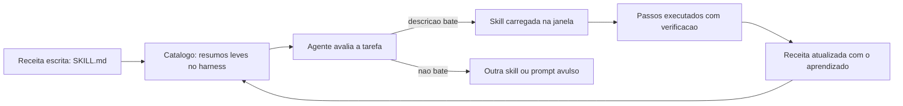

# Capítulo 9: Skills: conhecimento reutilizável do canteiro

# Capítulo 9: Skills: conhecimento reutilizável do canteiro

## Introdução

No Capítulo 8 você ergueu o primeiro andar da TorreDeControle — o esqueleto completo, verificado e commitado. O canteiro agora tem estrutura, mas falta algo que todo canteiro profissional tem: o **conhecimento reutilizável** — as receitas prontas para tarefas que se repetem. No desenvolvimento agêntico, esse conhecimento assume a forma de *skills*: instruções procedurais modulares que o agente carrega sob demanda, quando a tarefa corresponde à skill.

A skill é a evolução natural do prompt bom (Capítulo 4): em vez de reescrever o briefing de cinco partes toda vez que a mesma tarefa aparece, você o registra uma vez, num formato que o agente descobre e carrega automaticamente. O ganho é duplo: consistência (a receita é sempre a mesma, não reinventada a cada sessão) e economia de contexto (as instruções detalhadas só entram na janela quando são necessárias — o princípio just-in-time do Capítulo 5). Este capítulo ensina o que é uma skill, quando criar uma, como estruturá-la e como integrá-la ao fluxo da TorreDeControle — com exemplos prontos para uso imediato.

## Explica

### O que é uma skill no ecossistema agêntico

Uma skill é um conjunto de instruções procedurais — geralmente um arquivo `SKILL.md` com metadados e passos — que o agente carrega sob demanda. O harness mantém um catálogo de skills disponíveis (com resumos leves), e quando a tarefa do usuário corresponde à descrição de uma skill, o agente injeta as instruções detalhadas no contexto. É o mecanismo de "conhecimento sob demanda" do Capítulo 5 aplicado a procedimentos: o resumo ocupa pouco espaço na janela; o detalhe entra apenas quando relevante.

A diferença entre skill e prompt avulso é a mesma entre uma receita registrada na parede da cozinha e uma receita que o cozinheiro relembra "mais ou menos" a cada vez. A skill é a receita registrada: testada, versionada, reutilizável — e independente do humor ou da memória da sessão.

### Os elementos de uma skill bem formada

Uma skill bem formada tem quatro partes:

1. **Cabeçalho de metadados**: nome e descrição — a descrição é crítica, porque é ela que o agente lê para decidir quando a skill é relevante.
2. **Objetivo**: o que a skill entrega, em uma frase verificável.
3. **Procedimento**: os passos numerados — o coração da skill, escrito com a precisão de um protocolo.
4. **Verificação**: como saber que o procedimento funcionou — comandos, critérios, saídas esperadas.

O cabeçalho de metadados merece atenção especial: uma descrição ruim faz o agente invocar a skill na hora errada (ou nunca invocar). A regra é escrever a descrição como resposta à pergunta "quando alguém precisaria disto?" — com os gatilhos, o contexto e o resultado.

### Quando criar uma skill (e quando não)

A pergunta prática é: "isto vira skill ou fica como prompt?" A regra de ouro tem três condições — a skill se justifica quando:

1. **Repetição**: a tarefa aparece com frequência — semanal, diária, por fatia.
2. **Procedimento**: a tarefa tem passos definidos e verificáveis — não é uma conversa aberta de descoberta.
3. **Custo de errar**: o erro tem consequência — perder tempo, quebrar padrão, introduzir inconsistência.

A skill **não** se justifica para tarefas de uma vez, exploratórias ou cuja resposta é subjetiva. Criar skill demais é tão ruim quanto criar de menos: o catálogo inchado custa tokens (todo resumo ocupa espaço) e confunde o agente.

### Skills vs. AGENTS.md: a divisão de trabalho

A relação entre skill e manual de bordo é complementar: o AGENTS.md (Capítulo 6) é o contrato permanente, pequeno e estável, sempre na janela; a skill é o procedimento detalhado, carregado sob demanda. A regra de migração: **quando um procedimento do manual cresce demais ou aparece raramente, ele sai do manual e vira skill** — o manual fica com a regra, a skill fica com o procedimento. Esse movimento é o mesmo da fundação do Capítulo 5: manter o permanente pequeno e o detalhe sob demanda.

## Ilustra

### A Parede de Receitas do Canteiro

Volte ao canteiro. Todo canteiro profissional tem uma parede de receitas: protocolos prontos para tarefas que se repetem — "como concretar em dia de chuva", "como fazer a vistoria de laje", "como registrar uma mudança no diário de bordo". Cada receita está escrita, testada e pendurada num lugar visível. O operário novo não reinventa a receita: consulta a parede, segue os passos e entrega o mesmo resultado que o veterano.

As skills são a parede de receitas do seu canteiro de software. A receita de "adicionar uma rota à API" fica registrada uma vez; todo agente que precisar adicionar rota consulta a receita e segue o mesmo padrão — sem reinventar, sem esquecer passo, sem criar variação. A parede de receitas é o que transforma um canteiro que depende de quem está no turno em um canteiro que entrega o mesmo padrão em qualquer turno.



### A Receita que Só Existe na Cabeça do Veterano: Por Que Skills Importam

Aqui está o ponto contraintuitivo — a segunda camada de analogia. A primeira mostrou a parede de receitas. A segunda é sobre o custo de *não* ter a parede — o conhecimento que vive só na cabeça de quem sabe.

Imagine um canteiro onde a receita de concretagem existe apenas na cabeça do mestre mais antigo. Enquanto ele está presente, tudo funciona — ele lembra dos detalhes, dos cuidados, das verificações. No dia em que ele tira férias, a obra para: o substituto reinventa a receita, erra um passo, e o concreto de uma laje inteira precisa ser refeito. O conhecimento do canteiro era um gargalo humano — e gargalos humanos viram falhas.

Com skills é o oposto: a receita é um artefato do repositório, não da cabeça de ninguém. Qualquer agente, em qualquer sessão, consulta a mesma receita e entrega o mesmo padrão. Como Mestre de Obras, você vai perceber que o conhecimento não registrado é conhecimento perdido — e que a skill é a forma de o canteiro aprender de verdade, acumulando receita sobre receita em vez de depender da memória do turno atual.

## Técnica

### Skill 1: Adicionar Rota à API (o padrão do projeto)

A primeira skill da TorreDeControle é a mais usada — o procedimento de adicionar uma rota à API seguindo o padrão do projeto. Esta é a estrutura completa:

```markdown
---
name: adicionar-rota-api
description: Adiciona um novo endpoint REST à API da TorreDeControle seguindo
  o padrão do projeto (camada api fina, validação no service, testes de
  integração). Use quando o usuário pedir "criar endpoint", "adicionar rota",
  "expor recurso na API" ou similar.
---

# Adicionar Rota à API

## Objetivo
Criar um endpoint REST completo (handler, service, testes) no padrão do
projeto, verificável por testes de integração.

## Procedimento
1. Identifique o recurso e a operação (RF correspondente na especificação).
2. No service (app/services/), implemente ou reutilize a função de negócio.
3. No handler (app/api/routes/), crie o endpoint com:
   - Rota RESTful e status code correto (200/201/204/422/403).
   - Schemas de request/response (pydantic) no mesmo arquivo.
   - Dependência de autenticação quando o recurso for privado.
4. Adicione o teste de integração em tests/api/ cobrindo sucesso e erro.
5. Rode as verificações abaixo.

## Verificação
- python -m pytest tests/api/ -q  →  todos passam
- python -m compileall app/       →  sem erro
- O endpoint responde no servidor local (curl ou TestClient)
```

### Skill 2: Revisar Código Gerado (o protocolo do Capítulo 8)

A segunda skill padroniza a revisão dirigida — o protocolo do Capítulo 8 que você não quer reinventar a cada fatia:

```markdown
---
name: revisar-codigo-gerado
description: Revisa código gerado por agente contra a especificação, o
  AGENTS.md e a verificabilidade. Use após qualquer entrega significativa de
  código gerado (scaffolding, feature nova, refatoração).
---

# Revisar Código Gerado

## Objetivo
Aprovar ou rejeitar uma entrega de código gerado com base em três frentes:
especificação, convenções e verificabilidade.

## Procedimento
1. Especificação: compare o código com os RFs e RNs da docs/especificacao.md.
   - Campos, Enums, transições e cardinalidades batem com a spec?
2. Convenções: confira o AGENTS.md (camadas, nomes, padrão de commit).
   - O código respeita a separação models/services/api?
3. Verificabilidade: rode os comandos do manual.
   - python -m pytest tests/ -q
   - python -m compileall app/
4. Registre o veredito: APROVADO ou REJEITADO com lista objetiva de ajustes.

## Verificação
- Veredito registrado em docs/revisoes/YYYY-MM-DD-nome.md
- Ajustes rejeitados viram prompt de refinamento (Capítulo 4)
```

### Criando uma Skill na Prática: o Arquivo e o Teste

Agora o passo a passo de criação de uma skill na sua máquina — usando a skill de rota como exemplo:

```bash
# 1. Crie a pasta da skill no diretório de skills do projeto
mkdir -p .claude/skills/adicionar-rota-api

# 2. Crie o SKILL.md com o conteúdo da Skill 1
#    (conteúdo acima, salvo como .claude/skills/adicionar-rota-api/SKILL.md)

# 3. Commit a skill como artefato do projeto
git add .claude/skills/adicionar-rota-api/SKILL.md
git commit -m "feat: skill adicionar-rota-api padronizando endpoints REST"
```

Para verificar que o harness está enxergando a skill, abra uma sessão nova e pergunte: "que habilidades estão disponíveis neste projeto?" — a skill deve aparecer no catálogo com a descrição correta.

### O Verificador de Skills: Higiene do Catálogo

Para manter o catálogo saudável — sem skills órfãs, sem descrições vagas — o verificador de skills:

```python
# verificar_skills.py — Verifica a higiene do catalogo de skills
import re
from pathlib import Path

DIRETORIO_SKILLS = Path(".claude/skills")

def listar_skills() -> list[Path]:
    """Lista os diretorios de skill que contem SKILL.md."""
    if not DIRETORIO_SKILLS.exists():
        return []
    return [p for p in DIRETORIO_SKILLS.iterdir() if (p / "SKILL.md").exists()]

def avaliar_skill(skill: Path) -> list[str]: """Avalia a qualidade da skill: descricao, passos e verificacao.""" problemas: list[str] = [] texto = (skill / "SKILL.md").read_text(encoding="utf-8") if "description:" not in texto: problemas.append("sem campo description no cabecalho") if "## Objetivo" not in texto: problemas.append("sem secao Objetivo") if "## Procedimento" not in texto: problemas.append("sem secao Procedimento") if "## Verificação" not in texto and "## Verificacao" not in texto: problemas.append("sem secao Verificacao") if len(texto) < 500: problemas.append("skill muito curta (menos de 500 caracteres)") return problemas

def main() -> None: """Checklist de higiene do catalogo de skills.""" skills = listar_skills() if not skills: print("Nenhuma skill encontrada em .claude/skills/") return problemas_gerais = 0 for skill in skills: problemas = avaliar_skill(skill) status = "OK" if not problemas else "PROBLEMAS: " + "; ".join(problemas) print(f"{skill.name}: {status}") problemas_gerais += len(problemas) if problemas_gerais: print("CATALOGO COM PROBLEMAS: revise as skills sinalizadas") return print("CATALOGO OK: todas as skills bem formadas")

if __name__ == "__main__":
    main()
```

Rode `verificar_skills.py` e o catálogo deve reportar OK — a mesma disciplina determinística de toda a obra.

### O Protocolo de Criação de Skills

Para fechar, o protocolo de criação — quando a terceira ocorrência da mesma tarefa aparecer, siga este fluxo:

1. **Reconhecer o padrão**: a tarefa apareceu três vezes com o mesmo procedimento.
2. **Escrever a skill**: cabeçalho + objetivo + procedimento + verificação, seguindo o modelo.
3. **Testar a skill**: invoque-a num caso real e verifique a saída.
4. **Commitar**: a skill é artefato do repositório, como código.
5. **Refinar com uso**: a cada uso que revelar passo faltante, atualize a skill.

## Aplica

### A Cena de Contraste: O Canteiro sem Parede de Receitas

Imagine o projeto TorreDeControle com três semanas de vida, mas sem nenhuma skill. Todo desenvolvedor — humano ou agente — adiciona rota do seu jeito: um coloca a validação no handler, outro no service, um terceiro nem testa. Quando você precisa mexer numa rota antiga, encontra três padrões diferentes no mesmo repositório, e cada correção exige entender qual padrão aquele arquivo específico seguiu. O código funciona, mas a manutenção é um labirinto — e cada agente novo que entra aprende o padrão errado do arquivo que leu primeiro.

O diagnóstico: o conhecimento procedimental do projeto não foi registrado — existia apenas nos prompts avulsos e na memória de cada sessão. Sem a parede de receitas, cada turno reinventa a receita.

A correção: você adota o protocolo de criação — a partir de agora, o terceiro uso de um procedimento vira skill. Em duas semanas, o canteiro tem cinco receitas na parede: rota, revisão, teste, commit, deploy. O mesmo agente, no mesmo projeto, passa a entregar no padrão único — porque a receita está no repositório, não na memória da sessão. A manutenção deixa de ser labirinto e volta a ser caminho único.

### Armadilhas Comuns ao Trabalhar com Skills

- **Descrição vaga no cabeçalho**: a descrição é o gatilho do agente; "faz coisa útil" nunca invoca. Escreva descrições com quando-usar e resultado.
- **Skill órfã do catálogo**: criar o arquivo sem testar se o harness o descobre. Verifique com "que habilidades estão disponíveis?".
- **Catálogo inchado**: skill demais custa tokens e confunde. Só crie quando repetição + procedimento + custo de erro justificarem.
- **Skill que duplica o AGENTS.md**: se a skill repete o manual, um dos dois está errado. Manual = regra; skill = procedimento.
- **Skill sem verificação**: receita sem "como saber que funcionou" é instrução, não protocolo. Toda skill termina com Verificação.
- **Skills fora do repositório**: skill que mora só na máquina não viaja com o projeto. Skills vão no git, como código.

### Exercício Prático

Crie a skill `adicionar-rota-api` e a skill `revisar-codigo-gerado` no projeto, siga o protocolo de verificação (`verificar_skills.py`), teste a skill de rota invocando-a numa rota nova da API e commite as duas skills.

### Aprofundamento: O Ciclo de Vida de uma Skill na Prática

Uma skill não nasce pronta — ela nasce de um prompt repetido e evolui com o uso. Este é o ciclo de vida completo, do prompt avulso à skill madura, com os sinais de cada estágio:

1. **Prompt avulso (1ª-2ª ocorrência)**: a tarefa aparece uma vez ou duas. Você escreve o prompt do Capítulo 4 a cada vez. Nada a fazer além de notar o padrão.
2. **Padrão reconhecido (3ª ocorrência)**: a mesma tarefa com o mesmo procedimento aparece pela terceira vez. É o gatilho: a receita merece virar skill.
3. **Skill v1 (a primeira versão)**: você escreve o SKILL.md com cabeçalho, objetivo, procedimento e verificação — a partir do melhor prompt que você usou. Versiona no repositório.
4. **Skill refinada**: cada uso que revela um passo faltante ou uma ambiguidade atualiza a skill. A versão 3 é quase sempre muito melhor que a v1 — e é por isso que a skill é versionada, não reescrita do zero.
5. **Skill madura**: a skill é usada sem olhar para o prompt original — o procedimento virou o padrão do projeto. Outros agentes (e outros membros do time) a usam com o mesmo resultado.

O gatilho da promoção tem um detalhe importante: a regra do "terceiro uso" não é sobre *quantidade de vezes* — é sobre *frequência com custo de erro*. Uma tarefa que aparece uma vez por mês, mas que quando erra custa caro (uma migração, um deploy), merece skill antes de três usos. Uma tarefa diária trivial (um ajuste de formatação) pode nunca merecer — o custo de manter a skill supera o ganho.

```bash
# Triagem de promoção para skill em um comando:
# 1. A tarefa tem procedimento definido? (sim)
# 2. Ela se repete? (sim, N vezes)
# 3. Errar custa caro? (sim ou nao)
# Se (2) e (3) juntos, a skill se justifica.
```

O ciclo de vida completa o Capítulo 4 e prepara o Capítulo 12: prompts viram skills, skills viram o padrão do projeto, e o padrão do projeto é o que os subagentes seguem. O conhecimento do canteiro acumula — receita sobre receita — em vez de viver na memória de cada sessão.

### Aprofundamento: O Catálogo de Skills do Projeto

Um canteiro maduro tem a parede de receitas organizada — e o catálogo de skills do projeto é essa organização em formato de índice. Este é o modelo do catálogo, que cresce a cada skill criada:

```markdown
# Catálogo de Skills — TorreDeControle

| Skill | O que faz | Quando usar | Verificação |
|---|---|---|---|
| adicionar-rota-api | Cria endpoint REST no padrão do projeto | Pedido de "criar endpoint", "adicionar rota" | pytest da rota + compileall |
| revisar-codigo-gerado | Revisa entrega contra spec e manual | Após qualquer entrega significativa | Veredito estruturado |
| <skill nova> | <o que faz> | <gatilho de uso> | <como verifica> |

## Regras do catálogo
1. Toda skill tem linha no catálogo — skill órfã é skill perdida.
2. O gatilho (coluna "Quando usar") espelha a description do SKILL.md.
3. O catálogo é a primeira coisa que um novo agente consulta.
4. Skills desatualizadas saem do catálogo (e do diretório) — catálogo vivo é catálogo limpo.
```

O catálogo tem um papel que vai além da organização: ele é o *índice da memória procedimental do projeto*. Quando o time cresce — ou quando um agente novo entra no projeto — o catálogo responde em segundos "o que este canteiro sabe fazer e como" — sem depender de perguntar para cada pessoa. É o mesmo papel do mapa de contexto do Capítulo 5, mas para procedimentos em vez de informação: o mapa diz onde está o conhecimento; o catálogo diz quais receitas existem e quando usá-las.

```bash
# Verificacao do catalogo em um comando: toda skill do diretorio tem linha no catalogo?
for skill in .claude/skills/*/; do
  nome=$(basename "$skill")
  grep -q "$nome" docs/catalogo_skills.md || echo "SKILL SEM LINHA NO CATALOGO: $nome"
done
```

A manutenção do catálogo segue o mesmo gatilho das skills: quando uma skill muda de comportamento, o catálogo muda junto — e o `verificar_skills.py` do capítulo ganha uma verificação a mais: nenhuma skill órfã do catálogo.

## Conclusão

Neste capítulo você equipou o canteiro com conhecimento reutilizável: entendeu o que é uma skill — receita sob demanda carregada pelo agente quando a descrição corresponde à tarefa; aprendeu a estrutura de cabeçalho, objetivo, procedimento e verificação; a regra de quando criar (repetição + procedimento + custo de erro) e quando não; e criou as primeiras skills da TorreDeControle com o verificador de catálogo. A lição central: conhecimento não registrado é conhecimento perdido — a skill é a forma de o projeto acumular receita sobre receita, independente do turno.

Seu desafio: as duas skills criadas, verificadas, testadas e commitadas — e o hábito de transformar o terceiro uso de um procedimento em skill.

No Capítulo 10, vamos conectar o canteiro ao mundo real: o Model Context Protocol — o que são resources, prompts e tools, como configurar servidores MCP e como conectar banco e APIs externas ao agente da TorreDeControle.