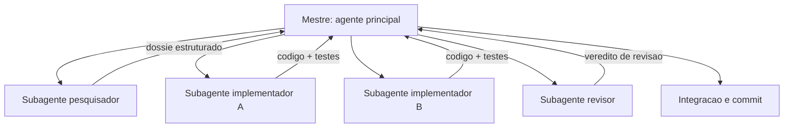

# Capítulo 12: Subagentes: a equipe de obra

# Capítulo 12: Subagentes: a equipe de obra

## Introdução

No Capítulo 11 você estendeu as mãos do agente com ferramentas próprias — as máquinas sob medida do canteiro. Mas uma obra grande não é feita por um único operário, por mais capaz que ele seja: é feita por uma **equipe** — especialistas que trabalham em paralelo, cada um na sua frente, sob a coordenação de um mestre. No desenvolvimento agêntico, essa equipe existe e tem nome: **subagentes** — agentes-filhos com escopos, prompts e responsabilidades próprias, instanciados pelo harness para executar tarefas especializadas.

Este capítulo ensina quando e por que usar subagentes; como definir escopos, prompts e protocolos de saída para cada um; e como orquestrar o trabalho paralelo — a mesma disciplina de lotes que você conhece da Fábrica Agêntica. Ao final, a TorreDeControle terá sua própria equipe de obra: subagentes de pesquisa, implementação e revisão trabalhando em paralelo sob o seu comando.

## Explica

### Por que subagentes, se um agente resolve?

A pergunta legítima: o agente principal já faz tudo — por que fragmentar em subagentes? A resposta tem três motivos técnicos e um de método:

1. **Foco e contexto**: cada subagente recebe uma fatia pequena de contexto (o princípio just-in-time do Capítulo 5 aplicado a agentes). Em vez de uma janela gigante com tudo, várias janelas pequenas com o essencial de cada tarefa — menos context rot, mais precisão.
2. **Paralelismo**: tarefas independentes rodam ao mesmo tempo — pesquisar, implementar, revisar — em vez de sequencialmente. É o mesmo ganho dos lotes do Capítulo 8, em escala de agentes.
3. **Especialização**: cada subagente tem um prompt de sistema próprio — o pesquisador sabe pesquisar, o revisor sabe revisar. Especialização melhora a qualidade de cada função.
4. **Isolamento de risco**: um subagente que falha não contamina o trabalho dos outros; a falha é contida e reportada.

O modelo mental: o agente principal é o mestre de obras — planeja, despacha e integra; os subagentes são as equipes especializadas — cada uma executa a sua frente com autonomia dentro do escopo.

### O que define um bom subagente

Um subagente bem definido tem quatro atributos — e eles são, na prática, a especificação do agente-filho:

1. **Escopo**: o que ele faz e — tão importante — o que ele NÃO faz. Escopo vago produz subagente que sai do trilho.
2. **Prompt de sistema**: as instruções permanentes — papel, método, regras. É o AGENTS.md do subagente.
3. **Entradas e saídas**: o que ele recebe (contexto, arquivos) e o que ele entrega (formato do resultado). Saída padronizada permite ao mestre integrar o resultado sem adivinhar.
4. **Limites**: orçamento de passos, arquivos permitidos, permissões. Autonomia dentro de limites — o subagente não tem poderes infinitos.

O atributo mais negligenciado é o terceiro — o formato da saída. Um subagente que entrega "um resumo do que fez" em formato livre força o mestre a interpretar; um subagente que entrega JSON estruturado permite integração automática. O protocolo de saída é o contrato entre mestre e equipe.

### A hierarquia de orquestração

A orquestração típica tem três níveis:

- **Nível 0 — o mestre (agente principal)**: recebe o objetivo, planeja, divide em tarefas, despacha subagentes, integra os resultados, reporta.
- **Nível 1 — os subagentes especializados**: executam as tarefas dentro do escopo — pesquisador, implementador, revisor.
- **Nível 2 — subagentes de subagentes**: raros e geralmente desnecessários; a hierarquia profunda complica o rastreamento sem ganho proporcional.

A regra de ouro da orquestração: o mestre despacha tarefas *paralelizáveis* para subagentes e mantém para si o que exige visão global — planejamento, decisões de arquitetura, integração. Subagentes não decidem arquitetura; executam fatias bem definidas.

### Quando a paralelização vale (e quando não)

A paralelização tem custo: cada subagente consome tokens, e a orquestração tem overhead. A decisão de despachar em paralelo segue uma matriz simples:

- **Vale paralelizar**: tarefas independentes, com escopos distintos, cada uma com contexto pequeno — pesquisar três assuntos, implementar três módulos isolados, revisar três arquivos.
- **Não vale paralelizar**: tarefas sequenciais por natureza (a saída de uma é a entrada da outra), tarefas minúsculas (o overhead supera o ganho), ou tarefas que compartilham estado frágil.

A disciplina dos lotes que você conhece do Capítulo 8 se aplica aqui com força total: despache em lotes, aguarde todos, integre, depois o próximo lote.

## Ilustra

### As Equipes Especializadas do Canteiro

Volte ao canteiro. O mestre de obras não assenta tijolo: ele coordena equipes. A equipe de fundação cuida das estacas, a equipe de estrutura das colunas, a equipe de elétrica das instalações, a equipe de vistoria das inspeções. Cada equipe tem um capataz com método próprio, um escopo definido — e entrega um relatório no padrão que o mestre consolidou. O mestre não precisa saber assentar tijolo melhor que o pedreiro: precisa saber *o que pedir, a quem, em que ordem e como integrar*.

Os subagentes são essas equipes. O subagente-pesquisador é a equipe de prospecção: recebe um tema, volta com o dossiê. O subagente-implementador é a equipe de estrutura: recebe uma fatia da spec, volta com código testado. O subagente-revisor é a equipe de vistoria: recebe uma entrega, volta com o veredito. O mestre — você, com o agente principal — coordena o canteiro inteiro.



### O Mestre que Assenta Tijolo: Por Que Delegar é a Habilidade

Aqui está o ponto contraintuitivo — a segunda camada de analogia. A primeira mostrou as equipes do canteiro. A segunda é sobre a habilidade mais difícil do mestre: *não fazer* — delegar.

Imagine dois mestres de obras. O primeiro é excelente pedreiro — mas insiste em assentar cada tijolo ele mesmo, "para garantir". O resultado: a fundação atrasa, porque ele é um homem só; a elétrica espera, porque a estrutura não terminou; e as equipes — sem trabalho delegado — ficam paradas pagas para esperar. O segundo mestre é um pedreiro mediano — mas delega como ninguém: cada equipe recebe escopo, prazo e padrão de entrega; o mestre integra, inspeciona e ajusta. Qual canteiro entrega mais rápido? O segundo, por uma margem enorme.

Com subagentes é idêntico: o agente principal que tenta fazer tudo ele mesmo transforma o paralelismo em fila. Como Mestre de Obras, a habilidade não é executar melhor que os subagentes — é *definir a tarefa, o escopo e o protocolo de saída* tão bem que eles executem sem supervisão constante. Delegar bem é a engenharia do Capítulo 7 aplicada a agentes: especificação clara, critérios de aceite, formato de entrega.

## Técnica

### O Prompt de Definição de um Subagente

A técnica central é a definição — o "contrato" do subagente. Este é o modelo de definição, com os quatro atributos, aplicado ao subagente-revisor da TorreDeControle:

```markdown
# Subagente: Revisor de Código

## Escopo
Revisa entregas de código da TorreDeControle contra a especificação
(docs/especificacao.md), o manual (AGENTS.md) e a verificabilidade.
NÃO modifica arquivos; apenas reporta o veredito.

## Prompt de sistema
Você é o revisor técnico sênior da TorreDeControle. Compare a entrega
recebida com: (1) RFs e RNs da especificação; (2) convenções do AGENTS.md;
(3) verificabilidade real (rode os comandos se disponível). Seja objetivo:
liste APROVADO ou REJEITADO com itens concretos. Não elogie; não adivinhe;
não altere código.

## Entradas
- Caminho do arquivo entregue (ou diff).
- RFs/RNs relevantes da especificação.

## Saída (formato obrigatório)
{
  "veredito": "APROVADO | REJEITADO",
  "conformidade_spec": ["RF3 ok", "RN2 violada: ..."],
  "conformidade_manual": ["camada api fina ok"],
  "verificabilidade": {"pytest": "passou", "compileall": "passou"},
  "ajustes_necessarios": ["item 1", "item 2"]
}

## Limites
- Máximo 10 passos de análise.
- Apenas leitura; sem permissão de escrita.
- Não roda comandos destrutivos.
```

Repare nos quatro atributos em ação: escopo com "NÃO faz", prompt de sistema com método e tom, entradas claras, saída em JSON estruturado e limites explícitos. Esse é o contrato completo.

### Despachando Subagentes em Lotes

O segundo padrão técnico é o despacho em lotes — a orquestração prática. O fluxo para uma fatia de trabalho da TorreDeControle com três subagentes em paralelo:

```markdown
1. Definir a fatia: "implementar endpoint de criação de tarefa (RF3)".
2. Despachar em paralelo:
   - Subagente A (implementador): implementa a fatia com testes.
   - Subagente B (pesquisador): verifica o padrão de rota no código existente
     (skill adicionar-rota-api) e reporta o padrão esperado.
   - Subagente C (revisor): revisa a entrega de A contra RF3 e RN2.
3. Aguardar todos concluírem.
4. Integrar: aplicar o padrão de B, o código de A, o veredito de C.
5. Se C rejeitou, enviar os ajustes de volta a A (nova iteração).
6. Commit da fatia aprovada.
```

O padrão de lotes é o mesmo do Capítulo 8: despachar, aguardar todos, integrar, depois o próximo lote — nunca despachar o lote seguinte antes de o atual ser integrado.

### O Coordenador de Subagentes: o Esqueleto de Orquestração

Para materializar a orquestração, o esqueleto de um coordenador em Python — a versão minimalista de como o mestre despacha, coleta e integra:

```python
# coordenador_subagentes.py — Esqueleto de orquestracao em lotes
from dataclasses import dataclass, field
from typing import Callable

@dataclass
class Subagente:
    nome: str
    escopo: str
    executar: Callable[[str], str]

@dataclass
class Lote:
    tarefas: list[tuple[str, Subagente]] = field(default_factory=list)

    def despachar(self) -> dict[str, str]:
        """Executa todas as tarefas do lote (simulando paralelismo) e coleta."""
        resultados: dict[str, str] = {}
        for tarefa, subagente in self.tarefas:
            resultados[subagente.nome] = subagente.executar(tarefa)
        return resultados

def implementador(tarefa: str) -> str:
    """Subagente implementador: retorna o codigo gerado (simulado)."""
    return f"codigo implementado para: {tarefa}"

def revisor(tarefa: str) -> str:
    """Subagente revisor: retorna o veredito (simulado)."""
    return f"REVISADO: {tarefa} -> APROVADO"

def pesquisador(tarefa: str) -> str:
    """Subagente pesquisador: retorna o padrao encontrado (simulado)."""
    return f"PADRAO: {tarefa} -> seguir skill adicionar-rota-api"

def main() -> None: """Despacha o lote da fatia RF3 e integra os resultados.""" lote = Lote( tarefas=[ ("endpoint criar tarefa RF3", Subagente("implementador", "implementa fatias", implementador)), ("padrao de rota", Subagente("pesquisador", "busca padroes", pesquisador)), ("entrega do endpoint", Subagente("revisor", "revisa entregas", revisor)), ] ) resultados = lote.despachar() for nome, saida in resultados.items(): print(f"[{nome}] {saida}") print("INTEGRACAO: aplicando padrao + codigo + veredito -> commit da fatia")

if __name__ == "__main__":
    main()
```

O esqueleto mostra o essencial: um lote de tarefas independentes, despacho em paralelo (simulado aqui), coleta de resultados estruturados e integração no final. O harness real faz o paralelismo de verdade; o padrão de orquestração é este.

### O Verificador de Definição de Subagentes

Para garantir que cada subagente está bem definido, o verificador — checa os quatro atributos na definição:

```python
# verificar_subagentes.py — Verifica a qualidade das definicoes de subagentes
import re
from pathlib import Path

DIRETORIO_AGENTES = Path(".claude/agents")

def listar_definicoes() -> list[Path]:
    """Lista os arquivos de definicao de subagentes do projeto."""
    if not DIRETORIO_AGENTES.exists():
        return []
    return sorted(DIRETORIO_AGENTES.glob("*.md"))

def avaliar_definicao(arquivo: Path) -> list[str]: """Avalia a definicao: escopo, prompt, entradas/saidas e limites.""" problemas: list[str] = [] texto = arquivo.read_text(encoding="utf-8") if "## Escopo" not in texto: problemas.append("sem secao Escopo") if "## Prompt de sistema" not in texto: problemas.append("sem secao Prompt de sistema") if "## Entradas" not in texto: problemas.append("sem secao Entradas") if "## Sa" not in texto: problemas.append("sem secao Saida/formato") if "## Limites" not in texto: problemas.append("sem secao Limites") if len(texto) < 600: problemas.append("definicao muito curta (menos de 600 caracteres)") return problemas

def main() -> None: """Checklist de qualidade das definicoes de subagentes.""" definicoes = listar_definicoes() if not definicoes: print("Nenhuma definicao de subagente encontrada") return total_problemas = 0 for arquivo in definicoes: problemas = avaliar_definicao(arquivo) status = "OK" if not problemas else "PROBLEMAS: " + "; ".join(problemas) print(f"{arquivo.name}: {status}") total_problemas += len(problemas) if total_problemas: print("DEFINICOES COM PROBLEMAS: revise os arquivos sinalizados") return print("DEFINICOES OK: todos os subagentes bem formados")

if __name__ == "__main__":
    main()
```

Mesma disciplina de sempre: a definição não "parece" completa — o script prova.

## Aplica

### A Cena de Contraste: O Agente Único em Série

Imagine a semana em que a TorreDeControle precisa de três features novas: autenticação (RF1), quadro Kanban (RF4) e histórico (RF5). Você usa o agente principal sozinho, em série: pede a primeira, espera, integra, pede a segunda, espera, integra, pede a terceira... São três ciclos completos de implementação + revisão + integração, e cada ciclo reabre o mesmo contexto gigante. A semana termina com uma feature pronta, uma pela metade e a terceira nem começada — e a janela da sessão, que carregou tudo, degradou no meio do caminho (o context rot do Capítulo 5 voltou).

O diagnóstico: o mestre tentou assentar todos os tijolos sozinho — serializou o que era paralelizável e acumulou contexto no agente errado. As três features eram independentes (módulos isolados) e pediam escopos pequenos: o caso perfeito para três subagentes.

A correção: você despacha um lote com três subagentes implementadores — um por feature — mais um revisor; aguarda; integra as entregas aprovadas e devolve as rejeitadas para iteração. A semana termina com as três features commitadas, cada uma com testes, e o agente principal com a janela limpa, dedicado à orquestração e integração. A mesma quantidade de trabalho — mas o canteiro inteiro trabalhou em paralelo, não uma frente de cada vez.

### Armadilhas Comuns na Orquestração de Subagentes

- **Subagente sem escopo**: sem o "o que NÃO faz", o subagente sai do trilho. Escopo com limites explícitos.
- **Saída em formato livre**: resultado livre força o mestre a interpretar. Formato estruturado (JSON) para integração automática.
- **Despachar tarefas sequenciais em paralelo**: a saída de uma é a entrada da outra? Então é fila, não lote. Paralelize só o independente.
- **Hierarquia profunda demais**: subagentes de subagentes complicam o rastreio sem ganho. Dois níveis bastam.
- **Mestre que faz tudo**: se o agente principal executa as fatias, os subagentes são desperdício. O mestre planeja, despacha e integra.
- **Ignorar os limites**: subagente com poder de escrita irrestrito é risco. Limites de arquivos, passos e permissões por definição.

### Exercício Prático

Defina três subagentes da TorreDeControle — pesquisador (busca padrão e dossiê), implementador (fatias da spec) e revisor (veredito estruturado) — usando o modelo de definição; rode `verificar_subagentes.py`; e orquestre um lote real: implementação de uma feature (ex.: endpoint de criar tarefa) com os três subagentes, integrando o resultado e commitando.

### Aprofundamento: O Subagente Pesquisador em Ação

O subagente-pesquisador é o mais versátil da equipe — e o mais mal definido quando não se aplica o método. Este é o modelo completo de definição, pronto para adaptar, com o protocolo de saída que o torna útil de verdade:

```markdown
# Subagente: Pesquisador

## Escopo
Investiga tópicos técnicos e retorna um dossiê estruturado: conceitos-chave,
fontes confiáveis, padrões encontrados. NÃO implementa; NÃO decide; NÃO opina
sobre o que o projeto deve fazer.

## Prompt de sistema
Você é o pesquisador técnico do projeto. Para o tópico recebido: (1) busque
fontes confiáveis (documentação oficial, papers, repositórios de referência);
(2) descarte conteúdo superficial; (3) sintetize em conceitos-chave com fonte
de cada um; (4) reporte no formato abaixo. Cite a fonte de cada afirmação.

## Entradas
- Tópico da pesquisa (uma frase).
- Contexto do projeto (opcional, para calibrar a profundidade).

## Saída (formato obrigatório)
{
  "topico": "...",
  "conceitos_chave": [{"conceito": "...", "definicao": "...", "fonte": "url"}],
  "fontes_confiaveis": [{"titulo": "...", "url": "...", "tipo": "docs|paper|repo"}],
  "pontos_em_conflito": ["..."],
  "recomendacao_de_leitura": ["..."]
}

## Limites
- Máximo 8 fontes; máximo 12 conceitos.
- Sem implementação; sem decisão de design.
- Toda afirmação com fonte — nenhuma opinião sem base.
```

O pesquisador bem definido é o radar do canteiro: recebe um tópico e volta com o mapa do terreno — conceitos, fontes e conflitos — sem decidir nada por você. É ele que alimenta o Capítulo 1 da próxima obra (a pesquisa do dossiê) e o diagnóstico do Capítulo 19 (o que os logs dizem). A definição acima é o modelo que você adapta: o que muda entre projetos é o vocabulário do domínio; o que se copia é o protocolo — escopo, método, saída estruturada, limites.

## Conclusão

Neste capítulo você montou a equipe de obra da TorreDeControle: entendeu por que subagentes — foco, paralelismo, especialização e isolamento de risco; aprendeu os quatro atributos de uma boa definição (escopo, prompt, entradas/saídas, limites); dominou o despacho em lotes com integração; e criou a definição padrão e o verificador do projeto. A lição central: o mestre não executa melhor que a equipe — ele define a tarefa, o escopo e o formato de entrega tão bem que a equipe executa sozinha, e a paralelização transforma semanas em dias.

Seu desafio: três subagentes definidos e verificados, e um lote orquestrado de ponta a ponta — com integração e commit da fatia.

No Capítulo 13, vamos colocar as regras de segurança do canteiro em produção: hooks, permissões e governança — a autonomia segura do agente.