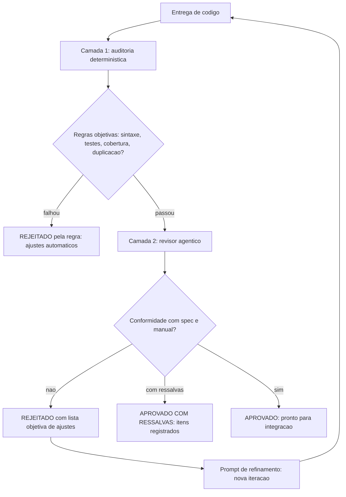

# Capítulo 15: Revisão de código autônoma: a inspeção de obra

# Capítulo 15: Revisão de código autônoma: a inspeção de obra

## Introdução

No Capítulo 14 você instalou o portão de qualidade — o CI de sintaxe que barra código quebrado na origem. Mas código que compila e passa nos testes ainda pode estar errado de formas que nem o compilador nem a suíte detectam: violações sutis de regra de negócio, inconsistência com a especificação, duplicação de lógica, decisões de design questionáveis. Essa é a fronteira da **revisão de código** — e, como tudo no canteiro, ela também ganha versão autônoma.

Este capítulo trata da inspeção de obra em escala: os agentes revisores (o subagente-revisor do Capítulo 12 em produção), as auditorias determinísticas que examinam o código com regras objetivas — sintaxe, rastreabilidade, sobreposição, consistência terminológica — e o ciclo de revisão que transforma "entregue" em "aprovado". Ao final, a TorreDeControle terá um fluxo de revisão autônoma de duas camadas: o revisor agêntico (julgamento) e a auditoria determinística (regras) — com o veredito registrado antes de qualquer integração.

## Explica

### Por que a revisão não pode desaparecer

Um dos mitos mais perigosos do AIDD é que a revisão humana "vai sumir". A realidade documentada é o oposto: a revisão é o gargalo *novo* do fluxo agêntico — o volume de código gerado cresce, e quem precisa ler cresce junto. O relatório DORA mostra que as equipes de alta performance não revisam menos — revisam melhor: a IA revisa a IA, o humano revisa as decisões. A revisão não desaparece: ela é delegada em camadas, e é exatamente essa delegação que este capítulo constrói.

A tese é: **revisão autônoma não é revisão sem humano — é revisão com o humano no lugar certo**. O agente revisor e a auditoria determinística filtram o que é filtravél por regra (90% dos problemas); o humano concentra o julgamento no que exige contexto de negócio (os 10% restantes). O resultado é um fluxo em que o humano revisa menos volume — mas revisa melhor.

### As duas camadas da revisão autônoma

A revisão autônoma tem duas camadas com naturezas diferentes — e confundir as duas é o erro mais comum:

**Camada 1 — Auditoria determinística**: regras objetivas, executadas por script, sem julgamento: o código compila? os testes passam? todo critério de aceite tem teste? há duplicação entre módulos? a terminologia é consistente? as referências são rastreáveis? É a camada que o Capítulo 14 começou (CI de sintaxe) e que este capítulo amplia: cobertura de regras, sobreposição, consistência. A auditoria não opina: mede.

**Camada 2 — Revisão agêntica**: julgamento de engenharia, executado por um subagente-revisor com a especificação em mãos: a implementação satisfaz a intenção do requisito? as decisões de design são coerentes com a arquitetura do AGENTS.md? há caminhos que o teste não cobre e que o código permite? É a camada que *interpreta*.

A ordem importa: a auditoria determinística roda primeiro (barata, rápida, objetiva) e só o que passa vai para o revisor agêntico (mais caro, mais lento, interpretativo). Filtrar por regra antes de julgar.

### O que a auditoria determinística examina

A auditoria de uma obra agêntica examina dimensões que um humano cansado deixaria passar — e que scripts nunca esquecem:

- **Sintaxe e testes**: o código compila e a suíte passa (Capítulo 14, inegociável).
- **Rastreabilidade**: todo requisito tem teste; todo teste rastreia um requisito (a ponte spec ↔ teste do Capítulo 14).
- **Sobreposição**: módulos duplicam lógica? O detector de similaridade compara trechos e sinaliza a duplicação — o débito técnico silencioso.
- **Consistência terminológica**: o mesmo conceito tem o mesmo nome em todo o código? O detector de termos flagra o "dono/responsável/gestor" usado como sinônimos — a fonte de bugs de comunicação.
- **Estrutura**: as camadas do AGENTS.md estão respeitadas? (models/services/api sem vazamento).

Cada dimensão é uma regra em script — e a soma delas é o "engenheiro que nunca cansa" do canteiro.

### O veredito do revisor agêntico

A revisão agêntica entrega um veredito estruturado — o formato que você definiu no Capítulo 12 — com três saídas possíveis:

- **APROVADO**: a entrega está conforme especificação, manual e verificabilidade.
- **APROVADO COM RESSALVAS**: aprovado com itens não bloqueantes registrados (refatoração futura, melhoria opcional).
- **REJEITADO**: com lista objetiva de ajustes — que viram o prompt de refinamento do Capítulo 4 na próxima iteração.

A regra do veredito: sempre objetivo, sempre rastreável a um item da especificação ou do manual — nunca "não gostei". O revisor agêntico não opina: reporta conformidade.

## Ilustra

### A Comissão de Vistoria do Canteiro

Volte ao canteiro. Antes da entrega de um andar, a obra passa por uma **comissão de vistoria** com dois grupos. O primeiro grupo é o dos medidores: engenheiros com instrumentos que medem objetivamente — o prumo da parede, a resistência do concreto, o nível do laje. Nenhum deles opina: medem contra a norma. O segundo grupo é o dos interpretadores: o arquiteto e o dono da obra, que comparam o resultado com a intenção do projeto — o prédio entrega o que foi desenhado? A comissão só libera o andar quando os dois grupos aprovam.

A revisão autônoma é essa comissão. A auditoria determinística é o grupo dos medidores — scripts que medem sintaxe, cobertura, duplicação, consistência. O revisor agêntico é o grupo dos interpretadores — o subagente que compara a entrega com a intenção da especificação. Os dois grupos têm vereditos distintos e complementares: medir primeiro, interpretar depois, liberar no fim.



### A Vistoria que Só Opina: Por Que as Duas Camadas se Completam

Aqui está o ponto contraintuitivo — a segunda camada de analogia. A primeira mostrou a comissão de dois grupos. A segunda é sobre por que nenhum dos dois grupos sozinho basta — e por que a ordem entre eles é sagrada.

Imagine uma vistoria com apenas medidores. Eles medem tudo — o prumo perfeito, o concreto resistente — e aprovam o andar. O arquiteto chega no dia seguinte e descobre: o prédio está tecnicamente perfeito, mas a parede que deveria separar a cozinha da sala foi construída no lugar errado — a planta foi mal interpretada. Os medidores mediram certo o que estava errado. Agora imagine a vistoria com apenas interpretadores: o arquiteto e o dono aprovam a intenção — e o laje desaba na primeira semana porque o concreto não tinha a resistência calculada. Os interpretadores julgaram bem o que ninguém mediu.

Com código é idêntico: a auditoria determinística sem o revisor agêntico aprova código tecnicamente perfeito que implementa a coisa errada; o revisor agêntico sem a auditoria aprova código com a intenção certa e sintaxe quebrada. Como Mestre de Obras, a comissão completa — medir primeiro, interpretar depois — é o único caminho: a regra pega o que o julgamento deixa passar, e o julgamento pega o que a regra não vê.

## Técnica

### Passo 1: O Auditor Determinístico do Projeto

O primeiro passo é o script de auditoria — a camada 1, com as dimensões objetivas. Este é o auditor da TorreDeControle:

```python
# auditar_repositorio.py — Auditoria deterministica da TorreDeControle
import subprocess
from pathlib import Path

def verificar_sintaxe() -> bool: """Camada 1a: sintaxe de app/ compila.""" try: subprocess.run(["python", "-m", "compileall", "-q", "app"], capture_output=True, check=True) return True except subprocess.CalledProcessError: return False

def verificar_testes() -> bool: """Camada 1b: suite de testes passa.""" try: subprocess.run(["python", "-m", "pytest", "tests/", "-q"], capture_output=True, check=True) return True except subprocess.CalledProcessError: return False

def detectar_duplicacao() -> list[str]:
    """Camada 1c: blocos repetidos acima de 6 linhas entre arquivos .py.

Heuristica simples: normaliza (espacos em branco) e compara linhas consecutivas entre pares de arquivos. Sinaliza a duplicacao para revisao. """ arquivos = sorted(Path("app").rglob("*.py")) duplicados: list[str] = [] blocos_por_arquivo: dict[str, set[str]] = {} for arquivo in arquivos: try: linhas = arquivo.read_text(encoding="utf-8").splitlines() except OSError: continue blocos = set() for i in range(len(linhas) - 5): bloco = tuple(l.strip() for l in linhas[i:i + 6]) if any(not b for b in bloco): continue blocos.add("\n".join(bloco)) blocos_por_arquivo[arquivo.name] = blocos nomes = list(blocos_por_arquivo) for i in range(len(nomes)): for j in range(i + 1, len(nomes)): comuns = blocos_por_arquivo[nomes[i]] & blocos_por_arquivo[nomes[j]] if comuns: duplicados.append(f"{nomes[i]} x {nomes[j]}: {len(comuns)} bloco(s) repetido(s)") return duplicados

def verificar_consistencia_terminologica() -> list[str]:
    """Camada 1d: sinonimos suspeitos para o mesmo conceito no dominio.

Lista de pares que nao devem coexistir como sinonimos no codigo. """ pares_suspeitos = [ ("responsavel_id", "dono_id"), ("tarefa_id", "item_id"), ("gestor", "admin"), ] texto_total = "\n".join( f.read_text(encoding="utf-8") for f in Path("app").rglob("*.py") ) achados: list[str] = [] for a, b in pares_suspeitos: if a in texto_total and b in texto_total: achados.append(f"termos sinonimos coexistem: {a} e {b}") return achados

def main() -> None: """Relatorio da auditoria deterministica.""" falhas: list[str] = [] if not verificar_sintaxe(): falhas.append("sintaxe: app/ nao compila") if not verificar_testes(): falhas.append("testes: suite falha") duplicacao = detectar_duplicacao() termos = verificar_consistencia_terminologica() print("AUDITORIA DETERMINISTICA:") print(f"  sintaxe:        {'OK' if not falhas or 'sintaxe' not in falhas else 'FALHA'}") print(f"  testes:         {'OK' if not falhas or 'testes' not in falhas else 'FALHA'}") print(f"  duplicacao:     {duplicacao or 'nenhuma detectada'}") print(f"  terminologia:   {termos or 'consistente'}") if falhas or duplicacao or termos: print("VEREDITO: REJEITADO pela regra") return print("VEREDITO: APROVADO pela camada 1 (seguir para revisor agentico)")

if __name__ == "__main__":
    main()
```

A auditoria mede quatro dimensões — e o veredito é objetivo: passou na regra ou não.

### Passo 2: O Prompt do Revisor Agêntico

O segundo passo é o revisor agêntico em ação — o prompt que instancia o subagente-revisor do Capítulo 12 para uma entrega específica:

```markdown
## Papel e contexto
Você é o revisor técnico sênior da TorreDeControle. A entrega passou na
auditoria determinística (sintaxe, testes, cobertura, duplicação).

## Tarefa específica
Revise a entrega da feature "endpoint de criar tarefa (RF3)" contra a
especificação (docs/especificacao.md), o manual (AGENTS.md) e a arquitetura.

## Restrições e regras
- NÃO modifique arquivos; apenas reporte o veredito.
- Compare com os critérios de aceite do RF3 e as regras RN1-RN7.
- Seja objetivo: cada item aponta especificação, manual ou arquitetura.
- Não elogie; não adivinhe intenção não escrita.

## Entradas
- app/api/routes/tarefas.py, app/services/tarefas.py, app/models/tarefa.py
- docs/especificacao.md (RF3, RN1-RN7), AGENTS.md

## Saída (formato obrigatório)
{
  "veredito": "APROVADO | APROVADO COM RESSALVAS | REJEITADO",
  "conformidade_spec": ["RF3 ok", "RN2 violada em app/services/tarefas.py: ..."],
  "conformidade_manual": ["camada api fina ok"],
  "design": ["decisao: validacao no service (coerente com arquitetura)"],
  "ajustes_necessarios": ["item objetivo 1", "item objetivo 2"]
}

## Limites
- Máximo 15 passos de análise.
- Apenas leitura; sem comandos destrutivos.
```

O revisor entrega o veredito no formato do Capítulo 12 — e cada item de ajuste vira a matéria-prima da próxima iteração.

### Passo 3: O Ciclo de Revisão na Prática

O ciclo completo de revisão — como a entrega do Capítulo 14 entra, é examinada e sai:

```bash
# 1. Auditoria determinística (camada 1)
python scripts/auditar_repositorio.py
#    -> VEREDITO: APROVADO pela camada 1 (seguir para revisor agentico)

# 2. Revisor agêntico (camada 2) — via prompt do Passo 2
#    -> VEREDITO: REJEITADO com 2 ajustes objetivos

# 3. Prompt de refinamento (Capítulo 4) com os 2 ajustes
#    -> agente corrige; nova entrega volta ao passo 1

# 4. Ciclo termina quando: auditoria OK + revisor APROVADO (ou com ressalvas)
#    -> commit da entrega aprovada
git add -A
git commit -m "feat: endpoint de criar tarefa (RF3) aprovado em revisao"
```

O ciclo tem um teto de iterações — três rodadas, depois a decisão sobe para o humano. Revisão autônoma não é loop infinito: é filtro com limite.

### Passo 4: O Registro de Vereditos

Para fechar, o registro de vereditos — a memória da inspeção, que o Capítulo 13 pediu:

```python
# registrar_veredito.py — Registra vereditos de revisao no diario da obra
import json
from datetime import date
from pathlib import Path

ARQUIVO_REGISTRO = Path("docs/revisoes/vereditos.jsonl")

def registrar_veredito( entrega: str, camada1: str, camada2: str, ajustes: list[str], ) -> None: """Registra o veredito de uma revisao em formato JSONL.""" ARQUIVO_REGISTRO.parent.mkdir(parents=True, exist_ok=True) registro = { "data": date.today().isoformat(), "entrega": entrega, "camada1_auditoria": camada1, "camada2_revisor": camada2, "ajustes": ajustes, } with ARQUIVO_REGISTRO.open("a", encoding="utf-8") as f: f.write(json.dumps(registro, ensure_ascii=False) + "\n") print(f"Veredito registrado: {entrega} -> {camada2}")

def main() -> None: """Exemplo de registro de um veredito.""" registrar_veredito( entrega="endpoint criar tarefa RF3", camada1="APROVADO", camada2="APROVADO COM RESSALVAS", ajustes=["refatorar validacao de email para service em iteracao futura"], )

if __name__ == "__main__":
    main()
```

O registro é a trilha de auditoria da revisão — quem aprovou, quando, com quais ressalvas. A obra inteira fica auditável.

## Aplica

### A Cena de Contraste: A Revisão Que Virou Gargalo

Imagine o time com o fluxo agêntico funcionando — mas sem revisão autônoma. Cada entrega do agente vai direto para o humano revisar: o volume cresceu cinco vezes com a velocidade dos agentes, e o revisor humano é um só. As entregas empilham, o gargalo aperta, e duas semanas depois o time adota o atalho fatal: "vamos aprovar sem revisar para destravar". Na primeira semana sem revisão, um bug de RN2 escapa, chega ao usuário, e o custo do incidente supera tudo que a velocidade ganhou.

O diagnóstico: revisão não autônoma num fluxo agêntico é gargalo estrutural — e gargalo estrutural vira atalho perigoso. O DORA avisa: as métricas de qualidade caem quando a velocidade sobe sem os portões.

A correção: o time instala a comissão de vistoria — auditoria determinística (camada 1) filtrando por regra, revisor agêntico (camada 2) interpretando a conformidade, e o humano revisando apenas os vereditos REJEITADOS e as decisões de arquitetura. O gargalo some: a máquina filtra o que a máquina filtra, e o humano concentra o julgamento. Na semana seguinte, o mesmo volume de entregas passa pelo fluxo em horas, não semanas — e o bug de RN2 é pego pela regra na origem.

### Armadilhas Comuns na Revisão Autônoma

- **Revisor agêntico sem auditoria**: julgamento sem regra aprova código quebrado. Ordem sagrada: medir antes de interpretar.
- **Auditoria sem revisor**: regra sem julgamento aprova a coisa errada tecnicamente perfeita. As duas camadas se completam.
- **Loop infinito de iteração**: revisão autônoma com teto. Três rodadas, depois humano.
- **Revisor que opina**: "não gostei" não é veredito. Todo item rastreia spec, manual ou arquitetura.
- **Registro de veredito ausente**: sem trilha, a revisão não é auditável. `verificar_vereditos` registra tudo.
- **Delegar tudo e sumir**: revisão autônoma filtra, mas o humano decide os 10% de julgamento — arquitetura, trade-offs, riscos. O mestre não abandona a vistoria.

### Exercício Prático

Execute a auditoria determinística (`auditar_repositorio.py`) na TorreDeControle, instancie o revisor agêntico para a entrega do endpoint de criar tarefa, registre o veredito (`registrar_veredito.py`) e rode o ciclo completo até APROVADO — com o commit da entrega aprovada.

### Aprofundamento: O Limiar de Duplicação na Prática

A auditoria determinística do Capítulo 15 sinaliza duplicação — mas a duplicação não é um mal em si: é um sintoma que exige julgamento. A regra prática de decisão, que o revisor agêntico usa quando a auditoria sinaliza:

| Tipo de duplicação | Veredito | Ação |
|---|---|---|
| Lógica de negócio duplicada entre services | Sempre ruim | Extrair para função única e referenciar |
| Validação repetida em handlers diferentes | Ruim quando muda junto | Centralizar a validação no service |
| Boilerplate de framework (definição de rota) | Aceitável | Padronizar via skill (Cap. 9), não via abstração forçada |
| Constantes mágicas repetidas | Ruim | Movê-las para um módulo de constantes do domínio |
| Código de teste repetido (fixtures) | Aceitável | Usar fixtures compartilhadas do pytest |

A regra de ouro: duplicação de *conhecimento* é sempre ruim (duas fontes de verdade para a mesma regra); duplicação de *forma* pode ser aceitável (o padrão repetido é mais legível que a abstração prematura). O erro dos dois lados: refatorar boilerplate com abstração forçada (complexidade que ninguém entende) ou deixar lógica de negócio duplicada (o fix em um lugar não chega ao outro). O limiar prático: se a duplicação de lógica de negócio apareceu pela segunda vez em módulos diferentes, é hora de extrair — e o teste de regressão do Capítulo 14 é o que garante que a extração não quebrou nada.

```bash
# Deteccao rapida de duplicacao suspeita em um comando:
# Blocos de 6+ linhas iguais entre arquivos de app/ (heuristica)
# (o auditor do capitulo faz isso por extenso)
```

O limiar fecha o capítulo com a filosofia completa: a auditoria mede, o revisor julga — e a duplicação é o exemplo perfeito de por que as duas camadas se complementam (a regra pega o sintoma; o julgamento decide a cura).

## Conclusão

Neste capítulo você montou a comissão de vistoria da obra: entendeu por que a revisão não desaparece no AIDD — ela é delegada em camadas, com o humano no lugar certo; construiu a auditoria determinística (regras: sintaxe, testes, duplicação, consistência) e o revisor agêntico (julgamento contra spec e manual); e fechou o ciclo com o registro de vereditos — a trilha da inspeção. A lição central: a regra pega o que o julgamento deixa passar, o julgamento pega o que a regra não vê — e a comissão completa é o único caminho entre a entrega e a integração.

Seu desafio: o fluxo de revisão de duas camadas funcionando de ponta a ponta — auditoria, revisor, veredito registrado e a entrega aprovada commitada.

No Capítulo 16, vamos cuidar do orçamento da obra: a economia severa de tokens — técnicas de compressão de contexto que mantêm projetos longos viáveis e baratos.