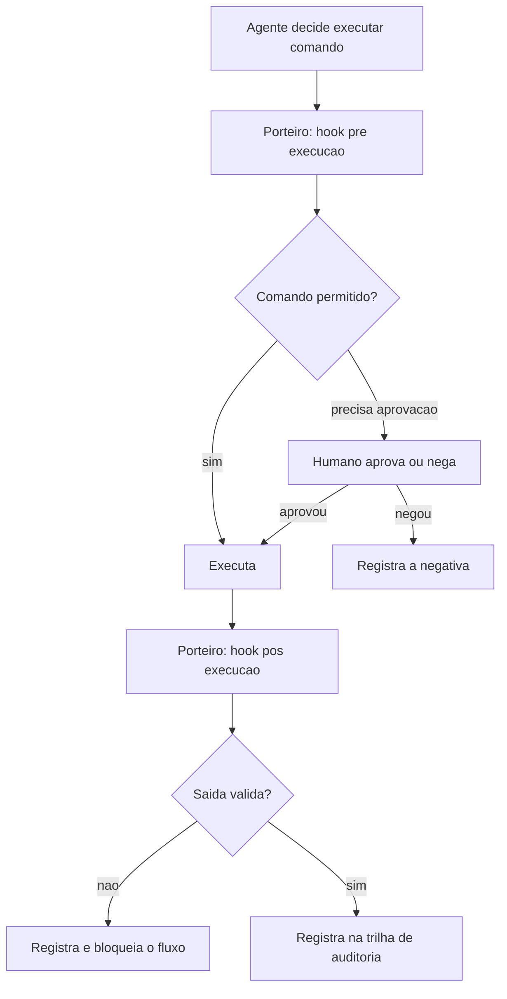
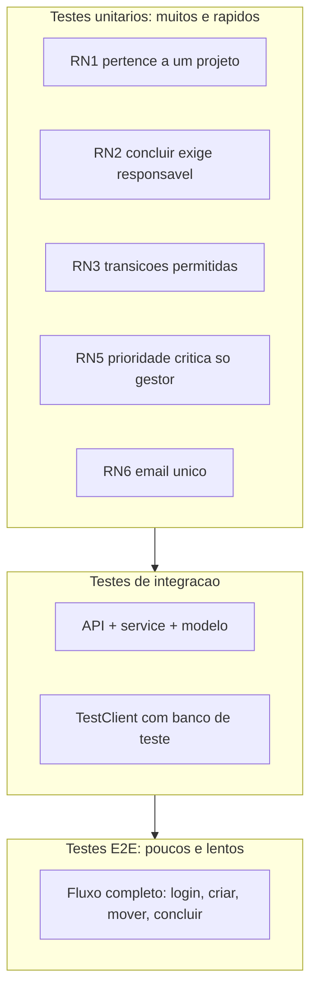
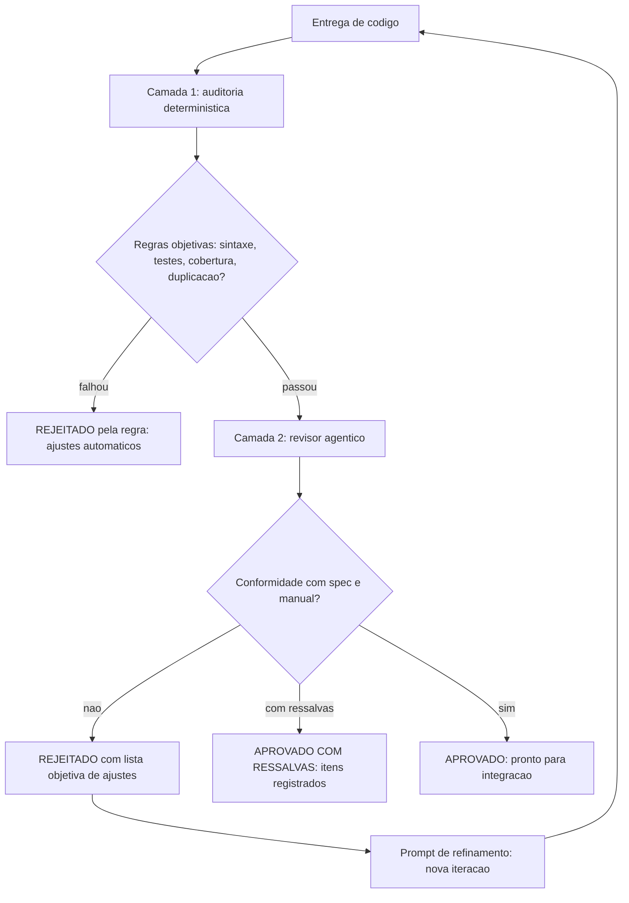
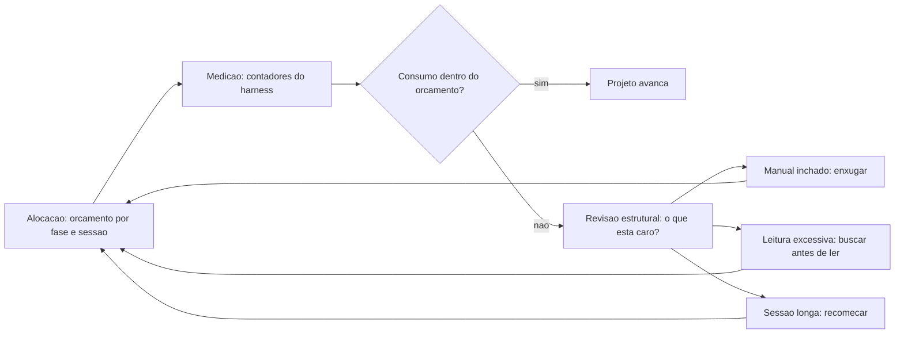

# Profissionalizando — Acabamento e Qualidade


# Capítulo 13: Hooks e governança: as regras de segurança do canteiro

# Capítulo 13: Hooks e governança: as regras de segurança do canteiro

## Introdução

No Capítulo 12 você montou a equipe de obra — subagentes especializados orquestrados pelo mestre. Equipes autônomas, porém, precisam de regras: o canteiro do Capítulo 6 ganhou a placa de regras, mas ainda falta o mecanismo que *faz* as regras serem cumpridas. Este é o território da **governança** — hooks, permissões e guardrails que transformam o contrato do manual em comportamento real do agente, a cada execução.

A autonomia do agente é uma escala, e a governança é o que define onde você se posiciona nela — do modo "aprova tudo" (máxima segurança, mínima velocidade) ao modo "executa dentro das regras" (velocidade alta, risco controlado). Este capítulo explica os mecanismos de governança dos harnesses modernos: hooks de eventos (pré-execução, pós-execução, pré-commit), permissões por comando e por arquivo, e o desenho de um sistema de aprovação que escala com a confiança. Ao final, a TorreDeControle terá uma postura de governança definida — e você saberá exatamente qual alavanca puxar quando o agente pedir mais autonomia.

## Explica

### O espectro da autonomia

Antes dos mecanismos, o modelo mental: a autonomia do agente não é binária — é um espectro com quatro estágios, e cada projeto (e cada fase de um projeto) tem o estágio certo:

1. **Supervisão total**: toda ação exige aprovação humana. Seguro, lento — ideal para as primeiras horas de um projeto novo ou para operações destrutivas.
2. **Aprovação seletiva**: ações seguras (ler, editar arquivos) são automáticas; ações arriscadas (executar comando, escrever fora do projeto) pedem aprovação. O equilíbrio padrão da maioria dos projetos.
3. **Autonomia com regras**: o agente executa dentro de um perímetro definido (arquivos, comandos, ferramentas permitidas) e só pede ajuda fora dele. Rápido — exige governança madura.
4. **Autonomia total com trilha**: o agente executa tudo, e tudo é registrado para auditoria posterior. A velocidade máxima — reservada para pipelines e ambientes com rastreamento completo.

A arte da governança é mover-se nesse espectro *conscientemente*: saber em que estágio você está, por quê, e o que precisa mudar para avançar com segurança. O erro clássico é saltar direto do estágio 1 ao 4 — "o agente agora é autônomo" — sem construir as proteções intermediárias.

### Hooks: os pontos de controle

O mecanismo central da governança é o **hook**: um ponto de controle onde o harness pausa a execução, executa uma lógica definida por você e decide se o fluxo continua. Os hooks mais importantes seguem o ciclo de vida da ação:

- **Pré-execução** (antes de um comando): valida se o comando é permitido, bloqueia destrutivos, injeta variáveis.
- **Pós-execução** (depois de um comando): verifica a saída, registra o resultado, falha se algo esperado não ocorreu.
- **Pré-commit / pré-push**: roda verificações (lint, testes rápidos) antes de o código entrar no diário de bordo.

O hook é a diferença entre regra *escrita* e regra *aplicada*. A placa do Capítulo 6 diz "nunca rode git push --force"; o hook é o guarda que impede fisicamente — não por confiança, mas por mecanismo.

### Permissões: o perímetro do agente

O segundo mecanismo é o sistema de **permissões**: a definição do que o agente pode tocar. As dimensões clássicas:

- **Por comando**: padrões de comando permitidos, negados ou que exigem aprovação (ex.: `git push` exige aprovação; `python -m pytest` é livre).
- **Por arquivo/pasta**: caminhos que o agente pode ler, escrever ou não tocar (ex.: `docs/` livre; `.env` proibido; `app/` livre com cuidado).
- **Por ferramenta**: quais tools MCP estão ativas, com quais escopos (o Capítulo 11 já estabeleceu o padrão de escopo mínimo).
- **Por duração**: aprovações que expiram (ex.: "permita os próximos 10 minutos"), evitando o acúmulo silencioso de permissões.

O desenho do perímetro é uma decisão de engenharia com trade-offs: perímetro apertado demais transforma o agente em um operário que pede ordem para cada parafuso; perímetro frouxo demais anula a governança. A regra prática: **permita o caminho feliz, exija aprovação no imprevisto** — as operações comuns (testar, compilar, editar) são livres; as incomuns ou irreversíveis (deploy, push, exclusão) exigem aprovação.

### A trilha de auditoria: o diário de bordo digital

O terceiro pilar é a **trilha de auditoria** — o registro completo das ações do agente: o que foi executado, quando, por quem (qual agente/sessão), com qual argumento e qual resultado. A trilha é o diário de bordo do canteiro em forma digital — e é ela que torna possível a governança *post hoc*: quando um incidente acontece, a trilha permite reconstruir exatamente o que ocorreu. Sem trilha, a pergunta "o que o agente fez?" é respondida com "eu acho que..."; com trilha, é respondida com o registro.

A trilha também tem função preventiva: sabendo que tudo é registrado, o agente — e o humano — operam com mais cuidado. É o mesmo efeito das câmeras de segurança no canteiro: não substituem a regra, mas mudam o comportamento.

### Governança de subagentes e ferramentas

A governança se estende às duas extensões que você construiu: os subagentes do Capítulo 12 e as ferramentas do Capítulo 11. A regra é a herança com limites: os subagentes herdam o perímetro do mestre, mas com limites próprios definidos na especificação — um subagente-revisor que só lê não pode ganhar permissão de escrita por acidente. E as ferramentas, como você viu, têm o portão do Capítulo 11 — validação dupla e autorização por operação — que agora se integra à governança do harness: a tool é executável, mas a *chamada* dela pode exigir aprovação, dependendo da operação.

## Ilustra

### O Porteiro do Canteiro

Volte ao canteiro. A placa de regras do Capítulo 6 diz o que é permitido — mas quem garante que a regra é cumprida é o **porteiro** da entrada. O porteiro tem uma lista: caminhões de concreto entram sem pedir (comandos livres), caminhões de combustível pedem assinatura (aprovação seletiva), e bombas de demolição nem chegam perto (comandos proibidos). O porteiro também registra tudo num caderno: hora de entrada, placa, destino — a trilha de auditoria.

O harness com governança é esse porteiro. Ele não confia no operário (o agente) nem na placa (o manual): ele aplica a regra por mecanismo, a cada entrada — e registra cada passagem. A diferença entre o canteiro com porteiro e sem porteiro é a diferença entre regra respeitada e regra desejada.



### O Porteiro que Deixa Todo Mundo Entrar: Por Que Autonomia Sem Governança é Caos

Aqui está o ponto contraintuitivo — a segunda camada de analogia. A primeira mostrou o porteiro. A segunda é sobre o erro mais caro da governança: dar autonomia sem o porteiro — e descobrir tarde demais.

Imagine um canteiro onde o mestre decide "vamos confiar nas equipes": tira o porteiro da entrada, diz que todos são profissionais e que a placa de regras "é autoexplicativa". Na primeira semana, tudo parece mais rápido — sem fila na entrada, sem caderno, sem aprovação. Na terceira semana, o desastre: um caminhão de combustível entrou "sem querer" na área de solda (o agente executou um comando que não devia), e o registro do que entrou e saiu — que não existe mais — torna a investigação um palpite. O canteiro não ficou mais rápido: ficou mais frágil, e a fragilidade cobrou a conta de uma vez.

Com agentes é idêntico: autonomia sem governança não é velocidade — é risco acumulado que vence de uma vez. Como Mestre de Obras, a lição é dupla: a governança não trava a obra (o porteiro bem configurado não atrasa o caminhão de concreto), e a autonomia sem mecanismo é a decisão mais cara do canteiro — porque o mecanismo não existe quando você mais precisa dele.

## Técnica

### Passo 1: O Mapa de Permissões da TorreDeControle

O primeiro passo é o mapa de permissões — o documento que registra o perímetro, e que serve de guia para configurar o harness. Este é o mapa inicial:

```markdown
# Mapa de Permissões — TorreDeControle

## Comandos livres (sem aprovação)
- python -m pytest tests/ -q
- python -m compileall app/
- python -m py_compile <arquivo>
- git status, git diff, git log, git add

## Comandos com aprovação
- git commit (quando a mensagem for automática, revisar antes)
- pip install <pacote> (registra em requirements.txt)
- python -m uvicorn app.api.main:app (inicia servidor)

## Comandos proibidos (nunca executar)
- git push --force
- rm -rf (fora do projeto)
- drop table / drop database
- qualquer comando com credencial inline

## Arquivos proibidos de leitura/escrita
- .env, .env.local (segredos)
- .git/ (internos)
- data/*.db (dados de produção, se existirem)

## Ferramentas MCP (escopos)
- banco_torrecontrole: somente banco de desenvolvimento.
- api_externa: somente escopos mínimos configurados.
```

O mapa é a fonte da verdade que você traduz para a configuração do harness — e que o revisor do Capítulo 15 audita.

### Passo 2: Configurando Hooks no Harness

O segundo passo é a configuração prática dos hooks. A sintaxe exata varia por harness, mas o padrão conceitual é este — hooks associados a eventos do ciclo de vida:

```json
{
  "hooks": {
    "PreToolUse": [
      {
        "matcher": "Bash(git push*)",
        "hook": "bloquear_push_forcado.sh",
        "stage": "pre_tool_use"
      },
      {
        "matcher": "Bash(python -m pytest*)",
        "hook": "registrar_pytest.sh",
        "stage": "post_tool_use"
      }
    ],
    "PreCommit": [
      {
        "matcher": "*",
        "hook": "verificacoes_pre_commit.sh"
      }
    ]
  }
}
```

O exemplo mostra três hooks: um que bloqueia push forçado antes de executar (comando proibido do mapa), um que registra a saída dos testes depois de executar (trilha), e um que roda verificações antes do commit (portão de qualidade). Cada hook é um script pequeno e determinístico — a mesma filosofia de verificação de toda a obra.

### Passo 3: O Hook de Bloqueio na Prática

O hook mais importante — o bloqueio de comandos destrutivos — na prática, como script executável:

```bash
#!/usr/bin/env bash
# bloquear_push_forcado.sh — Bloqueia git push --force (governanca RN-seg)
set -euo pipefail

COMANDO="$*"
PADROES_PROIBIDOS=("git push --force" "git push -f" "rm -rf /" "drop database")

for padrao in "${PADROES_PROIBIDOS[@]}"; do if [[ "$COMANDO" == *"$padrao"* ]]; then echo "BLOQUEADO: comando proibido detectado -> $padrao" >&2 echo "Registre no diario e peca aprovacao humana explicita." >&2 exit 1 fi done

echo "OK: comando permitido"
exit 0
```

O script é burro de propósito: ele não interpreta, não decide — apenas bloqueia padrões. Burrice determinística é a melhor segurança: nenhum julgamento falho, nenhuma exceção criativa.

### Passo 4: O Verificador de Governança

Para manter a governança saudável, o verificador — checa se o mapa de permissões e a configuração de hooks estão coerentes:

```python
# verificar_governanca.py — Verifica a sanidade da governanca do projeto
import json
import re
from pathlib import Path

ARQUIVO_MAPA = Path("docs/mapa_permissoes.md")
ARQUIVO_CONFIG = Path(".claude/settings.json")  # ou equivalente do harness

def mapa_existe() -> bool:
    """Confirma a existencia do mapa de permissoes."""
    return ARQUIVO_MAPA.exists()

def mapa_cobre_areas() -> list[str]: """Retorna as areas do mapa que faltam no documento.""" if not ARQUIVO_MAPA.exists(): return ["mapa inteiro ausente"] texto = ARQUIVO_MAPA.read_text(encoding="utf-8") areas = ["Comandos livres", "Comandos com aprovação", "Comandos proibidos", "Arquivos proibidos", "Ferramentas MCP"] return [a for a in areas if a not in texto]

def config_tem_hooks() -> tuple[bool, list[str]]: """Verifica se a config do harness declara hooks.""" if not ARQUIVO_CONFIG.exists(): return False, ["arquivo de config do harness ausente"] try: dados = json.loads(ARQUIVO_CONFIG.read_text(encoding="utf-8")) hooks = dados.get("hooks", {}) if not hooks: return False, ["nenhum hook declarado na configuracao"] return True, [] except json.JSONDecodeError: return False, ["config do harness com JSON invalido"]

def main() -> None: """Checklist de sanidade da governanca.""" problemas: list[str] = [] if not mapa_existe(): problemas.append("docs/mapa_permissoes.md ausente") problemas += [f"mapa sem area: {a}" for a in mapa_cobre_areas()] tem_hooks, problemas_hooks = config_tem_hooks() problemas += problemas_hooks if not tem_hooks: problemas.append("governanca sem hooks (apenas mapa nao aplica regra)") if problemas: print("GOVERNANCA COM PROBLEMAS:") for p in problemas: print(f"  - {p}") return print("GOVERNANCA OK: mapa completo, hooks declarados e config valida")

if __name__ == "__main__":
    main()
```

Rode `verificar_governanca.py` — e o relatório diz se a governança está só *escrita* (mapa) ou *aplicada* (hooks). O verificador é o porteiro do porteiro.

### O Protocolo de Promoção de Autonomia

Para fechar, o protocolo de promoção — como mover o projeto no espectro de autonomia com segurança. A regra: autonomia é conquistada em etapas, nunca saltada:

1. **Comece no estágio 2** (aprovação seletiva): o caminho feliz livre, o imprevisto aprovado.
2. **Observe uma semana**: quais aprovações aparecem? Cada uma é um sinal — ou de perímetro apertado demais ou de operação que merece regra.
3. **Automatize o que é rotineiro**: uma aprovação que aparece toda hora vira regra (comando livre ou com aprovação automática).
4. **Promova para o estágio 3** (autonomia com regras) apenas quando: a trilha mostra zero incidentes, os hooks cobrem os destrutivos e os testes do Capítulo 14 passam.
5. **Revise trimestralmente**: o perímetro envelhece com o projeto; a revisão periódica impede o acúmulo de permissões fantasma.

## Aplica

### A Cena de Contraste: O Push Forçado da Sexta-feira

Imagine a sexta-feira em que o projeto está atrasado e você decide "dar autonomia total ao agente para agilizar". Sem mapa de permissões, sem hooks — só o manual do Capítulo 6 pedindo cuidado. O agente, tentando "arrumar" um conflito de merge, decide executar `git push --force` — a placa dizia para não, mas ninguém aplicou a regra por mecanismo. A branch principal é sobrescrita, duas horas de commits de outra pessoa evaporam, e o resto do time só descobre na segunda-feira. A trilha não existe; a reconstrução é arqueológica.

O diagnóstico: autonomia concedida sem governança — o estágio 4 pulado de um salto. A placa estava certa, mas placas não bloqueiam: mecanismos bloqueiam. O erro não foi do agente — foi do projeto que não o conteve.

A correção: você instala a governança completa — mapa de permissões, hook de bloqueio de push forçado, aprovação seletiva e trilha de auditoria — e roda `verificar_governanca.py`. Na semana seguinte, o mesmo agente tenta o mesmo push forçado; o hook bloqueia na pré-execução, registra a tentativa e pede aprovação humana. O incidente vira registro — e a autonomia volta a subir apenas pelo protocolo de promoção, etapa por etapa, com a trilha provando o histórico limpo.

### Armadilhas Comuns na Governança

- **Autonomia antes das proteções**: o erro mais caro. Primeiro hooks, permissões e trilha; depois autonomia.
- **Mapa sem hooks**: documento que não vira mecanismo é desejo. Regra só vale aplicada.
- **Permissões acumuladas**: aprovações antigas viram brecha. Expiração e revisão periódica.
- **Hook que interpreta demais**: guarda com julgamento falha. Bloqueio por padrão é burro de propósito — e seguro.
- **Trilha ausente**: sem registro, incidente vira mistério. Trilha de auditoria obrigatória.
- **Esquecer subagentes e tools na governança**: perímetro do mestre sem limites para a equipe. Subagente herda com limites; tool tem portão.

### Exercício Prático

Crie o `docs/mapa_permissoes.md` da TorreDeControle, configure os hooks de bloqueio (push forçado) e registro (pytest) no harness, rode `verificar_governanca.py` até OK e teste: peça ao agente um comando proibido e confirme o bloqueio pelo hook.

### Aprofundamento: O Protocolo de Incidente com Agente

A governança do Capítulo 13 não é só preventiva — ela define o que acontece *quando* um incidente ocorre apesar dos portões. O protocolo de incidente é a rotina que transforma o caos em processo, e ele tem uma versão com o agente no papel de investigador:

1. **Contenção (primeiros 5 minutos)**: o que precisa parar para limitar o dano? A trilha de auditoria do Capítulo 13 mostra as últimas ações do agente — a contenção começa pelo que a trilha revela. Não é hora de investigar em profundidade; é hora de limitar.
2. **Diagnóstico com agente (primeiras 2 horas)**: o agente investiga com o protocolo do Capítulo 19 — logs estruturados, métricas e o prompt de diagnóstico. As hipóteses saem com evidência e teste de confirmação, não com palpite.
3. **Correção pela rampa (nunca direto em produção)**: a correção passa pelo fluxo completo — fatia, testes, revisão, pipeline (Capítulos 7-17). A exceção só existe para contenção de dano ativo, e mesmo assim com registro.
4. **Verificação pela métrica**: o instrumento que apontou o problema mede a correção (Capítulo 19). Sem a métrica confirmando, o incidente não está encerrado.
5. **Aprendizado registrado**: o incidente vira entrada na memória do Capítulo 16 — o que aconteceu, por que, como prevenir. O prédio aprende com a manutenção.

O papel da governança no protocolo: a trilha de auditoria é o que torna o diagnóstico possível (sem registro, o passo 2 é arqueologia); o perímetro de permissões é o que limita o dano (o agente não alcança o que a governança não permite); e o hook de pré-execução é o que impede a correção de pular a rampa. A governança não é o que impede incidentes (isso é impossível): é o que transforma incidente em evento gerenciado, com custo mínimo e aprendizado máximo.

```bash
# Checklist do incidente em um comando:
# 1. Trilha revisada? 2. Hipoteses com evidencia? 3. Correcao pela rampa?
# 4. Metrica confirmou? 5. Aprendizado registrado?
```

## Conclusão

Neste capítulo você instalou o porteiro do canteiro: entendeu o espectro da autonomia — da supervisão total à autonomia com trilha; aprendeu os três mecanismos de governança — hooks (pontos de controle), permissões (o perímetro) e trilha de auditoria (o diário digital); configurou o mapa de permissões, os hooks de bloqueio e o verificador; e dominou o protocolo de promoção — autonomia conquistada em etapas, nunca saltada. A lição central: regra escrita não é regra aplicada — a governança é o mecanismo que transforma o contrato do manual em comportamento do agente.

Seu desafio: a governança da TorreDeControle completa — mapa, hooks, verificador OK e o teste de bloqueio de comando proibido passando.

No Capítulo 14, vamos provar que o prédio aguenta: testes dirigidos por IA — estratégia, geração e o CI de sintaxe que garante que todo código que entra no canteiro compila e passa.

# Capítulo 14: Testes dirigidos por IA: provando que o prédio aguenta

# Capítulo 14: Testes dirigidos por IA: provando que o prédio aguenta

## Introdução

No Capítulo 13 você instalou a governança — o porteiro que aplica as regras do canteiro. Mas há uma categoria de regras que o porteiro não cobre: as regras de *comportamento* do software — "mover tarefa respeita RN3?", "criar tarefa exige responsável?", "a transição inválida retorna 422?". Essas regras são provadas por **testes automatizados**, e é aqui que o agente deixa de ser apenas construtor e vira também o provador da obra.

Este capítulo é o curso de testes dirigidos por IA: a estratégia de testes de um projeto agêntico, a geração de testes pelo agente a partir da especificação do Capítulo 7, e o CI de sintaxe — o portão automático que garante que todo código que entra no canteiro compila e passa nos testes antes de virar commit. Ao final, a TorreDeControle terá uma suíte de testes cobrindo as regras de negócio RN1-RN7, gerada e revisada com o agente, e um pipeline local que barra código quebrado na origem.

## Explica

### Por que testes são o coração do AIDD

A tese deste capítulo é direta: **testes são a ponte entre velocidade e confiança** — e sem eles, o AIDD é só vibe coding com outro nome. O agente gera código rápido; o teste é o que transforma "gerado" em "verificado". Você já viu essa tensão no Capítulo 1: código plausível que não funciona. O teste é o detector de plausibilidade — a vistoria que mede, em vez de acreditar.

Há uma segunda razão, específica do mundo agêntico: testes são a forma mais barata de *feedback* para o agente. Quando o agente implementa uma fatia, o teste diz "passou" ou "falhou" — e é esse sinal objetivo que alimenta o ciclo de iteração do Capítulo 4. Um agente sem testes itera às cegas; com testes, ele corrige o próprio trabalho contra um alvo mensurável. O teste é o instrumento de medida do canteiro — sem ele, ninguém sabe se a parede está no prumo.

### A pirâmide de testes do projeto agêntico

A estratégia de testes de um projeto AIDD segue a pirâmide clássica, adaptada ao fluxo:

- **Base — testes unitários**: testam funções e regras isoladas — cada RN da especificação vira um teste unitário. Rápidos, numerosos, são o feedback de primeira linha do agente.
- **Meio — testes de integração**: testam a interação entre camadas — a API chamando o service, o service usando o modelo. É o teste de "colunas + laje" do Capítulo 8.
- **Topo — testes de ponta a ponta**: testam o fluxo completo — login, criar tarefa, mover, concluir — via interface. Raros e lentos, provam a jornada do usuário.

A proporção importa: a maioria dos testes é unitária (rápida e barata), uma fatia de integração, e poucos E2E. O agente gera bem os três — mas o valor está nos unitários, porque são eles que validam as regras de negócio que você especificou no Capítulo 7.

### Testes como especificação executável

O insight mais poderoso do capítulo: **os critérios de aceite da especificação são, na verdade, testes esperando para nascer**. Cada critério do Capítulo 7 ("transições inválidas retornam erro 422") é um teste unitário em potencial — e essa tradução é a atividade mais valiosa que você fará com o agente. A especificação deixa de ser documento e vira comportamento verificável: o RF3 com seus cinco critérios de aceite gera cinco testes; os testes passando provam que o RF3 está cumprido.

Essa tradução também fecha o ciclo de rastreabilidade: a spec diz o que o sistema deve fazer, o teste prova que faz, e o código que passa no teste está conforme a spec. É o mesmo princípio de contrato que você viu no Capítulo 7 — agora com execução automática.

### O CI de sintaxe: o portão automático

O **CI de sintaxe** é o portão de qualidade no fluxo do Capítulo 13: um script que roda em todo commit (via hook de pré-commit ou no pipeline do Capítulo 17) e que barra a entrada de código que (1) não compila, (2) não passa nos testes, ou (3) viola regras simples de lint. O objetivo não é julgar estilo — é impedir que código quebrado entre no diário de bordo.

O CI de sintaxe é a materialização da filosofia de toda a obra: verificação determinística substitui suposição. Em vez de "eu acho que compila", o portão *prova* que compila — a cada commit, sem exceção, sem depender da memória de ninguém.

## Ilustra

### A Prova de Carga do Canteiro

Volte ao canteiro. Antes de liberar um andar para uso, a obra passa por **provas de carga**: os engenheiros carregam o laje com sacos de areia até o limite calculado e medem a deformação. A prova não é opcional — é o que separa o prédio aprovado do prédio que "parecia pronto". Nenhum mestre entrega um andar sem a prova; nenhum engenheiro aceita "confia em mim" como relatório de carga.

Os testes são as provas de carga do software. O teste unitário é a prova de cada viga (a função aguenta o caso de borda?); o teste de integração é a prova do andar completo (as colunas e o laje trabalham juntos?); o teste E2E é a prova final de ocupação (o usuário consegue morar no prédio?). E o CI de sintaxe é o engenheiro que refaz as provas a cada mudança — sem esperar o dia da vistoria.



### O Prédio Aprovado na Aparência: Por Que Testes São a Vistoria

Aqui está o ponto contraintuitivo — a segunda camada de analogia. A primeira mostrou a prova de carga. A segunda é sobre a diferença entre a obra *inspecionada* e a obra *que parece inspecionada* — e por que a confiança na velocidade do agente é a armadilha.

Imagine dois prédios idênticos erguidos pelo mesmo tipo de operário rápido. No primeiro, cada laje passa por prova de carga antes do próximo andar; no segundo, o mestre confia nos operários ("eles são bons, olha a velocidade!") e o laje sobe sem prova. Os dois prédios ficam prontos no mesmo dia. Na primeira tempestade, o segundo prédio tem rachaduras — a argamassa de uma junta não aguentou, e ninguém sabia, porque ninguém mediu. O primeiro prédio passa incólume — porque a prova, feita na hora certa, pegou a junta fraca antes da tempestade.

Com código é idêntico: o agente rápido produz o mesmo "prédio" com e sem testes — a diferença aparece na primeira mudança, na primeira integração, no primeiro deploy. Como Mestre de Obras, a lição é a mais cara do canteiro: a velocidade do construtor sem a vistoria do medidor não é progresso — é risco que a tempestade cobra. Testes são a prova de carga; CI é o engenheiro que nunca falta.

## Técnica

### Passo 1: O Prompt de Geração de Testes

O primeiro passo é gerar testes com o agente — e o prompt segue o padrão de cinco partes do Capítulo 4, com a especificação como fonte. Este é o prompt para a suíte da RN3:

```markdown
## Papel e contexto
Você é o desenvolvedor de testes do projeto TorreDeControle (FastAPI),
com a especificação em docs/especificacao.md e as regras em AGENTS.md.

## Tarefa específica
Gere a suíte de testes unitários para a regra de negócio RN3 (transições de
status da tarefa), cobrindo todos os casos: transições válidas, inválidas
e estado terminal.

## Restrições e regras
- Use pytest e a estrutura de app/services.
- Não modifique código de produção; apenas crie o arquivo de teste.
- Nomeie os testes no padrão test_<regra>_<caso>.
- Cubra exatamente as transições da RN3 da especificação.

## Formato de saída
Arquivo tests/test_rn3_transicoes.py completo, com docstring e asserts.

## Critérios de aceite
1. python -m pytest tests/test_rn3_transicoes.py -q passa.
2. Todo caso de transição da RN3 tem um teste.
3. Cada teste verifica sucesso ou erro de forma explícita.
```

Execute e o agente entrega a suíte — mas a revisão é sua (protocolo do Capítulo 8): os casos cobrem a RN3 completa? Os testes testam a regra, não o caminho feliz?

### Passo 2: A Suíte de Regras de Negócio

Este é o resultado esperado — a suíte unitária das regras RN1-RN7, gerada pelo agente e revisada por você. Exemplo dos testes mais críticos:

```python
# tests/test_rn3_transicoes.py — Testes da regra de transicao de status
import pytest

from app.services.mover_tarefa import mover_tarefa, Tarefa, Status

def test_rn3_a_fazer_para_em_andamento() -> None:
    """RN3: a_fazer -> em_andamento e transicao valida."""
    tarefa = Tarefa(id="t1", status=Status.A_FAZER, responsavel_id="u1")
    resultado = mover_tarefa("t1", Status.EM_ANDAMENTO, "u1", {"t1": tarefa})
    assert resultado["status"] == Status.EM_ANDAMENTO

def test_rn3_a_fazer_para_concluida_bloqueada() -> None:
    """RN3: a_fazer -> concluida e transicao invalida."""
    tarefa = Tarefa(id="t1", status=Status.A_FAZER, responsavel_id="u1")
    with pytest.raises(ValueError):
        mover_tarefa("t1", Status.CONCLUIDA, "u1", {"t1": tarefa})

def test_rn3_em_andamento_para_a_fazer_permitida() -> None:
    """RN3: em_andamento -> a_fazer e permitida (volta na fila)."""
    tarefa = Tarefa(id="t1", status=Status.EM_ANDAMENTO, responsavel_id="u1")
    resultado = mover_tarefa("t1", Status.A_FAZER, "u1", {"t1": tarefa})
    assert resultado["status"] == Status.A_FAZER

def test_rn3_concluida_e_terminal() -> None:
    """RN3: concluida e estado terminal; nenhuma transicao sai dela."""
    tarefa = Tarefa(id="t1", status=Status.CONCLUIDA, responsavel_id="u1")
    with pytest.raises(ValueError):
        mover_tarefa("t1", Status.EM_ANDAMENTO, "u1", {"t1": tarefa})

def test_rn2_concluir_sem_responsavel_bloqueada() -> None:
    """RN2: concluir tarefa sem responsavel e bloqueado."""
    tarefa = Tarefa(id="t1", status=Status.EM_ANDAMENTO, responsavel_id=None)
    with pytest.raises(ValueError):
        mover_tarefa("t1", Status.CONCLUIDA, "u1", {"t1": tarefa})
```

Cada teste é um critério de aceite da especificação traduzido em código — a spec executável do Capítulo 7 ganhando vida.

### Passo 3: O CI de Sintaxe Local

O terceiro passo é o portão de qualidade — o script que roda em todo commit (chamado pelo hook de pré-commit do Capítulo 13) e barra código quebrado:

```bash
#!/usr/bin/env bash
# ci_sintaxe.sh — Portao de qualidade: compila, testa e verifica estrutura
set -euo pipefail

echo "== 1/3: compilacao =="
python -m compileall -q app/ || { echo "FALHOU: erro de sintaxe em app/"; exit 1; }

echo "== 2/3: testes =="
python -m pytest tests/ -q || { echo "FALHOU: testes nao passam"; exit 1; }

echo "== 3/3: estrutura =="
python scripts/verificar_esqueleto.py > /dev/null || { echo "FALHOU: estrutura invalida"; exit 1; }

echo "== PORTAO OK: codigo pronto para commit =="
```

O script é determinístico e burro de propósito: ou o portão abre (exit 0) ou fecha (exit 1) — sem espaço para "quase".

### Passo 4: O Verificador de Cobertura de Regras

Para garantir que a suíte cobre as regras — e não apenas "existe" — o verificador de cobertura de regras:

```python
# verificar_cobertura_testes.py — Verifica se as RNs tem testes correspondentes
import re
from pathlib import Path

ARQUIVO_SPEC = Path("docs/especificacao.md")
DIRETORIO_TESTES = Path("tests")

def extrair_regras() -> list[str]:
    """Extrai os identificadores de regra de negocio da especificacao."""
    if not ARQUIVO_SPEC.exists():
        return []
    texto = ARQUIVO_SPEC.read_text(encoding="utf-8")
    return sorted(set(re.findall(r"RN\d+", texto)))

def regras_sem_teste(regras: list[str]) -> list[str]:
    """Retorna as regras sem nenhum teste referenciando-as."""
    arquivos = list(DIRETORIO_TESTES.glob("test_*.py"))
    corpo = "\n".join(f.read_text(encoding="utf-8") for f in arquivos)
    return [r for r in regras if r not in corpo and r.lower() not in corpo.lower()]

def main() -> None: """Checklist de cobertura: toda RN tem teste?""" regras = extrair_regras() if not regras: print("Nenhuma regra RN encontrada na especificacao") return sem_teste = regras_sem_teste(regras) print(f"Regras na especificacao: {len(regras)}") print(f"Regras sem teste: {sem_teste or 'nenhuma'}") if sem_teste: print("COBERTURA INCOMPLETA: gere testes para as regras sinalizadas") return print("COBERTURA OK: toda regra de negocio tem teste")

if __name__ == "__main__":
    main()
```

Rode `verificar_cobertura_testes.py` — e a cobertura é prova, não impressão.

### O Protocolo TDD com Agente

Para fechar, o protocolo de desenvolvimento dirigido por testes com agente — o ciclo completo que o time usa a partir de agora:

1. **Escrever o teste primeiro**: traduzir o critério de aceite do Capítulo 7 em teste (vermelho — o teste falha porque a feature não existe).
2. **Pedir ao agente para implementar**: o prompt de cinco partes com o teste como critério de aceite ("o código deve passar neste teste").
3. **Rodar até verde**: o agente itera até o teste passar — o feedback objetivo do Capítulo 4 guiando a correção.
4. **Revisar e refatorar**: a revisão dirigida do Capítulo 8 + limpeza.
5. **Commitar com o portão**: o CI de sintaxe abre e o commit entra no diário.

O ciclo vermelho-verde com agente é a versão agêntica do TDD clássico — e é o que mantém a qualidade da obra enquanto a velocidade sobe.

## Aplica

### A Cena de Contraste: O Deploy Sem Prova de Carga

Imagine o projeto com a primeira versão pronta e o deploy agendado — mas os testes foram "deixados para depois" porque o agente entregava rápido demais. O agente implementou a feature de mover tarefa; você testou "na mão" no navegador uma vez, funcionou, e seguiu. No deploy, o fluxo de produção falha na primeira transição: a RN3 não valida o caso de borda (mover direto de a_fazer para concluida), um usuário real clica, e a tarefa some do quadro. O incidente vira bug de produção — e o fix em produção é dez vezes mais caro que o teste que o teria pegado.

O diagnóstico: o "teste na mão" não é teste — é vibe testing. Sem a suíte da RN3 e sem o CI de sintaxe, a plausibilidade passou no lugar da verificação. O erro não foi do agente (implementou o que a falta de teste permitiu): foi do projeto que não exigiu a prova.

A correção: você adota o protocolo TDD com agente — teste primeiro, implementação dirigida pelo teste, portão no commit. O mesmo bug, na semana seguinte, é pego pelo teste `test_rn3_a_fazer_para_concluida_bloqueada` antes de chegar ao deploy. A lição: o teste que falta é o bug que sobra — e o CI é o guardião que impede o "vai dar certo" de entrar no diário de bordo.

### Armadilhas Comuns em Testes com IA

- **Testes que testam o caminho feliz**: a suíte passa, mas não cobre as regras. Cobertura de RNs é verificada pelo script.
- **Testes gerados sem revisão**: o agente pode gerar testes frouxos (asserts que sempre passam). Revisão dirigida obrigatória.
- **Vibe testing**: "testei na mão, funcionou" não é verificação. Teste automatizado ou não é teste.
- **CI de sintaxe ausente**: sem o portão, código quebrado entra no diário. Hook de pré-commit + pipeline.
- **Testes lentos demais**: suíte lenta desencoraja o uso. Pirâmide correta: muitos unitários rápidos, poucos E2E.
- **Esquecer que teste é spec**: teste desalinhado da especificação engana. Todo critério de aceite vira teste; todo teste rastreia um critério.

### Exercício Prático

Gere com o agente (prompt de cinco partes) a suíte de testes de RN1-RN7, revise cada teste contra os critérios do Capítulo 7, rode `verificar_cobertura_testes.py` até cobertura OK, configure o hook de pré-commit chamando `ci_sintaxe.sh` e confirme: um teste falhando bloqueia o commit.

### Aprofundamento: O Painel de Testes do Projeto

Uma suíte de testes sem painel é invisível — e o invisível não se mantém. O painel de testes é o registro vivo do que está coberto, o que está verde e o que regrediu. Este é o formato mínimo do painel da TorreDeControle:

```markdown
# Painel de Testes — TorreDeControle (atualizado a cada fatia)

## Regras de negócio (RN)
| RN | Teste | Status |
|---|---|---|
| RN1 | test_rn1_tarefa_sem_projeto_falha | verde |
| RN2 | test_rn2_concluir_sem_responsavel_bloqueada | verde |
| RN3 | test_rn3_transicoes (5 casos) | verde |
| RN4 | test_rn4_alteracao_gera_atividade | verde |
| RN5 | test_rn5_critica_so_gestor | verde |
| RN6 | test_rn6_email_unico | verde |
| RN7 | test_rn7_concluida_sem_movimentacao | verde |

## Camadas
- Unitários (models/services): 28 testes, todos verdes.
- Integração (API): 12 testes, todos verdes.
- E2E (fluxo completo): 3 testes, todos verdes.

## Regressões conhecidas
- Nenhuma.

## Próximos testes a criar
- Cobertura de erro do endpoint de autenticação (RF1).
```

O painel tem três usos: (1) *para o agente* — ele consulta o painel antes de mudar código e sabe o que não pode quebrar; (2) *para o revisor* — o Capítulo 15 usa o painel como entrada da auditoria de cobertura; (3) *para você* — a leitura do painel é a primeira coisa da semana, como o relatório DORA do Capítulo 19. O painel não substitui os testes: é a visibilidade que os mantém vivos.

```bash
# Regenera o painel em um comando: roda a suite e conta por arquivo
python -m pytest tests/ -q 2>&1 | tail -3
```

## Conclusão

Neste capítulo você provou que o prédio aguenta: entendeu por que testes são o coração do AIDD — a ponte entre velocidade e confiança; dominou a pirâmide de testes (unitários, integração, E2E) e a tradução de critérios de aceite em testes; construiu a suíte de RN1-RN7 com o agente; e instalou o CI de sintaxe — o portão determinístico que barra código quebrado na origem. A lição central: o teste que falta é o bug que sobra — e a prova de carga é inegociável antes da entrega das chaves.

Seu desafio: a suíte de RN1-RN7 completa e verde, `verificar_cobertura_testes.py` aprovando e o commit bloqueado por um teste falhando — provando o portão de verdade.

No Capítulo 15, vamos subir o nível da inspeção: a revisão de código autônoma — agentes revisores e auditorias determinísticas que examinam a obra inteira antes da integração.

# Capítulo 15: Revisão de código autônoma: a inspeção de obra

# Capítulo 15: Revisão de código autônoma: a inspeção de obra

## Introdução

No Capítulo 14 você instalou o portão de qualidade — o CI de sintaxe que barra código quebrado na origem. Mas código que compila e passa nos testes ainda pode estar errado de formas que nem o compilador nem a suíte detectam: violações sutis de regra de negócio, inconsistência com a especificação, duplicação de lógica, decisões de design questionáveis. Essa é a fronteira da **revisão de código** — e, como tudo no canteiro, ela também ganha versão autônoma.

Este capítulo trata da inspeção de obra em escala: os agentes revisores (o subagente-revisor do Capítulo 12 em produção), as auditorias determinísticas que examinam o código com regras objetivas — sintaxe, rastreabilidade, sobreposição, consistência terminológica — e o ciclo de revisão que transforma "entregue" em "aprovado". Ao final, a TorreDeControle terá um fluxo de revisão autônoma de duas camadas: o revisor agêntico (julgamento) e a auditoria determinística (regras) — com o veredito registrado antes de qualquer integração.

## Explica

### Por que a revisão não pode desaparecer

Um dos mitos mais perigosos do AIDD é que a revisão humana "vai sumir". A realidade documentada é o oposto: a revisão é o gargalo *novo* do fluxo agêntico — o volume de código gerado cresce, e quem precisa ler cresce junto. O relatório DORA mostra que as equipes de alta performance não revisam menos — revisam melhor: a IA revisa a IA, o humano revisa as decisões. A revisão não desaparece: ela é delegada em camadas, e é exatamente essa delegação que este capítulo constrói.

A tese é: **revisão autônoma não é revisão sem humano — é revisão com o humano no lugar certo**. O agente revisor e a auditoria determinística filtram o que é filtravél por regra (90% dos problemas); o humano concentra o julgamento no que exige contexto de negócio (os 10% restantes). O resultado é um fluxo em que o humano revisa menos volume — mas revisa melhor.

### As duas camadas da revisão autônoma

A revisão autônoma tem duas camadas com naturezas diferentes — e confundir as duas é o erro mais comum:

**Camada 1 — Auditoria determinística**: regras objetivas, executadas por script, sem julgamento: o código compila? os testes passam? todo critério de aceite tem teste? há duplicação entre módulos? a terminologia é consistente? as referências são rastreáveis? É a camada que o Capítulo 14 começou (CI de sintaxe) e que este capítulo amplia: cobertura de regras, sobreposição, consistência. A auditoria não opina: mede.

**Camada 2 — Revisão agêntica**: julgamento de engenharia, executado por um subagente-revisor com a especificação em mãos: a implementação satisfaz a intenção do requisito? as decisões de design são coerentes com a arquitetura do AGENTS.md? há caminhos que o teste não cobre e que o código permite? É a camada que *interpreta*.

A ordem importa: a auditoria determinística roda primeiro (barata, rápida, objetiva) e só o que passa vai para o revisor agêntico (mais caro, mais lento, interpretativo). Filtrar por regra antes de julgar.

### O que a auditoria determinística examina

A auditoria de uma obra agêntica examina dimensões que um humano cansado deixaria passar — e que scripts nunca esquecem:

- **Sintaxe e testes**: o código compila e a suíte passa (Capítulo 14, inegociável).
- **Rastreabilidade**: todo requisito tem teste; todo teste rastreia um requisito (a ponte spec ↔ teste do Capítulo 14).
- **Sobreposição**: módulos duplicam lógica? O detector de similaridade compara trechos e sinaliza a duplicação — o débito técnico silencioso.
- **Consistência terminológica**: o mesmo conceito tem o mesmo nome em todo o código? O detector de termos flagra o "dono/responsável/gestor" usado como sinônimos — a fonte de bugs de comunicação.
- **Estrutura**: as camadas do AGENTS.md estão respeitadas? (models/services/api sem vazamento).

Cada dimensão é uma regra em script — e a soma delas é o "engenheiro que nunca cansa" do canteiro.

### O veredito do revisor agêntico

A revisão agêntica entrega um veredito estruturado — o formato que você definiu no Capítulo 12 — com três saídas possíveis:

- **APROVADO**: a entrega está conforme especificação, manual e verificabilidade.
- **APROVADO COM RESSALVAS**: aprovado com itens não bloqueantes registrados (refatoração futura, melhoria opcional).
- **REJEITADO**: com lista objetiva de ajustes — que viram o prompt de refinamento do Capítulo 4 na próxima iteração.

A regra do veredito: sempre objetivo, sempre rastreável a um item da especificação ou do manual — nunca "não gostei". O revisor agêntico não opina: reporta conformidade.

## Ilustra

### A Comissão de Vistoria do Canteiro

Volte ao canteiro. Antes da entrega de um andar, a obra passa por uma **comissão de vistoria** com dois grupos. O primeiro grupo é o dos medidores: engenheiros com instrumentos que medem objetivamente — o prumo da parede, a resistência do concreto, o nível do laje. Nenhum deles opina: medem contra a norma. O segundo grupo é o dos interpretadores: o arquiteto e o dono da obra, que comparam o resultado com a intenção do projeto — o prédio entrega o que foi desenhado? A comissão só libera o andar quando os dois grupos aprovam.

A revisão autônoma é essa comissão. A auditoria determinística é o grupo dos medidores — scripts que medem sintaxe, cobertura, duplicação, consistência. O revisor agêntico é o grupo dos interpretadores — o subagente que compara a entrega com a intenção da especificação. Os dois grupos têm vereditos distintos e complementares: medir primeiro, interpretar depois, liberar no fim.



### A Vistoria que Só Opina: Por Que as Duas Camadas se Completam

Aqui está o ponto contraintuitivo — a segunda camada de analogia. A primeira mostrou a comissão de dois grupos. A segunda é sobre por que nenhum dos dois grupos sozinho basta — e por que a ordem entre eles é sagrada.

Imagine uma vistoria com apenas medidores. Eles medem tudo — o prumo perfeito, o concreto resistente — e aprovam o andar. O arquiteto chega no dia seguinte e descobre: o prédio está tecnicamente perfeito, mas a parede que deveria separar a cozinha da sala foi construída no lugar errado — a planta foi mal interpretada. Os medidores mediram certo o que estava errado. Agora imagine a vistoria com apenas interpretadores: o arquiteto e o dono aprovam a intenção — e o laje desaba na primeira semana porque o concreto não tinha a resistência calculada. Os interpretadores julgaram bem o que ninguém mediu.

Com código é idêntico: a auditoria determinística sem o revisor agêntico aprova código tecnicamente perfeito que implementa a coisa errada; o revisor agêntico sem a auditoria aprova código com a intenção certa e sintaxe quebrada. Como Mestre de Obras, a comissão completa — medir primeiro, interpretar depois — é o único caminho: a regra pega o que o julgamento deixa passar, e o julgamento pega o que a regra não vê.

## Técnica

### Passo 1: O Auditor Determinístico do Projeto

O primeiro passo é o script de auditoria — a camada 1, com as dimensões objetivas. Este é o auditor da TorreDeControle:

```python
# auditar_repositorio.py — Auditoria deterministica da TorreDeControle
import subprocess
from pathlib import Path

def verificar_sintaxe() -> bool: """Camada 1a: sintaxe de app/ compila.""" try: subprocess.run(["python", "-m", "compileall", "-q", "app"], capture_output=True, check=True) return True except subprocess.CalledProcessError: return False

def verificar_testes() -> bool: """Camada 1b: suite de testes passa.""" try: subprocess.run(["python", "-m", "pytest", "tests/", "-q"], capture_output=True, check=True) return True except subprocess.CalledProcessError: return False

def detectar_duplicacao() -> list[str]:
    """Camada 1c: blocos repetidos acima de 6 linhas entre arquivos .py.

Heuristica simples: normaliza (espacos em branco) e compara linhas consecutivas entre pares de arquivos. Sinaliza a duplicacao para revisao. """ arquivos = sorted(Path("app").rglob("*.py")) duplicados: list[str] = [] blocos_por_arquivo: dict[str, set[str]] = {} for arquivo in arquivos: try: linhas = arquivo.read_text(encoding="utf-8").splitlines() except OSError: continue blocos = set() for i in range(len(linhas) - 5): bloco = tuple(l.strip() for l in linhas[i:i + 6]) if any(not b for b in bloco): continue blocos.add("\n".join(bloco)) blocos_por_arquivo[arquivo.name] = blocos nomes = list(blocos_por_arquivo) for i in range(len(nomes)): for j in range(i + 1, len(nomes)): comuns = blocos_por_arquivo[nomes[i]] & blocos_por_arquivo[nomes[j]] if comuns: duplicados.append(f"{nomes[i]} x {nomes[j]}: {len(comuns)} bloco(s) repetido(s)") return duplicados

def verificar_consistencia_terminologica() -> list[str]:
    """Camada 1d: sinonimos suspeitos para o mesmo conceito no dominio.

Lista de pares que nao devem coexistir como sinonimos no codigo. """ pares_suspeitos = [ ("responsavel_id", "dono_id"), ("tarefa_id", "item_id"), ("gestor", "admin"), ] texto_total = "\n".join( f.read_text(encoding="utf-8") for f in Path("app").rglob("*.py") ) achados: list[str] = [] for a, b in pares_suspeitos: if a in texto_total and b in texto_total: achados.append(f"termos sinonimos coexistem: {a} e {b}") return achados

def main() -> None: """Relatorio da auditoria deterministica.""" falhas: list[str] = [] if not verificar_sintaxe(): falhas.append("sintaxe: app/ nao compila") if not verificar_testes(): falhas.append("testes: suite falha") duplicacao = detectar_duplicacao() termos = verificar_consistencia_terminologica() print("AUDITORIA DETERMINISTICA:") print(f"  sintaxe:        {'OK' if not falhas or 'sintaxe' not in falhas else 'FALHA'}") print(f"  testes:         {'OK' if not falhas or 'testes' not in falhas else 'FALHA'}") print(f"  duplicacao:     {duplicacao or 'nenhuma detectada'}") print(f"  terminologia:   {termos or 'consistente'}") if falhas or duplicacao or termos: print("VEREDITO: REJEITADO pela regra") return print("VEREDITO: APROVADO pela camada 1 (seguir para revisor agentico)")

if __name__ == "__main__":
    main()
```

A auditoria mede quatro dimensões — e o veredito é objetivo: passou na regra ou não.

### Passo 2: O Prompt do Revisor Agêntico

O segundo passo é o revisor agêntico em ação — o prompt que instancia o subagente-revisor do Capítulo 12 para uma entrega específica:

```markdown
## Papel e contexto
Você é o revisor técnico sênior da TorreDeControle. A entrega passou na
auditoria determinística (sintaxe, testes, cobertura, duplicação).

## Tarefa específica
Revise a entrega da feature "endpoint de criar tarefa (RF3)" contra a
especificação (docs/especificacao.md), o manual (AGENTS.md) e a arquitetura.

## Restrições e regras
- NÃO modifique arquivos; apenas reporte o veredito.
- Compare com os critérios de aceite do RF3 e as regras RN1-RN7.
- Seja objetivo: cada item aponta especificação, manual ou arquitetura.
- Não elogie; não adivinhe intenção não escrita.

## Entradas
- app/api/routes/tarefas.py, app/services/tarefas.py, app/models/tarefa.py
- docs/especificacao.md (RF3, RN1-RN7), AGENTS.md

## Saída (formato obrigatório)
{
  "veredito": "APROVADO | APROVADO COM RESSALVAS | REJEITADO",
  "conformidade_spec": ["RF3 ok", "RN2 violada em app/services/tarefas.py: ..."],
  "conformidade_manual": ["camada api fina ok"],
  "design": ["decisao: validacao no service (coerente com arquitetura)"],
  "ajustes_necessarios": ["item objetivo 1", "item objetivo 2"]
}

## Limites
- Máximo 15 passos de análise.
- Apenas leitura; sem comandos destrutivos.
```

O revisor entrega o veredito no formato do Capítulo 12 — e cada item de ajuste vira a matéria-prima da próxima iteração.

### Passo 3: O Ciclo de Revisão na Prática

O ciclo completo de revisão — como a entrega do Capítulo 14 entra, é examinada e sai:

```bash
# 1. Auditoria determinística (camada 1)
python scripts/auditar_repositorio.py
#    -> VEREDITO: APROVADO pela camada 1 (seguir para revisor agentico)

# 2. Revisor agêntico (camada 2) — via prompt do Passo 2
#    -> VEREDITO: REJEITADO com 2 ajustes objetivos

# 3. Prompt de refinamento (Capítulo 4) com os 2 ajustes
#    -> agente corrige; nova entrega volta ao passo 1

# 4. Ciclo termina quando: auditoria OK + revisor APROVADO (ou com ressalvas)
#    -> commit da entrega aprovada
git add -A
git commit -m "feat: endpoint de criar tarefa (RF3) aprovado em revisao"
```

O ciclo tem um teto de iterações — três rodadas, depois a decisão sobe para o humano. Revisão autônoma não é loop infinito: é filtro com limite.

### Passo 4: O Registro de Vereditos

Para fechar, o registro de vereditos — a memória da inspeção, que o Capítulo 13 pediu:

```python
# registrar_veredito.py — Registra vereditos de revisao no diario da obra
import json
from datetime import date
from pathlib import Path

ARQUIVO_REGISTRO = Path("docs/revisoes/vereditos.jsonl")

def registrar_veredito( entrega: str, camada1: str, camada2: str, ajustes: list[str], ) -> None: """Registra o veredito de uma revisao em formato JSONL.""" ARQUIVO_REGISTRO.parent.mkdir(parents=True, exist_ok=True) registro = { "data": date.today().isoformat(), "entrega": entrega, "camada1_auditoria": camada1, "camada2_revisor": camada2, "ajustes": ajustes, } with ARQUIVO_REGISTRO.open("a", encoding="utf-8") as f: f.write(json.dumps(registro, ensure_ascii=False) + "\n") print(f"Veredito registrado: {entrega} -> {camada2}")

def main() -> None: """Exemplo de registro de um veredito.""" registrar_veredito( entrega="endpoint criar tarefa RF3", camada1="APROVADO", camada2="APROVADO COM RESSALVAS", ajustes=["refatorar validacao de email para service em iteracao futura"], )

if __name__ == "__main__":
    main()
```

O registro é a trilha de auditoria da revisão — quem aprovou, quando, com quais ressalvas. A obra inteira fica auditável.

## Aplica

### A Cena de Contraste: A Revisão Que Virou Gargalo

Imagine o time com o fluxo agêntico funcionando — mas sem revisão autônoma. Cada entrega do agente vai direto para o humano revisar: o volume cresceu cinco vezes com a velocidade dos agentes, e o revisor humano é um só. As entregas empilham, o gargalo aperta, e duas semanas depois o time adota o atalho fatal: "vamos aprovar sem revisar para destravar". Na primeira semana sem revisão, um bug de RN2 escapa, chega ao usuário, e o custo do incidente supera tudo que a velocidade ganhou.

O diagnóstico: revisão não autônoma num fluxo agêntico é gargalo estrutural — e gargalo estrutural vira atalho perigoso. O DORA avisa: as métricas de qualidade caem quando a velocidade sobe sem os portões.

A correção: o time instala a comissão de vistoria — auditoria determinística (camada 1) filtrando por regra, revisor agêntico (camada 2) interpretando a conformidade, e o humano revisando apenas os vereditos REJEITADOS e as decisões de arquitetura. O gargalo some: a máquina filtra o que a máquina filtra, e o humano concentra o julgamento. Na semana seguinte, o mesmo volume de entregas passa pelo fluxo em horas, não semanas — e o bug de RN2 é pego pela regra na origem.

### Armadilhas Comuns na Revisão Autônoma

- **Revisor agêntico sem auditoria**: julgamento sem regra aprova código quebrado. Ordem sagrada: medir antes de interpretar.
- **Auditoria sem revisor**: regra sem julgamento aprova a coisa errada tecnicamente perfeita. As duas camadas se completam.
- **Loop infinito de iteração**: revisão autônoma com teto. Três rodadas, depois humano.
- **Revisor que opina**: "não gostei" não é veredito. Todo item rastreia spec, manual ou arquitetura.
- **Registro de veredito ausente**: sem trilha, a revisão não é auditável. `verificar_vereditos` registra tudo.
- **Delegar tudo e sumir**: revisão autônoma filtra, mas o humano decide os 10% de julgamento — arquitetura, trade-offs, riscos. O mestre não abandona a vistoria.

### Exercício Prático

Execute a auditoria determinística (`auditar_repositorio.py`) na TorreDeControle, instancie o revisor agêntico para a entrega do endpoint de criar tarefa, registre o veredito (`registrar_veredito.py`) e rode o ciclo completo até APROVADO — com o commit da entrega aprovada.

### Aprofundamento: O Limiar de Duplicação na Prática

A auditoria determinística do Capítulo 15 sinaliza duplicação — mas a duplicação não é um mal em si: é um sintoma que exige julgamento. A regra prática de decisão, que o revisor agêntico usa quando a auditoria sinaliza:

| Tipo de duplicação | Veredito | Ação |
|---|---|---|
| Lógica de negócio duplicada entre services | Sempre ruim | Extrair para função única e referenciar |
| Validação repetida em handlers diferentes | Ruim quando muda junto | Centralizar a validação no service |
| Boilerplate de framework (definição de rota) | Aceitável | Padronizar via skill (Cap. 9), não via abstração forçada |
| Constantes mágicas repetidas | Ruim | Movê-las para um módulo de constantes do domínio |
| Código de teste repetido (fixtures) | Aceitável | Usar fixtures compartilhadas do pytest |

A regra de ouro: duplicação de *conhecimento* é sempre ruim (duas fontes de verdade para a mesma regra); duplicação de *forma* pode ser aceitável (o padrão repetido é mais legível que a abstração prematura). O erro dos dois lados: refatorar boilerplate com abstração forçada (complexidade que ninguém entende) ou deixar lógica de negócio duplicada (o fix em um lugar não chega ao outro). O limiar prático: se a duplicação de lógica de negócio apareceu pela segunda vez em módulos diferentes, é hora de extrair — e o teste de regressão do Capítulo 14 é o que garante que a extração não quebrou nada.

```bash
# Deteccao rapida de duplicacao suspeita em um comando:
# Blocos de 6+ linhas iguais entre arquivos de app/ (heuristica)
# (o auditor do capitulo faz isso por extenso)
```

O limiar fecha o capítulo com a filosofia completa: a auditoria mede, o revisor julga — e a duplicação é o exemplo perfeito de por que as duas camadas se complementam (a regra pega o sintoma; o julgamento decide a cura).

## Conclusão

Neste capítulo você montou a comissão de vistoria da obra: entendeu por que a revisão não desaparece no AIDD — ela é delegada em camadas, com o humano no lugar certo; construiu a auditoria determinística (regras: sintaxe, testes, duplicação, consistência) e o revisor agêntico (julgamento contra spec e manual); e fechou o ciclo com o registro de vereditos — a trilha da inspeção. A lição central: a regra pega o que o julgamento deixa passar, o julgamento pega o que a regra não vê — e a comissão completa é o único caminho entre a entrega e a integração.

Seu desafio: o fluxo de revisão de duas camadas funcionando de ponta a ponta — auditoria, revisor, veredito registrado e a entrega aprovada commitada.

No Capítulo 16, vamos cuidar do orçamento da obra: a economia severa de tokens — técnicas de compressão de contexto que mantêm projetos longos viáveis e baratos.

# Capítulo 16: Economia de tokens: gerenciando o orçamento da obra

# Capítulo 16: Economia de tokens: gerenciando o orçamento da obra

## Introdução

No Capítulo 15 você montou a comissão de vistoria — revisão autônoma em duas camadas. A obra está quase pronta, mas há um custo que percorre cada etapa e que, ignorado, pode inviabilizar o projeto inteiro: o **custo dos tokens**. Cada conversa com o agente, cada arquivo lido, cada sessão longa consome tokens — e em projetos de meses, com dezenas de agentes, o orçamento de tokens é uma restrição de engenharia tão real quanto memória ou tempo de processamento.

Este capítulo é o curso de economia severa de contexto: por que tokens importam (custo, latência, qualidade); as técnicas de compressão — comunicação telegráfica, leitura enxuta, logs com cabeça e cauda, memória persistente; e o orçamento de tokens do projeto — medir, planejar e manter projetos longos viáveis. Ao final, a TorreDeControle terá um orçamento de tokens explícito e um repertório de técnicas que você vai usar em toda a sua carreira agêntica.

## Explica

### Por que tokens são a moeda do AIDD

Tokens são as unidades que os modelos processam: cada palavra, cada trecho de código, cada saída consome tokens. Três dimensões fazem deles a moeda central do desenvolvimento agêntico:

1. **Custo financeiro**: você paga por token — entrada e saída. Sessões longas com contexto inflado custam dinheiro real, e o Gartner já alerta que os gastos corporativos com tokens estão escalando rapidamente, com abandonos de iniciativas mal governadas.
2. **Latência**: quanto mais tokens no contexto, mais lenta é cada resposta. Projetos que não economizam contexto ficam progressivamente mais lentos — a degradação que você viu no context rot, agora com dimensão de custo.
3. **Qualidade**: tokens de ruído degradam o raciocínio — o Lost in the Middle do Capítulo 5 tem causa e efeito econômicos: pagar caro para o modelo raciocinar pior.

A mentalidade correta: **token é recurso de projeto, como memória e CPU** — e se gerencia com orçamento, medição e otimização, não com esperança.

### A economia do contexto: o que custa mais

Para economizar, é preciso saber onde o dinheiro (e o contexto) vai. Os três maiores consumidores típicos:

- **Contexto permanente inchado**: cada linha do AGENTS.md/CLAUDE.md custa em toda sessão — o imposto permanente do Capítulo 6. O maior ganho de economia vem de enxugar o que é sempre carregado.
- **Arquivos lidos sem necessidade**: ler arquivos inteiros quando um trecho bastaria (o Nível 3 vazado do Capítulo 5). O custo de leitura é o mais fácil de eliminar: buscar antes de ler, ler só o necessário.
- **Sessões longas com histórico acumulado**: o histórico de conversa cresce a cada interação e é reenviado a cada passo. Sessões longas são as mais caras por token produtivo — a higiene do Capítulo 5 tem efeito financeiro.

A regra dos três maiores: enxugar o permanente, ler só o necessário, recomeçar sessões.

### As técnicas de compressão

A economia severa se apoia em cinco técnicas, que você vai aplicar a partir de agora:

1. **Comunicação telegráfica**: instruções curtas, sem preâmbulos, sem palavras de cortesia — "grep antes de read", "3 linhas de pensamento" — o sinal sem o ruído.
2. **Busca antes de leitura**: procurar (grep) antes de abrir arquivos; ler assinaturas antes de corpos; ler fatias em vez de arquivos inteiros.
3. **Logs com cabeça e cauda**: quando uma saída é longa, registrar apenas o topo e o fim — as 3 primeiras e as 4 últimas linhas — capturando o essencial sem o meio redundante.
4. **Memória persistente externa**: decisões, erros resolvidos e padrões vão para arquivos de memória (o diário do Capítulo 5), não para o histórico da sessão — aprendizado que não custa re-leitura.
5. **Delegação comprimida**: subagentes (Capítulo 12) retornam resultados compactos, não transcrições — a paralelização também economiza contexto.

Cada técnica troca conveniência por contexto — e o trade é quase sempre favorável: a conveniência perdida é de leitura (barata de recuperar), o contexto economizado é de custo recorrente.

### O orçamento de tokens do projeto

A última peça conceitual é o **orçamento**: um número explícito de tokens por tarefa, por dia e por fase, com medição e revisão. O orçamento tem três partes:

1. **Alocação**: quanto cabe em cada fase — especificação, implementação, revisão — e quanto em cada sessão.
2. **Medição**: registrar o consumo real (o harness expõe contadores) e comparar com a alocação.
3. **Revisão**: quando o consumo estoura, o motivo é um problema de contexto (manual inchado? leitura excessiva?) — e o fix é estrutural, não moral.

O orçamento transforma a economia de "boa intenção" em "métrica de projeto" — a mesma filosofia determinística de toda a obra aplicada ao dinheiro da obra.

## Ilustra

### O Orçamento do Canteiro

Volte ao canteiro. Nenhuma obra séria começa sem orçamento: quanto de concreto, quanto de aço, quanto de hora-homem — e cada fornada de concreto custa. O mestre não decide "usar mais concreto porque está aí": ele tem a planilha, sabe quanto custou cada etapa e sabe quando o orçamento estourou. O orçamento não trava a obra — ele torna a obra possível, porque evita a parada por falta de verba no meio da construção.

Os tokens são o concreto do canteiro agêntico. Cada sessão é uma fornada, cada contexto é a quantidade misturada, e o orçamento é a planilha que mantém a obra viável até a entrega. O mestre que ignora o orçamento não constrói mais rápido: constrói até parar — e a parada por estouro de tokens no meio do projeto é a mais cara de todas.



### A Obra que Parou no Meio: Por Que Orçamento é Inegociável

Aqui está o ponto contraintuitivo — a segunda camada de analogia. A primeira mostrou a planilha do orçamento. A segunda é sobre a diferença entre economizar *de propósito* e economizar *por acidente* — e por que a primeira é viável e a segunda inviabiliza.

Imagine duas obras idênticas. A primeira tem planilha: o mestre sabe que a fundação consome X, a estrutura Y, e reservou Z para imprevistos. Quando uma etapa estoura, ele ajusta outra antes do desastre. A segunda obra não tem planilha: o mestre "só constrói" — e na terceira semana descobre que o cimento acabou no meio da estrutura, porque ninguém contava o consumo. A obra para, a equipe fica parada, e reiniciar custa mais do que planejar custaria.

Com tokens é idêntico: economizar por acidente é estourar por acidente. A obra que "só constrói" descobre o estouro no meio do projeto — quando o contexto está caro, a sessão lenta e o orçamento exaurido. Como Mestre de Obras, a disciplina é a mesma do concreto: medir antes de misturar, orçar antes de construir, ajustar antes de parar. O orçamento não é papelada — é a garantia de a obra chegar à entrega.

## Técnica

### Técnica 1: Comunicação Telegráfica

A primeira técnica é o estilo de comunicação com o agente — o equivalente ao caveman dos fluxos de economia severa. O princípio: **instruções curtas, sem preâmbulo, com o verbo no início**:

```markdown
# Em vez de:
"Olá! Tudo bem? Eu estava pensando se você poderia, por favor, dar uma
olhada no arquivo de modelos e ver se tem alguma coisa que precise de
ajuste, se não for muito incômodo..."

# Use:
"grep de 'Status' em app/models; liste assinaturas; aponte Enums fora do padrao."
```

A economia vem de duas frentes: menos tokens de entrada (sem cortesia, sem preâmbulo) e menos tokens de saída (instrução precisa gera resposta precisa). A regra de ouro: **se a instrução cabe em 2 linhas, não use 5**.

### Técnica 2: Busca Antes de Leitura

A segunda técnica é o protocolo de leitura — o maior consumidor evitável de tokens:

```python
# leitura_enxuta.py — Protocolo de leitura: buscar antes de ler
# Exemplo de fluxo de economia: procurar o simbolo antes de abrir o arquivo
from pathlib import Path

def buscar(termo: str, diretorio: str = "app") -> list[str]:
    """Simula uma busca: retorna arquivo:linha das ocorrencias do termo.

Na pratica, usa-se o grep do harness (muito mais barato que abrir arquivos inteiros). Aqui, demonstramos o protocolo de decisao. """ ocorrencias: list[str] = [] for arquivo in Path(diretorio).rglob("*.py"): try: linhas = arquivo.read_text(encoding="utf-8").splitlines() except OSError: continue for i, linha in enumerate(linhas, 1): if termo in linha: ocorrencias.append(f"{arquivo}:{i}: {linha.strip()[:80]}") return ocorrencias[:10]

def main() -> None: """Exemplo: buscar o uso de 'Status' antes de ler qualquer arquivo.""" resultado = buscar("Status") if not resultado: print("Nenhuma ocorrencia: nao abra arquivos a toa.") return for linha in resultado: print(linha) print("Leia apenas os arquivos das linhas acima, e apenas as regioes.")

if __name__ == "__main__":
    main()
```

O protocolo tem três degraus de economia: buscar antes de ler (grep), ler assinaturas antes de corpos, ler fatias em vez de arquivos. Cada degrau evita tokens de leitura desnecessários.

### Técnica 3: Logs com Cabeça e Cauda

A terceira técnica é a compressão de saídas longas — logs, relatórios, saídas de comandos:

```python
# comprimir_log.py — Comprime saidas longas: 3 linhas do topo + 4 do fim
import sys
from pathlib import Path

def comprimir(texto: str, topo: int = 3, cauda: int = 4) -> str:
    """Retorna as primeiras linhas e as ultimas de um texto longo.

O meio redundante e descartado: para logs e saidas de comando, o essencial (inicio e fim) costuma bastar para o diagnostico. """ linhas = [l for l in texto.splitlines() if l.strip()] if len(linhas) <= topo + cauda: return texto cabeca = "\n".join(linhas[:topo]) fim = "\n".join(linhas[-cauda:]) return f"{cabeca}\n... ({len(linhas) - topo - cauda} linhas omitidas) ...\n{fim}"

def main() -> None:
    """Exemplo: comprime um log grande para o diagnostico enxuto."""
    log = "\n".join(f"linha {i}: evento simulado" for i in range(1, 101))
    print(comprimir(log))

if __name__ == "__main__":
    main()
```

A regra do headroom: **logs e saídas acima de 7 linhas entram comprimidos no contexto** — 3 do topo, 4 do fim. O meio é onde mora a redundância.

### Técnica 4: Memória Persistente Externa

A quarta técnica é a memória que não custa releitura — o aprendizado que sobrevive às sessões:

```markdown
# docs/memoria.md — Aprendizados persistentes do projeto

## Erros resolvidos (nao repetir)
- 2026-08-05: transicao de Status deve validar RN3 no service, nao no handler.
  Sintoma: 422 chegava depois do efeito colateral. Fix: validar antes de
  qualquer escrita.

## Decisoes arquiteturais (nao re-abrir)
- 2026-08-03: domínio pydantic puro, sem ORM, até definir o banco (Cap. 18).

## Padroes descobertos (reutilizar)
- Rota nova: sempre via skill adicionar-rota-api (testes + schema no mesmo arquivo).

## Dicionario do projeto
- "responsavel" = Usuario atribuido à tarefa. NUNCA usar "dono" como sinonimo.
```

A memória externa é o diário do Capítulo 5 em formato de aprendizado: erros resolvidos, decisões tomadas, padrões descobertos. Cada entrada economiza a re-descoberta — e a re-descoberta é o consumo de tokens mais caro do projeto, porque repete análise já feita.

### Técnica 5: O Orçamento na Prática

A quinta técnica é o orçamento mensurável — o script que acompanha o consumo e sinaliza o estouro:

```python
# orcamento_tokens.py — Acompanha o orcamento de tokens do projeto
from dataclasses import dataclass
from pathlib import Path

@dataclass
class Fase:
    nome: str
    orcado: int
    gasto: int = 0

FASES = [ Fase("especificacao", 40_000), Fase("implementacao", 300_000), Fase("revisao", 100_000), Fase("deploy", 60_000), ] ORCAMENTO_TOTAL = sum(f.orcado for f in FASES)

def registrar_gasto(fase: str, tokens: int) -> None:
    """Registra o gasto de uma fase no arquivo de controle."""
    arquivo = Path("docs/orcamento_tokens.jsonl")
    arquivo.parent.mkdir(parents=True, exist_ok=True)
    with arquivo.open("a", encoding="utf-8") as f:
        f.write(f'{{"fase": "{fase}", "tokens": {tokens}}}\n')

def relatorio() -> None: """Imprime o relatorio de orcamento: gasto por fase vs orcado.""" gastos: dict[str, int] = {} arquivo = Path("docs/orcamento_tokens.jsonl") if arquivo.exists(): for linha in arquivo.read_text(encoding="utf-8").splitlines(): if "fase" in linha: fase = linha.split('"fase": "').split('"') tokens = int(linha.split('"tokens": ').rstrip("}")) gastos[fase] = gastos.get(fase, 0) + tokens total = 0 print("ORCAMENTO DE TOKENS:") for fase in FASES: gasto = gastos.get(fase.nome, 0) total += gasto pct = round(100 * gasto / fase.orcado) if fase.orcado else 0 status = "OK" if gasto <= fase.orcado else "ESTOUROU" print(f"  {fase.nome:<16} {gasto:>9,} / {fase.orcado:>9,} ({pct}%) {status}") pct_total = round(100 * total / ORCAMENTO_TOTAL) if ORCAMENTO_TOTAL else 0 print(f"  {'TOTAL':<16} {total:>9,} / {ORCAMENTO_TOTAL:>9,} ({pct_total}%)")

def main() -> None:
    """Exibe o relatorio; registrar gastos via registrar_gasto()."""
    relatorio()

if __name__ == "__main__":
    main()
```

O orçamento é a planilha do canteiro: gasto por fase, percentual, sinalização de estouro. A medição transforma a economia em métrica.

### O Protocolo de Economia de Sessão

Para fechar, o protocolo completo de economia — o checklist que você roda mentalmente antes de cada sessão:

1. O manual (Nível 1) está enxuto? Se cresceu, enxugue antes de trabalhar.
2. Vou buscar antes de ler? (grep → assinaturas → fatias).
3. Esta tarefa cabe numa sessão curta? Se não, divida.
4. Decisões serão registradas na memória externa, não no histórico?
5. O orçamento da fase está saudável? (`orcamento_tokens.py`).

Cinco perguntas, dois minutos, e a sessão trabalha no sinal, não no ruído.

## Aplica

### A Cena de Contraste: O Projeto que Estourou no Meio

Imagine a TorreDeControle na décima semana — e a fatura da plataforma de IA chega três vezes maior que o orçamento do mês. Você abre a sessão e percebe o padrão: o AGENTS.md cresceu para 8 mil tokens (impulso de "documentar tudo"), cada tarefa lê três arquivos inteiros quando bastava um trecho, e as sessões ficam abertas por horas acumulando histórico. O projeto está lento (latência do contexto inflado), caro (tokens queimando) e — o pior — a qualidade degradou (o Lost in the Middle do Capítulo 5 cobrando a conta).

O diagnóstico: nenhuma técnica de economia foi aplicada — o consumo cresceu por acidente, e o acidente virou fatura. O Gartner avisou: gastos com tokens sem governança levam ao abandono de iniciativas. A obra estava "construindo sem planilha".

A correção: você aplica o protocolo de economia — enxuga o AGENTS.md para o essencial não inferível, adota busca antes de leitura, sessões curtas com memória externa e o `orcamento_tokens.py` rodando semanalmente. Na décima primeira semana, a fatura cai pela metade, a latência volta ao normal e a qualidade acompanha. A obra não ficou menor: ficou enxuta — e enxuta é como obras chegam à entrega.

### Armadilhas Comuns na Economia de Tokens

- **Economizar na especificação**: enxugar o Capítulo 7 para poupar tokens é economizar no lugar errado — ambiguidade custa mais na implementação. A economia está no contexto, não na planta.
- **Manual inchado persistente**: o imposto permanente cresce silenciosamente. Enxugue periodicamente (Capítulo 6).
- **Sessões infinitas**: a sessão longa é a mais cara por token produtivo. Recomece com memória externa.
- **Ler tudo antes de buscar**: a leitura é o maior consumo evitável. Busque, leia assinaturas, leia fatias.
- **Orçamento sem medição**: orçar sem medir é desejo. `orcamento_tokens.py` roda com frequência.
- **Economia que degrada a qualidade**: compressão que corta o essencial (especificação, regras) é falsa economia. Corte ruído, nunca sinal.

### Exercício Prático

Enxugue o AGENTS.md da TorreDeControle até o essencial não inferível, adote o protocolo de leitura (buscar antes de ler) numa tarefa real, configure o `orcamento_tokens.py` com as fases do projeto e registre os gastos da semana. Compare a fatura e a latência antes e depois.

### Aprofundamento: As Cinco Perguntas de Economia por Tarefa

A economia de tokens não é um regime único — é uma decisão por tarefa. Antes de cada sessão, as cinco perguntas que decidem quanto contexto você vai gastar:

1. **Esta tarefa é de leitura ou de escrita?** Leitura (explorar, entender, diagnosticar) pode ser mais barata: use busca antes de leitura, leia assinaturas, peça resumos. Escrita (implementar, refatorar) precisa de mais contexto de qualidade — mas só do essencial.
2. **Qual é o menor contexto que resolve?** Para cada arquivo que você pensa em carregar, pergunte: o agente precisa do arquivo inteiro ou de uma fatia? Um trecho relevante custa 10% do arquivo inteiro.
3. **A sessão atual já tem histórico útil?** Sessões longas acumulam contexto que você já pagou. Se o histórico da sessão está cheio de iterações antigas, recomeçar com o estado resumido é mais barato que continuar.
4. **Esta decisão vai se repetir?** Se sim, registre na memória externa agora — para não pagar a re-descoberta na próxima vez. A memória é o investimento que paga juros compostos negativos de contexto.
5. **Qual é o orçamento da fase?** Confira o `orcamento_tokens.py`: a fase está saudável? Se está perto do limite, priorize as tarefas de maior valor e adie o resto.

As cinco perguntas são o protocolo de sessão do Capítulo 16 em forma de checklist — e elas funcionam porque transformam a economia de um princípio abstrato em uma decisão concreta a cada tarefa. Com o tempo, as perguntas viram automáticas: você olha para uma tarefa e já sabe o custo de contexto dela, como o mestre olha para uma etapa da obra e já sabe o consumo de material.

```bash
# Triagem de uma tarefa em um comando:
# Leitura -> grep antes de read | Escrita -> contexto essencial + testes
# Se a resposta da pergunta 3 for "sim", recomece a sessao com resumo.
```

## Conclusão

Neste capítulo você assumiu o orçamento da obra: entendeu por que tokens são a moeda do AIDD — custo, latência e qualidade; dominou as cinco técnicas de economia severa — comunicação telegráfica, busca antes de leitura, logs com cabeça e cauda, memória persistente externa e orçamento mensurável; e aplicou tudo ao projeto com o protocolo de sessão enxuta. A lição central: token é recurso de projeto — economizar por acidente é estourar por acidente, e a obra que chega à entrega é a que mede, orça e ajusta.

Seu desafio: o AGENTS.md enxuto, o protocolo de leitura adotado e o `orcamento_tokens.py` rodando com a primeira semana registrada.

No Capítulo 17, vamos preparar a entrega: build reproduzível, CI/CD e pipelines — o caminho do código ao deploy com gates automatizados de qualidade.

# Para se aprofundar

Quer ir além? Estas são fontes confiáveis para continuar a jornada:

- **Model Context Protocol** — documentação oficial do protocolo que conecta agentes ao mundo real: https://modelcontextprotocol.io
- **SWE-bench** — benchmark de referência para avaliar agentes de codificação: https://www.swebench.com
- **DORA / Google Cloud** — relatórios de produtividade e ROI da engenharia com IA: https://dora.dev
- **Anthropic** — engenharia e boas práticas de agentes e contextos: https://www.anthropic.com
- **Sourcegraph** — guia prático de engenharia de contexto para agentes: https://sourcegraph.com/blog/context-engineering

E, claro, o livro completo **AI Driven Development: Do Zero ao Deploy** aprofunda cada um desses temas com o projeto TorreDeControle do início ao fim.

# Próximos Passos

Você acabou de percorrer o essencial de **AI Driven Development: Do Zero ao Deploy** — e o projeto **TorreDeControle**, que nasceu como um terreno baldio, agora está de pé.

Se este ebook foi útil, o livro completo leva a jornada muito mais longe: vinte capítulos, cinco partes e o projeto prático do início ao fim — do primeiro prompt à entrega das chaves em produção, com testes, revisão autônoma, CI/CD, deploy na nuvem e monitoramento.

**O que fazer agora:**

1. **Aplique hoje**: escolha uma ideia pequena e construa com o agente usando o que você aprendeu aqui. A prática consolida.
2. **Aprofunde**: siga para o próximo ebook da série ou para o livro completo *AI Driven Development: Do Zero ao Deploy*.
3. **Compartilhe**: se este conteúdo acelerou o seu aprendizado, indique para alguém que também está começando na jornada agêntica.

O terreno baldio da sua próxima ideia está esperando. Até a entrega das chaves!

**Heverton Eduardo Peres** — Especialista em Marketing e Desenvolvimento de Soluções

