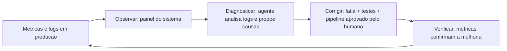

# Capítulo 19: Monitoramento, observabilidade e iteração

# Capítulo 19: Monitoramento, observabilidade e iteração

## Introdução

No Capítulo 18 você entregou as chaves — a TorreDeControle está no ar, operando na nuvem para usuários reais. Mas a entrega das chaves não é o fim da obra: é o início da **operação**. Um prédio habitado precisa de portaria, de leitura de medidores e de manutenção contínua; um serviço em produção precisa de monitoramento, observabilidade e do loop de iteração que transforma dados em melhorias.

Este capítulo é o curso de operação do projeto prático: a instrumentação do sistema com logs estruturados e métricas; as métricas de engenharia que o DORA consagrou — as quatro que medem o desempenho real da entrega; e o loop de iteração — o ciclo contínuo em que os dados de produção alimentam a próxima rodada de melhorias, com o agente participando do diagnóstico e da correção. Ao final, a TorreDeControle não será apenas um sistema no ar: será um sistema *entendido* — com visibilidade do que acontece, métricas do que importa e um ciclo de melhoria contínua funcionando.

## Explica

### Observabilidade: ver dentro do sistema

O conceito central da operação é a **observabilidade**: a capacidade de entender o estado interno de um sistema a partir das suas saídas externas — logs, métricas e rastreios. Um sistema observável é um sistema sobre o qual você consegue responder perguntas: "por que esta requisição foi lenta?", "quantas tarefas foram criadas ontem?", "qual endpoint mais falha?" — sem adivinhar.

Os três pilares da observabilidade:

1. **Logs**: eventos discretos com contexto — "tarefa X movida por Y às Z". Logs estruturados (JSON) são buscáveis e filtráveis — a diferença entre o diário legível e a pilha de papéis.
2. **Métricas**: números agregados no tempo — requisições por segundo, latência percentil, taxa de erro. Métricas respondem "quanto?" e "como está tendendo?".
3. **Rastreios (traces)**: o caminho de uma requisição através dos componentes — quanto tempo em cada camada. Rastreios respondem "onde está o gargalo?".

O princípio prático: comece com logs estruturados e métricas essenciais; rastreios entram quando o sistema cresce. A instrumentação mínima do primeiro dia é melhor que a instrumentação perfeita do dia em que o incidente acontece — porque o incidente não espera.

### As métricas de engenharia (o que o DORA mede)

O DORA, o estudo de alta performance de engenharia que acompanha milhares de equipes, consolidou quatro métricas que medem o desempenho da entrega de software — e elas são o painel da TorreDeControle:

1. **Frequência de deploy**: com que frequência a equipe publica — quanto maior a frequência (com qualidade), maior a capacidade de entrega.
2. **Lead time de mudança**: quanto tempo entre o commit e o deploy — a velocidade da rampa do Capítulo 17.
3. **Taxa de falha de mudança**: quantos deploys causam incidentes em produção — a qualidade do que sai pela rampa.
4. **Tempo de recuperação (MTTR)**: quanto tempo para restaurar o serviço após um incidente — a eficácia do rollback e do diagnóstico.

A métrica mais importante para o fluxo agêntico é a taxa de falha de mudança: ela mede se a velocidade da geração está saindo cara. E o alvo não é "zero falha" (irreal) — é falha baixa e recuperação rápida: o DORA mostra que as equipes de elite têm falha baixa *e* recuperação rápida, não falha zero.

### O loop de iteração: dados → diagnóstico → correção

A observabilidade não é um fim — é o combustível do **loop de iteração**: o ciclo contínuo em que os dados de produção alimentam melhorias. O loop tem quatro etapas:

1. **Observar**: métricas e logs mostram o que acontece — um endpoint lento, um erro recorrente, uma queda de uso.
2. **Diagnosticar**: os dados apontam a causa — e aqui o agente entra: com o contexto do Capítulo 15, ele analisa logs e propõe hipóteses.
3. **Corrigir**: o fix passa pelo fluxo completo da obra — spec, fatia, testes, revisão, pipeline (os Capítulos 7-17 em um ciclo).
4. **Verificar**: as métricas confirmam a melhoria — o mesmo instrumento que apontou o problema mede a correção.

O loop é a diferença entre operar e apenas rodar: rodar é o sistema no ar; operar é o sistema melhorando continuamente com base em evidência.

### A iteração agêntica em produção

A iteração em produção tem uma forma própria no fluxo agêntico: o agente participa do diagnóstico (lê logs, cruza dados, propõe causas) e da correção (implementa a fatia com os testes do Capítulo 14) — mas a *decisão* de mudar um sistema em produção é humana, porque envolve risco de usuário real. O fluxo seguro: o agente investiga e propõe; o humano aprova; o pipeline entrega; a métrica confirma. É o espectro de autonomia do Capítulo 13 aplicado à operação: autonomia na análise, controle na decisão.

## Ilustra

### A Portaria e os Medidores do Prédio

Volte ao prédio habitado. A entrega das chaves não deixou o prédio sem supervisão: há a **portaria**, que registra quem entra e sai (os logs); há os **medidores** — de energia, água, gás — que acumulam números no tempo (as métricas); e há o **zelador**, que cruza as informações: "o consumo de água subiu de quinta para sexta — algo vazou no andar 5" (o diagnóstico). O prédio sem portaria e sem medidores não é abandonado — é *cego*: os moradores podem até estar felizes, mas ninguém sabe o que está acontecendo até o vazamento alagar o subsolo.

A TorreDeControle em produção precisa da mesma tríade: logs estruturados (a portaria registrando eventos), métricas (os medidores acumulando números) e o loop de iteração (o zelador cruzando dados e agindo). Um serviço sem observabilidade não é um serviço — é uma caixa preta que ninguém entende até quebrar.



### O Prédio Sem Medidores: Por Que Observabilidade é Ver, Não Adivinhar

Aqui está o ponto contraintuitivo — a segunda camada de analogia. A primeira mostrou a portaria e os medidores. A segunda é sobre a diferença entre o prédio com medidores e o prédio que "parece estar bem" — e por que a aparência de saúde é o estado mais perigoso.

Imagine dois prédios habitados. O primeiro tem medidores em cada andar e um zelador que lê os números semanalmente: quando o consumo de água sobe 20% num andar, ele descobre o vazamento antes de ele alagar. O segundo prédio não tem medidores — mas os moradores dizem que "está tudo bem, ninguém reclamou". Na verdade, há um vazamento lento no 4º andar há semanas: ninguém reclamou porque ninguém percebeu o aumento gradual — e quando o teto desaba, o "tudo bem" vira a maior obra de emergência do ano.

Com software é idêntico: a ausência de reclamação não é saúde — é ausência de medição. A degradação gradual (o endpoint que fica 200ms mais lento por semana, o erro que sobe de 0,1% para 1% aos poucos) não gera reclamação imediata — gera colapso futuro. Como Mestre de Obras em regime de operação, a lição é a mais valiosa do capítulo: medir é ver; não medir é adivinhar — e o prédio habitado se administra com medidores, não com palpite.

## Técnica

### Passo 1: Logs Estruturados

O primeiro passo é a instrumentação: logs estruturados no lugar de prints soltos. Este é o módulo de logging da TorreDeControle:

```python
# app/logging_config.py — Logs estruturados (JSON) para producao
import json
import logging
import sys
from datetime import datetime, timezone
from typing import Any

class JsonFormatter(logging.Formatter):
    """Formata os registros de log como JSON de linha unica, buscaivel."""

def format(self, registro: logging.LogRecord) -> str: payload: dict[str, Any] = { "timestamp": datetime.now(timezone.utc).isoformat(), "nivel": registro.levelname, "logger": registro.name, "mensagem": registro.getMessage(), } if getattr(registro, "evento", None): payload["evento"] = registro.evento if getattr(registro, "dados", None): payload["dados"] = registro.dados if registro.exc_info: payload["excecao"] = self.formatException(registro.exc_info) return json.dumps(payload, ensure_ascii=False)

def configurar_logging(nivel: str = "info") -> logging.Logger: """Configura o logger raiz com formato JSON e retorna o logger da app.""" handler = logging.StreamHandler(sys.stdout) handler.setFormatter(JsonFormatter()) raiz = logging.getLogger("torrecontrole") raiz.setLevel(nivel.upper()) raiz.handlers = [handler] return raiz

def evento(logger: logging.Logger, nome: str, **dados: Any) -> None:
    """Registra um evento de dominio com contexto estruturado."""
    logger.info("evento", extra={"evento": nome, "dados": dados})

def main() -> None:
    """Exemplo de uso dos logs estruturados."""
    logger = configurar_logging()
    evento(logger, "tarefa_movida", tarefa_id="t1", de="a_fazer", para="em_andamento")
    logger.error("falha na integracao", extra={"evento": "api_externa_falhou"})

if __name__ == "__main__":
    main()
```

O log estruturado é a portaria do prédio: cada evento com timestamp, nível, contexto — buscável e filtrável. A diferença entre "algo aconteceu" (print solto) e "o que, onde, quando, com quais dados" (JSON estruturado).

### Passo 2: O Coletor de Métricas

O segundo passo é o coletor de métricas — os medidores do prédio. Este é o módulo que registra os números essenciais:

```python
# app/metricas.py — Coletor de metricas essenciais da aplicacao
from dataclasses import dataclass, field
from datetime import datetime, timezone
from typing import Callable

@dataclass
class Metricas:
    """Coletor simples de metricas: contadores e medias por operacao."""

    contadores: dict[str, int] = field(default_factory=dict)
    tempos: dict[str, list[float]] = field(default_factory=dict)

    def incrementar(self, nome: str, valor: int = 1) -> None:
        """Incrementa um contador (ex.: requisicoes por endpoint)."""
        self.contadores[nome] = self.contadores.get(nome, 0) + valor

    def registrar_tempo(self, operacao: str, segundos: float) -> None:
        """Registra o tempo de uma operacao para calculo de latencia."""
        self.tempos.setdefault(operacao, []).append(segundos)

def relatorio(self) -> dict[str, float | int]: """Gera o relatorio agregado: contadores e latencias percentil 95.""" relatorio: dict[str, float | int] = dict(self.contadores) for operacao, amostras in self.tempos.items(): ordenadas = sorted(amostras) indice = max(0, int(len(ordenadas) * 0.95) - 1) relatorio[f"latencia_p95_{operacao}"] = round(ordenadas[indice], 3) return relatorio

def main() -> None: """Exemplo de uso do coletor de metricas.""" metricas = Metricas() metricas.incrementar("requisicoes_criar_tarefa") metricas.incrementar("requisicoes_criar_tarefa") metricas.registrar_tempo("criar_tarefa", 0.12) metricas.registrar_tempo("criar_tarefa", 0.09) print(metricas.relatorio())

if __name__ == "__main__":
    main()
```

As métricas essenciais do primeiro dia: contadores por operação (quantas vezes cada endpoint rodou) e latência p95 (o tempo que 95% das requisições não ultrapassam). Com esses dois números, você já responde "quanto?" e "está lento?".

### Passo 3: O Endpoint de Saúde e o Painel

O terceiro passo é o endpoint de saúde e o painel mínimo — a superfície visível da observabilidade:

```python
# app/api/health.py — Endpoint de saude e status para monitoramento
import time
from typing import Any

def gerar_status( metricas: dict[str, Any], banco_ok: bool = True, versao: str = "1.0.0", ) -> dict[str, Any]: """Gera o payload de saude do servico para o monitor externo.""" return { "status": "ok" if banco_ok else "degradado", "versao": versao, "tempo_resposta_ms": round(time.time() * 1000) % 1000, "metricas": metricas, }

def main() -> None: """Exemplo do payload de saude retornado pelo endpoint /health.""" metricas = { "requisicoes_criar_tarefa": 1240, "latencia_p95_criar_tarefa": 0.14, "taxa_erro_percentual": 0.2, } print(gerar_status(metricas))

if __name__ == "__main__":
    main()
```

O endpoint `/health` — que o smoke test do Capítulo 18 já consultava — agora retorna o estado completo: status, versão e métricas. É o painel mínimo que a ferramenta de monitoramento da plataforma consome.

### Passo 4: O Relatório de Métricas de Engenharia

O quarto passo traduz os dados em decisão — o relatório das quatro métricas do DORA. O script coleta os números da semana e gera o veredito:

```python
# scripts/relatorio_dora.py — Relatorio semanal das 4 metricas DORA
from dataclasses import dataclass

@dataclass class Semana: deploys: int lead_time_dias: float falhas: int mttr_horas: float total_changes: int

SEMANAS = [
    Semana(deploys=14, lead_time_dias=1.2, falhas=1, mttr_horas=0.8, total_changes=14),
    Semana(deploys=18, lead_time_dias=0.9, falhas=2, mttr_horas=1.1, total_changes=18),
]

def taxa_falha(semana: Semana) -> float:
    """Percentual de mudancas que causaram falha em producao."""
    return 100 * semana.falhas / semana.total_changes if semana.total_changes else 0.0

def avaliar(semana: Semana) -> str: """Classifica o desempenho segundo os limiares DORA (elite/alto/medio/baixo).""" falha = taxa_falha(semana) if semana.lead_time_dias < 1 and falha < 15: return "ELITE" if semana.lead_time_dias < 7 and falha < 45: return "ALTO" if falha < 45: return "MEDIO" return "BAIXO"

def main() -> None: """Exibe o relatorio das metricas de engenharia da semana.""" print("RELATORIO DORA (metricas de engenharia):") for i, semana in enumerate(SEMANAS, 1): print(f"  Semana {i}: deploys={semana.deploys}, lead={semana.lead_time_dias}d, " f"falha={taxa_falha(semana):.1f}%, mttr={semana.mttr_horas}h -> {avaliar(semana)}") print("Meta: frequencia alta com falha baixa e recuperacao rapida (elite).")

if __name__ == "__main__":
    main()
```

O relatório DORA é o painel de decisão do mestre em operação: cada semana, quatro números dizem se a entrega está saudável — e o veredito (ELITE/ALTO/MÉDIO/BAIXO) sinaliza onde ajustar.

### Passo 5: O Loop de Iteração com o Agente

O quinto passo é o loop completo em ação — o diagnóstico assistido por agente. O prompt que você usa quando uma métrica aponta problema:

```markdown
## Papel e contexto
Você é o engenheiro de operações da TorreDeControle. As métricas da semana
mostram: latencia p95 de "criar_tarefa" subiu de 0.14s para 0.9s; taxa de
erro em "mover_tarefa" subiu de 0.2% para 4%.

## Tarefa específica
Diagnostique as possíveis causas usando os logs estruturados e o código.
Proponha hipóteses ordenadas por probabilidade, cada uma com o dado que a
suporta e o teste que a confirmaria.

## Restrições e regras
- NÃO modifique código de produção.
- Use evidência dos logs (evento, dados) — não suposição.
- Para cada hipótese, indique a métrica que a confirmaria ou refutaria.

## Formato de saída
Lista de hipóteses: {hipotese, evidencia, teste_para_confirmar, risco}.

## Critérios de aceite
1. Pelo menos 3 hipóteses distintas com evidência de log.
2. Nenhuma hipótese sem teste de confirmação.
3. Nenhuma proposta de mudança direta em produção.
```

O loop com agente: os dados apontam, o agente investiga, você decide a correção, o pipeline entrega, a métrica confirma. Autonomia na análise, controle na decisão — o espectro do Capítulo 13 em operação.

### O Protocolo de Operação Contínua

Para fechar, o protocolo de operação — a rotina semanal do mestre em regime de operação:

1. **Ler o painel**: métricas essenciais (requisições, latência p95, taxa de erro) e o relatório DORA da semana.
2. **Investigar anomalias**: qualquer pico é uma pergunta — o agente ajuda no diagnóstico com os logs.
3. **Priorizar correções**: o que melhora a métrica mais importante primeiro (taxa de falha de mudança é a régua).
4. **Iterar pelo fluxo completo**: toda correção passa pela rampa do Capítulo 17 — nada de mudança direta em produção.
5. **Registrar aprendizados**: incidentes e correções viram entradas na memória do Capítulo 16 — o prédio aprende.

## Aplica

### A Cena de Contraste: A Queda Silenciosa

Imagine o primeiro mês da TorreDeControle em produção — sem observabilidade, "porque funciona". Os usuários usam, ninguém reclama, e você assume que está tudo bem. Na verdade, há um padrão silencioso: a cada semana, um endpoint fica um pouco mais lento (um índice de banco faltando, revelado pelo crescimento dos dados), e a taxa de erro em um fluxo secundário sobe devagar. Ninguém reclama — porque a degradação é gradual. No dia em que o volume dobra, o endpoint colapsa, o erro vira generalizado, e a caixa preta — que nunca foi instrumentada — é investigada no escuro, com usuários reais no meio do apagão.

O diagnóstico: a ausência de reclamação foi interpretada como saúde — o prédio sem medidores do Capítulo 3 da operação. O colapso não foi súbito: foi a soma de degradações graduais que ninguém media.

A correção: você instrumenta o sistema — logs estruturados, métricas essenciais, endpoint de saúde e o relatório DORA semanal. Três semanas depois, o mesmo padrão de degradação aparece nos medidores: a latência p95 subindo, o erro subindo devagar — e o diagnóstico assistido por agente aponta o índice faltante antes do colapso. A correção passa pelo fluxo completo, o deploy sai pela rampa, e a métrica confirma a volta aos padrões. A lição: operar sem medir é apostar — e o prédio habitado se administra com medidores, não com sorte.

### Armadilhas Comuns na Operação

- **Logs sem estrutura**: print solto não é buscável. Log JSON com evento e dados.
- **Métricas sem ação**: colecionar números sem o loop de iteração é burocracia. Métrica aponta → diagnóstico → correção → verificação.
- **Painel sem leitor**: instrumentar sem ler o relatório semanal é gasto sem retorno. Rotina de leitura.
- **Diagnóstico no escuro**: investigar incidente sem logs é arqueologia. Instrumentação mínima desde o dia um.
- **Correção direta em produção**: mudar código no servidor vivo quebra a rampa. Toda correção passa pelo pipeline.
- **Ignorar a taxa de falha de mudança**: a métrica que mede se a velocidade está saindo cara. A régua do fluxo agêntico.

### Exercício Prático

Instrumente a TorreDeControle: configure os logs estruturados (`logging_config.py`), o coletor de métricas (`metricas.py`), o endpoint de saúde (`health.py`) e o relatório DORA (`relatorio_dora.py`). Simule uma anomalia (uma métrica fora do padrão) e rode o prompt de diagnóstico assistido por agente — documentando as hipóteses e o teste de confirmação de cada uma.

### Aprofundamento: O Painel Semanal de Operação

A operação do Capítulo 19 funciona com rotina — e a rotina tem um instrumento: o painel semanal de operação. Este é o modelo do painel que você preenche toda segunda-feira, em dez minutos:

```markdown
# Painel Semanal de Operação — TorreDeControle (semana de <data>)

## Saúde do serviço
- Disponibilidade: <99.x%> (meta: 99.5%)
- Latência p95 de criar_tarefa: <0.15s> (tendência: subindo/estável/descendo)
- Taxa de erro: <0.3%> (tendência: ...)

## Métricas DORA
- Frequência de deploy: <N> deploys na semana.
- Lead time de mudança: <X dias> (commit -> produção).
- Taxa de falha de mudança: <Y%> (deploys que causaram incidente).
- MTTR: <Z horas> (tempo médio de recuperação).

## Incidentes e aprendizados
- <incidente 1> -> causa, correção, aprendizado registrado na memória.
- <nenhum> -> semana limpa.

## Decisões da semana
- <decisão 1> -> registrada no diário de decisões (Cap. 5).

## Próximos passos
- <item 1> -> fatia pequena, testes, pipeline.
```

O painel tem três funções: (1) *obriga a medição* — o que não está no painel não está sendo medido; (2) *cria a linha de base* — a tendência importa mais que o número isolado, e o painel acumula o histórico; (3) *alimenta o loop* — cada número anômalo do painel dispara o diagnóstico assistido por agente do Capítulo 19. A disciplina do painel é a mesma do diário de decisões: dez minutos semanais que economizam horas de reação. E quando o painel mostra três semanas de saúde estável, é o sinal de que o sistema atingiu a maturidade operacional — e que você pode subir o nível de autonomia pelo protocolo do Capítulo 13, porque a evidência (não a confiança) sustenta a promoção.

## Conclusão

Neste capítulo você assumiu a operação do prédio habitado: entendeu a observabilidade — os três pilares de logs, métricas e rastreios; dominou as quatro métricas do DORA — frequência de deploy, lead time, taxa de falha e tempo de recuperação; instrumentou a TorreDeControle com logs estruturados, coletor de métricas e endpoint de saúde; e fechou o loop de iteração — dados → diagnóstico assistido por agente → correção pela rampa → verificação pela métrica. A lição central: operar não é rodar — é medir, entender e melhorar continuamente; e o prédio habitado se administra com medidores, não com palpite.

Seu desafio: a TorreDeControle instrumentada — logs estruturados, métricas coletadas, relatório DORA da semana e um ciclo completo de diagnóstico assistido por agente documentado.

No Capítulo 20, o último da obra: o engenheiro do futuro — a mentalidade AIDD, o portfólio do Mestre de Obras e como se posicionar no mercado de 2026 com a jornada completa que você percorreu.