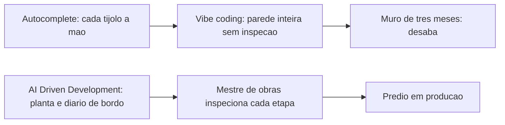

# Capítulo 1: O que é AI Driven Development (e o que ele não é)

## 1. Introdução

Você está diante de um terreno baldio. Não há planta, não há fundação, não há nada além de terra batida e a promessa de um prédio. Este livro é a construção desse prédio — um projeto real de software chamado **TorreDeControle**, que você vai erguer do zero até a entrega das chaves, isto é, até o deploy em produção. E a ferramenta que vai transformar você em mestre de obras não é um editor mais bonito nem um autocomplete mais inteligente: é uma forma nova de desenvolver software, em que agentes de inteligência artificial participam de cada etapa da construção, da primeira estaca à vistoria final [1].

Antes de assentar a fundação, porém, você precisa saber exatamente o que está construindo. Este capítulo define com precisão o que é AI Driven Development (AIDD), separa o termo de vizinhos confusos como *vibe coding* e *autocomplete*, e mostra, com dados de mercado, por que 2026 é o ano em que essa forma de trabalhar deixou de ser promessa de laboratório para se tornar o padrão do setor [2]. Ao final, você será capaz de explicar para qualquer pessoa — inclusive para um recrutador — o que é AIDD, o que ele não é, e por que essa distinção muda a forma como você vai encarar o resto desta obra.

## 2. Explica

Comece pela definição que vamos usar em toda a obra: AI Driven Development é a abordagem em que fluxos inteiros do ciclo de vida de software — requisitos, especificação, código, testes, revisão, integração e deploy — são impulsionados e orquestrados por agentes de IA, com o engenheiro humano atuando como arquiteto, auditor e decisor final [3]. Repare no que essa definição inclui e no que ela exclui. Ela não diz "usar IA para escrever código": isso é autocomplete. Ela diz que a IA participa do fluxo inteiro, da concepção à operação — e é exatamente essa abrangência que a diferencia de tudo que veio antes.

A distinção mais importante para quem está começando é entre três modos de trabalho que parecem a mesma coisa, mas não são. O primeiro é o *vibe coding*, termo cunhado por Andrej Karpathy em fevereiro de 2025 para descrever o fluxo em que o desenvolvedor conversa com a IA em linguagem natural e aceita o código gerado em bloco, sem revisar linha a linha [4]. O segundo é o *agentic coding* (engenharia agêntica), em que agentes autônomos executam tarefas complexas de ponta a ponta — refatoração profunda, migração de framework, geração de suíte de testes — mantendo o julgamento de engenharia e a responsabilidade final com o humano [5]. O terceiro, e mais amplo, é o AIDD propriamente dito: o guarda-chuva metodológico e estratégico que engloba governança, dados, segurança, métricas e integração com plataformas internas, dentro do qual vibe coding e agentic coding são apenas peças táticas [6].

Essa hierarquia tem consequências práticas imediatas. Se você trata AIDD como sinônimo de "aceitar código gerado por IA", vai medir sucesso pela quantidade de linhas aceitas — e vai colher os frutos amargos do débito técnico acumulado. O relatório DORA de 2025, que acompanha milhares de equipes de engenharia, encontrou o que os pesquisadores chamam de *Efeito Espelho*: a IA não cria excelência organizacional sozinha, ela amplifica o que já existe [7]. Equipes com processos estruturados ganham velocidade e estabilidade; equipes caóticas veem a instabilidade e o atrito aumentarem na mesma proporção. Em outras palavras: a IA é uma ferramenta que amplia o seu método — se o método não existe, a IA amplifica o caos.

Os números ajudam a dimensionar o fenômeno. Cerca de 90% dos profissionais de desenvolvimento já utilizam IA em algum grau no trabalho [8], e projeções do Gartner colocam a adoção de IA agêntica crescendo a uma taxa composta de aproximadamente 119% ao ano [9]. A McKinsey, por sua vez, observa que, embora mais de 70% das empresas já tenham adotado IA generativa em algum ponto da operação, apenas uma pequena fração conseguiu escalar agentes de forma lucrativa em toda a organização — a diferença entre as que escalam e as que não escalam não é o modelo, é o sistema ao redor do modelo [10].

Pare e reflita sobre o que essa última frase significa para você. Se a diferença entre ganhar velocidade e afundar em dívida técnica é o sistema ao redor do modelo, então o seu trabalho nesta obra é construir esse sistema. É por isso que o Capítulo 2 apresenta as quatro camadas da arquitetura agêntica — Tela, Harness, LLM e Tools — e é por isso que metade dos capítulos deste livro trata de contexto, memória, habilidades, governança e revisão, e não apenas de "como pedir código". A ferramenta é o veículo; o sistema é a estrada [11].

Uma ressalva honesta antes de continuar: AIDD não é uma bala de prata, e este livro não vai vendê-lo como tal. Estudos recentes mostram que o ganho real de produtividade depende fortemente da complexidade da tarefa e da maturidade do uso — em arquiteturas muito complexas, o ganho é menor do que as manchetes sugerem [12]. Pesquisas de revisão sistemática sobre agentes baseados em LLM na engenharia de software mapeiam tanto as capacidades quanto as limitações estruturais: os agentes são excelentes em tarefas bem definidas com feedback rápido, e frágeis em horizontes longos com requisitos ambíguos [13]. A maturidade, portanto, não é uma propriedade da ferramenta: é uma propriedade sua, construída capítulo a capítulo.

## 3. Ilustra

### O Terreno Baldio e a Primeira Estaca

Volte ao seu terreno baldio. Na era do autocomplete, o terreno era operado assim: você empurrava um carrinho de mão com tijolos — o editor completava linhas, sugeria nomes, consertava parênteses — mas cada tijolo era assentado pela sua mão, um a um, e o prédio crescia na velocidade do seu braço. Era trabalho honesto, mas lento, e o gargalo era você.

O *vibe coding* mudou uma coisa: em vez de você assentar cada tijolo, você descreve a parede em linguagem natural e um operário incrivelmente rápido a ergue inteira. O problema é que ninguém inspeciona a argamassa. A parede fica de pé por um tempo — e depois desaba no "muro de três meses", quando o acúmulo de pequenos erros estruturais torna impossível adicionar um andar novo sem derrubar os antigos [14]. AI Driven Development é outra coisa: você não é o operário nem o espectador. Você é o mestre de obras. O canteiro tem planta (especificação), tem diário de bordo (rastreabilidade), tem inspetor (revisão) e tem um protocolo de entrega (deploy). Os operários — os agentes — trabalham rápido, mas cada etapa passa por inspeção antes de o prédio subir.



### O Que o Vibe Coding Erra: a Argamassa Invisível

Aqui está o ponto mais difícil deste capítulo — e por isso ele merece uma segunda camada de analogia. A primeira camada mostrou a mecânica geral: autocomplete constrói devagar, vibe coding constrói rápido e arriscado, AIDD constrói com inspeção. A segunda camada é sobre o que torna o vibe coding traiçoeiro: a argamassa invisível.

Imagine que você contrata um pedreiro que trabalha dez vezes mais rápido que qualquer outro, mas que nunca te mostra a mistura que usa. As paredes parecem perfeitas por fora — reboco liso, cantos retos. Mas a argamassa dele tem um segredo: às vezes é concreto, às vezes é farinha com água. Você só descobre qual foi usada quando o prédio balança. Com código é idêntico: o código gerado por IA parece sintaticamente perfeito, com nomes de variáveis sensatos e indentação impecável — e é exatamente aí que mora o perigo, porque "parecer plausível" não é o mesmo que "funcionar de verdade" [15]. A revisão linha a linha é a vistoria que detecta a argamassa errada antes de ela virar estrutura. Como Mestre de Obras, você vai perceber ao longo desta obra que revisar não é desconfiança: é o ato de engenharia mais importante do canteiro.

## 4. Técnica

### A Matriz de Decisão: Vibe, Agentic ou AIDD?

A primeira ferramenta técnica deste livro é uma matriz de decisão que você vai usar em toda a sua carreira. Ela responde à pergunta prática: "neste projeto, em que modo eu devo trabalhar?" A resposta depende de duas variáveis: o custo do erro e a durabilidade do artefato.

| Variável | Pergunta | Vibe coding | Agentic coding | AIDD completo |
|---|---|---|---|---|
| Custo do erro | "O que acontece se estiver sutilmente errado?" | Baixo (protótipo descartável) | Médio | Alto (produção, dado de usuário) |
| Durabilidade | "Este código vive por quanto tempo?" | Dias/semanas | Meses | Anos |
| Supervisão | "Quem audita o quê?" | Leitura rápida | Revisão de PR | Diário de bordo + revisão + CI |
| Exemplo | Script de uso único | MVP para validar ideia | Produto em produção |

O critério de corte é direto: se o erro custa caro ou o código vai viver muito, você precisa de pelo menos o modo agentic com revisão — e idealmente o fluxo AIDD completo que este livro ensina. Se é um script que você apaga amanhã, vibe coding é perfeitamente aceitável e não há vergonha nisso [16].

### O Primeiro Projeto: Especificação Inicial da TorreDeControle

Durante toda a obra, você vai construir o **TorreDeControle**: um aplicativo web de gestão de tarefas de equipe, com autenticação, quadro de tarefas, histórico de atividades e uma API REST documentada. A escolha não é acidental: é um domínio simples o suficiente para um iniciante entender cada peça, e rico o suficiente para exercitar todas as camadas do AIDD — especificação, modelagem de domínio, scaffolding, testes, CI/CD e deploy [17].

O primeiro artefato técnico que você vai criar é o arquivo de especificação inicial, em Markdown, que será refinado no Capítulo 7 (spec-driven development). Este é o esqueleto:

```markdown
# TorreDeControle — Especificação Inicial

## Problema
Times pequenos perdem o controle das tarefas em planilhas e conversas de chat.
Nenhuma ferramenta simples entrega quadro, histórico e API num pacote único.

## Usuários
- Membro de equipe: cria e move tarefas, comenta, acompanha histórico.
- Gestor: cria projetos, atribui tarefas, vê o quadro completo.

## Requisitos funcionais (primeiro corte)
1. RF1 — Cadastro e login de usuários (email + senha).
2. RF2 — CRUD de projetos (nome, descrição).
3. RF3 — CRUD de tarefas (título, descrição, status, prioridade, responsável).
4. RF4 — Quadro Kanban: mover tarefa entre colunas (a fazer, em andamento, concluída).
5. RF5 — Histórico de atividades por tarefa (quem fez o quê, quando).
6. RF6 — API REST JSON com autenticação por token.

## Requisitos não funcionais (primeiro corte)
1. RNF1 — Código em Python (FastAPI) no backend e HTML/CSS/JS vanilla no frontend.
2. RNF2 — Testes automatizados para toda a lógica de negócio.
3. RNF3 — Deploy em plataforma de nuvem com CI/CD.
4. RNF4 — Logs estruturados e observabilidade básica.
```

Você não precisa entender cada requisito agora — eles serão desdobrados e questionados pelo agente ao longo da obra. O que importa neste momento é registrar o hábito: **todo projeto AIDD começa com um documento de intenção**, porque o agente só pode ser audaz quando existe um contrato claro do que está sendo construído [18].

### O Fluxo de Trabalho em Cinco Etapas

Para fechar a parte técnica, aqui está o fluxo de trabalho AIDD em cinco etapas que usaremos como espinha dorsal da obra — o equivalente ao protocolo de inspeção do canteiro:

1. **Especificar**: escrever (ou refinar) o documento de intenção — problema, usuários, requisitos. É a planta do prédio.
2. **Planejar**: o agente propõe a arquitetura e o passo a passo; você aprova ou ajusta antes de qualquer código.
3. **Executar em fatias pequenas**: o agente implementa uma fatia pequena e testável de cada vez — nunca um andar inteiro de uma vez. Lotes pequenos são um dos sete pilares que o DORA associa a alta performance [7].
4. **Revisar e validar**: cada fatia passa por revisão, testes e verificação de sintaxe antes de ser integrada.
5. **Integrar e entregar**: a fatia é integrada ao tronco, passa pelo pipeline e segue para o deploy.

Este fluxo vai aparecer, com variações, em praticamente todos os capítulos. Ele é o método; o resto são as ferramentas que o sustentam.

## 5. Aplica

### A Cena de Contraste: o Primeiro Deploy do Iniciante

Feche os olhos e se imagine na sexta-feira à noite do seu primeiro projeto com IA. Você passou o dia conversando com o agente, aceitou dezenas de blocos de código "que funcionavam na hora", e agora o produto está lindo — na sua máquina. É hora de publicar. Você roda o deploy, e na segunda-feira de manhã, o cliente liga: a página está fora do ar. Você abre o terminal, e lá está o erro: uma migração de banco que o agente gerou — e você aceitou sem ler — apagou uma tabela inteira. O código parecia perfeito. A argamassa era farinha [19].

O diagnóstico: você operou no modo vibe coding num projeto de durabilidade longa e custo de erro alto. O erro não foi da IA — foi da ausência de sistema ao redor dela. O Efeito Espelho previa exatamente isso: a IA amplificou a ausência de revisão e transformou uma migração rotineira em incidente.

A correção: você volta ao método. Antes de qualquer deploy, o fluxo passa a ser (1) especificação revisada, (2) revisão de código por par ou por agente revisor, (3) testes automatizados rodando em CI, (4) migração testada em ambiente de staging antes de produção. A partir da próxima semana, o deploy de sexta-feira vira o deploy contínuo, pequeno e verificado — e o incidente não se repete. Como Mestre de Obras, você aprendeu na pele que velocidade sem inspeção não é velocidade: é acidente adiado.

### Armadilhas Comuns de Quem Está Começando

Além da cena acima, guarde estas armadilhas como síntese rápida:

- **Confundir velocidade com progresso**: aceitar 500 linhas por hora sem revisão não é produzir — é acumular risco. O DORA mede estabilidade e tempo de entrega, não volume de código.
- **Medir sucesso por linhas aceitas**: a métrica certa é "alterações aceitas em revisão e que não quebraram produção" — taxa de reversão e taxa de falha de mudança são os indicadores reais [20].
- **Achar que AIDD é só prompt**: a maior parte do valor está no contexto, nas ferramentas, na revisão e na governança — não na frase mágica digitada no chat [11].
- **Ignorar o custo dos tokens em projetos longos**: o Capítulo 16 é dedicado à economia severa de contexto, mas registre desde já: projetos de meses precisam de disciplina de orçamento de contexto desde o dia um [21].
- **Tratar agente como substituto de entendimento**: o agente executa; você entende. Em domínios regulados, a supervisão humana graduada é requisito — autonomia crescente exige controle redesenhado na mesma proporção [22].

### Exercício Prático

Aplique a matriz de decisão a um projeto real seu: um projeto pessoal que você considera iniciar. Anote as respostas das duas variáveis (custo do erro e durabilidade) e a recomendação resultante. Depois, escreva a especificação inicial da TorreDeControle num arquivo `especificacao.md`, com problema, usuários e pelo menos cinco requisitos funcionais. Esse exercício de dez minutos é o primeiro hábito do Mestre de Obras: **decidir o modo de trabalho e registrar a intenção antes de escrever a primeira linha** [23].

### Aprofundamento: Escolhendo Sua Primeira Ferramenta em 2026

Como você está começando, a primeira decisão prática do canteiro é *qual ferramenta usar para o resto da obra*. Em vez de receita de boca, aqui está o método de escolha — que aplica a matriz de decisão a si mesma. Três critérios, nesta ordem de peso:

1. **Tipo de harness**: o harness é a camada que você vai configurar em quase todos os capítulos — terminal (mais configurável, mais controle) ou IDE (mais integrado, menos controle). Para um iniciante que quer entender a arquitetura, o terminal ensina mais; para quem quer produtividade imediata, a IDE entrega mais cedo.
2. **Modelo disponível**: o harness é apenas o veículo do modelo. A qualidade da sua experiência depende mais do modelo que você consegue acessar do que da marca do harness — e trocar de harness é mais barato que trocar de modelo.
3. **Ecossistema**: skills, MCP e comunidade. A riqueza do ecossistema de um harness multiplica o que você consegue fazer sem reinventar (os Capítulos 9-11 exploram isso).

| Critério | Harness de terminal | IDE com agente |
|---|---|---|
| Controle de configuração | Alto (arquivos, hooks) | Médio (painéis) |
| Curva de aprendizado do método | Ensina a arquitetura | Entrega resultado rápido |
| Skills e MCP | Maduros e explícitos | Crescendo rápido |
| Melhor para | Quem quer dominar o método | Quem quer entregar hoje |

A recomendação prática para este livro: comece no terminal (ou no modo terminal do seu harness), porque os capítulos 3, 6, 13 e 16 configuram arquivos, hooks e economia — coisas que a IDE esconde. Quando o método estiver automático, a IDE vira uma Tela a mais — intercambiável, como a arquitetura do Capítulo 2 prevê.

```bash
# Passo a passo minimo para decidir sem paralisia:
# 1. Instale um harness de terminal (ou ative o modo terminal do seu)
# 2. Rode um hello world agêntico: peça para criar um arquivo e commitar
# 3. Pergunte a si mesmo: entendi o que aconteceu? Se sim, siga com ele
# 4. Se a ferramenta te esconder o que faz, troque — entendimento > aparência
```

Essa é a mesma distinção que você verá no Capítulo 20: ferramentas envelhecem, método persiste. A escolha de hoje importa menos que o hábito de escolher com método.

### Aprofundamento: As Três Perguntas que Definem o Modo de Trabalho

A matriz de decisão do Capítulo 1 tem uma versão conversacional — as três perguntas que você faz a si mesmo antes de qualquer projeto, e que resumem o critério de corte em linguagem de mestre de obras:

1. **"O que acontece se estiver sutilmente errado e ninguém perceber por três semanas?"** Se a resposta for "nada grave" (script descartável, protótipo de um fim de semana), o vibe coding basta. Se envolver dado de usuário, dinheiro ou disponibilidade, você precisa do fluxo completo.
2. **"Quanto tempo este código vai viver?"** Dias ou semanas de vida curta toleram menos infraestrutura; meses e anos de vida longa cobram a fundação — especificação, testes, governança — desde o dia um, porque o custo de adicionar a fundação depois é exponencial.
3. **"Quem vai tocar este código além de mim?"** Se a resposta for "só eu, por um tempo", o mínimo viável de processo basta. Se for um time — ou agentes futuros que você não conhece — o diário de bordo (rastreabilidade) vira obrigatório, porque quem tocar o código depois vai precisar entender o *porquê* das decisões, não apenas o *o quê*.

As três perguntas formam o critério de corte do Capítulo 1 em formato de conversa de elevador — e elas têm uma propriedade que as torna úteis em qualquer contexto: são *perguntas sobre o artefato e sua vida*, não sobre a ferramenta. O modo de trabalho não é decidido pela ferramenta que você abre, mas pelo que o código vai ser e por quanto tempo vai viver — e é essa inversão (artefato antes de ferramenta) que separa o mestre de obras do dono do martelo.

## 6. Conclusão

Neste capítulo você aprendeu três coisas que sustentam toda a obra: primeiro, AI Driven Development é a orquestração de agentes de IA em todo o ciclo de vida do software — não um autocomplete sofisticado; segundo, a diferença operacional entre vibe coding, agentic coding e AIDD está no sistema ao redor do modelo, não na ferramenta [24]; terceiro, o Efeito Espelho do DORA mostra que a IA amplifica o método existente — e, portanto, seu maior ativo é o método, que você começou a construir com a matriz de decisão, a especificação inicial da TorreDeControle e o fluxo de cinco etapas.

Seu desafio: classificar um projeto real seu na matriz de decisão e escrever a especificação inicial (problema, usuários, 5+ requisitos) em Markdown.

No Capítulo 2, vamos desenhar a planta do prédio: as quatro camadas da arquitetura agêntica — Tela, Harness, LLM e Tools — e onde cada peça do ecossistema de 2026 se encaixa nessa estrutura. Você já sabe o que é AIDD; agora vai entender por dentro como ele funciona.

## 7. Referências Bibliográficas

[1] ANTHROPIC. *Building Effective AI Agents*. Disponível em: https://www.anthropic.com/research/building-effective-agents. Acesso em: 07 ago. 2026.

[2] SOFTJOURN. *AI Software Development Statistics 2026: Adoption, Productivity, and Risk*. Disponível em: https://softjourn.com/insights/ai-software-dev-stats. Acesso em: 07 ago. 2026.

[3] VALUE ADD VC. *AI Coding Productivity Study Data: What METR, McKinsey, and GitHub Found in 2026*. Disponível em: https://valueaddvc.com/blog/ai-coding-productivity-study-data-what-metr-mckinsey-and-github-actually-found-in-2026. Acesso em: 07 ago. 2026.

[4] CONNELL, Andrew. *My Thoughts on Vibe Coding vs. Agentic Engineering*. Disponível em: https://www.andrewconnell.com/articles/vibe-coding-vs-agentic-engineering/. Acesso em: 07 ago. 2026.

[5] JIN, Haolin et al. *From LLMs to LLM-based Agents for Software Engineering: A Survey of Current, Challenges and Future*. Disponível em: https://arxiv.org/abs/2408.02479. Acesso em: 07 ago. 2026.

[6] IT REVOLUTION. *AI's Mirror Effect: How the 2025 DORA Report Reveals Your Organization's True Capabilities*. Disponível em: https://itrevolution.com/articles/ais-mirror-effect-how-the-2025-dora-report-reveals-your-organizations-true-capabilities/. Acesso em: 07 ago. 2026.

[7] DORA / GOOGLE CLOUD. *Publications and ROI of AI-assisted Software Development Report*. Disponível em: https://dora.dev/research/publications/. Acesso em: 07 ago. 2026.

[8] GARTNER. *Gartner Identifies the Top Strategic Technology Trends for 2026*. Disponível em: https://www.gartner.com/en/newsroom/press-releases/2025-10-20-gartner-identifies-the-top-strategic-technology-trends-for-2026. Acesso em: 07 ago. 2026.

[9] MCKINSEY & COMPANY. *The State of AI: Global Survey*. Disponível em: https://www.mckinsey.com/capabilities/quantumblack/our-insights/the-state-of-ai. Acesso em: 07 ago. 2026.

[10] EXPLAINX.AI. *AI Coding Agent Evals on Real Repos (2026)*. Disponível em: https://explainx.ai/blog/ai-coding-agent-evals-real-repos-2026. Acesso em: 07 ago. 2026.

[11] SOURCEGRAPH. *Context Engineering: A Practical Guide for AI Agents (2026)*. Disponível em: https://sourcegraph.com/blog/context-engineering. Acesso em: 07 ago. 2026.

[12] BIRJOB. *AI Coding Agent Benchmarks Beyond SWE-Bench in 2026: Terminal-Bench, Aider Polyglot, GAIA, and Why the Leaderboard Lies*. Disponível em: https://www.birjob.com/blog/agent-benchmarks-2026. Acesso em: 07 ago. 2026.

[13] DENG, Xiang et al. *SWE-Bench Pro: Can AI Agents Solve Long-Horizon Software Engineering Tasks?* Disponível em: https://arxiv.org/abs/2509.16941. Acesso em: 07 ago. 2026.

[14] AUGMENT CODE. *Vibe Coding vs Spec-Driven Development (2026): When to Use Each*. Disponível em: https://www.augmentcode.com/guides/vibe-coding-vs-spec-driven-development. Acesso em: 07 ago. 2026.

[15] MIT SLOAN MANAGEMENT REVIEW. ANDERSON, Edward; PARKER, Geoffrey; TAN, Burcu. *The Hidden Costs of Coding With Generative AI*. Disponível em: https://sloanreview.mit.edu/article/the-hidden-costs-of-coding-with-generative-ai/. Acesso em: 07 ago. 2026.

[16] PRINCETON UNIVERSITY. *SWE-bench Verified & Pro*. Disponível em: https://www.swebench.com. Acesso em: 07 ago. 2026.

[17] CODIHAUS. *AI Developer Productivity Data: 2X Faster, 55% Speed Gain, Enterprise ROI Analysis*. Disponível em: https://codihaus.com/news/ai-developer-productivity-data-engineering-leaders. Acesso em: 07 ago. 2026.

[18] AUGMENT CODE. *How to Build Your AGENTS.md (2026): The Context File That Makes AI Coding Agents Actually Work*. Disponível em: https://www.augmentcode.com/guides/how-to-build-agents-md. Acesso em: 07 ago. 2026.

[19] WONG, Sherman et al. *Confucius Code Agent: Scalable Agent Scaffolding for Real-World Codebases*. Disponível em: https://arxiv.org/abs/2512.10398. Acesso em: 07 ago. 2026.

[20] DX. *How to measure AI's impact on developer productivity*. Disponível em: https://getdx.com/blog/ai-measurement-hub/. Acesso em: 07 ago. 2026.

[21] TASKADE. *Context Engineering: What It Is + How to Do It (2026)*. Disponível em: https://www.taskade.com/blog/context-engineering. Acesso em: 07 ago. 2026.

[22] UNBUILT LAB. *AI Development ROI Measurement: Complete Platform Guide*. Disponível em: https://unbuiltlab.com/blog/ai-development-roi-measurement-complete-platform-guide.html. Acesso em: 07 ago. 2026.

[23] ZIEMINSKI, Karo. *Context Engineering for Product Builders: The 2026 Operating Manual*. Disponível em: https://karozieminski.substack.com/p/context-engineering-product-builders-guide-2026. Acesso em: 07 ago. 2026.

[24] TAWOSI, Vali et al. *ALMAS: an Autonomous LLM-based Multi-Agent Software Engineering Framework*. Disponível em: https://arxiv.org/abs/2510.03463. Acesso em: 07 ago. 2026.
