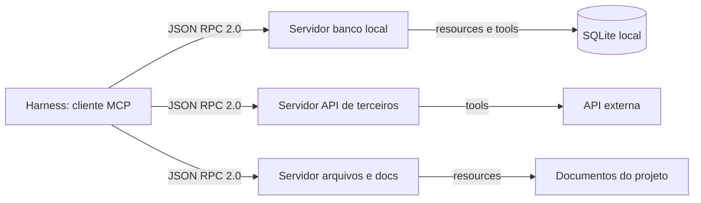

# Capítulo 10: MCP: conectando o agente ao mundo real

## 1. Introdução

No Capítulo 9 você equipou o canteiro com conhecimento reutilizável — as skills que padronizam os procedimentos repetitivos. Mas o conhecimento não basta: o agente precisa de *mãos* que toquem o mundo real — arquivos, banco de dados, APIs de terceiros. No Capítulo 2, você viu a quarta camada da arquitetura (Tools) e o protocolo que a padroniza; agora é hora de usar o **Model Context Protocol (MCP)** na prática, conectando o agente da TorreDeControle ao seu banco de dados e a serviços externos [1].

O MCP é o padrão aberto, criado pela Anthropic, que padroniza a comunicação entre o harness e ferramentas externas — eliminando integrações fragmentadas que antes exigiam um adaptador diferente para cada ferramenta [2]. Este capítulo explica o que o protocolo expõe (resources, prompts e tools), mostra como configurar servidores MCP no seu harness e conecta o projeto real a um banco local e a uma API externa. Ao final, seu agente não apenas conversa com você — ele *age* no mundo, com autorização, rastreabilidade e segurança.

## 2. Explica

### O problema que o MCP resolve

Antes do MCP, cada ferramenta externa exigia uma integração proprietária: o harness precisava de código específico para falar com o banco, outro para a API de pagamentos, outro para o sistema de arquivos remoto. Cada integração era um ponto de fragilidade — e o modelo, para usar a ferramenta, dependia do harness conhecer aquele adaptador em particular [3]. O MCP resolve isso com um protocolo comum: o harness fala MCP, e qualquer ferramenta que fale MCP é automaticamente compreendida. É o mesmo movimento que o USB fez pelos periféricos: em vez de um conector diferente para cada dispositivo, um padrão único que todos respeitam [4].

### As três capacidades do protocolo

O MCP expõe três capacidades fundamentais, cada uma com um papel distinto:

- **Resources**: dados legíveis que o modelo pode consultar — arquivos, logs, schemas de banco, documentação. É o "contexto sob demanda" do Capítulo 5 protocolado: o agente busca um resource quando precisa do conteúdo.
- **Prompts**: workflows e templates reutilizáveis expostos pelo servidor — o servidor pode oferecer "prompts prontos" que encapsulam procedimentos.
- **Tools**: funções executáveis que o modelo pode acionar com argumentos — a mão que toca o mundo: executar query, enviar e-mail, criar recurso na API [5].

A distinção é crucial para decidir o que expor: resources são para *ler* (o agente consulta contexto), tools são para *agir* (o agente executa com efeito). Essa separação é também a base da segurança — você controla o que é legível e o que é executável separadamente.

### Como a comunicação funciona

A comunicação MCP usa mensagens JSON-RPC 2.0 entre o cliente (o harness) e o servidor (a ferramenta), por dois transportes possíveis: **stdio** (o servidor roda como processo filho do harness, na mesma máquina — o padrão para ferramentas locais) e **HTTP** (o servidor roda remotamente — para serviços compartilhados ou em nuvem) [6]. O fluxo típico: o harness inicializa o servidor, descobre as capacidades disponíveis (*lazy tool discovery* — as ferramentas são descobertas sob demanda, não todas de uma vez), e passa a chamá-las quando o modelo decide usá-las.

O desacoplamento é total: o servidor MCP não sabe qual modelo está do outro lado, nem qual interface o humano usa. É a materialização do princípio das camadas do Capítulo 2: Tools falam o protocolo; o resto é intercambiável [7].

### Segurança: o novo vetor de ataque

A abertura do protocolo trouxe um novo vetor de ataque que você precisa conhecer desde já: o **tool poisoning**. Como o modelo lê as descrições em linguagem natural das ferramentas para decidir quando usá-las, um servidor MCP malicioso — ou comprometido — pode embutir instruções adversariais invisíveis na descrição da tool, levando o agente a ler arquivos confidenciais e exfiltre-los silenciosamente [8]. A defesa é em camadas: só conectar servidores de fontes confiáveis, revisar as permissões do harness, isolar servidores de produção, e tratar toda ferramenta nova como não confiável até provar o contrário — o mesmo princípio do "tool não confiável" que a indústria de segurança recomenda [9]. O Capítulo 11 constrói ferramentas com blindagem; este capítulo estabelece a postura.

## 3. Ilustra

### As Tomadas Padronizadas do Canteiro

Volte ao canteiro. Antes da padronização, cada máquina do canteiro tinha um conector proprietário: o guindaste só ligava na tomada do guindaste, o betoneira só na da betoneira, e cada uma exigia um eletricista diferente para instalar. O resultado: máquinas boas que não conversavam entre si, e um canteiro onde "conectar uma máquina nova" era um projeto de engenharia.

O MCP é a tomada padronizada do canteiro. Qualquer máquina que obedeça ao padrão liga em qualquer tomada — o banco local, a API de terceiros, o serviço de e-mail. O eletricista (o harness) aprende uma vez o padrão e conecta qualquer máquina que o respeite. A padronização não torna as máquinas melhores — torna a conexão trivial, e é a conexão que multiplica o valor [10].



### O Eletricista que Instala Tudo no Mesmo Dia: Por Que o Padrão é Seguro e o Abaixo-Assinado é Perigo

Aqui está o ponto contraintuitivo — a segunda camada de analogia. A primeira mostrou a tomada padronizada. A segunda é sobre o *novo* risco que a padronização criou: a tomada universal também aceita o plugue da máquina não confiável.

Imagine o canteiro com tomadas padronizadas. A conveniência é enorme — mas agora qualquer pessoa pode levar uma máquina de casa, ligar na tomada do canteiro e, se a máquina tiver um defeito oculto (um fio solto que puxa energia demais, um sensor que reporta dados errados), o dano atinge o circuito inteiro. Antes da padronização, uma máquina desconhecida simplesmente não ligava; agora ela liga — e o eletricista precisa de uma regra nova: *nenhuma máquina entra no canteiro sem inspeção* [11].

Com o MCP é idêntico: a facilidade de conectar qualquer servidor é a mesma facilidade que permite conectar servidores maliciosos. O tool poisoning explora exatamente essa porta [12]. Como Mestre de Obras, você vai aplicar a regra do eletricista: padronização na conexão, inspeção na entrada. O protocolo universal não elimina a segurança — ele a torna *sua* responsabilidade, camada por camada [13].

## 4. Técnica

### Configurando o Primeiro Servidor MCP: Banco Local

A primeira conexão real: um servidor MCP para o banco SQLite da TorreDeControle — o banco que o Capítulo 8 deixou de fora e que agora entra como ferramenta. A configuração no arquivo do harness segue o padrão que você viu no Capítulo 2:

```json
{
  "mcpServers": {
    "banco_torrecontrole": {
      "command": "uvx",
      "args": [
        "mcp-server-sqlite",
        "--db-path",
        "./data/torrecontrole.db"
      ],
      "env": {}
    },
    "docs_projeto": {
      "command": "uvx",
      "args": [
        "mcp-server-filesystem",
        "./docs"
      ],
      "env": {}
    }
  }
}
```

Depois de salvar, reinicie a sessão do agente para que o harness descubra os novos servidores. A verificação da conexão é conversacional: pergunte ao agente "quais ferramentas você tem disponíveis agora?" — e ele deve listar as tools do banco (consultar schema, executar query, etc.) e os resources dos documentos [14].

### O Teste de Conexão: Consultando o Banco Através do Agente

Com o servidor conectado, o teste real — o agente executa uma query no banco por meio da tool MCP:

```sql
-- Consulta que o agente pode executar via tool do servidor MCP
-- (o agente gera a query; a tool executa no SQLite e devolve o resultado)
SELECT name, sql
FROM sqlite_master
WHERE type = 'table'
ORDER BY name;
```

O fluxo completo: você pede "liste as tabelas do banco"; o modelo decide que a tool `executar_query` do servidor MCP é apropriada; o harness chama o servidor; o servidor executa no SQLite; o resultado volta ao modelo; o modelo resume para você. Cada passo do fluxo pode ser auditado — e é essa rastreabilidade que o Capítulo 2 prometeu [15].

### Conectando uma API Externa via MCP

A segunda conexão: uma API externa — por exemplo, um serviço de clima ou de dados públicos — via servidor MCP HTTP. A configuração usa o transporte HTTP e requer a chave de API:

```json
{
  "mcpServers": {
    "api_externa": {
      "command": "uvx",
      "args": [
        "mcp-server-http",
        "--base-url",
        "https://api.exemplo.com/v1"
      ],
      "env": {
        "API_KEY": "<seu-token>"
      }
    }
  }
}
```

Regras de segurança na conexão externa: a chave vive em variável de ambiente (nunca no arquivo de configuração versionado); o servidor externo recebe apenas os escopos mínimos; e o harness mantém permissão de aprovação para chamadas externas até você validar o comportamento — a postura do "tool não confiável até prova em contrário" [16].

### O Verificador de Conexões MCP

Para fechar a parte técnica, o verificador de configuração MCP — checa a sanidade das conexões registradas:

```python
# verificar_mcp.py — Verifica a sanidade da configuracao MCP do harness
import json
import re
from pathlib import Path

ARQUIVOS_CONFIG = [
    Path(".mcp.json"),
    Path(".claude/mcp.json"),
    Path(".cursor/mcp.json"),
    Path(".vscode/mcp.json"),
]

def carregar_config_mcp() -> tuple[list[str], list[str]]:
    """Carrega os servidores MCP de todos os arquivos de config encontrados.

    Retorna (nomes, problemas).
    """
    nomes: list[str] = []
    problemas: list[str] = []
    for arquivo in ARQUIVOS_CONFIG:
        if not arquivo.exists():
            continue
        try:
            dados = json.loads(arquivo.read_text(encoding="utf-8"))
            servidores = dados.get("mcpServers", {})
            for nome, config in servidores.items():
                nomes.append(f"{arquivo.name}:{nome}")
                if "command" not in config:
                    problemas.append(f"{nome}: sem campo command")
                if "$" in str(config.get("env", {})):
                    problemas.append(f"{nome}: env referencia variavel em texto")
        except json.JSONDecodeError:
            problemas.append(f"{arquivo.name}: JSON invalido")
    return nomes, problemas

def main() -> None:
    """Checklist de sanidade das conexoes MCP."""
    nomes, problemas = carregar_config_mcp()
    if not nomes:
        print("Nenhum servidor MCP configurado")
        return
    print("Servidores MCP encontrados:")
    for n in nomes:
        print(f"  - {n}")
    if problemas:
        print("CONFIGURACAO COM PROBLEMAS:")
        for p in problemas:
            print(f"  - {p}")
        return
    print("CONFIG MCP OK: servidores bem formados")

if __name__ == "__main__":
    main()
```

A disciplina permanece: conexões se verificam com script, não com fé [17].

### O Protocolo de Conexão Segura

O protocolo completo para adicionar qualquer servidor MCP ao projeto:

1. **Origem**: o servidor vem de fonte confiável (mantenedor conhecido, pacote auditado, código próprio).
2. **Escopo mínimo**: o servidor recebe apenas o acesso necessário — banco de desenvolvimento, docs do projeto, escopos mínimos da API externa.
3. **Aprovação**: primeira conexão opera com aprovação explícita do harness; autonomia só depois de validar o comportamento.
4. **Segredo fora do git**: chaves em variáveis de ambiente, nunca no config versionado.
5. **Verificação**: `verificar_mcp.py` + teste conversacional de descoberta de tools [18].

## 5. Aplica

### A Cena de Contraste: O Servidor "Grátis" que Vazou Dados

Imagine a tarde em que você encontra um servidor MCP "incrível" num fórum — ele promete conectar o agente a um serviço de análise de dados gratuito. Você adiciona a configuração, aprova a primeira chamada e segue o trabalho. Na semana seguinte, o time de segurança avisa: houve uma chamada suspeita saindo da sua máquina para um domínio desconhecido — e o log mostra que o agente leu, nas semanas anteriores, arquivos de configuração local e enviou trechos para o endpoint do "servidor grátis".

O diagnóstico: tool poisoning em ação. O servidor embutiu instruções ocultas nas descrições das ferramentas — o agente, ao decidir usar a "tool de análise", foi instruído a ler arquivos sensíveis e exfiltrar [19]. A falha não foi do protocolo — foi da postura: você conectou uma ferramenta não confiável com acesso amplo e sem isolação.

A correção: você adota o protocolo de conexão segura — origem confiável, escopo mínimo, aprovação inicial, segredos fora do git e verificação. Remove o servidor suspeito, revisa as permissões de todos os outros e passa a tratar toda ferramenta nova como não confiável até provar o contrário [20]. O MCP continua sendo a tomada padronizada — mas agora a regra do eletricista vale: nenhuma máquina entra no canteiro sem inspeção.

### Armadilhas Comuns com MCP

- **Conectar servidor de fonte desconhecida**: a porta do tool poisoning. Origem confiável ou não conecta [21].
- **Escopo amplo demais**: servidor com acesso ao banco de produção quando só precisava do de desenvolvimento. Escopo mínimo sempre.
- **Chave de API no config versionado**: segredo no git é segredo vazado. Variável de ambiente.
- **Autonomia prematura**: dar aprovação automática na primeira conexão. Aprovação explícita até validar o comportamento.
- **Ignorar resources vs. tools**: expor ação onde bastava leitura (e vice-versa) amplia a superfície de ataque desnecessariamente.
- **Configuração sem verificação**: servidor registrado que o harness não descobre. Teste a descoberta conversacionalmente e com `verificar_mcp.py` [22].

### Exercício Prático

Configure o servidor MCP do banco SQLite da TorreDeControle (crie `data/` e um banco vazio), conecte uma API externa de dados públicos com escopo mínimo, rode `verificar_mcp.py` e faça o teste conversacional: peça ao agente para listar as tabelas do banco via tool e para buscar um dado da API externa. Registre no diário as permissões concedidas a cada servidor.

### Aprofundamento: Diagnóstico de Conexões MCP

O MCP é simples no conceito e caprichoso na prática — e os erros de conexão seguem padrões previsíveis. Este é o guia de diagnóstico dos problemas mais comuns, com sintoma, causa e correção:

| Sintoma | Causa mais provável | Correção |
|---|---|---|
| O agente não lista as tools do servidor | O servidor não iniciou (erro no comando/args) | Rode o comando do servidor manualmente para ver o erro real; corrija args ou env |
| Servidor inicia, mas sem tools | Transporte ou protocolo incompatível | Confira a versão do protocolo no servidor e no harness; atualize o que estiver atrás |
| Tool responde com erro de permissão | Escopo do servidor menor que a operação | Amplie o escopo na config do servidor (com consciência — escopo mínimo, não máximo) |
| Erro de autenticação na API externa | Chave ausente ou inválida no env | Confira `API_KEY` no env do servidor; nunca no arquivo versionado |
| Conexão caiu no meio da sessão | O processo do servidor morreu (timeout, crash) | Reinicie a sessão do harness; verifique os logs do servidor |

O padrão do diagnóstico é o mesmo de toda a obra: reproduzir o erro isoladamente (rodar o comando do servidor à mão), identificar a camada (o problema é no servidor, no transporte ou na tool?) e corrigir com verificação — nunca ajustar às cegas. O `verificar_mcp.py` do capítulo pega os problemas de configuração estática; os problemas de runtime pedem este guia.

```bash
# Triagem rápida: o servidor MCP inicia sozinho?
# Rode o comando exato da config manualmente e observe a saida
uvx mcp-server-sqlite --db-path ./data/torrecontrole.db 2>&1 | head -5
# Se aparecer erro, o problema esta no servidor, nao no harness
```

O diagnóstico fecha o capítulo com a mesma filosofia: a tomada padronizada resolve a conexão, mas quem garante a qualidade da conexão é a verificação — a cada servidor novo, o teste de descoberta e o teste de chamada de tool.

### Aprofundamento: A Matriz de Riscos dos Servidores MCP

Conectar servidores MCP é fácil; saber *quais* conectar e *com qual postura* é a habilidade. A matriz de riscos classifica cada servidor em quatro quadrantes e define a postura de cada um — o instrumento que transforma a política de segurança do Capítulo 10 em decisão prática:

| Origem do servidor | Acesso concedido | Postura recomendada |
|---|---|---|
| Mantenedor oficial da ferramenta | Escopo mínimo da ferramenta | Confiança com verificação — aprovação inicial, depois autonomia |
| Pacote conhecido da comunidade | Escopo mínimo + sandbox | Desconfiança saudável — aprovação por chamada nas primeiras semanas |
| Fonte desconhecida (fórum, terceiros) | Nenhum acesso sensível | Não conectar sem auditoria do código do servidor |
| Servidor próprio (Capítulo 11) | Escopo que você desenhou | Confiança total — com validação dupla e testes de segurança |

A regra que amarra a matriz: **a postura é função da origem e do acesso** — servidor confiável com acesso amplo vale uma postura mais relaxada; servidor desconhecido com acesso mínimo ainda é um risco a auditar. E a matriz tem uma atualização periódica: a cada revisão de segurança (trimestral, como o Capítulo 13), cada servidor volta à matriz e a postura é reconfirmada — servidores esquecidos com permissões antigas são exatamente o alvo do tool poisoning.

```bash
# Auditoria de servidores em um comando: liste o que esta conectado e confira a origem
python scripts/verificar_mcp.py
# Para cada servidor: de onde veio? qual acesso tem? a postura combina?
```

A matriz encerra o capítulo com a síntese prática: o MCP resolve a conexão (a tomada padrão), a matriz resolve a política (quem liga o quê) — e as duas juntas são o que transforma a abertura do protocolo em vantagem segura, em vez de superfície de ataque.

## 6. Conclusão

Neste capítulo você conectou o agente ao mundo real: entendeu o problema que o MCP resolve — um protocolo padrão para ferramentas, no lugar de integrações fragmentadas; aprendeu as três capacidades (resources, prompts, tools) e os dois transportes (stdio e HTTP); configurou servidores MCP para o banco local e uma API externa; e internalizou a postura de segurança contra tool poisoning — origem confiável, escopo mínimo e aprovação [23]. A lição central: o protocolo universal torna a conexão trivial — e torna a segurança uma responsabilidade sua, camada por camada.

Seu desafio: o agente consultando o banco da TorreDeControle e a API externa via MCP, com `verificar_mcp.py` aprovando e as permissões registradas no diário.

No Capítulo 11, vamos dar um passo além: construir as suas próprias ferramentas — design de tool schemas, um servidor MCP customizado do zero e a blindagem contra o tool poisoning que você acabou de aprender a temer.

## 7. Referências Bibliográficas

[1] ANTHROPIC. *Introducing the Model Context Protocol*. Disponível em: https://www.anthropic.com/news/model-context-protocol. Acesso em: 07 ago. 2026.

[2] MODEL CONTEXT PROTOCOL. *Specification (2026-07-28)*. Disponível em: https://modelcontextprotocol.io/specification/2026-07-28. Acesso em: 07 ago. 2026.

[3] DATABRICKS. *What is an AI Agent Harness?* Disponível em: https://www.databricks.com/blog/ai-harness. Acesso em: 07 ago. 2026.

[4] BUI, Nghi D. Q. *Building AI Coding Agents for the Terminal: Scaffolding, Harness, Context Engineering, and Lessons Learned*. Disponível em: https://arxiv.org/html/2603.05344v1. Acesso em: 07 ago. 2026.

[5] MODEL CONTEXT PROTOCOL. *Specification (2026-07-28)*. Disponível em: https://modelcontextprotocol.io/specification/2026-07-28. Acesso em: 07 ago. 2026.

[6] ANTHROPIC. *Introducing the Model Context Protocol*. Disponível em: https://www.anthropic.com/news/model-context-protocol. Acesso em: 07 ago. 2026.

[7] WONG, Sherman et al. *Confucius Code Agent: Scalable Agent Scaffolding for Real-World Codebases*. Disponível em: https://arxiv.org/abs/2512.10398. Acesso em: 07 ago. 2026.

[8] INVARIANT LABS. *MCP Security Notification: Tool Poisoning Attacks*. Disponível em: https://invariantlabs.ai/blog/mcp-security-notification-tool-poisoning-attacks. Acesso em: 07 ago. 2026.

[9] CLOUD SECURITY ALLIANCE. *Agentic MCP Security Best Practices Guide*. Disponível em: https://labs.cloudsecurityalliance.org/agentic/agentic-mcp-security-best-practices-v1/. Acesso em: 07 ago. 2026.

[10] VALUE ADD VC. *AI Coding Productivity Study Data: What METR, McKinsey, and GitHub Found in 2026*. Disponível em: https://valueaddvc.com/blog/ai-coding-productivity-study-data-what-metr-mckinsey-and-github-actually-found-in-2026. Acesso em: 07 ago. 2026.

[11] JIN, Haolin et al. *From LLMs to LLM-based Agents for Software Engineering: A Survey of Current, Challenges and Future*. Disponível em: https://arxiv.org/abs/2408.02479. Acesso em: 07 ago. 2026.

[12] INVARIANT LABS. *MCP Security Notification: Tool Poisoning Attacks*. Disponível em: https://invariantlabs.ai/blog/mcp-security-notification-tool-poisoning-attacks. Acesso em: 07 ago. 2026.

[13] IT REVOLUTION. *AI's Mirror Effect: How the 2025 DORA Report Reveals Your Organization's True Capabilities*. Disponível em: https://itrevolution.com/articles/ais-mirror-effect-how-the-2025-dora-report-reveals-your-organizations-true-capabilities/. Acesso em: 07 ago. 2026.

[14] EXPLAINX.AI. *AI Coding Agent Evals on Real Repos (2026)*. Disponível em: https://explainx.ai/blog/ai-coding-agent-evals-real-repos-2026. Acesso em: 07 ago. 2026.

[15] HE, Kang; ROY, Kaushik. *SWE-Adept: An LLM-Based Agentic Framework for Deep Codebase Analysis and Structured Issue Resolution*. Disponível em: https://arxiv.org/abs/2603.01327. Acesso em: 07 ago. 2026.

[16] CLOUD SECURITY ALLIANCE. *Agentic MCP Security Best Practices Guide*. Disponível em: https://labs.cloudsecurityalliance.org/agentic/agentic-mcp-security-best-practices-v1/. Acesso em: 07 ago. 2026.

[17] DORA / GOOGLE CLOUD. *Publications and ROI of AI-assisted Software Development Report*. Disponível em: https://dora.dev/research/publications/. Acesso em: 07 ago. 2026.

[18] PRINCETON UNIVERSITY. *SWE-bench Verified & Pro*. Disponível em: https://www.swebench.com. Acesso em: 07 ago. 2026.

[19] INVARIANT LABS. *MCP Security Notification: Tool Poisoning Attacks*. Disponível em: https://invariantlabs.ai/blog/mcp-security-notification-tool-poisoning-attacks. Acesso em: 07 ago. 2026.

[20] MIT SLOAN MANAGEMENT REVIEW. ANDERSON, Edward; PARKER, Geoffrey; TAN, Burcu. *The Hidden Costs of Coding With Generative AI*. Disponível em: https://sloanreview.mit.edu/article/the-hidden-costs-of-coding-with-generative-ai/. Acesso em: 07 ago. 2026.

[21] SOFTJOURN. *AI Software Development Statistics 2026: Adoption, Productivity, and Risk*. Disponível em: https://softjourn.com/insights/ai-software-dev-stats. Acesso em: 07 ago. 2026.

[22] CODIHAUS. *AI Developer Productivity Data: 2X Faster, 55% Speed Gain, Enterprise ROI Analysis*. Disponível em: https://codihaus.com/news/ai-developer-productivity-data-engineering-leaders. Acesso em: 07 ago. 2026.

[23] GARTNER. *Gartner Identifies the Top Strategic Technology Trends for 2026*. Disponível em: https://www.gartner.com/en/newsroom/press-releases/2025-10-20-gartner-identifies-the-top-strategic-technology-trends-for-2026. Acesso em: 07 ago. 2026.

[24] MCKINSEY & COMPANY. *The State of AI: Global Survey*. Disponível em: https://www.mckinsey.com/capabilities/quantumblack/our-insights/the-state-of-ai. Acesso em: 07 ago. 2026.

[25] TAWOSI, Vali et al. *ALMAS: an Autonomous LLM-based Multi-Agent Software Engineering Framework*. Disponível em: https://arxiv.org/abs/2510.03463. Acesso em: 07 ago. 2026.
