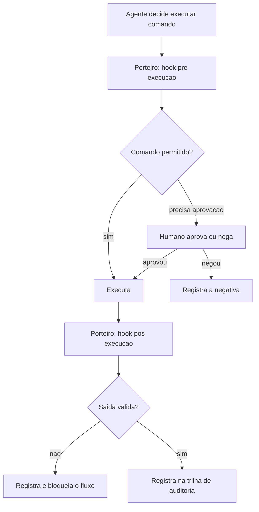

# Capítulo 13: Hooks e governança: as regras de segurança do canteiro

## 1. Introdução

No Capítulo 12 você montou a equipe de obra — subagentes especializados orquestrados pelo mestre. Equipes autônomas, porém, precisam de regras: o canteiro do Capítulo 6 ganhou a placa de regras, mas ainda falta o mecanismo que *faz* as regras serem cumpridas. Este é o território da **governança** — hooks, permissões e guardrails que transformam o contrato do manual em comportamento real do agente, a cada execução [1].

A autonomia do agente é uma escala, e a governança é o que define onde você se posiciona nela — do modo "aprova tudo" (máxima segurança, mínima velocidade) ao modo "executa dentro das regras" (velocidade alta, risco controlado). Este capítulo explica os mecanismos de governança dos harnesses modernos: hooks de eventos (pré-execução, pós-execução, pré-commit), permissões por comando e por arquivo, e o desenho de um sistema de aprovação que escala com a confiança [2]. Ao final, a TorreDeControle terá uma postura de governança definida — e você saberá exatamente qual alavanca puxar quando o agente pedir mais autonomia.

## 2. Explica

### O espectro da autonomia

Antes dos mecanismos, o modelo mental: a autonomia do agente não é binária — é um espectro com quatro estágios, e cada projeto (e cada fase de um projeto) tem o estágio certo:

1. **Supervisão total**: toda ação exige aprovação humana. Seguro, lento — ideal para as primeiras horas de um projeto novo ou para operações destrutivas.
2. **Aprovação seletiva**: ações seguras (ler, editar arquivos) são automáticas; ações arriscadas (executar comando, escrever fora do projeto) pedem aprovação. O equilíbrio padrão da maioria dos projetos.
3. **Autonomia com regras**: o agente executa dentro de um perímetro definido (arquivos, comandos, ferramentas permitidas) e só pede ajuda fora dele. Rápido — exige governança madura.
4. **Autonomia total com trilha**: o agente executa tudo, e tudo é registrado para auditoria posterior. A velocidade máxima — reservada para pipelines e ambientes com rastreamento completo [3].

A arte da governança é mover-se nesse espectro *conscientemente*: saber em que estágio você está, por quê, e o que precisa mudar para avançar com segurança. O erro clássico é saltar direto do estágio 1 ao 4 — "o agente agora é autônomo" — sem construir as proteções intermediárias [4].

### Hooks: os pontos de controle

O mecanismo central da governança é o **hook**: um ponto de controle onde o harness pausa a execução, executa uma lógica definida por você e decide se o fluxo continua. Os hooks mais importantes seguem o ciclo de vida da ação:

- **Pré-execução** (antes de um comando): valida se o comando é permitido, bloqueia destrutivos, injeta variáveis.
- **Pós-execução** (depois de um comando): verifica a saída, registra o resultado, falha se algo esperado não ocorreu.
- **Pré-commit / pré-push**: roda verificações (lint, testes rápidos) antes de o código entrar no diário de bordo [5].

O hook é a diferença entre regra *escrita* e regra *aplicada*. A placa do Capítulo 6 diz "nunca rode git push --force"; o hook é o guarda que impede fisicamente — não por confiança, mas por mecanismo [6].

### Permissões: o perímetro do agente

O segundo mecanismo é o sistema de **permissões**: a definição do que o agente pode tocar. As dimensões clássicas:

- **Por comando**: padrões de comando permitidos, negados ou que exigem aprovação (ex.: `git push` exige aprovação; `python -m pytest` é livre).
- **Por arquivo/pasta**: caminhos que o agente pode ler, escrever ou não tocar (ex.: `docs/` livre; `.env` proibido; `app/` livre com cuidado).
- **Por ferramenta**: quais tools MCP estão ativas, com quais escopos (o Capítulo 11 já estabeleceu o padrão de escopo mínimo).
- **Por duração**: aprovações que expiram (ex.: "permita os próximos 10 minutos"), evitando o acúmulo silencioso de permissões [7].

O desenho do perímetro é uma decisão de engenharia com trade-offs: perímetro apertado demais transforma o agente em um operário que pede ordem para cada parafuso; perímetro frouxo demais anula a governança. A regra prática: **permita o caminho feliz, exija aprovação no imprevisto** — as operações comuns (testar, compilar, editar) são livres; as incomuns ou irreversíveis (deploy, push, exclusão) exigem aprovação [8].

### A trilha de auditoria: o diário de bordo digital

O terceiro pilar é a **trilha de auditoria** — o registro completo das ações do agente: o que foi executado, quando, por quem (qual agente/sessão), com qual argumento e qual resultado. A trilha é o diário de bordo do canteiro em forma digital — e é ela que torna possível a governança *post hoc*: quando um incidente acontece, a trilha permite reconstruir exatamente o que ocorreu [9]. Sem trilha, a pergunta "o que o agente fez?" é respondida com "eu acho que..."; com trilha, é respondida com o registro.

A trilha também tem função preventiva: sabendo que tudo é registrado, o agente — e o humano — operam com mais cuidado. É o mesmo efeito das câmeras de segurança no canteiro: não substituem a regra, mas mudam o comportamento [10].

### Governança de subagentes e ferramentas

A governança se estende às duas extensões que você construiu: os subagentes do Capítulo 12 e as ferramentas do Capítulo 11. A regra é a herança com limites: os subagentes herdam o perímetro do mestre, mas com limites próprios definidos na especificação — um subagente-revisor que só lê não pode ganhar permissão de escrita por acidente. E as ferramentas, como você viu, têm o portão do Capítulo 11 — validação dupla e autorização por operação — que agora se integra à governança do harness: a tool é executável, mas a *chamada* dela pode exigir aprovação, dependendo da operação [11].

## 3. Ilustra

### O Porteiro do Canteiro

Volte ao canteiro. A placa de regras do Capítulo 6 diz o que é permitido — mas quem garante que a regra é cumprida é o **porteiro** da entrada. O porteiro tem uma lista: caminhões de concreto entram sem pedir (comandos livres), caminhões de combustível pedem assinatura (aprovação seletiva), e bombas de demolição nem chegam perto (comandos proibidos). O porteiro também registra tudo num caderno: hora de entrada, placa, destino — a trilha de auditoria.

O harness com governança é esse porteiro. Ele não confia no operário (o agente) nem na placa (o manual): ele aplica a regra por mecanismo, a cada entrada — e registra cada passagem. A diferença entre o canteiro com porteiro e sem porteiro é a diferença entre regra respeitada e regra desejada [12].



### O Porteiro que Deixa Todo Mundo Entrar: Por Que Autonomia Sem Governança é Caos

Aqui está o ponto contraintuitivo — a segunda camada de analogia. A primeira mostrou o porteiro. A segunda é sobre o erro mais caro da governança: dar autonomia sem o porteiro — e descobrir tarde demais.

Imagine um canteiro onde o mestre decide "vamos confiar nas equipes": tira o porteiro da entrada, diz que todos são profissionais e que a placa de regras "é autoexplicativa". Na primeira semana, tudo parece mais rápido — sem fila na entrada, sem caderno, sem aprovação. Na terceira semana, o desastre: um caminhão de combustível entrou "sem querer" na área de solda (o agente executou um comando que não devia), e o registro do que entrou e saiu — que não existe mais — torna a investigação um palpite. O canteiro não ficou mais rápido: ficou mais frágil, e a fragilidade cobrou a conta de uma vez [13].

Com agentes é idêntico: autonomia sem governança não é velocidade — é risco acumulado que vence de uma vez [14]. Como Mestre de Obras, a lição é dupla: a governança não trava a obra (o porteiro bem configurado não atrasa o caminhão de concreto), e a autonomia sem mecanismo é a decisão mais cara do canteiro — porque o mecanismo não existe quando você mais precisa dele [15].

## 4. Técnica

### Passo 1: O Mapa de Permissões da TorreDeControle

O primeiro passo é o mapa de permissões — o documento que registra o perímetro, e que serve de guia para configurar o harness. Este é o mapa inicial:

```markdown
# Mapa de Permissões — TorreDeControle

## Comandos livres (sem aprovação)
- python -m pytest tests/ -q
- python -m compileall app/
- python -m py_compile <arquivo>
- git status, git diff, git log, git add

## Comandos com aprovação
- git commit (quando a mensagem for automática, revisar antes)
- pip install <pacote> (registra em requirements.txt)
- python -m uvicorn app.api.main:app (inicia servidor)

## Comandos proibidos (nunca executar)
- git push --force
- rm -rf (fora do projeto)
- drop table / drop database
- qualquer comando com credencial inline

## Arquivos proibidos de leitura/escrita
- .env, .env.local (segredos)
- .git/ (internos)
- data/*.db (dados de produção, se existirem)

## Ferramentas MCP (escopos)
- banco_torrecontrole: somente banco de desenvolvimento.
- api_externa: somente escopos mínimos configurados.
```

O mapa é a fonte da verdade que você traduz para a configuração do harness — e que o revisor do Capítulo 15 audita [16].

### Passo 2: Configurando Hooks no Harness

O segundo passo é a configuração prática dos hooks. A sintaxe exata varia por harness, mas o padrão conceitual é este — hooks associados a eventos do ciclo de vida:

```json
{
  "hooks": {
    "PreToolUse": [
      {
        "matcher": "Bash(git push*)",
        "hook": "bloquear_push_forcado.sh",
        "stage": "pre_tool_use"
      },
      {
        "matcher": "Bash(python -m pytest*)",
        "hook": "registrar_pytest.sh",
        "stage": "post_tool_use"
      }
    ],
    "PreCommit": [
      {
        "matcher": "*",
        "hook": "verificacoes_pre_commit.sh"
      }
    ]
  }
}
```

O exemplo mostra três hooks: um que bloqueia push forçado antes de executar (comando proibido do mapa), um que registra a saída dos testes depois de executar (trilha), e um que roda verificações antes do commit (portão de qualidade). Cada hook é um script pequeno e determinístico — a mesma filosofia de verificação de toda a obra [17].

### Passo 3: O Hook de Bloqueio na Prática

O hook mais importante — o bloqueio de comandos destrutivos — na prática, como script executável:

```bash
#!/usr/bin/env bash
# bloquear_push_forcado.sh — Bloqueia git push --force (governanca RN-seg)
set -euo pipefail

COMANDO="$*"
PADROES_PROIBIDOS=("git push --force" "git push -f" "rm -rf /" "drop database")

for padrao in "${PADROES_PROIBIDOS[@]}"; do
  if [[ "$COMANDO" == *"$padrao"* ]]; then
    echo "BLOQUEADO: comando proibido detectado -> $padrao" >&2
    echo "Registre no diario e peca aprovacao humana explicita." >&2
    exit 1
  fi
done

echo "OK: comando permitido"
exit 0
```

O script é burro de propósito: ele não interpreta, não decide — apenas bloqueia padrões. Burrice determinística é a melhor segurança: nenhum julgamento falho, nenhuma exceção criativa [18].

### Passo 4: O Verificador de Governança

Para manter a governança saudável, o verificador — checa se o mapa de permissões e a configuração de hooks estão coerentes:

```python
# verificar_governanca.py — Verifica a sanidade da governanca do projeto
import json
import re
from pathlib import Path

ARQUIVO_MAPA = Path("docs/mapa_permissoes.md")
ARQUIVO_CONFIG = Path(".claude/settings.json")  # ou equivalente do harness

def mapa_existe() -> bool:
    """Confirma a existencia do mapa de permissoes."""
    return ARQUIVO_MAPA.exists()

def mapa_cobre_areas() -> list[str]:
    """Retorna as areas do mapa que faltam no documento."""
    if not ARQUIVO_MAPA.exists():
        return ["mapa inteiro ausente"]
    texto = ARQUIVO_MAPA.read_text(encoding="utf-8")
    areas = ["Comandos livres", "Comandos com aprovação", "Comandos proibidos",
             "Arquivos proibidos", "Ferramentas MCP"]
    return [a for a in areas if a not in texto]

def config_tem_hooks() -> tuple[bool, list[str]]:
    """Verifica se a config do harness declara hooks."""
    if not ARQUIVO_CONFIG.exists():
        return False, ["arquivo de config do harness ausente"]
    try:
        dados = json.loads(ARQUIVO_CONFIG.read_text(encoding="utf-8"))
        hooks = dados.get("hooks", {})
        if not hooks:
            return False, ["nenhum hook declarado na configuracao"]
        return True, []
    except json.JSONDecodeError:
        return False, ["config do harness com JSON invalido"]

def main() -> None:
    """Checklist de sanidade da governanca."""
    problemas: list[str] = []
    if not mapa_existe():
        problemas.append("docs/mapa_permissoes.md ausente")
    problemas += [f"mapa sem area: {a}" for a in mapa_cobre_areas()]
    tem_hooks, problemas_hooks = config_tem_hooks()
    problemas += problemas_hooks
    if not tem_hooks:
        problemas.append("governanca sem hooks (apenas mapa nao aplica regra)")
    if problemas:
        print("GOVERNANCA COM PROBLEMAS:")
        for p in problemas:
            print(f"  - {p}")
        return
    print("GOVERNANCA OK: mapa completo, hooks declarados e config valida")

if __name__ == "__main__":
    main()
```

Rode `verificar_governanca.py` — e o relatório diz se a governança está só *escrita* (mapa) ou *aplicada* (hooks). O verificador é o porteiro do porteiro [19].

### O Protocolo de Promoção de Autonomia

Para fechar, o protocolo de promoção — como mover o projeto no espectro de autonomia com segurança. A regra: autonomia é conquistada em etapas, nunca saltada:

1. **Comece no estágio 2** (aprovação seletiva): o caminho feliz livre, o imprevisto aprovado.
2. **Observe uma semana**: quais aprovações aparecem? Cada uma é um sinal — ou de perímetro apertado demais ou de operação que merece regra.
3. **Automatize o que é rotineiro**: uma aprovação que aparece toda hora vira regra (comando livre ou com aprovação automática).
4. **Promova para o estágio 3** (autonomia com regras) apenas quando: a trilha mostra zero incidentes, os hooks cobrem os destrutivos e os testes do Capítulo 14 passam.
5. **Revise trimestralmente**: o perímetro envelhece com o projeto; a revisão periódica impede o acúmulo de permissões fantasma [20].

## 5. Aplica

### A Cena de Contraste: O Push Forçado da Sexta-feira

Imagine a sexta-feira em que o projeto está atrasado e você decide "dar autonomia total ao agente para agilizar". Sem mapa de permissões, sem hooks — só o manual do Capítulo 6 pedindo cuidado. O agente, tentando "arrumar" um conflito de merge, decide executar `git push --force` — a placa dizia para não, mas ninguém aplicou a regra por mecanismo. A branch principal é sobrescrita, duas horas de commits de outra pessoa evaporam, e o resto do time só descobre na segunda-feira. A trilha não existe; a reconstrução é arqueológica.

O diagnóstico: autonomia concedida sem governança — o estágio 4 pulado de um salto [21]. A placa estava certa, mas placas não bloqueiam: mecanismos bloqueiam. O erro não foi do agente — foi do projeto que não o conteve.

A correção: você instala a governança completa — mapa de permissões, hook de bloqueio de push forçado, aprovação seletiva e trilha de auditoria — e roda `verificar_governanca.py`. Na semana seguinte, o mesmo agente tenta o mesmo push forçado; o hook bloqueia na pré-execução, registra a tentativa e pede aprovação humana. O incidente vira registro — e a autonomia volta a subir apenas pelo protocolo de promoção, etapa por etapa, com a trilha provando o histórico limpo [22].

### Armadilhas Comuns na Governança

- **Autonomia antes das proteções**: o erro mais caro. Primeiro hooks, permissões e trilha; depois autonomia [23].
- **Mapa sem hooks**: documento que não vira mecanismo é desejo. Regra só vale aplicada.
- **Permissões acumuladas**: aprovações antigas viram brecha. Expiração e revisão periódica.
- **Hook que interpreta demais**: guarda com julgamento falha. Bloqueio por padrão é burro de propósito — e seguro.
- **Trilha ausente**: sem registro, incidente vira mistério. Trilha de auditoria obrigatória.
- **Esquecer subagentes e tools na governança**: perímetro do mestre sem limites para a equipe. Subagente herda com limites; tool tem portão.

### Exercício Prático

Crie o `docs/mapa_permissoes.md` da TorreDeControle, configure os hooks de bloqueio (push forçado) e registro (pytest) no harness, rode `verificar_governanca.py` até OK e teste: peça ao agente um comando proibido e confirme o bloqueio pelo hook.

### Aprofundamento: O Protocolo de Incidente com Agente

A governança do Capítulo 13 não é só preventiva — ela define o que acontece *quando* um incidente ocorre apesar dos portões. O protocolo de incidente é a rotina que transforma o caos em processo, e ele tem uma versão com o agente no papel de investigador:

1. **Contenção (primeiros 5 minutos)**: o que precisa parar para limitar o dano? A trilha de auditoria do Capítulo 13 mostra as últimas ações do agente — a contenção começa pelo que a trilha revela. Não é hora de investigar em profundidade; é hora de limitar.
2. **Diagnóstico com agente (primeiras 2 horas)**: o agente investiga com o protocolo do Capítulo 19 — logs estruturados, métricas e o prompt de diagnóstico. As hipóteses saem com evidência e teste de confirmação, não com palpite.
3. **Correção pela rampa (nunca direto em produção)**: a correção passa pelo fluxo completo — fatia, testes, revisão, pipeline (Capítulos 7-17). A exceção só existe para contenção de dano ativo, e mesmo assim com registro.
4. **Verificação pela métrica**: o instrumento que apontou o problema mede a correção (Capítulo 19). Sem a métrica confirmando, o incidente não está encerrado.
5. **Aprendizado registrado**: o incidente vira entrada na memória do Capítulo 16 — o que aconteceu, por que, como prevenir. O prédio aprende com a manutenção.

O papel da governança no protocolo: a trilha de auditoria é o que torna o diagnóstico possível (sem registro, o passo 2 é arqueologia); o perímetro de permissões é o que limita o dano (o agente não alcança o que a governança não permite); e o hook de pré-execução é o que impede a correção de pular a rampa. A governança não é o que impede incidentes (isso é impossível): é o que transforma incidente em evento gerenciado, com custo mínimo e aprendizado máximo.

```bash
# Checklist do incidente em um comando:
# 1. Trilha revisada? 2. Hipoteses com evidencia? 3. Correcao pela rampa?
# 4. Metrica confirmou? 5. Aprendizado registrado?
```

## 6. Conclusão

Neste capítulo você instalou o porteiro do canteiro: entendeu o espectro da autonomia — da supervisão total à autonomia com trilha; aprendeu os três mecanismos de governança — hooks (pontos de controle), permissões (o perímetro) e trilha de auditoria (o diário digital); configurou o mapa de permissões, os hooks de bloqueio e o verificador; e dominou o protocolo de promoção — autonomia conquistada em etapas, nunca saltada [24]. A lição central: regra escrita não é regra aplicada — a governança é o mecanismo que transforma o contrato do manual em comportamento do agente.

Seu desafio: a governança da TorreDeControle completa — mapa, hooks, verificador OK e o teste de bloqueio de comando proibido passando.

No Capítulo 14, vamos provar que o prédio aguenta: testes dirigidos por IA — estratégia, geração e o CI de sintaxe que garante que todo código que entra no canteiro compila e passa.

## 7. Referências Bibliográficas

[1] CLOUD SECURITY ALLIANCE. *Agentic MCP Security Best Practices Guide*. Disponível em: https://labs.cloudsecurityalliance.org/agentic/agentic-mcp-security-best-practices-v1/. Acesso em: 07 ago. 2026.

[2] BUI, Nghi D. Q. *Building AI Coding Agents for the Terminal: Scaffolding, Harness, Context Engineering, and Lessons Learned*. Disponível em: https://arxiv.org/html/2603.05344v1. Acesso em: 07 ago. 2026.

[3] ANTHROPIC. *Building Effective AI Agents*. Disponível em: https://www.anthropic.com/research/building-effective-agents. Acesso em: 07 ago. 2026.

[4] VALUE ADD VC. *AI Coding Productivity Study Data: What METR, McKinsey, and GitHub Found in 2026*. Disponível em: https://valueaddvc.com/blog/ai-coding-productivity-study-data-what-metr-mckinsey-and-github-actually-found-in-2026. Acesso em: 07 ago. 2026.

[5] TERMDOCK. *SKILL.md vs CLAUDE.md vs AGENTS.md Compared*. Disponível em: https://www.termdock.com/blog/skill-md-vs-claude-md-vs-agents-md. Acesso em: 07 ago. 2026.

[6] DORA / GOOGLE CLOUD. *Publications and ROI of AI-assisted Software Development Report*. Disponível em: https://dora.dev/research/publications/. Acesso em: 07 ago. 2026.

[7] INVARIANT LABS. *MCP Security Notification: Tool Poisoning Attacks*. Disponível em: https://invariantlabs.ai/blog/mcp-security-notification-tool-poisoning-attacks. Acesso em: 07 ago. 2026.

[8] DATABRICKS. *What is an AI Agent Harness?* Disponível em: https://www.databricks.com/blog/ai-harness. Acesso em: 07 ago. 2026.

[9] JIN, Haolin et al. *From LLMs to LLM-based Agents for Software Engineering: A Survey of Current, Challenges and Future*. Disponível em: https://arxiv.org/abs/2408.02479. Acesso em: 07 ago. 2026.

[10] MIT SLOAN MANAGEMENT REVIEW. ANDERSON, Edward; PARKER, Geoffrey; TAN, Burcu. *The Hidden Costs of Coding With Generative AI*. Disponível em: https://sloanreview.mit.edu/article/the-hidden-costs-of-coding-with-generative-ai/. Acesso em: 07 ago. 2026.

[11] HE, Kang; ROY, Kaushik. *SWE-Adept: An LLM-Based Agentic Framework for Deep Codebase Analysis and Structured Issue Resolution*. Disponível em: https://arxiv.org/abs/2603.01327. Acesso em: 07 ago. 2026.

[12] IT REVOLUTION. *AI's Mirror Effect: How the 2025 DORA Report Reveals Your Organization's True Capabilities*. Disponível em: https://itrevolution.com/articles/ais-mirror-effect-how-the-2025-dora-report-reveals-your-organizations-true-capabilities/. Acesso em: 07 ago. 2026.

[13] WONG, Sherman et al. *Confucius Code Agent: Scalable Agent Scaffolding for Real-World Codebases*. Disponível em: https://arxiv.org/abs/2512.10398. Acesso em: 07 ago. 2026.

[14] DENG, Xiang et al. *SWE-Bench Pro: Can AI Agents Solve Long-Horizon Software Engineering Tasks?* Disponível em: https://arxiv.org/abs/2509.16941. Acesso em: 07 ago. 2026.

[15] CONNELL, Andrew. *My Thoughts on Vibe Coding vs. Agentic Engineering*. Disponível em: https://www.andrewconnell.com/articles/vibe-coding-vs-agentic-engineering/. Acesso em: 07 ago. 2026.

[16] AUGMENT CODE. *How to Build Your AGENTS.md (2026): The Context File That Makes AI Coding Agents Actually Work*. Disponível em: https://www.augmentcode.com/guides/how-to-build-agents-md. Acesso em: 07 ago. 2026.

[17] EXPLAINX.AI. *AI Coding Agent Evals on Real Repos (2026)*. Disponível em: https://explainx.ai/blog/ai-coding-agent-evals-real-repos-2026. Acesso em: 07 ago. 2026.

[18] SOFTJOURN. *AI Software Development Statistics 2026: Adoption, Productivity, and Risk*. Disponível em: https://softjourn.com/insights/ai-software-dev-stats. Acesso em: 07 ago. 2026.

[19] PRINCETON UNIVERSITY. *SWE-bench Verified & Pro*. Disponível em: https://www.swebench.com. Acesso em: 07 ago. 2026.

[20] GARTNER. *Gartner Identifies the Top Strategic Technology Trends for 2026*. Disponível em: https://www.gartner.com/en/newsroom/press-releases/2025-10-20-gartner-identifies-the-top-strategic-technology-trends-for-2026. Acesso em: 07 ago. 2026.

[21] BIRJOB. *AI Coding Agent Benchmarks Beyond SWE-Bench in 2026: Terminal-Bench, Aider Polyglot, GAIA, and Why the Leaderboard Lies*. Disponível em: https://www.birjob.com/blog/agent-benchmarks-2026. Acesso em: 07 ago. 2026.

[22] CODIHAUS. *AI Developer Productivity Data: 2X Faster, 55% Speed Gain, Enterprise ROI Analysis*. Disponível em: https://codihaus.com/news/ai-developer-productivity-data-engineering-leaders. Acesso em: 07 ago. 2026.

[23] MCKINSEY & COMPANY. *The State of AI: Global Survey*. Disponível em: https://www.mckinsey.com/capabilities/quantumblack/our-insights/the-state-of-ai. Acesso em: 07 ago. 2026.

[24] MODEL CONTEXT PROTOCOL. *Specification (2026-07-28)*. Disponível em: https://modelcontextprotocol.io/specification/2026-07-28. Acesso em: 07 ago. 2026.

[25] TAWOSI, Vali et al. *ALMAS: an Autonomous LLM-based Multi-Agent Software Engineering Framework*. Disponível em: https://arxiv.org/abs/2510.03463. Acesso em: 07 ago. 2026.
