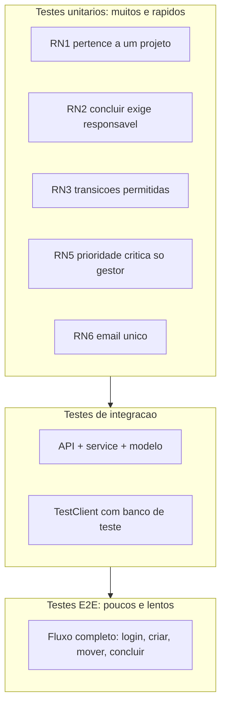

# Capítulo 14: Testes dirigidos por IA: provando que o prédio aguenta

## 1. Introdução

No Capítulo 13 você instalou a governança — o porteiro que aplica as regras do canteiro. Mas há uma categoria de regras que o porteiro não cobre: as regras de *comportamento* do software — "mover tarefa respeita RN3?", "criar tarefa exige responsável?", "a transição inválida retorna 422?". Essas regras são provadas por **testes automatizados**, e é aqui que o agente deixa de ser apenas construtor e vira também o provador da obra [1].

Este capítulo é o curso de testes dirigidos por IA: a estratégia de testes de um projeto agêntico, a geração de testes pelo agente a partir da especificação do Capítulo 7, e o CI de sintaxe — o portão automático que garante que todo código que entra no canteiro compila e passa nos testes antes de virar commit [2]. Ao final, a TorreDeControle terá uma suíte de testes cobrindo as regras de negócio RN1-RN7, gerada e revisada com o agente, e um pipeline local que barra código quebrado na origem.

## 2. Explica

### Por que testes são o coração do AIDD

A tese deste capítulo é direta: **testes são a ponte entre velocidade e confiança** — e sem eles, o AIDD é só vibe coding com outro nome. O agente gera código rápido; o teste é o que transforma "gerado" em "verificado" [3]. Você já viu essa tensão no Capítulo 1: código plausível que não funciona. O teste é o detector de plausibilidade — a vistoria que mede, em vez de acreditar.

Há uma segunda razão, específica do mundo agêntico: testes são a forma mais barata de *feedback* para o agente. Quando o agente implementa uma fatia, o teste diz "passou" ou "falhou" — e é esse sinal objetivo que alimenta o ciclo de iteração do Capítulo 4 [4]. Um agente sem testes itera às cegas; com testes, ele corrige o próprio trabalho contra um alvo mensurável. O teste é o instrumento de medida do canteiro — sem ele, ninguém sabe se a parede está no prumo.

### A pirâmide de testes do projeto agêntico

A estratégia de testes de um projeto AIDD segue a pirâmide clássica, adaptada ao fluxo:

- **Base — testes unitários**: testam funções e regras isoladas — cada RN da especificação vira um teste unitário. Rápidos, numerosos, são o feedback de primeira linha do agente.
- **Meio — testes de integração**: testam a interação entre camadas — a API chamando o service, o service usando o modelo. É o teste de "colunas + laje" do Capítulo 8.
- **Topo — testes de ponta a ponta**: testam o fluxo completo — login, criar tarefa, mover, concluir — via interface. Raros e lentos, provam a jornada do usuário [5].

A proporção importa: a maioria dos testes é unitária (rápida e barata), uma fatia de integração, e poucos E2E. O agente gera bem os três — mas o valor está nos unitários, porque são eles que validam as regras de negócio que você especificou no Capítulo 7 [6].

### Testes como especificação executável

O insight mais poderoso do capítulo: **os critérios de aceite da especificação são, na verdade, testes esperando para nascer**. Cada critério do Capítulo 7 ("transições inválidas retornam erro 422") é um teste unitário em potencial — e essa tradução é a atividade mais valiosa que você fará com o agente [7]. A especificação deixa de ser documento e vira comportamento verificável: o RF3 com seus cinco critérios de aceite gera cinco testes; os testes passando provam que o RF3 está cumprido.

Essa tradução também fecha o ciclo de rastreabilidade: a spec diz o que o sistema deve fazer, o teste prova que faz, e o código que passa no teste está conforme a spec. É o mesmo princípio de contrato que você viu no Capítulo 7 — agora com execução automática [8].

### O CI de sintaxe: o portão automático

O **CI de sintaxe** é o portão de qualidade no fluxo do Capítulo 13: um script que roda em todo commit (via hook de pré-commit ou no pipeline do Capítulo 17) e que barra a entrada de código que (1) não compila, (2) não passa nos testes, ou (3) viola regras simples de lint. O objetivo não é julgar estilo — é impedir que código quebrado entre no diário de bordo [9].

O CI de sintaxe é a materialização da filosofia de toda a obra: verificação determinística substitui suposição. Em vez de "eu acho que compila", o portão *prova* que compila — a cada commit, sem exceção, sem depender da memória de ninguém [10].

## 3. Ilustra

### A Prova de Carga do Canteiro

Volte ao canteiro. Antes de liberar um andar para uso, a obra passa por **provas de carga**: os engenheiros carregam o laje com sacos de areia até o limite calculado e medem a deformação. A prova não é opcional — é o que separa o prédio aprovado do prédio que "parecia pronto". Nenhum mestre entrega um andar sem a prova; nenhum engenheiro aceita "confia em mim" como relatório de carga.

Os testes são as provas de carga do software. O teste unitário é a prova de cada viga (a função aguenta o caso de borda?); o teste de integração é a prova do andar completo (as colunas e o laje trabalham juntos?); o teste E2E é a prova final de ocupação (o usuário consegue morar no prédio?). E o CI de sintaxe é o engenheiro que refaz as provas a cada mudança — sem esperar o dia da vistoria [11].



### O Prédio Aprovado na Aparência: Por Que Testes São a Vistoria

Aqui está o ponto contraintuitivo — a segunda camada de analogia. A primeira mostrou a prova de carga. A segunda é sobre a diferença entre a obra *inspecionada* e a obra *que parece inspecionada* — e por que a confiança na velocidade do agente é a armadilha.

Imagine dois prédios idênticos erguidos pelo mesmo tipo de operário rápido. No primeiro, cada laje passa por prova de carga antes do próximo andar; no segundo, o mestre confia nos operários ("eles são bons, olha a velocidade!") e o laje sobe sem prova. Os dois prédios ficam prontos no mesmo dia. Na primeira tempestade, o segundo prédio tem rachaduras — a argamassa de uma junta não aguentou, e ninguém sabia, porque ninguém mediu. O primeiro prédio passa incólume — porque a prova, feita na hora certa, pegou a junta fraca antes da tempestade [12].

Com código é idêntico: o agente rápido produz o mesmo "prédio" com e sem testes — a diferença aparece na primeira mudança, na primeira integração, no primeiro deploy [13]. Como Mestre de Obras, a lição é a mais cara do canteiro: a velocidade do construtor sem a vistoria do medidor não é progresso — é risco que a tempestade cobra. Testes são a prova de carga; CI é o engenheiro que nunca falta [14].

## 4. Técnica

### Passo 1: O Prompt de Geração de Testes

O primeiro passo é gerar testes com o agente — e o prompt segue o padrão de cinco partes do Capítulo 4, com a especificação como fonte. Este é o prompt para a suíte da RN3:

```markdown
## Papel e contexto
Você é o desenvolvedor de testes do projeto TorreDeControle (FastAPI),
com a especificação em docs/especificacao.md e as regras em AGENTS.md.

## Tarefa específica
Gere a suíte de testes unitários para a regra de negócio RN3 (transições de
status da tarefa), cobrindo todos os casos: transições válidas, inválidas
e estado terminal.

## Restrições e regras
- Use pytest e a estrutura de app/services.
- Não modifique código de produção; apenas crie o arquivo de teste.
- Nomeie os testes no padrão test_<regra>_<caso>.
- Cubra exatamente as transições da RN3 da especificação.

## Formato de saída
Arquivo tests/test_rn3_transicoes.py completo, com docstring e asserts.

## Critérios de aceite
1. python -m pytest tests/test_rn3_transicoes.py -q passa.
2. Todo caso de transição da RN3 tem um teste.
3. Cada teste verifica sucesso ou erro de forma explícita.
```

Execute e o agente entrega a suíte — mas a revisão é sua (protocolo do Capítulo 8): os casos cobrem a RN3 completa? Os testes testam a regra, não o caminho feliz? [15]

### Passo 2: A Suíte de Regras de Negócio

Este é o resultado esperado — a suíte unitária das regras RN1-RN7, gerada pelo agente e revisada por você. Exemplo dos testes mais críticos:

```python
# tests/test_rn3_transicoes.py — Testes da regra de transicao de status
import pytest

from app.services.mover_tarefa import mover_tarefa, Tarefa, Status

def test_rn3_a_fazer_para_em_andamento() -> None:
    """RN3: a_fazer -> em_andamento e transicao valida."""
    tarefa = Tarefa(id="t1", status=Status.A_FAZER, responsavel_id="u1")
    resultado = mover_tarefa("t1", Status.EM_ANDAMENTO, "u1", {"t1": tarefa})
    assert resultado["status"] == Status.EM_ANDAMENTO

def test_rn3_a_fazer_para_concluida_bloqueada() -> None:
    """RN3: a_fazer -> concluida e transicao invalida."""
    tarefa = Tarefa(id="t1", status=Status.A_FAZER, responsavel_id="u1")
    with pytest.raises(ValueError):
        mover_tarefa("t1", Status.CONCLUIDA, "u1", {"t1": tarefa})

def test_rn3_em_andamento_para_a_fazer_permitida() -> None:
    """RN3: em_andamento -> a_fazer e permitida (volta na fila)."""
    tarefa = Tarefa(id="t1", status=Status.EM_ANDAMENTO, responsavel_id="u1")
    resultado = mover_tarefa("t1", Status.A_FAZER, "u1", {"t1": tarefa})
    assert resultado["status"] == Status.A_FAZER

def test_rn3_concluida_e_terminal() -> None:
    """RN3: concluida e estado terminal; nenhuma transicao sai dela."""
    tarefa = Tarefa(id="t1", status=Status.CONCLUIDA, responsavel_id="u1")
    with pytest.raises(ValueError):
        mover_tarefa("t1", Status.EM_ANDAMENTO, "u1", {"t1": tarefa})

def test_rn2_concluir_sem_responsavel_bloqueada() -> None:
    """RN2: concluir tarefa sem responsavel e bloqueado."""
    tarefa = Tarefa(id="t1", status=Status.EM_ANDAMENTO, responsavel_id=None)
    with pytest.raises(ValueError):
        mover_tarefa("t1", Status.CONCLUIDA, "u1", {"t1": tarefa})
```

Cada teste é um critério de aceite da especificação traduzido em código — a spec executável do Capítulo 7 ganhando vida [16].

### Passo 3: O CI de Sintaxe Local

O terceiro passo é o portão de qualidade — o script que roda em todo commit (chamado pelo hook de pré-commit do Capítulo 13) e barra código quebrado:

```bash
#!/usr/bin/env bash
# ci_sintaxe.sh — Portao de qualidade: compila, testa e verifica estrutura
set -euo pipefail

echo "== 1/3: compilacao =="
python -m compileall -q app/ || { echo "FALHOU: erro de sintaxe em app/"; exit 1; }

echo "== 2/3: testes =="
python -m pytest tests/ -q || { echo "FALHOU: testes nao passam"; exit 1; }

echo "== 3/3: estrutura =="
python scripts/verificar_esqueleto.py > /dev/null || { echo "FALHOU: estrutura invalida"; exit 1; }

echo "== PORTAO OK: codigo pronto para commit =="
```

O script é determinístico e burro de propósito: ou o portão abre (exit 0) ou fecha (exit 1) — sem espaço para "quase" [17].

### Passo 4: O Verificador de Cobertura de Regras

Para garantir que a suíte cobre as regras — e não apenas "existe" — o verificador de cobertura de regras:

```python
# verificar_cobertura_testes.py — Verifica se as RNs tem testes correspondentes
import re
from pathlib import Path

ARQUIVO_SPEC = Path("docs/especificacao.md")
DIRETORIO_TESTES = Path("tests")

def extrair_regras() -> list[str]:
    """Extrai os identificadores de regra de negocio da especificacao."""
    if not ARQUIVO_SPEC.exists():
        return []
    texto = ARQUIVO_SPEC.read_text(encoding="utf-8")
    return sorted(set(re.findall(r"RN\d+", texto)))

def regras_sem_teste(regras: list[str]) -> list[str]:
    """Retorna as regras sem nenhum teste referenciando-as."""
    arquivos = list(DIRETORIO_TESTES.glob("test_*.py"))
    corpo = "\n".join(f.read_text(encoding="utf-8") for f in arquivos)
    return [r for r in regras if r not in corpo and r.lower() not in corpo.lower()]

def main() -> None:
    """Checklist de cobertura: toda RN tem teste?"""
    regras = extrair_regras()
    if not regras:
        print("Nenhuma regra RN encontrada na especificacao")
        return
    sem_teste = regras_sem_teste(regras)
    print(f"Regras na especificacao: {len(regras)}")
    print(f"Regras sem teste: {sem_teste or 'nenhuma'}")
    if sem_teste:
        print("COBERTURA INCOMPLETA: gere testes para as regras sinalizadas")
        return
    print("COBERTURA OK: toda regra de negocio tem teste")

if __name__ == "__main__":
    main()
```

Rode `verificar_cobertura_testes.py` — e a cobertura é prova, não impressão [18].

### O Protocolo TDD com Agente

Para fechar, o protocolo de desenvolvimento dirigido por testes com agente — o ciclo completo que o time usa a partir de agora:

1. **Escrever o teste primeiro**: traduzir o critério de aceite do Capítulo 7 em teste (vermelho — o teste falha porque a feature não existe).
2. **Pedir ao agente para implementar**: o prompt de cinco partes com o teste como critério de aceite ("o código deve passar neste teste").
3. **Rodar até verde**: o agente itera até o teste passar — o feedback objetivo do Capítulo 4 guiando a correção.
4. **Revisar e refatorar**: a revisão dirigida do Capítulo 8 + limpeza.
5. **Commitar com o portão**: o CI de sintaxe abre e o commit entra no diário [19].

O ciclo vermelho-verde com agente é a versão agêntica do TDD clássico — e é o que mantém a qualidade da obra enquanto a velocidade sobe.

## 5. Aplica

### A Cena de Contraste: O Deploy Sem Prova de Carga

Imagine o projeto com a primeira versão pronta e o deploy agendado — mas os testes foram "deixados para depois" porque o agente entregava rápido demais. O agente implementou a feature de mover tarefa; você testou "na mão" no navegador uma vez, funcionou, e seguiu. No deploy, o fluxo de produção falha na primeira transição: a RN3 não valida o caso de borda (mover direto de a_fazer para concluida), um usuário real clica, e a tarefa some do quadro. O incidente vira bug de produção — e o fix em produção é dez vezes mais caro que o teste que o teria pegado.

O diagnóstico: o "teste na mão" não é teste — é vibe testing. Sem a suíte da RN3 e sem o CI de sintaxe, a plausibilidade passou no lugar da verificação [20]. O erro não foi do agente (implementou o que a falta de teste permitiu): foi do projeto que não exigiu a prova.

A correção: você adota o protocolo TDD com agente — teste primeiro, implementação dirigida pelo teste, portão no commit. O mesmo bug, na semana seguinte, é pego pelo teste `test_rn3_a_fazer_para_concluida_bloqueada` antes de chegar ao deploy [21]. A lição: o teste que falta é o bug que sobra — e o CI é o guardião que impede o "vai dar certo" de entrar no diário de bordo.

### Armadilhas Comuns em Testes com IA

- **Testes que testam o caminho feliz**: a suíte passa, mas não cobre as regras. Cobertura de RNs é verificada pelo script.
- **Testes gerados sem revisão**: o agente pode gerar testes frouxos (asserts que sempre passam). Revisão dirigida obrigatória.
- **Vibe testing**: "testei na mão, funcionou" não é verificação. Teste automatizado ou não é teste [22].
- **CI de sintaxe ausente**: sem o portão, código quebrado entra no diário. Hook de pré-commit + pipeline.
- **Testes lentos demais**: suíte lenta desencoraja o uso. Pirâmide correta: muitos unitários rápidos, poucos E2E.
- **Esquecer que teste é spec**: teste desalinhado da especificação engana. Todo critério de aceite vira teste; todo teste rastreia um critério [23].

### Exercício Prático

Gere com o agente (prompt de cinco partes) a suíte de testes de RN1-RN7, revise cada teste contra os critérios do Capítulo 7, rode `verificar_cobertura_testes.py` até cobertura OK, configure o hook de pré-commit chamando `ci_sintaxe.sh` e confirme: um teste falhando bloqueia o commit.

### Aprofundamento: O Painel de Testes do Projeto

Uma suíte de testes sem painel é invisível — e o invisível não se mantém. O painel de testes é o registro vivo do que está coberto, o que está verde e o que regrediu. Este é o formato mínimo do painel da TorreDeControle:

```markdown
# Painel de Testes — TorreDeControle (atualizado a cada fatia)

## Regras de negócio (RN)
| RN | Teste | Status |
|---|---|---|
| RN1 | test_rn1_tarefa_sem_projeto_falha | verde |
| RN2 | test_rn2_concluir_sem_responsavel_bloqueada | verde |
| RN3 | test_rn3_transicoes (5 casos) | verde |
| RN4 | test_rn4_alteracao_gera_atividade | verde |
| RN5 | test_rn5_critica_so_gestor | verde |
| RN6 | test_rn6_email_unico | verde |
| RN7 | test_rn7_concluida_sem_movimentacao | verde |

## Camadas
- Unitários (models/services): 28 testes, todos verdes.
- Integração (API): 12 testes, todos verdes.
- E2E (fluxo completo): 3 testes, todos verdes.

## Regressões conhecidas
- Nenhuma.

## Próximos testes a criar
- Cobertura de erro do endpoint de autenticação (RF1).
```

O painel tem três usos: (1) *para o agente* — ele consulta o painel antes de mudar código e sabe o que não pode quebrar; (2) *para o revisor* — o Capítulo 15 usa o painel como entrada da auditoria de cobertura; (3) *para você* — a leitura do painel é a primeira coisa da semana, como o relatório DORA do Capítulo 19. O painel não substitui os testes: é a visibilidade que os mantém vivos.

```bash
# Regenera o painel em um comando: roda a suite e conta por arquivo
python -m pytest tests/ -q 2>&1 | tail -3
```

## 6. Conclusão

Neste capítulo você provou que o prédio aguenta: entendeu por que testes são o coração do AIDD — a ponte entre velocidade e confiança; dominou a pirâmide de testes (unitários, integração, E2E) e a tradução de critérios de aceite em testes; construiu a suíte de RN1-RN7 com o agente; e instalou o CI de sintaxe — o portão determinístico que barra código quebrado na origem [24]. A lição central: o teste que falta é o bug que sobra — e a prova de carga é inegociável antes da entrega das chaves.

Seu desafio: a suíte de RN1-RN7 completa e verde, `verificar_cobertura_testes.py` aprovando e o commit bloqueado por um teste falhando — provando o portão de verdade.

No Capítulo 15, vamos subir o nível da inspeção: a revisão de código autônoma — agentes revisores e auditorias determinísticas que examinam a obra inteira antes da integração.

## 7. Referências Bibliográficas

[1] EXPLAINX.AI. *AI Coding Agent Evals on Real Repos (2026)*. Disponível em: https://explainx.ai/blog/ai-coding-agent-evals-real-repos-2026. Acesso em: 07 ago. 2026.

[2] DORA / GOOGLE CLOUD. *Publications and ROI of AI-assisted Software Development Report*. Disponível em: https://dora.dev/research/publications/. Acesso em: 07 ago. 2026.

[3] CONNELL, Andrew. *My Thoughts on Vibe Coding vs. Agentic Engineering*. Disponível em: https://www.andrewconnell.com/articles/vibe-coding-vs-agentic-engineering/. Acesso em: 07 ago. 2026.

[4] PRINCETON UNIVERSITY. *SWE-bench Verified & Pro*. Disponível em: https://www.swebench.com. Acesso em: 07 ago. 2026.

[5] DENG, Xiang et al. *SWE-Bench Pro: Can AI Agents Solve Long-Horizon Software Engineering Tasks?* Disponível em: https://arxiv.org/abs/2509.16941. Acesso em: 07 ago. 2026.

[6] HE, Kang; ROY, Kaushik. *SWE-Adept: An LLM-Based Agentic Framework for Deep Codebase Analysis and Structured Issue Resolution*. Disponível em: https://arxiv.org/abs/2603.01327. Acesso em: 07 ago. 2026.

[7] AUGMENT CODE. *Vibe Coding vs Spec-Driven Development (2026): When to Use Each*. Disponível em: https://www.augmentcode.com/guides/vibe-coding-vs-spec-driven-development. Acesso em: 07 ago. 2026.

[8] VALUE ADD VC. *AI Coding Productivity Study Data: What METR, McKinsey, and GitHub Found in 2026*. Disponível em: https://valueaddvc.com/blog/ai-coding-productivity-study-data-what-metr-mckinsey-and-github-actually-found-in-2026. Acesso em: 07 ago. 2026.

[9] BUI, Nghi D. Q. *Building AI Coding Agents for the Terminal: Scaffolding, Harness, Context Engineering, and Lessons Learned*. Disponível em: https://arxiv.org/html/2603.05344v1. Acesso em: 07 ago. 2026.

[10] BIRJOB. *AI Coding Agent Benchmarks Beyond SWE-Bench in 2026: Terminal-Bench, Aider Polyglot, GAIA, and Why the Leaderboard Lies*. Disponível em: https://www.birjob.com/blog/agent-benchmarks-2026. Acesso em: 07 ago. 2026.

[11] MIT SLOAN MANAGEMENT REVIEW. ANDERSON, Edward; PARKER, Geoffrey; TAN, Burcu. *The Hidden Costs of Coding With Generative AI*. Disponível em: https://sloanreview.mit.edu/article/the-hidden-costs-of-coding-with-generative-ai/. Acesso em: 07 ago. 2026.

[12] WONG, Sherman et al. *Confucius Code Agent: Scalable Agent Scaffolding for Real-World Codebases*. Disponível em: https://arxiv.org/abs/2512.10398. Acesso em: 07 ago. 2026.

[13] JIN, Haolin et al. *From LLMs to LLM-based Agents for Software Engineering: A Survey of Current, Challenges and Future*. Disponível em: https://arxiv.org/abs/2408.02479. Acesso em: 07 ago. 2026.

[14] IT REVOLUTION. *AI's Mirror Effect: How the 2025 DORA Report Reveals Your Organization's True Capabilities*. Disponível em: https://itrevolution.com/articles/ais-mirror-effect-how-the-2025-dora-report-reveals-your-organizations-true-capabilities/. Acesso em: 07 ago. 2026.

[15] CODIHAUS. *AI Developer Productivity Data: 2X Faster, 55% Speed Gain, Enterprise ROI Analysis*. Disponível em: https://codihaus.com/news/ai-developer-productivity-data-engineering-leaders. Acesso em: 07 ago. 2026.

[16] SOFTJOURN. *AI Software Development Statistics 2026: Adoption, Productivity, and Risk*. Disponível em: https://softjourn.com/insights/ai-software-dev-stats. Acesso em: 07 ago. 2026.

[17] GARTNER. *Gartner Identifies the Top Strategic Technology Trends for 2026*. Disponível em: https://www.gartner.com/en/newsroom/press-releases/2025-10-20-gartner-identifies-the-top-strategic-technology-trends-for-2026. Acesso em: 07 ago. 2026.

[18] MCKINSEY & COMPANY. *The State of AI: Global Survey*. Disponível em: https://www.mckinsey.com/capabilities/quantumblack/our-insights/the-state-of-ai. Acesso em: 07 ago. 2026.

[19] TAWOSI, Vali et al. *ALMAS: an Autonomous LLM-based Multi-Agent Software Engineering Framework*. Disponível em: https://arxiv.org/abs/2510.03463. Acesso em: 07 ago. 2026.

[20] MODEL CONTEXT PROTOCOL. *Specification (2026-07-28)*. Disponível em: https://modelcontextprotocol.io/specification/2026-07-28. Acesso em: 07 ago. 2026.

[21] AUGMENT CODE. *How to Build Your AGENTS.md (2026): The Context File That Makes AI Coding Agents Actually Work*. Disponível em: https://www.augmentcode.com/guides/how-to-build-agents-md. Acesso em: 07 ago. 2026.

[22] CLOUD SECURITY ALLIANCE. *Agentic MCP Security Best Practices Guide*. Disponível em: https://labs.cloudsecurityalliance.org/agentic/agentic-mcp-security-best-practices-v1/. Acesso em: 07 ago. 2026.

[23] INVARIANT LABS. *MCP Security Notification: Tool Poisoning Attacks*. Disponível em: https://invariantlabs.ai/blog/mcp-security-notification-tool-poisoning-attacks. Acesso em: 07 ago. 2026.

[24] DATABRICKS. *What is an AI Agent Harness?* Disponível em: https://www.databricks.com/blog/ai-harness. Acesso em: 07 ago. 2026.
