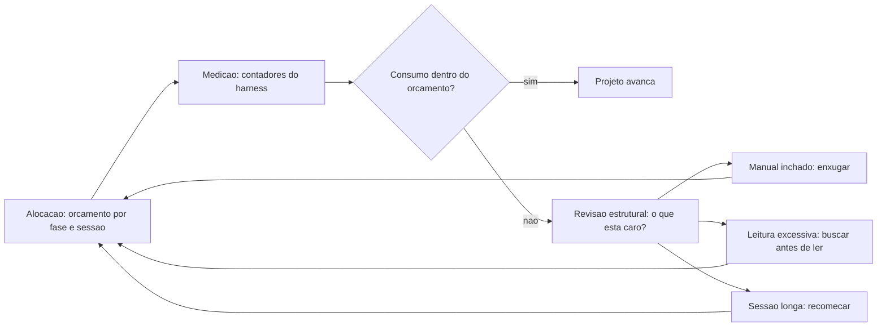

# Capítulo 16: Economia de tokens: gerenciando o orçamento da obra

## 1. Introdução

No Capítulo 15 você montou a comissão de vistoria — revisão autônoma em duas camadas. A obra está quase pronta, mas há um custo que percorre cada etapa e que, ignorado, pode inviabilizar o projeto inteiro: o **custo dos tokens**. Cada conversa com o agente, cada arquivo lido, cada sessão longa consome tokens — e em projetos de meses, com dezenas de agentes, o orçamento de tokens é uma restrição de engenharia tão real quanto memória ou tempo de processamento [1].

Este capítulo é o curso de economia severa de contexto: por que tokens importam (custo, latência, qualidade); as técnicas de compressão — comunicação telegráfica, leitura enxuta, logs com cabeça e cauda, memória persistente; e o orçamento de tokens do projeto — medir, planejar e manter projetos longos viáveis [2]. Ao final, a TorreDeControle terá um orçamento de tokens explícito e um repertório de técnicas que você vai usar em toda a sua carreira agêntica.

## 2. Explica

### Por que tokens são a moeda do AIDD

Tokens são as unidades que os modelos processam: cada palavra, cada trecho de código, cada saída consome tokens. Três dimensões fazem deles a moeda central do desenvolvimento agêntico:

1. **Custo financeiro**: você paga por token — entrada e saída. Sessões longas com contexto inflado custam dinheiro real, e o Gartner já alerta que os gastos corporativos com tokens estão escalando rapidamente, com abandonos de iniciativas mal governadas [3].
2. **Latência**: quanto mais tokens no contexto, mais lenta é cada resposta. Projetos que não economizam contexto ficam progressivamente mais lentos — a degradação que você viu no context rot, agora com dimensão de custo.
3. **Qualidade**: tokens de ruído degradam o raciocínio — o Lost in the Middle do Capítulo 5 tem causa e efeito econômicos: pagar caro para o modelo raciocinar pior [4].

A mentalidade correta: **token é recurso de projeto, como memória e CPU** — e se gerencia com orçamento, medição e otimização, não com esperança.

### A economia do contexto: o que custa mais

Para economizar, é preciso saber onde o dinheiro (e o contexto) vai. Os três maiores consumidores típicos:

- **Contexto permanente inchado**: cada linha do AGENTS.md/CLAUDE.md custa em toda sessão — o imposto permanente do Capítulo 6. O maior ganho de economia vem de enxugar o que é sempre carregado.
- **Arquivos lidos sem necessidade**: ler arquivos inteiros quando um trecho bastaria (o Nível 3 vazado do Capítulo 5). O custo de leitura é o mais fácil de eliminar: buscar antes de ler, ler só o necessário.
- **Sessões longas com histórico acumulado**: o histórico de conversa cresce a cada interação e é reenviado a cada passo. Sessões longas são as mais caras por token produtivo — a higiene do Capítulo 5 tem efeito financeiro [5].

A regra dos três maiores: enxugar o permanente, ler só o necessário, recomeçar sessões.

### As técnicas de compressão

A economia severa se apoia em cinco técnicas, que você vai aplicar a partir de agora:

1. **Comunicação telegráfica**: instruções curtas, sem preâmbulos, sem palavras de cortesia — "grep antes de read", "3 linhas de pensamento" — o sinal sem o ruído [6].
2. **Busca antes de leitura**: procurar (grep) antes de abrir arquivos; ler assinaturas antes de corpos; ler fatias em vez de arquivos inteiros.
3. **Logs com cabeça e cauda**: quando uma saída é longa, registrar apenas o topo e o fim — as 3 primeiras e as 4 últimas linhas — capturando o essencial sem o meio redundante.
4. **Memória persistente externa**: decisões, erros resolvidos e padrões vão para arquivos de memória (o diário do Capítulo 5), não para o histórico da sessão — aprendizado que não custa re-leitura.
5. **Delegação comprimida**: subagentes (Capítulo 12) retornam resultados compactos, não transcrições — a paralelização também economiza contexto [7].

Cada técnica troca conveniência por contexto — e o trade é quase sempre favorável: a conveniência perdida é de leitura (barata de recuperar), o contexto economizado é de custo recorrente [8].

### O orçamento de tokens do projeto

A última peça conceitual é o **orçamento**: um número explícito de tokens por tarefa, por dia e por fase, com medição e revisão. O orçamento tem três partes:

1. **Alocação**: quanto cabe em cada fase — especificação, implementação, revisão — e quanto em cada sessão.
2. **Medição**: registrar o consumo real (o harness expõe contadores) e comparar com a alocação.
3. **Revisão**: quando o consumo estoura, o motivo é um problema de contexto (manual inchado? leitura excessiva?) — e o fix é estrutural, não moral [9].

O orçamento transforma a economia de "boa intenção" em "métrica de projeto" — a mesma filosofia determinística de toda a obra aplicada ao dinheiro da obra.

## 3. Ilustra

### O Orçamento do Canteiro

Volte ao canteiro. Nenhuma obra séria começa sem orçamento: quanto de concreto, quanto de aço, quanto de hora-homem — e cada fornada de concreto custa. O mestre não decide "usar mais concreto porque está aí": ele tem a planilha, sabe quanto custou cada etapa e sabe quando o orçamento estourou. O orçamento não trava a obra — ele torna a obra possível, porque evita a parada por falta de verba no meio da construção.

Os tokens são o concreto do canteiro agêntico. Cada sessão é uma fornada, cada contexto é a quantidade misturada, e o orçamento é a planilha que mantém a obra viável até a entrega. O mestre que ignora o orçamento não constrói mais rápido: constrói até parar — e a parada por estouro de tokens no meio do projeto é a mais cara de todas [10].



### A Obra que Parou no Meio: Por Que Orçamento é Inegociável

Aqui está o ponto contraintuitivo — a segunda camada de analogia. A primeira mostrou a planilha do orçamento. A segunda é sobre a diferença entre economizar *de propósito* e economizar *por acidente* — e por que a primeira é viável e a segunda inviabiliza.

Imagine duas obras idênticas. A primeira tem planilha: o mestre sabe que a fundação consome X, a estrutura Y, e reservou Z para imprevistos. Quando uma etapa estoura, ele ajusta outra antes do desastre. A segunda obra não tem planilha: o mestre "só constrói" — e na terceira semana descobre que o cimento acabou no meio da estrutura, porque ninguém contava o consumo. A obra para, a equipe fica parada, e reiniciar custa mais do que planejar custaria [11].

Com tokens é idêntico: economizar por acidente é estourar por acidente. A obra que "só constrói" descobre o estouro no meio do projeto — quando o contexto está caro, a sessão lenta e o orçamento exaurido [12]. Como Mestre de Obras, a disciplina é a mesma do concreto: medir antes de misturar, orçar antes de construir, ajustar antes de parar. O orçamento não é papelada — é a garantia de a obra chegar à entrega [13].

## 4. Técnica

### Técnica 1: Comunicação Telegráfica

A primeira técnica é o estilo de comunicação com o agente — o equivalente ao caveman dos fluxos de economia severa. O princípio: **instruções curtas, sem preâmbulo, com o verbo no início**:

```markdown
# Em vez de:
"Olá! Tudo bem? Eu estava pensando se você poderia, por favor, dar uma
olhada no arquivo de modelos e ver se tem alguma coisa que precise de
ajuste, se não for muito incômodo..."

# Use:
"grep de 'Status' em app/models; liste assinaturas; aponte Enums fora do padrao."
```

A economia vem de duas frentes: menos tokens de entrada (sem cortesia, sem preâmbulo) e menos tokens de saída (instrução precisa gera resposta precisa). A regra de ouro: **se a instrução cabe em 2 linhas, não use 5** [14].

### Técnica 2: Busca Antes de Leitura

A segunda técnica é o protocolo de leitura — o maior consumidor evitável de tokens:

```python
# leitura_enxuta.py — Protocolo de leitura: buscar antes de ler
# Exemplo de fluxo de economia: procurar o simbolo antes de abrir o arquivo
from pathlib import Path

def buscar(termo: str, diretorio: str = "app") -> list[str]:
    """Simula uma busca: retorna arquivo:linha das ocorrencias do termo.

    Na pratica, usa-se o grep do harness (muito mais barato que abrir
    arquivos inteiros). Aqui, demonstramos o protocolo de decisao.
    """
    ocorrencias: list[str] = []
    for arquivo in Path(diretorio).rglob("*.py"):
        try:
            linhas = arquivo.read_text(encoding="utf-8").splitlines()
        except OSError:
            continue
        for i, linha in enumerate(linhas, 1):
            if termo in linha:
                ocorrencias.append(f"{arquivo}:{i}: {linha.strip()[:80]}")
    return ocorrencias[:10]

def main() -> None:
    """Exemplo: buscar o uso de 'Status' antes de ler qualquer arquivo."""
    resultado = buscar("Status")
    if not resultado:
        print("Nenhuma ocorrencia: nao abra arquivos a toa.")
        return
    for linha in resultado:
        print(linha)
    print("Leia apenas os arquivos das linhas acima, e apenas as regioes.")

if __name__ == "__main__":
    main()
```

O protocolo tem três degraus de economia: buscar antes de ler (grep), ler assinaturas antes de corpos, ler fatias em vez de arquivos. Cada degrau evita tokens de leitura desnecessários [15].

### Técnica 3: Logs com Cabeça e Cauda

A terceira técnica é a compressão de saídas longas — logs, relatórios, saídas de comandos:

```python
# comprimir_log.py — Comprime saidas longas: 3 linhas do topo + 4 do fim
import sys
from pathlib import Path

def comprimir(texto: str, topo: int = 3, cauda: int = 4) -> str:
    """Retorna as primeiras linhas e as ultimas de um texto longo.

    O meio redundante e descartado: para logs e saidas de comando, o
    essencial (inicio e fim) costuma bastar para o diagnostico.
    """
    linhas = [l for l in texto.splitlines() if l.strip()]
    if len(linhas) <= topo + cauda:
        return texto
    cabeca = "\n".join(linhas[:topo])
    fim = "\n".join(linhas[-cauda:])
    return f"{cabeca}\n... ({len(linhas) - topo - cauda} linhas omitidas) ...\n{fim}"

def main() -> None:
    """Exemplo: comprime um log grande para o diagnostico enxuto."""
    log = "\n".join(f"linha {i}: evento simulado" for i in range(1, 101))
    print(comprimir(log))

if __name__ == "__main__":
    main()
```

A regra do headroom: **logs e saídas acima de 7 linhas entram comprimidos no contexto** — 3 do topo, 4 do fim. O meio é onde mora a redundância [16].

### Técnica 4: Memória Persistente Externa

A quarta técnica é a memória que não custa releitura — o aprendizado que sobrevive às sessões:

```markdown
# docs/memoria.md — Aprendizados persistentes do projeto

## Erros resolvidos (nao repetir)
- 2026-08-05: transicao de Status deve validar RN3 no service, nao no handler.
  Sintoma: 422 chegava depois do efeito colateral. Fix: validar antes de
  qualquer escrita.

## Decisoes arquiteturais (nao re-abrir)
- 2026-08-03: domínio pydantic puro, sem ORM, até definir o banco (Cap. 18).

## Padroes descobertos (reutilizar)
- Rota nova: sempre via skill adicionar-rota-api (testes + schema no mesmo arquivo).

## Dicionario do projeto
- "responsavel" = Usuario atribuido à tarefa. NUNCA usar "dono" como sinonimo.
```

A memória externa é o diário do Capítulo 5 em formato de aprendizado: erros resolvidos, decisões tomadas, padrões descobertos. Cada entrada economiza a re-descoberta — e a re-descoberta é o consumo de tokens mais caro do projeto, porque repete análise já feita [17].

### Técnica 5: O Orçamento na Prática

A quinta técnica é o orçamento mensurável — o script que acompanha o consumo e sinaliza o estouro:

```python
# orcamento_tokens.py — Acompanha o orcamento de tokens do projeto
from dataclasses import dataclass
from pathlib import Path

@dataclass
class Fase:
    nome: str
    orcado: int
    gasto: int = 0

FASES = [
    Fase("especificacao", 40_000),
    Fase("implementacao", 300_000),
    Fase("revisao", 100_000),
    Fase("deploy", 60_000),
]
ORCAMENTO_TOTAL = sum(f.orcado for f in FASES)

def registrar_gasto(fase: str, tokens: int) -> None:
    """Registra o gasto de uma fase no arquivo de controle."""
    arquivo = Path("docs/orcamento_tokens.jsonl")
    arquivo.parent.mkdir(parents=True, exist_ok=True)
    with arquivo.open("a", encoding="utf-8") as f:
        f.write(f'{{"fase": "{fase}", "tokens": {tokens}}}\n')

def relatorio() -> None:
    """Imprime o relatorio de orcamento: gasto por fase vs orcado."""
    gastos: dict[str, int] = {}
    arquivo = Path("docs/orcamento_tokens.jsonl")
    if arquivo.exists():
        for linha in arquivo.read_text(encoding="utf-8").splitlines():
            if "fase" in linha:
                fase = linha.split('"fase": "')[1].split('"')[0]
                tokens = int(linha.split('"tokens": ')[1].rstrip("}"))
                gastos[fase] = gastos.get(fase, 0) + tokens
    total = 0
    print("ORCAMENTO DE TOKENS:")
    for fase in FASES:
        gasto = gastos.get(fase.nome, 0)
        total += gasto
        pct = round(100 * gasto / fase.orcado) if fase.orcado else 0
        status = "OK" if gasto <= fase.orcado else "ESTOUROU"
        print(f"  {fase.nome:<16} {gasto:>9,} / {fase.orcado:>9,} ({pct}%) {status}")
    pct_total = round(100 * total / ORCAMENTO_TOTAL) if ORCAMENTO_TOTAL else 0
    print(f"  {'TOTAL':<16} {total:>9,} / {ORCAMENTO_TOTAL:>9,} ({pct_total}%)")

def main() -> None:
    """Exibe o relatorio; registrar gastos via registrar_gasto()."""
    relatorio()

if __name__ == "__main__":
    main()
```

O orçamento é a planilha do canteiro: gasto por fase, percentual, sinalização de estouro. A medição transforma a economia em métrica [18].

### O Protocolo de Economia de Sessão

Para fechar, o protocolo completo de economia — o checklist que você roda mentalmente antes de cada sessão:

1. O manual (Nível 1) está enxuto? Se cresceu, enxugue antes de trabalhar.
2. Vou buscar antes de ler? (grep → assinaturas → fatias).
3. Esta tarefa cabe numa sessão curta? Se não, divida.
4. Decisões serão registradas na memória externa, não no histórico?
5. O orçamento da fase está saudável? (`orcamento_tokens.py`).

Cinco perguntas, dois minutos, e a sessão trabalha no sinal, não no ruído [19].

## 5. Aplica

### A Cena de Contraste: O Projeto que Estourou no Meio

Imagine a TorreDeControle na décima semana — e a fatura da plataforma de IA chega três vezes maior que o orçamento do mês. Você abre a sessão e percebe o padrão: o AGENTS.md cresceu para 8 mil tokens (impulso de "documentar tudo"), cada tarefa lê três arquivos inteiros quando bastava um trecho, e as sessões ficam abertas por horas acumulando histórico. O projeto está lento (latência do contexto inflado), caro (tokens queimando) e — o pior — a qualidade degradou (o Lost in the Middle do Capítulo 5 cobrando a conta) [20].

O diagnóstico: nenhuma técnica de economia foi aplicada — o consumo cresceu por acidente, e o acidente virou fatura. O Gartner avisou: gastos com tokens sem governança levam ao abandono de iniciativas [21]. A obra estava "construindo sem planilha".

A correção: você aplica o protocolo de economia — enxuga o AGENTS.md para o essencial não inferível, adota busca antes de leitura, sessões curtas com memória externa e o `orcamento_tokens.py` rodando semanalmente. Na décima primeira semana, a fatura cai pela metade, a latência volta ao normal e a qualidade acompanha. A obra não ficou menor: ficou enxuta — e enxuta é como obras chegam à entrega [22].

### Armadilhas Comuns na Economia de Tokens

- **Economizar na especificação**: enxugar o Capítulo 7 para poupar tokens é economizar no lugar errado — ambiguidade custa mais na implementação. A economia está no contexto, não na planta [23].
- **Manual inchado persistente**: o imposto permanente cresce silenciosamente. Enxugue periodicamente (Capítulo 6).
- **Sessões infinitas**: a sessão longa é a mais cara por token produtivo. Recomece com memória externa.
- **Ler tudo antes de buscar**: a leitura é o maior consumo evitável. Busque, leia assinaturas, leia fatias.
- **Orçamento sem medição**: orçar sem medir é desejo. `orcamento_tokens.py` roda com frequência.
- **Economia que degrada a qualidade**: compressão que corta o essencial (especificação, regras) é falsa economia. Corte ruído, nunca sinal [24].

### Exercício Prático

Enxugue o AGENTS.md da TorreDeControle até o essencial não inferível, adote o protocolo de leitura (buscar antes de ler) numa tarefa real, configure o `orcamento_tokens.py` com as fases do projeto e registre os gastos da semana. Compare a fatura e a latência antes e depois.

### Aprofundamento: As Cinco Perguntas de Economia por Tarefa

A economia de tokens não é um regime único — é uma decisão por tarefa. Antes de cada sessão, as cinco perguntas que decidem quanto contexto você vai gastar:

1. **Esta tarefa é de leitura ou de escrita?** Leitura (explorar, entender, diagnosticar) pode ser mais barata: use busca antes de leitura, leia assinaturas, peça resumos. Escrita (implementar, refatorar) precisa de mais contexto de qualidade — mas só do essencial.
2. **Qual é o menor contexto que resolve?** Para cada arquivo que você pensa em carregar, pergunte: o agente precisa do arquivo inteiro ou de uma fatia? Um trecho relevante custa 10% do arquivo inteiro.
3. **A sessão atual já tem histórico útil?** Sessões longas acumulam contexto que você já pagou. Se o histórico da sessão está cheio de iterações antigas, recomeçar com o estado resumido é mais barato que continuar.
4. **Esta decisão vai se repetir?** Se sim, registre na memória externa agora — para não pagar a re-descoberta na próxima vez. A memória é o investimento que paga juros compostos negativos de contexto.
5. **Qual é o orçamento da fase?** Confira o `orcamento_tokens.py`: a fase está saudável? Se está perto do limite, priorize as tarefas de maior valor e adie o resto.

As cinco perguntas são o protocolo de sessão do Capítulo 16 em forma de checklist — e elas funcionam porque transformam a economia de um princípio abstrato em uma decisão concreta a cada tarefa. Com o tempo, as perguntas viram automáticas: você olha para uma tarefa e já sabe o custo de contexto dela, como o mestre olha para uma etapa da obra e já sabe o consumo de material.

```bash
# Triagem de uma tarefa em um comando:
# Leitura -> grep antes de read | Escrita -> contexto essencial + testes
# Se a resposta da pergunta 3 for "sim", recomece a sessao com resumo.
```

## 6. Conclusão

Neste capítulo você assumiu o orçamento da obra: entendeu por que tokens são a moeda do AIDD — custo, latência e qualidade; dominou as cinco técnicas de economia severa — comunicação telegráfica, busca antes de leitura, logs com cabeça e cauda, memória persistente externa e orçamento mensurável; e aplicou tudo ao projeto com o protocolo de sessão enxuta [25]. A lição central: token é recurso de projeto — economizar por acidente é estourar por acidente, e a obra que chega à entrega é a que mede, orça e ajusta.

Seu desafio: o AGENTS.md enxuto, o protocolo de leitura adotado e o `orcamento_tokens.py` rodando com a primeira semana registrada.

No Capítulo 17, vamos preparar a entrega: build reproduzível, CI/CD e pipelines — o caminho do código ao deploy com gates automatizados de qualidade.

## 7. Referências Bibliográficas

[1] GARTNER. *Gartner Identifies the Top Strategic Technology Trends for 2026*. Disponível em: https://www.gartner.com/en/newsroom/press-releases/2025-10-20-gartner-identifies-the-top-strategic-technology-trends-for-2026. Acesso em: 07 ago. 2026.

[2] TASKADE. *Context Engineering: What It Is + How to Do It (2026)*. Disponível em: https://www.taskade.com/blog/context-engineering. Acesso em: 07 ago. 2026.

[3] SOURCEGRAPH. *Context Engineering: A Practical Guide for AI Agents (2026)*. Disponível em: https://sourcegraph.com/blog/context-engineering. Acesso em: 07 ago. 2026.

[4] ZIEMINSKI, Karo. *Context Engineering for Product Builders: The 2026 Operating Manual*. Disponível em: https://karozieminski.substack.com/p/context-engineering-product-builders-guide-2026. Acesso em: 07 ago. 2026.

[5] BUI, Nghi D. Q. *Building AI Coding Agents for the Terminal: Scaffolding, Harness, Context Engineering, and Lessons Learned*. Disponível em: https://arxiv.org/html/2603.05344v1. Acesso em: 07 ago. 2026.

[6] HUß, Roland. *What Goes in AGENTS.md (and What Doesn't)*. Disponível em: https://ro14nd.de/what-goes-in-agents-md/. Acesso em: 07 ago. 2026.

[7] AUGMENT CODE. *How to Build Your AGENTS.md (2026): The Context File That Makes AI Coding Agents Actually Work*. Disponível em: https://www.augmentcode.com/guides/how-to-build-agents-md. Acesso em: 07 ago. 2026.

[8] TERMDOCK. *SKILL.md vs CLAUDE.md vs AGENTS.md Compared*. Disponível em: https://www.termdock.com/blog/skill-md-vs-claude-md-vs-agents-md. Acesso em: 07 ago. 2026.

[9] IT REVOLUTION. *AI's Mirror Effect: How the 2025 DORA Report Reveals Your Organization's True Capabilities*. Disponível em: https://itrevolution.com/articles/ais-mirror-effect-how-the-2025-dora-report-reveals-your-organizations-true-capabilities/. Acesso em: 07 ago. 2026.

[10] VALUE ADD VC. *AI Coding Productivity Study Data: What METR, McKinsey, and GitHub Found in 2026*. Disponível em: https://valueaddvc.com/blog/ai-coding-productivity-study-data-what-metr-mckinsey-and-github-actually-found-in-2026. Acesso em: 07 ago. 2026.

[11] MCKINSEY & COMPANY. *The State of AI: Global Survey*. Disponível em: https://www.mckinsey.com/capabilities/quantumblack/our-insights/the-state-of-ai. Acesso em: 07 ago. 2026.

[12] WONG, Sherman et al. *Confucius Code Agent: Scalable Agent Scaffolding for Real-World Codebases*. Disponível em: https://arxiv.org/abs/2512.10398. Acesso em: 07 ago. 2026.

[13] JIN, Haolin et al. *From LLMs to LLM-based Agents for Software Engineering: A Survey of Current, Challenges and Future*. Disponível em: https://arxiv.org/abs/2408.02479. Acesso em: 07 ago. 2026.

[14] DENG, Xiang et al. *SWE-Bench Pro: Can AI Agents Solve Long-Horizon Software Engineering Tasks?* Disponível em: https://arxiv.org/abs/2509.16941. Acesso em: 07 ago. 2026.

[15] HE, Kang; ROY, Kaushik. *SWE-Adept: An LLM-Based Agentic Framework for Deep Codebase Analysis and Structured Issue Resolution*. Disponível em: https://arxiv.org/abs/2603.01327. Acesso em: 07 ago. 2026.

[16] EXPLAINX.AI. *AI Coding Agent Evals on Real Repos (2026)*. Disponível em: https://explainx.ai/blog/ai-coding-agent-evals-real-repos-2026. Acesso em: 07 ago. 2026.

[17] PRINCETON UNIVERSITY. *SWE-bench Verified & Pro*. Disponível em: https://www.swebench.com. Acesso em: 07 ago. 2026.

[18] BIRJOB. *AI Coding Agent Benchmarks Beyond SWE-Bench in 2026: Terminal-Bench, Aider Polyglot, GAIA, and Why the Leaderboard Lies*. Disponível em: https://www.birjob.com/blog/agent-benchmarks-2026. Acesso em: 07 ago. 2026.

[19] CODIHAUS. *AI Developer Productivity Data: 2X Faster, 55% Speed Gain, Enterprise ROI Analysis*. Disponível em: https://codihaus.com/news/ai-developer-productivity-data-engineering-leaders. Acesso em: 07 ago. 2026.

[20] MIT SLOAN MANAGEMENT REVIEW. ANDERSON, Edward; PARKER, Geoffrey; TAN, Burcu. *The Hidden Costs of Coding With Generative AI*. Disponível em: https://sloanreview.mit.edu/article/the-hidden-costs-of-coding-with-generative-ai/. Acesso em: 07 ago. 2026.

[21] SOFTJOURN. *AI Software Development Statistics 2026: Adoption, Productivity, and Risk*. Disponível em: https://softjourn.com/insights/ai-software-dev-stats. Acesso em: 07 ago. 2026.

[22] CONNELL, Andrew. *My Thoughts on Vibe Coding vs. Agentic Engineering*. Disponível em: https://www.andrewconnell.com/articles/vibe-coding-vs-agentic-engineering/. Acesso em: 07 ago. 2026.

[23] AUGMENT CODE. *Vibe Coding vs Spec-Driven Development (2026): When to Use Each*. Disponível em: https://www.augmentcode.com/guides/vibe-coding-vs-spec-driven-development. Acesso em: 07 ago. 2026.

[24] DATABRICKS. *What is an AI Agent Harness?* Disponível em: https://www.databricks.com/blog/ai-harness. Acesso em: 07 ago. 2026.

[25] MODEL CONTEXT PROTOCOL. *Specification (2026-07-28)*. Disponível em: https://modelcontextprotocol.io/specification/2026-07-28. Acesso em: 07 ago. 2026.
