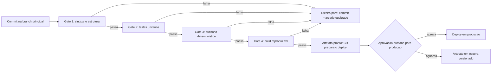

# Capítulo 17: Preparando a entrega: build, CI/CD e pipelines

## 1. Introdução

No Capítulo 16 você assumiu o orçamento da obra — a economia de tokens que mantém projetos longos viáveis. A TorreDeControle está com a fundação, a estrutura, as instalações e a qualidade prontas. Falta o que separa um software de um produto: o **caminho do código até o usuário** — o build reproduzível, a integração contínua e o pipeline de entrega. É aqui que o canteiro ganha a rampa de entrega: o caminho padronizado pelo qual cada fatia aprovada sai do depósito e chega ao destino final [1].

Este capítulo constrói essa rampa: o build que qualquer máquina pode reproduzir; o CI/CD com gates automatizados — os portões que o Capítulo 14 instalou no local, agora em escala de pipeline; e o desenho do pipeline da TorreDeControle, do commit ao artefato pronto para o deploy. Ao final, cada commit na branch principal dispara a esteira de qualidade automaticamente — e a obra só avança quando todos os portões abrem [2].

## 2. Explica

### Build reproduzível: o mesmo prédio em qualquer canteiro

A primeira peça da entrega é o **build reproduzível**: o processo de gerar o artefato executável — o pacote, a imagem, o bundle — que produz o mesmo resultado em qualquer máquina, em qualquer dia. A reprodutibilidade é o que o DORA chama de base da entrega confiável: se o build depende do laptop de alguém, a entrega depende do laptop de alguém — e laptops quebram, mudam e desaparecem [3].

Três elementos garantem a reprodutibilidade:

1. **Dependências fixadas**: as versões exatas de cada biblioteca, registradas num arquivo de lock — nunca "instale a última versão", sempre "instale a versão X registrada". O lock é a receita exata do prédio.
2. **Ambiente declarado**: o que o build precisa — runtime, variáveis, ferramentas — declarado num arquivo de configuração, não na memória de quem roda o build.
3. **Entrada única e verificável**: o build é função do código + config — mesmo commit, mesmo ambiente, mesmo artefato. Sem estado escondido, sem "funciona na minha máquina" [4].

A regra de ouro da reprodutibilidade: **se você não consegue reconstruir o artefato a partir do repositório, você não tem um artefato — tem um acidente**. O build reproduzível é o que transforma "deu certo uma vez" em "dá certo sempre" [5].

### CI: a integração contínua como esteira de qualidade

A **integração contínua (CI)** é a prática de integrar cada mudança ao tronco principal continuamente — em vez de acumular mudanças e integrar "quando estiver tudo pronto" (a integração que sempre explode). No fluxo agêntico, a CI tem um papel ainda mais central: é o portão que recebe o código gerado pelo agente e prova — a cada commit — que ele não quebrou nada [6].

O pipeline de CI é uma esteira de verificações, em ordem de custo (as baratas primeiro, para falhar cedo e barato):

1. **Sintaxe e estrutura**: o código compila (o `ci_sintaxe.sh` do Capítulo 14, agora na esteira).
2. **Testes unitários**: a suíte rápida de regras de negócio.
3. **Testes de integração**: API + service + modelo.
4. **Auditoria determinística**: cobertura, duplicação, consistência (o auditor do Capítulo 15).
5. **Empacotamento**: o build reproduzível gera o artefato.

Cada etapa é um **gate**: se falha, a esteira para e o commit é marcado como quebrado — o código nem chega ao repositório principal sem os portões abertos [7]. A esteira é a versão em escala do porteiro do Capítulo 13: não confia, mede.

### CD: a entrega contínua como rampa de deploy

A **entrega contínua (CD)** estende a esteira até a rampa: o artefato aprovado é preparado para deploy — empacotado, versionado, pronto — e o deploy em si pode ser automático (entrega contínua com deploy contínuo) ou com aprovação (entrega contínua com deploy manual). A distinção importa: a esteira garante que o artefato *pode* ir a produção; a governança do Capítulo 13 decide *quando* ele vai [8].

No fluxo da TorreDeControle, o desenho é: CI roda em todo commit; CD prepara o artefato quando a branch principal passa; e o deploy para produção exige aprovação — o estágio 2 do espectro de autonomia, que você promoveu com consciência no Capítulo 13 [9].

### Gates automatizados: a cadeia de portões

A soma de tudo são os **gates automatizados**: a cadeia de condições que uma mudança precisa atravessar antes de virar entrega. Cada gate é uma verificação determinística — e a cadeia é o que permite velocidade com segurança: o agente pode gerar rápido, mas a esteira garante que só o que passa chega ao usuário [10]. Os gates principais da cadeia:

1. **Gate de sintaxe**: compila.
2. **Gate de testes**: a suíte passa.
3. **Gate de auditoria**: sem duplicação grosseira, terminologia consistente, cobertura de regras.
4. **Gate de revisão**: o veredito do Capítulo 15 — APROVADO ou APROVADO COM RESSALVAS.
5. **Gate de build**: o artefato é produzido e verificável.

A cadeia é o que o DORA chama de "deslocar a detecção para a esquerda": o erro é pego no ponto mais barato da cadeia — e o ponto mais barato é o primeiro [11].

## 3. Ilustra

### A Rampa de Entrega do Canteiro

Volte ao canteiro. Quando o prédio está pronto para os acabamentos, a obra constrói a **rampa de entrega**: o caminho padronizado pelo qual material, móveis e equipamentos sobem do depósito até cada andar. A rampa não é um corredor qualquer: tem largura certa para o palete padrão, piso antiderrapante, e cada trecho é inspecionado antes de o material subir. Sem a rampa, cada entrega é uma improvisação — e cada improvisação é um risco de queda.

O pipeline de CI/CD é essa rampa. O código não sobe "pela escada, se der": ele sobe pela rampa — o caminho padronizado com inspeção em cada trecho [12]. O commit entra no depósito, sobe pela esteira de verificações (os trechos inspecionados) e chega ao andar do deploy apenas se cada trecho foi aprovado. A rampa transforma a entrega de improviso em rotina — e rotina é o que torna a entrega confiável e rápida ao mesmo tempo.



### A Escada Improvisada: Por Que Gates São a Rampa

Aqui está o ponto contraintuitivo — a segunda camada de analogia. A primeira mostrou a rampa de entrega. A segunda é sobre a diferença entre a rampa inspecionada e a escada improvisada — e por que a escada parece mais rápida até a primeira queda.

Imagine duas obras entregando móveis ao 10º andar. A primeira construiu a rampa: o palete sobe pelo caminho padrão, inspecionado em cada trecho, e qualquer trecho danificado para a entrega até o conserto. A segunda entrega pela escada: cada funcionário sobe com o móvel nas costas — parece mais rápido no primeiro dia, porque não gastou tempo construindo a rampa. Na segunda semana, um móvel cai da escada, quebra e atinge quem estava embaixo: a "economia" da escada vira o custo do acidente, mais o conserto, mais a parada [13].

Com CI/CD é idêntico: o pipeline parece burocracia até o dia em que o código quebrado chega ao usuário — e a "economia" de não ter portões vira o custo do incidente [14]. Como Mestre de Obras, a rampa não é papelada: é a garantia de que o material sobe inteiro — e que, se algo está danificado, a esteira para *antes* da queda, no trecho onde o dano nasceu [15].

## 4. Técnica

### Passo 1: Fixando as Dependências do Build

O primeiro passo é a reprodutibilidade: fixar as dependências da TorreDeControle num arquivo de lock. O `requirements.txt` do Capítulo 8 ganha versões exatas, e um segundo arquivo registra o hash da árvore completa:

```bash
# 1. Gere o lock a partir do requirements.txt (versoes exatas resolvidas)
#    (na pratica: pip freeze > requirements.lock.txt num ambiente limpo)
cat > requirements.lock.txt << 'EOF'
fastapi==0.115.0
uvicorn==0.30.0
pydantic==2.9.0
pytest==8.3.0
httpx==0.27.0
EOF

# 2. O build declara o ambiente: runtime + como instalar
cat > Dockerfile << 'EOF'
FROM python:3.12-slim

WORKDIR /app

# Instala apenas as dependencias fixadas (reproducibilidade)
COPY requirements.lock.txt .
RUN pip install --no-cache-dir -r requirements.lock.txt

# Copia o codigo da aplicacao
COPY app/ ./app/
COPY frontend/ ./frontend/

# Comando padrao de execucao
CMD ["uvicorn", "app.api.main:app", "--host", "0.0.0.0", "--port", "8000"]
EOF
```

O `Dockerfile` é o ambiente declarado: a imagem começa da mesma base, instala as mesmas versões e roda o mesmo comando — em qualquer máquina, qualquer dia. A receita exata do prédio, versionada no repositório [16].

### Passo 2: O Pipeline de CI em YAML

O segundo passo é o pipeline de CI — a esteira declarada num arquivo de configuração. Este é o pipeline da TorreDeControle para a plataforma de CI (GitHub Actions ou equivalente):

```yaml
name: ci-torrecontrole

on:
  push:
    branches: [main]
  pull_request:
    branches: [main]

jobs:
  qualidade:
    runs-on: ubuntu-latest
    steps:
      - name: checkout
        uses: actions/checkout@v4

      - name: setup python
        uses: actions/setup-python@v5
        with:
          python-version: "3.12"

      - name: instalar dependencias fixadas
        run: pip install -r requirements.lock.txt

      - name: gate 1 - sintaxe e estrutura
        run: |
          python -m compileall -q app/
          python scripts/verificar_esqueleto.py

      - name: gate 2 - testes unitarios e de integracao
        run: python -m pytest tests/ -q

      - name: gate 3 - auditoria deterministica
        run: python scripts/auditar_repositorio.py

      - name: gate 4 - build do artefato
        run: |
          docker build -t torrecontrole:${{ github.sha }} .
          echo "artefato construido com sucesso"
```

Cada `run` é um gate: se falha, o job falha e o commit é marcado. A esteira é declarada — qualquer pessoa pode ver o que acontece a cada commit, sem depender de quem configurou [17].

### Passo 3: O Verificador do Pipeline Local

Para que a esteira não seja só remota, o mesmo fluxo roda localmente — o verificador que espelha os gates do CI:

```bash
#!/usr/bin/env bash
# pipeline_local.sh — Espelha os gates do CI localmente
set -euo pipefail

echo "== GATE 1: sintaxe e estrutura =="
python -m compileall -q app/
python scripts/verificar_esqueleto.py

echo "== GATE 2: testes =="
python -m pytest tests/ -q

echo "== GATE 3: auditoria =="
python scripts/auditar_repositorio.py

echo "== GATE 4: build (verificacao de dependencias) =="
pip check

echo "== PIPELINE LOCAL OK: todos os gates abertos =="
```

O `pipeline_local.sh` é o ensaio do canteiro: antes de commitar, você roda os mesmos portões que a esteira remota vai rodar — e descobre o problema no ensaio, não no palco [18].

### Passo 4: O Empaquetador do Artefato

O quarto passo é o empacotamento — a produção do artefato entregável, com versão e verificação de integridade:

```python
# empacotar_artefato.py — Empacota o artefato da TorreDeControle
import hashlib
import json
from datetime import date
from pathlib import Path

def gerar_manifiesto() -> dict:
    """Gera o manifest do artefato: versao, arquivos e hashes."""
    arquivos = sorted(
        list(Path("app").rglob("*.py")) + list(Path("frontend").rglob("*"))
    )
    hashes = {}
    for arquivo in arquivos:
        if arquivo.is_file():
            digest = hashlib.sha256(arquivo.read_bytes()).hexdigest()
            hashes[str(arquivo)] = digest[:16]
    return {
        "projeto": "torrecontrole",
        "versao": f"1.0.0-{date.today().isoformat()}",
        "arquivos": len(hashes),
        "hashes": hashes,
    }

def main() -> None:
    """Gera o manifest e salva junto ao artefato."""
    manifest = gerar_manifiesto()
    destino = Path("dist")
    destino.mkdir(exist_ok=True)
    (destino / "manifest.json").write_text(
        json.dumps(manifest, ensure_ascii=False, indent=2), encoding="utf-8"
    )
    print(f"Artefato manifestado: {manifest['versao']} com {manifest['arquivos']} arquivos")
    print("Verifique a integridade antes do deploy: compare os hashes no destino.")

if __name__ == "__main__":
    main()
```

O manifest é a etiqueta do palete: versão, arquivos e hashes que permitem verificar, em qualquer ponto da rampa, que o artefato chegou inteiro [19].

### Passo 5: O Teste do Pipeline Completo

O quinto passo é a prova da esteira: um script que simula o caminho completo — commit, gates, artefato — e confirma que cada portão funciona de verdade:

```python
# testar_pipeline.py — Prova os gates do pipeline local
import subprocess
import sys

GATES = [
    ("gate 1 - sintaxe", ["python", "-m", "compileall", "-q", "app"]),
    ("gate 2 - testes", ["python", "-m", "pytest", "tests/", "-q"]),
    ("gate 3 - auditoria", ["python", "scripts/auditar_repositorio.py"]),
    ("gate 4 - dependencias", ["pip", "check"]),
]

def rodar_gates() -> None:
    """Roda todos os gates em ordem e para no primeiro que falhar."""
    for nome, comando in GATES:
        print(f"== {nome} ==")
        resultado = subprocess.run(comando, capture_output=True, text=True)
        if resultado.returncode != 0:
            print(resultado.stdout[-800:])
            print(resultado.stderr[-400:])
            print(f"FALHOU no {nome}: esteira interrompida")
            sys.exit(1)
        print("OK")
    print("ESTEIRA COMPLETA: todos os gates abertos, artefato pronto")

def main() -> None:
    rodar_gates()

if __name__ == "__main__":
    main()
```

O teste do pipeline é a prova de carga da rampa: a esteira inteira rodando de uma vez, com o primeiro gate que falhar parando tudo — exatamente como em produção [20].

### O Protocolo de Entrega Contínua

Para fechar, o protocolo de entrega — como uma mudança viaja do commit ao artefato:

1. **Commit em branch de feature** (ou direto na main para o fluxo do projeto): o CI roda os gates em todo push.
2. **Aprovação da revisão**: o veredito do Capítulo 15 — APROVADO ou com ressalvas registradas.
3. **Merge para a main**: a esteira roda de novo; se tudo abre, o build gera o artefato.
4. **CD prepara o deploy**: o artefato é versionado e manifestado.
5. **Aprovação do deploy**: a governança do Capítulo 13 decide quando o artefato vai a produção.
6. **Deploy e observação**: o Capítulo 19 acompanha o que aconteceu [21].

## 5. Aplica

### A Cena de Contraste: O Build do Laptop do João

Imagine a TorreDeControle prestes a ser entregue — e o deploy agendado para sexta-feira. O build "funciona" apenas no laptop do João: foi ele que configurou as dependências na sua máquina, na sua versão do Python, com uma biblioteca instalada "de brincadeira" que o requirements.txt não registra. Na quinta, o João fica doente. O deploy para: ninguém reproduz o build, o requirements.txt é incompleto, e a sexta vira uma reconstituição arqueológica — "o que o João tinha instalado?" — enquanto o produto espera.

O diagnóstico: build não reproduzível — o artefato dependia do laptop de uma pessoa [22]. A entrega não tinha rampa; tinha a escada do João, e a escada desapareceu com ele.

A correção: você adota a cadeia completa — requirements.lock.txt com versões fixas, Dockerfile declarando o ambiente, pipeline de CI com os quatro gates e o manifest do artefato. Na semana seguinte, qualquer máquina reproduz o build: mesmo commit, mesmo lock, mesmo artefato — e o deploy não depende de quem está presente [23]. A lição: build que depende de máquina não é build — é acidente esperando para acontecer; a rampa versionada é o que torna a entrega independente de pessoa.

### Armadilhas Comuns em Build e CI/CD

- **Dependências flutuantes**: "instale a última versão" quebra o build no dia seguinte. Lock com versões exatas.
- **Build na máquina local**: se o build só roda no seu laptop, a entrega depende do seu laptop. Container ou ambiente declarado.
- **CI sem gates**: esteira que roda testes mas ignora falhas é decorativa. Cada gate falho para a esteira [24].
- **Pipeline não espelhado localmente**: descobrir o erro no CI remoto custa ciclos. `pipeline_local.sh` ensaia antes.
- **Artefato sem manifest**: sem versão e hashes, ninguém verifica a integridade na rampa. Manifest obrigatório.
- **Deploy sem aprovação**: a CD automática sem o portão da governança salta o estágio de autonomia. Aprovação antes de produção (Capítulo 13).

### Exercício Prático

Crie o `requirements.lock.txt` e o `Dockerfile` da TorreDeControle, escreva o pipeline de CI com os quatro gates, rode `testar_pipeline.py` até a esteira completa passar e gere o manifest do artefato com `empacotar_artefato.py`. Registre no diário o caminho completo do commit ao artefato.

### Aprofundamento: Estratégias de Deploy (Blue-Green e Canário)

O pipeline do Capítulo 17 entrega o artefato — mas a forma como o artefato entra em produção tem estratégias, e as duas mais importantes para o seu repertório são o deploy blue-green e o deploy canário:

**Deploy Blue-Green**: duas versões do ambiente convivem — a azul (atual) e a verde (nova). O roteador aponta para a azul; quando a verde passa nos testes, o roteador troca o tráfego para a verde; se algo der errado, o roteador volta para a azul em segundos. O rollback do Capítulo 18 vira uma troca de roteador, não um redeploy. O custo: dois ambientes mantidos — o preço da reversão instantânea.

**Deploy Canário**: a versão nova recebe uma fração do tráfego (1%, depois 10%, depois 50%) enquanto as métricas do Capítulo 19 monitoram. Se a taxa de erro sobe, o canário é cortado e o tráfego volta para a versão estável. O custo: mais complexidade de roteamento — o preço da validação com tráfego real.

| Estratégia | Reversão | Validação com tráfego real | Complexidade |
|---|---|---|---|
| Blue-green | Instantânea (troca de roteador) | Limitada (tudo de uma vez) | Média |
| Canário | Rápida (corta a fração) | Gradual (percentual crescente) | Alta |
| Redeploy simples | Lenta (redeploy da anterior) | Nenhuma | Baixa |

A decisão de estratégia segue a matriz de risco: para a TorreDeControle em início de operação, o blue-green com aprovação humana (o gate do Capítulo 13) é o equilíbrio certo — reversão instantânea sem a complexidade do roteamento percentual. O canário entra quando o tráfego cresce e o custo de uma falha total supera a complexidade do roteamento. A regra que une tudo: a estratégia de deploy é uma decisão de risco, não de moda — e as métricas do Capítulo 19 são o instrumento que decide quando mudar de estratégia.

## 6. Conclusão

Neste capítulo você construiu a rampa de entrega da obra: entendeu o build reproduzível — a receita exata que qualquer máquina refaz; dominou a integração contínua — a esteira de gates que prova cada commit; aprendeu a entrega contínua — a preparação do artefato com aprovação de deploy; e montou a cadeia completa — lock, Dockerfile, pipeline, manifest e o teste da esteira [25]. A lição central: a rampa transforma a entrega de improviso em rotina — e a rotina inspecionada é o que permite ao agente gerar rápido sem quebrar o usuário.

Seu desafio: a esteira completa da TorreDeControle — lock, Dockerfile, pipeline com gates, `testar_pipeline.py` passando e o artefato manifestado.

No Capítulo 18, vamos dar o salto final: o deploy do projeto prático na nuvem — variáveis de ambiente, migrações e o momento em que a TorreDeControle deixa o canteiro e começa a operar para usuários reais.

## 7. Referências Bibliográficas

[1] DORA / GOOGLE CLOUD. *Publications and ROI of AI-assisted Software Development Report*. Disponível em: https://dora.dev/research/publications/. Acesso em: 07 ago. 2026.

[2] CODIHAUS. *AI Developer Productivity Data: 2X Faster, 55% Speed Gain, Enterprise ROI Analysis*. Disponível em: https://codihaus.com/news/ai-developer-productivity-data-engineering-leaders. Acesso em: 07 ago. 2026.

[3] IT REVOLUTION. *AI's Mirror Effect: How the 2025 DORA Report Reveals Your Organization's True Capabilities*. Disponível em: https://itrevolution.com/articles/ais-mirror-effect-how-the-2025-dora-report-reveals-your-organizations-true-capabilities/. Acesso em: 07 ago. 2026.

[4] SOFTJOURN. *AI Software Development Statistics 2026: Adoption, Productivity, and Risk*. Disponível em: https://softjourn.com/insights/ai-software-dev-stats. Acesso em: 07 ago. 2026.

[5] VALUE ADD VC. *AI Coding Productivity Study Data: What METR, McKinsey, and GitHub Found in 2026*. Disponível em: https://valueaddvc.com/blog/ai-coding-productivity-study-data-what-metr-mckinsey-and-github-actually-found-in-2026. Acesso em: 07 ago. 2026.

[6] JIN, Haolin et al. *From LLMs to LLM-based Agents for Software Engineering: A Survey of Current, Challenges and Future*. Disponível em: https://arxiv.org/abs/2408.02479. Acesso em: 07 ago. 2026.

[7] WONG, Sherman et al. *Confucius Code Agent: Scalable Agent Scaffolding for Real-World Codebases*. Disponível em: https://arxiv.org/abs/2512.10398. Acesso em: 07 ago. 2026.

[8] BUI, Nghi D. Q. *Building AI Coding Agents for the Terminal: Scaffolding, Harness, Context Engineering, and Lessons Learned*. Disponível em: https://arxiv.org/html/2603.05344v1. Acesso em: 07 ago. 2026.

[9] HE, Kang; ROY, Kaushik. *SWE-Adept: An LLM-Based Agentic Framework for Deep Codebase Analysis and Structured Issue Resolution*. Disponível em: https://arxiv.org/abs/2603.01327. Acesso em: 07 ago. 2026.

[10] DENG, Xiang et al. *SWE-Bench Pro: Can AI Agents Solve Long-Horizon Software Engineering Tasks?* Disponível em: https://arxiv.org/abs/2509.16941. Acesso em: 07 ago. 2026.

[11] EXPLAINX.AI. *AI Coding Agent Evals on Real Repos (2026)*. Disponível em: https://explainx.ai/blog/ai-coding-agent-evals-real-repos-2026. Acesso em: 07 ago. 2026.

[12] PRINCETON UNIVERSITY. *SWE-bench Verified & Pro*. Disponível em: https://www.swebench.com. Acesso em: 07 ago. 2026.

[13] BIRJOB. *AI Coding Agent Benchmarks Beyond SWE-Bench in 2026: Terminal-Bench, Aider Polyglot, GAIA, and Why the Leaderboard Lies*. Disponível em: https://www.birjob.com/blog/agent-benchmarks-2026. Acesso em: 07 ago. 2026.

[14] MIT SLOAN MANAGEMENT REVIEW. ANDERSON, Edward; PARKER, Geoffrey; TAN, Burcu. *The Hidden Costs of Coding With Generative AI*. Disponível em: https://sloanreview.mit.edu/article/the-hidden-costs-of-coding-with-generative-ai/. Acesso em: 07 ago. 2026.

[15] CONNELL, Andrew. *My Thoughts on Vibe Coding vs. Agentic Engineering*. Disponível em: https://www.andrewconnell.com/articles/vibe-coding-vs-agentic-engineering/. Acesso em: 07 ago. 2026.

[16] TERMDOCK. *SKILL.md vs CLAUDE.md vs AGENTS.md Compared*. Disponível em: https://www.termdock.com/blog/skill-md-vs-claude-md-vs-agents-md. Acesso em: 07 ago. 2026.

[17] MODEL CONTEXT PROTOCOL. *Specification (2026-07-28)*. Disponível em: https://modelcontextprotocol.io/specification/2026-07-28. Acesso em: 07 ago. 2026.

[18] CLOUD SECURITY ALLIANCE. *Agentic MCP Security Best Practices Guide*. Disponível em: https://labs.cloudsecurityalliance.org/agentic/agentic-mcp-security-best-practices-v1/. Acesso em: 07 ago. 2026.

[19] INVARIANT LABS. *MCP Security Notification: Tool Poisoning Attacks*. Disponível em: https://invariantlabs.ai/blog/mcp-security-notification-tool-poisoning-attacks. Acesso em: 07 ago. 2026.

[20] GARTNER. *Gartner Identifies the Top Strategic Technology Trends for 2026*. Disponível em: https://www.gartner.com/en/newsroom/press-releases/2025-10-20-gartner-identifies-the-top-strategic-technology-trends-for-2026. Acesso em: 07 ago. 2026.

[21] MCKINSEY & COMPANY. *The State of AI: Global Survey*. Disponível em: https://www.mckinsey.com/capabilities/quantumblack/our-insights/the-state-of-ai. Acesso em: 07 ago. 2026.

[22] AUGMENT CODE. *How to Build Your AGENTS.md (2026): The Context File That Makes AI Coding Agents Actually Work*. Disponível em: https://www.augmentcode.com/guides/how-to-build-agents-md. Acesso em: 07 ago. 2026.

[23] AUGMENT CODE. *Vibe Coding vs Spec-Driven Development (2026): When to Use Each*. Disponível em: https://www.augmentcode.com/guides/vibe-coding-vs-spec-driven-development. Acesso em: 07 ago. 2026.

[24] TAWOSI, Vali et al. *ALMAS: an Autonomous LLM-based Multi-Agent Software Engineering Framework*. Disponível em: https://arxiv.org/abs/2510.03463. Acesso em: 07 ago. 2026.

[25] DATABRICKS. *What is an AI Agent Harness?* Disponível em: https://www.databricks.com/blog/ai-harness. Acesso em: 07 ago. 2026.
