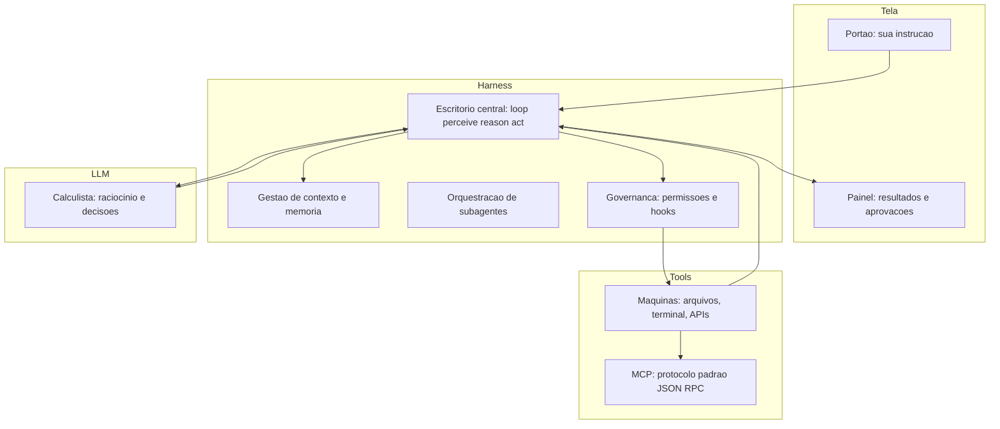

# Capítulo 2: As quatro camadas: Tela, Harness, LLM e Tools

## 1. Introdução

No Capítulo 1, você assentou a primeira estaca do seu entendimento: AI Driven Development é a orquestração de agentes de IA em todo o ciclo de vida do software, e o que separa quem ganha velocidade de quem afunda em dívida técnica é o sistema ao redor do modelo. Agora é hora de desenhar a planta do prédio. Todo ecossistema de desenvolvimento agêntico, das ferramentas mais famosas às mais obscuras, é construído sobre a mesma arquitetura de quatro camadas: a **Tela**, onde você interage; o **Harness**, que transforma o modelo em agente; o **LLM**, o cérebro; e as **Tools**, as mãos que tocam o mundo real [1].

Compreender essa arquitetura não é curiosidade acadêmica — é uma necessidade operacional. Quando algo dá errado no seu canteiro — um agente que apaga um arquivo indevido, um prompt que não obedece, uma ferramenta que devolve dados errados — o diagnóstico começa por saber em qual camada o problema mora. Ao final deste capítulo, você vai conseguir olhar para qualquer ferramenta de IA de desenvolvimento e mapear instantaneamente onde cada peça se encaixa, o que cada camada faz e quem é responsável por quê — exatamente como um mestre de obras lê a planta e sabe qual equipe é acionada em cada etapa [2].

## 2. Explica

### A camada de Tela: a interface onde tudo começa

A primeira camada é a mais visível e, paradoxalmente, a menos importante do ponto de vista da arquitetura. A **Tela** é o ponto de contato entre você e o sistema: pode ser uma IDE com painel de chat, como Cursor e Windsurf; uma interface de linha de comando interativa, como as usadas pelos agentes de terminal; ou uma aplicação web [3]. A Tela captura suas instruções, renderiza o fluxo de pensamento do agente, exibe as mudanças propostas nos arquivos e gerencia os diálogos de aprovação — aqueles momentos em que o agente pergunta "posso executar este comando?" e você decide [4].

A Tela importa menos do que parece porque ela é intercambiável: o mesmo agente, com o mesmo cérebro e as mesmas ferramentas, pode ser operado de uma IDE, de um terminal ou de uma API. A escolha da Tela é uma questão de ergonomia pessoal e de fluxo de trabalho — não de capacidade. Esse insight vai poupar você de muita ansiedade de ferramentas: não existe "a melhor interface", existe a interface que se encaixa no seu método [5].

### A camada de Harness: o esqueleto que transforma modelo em agente

A segunda camada é o coração deste livro: o **Harness** — também chamado de *scaffolding* ou *agentic harness* na literatura recente. É a infraestrutura de software que envolve o modelo de linguagem e o transforma em um agente autônomo [6]. Um LLM sozinho é uma função que recebe texto e devolve texto; um harness o envolve com o *loop de agente* — o ciclo perceive-reason-act — que permite planejar, executar ferramentas, observar resultados e iterar até concluir a tarefa [7].

O harness é responsável por quatro funções críticas: (1) o **loop de execução**, que mantém o agente trabalhando em direção a um objetivo; (2) a **gestão de contexto**, que decide o que entra na janela do modelo a cada passo; (3) a **orquestração de subagentes**, que despacha tarefas especializadas para agentes-filhos; e (4) a **governança**, que aplica permissões, hooks e políticas de segurança entre o agente e o mundo [8]. Quando as pessoas dizem que "o agente sabe fazer X", quem de fato sabe fazer X é o harness que foi construído para isso — não o modelo.

Um ponto sutil que separa engenharia de marketing: nem todo sistema com um LLM é um agente. Sistemas em que o modelo executa passos dentro de um caminho pré-definido pelo engenheiro são chamados de *workflows*; agentes são sistemas em que o próprio modelo decide dinamicamente os próximos passos, observando o resultado de cada ação antes de decidir a seguinte [9]. Essa distinção, documentada pela equipe que criou um dos harnesses mais influentes do mercado, é a mesma que separa automação com IA embutida de agentic coding de verdade [10].

### A camada de LLM: o cérebro (que não é único)

A terceira camada é o **LLM** — o modelo de linguagem que prevê tokens, interpreta instruções, raciocina sobre o estado e gera tanto texto quanto chamadas estruturadas de ferramentas. A arquitetura moderna raramente usa um único modelo: sistemas agênticos de produção empregam *roteamento de modelos*, despachando tarefas de planejamento, escrita, crítica e validação para o modelo mais adequado em termos de latência, custo e capacidade [11].

A característica mais importante do LLM, para o seu trabalho diário, é a sua janela de contexto: a quantidade de informação que ele consegue considerar simultaneamente. Janelas maiores não resolvem dados desorganizados — o fenômeno conhecido como *context rot* degrada o desempenho quando o contexto é mal arquitetado, mesmo com janelas gigantes [12]. É por isso que o harness, e não o modelo, é onde o valor é criado: a qualidade do agente é limitada pela qualidade do contexto que você entrega a ele a cada passo.

### A camada de Tools: as mãos que tocam o mundo

A quarta camada conecta o agente ao mundo exterior: sistema de arquivos, terminal, banco de dados, APIs de terceiros. É aqui que entra o **Model Context Protocol (MCP)**, o padrão aberto criado pela Anthropic que padroniza a comunicação entre o harness e ferramentas externas usando mensagens JSON-RPC [13]. O MCP expõe três capacidades fundamentais: **Resources** (dados legíveis, como arquivos e logs), **Prompts** (workflows reutilizáveis) e **Tools** (funções executáveis que o modelo pode acionar) [14].

A segurança desta camada é o calcanhar de Aquiles do ecossistema. Como o LLM lê descrições em linguagem natural das ferramentas para decidir quando usá-las, servidores MCP maliciosos podem embutir instruções adversariais invisíveis — o ataque conhecido como *tool poisoning* — levando o agente a exfiltrar dados confidenciais sem que o usuário perceba [15]. Governança de ferramentas é, portanto, uma disciplina de primeira classe, não um detalhe de segurança: o Capítulo 11 é inteiramente dedicado a construir ferramentas próprias com blindagem.

### Como as camadas conversam

O fluxo completo é: você digita um pedido na Tela; a Tela envia para o Harness; o Harness monta o contexto (instruções, memória, estado do repositório) e chama o LLM; o LLM raciocina e devolve uma decisão — que pode ser texto ou uma chamada de ferramenta; o Harness valida a chamada contra as permissões, executa a Tools, observa o resultado e volta ao LLM com o novo estado; o ciclo repete até a tarefa estar completa ou o limite de iterações ser atingido [16]. Cada camada tem uma responsabilidade isolada, e é exatamente esse isolamento que permite trocar qualquer camada sem reescrever as outras — você pode trocar o LLM, mudar de Tela ou adicionar Tools sem tocar no resto [17].

## 3. Ilustra

### O Canteiro em Quatro Frentes de Trabalho

Pense no seu canteiro de obras com quatro frentes de trabalho, cada uma com uma função distinta e um capataz responsável. A **Tela** é o portão de entrada do canteiro: é onde o cliente (você) conversa com a obra, recebe relatórios de progresso e assina as ordens de serviço. O portão não constrói nada — mas é por ele que toda instrução entra e todo resultado sai [18].

O **Harness** é o escritório central do canteiro: o mestre de obras que recebe a planta, quebra a obra em etapas, despacha tarefas para as equipes, mantém o diário de bordo e aplica as regras de segurança. É o harness que decide quem trabalha agora, o que cada equipe precisa saber e quando o trabalho de uma frente depende do resultado de outra. Sem escritório central, você tem operários (modelos) competentes mas desorganizados — cada um construindo o que entendeu, sem coordenação.

O **LLM** é o conjunto de engenheiros calculistas: o cérebro que resolve cada problema específico quando recebe o problema e o contexto. Eles não saem do escritório, não tocam material — recebem uma planta e devolvem um cálculo. As **Tools** são as mãos: as máquinas, as guindastes, os caminhões, os bancos de dados e as APIs que realmente movem material, gravam concreto e comunicam com fornecedores. Uma frente de trabalho só executa quando o escritório (harness) valida e autoriza a máquina (tool) a operar.



### O Turno Sem Escritório Central: Por Que a Coordenação é Tudo

Aqui está o ponto contraintuitivo deste capítulo — e ele merece uma segunda camada de analogia. A primeira camada mostrou as quatro frentes e seus papéis. A segunda é sobre por que o harness — a camada que você provavelmente nunca tinha ouvido falar — é mais importante que o modelo que você paga mensalidade.

Imagine dois canteiros idênticos, com as mesmas máquinas e os mesmos engenheiros calculistas. No primeiro, existe escritório central: as ordens são coordenadas, o diário de bordo registra tudo, e as máquinas só operam com autorização. No segundo, não há escritório: cada engenheiro conversa diretamente com cada máquina quando acha necessário. Qual dos dois entrega o prédio? O primeiro, sempre. O segundo produz paredes que não se encaixam, concreto derramado no lugar errado e nenhum registro do que foi feito. A diferença não está nas máquinas nem nos engenheiros — está na camada invisível que os coordena. Como Mestre de Obras, você vai descobrir que a maior parte do seu tempo de configuração não será gasto escolhendo o modelo: será gasto construindo o harness — o contexto, as regras, as ferramentas e os fluxos que o modelo usa [19].

## 4. Técnica

### O Diagrama de Blocos do seu Próprio Sistema

Agora vamos materializar a teoria. O primeiro exercício técnico é desenhar o diagrama de blocos do seu próprio setup, identificando as quatro camadas e as peças concretas de cada uma. Use esta tabela como guia de mapeamento, preenchendo com as ferramentas que você tem disponíveis:

| Camada | Função | Exemplos de 2026 |
|---|---|---|
| Tela | Interface de interação | IDE com chat, terminal interativo, web UI |
| Harness | Loop, contexto, subagentes, governança | Agent CLI, orquestradores, harnesses de código aberto |
| LLM | Raciocínio e decisão | Modelos de fronteira e modelos de tarefa específica |
| Tools | Acesso ao mundo | Sistema de arquivos, terminal, MCP, APIs, banco de dados |

A percepção importante: a maioria das ferramentas comerciais empacota várias camadas no mesmo produto. Um IDE com chat embute Tela + um harness próprio + acesso a modelos + ferramentas de edição. Não há nada de errado nisso — mas quando você entende que são camadas distintas, consegue tomar decisões melhores: usar o harness do seu IDE para tarefas rápidas, e um harness de terminal mais configurável para projetos longos, conectando ambos às mesmas ferramentas via MCP [20].

### Configurando a Primeira Conexão MCP

A parte prática mais valiosa deste capítulo é conectar seu harness a uma ferramenta externa via MCP. O processo ilustra perfeitamente o desacoplamento entre camadas: a ferramenta (Tools) não precisa saber qual modelo você usa (LLM), nem qual interface você opera (Tela) — ela apenas fala o protocolo padrão.

O fluxo de configuração típico, que você fará em detalhe no Capítulo 10, é:

1. Instalar o servidor MCP da ferramenta que você quer conectar (por exemplo, um servidor de acesso a banco de dados ou a uma API de terceiros).
2. Registrar o servidor na configuração do seu harness, indicando o comando de inicialização e o transporte (stdio ou HTTP).
3. Reiniciar a sessão do agente para que ele descubra as novas ferramentas.
4. Testar com um comando que force o uso da ferramenta.

A configuração típica no arquivo de configuração do harness se parece com isto:

```json
{
  "mcpServers": {
    "banco_local": {
      "command": "uvx",
      "args": ["mcp-server-sqlite", "--db-path", "./torrecontrole.db"],
      "env": {}
    },
    "api_tempo": {
      "command": "uvx",
      "args": ["mcp-server-http", "--base-url", "https://api.exemplo.com"],
      "env": { "API_KEY": "<seu-token>" }
    }
  }
}
```

### Um Harness Mínimo em Python: Entendendo o Loop por Dentro

Para realmente entender o harness, nada melhor que construir um mínimo viável. Este código implementa o loop perceive-reason-act mais simples possível: recebe um objetivo, chama o modelo, decide se precisa de uma ferramenta e executa. Ele não usa uma API real — simula o modelo com uma função local — mas mostra exatamente onde cada camada se encaixa:

```python
# harness_minimo.py — O loop do agente por dentro
from dataclasses import dataclass, field
from typing import Callable

@dataclass
class Ferramenta:
    nome: str
    descricao: str
    funcao: Callable[[str], str]

@dataclass
class AgenteMinimo:
    nome: str
    simular_llm: Callable[[str, list[Ferramenta]], str]
    ferramentas: list[Ferramenta] = field(default_factory=list)
    max_iteracoes: int = 5

    def executar(self, objetivo: str) -> str:
        """Loop perceive-reason-act: raciocina, age, observa e itera."""
        estado = objetivo
        for _ in range(self.max_iteracoes):
            decisao = self.simular_llm(estado, self.ferramentas)
            if decisao.startswith("CONCLUIDO:"):
                return decisao.removeprefix("CONCLUIDO:")
            for f in self.ferramentas:
                if decisao.startswith(f"USAR:{f.nome}:"):
                    argumento = decisao.split(":", 2)[2]
                    resultado = f.funcao(argumento)
                    estado = f"Resultado de {f.nome}: {resultado}"
                    break
        return "Limite de iteracoes atingido"

def calculadora(texto: str) -> str:
    """Executa uma expressao aritmetica simples recebida do agente."""
    try:
        return str(eval(texto, {"__builtins__": {}}, {}))
    except Exception as erro:
        return f"erro: {erro}"

def llm_simulado(estado: str, ferramentas: list[Ferramenta]) -> str:
    """Simula o raciocinio do modelo: se a entrada pede calculo, usa a tool."""
    if "quanto" in estado.lower() or "+" in estado or "-" in estado:
        if "Resultado" not in estado:
            return "USAR:calculadora:2 + 2"
        return "CONCLUIDO:o resultado e 4"
    return "CONCLUIDO:nao ha calculo para fazer"

def main() -> None:
    agente = AgenteMinimo(
        nome="MestreDeObras",
        simular_llm=llm_simulado,
        ferramentas=[Ferramenta("calculadora", "soma numeros", calculadora)],
    )
    print(agente.executar("Quanto e 2 + 2?"))
    print(agente.executar("Ola, apenas registre o pedido."))

if __name__ == "__main__":
    main()
```

Execute e observe: o agente não "sabe" calcular — ele sabe *delegar* para a ferramenta, exatamente como um harness real delega para tools. Essa é a mecânica fundamental de toda a arquitetura agêntica.

### O Protocolo de Verificação de Camadas

Para fechar, aqui está o protocolo de diagnóstico que você usará quando algo der errado — o equivalente ao checklist de inspeção do canteiro. Quando um agente falhar, identifique a camada antes de culpar o modelo:

1. **Falha na Tela**: a interface travou, o resultado não renderiza, a aprovação não chega. Troque de Tela para confirmar.
2. **Falha no Harness**: o agente age sem rumo, esquece o objetivo, não respeita permissões. Revise contexto, prompt do sistema e governança.
3. **Falha no LLM**: raciocínio errado, alucinação, má qualidade de resposta. Revise o contexto entregue — e só então considere outro modelo.
4. **Falha na Tools**: a ferramenta devolve erro, dado errado ou não responde. Verifique a ferramenta e o servidor MCP isoladamente.

## 5. Aplica

### A Cena de Contraste: O Agente Que "Sumiu com os Arquivos"

Imagine a quinta-feira em que você decide confiar seu projeto ao agente pela primeira vez, sem entender a arquitetura. Você abre a Tela, digita "reestruture a pasta de módulos", e aceita todas as sugestões de plano sem ler. Na sexta, o projeto não compila: arquivos sumiram, imports quebrados, e o agente — questionado — responde com confiança que "não fez nada demais". Você culpa o modelo: "esta IA é ruim". Você está errado, e o erro é a lição deste capítulo.

O diagnóstico: o que falhou foi a **governança do harness**. O agente não tinha regra sobre mover arquivos, não havia permissão explícita para operações destrutivas, e o diário de bordo não registrou as ações — então nem você nem ninguém consegue reconstruir o que aconteceu [21]. O modelo raciocinou perfeitamente dentro do que o harness permitiu. A culpa não está no cérebro; está na ausência do escritório central.

A correção: você instala as regras de governança no harness (permissões para operações de arquivo, hooks de pré-execução para operações destrutivas, registro obrigatório de ações no diário de bordo) e configura o checkpoint de aprovação para operações irreversíveis. Na semana seguinte, o mesmo agente, no mesmo projeto, reestrutura a pasta — mas cada movimento está registrado, e a operação destrutiva é bloqueada até você aprovar. A arquitetura não mudou; o harness passou a cumprir o seu papel.

### Armadilhas Comuns ao Mapear as Camadas

- **Culpar o modelo por falha de harness**: a maioria das falhas de agentes é falha de contexto, permissão ou fluxo — não de raciocínio. Diagnostique a camada antes de trocar o modelo [22].
- **Trocar de ferramenta para resolver dor de processo**: "vou migrar do terminal para a IDE" não resolve contexto mal arquitetado; o problema viaja com você.
- **Ignorar a camada de ferramentas**: conexões MCP não configuradas ou mal seguras são responsáveis por mais incidentes do que a maioria das equipes imagina — incluindo exfiltração via tool poisoning [23].
- **Achar que janela grande dispensa contexto**: context rot atinge janelas grandes tanto quanto pequenas; o que importa é o que entra, não o tamanho do container [24].
- **Não registrar o mapa das camadas do próprio projeto**: escreva no AGENTS.md do seu projeto quais camadas existem, quais ferramentas estão conectadas e quem aprova o quê. O Capítulo 6 mostra como.

### Exercício Prático

Execute o `harness_minimo.py` e observe as duas saídas. Depois, monte o mapa das quatro camadas do seu próprio ambiente: liste a Tela que você usa, o harness, o modelo e as ferramentas conectadas — incluindo qualquer servidor MCP configurado. Se algum item estiver em branco, anote como pendência para os Capítulos 3 e 10 resolverem.

### Aprofundamento: O Checklist de Diagnóstico de Camada

O protocolo de verificação de camadas do Capítulo 2 merece um checklist concreto — a lista que você consulta quando o agente falha, em vez de culpar o modelo por reflexo. Este é o fluxo de diagnóstico completo:

| Sintoma observado | Camada suspeita | Teste de confirmação | Ação típica |
|---|---|---|---|
| A interface trava ou não renderiza | Tela | O mesmo agente funciona em outra Tela? | Trocar/atualizar a Tela |
| O agente age sem rumo, esquece o objetivo | Harness (loop/contexto) | O prompt do sistema e o contexto estão corretos? | Rever contexto e regras |
| O agente desrespeita permissões | Harness (governança) | As permissões e hooks estão aplicados? | Rever governança (Cap. 13) |
| Raciocínio errado ou alucinação | LLM (contexto entregue) | O contexto estava completo e correto? | Melhorar contexto; só então trocar modelo |
| A ferramenta devolve erro ou dado errado | Tools | O servidor MCP responde isoladamente? | Verificar a tool isolada |
| Comando executado sem efeito esperado | Tools → Harness | A chamada de tool chegou ao servidor? | Rastrear a chamada |

O checklist tem uma propriedade que vale ouro: ele força a pergunta certa antes da ação. O erro mais comum de iniciante é pular direto para "trocar o modelo" — quando o diagnóstico de camada mostra que o problema era contexto mal arquitetado (Harness), permissão faltando (Governança) ou servidor fora do ar (Tools). O modelo é a última coisa a trocar, não a primeira — porque trocar o modelo sem corrigir a camada é levar o mesmo defeito para outro cérebro.

```bash
# Triagem rápida de camada em um comando:
# 1. A tool funciona sozinha? (Tools) -> teste isolado do servidor
# 2. O harness registra a chamada? (Harness) -> trilha de auditoria
# 3. Só entao considere o modelo (LLM) como causa
```

O checklist de diagnóstico é o hábito que transforma você de usuário frustrado em engenheiro que lê a planta — e é a base prática de tudo que o Capítulo 15 automatiza com o revisor agêntico.

## 6. Conclusão

Neste capítulo você desenhou a planta do prédio: a arquitetura de quatro camadas — Tela, Harness, LLM e Tools — com responsabilidades isoladas e intercambiáveis; o harness como o escritório central que transforma modelo em agente, com loop, contexto, subagentes e governança; e o MCP como o protocolo que padroniza a comunicação com as ferramentas. Você também construiu um harness mínimo e entendeu por dentro o ciclo perceive-reason-act que sustenta todo o ecossistema.

Seu desafio: executar o harness mínimo, mapear as quatro camadas do seu ambiente e anotar as pendências — antes de avançar, você deve saber em qual camada cada peça da sua caixa de ferramentas se encaixa.

No Capítulo 3, vamos abrir o canteiro de verdade: instalar e configurar o seu harness, preparar o ambiente, o editor e o repositório git — colocando em prática, na sua máquina, a planta que você acabou de desenhar.

## 7. Referências Bibliográficas

[1] BUI, Nghi D. Q. *Building AI Coding Agents for the Terminal: Scaffolding, Harness, Context Engineering, and Lessons Learned*. Disponível em: https://arxiv.org/html/2603.05344v1. Acesso em: 07 ago. 2026.

[2] DATABRICKS. *What is an AI Agent Harness?* Disponível em: https://www.databricks.com/blog/ai-harness. Acesso em: 07 ago. 2026.

[3] SOFTJOURN. *AI Software Development Statistics 2026: Adoption, Productivity, and Risk*. Disponível em: https://softjourn.com/insights/ai-software-dev-stats. Acesso em: 07 ago. 2026.

[4] CONNELL, Andrew. *My Thoughts on Vibe Coding vs. Agentic Engineering*. Disponível em: https://www.andrewconnell.com/articles/vibe-coding-vs-agentic-engineering/. Acesso em: 07 ago. 2026.

[5] ZIEMINSKI, Karo. *Context Engineering for Product Builders: The 2026 Operating Manual*. Disponível em: https://karozieminski.substack.com/p/context-engineering-product-builders-guide-2026. Acesso em: 07 ago. 2026.

[6] DATABRICKS. *What is an AI Agent Harness?* Disponível em: https://www.databricks.com/blog/ai-harness. Acesso em: 07 ago. 2026.

[7] BUI, Nghi D. Q. *Building AI Coding Agents for the Terminal: Scaffolding, Harness, Context Engineering, and Lessons Learned*. Disponível em: https://arxiv.org/html/2603.05344v1. Acesso em: 07 ago. 2026.

[8] WONG, Sherman et al. *Confucius Code Agent: Scalable Agent Scaffolding for Real-World Codebases*. Disponível em: https://arxiv.org/abs/2512.10398. Acesso em: 07 ago. 2026.

[9] ANTHROPIC. *Building Effective AI Agents*. Disponível em: https://www.anthropic.com/research/building-effective-agents. Acesso em: 07 ago. 2026.

[10] ANTHROPIC. *Building Effective AI Agents*. Disponível em: https://www.anthropic.com/research/building-effective-agents. Acesso em: 07 ago. 2026.

[11] JIN, Haolin et al. *From LLMs to LLM-based Agents for Software Engineering: A Survey of Current, Challenges and Future*. Disponível em: https://arxiv.org/abs/2408.02479. Acesso em: 07 ago. 2026.

[12] SOURCEGRAPH. *Context Engineering: A Practical Guide for AI Agents (2026)*. Disponível em: https://sourcegraph.com/blog/context-engineering. Acesso em: 07 ago. 2026.

[13] ANTHROPIC. *Introducing the Model Context Protocol*. Disponível em: https://www.anthropic.com/news/model-context-protocol. Acesso em: 07 ago. 2026.

[14] MODEL CONTEXT PROTOCOL. *Specification (2026-07-28)*. Disponível em: https://modelcontextprotocol.io/specification/2026-07-28. Acesso em: 07 ago. 2026.

[15] INVARIANT LABS. *MCP Security Notification: Tool Poisoning Attacks*. Disponível em: https://invariantlabs.ai/blog/mcp-security-notification-tool-poisoning-attacks. Acesso em: 07 ago. 2026.

[16] TAWOSI, Vali et al. *ALMAS: an Autonomous LLM-based Multi-Agent Software Engineering Framework*. Disponível em: https://arxiv.org/abs/2510.03463. Acesso em: 07 ago. 2026.

[17] DENG, Xiang et al. *SWE-Bench Pro: Can AI Agents Solve Long-Horizon Software Engineering Tasks?* Disponível em: https://arxiv.org/abs/2509.16941. Acesso em: 07 ago. 2026.

[18] EXPLAINX.AI. *AI Coding Agent Evals on Real Repos (2026)*. Disponível em: https://explainx.ai/blog/ai-coding-agent-evals-real-repos-2026. Acesso em: 07 ago. 2026.

[19] BIRJOB. *AI Coding Agent Benchmarks Beyond SWE-Bench in 2026: Terminal-Bench, Aider Polyglot, GAIA, and Why the Leaderboard Lies*. Disponível em: https://www.birjob.com/blog/agent-benchmarks-2026. Acesso em: 07 ago. 2026.

[20] TERMDOCK. *SKILL.md vs CLAUDE.md vs AGENTS.md Compared*. Disponível em: https://www.termdock.com/blog/skill-md-vs-claude-md-vs-agents-md. Acesso em: 07 ago. 2026.

[21] CLOUD SECURITY ALLIANCE. *Agentic MCP Security Best Practices Guide*. Disponível em: https://labs.cloudsecurityalliance.org/agentic/agentic-mcp-security-best-practices-v1/. Acesso em: 07 ago. 2026.

[22] VALUE ADD VC. *AI Coding Productivity Study Data: What METR, McKinsey, and GitHub Found in 2026*. Disponível em: https://valueaddvc.com/blog/ai-coding-productivity-study-data-what-metr-mckinsey-and-github-actually-found-in-2026. Acesso em: 07 ago. 2026.

[23] INVARIANT LABS. *MCP Security Notification: Tool Poisoning Attacks*. Disponível em: https://invariantlabs.ai/blog/mcp-security-notification-tool-poisoning-attacks. Acesso em: 07 ago. 2026.

[24] SOURCEGRAPH. *Context Engineering: A Practical Guide for AI Agents (2026)*. Disponível em: https://sourcegraph.com/blog/context-engineering. Acesso em: 07 ago. 2026.

[25] HE, Kang; ROY, Kaushik. *SWE-Adept: An LLM-Based Agentic Framework for Deep Codebase Analysis and Structured Issue Resolution*. Disponível em: https://arxiv.org/abs/2603.01327. Acesso em: 07 ago. 2026.
