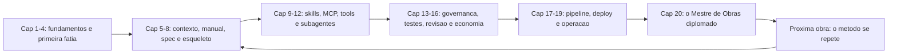

# Capítulo 20: O engenheiro do futuro: carreira e mentalidade AIDD

## 1. Introdução

O prédio está de pé. A TorreDeControle nasceu como um terreno baldio no Capítulo 1 e agora opera na nuvem, monitorada, com um pipeline que entrega melhorias contínuas. Mas há um último andar que nenhum capítulo anterior construiu: **você**. A obra que você ergueu nestas vinte etapas foi, em paralelo, a construção de uma carreira — e é sobre essa construção que este capítulo final trata [1].

O mercado de 2026 está redesenhando o perfil do desenvolvedor em torno do AIDD — e a pesquisa é clara: o valor não está em quem digita mais rápido, mas em quem projeta, audita e comanda sistemas agênticos [2]. Este capítulo fecha a jornada do Mestre de Obras: o mapa das competências do engenheiro AIDD, o portfólio que prova a jornada (e a TorreDeControle é a sua peça central), e a mentalidade e a ética que sustentam o profissional do futuro. Ao final, você terá o plano concreto de posicionamento — e a certeza de que a jornada que percorreu é o ativo mais valioso do seu currículo [3].

## 2. Explica

#### O novo mapa de competências

O relatório DORA e a análise de mercado convergem num ponto: as habilidades que separam profissionais no fluxo agêntico não são as do autocomplete — são as do sistema ao redor do modelo [4]. O mapa tem cinco grupos:

1. **Engenharia de contexto**: arquitetar o que o modelo recebe — manual de bordo, memória, recuperação sob demanda (Capítulos 5-6, 16). O grupo mais valioso e mais raro.
2. **Engenharia de especificação**: transformar intenção em contrato verificável — spec-driven development (Capítulo 7). A ponte entre negócio e código.
3. **Governança e segurança**: hooks, permissões, blindagem de ferramentas (Capítulos 11, 13). O que transforma autonomia em responsabilidade.
4. **Verificação**: testes, revisão autônoma, auditorias (Capítulos 14-15). O que transforma velocidade em confiança.
5. **Orquestração**: subagentes, pipelines, operação (Capítulos 12, 17-19). O que transforma esforço em sistema.

Repare no padrão: nenhum dos cinco grupos é "escrever código mais rápido". O código o modelo escreve; o valor humano está em tudo que *cerca* o código — e é exatamente isso que este livro construiu, capítulo a capítulo [5].

### O engenheiro AIDD vs. o usuário de IA

A distinção que resume o livro inteiro: **o usuário de IA consome o modelo; o engenheiro AIDD projeta o sistema ao redor dele**. O usuário abre o chat e pede; o engenheiro especifica, governa, verifica e opera. A diferença não é técnica — é de método: o usuário trata o modelo como oráculo; o engenheiro trata o modelo como componente de um sistema que ele projeta [6].

Essa distinção tem consequência de mercado: conforme a adoção de IA se universaliza (97% do mercado em algum grau, como você viu no Capítulo 1), a commodity é "saber usar IA" — e o escasso é "saber construir o sistema que a torna confiável" [7]. A escassez é o seu espaço: é o engenheiro do futuro, e é você.

### Portfólio: provar a jornada, não prometê-la

O portfólio do engenheiro AIDD não é uma lista de projetos — é a **evidência da jornada**: cada projeto prova que o candidato domina o método, não apenas a ferramenta. A TorreDeControle é o portfólio perfeito porque contém, em um artefato, todos os capítulos: a especificação viva (Capítulo 7), o manual de bordo (Capítulo 6), as skills (Capítulo 9), as ferramentas blindadas (Capítulo 11), a governança (Capítulo 13), os testes (Capítulo 14), o pipeline (Capítulo 17) e a operação monitorada (Capítulo 19) [8].

O portfólio eficaz tem quatro peças, e a TorreDeControle as preenche todas:

1. **O repositório**: código real, com histórico limpo, convenções e documentação — legível por um avaliador em minutos.
2. **O diário de decisões**: o registro do *porquê* — as decisões de arquitetura, os erros corrigidos (o ADR do Capítulo 5). É o que separa o portfólio do "código que funciona" do "engenheiro que decide".
3. **A demonstração**: o produto no ar (Capítulo 18), com a URL pública — o avaliador não precisa acreditar, pode ver [9].
4. **A narrativa**: a história da jornada — do zero ao deploy — contada em poucos parágrafos, com métricas: capítulos, testes, pipeline, métricas DORA.

### A ética do desenvolvimento dirigido por IA

O último pilar conceitual é a **ética** — a responsabilidade que acompanha a autonomia. Quatro princípios sustentam o engenheiro AIDD responsável:

1. **Responsabilidade final humana**: o agente executa; o humano responde. Autonomia crescente exige controle redesenhado na mesma proporção — a lição do Capítulo 13 em escala de carreira [10].
2. **Transparência de uso**: o que foi gerado por IA e o que foi revisado por humano — em código, em avaliações, em decisões. A honestidade é o ativo de reputação.
3. **Segurança como dever**: blindar ferramentas, proteger segredos, não expor dados de usuário — a ética do Capítulo 11 vira postura profissional.
4. **Aprendizado contínuo**: o campo muda em meses; a competência é a capacidade de re-aprender — a memória externa do Capítulo 16 vira hábito de carreira [11].

## 3. Ilustra

### O Mestre de Obras Diplomado

Volte ao canteiro — o último dia, agora em retrospectiva. O mestre que você era no Capítulo 1 conhecia o terreno baldio; o mestre que você é agora entregou o prédio, e a diferença entre os dois não está nas mãos — está no **método**. No dia um, você sabia assentar tijolo (programar); hoje você sabe *dirigir uma obra inteira*: planta (spec), placa de regras (manual), equipes (subagentes), máquinas (tools), porteiro (governança), medidores (observabilidade) e rampa (pipeline).

O mercado de 2026 está cheio de pedreiros competentes — profissionais que sabem "usar IA". Está vazio de mestres de obras — profissionais que sabem dirigir sistemas agênticos do zero ao deploy. E é exatamente essa raridade que este livro construiu: não um curso de ferramenta, mas a diplomação do método [12].



### O Pedreiro que Virou Mestre: Por Que o Método é o Diferencial

Aqui está o ponto contraintuitivo do capítulo final — a segunda camada de analogia. A primeira mostrou a diplomação do mestre. A segunda é sobre por que o método, e não a ferramenta, é o ativo que não envelhece.

Imagine dois profissionais em 2024, quando o autocomplete reinava. O primeiro dominou a ferramenta da época com perfeição: conhecia cada atalho, cada extensão, cada truque do autocomplete. O segundo investiu no método: especificação, revisão, testes, arquitetura. Em 2026, a ferramenta do primeiro virou commodity — o autocomplete morreu engolido pelos agentes, e o conhecimento dele virou obsoleto da noite para o dia. O segundo — que nunca dependeu da ferramenta — migrou para os agentes com o método intacto: especificação, revisão e testes continuam sendo a essência, com outra ferramenta no centro [13].

A lição é a mais importante do livro: **ferramentas envelhecem; métodos persistem**. O autocomplete deu lugar aos agentes; os agentes de hoje darão lugar a algo novo; e o método — especificar, governar, verificar, operar — atravessa todas as eras [14]. Como Mestre de Obras, o seu ativo não é o harness que você usa em 2026: é o método que você construiu nestas vinte etapas e que funciona com qualquer ferramenta, em qualquer era.

## 4. Técnica

### Passo 1: O Mapa de Competências Pessoal

O primeiro passo técnico é o auto-diagnóstico: mapear onde você está nos cinco grupos de competências — e onde precisa investir. Este é o modelo do mapa, com a autoavaliação:

```markdown
# Mapa de Competências — <Seu Nome> (data)

#### 1. Engenharia de contexto
- [x] Escrevo CLAUDE.md/AGENTS.md (Cap. 6)
- [x] Arquitetura de contexto em 3 niveis (Cap. 5)
- [ ] Economia severa de tokens em sessões longas (Cap. 16)
- Nivel: iniciante | intermediario | avancado

#### 2. Engenharia de especificação
- [x] Spec viva com criterios de aceite (Cap. 7)
- [ ] Traduzir critérios em testes (Cap. 14)
- Nivel: ...

#### 3. Governança e segurança
- [x] Hooks e permissoes (Cap. 13)
- [x] Blindagem de tools (Cap. 11)
- [ ] Auditoria de servidores MCP de terceiros
- Nivel: ...

#### 4. Verificação
- [x] Testes de regras de negocio (Cap. 14)
- [x] Revisao autonoma em 2 camadas (Cap. 15)
- Nivel: ...

#### 5. Orquestração
- [x] Subagentes e lotes (Cap. 12)
- [x] Pipeline CI/CD (Cap. 17)
- [ ] Operacao com metricas DORA (Cap. 19)
- Nivel: ...

## Plano de investimento (proximos 90 dias)
- Fortalecer: <grupo 1>
- Aprender: <grupo 2>
- Provar com: <projeto/artefato>
```

O mapa é o instrumento da carreira: ele transforma "estou aprendendo AIDD" em "estou em X dos cinco grupos, com plano para Y". É a mesma disciplina de especificação que você aplicou à TorreDeControle — agora aplicada a você [15].

### Passo 2: O Documento da Jornada (narrativa de portfólio)

O segundo passo é a narrativa — o documento que conta a jornada em poucos parágrafos. Este é o modelo, pronto para preencher com os dados da sua TorreDeControle:

```markdown
# Projeto TorreDeControle — Jornada do Zero ao Deploy

## Resumo (2 frases)
Aplicativo web de gestão de tarefas construído inteiramente com AI Driven
Development, do terreno baldio ao deploy na nuvem, com o método completo:
especificação viva, manual de bordo, skills, ferramentas blindadas,
governança, testes, pipeline e operação monitorada.

## A jornada em números
- 20 capítulos de método aplicados (do conceito à operação).
- Spec com N requisitos e M regras de negócio (cada uma com teste).
- Pipeline com N gates: sintaxe, testes, auditoria, build.
- Métricas DORA: frequência de deploy X/semana, falha Y%, MTTR Z h.

## O que a jornada prova
1. Especificar antes de codar: o contrato que guiou todos os agentes.
2. Governar a autonomia: hooks, permissões e blindagem de ferramentas.
3. Verificar tudo: testes por regra, revisão em 2 camadas, pipeline.
4. Operar com dados: logs estruturados, métricas e loop de iteração.

## Como ver (links)
- Repositório: <url>
- Demonstração no ar: <url>
- Especificação e diário de decisões: <caminhos>
```

A narrativa é a peça que o avaliador lê primeiro — e ela conta a história do método, não da ferramenta. Cada afirmação tem um artefato por trás (o repositório, a URL, o diário): é a rastreabilidade do Capítulo 14 aplicada à carreira [16].

### Passo 3: O Gerador de Portfólio

O terceiro passo é o gerador que monta o portfólio a partir do repositório — a evidência organizada em um documento:

```python
# gerar_portfolio.py — Monta o sumario do portfolio a partir do repositorio
import json
from datetime import date
from pathlib import Path

def contar_testes() -> int:
    """Conta os arquivos de teste do projeto."""
    return len(list(Path("tests").glob("test_*.py"))) if Path("tests").exists() else 0

def contar_skills() -> int:
    """Conta as skills do projeto."""
    base = Path(".claude/skills")
    return len([p for p in base.iterdir() if (p / "SKILL.md").exists()]) if base.exists() else 0

def contar_subagentes() -> int:
    """Conta as definicoes de subagentes do projeto."""
    base = Path(".claude/agents")
    return len(list(base.glob("*.md"))) if base.exists() else 0

def gerar_manifesto_portfolio() -> dict:
    """Gera o manifesto do portfolio com os artefatos da jornada."""
    return {
        "projeto": "TorreDeControle",
        "gerado_em": date.today().isoformat(),
        "artefatos": {
            "especificacao": str(Path("docs/especificacao.md")),
            "manual_de_bordo": str(Path("AGENTS.md")),
            "diario_de_decisoes": str(Path("docs/decisoes.md")),
            "mapa_de_contexto": str(Path("docs/mapa_contexto.md")),
            "mapa_de_permissoes": str(Path("docs/mapa_permissoes.md")),
        },
        "evidencias": {
            "testes": contar_testes(),
            "skills": contar_skills(),
            "subagentes": contar_subagentes(),
            "pipeline": str(Path(".github/workflows")),
        },
    }

def main() -> None:
    """Gera o manifesto do portfolio e imprime o resumo."""
    manifesto = gerar_manifesto_portfolio()
    print(json.dumps(manifesto, ensure_ascii=False, indent=2))
    print(f"\nTotal de evidencias: {len(manifesto['artefatos']) + len(manifesto['evidencias'])}")

if __name__ == "__main__":
    main()
```

O manifesto do portfólio é a prova organizada: artefatos (spec, manual, diário, mapas) e evidências (testes, skills, subagentes, pipeline) — cada item um capítulo do livro materializado [17].

### Passo 4: O Plano de Posicionamento de 90 Dias

O quarto passo é o plano concreto de posicionamento — as ações dos próximos 90 dias, com prazo e critério de conclusão:

```markdown
# Plano de Posicionamento — 90 dias

## Dias 1-30: consolidar a TorreDeControle
- [ ] Publicar o repositório (público ou com acesso controlado).
- [ ] Publicar a demo no ar (Cap. 18) e validar o smoke test.
- [ ] Completar o manifesto do portfólio (gerar_portfolio.py).
- Criterio: URL pública + repositório legível + manifesto completo.

## Dias 31-60: preencher lacunas do mapa
- [ ] Fortalecer o grupo mais fraco do mapa de competências (Passo 1).
- [ ] Criar um segundo projeto curto aplicando o método (ex.: uma skill
       nova, um servidor MCP próprio, uma automação de operação).
- Criterio: 1 artefato novo + 1 competência promovida de nivel.

## Dias 61-90: posicionamento no mercado
- [ ] Escrever o relato da jornada (Passo 2) e publicar.
- [ ] Conectar com o mapa: 1 post/relato por semana sobre o método.
- [ ] Aplicar para oportunidades com o método na frente do currículo.
- Criterio: relato publicado + rede ativa + N candidaturas enviadas.
```

O plano de 90 dias é a rampa da carreira: ações com prazo e critério — a mesma disciplina de fatias do Capítulo 8, agora aplicada ao posicionamento profissional [18].

### O Protocolo de Carreira Contínua

Para fechar, o protocolo que sustenta a carreira no longo prazo — o loop de iteração do Capítulo 19 aplicado à sua evolução:

1. **Medir**: o mapa de competências revisado a cada 90 dias — onde estou nos cinco grupos?
2. **Iterar**: cada lacuna vira um projeto pequeno que a preenche — o método do Capítulo 8 aplicado a você.
3. **Provar**: cada competência vira artefato público — o portfólio cresce com evidência, não com promessa.
4. **Aprender com o ciclo**: o campo muda; o re-aprendizado é rotina — a memória externa do Capítulo 16 como hábito de carreira [19].

## 5. Aplica

### A Cena de Contraste: O Currículo de Promessas

Imagine a entrevista em que dois candidatos se apresentam. O primeiro mostra um currículo de promessas: "experiência com IA, ChatGPT, Claude, ferramentas de ponta", listas de ferramentas que "domina". O segundo abre o portfólio: o repositório da TorreDeControle com histórico limpo, a especificação viva com critérios de aceite, o diário de decisões com os porquês, a URL da demo no ar, e o relato da jornada em números — testes por regra, pipeline com gates, métricas DORA. O avaliador não precisa acreditar no segundo: pode ver [20].

O diagnóstico da diferença: o primeiro vendeu ferramenta (commodity, todo mundo tem); o segundo vendeu método (escasso, difícil de copiar) [21]. A entrevista não foi ganha na conversa — foi ganha no repositório, meses antes, quando o método foi aplicado.

A correção (para quem ainda está no primeiro perfil): aplicar o plano de 90 dias — consolidar a obra, preencher lacunas, posicionar com evidência. Em três meses, o currículo de promessas vira portfólio de prova — e a conversa de entrevista muda de "eu conheço X" para "aqui está o que o método produziu, e aqui está o porquê" [22]. A lição do capítulo final: no mercado do engenheiro do futuro, quem mostra vence quem promete — e a jornada que você completou é a prova que o mercado procura.

### Armadilhas Comuns na Carreira AIDD

- **Confundir ferramenta com método**: dominar o harness de 2026 sem o método é obsoletizar-se junto com ele. Método persiste; ferramenta envelhece [23].
- **Portfólio sem evidência**: lista de projetos sem artefatos legíveis é promessa. Repositório, diário, demo, narrativa.
- **Vender a ferramenta, não a jornada**: "usei X" é commodity; "projetei o sistema ao redor do modelo" é o diferencial.
- **Ignorar a ética**: autonomia sem responsabilidade é incidente de carreira. Transparência, segurança e responsabilidade final.
- **Parar de medir a própria evolução**: sem o mapa de competências, a carreira anda sem direção. Revisão a cada 90 dias.
- **Tratar o AIDD como fase**: o método é a constante; as ferramentas são as variáveis. Invista no que atravessa eras [24].

### Exercício Prático (o desafio final)

Complete as quatro peças do posicionamento: (1) o mapa de competências pessoal com o plano de 90 dias; (2) o documento da jornada da TorreDeControle com os números reais; (3) o manifesto do portfólio gerado pelo `gerar_portfolio.py`; e (4) a reflexão ética por escrito — suas respostas para os quatro princípios. Este exercício não tem veredito automático: é o início da próxima obra — você.

### Aprofundamento: O Elevator Pitch do Mestre de Obras

A jornada que você percorreu precisa ser contável em trinta segundos — o *elevator pitch* que você usa em entrevistas, networking e conversas de corredor. Este é o modelo, com a estrutura que qualquer avaliador entende em uma respirada:

> "Construí um aplicativo completo — da especificação ao deploy na nuvem — usando AI Driven Development como método, não como ferramenta. Em vez de aceitar código gerado por IA, eu projetei o sistema ao redor do modelo: especificação viva com critérios de aceite, manual de bordo que ensina o agente as regras do projeto, governança com hooks e permissões, testes para cada regra de negócio e um pipeline que prova cada commit. O resultado está no ar, monitorado, com métricas de engenharia — e o método se repete em qualquer projeto, com qualquer ferramenta."

A estrutura do pitch tem quatro tempos, espelhando o livro: (1) **o feito** — um aplicativo do zero ao deploy; (2) **a virada** — AIDD como método, não como ferramenta; (3) **a prova** — especificação, governança, testes, pipeline (as peças do portfólio); (4) **a generalização** — o método se repete. Cada tempo é uma frase — se o pitch passa de quatro frases, ele perde o impacto.

Três variações do pitch, conforme o interlocutor: para um **recrutador técnico**, enfatize a prova (testes por regra, gates de pipeline, métricas DORA); para um **líder de produto**, enfatize a confiabilidade (o que permite velocidade sem incidentes); para um **par desenvolvedor**, enfatize o método (como especificar, governar e verificar). O conteúdo é o mesmo; o peso muda — e é essa adaptação que mostra maturidade.

```bash
# Treino do pitch em 3 passos:
# 1. Escreva as 4 frases (feito, virada, prova, generalizacao)
# 2. Grave-se falando; corte o que passar de 30 segundos
# 3. Treine uma variacao por dia ate sair sem roteiro
```

O pitch é o resumo do portfólio em formato conversacional — e, como o portfólio, ele vende método, não ferramenta. Quando a conversa termina e o avaliador se lembra de "alguém que constrói sistemas agênticos do zero ao deploy", o pitch cumpriu o papel.

## 6. Conclusão

Neste capítulo final você construiu o último andar: o mapa de competências do engenheiro AIDD — contexto, especificação, governança, verificação e orquestração; a distinção entre o usuário de IA e o engenheiro que projeta o sistema ao redor do modelo; o portfólio como evidência da jornada — repositório, diário, demo e narrativa; e a ética — responsabilidade final, transparência, segurança e aprendizado contínuo [25]. A lição final do livro: ferramentas envelhecem, métodos persistem — e você, Mestre de Obras, agora carrega o método que atravessa todas as eras.

O desafio final: aplicar o plano de 90 dias e começar a próxima obra — porque o método que você construiu não é um fim: é a ferramenta que constrói todas as próximas construções. Do zero ao deploy, sempre.

## 7. Referências Bibliográficas

[1] DORA / GOOGLE CLOUD. *Publications and ROI of AI-assisted Software Development Report*. Disponível em: https://dora.dev/research/publications/. Acesso em: 07 ago. 2026.

[2] GARTNER. *Gartner Identifies the Top Strategic Technology Trends for 2026*. Disponível em: https://www.gartner.com/en/newsroom/press-releases/2025-10-20-gartner-identifies-the-top-strategic-technology-trends-for-2026. Acesso em: 07 ago. 2026.

[3] MCKINSEY & COMPANY. *The State of AI: Global Survey*. Disponível em: https://www.mckinsey.com/capabilities/quantumblack/our-insights/the-state-of-ai. Acesso em: 07 ago. 2026.

[4] IT REVOLUTION. *AI's Mirror Effect: How the 2025 DORA Report Reveals Your Organization's True Capabilities*. Disponível em: https://itrevolution.com/articles/ais-mirror-effect-how-the-2025-dora-report-reveals-your-organizations-true-capabilities/. Acesso em: 07 ago. 2026.

[5] VALUE ADD VC. *AI Coding Productivity Study Data: What METR, McKinsey, and GitHub Found in 2026*. Disponível em: https://valueaddvc.com/blog/ai-coding-productivity-study-data-what-metr-mckinsey-and-github-actually-found-in-2026. Acesso em: 07 ago. 2026.

[6] CONNELL, Andrew. *My Thoughts on Vibe Coding vs. Agentic Engineering*. Disponível em: https://www.andrewconnell.com/articles/vibe-coding-vs-agentic-engineering/. Acesso em: 07 ago. 2026.

[7] SOFTJOURN. *AI Software Development Statistics 2026: Adoption, Productivity, and Risk*. Disponível em: https://softjourn.com/insights/ai-software-dev-stats. Acesso em: 07 ago. 2026.

[8] EXPLAINX.AI. *AI Coding Agent Evals on Real Repos (2026)*. Disponível em: https://explainx.ai/blog/ai-coding-agent-evals-real-repos-2026. Acesso em: 07 ago. 2026.

[9] PRINCETON UNIVERSITY. *SWE-bench Verified & Pro*. Disponível em: https://www.swebench.com. Acesso em: 07 ago. 2026.

[10] CLOUD SECURITY ALLIANCE. *Agentic MCP Security Best Practices Guide*. Disponível em: https://labs.cloudsecurityalliance.org/agentic/agentic-mcp-security-best-practices-v1/. Acesso em: 07 ago. 2026.

[11] AUGMENT CODE. *How to Build Your AGENTS.md (2026): The Context File That Makes AI Coding Agents Actually Work*. Disponível em: https://www.augmentcode.com/guides/how-to-build-agents-md. Acesso em: 07 ago. 2026.

[12] BUI, Nghi D. Q. *Building AI Coding Agents for the Terminal: Scaffolding, Harness, Context Engineering, and Lessons Learned*. Disponível em: https://arxiv.org/html/2603.05344v1. Acesso em: 07 ago. 2026.

[13] WONG, Sherman et al. *Confucius Code Agent: Scalable Agent Scaffolding for Real-World Codebases*. Disponível em: https://arxiv.org/abs/2512.10398. Acesso em: 07 ago. 2026.

[14] JIN, Haolin et al. *From LLMs to LLM-based Agents for Software Engineering: A Survey of Current, Challenges and Future*. Disponível em: https://arxiv.org/abs/2408.02479. Acesso em: 07 ago. 2026.

[15] HE, Kang; ROY, Kaushik. *SWE-Adept: An LLM-Based Agentic Framework for Deep Codebase Analysis and Structured Issue Resolution*. Disponível em: https://arxiv.org/abs/2603.01327. Acesso em: 07 ago. 2026.

[16] DENG, Xiang et al. *SWE-Bench Pro: Can AI Agents Solve Long-Horizon Software Engineering Tasks?* Disponível em: https://arxiv.org/abs/2509.16941. Acesso em: 07 ago. 2026.

[17] TAWOSI, Vali et al. *ALMAS: an Autonomous LLM-based Multi-Agent Software Engineering Framework*. Disponível em: https://arxiv.org/abs/2510.03463. Acesso em: 07 ago. 2026.

[18] BIRJOB. *AI Coding Agent Benchmarks Beyond SWE-Bench in 2026: Terminal-Bench, Aider Polyglot, GAIA, and Why the Leaderboard Lies*. Disponível em: https://www.birjob.com/blog/agent-benchmarks-2026. Acesso em: 07 ago. 2026.

[19] MIT SLOAN MANAGEMENT REVIEW. ANDERSON, Edward; PARKER, Geoffrey; TAN, Burcu. *The Hidden Costs of Coding With Generative AI*. Disponível em: https://sloanreview.mit.edu/article/the-hidden-costs-of-coding-with-generative-ai/. Acesso em: 07 ago. 2026.

[20] CODIHAUS. *AI Developer Productivity Data: 2X Faster, 55% Speed Gain, Enterprise ROI Analysis*. Disponível em: https://codihaus.com/news/ai-developer-productivity-data-engineering-leaders. Acesso em: 07 ago. 2026.

[21] TERMDOCK. *SKILL.md vs CLAUDE.md vs AGENTS.md Compared*. Disponível em: https://www.termdock.com/blog/skill-md-vs-claude-md-vs-agents-md. Acesso em: 07 ago. 2026.

[22] AUGMENT CODE. *Vibe Coding vs Spec-Driven Development (2026): When to Use Each*. Disponível em: https://www.augmentcode.com/guides/vibe-coding-vs-spec-driven-development. Acesso em: 07 ago. 2026.

[23] HUß, Roland. *What Goes in AGENTS.md (and What Doesn't)*. Disponível em: https://ro14nd.de/what-goes-in-agents-md/. Acesso em: 07 ago. 2026.

[24] MODEL CONTEXT PROTOCOL. *Specification (2026-07-28)*. Disponível em: https://modelcontextprotocol.io/specification/2026-07-28. Acesso em: 07 ago. 2026.

[25] DATABRICKS. *What is an AI Agent Harness?* Disponível em: https://www.databricks.com/blog/ai-harness. Acesso em: 07 ago. 2026.
