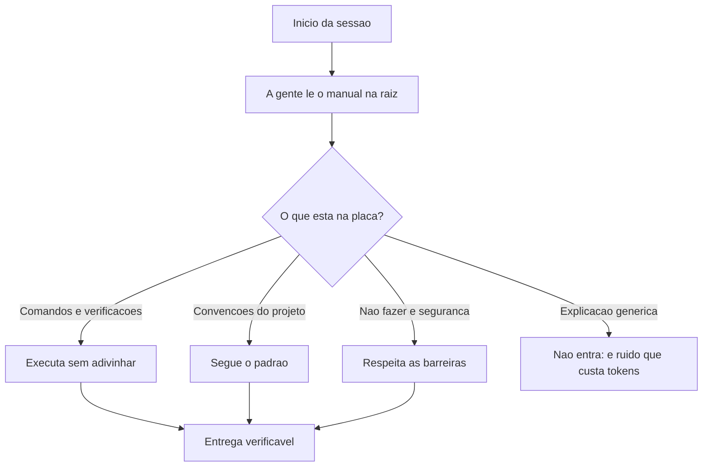

# Capítulo 6: CLAUDE.md e AGENTS.md: o manual de bordo do agente

## 1. Introdução

No Capítulo 5 você construiu a fundação invisível: entendeu que o conhecimento do projeto mora no repositório — não na janela do modelo — e arquitetou o contexto em três níveis. Agora vamos escrever o documento mais importante do Nível 1: o **manual de bordo do agente**. Na prática, isso são arquivos na raiz do repositório — `CLAUDE.md`, `AGENTS.md`, `README.md` — que o agente lê automaticamente no início de cada sessão e que definem como ele deve se comportar no seu projeto [1].

A diferença entre um projeto com manual de bordo e um sem ele é a diferença entre contratar um operário que conhece as regras do canteiro e contratar um que aprende as regras na marra — às custas da obra. Este capítulo ensina o que são esses arquivos, a regra de ouro do que entra e do que fica fora (baseada em pesquisa acadêmica de 2026), e escreve, passo a passo, o manual real da TorreDeControle. Ao final, seu agente vai começar cada sessão já sabendo: quem é o projeto, o que ele constrói, como verificar, o que não fazer [2].

## 2. Explica

### Os três arquivos e suas funções

Três arquivos compõem o manual de bordo moderno, com papéis complementares:

- **README.md**: o cartão de visita do projeto, para humanos — e o primeiro documento que o agente lê quando explora um repositório desconhecido. Descreve o que o projeto faz e como executá-lo.
- **CLAUDE.md**: o manual de diretrizes persistentes lido nativamente pelo agente da Anthropic no início de cada sessão. É o contrato entre o humano e o agente: regras, convenções, comandos, arquitetura.
- **AGENTS.md**: o padrão aberto, agnóstico de ferramenta, mantido pela Agentic AI Foundation sob a Linux Foundation, lido por Codex, Copilot, Gemini CLI, Cursor e Claude Code — o denominador comum da indústria [3].

A regra prática de 2026: **escreva o AGENTS.md como o manual universal e o CLAUDE.md como a camada específica do seu harness** — ou mantenha ambos apontando para o mesmo conteúdo, como este próprio repositório da Fábrica Agêntica faz com seus hardlinks. O importante não é a marca do arquivo: é existir um contrato explícito entre projeto e agente [4].

### A regra de ouro: o que entra e o que fica fora

A pergunta central é: o que vai no manual? A resposta foi objeto de pesquisa empírica em 2026 — e o resultado contraria o senso comum. Pesquisadores do ETH Zurich demonstraram que arquivos de contexto **gerados automaticamente por LLMs** reduzem a taxa de sucesso das tarefas em até 3% e aumentam os custos de inferência em mais de 20%, por redundância com a documentação nativa do repositório [5]. Em contraste, arquivos **redigidos manualmente** por engenheiros, focados estritamente em *detalhes não inferíveis*, geram ganhos reais de desempenho e eficiência.

A regra de ouro decorre diretamente dessa pesquisa: **o manual deve conter apenas o que o agente não consegue descobrir sozinho lendo o código**. O que é não inferível?

- Comandos de build, teste e verificação (o agente não deve adivinhar: `python -m pytest tests/`).
- Convenções do projeto que não estão no código (nomes, camadas, padrões de commit).
- Restrições de segurança e "não fazer" (nunca commitar `.env`, nunca rodar `git push --force`).
- Arquitetura e decisões de design que não são visíveis no código [6].

O que é inferível e **não deve** entrar: explicações genéricas de "o que é FastAPI", documentação que duplica o código, regras universais que qualquer agente já conhece. Cada linha desnecessária custa tokens em toda sessão — e pior, dilui o sinal das linhas necessárias.

### O custo de um manual inchado

O manual não é gratuito: ele entra na janela de **toda** sessão, para **todo** pedido. Um AGENTS.md de 5 mil tokens é um imposto permanente sobre cada interação com o agente — e um imposto sobre a qualidade, porque linha de ruído compete com linha de sinal. A disciplina do manual é a mesma da fundação do Capítulo 5: enxuto, estável, essencial. O que não é essencial vai para fora — para skills (Capítulo 9), specs (Capítulo 7) ou documentação sob demanda (Nível 3) [7].

### O manual como contrato, não como desejo

A última distinção conceitual: o manual de bordo não é uma carta de intenções ("gostaríamos que o agente fosse cuidadoso") — é um contrato com regras verificáveis. "Seja cuidadoso" não é regra; "nunca rode comandos destrutivos sem aprovação explícita" é regra. A diferença está na verificabilidade: regras boas podem ser checadas (o agente fez ou não fez), e é essa checagem que sustenta a governança do Capítulo 13 [8].

## 3. Ilustra

### A Placa de Regras do Canteiro

Volte ao canteiro de obras. Na entrada, há uma placa com as regras: horário de trabalho, uso obrigatório de capacete, proibido fumar, caminhão de concreto só com autorização. Nenhuma regra da placa explica o que é um capacete — todo operário sabe. A placa registra apenas o que é específico daquele canteiro: as regras que o operário não pode adivinhar e que, se violadas, custam caro.

O manual de bordo é essa placa. Ele não ensina o agente a programar (isso ele sabe); registra o que é específico do seu projeto: como verificar, o que não fazer, onde mora cada coisa. Um canteiro sem placa funciona até o primeiro acidente; um projeto sem manual funciona até a primeira regra violada — e a violação silenciosa, em código, é a mais cara de todas [9].



### A Placa que Explica o Capacete: Por Que Manual Inchado é Pior

Aqui está o ponto contraintuitivo — a segunda camada de analogia. A primeira mostrou a placa de regras. A segunda é sobre por que encher a placa de obviedades não protege ninguém — e ainda atrapalha quem lê.

Imagine uma placa de canteiro com cinquenta itens: os vinte que importam, mais trinta que explicam o óbvio — "um capacete é usado na cabeça", "cimento é um pó que endurece com água", "tijolos são retangulares". O operário lê a placa no primeiro dia, e as trinta obviedades competem com as vinte regras reais. No segundo dia, ele já não lê a placa — está longa demais. No terceiro dia, a regra que ele esqueceu é justamente uma das vinte verdadeiras [10].

Com o manual é idêntico: cada explicação genérica que entra no AGENTS.md compete com as regras reais, e quando o manual fica grande demais, o agente — como o operário — passa a ler com menos atenção ou a dar peso menor ao documento inteiro. Como Mestre de Obras, a disciplina é a mesma da fundação: menos, porém essencial. A placa perfeita tem dez itens, todos não inferíveis, todos verificáveis [11].

## 4. Técnica

### O AGENTS.md da TorreDeControle

Agora vamos escrever o manual real. Este é o AGENTS.md da TorreDeControle, aplicando a regra de ouro: apenas comandos, convenções e restrições não inferíveis:

```markdown
# AGENTS.md — TorreDeControle

Aplicativo web de gestão de tarefas de equipe (FastAPI + frontend estático).
Este arquivo é o contrato entre o projeto e os agentes que trabalham nele.
Leia antes de qualquer tarefa.

## Comandos e verificações
- Testes: `python -m pytest tests/` (obrigatório após qualquer mudança).
- Sintaxe: `python -m compileall app/` (rápido, roda antes dos testes).
- Servidor local: `python -m uvicorn app.api.main:app --reload`.
- Dependências: `pip install -r requirements.txt` (use venv).

## Estrutura e convenções
- `app/models/`: modelos de domínio (pydantic puro, SEM ORM).
- `app/services/`: lógica de negócio (sem HTTP, sem acesso direto a banco).
- `app/api/`: endpoints REST (thin layer: chamam services, não contêm regras).
- `frontend/`: HTML/CSS/JS estáticos consumindo a API.
- `tests/`: testes espelhando a estrutura de app/.
- Nomes de campos em inglês, snake_case; arquivos Python em snake_case.
- Commits no padrão conventional: `feat:`, `fix:`, `docs:`, `refactor:`.

## Regras de segurança (não negociáveis)
- NUNCA commitar `.env`, segredos ou arquivos gerados (ver .gitignore).
- NUNCA rodar comandos destrutivos (git push --force, drop de tabela) sem
  aprovação explícita do humano.
- NUNCA instalar pacotes sem registrar em requirements.txt.
- Migrações de banco só após revisão em ambiente de desenvolvimento.

## Arquitetura (decisões que não estão no código)
- Camada de domínio isolada (pydantic) para facilitar testes unitários.
- API REST JSON com autenticação por token (RFC 6750).
- Sem ORM até o Capítulo 8 definir o banco; depois, SQLAlchemy em app/db.

## Fluxo de trabalho do agente
1. Leia docs/especificacao.md e o mapa de contexto (docs/mapa_contexto.md).
2. Proponha o plano em fatias pequenas antes de codar.
3. Implemente com testes; rode `python -m pytest tests/` ao finalizar.
4. Faça commit conventional após cada fatia aprovada.
```

Repare no que esse manual **não** contém: não explica o que é FastAPI, não descreve a sintaxe de Python, não define o que é REST. Tudo isso é inferível — o agente sabe. O que ele registra é o não inferível: os comandos exatos, as convenções internas, as barreiras de segurança e as decisões de arquitetura invisíveis [12].

### O CLAUDE.md como camada específica

Se o seu harness lê CLAUDE.md, adicione a camada específica — regras de sessão e de comportamento próprias do agente que você usa:

```markdown
# CLAUDE.md — TorreDeControle

Siga o AGENTS.md da raiz para comandos, convenções e segurança.
Regras específicas de sessão:

- Trabalhe em fatias pequenas; nunca reescreva arquivos inteiros sem pedir.
- Ao executar comandos, mostre o resultado real (não resuma de memória).
- Se uma tarefa exigir mais de ~20 ações, proponha dividir em etapas e
  confirme antes de continuar.
- Registre decisões importantes em docs/decisoes.md (formato ADR).
- Antes de terminar, rode as verificações do AGENTS.md e reporte o resultado.
```

A divisão de papéis é limpa: AGENTS.md é o contrato universal do projeto; CLAUDE.md é o contrato de sessão do seu agente. Juntos, formam o manual completo — e o CLAUDE.md pode simplesmente referenciar o AGENTS.md para evitar duplicação [13].

### O Gerador de Manual: Verificando o Manual Contra o Repositório

Para fechar a parte técnica, aqui está uma ferramenta que verifica se o manual está atualizado em relação ao repositório — o equivalente à inspeção periódica da placa:

```python
# verificar_manual.py — Verifica se o manual cobre as pastas e comandos reais
import subprocess
from pathlib import Path

PASTAS_ESPERADAS = [
    "app", "app/models", "app/services", "app/api",
    "frontend", "tests", "docs",
]
ARQUIVO_MANUAL = Path("AGENTS.md")

def pastas_faltantes() -> list[str]:
    """Retorna pastas do manual que não existem no repositório."""
    return [p for p in PASTAS_ESPERADAS if not Path(p).is_dir()]

def manual_obsoleto() -> bool:
    """True se o manual não menciona alguma pasta existente no projeto."""
    if not ARQUIVO_MANUAL.exists():
        return True
    texto = ARQUIVO_MANUAL.read_text(encoding="utf-8")
    for p in PASTAS_ESPERADAS:
        if Path(p).is_dir() and p not in texto:
            print(f"  [AVISO] manual nao menciona a pasta {p}")
    return False

def testes_passam() -> bool:
    """Roda a suite de testes e retorna o exit code como booleano."""
    try:
        subprocess.run(
            ["python", "-m", "pytest", "tests/", "-q"],
            capture_output=True, check=True,
        )
        return True
    except subprocess.CalledProcessError:
        return False

def main() -> None:
    """Checagem de sanidade do manual de bordo."""
    problemas: list[str] = []
    if not ARQUIVO_MANUAL.exists():
        problemas.append("AGENTS.md ausente na raiz")
    if manual_obsoleto():
        problemas.append("AGENTS.md desatualizado (pastas novas sem mencao)")
    problemas += [f"pasta {p} ausente" for p in pastas_faltantes()]
    if problemas:
        print("MANUAL COM PROBLEMAS:")
        for p in problemas:
            print(f"  - {p}")
        return
    print("MANUAL OK: estrutura coberta pelo manual")
    print(f"TESTES: {'PASSANDO' if testes_passam() else 'FALHANDO (verifique)'}")

if __name__ == "__main__":
    main()
```

O padrão aqui é o mesmo de todo o livro: **verificações determinísticas substituem suposições**. O manual não "parece" atualizado — o script prova [14].

### O Protocolo de Manutenção do Manual

O manual é um documento vivo, com um ciclo de manutenção explícito:

1. **Escrever**: criar o AGENTS.md/CLAUDE.md antes da primeira sessão de trabalho.
2. **Atualizar por gatilho**: revisar sempre que (a) uma nova pasta nasce, (b) um comando muda, (c) uma decisão de arquitetura é tomada, (d) um incidente revela uma regra faltante.
3. **Enxugar periodicamente**: a cada mês, cortar linhas que se tornaram inferíveis ou redundantes.
4. **Verificar**: rodar `verificar_manual.py` na manutenção — a placa deve refletir o canteiro [15].

## 5. Aplica

### A Cena de Contraste: O Agente Que Não Sabia das Regras

Imagine a terça-feira em que você começa a trabalhar num repositório sem manual de bordo — herdado de um projeto antigo — e decide usar seu agente para adicionar uma feature. Você pede: "adiciona o endpoint de deletar tarefa". O agente encontra o padrão dos outros endpoints, implementa, e — sem manual que diga o contrário — roda `git push` direto para a branch principal, instala uma biblioteca nova sem registrar, e deleta uma tabela de teste que outra pessoa usava. O repositório quebra, o ambiente de desenvolvimento de alguém fica órfão, e você passa a tarde apagando incêndio.

O diagnóstico: não havia placa de regras — e o agente, corretamente, seguiu o padrão inferível do código em vez das regras invisíveis do projeto [16]. A culpa não é do agente: ninguém registrou que push direto é proibido, que pacotes exigem registro e que a tabela de teste é compartilhada.

A correção: você escreve o AGENTS.md com as três categorias — comandos, convenções, barreiras de segurança — e o CLAUDE.md com as regras de sessão. Na semana seguinte, o mesmo agente, no mesmo repositório, implementa a mesma feature: propõe o plano, pede confirmação do push, registra a dependência e roda os testes. O manual não tornou o agente mais inteligente: tornou o canteiro legível — e regras legíveis são regras seguidas [17].

### Armadilhas Comuns ao Escrever o Manual

- **Manual gerado por IA**: pesquisa do ETH mostra que manuais gerados automaticamente reduzem desempenho e aumentam custo. Escreva à mão, focando no não inferível [5].
- **Manual inchado com obviedades**: cada linha desnecessária custa tokens em toda sessão e dilui o sinal. Enxugue até o essencial.
- **README confundido com manual**: README é cartão de visita; AGENTS.md/CLAUDE.md são o contrato de trabalho. Os três coexistem com papéis distintos.
- **Regras não verificáveis**: "seja cuidadoso" não é regra; "nunca rode X sem aprovação" é. Escreva regras que possam ser checadas.
- **Manual órfão da estrutura**: quando o código evolui e o manual não, o agente aprende o padrão errado. Manutenção por gatilho e verificação periódica resolvem [18].
- **Duplicar conteúdo entre CLAUDE.md e AGENTS.md**: duplicação significa dois documentos para manter. Referencie um no outro.

### Exercício Prático

Escreva o AGENTS.md e o CLAUDE.md da TorreDeControle usando os modelos deste capítulo, adaptando-os ao seu harness. Depois, abra uma sessão nova do agente na raiz do projeto e pergunte: "resuma as regras deste projeto". A resposta deve refletir o manual — comandos, convenções e barreiras. Se o agente não citar as regras de segurança, o manual não está sendo lido: verifique o harness.

### Aprofundamento: O Modelo de Manual para Projetos Futuros

O manual da TorreDeControle é específico do projeto — mas a *estrutura* dele é reutilizável. Este é o modelo genérico que você adapta para qualquer projeto futuro, com os campos que a regra de ouro exige e os espaços onde a tentação de encher de obviedade mora:

```markdown
# AGENTS.md — <Nome do Projeto>

<Uma frase: o que o projeto faz e a stack principal.>

## Comandos e verificações
- Testes: `<comando exato>` (obrigatório após qualquer mudança).
- Sintaxe: `<comando exato>`.
- Rodar local: `<comando exato>`.
- Dependências: `<comando exato>` (use ambiente isolado).

## Estrutura e convenções
- <pasta>: <papel — uma linha, o que é proibido nela também>
- <padrão de nomes e commits>

## Regras de segurança (não negociáveis)
- NUNCA <ação 1> sem <condição>.
- NUNCA <ação 2>.
- <segredo/artefato> nunca vai para o repositório.

## Arquitetura (decisões que não estão no código)
- <decisão 1: por que o domínio é isolado, etc.>
- <decisão 2>

## Fluxo de trabalho do agente
1. Leia a spec e o mapa de contexto.
2. Proponha o plano em fatias pequenas.
3. Implemente com testes e rode a verificação.
4. Commit convencional após cada fatia aprovada.
```

As três armadilhas do preenchimento, na prática: (1) *o campo "Uma frase" não é licença para um parágrafo* — se a descrição do projeto passa de duas linhas, o README (e não o AGENTS.md) é o lugar; (2) *as regras de segurança não são sugestões* — toda linha "NUNCA" deve ter um mecanismo no Capítulo 13 (hook) que a aplique; (3) *o fluxo de trabalho do agente é o método do Capítulo 8* — ele se repete em todos os projetos, o que significa que você pode copiar esse bloco sem culpa. O que muda entre projetos é o específico; o que se copia é o esqueleto do método.

### Aprofundamento: A Revisão Trimestral do Manual

O manual de bordo envelhece — e a revisão periódica é o que impede a placa de regras de virar placa de museu. A revisão trimestral do manual segue um protocolo de quatro passos, com o agente como assistente da auditoria:

1. **Medir o custo**: quantos caracteres/tokens o manual consome por sessão? O custo cresceu desde a última revisão? (A régua do Capítulo 16.)
2. **Caçar o obsoleto**: cada linha responde "isto ainda é verdade e ainda é não inferível?" Comandos que mudaram, pastas que nasceram, regras que o código já impõe sozinho — tudo isso sai.
3. **Caçar o inferível**: cada linha responde "o agente descobriria isso lendo o código?" Se descobriria, a linha sai — conhecimento inferível não paga imposto de sessão.
4. **Registrar o que mudou**: a revisão vira entrada no diário de decisões — o manual anterior, o que foi cortado e por quê. A evolução do manual fica rastreável.

O papel do agente na revisão: ele pode propor cortes (com a régua de inferibilidade do Capítulo 6), mas a decisão final é sua — porque o agente não sabe o que *você* considera essencial do negócio. O resultado da revisão trimestral é um manual enxuto que custa menos, sinaliza melhor e continua sendo lido — e é essa combinação que o Capítulo 16 transforma em economia de tokens real.

```bash
# Trigger de revisao em um comando:
# Se o manual passou de ~3 mil caracteres ou nenhuma linha mudou em 3 meses,
# e hora de revisar (enxugar ou atualizar).
wc -c AGENTS.md CLAUDE.md
```

## 6. Conclusão

Neste capítulo você escreveu o manual de bordo do seu projeto: entendeu os papéis de README, CLAUDE.md e AGENTS.md; internalizou a regra de ouro — apenas o não inferível, nunca obviedade; aprendeu a pesquisa do ETH que mostra o custo de manuais gerados por IA; e criou os manuais reais da TorreDeControle com comandos, convenções, barreiras de segurança e um script de verificação de manutenção [19]. A lição central: o manual é um contrato verificável entre projeto e agente — enxuto, estável, essencial.

Seu desafio: ter AGENTS.md e CLAUDE.md na raiz da TorreDeControle, e provar que o agente os lê — perguntando as regras do projeto numa sessão nova e conferindo a resposta.

No Capítulo 7, vamos dar o próximo passo do método: modelar o domínio e especificar antes de codar — o spec-driven development, transformando a ideia da TorreDeControle em um contrato verificável que guia todos os agentes.

## 7. Referências Bibliográficas

[1] AUGMENT CODE. *How to Build Your AGENTS.md (2026): The Context File That Makes AI Coding Agents Actually Work*. Disponível em: https://www.augmentcode.com/guides/how-to-build-agents-md. Acesso em: 07 ago. 2026.

[2] TERMDOCK. *SKILL.md vs CLAUDE.md vs AGENTS.md Compared*. Disponível em: https://www.termdock.com/blog/skill-md-vs-claude-md-vs-agents-md. Acesso em: 07 ago. 2026.

[3] AUGMENT CODE. *How to Build Your AGENTS.md (2026): The Context File That Makes AI Coding Agents Actually Work*. Disponível em: https://www.augmentcode.com/guides/how-to-build-agents-md. Acesso em: 07 ago. 2026.

[4] TERMDOCK. *SKILL.md vs CLAUDE.md vs AGENTS.md Compared*. Disponível em: https://www.termdock.com/blog/skill-md-vs-claude-md-vs-agents-md. Acesso em: 07 ago. 2026.

[5] HUß, Roland. *What Goes in AGENTS.md (and What Doesn't)*. Disponível em: https://ro14nd.de/what-goes-in-agents-md/. Acesso em: 07 ago. 2026.

[6] ZIEMINSKI, Karo. *Context Engineering for Product Builders: The 2026 Operating Manual*. Disponível em: https://karozieminski.substack.com/p/context-engineering-product-builders-guide-2026. Acesso em: 07 ago. 2026.

[7] TASKADE. *Context Engineering: What It Is + How to Do It (2026)*. Disponível em: https://www.taskade.com/blog/context-engineering. Acesso em: 07 ago. 2026.

[8] CLOUD SECURITY ALLIANCE. *Agentic MCP Security Best Practices Guide*. Disponível em: https://labs.cloudsecurityalliance.org/agentic/agentic-mcp-security-best-practices-v1/. Acesso em: 07 ago. 2026.

[9] IT REVOLUTION. *AI's Mirror Effect: How the 2025 DORA Report Reveals Your Organization's True Capabilities*. Disponível em: https://itrevolution.com/articles/ais-mirror-effect-how-the-2025-dora-report-reveals-your-organizations-true-capabilities/. Acesso em: 07 ago. 2026.

[10] BUI, Nghi D. Q. *Building AI Coding Agents for the Terminal: Scaffolding, Harness, Context Engineering, and Lessons Learned*. Disponível em: https://arxiv.org/html/2603.05344v1. Acesso em: 07 ago. 2026.

[11] WONG, Sherman et al. *Confucius Code Agent: Scalable Agent Scaffolding for Real-World Codebases*. Disponível em: https://arxiv.org/abs/2512.10398. Acesso em: 07 ago. 2026.

[12] JIN, Haolin et al. *From LLMs to LLM-based Agents for Software Engineering: A Survey of Current, Challenges and Future*. Disponível em: https://arxiv.org/abs/2408.02479. Acesso em: 07 ago. 2026.

[13] EXPLAINX.AI. *AI Coding Agent Evals on Real Repos (2026)*. Disponível em: https://explainx.ai/blog/ai-coding-agent-evals-real-repos-2026. Acesso em: 07 ago. 2026.

[14] DORA / GOOGLE CLOUD. *Publications and ROI of AI-assisted Software Development Report*. Disponível em: https://dora.dev/research/publications/. Acesso em: 07 ago. 2026.

[15] HE, Kang; ROY, Kaushik. *SWE-Adept: An LLM-Based Agentic Framework for Deep Codebase Analysis and Structured Issue Resolution*. Disponível em: https://arxiv.org/abs/2603.01327. Acesso em: 07 ago. 2026.

[16] MIT SLOAN MANAGEMENT REVIEW. ANDERSON, Edward; PARKER, Geoffrey; TAN, Burcu. *The Hidden Costs of Coding With Generative AI*. Disponível em: https://sloanreview.mit.edu/article/the-hidden-costs-of-coding-with-generative-ai/. Acesso em: 07 ago. 2026.

[17] SOFTJOURN. *AI Software Development Statistics 2026: Adoption, Productivity, and Risk*. Disponível em: https://softjourn.com/insights/ai-software-dev-stats. Acesso em: 07 ago. 2026.

[18] PRINCETON UNIVERSITY. *SWE-bench Verified & Pro*. Disponível em: https://www.swebench.com. Acesso em: 07 ago. 2026.

[19] CODIHAUS. *AI Developer Productivity Data: 2X Faster, 55% Speed Gain, Enterprise ROI Analysis*. Disponível em: https://codihaus.com/news/ai-developer-productivity-data-engineering-leaders. Acesso em: 07 ago. 2026.

[20] GARTNER. *Gartner Identifies the Top Strategic Technology Trends for 2026*. Disponível em: https://www.gartner.com/en/newsroom/press-releases/2025-10-20-gartner-identifies-the-top-strategic-technology-trends-for-2026. Acesso em: 07 ago. 2026.

[21] DENG, Xiang et al. *SWE-Bench Pro: Can AI Agents Solve Long-Horizon Software Engineering Tasks?* Disponível em: https://arxiv.org/abs/2509.16941. Acesso em: 07 ago. 2026.

[22] VALUE ADD VC. *AI Coding Productivity Study Data: What METR, McKinsey, and GitHub Found in 2026*. Disponível em: https://valueaddvc.com/blog/ai-coding-productivity-study-data-what-metr-mckinsey-and-github-actually-found-in-2026. Acesso em: 07 ago. 2026.
