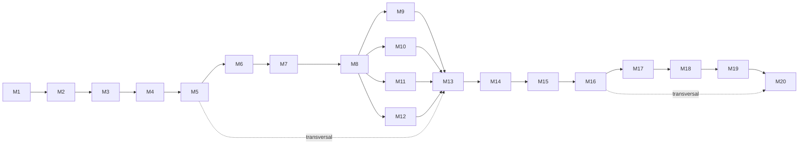

# PLAYBOOK AIDD — Do Zero ao Deploy

O livro *AI Driven Development: Do Zero ao Deploy* ensina. Este playbook faz executar: converte os 20 capítulos em 20 missões com entregável, verificador determinístico, critério de pronto e prompt pronto para colar no agente. Quem termina o playbook não termina com anotações — termina com um repositório versionado, testado, auditado e em produção: a **TorreDeControle**.

| Dimensão | Livro | Playbook |
|---|---|---|
| Unidade | Capítulo (EITA, 7 seções) | Missão (card operacional de 1 página) |
| Verbo dominante | Explicar, ilustrar | Executar, verificar, registrar |
| Prova de aprendizado | Exercício ao fim da seção *Aplica* | Gate automatizado (`verificar_*.py`) + evidência no repositório |
| Leitura | Linear, 284 páginas | Consulta por missão, ~120 páginas + anexos destacáveis |
| Saída | Conhecimento | TorreDeControle em produção + portfólio |

**Princípio de projeto:** o playbook não repete a teoria do livro. Ele referencia (`→ Cap. N §S`) e entrega o que a prosa não pode: formulário, checklist, gate, cronograma e rubrica.

---

# Bloco 0 — Como usar este playbook

## 0.1 Personas atendidas

| Persona | Origem | O que o playbook resolve |
|---|---|---|
| **Mestre de Obras solo** | Leitor iniciante do livro | Ordem de execução, gate de cada etapa, não travar |
| **Time adotando AIDD** | Squad de 3–8 devs | Padroniza AGENTS.md, permissões, revisão e CI entre pessoas |
| **Instrutor / bootcamp** | Formação técnica | Rubrica, entregas avaliáveis, banco de perguntas |
| **Auditor / tech lead** | Governança | Evidência objetiva do que foi feito (trilha, vereditos, painéis) |

## 0.2 Contrato do Mestre de Obras (assine antes da Missão 1)

1. **Nenhuma fatia entra sem verificador que a prove.** Toda entrega tem um comando que decide aprovado ou reprovado.
2. **Nenhum segredo entra no repositório** — `.env.example` documenta, a plataforma injeta.
3. **Nenhuma decisão de arquitetura fica só no chat** — vai para `docs/decisoes.md`.
4. **Autonomia sobe por rampa** (aprovar tudo → aprovar destrutivo → autônomo com hooks).
5. **O agente propõe; a assinatura do commit é humana.**

## 0.3 Convenções de notação (usadas em todos os cards)

| Símbolo | Significado |
|---|---|
| `→ Cap. N §S` | Referência ao livro (capítulo, seção EITA) |
| **ENTREGA** | Arquivo que deve existir no repositório ao fim da missão |
| **GATE** | Comando/script que decide aprovado ou reprovado |
| **DoD** | Definition of Done — lista binária, sem "quase" |
| **⚠︎** | Armadilha catalogada no livro (seção *Aplica*) |
| **⏱** | Tempo estimado para iniciante |

**Regra de ouro:** se o gate não passou, a missão não terminou. Não se avança de estágio com gate vermelho.

---

# Bloco 1 — Mapa da Obra

Os 5 Estágios espelham as 5 Partes do livro e funcionam como *milestones* com corte seco.

| Estágio | Parte do livro | Missões | Marco (o que existe ao final) | ⏱ |
|---|---|---|---|---|
| **E1 — Terreno Baldio** | I. Fundamentos | 1–4 | Canteiro instalado, repositório inicial, primeiro prompt de engenharia entregue e commitado | 6–8 h |
| **E2 — Estrutura** | II. Na Prática | 5–8 | Contexto arquitetado, manual do agente, spec verificável, esqueleto em 3 fatias | 10–12 h |
| **E3 — Instalações** | III. Avançando | 9–12 | Skills, MCP conectado, tool própria blindada, subagentes orquestrados | 12–14 h |
| **E4 — Acabamento** | IV. Profissionalizando | 13–16 | Governança por hooks, suíte RN1–RN7, revisão em 2 camadas, orçamento de tokens | 12–14 h |
| **E5 — Entrega das Chaves** | V. Mundo Real | 17–20 | Pipeline com 4 gates, deploy em nuvem, observabilidade + DORA, portfólio | 14–16 h |



M5 e M16 são transversais: entram no início de E2 e são revisitados a cada estágio.

---

# Bloco 2 — As 20 Missões

Formato **rígido e idêntico** para as 20 — é o que torna o playbook consultável:

```
MISSÃO N — <título curto e imperativo>
Fonte: Cap. N do livro · Estágio EX · ⏱ <tempo>

① PERGUNTA-CHAVE     uma frase que a missão responde
② PRÉ-REQUISITO      missão anterior + estado esperado do repositório
③ ENTREGAS           lista de arquivos com caminho exato
④ EXECUÇÃO           passos numerados (referência ao §4 Técnica do capítulo)
⑤ PROMPT PRONTO      bloco copiável, no padrão de 5 partes (Cap. 4)
⑥ GATE               comando + saída esperada
⑦ DoD                caixas binárias (5 a 7 itens)
⑧ ⚠︎ ARMADILHAS      3 erros mais comuns + sintoma + correção
⑨ REGISTRO           o que anotar em docs/decisoes.md ou no painel
```

## Tabela-mestre das 20 missões

| # | Missão | Entrega principal | Gate | Estágio |
|---|---|---|---|---|
| 1 | Decidir o modo de trabalho (vibe/agentic/AIDD) | `docs/especificacao.md` (corte inicial) | Matriz de decisão preenchida + 3 perguntas respondidas | E1 |
| 2 | Mapear as 4 camadas do seu ambiente | `docs/mapa_camadas.md`, `harness_minimo.py` executado | Checklist de diagnóstico de camada sem lacuna | E1 |
| 3 | Erguer o canteiro | `.gitignore`, `README.md`, estrutura de pastas, commit inicial | `verificar_ambiente.py` → `CANTEIRO PRONTO` | E1 |
| 4 | Escrever o primeiro prompt de engenharia | Primeira entrega real gerada pelo agente + commit | `py_compile` OK + entrega bate com RF3 | E1 |
| 5 | Arquitetar o contexto | `docs/mapa_contexto.md`, `docs/estado_sessao.md`, `diario_decisoes.py` | Sessão reaberta a partir do resumo responde no nível anterior | E2 |
| 6 | Escrever o manual de bordo | `AGENTS.md`, `CLAUDE.md` | `verificar_manual.py` OK + agente recita as regras de segurança | E2 |
| 7 | Modelar o domínio | Glossário, modelo ER, RN1–RN7, critérios de aceite do RF3 | `verificar_spec.py` → estrutura OK | E2 |
| 8 | Gerar o esqueleto em 3 fatias | `app/` scaffoldado, 3 commits (fundação, colunas, laje) | `verificar_esqueleto.py` + suíte de testes verde | E2 |
| 9 | Criar as skills do projeto | `.claude/skills/adicionar-rota-api/`, `.../revisar-codigo-gerado/`, catálogo | `verificar_skills.py` + skill invocada numa rota nova | E3 |
| 10 | Conectar o agente ao mundo (MCP) | Config MCP (banco local + 1 API externa, escopo mínimo) | `verificar_mcp.py` + teste conversacional lista tabelas | E3 |
| 11 | Construir uma tool própria e blindada | `app/tools/mover_tarefa.py`, `servidor_tools.py`, `test_seguranca_tools.py` | Transição inválida bloqueada com **422** ponta a ponta | E3 |
| 12 | Montar a equipe de subagentes | 3 definições (pesquisador, implementador, revisor), `coordenador_subagentes.py` | `verificar_subagentes.py` + 1 feature entregue em lote | E3 |
| 13 | Instalar o porteiro (governança) | `docs/mapa_permissoes.md`, `bloquear_push_forcado.sh`, hooks | `verificar_governanca.py` OK + comando proibido é bloqueado | E4 |
| 14 | Provar que o prédio aguenta | `tests/test_rn*.py` (RN1–RN7), `ci_sintaxe.sh`, hook pré-commit | `verificar_cobertura_testes.py` + teste vermelho barra o commit | E4 |
| 15 | Rodar a inspeção de obra | `auditar_repositorio.py`, `registrar_veredito.py`, `docs/vereditos.md` | Ciclo auditoria→revisor até **APROVADO** com commit | E4 |
| 16 | Fechar o orçamento da obra | `orcamento_tokens.py`, `docs/memoria.md`, AGENTS.md enxuto | Fatura e latência comparadas antes/depois (registro numérico) | E4 |
| 17 | Montar a rampa de entrega | `requirements.lock.txt`, `Dockerfile`, CI YAML, `pipeline_local.sh` | `testar_pipeline.py` → 4 gates verdes + manifest do artefato | E5 |
| 18 | Entregar as chaves (deploy) | `app/config.py`, `.env.example`, `scripts/migrar.py`, smoke test | `smoke_test_producao.py` verde no ambiente publicado | E5 |
| 19 | Instalar os medidores | `logging_config.py`, `metricas.py`, `health.py`, `relatorio_dora.py` | Anomalia simulada → diagnóstico com hipóteses testadas | E5 |
| 20 | Assumir o posto (carreira) | Mapa de competências, doc da jornada, `gerar_portfolio.py`, reflexão ética | Elevator pitch de 30 s gravado + portfólio publicado | E5 |

---

## MISSÃO 1 — DECIDIR O MODO DE TRABALHO

Fonte: Cap. 1 · Estágio E1 · ⏱ 45 min

① PERGUNTA-CHAVE
   Como você vai usar a IA nesta obra: como autocomplete, como agente solto ou como sistema dirigido por especificação?

② PRÉ-REQUISITO
   Nenhum. É a primeira missão. Tenha o livro à mão para a matriz de decisão do Cap. 1 §2.

③ ENTREGAS
   docs/especificacao.md   (corte inicial: propósito, público, RF1–RF5 em uma frase cada)
   docs/decisoes.md        (decisão 001: modo de trabalho escolhido + motivo)

④ EXECUÇÃO   → Cap. 1 §2 (matriz) e §4 (corte da especificação)
   1. Preencher a matriz comparando os três modos: vibe coding, agentic engineering e AIDD.
   2. Responder as 3 perguntas da matriz: quem assina a entrega, quem verifica a qualidade, quanto o erro custa.
   3. Escrever o corte inicial da especificação em `docs/especificacao.md`.
   4. Registrar a decisão no diário com data e revisão marcada.
   5. Commit inicial do documento.

⑤ PROMPT PRONTO
   ## Papel e contexto — Você é um consultor de desenvolvimento agêntico; eu sou um desenvolvedor iniciante escolhendo o modo de trabalho de um novo projeto.
   ## Tarefa específica — Compare vibe coding, agentic engineering e AIDD para o projeto "app web de gestão de tarefas com FastAPI", considerando: quem assina, quem verifica, custo do erro.
   ## Restrições — Não proponha código. Máximo 1 parágrafo por modo. Termine com recomendação objetiva.
   ## Formato de saída — Tabela 3×4 seguida de 1 recomendação com motivo.
   ## Critérios de aceite — A recomendação é justificada; nenhum modo é descartado sem argumento.

⑥ GATE
   Revisão manual da matriz (3 modos × 4 dimensões preenchidas) +
   3 perguntas respondidas por escrito no diário.

⑦ DoD
   [ ] Matriz de decisão com 3 modos e 4 dimensões preenchida
   [ ] 3 perguntas da matriz respondidas por escrito
   [ ] `docs/especificacao.md` com propósito, público e RF1–RF5 esboçados
   [ ] `docs/decisoes.md` com decisão 001 registrada (modo + motivo + data de revisão)
   [ ] Commit do documento criado

⑧ ⚠︎ ARMADILHAS
   Escolher "AIDD" sem entender o custo → sintoma: primeira fatia vira prompt solto. Correção: a matriz antes do código.
   Confundir AIDD com "usar IA em tudo" → sintoma: o agente decide arquitetura sozinho. Correção: reeleia o contrato 3 e 5.
   Pular a decisão → sintoma: modo muda no meio da obra. Correção: decisão registrada é o que sustenta a Missão 4.

⑨ REGISTRO
   `docs/decisoes.md`: decisão 001 — modo de trabalho, motivo, data de revisão sugerida.

---

## MISSÃO 2 — MAPEAR AS 4 CAMADAS DO AMBIENTE

Fonte: Cap. 2 · Estágio E1 · ⏱ 60 min

① PERGUNTA-CHAVE
   Quais são as peças concretas das camadas Tela, Harness, LLM e Tools no seu setup — e o que falta?

② PRÉ-REQUISITO
   M1 concluída. Entenda a arquitetura de quatro camadas (Cap. 2 §2): a Tela onde você interage, o Harness que transforma o modelo em agente, o LLM como cérebro e as Tools como mãos que tocam o mundo real.

③ ENTREGAS
   docs/mapa_camadas.md      (tabela das 4 camadas com peças concretas e pendências)
   harness_minimo.py         (harness didático que ilustra o ciclo perceive-reason-act)

④ EXECUÇÃO   → Cap. 2 §4, passos 1 e 2
   1. Desenhar o diagrama de blocos do seu setup com as 4 camadas.
   2. Preencher a tabela de mapeamento com as peças concretas de cada camada (incluindo servidores MCP configurados).
   3. Executar o `harness_minimo.py` e observar as duas saídas (perceive-reason-act).
   4. Anotar pendências de camada para M3 (canteiro) e M10 (MCP).
   5. Commit.

⑤ PROMPT PRONTO
   ## Papel e contexto — Você é um arquiteto de ferramentas agênticas; eu quero auditar meu ambiente de desenvolvimento.
   ## Tarefa específica — Liste as peças típicas de cada camada (Tela, Harness, LLM, Tools) no ecossistema de 2026, com uma linha de função por peça.
   ## Restrições — Não invente peças; se uma camada estiver vazia no meu setup, marque como pendência.
   ## Formato de saída — Tabela camada × peça × função × pendência.
   ## Critérios de aceite — 4 camadas com pelo menos 1 peça real cada; pendências explicitamente marcadas.

⑥ GATE
   Checklist de diagnóstico de camada preenchido sem lacuna (cada camada tem peça identificada ou pendência anotada) +
   `python harness_minimo.py` executa sem erro.

⑦ DoD
   [ ] `docs/mapa_camadas.md` com as 4 camadas mapeadas
   [ ] Pendências anotadas por camada (sem lacunas em branco)
   [ ] `harness_minimo.py` executado e o ciclo perceive-reason-act observado
   [ ] Pendências encaminhadas para M3/M10 anotadas
   [ ] Commit criado

⑧ ⚠︎ ARMADILHAS
   Mapear só o que "funciona" → sintoma: pendências invisíveis. Correção: a pendência anotada é o plano.
   Confundir camada com ferramenta → sintoma: lista de produtos no lugar de camadas. Correção: função da peça define a camada.
   Não rodar o harness → sintoma: teoria sem observação. Correção: execute e cole a saída no mapa.

⑨ REGISTRO
   `docs/decisoes.md`: pendências por camada viram tarefas das Missões 3 e 10.

---

## MISSÃO 3 — ERGUER O CANTEIRO

Fonte: Cap. 3 · Estágio E1 · ⏱ 90 min

① PERGUNTA-CHAVE
   O seu ambiente está pronto para receber obra — editor, python, git e repositório verificados?

② PRÉ-REQUISITO
   M2 concluída (pendências de camada conhecidas). Python 3 instalado e git configurado.

③ ENTREGAS
   .gitignore                 (python + venv + segredos + artefatos)
   README.md                  (o que é o projeto, como rodar, convenções)
   estrutura de pastas        (app/, tests/, docs/, scripts/, .claude/)
   verificar_ambiente.py      (gate do canteiro)

④ EXECUÇÃO   → Cap. 3 §4, passos 1 a 4
   1. Instalar/verificar as ferramentas da camada (editor, python, git).
   2. Criar o repositório e o `.gitignore` (venv, `__pycache__`, `.env`, `*.db`).
   3. Criar a estrutura de pastas e o `README.md`.
   4. Escrever e rodar `verificar_ambiente.py` (checa python, git, estrutura e pastas-chave).
   5. Commit inicial do canteiro.

⑤ PROMPT PRONTO
   ## Papel e contexto — Você é o engenheiro de setup do projeto TorreDeControle; o ambiente está sendo erguido do zero.
   ## Tarefa específica — Escreva o script `verificar_ambiente.py` que checa: python ≥ 3.10, git instalado, pastas app/ tests/ docs/ scripts/ .claude/ presentes, .gitignore com as entradas de venv e .env. Imprima "CANTEIRO PRONTO" se tudo passar.
   ## Restrições — Python puro (stdlib), sem dependências externas. Saída legível, um item por linha.
   ## Formato de saída — 1 arquivo .py + exemplo da saída no comentário do topo.
   ## Critérios de aceite — Rodando o script num ambiente saudável, a última linha é "CANTEIRO PRONTO".

⑥ GATE
   `python verificar_ambiente.py` → `CANTEIRO PRONTO`

⑦ DoD
   [ ] `.gitignore` cobre venv, __pycache__, .env e arquivos .db
   [ ] `README.md` descreve projeto, execução e convenções
   [ ] Pastas app/ tests/ docs/ scripts/ .claude/ criadas
   [ ] `verificar_ambiente.py` → CANTEIRO PRONTO
   [ ] Commit inicial criado

⑧ ⚠︎ ARMADILHAS
   `.gitignore` incompleto → sintoma: .env vazado num commit futuro (M18 sofre). Correção: teste com `git status` após criar um .env de teste.
   Canteiro sem venv → sintoma: dependências globais quebram. Correção: venv na raiz, ignorada pelo git.
   Pular o verificar → sintoma: camada quebrada só descoberta na M4. Correção: gate antes de avançar.

⑨ REGISTRO
   `docs/decisoes.md`: ferramentas escolhidas (editor, versão do python, gerenciador de pacotes).

---

## MISSÃO 4 — ESCREVER O PRIMEIRO PROMPT DE ENGENHARIA

Fonte: Cap. 4 · Estágio E1 · ⏱ 90 min

① PERGUNTA-CHAVE
   O que muda quando o prompt deixa de ser um pedido e vira um briefing de engenharia em 5 partes?

② PRÉ-REQUISITO
   M3 concluída (canteiro pronto). A estrutura do prompt de 5 partes do Cap. 4 §4: Papel e contexto · Tarefa específica · Restrições e regras · Formato de saída · Critérios de aceite.

③ ENTREGAS
   app/models/tarefa.py        (modelo de domínio da entidade Tarefa, conforme RF3)
   primeira entrega commitada

④ EXECUÇÃO   → Cap. 4 §4, passos 1 a 3
   1. Escrever o prompt de 5 partes para o modelo de domínio da Tarefa (RF3).
   2. Colar no agente e revisar a entrega contra o RF3 (campos, Enums, obrigatoriedades).
   3. Compilar com `python -m py_compile`.
   4. Commit com mensagem descritiva.

⑤ PROMPT PRONTO
   ## Papel e contexto — Você é o desenvolvedor do projeto TorreDeControle; a especificação em docs/especificacao.md é a fonte de verdade. O projeto usa FastAPI e Python 3.
   ## Tarefa específica — Crie o modelo de domínio da entidade Tarefa conforme o requisito RF3 da especificação, em app/models/tarefa.py.
   ## Restrições — Os campos refletem exatamente o RF3. Status e prioridade são Enum com os valores definidos no RF3 ("a_fazer", "em_andamento", "concluida"). Sem implementação de banco nesta fatia.
   ## Formato de saída — 1 arquivo .py com dataclasses/Enums + 3 linhas resumindo as decisões de modelagem.
   ## Critérios de aceite — `python -m py_compile app/models/tarefa.py` passa; os campos e Enums correspondem ao RF3.

⑥ GATE
   `python -m py_compile app/models/tarefa.py` → sem erro
   Entrega conferida contra o RF3 (campos título, descrição, status, prioridade, responsável)

⑦ DoD
   [ ] Prompt escrito no padrão de 5 partes e salvo (docs/prompts/)
   [ ] `app/models/tarefa.py` criado pelo agente com o prompt
   [ ] `python -m py_compile app/models/tarefa.py` passa
   [ ] Campos e Enums conferidos contra o RF3
   [ ] Commit "feat: modelo de dominio da entidade Tarefa (RF3)"

⑧ ⚠︎ ARMADILHAS
   Prompt de uma frase → sintoma: agente decide design por conta própria. Correção: sempre as 5 partes.
   Critério de aceite vago ("fique bom") → sintoma: gate impossível. Correção: critério executável (compila? bate com RF3?).
   Aceitar a primeira saída → sintoma: erro de RF passa. Correção: conferir a entrega contra a spec antes do commit.

⑨ REGISTRO
   `docs/decisoes.md`: decisão de modelagem (dataclasses, Enums) + a lição do primeiro prompt.

---

## MISSÃO 5 — ARQUITETAR O CONTEXTO

Fonte: Cap. 5 · Estágio E2 · ⏱ 75 min

① PERGUNTA-CHAVE
   Quando você reabrir a sessão amanhã, o agente vai lembrar do nível certo de contexto — ou vai começar do zero?

② PRÉ-REQUISITO
   M4 concluída. Entenda os 3 níveis de contexto e a higiene de sessão em três tempos do Cap. 5 §2–§4: abertura (resumo carregado), meio (diário em tempo real), encerramento (estado salvo).

③ ENTREGAS
   docs/mapa_contexto.md       (arquitetura de contexto em 3 níveis)
   docs/estado_sessao.md       (estado vivo: o que está em andamento)
   diario_decisoes.py          (script de registro de decisões versionado)

④ EXECUÇÃO   → Cap. 5 §4, passos 1 a 3
   1. Desenhar o mapa de contexto em 3 níveis para o projeto.
   2. Criar `docs/estado_sessao.md` com o template de sessão (abertura/meio/encerramento).
   3. Criar `diario_decisoes.py` (registro com data, contexto, decisão, motivo).
   4. Encerrar a sessão gravando o resumo; reabrir e conferir que o contexto responde no nível anterior.
   5. Commit.

⑤ PROMPT PRONTO
   ## Papel e contexto — Você é o assistente de memória do projeto TorreDeControle; sou o Mestre de Obras encerrando a sessão.
   ## Tarefa específica — A partir da conversa, produza o resumo de estado da sessão: decisões tomadas, entregas commitadas, pendências e o contexto mínimo para reabrir amanhã.
   ## Restrições — Máximo 25 linhas. Só fatos da conversa, sem inferência. Idioma pt-BR.
   ## Formato de saída — 4 seções: Decisoes · Entregas · Pendentes · Contexto minimo.
   ## Critérios de aceite — Reabrindo uma sessão nova só com esse resumo, o agente responde perguntas sobre o que foi feito sem consultar a conversa original.

⑥ GATE
   Reabertura de sessão a partir de `docs/estado_sessao.md`:
   perguntar "qual o status da Tarefa em app/models/tarefa.py?" → responde no nível anterior.

⑦ DoD
   [ ] `docs/mapa_contexto.md` com os 3 níveis desenhados
   [ ] `docs/estado_sessao.md` com o template preenchido
   [ ] `diario_decisoes.py` executando e registrando entradas
   [ ] Teste de reabertura de sessão documentado (pergunta → resposta no nível anterior)
   [ ] Commit criado

⑧ ⚠︎ ARMADILHAS
   Contexto só na cabeça do humano → sintoma: reabrir sessão é recomeçar. Correção: estado_sessao.md é obrigatório no encerramento.
   Resumo gigante → sintoma: ninguém lê, vira lixo. Correção: 25 linhas, fatos apenas.
   Decisão no chat sem registro → sintoma: diário desatualizado (contrato 3). Correção: `diario_decisoes.py` roda no encerramento.

⑨ REGISTRO
   `docs/decisoes.md` + `docs/estado_sessao.md`: cada encerramento de sessão gera uma entrada.

---

## MISSÃO 6 — ESCREVER O MANUAL DE BORDO

Fonte: Cap. 6 · Estágio E2 · ⏱ 90 min

① PERGUNTA-CHAVE
   Se o agente chegasse amanhã no repositório sem nenhum chat, ele saberia as regras do projeto?

② PRÉ-REQUISITO
   M5 concluída. O manual de bordo do Cap. 6 §2: arquivo de regras (`AGENTS.md`/`CLAUDE.md`) que ensina ao agente o que o projeto é, o que pode, o que não pode e como verificar.

③ ENTREGAS
   AGENTS.md    (manual do agente: identidade, regras, convenções, gates)
   CLAUDE.md    (mesmo conteúdo, formato do harness)

④ EXECUÇÃO   → Cap. 6 §4, passos 1 a 4
   1. Listar as regras que o agente precisa: comandos de verificação, convenções de código, regras de segurança, escopo proibido.
   2. Escrever o `AGENTS.md` (curto, imperativo, sem teoria).
   3. Criar `verificar_manual.py` (checa presença, tamanho e as regras de segurança obrigatórias).
   4. Testar: o agente recita as regras de segurança ao ser perguntado.
   5. Commit.

⑤ PROMPT PRONTO
   ## Papel e contexto — Você é o documentador técnico do projeto TorreDeControle; sou o Mestre de Obras.
   ## Tarefa específica — Escreva o AGENTS.md do projeto: identidade do projeto, regras de verificação (compilar, testar), convenções de código, regras de segurança (nunca expor segredos) e o que está fora de escopo.
   ## Restrições — Máximo 60 linhas. Sem teoria, sem saudações. Português imperativo.
   ## Formato de saída — 1 arquivo AGENTS.md.
   ## Critérios de aceite — Ao perguntar "quais são as regras de segurança do projeto?", o agente recita as regras do arquivo.

⑥ GATE
   `python verificar_manual.py` → `MANUAL OK`
   Pergunta de recitação: "quais são as regras de segurança?" → resposta confere com o arquivo.

⑦ DoD
   [ ] `AGENTS.md` e `CLAUDE.md` existem com o mesmo conteúdo
   [ ] Manual ≤ 60 linhas
   [ ] `verificar_manual.py` → MANUAL OK
   [ ] Teste de recitação das regras de segurança documentado
   [ ] Commit "docs: manual de bordo do agente"

⑧ ⚠︎ ARMADILHAS
   Manual que vira livro → sintoma: ninguém lê, contexto estoura. Correção: corte o que não é regra.
   Manual sem as regras de segurança → sintoma: agente propõe segredo no código. Correção: seção de segurança obrigatória (validada pelo verificar_manual.py).
   Escrever manual e nunca testar → sintoma: agente não lê. Correção: teste de recitação em toda mudança do manual.

⑨ REGISTRO
   `docs/decisoes.md`: gatilho de revisão do manual (por tamanho e por tempo) — Cap. 6 §4.

---

## MISSÃO 7 — MODELAR O DOMÍNIO

Fonte: Cap. 7 · Estágio E2 · ⏱ 120 min

① PERGUNTA-CHAVE
   A especificação é verificável — glossário, modelo ER, regras de negócio e critérios de aceite prontos para virar testes?

② PRÉ-REQUISITO
   M6 concluída. A spec viva do Cap. 7 §2–§4: glossário, modelo ER, RN1–RN7 e critérios de aceite no formato de contrato verificável.

③ ENTREGAS
   docs/especificacao.md        (completa: glossário, modelo ER, RN1–RN7, RF3 com critérios)
   verificar_spec.py            (gate de estrutura da spec)

④ EXECUÇÃO   → Cap. 7 §4, passos 1 a 4
   1. Escrever o glossário do domínio (Tarefa, Projeto, Atividade, Responsável, Gestor).
   2. Desenhar o modelo ER (usuário 1:N projetos 1:N tarefas 1:N atividades) como mermaid.
   3. Registrar as 7 regras de negócio RN1–RN7 (abaixo).
   4. Detalhar o RF3 com os 5 critérios de aceite.
   5. Criar e rodar `verificar_spec.py` (checa seções presentes e RN1–RN7 citadas).
   6. Commit.

   **Regras de negócio (RN1–RN7)** — → Cap. 7 §4 passo 3
   RN1: Uma tarefa pertence a exatamente um projeto (FK obrigatória).
   RN2: Uma tarefa só pode ser movida para "concluida" se o responsável estiver definido.
   RN3: Transições permitidas: a_fazer → em_andamento; em_andamento → a_fazer | concluida; concluida é terminal.
   RN4: Toda alteração de tarefa gera uma Atividade com autor e data/hora.
   RN5: Prioridade default é "media"; "critica" só pode ser atribuída por gestor.
   RN6: Email de usuário é único no sistema.
   RN7: Uma tarefa "concluida" não pode receber nova atividade de movimentação.

⑤ PROMPT PRONTO
   ## Papel e contexto — Você é o analista de requisitos do projeto TorreDeControle; sou o Mestre de Obras.
   ## Tarefa específica — Revise a especificação em docs/especificacao.md e aponte: regras de negócio ambíguas, critérios de aceite não testáveis e lacunas no glossário.
   ## Restrições — Não altere a spec; apenas aponte com referência à seção. Uma linha por apontamento.
   ## Formato de saída — Lista: {secao, problema, correcao sugerida}.
   ## Critérios de aceite — Cada apontamento tem correção concreta; nenhuma RN fica ambígua.

⑥ GATE
   `python verificar_spec.py` → `ESTRUTURA OK`

⑦ DoD
   [ ] Glossário com os termos do domínio definidos
   [ ] Modelo ER desenhado (4 entidades, cardinalidades)
   [ ] RN1–RN7 escritas no formato verificável
   [ ] RF3 com 5 critérios de aceite testáveis
   [ ] `verificar_spec.py` → ESTRUTURA OK
   [ ] Commit "docs: especificacao completa (glossario, ER, RN1-RN7, RF3)"

⑧ ⚠︎ ARMADILHAS
   RN escrita como prosa → sintoma: vira teste impossível. Correção: invariante verificável (RN3 tem as transições listadas).
   Critério sem teste → sintoma: M14 não nasce. Correção: cada critério de aceite é um teste esperando para nascer.
   Spec engavetada → sintoma: agente inventa regra. Correção: AGENTS.md aponta a spec como fonte de verdade (M6).

⑨ REGISTRO
   `docs/decisoes.md`: versão da spec (v1.x), data, mudanças (modelo de versionamento do Cap. 7).

---

## MISSÃO 8 — GERAR O ESQUELETO EM 3 FATIAS

Fonte: Cap. 8 · Estágio E2 · ⏱ 120 min

① PERGUNTA-CHAVE
   A estrutura da TorreDeControle está de pé em 3 fatias verificáveis — fundação, colunas e laje?

② PRÉ-REQUISITO
   M7 concluída (spec verificável). O método de fatias do Cap. 8 §2–§4: cada fatia é pequena, tem testes e é commitada separadamente.

③ ENTREGAS
   app/ scaffoldado           (main.py, models/, services/, api/, tools/, config.py)
   verificar_esqueleto.py     (gate de estrutura + sintaxe)
   3 commits de fatia         (fundação, colunas, laje)

④ EXECUÇÃO   → Cap. 8 §4, passos 1 a 3
   1. **Fundação**: estrutura de pastas, `app/main.py` mínimo, `config.py` vazio funcional. Commit.
   2. **Colunas**: `app/models/` (Tarefa, Projeto, Usuario) + `app/services/` com criar_tarefa, mover_tarefa, listar_tarefas respeitando RN1–RN7. Commit.
   3. **Laje**: `app/api/` com as rotas básicas. Commit.
   4. Rodar `verificar_esqueleto.py` e a suíte de testes (verde).

⑤ PROMPT PRONTO
   ## Papel e contexto — Você é o engenheiro do projeto TorreDeControle; a spec em docs/especificacao.md e o AGENTS.md são as fontes de verdade.
   ## Tarefa específica — Implemente a fatia "colunas": os services criar_tarefa, mover_tarefa e listar_tarefas em app/services/, respeitando RN1–RN7.
   ## Restrições — Sem lógica na camada de API. Sem dependências novas além do FastAPI. Cada RN violada vira erro explícito.
   ## Formato de saída — Código + lista das RNs aplicadas em cada service.
   ## Critérios de aceite — Testes unitários das 7 RNs passam; py_compile limpo em app/.

⑥ GATE
   `python verificar_esqueleto.py` → `ESQUELETO OK`
   `python -m pytest tests/` → suíte verde

⑦ DoD
   [ ] Estrutura app/ criada em 3 fatias com 3 commits separados
   [ ] Services aplicam RN1–RN7
   [ ] `verificar_esqueleto.py` → ESQUELETO OK
   [ ] Suíte de testes verde
   [ ] Cada fatia commitada com mensagem descritiva

⑧ ⚠︎ ARMADILHAS
   Fatia gigante → sintoma: revisão impossível, bug escondido. Correção: fundação/colunas/laje, nada além.
   Service sem RN → sintoma: M14 vai gerar teste que falha. Correção: lista de RNs por service no prompt.
   Rodar gate só no fim → sintoma: qual fatia quebrou? Correção: gate a cada fatia.

⑨ REGISTRO
   `docs/decisoes.md`: decisões de arquitetura da estrutura (layout de pastas, camadas).

---

## MISSÃO 9 — CRIAR AS SKILLS DO PROJETO

Fonte: Cap. 9 · Estágio E3 · ⏱ 90 min

① PERGUNTA-CHAVE
   Quais procedimentos repetidos da obra viram skills reutilizáveis — e qual o ciclo de vida de cada uma?

② PRÉ-REQUISITO
   M8 concluída. O ciclo de vida de skill do Cap. 9 §2–§4: procedimento repetido 2+ vezes → skill; skill tem gatilho, passos, restrições e validação própria.

③ ENTREGAS
   .claude/skills/adicionar-rota-api/SKILL.md   (skill: adicionar rota FastAPI no padrão do projeto)
   .claude/skills/revisar-codigo-gerado/SKILL.md (skill: revisar código gerado contra a spec)
   catalogo de skills (docs/skills.md)
   verificar_skills.py    (gate: estrutura SKILL.md válida)

④ EXECUÇÃO   → Cap. 9 §4, passos 1 a 3
   1. Listar os procedimentos repetidos até aqui (adicionar rota, revisar código).
   2. Criar as skills com estrutura SKILL.md (gatilho, passos, restrições).
   3. Criar o catálogo e o `verificar_skills.py`.
   4. Usar a skill numa rota nova de verdade (invocação real, não teórica).
   5. Commit.

⑤ PROMPT PRONTO
   ## Papel e contexto — Você é o especialista em skills do projeto TorreDeControle; o AGENTS.md define as convenções.
   ## Tarefa específica — Escreva a skill "adicionar-rota-api": gatilho (pedido de nova rota), passos (modelo → service → rota → teste), restrições (seguir padrão do AGENTS.md, validar RNs).
   ## Restrições — Estrutura SKILL.md com frontmatter (name, description). Máximo 40 linhas.
   ## Formato de saída — 1 arquivo SKILL.md.
   ## Critérios de aceite — A skill é autoexplicativa: um agente novo a usa sem consultar mais nada.

⑥ GATE
   `python verificar_skills.py` → `SKILLS OK`
   Skill invocada numa rota nova (rota criada + teste passando)

⑦ DoD
   [ ] 2 skills criadas com frontmatter válido
   [ ] Catálogo em docs/skills.md
   [ ] `verificar_skills.py` → SKILLS OK
   [ ] Rota nova criada usando a skill (evidência de invocação)
   [ ] Commit "feat: skills do projeto"

⑧ ⚠︎ ARMADILHAS
   Skill sem gatilho → sintoma: ninguém sabe quando usar. Correção: description com gatilho claro.
   Skill que repete o livro → sintoma: bloat de contexto. Correção: só o procedimento executável.
   Skill criada e nunca usada → sintoma: código morto. Correção: invocação real em rota nova (gate).

⑨ REGISTRO
   `docs/decisoes.md`: promoção de procedimento a skill (o que, por que, quando).

---

## MISSÃO 10 — CONECTAR O AGENTE AO MUNDO (MCP)

Fonte: Cap. 10 · Estágio E3 · ⏱ 90 min

① PERGUNTA-CHAVE
   O agente acessa dados e serviços reais com escopo mínimo — sem virar um vetor de ataque?

② PRÉ-REQUISITO
   M8 concluída. O MCP do Cap. 10 §2–§4: protocolo que padroniza a comunicação com ferramentas; conexão com origem, escopo e postura definidos; auditoria.

③ ENTREGAS
   Config MCP do harness    (banco local + 1 API externa, escopo mínimo)
   docs/riscos_mcp.md        (matriz de riscos: origem, escopo, postura, auditoria)
   verificar_mcp.py          (gate: servidores configurados e escopo mínimo)

④ EXECUÇÃO   → Cap. 10 §4, passos 1 a 4
   1. Conectar o banco local (SQLite da TorreDeControle) como servidor MCP.
   2. Conectar 1 API externa (escopo mínimo: só os endpoints necessários).
   3. Preencher a matriz de riscos (origem do servidor, escopo, postura de confiança, auditoria).
   4. Criar `verificar_mcp.py` (config presente + escopo documentado).
   5. Teste conversacional: pedir ao agente "liste as tabelas do banco".
   6. Commit.

⑤ PROMPT PRONTO
   ## Papel e contexto — Você é o integrador MCP do projeto TorreDeControle.
   ## Tarefa específica — Liste as tabelas do banco local da TorreDeControle usando o servidor MCP configurado.
   ## Restrições — Use apenas o servidor de banco; não acesse a API externa nesta tarefa. Não retorne dados sensíveis.
   ## Formato de saída — Lista de tabelas com 1 linha de comentário por tabela.
   ## Critérios de aceite — A resposta lista as tabelas reais do banco; nenhuma chamada à API externa é feita.

⑥ GATE
   `python verificar_mcp.py` → `MCP OK`
   Teste conversacional: "liste as tabelas do banco" → responde com as tabelas reais.

⑦ DoD
   [ ] Banco local conectado via MCP
   [ ] 1 API externa conectada com escopo mínimo
   [ ] Matriz de riscos preenchida em docs/riscos_mcp.md
   [ ] `verificar_mcp.py` → MCP OK
   [ ] Teste conversacional documentado (pergunta → resposta)
   [ ] Commit criado

⑧ ⚠︎ ARMADILHAS
   Servidor MCP com escopo máximo → sintoma: agente com chaves para tudo. Correção: escopo mínimo documentado na matriz.
   Conectar sem auditar → sintoma: servidor de terceiros malicioso. Correção: origem e postura na matriz antes de conectar.
   Teste conversacional nunca feito → sintoma: "configurado" mas quebrado. Correção: o teste de listar tabelas é o gate.

⑨ REGISTRO
   `docs/decisoes.md` + `docs/riscos_mcp.md`: servidores conectados, escopo e postura.

---

## MISSÃO 11 — CONSTRUIR UMA TOOL PRÓPRIA E BLINDADA

Fonte: Cap. 11 · Estágio E3 · ⏱ 90 min

① PERGUNTA-CHAVE
   A operação central do domínio (mover tarefa) virou uma capacidade que o agente usa — e que falha feio quando viola a regra?

② PRÉ-REQUISITO
   M10 concluída. Ferramentas próprias do Cap. 11 §2–§4: operações do domínio expostas como tools, com validação das RNs e testes de segurança.

③ ENTREGAS
   app/tools/mover_tarefa.py     (tool do domínio: mover tarefa validando RN2, RN3 e RN7)
   app/tools/servidor_tools.py   (exposição das tools do projeto)
   tests/test_seguranca_tools.py (transição inválida → 422)

④ EXECUÇÃO   → Cap. 11 §4, passos 1 a 4
   1. Implementar `mover_tarefa` como tool (valida responsável — RN2, transição — RN3, concluida — RN7).
   2. Expor as tools no `servidor_tools.py`.
   3. Escrever `test_seguranca_tools.py` (transições inválidas retornam erro 422 ponta a ponta).
   4. Rodar a suíte e o teste de segurança.
   5. Commit.

⑤ PROMPT PRONTO
   ## Papel e contexto — Você é o engenheiro de tools do projeto TorreDeControle; a spec (RN1–RN7) e o AGENTS.md são as fontes de verdade.
   ## Tarefa específica — Implemente a tool mover_tarefa em app/tools/mover_tarefa.py: move uma tarefa validando RN2 (responsável para concluir), RN3 (transições) e RN7 (concluida não recebe movimentação).
   ## Restrições — Erros de regra retornam HTTP 422 com mensagem da RN violada. Sem efeitos colaterais fora da tool.
   ## Formato de saída — Código + tabela: RN × comportamento esperado.
   ## Critérios de aceite — Transição inválida (ex.: concluida → a_fazer) retorna 422; teste de segurança passa.

⑥ GATE
   `python -m pytest tests/test_seguranca_tools.py` → verde
   Teste manual: mover tarefa concluida → **422** com mensagem da RN7.

⑦ DoD
   [ ] `app/tools/mover_tarefa.py` validando RN2, RN3, RN7
   [ ] `servidor_tools.py` expondo as tools
   [ ] `test_seguranca_tools.py` com transição inválida → 422
   [ ] Suíte de segurança verde
   [ ] Commit "feat: tool mover_tarefa blindada"

⑧ ⚠︎ ARMADILHAS
   Tool sem validação → sintoma: RN vira letra morta. Correção: cada RN tem erro 422 mapeado.
   Tool genérica demais → sintoma: agente inventa parâmetros. Correção: assinatura com os campos do domínio.
   Teste de segurança ausente → sintoma: "blindada" sem prova. Correção: teste que tenta a transição proibida.

⑨ REGISTRO
   `docs/decisoes.md`: decisão de expor mover_tarefa como tool (por que tool e não código).

---

## MISSÃO 12 — MONTAR A EQUIPE DE SUBAGENTES

Fonte: Cap. 12 · Estágio E3 · ⏱ 90 min

① PERGUNTA-CHAVE
   Três subagentes — pesquisador, implementador e revisor — entregam uma fatia completa em lote, com veredito auditável?

② PRÉ-REQUISITO
   M11 concluída. Subagentes do Cap. 12 §2–§4: agentes especializados com contrato JSON de entrada/saída, orquestrados por um coordenador.

③ ENTREGAS
   Definições de subagentes    (.claude/agents/: pesquisador, implementador, revisor)
   coordenador_subagentes.py   (despacha lote e integra vereditos)
   verificar_subagentes.py     (gate: definições válidas + contrato)

④ EXECUÇÃO   → Cap. 12 §4, passos 1 a 4
   1. Definir os 3 subagentes com contrato JSON (papel, entrada, saída, veredito).
   2. Implementar `coordenador_subagentes.py` (despacha o lote da fatia).
   3. Rodar a fatia "endpoint criar tarefa (RF3)" em lote: pesquisador → implementador → revisor.
   4. Integrar o resultado e registrar o veredito.
   5. Commit.

⑤ PROMPT PRONTO (revisor do lote)
   ## Papel e contexto — Você é o subagente revisor da equipe da TorreDeControle; a spec (RF3, RN1–RN7) e o AGENTS.md são as fontes de verdade.
   ## Tarefa específica — Revise a entrega do subagente implementador: endpoint de criar tarefa (RF3).
   ## Restrições — Responda em JSON estrito. Sem alterar o código revisado.
   ## Formato de saída — {"veredito": "APROVADO"|"REJEITADO", "conformidade_spec": ["RF3 ok", "RN2 violada: ..."], "motivo": "..."}.
   ## Critérios de aceite — Veredito REJEITADO sempre traz o requisito violado nomeado; APROVADO só com a suíte verde.

⑥ GATE
   `python verificar_subagentes.py` → `SUBAGENTES OK`
   `python coordenador_subagentes.py` → 1 feature entregue em lote com veredito registrado.

⑦ DoD
   [ ] 3 definições de subagentes com contrato JSON
   [ ] `coordenador_subagentes.py` despachando o lote
   [ ] Feature "criar tarefa (RF3)" entregue pelo lote
   [ ] Veredito do revisor registrado
   [ ] `verificar_subagentes.py` → SUBAGENTES OK
   [ ] Commit criado

⑧ ⚠︎ ARMADILHAS
   Subagente sem contrato → sintoma: saída imprevisível. Correção: JSON estrito com veredito.
   Lote sem revisor → sintoma: implementador passa sozinho. Correção: revisão é o terceiro papel obrigatório.
   Coordenador que mascara veredito → sintoma: REJEITADO vira "quase pronto". Correção: veredito é binário.

⑨ REGISTRO
   `docs/decisoes.md` + `docs/vereditos.md`: resultado do lote e veredito do revisor.

---

## MISSÃO 13 — INSTALAR O PORTEIRO (GOVERNANÇA)

Fonte: Cap. 13 · Estágio E4 · ⏱ 90 min

① PERGUNTA-CHAVE
   Que autonomia o agente tem hoje, e o que o impede de passar do limite?

② PRÉ-REQUISITO
   M8 concluída (esqueleto), M14 pode rodar em paralelo. Repositório com git limpo.

③ ENTREGAS
   docs/mapa_permissoes.md          (livres · com aprovação · proibidos · arquivos vedados · escopos MCP)
   .hooks/bloquear_push_forcado.sh  (executável)
   configuração de hooks no harness (bloqueio + registro)

④ EXECUÇÃO   → Cap. 13 §4, passos 1 a 4
   1. Preencher o mapa de permissões nas 5 seções.
   2. Registrar os hooks no harness (evento pré-comando e pós-teste).
   3. Tornar o script de bloqueio executável e testá-lo isoladamente.
   4. Rodar verificar_governanca.py.

⑤ PROMPT PRONTO
   ## Papel e contexto — Você é o agente do projeto TorreDeControle; o mapa de permissões em docs/mapa_permissoes.md é a única fonte de verdade.
   ## Tarefa específica — Proponha o conteúdo do hook que bloqueia comandos da seção "proibidos", lendo-a do arquivo.
   ## Restrições — Não altere o mapa. Não use rede. Shell POSIX.
   ## Formato de saída — 1 arquivo .sh + 3 linhas explicando o gatilho.
   ## Critérios de aceite — `git push --force` retorna código ≠ 0 e mensagem clara.

⑥ GATE
   `python verificar_governanca.py`        → `GOVERNANÇA OK`
   `git push --force` (em branch de teste) → bloqueado pelo hook

⑦ DoD
   [ ] As 5 seções do mapa preenchidas, sem "etc."
   [ ] Hook bloqueia comando proibido e o registra na trilha
   [ ] Trilha de auditoria contém a tentativa bloqueada
   [ ] Nível de autonomia atual declarado no README (rampa 1, 2 ou 3)
   [ ] Commit "gov: mapa de permissões e hooks" no log

⑧ ⚠︎ ARMADILHAS
   Hook silencioso (bloqueia sem mensagem) → sintoma: dev acha que é bug do git.
   Permissão ampla demais ("bash: *") → sintoma: nada nunca é barrado.
   Mapa escrito depois do incidente → sintoma: governança vira relatório, não controle.

⑨ REGISTRO
   docs/decisoes.md: nível de autonomia escolhido + por quê + data de revisão.

---

## MISSÃO 14 — PROVAR QUE O PRÉDIO AGUENTA

Fonte: Cap. 14 · Estágio E4 · ⏱ 120 min

① PERGUNTA-CHAVE
   Cada regra de negócio tem um teste que a prova — e um código quebrado é barrado na origem?

② PRÉ-REQUISITO
   M13 concluída. Testes dirigidos por IA do Cap. 14 §2–§4: os critérios de aceite da spec são testes esperando para nascer; pirâmide de testes; CI de sintaxe como portão.

③ ENTREGAS
   tests/test_rn*.py        (um arquivo por RN, RN1–RN7)
   ci_sintaxe.sh            (gate: py_compile + pytest)
   hook de pré-commit       (chama ci_sintaxe.sh)
   verificar_cobertura_testes.py (gate: 7 RNs com teste)

④ EXECUÇÃO   → Cap. 14 §4, passos 1 a 4
   1. Gerar com o agente (prompt de 5 partes) a suíte de testes de RN1–RN7 a partir dos critérios da spec.
   2. Revisar cada teste contra os critérios do Cap. 7.
   3. Criar `ci_sintaxe.sh` (compila e roda a suíte) e o hook de pré-commit.
   4. Rodar `verificar_cobertura_testes.py` até cobertura OK.
   5. Provar o portão: quebrar um teste de propósito → commit barrado.

⑤ PROMPT PRONTO
   ## Papel e contexto — Você é o engenheiro de testes do projeto TorreDeControle; a spec em docs/especificacao.md (RN1–RN7, critérios de aceite) é a fonte de verdade.
   ## Tarefa específica — Gere a suíte tests/test_rn*.py cobrindo RN1–RN7, traduzindo os critérios de aceite em testes unitários.
   ## Restrições — Um arquivo por RN. Nomes seguindo o padrão test_rn1_*. Sem mocks desnecessários.
   ## Formato de saída — Arquivos de teste + tabela RN × teste × critério.
   ## Critérios de aceite — `python -m pytest tests/` verde; cada RN tem pelo menos 1 teste; RN violada intencionalmente falha o teste.

⑥ GATE
   `python verificar_cobertura_testes.py` → `COBERTURA OK`
   Teste vermelho barra o commit (prova: quebre RN3 → `git commit` falha no hook).

⑦ DoD
   [ ] tests/test_rn1..rn7 criados e verdes
   [ ] `ci_sintaxe.sh` executável
   [ ] Hook pré-commit ativo chamando ci_sintaxe.sh
   [ ] `verificar_cobertura_testes.py` → COBERTURA OK
   [ ] Prova documentada: teste quebrado bloqueou o commit
   [ ] Commit "test: suite RN1-RN7 e CI de sintaxe"

⑧ ⚠︎ ARMADILHAS
   Teste que não falha quando a regra quebra → sintoma: falsa segurança. Correção: prova do vermelho em cada RN.
   Hook que só avisa → sintoma: commit passa. Correção: hook com exit ≠ 0.
   Suíte sem os critérios da spec → sintoma: testa o código, não o contrato. Correção: cada critério do RF3 vira teste.

⑨ REGISTRO
   Painel de Testes (Bloco 6): RN × teste × status — atualizar a cada fatia.

---

## MISSÃO 15 — RODAR A INSPEÇÃO DE OBRA

Fonte: Cap. 15 · Estágio E4 · ⏱ 120 min

① PERGUNTA-CHAVE
   Quem inspeciona a obra: a auditoria mede, o revisor interpreta e o humano decide — em 2 camadas?

② PRÉ-REQUISITO
   M14 concluída. Revisão em 2 camadas do Cap. 15 §2–§4: camada 1 (auditoria determinística — mede sem opinar) e camada 2 (revisão agêntica — interpreta com a spec em mãos).

③ ENTREGAS
   auditar_repositorio.py     (camada 1: sintaxe, suíte, duplicação, sinônimos)
   registrar_veredito.py      (registra vereditos em docs/vereditos.md)
   docs/vereditos.md          (histórico de vereditos)

④ EXECUÇÃO   → Cap. 15 §4, passos 1 a 3
   1. Implementar `auditar_repositorio.py` com as dimensões da camada 1: 1a sintaxe de app/ compila; 1b suíte passa; 1c blocos repetidos > 6 linhas; 1d sinônimos suspeitos no domínio.
   2. Rodar a auditoria e corrigir até o veredito APROVADO da camada 1.
   3. Rodar a camada 2 (revisor agêntico — prompt P6 do Bloco 4) contra a fatia mais recente.
   4. Registrar o veredito final e commit.

⑤ PROMPT PRONTO (revisor agêntico — camada 2)
   ## Papel e contexto — Você é o revisor agêntico do projeto TorreDeControle; a spec (RF3, RN1–RN7) e o AGENTS.md são as fontes de verdade.
   ## Tarefa específica — Revise a entrega da feature "endpoint de criar tarefa (RF3)": a implementação satisfaz a intenção do requisito? As decisões de design são coerentes com o AGENTS.md? Há caminhos que o teste não cobre?
   ## Restrições — Responda em JSON estrito. Cite arquivos e linhas.
   ## Formato de saída — {"veredito": "APROVADO"|"REJEITADO", "conformidade_spec": ["RF3 ok", "RN2 violada em app/services/tarefas.py: ..."], "riscos": [...], "motivo": "..."}.
   ## Critérios de aceite — REJEITADO nomeia requisito e arquivo; APROVADO só com a camada 1 verde.

⑥ GATE
   `python auditar_repositorio.py` → `VEREDITO: APROVADO pela camada 1`
   Ciclo auditoria → revisor até **APROVADO** registrado em docs/vereditos.md + commit.

⑦ DoD
   [ ] `auditar_repositorio.py` com as 4 dimensões (1a–1d)
   [ ] Camada 1 verde (VEREDITO: APROVADO)
   [ ] Camada 2 executada com o prompt do revisor agêntico
   [ ] Veredito final registrado em docs/vereditos.md
   [ ] Commit do resultado da inspeção

⑧ ⚠︎ ARMADILHAS
   Auditoria que opina → sintoma: subjetividade no gate. Correção: camada 1 só mede, não julga.
   Revisor sem a spec → sintoma: revisa vibração. Correção: RF3 + RNs + AGENTS.md no contexto do prompt.
   Veredito REJEITADO sem commit → sintoma: correção perdida. Correção: registrar_veredito.py grava tudo.

⑨ REGISTRO
   `docs/vereditos.md`: veredito por fatia (data, camada 1, camada 2, humano).

---

## MISSÃO 16 — FECHAR O ORÇAMENTO DA OBRA

Fonte: Cap. 16 · Estágio E4 · ⏱ 75 min

① PERGUNTA-CHAVE
   Quanto cada sessão custa em tokens — e o que mudou depois das técnicas de economia?

② PRÉ-REQUISITO
   M15 concluída. Economia severa do Cap. 16 §2–§4: comunicação telegráfica, busca antes de leitura, logs com cabeça e cauda, memória persistente, delegação comprimida.

③ ENTREGAS
   orcamento_tokens.py      (mede a fatura estimada da sessão: entrada/saída por ação)
   docs/memoria.md          (memória persistente: erros resolvidos, decisões, padrões)
   AGENTS.md enxuto         (manual revisado: menos contexto, mais regra)

④ EXECUÇÃO   → Cap. 16 §4, passos 1 a 3
   1. Medir a sessão de referência (sem economia): fatura e latência.
   2. Aplicar as técnicas: manual enxuto, busca antes de leitura, logs comprimidos (3 topo + 4 cauda), delegação para subagentes.
   3. Registrar erros resolvidos e decisões em docs/memoria.md.
   4. Remedir a sessão e comparar antes/depois.
   5. Commit.

⑤ PROMPT PRONTO
   ## Papel e contexto — Você é o consultor de custos do projeto TorreDeControle; quero reduzir o gasto de tokens das sessões.
   ## Tarefa específica — Audite o AGENTS.md e os prompts das últimas 5 sessões e aponte: contexto desnecessário, pedidos ambíguos que geram retrabalho, e oportunidades de delegação.
   ## Restrições — Não reescreva nada; apenas aponte com referência. Máximo 10 itens.
   ## Formato de saída — Lista: {item, impacto estimado, correcao}.
   ## Critérios de aceite — Todo item tem correção concreta; o item mais caro está identificado.

⑥ GATE
   Registro numérico: fatura e latência da sessão **antes** e **depois** das técnicas (valores anotados em docs/memoria.md).

⑦ DoD
   [ ] `orcamento_tokens.py` medindo a sessão de referência
   [ ] Técnicas de economia aplicadas (≥ 3)
   [ ] `docs/memoria.md` com erros resolvidos e padrões
   [ ] AGENTS.md enxuto commitado
   [ ] Comparação antes/depois registrada (números)
   [ ] Commit criado

⑧ ⚠︎ ARMADILHAS
   Economia que corta conteúdo → sintoma: entrega degradada. Correção: fidelidade de conteúdo não é negociável; corte desperdício.
   Memória que nunca é lida → sintoma: erro repetido. Correção: docs/memoria.md referenciada no AGENTS.md.
   Medir uma vez só → sintoma: sem linha de base. Correção: orçamento semanal (painel do Bloco 6).

⑨ REGISTRO
   Painel de Orçamento de Tokens (Bloco 6): fatura, latência, técnicas aplicadas — semanal.

---

## MISSÃO 17 — MONTAR A RAMPA DE ENTREGA

Fonte: Cap. 17 · Estágio E5 · ⏱ 120 min

① PERGUNTA-CHAVE
   Todo commit que sobe a rampa passa pelos 4 gates — e o artefato sai com manifest e versão?

② PRÉ-REQUISITO
   M16 concluída. Rampa de entrega do Cap. 17 §2–§4: build reproduzível, pipeline de CI/CD com gates e artefato versionado com manifest.

③ ENTREGAS
   requirements.lock.txt      (dependências travadas)
   Dockerfile                 (imagem reproduzível)
   pipeline CI YAML           (4 gates: sintaxe, testes, auditoria, build)
   pipeline_local.sh          (mesmos gates rodando localmente)
   testar_pipeline.py         (gate da rampa: 4 gates + manifest)

④ EXECUÇÃO   → Cap. 17 §4, passos 1 a 4
   1. Travar as dependências em `requirements.lock.txt`.
   2. Escrever o `Dockerfile` (build reproduzível da app).
   3. Montar o pipeline com 4 gates: sintaxe (`ci_sintaxe.sh`), testes (pytest), auditoria (M15) e build (Docker).
   4. Criar o `pipeline_local.sh` e o `testar_pipeline.py` (verifica os 4 gates + manifest do artefato).
   5. Commit.

⑤ PROMPT PRONTO
   ## Papel e contexto — Você é o engenheiro de CI do projeto TorreDeControle; o pipeline segue o padrão do AGENTS.md.
   ## Tarefa específica — Escreva o pipeline CI com 4 gates em sequência: sintaxe, testes, auditoria e build. Cada gate falho interrompe o pipeline com mensagem clara.
   ## Restrições — YAML válido. Um job por gate. Artefato final com manifest (versão, sha, data).
   ## Formato de saída — 1 arquivo YAML + 1 script local equivalente.
   ## Critérios de aceite — Um commit com código quebrado é reprovado no gate de sintaxe; um commit bom chega ao artefato com manifest.

⑥ GATE
   `python testar_pipeline.py` → `PIPELINE OK: 4 GATES VERDES` + manifest do artefato gerado.

⑦ DoD
   [ ] `requirements.lock.txt` travado
   [ ] `Dockerfile` buildando
   [ ] Pipeline CI com 4 gates (sintaxe, testes, auditoria, build)
   [ ] `pipeline_local.sh` rodando os 4 gates localmente
   [ ] Artefato com manifest (versão, sha, data)
   [ ] `testar_pipeline.py` → PIPELINE OK
   [ ] Commit criado

⑧ ⚠︎ ARMADILHAS
   Pipeline só na nuvem → sintoma: dev não sabe o que falhou. Correção: pipeline_local.sh espelha os gates.
   Dependências soltas → sintoma: build que funciona em máquina e falha em outra. Correção: lock file.
   Gate de auditoria fora → sintoma: duplicação e sinônimos entram. Correção: auditoria é o 3º gate.

⑨ REGISTRO
   `docs/decisoes.md`: versão do artefato e data de cada build promovido.

---

## MISSÃO 18 — ENTREGAR AS CHAVES (DEPLOY)

Fonte: Cap. 18 · Estágio E5 · ⏱ 120 min

① PERGUNTA-CHAVE
   A TorreDeControle está no ar — variáveis certas, banco migrado e smoke test passando?

② PRÉ-REQUISITO
   M17 concluída (artefato e manifest). Deploy do Cap. 18 §2–§4: variáveis de ambiente (segredos fora do repositório), migração versionada, publicação e smoke test de produção.

③ ENTREGAS
   app/config.py               (config lida de variáveis de ambiente; segredos obrigatórios sem default)
   .env.example                (documenta os nomes; valores reais só na plataforma)
   scripts/migrar.py           (migração versionada com tabela _migracoes)
   scripts/smoke_test_producao.py (verifica /health e / no ar)

④ EXECUÇÃO   → Cap. 18 §4, passos 1 a 5
   1. Criar o `config.py` (o que é segredo é obrigatório e sem default; o que é público tem default).
   2. Criar o `.env.example` (nomes documentados, valores em branco).
   3. Escrever a migração inicial em `scripts/migrar.py` (cria tabelas, registra versão).
   4. Deploy numa plataforma gerenciada: variáveis injetadas, banco provisionado, migração aplicada, artefato publicado.
   5. Rodar o smoke test de produção.
   6. Commit do código (sem segredos!).

⑤ PROMPT PRONTO
   ## Papel e contexto — Você é o engenheiro de produção do projeto TorreDeControle; a regra absoluta: nenhum segredo no repositório.
   ## Tarefa específica — Crie o scripts/smoke_test_producao.py: faz GET em /health e / e falha se a resposta não for 200.
   ## Restrições — Python stdlib apenas. URL base vinda de APP_URL_PUBLICA (default localhost:8000). Sem segredos no código.
   ## Formato de saída — 1 arquivo .py + exemplo de saída esperada.
   ## Critérios de aceite — Serviço no ar → "SMOKE TEST OK"; serviço fora → exit ≠ 0 com mensagem clara.

⑥ GATE
   `python scripts/smoke_test_producao.py` → `SMOKE TEST OK` no ambiente publicado.
   Revisão manual: `git grep -i "senha\|secret\|token"` não encontra segredos reais no repositório.

⑦ DoD
   [ ] `app/config.py` lendo do ambiente (segredos sem default)
   [ ] `.env.example` documentando os nomes (sem valores)
   [ ] `scripts/migrar.py` aplicando a migração versionada
   [ ] Deploy publicado com variáveis injetadas na plataforma
   [ ] Smoke test verde no ambiente publicado
   [ ] Nenhum segredo no histórico do repositório
   [ ] Checklist da entrega das chaves (Cap. 18 §5) percorrido

⑧ ⚠︎ ARMADILHAS
   Segredo hardcoded "só desta vez" → sintoma: brecha permanente no histórico. Correção: rotacionar e reescrever; `.env.example` + plataforma.
   Deploy sem migração → sintoma: primeira query quebra. Correção: migração antes da publicação.
   Deploy sem smoke test → sintoma: "no ar" sem verificação. Correção: smoke test é o gate.

⑨ REGISTRO
   `docs/decisoes.md`: publicação registrada (versão, data, observações) — diário da obra.

---

## MISSÃO 19 — INSTALAR OS MEDIDORES (OBSERVABILIDADE)

Fonte: Cap. 19 · Estágio E5 · ⏱ 120 min

① PERGUNTA-CHAVE
   O prédio habitado tem portaria (logs), medidores (métricas) e zelador (loop de iteração) — ou é uma caixa preta?

② PRÉ-REQUISITO
   M18 concluída. Observabilidade do Cap. 19 §2–§4: logs estruturados, métricas essenciais, endpoint de saúde, relatório DORA e o loop observar → diagnosticar → corrigir → verificar.

③ ENTREGAS
   app/logging_config.py      (logs JSON com evento e dados)
   app/metricas.py            (coletor: contadores + latência p95)
   app/api/health.py          (endpoint /health com status, versão e métricas)
   scripts/relatorio_dora.py  (4 métricas DORA com veredito ELITE/ALTO/MÉDIO/BAIXO)

④ EXECUÇÃO   → Cap. 19 §4, passos 1 a 5
   1. Instrumentar com logs estruturados (JSON, um evento por linha).
   2. Criar o coletor de métricas (contadores por operação + latência p95).
   3. Endpoint /health retornando status, versão e métricas.
   4. Relatório DORA semanal com as 4 métricas.
   5. Simular uma anomalia (métrica fora do padrão) e rodar o prompt de diagnóstico assistido por agente (P7) — hipóteses com teste de confirmação.

⑤ PROMPT PRONTO (diagnóstico assistido — P7)
   ## Papel e contexto — Você é o engenheiro de operações da TorreDeControle. As métricas da semana mostram: latencia p95 de "criar_tarefa" subiu de 0.14s para 0.9s; taxa de erro em "mover_tarefa" subiu de 0.2% para 4%.
   ## Tarefa específica — Diagnostique as possíveis causas usando os logs estruturados e o código. Proponha hipóteses ordenadas por probabilidade, cada uma com o dado que a suporta e o teste que a confirmaria.
   ## Restrições — NÃO modifique código de produção. Use evidência dos logs (evento, dados) — não suposição. Para cada hipótese, indique a métrica que a confirmaria ou refutaria.
   ## Formato de saída — Lista de hipóteses: {hipotese, evidencia, teste_para_confirmar, risco}.
   ## Critérios de aceite — 1. Pelo menos 3 hipóteses distintas com evidência de log. 2. Nenhuma hipótese sem teste de confirmação. 3. Nenhuma proposta de mudança direta em produção.

⑥ GATE
   Anomalia simulada → diagnóstico com ≥ 3 hipóteses, cada uma com teste de confirmação, registrado no painel semanal.

⑦ DoD
   [ ] Logs estruturados JSON em produção
   [ ] Métricas coletadas (contadores + p95)
   [ ] /health 200 com status, versão e métricas
   [ ] Relatório DORA da semana gerado
   [ ] Anomalia simulada diagnosticada com hipóteses testadas
   [ ] Painel semanal preenchido
   [ ] Commit criado

⑧ ⚠︎ ARMADILHAS
   Logs sem estrutura → sintoma: busca impossível na crise. Correção: JSON com evento e dados desde o dia 1.
   Métricas sem ação → sintoma: burocracia. Correção: métrica aponta → diagnóstico → correção → verificação.
   Correção direta em produção → sintoma: rampa quebrada. Correção: toda correção passa pelo pipeline (M17).

⑨ REGISTRO
   Painel Semanal de Operação (Bloco 6): saúde, DORA, incidentes, decisões, próximos passos.

---

## MISSÃO 20 — ASSUMIR O POSTO (CARREIRA)

Fonte: Cap. 20 · Estágio E5 · ⏱ 90 min

① PERGUNTA-CHAVE
   A jornada vira portfólio — mapa de competências, narrativa, manifesto e pitch — e você se posiciona como engenheiro AIDD?

② PRÉ-REQUISITO
   M19 concluída (obra em produção monitorada). Carreira do Cap. 20 §2–§4: mapa de 5 grupos de competências, portfólio como evidência (repositório, diário, demo, narrativa), plano de 90 dias e elevator pitch.

③ ENTREGAS
   docs/mapa_competencias.md    (autoavaliação nos 5 grupos + plano de investimento 90 dias)
   docs/jornada.md              (narrativa: resumo, números, o que a jornada prova, links)
   gerar_portfolio.py           (manifesto: artefatos + evidências contadas do repositório)
   docs/etica.md                (reflexão escrita sobre os 4 princípios)

④ EXECUÇÃO   → Cap. 20 §4, passos 1 a 4
   1. Preencher o mapa de competências nos 5 grupos (contexto, especificação, governança, verificação, orquestração) com nível e plano.
   2. Escrever o documento da jornada (2 frases de resumo + números reais).
   3. Criar `gerar_portfolio.py` (conta testes, skills, subagentes; lista artefatos; gera o manifesto).
   4. Escrever a reflexão ética (responsabilidade final, transparência, segurança, aprendizado contínuo).
   5. Gravar o elevator pitch de 30 s (feito → virada → prova → generalização).
   6. Publicar o portfólio.

⑤ PROMPT PRONTO
   ## Papel e contexto — Você é o consultor de carreira de um engenheiro AIDD; a jornada da TorreDeControle é o material.
   ## Tarefa específica — Critique o elevator pitch abaixo e proponha 3 variações: uma para recrutador técnico (peso na prova), uma para líder de produto (peso na confiabilidade), uma para par desenvolvedor (peso no método).
   ## Restrições — Cada variação com as 4 frases (feito, virada, prova, generalização) e ≤ 30 s.
   ## Formato de saída — 3 versões, cada uma com as 4 frases.
   ## Critérios de aceite — O conteúdo é o mesmo; o peso muda; nenhuma versão passa de 4 frases.

⑥ GATE
   Pitch de 30 s gravado (arquivo em docs/pitch.md com as 4 frases + link da gravação) +
   `python gerar_portfolio.py` executando + portfólio publicado.

⑦ DoD
   [ ] Mapa de competências com os 5 grupos avaliados
   [ ] Plano de 90 dias com critérios de conclusão por fase
   [ ] `docs/jornada.md` com números reais da obra
   [ ] `gerar_portfolio.py` gerando o manifesto
   [ ] Reflexão ética escrita (4 princípios)
   [ ] Pitch de 30 s gravado com as 4 frases
   [ ] Portfólio publicado (repositório + demo + narrativa)

⑧ ⚠︎ ARMADILHAS
   Vender ferramenta, não método → sintoma: currículo commodity. Correção: pitch vende o sistema ao redor do modelo.
   Portfólio sem evidência → sintoma: promessa. Correção: repositório, diário, demo e narrativa com links.
   Parar de medir a própria evolução → sintoma: carreira sem direção. Correção: mapa de competências a cada 90 dias.

⑨ REGISTRO
   Mapa de competências atualizado a cada 90 dias; aprendizados da obra em docs/memoria.md.

---

# Bloco 3 — Biblioteca de Artefatos

Tudo que a TorreDeControle acumula, com dono, gate e capítulo de origem. Serve de checklist final de auditoria e índice reverso.

| Artefato | Tipo | Missão | Gate que o cobre |
|---|---|---|---|
| `README.md` | Doc | 3 | `verificar_ambiente.py` |
| `.gitignore` | Config | 3 | `verificar_ambiente.py` |
| `docs/especificacao.md` | Spec | 1, 7 | `verificar_spec.py` |
| `docs/mapa_camadas.md` | Doc | 2 | Checklist manual |
| `docs/mapa_contexto.md` | Doc | 5 | Revisão de sessão |
| `docs/estado_sessao.md` | Doc vivo | 5 | Reabertura de sessão |
| `docs/decisoes.md` | Registro | 5→20 | `diario_decisoes.py` |
| `docs/memoria.md` | Registro | 16 | Revisão trimestral |
| `docs/mapa_permissoes.md` | Governança | 13 | `verificar_governanca.py` |
| `docs/vereditos.md` | Registro | 15 | `registrar_veredito.py` |
| `docs/riscos_mcp.md` | Segurança | 10 | `verificar_mcp.py` |
| `docs/mapa_competencias.md` | Carreira | 20 | Revisão 90 dias |
| `AGENTS.md` / `CLAUDE.md` | Manual | 6, 16 | `verificar_manual.py` |
| `.claude/skills/**` | Skill | 9 | `verificar_skills.py` |
| Config MCP do harness | Config | 10 | `verificar_mcp.py` |
| `app/models/tarefa.py` | Código | 4 | `py_compile` + RF3 |
| `app/tools/mover_tarefa.py` | Código | 11 | `test_seguranca_tools.py` |
| `app/tools/servidor_tools.py` | Código | 11 | Teste ponta a ponta |
| Definições de subagentes | Prompt | 12 | `verificar_subagentes.py` |
| `tests/test_rn*.py` | Teste | 14 | `verificar_cobertura_testes.py` |
| `ci_sintaxe.sh` | Gate | 14 | Hook pré-commit |
| `auditar_repositorio.py` | Gate | 15 | Execução limpa |
| `orcamento_tokens.py` | Gate | 16 | Registro semanal |
| `requirements.lock.txt` + `Dockerfile` | Build | 17 | `testar_pipeline.py` |
| Pipeline CI (YAML) | CI/CD | 17 | 4 gates verdes |
| `app/config.py` + `.env.example` | Config | 18 | `smoke_test_producao.py` |
| `scripts/migrar.py` | Migração | 18 | Migração idempotente |
| `logging_config.py`, `metricas.py`, `health.py` | Observabilidade | 19 | `/health` 200 |
| `relatorio_dora.py` | Métrica | 19 | Painel semanal |
| `gerar_portfolio.py` + `docs/jornada.md` | Portfólio | 20 | Pitch de 30 s |

**Regra do bloco:** artefato sem gate correspondente é candidato a corte — ou ganha gate, ou sai do playbook.

---

# Bloco 4 — Biblioteca de Prompts

Sete famílias, todas presentes no livro, reunidas em páginas destacáveis. Cada prompt: quando usar · gabarito preenchido para a TorreDeControle · o erro típico de preenchimento.

## P1 — Prompt completo de 5 partes (Cap. 4 §4)

**Quando usar:** toda entrega nova. **Erro típico:** pular o formato de saída — o agente devolve o que quer.

```
## Papel e contexto — Você é o desenvolvedor do projeto TorreDeControle; a spec em docs/especificacao.md e o AGENTS.md são as fontes de verdade.
## Tarefa específica — <a fatia, com caminho exato do arquivo>
## Restrições e regras — <RNs aplicáveis, o que NÃO fazer, dependências permitidas>
## Formato de saída — <arquivo(s) + resumo ou tabela exigidos>
## Critérios de aceite — <comando executável que prova a entrega>
```

## P2 — Prompt de refinamento (Cap. 4 §4)

**Quando usar:** após veredito REJEITADO com ajustes. **Erro típico:** recomeçar sem apontar o requisito violado.

```
## Papel e contexto — Você é o desenvolvedor do projeto TorreDeControle; o veredito anterior está em docs/vereditos.md.
## Tarefa específica — Corrija a entrega <nome> atendendo exclusivamente aos apontamentos: <lista do veredito>.
## Restrições — Não altere nada fora dos apontamentos. Nenhum novo comportamento.
## Formato de saída — Diff das mudanças + como cada apontamento foi endereçado.
## Critérios de aceite — Rerodar o gate da missão passa; veredito anterior reexecutado fica APROVADO.
```

## P3 — Prompt de verificação (questionar antes de codar) (Cap. 4 §4)

**Quando usar:** antes de fatia arriscada. **Erro típico:** pedir implementação em vez de perguntas.

```
## Papel e contexto — Você é o arquiteto do projeto TorreDeControle; sou o Mestre de Obras decidindo a abordagem da fatia <X>.
## Tarefa específica — Antes de implementar <X>, me faça as perguntas que um engenheiro experiente faria para não quebrar RN<Y> e a arquitetura do AGENTS.md.
## Restrições — Só perguntas, sem código. Máximo 8 perguntas.
## Formato de saída — Lista numerada com o risco que cada pergunta mitiga.
## Critérios de aceite — Respondendo às perguntas, a implementação da fatia não exige retrabalho de arquitetura.
```

## P4 — Prompt de resumo de contexto (Cap. 5 §4)

**Quando usar:** encerramento de sessão (M5). **Erro típico:** resumo narrativo em vez de estado.

```
## Papel e contexto — Você é o assistente de memória do projeto TorreDeControle; sou o Mestre de Obras encerrando a sessão.
## Tarefa específica — Produza o resumo de estado da sessão: decisões, entregas commitadas, pendências e contexto mínimo para reabrir.
## Restrições — Máximo 25 linhas. Só fatos da conversa. pt-BR.
## Formato de saída — 4 seções: Decisoes · Entregas · Pendentes · Contexto minimo.
## Critérios de aceite — Reabertura com só esse resumo responde no nível anterior.
```

## P5 — Prompt de geração de testes (Cap. 14 §4)

**Quando usar:** RN sem cobertura. **Erro típico:** testes que nunca falham.

```
## Papel e contexto — Você é o engenheiro de testes do projeto TorreDeControle; a spec (RN1–RN7, critérios de aceite) é a fonte de verdade.
## Tarefa específica — Gere tests/test_<rn>.py para <RN>, traduzindo os critérios de aceite em testes unitários.
## Restrições — Nomes no padrão do projeto. Sem mocks desnecessários.
## Formato de saída — Arquivo de teste + tabela RN × teste × critério.
## Critérios de aceite — Suíte verde; violar a RN intencionalmente falha o teste.
```

## P6 — Prompt do revisor agêntico (Cap. 15 §4)

**Quando usar:** camada 2 da revisão (M15). **Erro típico:** revisor sem a spec no contexto.

```
## Papel e contexto — Você é o revisor agêntico do projeto TorreDeControle; a spec (RF3, RN1–RN7) e o AGENTS.md são as fontes de verdade.
## Tarefa específica — Revise a entrega <feature>: a implementação satisfaz a intenção do requisito? As decisões são coerentes com o AGENTS.md? Há caminhos que o teste não cobre?
## Restrições — Responda em JSON estrito. Cite arquivos e linhas.
## Formato de saída — {"veredito": "APROVADO"|"REJEITADO", "conformidade_spec": [...], "riscos": [...], "motivo": "..."}.
## Critérios de aceite — REJEITADO nomeia requisito e arquivo; APROVADO só com a camada 1 verde.
```

## P7 — Prompt de diagnóstico assistido (Cap. 19 §4)

**Quando usar:** anomalia em produção (M19). **Erro típico:** permitir mudança direta em produção.

```
## Papel e contexto — Você é o engenheiro de operações da TorreDeControle. As métricas da semana mostram: <métricas anômalas>.
## Tarefa específica — Diagnostique as possíveis causas usando os logs estruturados e o código. Proponha hipóteses ordenadas por probabilidade, cada uma com o dado que a suporta e o teste que a confirmaria.
## Restrições — NÃO modifique código de produção. Use evidência dos logs. Para cada hipótese, indique a métrica que a confirmaria ou refutaria.
## Formato de saída — Lista de hipóteses: {hipotese, evidencia, teste_para_confirmar, risco}.
## Critérios de aceite — ≥ 3 hipóteses com evidência; nenhuma sem teste de confirmação; nenhuma mudança direta em produção.
```

---

# Bloco 5 — Protocolos e Gates

Os protocolos do livro em formato POP (procedimento operacional padrão) de meia página: entrada, passos, saída e critério de parada.

## Protocolo 1 — Verificação de camadas (Cap. 2)

**Entrada:** sintoma ou peça nova. **Passos:** (1) classifique a camada do sintoma (Tela, Harness, LLM, Tools); (2) teste a camada isolada; (3) isole o componente; (4) registre no mapa de camadas. **Saída:** componente diagnosticado. **Parada:** camada com pendência anotada — não avança.

## Protocolo 2 — Higiene de sessão / três tempos (Cap. 5)

**Entrada:** sessão de trabalho. **Passos:** abertura (carregar estado_sessao.md e contexto mínimo) → meio (decisões registradas em tempo real) → encerramento (P4 + atualizar estado_sessao.md). **Saída:** sessão reabrível. **Parada:** encerramento sem resumo.

## Protocolo 3 — Manutenção do manual (Cap. 6)

**Entrada:** AGENTS.md. **Passos:** (1) gatilho por tamanho (> 60 linhas) ou por tempo (2 semanas); (2) reescrever por regra, não por narrativa; (3) rodar verificar_manual.py; (4) teste de recitação. **Saída:** manual enxuto. **Parada:** recitação falha.

## Protocolo 4 — Revisão de fatia (Cap. 8)

**Entrada:** fatia concluída. **Passos:** (1) conferir contra o critério de aceite da spec; (2) rodar o gate da missão; (3) registrar veredito. **Saída:** fatia aprovada ou corrigida. **Parada:** gate vermelho.

## Protocolo 5 — Criação de skill (Cap. 9)

**Entrada:** procedimento repetido 2+ vezes. **Passos:** (1) documentar o procedimento; (2) generalizar com gatilho e restrições; (3) criar SKILL.md; (4) invocar em caso real. **Saída:** skill no catálogo. **Parada:** skill sem invocação real.

## Protocolo 6 — Conexão segura MCP (Cap. 10)

**Entrada:** novo servidor MCP. **Passos:** (1) origem conhecida; (2) escopo mínimo; (3) postura declarada; (4) auditoria na matriz de riscos; (5) teste conversacional. **Saída:** servidor conectado e documentado. **Parada:** origem desconhecida ou escopo máximo.

## Protocolo 7 — Promoção de autonomia (Cap. 13)

**Entrada:** pedido de mais autonomia. **Passos:** rampa 1 (aprovar tudo) → 2 (aprovar destrutivo) → 3 (autônomo com hooks); critério objetivo por degrau (gates verdes sustentados, trilha de auditoria limpa). **Saída:** nível declarado no README. **Parada:** evidência insuficiente.

## Protocolo 8 — TDD com agente (Cap. 14)

**Entrada:** nova regra de negócio. **Passos:** (1) escrever o teste primeiro (P5); (2) ver falhar; (3) agente implementa; (4) ver passar; (5) refatorar. **Saída:** RN com teste verde. **Parada:** teste que não falha quando a RN é violada.

## Protocolo 9 — Rollback e incidente (Cap. 13 e 18)

**Entrada:** incidente em produção. **Passos:** (1) artefato anterior versionado e disponível; (2) rollback declarado pela plataforma (dados permanecem); (3) migração reversível documentada; (4) registro no diário de decisões; (5) Cap. 19 transforma o incidente em melhoria. **Saída:** serviço restaurado + lição. **Parada:** incidente sem registro.

## Gate consolidado (o "portão único")

A sequência que deve rodar verde **antes de qualquer merge** — uma página, em ordem:

```bash
bash ci_sintaxe.sh                       # gate 1: compila + testes
python auditar_repositorio.py            # gate 2: camada 1 (mede)
python registrar_veredito.py             # gate 3: camada 2 (revisor) registrado
python verificar_cobertura_testes.py     # gate 4: 7 RNs com teste verde
```

Qualquer vermelho interrompe o merge. O portão único é o canteiro em ação: ninguém assenta tijolo sem a vistoria.

---

# Bloco 6 — Painéis e Métricas

Quatro painéis em formato de formulário preenchível (copie para o repositório). Cada painel traz faixas de referência (verde/amarelo/vermelho) para o iniciante interpretar o número.

## Painel de Testes (Cap. 14 · a cada fatia)

| RN | Teste | Status | Critério da spec |
|---|---|---|---|
| RN1 | test_rn1_tarefa_sem_projeto_falha | 🟢 / 🔴 | FK obrigatória |
| RN2 | test_rn2_concluir_sem_responsavel_falha | 🟢 / 🔴 | Responsável para concluir |
| RN3 | test_rn3_transicoes_invalidas_falha | 🟢 / 🔴 | Transições da RN3 |
| RN4 | test_rn4_alteracao_gera_atividade | 🟢 / 🔴 | Atividade com autor |
| RN5 | test_rn5_prioridade_critica_so_gestor | 🟢 / 🔴 | Prioridade default media |
| RN6 | test_rn6_email_unico | 🟢 / 🔴 | Email único |
| RN7 | test_rn7_concluida_sem_movimentacao | 🟢 / 🔴 | Concluida é terminal |

**Faixas:** verde = 7/7 · amarelo = 5–6/7 · vermelho = < 5/7. **Decisão:** o que ainda não tem prova?

## Painel Semanal de Operação (Cap. 19 · semanal)

```
# Painel Semanal de Operação — TorreDeControle (semana de <data>)
## Saúde do serviço
- Disponibilidade: <99.x%> (meta: 99.5%)
- Latência p95 de criar_tarefa: <0.15s> (tendência: subindo/estável/descendo)
- Taxa de erro: <0.3%> (tendência: ...)
## Métricas DORA
- Frequência de deploy: <N> deploys na semana.
- Lead time de mudança: <X dias> (commit -> produção).
- Taxa de falha de mudança: <Y%> (deploys que causaram incidente).
- MTTR: <Z horas> (tempo médio de recuperação).
## Incidentes e aprendizados
- <incidente 1> -> causa, correção, aprendizado registrado na memória.
## Decisões da semana
- <decisão 1> -> registrada no diário de decisões (Cap. 5).
## Próximos passos
- <item 1> -> fatia pequena, testes, pipeline.
```

**Faixas (DORA, Cap. 19):** ELITE = lead < 1 dia e falha < 15% · ALTO = lead < 7 dias e falha < 45% · MÉDIO = falha < 45% · BAIXO = resto. **Decisão:** o que a produção está dizendo?

## Orçamento de Tokens (Cap. 16 · semanal)

| Sessão | Entrada | Saída | Fatura estimada | Latência | Técnicas aplicadas |
|---|---|---|---|---|---|
| Antes | — | — | — | — | nenhuma |
| Depois | — | — | — | — | telegráfico, busca-antes-de-leitura, delegação |

**Faixas:** verde = fatura ≤ meta semanal e latência estável · amarelo = fatura até 2× meta · vermelho = > 2× meta. **Decisão:** a obra cabe no orçamento?

## Métricas DORA (Cap. 19 · mensal)

| Mês | Deploys | Lead time | Falha | MTTR | Veredito |
|---|---|---|---|---|---|
| — | — | — | — | — | ELITE/ALTO/MÉDIO/BAIXO |

**Decisão:** o método está acelerando ou só correndo? (Velocidade sem queda de qualidade = método; velocidade com falha subindo = corrida.)

---

# Bloco 7 — Trilhas Alternativas

| Trilha | Público | Recorte | Duração |
|---|---|---|---|
| **Sprint de fim de semana** | Quem quer o gostinho completo | M3, M4, M6, M7, M8, M17, M18 (spec mínima, deploy simples) | 16 h |
| **30 dias solo** | Leitor padrão | 20 missões, ~1 h/dia útil + 2 sessões longas de fim de semana | 30 dias |
| **8 semanas em equipe** | Squad adotando AIDD | 2 estágios por par de semanas, com revisão cruzada entre pessoas | 8 semanas |
| **Turma / bootcamp** | Instrutor | 20 missões = 20 aulas-laboratório, entrega avaliada por rubrica | 1 semestre |

**Regra de corte:** governança, testes e gates **nunca** saem de uma trilha — o que pode ser cortado são missões de conveniência (M2, M9, M16 em recortes agressivos), nunca a verificação.

---

# Bloco 8 — Kit do Instrutor

- **Rubrica por missão:** 0 = não entregue · 1 = entregue sem gate · 2 = gate verde · 3 = gate verde + registro de decisão + armadilha evitada documentada.
- **Banco de perguntas:** 5 por capítulo, resposta com referência à seção do livro (as armadilhas de cada card são as primeiras 3 perguntas).
- **Erros esperados por missão:** extraídos das seções *Armadilhas Comuns* dos 20 capítulos — o instrutor sabe onde a turma trava antes de travar (cada card traz as 3 principais).
- **Badges de progresso:** Fundação (E1) · Estrutura (E2) · Instalações (E3) · Acabamento (E4) · Chaves (E5). Cada badge exige o gate do estágio, não a leitura.
- **Projeto alternativo** (quem não quer a TorreDeControle): contrato mínimo do domínio — 7 regras de negócio, 1 entidade central, 1 transição de status — para adaptar as missões (→ Cap. 8 §4).
- **Portão único** (Bloco 5): qualquer entrega avaliada roda os 4 gates; veredito é a nota.

---

# Anexos

## Anexo A — Checklist mestre (1 folha)

Imprimível A4. Uma linha por missão: número, título, gate, caixa □.

```
□ 01 Decidir o modo de trabalho      gate: matriz + 3 perguntas
□ 02 Mapear as 4 camadas            gate: checklist sem lacuna
□ 03 Erguer o canteiro              gate: verificar_ambiente.py
□ 04 Primeiro prompt                gate: py_compile + RF3
□ 05 Arquitetar o contexto          gate: reabertura de sessão
□ 06 Manual de bordo                gate: verificar_manual.py + recitação
□ 07 Modelar o domínio              gate: verificar_spec.py
□ 08 Esqueleto em 3 fatias          gate: verificar_esqueleto.py + testes
□ 09 Skills do projeto              gate: verificar_skills.py + invocação
□ 10 MCP                            gate: verificar_mcp.py + listar tabelas
□ 11 Tool própria blindada          gate: 422 na transição inválida
□ 12 Subagentes                     gate: verificar_subagentes.py + lote
□ 13 Porteiro (governança)          gate: verificar_governanca.py + push bloqueado
□ 14 Prova de carga                 gate: cobertura + vermelho barra commit
□ 15 Inspeção de obra               gate: auditoria + revisor APROVADO
□ 16 Orçamento de tokens            gate: números antes/depois
□ 17 Rampa de entrega               gate: testar_pipeline.py (4 gates)
□ 18 Entrega das chaves             gate: smoke test em produção
□ 19 Medidores                      gate: anomalia diagnosticada
□ 20 Assumir o posto                gate: pitch 30 s + portfólio
```

## Anexo B — Mapa capítulo → artefato → gate (índice reverso)

Idêntico ao Bloco 3, ordenado por capítulo: Cap. 1→M1→spec inicial; Cap. 2→M2→mapa de camadas; ...; Cap. 20→M20→portfólio. Toda pergunta "de onde veio este arquivo?" responde neste anexo.

## Anexo C — Glossário

**Domínio TorreDeControle:** Tarefa (item de trabalho com status e prioridade) · Projeto (contêiner de tarefas) · Atividade (registro de alteração com autor e data) · Responsável (usuário dono da tarefa) · Gestor (usuário com poder de exclusão e prioridade crítica) · Status (a_fazer, em_andamento, concluida) · Prioridade (baixa, media, alta, critica).

**AIDD:** Agente (sistema que percebe, raciocina e age) · Harness (camada que transforma modelo em agente) · MCP (protocolo de conexão com ferramentas) · Tool (capacidade executável do agente) · Skill (procedimento reutilizável) · Subagente (agente especializado orquestrado) · Spec viva (contrato verificável) · Gate (verificador determinístico) · DoD (definition of done) · Fatia (unidade de entrega pequena) · Rampa de autonomia (1→2→3) · Veredito (APROVADO/REJEITADO).

## Anexo D — Matriz de riscos MCP (Cap. 10)

| Servidor | Origem | Escopo | Postura | Auditoria | Risco |
|---|---|---|---|---|---|
| Banco local (SQLite) | Próprio | Read/write do banco da app | Confiável | `verificar_mcp.py` | Baixo |
| API externa | Terceiro | Só endpoints necessários | Mínimo | Matriz + teste conversacional | Médio |
| Qualquer novo | Verificar antes | Escopo mínimo obrigatório | Mínimo até evidência | Registrar na matriz | Alto até auditoria |

## Anexo E — Modelos copiáveis

**docs/decisoes.md** (modelo):

```markdown
# Decisões de arquitetura — TorreDeControle
| Data | Decisão | Contexto | Motivo | Revisar em |
|---|---|---|---|---|
| <data> | <o que foi decidido> | <por que agora> | <por que assim> | <data> |
```

**docs/memoria.md** (modelo):

```markdown
# Memória persistente — TorreDeControle
## Erros resolvidos
- <erro> -> <causa> -> <solução> (data)
## Padrões e decisões
- <padrão descoberto> (capítulo de origem)
```

## Anexo F — Referências do livro por tema

O playbook é derivado da obra-mãe; as referências ABNT completas (25 por capítulo) estão no livro. Temas-chave para consulta: AIDD e produtividade (DORA/Google Cloud; METR; McKinsey) · agentes e harness (BUI; DATABRICKS; WONG; JIN) · benchmarks (SWE-bench; BIRJOB) · contexto e manual (AUGMENT CODE; TERMDOCK; HUß) · segurança MCP (CLOUD SECURITY ALLIANCE; INVARIANT LABS) · MCP spec (MODEL CONTEXT PROTOCOL) · custos ocultos (MIT SLOAN) · tendências 2026 (GARTNER).

---

# Como este playbook se relaciona com o livro

| Livro | Playbook |
|---|---|
| Explica o que é AIDD (Cap. 1) | M1 decide o modo de trabalho |
| Ensina o prompt de 5 partes (Cap. 4) | M4 e P1 (Bloco 4) |
| Escreve a spec verificável (Cap. 7) | M7 com RN1–RN7 e RF3 |
| Ensina observabilidade (Cap. 19) | M19 e painel semanal (Bloco 6) |
| Termina com a carreira (Cap. 20) | M20 com mapa, portfólio e pitch |

Um leitor que termina o playbook não termina com anotações — termina com a TorreDeControle em produção, testada, auditada e documentada. Do zero ao deploy, com verificação em cada degrau.
