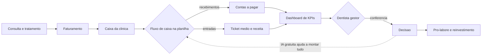

# Capítulo 1: O Dentista que Virou Gestor

## 1. Introdução

Você terminou a última consulta do dia, tirou o jaleco e pendurou no cabide. A recepção está vazia, a auxiliar foi embora e a clínica fica em silêncio. É nesse momento — o fim de expediente — que a maioria dos dentistas enfrenta a pergunta que nenhuma faculdade preparou para responder: quanto a clínica realmente ganhou hoje? Quanto custa abrir a cadeira pela manhã? O dinheiro que sobrou no caixa é lucro ou é a sua fatura do cartão que ainda não caiu?

Este livro nasce dessa pergunta. O cirurgião-dentista é um dos profissionais mais bem formados do mundo para cuidar da saúde bucal e, ao mesmo tempo, um dos menos preparados para cuidar do próprio negócio. A grade da graduação em Odontologia quase não reserva espaço para empreendedorismo e gestão financeira, e o resultado aparece nas estatísticas: uma parcela significativa das clínicas abre e fecha as portas nos primeiros anos de operação, não por falta de pacientes, mas por falta de controle financeiro [1]. Neste capítulo, você vai entender por que isso acontece, qual é o custo real de uma clínica e por que a IA gratuita — a mesma que cabe no bolso de qualquer celular — pode ser a virada de mesa para o dentista que decide virar gestor.

Ao final deste capítulo, você será capaz de explicar, em uma conversa de corredor, o tripé que sustenta uma clínica saudável: o dinheiro da clínica separado do seu dinheiro (pró-labore), os números na mesa todos os dias (fluxo de caixa) e a decisão baseada em dado, não em sensação. Você também vai conhecer o colega de bancada que vamos usar em todo o livro: a inteligência artificial gratuita, que vai ajudar a montar planilhas, calcular indicadores e organizar o caos financeiro do consultório.

## 2. Explica

### O problema estrutural: formado para clinicar, não para gerir

A formação odontológica é técnica e clínica: anatomia, patologia, materiais, cirurgia, periodontia. O que o curso não ensina é o que acontece depois que o paciente paga a consulta — ou não paga. Estudos acadêmicos sobre a administração de consultórios mostram que a ausência de disciplinas de empreendedorismo na graduação faz com que o dentista negligencie a gestão financeira justamente no momento em que ela mais importa: a abertura do negócio [1]. O resultado é uma rotina conhecida no setor: o profissional trata bem, fideliza pacientes, mas não sabe dizer se está lucrando, porque nunca estruturou um controle de despesas, um fluxo de caixa ou uma previsão de capital de giro [2].

Isso não é falta de inteligência — é falta de ferramenta. A boa notícia é que os processos de administração financeira aplicados a consultórios já estão mapeados e validados na literatura especializada: separação das finanças pessoais das da clínica, controle sistemático de contas a pagar e a receber, apuração mensal do resultado e cálculo da necessidade de capital de giro [2]. O que falta é uma forma acessível de colocar isso em prática — e é exatamente aí que a IA gratuita entra.

### A escala do problema: custos e mortalidade

Montar uma clínica exige capital. Os equipamentos essenciais têm preços de referência bem conhecidos no mercado brasileiro: uma cadeira odontológica parte de cerca de R$ 22.650, uma autoclave custa a partir de R$ 6.200 e um compressor odontológico sai por volta de R$ 2.700 [3]. Somando mobiliário, instalações, materiais e adequação sanitária, o investimento inicial de um consultório básico fica entre R$ 40 mil e R$ 100 mil — e esse dinheiro precisa ser recuperado pelo fluxo de caixa da operação [3]. É por isso que o custo unitário por sessão é uma conta que todo dentista deveria saber fazer antes de precificar qualquer procedimento [4].

O quadro se agrava quando o consultório cresce: cada cadeira adicional multiplica custos fixos (aluguel, energia, salários, esterilização), e a margem de cada procedimento precisa absorver essa estrutura. A literatura recomenda que os custos fixos fiquem entre 40% e 50% do faturamento bruto [5]. Acima disso, a clínica começa a operar no vermelho mesmo com agenda cheia — um dos fenômenos mais frustrantes do setor, em que o profissional trabalha cada vez mais e ganha cada vez menos.

### Os números que importam na odontologia

Existe um conjunto pequeno de indicadores que resume a saúde financeira de uma clínica. O primeiro é o **ticket médio**: o faturamento total dividido pelo número de pacientes atendidos em um período [6][7]. Se o seu ticket médio é baixo, a clínica está faturando com procedimentos de baixo valor agregado ou concedendo descontos excessivos; se é alto, os tratamentos de alto valor estão puxando a receita [6]. O segundo é a **margem de lucro líquida**: clínicas odontológicas eficientes operam com margens entre 20% e 35%, e os desvios vêm, quase sempre, de precificação errada ou de descontos e parcelamentos longos que corroem o rendimento real [8]. O terceiro é a **inadimplência**: o indicador deve ficar abaixo de 5%; taxas acima de 10% exigem ação imediata de cobrança e revisão da política de parcelamento [5].

Há ainda dois conceitos de gestão que a literatura do setor repete: o **pró-labore** e o **capital de giro**. O pró-labore é o salário que o dentista se paga como funcionário da própria clínica — a separação rígida entre o dinheiro da empresa e o dinheiro da família, apontada como a primeira regra da saúde financeira do consultório [9]. O capital de giro é a diferença entre o ativo circulante e o passivo circulante operacional de curto prazo: é o colchão que paga as contas enquanto os parcelamentos dos pacientes não entram no caixa [10]. Uma clínica sem capital de giro é uma clínica que depende do próximo recebimento para respirar — e um atraso de dois meses de um plano odontológico pode derrubar o caixa.

### Por que a IA gratuita muda o jogo

A gestão financeira do consultório é feita de tarefas repetitivas e padronizáveis: registrar recebimentos, classificar despesas, montar o fluxo de caixa mensal, calcular o ticket médio, projetar o caixa dos próximos 90 dias. Tudo isso pode ser feito em planilhas — e tudo isso pode ser feito **com a ajuda de um assistente de IA gratuito** que escreve as fórmulas, explica os cálculos e corrige os erros no lugar do dentista.

A IA não substitui a decisão do gestor: ela acelera o trabalho braçal e coloca os números na mesa. E o setor odontológico tem uma característica que torna essa combinação ainda mais poderosa: os dados financeiros de uma clínica são relativamente simples (algumas centenas de lançamentos por mês), cabem em uma planilha e seguem padrões de mercado bem documentados [5][8]. Ou seja, a matéria-prima existe, a ferramenta gratuita existe e o método existe — falta apenas o gestor decidir usar.

### As regras do jogo: conformidade e privacidade

Antes de colocar os dados da clínica em qualquer ferramenta, o dentista precisa conhecer as regras. A clínica é um estabelecimento de saúde: o cadastro no Cadastro Nacional de Estabelecimentos de Saúde (CNES) é obrigatório para o funcionamento regular [11], e os dados dos pacientes — incluindo prontuários, fotos e informações de pagamento — são dados pessoais sensíveis protegidos pela Lei Geral de Proteção de Dados (LGPD) [12]. A Autoridade Nacional de Proteção de Dados (ANPD) regula o tratamento desses dados e o uso de IA, com regras específicas para agentes de pequeno porte [13]. A profissão, por sua vez, é disciplinada por normas do Conselho Federal de Odontologia, que também regulam a publicidade e a forma de anunciar valores [14]. Para dimensionar o mercado em que a clínica opera, o gestor pode recorrer à Pesquisa Nacional de Saúde, que monitora o acesso da população aos serviços de saúde no país [15]. Na prática, isso significa uma regra simples que vamos repetir em todo o livro: **dados de pacientes nunca sobem para a nuvem sem anonimização**. Quando precisar de um modelo de IA, o dentista anonimiza o dado antes — e, para dados ainda mais sensíveis, existem os modelos locais que rodam sem sair do computador.

## 3. Ilustra

Imagine o fim de expediente de uma clínica de sucesso — não a que você imagina, mas a que você vai construir com este livro. O dentista não está mais no corredor olhando a agenda do dia seguinte. Ele está sentado à bancada, diante de uma tela com três janelas abertas: a planilha de fluxo de caixa, o chat de IA e o dashboard de indicadores. Ele não está trabalhando mais: está **examinando o prontuário financeiro da clínica**, com o mesmo cuidado com que examina um dente — procurando cáries de caixa, fissuras de margem e infecções de inadimplência.

Como Gestor de Clínica Odontológica, você vai perceber que a clínica tem dois pacientes: o paciente que senta na cadeira e o paciente que é o próprio negócio. O diagrama abaixo mostra como o dinheiro flui pela clínica — e onde a IA gratuita se encaixa para dar visibilidade a cada etapa.



## 4. Técnica

### O primeiro controle: a planilha do caixa da clínica

Você não precisa de software caro para começar. O primeiro artefato de gestão da sua clínica é uma planilha de fluxo de caixa — e ela pode ser montada em minutos com a ajuda de um assistente de IA gratuito. O método é sempre o mesmo: você descreve o que quer em linguagem natural, o assistente devolve a estrutura e as fórmulas, e você confere o resultado.

Comece criando um arquivo CSV com os lançamentos do mês. Você pode criar esse arquivo no Bloco de Notas, salvando com o nome `caixa_clinica.csv`:

```csv
Data,Descricao,Categoria,Entrada,Saida
2026-01-05,Consulta limpeza,Procedimento,250.00,
2026-01-08,Restauracao,Procedimento,350.00,
2026-01-10,Compra material,Suprimento,,180.00
2026-01-12,Aluguel,Custo fixo,,3200.00
2026-01-15,Plano odontologico repasse,Plano,4200.00,
2026-01-20,Auxiliar salario,Pessoal,,2400.00
2026-01-25,Implantoproteses,Procedimento,4800.00,
2026-01-28,Conta de energia,Custo fixo,,620.00
2026-01-30,Autoclave manutencao,Equipamento,,450.00
```

### Pedindo a planilha ao assistente

Abra o chat do assistente gratuito de sua preferência (ChatGPT, Gemini ou Copilot) e cole este prompt:

```text
Atue como um consultor financeiro de clinicas odontologicas.
Vou colar abaixo os lancamentos do fluxo de caixa da minha clinica.
1. Calcule o total de entradas e o total de saidas do mes.
2. Calcule o saldo final do caixa.
3. Separe as despesas por categoria (Custo fixo, Suprimento, Pessoal, Equipamento).
4. Identifique qual categoria mais consome o caixa.
5. Mostre os calculos passo a passo, sem pular etapas.
```

O assistente devolve os totais e a análise. Antes de aceitar, confira com uma calculadora — a regra de ouro da bancada: **número que não vem com o cálculo não é número, é chute**.

### Automatizando com Python sem instalar nada

Para quem quer ir além da conversa, a análise pode ser automatizada com Python — e, mais uma vez, sem instalar nada: os assistentes executam Python no navegador, e o Google Colab também roda gratuitamente. O código abaixo lê o CSV, calcula os totais e aponta a categoria que mais pesa no caixa:

```python
import pandas as pd

# Leitura dos lancamentos da clinica
df = pd.read_csv("caixa_clinica.csv")

# Totais de entrada e saida
entradas = df["Entrada"].fillna(0).sum()
saidas = df["Saida"].fillna(0).sum()
saldo = entradas - saidas

# Despesas por categoria
despesas = df.groupby("Categoria")["Saida"].sum().sort_values(ascending=False)

print(f"Entradas do mes:  R$ {entradas:,.2f}")
print(f"Saidas do mes:    R$ {saidas:,.2f}")
print(f"Saldo do caixa:   R$ {saldo:,.2f}")
print("\nDespesas por categoria (maior -> menor):")
print(despesas.to_string())
```

### Classificando despesas com regras (e conferindo com a IA)

Uma das tarefas mais repetitivas da rotina é classificar despesas nas categorias certas. O método em duas etapas funciona assim: primeiro você cria regras simples de classificação, depois pede à IA para aplicar e você confere. Regras típicas de clínica:

```text
Classifique cada lancamento pelas regras abaixo e monte uma tabela
Descricao | Categoria:
- Aluguel, condominio, energia, agua, internet -> Custo fixo
- Material de consumo, anestesico, luvas, mascaras -> Suprimento
- Salarios, pro-labore, encargos -> Pessoal
- Manutencao de equipamento, esterilizacao, calibracao -> Equipamento
- Consultas, procedimentos, planos de tratamento -> Procedimento
- Repasses de convenio, operadoras -> Plano
Liste os lancamentos que nao se encaixam em nenhuma regra separadamente.
```

A etapa de conferência é obrigatória: as regras capturam a maioria dos lançamentos, mas a clínica sempre tem exceções — um pagamento de cursos de atualização (que é investimento, não custo operacional), uma multa (que merece investigação) ou um reembolso. O gestor que confere aprende a enxergar os padrões de gasto da própria clínica; o que não confere importa o viés da ferramenta para dentro do caixa.

### O retrato da sazonalidade do consultório

O fluxo de caixa da odontologia não é uma linha reta — tem sazonalidade. Janeiro costuma ser fraco (retorno de férias e gastos de início de ano), março e agosto têm picos de demanda, e o fim de ano concentra a busca por tratamentos estéticos antes das festas. O dentista gestor que conhece a sazonalidade da própria clínica não se assusta com o janeiro fraco: ele sabe que é o mês de repor material, revisar equipamentos e preparar a campanha de março. O primeiro ano de registros cria essa memória; a partir do segundo, a projeção mensal fica confiável.

### A projeção simples de caixa (90 dias)

Com três meses de dados, a projeção de caixa vira uma planilha simples: entrada esperada (média do mesmo mês do ano anterior, ajustada pelo crescimento), saídas fixas (aluguel, salários, contas) e saídas variáveis (material, manutenção). O assistente de IA monta a projeção com um prompt direto:

```text
Com base nos meus lancamentos dos ultimos 3 meses (coloquei abaixo),
projete o fluxo de caixa dos proximos 90 dias considerando: entradas
sazonais (janeiro fraco, marco em alta), saidas fixas mensais e uma
reserva de 10% para imprevistos. Aponte os dois meses de maior
risco de caixa e sugira uma acao preventiva para cada.
```

### A pergunta de calibração

Antes de confiar na ferramenta para decisões reais, faça a pergunta de calibração — o teste que revela se o assistente calcula ou apenas parece calcular:

```text
Minha clinica faturou R$ 30.000 no mes e teve R$ 24.000 de despesas.
Qual a margem de lucro? Mostre o calculo completo e depois responda
em ate 2 linhas. Se a margem estiver abaixo de 20%, sugira duas
alavancas de melhoria.
```

A resposta correta: margem de 20% ((30000-24000)/30000). Se o assistente errar esse cálculo simples, ele não está pronto para os seus números reais — use a resposta dele como diagnóstico de calibração e troque de ferramenta ou refine o prompt.

### Montando a rotina do fim de expediente

A disciplina vale mais que a ferramenta. A rotina recomendada é pequena e diária: cinco minutos para registrar os lançamentos do dia (ou pedir para a IA classificar um extrato colado), cinco minutos para conferir o saldo e uma revisão semanal dos indicadores. O objetivo não é perfeição contábil no primeiro mês: é **nunca mais fechar o mês sem saber quanto a clínica ganhou** [2].

### Estruturando sua pasta de trabalho

Crie uma pasta no computador (ou no Google Drive) com o nome `gestao_clinica` e dentro dela quatro arquivos: `caixa_clinica.csv` (os lançamentos diários), `contas_a_pagar.csv` (as contas fixas e seus vencimentos), `pacientes_faturamento.csv` (o valor faturado por paciente, sem dados identificáveis) e `kpis_mensais.csv` (os indicadores de cada mês, que o Capítulo 4 vai usar). Essa estrutura simples é a espinha dorsal de toda a gestão financeira do livro.

### O retrato do investimento inicial

Para dimensionar a importância do fluxo de caixa, vale olhar o investimento que ele precisa proteger. A tabela abaixo reúne as referências de mercado para um consultório básico de uma cadeira — valores indicativos de 2025/2026, que devem ser atualizados na sua região [7]:

| Item | Referência de mercado |
|---|---|
| Cadeira odontológica | a partir de R$ 22.650 [7] |
| Autoclave | a partir de R$ 6.200 [7] |
| Compressor | a partir de R$ 2.700 [7] |
| Mobiliário, instalações e adequação sanitária | R$ 10.000–R$ 30.000 (estimativa) |
| Material inicial e instrumentos | R$ 5.000–R$ 15.000 (estimativa) |
| **Total do consultório básico** | **R$ 40.000–R$ 100.000** [7] |

Esse capital precisa ser recuperado pela operação — e é o fluxo de caixa mensal que mostra se a recuperação está acontecendo no prazo planejado. Uma clínica que fatura R$ 25 mil por mês e retira R$ 4 mil de pró-labore está recuperando o investimento de R$ 60 mil a uma velocidade muito diferente da clínica que fatura os mesmos R$ 25 mil retirando R$ 10 mil. O gestor precisa ver os dois números todos os meses: quanto a clínica gera e quanto o dono retira.

### O exemplo do pró-labore na prática

O pró-labore não é um conceito vago: é um número decidido com método. O cálculo recomendado para começar: (1) some o que você precisa para viver (moradia, transporte, família, lazer — a sua planilha pessoal); (2) divida por 4,3 semanas para o valor semanal e por 21 dias úteis para o diário; (3) compare com o que a clínica pode pagar sem comprometer o capital de giro (a regra: custos fixos entre 40% e 50% do faturamento, pró-labore incluso na análise). Se o necessário é maior que o possível, o desencontro precisa ser enfrentado cedo — com revisão de preços, de despesas ou de agenda — em vez de virar dívida pessoal no cartão [1][9].

### A pergunta de investigação de gasto

Quando uma despesa chama a atenção no caixa, o gestor não corta no susto — investiga. A pergunta em três níveis: (1) é recorrente ou pontual? (2) é fixa ou varia com a produção? (3) agrega valor ao paciente ou é só custo? Uma manutenção de autoclave de R$ 450 é pontual e obrigatória; uma assinatura de software que ninguém usa é recorrente e descartável. O assistente de IA ajuda a montar a tabela de investigação:

```text
Organize minha lista de despesas (coladas abaixo) em uma tabela com
as colunas: Despesa, Valor mensal, Recorrente ou pontual, Fixa ou
variavel, Agrega valor ao paciente? (sim/nao). Depois, aponte as tres
despesas com maior potencial de reducao sem afetar a qualidade do
atendimento.
```

Esse hábito de investigação é o que separa o corte cego do ajuste cirúrgico — a mesma diferença entre arrancar um dente são e tratar a causa.

### O exemplo da projeção de 90 dias

Para fechar o capítulo com um exemplo completo, acompanhe a projeção de uma clínica de uma cadeira: custo fixo mensal de R$ 11.000 (aluguel R$ 4.500, auxiliar R$ 3.200, energia e contas R$ 1.300, pró-labore R$ 2.000), receita média de R$ 26.000 com sazonalidade (janeiro −30%, março +15%). A projeção de 90 dias mostra que janeiro, o mês mais fraco, ainda cobre os custos fixos com folga de R$ 4.000 — mas que a compra de material planejada para fevereiro, se juntada a um atraso de convênio, derruba o saldo abaixo de um mês de custo fixo. A decisão preventiva: antecipar a compra de material para dezembro, quando o caixa está no pico. É exatamente esse tipo de antecipação — ver o risco três meses antes — que o fluxo de caixa bem alimentado permite [2][3].

### A frase que resume o capítulo

Se você guardar uma única frase deste capítulo, que seja esta: **o dentista gestor não pergunta quanto entrou, pergunta quanto sobrou e quanto precisa para continuar de pé.** A primeira pergunta se responde no banco; a segunda, no fluxo de caixa; a terceira, no capital de giro [6]. A partir de agora, o seu fim de expediente tem uma nova rotina: cinco minutos, uma planilha, um chat de IA gratuito e a decisão de quem comanda os números — em vez de ser comandado por eles.

### O convite para o próximo expediente

Guarde o exemplo da Dra. Mariana: ela não mudou de paciente, de equipamento ou de cidade — mudou o método. Amanhã, no seu fim de expediente, a rotina começa com dez minutos e um arquivo CSV. O convite deste capítulo é simples: feche o dia de hoje sabendo quanto entrou, quanto saiu e quanto sobrou.

### Kit de verificação do primeiro dia

Ao final deste capítulo, você deve ter: (1) o arquivo `caixa_clinica.csv` com pelo menos dez lançamentos; (2) o cálculo de entradas, saídas e saldo conferido manualmente; (3) a resposta da pergunta de calibração conferida; e (4) a pasta `gestao_clinica` criada com os quatro arquivos. Nada disso exige pagar por software — apenas o assistente gratuito, uma planilha e dez minutos.

## 5. Aplica

### A cena do caos

São 21h de uma terça-feira. A Dra. Mariana fecha a agenda de 14 pacientes, passa na recepção e pergunta à auxiliar: "quanto entrou hoje?". A auxiliar não sabe — o pagamento de uns foi em dinheiro, outros no cartão, um parcelado em três vezes. A Dra. Mariana abre o aplicativo do banco: o saldo da conta da clínica é o mesmo da conta pessoal, porque nunca separou. Ela lembra que a fatura do cartão de material vence amanhã e torce para o dinheiro do convênio cair antes. No fim do mês, a contadora liga para dizer que a clínica "deu prejuízo", e a Dra. Mariana não consegue explicar por quê — ela trabalhou todos os dias.

### A mesma cena, com o método

Agora imagine a Dra. Mariana uma estação depois. Ela tem o `caixa_clinica.csv` atualizado, o chat de IA aberto e a rotina do fim de expediente funcionando. Às 21h, ela cola o extrato do dia no assistente e pede: "classifique esses lançamentos nas categorias do meu fluxo de caixa". O assistente devolve a classificação em segundos; ela confere, aceita e olha o saldo. O pró-labore de R$ 6.000 já foi transferido para a conta pessoal no dia 5. O ticket médio do mês está em R$ 310, a inadimplência em 4,8% e a margem em 22% — três indicadores na zona saudável, dois deles com tendência de piora que ela já vê na planilha. A decisão sobre a fatura de material deixa de ser torcida e vira escolha: o caixa cobre, e o capital de giro está em dois meses de custo fixo.

### Exercício do fim de expediente

1. Liste as três despesas fixas da sua clínica (ou da clínica que você vai montar) e seus valores mensais.
2. Calcule o ticket médio do último mês: faturamento ÷ pacientes atendidos. Se você não tem o número, estime com os dados que tiver.
3. Abra o assistente de IA gratuito e peça: "monte uma planilha de fluxo de caixa para uma clínica odontológica com as colunas Data, Descrição, Categoria, Entrada, Saída e as categorias Procedimento, Plano, Custo fixo, Suprimento, Pessoal, Equipamento. Explique cada coluna.".
4. Escreva em uma frase qual é o seu pró-labore mensal — se você não tem um, esse é o seu primeiro projeto do livro.

### O exercício corrige o rumo

Se você fez o exercício, já percebeu a primeira virada de mentalidade: o dentista gestor não pergunta "quanto entrou hoje?", pergunta "qual é o meu fluxo e qual é a minha margem?". A segunda pergunta é muito mais difícil de responder no chute — e muito mais fácil de responder com uma planilha e um assistente de IA gratuitos.

## 6. Conclusão

Neste capítulo, você viu por que a gestão financeira é o ponto cego da formação odontológica e por que isso custa caro: clínicas fecham não por falta de pacientes, mas por falta de controle [1]. Você conheceu os números que resumem a saúde de um consultório — ticket médio, margem líquida, inadimplência, pró-labore e capital de giro [5][6][8] — e o custo real de montar a estrutura [3][4]. E você deu o primeiro passo prático: o arquivo de fluxo de caixa, a pergunta de calibração e a rotina do fim de expediente.

O próximo capítulo aprofunda os números da clínica: você vai aprender a ler o fluxo de caixa, a construir um DRE simplificado e a calcular o ticket médio com dados reais do setor — sempre com a IA gratuita na bancada.

## 7. Referências

[1] Purcino, G. A. J. et al. A importância da gestão financeira e plano de negócios em clínicas e consultórios odontológicos. E-Acadêmica, 2022. Disponível em: https://eacademica.org/eacademica/article/view/176. Acesso em: 08 ago. 2026.
[2] Brasil, F. P. et al. Processos de administração financeira em consultórios odontológicos. Revista Fatec Zona Sul (Refas), 2023. Disponível em: https://www.revistarefas.com.br/RevFATECZS/article/view/634. Acesso em: 08 ago. 2026.
[3] Gnatus. Guia de equipamentos odontológicos essenciais para começar. 2025. Disponível em: https://www.gnatus.com.br/blog/guia-equipamentos-odontologicos-consultorio/. Acesso em: 08 ago. 2026.
[4] Costa, R. M. et al. Odontoclínica: simulação de gestão em clínica odontológica em um curso de Graduação em Odontologia. Revista da ABENO, 2015. Disponível em: https://revodonto.bvsalud.org/scielo.php?script=sci_arttext&pid=S1679-59542015000100010. Acesso em: 08 ago. 2026.
[5] Odontiva. 10 KPIs Essenciais para Clínica Odontológica. 2026. Disponível em: https://odontiva.com.br/blog/indicadores-desempenho-clinica-odontologica. Acesso em: 08 ago. 2026.
[6] Dental Office. Dentista: como calcular o ticket médio da sua clínica odontológica? 2024. Disponível em: https://www.dentaloffice.com.br/ticket-medio/. Acesso em: 08 ago. 2026.
[7] Clinicorp. Como calcular o ticket médio na odontologia? Aprenda agora. 2025. Disponível em: https://www.clinicorp.com/post/calcular-ticket-medio-odontologia. Acesso em: 08 ago. 2026.
[8] Sanders, L. Como funciona a margem de lucro na odontologia? Simples Dental, 2025. Disponível em: https://www.simplesdental.com/blog/margem-de-lucro-na-odontologia/. Acesso em: 08 ago. 2026.
[9] CROSP/Sebrae. 41º CIOSP: Planejamento financeiro de clínicas odontológicas foi tema de palestra do Sebrae. São Paulo: CROSP, 2024. Disponível em: https://crosp.org.br/noticia/41-ciosp-planejamento-financeiro-de-clinicas-odontologicas-foi-tema-de-palestra-do-sebrae/. Acesso em: 08 ago. 2026.
[10] Angelus. Como ter uma boa gestão financeira do consultório odontológico? 2024. Disponível em: https://angelus.ind.br/pt-br/blog/gestao-financeira-de-consultorio-odontologico/. Acesso em: 08 ago. 2026.
[11] Ministério da Saúde/DATASUS. Cadastro Nacional de Estabelecimentos de Saúde (CNES). Disponível em: https://cnes.datasus.gov.br/. Acesso em: 08 ago. 2026.
[12] Ministério da Saúde. LGPD no setor saúde. Disponível em: https://www.gov.br/saude/pt-br/acesso-a-informacao/lgpd. Acesso em: 08 ago. 2026.
[13] ANPD. Regulamentações — Resoluções de proteção de dados. Disponível em: https://www.gov.br/anpd/pt-br/acesso-a-informacao/institucional/atos-normativos/regulamentacoes_anpd. Acesso em: 08 ago. 2026.
[14] Conselho Federal de Odontologia. Portal institucional — normas e resoluções da profissão. Disponível em: https://website.cfo.org.br/. Acesso em: 08 ago. 2026.
[15] Ministério da Saúde/IBGE. Pesquisa Nacional de Saúde (PNS). Disponível em: https://www.gov.br/saude/pt-br/assuntos/noticias-ms/2026/julho/ministerio-da-saude-e-ibge-iniciam-terceira-edicao-da-pesquisa-nacional-de-saude. Acesso em: 08 ago. 2026.
