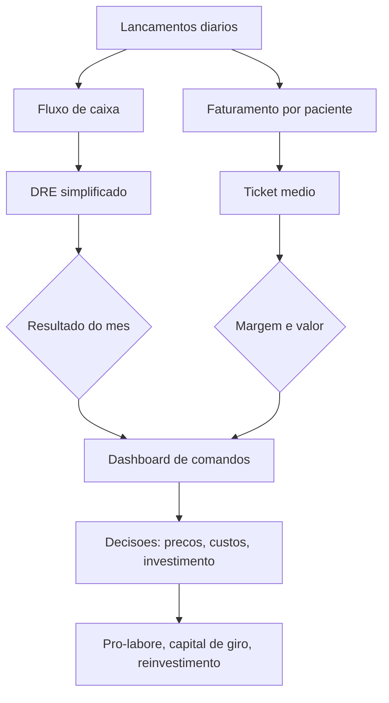

# Capítulo 2: Os Números da Clínica — Fluxo de Caixa, Ticket Médio e Custos

## 1. Introdução

No capítulo anterior, você criou o primeiro arquivo de fluxo de caixa e aprendeu a rotina do fim de expediente. Agora é hora de dar profundidade: entender de onde vêm os números, como eles se organizam e o que cada um deles diz sobre a clínica. Um dentista gestor não é um contador — ele não precisa fechar balanços, mas precisa **ler** os números com a mesma segurança com que lê uma radiografia.

Este capítulo ensina três instrumentos de leitura financeira na medida certa para uma clínica odontológica: o **fluxo de caixa** (o pulso diário do dinheiro), o **DRE simplificado** (a radiografia mensal do resultado) e o **ticket médio** (o termômetro do valor que cada paciente agrega). Você vai aprender a montá-los com planilha e IA gratuita, a interpretar os padrões de mercado do setor — custos fixos entre 40% e 50% do faturamento, margem líquida entre 20% e 35%, inadimplência abaixo de 5% [3] — e a cruzar seus números com referências macroeconômicas oficiais para decidir com mais segurança.

Ao final, você saberá responder três perguntas que o banco, o sócio e o seu futuro eu vão fazer: quanto a clínica movimenta, quanto ela custa para ficar de pé e quanto cada atendimento vale de verdade.

## 2. Explica

### O fluxo de caixa: o pulso diário

O fluxo de caixa é o registro de todas as entradas e saídas de dinheiro da clínica, organizado por data. Ele responde à pergunta mais imediata da gestão: **quanto dinheiro existe hoje para pagar as contas de hoje?** A literatura de administração de consultórios recomenda estruturar esse controle com lançamentos sistemáticos — nada de confiar na memória ou no extrato do banco pessoal [1]. Cada lançamento tem quatro informações: data, descrição, categoria e valor (entrada ou saída).

A diferença entre fluxo de caixa e lucro é crucial e confunde a maioria dos dentistas. O fluxo de caixa enxerga o dinheiro que **entrou e saiu**; o lucro é uma visão contábil que considera receitas e despesas **incorridas**, independentemente de pagamento. Um paciente pode ter feito um tratamento de R$ 4.800 parcelado em dez vezes: o fluxo de caixa registra R$ 480 por mês, enquanto o DRE reconheceria o valor do procedimento no mês da entrega. O gestor precisa das duas visões — o caixa para não quebrar, o resultado para saber se está ganhando [1].

### O capital de giro: o colchão da clínica

Se o fluxo de caixa é o pulso, o capital de giro é o oxigênio. Ele é calculado como a diferença entre o ativo circulante (o que a clínica tem em caixa, banco e contas a receber de curto prazo) e o passivo circulante operacional (o que ela deve no curto prazo: fornecedores, impostos, salários) [2]. Um consultório que recebe dos planos odontológicos com 45 a 60 dias de prazo, mas paga material e salários todo mês, precisa de capital de giro suficiente para atravessar esse intervalo sem parar de respirar [2].

A regra prática para clínicas pequenas: mantenha capital de giro de pelo menos um a dois meses de custo fixo. Se os custos fixos mensais somam R$ 15.000, o colchão deve ficar entre R$ 15 mil e R$ 30 mil. Abaixo disso, qualquer atraso de convênio vira emergência — e emergência financeira em clínica quase sempre termina em desconto, parcelamento forçado ou empréstimo caro.

### O DRE simplificado: a radiografia mensal

O Demonstrativo de Resultado do Exercício (DRE) é o documento que mostra, linha a linha, como a receita se transforma em lucro. A versão simplificada para clínicas tem cinco blocos: **receita bruta** (tudo o que foi faturado no mês), **deduções** (impostos e descontos), **receita líquida**, **custos e despesas** (fixos, variáveis, pessoal, impostos) e **resultado** (lucro ou prejuízo). Cada bloco responde a uma pergunta de gestão: quanto faturou, quanto sobrou depois dos impostos, quanto custou para operar e quanto ficou de resultado [3].

Os padrões de mercado ajudam a ler o DRE da odontologia: os custos fixos devem ficar entre 40% e 50% do faturamento bruto, e a margem de lucro líquida saudável está entre 20% e 35% [3][6]. Quando a margem fica abaixo de 20%, o problema quase sempre está em um de três lugares: precificação (procedimentos subvalorizados), desconto excessivo (pacientes acostumados a negociar) ou custos fora de controle (gastos que cresceram sem revisão) [6].

### O ticket médio: o termômetro do valor

O ticket médio é o faturamento total dividido pelo número de pacientes atendidos em um período [4][5]. É o indicador mais rápido de dizer se a clínica está **vendendo tratamento ou vendendo tempo**. Um ticket médio de R$ 150 indica predominância de consultas e limpezas; um de R$ 400 indica mix de tratamentos de maior valor (implantes, próteses, ortodontia) [4]. O indicador também expõe a política de preços: desconto demais e parcelamento longo arrastam o ticket para baixo, mesmo com agenda cheia [5].

A leitura do ticket médio nunca deve ser isolada. O gestor cruza o ticket com o volume de pacientes e com a ocupação da agenda: um ticket alto com poucos pacientes pode significar preço acima do mercado; um ticket baixo com muitos pacientes pode significar operação de volume sem margem. O equilíbrio é o ponto em que a clínica maximiza o resultado por cadeira — e é para isso que o Capítulo 4 vai montar o painel de comando [3].

### O custo da cadeira e a depreciação

Um erro comum em clínicas é ignorar o custo dos equipamentos na hora de precificar. A cadeira odontológica parte de R$ 22.650, a autoclave de R$ 6.200 e o compressor de R$ 2.700 [7]; somando o restante da infraestrutura, o investimento inicial fica entre R$ 40 mil e R$ 100 mil [7]. Esse capital investido não é despesa de um mês: ele se transforma em **depreciação**, o custo de uso do equipamento distribuído ao longo da sua vida útil. Uma cadeira de R$ 30.000 com vida útil de 10 anos custa R$ 3.000 por ano, ou R$ 250 por mês, para a clínica — um custo que existe mesmo quando a cadeira está vazia [7].

Por isso, o custo unitário por sessão — quanto custa, de verdade, abrir a cadeira para um paciente — é uma conta que combina custos fixos rateados, custos variáveis de material e depreciação de equipamento. Dentistas que fazem essa conta descobrem que o "preço de mercado" da limpeza muitas vezes está abaixo do custo real da clínica [8]. É a origem do fenômeno: quanto mais pacientes de procedimento barato, mais rápido o caixa afunda.

### O pró-labore e a separação das contas

O pró-labore é o salário que o dentista define para si como gestor — e a regra do setor é enfática: sem pró-labore definido, não há gestão [9]. O dinheiro da clínica e o dinheiro da família devem viver em contas separadas, e o dentista deve se pagar todo mês, como paga a auxiliar. O que sobra depois do pró-labore é o resultado do negócio — e é esse resultado que decide reinvestimento, reserva e crescimento [9].

### O contexto externo: juros, inflação e o mercado de serviços

A clínica não opera em uma bolha: a taxa de juros define o custo de um empréstimo para equipar uma terceira cadeira, a inflação corrige o aluguel e os preços de material, e o setor de serviços como um todo dá o parâmetro de crescimento da receita. Essas referências têm fontes oficiais gratuitas: o Banco Central publica séries históricas de juros, inflação e crédito no Sistema Gerenciador de Séries Temporais [10], com dados abertos em formato estruturado para planilhas e ferramentas de análise [11]; o IBGE acompanha mensalmente a receita do setor de serviços na Pesquisa Mensal de Serviços, um benchmark para comparar o faturamento da clínica com o do mercado [12]. Com essas séries, o gestor pode responder, por exemplo: "se a Selic subiu 1 ponto, quanto o meu custo de crédito muda?" — sem depender de achismo [10][11].

### A disciplina da apuração mensal

O que transforma esses instrumentos em gestão real é a rotina: apurar o DRE todo mês, no mesmo dia, com os mesmos critérios. Estudos sobre a mortalidade de clínicas apontam o controle mensal de despesas, custos e fluxo de caixa como o principal fator que separa as clínicas que sobrevivem das que fecham [13]. A IA gratuita não elimina a disciplina — ela torna a disciplina barata: classificar lançamentos, montar o DRE e comparar meses leva minutos com um assistente na bancada.

## 3. Ilustra

O prontuário financeiro da clínica é como um dossiê de exames: cada documento olha para uma dimensão diferente do mesmo paciente — o negócio. O fluxo de caixa é o eletrocardiograma (bate a cada dia), o DRE é a radiografia (revela a estrutura do mês), o ticket médio é o termômetro (mede o valor do atendimento) e o capital de giro é a reserva de oxigênio.

Como Gestor de Clínica Odontológica, você vai olhar para o prontuário financeiro todas as semanas. O diagrama abaixo mostra como os três instrumentos se alimentam dos mesmos dados e convergem para a decisão.



## 4. Técnica

### Montando o DRE simplificado na planilha

Com o arquivo `caixa_clinica.csv` do capítulo anterior, o próximo passo é estruturar o DRE mensal. A forma mais rápida é pedir ao assistente de IA que monte a planilha a partir da sua descrição:

```text
Monte uma planilha de DRE simplificado para uma clinica odontologica
com as seguintes linhas e formulas:
1. Receita bruta (soma das entradas de Procedimento e Plano).
2. Deducoes: 8% de impostos sobre a receita bruta (simulacao de Simples Nacional).
3. Receita liquida = Receita bruta - Deducoes.
4. Custos variaveis (Suprimento).
5. Custos fixos (Custo fixo + Pessoal + Equipamento).
6. Resultado = Receita liquida - Custos variaveis - Custos fixos.
7. Margem = Resultado / Receita liquida, em percentual.
Explique cada linha em uma frase.
```

### Automatizando a apuração com Python

Para apurar o DRE e o ticket médio sem digitar nada, use o código abaixo (roda no assistente ou no Google Colab):

```python
import pandas as pd

df = pd.read_csv("caixa_clinica.csv")

# Receita bruta: procedimentos + planos
receita_bruta = df[df["Categoria"].isin(["Procedimento", "Plano"])]["Entrada"].fillna(0).sum()

# Custos
custos_variaveis = df[df["Categoria"] == "Suprimento"]["Saida"].fillna(0).sum()
custos_fixos = df[df["Categoria"].isin(["Custo fixo", "Pessoal", "Equipamento"])]["Saida"].fillna(0).sum()

# DRE simplificado
deducoes = receita_bruta * 0.08
receita_liquida = receita_bruta - deducoes
resultado = receita_liquida - custos_variaveis - custos_fixos
margem = (resultado / receita_liquida) * 100 if receita_liquida else 0

print("=== DRE SIMPLIFICADO ===")
print(f"Receita bruta:    R$ {receita_bruta:,.2f}")
print(f"Deducoes (8%):    R$ {deducoes:,.2f}")
print(f"Receita liquida:  R$ {receita_liquida:,.2f}")
print(f"Custos variaveis: R$ {custos_variaveis:,.2f}")
print(f"Custos fixos:     R$ {custos_fixos:,.2f}")
print(f"Resultado:        R$ {resultado:,.2f}")
print(f"Margem:           {margem:.1f}%")

# Ticket medio (faturamento por paciente - arquivo sem dados identificaveis)
pacientes = pd.read_csv("pacientes_faturamento.csv")
ticket = pacientes["Valor"].sum() / len(pacientes) if len(pacientes) else 0
print(f"\nTicket medio:     R$ {ticket:,.2f} por paciente")
```

### Cruzando com referências oficiais

Para comparar a sua margem com o comportamento do mercado de serviços, baixe a série de receita do setor na Pesquisa Mensal de Serviços do IBGE [12] e a série de juros no SGS do Banco Central [10]. O exercício de benchmarking é simples:

```text
Tenho os dados da minha clinica: margem de X%, custos fixos de Y% da
receita, ticket medio de R$ Z. Compare com os padroes de mercado do
setor odontologico (custos fixos 40-50%, margem 20-35%, inadimplencia
<5%) e com a evolucao da receita do setor de servicos no IBGE.
Aponte os tres desvios mais relevantes e uma acao para cada um.
```

### A planilha de custos da cadeira

Monte a conta do custo real por sessão — o número que quase nenhuma clínica conhece:

```python
import pandas as pd

# Custos fixos mensais rateados por cadeira
custos = pd.read_csv("contas_a_pagar.csv")
custo_fixo_mensal = custos["Valor"].sum()
numero_cadeiras = 2
sessoes_por_cadeira_mes = 160

# Depreciacao da cadeira (R$ 30.000, 10 anos)
depreciacao_mensal_cadeira = 30000 / 120

custo_por_sessao = (custo_fixo_mensal / (numero_cadeiras * sessoes_por_cadeira_mes)
                    + depreciacao_mensal_cadeira / sessoes_por_cadeira_mes)
print(f"Custo fixo por sessao:   R$ {custo_por_sessao:,.2f}")
print("(some o material de cada procedimento para o custo total)")
```

### A análise de sensibilidade: o que acontece se…

O DRE não responde sozinho às perguntas de gestão; ele responde quando o gestor mexe nas alavancas. A análise de sensibilidade testa cenários: o que acontece com o resultado se o ticket médio subir 10%? Se a inadimplência cair de 8% para 4%? Se o aluguel subir 15% na renovação? O método em planilha é simples: premissas em células separadas (nunca embutidas em fórmulas) e uma aba de cenários que referencia essas células.

```text
Na minha planilha de DRE, crie uma aba de cenarios com tres colunas:
Realista (premissas atuais), Otimista (ticket medio +10%, inadimplencia
-2 pontos, custos fixos -3%) e Pessimista (ticket medio -8%, inadimplencia
+3 pontos, custos fixos +5%). Referencie sempre as celulas de premissa
da aba principal — nunca valores fixos. Explique como navegar entre os
cenarios e qual deles devo usar como base para o planejamento mensal.
```

A análise de sensibilidade muda a conversa com o sócio e com o banco: em vez de "a clínica vai bem", o gestor diz "no cenário realista, a margem fica em 24%; no pessimista, em 16% — e a alavanca que mais protege é reduzir a inadimplência". Número com cenário é decisão; número sem cenário é opinião.

### O benchmark com o setor de serviços

Para saber se o crescimento da clínica está acima ou abaixo do mercado, o gestor usa a Pesquisa Mensal de Serviços do IBGE [12]: a variação acumulada da receita do setor é a régua externa. O método é simples: a cada trimestre, comparar o crescimento da receita da clínica com o crescimento do setor no mesmo período. Clínica crescendo abaixo do setor com margem caindo é sinal de problema interno; crescendo abaixo do setor com margem estável pode ser escolha (menos volume, mais valor). O benchmark não decide — ele informa a pergunta certa.

### A tabela de referência do setor

Para fixar os padrões, a tabela abaixo resume as referências de mercado discutidas neste capítulo — guarde-a ao lado do painel:

| Indicador | Referência saudável | O que indica desvio |
|---|---|---|
| Custos fixos / faturamento bruto | 40%–50% | acima: estrutura pesada ou preço baixo [3] |
| Margem líquida | 20%–35% | abaixo de 20%: preço, desconto ou custo [6] |
| Inadimplência | abaixo de 5% | acima de 10%: ação imediata de cobrança [3] |
| Ticket médio | depende do mix | em queda: mix de baixo valor ou desconto [4][5] |
| Capital de giro | 1–2 meses de custo fixo | abaixo: risco de caixa [2] |

### O DRE de exemplo, número por número

Para fixar a leitura, acompanhe um DRE completo de uma clínica fictícia de uma cadeira. No mês, a clínica faturou R$ 32.000 em procedimentos e R$ 8.000 em repasses de plano — receita bruta de R$ 40.000. Aplicando 8% de deduções simuladas (faixa baixa do Simples Nacional para serviços), a receita líquida fica em R$ 36.800. Os custos: R$ 3.200 de material (suprimento), R$ 9.000 de salários e encargos da auxiliar, R$ 6.500 de aluguel e condomínio, R$ 1.800 de energia e despesas fixas, R$ 1.200 de manutenção e esterilização, R$ 900 de pró-labore da recepção terceirizada — total de despesas de R$ 22.600. Resultado: R$ 14.200, uma margem líquida de 38,6%. Parece excelente — até o gestor lembrar que ainda precisa pagar o próprio pró-labore de R$ 8.000 e que a depreciação da cadeira (R$ 250/mês) não está contabilizada. Ajustado, o resultado real é R$ 5.950, margem de 16,2% — dentro do amarelo, não do verde. O DRE só conta a história completa quando todas as camadas entram: impostos, depreciação e pró-labore [3][6].

### As perguntas que o DRE responde (e as que ele não responde)

O DRE responde: a clínica está ganhando ou perdendo no mês? Qual fatia da receita vai para impostos, custos e despesas? Qual é a margem real? O DRE não responde: quanto dinheiro existe no caixa hoje (isso é fluxo de caixa), qual paciente não pagou (isso é contas a receber), nem se os equipamentos estão sendo usados (isso é ocupação e receita por cadeira). O gestor que mistura os papéis — usar DRE para decidir caixa, ou caixa para decidir margem — toma decisões erradas com documentos certos. A disciplina do prontuário financeiro é usar cada exame para o que ele serve [1][2].

### A leitura de tendência: três meses valem mais que um

Um mês isolado é ruído; três meses são sinal. O gestor não decide com base no DRE de um mês — ele olha a tendência: o resultado está subindo, caindo ou estável? O método é simples: montar a tabela de três meses (receita, custos, resultado, margem, ticket, inadimplência) e pedir à IA a leitura:

```text
Compare os tres ultimos meses da minha clinica (tabela abaixo).
Para cada indicador, diga se a tendencia e de alta, queda ou
estabilidade, quantifique a variacao em percentual e aponte o mes
que destoa. Finalize com uma frase: a clinica esta em expansao,
estabilidade ou retracao? Justifique com os numeros.
```

A tendência de três meses também protege contra a reação exagerada: um mês fraco por motivo sazonal (janeiro) não vira pânico, e um mês bom por evento pontual (plano de tratamento fechado) não vira euforia. O prontuário financeiro — como o clínico — acompanha o caso ao longo do tempo, não em uma única foto [1][3].

### Precificando com o custo na mão

A precificação baseada no custo — e não no "preço do concorrente" — é uma das maiores viradas deste capítulo. O método em quatro passos: (1) calcule o custo total do procedimento (material + tempo de cadeira + custo fixo rateado por sessão + depreciação); (2) defina a margem-alvo (entre 20% e 35% para o mix saudável [6]); (3) derive o preço mínimo (custo ÷ (1 − margem-alvo)); (4) compare com o preço de mercado e decida conscientemente: cobrar acima do mínimo financia qualidade e reserva; cobrar abaixo é escolha de captação, desde que o gestor saiba exatamente quanto está sacrificando. O assistente de IA monta a conta:

```text
Calcule o preco minimo de venda de um procedimento com: material
R$ 45, tempo de cadeira 40 minutos (custo da hora da clínica:
R$ 180, incluindo auxiliar, aluguel, energia e depreciacao), e
margem-alvo de 25%. Mostre o calculo passo a passo e o preco
arredondado para valores comerciais. Depois, compare com um preco
de mercado de R$ 280 e explique o que essa diferenca significa
para a margem.
```

O dentista que precifica com o custo na mão negocia de igual para igual com convênios e planos — e sabe, antes de aceitar um desconto, quanto ele custa em margem [6].

### O que evitar no prontuário financeiro

Três armadilhas repetem-se nas clínicas e valem um aviso: (1) **misturar contas** — pessoa física e jurídica no mesmo cartão ou conta corrente inviabiliza qualquer leitura; (2) **precificar sem custo** — o preço baseado no concorrente ignora a estrutura da própria clínica; (3) **medir um mês só** — decisões tomadas com um mês isolado oscilam com a sazonalidade. O prontuário financeiro saudável evita as três: contas separadas, preço derivado do custo e leitura de tendência de três meses [1][3][6].

### A memória de doze meses

Ao completar doze meses de prontuário financeiro, o gestor ganha o ativo mais valioso da gestão: a memória do próprio negócio. Com um ano de dados, ele sabe o pico de demanda de março, a fraqueza de janeiro, o comportamento dos convênios e o custo real de cada procedimento — e pode planejar o ano seguinte com números, não com intuição. A IA transforma essa memória em projeção e cenários; o dentista transforma a projeção em decisão.

### Kit de verificação do capítulo

Ao final, você deve ter: (1) o DRE do mês apurado e conferido; (2) o ticket médio calculado e comparado com o padrão do setor; (3) o custo por sessão estimado; e (4) uma referência oficial (BCB ou IBGE) anotada no arquivo `kpis_mensais.csv`.

## 5. Aplica

### A cena do caos

O Dr. Carlos tem agenda cheia há três anos. Ele fatura R$ 45 mil por mês, mas toda vez que precisa trocar um equipamento, precisa "quebrar o galho" — descontar uma fatura no cartão ou pedir ajuda à família. A contadora diz que a clínica é "saudável", porque o DRE do escritório mostra lucro. O Dr. Carlos não entende por que, com lucro contábil, falta dinheiro no caixa. Ele descobre a resposta no dia em que o convênio atrasa dois repasses: a clínica não tem capital de giro, e o "lucro" contábil está preso em parcelamentos de pacientes que ainda não entraram no caixa.

### A mesma cena, com o método

Com fluxo de caixa, DRE e ticket médio na mesa, o diagnóstico aparece em dez minutos. O faturamento de R$ 45 mil tem R$ 12 mil presos em parcelas a receber. Os custos fixos somam R$ 21 mil — 47% do faturamento bruto, dentro do padrão, mas no limite. O ticket médio é R$ 180, abaixo da meta de R$ 250. O Dr. Carlos toma duas decisões com os dados na mão: cria uma reserva de capital de giro (R$ 21 mil = um mês de custo fixo) transferindo 10% da receita mensal, e relança o plano de tratamento com precificação revisada, que ele agora consegue justificar com o custo por sessão. Seis meses depois, o ticket médio está em R$ 235, a reserva montada e a troca de equipamento vira decisão de caixa, não emergência.

### Exercício do prontuário financeiro

1. Calcule o seu ticket médio dos últimos três meses e compare com o padrão do setor.
2. Monte o DRE do mês (receita bruta, deduções, custos, resultado, margem) na planilha.
3. Calcule o custo por sessão da sua cadeira.
4. Responda com o assistente de IA: "qual a minha necessidade de capital de giro se meu custo fixo mensal é R$ X e meus recebimentos de convênio levam 45 dias?".
5. Registre tudo no `kpis_mensais.csv` — o Capítulo 4 vai transformar esses números em um painel.

### O exercício corrige o rumo

A virada deste capítulo é a mudança de pergunta: o dentista gestor não pergunta mais "deu lucro?", pergunta "deu caixa **e** deu margem?". As duas respostas juntas — caixa positivo e margem acima de 20% — são o sinal de que a clínica está viva e crescendo [3][6].

## 6. Conclusão

Você aprendeu a ler o prontuário financeiro da clínica: o fluxo de caixa como pulso diário [1], o capital de giro como oxigênio [2], o DRE como radiografia mensal [3], o ticket médio como termômetro do valor [4][5] e o custo por sessão como a régua da precificação [7][8]. Você também aprendeu a cruzar os seus números com referências oficiais — juros e crédito no Banco Central [10][11] e o comportamento do setor de serviços no IBGE [12] — e a manter a disciplina da apuração mensal, o fator que a literatura associa à sobrevivência das clínicas [13].

O próximo capítulo coloca a IA gratuita no centro da bancada: você vai aprender a usar modelos gratuitos e planilhas para montar esses controles com prompts eficazes — sem digitar fórmula nenhuma.

## 7. Referências

[1] Brasil, F. P. et al. Processos de administração financeira em consultórios odontológicos. Revista Fatec Zona Sul (Refas), 2023. Disponível em: https://www.revistarefas.com.br/RevFATECZS/article/view/634. Acesso em: 08 ago. 2026.
[2] Angelus. Como ter uma boa gestão financeira do consultório odontológico? 2024. Disponível em: https://angelus.ind.br/pt-br/blog/gestao-financeira-de-consultorio-odontologico/. Acesso em: 08 ago. 2026.
[3] Odontiva. 10 KPIs Essenciais para Clínica Odontológica. 2026. Disponível em: https://odontiva.com.br/blog/indicadores-desempenho-clinica-odontologica. Acesso em: 08 ago. 2026.
[4] Dental Office. Dentista: como calcular o ticket médio da sua clínica odontológica? 2024. Disponível em: https://www.dentaloffice.com.br/ticket-medio/. Acesso em: 08 ago. 2026.
[5] Clinicorp. Como calcular o ticket médio na odontologia? Aprenda agora. 2025. Disponível em: https://www.clinicorp.com/post/calcular-ticket-medio-odontologia. Acesso em: 08 ago. 2026.
[6] Sanders, L. Como funciona a margem de lucro na odontologia? Simples Dental, 2025. Disponível em: https://www.simplesdental.com/blog/margem-de-lucro-na-odontologia/. Acesso em: 08 ago. 2026.
[7] Gnatus. Guia de equipamentos odontológicos essenciais para começar. 2025. Disponível em: https://www.gnatus.com.br/blog/guia-equipamentos-odontologicos-consultorio/. Acesso em: 08 ago. 2026.
[8] Costa, R. M. et al. Odontoclínica: simulação de gestão em clínica odontológica em um curso de Graduação em Odontologia. Revista da ABENO, 2015. Disponível em: https://revodonto.bvsalud.org/scielo.php?script=sci_arttext&pid=S1679-59542015000100010. Acesso em: 08 ago. 2026.
[9] CROSP/Sebrae. 41º CIOSP: Planejamento financeiro de clínicas odontológicas foi tema de palestra do Sebrae. São Paulo: CROSP, 2024. Disponível em: https://crosp.org.br/noticia/41-ciosp-planejamento-financeiro-de-clinicas-odontologicas-foi-tema-de-palestra-do-sebrae/. Acesso em: 08 ago. 2026.
[10] Banco Central do Brasil. Sistema Gerenciador de Séries Temporais (SGS). Disponível em: https://www3.bcb.gov.br/sgspub/. Acesso em: 08 ago. 2026.
[11] Banco Central do Brasil. Dados Abertos — Séries estatísticas de crédito e serviços. Disponível em: https://dadosabertos.bcb.gov.br/. Acesso em: 08 ago. 2026.
[12] IBGE. Pesquisa Mensal de Serviços (PMS). Disponível em: https://www.ibge.gov.br/estatisticas/economicas/servicos/9229-pesquisa-mensal-de-servicos.html. Acesso em: 08 ago. 2026.
[13] Purcino, G. A. J. et al. A importância da gestão financeira e plano de negócios em clínicas e consultórios odontológicos. E-Acadêmica, 2022. Disponível em: https://eacademica.org/eacademica/article/view/176. Acesso em: 08 ago. 2026.
