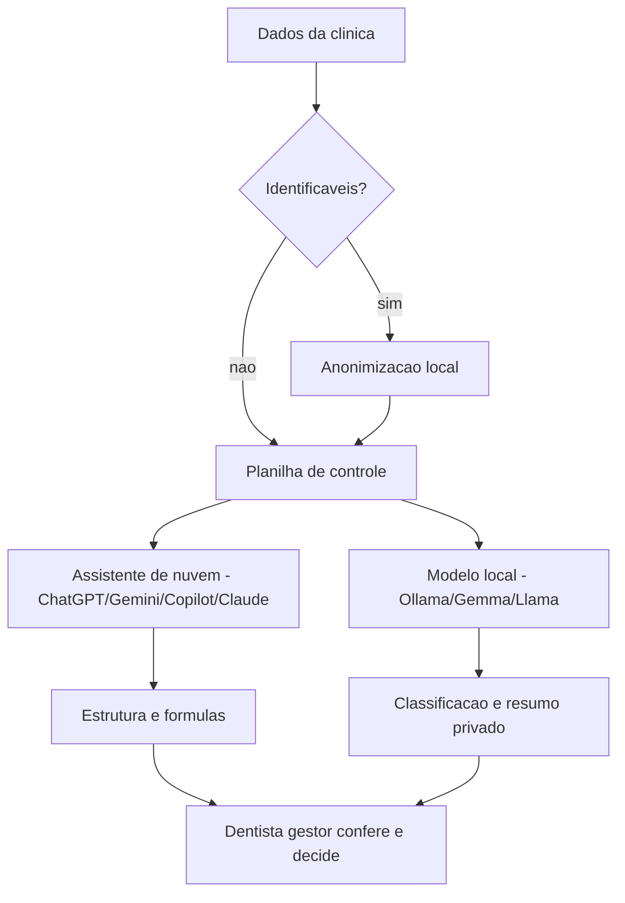

# Capítulo 3: IA na Bancada — Modelos Gratuitos e Planilhas

## 1. Introdução

Os capítulos anteriores construíram o prontuário financeiro: fluxo de caixa, DRE, ticket médio e custo por sessão. Chegou a hora de colocar a ferramenta que vai tornar essa rotina leve: a IA gratuita. Este capítulo ensina o dentista gestor a escolher entre os assistentes gratuitos disponíveis (ChatGPT, Gemini, Copilot, Claude), a usá-los para montar planilhas com prompts eficazes e a fazer isso **sem violar a privacidade dos pacientes** — a regra de ouro da bancada.

Você vai aprender o método completo do prompt de modelagem (descrever a arquitetura antes de pedir as fórmulas), o ciclo de correção dirigida (quando a fórmula erra) e a técnica de anonimização que permite enviar dados para a nuvem sem expor ninguém. Para dados ainda mais sensíveis, você vai conhecer os modelos locais — que rodam no computador da clínica, sem sair de casa.

Ao final, você será capaz de montar uma planilha de controle financeiro do zero com IA, conferir cada fórmula, corrigir erros com prompts e decidir com segurança o que pode ir para a nuvem e o que fica local.

## 2. Explica

### O ecossistema gratuito: cinco caminhos para a mesma bancada

A IA gratuita para quem trabalha com finanças de pequenos negócios hoje tem quatro assistentes de nuvem e uma família de modelos locais. O **ChatGPT** analisa planilhas, executa Python no navegador e gera relatórios — é o terminal mais popular da bancada [1]. O **Gemini** integra-se nativamente ao Google Sheets e ao Drive, o que o torna o parceiro natural de quem já vive no ecossistema Google [2]. O **Copilot** trabalha dentro do Office e da web, útil para quem quer gerar fórmulas e resumos sem sair do Word ou do Excel [3]. O **Claude** destaca-se na precisão lógica, na revisão de código e na análise de documentos longos [4]. Todos têm planos gratuitos com cotas por janela de tempo — para a rotina de uma clínica, que usa a ferramenta em rajadas curtas no fim de expediente, as cotas gratuitas são suficientes na maioria dos meses [1][2].

Há ainda os **modelos locais**: ferramentas como o Ollama executam no computador da clínica modelos de código aberto (famílias Llama, Gemma e Mistral, de 3 a 32 bilhões de parâmetros) que funcionam offline, sem enviar nenhum dado para a nuvem [5]. Eles são mais lentos e menos capazes que os grandes assistentes, mas resolvem tarefas de classificação, resumo e extração — exatamente as tarefas repetitivas da gestão financeira — com privacidade total [5][6]. Para uma clínica, a combinação vencedora costuma ser: assistente de nuvem para os dados anonimizados e modelo local para o que não pode sair de casa.

### A regra de ouro: anonimizar antes de subir

O dado do paciente é um dado pessoal sensível: prontuário, foto, história clínica e forma de pagamento estão protegidos pela Lei Geral de Proteção de Dados, com diretrizes específicas do Ministério da Saúde para o setor [7]. A Autoridade Nacional de Proteção de Dados regula o tratamento desses dados e o uso de IA, com regras simplificadas para agentes de pequeno porte — a maioria das clínicas se enquadra aí [8]. A regra prática que este livro adota é simples e intransigente: **nenhum dado identificável de paciente sobe para a nuvem**. Antes de qualquer upload, o gestor substitui nomes, CPFs, telefones e endereços por códigos anônimos. Com a anonimização, a análise financeira pode usar toda a potência dos assistentes gratuitos sem risco de vazamento [7][8].

### O que a IA faz bem (e o que ela faz mal) na gestão da clínica

A IA gratuita é excelente em tarefas de linguagem e estrutura: transformar uma descrição em uma planilha, escrever uma fórmula a partir de uma pergunta em português, classificar dezenas de lançamentos por categoria, resumir o mês financeiro em três parágrafos, sugerir metas com base em padrões de mercado. Ela é boa, com ressalvas, em contas simples: somas e porcentagens funcionam, mas cadeias longas de cálculo podem escorregar [1]. E ela é perigosamente confiante: quando não sabe, inventa — o fenômeno da alucinação. Na gestão financeira, a consequência é um número errado que vira decisão errada. Por isso, a regra da bancada: **todo número que vem da IA tem que vir com o cálculo — e todo cálculo tem que ser conferido** [1][4].

### O método do prompt de modelagem

O erro mais comum do iniciante é pedir a planilha inteira em um único prompt: "monta uma planilha de controle financeiro". A IA devolve algo genérico, e o dentista aceita. O método profissional divide o processo em duas etapas: primeiro, a **arquitetura** (abas, colunas, premissas e regras de cálculo — aprovada antes de qualquer fórmula); depois, a **construção** (fórmula por fórmula, explicada e conferida). Esse método, além de produzir planilhas melhores, ensina o gestor a pensar na estrutura do controle antes de preenchê-lo — a mesma disciplina do prontuário financeiro do capítulo anterior [9].

### A clínica e o Simples Nacional

Um detalhe de conformidade que aparece nas planilhas: a tributação da clínica. A maioria dos consultórios é microempresa ou empresa de pequeno porte enquadrada no Simples Nacional, cujas regras de apuração unificada de impostos são disciplinadas pela Receita Federal e pela Procuradoria-Geral da Fazenda Nacional [10]. Ao montar o DRE, o gestor usa uma alíquota simulada de deduções (a faixa do Simples para serviços, que varia conforme o faturamento anual) — e o assistente de IA ajuda a estimar a alíquota a partir do faturamento, mas a confirmação final é com o contador [10]. O prontuário eletrônico e os sistemas de gestão da clínica, por sua vez, dialogam com o Cadastro Nacional de Estabelecimentos de Saúde (CNES), o registro obrigatório dos estabelecimentos de saúde no Brasil [11].

### A planilha como linguagem comum

Na bancada da clínica, a planilha é a linguagem comum entre o dentista, a IA e o contador. O Excel e o Google Sheets são gratuitos (na versão web), aceitam fórmulas em português e exportam CSV — o formato que os assistentes e o Python leem melhor [2]. A combinação vencedora da bancada é: planilha como repositório, IA como copiloto de estrutura e fórmulas, Python (quando necessário) como motor de análise pesada, rodando dentro do próprio assistente ou no Colab — sem instalar nada [1][12].

## 3. Ilustra

Imagine a bancada do fim de expediente como o painel de uma clínica moderna: no centro, o dentista gestor; à esquerda, a planilha de controle; à direita, o assistente de IA; e, na gaveta, o modelo local para os dados que não podem sair da clínica. Cada ferramenta tem um papel: a planilha guarda, a IA acelera, o modelo local protege e o dentista decide.

Como Gestor de Clínica Odontológica, você vai montar essa bancada em uma tarde — e o diagrama abaixo mostra a arquitetura de dados segura que sustenta tudo.



## 4. Técnica

### O prompt mestre de modelagem

Abra o assistente gratuito de sua preferência e use este prompt — o mesmo método dos capítulos anteriores, agora com a clínica inteira:

```text
Atue como um consultor financeiro senior de clinicas odontologicas.
Antes de gerar qualquer formula, descreva a arquitetura da planilha de
[controle financeiro mensal da clinica] que vou construir no Excel.
Inclua:
1. As abas necessarias e a funcao de cada uma (ex.: Caixa, DRE, Pacientes, KPIs).
2. As colunas e linhas de cada aba.
3. As premissas que devem ficar separadas das formulas (ex.: aliquota do Simples).
4. As regras de calculo (ex.: ticket medio = receita / pacientes).
Depois de eu aprovar a arquitetura, gere as formulas uma por uma,
explicando o que cada uma faz. Nao pule etapas.
```

O retorno é a arquitetura. Aprove, peça ajustes se precisar, e só então peça as fórmulas. Esse protocolo evita a planilha genérica e ensina a estrutura do controle.

### Gerando fórmulas específicas

Com a arquitetura aprovada, gere fórmulas pontuais com prompts de um parágrafo:

```text
No Excel, quero calcular o ticket medio mensal: a receita total (soma
da coluna B da aba Caixa, filtrada pelo mes) dividida pelo numero de
pacientes atendidos (contagem na aba Pacientes). Escreva a formula,
explique o que ela faz e aponte onde usar referencias absolutas.
```

E para a margem:

```text
Crie uma formula para a margem liquida mensal: resultado dividido pela
receita liquida, com o resultado formatado em percentual. A formula
deve usar celulas nomeadas (ex.: Resultado_Mes, Receita_Liquida_Mes)
em vez de valores fixos.
```

### O ciclo de correção dirigida

Quando a fórmula retorna erro — `#VALOR!`, `#REF!` ou um número que não bate — não comece do zero. Use o ciclo de correção dirigida:

```text
A formula da celula F12 do meu DRE esta retornando #VALOR!.
Explique a cadeia de formulas que alimenta F12, identifique a causa
mais provavel e proponha a correcao minima, sem alterar as demais
celulas. Mostre a formula corrigida e o que ela faz.
```

O assistente rastreia a cadeia, aponta o erro e devolve a correção mínima — uma economia enorme de tempo comparada ao Google-Fu de fórmulas [4].

### Anonimização: a técnica que libera a nuvem

Antes de enviar qualquer dado da clínica para a nuvem, anonimize. O método rápido com Python:

```python
import hashlib
import pandas as pd

# Leitura do arquivo de faturamento com dados de pacientes
df = pd.read_csv("pacientes_bruto.csv")

# Substitui identificadores por codigos hash irreversiveis
df["codigo"] = df["nome"].apply(
    lambda nome: hashlib.sha256(nome.encode()).hexdigest()[:12]
)
df = df.drop(columns=["nome", "cpf", "telefone", "endereco"])

# Mantem apenas o que a analise financeira precisa
df_anon = df[["codigo", "procedimento", "categoria", "valor", "mes"]]
df_anon.to_csv("pacientes_faturamento.csv", index=False)
print("Arquivo anonimizado:", len(df_anon), "linhas, sem dados identificaveis")
```

Com o `pacientes_faturamento.csv` anonimizado, o ticket médio e as análises podem usar a nuvem à vontade [7][8].

### Modelos locais para dados sensíveis

Para documentos que você não quer enviar a lugar nenhum — contratos de plano odontológico, termos de parceria, planilhas com valores ainda confidenciais — instale o Ollama e rode um modelo local:

```bash
# Instala e executa o modelo Gemma 3 (4B) - suficiente para resumos e classificacao
ollama run gemma3:4b

# Em outra janela, liste os modelos instalados
ollama list
```

Com o modelo local, o prompt de classificação de lançamentos roda sem internet:

```text
Classifique cada linha abaixo nas categorias: Procedimento, Plano,
Custo fixo, Suprimento, Pessoal, Equipamento.
[cole os lancamentos do dia]
Responda em formato de tabela com as colunas Descricao e Categoria.
```

### Extraindo dados de relatórios e extratos

Outra tarefa em que a IA economiza horas: extrair dados estruturados de documentos não estruturados. O extrato do cartão de material, o resumo do plano odontológico e o relatório da operadora chegam em formatos diferentes — e o assistente transforma tudo em uma tabela padronizada:

```text
Cole abaixo o texto do resumo da operadora. Extraia em formato de
tabela com as colunas: Paciente (codigo, sem nome), Procedimento,
Data, Valor repassado, Status (pago/pendente). Normalize os valores
para o formato numerico brasileiro. Aponte qualquer linha ambigua
que precisar da minha confirmacao.
```

O mesmo prompt serve para extratos bancários, notas de material e relatórios de agenda. A regra vale de novo: dados identificáveis são anonimizados antes; e cada linha extraída merece uma conferência amostral — a IA erra linhas, nunca a estrutura inteira.

### A revisão da planilha como auditoria

Depois de montar a planilha, use a IA como auditora — o mesmo ciclo de correção dirigida, agora aplicado ao conjunto:

```text
Revise minha planilha de controle financeiro como um controller senior.
Aponte: (1) formulas com valores fixos embutidos que deveriam ser
premissas; (2) celulas sem referencias absolutas que podem quebrar ao
arrastar; (3) categorias de lancamento inconsistentes; (4) indicadores
que podem ser calculados errado por causa da estrutura. Para cada
achado, sugira a correcao minima. Nao altere nada sem me mostrar antes.
```

Essa auditoria periódica (a cada trimestre) mantém a planilha saudável conforme a clínica cresce — novas categorias, novas cadeiras, novos convênios.

### A política de dados da clínica

Para fechar a governança, a política de dados da bancada deve ficar escrita e visível (na recepção e na pasta de gestão):

```text
Redija uma politica de uso de IA para a clinica odontologica com
5 itens: (1) quais dados podem ir para assistentes de nuvem e quais
exigem modelo local; (2) a obrigacao de anonimizacao antes de qualquer
upload; (3) a regra de conferencia humana de todo numero antes de
qualquer decisao; (4) quem e o responsavel pela bancada; (5) o que
fazer em caso de suspeita de vazamento. Linguagem pratica, maximo
30 linhas.
```

A política não é burocracia: é o que protege a clínica na prática — e o que o gestor mostra, com segurança, para pacientes e para a ANPD se algum dia for perguntado [8].

### A tabela de escolha da bancada

A escolha da ferramenta não precisa ser religiosa — é funcional. A tabela abaixo resume o papel de cada opção gratuita na bancada da clínica:

| Ferramenta | Melhor papel na clínica | Limite típico do gratuito |
|---|---|---|
| ChatGPT | Análise de planilhas, Python no navegador, relatórios [1] | Cota de mensagens por janela |
| Gemini | Integração com Sheets e Drive da clínica [2] | Cota de mensagens e contexto |
| Copilot | Fórmulas e resumos dentro do Office [3] | Cota diária |
| Claude | Revisão de código e documentos longos [4] | Cota semanal |
| Ollama + Gemma/Llama | Dados sensíveis, offline, classificação [5][6] | Hardware da clínica |

A regra de bolso: o trabalho com dados anonimizados pode usar qualquer assistente de nuvem; o trabalho com dados identificáveis ou contratos confidenciais fica com o modelo local [5][7][8].

### O prompt de orçamento e planejamento

A bancada também serve para o planejamento — o orçamento anual da clínica, que conversa com o Capítulo 2 e o Capítulo 4:

```text
Monte o orcamento mensal da clinica para os proximos 12 meses com
base nos dados dos ultimos 3 meses (colados abaixo). Premissas:
(1) crescimento de receita de 5% ao ano, sazonal (janeiro fraco,
marco e agosto em alta); (2) custos fixos corrigidos pela inflacao
de 4% ao ano; (3) meta de inadimplencia abaixo de 5%; (4) reserva
de capital de giro de 1 mes de custo fixo ate o mes 6. Aponte os
tres meses de maior risco de caixa e o mes em que a reserva fica
completa.
```

O orçamento resultante alimenta o painel do próximo capítulo — e a comparação mês a mês entre o orçado e o realizado vira o indicador de gestão mais completo da clínica.

### A reunião com o contador: chegar com os números prontos

Um dos maiores ganhos da bancada é a mudança na relação com o contador. Em vez de levar caixas de papel ou prints de planilhas, o gestor chega com um resumo executivo gerado e conferido — e o contador passa de "tradutor de caos" a consultor de verdade. O prompt de preparação:

```text
Prepare um resumo executivo de uma pagina para a reuniao com o
contador, com: (1) DRE simplificado dos ultimos 3 meses em tabela;
(2) principais indicadores (margem, ticket, inadimplencia, custos
fixos); (3) tres duvidas objetivas sobre tributacao do Simples
Nacional para a minha faixa de faturamento; (4) uma lista de
documentos que devo levar (extrato, notas, comprovantes). Tom
profissional e direto.
```

Chegar com os números prontos muda a conversa: o contador responde dúvidas e orienta, em vez de passar a reunião inteira levantando dados. E a pergunta sobre a alíquota correta do Simples Nacional — a faixa exata depende do faturamento anual e muda todo ano [10] — vira uma pergunta objetiva com a resposta na ponta do lápis.

### As boas práticas de prompt da bancada

Seis hábitos separam o prompt que funciona do prompt que frustra: (1) **dê o papel** — "atue como um consultor financeiro de clínicas"; (2) **dê o contexto** — "clínica de uma cadeira, faturamento médio de R$ 28 mil"; (3) **peça a estrutura** — "responda em tabela com as colunas X, Y, Z"; (4) **peça o cálculo** — "mostre o passo a passo"; (5) **peça o limite** — "aponte o que você não consegue concluir com esses dados"; (6) **exija o formato de saída** — "no máximo 20 linhas". Um prompt bem construído reduz drasticamente o retrabalho e as alucinações — e o dentista gestor melhora os próprios prompts mês a mês, registrando os que funcionam [1][4].

### Os limites honestos da bancada

A bancada de IA tem limites que o gestor deve conhecer para não ser enganado pela fluência: a IA **não sabe** os dados da sua clínica (você precisa fornecê-los, anonimizados); a IA **pode errar** contas longas (confira sempre o cálculo); a IA **pode inventar** fontes e números (peça referências e verifique); a IA **não conhece** a sua realidade local (preços, convênios, região — o contexto é seu). A mentalidade correta é a do copiloto: a IA acelera, o piloto decide. Quem trata a IA como oráculo transfere para a ferramenta o erro que é humano [1][4][8].

### O primeiro mês da bancada

O primeiro mês de uso da bancada não precisa ser perfeito — precisa ser registrado. A meta realista: classificar os lançamentos do mês com a IA, montar uma planilha de controle com arquitetura aprovada, anonimizar um arquivo de pacientes e rodar ao menos uma tarefa sensível no modelo local. Ao final do mês, o gestor revisa o que funcionou e o que travou, ajusta os prompts e amplia o escopo no mês seguinte. A bancada cresce com a clínica — a ferramenta muda, o método permanece.

### A pergunta que a bancada não responde

Vale lembrar o que a bancada não faz: ela não substitui a contadora nem o CFO — a apuração fiscal, a folha de pagamento e o fechamento contábil continuam com o profissional habilitado. A bancada é o camada de gestão que fica entre a clínica e o escritório: organiza, mede e orienta, para que o contador e o dentista conversem sobre decisões, não sobre papelada [10].

### Kit de verificação do capítulo

Ao final, você deve ter: (1) a arquitetura da planilha de controle aprovada com a IA; (2) as fórmulas de ticket médio e margem geradas e conferidas; (3) o `pacientes_faturamento.csv` anonimizado; (4) pelo menos uma tarefa rodada no modelo local (se instalou o Ollama); e (5) a decisão documentada de quais dados podem ir à nuvem e quais ficam locais.

## 5. Aplica

### A cena do caos

A Dra. Renata quer montar o controle financeiro da clínica. Ela copia a planilha "pronta" que uma colega compartilhou e começa a preencher. Na terceira semana, percebe que as fórmulas não batem: a planilha foi feita para outra realidade, com categorias diferentes e valores fixos embutidos. Pior: ela colou no chat de IA o arquivo `pacientes.xlsx` original — com nomes, CPFs e fotos de prontuário — pedindo "análise". O assistente analisou, e a Dra. Renata só depois pensa no que acabou de fazer: enviou dados sensíveis de pacientes para a nuvem, sem anonimizar [7][8].

### A mesma cena, com o método

A Dra. Renata recomeça com o método: primeiro, o prompt de arquitetura; a IA devolve as abas Caixa, DRE, Pacientes e KPIs, com premissas separadas; ela aprova. Depois, as fórmulas uma a uma, conferidas com a calculadora. Antes de qualquer upload, ela roda a anonimização: o `pacientes_faturamento.csv` sai com códigos no lugar de nomes. O que precisa de análise pesada vai para a nuvem; o que é confidencial fica no modelo local. No fim do mês, a planilha está de pé, o DRE fecha com a calculadora e nenhum dado sensível saiu da clínica.

### Exercício da bancada

1. Abra o assistente gratuito e rode o prompt mestre de modelagem para o seu controle financeiro.
2. Aprove a arquitetura (ou peça ajustes) e gere a fórmula do ticket médio.
3. Anonimize uma planilha de pacientes de exemplo com o código do capítulo.
4. Se tiver um dado confidencial, rode a classificação de lançamentos no modelo local (Ollama).
5. Escreva em uma linha: "o que pode ir à nuvem e o que fica na clínica" — e cumpra.

### O exercício corrige o rumo

A virada deste capítulo é a mentalidade de copiloto: a IA monta, o gestor confere; a nuvem acelera, a anonimização protege. A clínica ganha velocidade sem perder a guarda dos dados — a combinação que o próximo capítulo vai transformar em um painel de comando completo.

## 6. Conclusão

Você conheceu o ecossistema gratuito da bancada — ChatGPT, Gemini, Copilot e Claude na nuvem [1][2][3][4], modelos locais para o que não pode sair da clínica [5][6] — e o método para extrair valor de cada um: o prompt de arquitetura, a fórmula por fórmula, o ciclo de correção dirigida e a anonimização como passaporte para a nuvem [7][8]. Você também alinhou a bancada com a conformidade: Simples Nacional na tributação [10] e CNES no registro [11]. A ferramenta agora está montada — falta transformar os números em comando visual, o tema do próximo capítulo.

## 7. Referências

[1] OpenAI. ChatGPT — Análise de dados e execução de código no navegador. Disponível em: https://openai.com/chatgpt/. Acesso em: 08 ago. 2026.
[2] Google. Gemini — integração com Google Workspace (Sheets e Drive). Disponível em: https://gemini.google.com/. Acesso em: 08 ago. 2026.
[3] Microsoft. Copilot — assistência no Microsoft 365 e na web. Disponível em: https://copilot.microsoft.com/. Acesso em: 08 ago. 2026.
[4] Anthropic. Claude — precisão lógica e revisão de código. Disponível em: https://www.anthropic.com/claude. Acesso em: 08 ago. 2026.
[5] Ollama. Execute modelos de linguagem localmente. Disponível em: https://ollama.com/. Acesso em: 08 ago. 2026.
[6] Google. Gemma — modelos abertos. Disponível em: https://ai.google.dev/gemma. Acesso em: 08 ago. 2026.
[7] Ministério da Saúde. LGPD no setor saúde. Disponível em: https://www.gov.br/saude/pt-br/acesso-a-informacao/lgpd. Acesso em: 08 ago. 2026.
[8] ANPD. Regulamentações — Resoluções de proteção de dados. Disponível em: https://www.gov.br/anpd/pt-br/acesso-a-informacao/institucional/atos-normativos/regulamentacoes_anpd. Acesso em: 08 ago. 2026.
[9] Odontiva. 10 KPIs Essenciais para Clínica Odontológica. 2026. Disponível em: https://odontiva.com.br/blog/indicadores-desempenho-clinica-odontologica. Acesso em: 08 ago. 2026.
[10] PGFN/Receita Federal. Simples Nacional — orientações e tributação de serviços. Disponível em: https://www.gov.br/pgfn/pt-br/cidadania-tributaria/por-assunto/simples-nacional. Acesso em: 08 ago. 2026.
[11] Ministério da Saúde/DATASUS. Cadastro Nacional de Estabelecimentos de Saúde (CNES). Disponível em: https://cnes.datasus.gov.br/. Acesso em: 08 ago. 2026.
[12] Google. Colaboratory (Colab) — notebooks Python gratuitos. Disponível em: https://colab.research.google.com/. Acesso em: 08 ago. 2026.
