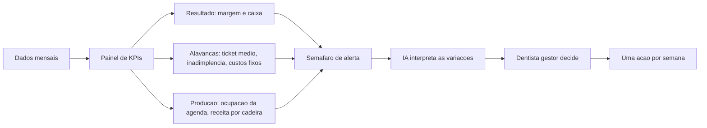

# Capítulo 4: Do Caos ao Comando — KPIs, Dashboards e Decisão

## 1. Introdução

Você tem o prontuário financeiro (Capítulo 2) e a bancada de IA (Capítulo 3). Falta o último instrumento de comando: o **painel** que transforma números soltos em decisão rápida. Este capítulo ensina a escolher os KPIs certos para uma clínica odontológica, a montar um dashboard gratuito (Looker Studio ou Power BI Desktop) e a usar a IA para interpretar, alertar e sugerir — sem nunca tirar a decisão das suas mãos.

O objetivo não é enfeitar: é reduzir o mês financeiro da clínica a uma tela que o dentista gestor lê em cinco minutos, todas as semanas. Você vai aprender quais indicadores importam (e quais são distração), como montar semáforos e alertas que guiam o olhar, e como fechar o livro com a disciplina final: conferência humana, conformidade (CNES, LGPD, normas do CFO) e um plano de ação de 90 dias.

Ao final, você será capaz de responder, diante do painel: a clínica está saudável? O que está piorando? Qual é a única coisa que eu devo fazer esta semana?

## 2. Explica

### O painel de comando: menos é mais

Um dashboard eficaz para clínica odontológica não mostra 50 indicadores — mostra os poucos que descrevem a saúde do negócio e guiam a ação. A literatura de indicadores do setor aponta um conjunto central: faturamento bruto, ticket médio, inadimplência, custos fixos sobre a receita, margem de lucro e ocupação da agenda [1]. Cada um responde a uma pergunta de gestão: quanto entrou, quanto vale cada paciente, quanto está faltando receber, quanto custa operar, quanto sobra e quão cheia está a produção da clínica [1].

O princípio do painel é hierarquia: o olhar deve pousar primeiro no resultado (margem e caixa), depois nas alavancas (ticket médio, inadimplência, custos) e só então nos detalhes. Um painel sem hierarquia não é um painel — é um emaranhado que ninguém lê [1].

### Os KPIs que importam na odontologia

**Ticket médio** — faturamento ÷ pacientes atendidos: o valor médio que cada paciente agrega, termômetro da precificação [2][4]. **Inadimplência** — % dos valores vencidos não recebidos: a referência do setor é manter abaixo de 5%; acima de 10% exige ação imediata de cobrança [1]. **Custos fixos sobre a receita** — a faixa saudável é 40%–50% do faturamento bruto [1]. **Margem líquida** — resultado ÷ receita líquida: clínicas eficientes operam entre 20% e 35% [3]. **Receita por cadeira** — faturamento ÷ número de cadeiras: revela se a estrutura está subutilizada ou no limite [1]. **Ocupação da agenda** — horários preenchidos ÷ disponíveis: o indicador de produção que explica, muitas vezes antes do financeiro, por que a margem caiu [1].

O dentista gestor não precisa decorar todos — precisa que o painel os mostre e que a IA explique as variações. O valor está na leitura conjunta: ticket médio caindo com ocupação estável indica queda de preço ou mix piorando; inadimplência subindo com receita estável indica problema de cobrança, não de demanda [1][2].

### O capital de giro e a reserva

O painel também deve vigiar o oxigênio: o capital de giro, calculado como ativo circulante menos passivo circulante operacional [5]. A leitura semanal é simples — o colchão está acima de um mês de custo fixo? Se não, qualquer atraso de convênio vira emergência [5]. Uma linha no painel com o saldo do capital de giro em meses de custo fixo evita a recaída no caos do Capítulo 1.

### O contexto: juros, inflação e benchmark

O painel ganha profundidade quando cruza os números internos com o contexto externo. A taxa de juros — publicada pelo Banco Central no Sistema Gerenciador de Séries Temporais [6] — define o custo de um financiamento de equipamento: com Selic alta, a decisão de comprar a terceira cadeira muda de conta [6]. A evolução da receita do setor de serviços, acompanhada mensalmente pelo IBGE [7], serve de benchmark: se a clínica cresce abaixo do setor, o problema é interno (captação, preço ou produtividade); se cresce acima, a estratégia está funcionando [7]. Essas séries são gratuitas, atualizadas e usáveis diretamente em planilhas [6][7].

### A IA como copiloto do painel: interpretar e alertar

O dashboard mostra; a IA interpreta. Com o relatório mensal anonimizado, o assistente gratuito pode: explicar em linguagem natural por que a margem caiu (comparando os meses), sugerir as três causas mais prováveis, redigir o e-mail de cobrança amigável para os inadimplentes e preparar o resumo executivo para o sócio ou o banco. Os alertas podem ser simples: regras de semáforo (verde/amarelo/vermelho) calculadas na própria planilha, sem nenhum software pago [1].

Mas a IA tem limites que o gestor precisa conhecer: ela pode **sugerir** as causas, nunca **afirmar** — correlação não é causalidade, e a IA tende a ser confiante demais nas suas explicações [3]. E a responsabilidade final é humana: a decisão de cortar um procedimento, subir um preço ou contratar é do dentista, não do assistente [8]. Esse é o ponto central da ética da IA na gestão: a ferramenta amplia a capacidade de ver, não a autoridade de decidir [8][9].

### A conformidade como pilar do comando

O painel financeiro da clínica opera dentro de um arcabouço regulatório que não pode ser ignorado. O estabelecimento precisa estar registrado no CNES, o cadastro nacional de estabelecimentos de saúde [10], cuja obrigatoriedade foi reiterada pela Anvisa também para as vigilâncias sanitárias [11]. Os dados dos pacientes são protegidos pela LGPD, com diretrizes do Ministério da Saúde e regulação da ANPD para o uso de IA [9]. E a atividade profissional segue as normas do Conselho Federal de Odontologia, que também disciplinam a publicidade de valores [12]. O comando financeiro saudável é o que respeita essas camadas: anonimização antes da nuvem, registro em dia e comunicação dentro das normas [9][12].

### O plano de 90 dias

Com o painel montado, a gestão vira rotina de comando: nas primeiras quatro semanas, consolidar os dados e calibrar o painel; no segundo mês, atacar a pior alavanca (ticket, inadimplência ou custos); no terceiro mês, revisar preços com o custo por sessão e criar a reserva de capital de giro. A cada semana, uma reunião de cinco minutos do dentista com o painel — o novo fim de expediente.

## 3. Ilustra

O painel de comando da clínica é o contraponto do caos do Capítulo 1: onde antes havia um caderno de anotações e um extrato bancário misturado com contas pessoais, agora há uma tela única, com semáforos, tendências e um número em destaque: o resultado do mês.

Como Gestor de Clínica Odontológica, você vai ler essa tela toda semana. O diagrama abaixo mostra a anatomia do painel — e como cada bloco se conecta à decisão.



## 4. Técnica

### Montando o painel de KPIs com Python

Antes do dashboard visual, o cálculo dos KPIs mensais roda em Python — dentro do assistente ou no Colab:

```python
import pandas as pd

# Dados mensais (arquivo kpis_mensais.csv do capitulo 2)
df = pd.read_csv("kpis_mensais.csv")

# KPIs por mes
df["margem"] = (df["resultado"] / df["receita_liquida"]) * 100
df["custo_fixo_pct"] = (df["custo_fixo"] / df["receita_bruta"]) * 100
df["ticket_medio"] = df["receita_bruta"] / df["pacientes"]
df["receita_por_cadeira"] = df["receita_bruta"] / df["cadeiras"]

print(df[["mes", "margem", "custo_fixo_pct", "ticket_medio", "receita_por_cadeira"]].to_string(index=False))

# Semafaro (regras de mercado do setor)
def semaforo(margem, inadimplencia):
    if margem >= 20 and inadimplencia < 5:
        return "VERDE"
    if margem >= 15 and inadimplencia < 10:
        return "AMARELO"
    return "VERMELHO"

ultimo = df.iloc[-1]
print(f"\nSemafaro do mes: {semaforo(ultimo['margem'], ultimo['inadimplencia'])}")
```

### O semáforo na planilha (fórmulas)

Para quem prefere o painel na própria planilha, o semáforo vira fórmula:

```text
No Excel, crie uma coluna "Status" que retorne "Verde", "Amarelo" ou
"Vermelho" conforme: Verde se margem >= 20% E inadimplencia < 5%;
Amarelo se margem >= 15% E inadimplencia < 10%; Vermelho caso
contrario. Use a funcao SE (IF) com E (AND), referenciando as celulas
de margem e inadimplencia. Formate com formatacao condicional: verde,
amarelo e vermelho.
```

### O dashboard no Looker Studio

Para o painel visual gratuito, o Looker Studio (Google) aceita o CSV da planilha como fonte:

```text
Monte um dashboard no Looker Studio com: (1) um scorecard com o
resultado do ultimo mes; (2) um grafico de linha com a evolucao da
margem por mes; (3) um grafico de barras com o ticket medio por mes;
(4) uma tabela com inadimplencia e custos fixos por mes; (5) um
filtro por periodo. Conecte a fonte como upload de CSV.
```

No Power BI Desktop (gratuito para uso local), a medida de margem em DAX:

```dax
Margem Liquida = DIVIDE(SUM('kpis'[resultado]), SUM('kpis'[receita_liquida]))
```

### O alerta de inadimplência

A inadimplência é o KPI que mais exige ação imediata. Monte a lista de cobrança com a IA:

```text
Tenho a lista anonimizada de pacientes com valores vencidos (colunas:
codigo, valor, dias de atraso, procedimento). Classifique em tres
grupos: (1) atraso ate 15 dias - lembrete amigavel por WhatsApp;
(2) 15 a 45 dias - ligacao da recepcao oferecendo renegociacao;
(3) acima de 45 dias - cobranca formal. Para cada grupo, redija a
mensagem-tipo, com tom profissional e respeitoso.
```

### A interpretação mensal com IA

No fim do mês, o resumo executivo sai em minutos:

```text
Compare os dados dos ultimos dois meses (anexados em formato CSV):
receita bruta, ticket medio, inadimplencia, custos fixos, margem e
ocupacao da agenda. Identifique as tres variacoes mais relevantes,
sugira a causa mais provavel de cada uma (sem afirmar como fato) e
proponha uma acao pratica para cada. Termine com um paragrafo pronto
para enviar ao socio, em tom executivo.
```

### A decisão de abrir a terceira cadeira

Um dos momentos em que o painel decide tudo: a hora de investir. A pergunta "a clínica aguenta a terceira cadeira?" tem resposta no painel, não no entusiasmo. O raciocínio em cinco passos: (1) qual a receita média por cadeira atual? (2) qual a ocupação da agenda — se está acima de 85%, há demanda represada; (3) qual o custo mensal de uma cadeira nova (equipamento parcelado + depreciação + aluguel de área + mais um auxiliar)? (4) quantos atendimentos a mais por mês a cadeira precisa gerar para cobrir o custo? (5) com a Selic atual — a série do Banco Central [6] — o financiamento vale mais que o custo de oportunidade do caixa? O painel transforma a decisão de investimento em uma conta de cinco linhas, e a IA ajuda a montar a conta sem decidir por você.

### O alerta automático por e-mail

O painel vira sistema de alerta quando a planilha manda o resumo automaticamente. No Google Sheets, um script simples dispara o e-mail semanal com o semáforo:

```javascript
// Exemplo de rotina (Google Apps Script): envia o resumo semanal
function enviarResumoSemanal() {
  var sheet = SpreadsheetApp.getActiveSpreadsheet().getSheetByName("KPIs");
  var ultima = sheet.getLastRow();
  var margem = sheet.getRange(ultima, 3).getValue();
  var inad = sheet.getRange(ultima, 4).getValue();
  var status = (margem >= 20 && inad < 5) ? "VERDE" :
               (margem >= 15 && inad < 10) ? "AMARELO" : "VERMELHO";
  MailApp.sendEmail(
    Session.getActiveUser().getEmail(),
    "Resumo semanal da clinica - " + status,
    "Margem: " + margem + "% | Inadimplencia: " + inad + "%"
  );
}
```

O alerta não substitui a leitura do gestor — ele garante que a leitura aconteça toda semana, mesmo na correria da clínica.

### A reunião de cinco minutos com o painel

A rotina final do comando é uma reunião semanal de cinco minutos entre o dentista e o painel, com quatro perguntas fixas: o resultado melhorou ou piorou? Qual alavanca mudou mais (ticket, inadimplência, custos, ocupação)? O que a IA aponta como causa provável — e eu concordo? Qual é a única ação desta semana? Cinco minutos por semana com resposta às quatro perguntas é a diferença entre o dentista gestor e o dentista que administra no susto.

### O plano de 90 dias, em detalhe

| Semana | Foco | Ação concreta |
|---|---|---|
| 1–4 | Consolidação | Alimentar `caixa_clinica.csv`, `kpis_mensais.csv` e o DRE; calibrar o painel |
| 5–8 | A pior alavanca | Atacar o indicador mais fora da faixa (ticket, inadimplência ou custos) |
| 9–12 | Preços e reserva | Revisar precificação com custo por sessão; criar reserva de 1 mês de custo fixo |

Cada linha da tabela tem um critério de conclusão mensurável: o painel fecha o mês com todos os campos preenchidos (semanas 1–4); o indicador-alvo se move ao menos um passo em direção à faixa saudável (semanas 5–8); a reserva atinge o alvo e o preço de dois procedimentos é revisado (semanas 9–12).

### O checklist semanal do comando

A reunião de cinco minutos funciona melhor com um checklist fixo. Imprima (ou fixe ao lado do painel) esta sequência:

1. O resultado do mês (margem e caixa) melhorou ou piorou frente ao mês anterior?
2. Qual alavanca se moveu mais: ticket médio, inadimplência, custos fixos ou ocupação?
3. O que a IA aponta como causa provável — e eu concordo com essa leitura?
4. Há algum alerta vermelho (inadimplência > 10%, margem < 15%, capital de giro < 1 mês)?
5. Qual é a única ação desta semana?
6. Registro a ação no `kpis_mensais.csv` para avaliar o efeito no mês seguinte.

O checklist transforma a leitura do painel de evento em hábito — e o hábito é o que sustenta a gestão quando a correria da clínica volta [1].

### A análise de variação com a IA

Quando o indicador muda, o gestor quer a explicação — mas uma explicação de qualidade. O prompt abaixo força a IA a mostrar o raciocínio e a distinguir causa de correlação:

```text
Minha margem caiu de 22% para 16% entre os dois ultimos meses.
Dados (CSV anexado): receita, ticket medio, inadimplencia, custos
fixos, ocupacao da agenda. Analise e responda:
1. Quantifique a contribuicao de cada variavel para a queda (em pontos
   percentuais), mostrando o calculo.
2. Distinga o que e causa provavel do que e apenas correlacao.
3. Aponte o que voce NAO pode concluir com esses dados.
4. Proponha duas acoes de teste para a semana, com metrica de
   verificacao em 30 dias.
```

A resposta com contribuição quantificada, separação entre causa e correlação e o reconhecimento do que não se pode concluir é o padrão de qualidade da bancada — o mesmo que o dentista exigiria de um bom assistente clínico.

### Os dados que ainda não são financeiros

O painel financeiro conversa com dois conjuntos de dados que a clínica já produz: a agenda (ocupação, faltas, desistências) e o prontuário (procedimentos por tipo, recorrência de tratamentos). A ocupação da agenda explica a receita antes mesmo de ela cair: se a taxa de faltas subir de 5% para 12%, o caixa de quatro semanas depois sentirá o efeito. O mix de procedimentos explica o ticket médio: se o prontuário mostra crescimento de limpezas e queda de próteses, o ticket vai cair antes de aparecer no painel. O gestor atento conecta as pontas: agenda e prontuário são indicadores antecedentes; caixa e margem são consequentes [1].

### O registro do aprendizado mensal

No fim de cada mês, o gestor registra uma linha no `kpis_mensais.csv` com os números e uma linha de texto com a leitura: o que mudou, o que a IA apontou, o que ele decidiu e o que vai observar. Esse registro é o que transforma a gestão em aprendizado acumulado — em doze meses, o dentista gestor tem um histórico que nenhum curso ensina: a memória financeira da própria clínica, com as causas de cada variação documentadas [1][9].

### As métricas que comprovam o método

Todo o livro pode ser resumido em um pequeno conjunto de metas de verificação — as métricas que mostram, em números, que a gestão funcionou:

| Meta | Como medir | Prazo razoável |
|---|---|---|
| Margem líquida ≥ 20% | DRE mensal | 6 meses de método |
| Inadimplência < 5% | contas a receber vencidas | 3–6 meses de cobrança ativa |
| Ticket médio em alta | faturamento ÷ pacientes | trimestral |
| Capital de giro ≥ 1 mês de custo fixo | ativo circulante − passivo circulante [5] | 6 meses de reserva programada |
| Fim de expediente ≤ 15 min | cronômetro da rotina | imediato |

A última linha é a mais reveladora: quando a rotina do fim de expediente — alimentar o caixa, conferir com a IA, ler o painel — cabe em quinze minutos, o método virou hábito, e o hábito virou gestão [1].

### O fechamento do arco: da cadeira ao comando

Este capítulo encerra o arco que começou no primeiro fim de expediente: o dentista que era refém da agenda agora comanda o negócio a partir de uma tela. O prontuário financeiro (Capítulo 2), a bancada de IA (Capítulo 3) e o painel de comando (Capítulo 4) formam o sistema completo de gestão — e cada peça só funciona porque a anterior existe: sem caixa organizado não há DRE confiável; sem anonimização não há IA segura; sem painel não há decisão rápida. O sistema não exige investimento em software: exige disciplina, uma planilha e as ferramentas gratuitas que este livro apresentou [1][9].

### O que este livro não é

Para não restar dúvida: este livro não ensina odontologia, não substitui contador e não promete enriquecimento rápido. Ele ensina uma coisa só — um sistema de gestão financeira para clínica odontológica construído com ferramentas gratuitas e a disciplina do fim de expediente. O resto é consequência: números claros, decisões com critério e um negócio que o dentista entende de verdade.

### Kit de verificação do capítulo

Ao final, você deve ter: (1) os KPIs dos últimos meses calculados com semáforo; (2) o dashboard visual (Looker Studio ou Power BI) alimentado com os dados; (3) a política de cobrança em três níveis; e (4) o primeiro resumo executivo gerado pela IA e conferido por você.

## 5. Aplica

### A cena do caos

É segunda-feira, e o Dr. Paulo está com três frentes abertas ao mesmo tempo: o banco quer saber por que o faturamento caiu, a auxiliar relata que três pacientes reclamaram de preço e a contadora avisou que o pró-labore do mês não cabe no caixa. O Dr. Paulo não tem nenhum número na frente — ele responde ao banco com "a clínica está bem", à auxiliar com "reajustamos no próximo mês" e à contadora com "tira do cartão". Três decisões, zero dados: o caos do Capítulo 1, agora em escala de gestão.

### A mesma cena, com o método

O Dr. Paulo abre o painel. O semáforo está amarelo: margem 16%, inadimplência 8,5%. O gráfico de ticket médio mostra queda nos últimos três meses. Ele pede à IA que compare os meses e sugira causas: a IA aponta o mix de procedimentos — cresceu o volume de limpezas (ticket baixo) e caiu o de próteses — e uma inadimplência concentrada em parcelamentos de 2025. O Dr. Paulo decide duas ações: revisa o plano de reabilitação (aumento de próteses no mix, com justificativa de custo por sessão) e dispara a cobrança em três níveis para a carteira vencida. Trinta dias depois, o ticket médio subiu 12% e a inadimplência caiu para 6%. O banco recebe o resumo executivo com números — e o Dr. Paulo dorme melhor.

### Exercício do comando

1. Calcule os KPIs dos seus últimos três meses (margem, ticket médio, inadimplência, custos fixos, receita por cadeira).
2. Monte o semáforo do último mês com as regras do setor.
3. Crie o dashboard gratuito (Looker Studio ou Power BI) e conecte os dados.
4. Gere com a IA o resumo executivo do mês e confira cada número.
5. Escreva a sua única ação da semana com base no painel.

### O exercício corrige o rumo

A virada final do livro é a mais importante: o painel não existe para ser bonito — existe para reduzir a distância entre o dado e a decisão. O dentista gestor não decide no escuro, não decide na emoção e não terceiriza a decisão para a IA [8]. Ele olha o painel, confere com a IA, decide com o próprio critério e age — uma ação por semana, todo mês, todo ano.

## 6. Conclusão

Este capítulo fechou o arco do livro: do caos do fim de expediente (Capítulo 1) aos números organizados (Capítulo 2), com a IA gratuita na bancada (Capítulo 3) e, agora, o painel de comando (Capítulo 4). Você conheceu os KPIs que importam — ticket médio, inadimplência, custos fixos, margem e receita por cadeira [1][2][3][4] —, o contexto externo de juros e benchmark [6][7], a reserva de capital de giro [5] e as camadas de conformidade que sustentam tudo [9][10][11][12]. E, acima de tudo, você aprendeu a regra que governa o livro inteiro: a IA amplia a visão, o humano decide [8].

O plano de 90 dias está nas suas mãos: consolide os dados no primeiro mês, ataque a pior alavanca no segundo, revise preços e reserve no terceiro. O fim de expediente nunca mais será o mesmo — agora ele tem um painel, um copiloto e um comando.

## 7. Referências

[1] Odontiva. 10 KPIs Essenciais para Clínica Odontológica. 2026. Disponível em: https://odontiva.com.br/blog/indicadores-desempenho-clinica-odontologica. Acesso em: 08 ago. 2026.
[2] Dental Office. Dentista: como calcular o ticket médio da sua clínica odontológica? 2024. Disponível em: https://www.dentaloffice.com.br/ticket-medio/. Acesso em: 08 ago. 2026.
[3] Sanders, L. Como funciona a margem de lucro na odontologia? Simples Dental, 2025. Disponível em: https://www.simplesdental.com/blog/margem-de-lucro-na-odontologia/. Acesso em: 08 ago. 2026.
[4] Clinicorp. Como calcular o ticket médio na odontologia? Aprenda agora. 2025. Disponível em: https://www.clinicorp.com/post/calcular-ticket-medio-odontologia. Acesso em: 08 ago. 2026.
[5] Angelus. Como ter uma boa gestão financeira do consultório odontológico? 2024. Disponível em: https://angelus.ind.br/pt-br/blog/gestao-financeira-de-consultorio-odontologico/. Acesso em: 08 ago. 2026.
[6] Banco Central do Brasil. Sistema Gerenciador de Séries Temporais (SGS). Disponível em: https://www3.bcb.gov.br/sgspub/. Acesso em: 08 ago. 2026.
[7] IBGE. Pesquisa Mensal de Serviços (PMS). Disponível em: https://www.ibge.gov.br/estatisticas/economicas/servicos/9229-pesquisa-mensal-de-servicos.html. Acesso em: 08 ago. 2026.
[8] ANPD. Regulamentações — Resoluções de proteção de dados (uso de IA). Disponível em: https://www.gov.br/anpd/pt-br/acesso-a-informacao/institucional/atos-normativos/regulamentacoes_anpd. Acesso em: 08 ago. 2026.
[9] Ministério da Saúde. LGPD no setor saúde. Disponível em: https://www.gov.br/saude/pt-br/acesso-a-informacao/lgpd. Acesso em: 08 ago. 2026.
[10] Ministério da Saúde/DATASUS. Cadastro Nacional de Estabelecimentos de Saúde (CNES). Disponível em: https://cnes.datasus.gov.br/. Acesso em: 08 ago. 2026.
[11] Anvisa. Anvisa esclarece obrigatoriedade de cadastro das vigilâncias sanitárias e em saúde no CNES. 2025. Disponível em: https://www.gov.br/anvisa/pt-br/assuntos/noticias-anvisa/2025/anvisa-esclarece-obrigatoriedade-de-cadastro-das-vigilancias-sanitarias-e-em-saude-no-cnes. Acesso em: 08 ago. 2026.
[12] Conselho Federal de Odontologia. Portal institucional — normas e resoluções da profissão. Disponível em: https://website.cfo.org.br/. Acesso em: 08 ago. 2026.
