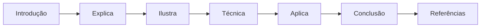
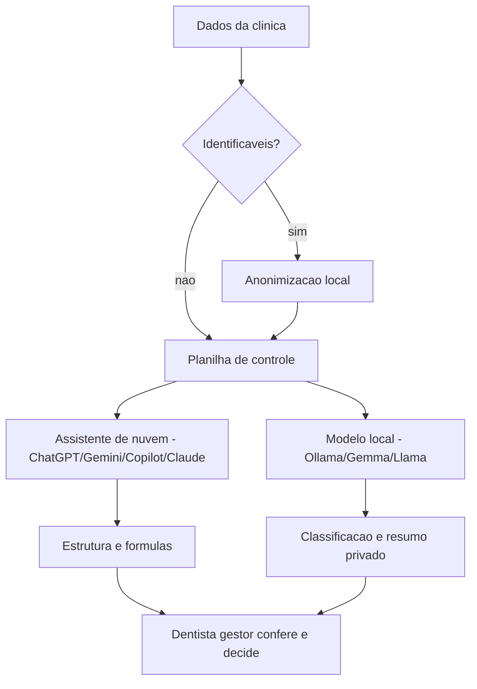
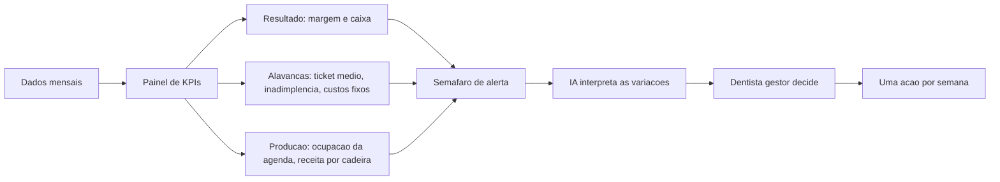

# IA na Bancada: Modelos Gratuitos e Planilhas & Do Caos ao Comando: KPIs, Dashboards e Decisão

# Como Este Livro Foi Escrito: A Metodologia EITA

Todo capítulo deste livro segue a metodologia **EITA** — um framework pedagógico de 7 seções projetado para transformar o leitor de "não sei" para "consigo fazer" em cada tema abordado.

## As 7 Seções do EITA

### 1. INTRODUÇÃO
Contextualiza o tema. Explica o que será abordado, por que importa, e o que você será capaz ao final. Uma ponte conecta com o capítulo anterior (quando houver).

### 2. EXPLICA
Desconstrói o conceito: causa raiz, mecânica subjacente, definições precisas. Você passa de "não sei o que é" para "sei definir e explicar".

### 3. ILUSTRA
Uma analogia concreta ancora o conceito na sua intuição — sempre acompanhada de um diagrama visual que torna o abstrato tangível. Você passa de "parece abstrato" para "faz sentido".

### 4. TÉCNICA
O núcleo de valor: código executável, arquiteturas, passo a passo de implementação. É aqui você ganha as mãos para fazer. Você passa de "não sei fazer" para "consigo implementar".

### 5. APLICA
Contextualização em cenário real: onde aquilo se aplica no mercado, armadilhas comuns e como evitá-las. Você passa de "isso é teórico" para "vou usar no trabalho".

### 6. CONCLUSÃO
Síntese dos 3 pontos principais, conexão com o próximo capítulo e um desafio opcional para fixar o aprendizado.

### 7. REFERÊNCIAS BIBLIOGRÁFICAS
Fontes citadas no capítulo, em formato ABNT numerado. Toda afirmação factual tem sua referência.

## Por Que Funciona

O EITA não é uma lista de tópicos — é uma **jornada de transformação**. Cada seção leva o leitor a um estado mental diferente:

```
Introdução → "Quero aprender"
Explica     → "Entendi a teoria"
Ilustra     → "Faz sentido na prática"
Técnica     → "Consigo fazer"
Aplica      → "Vou usar no trabalho"
Conclusão   → "Dominei este tema"
```

## Diagrama do Fluxo EITA



## Dica de Leitura

Você pode ler os capítulos em ordem (recomendado para iniciantes) ou pular diretamente para o tema de interesse. Cada capítulo é autocontido, mas a sequência cria conexões que ampliam o aprendizado.

---

*A metodologia EITA é uma criação da Fábrica Agêntica de Livros, projetada para produzir literatura técnica que transforma leitores em profissionais.*


# Capítulo 3: IA na Bancada — Modelos Gratuitos e Planilhas

## 1. Introdução

Os capítulos anteriores construíram o prontuário financeiro: fluxo de caixa, DRE, ticket médio e custo por sessão. Chegou a hora de colocar a ferramenta que vai tornar essa rotina leve: a IA gratuita. Este capítulo ensina o dentista gestor a escolher entre os assistentes gratuitos disponíveis (ChatGPT, Gemini, Copilot, Claude), a usá-los para montar planilhas com prompts eficazes e a fazer isso **sem violar a privacidade dos pacientes** — a regra de ouro da bancada.

Você vai aprender o método completo do prompt de modelagem (descrever a arquitetura antes de pedir as fórmulas), o ciclo de correção dirigida (quando a fórmula erra) e a técnica de anonimização que permite enviar dados para a nuvem sem expor ninguém. Para dados ainda mais sensíveis, você vai conhecer os modelos locais — que rodam no computador da clínica, sem sair de casa.

Ao final, você será capaz de montar uma planilha de controle financeiro do zero com IA, conferir cada fórmula, corrigir erros com prompts e decidir com segurança o que pode ir para a nuvem e o que fica local.

## 2. Explica

### O ecossistema gratuito: cinco caminhos para a mesma bancada

A IA gratuita para quem trabalha com finanças de pequenos negócios hoje tem quatro assistentes de nuvem e uma família de modelos locais. O **ChatGPT** analisa planilhas, executa Python no navegador e gera relatórios — é o terminal mais popular da bancada [1]. O **Gemini** integra-se nativamente ao Google Sheets e ao Drive, o que o torna o parceiro natural de quem já vive no ecossistema Google [2]. O **Copilot** trabalha dentro do Office e da web, útil para quem quer gerar fórmulas e resumos sem sair do Word ou do Excel [3]. O **Claude** destaca-se na precisão lógica, na revisão de código e na análise de documentos longos [4]. Todos têm planos gratuitos com cotas por janela de tempo — para a rotina de uma clínica, que usa a ferramenta em rajadas curtas no fim de expediente, as cotas gratuitas são suficientes na maioria dos meses [1][2].

Há ainda os **modelos locais**: ferramentas como o Ollama executam no computador da clínica modelos de código aberto (famílias Llama, Gemma e Mistral, de 3 a 32 bilhões de parâmetros) que funcionam offline, sem enviar nenhum dado para a nuvem [5]. Eles são mais lentos e menos capazes que os grandes assistentes, mas resolvem tarefas de classificação, resumo e extração — exatamente as tarefas repetitivas da gestão financeira — com privacidade total [5][6]. Para uma clínica, a combinação vencedora costuma ser: assistente de nuvem para os dados anonimizados e modelo local para o que não pode sair de casa.

### A regra de ouro: anonimizar antes de subir

O dado do paciente é um dado pessoal sensível: prontuário, foto, história clínica e forma de pagamento estão protegidos pela Lei Geral de Proteção de Dados, com diretrizes específicas do Ministério da Saúde para o setor [7]. A Autoridade Nacional de Proteção de Dados regula o tratamento desses dados e o uso de IA, com regras simplificadas para agentes de pequeno porte — a maioria das clínicas se enquadra aí [8]. A regra prática que este livro adota é simples e intransigente: **nenhum dado identificável de paciente sobe para a nuvem**. Antes de qualquer upload, o gestor substitui nomes, CPFs, telefones e endereços por códigos anônimos. Com a anonimização, a análise financeira pode usar toda a potência dos assistentes gratuitos sem risco de vazamento [7][8].

### O que a IA faz bem (e o que ela faz mal) na gestão da clínica

A IA gratuita é excelente em tarefas de linguagem e estrutura: transformar uma descrição em uma planilha, escrever uma fórmula a partir de uma pergunta em português, classificar dezenas de lançamentos por categoria, resumir o mês financeiro em três parágrafos, sugerir metas com base em padrões de mercado. Ela é boa, com ressalvas, em contas simples: somas e porcentagens funcionam, mas cadeias longas de cálculo podem escorregar [1]. E ela é perigosamente confiante: quando não sabe, inventa — o fenômeno da alucinação. Na gestão financeira, a consequência é um número errado que vira decisão errada. Por isso, a regra da bancada: **todo número que vem da IA tem que vir com o cálculo — e todo cálculo tem que ser conferido** [1][4].

### O método do prompt de modelagem

O erro mais comum do iniciante é pedir a planilha inteira em um único prompt: "monta uma planilha de controle financeiro". A IA devolve algo genérico, e o dentista aceita. O método profissional divide o processo em duas etapas: primeiro, a **arquitetura** (abas, colunas, premissas e regras de cálculo — aprovada antes de qualquer fórmula); depois, a **construção** (fórmula por fórmula, explicada e conferida). Esse método, além de produzir planilhas melhores, ensina o gestor a pensar na estrutura do controle antes de preenchê-lo — a mesma disciplina do prontuário financeiro do capítulo anterior [9].

### A clínica e o Simples Nacional

Um detalhe de conformidade que aparece nas planilhas: a tributação da clínica. A maioria dos consultórios é microempresa ou empresa de pequeno porte enquadrada no Simples Nacional, cujas regras de apuração unificada de impostos são disciplinadas pela Receita Federal e pela Procuradoria-Geral da Fazenda Nacional [10]. Ao montar o DRE, o gestor usa uma alíquota simulada de deduções (a faixa do Simples para serviços, que varia conforme o faturamento anual) — e o assistente de IA ajuda a estimar a alíquota a partir do faturamento, mas a confirmação final é com o contador [10]. O prontuário eletrônico e os sistemas de gestão da clínica, por sua vez, dialogam com o Cadastro Nacional de Estabelecimentos de Saúde (CNES), o registro obrigatório dos estabelecimentos de saúde no Brasil [11].

### A planilha como linguagem comum

Na bancada da clínica, a planilha é a linguagem comum entre o dentista, a IA e o contador. O Excel e o Google Sheets são gratuitos (na versão web), aceitam fórmulas em português e exportam CSV — o formato que os assistentes e o Python leem melhor [2]. A combinação vencedora da bancada é: planilha como repositório, IA como copiloto de estrutura e fórmulas, Python (quando necessário) como motor de análise pesada, rodando dentro do próprio assistente ou no Colab — sem instalar nada [1][12].

## 3. Ilustra

Imagine a bancada do fim de expediente como o painel de uma clínica moderna: no centro, o dentista gestor; à esquerda, a planilha de controle; à direita, o assistente de IA; e, na gaveta, o modelo local para os dados que não podem sair da clínica. Cada ferramenta tem um papel: a planilha guarda, a IA acelera, o modelo local protege e o dentista decide.

Como Gestor de Clínica Odontológica, você vai montar essa bancada em uma tarde — e o diagrama abaixo mostra a arquitetura de dados segura que sustenta tudo.



## 4. Técnica

### O prompt mestre de modelagem

Abra o assistente gratuito de sua preferência e use este prompt — o mesmo método dos capítulos anteriores, agora com a clínica inteira:

```text
Atue como um consultor financeiro senior de clinicas odontologicas.
Antes de gerar qualquer formula, descreva a arquitetura da planilha de
[controle financeiro mensal da clinica] que vou construir no Excel.
Inclua:
1. As abas necessarias e a funcao de cada uma (ex.: Caixa, DRE, Pacientes, KPIs).
2. As colunas e linhas de cada aba.
3. As premissas que devem ficar separadas das formulas (ex.: aliquota do Simples).
4. As regras de calculo (ex.: ticket medio = receita / pacientes).
Depois de eu aprovar a arquitetura, gere as formulas uma por uma,
explicando o que cada uma faz. Nao pule etapas.
```

O retorno é a arquitetura. Aprove, peça ajustes se precisar, e só então peça as fórmulas. Esse protocolo evita a planilha genérica e ensina a estrutura do controle.

### Gerando fórmulas específicas

Com a arquitetura aprovada, gere fórmulas pontuais com prompts de um parágrafo:

```text
No Excel, quero calcular o ticket medio mensal: a receita total (soma
da coluna B da aba Caixa, filtrada pelo mes) dividida pelo numero de
pacientes atendidos (contagem na aba Pacientes). Escreva a formula,
explique o que ela faz e aponte onde usar referencias absolutas.
```

E para a margem:

```text
Crie uma formula para a margem liquida mensal: resultado dividido pela
receita liquida, com o resultado formatado em percentual. A formula
deve usar celulas nomeadas (ex.: Resultado_Mes, Receita_Liquida_Mes)
em vez de valores fixos.
```

### O ciclo de correção dirigida

Quando a fórmula retorna erro — `#VALOR!`, `#REF!` ou um número que não bate — não comece do zero. Use o ciclo de correção dirigida:

```text
A formula da celula F12 do meu DRE esta retornando #VALOR!.
Explique a cadeia de formulas que alimenta F12, identifique a causa
mais provavel e proponha a correcao minima, sem alterar as demais
celulas. Mostre a formula corrigida e o que ela faz.
```

O assistente rastreia a cadeia, aponta o erro e devolve a correção mínima — uma economia enorme de tempo comparada ao Google-Fu de fórmulas [4].

### Anonimização: a técnica que libera a nuvem

Antes de enviar qualquer dado da clínica para a nuvem, anonimize. O método rápido com Python:

```python
import hashlib
import pandas as pd

# Leitura do arquivo de faturamento com dados de pacientes
df = pd.read_csv("pacientes_bruto.csv")

# Substitui identificadores por codigos hash irreversiveis
df["codigo"] = df["nome"].apply(
    lambda nome: hashlib.sha256(nome.encode()).hexdigest()[:12]
)
df = df.drop(columns=["nome", "cpf", "telefone", "endereco"])

# Mantem apenas o que a analise financeira precisa
df_anon = df[["codigo", "procedimento", "categoria", "valor", "mes"]]
df_anon.to_csv("pacientes_faturamento.csv", index=False)
print("Arquivo anonimizado:", len(df_anon), "linhas, sem dados identificaveis")
```

Com o `pacientes_faturamento.csv` anonimizado, o ticket médio e as análises podem usar a nuvem à vontade [7][8].

### Modelos locais para dados sensíveis

Para documentos que você não quer enviar a lugar nenhum — contratos de plano odontológico, termos de parceria, planilhas com valores ainda confidenciais — instale o Ollama e rode um modelo local:

```bash
# Instala e executa o modelo Gemma 3 (4B) - suficiente para resumos e classificacao
ollama run gemma3:4b

# Em outra janela, liste os modelos instalados
ollama list
```

Com o modelo local, o prompt de classificação de lançamentos roda sem internet:

```text
Classifique cada linha abaixo nas categorias: Procedimento, Plano,
Custo fixo, Suprimento, Pessoal, Equipamento.
[cole os lancamentos do dia]
Responda em formato de tabela com as colunas Descricao e Categoria.
```

### Extraindo dados de relatórios e extratos

Outra tarefa em que a IA economiza horas: extrair dados estruturados de documentos não estruturados. O extrato do cartão de material, o resumo do plano odontológico e o relatório da operadora chegam em formatos diferentes — e o assistente transforma tudo em uma tabela padronizada:

```text
Cole abaixo o texto do resumo da operadora. Extraia em formato de
tabela com as colunas: Paciente (codigo, sem nome), Procedimento,
Data, Valor repassado, Status (pago/pendente). Normalize os valores
para o formato numerico brasileiro. Aponte qualquer linha ambigua
que precisar da minha confirmacao.
```

O mesmo prompt serve para extratos bancários, notas de material e relatórios de agenda. A regra vale de novo: dados identificáveis são anonimizados antes; e cada linha extraída merece uma conferência amostral — a IA erra linhas, nunca a estrutura inteira.

### A revisão da planilha como auditoria

Depois de montar a planilha, use a IA como auditora — o mesmo ciclo de correção dirigida, agora aplicado ao conjunto:

```text
Revise minha planilha de controle financeiro como um controller senior.
Aponte: (1) formulas com valores fixos embutidos que deveriam ser
premissas; (2) celulas sem referencias absolutas que podem quebrar ao
arrastar; (3) categorias de lancamento inconsistentes; (4) indicadores
que podem ser calculados errado por causa da estrutura. Para cada
achado, sugira a correcao minima. Nao altere nada sem me mostrar antes.
```

Essa auditoria periódica (a cada trimestre) mantém a planilha saudável conforme a clínica cresce — novas categorias, novas cadeiras, novos convênios.

### A política de dados da clínica

Para fechar a governança, a política de dados da bancada deve ficar escrita e visível (na recepção e na pasta de gestão):

```text
Redija uma politica de uso de IA para a clinica odontologica com
5 itens: (1) quais dados podem ir para assistentes de nuvem e quais
exigem modelo local; (2) a obrigacao de anonimizacao antes de qualquer
upload; (3) a regra de conferencia humana de todo numero antes de
qualquer decisao; (4) quem e o responsavel pela bancada; (5) o que
fazer em caso de suspeita de vazamento. Linguagem pratica, maximo
30 linhas.
```

A política não é burocracia: é o que protege a clínica na prática — e o que o gestor mostra, com segurança, para pacientes e para a ANPD se algum dia for perguntado [8].

### A tabela de escolha da bancada

A escolha da ferramenta não precisa ser religiosa — é funcional. A tabela abaixo resume o papel de cada opção gratuita na bancada da clínica:

| Ferramenta | Melhor papel na clínica | Limite típico do gratuito |
|---|---|---|
| ChatGPT | Análise de planilhas, Python no navegador, relatórios [1] | Cota de mensagens por janela |
| Gemini | Integração com Sheets e Drive da clínica [2] | Cota de mensagens e contexto |
| Copilot | Fórmulas e resumos dentro do Office [3] | Cota diária |
| Claude | Revisão de código e documentos longos [4] | Cota semanal |
| Ollama + Gemma/Llama | Dados sensíveis, offline, classificação [5][6] | Hardware da clínica |

A regra de bolso: o trabalho com dados anonimizados pode usar qualquer assistente de nuvem; o trabalho com dados identificáveis ou contratos confidenciais fica com o modelo local [5][7][8].

### O prompt de orçamento e planejamento

A bancada também serve para o planejamento — o orçamento anual da clínica, que conversa com o Capítulo 2 e o Capítulo 4:

```text
Monte o orcamento mensal da clinica para os proximos 12 meses com
base nos dados dos ultimos 3 meses (colados abaixo). Premissas:
(1) crescimento de receita de 5% ao ano, sazonal (janeiro fraco,
marco e agosto em alta); (2) custos fixos corrigidos pela inflacao
de 4% ao ano; (3) meta de inadimplencia abaixo de 5%; (4) reserva
de capital de giro de 1 mes de custo fixo ate o mes 6. Aponte os
tres meses de maior risco de caixa e o mes em que a reserva fica
completa.
```

O orçamento resultante alimenta o painel do próximo capítulo — e a comparação mês a mês entre o orçado e o realizado vira o indicador de gestão mais completo da clínica.

### A reunião com o contador: chegar com os números prontos

Um dos maiores ganhos da bancada é a mudança na relação com o contador. Em vez de levar caixas de papel ou prints de planilhas, o gestor chega com um resumo executivo gerado e conferido — e o contador passa de "tradutor de caos" a consultor de verdade. O prompt de preparação:

```text
Prepare um resumo executivo de uma pagina para a reuniao com o
contador, com: (1) DRE simplificado dos ultimos 3 meses em tabela;
(2) principais indicadores (margem, ticket, inadimplencia, custos
fixos); (3) tres duvidas objetivas sobre tributacao do Simples
Nacional para a minha faixa de faturamento; (4) uma lista de
documentos que devo levar (extrato, notas, comprovantes). Tom
profissional e direto.
```

Chegar com os números prontos muda a conversa: o contador responde dúvidas e orienta, em vez de passar a reunião inteira levantando dados. E a pergunta sobre a alíquota correta do Simples Nacional — a faixa exata depende do faturamento anual e muda todo ano [10] — vira uma pergunta objetiva com a resposta na ponta do lápis.

### As boas práticas de prompt da bancada

Seis hábitos separam o prompt que funciona do prompt que frustra: (1) **dê o papel** — "atue como um consultor financeiro de clínicas"; (2) **dê o contexto** — "clínica de uma cadeira, faturamento médio de R$ 28 mil"; (3) **peça a estrutura** — "responda em tabela com as colunas X, Y, Z"; (4) **peça o cálculo** — "mostre o passo a passo"; (5) **peça o limite** — "aponte o que você não consegue concluir com esses dados"; (6) **exija o formato de saída** — "no máximo 20 linhas". Um prompt bem construído reduz drasticamente o retrabalho e as alucinações — e o dentista gestor melhora os próprios prompts mês a mês, registrando os que funcionam [1][4].

### Os limites honestos da bancada

A bancada de IA tem limites que o gestor deve conhecer para não ser enganado pela fluência: a IA **não sabe** os dados da sua clínica (você precisa fornecê-los, anonimizados); a IA **pode errar** contas longas (confira sempre o cálculo); a IA **pode inventar** fontes e números (peça referências e verifique); a IA **não conhece** a sua realidade local (preços, convênios, região — o contexto é seu). A mentalidade correta é a do copiloto: a IA acelera, o piloto decide. Quem trata a IA como oráculo transfere para a ferramenta o erro que é humano [1][4][8].

### O primeiro mês da bancada

O primeiro mês de uso da bancada não precisa ser perfeito — precisa ser registrado. A meta realista: classificar os lançamentos do mês com a IA, montar uma planilha de controle com arquitetura aprovada, anonimizar um arquivo de pacientes e rodar ao menos uma tarefa sensível no modelo local. Ao final do mês, o gestor revisa o que funcionou e o que travou, ajusta os prompts e amplia o escopo no mês seguinte. A bancada cresce com a clínica — a ferramenta muda, o método permanece.

### A pergunta que a bancada não responde

Vale lembrar o que a bancada não faz: ela não substitui a contadora nem o CFO — a apuração fiscal, a folha de pagamento e o fechamento contábil continuam com o profissional habilitado. A bancada é o camada de gestão que fica entre a clínica e o escritório: organiza, mede e orienta, para que o contador e o dentista conversem sobre decisões, não sobre papelada [10].

### Kit de verificação do capítulo

Ao final, você deve ter: (1) a arquitetura da planilha de controle aprovada com a IA; (2) as fórmulas de ticket médio e margem geradas e conferidas; (3) o `pacientes_faturamento.csv` anonimizado; (4) pelo menos uma tarefa rodada no modelo local (se instalou o Ollama); e (5) a decisão documentada de quais dados podem ir à nuvem e quais ficam locais.

## 5. Aplica

### A cena do caos

A Dra. Renata quer montar o controle financeiro da clínica. Ela copia a planilha "pronta" que uma colega compartilhou e começa a preencher. Na terceira semana, percebe que as fórmulas não batem: a planilha foi feita para outra realidade, com categorias diferentes e valores fixos embutidos. Pior: ela colou no chat de IA o arquivo `pacientes.xlsx` original — com nomes, CPFs e fotos de prontuário — pedindo "análise". O assistente analisou, e a Dra. Renata só depois pensa no que acabou de fazer: enviou dados sensíveis de pacientes para a nuvem, sem anonimizar [7][8].

### A mesma cena, com o método

A Dra. Renata recomeça com o método: primeiro, o prompt de arquitetura; a IA devolve as abas Caixa, DRE, Pacientes e KPIs, com premissas separadas; ela aprova. Depois, as fórmulas uma a uma, conferidas com a calculadora. Antes de qualquer upload, ela roda a anonimização: o `pacientes_faturamento.csv` sai com códigos no lugar de nomes. O que precisa de análise pesada vai para a nuvem; o que é confidencial fica no modelo local. No fim do mês, a planilha está de pé, o DRE fecha com a calculadora e nenhum dado sensível saiu da clínica.

### Exercício da bancada

1. Abra o assistente gratuito e rode o prompt mestre de modelagem para o seu controle financeiro.
2. Aprove a arquitetura (ou peça ajustes) e gere a fórmula do ticket médio.
3. Anonimize uma planilha de pacientes de exemplo com o código do capítulo.
4. Se tiver um dado confidencial, rode a classificação de lançamentos no modelo local (Ollama).
5. Escreva em uma linha: "o que pode ir à nuvem e o que fica na clínica" — e cumpra.

### O exercício corrige o rumo

A virada deste capítulo é a mentalidade de copiloto: a IA monta, o gestor confere; a nuvem acelera, a anonimização protege. A clínica ganha velocidade sem perder a guarda dos dados — a combinação que o próximo capítulo vai transformar em um painel de comando completo.

## 6. Conclusão

Você conheceu o ecossistema gratuito da bancada — ChatGPT, Gemini, Copilot e Claude na nuvem [1][2][3][4], modelos locais para o que não pode sair da clínica [5][6] — e o método para extrair valor de cada um: o prompt de arquitetura, a fórmula por fórmula, o ciclo de correção dirigida e a anonimização como passaporte para a nuvem [7][8]. Você também alinhou a bancada com a conformidade: Simples Nacional na tributação [10] e CNES no registro [11]. A ferramenta agora está montada — falta transformar os números em comando visual, o tema do próximo capítulo.

## 7. Referências

[1] OpenAI. ChatGPT — Análise de dados e execução de código no navegador. Disponível em: https://openai.com/chatgpt/. Acesso em: 08 ago. 2026.
[2] Google. Gemini — integração com Google Workspace (Sheets e Drive). Disponível em: https://gemini.google.com/. Acesso em: 08 ago. 2026.
[3] Microsoft. Copilot — assistência no Microsoft 365 e na web. Disponível em: https://copilot.microsoft.com/. Acesso em: 08 ago. 2026.
[4] Anthropic. Claude — precisão lógica e revisão de código. Disponível em: https://www.anthropic.com/claude. Acesso em: 08 ago. 2026.
[5] Ollama. Execute modelos de linguagem localmente. Disponível em: https://ollama.com/. Acesso em: 08 ago. 2026.
[6] Google. Gemma — modelos abertos. Disponível em: https://ai.google.dev/gemma. Acesso em: 08 ago. 2026.
[7] Ministério da Saúde. LGPD no setor saúde. Disponível em: https://www.gov.br/saude/pt-br/acesso-a-informacao/lgpd. Acesso em: 08 ago. 2026.
[8] ANPD. Regulamentações — Resoluções de proteção de dados. Disponível em: https://www.gov.br/anpd/pt-br/acesso-a-informacao/institucional/atos-normativos/regulamentacoes_anpd. Acesso em: 08 ago. 2026.
[9] Odontiva. 10 KPIs Essenciais para Clínica Odontológica. 2026. Disponível em: https://odontiva.com.br/blog/indicadores-desempenho-clinica-odontologica. Acesso em: 08 ago. 2026.
[10] PGFN/Receita Federal. Simples Nacional — orientações e tributação de serviços. Disponível em: https://www.gov.br/pgfn/pt-br/cidadania-tributaria/por-assunto/simples-nacional. Acesso em: 08 ago. 2026.
[11] Ministério da Saúde/DATASUS. Cadastro Nacional de Estabelecimentos de Saúde (CNES). Disponível em: https://cnes.datasus.gov.br/. Acesso em: 08 ago. 2026.
[12] Google. Colaboratory (Colab) — notebooks Python gratuitos. Disponível em: https://colab.research.google.com/. Acesso em: 08 ago. 2026.


# Capítulo 4: Do Caos ao Comando — KPIs, Dashboards e Decisão

## 1. Introdução

Você tem o prontuário financeiro (Capítulo 2) e a bancada de IA (Capítulo 3). Falta o último instrumento de comando: o **painel** que transforma números soltos em decisão rápida. Este capítulo ensina a escolher os KPIs certos para uma clínica odontológica, a montar um dashboard gratuito (Looker Studio ou Power BI Desktop) e a usar a IA para interpretar, alertar e sugerir — sem nunca tirar a decisão das suas mãos.

O objetivo não é enfeitar: é reduzir o mês financeiro da clínica a uma tela que o dentista gestor lê em cinco minutos, todas as semanas. Você vai aprender quais indicadores importam (e quais são distração), como montar semáforos e alertas que guiam o olhar, e como fechar o livro com a disciplina final: conferência humana, conformidade (CNES, LGPD, normas do CFO) e um plano de ação de 90 dias.

Ao final, você será capaz de responder, diante do painel: a clínica está saudável? O que está piorando? Qual é a única coisa que eu devo fazer esta semana?

## 2. Explica

### O painel de comando: menos é mais

Um dashboard eficaz para clínica odontológica não mostra 50 indicadores — mostra os poucos que descrevem a saúde do negócio e guiam a ação. A literatura de indicadores do setor aponta um conjunto central: faturamento bruto, ticket médio, inadimplência, custos fixos sobre a receita, margem de lucro e ocupação da agenda [1]. Cada um responde a uma pergunta de gestão: quanto entrou, quanto vale cada paciente, quanto está faltando receber, quanto custa operar, quanto sobra e quão cheia está a produção da clínica [1].

O princípio do painel é hierarquia: o olhar deve pousar primeiro no resultado (margem e caixa), depois nas alavancas (ticket médio, inadimplência, custos) e só então nos detalhes. Um painel sem hierarquia não é um painel — é um emaranhado que ninguém lê [1].

### Os KPIs que importam na odontologia

**Ticket médio** — faturamento ÷ pacientes atendidos: o valor médio que cada paciente agrega, termômetro da precificação [2][4]. **Inadimplência** — % dos valores vencidos não recebidos: a referência do setor é manter abaixo de 5%; acima de 10% exige ação imediata de cobrança [1]. **Custos fixos sobre a receita** — a faixa saudável é 40%–50% do faturamento bruto [1]. **Margem líquida** — resultado ÷ receita líquida: clínicas eficientes operam entre 20% e 35% [3]. **Receita por cadeira** — faturamento ÷ número de cadeiras: revela se a estrutura está subutilizada ou no limite [1]. **Ocupação da agenda** — horários preenchidos ÷ disponíveis: o indicador de produção que explica, muitas vezes antes do financeiro, por que a margem caiu [1].

O dentista gestor não precisa decorar todos — precisa que o painel os mostre e que a IA explique as variações. O valor está na leitura conjunta: ticket médio caindo com ocupação estável indica queda de preço ou mix piorando; inadimplência subindo com receita estável indica problema de cobrança, não de demanda [1][2].

### O capital de giro e a reserva

O painel também deve vigiar o oxigênio: o capital de giro, calculado como ativo circulante menos passivo circulante operacional [5]. A leitura semanal é simples — o colchão está acima de um mês de custo fixo? Se não, qualquer atraso de convênio vira emergência [5]. Uma linha no painel com o saldo do capital de giro em meses de custo fixo evita a recaída no caos do Capítulo 1.

### O contexto: juros, inflação e benchmark

O painel ganha profundidade quando cruza os números internos com o contexto externo. A taxa de juros — publicada pelo Banco Central no Sistema Gerenciador de Séries Temporais [6] — define o custo de um financiamento de equipamento: com Selic alta, a decisão de comprar a terceira cadeira muda de conta [6]. A evolução da receita do setor de serviços, acompanhada mensalmente pelo IBGE [7], serve de benchmark: se a clínica cresce abaixo do setor, o problema é interno (captação, preço ou produtividade); se cresce acima, a estratégia está funcionando [7]. Essas séries são gratuitas, atualizadas e usáveis diretamente em planilhas [6][7].

### A IA como copiloto do painel: interpretar e alertar

O dashboard mostra; a IA interpreta. Com o relatório mensal anonimizado, o assistente gratuito pode: explicar em linguagem natural por que a margem caiu (comparando os meses), sugerir as três causas mais prováveis, redigir o e-mail de cobrança amigável para os inadimplentes e preparar o resumo executivo para o sócio ou o banco. Os alertas podem ser simples: regras de semáforo (verde/amarelo/vermelho) calculadas na própria planilha, sem nenhum software pago [1].

Mas a IA tem limites que o gestor precisa conhecer: ela pode **sugerir** as causas, nunca **afirmar** — correlação não é causalidade, e a IA tende a ser confiante demais nas suas explicações [3]. E a responsabilidade final é humana: a decisão de cortar um procedimento, subir um preço ou contratar é do dentista, não do assistente [8]. Esse é o ponto central da ética da IA na gestão: a ferramenta amplia a capacidade de ver, não a autoridade de decidir [8][9].

### A conformidade como pilar do comando

O painel financeiro da clínica opera dentro de um arcabouço regulatório que não pode ser ignorado. O estabelecimento precisa estar registrado no CNES, o cadastro nacional de estabelecimentos de saúde [10], cuja obrigatoriedade foi reiterada pela Anvisa também para as vigilâncias sanitárias [11]. Os dados dos pacientes são protegidos pela LGPD, com diretrizes do Ministério da Saúde e regulação da ANPD para o uso de IA [9]. E a atividade profissional segue as normas do Conselho Federal de Odontologia, que também disciplinam a publicidade de valores [12]. O comando financeiro saudável é o que respeita essas camadas: anonimização antes da nuvem, registro em dia e comunicação dentro das normas [9][12].

### O plano de 90 dias

Com o painel montado, a gestão vira rotina de comando: nas primeiras quatro semanas, consolidar os dados e calibrar o painel; no segundo mês, atacar a pior alavanca (ticket, inadimplência ou custos); no terceiro mês, revisar preços com o custo por sessão e criar a reserva de capital de giro. A cada semana, uma reunião de cinco minutos do dentista com o painel — o novo fim de expediente.

## 3. Ilustra

O painel de comando da clínica é o contraponto do caos do Capítulo 1: onde antes havia um caderno de anotações e um extrato bancário misturado com contas pessoais, agora há uma tela única, com semáforos, tendências e um número em destaque: o resultado do mês.

Como Gestor de Clínica Odontológica, você vai ler essa tela toda semana. O diagrama abaixo mostra a anatomia do painel — e como cada bloco se conecta à decisão.



## 4. Técnica

### Montando o painel de KPIs com Python

Antes do dashboard visual, o cálculo dos KPIs mensais roda em Python — dentro do assistente ou no Colab:

```python
import pandas as pd

# Dados mensais (arquivo kpis_mensais.csv do capitulo 2)
df = pd.read_csv("kpis_mensais.csv")

# KPIs por mes
df["margem"] = (df["resultado"] / df["receita_liquida"]) * 100
df["custo_fixo_pct"] = (df["custo_fixo"] / df["receita_bruta"]) * 100
df["ticket_medio"] = df["receita_bruta"] / df["pacientes"]
df["receita_por_cadeira"] = df["receita_bruta"] / df["cadeiras"]

print(df[["mes", "margem", "custo_fixo_pct", "ticket_medio", "receita_por_cadeira"]].to_string(index=False))

# Semafaro (regras de mercado do setor)
def semaforo(margem, inadimplencia):
    if margem >= 20 and inadimplencia < 5:
        return "VERDE"
    if margem >= 15 and inadimplencia < 10:
        return "AMARELO"
    return "VERMELHO"

ultimo = df.iloc[-1]
print(f"\nSemafaro do mes: {semaforo(ultimo['margem'], ultimo['inadimplencia'])}")
```

### O semáforo na planilha (fórmulas)

Para quem prefere o painel na própria planilha, o semáforo vira fórmula:

```text
No Excel, crie uma coluna "Status" que retorne "Verde", "Amarelo" ou
"Vermelho" conforme: Verde se margem >= 20% E inadimplencia < 5%;
Amarelo se margem >= 15% E inadimplencia < 10%; Vermelho caso
contrario. Use a funcao SE (IF) com E (AND), referenciando as celulas
de margem e inadimplencia. Formate com formatacao condicional: verde,
amarelo e vermelho.
```

### O dashboard no Looker Studio

Para o painel visual gratuito, o Looker Studio (Google) aceita o CSV da planilha como fonte:

```text
Monte um dashboard no Looker Studio com: (1) um scorecard com o
resultado do ultimo mes; (2) um grafico de linha com a evolucao da
margem por mes; (3) um grafico de barras com o ticket medio por mes;
(4) uma tabela com inadimplencia e custos fixos por mes; (5) um
filtro por periodo. Conecte a fonte como upload de CSV.
```

No Power BI Desktop (gratuito para uso local), a medida de margem em DAX:

```dax
Margem Liquida = DIVIDE(SUM('kpis'[resultado]), SUM('kpis'[receita_liquida]))
```

### O alerta de inadimplência

A inadimplência é o KPI que mais exige ação imediata. Monte a lista de cobrança com a IA:

```text
Tenho a lista anonimizada de pacientes com valores vencidos (colunas:
codigo, valor, dias de atraso, procedimento). Classifique em tres
grupos: (1) atraso ate 15 dias - lembrete amigavel por WhatsApp;
(2) 15 a 45 dias - ligacao da recepcao oferecendo renegociacao;
(3) acima de 45 dias - cobranca formal. Para cada grupo, redija a
mensagem-tipo, com tom profissional e respeitoso.
```

### A interpretação mensal com IA

No fim do mês, o resumo executivo sai em minutos:

```text
Compare os dados dos ultimos dois meses (anexados em formato CSV):
receita bruta, ticket medio, inadimplencia, custos fixos, margem e
ocupacao da agenda. Identifique as tres variacoes mais relevantes,
sugira a causa mais provavel de cada uma (sem afirmar como fato) e
proponha uma acao pratica para cada. Termine com um paragrafo pronto
para enviar ao socio, em tom executivo.
```

### A decisão de abrir a terceira cadeira

Um dos momentos em que o painel decide tudo: a hora de investir. A pergunta "a clínica aguenta a terceira cadeira?" tem resposta no painel, não no entusiasmo. O raciocínio em cinco passos: (1) qual a receita média por cadeira atual? (2) qual a ocupação da agenda — se está acima de 85%, há demanda represada; (3) qual o custo mensal de uma cadeira nova (equipamento parcelado + depreciação + aluguel de área + mais um auxiliar)? (4) quantos atendimentos a mais por mês a cadeira precisa gerar para cobrir o custo? (5) com a Selic atual — a série do Banco Central [6] — o financiamento vale mais que o custo de oportunidade do caixa? O painel transforma a decisão de investimento em uma conta de cinco linhas, e a IA ajuda a montar a conta sem decidir por você.

### O alerta automático por e-mail

O painel vira sistema de alerta quando a planilha manda o resumo automaticamente. No Google Sheets, um script simples dispara o e-mail semanal com o semáforo:

```javascript
// Exemplo de rotina (Google Apps Script): envia o resumo semanal
function enviarResumoSemanal() {
  var sheet = SpreadsheetApp.getActiveSpreadsheet().getSheetByName("KPIs");
  var ultima = sheet.getLastRow();
  var margem = sheet.getRange(ultima, 3).getValue();
  var inad = sheet.getRange(ultima, 4).getValue();
  var status = (margem >= 20 && inad < 5) ? "VERDE" :
               (margem >= 15 && inad < 10) ? "AMARELO" : "VERMELHO";
  MailApp.sendEmail(
    Session.getActiveUser().getEmail(),
    "Resumo semanal da clinica - " + status,
    "Margem: " + margem + "% | Inadimplencia: " + inad + "%"
  );
}
```

O alerta não substitui a leitura do gestor — ele garante que a leitura aconteça toda semana, mesmo na correria da clínica.

### A reunião de cinco minutos com o painel

A rotina final do comando é uma reunião semanal de cinco minutos entre o dentista e o painel, com quatro perguntas fixas: o resultado melhorou ou piorou? Qual alavanca mudou mais (ticket, inadimplência, custos, ocupação)? O que a IA aponta como causa provável — e eu concordo? Qual é a única ação desta semana? Cinco minutos por semana com resposta às quatro perguntas é a diferença entre o dentista gestor e o dentista que administra no susto.

### O plano de 90 dias, em detalhe

| Semana | Foco | Ação concreta |
|---|---|---|
| 1–4 | Consolidação | Alimentar `caixa_clinica.csv`, `kpis_mensais.csv` e o DRE; calibrar o painel |
| 5–8 | A pior alavanca | Atacar o indicador mais fora da faixa (ticket, inadimplência ou custos) |
| 9–12 | Preços e reserva | Revisar precificação com custo por sessão; criar reserva de 1 mês de custo fixo |

Cada linha da tabela tem um critério de conclusão mensurável: o painel fecha o mês com todos os campos preenchidos (semanas 1–4); o indicador-alvo se move ao menos um passo em direção à faixa saudável (semanas 5–8); a reserva atinge o alvo e o preço de dois procedimentos é revisado (semanas 9–12).

### O checklist semanal do comando

A reunião de cinco minutos funciona melhor com um checklist fixo. Imprima (ou fixe ao lado do painel) esta sequência:

1. O resultado do mês (margem e caixa) melhorou ou piorou frente ao mês anterior?
2. Qual alavanca se moveu mais: ticket médio, inadimplência, custos fixos ou ocupação?
3. O que a IA aponta como causa provável — e eu concordo com essa leitura?
4. Há algum alerta vermelho (inadimplência > 10%, margem < 15%, capital de giro < 1 mês)?
5. Qual é a única ação desta semana?
6. Registro a ação no `kpis_mensais.csv` para avaliar o efeito no mês seguinte.

O checklist transforma a leitura do painel de evento em hábito — e o hábito é o que sustenta a gestão quando a correria da clínica volta [1].

### A análise de variação com a IA

Quando o indicador muda, o gestor quer a explicação — mas uma explicação de qualidade. O prompt abaixo força a IA a mostrar o raciocínio e a distinguir causa de correlação:

```text
Minha margem caiu de 22% para 16% entre os dois ultimos meses.
Dados (CSV anexado): receita, ticket medio, inadimplencia, custos
fixos, ocupacao da agenda. Analise e responda:
1. Quantifique a contribuicao de cada variavel para a queda (em pontos
   percentuais), mostrando o calculo.
2. Distinga o que e causa provavel do que e apenas correlacao.
3. Aponte o que voce NAO pode concluir com esses dados.
4. Proponha duas acoes de teste para a semana, com metrica de
   verificacao em 30 dias.
```

A resposta com contribuição quantificada, separação entre causa e correlação e o reconhecimento do que não se pode concluir é o padrão de qualidade da bancada — o mesmo que o dentista exigiria de um bom assistente clínico.

### Os dados que ainda não são financeiros

O painel financeiro conversa com dois conjuntos de dados que a clínica já produz: a agenda (ocupação, faltas, desistências) e o prontuário (procedimentos por tipo, recorrência de tratamentos). A ocupação da agenda explica a receita antes mesmo de ela cair: se a taxa de faltas subir de 5% para 12%, o caixa de quatro semanas depois sentirá o efeito. O mix de procedimentos explica o ticket médio: se o prontuário mostra crescimento de limpezas e queda de próteses, o ticket vai cair antes de aparecer no painel. O gestor atento conecta as pontas: agenda e prontuário são indicadores antecedentes; caixa e margem são consequentes [1].

### O registro do aprendizado mensal

No fim de cada mês, o gestor registra uma linha no `kpis_mensais.csv` com os números e uma linha de texto com a leitura: o que mudou, o que a IA apontou, o que ele decidiu e o que vai observar. Esse registro é o que transforma a gestão em aprendizado acumulado — em doze meses, o dentista gestor tem um histórico que nenhum curso ensina: a memória financeira da própria clínica, com as causas de cada variação documentadas [1][9].

### As métricas que comprovam o método

Todo o livro pode ser resumido em um pequeno conjunto de metas de verificação — as métricas que mostram, em números, que a gestão funcionou:

| Meta | Como medir | Prazo razoável |
|---|---|---|
| Margem líquida ≥ 20% | DRE mensal | 6 meses de método |
| Inadimplência < 5% | contas a receber vencidas | 3–6 meses de cobrança ativa |
| Ticket médio em alta | faturamento ÷ pacientes | trimestral |
| Capital de giro ≥ 1 mês de custo fixo | ativo circulante − passivo circulante [5] | 6 meses de reserva programada |
| Fim de expediente ≤ 15 min | cronômetro da rotina | imediato |

A última linha é a mais reveladora: quando a rotina do fim de expediente — alimentar o caixa, conferir com a IA, ler o painel — cabe em quinze minutos, o método virou hábito, e o hábito virou gestão [1].

### O fechamento do arco: da cadeira ao comando

Este capítulo encerra o arco que começou no primeiro fim de expediente: o dentista que era refém da agenda agora comanda o negócio a partir de uma tela. O prontuário financeiro (Capítulo 2), a bancada de IA (Capítulo 3) e o painel de comando (Capítulo 4) formam o sistema completo de gestão — e cada peça só funciona porque a anterior existe: sem caixa organizado não há DRE confiável; sem anonimização não há IA segura; sem painel não há decisão rápida. O sistema não exige investimento em software: exige disciplina, uma planilha e as ferramentas gratuitas que este livro apresentou [1][9].

### O que este livro não é

Para não restar dúvida: este livro não ensina odontologia, não substitui contador e não promete enriquecimento rápido. Ele ensina uma coisa só — um sistema de gestão financeira para clínica odontológica construído com ferramentas gratuitas e a disciplina do fim de expediente. O resto é consequência: números claros, decisões com critério e um negócio que o dentista entende de verdade.

### Kit de verificação do capítulo

Ao final, você deve ter: (1) os KPIs dos últimos meses calculados com semáforo; (2) o dashboard visual (Looker Studio ou Power BI) alimentado com os dados; (3) a política de cobrança em três níveis; e (4) o primeiro resumo executivo gerado pela IA e conferido por você.

## 5. Aplica

### A cena do caos

É segunda-feira, e o Dr. Paulo está com três frentes abertas ao mesmo tempo: o banco quer saber por que o faturamento caiu, a auxiliar relata que três pacientes reclamaram de preço e a contadora avisou que o pró-labore do mês não cabe no caixa. O Dr. Paulo não tem nenhum número na frente — ele responde ao banco com "a clínica está bem", à auxiliar com "reajustamos no próximo mês" e à contadora com "tira do cartão". Três decisões, zero dados: o caos do Capítulo 1, agora em escala de gestão.

### A mesma cena, com o método

O Dr. Paulo abre o painel. O semáforo está amarelo: margem 16%, inadimplência 8,5%. O gráfico de ticket médio mostra queda nos últimos três meses. Ele pede à IA que compare os meses e sugira causas: a IA aponta o mix de procedimentos — cresceu o volume de limpezas (ticket baixo) e caiu o de próteses — e uma inadimplência concentrada em parcelamentos de 2025. O Dr. Paulo decide duas ações: revisa o plano de reabilitação (aumento de próteses no mix, com justificativa de custo por sessão) e dispara a cobrança em três níveis para a carteira vencida. Trinta dias depois, o ticket médio subiu 12% e a inadimplência caiu para 6%. O banco recebe o resumo executivo com números — e o Dr. Paulo dorme melhor.

### Exercício do comando

1. Calcule os KPIs dos seus últimos três meses (margem, ticket médio, inadimplência, custos fixos, receita por cadeira).
2. Monte o semáforo do último mês com as regras do setor.
3. Crie o dashboard gratuito (Looker Studio ou Power BI) e conecte os dados.
4. Gere com a IA o resumo executivo do mês e confira cada número.
5. Escreva a sua única ação da semana com base no painel.

### O exercício corrige o rumo

A virada final do livro é a mais importante: o painel não existe para ser bonito — existe para reduzir a distância entre o dado e a decisão. O dentista gestor não decide no escuro, não decide na emoção e não terceiriza a decisão para a IA [8]. Ele olha o painel, confere com a IA, decide com o próprio critério e age — uma ação por semana, todo mês, todo ano.

## 6. Conclusão

Este capítulo fechou o arco do livro: do caos do fim de expediente (Capítulo 1) aos números organizados (Capítulo 2), com a IA gratuita na bancada (Capítulo 3) e, agora, o painel de comando (Capítulo 4). Você conheceu os KPIs que importam — ticket médio, inadimplência, custos fixos, margem e receita por cadeira [1][2][3][4] —, o contexto externo de juros e benchmark [6][7], a reserva de capital de giro [5] e as camadas de conformidade que sustentam tudo [9][10][11][12]. E, acima de tudo, você aprendeu a regra que governa o livro inteiro: a IA amplia a visão, o humano decide [8].

O plano de 90 dias está nas suas mãos: consolide os dados no primeiro mês, ataque a pior alavanca no segundo, revise preços e reserve no terceiro. O fim de expediente nunca mais será o mesmo — agora ele tem um painel, um copiloto e um comando.

## 7. Referências

[1] Odontiva. 10 KPIs Essenciais para Clínica Odontológica. 2026. Disponível em: https://odontiva.com.br/blog/indicadores-desempenho-clinica-odontologica. Acesso em: 08 ago. 2026.
[2] Dental Office. Dentista: como calcular o ticket médio da sua clínica odontológica? 2024. Disponível em: https://www.dentaloffice.com.br/ticket-medio/. Acesso em: 08 ago. 2026.
[3] Sanders, L. Como funciona a margem de lucro na odontologia? Simples Dental, 2025. Disponível em: https://www.simplesdental.com/blog/margem-de-lucro-na-odontologia/. Acesso em: 08 ago. 2026.
[4] Clinicorp. Como calcular o ticket médio na odontologia? Aprenda agora. 2025. Disponível em: https://www.clinicorp.com/post/calcular-ticket-medio-odontologia. Acesso em: 08 ago. 2026.
[5] Angelus. Como ter uma boa gestão financeira do consultório odontológico? 2024. Disponível em: https://angelus.ind.br/pt-br/blog/gestao-financeira-de-consultorio-odontologico/. Acesso em: 08 ago. 2026.
[6] Banco Central do Brasil. Sistema Gerenciador de Séries Temporais (SGS). Disponível em: https://www3.bcb.gov.br/sgspub/. Acesso em: 08 ago. 2026.
[7] IBGE. Pesquisa Mensal de Serviços (PMS). Disponível em: https://www.ibge.gov.br/estatisticas/economicas/servicos/9229-pesquisa-mensal-de-servicos.html. Acesso em: 08 ago. 2026.
[8] ANPD. Regulamentações — Resoluções de proteção de dados (uso de IA). Disponível em: https://www.gov.br/anpd/pt-br/acesso-a-informacao/institucional/atos-normativos/regulamentacoes_anpd. Acesso em: 08 ago. 2026.
[9] Ministério da Saúde. LGPD no setor saúde. Disponível em: https://www.gov.br/saude/pt-br/acesso-a-informacao/lgpd. Acesso em: 08 ago. 2026.
[10] Ministério da Saúde/DATASUS. Cadastro Nacional de Estabelecimentos de Saúde (CNES). Disponível em: https://cnes.datasus.gov.br/. Acesso em: 08 ago. 2026.
[11] Anvisa. Anvisa esclarece obrigatoriedade de cadastro das vigilâncias sanitárias e em saúde no CNES. 2025. Disponível em: https://www.gov.br/anvisa/pt-br/assuntos/noticias-anvisa/2025/anvisa-esclarece-obrigatoriedade-de-cadastro-das-vigilancias-sanitarias-e-em-saude-no-cnes. Acesso em: 08 ago. 2026.
[12] Conselho Federal de Odontologia. Portal institucional — normas e resoluções da profissão. Disponível em: https://website.cfo.org.br/. Acesso em: 08 ago. 2026.

# Seu próximo passo

Este e-book é um recorte de **O Dentista Gestor: Finanças de Clínica com IA** — a obra completa traz os 4 capítulos com teoria aprofundada, todos os códigos executáveis, os diagramas e as referências oficiais (CROSP/Sebrae, CFO, Banco Central, IBGE, LGPD e ANPD).

> **Quero a obra completa** — https://seu-site.com.br/ia?utm_source=ebook&utm_medium=epub&utm_campaign=dentista-gestor

**O seu fim de expediente nunca mais será o mesmo — uma planilha, um chat de IA gratuito e a decisão de quem comanda os números.**
