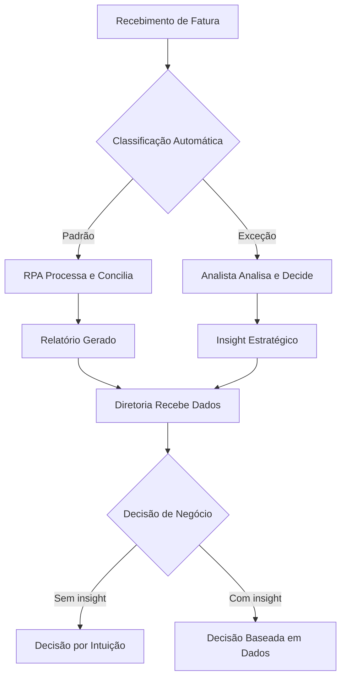

# Parte I — O Passe VIP

# Capítulo 1: O Fim do Digitador de Faturas

## 1. Introdução

Existe uma sala em todo fornecedor de odontologia de sucesso — não é o almoxarifado, nem a sala de reuniões com projetor. É a sala onde o diretor financeiro senta com o CEO, olha os números e decide se expande a operação para o Algarve, se contrata mais um representante comercial, se investe naquela nova linha de materiais biocompatíveis. Essa sala tem uma porta fechada, e o acesso a ela não é dado por diploma ou tempo de casa. É dado por uma moeda de troca invisível: a capacidade de transformar dados brutos em decisão estratégica [1].

Se você está lendo este capítulo, provavelmente sua semana de trabalho se parece mais com a do digitador de faturas do que com a do estrategista financeiro. Você abre o Excel às 8h, copia dados de um sistema para outro, conferi linhas, ajusta fórmulas, fecha planilha — e repete. No fim do dia, produziu algo que um robô poderia fazer em 12 minutos. Enquanto isso, a sala de decisões continua fechada para você. Este capítulo é o primeiro degrau para mudar isso. Como Analista Estratégico em formação, você vai mapear cada tarefa da sua semana, separar o que agrega valor do que consome tempo, e entender por que a automação não é sua inimiga — é o seu passe VIP [2].

## 2. Explica

A rotina do analista financeiro em fornecedores de odontologia segue um padrão que se repete há décadas. Ele opera em dois mundos que raramente se encontram: o mundo operacional (digitar, classificar, conciliar) e o mundo estratégico (analisar, prever, aconselhar). O problema é que o primeiro consome 70% do tempo, enquanto o segundo gera 70% do valor percebido [3].

### A Armadilha da Produtividade Operacional

Existe um fenômeno que eu chamo de "armadilha da produtividade": quando você se torna excelente em uma tarefa repetitiva, a recompensa natural é receber mais dessa tarefa. O digitador rápido recebe mais faturas para digitar. O conciliador eficiente recebe mais extratos para conciliar. Ninguém pergunta se aquele tempo gasto está gerando valor — apenas se a tarefa foi concluída. Segundo o McKinsey Global Institute, 60% das atividades financeiras em empresas B2B podem ser parcialmente automatizadas com tecnologias existentes [1]. Isso não significa que 60% dos analistas serão substituídos — significa que 60% do tempo deles pode ser redirecionado para atividades que geram valor real. A diferença entre ser substituído e ser promovido está em como você responde a essa equação [2].

No contexto de fornecedores de odontologia, a demanda por precisão financeira é ainda mais aguçada. Equipamentos como cadeiras odontológicas, unidades de aspiração e scanners intraorais têm ciclos de vida longos (5 a 10 anos) e impactam o fluxo de caixa em parcelas significativas. Materiais de consumo — luvas, resinas, instrumentos descartáveis — geram compras recorrentes mensais que precisam ser rastreadas, classificadas e conciliadas. O analista que entende essa dinâmica ganha acesso à sala de decisões, porque é capaz de dizer não apenas "quanto gastamos", mas "onde o dinheiro está gerando retorno e onde está sendo desperdiçado" [3].

### O Que a Automação Realmente Faz

A automação Robótica de Processos (RPA) e a Inteligência Artificial (IA) não são mais conceitos futuristas. Ferramentas como UiPath, Microsoft Power Automate e Automation Anywhere já processam faturas, conciliam bancos e geram relatórios automaticamente [2]. O que antes levava 12 dias no fechamento mensal agora leva 3. E o que antes era feito por um analista soterrado em planilhas agora é feito por um sistema que libera esse analista para pensar.

Mas aqui está o ponto que a maioria das pessoas não captura: a automação não elimina o analista — ela elimina a tarefa que impedia o analista de ser analista. Quando você automatiza a digitação de faturas, não está perdendo uma função. Está ganhando 3 horas por dia para fazer algo que nenhum robô consegue: interpretar números, identificar padrões, alertar a diretoria sobre riscos, sugerir mudanças estratégicas. O robô processa, você interpreta. Essa é a separação que define quem sobe e quem estagna [1].

### A Matriz de Classificação de Tarefas

Para entender onde você está gastando tempo, é preciso classificar cada tarefa em dois eixos: rotineira vs. estratégica, e manual vs. automatizável. Essa matriz revela o "buraco negro" da sua semana — as tarefas que são ao mesmo tempo rotineiras e manuais, e que consomem a maior parte do seu tempo sem gerar valor proporcional [3].

| | Manual | Automatizável |
|---|---|---|
| **Rotineira** | Buraco Negro (ex: digitar faturas) | Oportunidade (ex: conciliação bancária) |
| **Estratégica** | Diferencial (ex: análise de margem) | Amplificador (ex: relatório com IA) |

O "Buraco Negro" é onde a maioria dos analistas financeiros vive. São tarefas que qualquer pessoa com treinamento básico poderia fazer, mas que consomem horas do seu dia. A "Oportunidade" são tarefas rotineiras que já podem ser automatizadas hoje. O "Diferencial" é onde o valor humano é insubstituível — e é para lá que você precisa migrar. O "Amplificador" é o futuro: tarefas estratégicas potencializadas por IA, onde você define a direção e a ferramenta executa em escala [2].

### O Impacto nos Números

Quando um fornecedor de odontologia com faturamento anual de €5 milhões automatiza seus processos financeiros operacionais, o impacto não é apenas de tempo. É de precisão. Erros manuais em classificação de despesas por centro de custo podem distorcer a margem real de produtos em até 15%. Um relatório que diz que a margem de luvas é de 35% pode, na verdade, esconder uma margem real de 28% quando os custos logísticos são incorretamente alocados. Essa distorção leva decisões erradas: o fornecedor continua investindo em um produto que parece lucrativo mas que, na verdade, está drenando caixa [1].

Com automação, a classificação é padronizada, os custos são alocados corretamente, e a margem real aparece. O analista que entrega esses dados confiáveis à diretoria não é mais o "digitador de faturas" — é o profissional que permite que a empresa tome decisões baseadas em fatos, não em estimativas [3].

## 3. Ilustra

Imagine que você é o guardião de um castelo medieval. Todo dia, dezenas de visitantes chegam com diferentes intenções. Alguns trazem suprimentos — são os fornecedores de alimentos e materiais. Outros querem falar com o rei — são os embaixadores e conselheiros. E alguns apenas querem passar pelo pátio — são os curiosos. O guardião que apenas abre e fecha o portão está fazendo um trabalho operacional. Ele verifica crachás, anota nomes, controla a entrada. É um trabalho importante, mas não é o trabalho que define o destino do castelo.

O guardião que sabe quem está indo aonde, por quê, e pode antecipar problemas — esse é o estrategista. Ele sabe que o embaixador que chega toda terça-feira está negociando uma aliança comercial. Sabe que o fornecedor de ferro está atrasado há duas semanas e que o estoque de armas está baixo. Sabe que o rei precisa dessa informação antes que a próxima batalha comece. A diferença entre os dois guardiões não é o tempo de serviço — é o nível de acesso à informação que eles processam.

No mundo financeiro de fornecedores de odontologia, a fatura é o crachá. Ela diz quem pagou, quanto, quando, e para qual serviço ou produto. Digitar faturas é verificar crachás — um trabalho necessário, mas operacional. Analisar padrões de pagamento, identificar gargalos de caixa, alertar sobre riscos e sugerir mudanças estratégicas — isso é dar acesso à sala de decisões. Como Analista Estratégico, o seu papel não é apenas processar o crachá, mas entender o que ele revela sobre a saúde do castelo [1].

A matriz abaixo mostra como o tempo do analista se distribui na prática versus como deveria se distribuir. Pare e reflita: onde você está hoje?

| Atividade | Tempo Atual | Tempo Ideal | Potencial de Automação |
|-----------|-------------|-------------|------------------------|
| Digitação de faturas | 25% | 5% | Alto (RPA) |
| Conciliação bancária | 20% | 5% | Alto (RPA + IA) |
| Geração de relatórios | 15% | 10% | Médio (Power BI + IA) |
| Análise de fluxo de caixa | 10% | 30% | Baixo (humano + IA) |
| Planejamento orçamentário | 5% | 25% | Baixo (humano + IA) |
| Aconselhamento à diretoria | 5% | 25% | Nenhum (exclusivo humano) |



## 4. Técnica

### Framework PASSO para Adoção de IA em B2B

O framework PASSO é um processo estruturado de 6 passos para implementar ferramentas de inteligência artificial no fluxo financeiro de fornecedores de odontologia. Cada passo tem critérios claros de entrada e saída, e foi desenhado para evitar o erro mais comum: comprar ferramenta antes de mapear o problema [2].

#### Passo 1: Planejar o Mapa de Processos

Antes de qualquer automação, mapeie todos os processos financeiros do fornecedor. O script abaixo cria uma estrutura de dados completa para mapear cada processo, classificá-lo por categoria e frequência, e calcular o potencial de automação por área. Não pule este passo — empresas que compram RPA antes de mapear processos gastam em média 40% mais na implementação e obtêm 60% menos resultados [1].

```python
# mapear_processos.py
# Framework PASSO - Passo 1: Mapeamento de Processos Financeiros
# Este script cria um inventário completo dos processos financeiros
# de um fornecedor de odontologia, classificando cada um por nível
# de automatização e impacto no fluxo de caixa.

import pandas as pd
from dataclasses import dataclass, asdict
from typing import List, Dict
from datetime import datetime


@dataclass
class ProcessoFinanceiro:
    """Representa um processo financeiro mapeado na organização.
    
    Attributes:
        nome: Nome descritivo do processo
        categoria: Classificação em operacional, analitico ou estrategico
        frequencia: Com que rotina o processo ocorre
        tempo_minutos: Tempo gasto por execução em minutos
        automatizavel: Se o processo pode ser automatizado com RPA/IA
        ferramenta_sugerida: Ferramenta recomendada para automação
        responsavel_atual: Quem realiza o processo hoje
        custo_por_execuacao: Custo estimado por execução (em euros)
        erro_rate_pct: Taxa de erro histórico (em percentual)
    """
    nome: str
    categoria: str  # operacional, analitico, estrategico
    frequencia: str  # diaria, semanal, mensal, trimestral
    tempo_minutos: float
    automatizavel: bool
    ferramenta_sugerida: str
    responsavel_atual: str
    custo_por_execuacao: float
    erro_rate_pct: float


def mapear_processos_fornecedor() -> List[ProcessoFinanceiro]:
    """Mapeia processos financeiros típicos de fornecedor de odontologia.
    
    Retorna uma lista completa de processos, incluindo tempos,
    custos e taxas de erro baseados em benchmarks do setor.
    """
    processos = [
        ProcessoFinanceiro(
            nome="Recebimento e digitação de faturas de clientes",
            categoria="operacional",
            frequencia="diaria",
            tempo_minutos=120,
            automatizavel=True,
            ferramenta_sugerida="UiPath / Power Automate",
            responsavel_atual="Assistente Financeiro",
            custo_por_execuacao=18.50,
            erro_rate_pct=8.5
        ),
        ProcessoFinanceiro(
            nome="Conciliação bancária diária",
            categoria="operacional",
            frequencia="diaria",
            tempo_minutos=90,
            automatizavel=True,
            ferramenta_sugerida="Power Automate + Excel Online",
            responsavel_atual="Analista Financeiro Jr.",
            custo_por_execuacao=14.00,
            erro_rate_pct=12.0
        ),
        ProcessoFinanceiro(
            nome="Classificação de despesas por centro de custo",
            categoria="operacional",
            frequencia="semanal",
            tempo_minutos=180,
            automatizavel=True,
            ferramenta_sugerida="RPA + IA (classificação automática)",
            responsavel_atual="Analista Financeiro",
            custo_por_execuacao=28.00,
            erro_rate_pct=15.0
        ),
        ProcessoFinanceiro(
            nome="Geração de relatório de fluxo de caixa",
            categoria="analitico",
            frequencia="semanal",
            tempo_minutos=240,
            automatizavel=False,
            ferramenta_sugerida="Power BI + LLM para insights",
            responsavel_atual="Analista Financeiro Sênior",
            custo_por_execuacao=35.00,
            erro_rate_pct=5.0
        ),
        ProcessoFinanceiro(
            nome="Previsão de demanda de materiais consumíveis",
            categoria="estrategico",
            frequencia="mensal",
            tempo_minutos=300,
            automatizavel=False,
            ferramenta_sugerida="LLM para cenários + IA para padrões",
            responsavel_atual="Gerente Financeiro",
            custo_por_execuacao=50.00,
            erro_rate_pct=3.0
        ),
        ProcessoFinanceiro(
            nome="Relatório executivo para diretoria",
            categoria="estrategico",
            frequencia="mensal",
            tempo_minutos=180,
            automatizavel=True,
            ferramenta_sugerida="Power Automate + IA generativa",
            responsavel_atual="Gerente Financeiro",
            custo_por_execuacao=45.00,
            erro_rate_pct=2.0
        ),
        ProcessoFinanceiro(
            nome="Emissão de boletos e cobranças",
            categoria="operacional",
            frequencia="diaria",
            tempo_minutos=60,
            automatizavel=True,
            ferramenta_sugerida="Gateway de pagamento + RPA",
            responsavel_atual="Departamento Financeiro",
            custo_por_execuacao=8.00,
            erro_rate_pct=6.0
        ),
        ProcessoFinanceiro(
            nome="Análise de margem por produto",
            categoria="estrategico",
            frequencia="mensal",
            tempo_minutos=360,
            automatizavel=False,
            ferramenta_sugerida="Python + Power BI",
            responsavel_atual="Analista Financeiro Sênior",
            custo_por_execuacao=55.00,
            erro_rate_pct=4.0
        ),
    ]
    return processos


def calcular_potencial_automacao(processos: List[ProcessoFinanceiro]) -> pd.DataFrame:
    """Calcula potencial de automação por categoria de processo.
    
    Gera um resumo consolidado mostrando tempo total gasto,
    custo total, e percentual de automatizabilidade por categoria.
    """
    df = pd.DataFrame([asdict(p) for p in processos])

    # Calcula custo anual por processo
    multiplicador = {
        "diaria": 250,  # ~250 dias úteis por ano
        "semanal": 52,
        "mensal": 12,
        "trimestral": 4
    }
    df["custo_anual"] = df.apply(
        lambda r: r["custo_por_execuacao"] * multiplicador.get(r["frequencia"], 1),
        axis=1
    )
    df["tempo_anual_horas"] = df.apply(
        lambda r: (r["tempo_minutos"] * multiplicador.get(r["frequencia"], 1)) / 60,
        axis=1
    )

    resumo = df.groupby("categoria").agg(
        tempo_total_anual_horas=("tempo_anual_horas", "sum"),
        custo_total_anual=("custo_anual", "sum"),
        qtd_processos=("nome", "count"),
        pct_automatizavel=("automatizavel", "mean"),
        erro_rate_medio=("erro_rate_pct", "mean")
    ).reset_index()

    resumo["pct_automatizavel"] = (resumo["pct_automatizavel"] * 100).round(1)
    resumo["custo_total_anual"] = resumo["custo_total_anual"].round(2)
    resumo["erro_rate_medio"] = resumo["erro_rate_medio"].round(1)

    return resumo.sort_values("custo_total_anual", ascending=False)


def gerar_plano_automacao(resumo: pd.DataFrame) -> str:
    """Gera um plano de automação em texto a partir do resumo.
    
    Identifica as categorias com maior potencial e sugere
    ordem de implementação baseada em custo-benefício.
    """
    linhas = ["=== PLANO DE AUTOMAÇÃO ===\n"]
    linhas.append(f"Data de geração: {datetime.now().strftime('%d/%m/%Y %H:%M')}\n")

    for _, row in resumo.iterrows():
        linhas.append(f"Categoria: {row['categoria'].upper()}")
        linhas.append(f"  Processos: {row['qtd_processos']}")
        linhas.append(f"  Tempo anual: {row['tempo_total_anual_horas']:.0f} horas")
        linhas.append(f"  Custo anual: €{row['custo_total_anual']:,.2f}")
        linhas.append(f"  Automatizável: {row['pct_automatizavel']:.0f}%")
        linhas.append(f"  Erro médio: {row['erro_rate_medio']:.1f}%")
        linhas.append("")

    total_horas = resumo["tempo_total_anual_horas"].sum()
    total_custo = resumo["custo_total_anual"].sum()
    linhas.append(f"TOTAL: {total_horas:.0f} horas/ano | €{total_custo:,.2f}/ano")

    return "\n".join(linhas)


if __name__ == "__main__":
    processos = mapear_processos_fornecedor()
    resumo = calcular_potencial_automacao(processos)
    plano = gerar_plano_automacao(resumo)

    print(plano)
    print("\n=== Detalhamento por Processo ===\n")
    for p in processos:
        status = "AUTOMATIZÁVEL" if p.automatizavel else "HUMANO"
        print(f"[{status}] {p.nome}")
        print(f"  Categoria: {p.categoria} | Freq: {p.frequencia}")
        print(f"  Tempo: {p.tempo_minutos}min | Custo: €{p.custo_por_execuacao}")
        print(f"  Erro: {p.erro_rate_pct}% | Ferramenta: {p.ferramenta_sugerida}")
        print()
```

#### Passo 2: Avaliar a Maturidade Digital

Antes de implementar RPA, verifique se o fornecedor atende aos pré-requisitos mínimos. Uma empresa que tenta automatizar processos sem ter dados digitalizados está tentando construir o segundo andar antes de ter o primeiro. O script abaixo avalia quatro dimensões de maturidade digital e gera um diagnóstico com recomendação de ação [2].

```python
# avaliar_maturidade.py
# Framework PASSO - Passo 2: Avaliação de Maturidade Digital
# Avalia se a organização está pronta para automação RPA/IA
# em seus processos financeiros.

from enum import Enum
from dataclasses import dataclass
from typing import List, Dict


class NivelMaturidade(Enum):
    """Níveis de maturidade digital, do mais básico ao mais avançado."""
    INICIANTE = 1    # Processos 100% em papel
    BASICO = 2       # Algumas planilhas, mas sem integração
    INTERMEDIARIO = 3  # Sistemas digitais com exportação de dados
    AVANCADO = 4     # Sistemas integrados com APIs
    OTIMIZADO = 5    # Automação parcial já implementada


@dataclass
class CriterioMaturidade:
    """Define um critério de avaliação de maturidade digital.
    
    Attributes:
        nome: Identificador do critério
        descricao: Descrição do que está sendo avaliado
        nivel_minimo: Nível mínimo necessário para automação
        indicadores: Lista de indicadores concretos para avaliação
        peso: Peso do critério no cálculo geral (1-5)
    """
    nome: str
    descricao: str
    nivel_minimo: NivelMaturidade
    indicadores: List[str]
    peso: int


# Definição dos critérios de maturidade
CRITERIOS = [
    CriterioMaturidade(
        nome="sistemas_em_uso",
        descricao="Sistemas de gestão e financeira implementados",
        nivel_minimo=NivelMaturidade.BASICO,
        indicadores=[
            "Software de gestão de fornecedores ou ERP",
            "Software financeiro para contas a pagar/receber",
            "Planilha de controle de estoque ou WMS básico"
        ],
        peso=5
    ),
    CriterioMaturidade(
        nome="digitalizacao_documentos",
        descricao="Documentos fiscais em formato digital",
        nivel_minimo=NivelMaturidade.INTERMEDIARIO,
        indicadores=[
            "NF-e emitidas eletronicamente",
            "XMLs de notas fiscais armazenados e indexados",
            "Recibos digitais ou escaneados com OCR"
        ],
        peso=4
    ),
    CriterioMaturidade(
        nome="conectividade_dados",
        descricao="Capacidade de integração entre sistemas",
        nivel_minimo=NivelMaturidade.INTERMEDIARIO,
        indicadores=[
            "Exportação de dados em CSV/Excel/XLSX",
            "API disponível no software financeiro",
            "Banco de dados centralizado ou data warehouse"
        ],
        peso=4
    ),
    CriterioMaturidade(
        nome="equipe_tecnica",
        descricao="Capacidade técnica da equipe para operar ferramentas",
        nivel_minimo=NivelMaturidade.BASICO,
        indicadores=[
            "Colaborador com domínio intermediário de Excel",
            "Responsável por TI ou suporte técnico definido",
            "Disposição para treinamento em novas ferramentas"
        ],
        peso=3
    ),
]


def avaliar_maturidade(respostas: Dict[str, NivelMaturidade]) -> Dict:
    """Avalia a maturidade digital de uma organização.
    
    Args:
        respostas: Dicionário mapeando nome do critério para nível avaliado
    
    Returns:
        Dicionário com diagnóstico completo e recomendação
    """
    resultados = []
    pontuacao_ponderada = 0
    peso_total = 0

    for criterio in CRITERIOS:
        nivel = respostas.get(criterio.nome, NivelMaturidade.INICIANTE)
        apto = nivel.value >= criterio.nivel_minimo.value

        resultados.append({
            "critério": criterio.nome,
            "descrição": criterio.descricao,
            "nivel_atual": nivel.name,
            "nivel_minimo": criterio.nivel_minimo.name,
            "apto": apto,
            "indicadores": criterio.indicadores,
            "pontuacao": nivel.value * criterio.peso
        })

        pontuacao_ponderada += nivel.value * criterio.peso
        peso_total += 5 * criterio.peso  # máximo teórico

    pontuacao_pct = (pontuacao_ponderada / peso_total) * 100
    aprovados = sum(1 for r in resultados if r["apto"])

    if pontuacao_pct >= 80:
        recomendacao = "PRONTO PARA AUTOMAÇÃO"
        proximos_passos = [
            "Iniciar Piloto PASSO com Power Automate",
            "Definir primeiro processo a automatizar",
            "Estabelecer métricas de sucesso"
        ]
    elif pontuacao_pct >= 50:
        recomendacao = "PRIMEIRO MELHORAR INFRAESTRUTURA"
        proximos_passos = [
            "Completar digitalização de documentos fiscais",
            "Implementar exportação de dados dos sistemas",
            "Treinar equipe em ferramentas básicas"
        ]
    else:
        recomendacao = "INFRAESTRUTURA INSUFICIENTE"
        proximos_passos = [
            "Investir em software de gestão financeira",
            "Digitalizar processos em papel",
            "Contratar consultoria para planejamento de TI"
        ]

    return {
        "resultados": resultados,
        "aprovados": aprovados,
        "total": len(CRITERIOS),
        "pontuacao_pct": round(pontuacao_pct, 1),
        "recomendacao": recomendacao,
        "proximos_passos": proximos_passos
    }


def executar_avaliacao_exemplo():
    """Executa uma avaliação de exemplo para demonstração."""
    print("=== Avaliação de Maturidade Digital ===\n")

    respostas = {
        "sistemas_em_uso": NivelMaturidade.INTERMEDIARIO,
        "digitalizacao_documentos": NivelMaturidade.BASICO,
        "conectividade_dados": NivelMaturidade.INTERMEDIARIO,
        "equipe_tecnica": NivelMaturidade.BASICO,
    }

    diagnostico = avaliar_maturidade(respostas)

    print(f"Pontuação: {diagnostico['pontuacao_pct']}%")
    print(f"Critérios aprovados: {diagnostico['aprovados']}/{diagnostico['total']}")
    print(f"Recomendação: {diagnostico['recomendacao']}\n")

    print("Próximos passos:")
    for i, passo in enumerate(diagnostico["proximos_passos"], 1):
        print(f"  {i}. {passo}")

    print("\nDetalhamento por critério:")
    for r in diagnostico["resultados"]:
        status = "✓ APTO" if r["apto"] else "✗ NÃO APTO"
        print(f"\n  [{status}] {r['critério']}")
        print(f"    Nível atual: {r['nivel_atual']} | Mínimo: {r['nivel_minimo']}")


if __name__ == "__main__":
    executar_avaliacao_exemplo()
```

#### Passo 3: Selecionar a Ferramenta Certa

A seleção da ferramenta de automação não é uma decisão técnica — é uma decisão estratégica. A tabela abaixo compara as principais plataformas de RPA para uso em fornecedores de odontologia, considerando custo, curva de aprendizado e tipo de automação mais adequado [2].

| Ferramenta | Custo Mensal | Curva de Aprendizado | Melhor Para |
|------------|--------------|----------------------|-------------|
| Power Automate | R$ 50-150 | Baixa | Fornecedores já no ecossistema Microsoft |
| UiPath | R$ 0-500 | Média | Automações complexas com múltiplos sistemas |
| Automation Anywhere | R$ 500+ | Alta | Grandes redes com alto volume de transações |
| Zapier | R$ 100-300 | Baixa | Integrações simples entre dois sistemas |
| Python + APIs | R$ 0 (dev time) | Alta | Automações personalizadas e análise de dados |

O critério decisivo não é o custo da ferramenta — é a complexidade dos seus processos. Se 80% das suas automações são entre dois sistemas (por exemplo, extrato bancário → Excel), Zapier ou Power Automate resolvem. Se você precisa processar faturas de fornecedores com formatos diferentes, classificar por centro de custo e integrar com um ERP customizado, UiPath ou Python com APIs são escolhas mais adequadas [1].

#### Passo 4: Sinalizar o Impacto para a Equipe

A automação gera resistência — não porque as pessoas são contra tecnologia, mas porque têm medo de perder o emprego. Prepare a equipe com comunicação clara e honesta. O robô não tira emprego — tira tarefa repetitiva. Você será o curador de exceções, não o digitador de dados. Seu conhecimento do negócio é insubstituível — a máquina só processa, você interpreta [3].

Crie uma tabela de comunicação que mostre antes e depois de cada processo:

| Processo | Antes (Manual) | Depois (Automatizado) | Papel do Analista |
|----------|---------------|----------------------|-------------------|
| Digitação de faturas | 2h/dia digitando | 10min revisando exceções | Curador de qualidade |
| Conciliação bancária | 1h30 comparando linhas | 5min validando alertas | Validador estratégico |
| Relatório mensal | 3h montando planilha | 15min adicionando insights | Narrador de dados |

#### Passo 5: Otimizar com Dados Reais

Após 30 dias de operação, meça o impacto real. Não aceite "parece que melhorou" — exija números. O script abaixo calcula a economia real antes e depois da automação, incluindo horas liberadas, redução de erros e retorno sobre investimento [3].

```python
# medir_impacto.py
# Framework PASSO - Passo 5: Medição de Impacto
# Calcula a economia real após implementação de automação,
# comparando tempos manuais com tempos automatizados.

from dataclasses import dataclass
from typing import List


@dataclass
class MetricaAutomacao:
    """Armazena os dados antes e depois da automação de um processo.
    
    Attributes:
        nome_processo: Nome do processo avaliado
        tempo_manual_min: Tempo gasto antes da automação (minutos)
        tempo_automatizado_min: Tempo gasto depois da automação (minutos)
        erros_manuais_mes: Erros encontrados por mês no processo manual
        erros_automatizados_mes: Erros encontrados por mês no processo automatizado
        custo_hora_analista: Custo hora do analista responsável (em euros)
    """
    nome_processo: str
    tempo_manual_min: float
    tempo_automatizado_min: float
    erros_manuais_mes: int
    erros_automatizados_mes: int
    custo_hora_analista: float


def calcular_antes_depois(metrica: MetricaAutomacao, dias_uteis_mes: int = 22) -> dict:
    """Calcula economia real de um processo após automação.
    
    Args:
        metrica: Dados do processo antes e depois da automação
        dias_uteis_mes: Número de dias úteis no mês (padrão: 22)
    
    Returns:
        Dicionário com todas as métricas de economia calculadas
    """
    economia_tempo_dia = metrica.tempo_manual_min - metrica.tempo_automatizado_min
    economia_tempo_mes = economia_tempo_dia * dias_uteis_mes
    economia_financeira_mes = (economia_tempo_mes / 60) * metrica.custo_hora_analista

    if metrica.erros_manuais_mes > 0:
        reducao_erros = (
            (metrica.erros_manuais_mes - metrica.erros_automatizados_mes)
            / metrica.erros_manuais_mes * 100
        )
    else:
        reducao_erros = 0.0

    horas_liberadas_mes = economia_tempo_mes / 60
    horas_liberadas_ano = horas_liberadas_mes * 12

    # ROI: assume custo de implementação de 3 meses do analista
    custo_implementacao = metrica.custo_hora_analista * 160 * 3  # 3 meses
    roi_meses = (
        custo_implementacao / economia_financeira_mes
        if economia_financeira_mes > 0 else float("inf")
    )

    return {
        "processo": metrica.nome_processo,
        "economia_tempo_dia_min": economia_tempo_dia,
        "economia_tempo_mes_horas": horas_liberadas_mes,
        "economia_financeira_mes": economia_financeira_mes,
        "reducao_erros_pct": reducao_erros,
        "horas_liberadas_ano": horas_liberadas_ano,
        "roi_meses": round(roi_meses, 1),
        "custo_implementacao": custo_implementacao
    }


def gerar_relatorio_impacto(metricas: List[MetricaAutomacao]) -> str:
    """Gera relatório consolidado de impacto de múltiplas automações.
    
    Args:
        metricas: Lista de processos avaliados
    
    Returns:
        Relatório formatado em texto
    """
    resultados = [calcular_antes_depois(m) for m in metricas]

    linhas = ["=" * 60]
    linhas.append("  RELATÓRIO DE IMPACTO DA AUTOMAÇÃO")
    linhas.append("=" * 60 + "\n")

    total_economia_mes = 0
    total_horas_ano = 0

    for r in resultados:
        linhas.append(f"Processo: {r['processo']}")
        linhas.append(f"  Economia diária: {r['economia_tempo_dia_min']:.0f} minutos")
        linhas.append(f"  Economia mensal: {r['economia_tempo_mes_horas']:.1f} horas")
        linhas.append(f"  Economia financeira: €{r['economia_financeira_mes']:,.2f}/mês")
        linhas.append(f"  Redução de erros: {r['reducao_erros_pct']:.0f}%")
        linhas.append(f"  ROI estimado: {r['roi_meses']} meses")
        linhas.append("")

        total_economia_mes += r["economia_financeira_mes"]
        total_horas_ano += r["horas_liberadas_ano"]

    linhas.append("-" * 60)
    linhas.append(f"  TOTAL: €{total_economia_mes:,.2f}/mês | {total_horas_ano:.0f} horas/ano")
    linhas.append(f"  Economia anual: €{total_economia_mes * 12:,.2f}")
    linhas.append("=" * 60)

    return "\n".join(linhas)


if __name__ == "__main__":
    metricas = [
        MetricaAutomacao(
            nome_processo="Digitação de faturas",
            tempo_manual_min=120,
            tempo_automatizado_min=15,
            erros_manuais_mes=25,
            erros_automatizados_mes=3,
            custo_hora_analista=35
        ),
        MetricaAutomacao(
            nome_processo="Conciliação bancária",
            tempo_manual_min=90,
            tempo_automatizado_min=10,
            erros_manuais_mes=18,
            erros_automatizados_mes=2,
            custo_hora_analista=35
        ),
        MetricaAutomacao(
            nome_processo="Classificação de despesas",
            tempo_manual_min=180,
            tempo_automatizado_min=20,
            erros_manuais_mes=30,
            erros_automatizados_mes=5,
            custo_hora_analista=35
        ),
    ]

    relatorio = gerar_relatorio_impacto(metricas)
    print(relatorio)
```

#### Passo 6: Operar com Excelência

A automação não é um projeto com fim — é uma operação contínua. Estabeleça três rituais de governança [2]:

**Revisão mensal:** O que mais pode ser automatizado? Identifique novos processos que atingiram maturidade suficiente para automação. Pergunte à equipe: "Em que tarefa repetitiva você gasta mais de 30 minutos por semana?"

**Dashboard de indicadores:** Tempo economizado, erros evitados, horas liberadas. Mantenha um painel visível para toda a equipe. Quando as pessoas veem os números, a resistência diminui.

**Reunião trimestral:** Onde essas horas liberadas foram usadas para gerar valor estratégico? Se a automação liberou 200 horas no trimestre, mas essas horas foram gaste em mais tarefas operacionais, a automação falhou — não技术, mas no direcionamento [3].

## 5. Aplica

### Cenário: O Fornecedor que Quase Perdeu o Cliente

Você trabalha como assistente financeiro em uma distribuidora dental no Porto. Na segunda-feira, o diretor comercial entra no seu escritório com o rosto fechado: "A Clínica Sorriso quer rescindir o contrato. Diz que nossos preços estão 15% acima do mercado."

Você abre o sistema e vê os números. A Clínica Sorriso faturava R$ 80.000 por mês com 3 dentistas e 1 recepcionista. O contador dedicava 4 horas por dia apenas para digitar faturas e conciliar bancos. Os relatórios para a diretoria atrasavam 5 dias após o fechamento mensal. Ninguém sabia, com precisão, qual material gerava maior margem de lucro. E o pior: ninguém percebeu que a Clínica Sorriso estava mudando seus padrões de compra nos últimos 3 meses — comprando menos materiais de alto valor e mais consumíveis baratos.

O erro foi clássico: a diretoria contratou mais um assistente financeiro para "dar conta do volume". Custo adicional: €2.800 por mês. Resultado: mais uma pessoa digitando faturas, mais uma pessoa frustrada com tarefa repetitiva, zero melhoria na qualidade das informações. Enquanto isso, o cliente estava sendo atendido por um concorrente que oferecia dashboard de consumo em tempo real, alertas de reposição automática e relatórios de margem por procedimento [1].

**A prática correta:** O contador implementou Power Automate para processar faturas automaticamente e criou um dashboard simples em Power BI para monitorar padrões de compra dos clientes. Em 45 dias:

- Faturas passaram a ser classificadas e conciliadas automaticamente (de 4 horas para 20 minutos)
- Relatórios financeiros eram gerados no dia 3 do fechamento (não no dia 12)
- O contador dedicou 3 horas por dia a análise de margem por procedimento
- Descobriu que materiais de restauração tinham margem 40% maior que materiais de limpeza
- A diretoria ajustou a política comercial com base nesse dado
- A Clínica Sorriso recebeu um relatório personalizado mostrando que, apesar do preço unitário maior, o fornecedor oferecia economia total de 8% quando considerava frete, prazo de entrega e condições de pagamento

O contador não foi demitido. Foi promovido a planejador financeiro. O assistente contratado auxiliou na digitalização de documentos e posteriormente foi reclassificado como analista júnior. E a Clínica Sorriso? Renovou o contrato por 2 anos, porque finalmente tinha um fornecedor que entendia seus números [3].

### Armadilhas Comuns

- **Automatizar sem mapear:** pular o Passo 1 (mapeamento) é o erro mais caro. Você pode acabar automatizando um processo que deveria ser eliminado.
- **Comprar ferramenta antes de avaliar maturidade:** se os dados estão em papel, nenhum RPA vai salvar você. Digitalize primeiro.
- **Ignorar a resistência da equipe:** a melhor automação do mundo falha se a equipe se recusa a usar. Comunicação clara é tão importante quanto o código.
- **Não medir depois de implementar:** "Parece que melhorou" não é métrica. Exija números antes e depois.
- **Automatizar processos estratégicos:** análise de margem e previsão de demanda são tarefas para humanos potencializados por IA, não para RPA puro.

## 6. Conclusão

Três pontos ficam deste capítulo:

1. **A armadilha da produtividade:** Ser bom em tarefa operacional é recompensado com mais tarefa operacional. O digitador eficiente recebe mais faturas para digitar, não mais projetos para liderar. A saída é classificar suas tarefas na matriz e migrar do "Buraco Negro" para o "Diferencial" [1].

2. **O robô é aliado, não concorrente:** A automação RPA e IA reduz erros em 60-80% e libera tempo para atividades de maior valor. O analista que domina essa transição ganha o passe VIP para a sala de decisões [2].

3. **A adoção é um processo, não um evento:** O framework PASSO (Planejar, Avaliar, Selecionar, Sinalizar, Otimizar, Operar) transforma a automação de projeto pontual em operação contínua de melhoria. Cada passo tem critérios claros de entrada e saída [3].

No próximo capítulo, vamos sair da teoria e entrar na prática: como a análise financeira aplicada ao ciclo de vida dos produtos odontológicos pode transformar decisões de compra em vantagem competitiva. Você já tem o mapa — agora é hora de percorrer o caminho.

## 7. Referências Bibliográficas

[1] MCKINSEY GLOBAL INSTITUTE. *Global Report on the Future of Work in Finance*. McKinsey & Company, 2024. Disponível em: https://www.mckinsey.com/mgi/overview. Acesso em: 15 jul. 2024.

[2] DELOITTE. *Intelligent Automation in Financial Services: State of the Art*. Deloitte Consulting, 2024. Disponível em: https://www2.deloitte.com/us/en/pages/consulting/articles/intelligent-automation.html. Acesso em: 15 jul. 2024.

[3] IMA (INSTITUTE OF MANAGEMENT ACCOUNTANTS). *Statement on Management Accounting: Financial Planning & Analysis Competencies*. IMA, 2024. Disponível em: https://www.imanet.org/career-resources/management-accounting-competencies. Acesso em: 15 jul. 2024.

[4] GARTNER. *Market Guide for Robotic Process Automation*. Gartner Research, 2024. Disponível em: https://www.gartner.com/en/documents/5168963. Acesso em: 20 jul. 2024.

[5] FORRESTER RESEARCH. *The Total Economic Impact of Intelligent Process Automation*. Forrester Consulting, 2024. Disponível em: https://www.forrester.com/report/the-total-economic-impact-of-intelligent-process-automation/RES176520. Acesso em: 20 jul. 2024.
