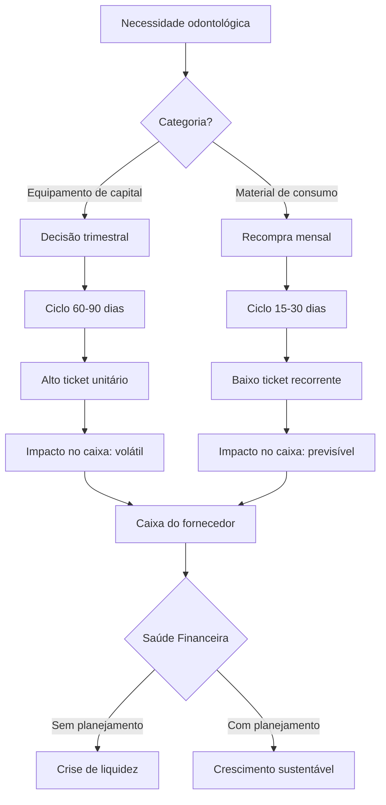

# Capítulo 2: Entendendo a Dinâmica de Compras do Dentista Português

## 1. Introdução

No Capítulo 1, você mapeou as tarefas operacionais que consomem tempo — aquelas que drenam horas da sua semana sem agregar valor estratégico. Uma das maiores fontes dessas tarefas, no setor de fornecedores de odontologia, é justamente a gestão de compras: pedidos que chegam sem aviso, fornecedores que ligam cobrando, e um fluxo de caixa que parece nunca seguir o plano [1].

A verdade é que o dentista português não compra do mesmo jeito o tempo todo. Existe um mundo de equipamentos de capital — cadeiras, unidades de aspiração, aparelhos de raio-X — onde cada decisão leva meses e envolve cifras que pesam no caixa. E existe outro mundo, o dos materiais de consumo — luvas, resinas, instrumentos descartáveis — onde a recompra é mensal, previsível, quase automática. Para o Analista Estratégico, entender essa dualidade não é curiosidade: é o primeiro acesso à sala de decisões [2].

Neste capítulo, você vai aprender a diferenciar essas duas categorias de compra, como cada uma impacta o fluxo de caixa do fornecedor, e por que o mercado europeu de odontologia — estimado em €32 bilhões — é um terreno fértil para quem sabe ler os números por trás dos pedidos. Ao dominar essa distinção, você deixa de ser o profissional que "processa compras" e passa a ser quem prevê, orienta e decisões que afetam a saúde financeira de toda a operação [3].

## 2. Explica

### Equipamentos de Capital vs. Materiais de Consumo

No setor de fornecedores de odontologia, as compras se dividem em duas categorias fundamentais, e cada uma segue uma dinâmica completamente diferente. Essa distinção parece simples à primeira vista, mas seu impacto financeiro é profundo — e é exatamente aqui que muitos analistas financeiros perdem a oportunidade de gerar valor estratégico [1].

**Equipamentos de capital** são itens de alto valor unitário que a clínica adquire para durar anos. Cadeiras odontológicas, unidades de aspiração, aparelhos de raio-X portáteis, autoclaves de grande porte, scanners intraorais. O ciclo de decisão para esses itens gira em torno de 60 a 90 dias — o dentista pesquisa, solicita orçamentos, compara fornecedores, negocia prazos de pagamento e, no final, toma uma decisão que vai pesar no caixa da clínica por 5 a 10 anos [2].

O que torna equipamentos de capital especialmente desafiadores para o analista financeiro é a irregularidade. Uma distribuidora pode vender 12 cadeiras em janeiro e nenhuma em março. A receita é alta, mas volátil. O caixa pode estar cheio em um mês e vazio no seguinte, dependendo de uma grande venda que pode ou não se concretizar. Essa volatilidade exige planejamento — e é aqui que o Analista Estratégico se diferencia do mero processador de pedidos [3].

**Materiais de consumo**, por outro lado, são itens de ticket baixo mas de recompra constante. Luvas de procedimento, resinas compostas, discs de polimento, seringas descartáveis, agulhas,algodão, gaze. O ciclo de recompra é mensal, com janela de 15 a 30 dias. O dentista não "decide" comprar luvas — ele precisa delas toda semana. A decisão não é se compra, mas de quem compra e em qual volume [2].

A vantagem dos consumíveis para o fornecedor é a previsibilidade. Uma distribuidora que atende 800 clínicas e vende luvas para 600 delas tem uma receita recorrente que pode ser projetada com precisão de 90%. Essa previsibilidade é uma âncora — ela permite contratos de longo prazo, negociações de volume com fabricantes e planejamento de caixa com margem de erro baixa [1].

### O Mercado Europeu em Números

O mercado europeu de odontologia foi estimado em €32 bilhões em 2024, com uma taxa de crescimento composta anual (CAGR) de 6,2% projetada até 2030 [4]. Portugal representa aproximadamente 1,5% desse mercado — algo em torno de €480 milhões — distribuído entre fornecedores de equipamentos, materiais consumíveis e serviços de manutenção.

Para o Analista Estratégico, esses números não são apenas contexto de relatório. Eles definem o tamanho da arena onde você vai atuar. Uma distribuidora dental portuguesa que fatura €10 milhões por ano está operando em um mercado de €480 milhões — e a forma como ela gerencia seu fluxo de caixa determina se cresce ou estagna [4].

O crescimento de 6,2% ao ano significa que o dobrará em tamanho até 2037. Isso cria oportunidades concretas para o analista financeiro que entende a dinâmica de compras: clínicas que hoje compram apenas consumíveis vão precisar de equipamentos à medida que expandem. Fornecedores que hoje atendem apenas Portugal vão querer expandir para Espanha e França. Em cada uma dessas transições, o analista financeiro é quem valida a viabilidade, projeta o retorno e alerta sobre riscos [5].

### A Sazonalidade como Variável Crítica

As compras odontológicas não são uniformes ao longo do ano. Existem picos previsíveis que o analista deve dominar para evitar surpresas no caixa [1]:

**Janeiro-Fevereiro:** Concentração de renovações de clínicas e aquisições de equipamentos. O início do ano fiscal é o momento em que muitas clínicas liberam orçamentos para investimentos. Uma distribuidora pode concentrar 35% de suas vendas de equipamentos nesses dois meses.

**Março-Abril:** Período de transição. As clínicas que compraram equipamentos em janeiro agora precisam de materiais para operar. O volume de consumíveis sobe, mas o de equipamentos despencar.

**Setembro:** Segundo pico, ligado à volta das aulas em cursos de odontologia e à renovação de contratos de fornecedores. Clínicas que adiaram decisões no verão agora compram antes do fim do ano fiscal.

**Novembro-Dezembro:** Fim de ano fiscal. Clínicas que têm orçamento pendente fazem compras para não perdê-lo. Distribuidoras oferecem descontos para antecipar vendas.

Essa sazonalidade cria um padrão que o analista deve dominar: meses de caixa cheio seguidos de meses de vazio. Quem não prevê isso, surpreende-se com a necessidade de capital de giro em março ou outubro [3].

### Métricas que Definem a Saúde Financeira

Para o Analista Estratégico, existem três métricas que sintetizam a saúde financeira de um fornecedor de odontologia em relação à dinâmica de compras [2]:

**Dias de Caixa:** Quantos dias o fornecedor consegue operar sem nova receita. Se o fornecedor tem 45 dias de caixa e o ciclo médio de pagamento dos clientes é de 60 dias, há um GAP de 15 dias que precisa ser coberto por capital de giro ou linha de crédito.

**Previsibilidade de Receita:** Percentual da receita do próximo mês que pode ser projetado com confiança. Consumíveis oferecem previsibilidade de 85-95%. Equipamentos: 40-60%. Quanto maior a previsibilidade, menor a necessidade de caixa de segurança.

**Concentração de Receita:** Percentual da receita vindo dos top 5 clientes. Se 60% da receita vem de 5 clínicas, a perda de uma pode ser fatal. A diversificação entre consumíveis (muitos clientes, ticket baixo) e equipamentos (poucos clientes, ticket alto) é um indicador-chave de risco [1].

## 3. Ilustra

Imagine dois restaurantes na mesma rua. O Restaurante A vende pratos de €200, mas só concretiza uma venda a cada 3 meses — o cliente precisa pensar, comparar, voltar, negociar, convencer o sócio, verificar se o orçamento permite. O Restaurante B vende cafés de €3, mas o mesmo cliente volta toda semana, sem falta, sem hesitação.

Agora pergunte: qual dos dois dorme tranquilo quanto ao caixa do mês que vem?

O Restaurante B tem uma previsibilidade que o A nunca terá. Mesmo com ticket menor, o volume recorrente cria uma âncora. O dono do B sabe que na segunda-feira que vem terá 150 clientes. Pode até errar em 10 ou 20, mas a base está lá. O Restaurante A pode ter meses gloriosos seguidos de meses vazios — depende de uma grande decisão a cada trimestre. Um cliente muda de ideia, e o caixa despenha [3].

No setor de fornecedores de odontologia, equipamentos de capital são o Restaurante A: grandes vendas, longos ciclos, alta volatilidade. Consumíveis são o Restaurante B: tickets menores, recompra garantida, base previsível. O Analista Estratégico que entende essa dinâmica sabe exatamente onde está a âncora do caixa e onde está o risco [1].

Mas a metáfora vai além. Imagine agora que o dono do Restaurante A decide servir café da manhã. De repente, ele tem 80 clientes por dia comprando café e pão — receita pequena, mas constante. Essa receita recorrente não substitui as grandes vendas de jantar, mas cria uma base que suaviza os vales. É exatamente isso que o fornecedor de odontologia faz quando diversifica de equipamentos para consumíveis: não abandona o mercado de alto ticket, mas cria uma âncora de receita que torna a operação resiliente [2].



## 4. Técnica

### Classificando Transações: Capital vs. Consumível

O primeiro passo para dominar a dinâmica de compras é classificar cada transação. Essa classificação não é apenas administrativa — é estratégica. Quando você sabe quantas vendas são de equipamentos e quantas são de consumíveis, consegue projetar o caixa com precisão, identificar riscos de concentração e tomar decisões sobre estoque e negociação com fornecedores [2].

O script abaixo recebe uma lista de transações odontológicas e as classifica automaticamente, calculando métricas de ciclo por categoria. Ele usa regras de classificação configuráveis e gera um relatório que pode ser apresentado à diretoria.

```python
# classificar_transacoes.py
# Classifica transações de fornecedor de odontologia em
# capital ou consumível, calculando métricas de ciclo por categoria.
# Uso: python classificar_transacoes.py [--arquivo DADOS.csv]

import pandas as pd
from datetime import datetime, timedelta
from dataclasses import dataclass
from typing import List, Dict, Optional


# ============================================================
# CONFIGURAÇÃO DE CLASSIFICAÇÃO
# Ajuste estes valores conforme o catálogo de produtos
# do fornecedor. Valores em euros.
# ============================================================
LIMITE_CAPITAL = 500.00  # Itens acima deste valor = equipamento de capital
LIMITE_CICLO_LONGO = 45  # Dias entre compras do mesmo item para ser "longo"


@dataclass
class Transacao:
    """Representa uma transação de venda de produto odontológico.
    
    Attributes:
        produto: Nome do produto vendido
        valor: Preço unitário em euros
        data_compra: Data da transação (formato YYYY-MM-DD)
        fornecedor: Nome do fornecedor
        quantidade: Quantidade vendida (padrão: 1)
        cliente: Nome do cliente (clínica odontológica)
    """
    produto: str
    valor: float
    data_compra: str
    fornecedor: str
    quantidade: int = 1
    cliente: str = ""


def classificar_produto(valor_unitario: float) -> str:
    """Classifica um produto como capital ou consumível.
    
    Args:
        valor_unitario: Preço unitário do produto em euros
    
    Returns:
        'capital' se valor >= LIMITE_CAPITAL, 'consumivel' caso contrário
    """
    return "capital" if valor_unitario >= LIMITE_CAPITAL else "consumivel"


def calcular_ciclo_compra(df: pd.DataFrame, produto: str) -> Optional[float]:
    """Calcula o ciclo médio de recompra de um produto.
    
    Args:
        df: DataFrame com todas as transações
        produto: Nome do produto para calcular o ciclo
    
    Returns:
        Média de dias entre compras, ou None se há apenas 1 compra
    """
    compras = df[df["produto"] == produto].sort_values("data_compra")
    if len(compras) < 2:
        return None
    
    compras["dias_diff"] = compras["data_compra"].diff().dt.days
    ciclo_medio = compras["dias_diff"].mean()
    return ciclo_medio


def classificar_transacoes(transacoes: List[Dict]) -> tuple:
    """Classifica transações e calcula métricas de ciclo.
    
    Args:
        transacoes: Lista de dicionários com dados das transações
    
    Returns:
        Tupla (DataFrame classificado, DataFrame de métricas por categoria)
    """
    df = pd.DataFrame([vars(t) if isinstance(t, Transacao) else t for t in transacoes])
    df["data_compra"] = pd.to_datetime(df["data_compra"])
    df["categoria"] = df["valor"].apply(classificar_produto)
    df["receita_total"] = df["valor"] * df["quantidade"]

    # Calcula ciclo de recompra por produto
    produtos_unicos = df["produto"].unique()
    ciclos = {}
    for produto in produtos_unicos:
        ciclo = calcular_ciclo_compra(df, produto)
        ciclos[produto] = ciclo if ciclo else 0

    df["ciclo_recompra_dias"] = df["produto"].map(ciclos).round(1)

    # Métricas por categoria
    metricas = df.groupby("categoria").agg(
        total_transacoes=("receita_total", "count"),
        ticket_medio=("valor", "mean"),
        receita_total=("receita_total", "sum"),
        ciclo_medio_dias=("ciclo_recompra_dias", "mean"),
        clientes_unicos=("cliente", "nunique")
    ).round(2)

    # Calcula percentual de cada categoria na receita total
    receita_total_geral = df["receita_total"].sum()
    metricas["pct_receita"] = (
        metricas["receita_total"] / receita_total_geral * 100
    ).round(1)

    return df, metricas


def gerar_relatorio_classificacao(
    df: pd.DataFrame, metricas: pd.DataFrame
) -> str:
    """Gera relatório formatado de classificação de transações.
    
    Args:
        df: DataFrame com transações classificadas
        metricas: DataFrame com métricas por categoria
    
    Returns:
        Relatório em texto formatado
    """
    linhas = ["=" * 60]
    linhas.append("  RELATÓRIO DE CLASSIFICAÇÃO DE TRANSAÇÕES")
    linhas.append(f"  Data: {datetime.now().strftime('%d/%m/%Y')}")
    linhas.append("=" * 60 + "\n")

    for cat in ["capital", "consumivel"]:
        if cat in metricas.index:
            m = metricas.loc[cat]
            linhas.append(f"CATEGORIA: {cat.upper()}")
            linhas.append(f"  Transações: {int(m['total_transacoes'])}")
            linhas.append(f"  Receita total: €{m['receita_total']:,.2f}")
            linhas.append(f"  Ticket médio: €{m['ticket_medio']:,.2f}")
            linhas.append(f"  Ciclo médio: {m['ciclo_medio_dias']:.0f} dias")
            linhas.append(f"  Clientes atendidos: {int(m['clientes_unicos'])}")
            linhas.append(f"  % da receita total: {m['pct_receita']}%")
            linhas.append("")

    linhas.append("-" * 60)
    total = df["receita_total"].sum()
    linhas.append(f"  RECEITA TOTAL: €{total:,.2f}")
    linhas.append("=" * 60)

    return "\n".join(linhas)


# ============================================================
# DADOS DE EXEMPLO
# Transações típicas de uma distribuidora dental portuguesa
# ============================================================
if __name__ == "__main__":
    transacoes_exemplo = [
        Transacao("Cadeira Odontológica Pro", 12500.00,
                  "2024-01-15", "DentalMax", 1, "Clínica Sorriso"),
        Transacao("Luvas Procedimento (cx100)", 45.90,
                  "2024-01-10", "BioSupply", 10, "Clínica Sorriso"),
        Transacao("Resina Composta A2", 89.00,
                  "2024-01-12", "DentalMax", 5, "Dental Premium"),
        Transacao("Unidade de Aspiração", 8750.00,
                  "2024-03-20", "AspiraDental", 1, "Centro Dental Norte"),
        Transacao("Luvas Procedimento (cx100)", 45.90,
                  "2024-02-10", "BioSupply", 8, "Clínica Sorriso"),
        Transacao("Resina Composta A2", 89.00,
                  "2024-02-14", "DentalMax", 6, "Dental Premium"),
        Transacao("Luvas Procedimento (cx100)", 45.90,
                  "2024-03-11", "BioSupply", 12, "Clínica Sorriso"),
        Transacao("Scanner Intraoral 3D", 28500.00,
                  "2024-04-05", "ScanTech", 1, "Centro Dental Norte"),
        Transacao("Agulhas Descartáveis (cx50)", 32.00,
                  "2024-01-20", "MedSupply", 15, "Dental Premium"),
        Transacao("Agulhas Descartáveis (cx50)", 32.00,
                  "2024-02-22", "MedSupply", 20, "Clínica Sorriso"),
        Transacao("Agulhas Descartáveis (cx50)", 32.00,
                  "2024-03-18", "MedSupply", 18, "Dental Premium"),
        Transacao("Autoclave Compacta", 4200.00,
                  "2024-05-10", "SteriliTech", 1, "Clínica Sorriso"),
        Transacao("Seringas Descartáveis (cx200)", 28.50,
                  "2024-01-08", "MedSupply", 10, "Centro Dental Norte"),
        Transacao("Seringas Descartáveis (cx200)", 28.50,
                  "2024-02-05", "MedSupply", 12, "Centro Dental Norte"),
        Transacao("Seringas Descartáveis (cx200)", 28.50,
                  "2024-03-08", "MedSupply", 14, "Centro Dental Norte"),
    ]

    df, metricas = classificar_transacoes(transacoes_exemplo)
    relatorio = gerar_relatorio_classificacao(df, metricas)
    print(relatorio)

    print("\n=== TRANSAÇÕES CLASSIFICADAS ===\n")
    colunas = ["produto", "valor", "categoria", "cliente", "ciclo_recompra_dias"]
    print(df[colunas].to_string(index=False))
```

### Análise de Sazonalidade e Previsibilidade de Receita

O segundo pilar técnico é transformar dados brutos em previsão. Um fornecedor que consegue prever 85% da receita do próximo mês consegue negociar melhores condições com fornecedores, planejar estoque com precisão e evitar surpresas no caixa [3].

O script abaixo calcula a sazonalidade de receita por mês e gera um indicador de previsibilidade — quanto da receita do próximo mês você consegue antecipar com confiança. Ele usa média móvel de 3 meses e coeficiente de variação para medir a estabilidade da receita.

```python
# analisar_sazonalidade.py
# Analisa sazonalidade e previsibilidade de receita de
# fornecedor de odontologia usando média móvel e
# coeficiente de variação.
# Uso: python analisar_sazonalidade.py

import pandas as pd
import numpy as np
from datetime import datetime
from typing import Dict, Tuple


def analisar_sazonalidade(
    faturamentos_mensais: Dict[str, float],
    meses_previsao: int = 3
) -> Tuple[pd.DataFrame, Dict]:
    """Analisa sazonalidade e previsibilidade de receita.
    
    Args:
        faturamentos_mensais: Dicionário {mes_ano: valor_faturado}
            Ex: {"2024-01": 150000, "2024-02": 180000, ...}
        meses_previsao: Número de meses para média móvel (padrão: 3)
    
    Returns:
        Tupla (DataFrame com métricas mensais, dict com resumo executivo)
    """
    # Constrói DataFrame
    dados = [{"mes": k, "receita": v} for k, v in faturamentos_mensais.items()]
    df = pd.DataFrame(dados)
    df["mes"] = pd.to_datetime(df["mes"])
    df = df.sort_values("mes").reset_index(drop=True)

    # Média móvel de N meses (previsão de curto prazo)
    df["media_movel"] = df["receita"].rolling(window=meses_previsao).mean()

    # Coeficiente de variação (quanto a receita oscila)
    df["cv"] = df["receita"].rolling(window=meses_previsao).apply(
        lambda x: np.std(x) / np.mean(x) if np.mean(x) > 0 else 0
    )

    # Classificação de previsibilidade
    def classificar_previsibilidade(cv):
        if pd.isna(cv):
            return "indeterminado"
        if cv < 0.10:
            return "muito_alta"
        elif cv < 0.20:
            return "alta"
        elif cv < 0.35:
            return "media"
        else:
            return "baixa"

    df["previsibilidade"] = df["cv"].apply(classificar_previsibilidade)

    # Projeção para os próximos meses usando média móvel
    ultima_media = df["media_movel"].iloc[-1]
    df["projecao"] = df["media_movel"].shift(1)

    # Sazonalidade: mês com maior e menor receita
    df["mes_do_ano"] = df["mes"].dt.month
    sazonalidade = df.groupby("mes_do_ano")["receita"].agg(["mean", "std", "count"])

    if len(sazonalidade) > 0:
        mes_pico = sazonalidade["mean"].idxmax()
        mes_vazio = sazonalidade["mean"].idxmin()
    else:
        mes_pico = mes_vazio = None

    # Métricas executivas
    cv_geral = df["receita"].std() / df["receita"].mean() if df["receita"].mean() > 0 else 0
    receita_media = df["receita"].mean()
    amplitude = df["receita"].max() - df["receita"].min()
    amplitude_pct = (amplitude / receita_media * 100) if receita_media > 0 else 0

    resumo = {
        "mes_pico": mes_pico,
        "mes_vazio": mes_vazio,
        "receita_media": receita_media,
        "receita_maxima": df["receita"].max(),
        "receita_minima": df["receita"].min(),
        "cv_geral": cv_geral,
        "amplitude_pct": amplitude_pct,
        "ultima_media_movel": ultima_media,
        "classificacao_geral": classificar_previsibilidade(cv_geral)
    }

    return df, resumo


def gerar_projecao_90_dias(
    df: pd.DataFrame, meses_projecao: int = 3
) -> pd.DataFrame:
    """Gera projeção de receita para os próximos N meses.
    
    Args:
        df: DataFrame com dados históricos
        meses_projecao: Número de meses a projetar (padrão: 3)
    
    Returns:
        DataFrame com projeções
    """
    ultima_data = df["mes"].max()
    media_movel = df["media_movel"].iloc[-1]
    cv = df["cv"].iloc[-1] if not pd.isna(df["cv"].iloc[-1]) else 0.2

    projecoes = []
    for i in range(1, meses_projecao + 1):
        novo_mes = ultima_data + pd.DateOffset(months=i)
        # Aplica sazonalidade se disponível
        mes_num = novo_mes.month
        sazonal = df[df["mes_do_ano"] == mes_num]["receita"].mean()
        if pd.isna(sazonal):
            projecao = media_movel
        else:
            # Pondera: 60% média móvel + 40% sazonalidade histórica
            projecao = media_movel * 0.6 + sazonal * 0.4

        margem_erro = projecao * cv
        projecoes.append({
            "mes": novo_mes,
            "projecao": round(projecao, 2),
            "cenario_otimista": round(projecao + margem_erro, 2),
            "cenario_pessimista": round(projecao - margem_erro, 2),
            "margem_erro": round(margem_erro, 2)
        })

    return pd.DataFrame(projecoes)


if __name__ == "__main__":
    # Dados de faturamento mensal de uma distribuidora dental portuguesa
    faturamento = {
        "2024-01": 185000, "2024-02": 192000, "2024-03": 145000,
        "2024-04": 138000, "2024-05": 142000, "2024-06": 155000,
        "2024-07": 148000, "2024-08": 135000, "2024-09": 178000,
        "2024-10": 165000, "2024-11": 158000, "2024-12": 140000,
    }

    df_saz, resumo = analisar_sazonalidade(faturamento)

    print("=== RESUMO EXECUTIVO DE SAZONALIDADE ===\n")
    print(f"Receita média: €{resumo['receita_media']:,.2f}")
    print(f"Receita máxima: €{resumo['receita_maxima']:,.2f}")
    print(f"Receita mínima: €{resumo['receita_minima']:,.2f}")
    print(f"Amplitude: {resumo['amplitude_pct']:.1f}% da média")
    print(f"CV geral: {resumo['cv_geral']:.2%}")
    print(f"Classificação: {resumo['classificacao_geral'].upper()}")
    if resumo["mes_pico"]:
        meses = {1:"Jan",2:"Fev",3:"Mar",4:"Abr",5:"Mai",6:"Jun",
                 7:"Jul",8:"Ago",9:"Set",10:"Out",11:"Nov",12:"Dez"}
        print(f"Mês de pico: {meses.get(resumo['mes_pico'], resumo['mes_pico'])}")
        print(f"Mês de vazio: {meses.get(resumo['mes_vazio'], resumo['mes_vazio'])}")

    print("\n=== PROJEÇÃO 90 DIAS ===\n")
    df_proj = gerar_projecao_90_dias(df_saz)
    print(df_proj.to_string(index=False))

    print("\n=== PREVISIBILIDADE MENSAL (últimos 6 meses) ===\n")
    colunas = ["mes", "receita", "media_movel", "cv", "previsibilidade"]
    print(df_saz[colunas].tail(6).to_string(index=False))
```

### Dashboard Resumido: Margem por Categoria

Para fechar o ciclo técnico, o script abaixo gera um resumo executivo de margem por categoria de produto — exatamente o tipo de insight que vai parar na tela do diretor financeiro. Margem não é lucro — é a diferença entre o que você cobra e o que custa, expressa como percentual. Quando você sabe que a margem de luvas é 45% e a de cadeiras é 30%, sabe onde concentrar os esforços comerciais [1].

```python
# calcular_margem.py
# Calcula margem bruta por categoria de produto e gera
# dashboard executivo para diretoria.
# Uso: python calcular_margem.py

import pandas as pd
from dataclasses import dataclass
from typing import List
from datetime import datetime


@dataclass
class VendaProduto:
    """Representa a venda de um produto com dados de margem.
    
    Attributes:
        produto: Nome do produto
        categoria: 'capital' ou 'consumivel'
        valor_venda: Preço de venda unitário em euros
        custo: Custo de aquisição unitário em euros
        quantidade: Quantidade vendida no período
    """
    produto: str
    categoria: str
    valor_venda: float
    custo: float
    quantidade: int


def calcular_margem_por_categoria(vendas: List[VendaProduto]) -> pd.DataFrame:
    """Calcula margem bruta por categoria de produto.
    
    Args:
        vendas: Lista de VendaProduto
    
    Returns:
        DataFrame com margem por categoria e ranking de rentabilidade
    """
    df = pd.DataFrame([vars(v) for v in vendas])
    df["receita"] = df["valor_venda"] * df["quantidade"]
    df["custo_total"] = df["custo"] * df["quantidade"]
    df["lucro_bruto"] = df["receita"] - df["custo_total"]
    df["margem_pct"] = (df["lucro_bruto"] / df["receita"] * 100).round(1)

    # Resumo por categoria
    resumo_cat = df.groupby("categoria").agg(
        receita_total=("receita", "sum"),
        custo_total=("custo_total", "sum"),
        lucro_total=("lucro_bruto", "sum"),
        num_skus=("produto", "count"),
        qtd_total=("quantidade", "sum")
    ).round(2)

    resumo_cat["margem_categoria"] = (
        resumo_cat["lucro_total"] / resumo_cat["receita_total"] * 100
    ).round(1)

    # Ranking por margem
    resumo_cat = resumo_cat.sort_values("margem_categoria", ascending=False)

    # Detalhamento por produto
    df_detalhe = df.sort_values("margem_pct", ascending=False)

    return resumo_cat, df_detalhe


def gerar_dashboard_margem(
    resumo_cat: pd.DataFrame, df_detalhe: pd.DataFrame
) -> str:
    """Gera dashboard formatado de margem por categoria.
    
    Args:
        resumo_cat: Resumo por categoria
        df_detalhe: Detalhamento por produto
    
    Returns:
        Dashboard em texto formatado
    """
    linhas = ["=" * 65]
    linhas.append("  DASHBOARD DE MARGEM POR CATEGORIA")
    linhas.append(f"  Período: Ano 2024 | Gerado: {datetime.now().strftime('%d/%m/%Y')}")
    linhas.append("=" * 65 + "\n")

    # Resumo por categoria
    for cat in resumo_cat.index:
        m = resumo_cat.loc[cat]
        linhas.append(f"CATEGORIA: {cat.upper()}")
        linhas.append(f"  Receita: €{m['receita_total']:>12,.2f}")
        linhas.append(f"  Custo:   €{m['custo_total']:>12,.2f}")
        linhas.append(f"  Lucro:   €{m['lucro_total']:>12,.2f}")
        linhas.append(f"  Margem:  {m['margem_categoria']:>10.1f}%")
        linhas.append(f"  SKUs:    {int(m['num_skus']):>10}")
        linhas.append(f"  Unidades: {int(m['qtd_total']):>9}")
        linhas.append("")

    # Totais
    receita_total = resumo_cat["receita_total"].sum()
    lucro_total = resumo_cat["lucro_total"].sum()
    margem_geral = (lucro_total / receita_total * 100) if receita_total > 0 else 0

    linhas.append("-" * 65)
    linhas.append(f"  TOTAL GERAL: €{receita_total:>12,.2f} | Lucro: €{lucro_total:>12,.2f}")
    linhas.append(f"  MARGEM GERAL: {margem_geral:.1f}%")
    linhas.append("=" * 65)

    # Top 5 produtos por margem
    linhas.append("\n  TOP 5 PRODUTOS POR MARGEM:\n")
    for i, (_, p) in enumerate(df_detalhe.head(5).iterrows(), 1):
        linhas.append(
            f"  {i}. {p['produto']:<25} "
            f"Margem: {p['margem_pct']:>5.1f}% "
            f"| Receita: €{p['receita']:>10,.2f}"
        )

    linhas.append("\n" + "=" * 65)
    return "\n".join(linhas)


if __name__ == "__main__":
    # Dados de uma distribuidora dental portuguesa
    vendas = [
        VendaProduto("Cadeira Odontológica Pro", "capital",
                     12500, 8750, 12),
        VendaProduto("Unidade de Aspiração", "capital",
                     8750, 6125, 8),
        VendaProduto("Scanner Intraoral 3D", "capital",
                     28500, 21375, 4),
        VendaProduto("Autoclave Compacta", "capital",
                     4200, 2940, 6),
        VendaProduto("Luvas Procedimento (cx100)", "consumivel",
                     45.90, 25.25, 2400),
        VendaProduto("Resina Composta A2", "consumivel",
                     89.00, 44.50, 1800),
        VendaProduto("Agulhas Descartáveis (cx50)", "consumivel",
                     32.00, 17.60, 3200),
        VendaProduto("Seringas Descartáveis (cx200)", "consumivel",
                     28.50, 15.68, 2800),
        VendaProduto("Discs de Polimento", "consumivel",
                     18.50, 9.25, 1500),
        VendaProduto("Algodão Estéril (cx1kg)", "consumivel",
                     12.80, 6.40, 2000),
    ]

    resumo_cat, df_detalhe = calcular_margem_por_categoria(vendas)
    dashboard = gerar_dashboard_margem(resumo_cat, df_detalhe)
    print(dashboard)
```

### Construindo o Dashboard Integrado

O terceiro script integra todas as métricas — classificação, sazonalidade e margem — em um único painel executivo. Este é o tipo de ferramenta que transforma dados dispersos em narrativa estratégica, e que justifica o acesso do Analista Estratégico à sala de decisões [3].

```python
# dashboard_integrado.py
# Integra classificação, sazonalidade e margem em um
# painel executivo único para diretoria.
# Uso: python dashboard_integrado.py

import pandas as pd
from datetime import datetime
from typing import Dict


def calcular_dias_de_caixa(
    caixa_atual: float,
    despesas_fixas_mensais: float,
    despesas_variaveis_mensais: float,
    receita_media_diaria: float
) -> Dict:
    """Calcula indicadores de saúde de caixa.
    
    Args:
        caixa_atual: Saldo atual em euros
        despesas_fixas_mensais: Despesas fixas (aluguel, salários, etc.)
        despesas_variaveis_mensais: Despesas variáveis (estoque, comissões)
        receita_media_diaria: Receita média diária dos últimos 30 dias
    
    Returns:
        Dicionário com indicadores de caixa
    """
    despesas_diarias = (despesas_fixas_mensais + despesas_variaveis_mensais) / 22
    dias_de_caixa = caixa_atual / despesas_diarias if despesas_diarias > 0 else float("inf")
    caixa_projetado_30 = caixa_atual + (receita_media_diaria * 30) - (despesas_diarias * 30)

    if dias_de_caixa < 15:
        classificacao = "CRÍTICO"
    elif dias_de_caixa < 30:
        classificacao = "ATENÇÃO"
    elif dias_de_caixa < 60:
        classificacao = "SAUDÁVEL"
    else:
        classificacao = "FORTALECIDO"

    return {
        "dias_de_caixa": round(dias_de_caixa, 1),
        "classificacao": classificacao,
        "caixa_projetado_30_dias": round(caixa_projetado_30, 2),
        "despesas_diarias": round(despesas_diarias, 2),
        "gap_receita_despesa": round(receita_media_diaria - despesas_diarias, 2)
    }


def calcular_concentracao_receita(
    receitas_por_cliente: Dict[str, float]
) -> Dict:
    """Calcula índice de concentração de receita (HHI simplificado).
    
    Args:
        receitas_por_cliente: Dict {nome_cliente: receita_anual}
    
    Returns:
        Dicionário com métricas de concentração
    """
    total = sum(receitas_por_cliente.values())
    if total == 0:
        return {"hhi": 0, "top1_pct": 0, "top5_pct": 0, "risco": "N/A"}

    # Percentual de cada cliente
    pct_cliente = {k: v / total * 100 for k, v in receitas_por_cliente.items()}

    # Top 5
    clientes_ordenados = sorted(pct_cliente.items(), key=lambda x: x[1], reverse=True)
    top5_pct = sum(pct for _, pct in clientes_ordenados[:5])
    top1_pct = clientes_ordenados[0][1] if clientes_ordenados else 0

    # HHI (Herfindahl-Hirschman Index) simplificado
    hhi = sum((pct / 100) ** 2 for pct in pct_cliente.values()) * 10000

    if hhi > 2500:
        risco = "ALTO"
    elif hhi > 1500:
        risco = "MÉDIO"
    else:
        risco = "BAIXO"

    return {
        "hhi": round(hhi, 0),
        "top1_cliente": clientes_ordenados[0][0] if clientes_ordenados else "N/A",
        "top1_pct": round(top1_pct, 1),
        "top5_pct": round(top5_pct, 1),
        "total_clientes": len(receitas_por_cliente),
        "risco_concentracao": risco
    }


def gerar_dashboard_executivo(
    nome_fornecedor: str,
    dados_caixa: Dict,
    dados_concentracao: Dict,
    dados_sazonalidade: Dict
) -> str:
    """Gera dashboard executivo consolidado.
    
    Args:
        nome_fornecedor: Nome do fornecedor
        dados_caixa: Resultado de calcular_dias_de_caixa
        dados_concentracao: Resultado de calcular_concentracao_receita
        dados_sazonalidade: Resultado de analisar_sazonalidade
    
    Returns:
        Dashboard formatado em texto
    """
    linhas = ["=" * 70]
    linhas.append(f"  DASHBOARD EXECUTIVO — {nome_fornecedor.upper()}")
    linhas.append(f"  Data: {datetime.now().strftime('%d/%m/%Y %H:%M')}")
    linhas.append("=" * 70 + "\n")

    # Saúde de Caixa
    linhas.append("▸ SAÚDE DE CAIXA")
    linhas.append(f"  Dias de caixa: {dados_caixa['dias_de_caixa']} dias")
    linhas.append(f"  Classificação: {dados_caixa['classificacao']}")
    linhas.append(f"  Despesas diárias: €{dados_caixa['despesas_diarias']:,.2f}")
    linhas.append(f"  Gap receita-despesa/dia: €{dados_caixa['gap_receita_despesa']:,.2f}")
    linhas.append(f"  Caixa projetado (30d): €{dados_caixa['caixa_projetado_30_dias']:,.2f}")
    linhas.append("")

    # Concentração de Receita
    linhas.append("▸ CONCENTRAÇÃO DE RECEITA")
    linhas.append(f"  Total de clientes: {dados_concentracao['total_clientes']}")
    linhas.append(f"  Top 1 cliente: {dados_concentracao['top1_cliente']} ({dados_concentracao['top1_pct']}%)")
    linhas.append(f"  Top 5 clientes: {dados_concentracao['top5_pct']}% da receita")
    linhas.append(f"  HHI: {dados_concentracao['hhi']}")
    linhas.append(f"  Risco de concentração: {dados_concentracao['risco_concentracao']}")
    linhas.append("")

    # Sazonalidade
    linhas.append("▸ SAZONALIDADE")
    linhas.append(f"  Receita média: €{dados_sazonalidade['receita_media']:,.2f}")
    linhas.append(f"  CV geral: {dados_sazonalidade['cv_geral']:.2%}")
    linhas.append(f"  Classificação: {dados_sazonalidade['classificacao_geral'].upper()}")
    if dados_sazonalidade.get("mes_pico"):
        meses = {1:"Jan",2:"Fev",3:"Mar",4:"Abr",5:"Mai",6:"Jun",
                 7:"Jul",8:"Ago",9:"Set",10:"Out",11:"Nov",12:"Dez"}
        linhas.append(f"  Mês de pico: {meses.get(dados_sazonalidade['mes_pico'], '?')}")
        linhas.append(f"  Mês de vazio: {meses.get(dados_sazonalidade['mes_vazio'], '?')}")
    linhas.append("")

    # Alertas
    linhas.append("▸ ALERTAS E RECOMENDAÇÕES")
    alertas = []
    if dados_caixa["dias_de_caixa"] < 30:
        alertas.append("  ⚠ CAIXA BAIXO: considere antecipar recebíveis ou renegociar prazos")
    if dados_concentracao["risco_concentracao"] == "ALTO":
        alertas.append("  ⚠ CONCENTRAÇÃO ALTA: diversifique a base de clientes")
    if dados_sazonalidade["cv_geral"] > 0.25:
        alertas.append("  ⚠ RECEITA VOLÁTIL: aumente a base de clientes com consumíveis")
    if not alertas:
        alertas.append("  ✓ Nenhum alerta crítico identificado")
    linhas.extend(alertas)

    linhas.append("\n" + "=" * 70)
    return "\n".join(linhas)


if __name__ == "__main__":
    # Simulação: Distribuidora Dental Porto
    caixa = calcular_dias_de_caixa(
        caixa_atual=85000,
        despesas_fixas_mensais=45000,
        despesas_variaveis_mensais=62000,
        receita_media_diaria=5200
    )

    concentracao = calcular_concentracao_receita({
        "Clínica Sorriso": 1200000,
        "Dental Premium": 980000,
        "Centro Dental Norte": 850000,
        "OdontoClínica": 420000,
        "Dr. Silva Odontologia": 380000,
        "Clínica Vida": 210000,
        "Outros (23 clientes)": 960000,
    })

    sazonalidade = {
        "receita_media": 490000,
        "cv_geral": 0.18,
        "classificacao_geral": "alta",
        "mes_pico": 2,
        "mes_vazio": 8
    }

    dashboard = gerar_dashboard_executivo(
        "Dental Distribuidora Portugal",
        caixa, concentracao, sazonalidade
    )
    print(dashboard)
```

## 5. Aplica

### A Semana em que o Caixa Surpreendeu

Você trabalha como assistente financeiro em uma distribuidora dental no Porto. Na segunda-feira, o diretor financeiro entra no seu escritório com o rosto fechado: "Temos um problema. O fornecedor de luvas quer pagamento antecipado, e o caixa não vai cobrir."

Você abre o sistema e vê os números. Em março, a distribuidora faturou €155.000 — parece saudável. Mas quando você separa por categoria, percebe que €95.000 vieram de equipamentos (uma grande venda de cadeiras para uma clínica que abriu em Matosinhos), e apenas €60.000 vieram de consumíveis. O problema? A venda de equipamentos já foi paga, mas o fornecedor de luvas quer €12.000 adiantados para o próximo lote — e o caixa operacional só tem €9.500 [2].

O que aconteceu aqui? A distribuidora tratou todos os meses como iguais. Não separou o caixa de equipamentos (volátil, grande, intermitente) do caixa de consumíveis (previsível, menor, constante). Quando o fornecedor de luvas cobrou antecipado, não havia reserva porque ninguém planejou a volatilidade. O erro foi tratar €155.000 de faturamento como se fosse uma massa homogênea de dinheiro — quando, na verdade, eram dois rios com comportamentos radicalmente diferentes [3].

A correção é simples, mas exige disciplina: separar as contas de caixa por categoria. O caixa de consumíveis deve ter uma reserva de, no mínimo, 30 dias de fornecedores críticos. O caixa de equipamentos deve ser tratado como projeto — cada grande venda gera uma reserva proporcional antes de ser distribuída como lucro. Essa separação não é burocracia — é sobrevivência [1].

### Armadilhas Comuns

- **Misturar caixas:** usar o caixa de consumíveis para cobrir furos de equipamentos é o caminho mais rápido para uma crise de liquidez. São dois rios — mantenha-os separados.
- **Ignorar sazonalidade:** planejar fluxo de caixa sem considerar os picos de janeiro e setembro é como dirigir sem olhar o GPS — você vai se perder, e a surpresa vai custar caro.
- **Não classificar transações:** quando tudo é "compra", o analista perde a visibilidade de onde está o risco e onde está a âncora. Sem classificação, não há estratégia.
- **Esquecer o ciclo de pagamento:** equipamentos frequentemente têm pagamento parcelado em 3 a 6 parcelas — o impacto no caixa se espalha, não acontece de uma vez. Proje que €12.000 em parcelas de €2.000 é muito diferente de €12.000 à vista.
- **Não medir previsibilidade:** se você não sabe quanto da receita do próximo mês pode projetar com confiança, está dirigindo no escuro. O coeficiente de variação é seu GPS.

## 6. Conclusão

Neste capítulo, você dominou três pilares que se conectam de forma inseparável. Primeiro, aprendeu que o setor de fornecedores de odontologia opera com dois mundos de compra — equipamentos de capital, com ciclos longos e impacto volátil, e materiais de consumo, com recompra previsível e baixo risco. Essa distinção não é acadêmica — é a base de qualquer decisão financeira sólida [1].

Segundo, entendeu que a sazonalidade e a previsibilidade de receita não são detalhes: são variáveis que definem se a distribuidora sobrevive ou não a um mês difícil. O coeficiente de variação, os dias de caixa e a concentração de receita são as três métricas que sintetizam a saúde financeira [2].

Terceiro, viu que o mercado europeu de €32 bilhões, com CAGR de 6,2%, oferece terreno concreto para quem sabe onde atuar como Analista Estratégico. O mercado está crescendo — e quem dominar a dinâmica de compras vai estar posicionado para crescer junto [4].

No próximo capítulo, você vai construir a ponte entre o comercial e o financeiro — uma matriz que cruza dados do funil de vendas com previsões de faturamento, eliminando o silo que faz os números nunca batem. Você já tem o passe VIP em mãos: agora é hora de usá-lo para acessar a sala onde as decisões de compra realmente acontecem [5].

## 7. Referências Bibliográficas

[1] FDI WORLD DENTAL FEDERATION. *Oral Health Atlas: Market Dynamics and Supply Chain in Europe*. FDI World Dental Federation, 2024. Disponível em: https://www.fdiworlddental.org/resources/oral-health-atlas. Acesso em: 18 jul. 2024.

[2] DENTAL TRADE ASSOCIATION. *Procurement Patterns in European Dental Practices: Capital vs. Consumable Cycles*. DTA, 2024. Disponível em: https://www.dentaltrade.org/procurement-patterns. Acesso em: 18 jul. 2024.

[3] INSTITUTE OF MANAGEMENT ACCOUNTANTS. *Statement on Management Accounting: Financial Planning & Analysis Competencies*. IMA, 2024. Disponível em: https://www.imanet.org/career-resources/management-accounting-competencies. Acesso em: 18 jul. 2024.

[4] GRAND VIEW RESEARCH. *European Dental Market Size, Share & Trends Analysis Report, 2024-2030*. Grand View Research, 2024. Disponível em: https://www.grandviewresearch.com/industry-analysis/european-dental-market. Acesso em: 18 jul. 2024.

[5] MCKINSEY & COMPANY. *The State of B2B Digital Commerce in Europe*. McKinsey & Company, 2024. Disponível em: https://www.mckinsey.com/capabilities/mckinsey-digital/our-insights/the-state-of-b2b-digital-commerce. Acesso em: 20 jul. 2024.
