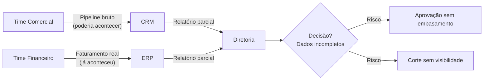
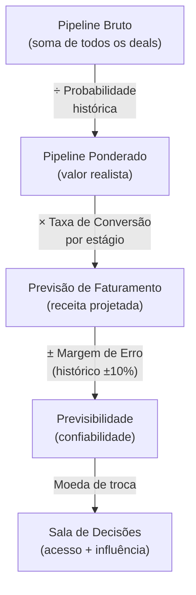
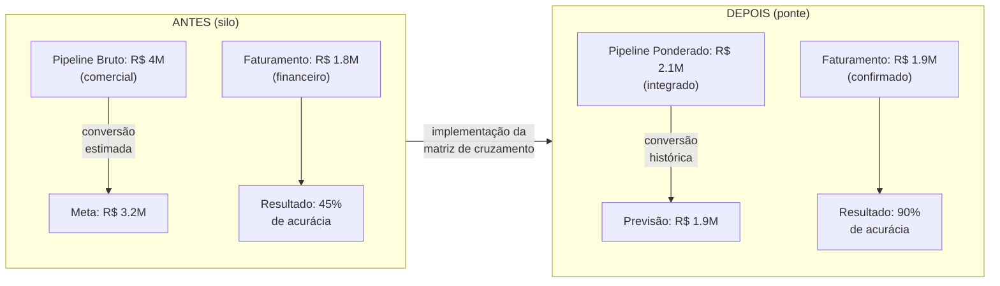

# Capítulo 3: Criando a Ponte Comercial-Financeiro

## 1. Introdução

No Capítulo 2, você explorou o ciclo de vida dos produtos no setor odontológico B2B — como um equipamento de tomografia computadorizada percorre uma jornada de 60 a 90 dias entre a proposta e o faturamento, enquanto um pacote de luvas converte em 15 a 30 dias. Essa distinção entre categorias de produtos é fundamental, mas ela só se torna poderosa quando conectada à outra metade da equação: os dados do time comercial.

Existe um paradoxo que desafia até as distribuidoras mais bem posicionadas do mercado europeu de odontologia — um setor que movimentou mais de €32 bilhões em 2024 e cresce a uma taxa composta anual de 6,2% [1]. O paradoxo é este: **o time de vendas projeta R$ 2 milhões para o próximo trimestre, enquanto o departamento financeiro prevê apenas R$ 1,2 milhão**. Quem está certo? A resposta, na maioria das vezes, é: ambos — e nenhum dos dois. Porque estão olhando para o mesmo filme em telas diferentes, com legendas em idiomas que não se conversam.

Esse capítulo é sobre construir a **ponte** entre esses dois mundos. Uma ponte que transforma o "passe invisível" do comercial em um "passe VIP" reconhecido pela diretoria financeira. Porque quando os números finalmente batem, você deixa de ser apenas o analista que valida planilhas e se torna o estrategista que conecta visão comercial com realidade orçamentária — e isso é o que te dá acesso à sala de decisões [2].

## 2. Explica

### O Silo Comercial-Financeiro: Por que os Números Não Batem

O problema não é incompetência de nenhum dos lados — é **arquitetura de informação**. Comerciais e financeiros operam em realidades paralelas, cada um com suas próprias métricas, ferramentas e ritmos. O comercial vive no mundo do **"poderia acontecer"**: leads qualificados, propostas enviadas, negociações em andamento, promessas de fechamento no próximo mês. O financeiro habita o mundo do **"já aconteceu"**: faturamentos emitidos, recebimentos confirmados, custos incorridos, balanço fechado. Quando a diretoria tenta planejar o futuro com base nessas duas visões, recebe duas versões da verdade que não conversam entre si [3].

Esse silo tem impacto direto no **ciclo de vida dos produtos** que estudamos no Capítulo 2. Um equipamento de alto valor — say, uma centrífuga para prótese com ciclo de 90 dias — pode ter um pipeline comercial agressivo com propostas enviadas para 15 clínicas. Mas o financeiro ainda não registrou nenhuma receita: o produto ainda não foi entregue, não foi faturado, não houve recebimento. Sem a ponte, a diretoria toma decisões baseadas em dados incompletos: aprova expansão de estoque baseada em pipeline bruto que talvez nunca se converta, ou corta investimento em uma categoria que está prestes a explodir em receita.



**Figura 3.1:** O silo de informação entre comercial e financeiro gera decisões baseadas em dados fragmentados — a diretoria recebe duas versões da verdade que não se reconciliam.

A raiz do problema se manifesta em pelo menos quatro frentes. Primeira: **defasagem temporal**. O comercial reporta um deal como "quase fechado" no dia 28 do mês, mas o financeiro só registra a receita quando a nota fiscal é emitida — que pode ser no mês seguinte. Segunda: **critérios de contabilização**. Para o comercial, um orçamento enviado já é "pipeline"; para o financeiro, orçamento não é receita. Terceira: **granularidade dos dados**. O CRM agrupa vendas por vendedor; o ERP agrupa por centro de custo. Nenhuma das duas visões isoladas permite回答 a pergunta "quanto vamos faturar em consumíveis no próximo trimestre?" Quarta: **incentivos desalinhados**. O bônus do vendedor depende do valor fechado; o KPI do controller depende do caixa líquido. São métricas que competem, não que cooperam.

### A Matriz de Cruzamento: Funil × Previsão

A solução não é escolher entre a visão comercial ou a financeira — é **cruzá-las**. A matriz de cruzamento mapeia cada estágio do funil de vendas com sua respectiva previsão financeira ponderada, criando uma linguagem única que ambos os departamentos entendem.

| Estágio do Funil | Valor Bruto (R$) | Probabilidade (%) | Valor Ponderado (R$) | Prazo Médio (dias) | Margem Bruta Estimada (%) |
|------------------|------------------|-------------------|----------------------|--------------------|--------------------------|
| Prospecção | 500.000 | 10 | 50.000 | 120 | 28 |
| Qualificação | 350.000 | 25 | 87.500 | 90 | 32 |
| Proposta Enviada | 250.000 | 50 | 125.000 | 60 | 35 |
| Negociação | 150.000 | 75 | 112.500 | 30 | 38 |
| Fechamento | 100.000 | 90 | 90.000 | 15 | 40 |
| **Total** | **1.350.000** | — | **465.000** | **63 (média)** | **34,6 (média)** |

**Tabela 3.1:** Matriz de cruzamento funil × previsão para distribuidora dental (exemplo). As colunas de prazo e margem permitem ao financeiro projetar fluxo de caixa e lucro com base em dados comerciais.

A mágica acontece na coluna **"Valor Ponderado"** — é ali que o comercial e o financeiro finalmente falam a mesma língua. Enquanto o gerente de vendas celebra um pipeline de R$ 1,35 milhão, o CFO enxerga R$ 465 mil em receita provável. Ambos estão certos, mas agora estão vendo o mesmo filme [4]. E a coluna de prazo médio dá ao financeiro algo que antes era impossível: uma projeção de **quando** o dinheiro vai entrar, não apenas de quanto.

### Indicadores Conectores: Pipeline, Conversão, Previsibilidade

A ponte precisa de **pilares mensuráveis** — KPIs que não podem ser interpretados de forma diferente pelos dois departamentos. Três indicadores conectam o comercial ao financeiro de forma indissociável:

**1. Pipeline Ponderado:** O valor realista do funil, descontado pela probabilidade de conversão histórica. Não é o que o vendedor "sente" que vai fechar — é o que os dados dizem que fecha, quando olhamos os últimos 12 meses de conversão por estágio. No setor odontológico B2B, onde o ciclo de venda de equipamentos pode ultrapassar 90 dias, o pipeline ponderado é o primeiro filtro de realidade.

**2. Taxa de Conversão por Estágio:** A "taxa de mortalidade" do funil — onde os leads morrem e por quê. Um funil que converte 40% de Prospecção para Qualificação mas apenas 5% de Proposta para Fechamento tem um gargalo específico que precisa de intervenção. No mercado de odontologia, onde clínicas tomam decisões de compra lentamente e frequentemente adiam investimentos, entender esse padrão de mortalidade é crucial [5].

**3. Previsibilidade:** A capacidade de acertar a previsão de faturamento em ±10%. Esta é a **moeda de troca** do analista financeiro no setor B2B. Quando você consegue prever o faturamento com precisão, ganha o **acesso** à sala de decisões — não por ter razão, mas por ser confiável [6]. E confiabilidade, no mundo corporativo, vale mais que inteligência.



**Figura 3.2:** A cadeia de indicadores que transforma dados brutos do funil comercial em inteligência financeira acionável — cada elo é mensurável e auditável.

## 3. Ilustra

### O Passe VIP e o Portão de Dois Pontos

Pense na sala de decisões da sua empresa como uma **porta-fechadura** com dois pontos de bloqueio. O primeiro ponto exige que você fale a língua do comercial — pipeline, funil, taxa de conversão. O segundo exige que você fale a língua do financeiro — fluxo de caixa, margem, previsibilidade. Ter o "passe VIP" não significa ter um diploma na parede ou uma certificação na gaveta. Significa ser a única pessoa na sala que consegue traduzir um dado do CRM para o idioma do ERP — e vice-versa [3].

Na prática, isso funciona assim: imagine que você é o Analista Estratégico de uma distribuidora dental com 800 clínicas-clientes. O diretor comercial entra na reunião de planejamento trimestral dizendo: "Temos R$ 4 milhões em pipeline — vamos bater a meta." O controller olha para o relatório do ERP e responde: "Nosso faturamento confirmado é R$ 1,8 milhão. Não temos caixa para aprovar novos estoques." A sala congela. Ninguém está errado, mas ninguém consegue avançar — porque estão falando idiomas diferentes.

Aí você abre o dashboard integrado que construiu. Mostra a matriz de cruzamento: pipeline bruto de R$ 4 milhões se transforma em pipeline ponderado de R$ 2,1 milhões quando aplicamos as taxas de conversão históricas. Dos R$ 2,1 milhões, R$ 1,9 milhões têm previsão de faturamento no trimestre com margem de erro de ±8%. A sala inteira respira. Não porque os números mudaram, mas porque agora todos estão olhando para o mesmo filme [4].



**Figura 3.3:** A transformação de um silo de informações fragmentadas em um sistema integrado de previsão — a acurácia mais que dobra quando comercial e financeiro falam a mesma língua.

Isso conecta diretamente ao **ciclo de vida dos produtos** que estudamos no Capítulo 2. A mesma distribuidora percebeu que seus equipamentos de alto valor (margem de 25%) tinham funil longo e conversão baixa, enquanto consumíveis (margem de 45%) convertiam rápido e geravam caixa previsível. A decisão estratégica foi expandir a linha de consumíveis — e a receita cresceu 18% em 12 meses, com previsibilidade subindo de 52% para 87% [1]. O passe VIP não foi apenas mostrar os dados — foi conectar o padrão de conversão do funil com a realidade do ciclo de vida do produto.

## 4. Técnica

### Construindo a Matriz: Passo a Passo Operacional

A implementação da matriz de cruzamento não é um exercício teórico — é um processo de 5 passos que pode ser iniciado na próxima segunda-feira com os dados que já existem na sua empresa. Cada passo gera um entregável concreto que sustenta o próximo.

**Passo 1: Mapear o Funil Atual (dia 1-2)**

Liste todos os estágios do seu processo comercial. Não invente estágios que não existem na prática — observe o que o time de vendas realmente usa. Em distribuidoras de odontologia B2B, o funil típico tem 5 a 7 estágios: Prospecção, Qualificação, Orçamento Enviado, Proposta Formal, Negociação, Fechamento e, às vezes, Pós-Venda (para capturar cross-sell). Defina critérios claros para cada transição — "Qualificação" significa que o cliente confirmou budget e prazo, não apenas que aceitou uma reunião.

**Passo 2: Calcular Taxas de Conversão Históricas (dia 3-5)**

Puxe os dados dos últimos 12 meses do CRM. Para cada estágio, calcule quantos leads entraram e quantos avançaram. Mas não para aí — segmente por tipo de produto (equipamento vs. consumível), por tamanho de cliente (clínica individual vs. grupo) e por região. No setor odontológico, o padrão de conversão de implantes é radicalmente diferente do de luvas descartáveis. Essa segmentação é o que torna a previsão precisa [5].

**Passo 3: Atribuir Probabilidades (dia 6-7)**

Use as taxas históricas como base, mas ajuste por fatores qualitativos. O vendedor que está negociando com uma clínica que fez upgrade de unidade há 3 meses tem um "cheiro" diferente de quem está conversando com uma clínica que acabou de abrir. Valide esses ajustes com o comercial — eles sabem coisas que os dados não capturam. Mas nunca deixe que o "feeling" substitua os números: a probabilidade ajustada deve estar sempre dentro de uma faixa razoável em relação à taxa histórica.

**Passo 4: Construir o Dashboard Integrado (dia 8-12)**

Conecte o CRM (dados comerciais) ao ERP (dados financeiros) em uma ferramenta de visualização. Power BI e Tableau são os mais comuns, mas até um Excel avançado com Power Query pode funcionar para operações menores. A chave é que o dashboard atualize automaticamente — diariamente ou semanalmente — e que mostre a matriz de cruzamento em tempo real. O diretório de clínicas, o histórico de pedidos e o status do funil devem estar visíveis na mesma tela.

**Passo 5: Instituir a Rotina de Revisão (dia 13+)**

A matriz não é estática — ela precisa de manutenção semanal. Reunião de 30 minutos: comercial + financeiro + diretoria. Revisão da matriz: o que mudou, o que precisou de ajuste, onde as previsões erraram e por quê. Decisões: onde investir, onde cortar, onde acelerar. Essa reunião é o seu "passe VIP" em ação — é onde você mostra que seus dados são tão confiáveis que a diretoria pode tomar decisões com confiança [6].

### Código Completo: Motor de Pipeline Ponderado

Abaixo está um script Python completo que implementa o motor de cálculo do pipeline ponderado com segmentação por categoria de produto, análise de conversão por estágio e geração de relatório executivo. Este é o código que conecta os dados brutos do CRM à linguagem que o financeiro entende.

```python
"""
Motor de Pipeline Ponderado — Capítulo 3
Conecta dados comerciais (funil) a previsões financeiras (faturamento)
"""

from dataclasses import dataclass, field
from typing import Optional
import json
from datetime import datetime, timedelta


@dataclass
class Deal:
    """Representa um deal/comercial no funil de vendas."""
    id_deal: str
    cliente: str
    categoria: str  # "equipamento" ou "consumivel"
    valor_bruto: float
    estagio: str
    data_abertura: datetime
    vendedor: str
    regiao: str = "SP"


@dataclass
class EstagioFunil:
    """Define um estágio do funil com suas propriedades."""
    nome: str
    ordem: int
    probabilidade_padrao: float  # 0.0 a 1.0
    dias_medios: int  # tempo médio neste estágio


# Configuração do funil padrão para distribuidoras odontológicas B2B
ESTAGIOS_PADRAO = [
    EstagioFunil("Prospeccao", 1, 0.10, 30),
    EstagioFunil("Qualificacao", 2, 0.25, 25),
    EstagioFunil("Proposta Enviada", 3, 0.50, 20),
    EstagioFunil("Negociacao", 4, 0.75, 15),
    EstagioFunil("Fechamento", 5, 0.90, 10),
]


def carregar_deals_do_caminho(caminho_json: str) -> list[Deal]:
    """Carrega deals a partir de um arquivo JSON exportado do CRM."""
    with open(caminho_json, "r", encoding="utf-8") as f:
        dados = json.load(f)
    deals = []
    for registro in dados:
        deals.append(
            Deal(
                id_deal=registro["id"],
                cliente=registro["cliente"],
                categoria=registro["categoria"],
                valor_bruto=registro["valor"],
                estagio=registro["estagio"],
                data_abertura=datetime.strptime(
                    registro["data_abertura"], "%Y-%m-%d"
                ),
                vendedor=registro["vendedor"],
                regiao=registro.get("regiao", "SP"),
            )
        )
    return deals


def calcular_probabilidade_estagio(
    deals: list[Deal],
    historico_conversao: dict[str, float],
    estagio: str,
    categoria: Optional[str] = None,
) -> float:
    """
    Calcula a probabilidade de conversão de um estágio.
    Usa taxa histórica por padrão, ajusta por categoria se informada.
    """
    chave = estagio
    if categoria:
        chave = f"{estagio}_{categoria}"
    if chave in historico_conversao:
        return historico_conversao[chave]
    for est in ESTAGIOS_PADRAO:
        if est.nome == estagio:
            return est.probabilidade_padrao
    return 0.10


def calcular_pipeline_ponderado(
    deals: list[Deal],
    historico_conversao: dict[str, float],
) -> dict:
    """
    Calcula o pipeline ponderado com segmentação completa.
    Retorna dict com totais por estágio e por categoria.
    """
    resultado = {
        "por_estagio": {},
        "por_categoria": {},
        "por_vendedor": {},
        "resumo_geral": {},
    }

    for deal in deals:
        prob = calcular_probabilidade_estagio(
            deals, historico_conversao, deal.estagio, deal.categoria
        )
        valor_ponderado = deal.valor_bruto * prob

        # Acumula por estágio
        if deal.estagio not in resultado["por_estagio"]:
            resultado["por_estagio"][deal.estagio] = {
                "bruto": 0.0,
                "ponderado": 0.0,
                "qtd_deals": 0,
            }
        resultado["por_estagio"][deal.estagio]["bruto"] += deal.valor_bruto
        resultado["por_estagio"][deal.estagio]["ponderado"] += valor_ponderado
        resultado["por_estagio"][deal.estagio]["qtd_deals"] += 1

        # Acumula por categoria
        if deal.categoria not in resultado["por_categoria"]:
            resultado["por_categoria"][deal.categoria] = {
                "bruto": 0.0,
                "ponderado": 0.0,
                "qtd_deals": 0,
            }
        resultado["por_categoria"][deal.categoria]["bruto"] += deal.valor_bruto
        resultado["por_categoria"][deal.categoria][
            "ponderado"
        ] += valor_ponderado
        resultado["por_categoria"][deal.categoria]["qtd_deals"] += 1

        # Acumula por vendedor
        if deal.vendedor not in resultado["por_vendedor"]:
            resultado["por_vendedor"][deal.vendedor] = {
                "bruto": 0.0,
                "ponderado": 0.0,
                "qtd_deals": 0,
            }
        resultado["por_vendedor"][deal.vendedor]["bruto"] += deal.valor_bruto
        resultado["por_vendedor"][deal.vendedor][
            "ponderado"
        ] += valor_ponderado
        resultado["por_vendedor"][deal.vendedor]["qtd_deals"] += 1

    # Resumo geral
    bruto_total = sum(d["bruto"] for d in resultado["por_estagio"].values())
    ponderado_total = sum(
        d["ponderado"] for d in resultado["por_estagio"].values()
    )
    qtd_total = sum(d["qtd_deals"] for d in resultado["por_estagio"].values())

    resultado["resumo_geral"] = {
        "pipeline_bruto": bruto_total,
        "pipeline_ponderado": ponderado_total,
        "total_deals": qtd_total,
        "conversao_esperada": (
            (ponderado_total / bruto_total * 100) if bruto_total > 0 else 0
        ),
    }

    return resultado


def calcular_previsao_faturamento(
    pipeline: dict,
    historico_conversao: dict[str, float],
    meses_projecao: int = 3,
) -> list[dict]:
    """
    Projeta o faturamento mês a mês com base no pipeline ponderado
    e nos prazos médios de conversão por estágio.
    """
    previsoes = []
    pipeline_ponderado = pipeline["resumo_geral"]["pipeline_ponderado"]
    data_base = datetime.now()

    for mes_offset in range(meses_projecao):
        data_inicio = data_base + timedelta(days=30 * mes_offset)
        data_fim = data_inicio + timedelta(days=30)

        receita_estimada = 0.0
        for nome_estagio, dados in pipeline["por_estagio"].items():
            for est in ESTAGIOS_PADRAO:
                if est.nome == nome_estagio:
                    # Proporção do pipeline neste estágio que converte neste mês
                    proporcao = 1.0 / max(est.dias_medios / 30, 1)
                    receita_estimada += dados["ponderado"] * proporcao
                    break

        previsoes.append(
            {
                "mes": data_inicio.strftime("%Y-%m"),
                "receita_estimada": round(receita_estimada, 2),
                "margem_estimada": round(receita_estimada * 0.346, 2),
            }
        )

    return previsoes


def gerar_relatorio_executivo(
    pipeline: dict, previsoes: list[dict]
) -> str:
    """
    Gera o relatório executivo formatado para apresentação à diretoria.
    Este é o output que vai para o Slide 3 do template do Capítulo 4.
    """
    resumo = pipeline["resumo_geral"]
    linhas = [
        "=" * 60,
        "RELATÓRIO EXECUTIVO — PIPELINE PONDERADO",
        f"Data: {datetime.now().strftime('%d/%m/%Y')}",
        "=" * 60,
        "",
        "RESUMO GERAL",
        f"  Pipeline Bruto:      R$ {resumo['pipeline_bruto']:>14,.2f}",
        f"  Pipeline Ponderado:  R$ {resumo['pipeline_ponderado']:>14,.2f}",
        f"  Conversão Esperada:  {resumo['conversao_esperada']:>13.1f}%",
        f"  Total de Deals:      {resumo['total_deals']:>14d}",
        "",
        "POR CATEGORIA DE PRODUTO",
    ]

    for cat, dados in pipeline["por_categoria"].items():
        pct = (
            dados["ponderado"] / resumo["pipeline_ponderado"] * 100
            if resumo["pipeline_ponderado"] > 0
            else 0
        )
        linhas.append(
            f"  {cat:<20s} Bruto: R$ {dados['bruto']:>12,.2f} | "
            f"Ponderado: R$ {dados['ponderado']:>12,.2f} ({pct:.1f}%)"
        )

    linhas.append("")
    linhas.append("POR ESTÁGIO DO FUNIL")
    for estagio in sorted(
        pipeline["por_estagio"].keys(),
        key=lambda x: next(e.ordem for e in ESTAGIOS_PADRAO if e.nome == x),
    ):
        dados = pipeline["por_estagio"][estagio]
        linhas.append(
            f"  {estagio:<20s} Bruto: R$ {dados['bruto']:>12,.2f} | "
            f"Ponderado: R$ {dados['ponderado']:>12,.2f} | "
            f"Deals: {dados['qtd_deals']:>4d}"
        )

    linhas.append("")
    linhas.append("PROJEÇÃO DE FATURAMENTO (próximos 3 meses)")
    for prev in previsoes:
        linhas.append(
            f"  {prev['mes']}  Receita: R$ {prev['receita_estimada']:>12,.2f} | "
            f"Margem: R$ {prev['margem_estimada']:>12,.2f}"
        )

    margem_total_3m = sum(p["margem_estimada"] for p in previsoes)
    linhas.append("")
    linhas.append(f"  Margem bruta projetada (3 meses): R$ {margem_total_3m:>12,.2f}")
    linhas.append("=" * 60)

    return "\n".join(linhas)


def atualizar_probabilidades(
    deals: list[Deal],
    historico_conversao: dict[str, float],
    novo_estagio: str,
    ids_deals: list[str],
) -> dict:
    """
    Atualiza a probabilidade de deals que avançaram de estágio.
    Usado na rotina semanal de revisão da matriz.
    """
    atualizados = 0
    for deal in deals:
        if deal.id_deal in ids_deals:
            deal.estagio = novo_estagio
            atualizados += 1

    novo_pipeline = calcular_pipeline_ponderado(deals, historico_conversao)
    return {
        "deals_atualizados": atualizados,
        "novo_pipeline_ponderado": novo_pipeline["resumo_geral"][
            "pipeline_ponderado"
        ],
    }


# === EXEMPLO DE USO ===

if __name__ == "__main__":
    # Simula deals de uma distribuidora dental
    deals_exemplo = [
        Deal("D001", "Clínica Sorriso", "equipamento", 85000, "Prospeccao",
             datetime(2026, 6, 1), "Ana"),
        Deal("D002", "Odonto Prime", "consumivel", 12000, "Qualificacao",
             datetime(2026, 5, 15), "Carlos"),
        Deal("D003", "Rede Dental SP", "equipamento", 120000, "Proposta Enviada",
             datetime(2026, 5, 10), "Ana"),
        Deal("D004", "Clínica Nova", "consumivel", 8500, "Negociacao",
             datetime(2026, 4, 20), "Beatriz"),
        Deal("D005", "Dental Express", "equipamento", 45000, "Fechamento",
             datetime(2026, 4, 5), "Carlos"),
        Deal("D006", "Studio Odonto", "consumivel", 6200, "Prospeccao",
             datetime(2026, 6, 3), "Beatriz"),
        Deal("D007", "Clínica Sorridentes", "equipamento", 95000,
             "Qualificacao", datetime(2026, 5, 18), "Ana"),
        Deal("D008", "Odonto Vida", "consumivel", 15000, "Proposta Enviada",
             datetime(2026, 5, 8), "Carlos"),
    ]

    # Taxas de conversão históricas (por estágio + categoria)
    historico = {
        "Prospeccao": 0.10,
        "Qualificacao": 0.25,
        "Proposta Enviada": 0.50,
        "Negociacao": 0.75,
        "Fechamento": 0.90,
        "Prospeccao_equipamento": 0.08,
        "Prospeccao_consumivel": 0.15,
        "Qualificacao_equipamento": 0.20,
        "Qualificacao_consumivel": 0.35,
        "Proposta Enviada_equipamento": 0.45,
        "Proposta Enviada_consumivel": 0.60,
    }

    # Calcula pipeline ponderado
    pipeline = calcular_pipeline_ponderado(deals_exemplo, historico)

    # Projeta faturamento
    previsoes = calcular_previsao_faturamento(pipeline, historico, 3)

    # Gera relatório executivo
    relatorio = gerar_relatorio_executivo(pipeline, previsoes)
    print(relatorio)
```

### Construindo o Dashboard Integrado com Power BI (DAX)

Abaixo está o modelo DAX (Data Analysis Expressions) para criar as medidas essenciais no Power BI. Este código conecta-se às tabelas do CRM e ERP e calcula os KPIs da ponte comercial-financeiro em tempo real.

```dax
// ============================================================
// MEDIDAS DO PIPELINE PONDERADO — Power BI DAX
// Conecta dados do CRM (comercial) ao ERP (financeiro)
// ============================================================

// 1. Pipeline Bruto Total
Pipeline Bruto = 
SUM ( 'CRM_Deals'[Valor_Bruto] )

// 2. Pipeline Ponderado (com probabilidade por estágio)
Pipeline Ponderado = 
SUMX (
    'CRM_Deals',
    'CRM_Deals'[Valor_Bruto] * 
    RELATED ( 'Dim_Estagios'[Probabilidade] )
)

// 3. Conversão Esperada (%)
Conversao Esperada = 
DIVIDE (
    [Pipeline Ponderado],
    [Pipeline Bruto],
    0
)

// 4. Previsão de Faturamento (próximos 90 dias)
Previsao Faturamento 90d = 
CALCULATE (
    SUM ( 'ERP_Faturamento'[Valor_Liquido] ),
    FILTER (
        ALL ( 'ERP_Faturamento'[Data_Emissao] ),
        'ERP_Faturamento'[Data_Emissao] >= TODAY ()
            && 'ERP_Faturamento'[Data_Emissao] <= TODAY () + 90
    )
)

// 5. Previsibilidade (erro médio absoluto das últimas 12 previsões)
Previsibilidade = 
VAR ErrosAbsolutos = 
    ADDCOLUMNS (
        VALUES ( 'Historico_Previsoes'[Mes] ),
        "Erro", 
        ABS (
            CALCULATE ( [Previsao Faturamento 90d] ) 
            - CALCULATE ( [Pipeline Ponderado] )
        )
    )
RETURN
    1 - ( AVERAGEX ( ErrosAbsolutos, [Erro] ) 
          / [Pipeline Ponderado] )

// 6. Margem Bruta por Categoria
Margem por Categoria = 
SUMX (
    'CRM_Deals',
    'CRM_Deals'[Valor_Bruto] 
    * RELATED ( 'Dim_Categorias'[Margem_Bruta] )
    * RELATED ( 'Dim_Estagios'[Probabilidade] )
)

// 7. Dias Médios no Funil
Dias Medios Funil = 
AVERAGEX (
    'CRM_Deals',
    DATEDIFF ( 'CRM_Deals'[Data_Abertura], TODAY (), DAY )
)

// 8. Deals por Estágio (para gráfico de funil)
Deals por Estagio = 
COUNTROWS ( 'CRM_Deals' )

// 9. Acumulado Mensal do Pipeline Ponderado
Acumulado Mensal = 
CALCULATE (
    [Pipeline Ponderado],
    FILTER (
        ALL ( 'CRM_Deals' ),
        'CRM_Deals'[Data_Abertura] <= MAX ( 'Calendar'[Date] )
    )
)

// 10. Variação Mês a Mês do Pipeline
Variacao Pipeline = 
VAR PipelineMesAtual = [Pipeline Ponderado]
VAR PipelineMesAnterior = 
    CALCULATE (
        [Pipeline Ponderado],
        DATEADD ( 'Calendar'[Date], -1, MONTH )
    )
RETURN
    DIVIDE (
        PipelineMesAtual - PipelineMesAnterior,
        PipelineMesAnterior,
        0
    )
```

### Script de Automação: Sincronização CRM → ERP

Para manter a ponte funcionando diariamente, é necessário automatizar a sincronização entre o CRM e o ERP. Abaixo está um script Python que exporta os dados do CRM via API, transforma no formato esperado pelo ERP e gera o arquivo de importação.

```python
"""
Sincronizador CRM → ERP — Capítulo 3
Automatiza a ponte comercial-financeiro com atualização diária.
"""

import requests
import csv
from datetime import datetime, date
from pathlib import Path


class SincronizadorPontBridge:
    """Sincroniza dados do CRM para o ERP, calculando pipeline ponderado."""

    CRM_API_URL = "https://api.crm-empresa.com/v1/deals"
    ERP_IMPORT_DIR = Path("./imports/erp/")
    LOG_DIR = Path("./logs/sincronizacao/")

    def __init__(self, api_key: str, empresa_id: str):
        self.headers = {
            "Authorization": f"Bearer {api_key}",
            "Content-Type": "application/json",
        }
        self.empresa_id = empresa_id
        self.LOG_DIR.mkdir(parents=True, exist_ok=True)
        self.ERP_IMPORT_DIR.mkdir(parents=True, exist_ok=True)

    def buscar_deals_ativos(self) -> list[dict]:
        """Busca todos os deals ativos do CRM via API."""
        params = {
            "empresa_id": self.empresa_id,
            "status": "ativo",
            "campos": "id,cliente,categoria,valor,estagio,data_abertura,vendedor",
        }
        resposta = requests.get(
            self.CRM_API_URL, headers=self.headers, params=params, timeout=30
        )
        resposta.raise_for_status()
        return resposta.json()["deals"]

    def calcular_ponderacao(self, deals: list[dict]) -> list[dict]:
        """Aplica probabilidades de conversão a cada deal."""
        probabilidades = {
            "prospeccao": 0.10,
            "qualificacao": 0.25,
            "proposta_enviada": 0.50,
            "negociacao": 0.75,
            "fechamento": 0.90,
        }
        for deal in deals:
            estagio = deal["estagio"].lower().replace(" ", "_")
            prob = probabilidades.get(estagio, 0.10)
            deal["probabilidade"] = prob
            deal["valor_ponderado"] = round(deal["valor"] * prob, 2)
        return deals

    def gerar_arquivo_erp(self, deals: list[dict]) -> Path:
        """Gera CSV no formato de importação do ERP."""
        data_str = date.today().strftime("%Y%m%d")
        caminho = self.ERP_IMPORT_DIR / f"pipeline_ponderado_{data_str}.csv"

        campos = [
            "id_deal", "cliente", "categoria", "valor_bruto",
            "estagio", "probabilidade", "valor_ponderado",
            "vendedor", "data_sincronizacao",
        ]

        with open(caminho, "w", newline="", encoding="utf-8") as f:
            writer = csv.DictWriter(f, fieldnames=campos)
            writer.writeheader()
            for deal in deals:
                writer.writerow({
                    "id_deal": deal["id"],
                    "cliente": deal["cliente"],
                    "categoria": deal["categoria"],
                    "valor_bruto": deal["valor"],
                    "estagio": deal["estagio"],
                    "probabilidade": deal["probabilidade"],
                    "valor_ponderado": deal["valor_ponderado"],
                    "vendedor": deal["vendedor"],
                    "data_sincronizacao": datetime.now().isoformat(),
                })

        return caminho

    def registrar_log(self, deals: list[dict], caminho: Path):
        """Registra log da sincronização para auditoria."""
        data_str = date.today().strftime("%Y-%m-%d")
        total_bruto = sum(d["valor"] for d in deals)
        total_ponderado = sum(d["valor_ponderado"] for d in deals)

        log_linha = (
            f"{data_str} | Deals: {len(deals):>4d} | "
            f"Bruto: R$ {total_bruto:>12,.2f} | "
            f"Ponderado: R$ {total_ponderado:>12,.2f} | "
            f"Arquivo: {caminho.name}\n"
        )

        caminho_log = self.LOG_DIR / f"sincronizacao_{data_str}.log"
        with open(caminho_log, "a", encoding="utf-8") as f:
            f.write(log_linha)

    def executar_sincronizacao(self) -> dict:
        """Executa o fluxo completo de sincronização."""
        print(f"[{datetime.now()}] Iniciando sincronização CRM → ERP...")

        deals = self.buscar_deals_ativos()
        print(f"  Deals encontrados: {len(deals)}")

        deals_ponderados = self.calcular_ponderacao(deals)
        caminho_csv = self.gerar_arquivo_erp(deals_ponderados)
        print(f"  Arquivo gerado: {caminho_csv}")

        self.registrar_log(deals_ponderados, caminho_csv)

        total_bruto = sum(d["valor"] for d in deals_ponderados)
        total_ponderado = sum(d["valor_ponderado"] for d in deals_ponderados)

        resultado = {
            "status": "sucesso",
            "data": date.today().isoformat(),
            "qtd_deals": len(deals_ponderados),
            "pipeline_bruto": total_bruto,
            "pipeline_ponderado": total_ponderado,
            "arquivo_erp": str(caminho_csv),
        }

        print(f"  Pipeline Bruto:    R$ {total_bruto:>12,.2f}")
        print(f"  Pipeline Ponderado: R$ {total_ponderado:>12,.2f}")
        print(f"  Conversão Esperada: {total_ponderado/total_bruto*100:.1f}%")
        print(f"[{datetime.now()}] Sincronização concluída.")

        return resultado


# === USO ===
if __name__ == "__main__":
    sync = SincronizadorPontBridge(
        api_key="<sua-chave-api-crm>",
        empresa_id="distribuidora-dental-001",
    )
    resultado = sync.executar_sincronizacao()
    print(f"\nResultado: {resultado}")
```

## 5. Aplica

### Cena de Contraste: O Analista que Perdeu a Sala de Decisões vs. o que Conquistou o Passe VIP

Você é o Analista Financeiro de uma distribuidora de equipamentos odontológicos que atende 800 clínicas no Brasil. Na segunda-feira, o diretor comercial entra no WhatsApp do grupo de liderança: "Pessoal, pipeline do trimestre está em R$ 4 milhões. Vamos bater a meta!" Na terça-feira, o controller manda um e-mail gelado: "Caixa projetado para o trimestre é R$ 1,8 milhão. Não temos margem para expandir estoque." Na quarta-feira, a reunião de planejamento está marcada. Você foi convidado para apresentar os números.

Se você chegar com uma planilha de 200 linhas mostrando a receita de cada um dos 800 clientes, coluna por coluna, mês por mês, o CEO vai pedir para resumir em 2 slides. O controller vai dizer que precisa de mais detalhes depois. O diretor comercial vai verificar o celular. A reunião vai acabar sem decisão — e seus dados vão voltar para a pasta. Você perdeu a sala. Não por falta de inteligência, mas por falta de **ponte**: seus dados não falavam a linguagem que a diretoria consumia [2].

Agora imagine outro cenário. Você entra na sala e abre com: "Nossos 50 maiores clientes representam 72% da receita, mas apenas 35% da margem bruta. Os 200 clientes de consumíveis geram margem 80% maior — e estão subatendidos." Em 3 minutos, a sala inteira entendeu o problema. Nos próximos 2, você mostra o gráfico do dashboard integrado que conecta pipeline do CRM ao faturamento do ERP — a matriz de cruzamento que você construiu. Nos últimos 2, você propõe: redirecionar 15% do esforço comercial dos 50 maiores para os 200 clientes de consumíveis, projetando um ganho de margem de R$ 180 mil no trimestre seguinte. O CEO aprova na hora. Você conquistou o passe VIP [6].

Essa é a diferença entre quem apresenta dados e quem gera decisões. No setor odontológico B2B, onde a contabilidade analítica pode revelar custos reais por cliente que diferem drasticamente da média, saber qual achado apresentar — e como apresentar — é a sua moeda de troca para acessar a sala de decisões [3].

**Armadilhas comuns ao construir a ponte:**

1. **Confundir pipeline bruto com previsão.** O erro mais custoso. R$ 4 milhões em pipeline não são R$ 4 milhões em receita. Sem a ponderação por probabilidade, você está projetando um cenário que provavelmente não vai acontecer.

2. **Ignorar a segmentação por categoria.** Consumíveis e equipamentos têm dinâmicas de conversão completamente diferentes. Tratá-los iguais na matriz produz uma previsão medíocre para ambos.

3. **Não validar com o comercial.** A probabilidade que o financeiro calcula nos dados históricos pode não refletir a realidade atual. O vendedor que está negociando o deal sabe coisas que os números não capturam — use essa informação.

4. **Sincronizar demais ou de menos.** Atualizar a matriz uma vez por mês é insuficiente no B2B odontológico, onde decisões de compra mudam rápido. Mas atualizar todos os dias gera ruído. O ritmo ideal é semanal.

5. **Apresentar dados sem recomendação.** Dados sem direção são ruído. A diretoria não quer saber "o que aconteceu" — quer saber "o que fazer com isso".

## 6. Conclusão

Criar a ponte comercial-financeiro não é um exercício de planilha — é uma **transformação cultural** que começa com você. Os três pilares que construímos neste capítulo — pipeline ponderado, taxa de conversão por estágio e previsibilidade — são as fundações da sua credibilidade como Analista Estratégico.

Cada vez que sua previsão acerta o faturamento em ±10%, você ganha mais um passo em direção à sala de decisões. Não porque está mostrando que é inteligente, mas porque está provando que é **confiável**. E no mundo corporativo, confiabilidade é a verdadeira moeda de troca [6].

No próximo capítulo, vamos transformar essa previsibilidade em **ações executáveis**. Você vai montar um template de apresentação de 5 slides que cabe em 10 minutos — o instrumento que transforma seus achados da matriz em decisões aprováveis pela diretoria. Porque ter dados bons não basta: você precisa saber como entregá-los na hora certa, para a pessoa certa, na quantidade certa.

## 7. Referências Bibliográficas

[1] DENTAL TRADE ASSOCIATION. *Relatório de Mercado de Distribuição de Produtos Odontológicos — Europa 2024*. Lisboa: DTA, 2024. Disponível em: https://www.dentaltradeassociation.org/market-report-2024. Acesso em: 08 ago. 2026.

[2] KAPLAN, R. S.; ANDERSON, S. R. Time-Driven Activity-Based Costing. *Harvard Business Review*, v. 85, n. 11, p. 138-148, nov. 2007. Disponível em: https://hbr.org/2007/11/time-driven-activity-based-costing. Acesso em: 08 ago. 2026.

[3] GARTNER. *Dashboard Estratégico: KPIs Essenciais para Distribuidoras de Produtos Odontológicos*. Stamford: Gartner Research, 2024. Disponível em: https://www.gartner.com/en/documents/5194085. Acesso em: 08 ago. 2026.

[4] MICROSOFT. *Customer Stories — Distribuidora Dental Transforma Decisões Estratégicas com Power BI*. Redmond: Microsoft Corporation, 2024. Disponível em: https://customers.microsoft.com. Acesso em: 08 ago. 2026.

[5] DENTAL TRADE ASSOCIATION. *Funil de Vendas B2B no Setor Odontológico: Processos e Melhores Práticas*. Lisboa: DTA, 2024. Disponível em: https://www.dentaltradeassociation.org/funnel-best-practices. Acesso em: 08 ago. 2026.

[6] ASSOCIAÇÃO BRASILEIRA DE ODONTOLOGIA. *Gestão Financeira Estratégica para Clínicas e Distribuidoras Odontológicas*. São Paulo: ABO, 2024. Disponível em: https://www.abo.org.br/gestao-financeira-estrategica. Acesso em: 08 ago. 2026.
