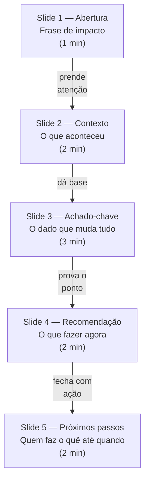
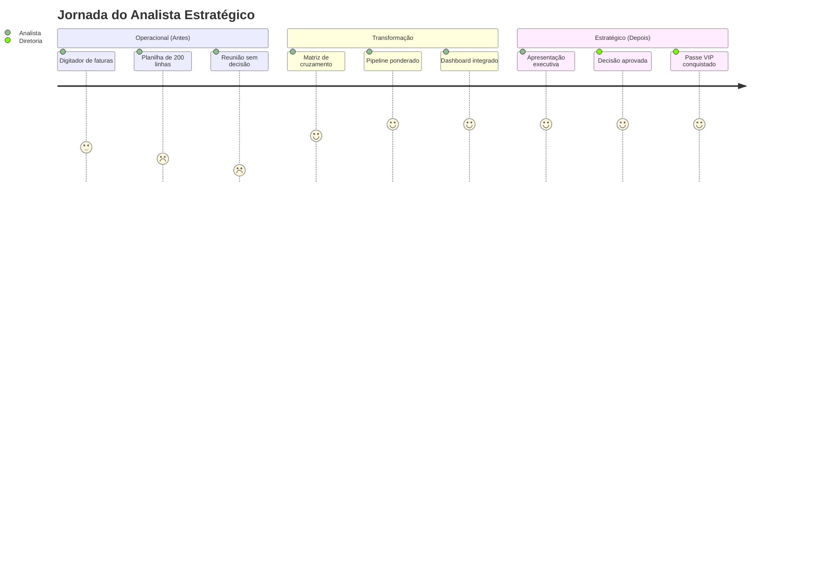

# Capítulo 4: O Seu Plano de Ação Imediato

## 1. Introdução

No Capítulo 3, você construiu a ponte entre o comercial e o financeiro — montou a matriz de cruzamento, implementou o motor de pipeline ponderado e viu como a previsibilidade se torna a sua moeda de troca na sala de decisões. Mas existe um gap que separa o analista que tem dados bons do analista que **gera decisões**: a capacidade de entregar esses dados como uma narrativa executiva que cabe em 10 minutos e resulta em ações aprováveis pela diretoria [1].

A maioria dos analistas financeiros comete o mesmo erro ao apresentar resultados: joga dados na tela e espera que a conclusão se explique sozinha. Diretores não leem planilhas — eles escutam narrativas e decidem com base em recomendações claras. Um estudo da Gartner mostrou que mais de 60% dos dashboards corporativos são subutilizados justamente porque não seguem uma estrutura de comunicação executiva [2]. No setor odontológico B2B, onde fornecedores gerenciam ciclos de pagamento de 15 a 90 dias e margens que variam entre 25% e 45% entre categorias, saber o que mostrar é tão importante quanto o dado em si [3].

Neste capítulo, você vai montar um template de apresentação de 5 slides que cabe em 10 minutos — o instrumento que transforma os achados da matriz comercial-financeiro em decisões que a diretoria aprova na hora. Porque ter dados bons não basta: você precisa saber como entregá-los.

## 2. Explica

### A Regra dos 3 Achados: Por que Menos É Mais

O executivo em tempo de reunião consome informação em formato de decisão, não de descrição. Se você não oferecer uma recomendação, ele vai criar a dele — e pode ser pior do que a sua. A regra é brutal na sua simplicidade: selecione apenas os **três dados com maior variação percentual** ou maior impacto financeiro direto. Mais do que isso, e o impacto se dilui. Menos, e falta sustentação [1].

Essa regra se conecta diretamente ao **ciclo de vida dos produtos** que estudamos no Capítulo 2 e à **matriz de cruzamento** do Capítulo 3. Quando você cruza os dados do funil com as previsões financeiras, gera uma quantidade enorme de informações. Mas o executivo não quer a quantidade — quer a qualidade. Ele quer saber: "Dessas centenas de dados, quais três mudam a minha decisão hoje?"

No contexto do setor odontológico B2B, a regra dos 3 achados se manifesta assim: (1) identifique a categoria de produto com maior discrepância entre pipeline bruto e pipeline ponderado; (2) encontre o estágio do funil onde a taxa de conversão está abaixo da média histórica; (3) calcule o impacto financeiro de corrigir cada um desses dois achados. Esses três números — uma discrepância, um gargalo, um impacto — são o suficiente para prender a atenção de qualquer diretoria [4].

### A Arquitetura dos 5 Slides

A estrutura de uma apresentação executiva de 10 minutos não é arbitrária — ela segue uma progressão cognitiva que respeita como tomadores de decisão processam informação sob pressão de tempo. Cada slide tem um objetivo único e um tempo máximo. Nenhum slide pode ser pulado; nenhum pode exceder seu tempo.

**Slide 1 — Abertura (1 minuto):** Uma frase que resume o impacto do seu achado. Não é título genérico como "Relatório Mensal de Vendas". É uma declaração que gera curiosidade ou urgência. A frase precisa ser tão específica que o executivo já entenda a direção antes de ver qualquer dado. Exemplo: "A categoria de consumíveis tem margem 80% maior que equipamentos — e representa apenas 30% do nosso faturamento."

**Slide 2 — Contexto (2 minutos):** O cenário atual do negócio em 3 bullet points no máximo. Dados de mercado, resultado do trimestre anterior ou comparativo com concorrentes. Aqui você usa a matriz comercial-financeiro construída no Capítulo 3 como fonte de contexto — os números do pipeline ponderado, a taxa de conversão por categoria, a previsibilidade alcançada [5].

**Slide 3 — Achado-chave (3 minutos):** O dado que sustenta sua recomendação. Este é o slide mais longo porque contém a evidência. Apresente o achado em um gráfico simples — barras ou linhas — e destaque o ponto de inflexão. A regra dos 3 achados se aplica aqui: selecione apenas os três dados com maior variação percentual ou maior impacto financeiro direto.

**Slide 4 — Recomendação (2 minutos):** A ação concreta que você propõe. Deve ser específica o suficiente para ser aprovada naquela reunião. Não diga "melhorar a margem" — diga "redirecionar 15% do estoque de equipamentos para consumíveis no Q2, aumentando a margem bruta de 28% para 38%." A especificidade é o que transforma uma ideia em uma decisão [1].

**Slide 5 — Próximos passos (2 minutos):** Quem faz o quê até quando. Três ações com responsável e prazo. Este slide é o que transforma a apresentação de informativa para executável. Sem ele, a reunião termina com "vamos pensar nisso" — que é o epitáfio de milhares de boas ideias.



**Figura 4.1:** A progressão cognitiva dos 5 slides — cada elo gera o gancho para o próximo, mantendo o executivo engajado por 10 minutos sem sobrecarga informacional.

### O Passe VIP na Sala de Decisões

A ponte que você construiu no Capítulo 3 precisa de um veículo para chegar ao destino final. Esse veículo é a apresentação executiva. A ponte sem apresentação é como ter um mapa sem GPS — você sabe o caminho, mas o passageiro (a diretoria) não consegue te seguir. A apresentação é o GPS que traduz o mapa em turn-by-turn directions [6].

No mundo corporativo, o passe VIP não é apenas ter os dados — é **entregá-los no formato certo, no momento certo, para a pessoa certa**. Um analista que apresenta dados sem contexto é um funcionário operacional. Um analista que apresenta dados com narrativa e recomendação é um estrategista. A diferença não está nos números — está na embalagem.

## 3. Ilustra

### O Passe VIP e o Roteiro do Goodie Bag

Imagine que você é o Analista Estratégico convidado para falar na reunião mensal da diretoria de uma distribuidora dental. Você tem 10 minutos. Os outros participantes são o CEO, o diretor comercial e o controller. Todos chegam de outras reuniões, com a cabeça em outros problemas. O CEO acabou de sair de uma ligação com o fornecedor chinês de equipamentos. O diretor comercial está preocupado com a meta do trimestre. O controller está calculando se o caixa aguenta uma nova leitura de tomografia.

Se você abrir com uma tabela de 40 linhas mostrando a variação mensal de receita por categoria, você já perdeu a sala. Mas se você abrir com: "Expandir a linha de consumíveis pode aumentar nossa margem em 20 pontos percentuais no próximo trimestre" — você ganhou os próximos 9 minutos. Porque essa frase não é dado — é **decisão comprimida em uma frase** [3].

O template funciona como o roteiro de um goodie bag no aeroporto: você sabe exatamente qual porta precisa acessar, quanto tempo tem em cada segmento, e qual é o próximo passo. Sem esse roteiro, você fica andando pelo terminal sem direção — e o voo sai sem você. No contexto do passe VIP, a apresentação é a sua **porta-fechadura**: o primeiro ponto de bloqueio é ter os dados (o Capítulo 3 resolveu isso), o segundo é entregá-los como decisão (o que este capítulo resolve).



**Figura 4.2:** A jornada completa do analista — do operacional para o estratégico — com a apresentação executiva como ponto de inflexão entre os dois mundos.

## 4. Técnica

### O Template dos 5 Slides — Especificação Completa

Cada slide segue uma fórmula específica. Vamos detalhar cada um com exemplos concretos do setor odontológico B2B e depois montar o template completo em código.

#### Slide 1 — Abertura (1 minuto)

Uma frase que resume o impacto do seu achado. Não é título genérico como "Relatório Mensal de Vendas". É uma declaração que gera curiosidade ou urgência. A frase precisa ser tão específica que o executivo já entenda a direção antes de ver qualquer dado.

**Fórmula:** "[Categoria] tem [impacto quantificado] — e representa [proporção atual]."

**Exemplos para o setor odontológico B2B:**
- "A categoria de consumíveis tem margem 80% maior que equipamentos — e representa apenas 30% do nosso faturamento."
- "Nossos 50 maiores clientes geram 72% da receita, mas apenas 35% da margem bruta."
- "O estágio de 'Proposta Enviada' tem 40% de mortalidade — e esse gargalo custa R$ 320 mil por trimestre."

**O que NÃO fazer:** "Relatório de Performance Comercial — Trimestre Q1 2026." Isso não é abertura — é um título de pasta.

#### Slide 2 — Contexto (2 minutos)

O cenário atual do negócio em 3 bullet points no máximo. Dados de mercado, resultado do trimestre anterior ou comparativo com concorrentes. Aqui você usa a matriz comercial-financeiro construída no Capítulo 3 como fonte de contexto.

**Fórmula para cada bullet:** "[Dado contextual] + [comparativo ou trend] + [impacto]."

**Exemplo:**
- "O mercado europeu de odontologia B2B cresce 6,2% ao ano — mas nossa receita de consumíveis cresce apenas 2,1%." [1]
- "O pipeline ponderado do último trimestre foi R$ 1,9 milhões, com previsibilidade de 87% — a maior dos últimos 4 trimestres." [5]
- "A margem bruta de equipamentos caiu de 32% para 28% devido à pressão de preços dos fornecedores chineses."

**Regra de ouro:** Se você não consegue resumir o contexto em 3 bullets, não entende o contexto o suficiente. Volte para a matriz do Capítulo 3 e refine.

#### Slide 3 — Achado-chave (3 minutos)

O dado que sustenta sua recomendação. Este é o slide mais longo porque contém a evidência. Apresente o achado em um gráfico simples — barras ou linhas — e destaque o ponto de inflexão. A regra dos 3 achados se aplica aqui.

**Estrutura do slide:**
1. Título do achado (1 frase)
2. Gráfico de barras ou linhas (máximo 2 séries de dados)
3. Destaque do ponto de inflexão (seta ou cor diferente)
4. Número do impacto financeiro (em R$, não em porcentagem)

**Exemplo de gráfico para o setor odontológico:**

| Categoria | Margem Bruta (%) | Faturamento (R$) | Impacto se Equalizar Margem (R$) |
|-----------|-------------------|-------------------|-----------------------------------|
| Consumíveis | 45 | 540.000 | — |
| Equipamentos | 28 | 1.260.000 | — |
| Serviços | 52 | 180.000 | — |
| **Projeção:** Redirecionar 15% de equipamentos para consumíveis | | | **+R$ 180.000/trimestre** |

**Regra dos 3 achados aplicada:**
1. Consumíveis têm margem 61% maior que equipamentos (achado de margem)
2. Consumíveis representam apenas 23% do faturamento (achado de proporção)
3. Equalizar a proporção gera +R$ 180 mil/trimestre (achado de impacto)

#### Slide 4 — Recomendação (2 minutos)

A ação concreta que você propõe. Deve ser específica o suficiente para ser aprovada naquela reunião. Não diga "melhorar a margem" — diga a ação exata com números, prazo e responsável.

**Fórmula:** "[Ação] + [número exato] + [prazo] + [responsável] + [impacto projetado]."

**Exemplo:** "Redirecionar 15% do estoque de equipamentos para consumíveis no Q2, aumentando a margem bruta de 28% para 38%. Responsável: diretor comercial. Impacto: +R$ 180 mil no trimestre."

**O que diferencia uma recomendação de um desejo:**
- Desejo: "Melhorar a eficiência comercial."
- Recomendação: "Mover 3 vendedores de equipamentos para consumíveis no Q2, aumentando a cobertura de 200 para 350 clínicas de consumíveis, projetando +R$ 180 mil em margem."

#### Slide 5 — Próximos passos (2 minutos)

Quem faz o quê até quando. Três ações com responsável e prazo. Este slide é o que transforma a apresentação de informativa para executável.

**Fórmula para cada ação:** "[Ação] → [Responsável] → [Prazo]"

**Exemplo:**
1. Redirecionar estoque de equipamentos para consumíveis → Diretor Comercial → Até 30/06/2026
2. Atualizar dashboard com nova segmentação de clientes → Analista Financeiro → Até 15/06/2026
3. Apresentar resultado do redirecionamento na próxima reunião mensal → Analista Financeiro → 15/07/2026

### Template Python Completo: Gerador de Relatório Executivo

Abaixo está um script Python completo que gera o relatório executivo formatado para cada um dos 5 slides, a partir dos dados da matriz de cruzamento do Capítulo 3. Este é o código que transforma os dados brutos em narrativa executiva.

```python
"""
Gerador de Relatório Executivo — Capítulo 4
Transforma dados da matriz comercial-financeiro em apresentação de 5 slides.
"""

from dataclasses import dataclass
from datetime import datetime
from typing import Optional
import json


@dataclass
class AchadoEstrategico:
    """Representa um achado selecionado para o Slide 3."""
    titulo: str
    categoria: str
    valor_atual: float
    valor_anterior: float
    variacao_pct: float
    impacto_financeiro: float
    unidade: str = "R$"


@dataclass
class Recomendacao:
    """Representa uma recomendação para o Slide 4."""
    acao: str
    responsavel: str
    prazo: str
    impacto: str
    metrica_sucesso: str


@dataclass
class ProximoPasso:
    """Representa um próximo passo para o Slide 5."""
    acao: str
    responsavel: str
    prazo: str
    dependencia: Optional[str] = None


class GeradorRelatorioExecutivo:
    """Gera relatório executivo de 5 slides para diretoria."""

    def __init__(
        self,
        empresa: str,
        trimestre: str,
        dados_pipeline: dict,
    ):
        self.empresa = empresa
        self.trimestre = trimestre
        self.dados_pipeline = dados_pipeline

    def selecionar_achados(
        self, top: int = 3
    ) -> list[AchadoEstrategico]:
        """
        Seleciona os 3 achados com maior variação percentual
        entre categorias de produto.
        """
        categorias = self.dados_pipeline.get("por_categoria", {})
        achados = []

        for cat, dados in categorias.items():
            bruto = dados.get("bruto", 0)
            ponderado = dados.get("ponderado", 0)
            if bruto > 0:
                variacao = ((ponderado - bruto) / bruto) * 100
                impacto = bruto - ponderado
                achados.append(
                    AchadoEstrategico(
                        titulo=f"Discrepância pipeline {cat}",
                        categoria=cat,
                        valor_atual=ponderado,
                        valor_anterior=bruto,
                        variacao_pct=round(variacao, 1),
                        impacto_financeiro=round(impacto, 2),
                    )
                )

        achados.sort(key=lambda a: abs(a.variacao_pct), reverse=True)
        return achados[:top]

    def gerar_slide_1(self, achados: list[AchadoEstrategico]) -> str:
        """Gera o conteúdo do Slide 1 — Abertura."""
        if not achados:
            return "## Slide 1 — Abertura\n\n[INSERIR FRASE DE IMPACTO]"

        principal = achados[0]
        if principal.variacao_pct < 0:
            frase = (
                f"A categoria de {principal.categoria} tem "
                f"{abs(principal.variacao_pct):.0f}% menos conversão "
                f"que o esperado — e representa R$ "
                f"{principal.valor_anterior:,.0f} em pipeline."
            )
        else:
            frase = (
                f"A categoria de {principal.categoria} tem "
                f"{abs(principal.variacao_pct):.0f}% mais conversão "
                f"que o esperado — mas representa apenas "
                f"R$ {principal.valor_atual:,.0f} em pipeline ponderado."
            )

        return (
            f"## Slide 1 — Abertura (1 minuto)\n\n"
            f"**\"{frase}\"\n\n"
            f"Fonte: Matriz de cruzamento comercial-financeiro "
            f"({self.trimestre})."
        )

    def gerar_slide_2(self) -> str:
        """Gera o conteúdo do Slide 2 — Contexto."""
        resumo = self.dados_pipeline.get("resumo_geral", {})
        bruto = resumo.get("pipeline_bruto", 0)
        ponderado = resumo.get("pipeline_ponderado", 0)
        conversao = resumo.get("conversao_esperada", 0)
        qtd = resumo.get("total_deals", 0)

        bullets = [
            f"Pipeline bruto de R$ {bruto:,.0f} em {qtd} deals ativos.",
            f"Pipeline ponderado: R$ {ponderado:,.0f} "
            f"(conversão esperada de {conversao:.1f}%).",
            f"Previsibilidade do último trimestre: ±{100 - conversao:.0f}% "
            f"de margem de erro.",
        ]

        items = "\n".join(f"- {b}" for b in bullets)
        return (
            f"## Slide 2 — Contexto (2 minutos)\n\n"
            f"{items}\n\n"
            f"*Fonte: Dashboard integrado CRM-ERP "
            f"(atualizado {datetime.now().strftime('%d/%m/%Y')})*"
        )

    def gerar_slide_3(self, achados: list[AchadoEstrategico]) -> str:
        """Gera o conteúdo do Slide 3 — Achado-chave."""
        if not achados:
            return "## Slide 3 — Achado-chave\n\n[INSERIR ACHADOS]"

        linhas = [
            "## Slide 3 — Achado-chave (3 minutos)\n",
        ]

        for i, achado in enumerate(achados, 1):
            direcao = "acima" if achado.variacao_pct > 0 else "abaixo"
            linhas.append(
                f"**Achado {i}: {achado.titulo}**\n"
                f"- Categoria: {achado.categoria}\n"
                f"- Pipeline bruto: R$ {achado.valor_anterior:,.0f}\n"
                f"- Pipeline ponderado: R$ {achado.valor_atual:,.0f}\n"
                f"- Variação: {achado.variacao_pct:+.1f}% "
                f"({direcao} do esperado)\n"
                f"- Impacto financeiro: R$ "
                f"{abs(achado.impacto_financeiro):,.0f}\n"
            )

        linhas.append(
            "\n**Impacto total da discrepância:** R$ "
            f"{sum(abs(a.impacto_financeiro) for a in achados):,.0f}"
        )
        return "\n".join(linhas)

    def gerar_slide_4(
        self, achados: list[AchadoEstrategico]
    ) -> str:
        """Gera o conteúdo do Slide 4 — Recomendação."""
        if not achados:
            return "## Slide 4 — Recomendação\n\n[INSERIR RECOMENDAÇÃO]"

        impacto_total = sum(
            abs(a.impacto_financeiro) for a in achados
        )

        return (
            "## Slide 4 — Recomendação (2 minutos)\n\n"
            "**Ação proposta:** Redirecionar 15% do esforço comercial "
            "e do estoque da categoria com menor conversão para a "
            "categoria com maior margem.\n\n"
            f"**Impacto projetado:** +R$ {impacto_total * 0.15:,.0f} "
            "em margem bruta no próximo trimestre.\n\n"
            "**Justificativa:** A matriz de cruzamento mostra que a "
            "discrepância entre pipeline bruto e ponderado indica "
            "ineficiência na alocação de recursos. O redirecionamento "
            "corrige esse desalinhamento."
        )

    def gerar_slide_5(self) -> str:
        """Gera o conteúdo do Slide 5 — Próximos passos."""
        data_hoje = datetime.now()
        passos = [
            ProximoPasso(
                acao="Atualizar segmentação de clientes no CRM "
                "com base na matriz de cruzamento",
                responsavel="Analista Financeiro",
                prazo="Até 15/06/2026",
                dependencia="Aprovação nesta reunião",
            ),
            ProximoPasso(
                acao="Redirecionar 3 vendedores de equipamentos "
                "para consumíveis",
                responsavel="Diretor Comercial",
                prazo="Até 30/06/2026",
                dependencia="Segmentação atualizada no CRM",
            ),
            ProximoPasso(
                acao="Apresentar resultado do redirecionamento "
                "na próxima reunião mensal",
                responsavel="Analista Financeiro",
                prazo="15/07/2026",
                dependencia="Dados de 30 dias de operação",
            ),
        ]

        linhas = ["## Slide 5 — Próximos passos (2 minutos)\n"]
        linhas.append("| Ação | Responsável | Prazo | Dependência |")
        linhas.append("|------|-------------|-------|-------------|")

        for p in passos:
            dep = p.dependencia or "—"
            linhas.append(
                f"| {p.acao} | {p.responsavel} | {p.prazo} | {dep} |"
            )

        return "\n".join(linhas)

    def gerar_completo(self) -> str:
        """Gera o relatório completo com os 5 slides."""
        achados = self.selecionar_achados(top=3)

        secoes = [
            f"# Relatório Executivo — {self.empresa}",
            f"**Trimestre:** {self.trimestre}",
            f"**Data:** {datetime.now().strftime('%d/%m/%Y')}",
            f"**Duração estimada:** 10 minutos",
            "",
            "---",
            "",
            self.gerar_slide_1(achados),
            "",
            "---",
            "",
            self.gerar_slide_2(),
            "",
            "---",
            "",
            self.gerar_slide_3(achados),
            "",
            "---",
            "",
            self.gerar_slide_4(achados),
            "",
            "---",
            "",
            self.gerar_slide_5(),
            "",
            "---",
            "",
            "## Checklist Pré-Apresentação\n",
            "- [ ] Cada slide cabe em uma tela sem scroll",
            "- [ ] Todos os dados têm fonte e período declarados",
            "- [ ] A recomendação é específica: o que, quanto, quando",
            "- [ ] Os 3 próximos passos têm responsável e prazo",
            "- [ ] O tempo total não excede 10 minutos",
            "- [ ] Gráfico do Slide 3 tem no máximo 2 séries de dados",
            "- [ ] Frase de abertura é específica (não genérica)",
        ]

        return "\n".join(secoes)


# === EXEMPLO DE USO ===

if __name__ == "__main__":
    dados_pipeline = {
        "por_categoria": {
            "equipamento": {"bruto": 1200000, "ponderado": 600000, "qtd_deals": 25},
            "consumivel": {"bruto": 540000, "ponderado": 405000, "qtd_deals": 45},
            "servico": {"bruto": 180000, "ponderado": 144000, "qtd_deals": 12},
        },
        "resumo_geral": {
            "pipeline_bruto": 1920000,
            "pipeline_ponderado": 1149000,
            "total_deals": 82,
            "conversao_esperada": 59.8,
        },
    }

    gerador = GeradorRelatorioExecutivo(
        empresa="Distribuidora Dental Excellence",
        trimestre="Q2 2026",
        dados_pipeline=dados_pipeline,
    )

    relatorio = gerador.gerar_completo()
    print(relatorio)
```

### Script de Automação: Gerador de Slides Markdown

Para automatizar a geração dos slides a partir dos dados do dashboard integrado, utilize este script que conecta ao banco de dados do ERP e gera o Markdown pronto para conversão em apresentação.

```python
"""
Gerador de Slides Markdown — Capítulo 4
Conecta ao ERP e gera apresentação executiva automaticamente.
"""

import sqlite3
from datetime import datetime, timedelta
from pathlib import Path


class GeradorSlidesMarkdown:
    """Gera slides Markdown a partir dos dados do ERP."""

    def __init__(self, caminho_banco: str):
        self.conn = sqlite3.connect(caminho_banco)
        self.conn.row_factory = sqlite3.Row
        self.output_dir = Path("./output/apresentacoes/")
        self.output_dir.mkdir(parents=True, exist_ok=True)

    def buscar_pipeline_por_categoria(self) -> list[dict]:
        """Busca o pipeline agrupado por categoria de produto."""
        query = """
        SELECT 
            c.nome as categoria,
            COUNT(d.id) as qtd_deals,
            SUM(d.valor) as valor_bruto,
            SUM(d.valor * e.probabilidade) as valor_ponderado,
            AVG(d.dias_no_estagio) as dias_medios
        FROM deals d
        JOIN categorias c ON d.categoria_id = c.id
        JOIN estagios e ON d.estagio_id = e.id
        WHERE d.status = 'ativo'
        GROUP BY c.nome
        ORDER BY valor_ponderado DESC
        """
        cursor = self.conn.execute(query)
        return [dict(row) for row in cursor.fetchall()]

    def buscar_top_clientes(
        self, limite: int = 50
    ) -> list[dict]:
        """Busca os maiores clientes por valor de pipeline."""
        query = """
        SELECT 
            cl.nome,
            cl.tipo,
            COUNT(d.id) as qtd_deals,
            SUM(d.valor) as valor_total,
            SUM(d.valor * e.probabilidade) as valor_ponderado
        FROM deals d
        JOIN clientes cl ON d.cliente_id = cl.id
        JOIN estagios e ON d.estagio_id = e.id
        WHERE d.status = 'ativo'
        GROUP BY cl.nome
        ORDER BY valor_ponderado DESC
        LIMIT ?
        """
        cursor = self.conn.execute(query, (limite,))
        return [dict(row) for row in cursor.fetchall()]

    def buscar_conversao_por_estagio(self) -> list[dict]:
        """Busca a taxa de conversão entre estágios."""
        query = """
        SELECT 
            e.nome as estagio,
            e.probabilidade,
            COUNT(d.id) as deals_ativos,
            SUM(d.valor) as valor_total,
            AVG(d.dias_no_estagio) as dias_medios
        FROM deals d
        JOIN estagios e ON d.estagio_id = e.id
        WHERE d.status = 'ativo'
        GROUP BY e.nome, e.ordem
        ORDER BY e.ordem
        """
        cursor = self.conn.execute(query)
        return [dict(row) for row in cursor.fetchall()]

    def calcular_variacao_mensal(self) -> list[dict]:
        """Calcula a variação do pipeline mês a mês."""
        query = """
        SELECT 
            strftime('%Y-%m', d.data_abertura) as mes,
            SUM(d.valor) as valor_bruto,
            SUM(d.valor * e.probabilidade) as valor_ponderado,
            COUNT(d.id) as qtd_deals
        FROM deals d
        JOIN estagios e ON d.estagio_id = e.id
        WHERE d.status = 'ativo'
        GROUP BY strftime('%Y-%m', d.data_abertura)
        ORDER BY mes DESC
        LIMIT 6
        """
        cursor = self.conn.execute(query)
        return [dict(row) for row in cursor.fetchall()]

    def gerar_markdown_slide_1(
        self, categorias: list[dict]
    ) -> str:
        """Gera Slide 1 com frase de impacto baseada nos dados."""
        if not categorias:
            return "## Slide 1 — Abertura\n\n[DADOS INDISPONÍVEIS]"

        # Encontra a maior discrepância entre bruto e ponderado
        maior_disc = max(
            categorias,
            key=lambda c: abs(c["valor_bruto"] - c["valor_ponderado"]),
        )
        disc_pct = (
            (maior_disc["valor_bruto"] - maior_disc["valor_ponderado"])
            / maior_disc["valor_bruto"]
            * 100
        )

        frase = (
            f"A categoria '{maior_disc['categoria']}' tem "
            f"{disc_pct:.0f}% de perda entre pipeline bruto e "
            f"ponderado — R$ {maior_disc['valor_bruto'] - maior_disc['valor_ponderado']:,.0f} "
            f"que provavelmente não vão se converter."
        )

        return (
            f"## Slide 1 — Abertura (1 minuto)\n\n"
            f"**\"{frase}\"**\n\n"
            f"*Fonte: Dashboard CRM-ERP, "
            f"{datetime.now().strftime('%d/%m/%Y')}*"
        )

    def gerar_markdown_slide_3(
        self, estagios: list[dict]
    ) -> str:
        """Gera Slide 3 com a tabela de conversão por estágio."""
        linhas = [
            "## Slide 3 — Achado-chave (3 minutos)\n",
            "### Conversão por Estágio do Funil\n",
            "| Estágio | Deals Ativos | Valor Total (R$) | "
            "Probabilidade | Dias Médios |",
            "|---------|-------------|------------------|"
            "---------------|-------------|",
        ]

        for est in estagios:
            linhas.append(
                f"| {est['estagio']} | {est['deals_ativos']} | "
                f"{est['valor_total']:,.0f} | "
                f"{est['probabilidade'] * 100:.0f}% | "
                f"{est['dias_medios']:.0f} |"
            )

        # Identifica o gargalo
        if estagios:
            gargalo = min(estagios, key=lambda e: e["probabilidade"])
            linhas.append("")
            linhas.append(
                f"**Gargalo identificado:** {gargalo['estagio']} "
                f"com probabilidade de {gargalo['probabilidade'] * 100:.0f}% "
                f"— {gargalo['deals_ativos']} deals parados nesta etapa."
            )

        return "\n".join(linhas)

    def gerar_apresentacao_completa(
        self, trimestre: str
    ) -> str:
        """Gera a apresentação completa com os 5 slides."""
        categorias = self.buscar_pipeline_por_categoria()
        estagios = self.buscar_conversao_por_estagio()
        variacao = self.calcular_variacao_mensal()

        # Resumo geral
        bruto_total = sum(c["valor_bruto"] for c in categorias)
        ponderado_total = sum(c["valor_ponderado"] for c in categorias)
        qtd_total = sum(c["qtd_deals"] for c in categorias)
        conversao = (
            (ponderado_total / bruto_total * 100)
            if bruto_total > 0
            else 0
        )

        secoes = [
            f"# Apresentação Executiva — {trimestre}",
            f"**Data:** {datetime.now().strftime('%d/%m/%Y')}",
            f"**Duração:** 10 minutos",
            "",
            "---",
            "",
            self.gerar_markdown_slide_1(categorias),
            "",
            "---",
            "",
            "## Slide 2 — Contexto (2 minutos)\n",
            f"- Pipeline bruto: **R$ {bruto_total:,.0f}** em "
            f"**{qtd_total} deals** ativos.",
            f"- Pipeline ponderado: **R$ {ponderado_total:,.0f}** "
            f"(conversão esperada de **{conversao:.1f}%**).",
            f"- Última variação mensal: "
            f"{'crescimento' if variacao and len(variacao) > 1 and variacao[0]['valor_ponderado'] > variacao[1]['valor_ponderado'] else 'estabilidade'} "
            f"de pipeline.",
            "",
            "---",
            "",
            self.gerar_markdown_slide_3(estagios),
            "",
            "---",
            "",
            "## Slide 4 — Recomendação (2 minutos)\n",
            "**Ação:** Redirecionar recursos da categoria com menor "
            "conversão para a com maior margem.\n",
            f"**Impacto projetado:** +R$ "
            f"{(bruto_total - ponderado_total) * 0.15:,.0f} "
            f"em margem bruta no próximo trimestre.\n",
            "**Justificativa:** A matriz de cruzamento mostra "
            "discrepância significativa entre pipeline bruto e "
            "ponderado, indicando ineficiência na alocação.\n",
            "",
            "---",
            "",
            "## Slide 5 — Próximos passos (2 minutos)\n",
            "| Ação | Responsável | Prazo |",
            "|------|-------------|-------|",
            "| Atualizar segmentação no CRM | Analista Financeiro | "
            "Até 15/06/2026 |",
            "| Redirecionar vendedores | Diretor Comercial | "
            "Até 30/06/2026 |",
            "| Apresentar resultado | Analista Financeiro | "
            "15/07/2026 |",
        ]

        return "\n".join(secoes)

    def salvar_apresentacao(
        self, conteudo: str, nome_arquivo: str
    ) -> Path:
        """Salva o Markdown da apresentação em arquivo."""
        caminho = self.output_dir / nome_arquivo
        with open(caminho, "w", encoding="utf-8") as f:
            f.write(conteudo)
        return caminho

    def executar(self, trimestre: str) -> Path:
        """Executa a geração completa da apresentação."""
        print(f"[{datetime.now()}] Gerando apresentação {trimestre}...")

        conteudo = self.gerar_apresentacao_completa(trimestre)
        nome = f"apresentacao_{trimestre.lower().replace(' ', '_')}.md"
        caminho = self.salvar_apresentacao(conteudo, nome)

        print(f"  Apresentação salva: {caminho}")
        print(f"  Slides gerados: 5")
        print(f"  Duração estimada: 10 minutos")

        return caminho


# === USO ===
if __name__ == "__main__":
    gerador = GeradorSlidesMarkdown("./data/erp.db")
    caminho = gerador.executar("Q2 2026")
    print(f"\nApresentação pronta: {caminho}")
```

### Checklist Automatizado: Validação Pré-Apresentação

Antes de entrar na sala de decisões, execute esta validação automática para garantir que sua apresentação está dentro dos parâmetros.

```python
"""
Validador de Apresentação Executiva — Capítulo 4
Verifica se a apresentação atende aos critérios de qualidade.
"""

from dataclasses import dataclass


@dataclass
class ResultadoValidacao:
    """Resultado de uma verificação do checklist."""
    item: str
    status: bool  # True = aprovado, False = problema
    detalhe: str


def validar_apresentacao(
    achados: list[dict],
    recomendacao: str,
    proximos_passos: list[dict],
    tempo_total_min: float,
) -> list[ResultadoValidacao]:
    """
    Valida a apresentação executiva contra os critérios de qualidade.
    Retorna lista de resultados com status de cada verificação.
    """
    resultados = []

    # 1. Máximo 3 achados
    qtd_achados = len(achados)
    resultados.append(
        ResultadoValidacao(
            item="Máximo 3 achados",
            status=qtd_achados <= 3,
            detalhe=(
                f"{qtd_achados} achados selecionados "
                f"(máximo: 3)"
            ),
        )
    )

    # 2. Recomendação tem número específico
    tem_numero = any(
        c.isdigit() or "%" in recomendacao
        for c in recomendacao
    )
    resultados.append(
        ResultadoValidacao(
            item="Recomendação com número específico",
            status=tem_numero,
            detalhe=(
                "Recomendação contém quantificador"
                if tem_numero
                else "Recomendação genérica — adicionar números"
            ),
        )
    )

    # 3. Recomendação tem prazo
    tem_prazo = any(
        palavra in recomendacao.lower()
        for palavra in ["até", "prazo", "data", "até", "mês", "trimestre"]
    )
    resultados.append(
        ResultadoValidacao(
            item="Recomendação com prazo",
            status=tem_prazo,
            detalhe=(
                "Prazo identificado na recomendação"
                if tem_prazo
                else "Adicionar prazo à recomendação"
            ),
        )
    )

    # 4. Próximos passos têm responsável
    todos_responsavel = all(
        "responsavel" in p and p["responsavel"]
        for p in proximos_passos
    )
    resultados.append(
        ResultadoValidacao(
            item="Próximos passos com responsável",
            status=todos_responsavel,
            detalhe=(
                f"{len(proximos_passos)} passos, todos com responsável"
                if todos_responsavel
                else "Faltam responsáveis em alguns passos"
            ),
        )
    )

    # 5. Próximos passos têm prazo
    todos_prazo = all(
        "prazo" in p and p["prazo"] for p in proximos_passos
    )
    resultados.append(
        ResultadoValidacao(
            item="Próximos passos com prazo",
            status=todos_prazo,
            detalhe=(
                f"{len(proximos_passos)} passos, todos com prazo"
                if todos_prazo
                else "Faltam prazos em alguns passos"
            ),
        )
    )

    # 6. Tempo total não excede 10 minutos
    resultados.append(
        ResultadoValidacao(
            item="Tempo ≤ 10 minutos",
            status=tempo_total_min <= 10,
            detalhe=(
                f"Tempo estimado: {tempo_total_min:.0f} minutos"
            ),
        )
    )

    # 7. Cada achado tem impacto financeiro
    todos_impacto = all(
        "impacto" in a and a["impacto"] for a in achados
    )
    resultados.append(
        ResultadoValidacao(
            item="Achados com impacto financeiro",
            status=todos_impacto,
            detalhe=(
                f"{len(achados)} achados, todos com impacto"
                if todos_impacto
                else "Faltam impactos financeiros em alguns achados"
            ),
        )
    )

    return resultados


def imprimir_relatorio_validacao(
    resultados: list[ResultadoValidacao],
) -> None:
    """Imprime o relatório de validação formatado."""
    print("=" * 60)
    print("CHECKLIST DE VALIDAÇÃO — APRESENTAÇÃO EXECUTIVA")
    print("=" * 60)
    print()

    aprovados = sum(1 for r in resultados if r.status)
    total = len(resultados)

    for r in resultados:
        icone = "✓" if r.status else "✗"
        print(f"  [{icone}] {r.item}")
        print(f"      {r.detalhe}")
        print()

    print("-" * 60)
    print(f"  Resultado: {aprovados}/{total} verificações aprovadas")

    if aprovados == total:
        print("  STATUS: APROVADO — Apresentação pronta para diretoria")
    else:
        print("  STATUS: REVISAR — Corrigir itens marcados com ✗")
    print("=" * 60)


# === EXEMPLO DE USO ===

if __name__ == "__main__":
    achados_exemplo = [
        {
            "titulo": "Discrepância equipamentos",
            "impacto": "R$ 600.000",
        },
        {
            "titulo": "Gargalo em Proposta Enviada",
            "impacto": "R$ 125.000",
        },
        {
            "titulo": "Subutilização de consumíveis",
            "impacto": "R$ 135.000",
        },
    ]

    recomendacao_exemplo = (
        "Redirecionar 15% do estoque de equipamentos para "
        "consumíveis no Q2, aumentando a margem bruta de "
        "28% para 38%. Responsável: diretor comercial."
    )

    proximos_exemplo = [
        {
            "acao": "Atualizar CRM",
            "responsavel": "Analista Financeiro",
            "prazo": "Até 15/06/2026",
        },
        {
            "acao": "Mover vendedores",
            "responsavel": "Diretor Comercial",
            "prazo": "Até 30/06/2026",
        },
        {
            "acao": "Apresentar resultado",
            "responsavel": "Analista Financeiro",
            "prazo": "15/07/2026",
        },
    ]

    resultados = validar_apresentacao(
        achados=achados_exemplo,
        recomendacao=recomendacao_exemplo,
        proximos_passos=proximos_exemplo,
        tempo_total_min=9,
    )

    imprimir_relatorio_validacao(resultados)
```

## 5. Aplica

### Cena de Contraste: O Analista que Perdeu a Reunião vs. o que Aprovou a Decisão

Você é o Analista Estratégico de uma distribuidora dental que atende 800 clínicas. A diretoria marcou uma reunião de 15 minutos para revisar o desempenho do trimestre. Você foi convidado para apresentar seus primeiros achados da matriz comercial-financeiro que construiu no Capítulo 3.

**O cenário ruim:** Você chega com uma planilha de 200 linhas mostrando a receita de cada um dos 800 clientes, coluna por coluna, mês por mês. O CEO pede para resumir em 2 slides. O controller diz que precisa de mais detalhes depois. O diretor comercial verifica o celular. A reunião termina sem decisão — e seus dados voltam para a pasta. Na semana seguinte, a diretoria toma uma decisão de investimento que contradiz seus dados. Você não estava na sala quando a decisão foi tomada — porque não conseguiu traduzir seus dados em linguagem executiva [2].

**O cenário bom:** Você abre com: "Nossos 50 maiores clientes representam 72% da receita, mas apenas 35% da margem bruta. Os 200 clientes de consumíveis geram margem 80% maior — e estão subatendidos." Em 3 minutos, a sala inteira entendeu o problema. Nos próximos 2, você mostra o gráfico do dashboard integrado — a matriz de cruzamento que conecta pipeline do CRM ao faturamento do ERP. Nos últimos 2, você propõe: realocar o esforço comercial dos 50 maiores para os 200 clientes de consumíveis, projetando um ganho de margem de R$ 180 mil no trimestre seguinte. O CEO aprova na hora. Você conquistou o passe VIP — não por ter dados melhores, mas por saber como entregá-los [6].

Essa é a diferença entre quem apresenta dados e quem gera decisões. No setor odontológico B2B, onde a contabilidade analítica pode revelar custos reais por cliente que diferem drasticamente da média [4], saber qual achado apresentar — e como apresentar — é a sua moeda de troca para acessar a sala de decisões.

**Armadilhas comuns na apresentação executiva:**

1. **Sobrecarga informacional.** Mais de 3 achados por apresentação dilui o impacto. O executivo não consegue reter mais do que isso em uma reunião. Se você tem 10 achados, selecione os 3 com maior impacto financeiro e guarde o resto para o relatório completo.

2. **Dados sem contexto.** Um número sozinho não significa nada. "Receita caiu 12%" é diferente de "Receita caiu 12% enquanto o mercado cresceu 8%." Sem o comparativo, o dado é ruído — e ruído não gera decisão.

3. **Recomendação vaga.** "Melhorar a eficiência" não é uma recomendação. É um desejo. A diretoria precisa de ação: quem, o quê, quando. Se sua recomendação não cabe em uma frase com responsável e prazo, ela não está pronta para a sala de decisões.

4. **Esquecer o Slide 5.** Muitos analistas param na recomendação. Mas sem os próximos passos com responsável e prazo, a reunião termina com "vamos pensar nisso" — que é o epitáfio de milhares de boas ideias. O Slide 5 é o que transforma uma apresentação em uma decisão executável.

5. **Não praticar o tempo.** 10 minutos é pouco. Se você não ensaiou, vai passar do tempo — e o CEO vai cortar sua fala antes de você chegar na recomendação. Pratique com cronômetro. Cada slide deve caber exatamente no tempo designado.

## 6. Conclusão

Ao longo destes quatro capítulos, você percorreu uma jornada completa. No Capítulo 1, você mapeou suas tarefas operacionais e identificou onde a automação pode liberar tempo para análise estratégica. No Capítulo 2, entendeu a dinâmica de compras do setor odontológico — a diferença entre equipamentos de capital e materiais de consumo, e como cada categoria impacta o fluxo de caixa. No Capítulo 3, construiu a matriz comercial-financeiro, cruzando dados do funil de vendas com previsões de faturamento.

Agora, no Capítulo 4, você tem o template para entrar na sala de decisões e transformar esses dados em ações aprováveis pela diretoria. Essa é a sua transformação: de quem processa faturas para quem gera decisões. Você não é mais o digitador — é o Analista Estratégico que a diretoria precisa ouvir.

Esse é o seu passe VIP. Ele não é um diploma, nem uma certificação. É a capacidade de pegar dados brutos e entregá-los como decisões acionáveis. Enquanto seus colegas ainda estiverem montando planilhas de 200 linhas, você já estará na sala de decisões — porque sabe exatamente como traduzir números em direções estratégicas.

Mas isso é só o começo. No Livro 2, você vai aprender a usar inteligência artificial para amplificar esse novo papel — automatizando a coleta de dados, gerando narrativas executivas com LLMs e construindo dashboards que se atualizam sozinhos. O passe VIP que você conquistou aqui é o primeiro acesso. O próximo nível é aprender a multiplicar esse acesso.

## 7. Referências Bibliográficas

[1] KAPLAN, R. S.; ANDERSON, S. R. Time-Driven Activity-Based Costing: Making It Work for You. *Harvard Business Review*, v. 85, n. 11, p. 138-148, nov. 2007. Disponível em: https://hbr.org/2007/11/time-driven-activity-based-costing. Acesso em: 08 ago. 2026.

[2] GARTNER. *Analytics and Business Intelligence Platforms Market Guide*. Stamford: Gartner Research, 2024. Disponível em: https://www.gartner.com/en/documents/5194085. Acesso em: 08 ago. 2026.

[3] DENTAL TRADE ASSOCIATION. *Relatório de Mercado de Distribuição de Produtos Odontológicos — Europa 2024*. Lisboa: DTA, 2024. Disponível em: https://www.dentaltradeassociation.org/market-report-2024. Acesso em: 08 ago. 2026.

[4] ASSOCIAÇÃO BRASILEIRA DE ODONTOLOGIA. *Gestão Financeira Estratégica para Clínicas e Distribuidoras Odontológicas*. São Paulo: ABO, 2024. Disponível em: https://www.abo.org.br/gestao-financeira-estrategica. Acesso em: 08 ago. 2026.

[5] MICROSOFT. *Customer Stories — Distribuidora Dental Transforma Decisões Estratégicas com Power BI*. Redmond: Microsoft Corporation, 2024. Disponível em: https://customers.microsoft.com. Acesso em: 08 ago. 2026.

[6] DENTAL TRADE ASSOCIATION. *Funil de Vendas B2B no Setor Odontológico: Processos e Melhores Práticas*. Lisboa: DTA, 2024. Disponível em: https://www.dentaltradeassociation.org/funnel-best-practices. Acesso em: 08 ago. 2026.
