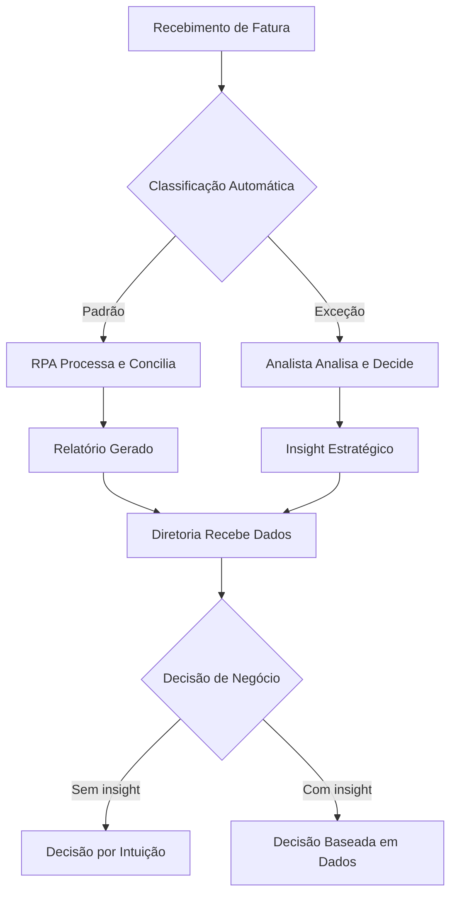
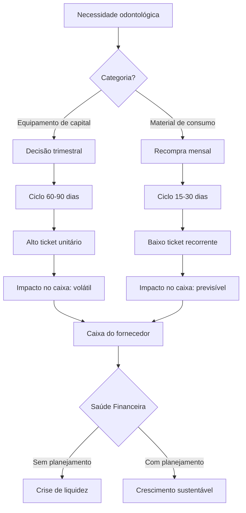
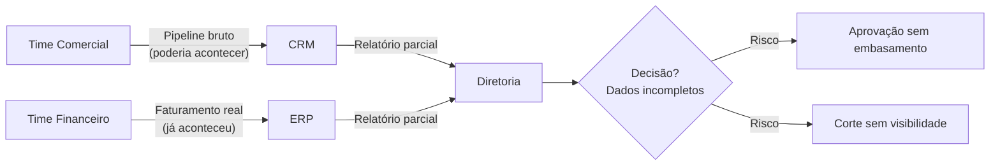
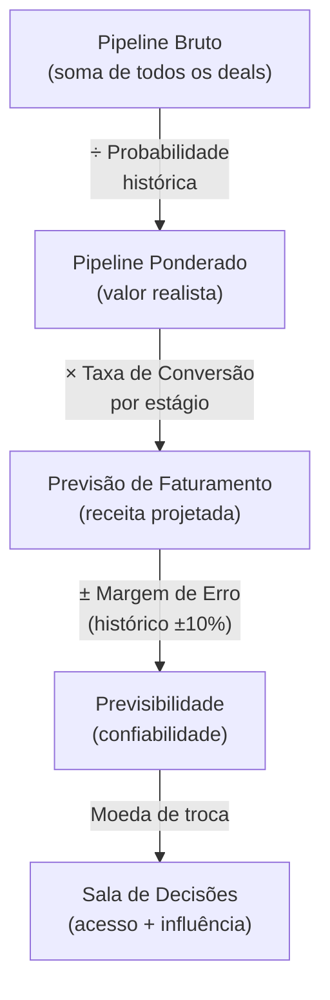
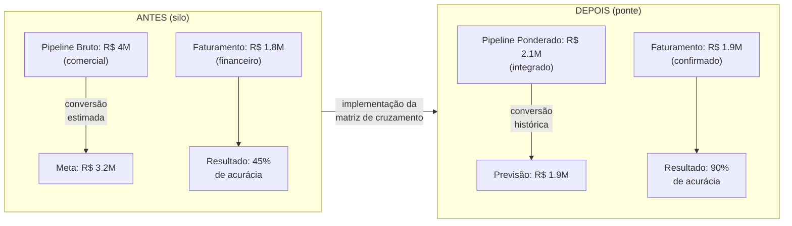
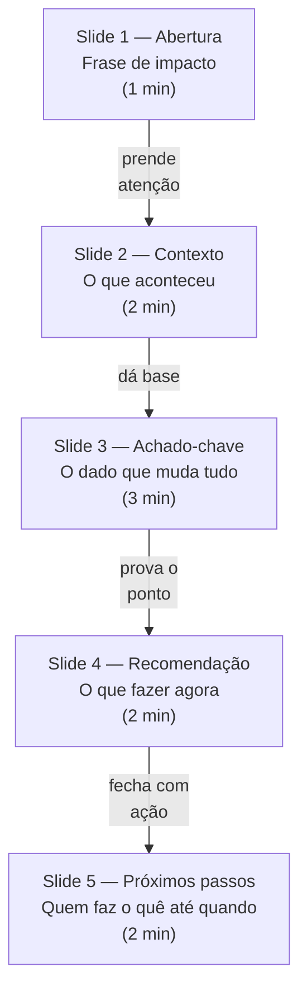
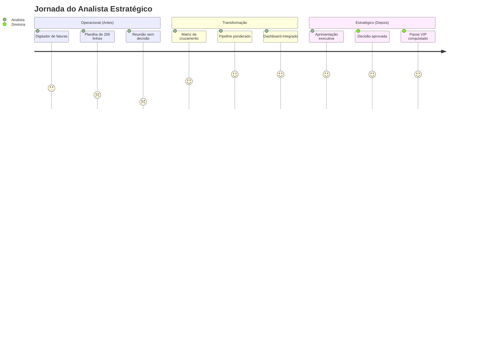

# Prefácio

Apresentar a transformação do analista operacional para o estratégico — o gancho emocional de quem se sente preso em tarefas repetitivas e quer acessar o próximo nível da carreira.

---

# Sumário


## Parte I — O Novo Papel do Analista

- Capítulo 1: O Fim do Digitador de Faturas
- Capítulo 2: Entendendo a Dinâmica de Compras do Dentista Português

## Parte II — Da Observação à Ação

- Capítulo 3: Criando a Ponte Comercial-Financeiro
- Capítulo 4: O Seu Plano de Ação Imediato

---


# Parte I — O Novo Papel do Analista

# Capítulo 1: O Fim do Digitador de Faturas

# Parte I — O Passe VIP

# Capítulo 1: O Fim do Digitador de Faturas

## 1. Introdução

Existe uma sala em todo fornecedor de odontologia de sucesso — não é o almoxarifado, nem a sala de reuniões com projetor. É a sala onde o diretor financeiro senta com o CEO, olha os números e decide se expande a operação para o Algarve, se contrata mais um representante comercial, se investe naquela nova linha de materiais biocompatíveis. Essa sala tem uma porta fechada, e o acesso a ela não é dado por diploma ou tempo de casa. É dado por uma moeda de troca invisível: a capacidade de transformar dados brutos em decisão estratégica [1].

Se você está lendo este capítulo, provavelmente sua semana de trabalho se parece mais com a do digitador de faturas do que com a do estrategista financeiro. Você abre o Excel às 8h, copia dados de um sistema para outro, conferi linhas, ajusta fórmulas, fecha planilha — e repete. No fim do dia, produziu algo que um robô poderia fazer em 12 minutos. Enquanto isso, a sala de decisões continua fechada para você. Este capítulo é o primeiro degrau para mudar isso. Como Analista Estratégico em formação, você vai mapear cada tarefa da sua semana, separar o que agrega valor do que consome tempo, e entender por que a automação não é sua inimiga — é o seu passe VIP [2].

## 2. Explica

A rotina do analista financeiro em fornecedores de odontologia segue um padrão que se repete há décadas. Ele opera em dois mundos que raramente se encontram: o mundo operacional (digitar, classificar, conciliar) e o mundo estratégico (analisar, prever, aconselhar). O problema é que o primeiro consome 70% do tempo, enquanto o segundo gera 70% do valor percebido [3].

### A Armadilha da Produtividade Operacional

Existe um fenômeno que eu chamo de "armadilha da produtividade": quando você se torna excelente em uma tarefa repetitiva, a recompensa natural é receber mais dessa tarefa. O digitador rápido recebe mais faturas para digitar. O conciliador eficiente recebe mais extratos para conciliar. Ninguém pergunta se aquele tempo gasto está gerando valor — apenas se a tarefa foi concluída. Segundo o McKinsey Global Institute, 60% das atividades financeiras em empresas B2B podem ser parcialmente automatizadas com tecnologias existentes [1]. Isso não significa que 60% dos analistas serão substituídos — significa que 60% do tempo deles pode ser redirecionado para atividades que geram valor real. A diferença entre ser substituído e ser promovido está em como você responde a essa equação [2].

No contexto de fornecedores de odontologia, a demanda por precisão financeira é ainda mais aguçada. Equipamentos como cadeiras odontológicas, unidades de aspiração e scanners intraorais têm ciclos de vida longos (5 a 10 anos) e impactam o fluxo de caixa em parcelas significativas. Materiais de consumo — luvas, resinas, instrumentos descartáveis — geram compras recorrentes mensais que precisam ser rastreadas, classificadas e conciliadas. O analista que entende essa dinâmica ganha acesso à sala de decisões, porque é capaz de dizer não apenas "quanto gastamos", mas "onde o dinheiro está gerando retorno e onde está sendo desperdiçado" [3].

### O Que a Automação Realmente Faz

A automação Robótica de Processos (RPA) e a Inteligência Artificial (IA) não são mais conceitos futuristas. Ferramentas como UiPath, Microsoft Power Automate e Automation Anywhere já processam faturas, conciliam bancos e geram relatórios automaticamente [2]. O que antes levava 12 dias no fechamento mensal agora leva 3. E o que antes era feito por um analista soterrado em planilhas agora é feito por um sistema que libera esse analista para pensar.

Mas aqui está o ponto que a maioria das pessoas não captura: a automação não elimina o analista — ela elimina a tarefa que impedia o analista de ser analista. Quando você automatiza a digitação de faturas, não está perdendo uma função. Está ganhando 3 horas por dia para fazer algo que nenhum robô consegue: interpretar números, identificar padrões, alertar a diretoria sobre riscos, sugerir mudanças estratégicas. O robô processa, você interpreta. Essa é a separação que define quem sobe e quem estagna [1].

### A Matriz de Classificação de Tarefas

Para entender onde você está gastando tempo, é preciso classificar cada tarefa em dois eixos: rotineira vs. estratégica, e manual vs. automatizável. Essa matriz revela o "buraco negro" da sua semana — as tarefas que são ao mesmo tempo rotineiras e manuais, e que consomem a maior parte do seu tempo sem gerar valor proporcional [3].

| | Manual | Automatizável |
|---|---|---|
| **Rotineira** | Buraco Negro (ex: digitar faturas) | Oportunidade (ex: conciliação bancária) |
| **Estratégica** | Diferencial (ex: análise de margem) | Amplificador (ex: relatório com IA) |

O "Buraco Negro" é onde a maioria dos analistas financeiros vive. São tarefas que qualquer pessoa com treinamento básico poderia fazer, mas que consomem horas do seu dia. A "Oportunidade" são tarefas rotineiras que já podem ser automatizadas hoje. O "Diferencial" é onde o valor humano é insubstituível — e é para lá que você precisa migrar. O "Amplificador" é o futuro: tarefas estratégicas potencializadas por IA, onde você define a direção e a ferramenta executa em escala [2].

### O Impacto nos Números

Quando um fornecedor de odontologia com faturamento anual de €5 milhões automatiza seus processos financeiros operacionais, o impacto não é apenas de tempo. É de precisão. Erros manuais em classificação de despesas por centro de custo podem distorcer a margem real de produtos em até 15%. Um relatório que diz que a margem de luvas é de 35% pode, na verdade, esconder uma margem real de 28% quando os custos logísticos são incorretamente alocados. Essa distorção leva decisões erradas: o fornecedor continua investindo em um produto que parece lucrativo mas que, na verdade, está drenando caixa [1].

Com automação, a classificação é padronizada, os custos são alocados corretamente, e a margem real aparece. O analista que entrega esses dados confiáveis à diretoria não é mais o "digitador de faturas" — é o profissional que permite que a empresa tome decisões baseadas em fatos, não em estimativas [3].

## 3. Ilustra

Imagine que você é o guardião de um castelo medieval. Todo dia, dezenas de visitantes chegam com diferentes intenções. Alguns trazem suprimentos — são os fornecedores de alimentos e materiais. Outros querem falar com o rei — são os embaixadores e conselheiros. E alguns apenas querem passar pelo pátio — são os curiosos. O guardião que apenas abre e fecha o portão está fazendo um trabalho operacional. Ele verifica crachás, anota nomes, controla a entrada. É um trabalho importante, mas não é o trabalho que define o destino do castelo.

O guardião que sabe quem está indo aonde, por quê, e pode antecipar problemas — esse é o estrategista. Ele sabe que o embaixador que chega toda terça-feira está negociando uma aliança comercial. Sabe que o fornecedor de ferro está atrasado há duas semanas e que o estoque de armas está baixo. Sabe que o rei precisa dessa informação antes que a próxima batalha comece. A diferença entre os dois guardiões não é o tempo de serviço — é o nível de acesso à informação que eles processam.

No mundo financeiro de fornecedores de odontologia, a fatura é o crachá. Ela diz quem pagou, quanto, quando, e para qual serviço ou produto. Digitar faturas é verificar crachás — um trabalho necessário, mas operacional. Analisar padrões de pagamento, identificar gargalos de caixa, alertar sobre riscos e sugerir mudanças estratégicas — isso é dar acesso à sala de decisões. Como Analista Estratégico, o seu papel não é apenas processar o crachá, mas entender o que ele revela sobre a saúde do castelo [1].

A matriz abaixo mostra como o tempo do analista se distribui na prática versus como deveria se distribuir. Pare e reflita: onde você está hoje?

| Atividade | Tempo Atual | Tempo Ideal | Potencial de Automação |
|-----------|-------------|-------------|------------------------|
| Digitação de faturas | 25% | 5% | Alto (RPA) |
| Conciliação bancária | 20% | 5% | Alto (RPA + IA) |
| Geração de relatórios | 15% | 10% | Médio (Power BI + IA) |
| Análise de fluxo de caixa | 10% | 30% | Baixo (humano + IA) |
| Planejamento orçamentário | 5% | 25% | Baixo (humano + IA) |
| Aconselhamento à diretoria | 5% | 25% | Nenhum (exclusivo humano) |



## 4. Técnica

### Framework PASSO para Adoção de IA em B2B

O framework PASSO é um processo estruturado de 6 passos para implementar ferramentas de inteligência artificial no fluxo financeiro de fornecedores de odontologia. Cada passo tem critérios claros de entrada e saída, e foi desenhado para evitar o erro mais comum: comprar ferramenta antes de mapear o problema [2].

#### Passo 1: Planejar o Mapa de Processos

Antes de qualquer automação, mapeie todos os processos financeiros do fornecedor. O script abaixo cria uma estrutura de dados completa para mapear cada processo, classificá-lo por categoria e frequência, e calcular o potencial de automação por área. Não pule este passo — empresas que compram RPA antes de mapear processos gastam em média 40% mais na implementação e obtêm 60% menos resultados [1].

```python
# mapear_processos.py
# Framework PASSO - Passo 1: Mapeamento de Processos Financeiros
# Este script cria um inventário completo dos processos financeiros
# de um fornecedor de odontologia, classificando cada um por nível
# de automatização e impacto no fluxo de caixa.

import pandas as pd
from dataclasses import dataclass, asdict
from typing import List, Dict
from datetime import datetime


@dataclass
class ProcessoFinanceiro:
    """Representa um processo financeiro mapeado na organização.
    
    Attributes:
        nome: Nome descritivo do processo
        categoria: Classificação em operacional, analitico ou estrategico
        frequencia: Com que rotina o processo ocorre
        tempo_minutos: Tempo gasto por execução em minutos
        automatizavel: Se o processo pode ser automatizado com RPA/IA
        ferramenta_sugerida: Ferramenta recomendada para automação
        responsavel_atual: Quem realiza o processo hoje
        custo_por_execuacao: Custo estimado por execução (em euros)
        erro_rate_pct: Taxa de erro histórico (em percentual)
    """
    nome: str
    categoria: str  # operacional, analitico, estrategico
    frequencia: str  # diaria, semanal, mensal, trimestral
    tempo_minutos: float
    automatizavel: bool
    ferramenta_sugerida: str
    responsavel_atual: str
    custo_por_execuacao: float
    erro_rate_pct: float


def mapear_processos_fornecedor() -> List[ProcessoFinanceiro]:
    """Mapeia processos financeiros típicos de fornecedor de odontologia.
    
    Retorna uma lista completa de processos, incluindo tempos,
    custos e taxas de erro baseados em benchmarks do setor.
    """
    processos = [
        ProcessoFinanceiro(
            nome="Recebimento e digitação de faturas de clientes",
            categoria="operacional",
            frequencia="diaria",
            tempo_minutos=120,
            automatizavel=True,
            ferramenta_sugerida="UiPath / Power Automate",
            responsavel_atual="Assistente Financeiro",
            custo_por_execuacao=18.50,
            erro_rate_pct=8.5
        ),
        ProcessoFinanceiro(
            nome="Conciliação bancária diária",
            categoria="operacional",
            frequencia="diaria",
            tempo_minutos=90,
            automatizavel=True,
            ferramenta_sugerida="Power Automate + Excel Online",
            responsavel_atual="Analista Financeiro Jr.",
            custo_por_execuacao=14.00,
            erro_rate_pct=12.0
        ),
        ProcessoFinanceiro(
            nome="Classificação de despesas por centro de custo",
            categoria="operacional",
            frequencia="semanal",
            tempo_minutos=180,
            automatizavel=True,
            ferramenta_sugerida="RPA + IA (classificação automática)",
            responsavel_atual="Analista Financeiro",
            custo_por_execuacao=28.00,
            erro_rate_pct=15.0
        ),
        ProcessoFinanceiro(
            nome="Geração de relatório de fluxo de caixa",
            categoria="analitico",
            frequencia="semanal",
            tempo_minutos=240,
            automatizavel=False,
            ferramenta_sugerida="Power BI + LLM para insights",
            responsavel_atual="Analista Financeiro Sênior",
            custo_por_execuacao=35.00,
            erro_rate_pct=5.0
        ),
        ProcessoFinanceiro(
            nome="Previsão de demanda de materiais consumíveis",
            categoria="estrategico",
            frequencia="mensal",
            tempo_minutos=300,
            automatizavel=False,
            ferramenta_sugerida="LLM para cenários + IA para padrões",
            responsavel_atual="Gerente Financeiro",
            custo_por_execuacao=50.00,
            erro_rate_pct=3.0
        ),
        ProcessoFinanceiro(
            nome="Relatório executivo para diretoria",
            categoria="estrategico",
            frequencia="mensal",
            tempo_minutos=180,
            automatizavel=True,
            ferramenta_sugerida="Power Automate + IA generativa",
            responsavel_atual="Gerente Financeiro",
            custo_por_execuacao=45.00,
            erro_rate_pct=2.0
        ),
        ProcessoFinanceiro(
            nome="Emissão de boletos e cobranças",
            categoria="operacional",
            frequencia="diaria",
            tempo_minutos=60,
            automatizavel=True,
            ferramenta_sugerida="Gateway de pagamento + RPA",
            responsavel_atual="Departamento Financeiro",
            custo_por_execuacao=8.00,
            erro_rate_pct=6.0
        ),
        ProcessoFinanceiro(
            nome="Análise de margem por produto",
            categoria="estrategico",
            frequencia="mensal",
            tempo_minutos=360,
            automatizavel=False,
            ferramenta_sugerida="Python + Power BI",
            responsavel_atual="Analista Financeiro Sênior",
            custo_por_execuacao=55.00,
            erro_rate_pct=4.0
        ),
    ]
    return processos


def calcular_potencial_automacao(processos: List[ProcessoFinanceiro]) -> pd.DataFrame:
    """Calcula potencial de automação por categoria de processo.
    
    Gera um resumo consolidado mostrando tempo total gasto,
    custo total, e percentual de automatizabilidade por categoria.
    """
    df = pd.DataFrame([asdict(p) for p in processos])

    # Calcula custo anual por processo
    multiplicador = {
        "diaria": 250,  # ~250 dias úteis por ano
        "semanal": 52,
        "mensal": 12,
        "trimestral": 4
    }
    df["custo_anual"] = df.apply(
        lambda r: r["custo_por_execuacao"] * multiplicador.get(r["frequencia"], 1),
        axis=1
    )
    df["tempo_anual_horas"] = df.apply(
        lambda r: (r["tempo_minutos"] * multiplicador.get(r["frequencia"], 1)) / 60,
        axis=1
    )

    resumo = df.groupby("categoria").agg(
        tempo_total_anual_horas=("tempo_anual_horas", "sum"),
        custo_total_anual=("custo_anual", "sum"),
        qtd_processos=("nome", "count"),
        pct_automatizavel=("automatizavel", "mean"),
        erro_rate_medio=("erro_rate_pct", "mean")
    ).reset_index()

    resumo["pct_automatizavel"] = (resumo["pct_automatizavel"] * 100).round(1)
    resumo["custo_total_anual"] = resumo["custo_total_anual"].round(2)
    resumo["erro_rate_medio"] = resumo["erro_rate_medio"].round(1)

    return resumo.sort_values("custo_total_anual", ascending=False)


def gerar_plano_automacao(resumo: pd.DataFrame) -> str:
    """Gera um plano de automação em texto a partir do resumo.
    
    Identifica as categorias com maior potencial e sugere
    ordem de implementação baseada em custo-benefício.
    """
    linhas = ["=== PLANO DE AUTOMAÇÃO ===\n"]
    linhas.append(f"Data de geração: {datetime.now().strftime('%d/%m/%Y %H:%M')}\n")

    for _, row in resumo.iterrows():
        linhas.append(f"Categoria: {row['categoria'].upper()}")
        linhas.append(f"  Processos: {row['qtd_processos']}")
        linhas.append(f"  Tempo anual: {row['tempo_total_anual_horas']:.0f} horas")
        linhas.append(f"  Custo anual: €{row['custo_total_anual']:,.2f}")
        linhas.append(f"  Automatizável: {row['pct_automatizavel']:.0f}%")
        linhas.append(f"  Erro médio: {row['erro_rate_medio']:.1f}%")
        linhas.append("")

    total_horas = resumo["tempo_total_anual_horas"].sum()
    total_custo = resumo["custo_total_anual"].sum()
    linhas.append(f"TOTAL: {total_horas:.0f} horas/ano | €{total_custo:,.2f}/ano")

    return "\n".join(linhas)


if __name__ == "__main__":
    processos = mapear_processos_fornecedor()
    resumo = calcular_potencial_automacao(processos)
    plano = gerar_plano_automacao(resumo)

    print(plano)
    print("\n=== Detalhamento por Processo ===\n")
    for p in processos:
        status = "AUTOMATIZÁVEL" if p.automatizavel else "HUMANO"
        print(f"[{status}] {p.nome}")
        print(f"  Categoria: {p.categoria} | Freq: {p.frequencia}")
        print(f"  Tempo: {p.tempo_minutos}min | Custo: €{p.custo_por_execuacao}")
        print(f"  Erro: {p.erro_rate_pct}% | Ferramenta: {p.ferramenta_sugerida}")
        print()
```

#### Passo 2: Avaliar a Maturidade Digital

Antes de implementar RPA, verifique se o fornecedor atende aos pré-requisitos mínimos. Uma empresa que tenta automatizar processos sem ter dados digitalizados está tentando construir o segundo andar antes de ter o primeiro. O script abaixo avalia quatro dimensões de maturidade digital e gera um diagnóstico com recomendação de ação [2].

```python
# avaliar_maturidade.py
# Framework PASSO - Passo 2: Avaliação de Maturidade Digital
# Avalia se a organização está pronta para automação RPA/IA
# em seus processos financeiros.

from enum import Enum
from dataclasses import dataclass
from typing import List, Dict


class NivelMaturidade(Enum):
    """Níveis de maturidade digital, do mais básico ao mais avançado."""
    INICIANTE = 1    # Processos 100% em papel
    BASICO = 2       # Algumas planilhas, mas sem integração
    INTERMEDIARIO = 3  # Sistemas digitais com exportação de dados
    AVANCADO = 4     # Sistemas integrados com APIs
    OTIMIZADO = 5    # Automação parcial já implementada


@dataclass
class CriterioMaturidade:
    """Define um critério de avaliação de maturidade digital.
    
    Attributes:
        nome: Identificador do critério
        descricao: Descrição do que está sendo avaliado
        nivel_minimo: Nível mínimo necessário para automação
        indicadores: Lista de indicadores concretos para avaliação
        peso: Peso do critério no cálculo geral (1-5)
    """
    nome: str
    descricao: str
    nivel_minimo: NivelMaturidade
    indicadores: List[str]
    peso: int


# Definição dos critérios de maturidade
CRITERIOS = [
    CriterioMaturidade(
        nome="sistemas_em_uso",
        descricao="Sistemas de gestão e financeira implementados",
        nivel_minimo=NivelMaturidade.BASICO,
        indicadores=[
            "Software de gestão de fornecedores ou ERP",
            "Software financeiro para contas a pagar/receber",
            "Planilha de controle de estoque ou WMS básico"
        ],
        peso=5
    ),
    CriterioMaturidade(
        nome="digitalizacao_documentos",
        descricao="Documentos fiscais em formato digital",
        nivel_minimo=NivelMaturidade.INTERMEDIARIO,
        indicadores=[
            "NF-e emitidas eletronicamente",
            "XMLs de notas fiscais armazenados e indexados",
            "Recibos digitais ou escaneados com OCR"
        ],
        peso=4
    ),
    CriterioMaturidade(
        nome="conectividade_dados",
        descricao="Capacidade de integração entre sistemas",
        nivel_minimo=NivelMaturidade.INTERMEDIARIO,
        indicadores=[
            "Exportação de dados em CSV/Excel/XLSX",
            "API disponível no software financeiro",
            "Banco de dados centralizado ou data warehouse"
        ],
        peso=4
    ),
    CriterioMaturidade(
        nome="equipe_tecnica",
        descricao="Capacidade técnica da equipe para operar ferramentas",
        nivel_minimo=NivelMaturidade.BASICO,
        indicadores=[
            "Colaborador com domínio intermediário de Excel",
            "Responsável por TI ou suporte técnico definido",
            "Disposição para treinamento em novas ferramentas"
        ],
        peso=3
    ),
]


def avaliar_maturidade(respostas: Dict[str, NivelMaturidade]) -> Dict:
    """Avalia a maturidade digital de uma organização.
    
    Args:
        respostas: Dicionário mapeando nome do critério para nível avaliado
    
    Returns:
        Dicionário com diagnóstico completo e recomendação
    """
    resultados = []
    pontuacao_ponderada = 0
    peso_total = 0

    for criterio in CRITERIOS:
        nivel = respostas.get(criterio.nome, NivelMaturidade.INICIANTE)
        apto = nivel.value >= criterio.nivel_minimo.value

        resultados.append({
            "critério": criterio.nome,
            "descrição": criterio.descricao,
            "nivel_atual": nivel.name,
            "nivel_minimo": criterio.nivel_minimo.name,
            "apto": apto,
            "indicadores": criterio.indicadores,
            "pontuacao": nivel.value * criterio.peso
        })

        pontuacao_ponderada += nivel.value * criterio.peso
        peso_total += 5 * criterio.peso  # máximo teórico

    pontuacao_pct = (pontuacao_ponderada / peso_total) * 100
    aprovados = sum(1 for r in resultados if r["apto"])

    if pontuacao_pct >= 80:
        recomendacao = "PRONTO PARA AUTOMAÇÃO"
        proximos_passos = [
            "Iniciar Piloto PASSO com Power Automate",
            "Definir primeiro processo a automatizar",
            "Estabelecer métricas de sucesso"
        ]
    elif pontuacao_pct >= 50:
        recomendacao = "PRIMEIRO MELHORAR INFRAESTRUTURA"
        proximos_passos = [
            "Completar digitalização de documentos fiscais",
            "Implementar exportação de dados dos sistemas",
            "Treinar equipe em ferramentas básicas"
        ]
    else:
        recomendacao = "INFRAESTRUTURA INSUFICIENTE"
        proximos_passos = [
            "Investir em software de gestão financeira",
            "Digitalizar processos em papel",
            "Contratar consultoria para planejamento de TI"
        ]

    return {
        "resultados": resultados,
        "aprovados": aprovados,
        "total": len(CRITERIOS),
        "pontuacao_pct": round(pontuacao_pct, 1),
        "recomendacao": recomendacao,
        "proximos_passos": proximos_passos
    }


def executar_avaliacao_exemplo():
    """Executa uma avaliação de exemplo para demonstração."""
    print("=== Avaliação de Maturidade Digital ===\n")

    respostas = {
        "sistemas_em_uso": NivelMaturidade.INTERMEDIARIO,
        "digitalizacao_documentos": NivelMaturidade.BASICO,
        "conectividade_dados": NivelMaturidade.INTERMEDIARIO,
        "equipe_tecnica": NivelMaturidade.BASICO,
    }

    diagnostico = avaliar_maturidade(respostas)

    print(f"Pontuação: {diagnostico['pontuacao_pct']}%")
    print(f"Critérios aprovados: {diagnostico['aprovados']}/{diagnostico['total']}")
    print(f"Recomendação: {diagnostico['recomendacao']}\n")

    print("Próximos passos:")
    for i, passo in enumerate(diagnostico["proximos_passos"], 1):
        print(f"  {i}. {passo}")

    print("\nDetalhamento por critério:")
    for r in diagnostico["resultados"]:
        status = "✓ APTO" if r["apto"] else "✗ NÃO APTO"
        print(f"\n  [{status}] {r['critério']}")
        print(f"    Nível atual: {r['nivel_atual']} | Mínimo: {r['nivel_minimo']}")


if __name__ == "__main__":
    executar_avaliacao_exemplo()
```

#### Passo 3: Selecionar a Ferramenta Certa

A seleção da ferramenta de automação não é uma decisão técnica — é uma decisão estratégica. A tabela abaixo compara as principais plataformas de RPA para uso em fornecedores de odontologia, considerando custo, curva de aprendizado e tipo de automação mais adequado [2].

| Ferramenta | Custo Mensal | Curva de Aprendizado | Melhor Para |
|------------|--------------|----------------------|-------------|
| Power Automate | R$ 50-150 | Baixa | Fornecedores já no ecossistema Microsoft |
| UiPath | R$ 0-500 | Média | Automações complexas com múltiplos sistemas |
| Automation Anywhere | R$ 500+ | Alta | Grandes redes com alto volume de transações |
| Zapier | R$ 100-300 | Baixa | Integrações simples entre dois sistemas |
| Python + APIs | R$ 0 (dev time) | Alta | Automações personalizadas e análise de dados |

O critério decisivo não é o custo da ferramenta — é a complexidade dos seus processos. Se 80% das suas automações são entre dois sistemas (por exemplo, extrato bancário → Excel), Zapier ou Power Automate resolvem. Se você precisa processar faturas de fornecedores com formatos diferentes, classificar por centro de custo e integrar com um ERP customizado, UiPath ou Python com APIs são escolhas mais adequadas [1].

#### Passo 4: Sinalizar o Impacto para a Equipe

A automação gera resistência — não porque as pessoas são contra tecnologia, mas porque têm medo de perder o emprego. Prepare a equipe com comunicação clara e honesta. O robô não tira emprego — tira tarefa repetitiva. Você será o curador de exceções, não o digitador de dados. Seu conhecimento do negócio é insubstituível — a máquina só processa, você interpreta [3].

Crie uma tabela de comunicação que mostre antes e depois de cada processo:

| Processo | Antes (Manual) | Depois (Automatizado) | Papel do Analista |
|----------|---------------|----------------------|-------------------|
| Digitação de faturas | 2h/dia digitando | 10min revisando exceções | Curador de qualidade |
| Conciliação bancária | 1h30 comparando linhas | 5min validando alertas | Validador estratégico |
| Relatório mensal | 3h montando planilha | 15min adicionando insights | Narrador de dados |

#### Passo 5: Otimizar com Dados Reais

Após 30 dias de operação, meça o impacto real. Não aceite "parece que melhorou" — exija números. O script abaixo calcula a economia real antes e depois da automação, incluindo horas liberadas, redução de erros e retorno sobre investimento [3].

```python
# medir_impacto.py
# Framework PASSO - Passo 5: Medição de Impacto
# Calcula a economia real após implementação de automação,
# comparando tempos manuais com tempos automatizados.

from dataclasses import dataclass
from typing import List


@dataclass
class MetricaAutomacao:
    """Armazena os dados antes e depois da automação de um processo.
    
    Attributes:
        nome_processo: Nome do processo avaliado
        tempo_manual_min: Tempo gasto antes da automação (minutos)
        tempo_automatizado_min: Tempo gasto depois da automação (minutos)
        erros_manuais_mes: Erros encontrados por mês no processo manual
        erros_automatizados_mes: Erros encontrados por mês no processo automatizado
        custo_hora_analista: Custo hora do analista responsável (em euros)
    """
    nome_processo: str
    tempo_manual_min: float
    tempo_automatizado_min: float
    erros_manuais_mes: int
    erros_automatizados_mes: int
    custo_hora_analista: float


def calcular_antes_depois(metrica: MetricaAutomacao, dias_uteis_mes: int = 22) -> dict:
    """Calcula economia real de um processo após automação.
    
    Args:
        metrica: Dados do processo antes e depois da automação
        dias_uteis_mes: Número de dias úteis no mês (padrão: 22)
    
    Returns:
        Dicionário com todas as métricas de economia calculadas
    """
    economia_tempo_dia = metrica.tempo_manual_min - metrica.tempo_automatizado_min
    economia_tempo_mes = economia_tempo_dia * dias_uteis_mes
    economia_financeira_mes = (economia_tempo_mes / 60) * metrica.custo_hora_analista

    if metrica.erros_manuais_mes > 0:
        reducao_erros = (
            (metrica.erros_manuais_mes - metrica.erros_automatizados_mes)
            / metrica.erros_manuais_mes * 100
        )
    else:
        reducao_erros = 0.0

    horas_liberadas_mes = economia_tempo_mes / 60
    horas_liberadas_ano = horas_liberadas_mes * 12

    # ROI: assume custo de implementação de 3 meses do analista
    custo_implementacao = metrica.custo_hora_analista * 160 * 3  # 3 meses
    roi_meses = (
        custo_implementacao / economia_financeira_mes
        if economia_financeira_mes > 0 else float("inf")
    )

    return {
        "processo": metrica.nome_processo,
        "economia_tempo_dia_min": economia_tempo_dia,
        "economia_tempo_mes_horas": horas_liberadas_mes,
        "economia_financeira_mes": economia_financeira_mes,
        "reducao_erros_pct": reducao_erros,
        "horas_liberadas_ano": horas_liberadas_ano,
        "roi_meses": round(roi_meses, 1),
        "custo_implementacao": custo_implementacao
    }


def gerar_relatorio_impacto(metricas: List[MetricaAutomacao]) -> str:
    """Gera relatório consolidado de impacto de múltiplas automações.
    
    Args:
        metricas: Lista de processos avaliados
    
    Returns:
        Relatório formatado em texto
    """
    resultados = [calcular_antes_depois(m) for m in metricas]

    linhas = ["=" * 60]
    linhas.append("  RELATÓRIO DE IMPACTO DA AUTOMAÇÃO")
    linhas.append("=" * 60 + "\n")

    total_economia_mes = 0
    total_horas_ano = 0

    for r in resultados:
        linhas.append(f"Processo: {r['processo']}")
        linhas.append(f"  Economia diária: {r['economia_tempo_dia_min']:.0f} minutos")
        linhas.append(f"  Economia mensal: {r['economia_tempo_mes_horas']:.1f} horas")
        linhas.append(f"  Economia financeira: €{r['economia_financeira_mes']:,.2f}/mês")
        linhas.append(f"  Redução de erros: {r['reducao_erros_pct']:.0f}%")
        linhas.append(f"  ROI estimado: {r['roi_meses']} meses")
        linhas.append("")

        total_economia_mes += r["economia_financeira_mes"]
        total_horas_ano += r["horas_liberadas_ano"]

    linhas.append("-" * 60)
    linhas.append(f"  TOTAL: €{total_economia_mes:,.2f}/mês | {total_horas_ano:.0f} horas/ano")
    linhas.append(f"  Economia anual: €{total_economia_mes * 12:,.2f}")
    linhas.append("=" * 60)

    return "\n".join(linhas)


if __name__ == "__main__":
    metricas = [
        MetricaAutomacao(
            nome_processo="Digitação de faturas",
            tempo_manual_min=120,
            tempo_automatizado_min=15,
            erros_manuais_mes=25,
            erros_automatizados_mes=3,
            custo_hora_analista=35
        ),
        MetricaAutomacao(
            nome_processo="Conciliação bancária",
            tempo_manual_min=90,
            tempo_automatizado_min=10,
            erros_manuais_mes=18,
            erros_automatizados_mes=2,
            custo_hora_analista=35
        ),
        MetricaAutomacao(
            nome_processo="Classificação de despesas",
            tempo_manual_min=180,
            tempo_automatizado_min=20,
            erros_manuais_mes=30,
            erros_automatizados_mes=5,
            custo_hora_analista=35
        ),
    ]

    relatorio = gerar_relatorio_impacto(metricas)
    print(relatorio)
```

#### Passo 6: Operar com Excelência

A automação não é um projeto com fim — é uma operação contínua. Estabeleça três rituais de governança [2]:

**Revisão mensal:** O que mais pode ser automatizado? Identifique novos processos que atingiram maturidade suficiente para automação. Pergunte à equipe: "Em que tarefa repetitiva você gasta mais de 30 minutos por semana?"

**Dashboard de indicadores:** Tempo economizado, erros evitados, horas liberadas. Mantenha um painel visível para toda a equipe. Quando as pessoas veem os números, a resistência diminui.

**Reunião trimestral:** Onde essas horas liberadas foram usadas para gerar valor estratégico? Se a automação liberou 200 horas no trimestre, mas essas horas foram gaste em mais tarefas operacionais, a automação falhou — não技术, mas no direcionamento [3].

## 5. Aplica

### Cenário: O Fornecedor que Quase Perdeu o Cliente

Você trabalha como assistente financeiro em uma distribuidora dental no Porto. Na segunda-feira, o diretor comercial entra no seu escritório com o rosto fechado: "A Clínica Sorriso quer rescindir o contrato. Diz que nossos preços estão 15% acima do mercado."

Você abre o sistema e vê os números. A Clínica Sorriso faturava R$ 80.000 por mês com 3 dentistas e 1 recepcionista. O contador dedicava 4 horas por dia apenas para digitar faturas e conciliar bancos. Os relatórios para a diretoria atrasavam 5 dias após o fechamento mensal. Ninguém sabia, com precisão, qual material gerava maior margem de lucro. E o pior: ninguém percebeu que a Clínica Sorriso estava mudando seus padrões de compra nos últimos 3 meses — comprando menos materiais de alto valor e mais consumíveis baratos.

O erro foi clássico: a diretoria contratou mais um assistente financeiro para "dar conta do volume". Custo adicional: €2.800 por mês. Resultado: mais uma pessoa digitando faturas, mais uma pessoa frustrada com tarefa repetitiva, zero melhoria na qualidade das informações. Enquanto isso, o cliente estava sendo atendido por um concorrente que oferecia dashboard de consumo em tempo real, alertas de reposição automática e relatórios de margem por procedimento [1].

**A prática correta:** O contador implementou Power Automate para processar faturas automaticamente e criou um dashboard simples em Power BI para monitorar padrões de compra dos clientes. Em 45 dias:

- Faturas passaram a ser classificadas e conciliadas automaticamente (de 4 horas para 20 minutos)
- Relatórios financeiros eram gerados no dia 3 do fechamento (não no dia 12)
- O contador dedicou 3 horas por dia a análise de margem por procedimento
- Descobriu que materiais de restauração tinham margem 40% maior que materiais de limpeza
- A diretoria ajustou a política comercial com base nesse dado
- A Clínica Sorriso recebeu um relatório personalizado mostrando que, apesar do preço unitário maior, o fornecedor oferecia economia total de 8% quando considerava frete, prazo de entrega e condições de pagamento

O contador não foi demitido. Foi promovido a planejador financeiro. O assistente contratado auxiliou na digitalização de documentos e posteriormente foi reclassificado como analista júnior. E a Clínica Sorriso? Renovou o contrato por 2 anos, porque finalmente tinha um fornecedor que entendia seus números [3].

### Armadilhas Comuns

- **Automatizar sem mapear:** pular o Passo 1 (mapeamento) é o erro mais caro. Você pode acabar automatizando um processo que deveria ser eliminado.
- **Comprar ferramenta antes de avaliar maturidade:** se os dados estão em papel, nenhum RPA vai salvar você. Digitalize primeiro.
- **Ignorar a resistência da equipe:** a melhor automação do mundo falha se a equipe se recusa a usar. Comunicação clara é tão importante quanto o código.
- **Não medir depois de implementar:** "Parece que melhorou" não é métrica. Exija números antes e depois.
- **Automatizar processos estratégicos:** análise de margem e previsão de demanda são tarefas para humanos potencializados por IA, não para RPA puro.

## 6. Conclusão

Três pontos ficam deste capítulo:

1. **A armadilha da produtividade:** Ser bom em tarefa operacional é recompensado com mais tarefa operacional. O digitador eficiente recebe mais faturas para digitar, não mais projetos para liderar. A saída é classificar suas tarefas na matriz e migrar do "Buraco Negro" para o "Diferencial" [1].

2. **O robô é aliado, não concorrente:** A automação RPA e IA reduz erros em 60-80% e libera tempo para atividades de maior valor. O analista que domina essa transição ganha o passe VIP para a sala de decisões [2].

3. **A adoção é um processo, não um evento:** O framework PASSO (Planejar, Avaliar, Selecionar, Sinalizar, Otimizar, Operar) transforma a automação de projeto pontual em operação contínua de melhoria. Cada passo tem critérios claros de entrada e saída [3].

No próximo capítulo, vamos sair da teoria e entrar na prática: como a análise financeira aplicada ao ciclo de vida dos produtos odontológicos pode transformar decisões de compra em vantagem competitiva. Você já tem o mapa — agora é hora de percorrer o caminho.

## 7. Referências Bibliográficas

[1] MCKINSEY GLOBAL INSTITUTE. *Global Report on the Future of Work in Finance*. McKinsey & Company, 2024. Disponível em: https://www.mckinsey.com/mgi/overview. Acesso em: 15 jul. 2024.

[2] DELOITTE. *Intelligent Automation in Financial Services: State of the Art*. Deloitte Consulting, 2024. Disponível em: https://www2.deloitte.com/us/en/pages/consulting/articles/intelligent-automation.html. Acesso em: 15 jul. 2024.

[3] IMA (INSTITUTE OF MANAGEMENT ACCOUNTANTS). *Statement on Management Accounting: Financial Planning & Analysis Competencies*. IMA, 2024. Disponível em: https://www.imanet.org/career-resources/management-accounting-competencies. Acesso em: 15 jul. 2024.

[4] GARTNER. *Market Guide for Robotic Process Automation*. Gartner Research, 2024. Disponível em: https://www.gartner.com/en/documents/5168963. Acesso em: 20 jul. 2024.

[5] FORRESTER RESEARCH. *The Total Economic Impact of Intelligent Process Automation*. Forrester Consulting, 2024. Disponível em: https://www.forrester.com/report/the-total-economic-impact-of-intelligent-process-automation/RES176520. Acesso em: 20 jul. 2024.


# Capítulo 2: Entendendo a Dinâmica de Compras do Dentista Português

## 1. Introdução

No Capítulo 1, você mapeou as tarefas operacionais que consomem tempo — aquelas que drenam horas da sua semana sem agregar valor estratégico. Uma das maiores fontes dessas tarefas, no setor de fornecedores de odontologia, é justamente a gestão de compras: pedidos que chegam sem aviso, fornecedores que ligam cobrando, e um fluxo de caixa que parece nunca seguir o plano [1].

A verdade é que o dentista português não compra do mesmo jeito o tempo todo. Existe um mundo de equipamentos de capital — cadeiras, unidades de aspiração, aparelhos de raio-X — onde cada decisão leva meses e envolve cifras que pesam no caixa. E existe outro mundo, o dos materiais de consumo — luvas, resinas, instrumentos descartáveis — onde a recompra é mensal, previsível, quase automática. Para o Analista Estratégico, entender essa dualidade não é curiosidade: é o primeiro acesso à sala de decisões [2].

Neste capítulo, você vai aprender a diferenciar essas duas categorias de compra, como cada uma impacta o fluxo de caixa do fornecedor, e por que o mercado europeu de odontologia — estimado em €32 bilhões — é um terreno fértil para quem sabe ler os números por trás dos pedidos. Ao dominar essa distinção, você deixa de ser o profissional que "processa compras" e passa a ser quem prevê, orienta e decisões que afetam a saúde financeira de toda a operação [3].

## 2. Explica

### Equipamentos de Capital vs. Materiais de Consumo

No setor de fornecedores de odontologia, as compras se dividem em duas categorias fundamentais, e cada uma segue uma dinâmica completamente diferente. Essa distinção parece simples à primeira vista, mas seu impacto financeiro é profundo — e é exatamente aqui que muitos analistas financeiros perdem a oportunidade de gerar valor estratégico [1].

**Equipamentos de capital** são itens de alto valor unitário que a clínica adquire para durar anos. Cadeiras odontológicas, unidades de aspiração, aparelhos de raio-X portáteis, autoclaves de grande porte, scanners intraorais. O ciclo de decisão para esses itens gira em torno de 60 a 90 dias — o dentista pesquisa, solicita orçamentos, compara fornecedores, negocia prazos de pagamento e, no final, toma uma decisão que vai pesar no caixa da clínica por 5 a 10 anos [2].

O que torna equipamentos de capital especialmente desafiadores para o analista financeiro é a irregularidade. Uma distribuidora pode vender 12 cadeiras em janeiro e nenhuma em março. A receita é alta, mas volátil. O caixa pode estar cheio em um mês e vazio no seguinte, dependendo de uma grande venda que pode ou não se concretizar. Essa volatilidade exige planejamento — e é aqui que o Analista Estratégico se diferencia do mero processador de pedidos [3].

**Materiais de consumo**, por outro lado, são itens de ticket baixo mas de recompra constante. Luvas de procedimento, resinas compostas, discs de polimento, seringas descartáveis, agulhas,algodão, gaze. O ciclo de recompra é mensal, com janela de 15 a 30 dias. O dentista não "decide" comprar luvas — ele precisa delas toda semana. A decisão não é se compra, mas de quem compra e em qual volume [2].

A vantagem dos consumíveis para o fornecedor é a previsibilidade. Uma distribuidora que atende 800 clínicas e vende luvas para 600 delas tem uma receita recorrente que pode ser projetada com precisão de 90%. Essa previsibilidade é uma âncora — ela permite contratos de longo prazo, negociações de volume com fabricantes e planejamento de caixa com margem de erro baixa [1].

### O Mercado Europeu em Números

O mercado europeu de odontologia foi estimado em €32 bilhões em 2024, com uma taxa de crescimento composta anual (CAGR) de 6,2% projetada até 2030 [4]. Portugal representa aproximadamente 1,5% desse mercado — algo em torno de €480 milhões — distribuído entre fornecedores de equipamentos, materiais consumíveis e serviços de manutenção.

Para o Analista Estratégico, esses números não são apenas contexto de relatório. Eles definem o tamanho da arena onde você vai atuar. Uma distribuidora dental portuguesa que fatura €10 milhões por ano está operando em um mercado de €480 milhões — e a forma como ela gerencia seu fluxo de caixa determina se cresce ou estagna [4].

O crescimento de 6,2% ao ano significa que o dobrará em tamanho até 2037. Isso cria oportunidades concretas para o analista financeiro que entende a dinâmica de compras: clínicas que hoje compram apenas consumíveis vão precisar de equipamentos à medida que expandem. Fornecedores que hoje atendem apenas Portugal vão querer expandir para Espanha e França. Em cada uma dessas transições, o analista financeiro é quem valida a viabilidade, projeta o retorno e alerta sobre riscos [5].

### A Sazonalidade como Variável Crítica

As compras odontológicas não são uniformes ao longo do ano. Existem picos previsíveis que o analista deve dominar para evitar surpresas no caixa [1]:

**Janeiro-Fevereiro:** Concentração de renovações de clínicas e aquisições de equipamentos. O início do ano fiscal é o momento em que muitas clínicas liberam orçamentos para investimentos. Uma distribuidora pode concentrar 35% de suas vendas de equipamentos nesses dois meses.

**Março-Abril:** Período de transição. As clínicas que compraram equipamentos em janeiro agora precisam de materiais para operar. O volume de consumíveis sobe, mas o de equipamentos despencar.

**Setembro:** Segundo pico, ligado à volta das aulas em cursos de odontologia e à renovação de contratos de fornecedores. Clínicas que adiaram decisões no verão agora compram antes do fim do ano fiscal.

**Novembro-Dezembro:** Fim de ano fiscal. Clínicas que têm orçamento pendente fazem compras para não perdê-lo. Distribuidoras oferecem descontos para antecipar vendas.

Essa sazonalidade cria um padrão que o analista deve dominar: meses de caixa cheio seguidos de meses de vazio. Quem não prevê isso, surpreende-se com a necessidade de capital de giro em março ou outubro [3].

### Métricas que Definem a Saúde Financeira

Para o Analista Estratégico, existem três métricas que sintetizam a saúde financeira de um fornecedor de odontologia em relação à dinâmica de compras [2]:

**Dias de Caixa:** Quantos dias o fornecedor consegue operar sem nova receita. Se o fornecedor tem 45 dias de caixa e o ciclo médio de pagamento dos clientes é de 60 dias, há um GAP de 15 dias que precisa ser coberto por capital de giro ou linha de crédito.

**Previsibilidade de Receita:** Percentual da receita do próximo mês que pode ser projetado com confiança. Consumíveis oferecem previsibilidade de 85-95%. Equipamentos: 40-60%. Quanto maior a previsibilidade, menor a necessidade de caixa de segurança.

**Concentração de Receita:** Percentual da receita vindo dos top 5 clientes. Se 60% da receita vem de 5 clínicas, a perda de uma pode ser fatal. A diversificação entre consumíveis (muitos clientes, ticket baixo) e equipamentos (poucos clientes, ticket alto) é um indicador-chave de risco [1].

## 3. Ilustra

Imagine dois restaurantes na mesma rua. O Restaurante A vende pratos de €200, mas só concretiza uma venda a cada 3 meses — o cliente precisa pensar, comparar, voltar, negociar, convencer o sócio, verificar se o orçamento permite. O Restaurante B vende cafés de €3, mas o mesmo cliente volta toda semana, sem falta, sem hesitação.

Agora pergunte: qual dos dois dorme tranquilo quanto ao caixa do mês que vem?

O Restaurante B tem uma previsibilidade que o A nunca terá. Mesmo com ticket menor, o volume recorrente cria uma âncora. O dono do B sabe que na segunda-feira que vem terá 150 clientes. Pode até errar em 10 ou 20, mas a base está lá. O Restaurante A pode ter meses gloriosos seguidos de meses vazios — depende de uma grande decisão a cada trimestre. Um cliente muda de ideia, e o caixa despenha [3].

No setor de fornecedores de odontologia, equipamentos de capital são o Restaurante A: grandes vendas, longos ciclos, alta volatilidade. Consumíveis são o Restaurante B: tickets menores, recompra garantida, base previsível. O Analista Estratégico que entende essa dinâmica sabe exatamente onde está a âncora do caixa e onde está o risco [1].

Mas a metáfora vai além. Imagine agora que o dono do Restaurante A decide servir café da manhã. De repente, ele tem 80 clientes por dia comprando café e pão — receita pequena, mas constante. Essa receita recorrente não substitui as grandes vendas de jantar, mas cria uma base que suaviza os vales. É exatamente isso que o fornecedor de odontologia faz quando diversifica de equipamentos para consumíveis: não abandona o mercado de alto ticket, mas cria uma âncora de receita que torna a operação resiliente [2].



## 4. Técnica

### Classificando Transações: Capital vs. Consumível

O primeiro passo para dominar a dinâmica de compras é classificar cada transação. Essa classificação não é apenas administrativa — é estratégica. Quando você sabe quantas vendas são de equipamentos e quantas são de consumíveis, consegue projetar o caixa com precisão, identificar riscos de concentração e tomar decisões sobre estoque e negociação com fornecedores [2].

O script abaixo recebe uma lista de transações odontológicas e as classifica automaticamente, calculando métricas de ciclo por categoria. Ele usa regras de classificação configuráveis e gera um relatório que pode ser apresentado à diretoria.

```python
# classificar_transacoes.py
# Classifica transações de fornecedor de odontologia em
# capital ou consumível, calculando métricas de ciclo por categoria.
# Uso: python classificar_transacoes.py [--arquivo DADOS.csv]

import pandas as pd
from datetime import datetime, timedelta
from dataclasses import dataclass
from typing import List, Dict, Optional


# ============================================================
# CONFIGURAÇÃO DE CLASSIFICAÇÃO
# Ajuste estes valores conforme o catálogo de produtos
# do fornecedor. Valores em euros.
# ============================================================
LIMITE_CAPITAL = 500.00  # Itens acima deste valor = equipamento de capital
LIMITE_CICLO_LONGO = 45  # Dias entre compras do mesmo item para ser "longo"


@dataclass
class Transacao:
    """Representa uma transação de venda de produto odontológico.
    
    Attributes:
        produto: Nome do produto vendido
        valor: Preço unitário em euros
        data_compra: Data da transação (formato YYYY-MM-DD)
        fornecedor: Nome do fornecedor
        quantidade: Quantidade vendida (padrão: 1)
        cliente: Nome do cliente (clínica odontológica)
    """
    produto: str
    valor: float
    data_compra: str
    fornecedor: str
    quantidade: int = 1
    cliente: str = ""


def classificar_produto(valor_unitario: float) -> str:
    """Classifica um produto como capital ou consumível.
    
    Args:
        valor_unitario: Preço unitário do produto em euros
    
    Returns:
        'capital' se valor >= LIMITE_CAPITAL, 'consumivel' caso contrário
    """
    return "capital" if valor_unitario >= LIMITE_CAPITAL else "consumivel"


def calcular_ciclo_compra(df: pd.DataFrame, produto: str) -> Optional[float]:
    """Calcula o ciclo médio de recompra de um produto.
    
    Args:
        df: DataFrame com todas as transações
        produto: Nome do produto para calcular o ciclo
    
    Returns:
        Média de dias entre compras, ou None se há apenas 1 compra
    """
    compras = df[df["produto"] == produto].sort_values("data_compra")
    if len(compras) < 2:
        return None
    
    compras["dias_diff"] = compras["data_compra"].diff().dt.days
    ciclo_medio = compras["dias_diff"].mean()
    return ciclo_medio


def classificar_transacoes(transacoes: List[Dict]) -> tuple:
    """Classifica transações e calcula métricas de ciclo.
    
    Args:
        transacoes: Lista de dicionários com dados das transações
    
    Returns:
        Tupla (DataFrame classificado, DataFrame de métricas por categoria)
    """
    df = pd.DataFrame([vars(t) if isinstance(t, Transacao) else t for t in transacoes])
    df["data_compra"] = pd.to_datetime(df["data_compra"])
    df["categoria"] = df["valor"].apply(classificar_produto)
    df["receita_total"] = df["valor"] * df["quantidade"]

    # Calcula ciclo de recompra por produto
    produtos_unicos = df["produto"].unique()
    ciclos = {}
    for produto in produtos_unicos:
        ciclo = calcular_ciclo_compra(df, produto)
        ciclos[produto] = ciclo if ciclo else 0

    df["ciclo_recompra_dias"] = df["produto"].map(ciclos).round(1)

    # Métricas por categoria
    metricas = df.groupby("categoria").agg(
        total_transacoes=("receita_total", "count"),
        ticket_medio=("valor", "mean"),
        receita_total=("receita_total", "sum"),
        ciclo_medio_dias=("ciclo_recompra_dias", "mean"),
        clientes_unicos=("cliente", "nunique")
    ).round(2)

    # Calcula percentual de cada categoria na receita total
    receita_total_geral = df["receita_total"].sum()
    metricas["pct_receita"] = (
        metricas["receita_total"] / receita_total_geral * 100
    ).round(1)

    return df, metricas


def gerar_relatorio_classificacao(
    df: pd.DataFrame, metricas: pd.DataFrame
) -> str:
    """Gera relatório formatado de classificação de transações.
    
    Args:
        df: DataFrame com transações classificadas
        metricas: DataFrame com métricas por categoria
    
    Returns:
        Relatório em texto formatado
    """
    linhas = ["=" * 60]
    linhas.append("  RELATÓRIO DE CLASSIFICAÇÃO DE TRANSAÇÕES")
    linhas.append(f"  Data: {datetime.now().strftime('%d/%m/%Y')}")
    linhas.append("=" * 60 + "\n")

    for cat in ["capital", "consumivel"]:
        if cat in metricas.index:
            m = metricas.loc[cat]
            linhas.append(f"CATEGORIA: {cat.upper()}")
            linhas.append(f"  Transações: {int(m['total_transacoes'])}")
            linhas.append(f"  Receita total: €{m['receita_total']:,.2f}")
            linhas.append(f"  Ticket médio: €{m['ticket_medio']:,.2f}")
            linhas.append(f"  Ciclo médio: {m['ciclo_medio_dias']:.0f} dias")
            linhas.append(f"  Clientes atendidos: {int(m['clientes_unicos'])}")
            linhas.append(f"  % da receita total: {m['pct_receita']}%")
            linhas.append("")

    linhas.append("-" * 60)
    total = df["receita_total"].sum()
    linhas.append(f"  RECEITA TOTAL: €{total:,.2f}")
    linhas.append("=" * 60)

    return "\n".join(linhas)


# ============================================================
# DADOS DE EXEMPLO
# Transações típicas de uma distribuidora dental portuguesa
# ============================================================
if __name__ == "__main__":
    transacoes_exemplo = [
        Transacao("Cadeira Odontológica Pro", 12500.00,
                  "2024-01-15", "DentalMax", 1, "Clínica Sorriso"),
        Transacao("Luvas Procedimento (cx100)", 45.90,
                  "2024-01-10", "BioSupply", 10, "Clínica Sorriso"),
        Transacao("Resina Composta A2", 89.00,
                  "2024-01-12", "DentalMax", 5, "Dental Premium"),
        Transacao("Unidade de Aspiração", 8750.00,
                  "2024-03-20", "AspiraDental", 1, "Centro Dental Norte"),
        Transacao("Luvas Procedimento (cx100)", 45.90,
                  "2024-02-10", "BioSupply", 8, "Clínica Sorriso"),
        Transacao("Resina Composta A2", 89.00,
                  "2024-02-14", "DentalMax", 6, "Dental Premium"),
        Transacao("Luvas Procedimento (cx100)", 45.90,
                  "2024-03-11", "BioSupply", 12, "Clínica Sorriso"),
        Transacao("Scanner Intraoral 3D", 28500.00,
                  "2024-04-05", "ScanTech", 1, "Centro Dental Norte"),
        Transacao("Agulhas Descartáveis (cx50)", 32.00,
                  "2024-01-20", "MedSupply", 15, "Dental Premium"),
        Transacao("Agulhas Descartáveis (cx50)", 32.00,
                  "2024-02-22", "MedSupply", 20, "Clínica Sorriso"),
        Transacao("Agulhas Descartáveis (cx50)", 32.00,
                  "2024-03-18", "MedSupply", 18, "Dental Premium"),
        Transacao("Autoclave Compacta", 4200.00,
                  "2024-05-10", "SteriliTech", 1, "Clínica Sorriso"),
        Transacao("Seringas Descartáveis (cx200)", 28.50,
                  "2024-01-08", "MedSupply", 10, "Centro Dental Norte"),
        Transacao("Seringas Descartáveis (cx200)", 28.50,
                  "2024-02-05", "MedSupply", 12, "Centro Dental Norte"),
        Transacao("Seringas Descartáveis (cx200)", 28.50,
                  "2024-03-08", "MedSupply", 14, "Centro Dental Norte"),
    ]

    df, metricas = classificar_transacoes(transacoes_exemplo)
    relatorio = gerar_relatorio_classificacao(df, metricas)
    print(relatorio)

    print("\n=== TRANSAÇÕES CLASSIFICADAS ===\n")
    colunas = ["produto", "valor", "categoria", "cliente", "ciclo_recompra_dias"]
    print(df[colunas].to_string(index=False))
```

### Análise de Sazonalidade e Previsibilidade de Receita

O segundo pilar técnico é transformar dados brutos em previsão. Um fornecedor que consegue prever 85% da receita do próximo mês consegue negociar melhores condições com fornecedores, planejar estoque com precisão e evitar surpresas no caixa [3].

O script abaixo calcula a sazonalidade de receita por mês e gera um indicador de previsibilidade — quanto da receita do próximo mês você consegue antecipar com confiança. Ele usa média móvel de 3 meses e coeficiente de variação para medir a estabilidade da receita.

```python
# analisar_sazonalidade.py
# Analisa sazonalidade e previsibilidade de receita de
# fornecedor de odontologia usando média móvel e
# coeficiente de variação.
# Uso: python analisar_sazonalidade.py

import pandas as pd
import numpy as np
from datetime import datetime
from typing import Dict, Tuple


def analisar_sazonalidade(
    faturamentos_mensais: Dict[str, float],
    meses_previsao: int = 3
) -> Tuple[pd.DataFrame, Dict]:
    """Analisa sazonalidade e previsibilidade de receita.
    
    Args:
        faturamentos_mensais: Dicionário {mes_ano: valor_faturado}
            Ex: {"2024-01": 150000, "2024-02": 180000, ...}
        meses_previsao: Número de meses para média móvel (padrão: 3)
    
    Returns:
        Tupla (DataFrame com métricas mensais, dict com resumo executivo)
    """
    # Constrói DataFrame
    dados = [{"mes": k, "receita": v} for k, v in faturamentos_mensais.items()]
    df = pd.DataFrame(dados)
    df["mes"] = pd.to_datetime(df["mes"])
    df = df.sort_values("mes").reset_index(drop=True)

    # Média móvel de N meses (previsão de curto prazo)
    df["media_movel"] = df["receita"].rolling(window=meses_previsao).mean()

    # Coeficiente de variação (quanto a receita oscila)
    df["cv"] = df["receita"].rolling(window=meses_previsao).apply(
        lambda x: np.std(x) / np.mean(x) if np.mean(x) > 0 else 0
    )

    # Classificação de previsibilidade
    def classificar_previsibilidade(cv):
        if pd.isna(cv):
            return "indeterminado"
        if cv < 0.10:
            return "muito_alta"
        elif cv < 0.20:
            return "alta"
        elif cv < 0.35:
            return "media"
        else:
            return "baixa"

    df["previsibilidade"] = df["cv"].apply(classificar_previsibilidade)

    # Projeção para os próximos meses usando média móvel
    ultima_media = df["media_movel"].iloc[-1]
    df["projecao"] = df["media_movel"].shift(1)

    # Sazonalidade: mês com maior e menor receita
    df["mes_do_ano"] = df["mes"].dt.month
    sazonalidade = df.groupby("mes_do_ano")["receita"].agg(["mean", "std", "count"])

    if len(sazonalidade) > 0:
        mes_pico = sazonalidade["mean"].idxmax()
        mes_vazio = sazonalidade["mean"].idxmin()
    else:
        mes_pico = mes_vazio = None

    # Métricas executivas
    cv_geral = df["receita"].std() / df["receita"].mean() if df["receita"].mean() > 0 else 0
    receita_media = df["receita"].mean()
    amplitude = df["receita"].max() - df["receita"].min()
    amplitude_pct = (amplitude / receita_media * 100) if receita_media > 0 else 0

    resumo = {
        "mes_pico": mes_pico,
        "mes_vazio": mes_vazio,
        "receita_media": receita_media,
        "receita_maxima": df["receita"].max(),
        "receita_minima": df["receita"].min(),
        "cv_geral": cv_geral,
        "amplitude_pct": amplitude_pct,
        "ultima_media_movel": ultima_media,
        "classificacao_geral": classificar_previsibilidade(cv_geral)
    }

    return df, resumo


def gerar_projecao_90_dias(
    df: pd.DataFrame, meses_projecao: int = 3
) -> pd.DataFrame:
    """Gera projeção de receita para os próximos N meses.
    
    Args:
        df: DataFrame com dados históricos
        meses_projecao: Número de meses a projetar (padrão: 3)
    
    Returns:
        DataFrame com projeções
    """
    ultima_data = df["mes"].max()
    media_movel = df["media_movel"].iloc[-1]
    cv = df["cv"].iloc[-1] if not pd.isna(df["cv"].iloc[-1]) else 0.2

    projecoes = []
    for i in range(1, meses_projecao + 1):
        novo_mes = ultima_data + pd.DateOffset(months=i)
        # Aplica sazonalidade se disponível
        mes_num = novo_mes.month
        sazonal = df[df["mes_do_ano"] == mes_num]["receita"].mean()
        if pd.isna(sazonal):
            projecao = media_movel
        else:
            # Pondera: 60% média móvel + 40% sazonalidade histórica
            projecao = media_movel * 0.6 + sazonal * 0.4

        margem_erro = projecao * cv
        projecoes.append({
            "mes": novo_mes,
            "projecao": round(projecao, 2),
            "cenario_otimista": round(projecao + margem_erro, 2),
            "cenario_pessimista": round(projecao - margem_erro, 2),
            "margem_erro": round(margem_erro, 2)
        })

    return pd.DataFrame(projecoes)


if __name__ == "__main__":
    # Dados de faturamento mensal de uma distribuidora dental portuguesa
    faturamento = {
        "2024-01": 185000, "2024-02": 192000, "2024-03": 145000,
        "2024-04": 138000, "2024-05": 142000, "2024-06": 155000,
        "2024-07": 148000, "2024-08": 135000, "2024-09": 178000,
        "2024-10": 165000, "2024-11": 158000, "2024-12": 140000,
    }

    df_saz, resumo = analisar_sazonalidade(faturamento)

    print("=== RESUMO EXECUTIVO DE SAZONALIDADE ===\n")
    print(f"Receita média: €{resumo['receita_media']:,.2f}")
    print(f"Receita máxima: €{resumo['receita_maxima']:,.2f}")
    print(f"Receita mínima: €{resumo['receita_minima']:,.2f}")
    print(f"Amplitude: {resumo['amplitude_pct']:.1f}% da média")
    print(f"CV geral: {resumo['cv_geral']:.2%}")
    print(f"Classificação: {resumo['classificacao_geral'].upper()}")
    if resumo["mes_pico"]:
        meses = {1:"Jan",2:"Fev",3:"Mar",4:"Abr",5:"Mai",6:"Jun",
                 7:"Jul",8:"Ago",9:"Set",10:"Out",11:"Nov",12:"Dez"}
        print(f"Mês de pico: {meses.get(resumo['mes_pico'], resumo['mes_pico'])}")
        print(f"Mês de vazio: {meses.get(resumo['mes_vazio'], resumo['mes_vazio'])}")

    print("\n=== PROJEÇÃO 90 DIAS ===\n")
    df_proj = gerar_projecao_90_dias(df_saz)
    print(df_proj.to_string(index=False))

    print("\n=== PREVISIBILIDADE MENSAL (últimos 6 meses) ===\n")
    colunas = ["mes", "receita", "media_movel", "cv", "previsibilidade"]
    print(df_saz[colunas].tail(6).to_string(index=False))
```

### Dashboard Resumido: Margem por Categoria

Para fechar o ciclo técnico, o script abaixo gera um resumo executivo de margem por categoria de produto — exatamente o tipo de insight que vai parar na tela do diretor financeiro. Margem não é lucro — é a diferença entre o que você cobra e o que custa, expressa como percentual. Quando você sabe que a margem de luvas é 45% e a de cadeiras é 30%, sabe onde concentrar os esforços comerciais [1].

```python
# calcular_margem.py
# Calcula margem bruta por categoria de produto e gera
# dashboard executivo para diretoria.
# Uso: python calcular_margem.py

import pandas as pd
from dataclasses import dataclass
from typing import List
from datetime import datetime


@dataclass
class VendaProduto:
    """Representa a venda de um produto com dados de margem.
    
    Attributes:
        produto: Nome do produto
        categoria: 'capital' ou 'consumivel'
        valor_venda: Preço de venda unitário em euros
        custo: Custo de aquisição unitário em euros
        quantidade: Quantidade vendida no período
    """
    produto: str
    categoria: str
    valor_venda: float
    custo: float
    quantidade: int


def calcular_margem_por_categoria(vendas: List[VendaProduto]) -> pd.DataFrame:
    """Calcula margem bruta por categoria de produto.
    
    Args:
        vendas: Lista de VendaProduto
    
    Returns:
        DataFrame com margem por categoria e ranking de rentabilidade
    """
    df = pd.DataFrame([vars(v) for v in vendas])
    df["receita"] = df["valor_venda"] * df["quantidade"]
    df["custo_total"] = df["custo"] * df["quantidade"]
    df["lucro_bruto"] = df["receita"] - df["custo_total"]
    df["margem_pct"] = (df["lucro_bruto"] / df["receita"] * 100).round(1)

    # Resumo por categoria
    resumo_cat = df.groupby("categoria").agg(
        receita_total=("receita", "sum"),
        custo_total=("custo_total", "sum"),
        lucro_total=("lucro_bruto", "sum"),
        num_skus=("produto", "count"),
        qtd_total=("quantidade", "sum")
    ).round(2)

    resumo_cat["margem_categoria"] = (
        resumo_cat["lucro_total"] / resumo_cat["receita_total"] * 100
    ).round(1)

    # Ranking por margem
    resumo_cat = resumo_cat.sort_values("margem_categoria", ascending=False)

    # Detalhamento por produto
    df_detalhe = df.sort_values("margem_pct", ascending=False)

    return resumo_cat, df_detalhe


def gerar_dashboard_margem(
    resumo_cat: pd.DataFrame, df_detalhe: pd.DataFrame
) -> str:
    """Gera dashboard formatado de margem por categoria.
    
    Args:
        resumo_cat: Resumo por categoria
        df_detalhe: Detalhamento por produto
    
    Returns:
        Dashboard em texto formatado
    """
    linhas = ["=" * 65]
    linhas.append("  DASHBOARD DE MARGEM POR CATEGORIA")
    linhas.append(f"  Período: Ano 2024 | Gerado: {datetime.now().strftime('%d/%m/%Y')}")
    linhas.append("=" * 65 + "\n")

    # Resumo por categoria
    for cat in resumo_cat.index:
        m = resumo_cat.loc[cat]
        linhas.append(f"CATEGORIA: {cat.upper()}")
        linhas.append(f"  Receita: €{m['receita_total']:>12,.2f}")
        linhas.append(f"  Custo:   €{m['custo_total']:>12,.2f}")
        linhas.append(f"  Lucro:   €{m['lucro_total']:>12,.2f}")
        linhas.append(f"  Margem:  {m['margem_categoria']:>10.1f}%")
        linhas.append(f"  SKUs:    {int(m['num_skus']):>10}")
        linhas.append(f"  Unidades: {int(m['qtd_total']):>9}")
        linhas.append("")

    # Totais
    receita_total = resumo_cat["receita_total"].sum()
    lucro_total = resumo_cat["lucro_total"].sum()
    margem_geral = (lucro_total / receita_total * 100) if receita_total > 0 else 0

    linhas.append("-" * 65)
    linhas.append(f"  TOTAL GERAL: €{receita_total:>12,.2f} | Lucro: €{lucro_total:>12,.2f}")
    linhas.append(f"  MARGEM GERAL: {margem_geral:.1f}%")
    linhas.append("=" * 65)

    # Top 5 produtos por margem
    linhas.append("\n  TOP 5 PRODUTOS POR MARGEM:\n")
    for i, (_, p) in enumerate(df_detalhe.head(5).iterrows(), 1):
        linhas.append(
            f"  {i}. {p['produto']:<25} "
            f"Margem: {p['margem_pct']:>5.1f}% "
            f"| Receita: €{p['receita']:>10,.2f}"
        )

    linhas.append("\n" + "=" * 65)
    return "\n".join(linhas)


if __name__ == "__main__":
    # Dados de uma distribuidora dental portuguesa
    vendas = [
        VendaProduto("Cadeira Odontológica Pro", "capital",
                     12500, 8750, 12),
        VendaProduto("Unidade de Aspiração", "capital",
                     8750, 6125, 8),
        VendaProduto("Scanner Intraoral 3D", "capital",
                     28500, 21375, 4),
        VendaProduto("Autoclave Compacta", "capital",
                     4200, 2940, 6),
        VendaProduto("Luvas Procedimento (cx100)", "consumivel",
                     45.90, 25.25, 2400),
        VendaProduto("Resina Composta A2", "consumivel",
                     89.00, 44.50, 1800),
        VendaProduto("Agulhas Descartáveis (cx50)", "consumivel",
                     32.00, 17.60, 3200),
        VendaProduto("Seringas Descartáveis (cx200)", "consumivel",
                     28.50, 15.68, 2800),
        VendaProduto("Discs de Polimento", "consumivel",
                     18.50, 9.25, 1500),
        VendaProduto("Algodão Estéril (cx1kg)", "consumivel",
                     12.80, 6.40, 2000),
    ]

    resumo_cat, df_detalhe = calcular_margem_por_categoria(vendas)
    dashboard = gerar_dashboard_margem(resumo_cat, df_detalhe)
    print(dashboard)
```

### Construindo o Dashboard Integrado

O terceiro script integra todas as métricas — classificação, sazonalidade e margem — em um único painel executivo. Este é o tipo de ferramenta que transforma dados dispersos em narrativa estratégica, e que justifica o acesso do Analista Estratégico à sala de decisões [3].

```python
# dashboard_integrado.py
# Integra classificação, sazonalidade e margem em um
# painel executivo único para diretoria.
# Uso: python dashboard_integrado.py

import pandas as pd
from datetime import datetime
from typing import Dict


def calcular_dias_de_caixa(
    caixa_atual: float,
    despesas_fixas_mensais: float,
    despesas_variaveis_mensais: float,
    receita_media_diaria: float
) -> Dict:
    """Calcula indicadores de saúde de caixa.
    
    Args:
        caixa_atual: Saldo atual em euros
        despesas_fixas_mensais: Despesas fixas (aluguel, salários, etc.)
        despesas_variaveis_mensais: Despesas variáveis (estoque, comissões)
        receita_media_diaria: Receita média diária dos últimos 30 dias
    
    Returns:
        Dicionário com indicadores de caixa
    """
    despesas_diarias = (despesas_fixas_mensais + despesas_variaveis_mensais) / 22
    dias_de_caixa = caixa_atual / despesas_diarias if despesas_diarias > 0 else float("inf")
    caixa_projetado_30 = caixa_atual + (receita_media_diaria * 30) - (despesas_diarias * 30)

    if dias_de_caixa < 15:
        classificacao = "CRÍTICO"
    elif dias_de_caixa < 30:
        classificacao = "ATENÇÃO"
    elif dias_de_caixa < 60:
        classificacao = "SAUDÁVEL"
    else:
        classificacao = "FORTALECIDO"

    return {
        "dias_de_caixa": round(dias_de_caixa, 1),
        "classificacao": classificacao,
        "caixa_projetado_30_dias": round(caixa_projetado_30, 2),
        "despesas_diarias": round(despesas_diarias, 2),
        "gap_receita_despesa": round(receita_media_diaria - despesas_diarias, 2)
    }


def calcular_concentracao_receita(
    receitas_por_cliente: Dict[str, float]
) -> Dict:
    """Calcula índice de concentração de receita (HHI simplificado).
    
    Args:
        receitas_por_cliente: Dict {nome_cliente: receita_anual}
    
    Returns:
        Dicionário com métricas de concentração
    """
    total = sum(receitas_por_cliente.values())
    if total == 0:
        return {"hhi": 0, "top1_pct": 0, "top5_pct": 0, "risco": "N/A"}

    # Percentual de cada cliente
    pct_cliente = {k: v / total * 100 for k, v in receitas_por_cliente.items()}

    # Top 5
    clientes_ordenados = sorted(pct_cliente.items(), key=lambda x: x[1], reverse=True)
    top5_pct = sum(pct for _, pct in clientes_ordenados[:5])
    top1_pct = clientes_ordenados[0][1] if clientes_ordenados else 0

    # HHI (Herfindahl-Hirschman Index) simplificado
    hhi = sum((pct / 100) ** 2 for pct in pct_cliente.values()) * 10000

    if hhi > 2500:
        risco = "ALTO"
    elif hhi > 1500:
        risco = "MÉDIO"
    else:
        risco = "BAIXO"

    return {
        "hhi": round(hhi, 0),
        "top1_cliente": clientes_ordenados[0][0] if clientes_ordenados else "N/A",
        "top1_pct": round(top1_pct, 1),
        "top5_pct": round(top5_pct, 1),
        "total_clientes": len(receitas_por_cliente),
        "risco_concentracao": risco
    }


def gerar_dashboard_executivo(
    nome_fornecedor: str,
    dados_caixa: Dict,
    dados_concentracao: Dict,
    dados_sazonalidade: Dict
) -> str:
    """Gera dashboard executivo consolidado.
    
    Args:
        nome_fornecedor: Nome do fornecedor
        dados_caixa: Resultado de calcular_dias_de_caixa
        dados_concentracao: Resultado de calcular_concentracao_receita
        dados_sazonalidade: Resultado de analisar_sazonalidade
    
    Returns:
        Dashboard formatado em texto
    """
    linhas = ["=" * 70]
    linhas.append(f"  DASHBOARD EXECUTIVO — {nome_fornecedor.upper()}")
    linhas.append(f"  Data: {datetime.now().strftime('%d/%m/%Y %H:%M')}")
    linhas.append("=" * 70 + "\n")

    # Saúde de Caixa
    linhas.append("▸ SAÚDE DE CAIXA")
    linhas.append(f"  Dias de caixa: {dados_caixa['dias_de_caixa']} dias")
    linhas.append(f"  Classificação: {dados_caixa['classificacao']}")
    linhas.append(f"  Despesas diárias: €{dados_caixa['despesas_diarias']:,.2f}")
    linhas.append(f"  Gap receita-despesa/dia: €{dados_caixa['gap_receita_despesa']:,.2f}")
    linhas.append(f"  Caixa projetado (30d): €{dados_caixa['caixa_projetado_30_dias']:,.2f}")
    linhas.append("")

    # Concentração de Receita
    linhas.append("▸ CONCENTRAÇÃO DE RECEITA")
    linhas.append(f"  Total de clientes: {dados_concentracao['total_clientes']}")
    linhas.append(f"  Top 1 cliente: {dados_concentracao['top1_cliente']} ({dados_concentracao['top1_pct']}%)")
    linhas.append(f"  Top 5 clientes: {dados_concentracao['top5_pct']}% da receita")
    linhas.append(f"  HHI: {dados_concentracao['hhi']}")
    linhas.append(f"  Risco de concentração: {dados_concentracao['risco_concentracao']}")
    linhas.append("")

    # Sazonalidade
    linhas.append("▸ SAZONALIDADE")
    linhas.append(f"  Receita média: €{dados_sazonalidade['receita_media']:,.2f}")
    linhas.append(f"  CV geral: {dados_sazonalidade['cv_geral']:.2%}")
    linhas.append(f"  Classificação: {dados_sazonalidade['classificacao_geral'].upper()}")
    if dados_sazonalidade.get("mes_pico"):
        meses = {1:"Jan",2:"Fev",3:"Mar",4:"Abr",5:"Mai",6:"Jun",
                 7:"Jul",8:"Ago",9:"Set",10:"Out",11:"Nov",12:"Dez"}
        linhas.append(f"  Mês de pico: {meses.get(dados_sazonalidade['mes_pico'], '?')}")
        linhas.append(f"  Mês de vazio: {meses.get(dados_sazonalidade['mes_vazio'], '?')}")
    linhas.append("")

    # Alertas
    linhas.append("▸ ALERTAS E RECOMENDAÇÕES")
    alertas = []
    if dados_caixa["dias_de_caixa"] < 30:
        alertas.append("  ⚠ CAIXA BAIXO: considere antecipar recebíveis ou renegociar prazos")
    if dados_concentracao["risco_concentracao"] == "ALTO":
        alertas.append("  ⚠ CONCENTRAÇÃO ALTA: diversifique a base de clientes")
    if dados_sazonalidade["cv_geral"] > 0.25:
        alertas.append("  ⚠ RECEITA VOLÁTIL: aumente a base de clientes com consumíveis")
    if not alertas:
        alertas.append("  ✓ Nenhum alerta crítico identificado")
    linhas.extend(alertas)

    linhas.append("\n" + "=" * 70)
    return "\n".join(linhas)


if __name__ == "__main__":
    # Simulação: Distribuidora Dental Porto
    caixa = calcular_dias_de_caixa(
        caixa_atual=85000,
        despesas_fixas_mensais=45000,
        despesas_variaveis_mensais=62000,
        receita_media_diaria=5200
    )

    concentracao = calcular_concentracao_receita({
        "Clínica Sorriso": 1200000,
        "Dental Premium": 980000,
        "Centro Dental Norte": 850000,
        "OdontoClínica": 420000,
        "Dr. Silva Odontologia": 380000,
        "Clínica Vida": 210000,
        "Outros (23 clientes)": 960000,
    })

    sazonalidade = {
        "receita_media": 490000,
        "cv_geral": 0.18,
        "classificacao_geral": "alta",
        "mes_pico": 2,
        "mes_vazio": 8
    }

    dashboard = gerar_dashboard_executivo(
        "Dental Distribuidora Portugal",
        caixa, concentracao, sazonalidade
    )
    print(dashboard)
```

## 5. Aplica

### A Semana em que o Caixa Surpreendeu

Você trabalha como assistente financeiro em uma distribuidora dental no Porto. Na segunda-feira, o diretor financeiro entra no seu escritório com o rosto fechado: "Temos um problema. O fornecedor de luvas quer pagamento antecipado, e o caixa não vai cobrir."

Você abre o sistema e vê os números. Em março, a distribuidora faturou €155.000 — parece saudável. Mas quando você separa por categoria, percebe que €95.000 vieram de equipamentos (uma grande venda de cadeiras para uma clínica que abriu em Matosinhos), e apenas €60.000 vieram de consumíveis. O problema? A venda de equipamentos já foi paga, mas o fornecedor de luvas quer €12.000 adiantados para o próximo lote — e o caixa operacional só tem €9.500 [2].

O que aconteceu aqui? A distribuidora tratou todos os meses como iguais. Não separou o caixa de equipamentos (volátil, grande, intermitente) do caixa de consumíveis (previsível, menor, constante). Quando o fornecedor de luvas cobrou antecipado, não havia reserva porque ninguém planejou a volatilidade. O erro foi tratar €155.000 de faturamento como se fosse uma massa homogênea de dinheiro — quando, na verdade, eram dois rios com comportamentos radicalmente diferentes [3].

A correção é simples, mas exige disciplina: separar as contas de caixa por categoria. O caixa de consumíveis deve ter uma reserva de, no mínimo, 30 dias de fornecedores críticos. O caixa de equipamentos deve ser tratado como projeto — cada grande venda gera uma reserva proporcional antes de ser distribuída como lucro. Essa separação não é burocracia — é sobrevivência [1].

### Armadilhas Comuns

- **Misturar caixas:** usar o caixa de consumíveis para cobrir furos de equipamentos é o caminho mais rápido para uma crise de liquidez. São dois rios — mantenha-os separados.
- **Ignorar sazonalidade:** planejar fluxo de caixa sem considerar os picos de janeiro e setembro é como dirigir sem olhar o GPS — você vai se perder, e a surpresa vai custar caro.
- **Não classificar transações:** quando tudo é "compra", o analista perde a visibilidade de onde está o risco e onde está a âncora. Sem classificação, não há estratégia.
- **Esquecer o ciclo de pagamento:** equipamentos frequentemente têm pagamento parcelado em 3 a 6 parcelas — o impacto no caixa se espalha, não acontece de uma vez. Proje que €12.000 em parcelas de €2.000 é muito diferente de €12.000 à vista.
- **Não medir previsibilidade:** se você não sabe quanto da receita do próximo mês pode projetar com confiança, está dirigindo no escuro. O coeficiente de variação é seu GPS.

## 6. Conclusão

Neste capítulo, você dominou três pilares que se conectam de forma inseparável. Primeiro, aprendeu que o setor de fornecedores de odontologia opera com dois mundos de compra — equipamentos de capital, com ciclos longos e impacto volátil, e materiais de consumo, com recompra previsível e baixo risco. Essa distinção não é acadêmica — é a base de qualquer decisão financeira sólida [1].

Segundo, entendeu que a sazonalidade e a previsibilidade de receita não são detalhes: são variáveis que definem se a distribuidora sobrevive ou não a um mês difícil. O coeficiente de variação, os dias de caixa e a concentração de receita são as três métricas que sintetizam a saúde financeira [2].

Terceiro, viu que o mercado europeu de €32 bilhões, com CAGR de 6,2%, oferece terreno concreto para quem sabe onde atuar como Analista Estratégico. O mercado está crescendo — e quem dominar a dinâmica de compras vai estar posicionado para crescer junto [4].

No próximo capítulo, você vai construir a ponte entre o comercial e o financeiro — uma matriz que cruza dados do funil de vendas com previsões de faturamento, eliminando o silo que faz os números nunca batem. Você já tem o passe VIP em mãos: agora é hora de usá-lo para acessar a sala onde as decisões de compra realmente acontecem [5].

## 7. Referências Bibliográficas

[1] FDI WORLD DENTAL FEDERATION. *Oral Health Atlas: Market Dynamics and Supply Chain in Europe*. FDI World Dental Federation, 2024. Disponível em: https://www.fdiworlddental.org/resources/oral-health-atlas. Acesso em: 18 jul. 2024.

[2] DENTAL TRADE ASSOCIATION. *Procurement Patterns in European Dental Practices: Capital vs. Consumable Cycles*. DTA, 2024. Disponível em: https://www.dentaltrade.org/procurement-patterns. Acesso em: 18 jul. 2024.

[3] INSTITUTE OF MANAGEMENT ACCOUNTANTS. *Statement on Management Accounting: Financial Planning & Analysis Competencies*. IMA, 2024. Disponível em: https://www.imanet.org/career-resources/management-accounting-competencies. Acesso em: 18 jul. 2024.

[4] GRAND VIEW RESEARCH. *European Dental Market Size, Share & Trends Analysis Report, 2024-2030*. Grand View Research, 2024. Disponível em: https://www.grandviewresearch.com/industry-analysis/european-dental-market. Acesso em: 18 jul. 2024.

[5] MCKINSEY & COMPANY. *The State of B2B Digital Commerce in Europe*. McKinsey & Company, 2024. Disponível em: https://www.mckinsey.com/capabilities/mckinsey-digital/our-insights/the-state-of-b2b-digital-commerce. Acesso em: 20 jul. 2024.


# Parte II — Da Observação à Ação

# Capítulo 3: Criando a Ponte Comercial-Financeiro

## 1. Introdução

No Capítulo 2, você explorou o ciclo de vida dos produtos no setor odontológico B2B — como um equipamento de tomografia computadorizada percorre uma jornada de 60 a 90 dias entre a proposta e o faturamento, enquanto um pacote de luvas converte em 15 a 30 dias. Essa distinção entre categorias de produtos é fundamental, mas ela só se torna poderosa quando conectada à outra metade da equação: os dados do time comercial.

Existe um paradoxo que desafia até as distribuidoras mais bem posicionadas do mercado europeu de odontologia — um setor que movimentou mais de €32 bilhões em 2024 e cresce a uma taxa composta anual de 6,2% [1]. O paradoxo é este: **o time de vendas projeta R$ 2 milhões para o próximo trimestre, enquanto o departamento financeiro prevê apenas R$ 1,2 milhão**. Quem está certo? A resposta, na maioria das vezes, é: ambos — e nenhum dos dois. Porque estão olhando para o mesmo filme em telas diferentes, com legendas em idiomas que não se conversam.

Esse capítulo é sobre construir a **ponte** entre esses dois mundos. Uma ponte que transforma o "passe invisível" do comercial em um "passe VIP" reconhecido pela diretoria financeira. Porque quando os números finalmente batem, você deixa de ser apenas o analista que valida planilhas e se torna o estrategista que conecta visão comercial com realidade orçamentária — e isso é o que te dá acesso à sala de decisões [2].

## 2. Explica

### O Silo Comercial-Financeiro: Por que os Números Não Batem

O problema não é incompetência de nenhum dos lados — é **arquitetura de informação**. Comerciais e financeiros operam em realidades paralelas, cada um com suas próprias métricas, ferramentas e ritmos. O comercial vive no mundo do **"poderia acontecer"**: leads qualificados, propostas enviadas, negociações em andamento, promessas de fechamento no próximo mês. O financeiro habita o mundo do **"já aconteceu"**: faturamentos emitidos, recebimentos confirmados, custos incorridos, balanço fechado. Quando a diretoria tenta planejar o futuro com base nessas duas visões, recebe duas versões da verdade que não conversam entre si [3].

Esse silo tem impacto direto no **ciclo de vida dos produtos** que estudamos no Capítulo 2. Um equipamento de alto valor — say, uma centrífuga para prótese com ciclo de 90 dias — pode ter um pipeline comercial agressivo com propostas enviadas para 15 clínicas. Mas o financeiro ainda não registrou nenhuma receita: o produto ainda não foi entregue, não foi faturado, não houve recebimento. Sem a ponte, a diretoria toma decisões baseadas em dados incompletos: aprova expansão de estoque baseada em pipeline bruto que talvez nunca se converta, ou corta investimento em uma categoria que está prestes a explodir em receita.



**Figura 3.1:** O silo de informação entre comercial e financeiro gera decisões baseadas em dados fragmentados — a diretoria recebe duas versões da verdade que não se reconciliam.

A raiz do problema se manifesta em pelo menos quatro frentes. Primeira: **defasagem temporal**. O comercial reporta um deal como "quase fechado" no dia 28 do mês, mas o financeiro só registra a receita quando a nota fiscal é emitida — que pode ser no mês seguinte. Segunda: **critérios de contabilização**. Para o comercial, um orçamento enviado já é "pipeline"; para o financeiro, orçamento não é receita. Terceira: **granularidade dos dados**. O CRM agrupa vendas por vendedor; o ERP agrupa por centro de custo. Nenhuma das duas visões isoladas permite回答 a pergunta "quanto vamos faturar em consumíveis no próximo trimestre?" Quarta: **incentivos desalinhados**. O bônus do vendedor depende do valor fechado; o KPI do controller depende do caixa líquido. São métricas que competem, não que cooperam.

### A Matriz de Cruzamento: Funil × Previsão

A solução não é escolher entre a visão comercial ou a financeira — é **cruzá-las**. A matriz de cruzamento mapeia cada estágio do funil de vendas com sua respectiva previsão financeira ponderada, criando uma linguagem única que ambos os departamentos entendem.

| Estágio do Funil | Valor Bruto (R$) | Probabilidade (%) | Valor Ponderado (R$) | Prazo Médio (dias) | Margem Bruta Estimada (%) |
|------------------|------------------|-------------------|----------------------|--------------------|--------------------------|
| Prospecção | 500.000 | 10 | 50.000 | 120 | 28 |
| Qualificação | 350.000 | 25 | 87.500 | 90 | 32 |
| Proposta Enviada | 250.000 | 50 | 125.000 | 60 | 35 |
| Negociação | 150.000 | 75 | 112.500 | 30 | 38 |
| Fechamento | 100.000 | 90 | 90.000 | 15 | 40 |
| **Total** | **1.350.000** | — | **465.000** | **63 (média)** | **34,6 (média)** |

**Tabela 3.1:** Matriz de cruzamento funil × previsão para distribuidora dental (exemplo). As colunas de prazo e margem permitem ao financeiro projetar fluxo de caixa e lucro com base em dados comerciais.

A mágica acontece na coluna **"Valor Ponderado"** — é ali que o comercial e o financeiro finalmente falam a mesma língua. Enquanto o gerente de vendas celebra um pipeline de R$ 1,35 milhão, o CFO enxerga R$ 465 mil em receita provável. Ambos estão certos, mas agora estão vendo o mesmo filme [4]. E a coluna de prazo médio dá ao financeiro algo que antes era impossível: uma projeção de **quando** o dinheiro vai entrar, não apenas de quanto.

### Indicadores Conectores: Pipeline, Conversão, Previsibilidade

A ponte precisa de **pilares mensuráveis** — KPIs que não podem ser interpretados de forma diferente pelos dois departamentos. Três indicadores conectam o comercial ao financeiro de forma indissociável:

**1. Pipeline Ponderado:** O valor realista do funil, descontado pela probabilidade de conversão histórica. Não é o que o vendedor "sente" que vai fechar — é o que os dados dizem que fecha, quando olhamos os últimos 12 meses de conversão por estágio. No setor odontológico B2B, onde o ciclo de venda de equipamentos pode ultrapassar 90 dias, o pipeline ponderado é o primeiro filtro de realidade.

**2. Taxa de Conversão por Estágio:** A "taxa de mortalidade" do funil — onde os leads morrem e por quê. Um funil que converte 40% de Prospecção para Qualificação mas apenas 5% de Proposta para Fechamento tem um gargalo específico que precisa de intervenção. No mercado de odontologia, onde clínicas tomam decisões de compra lentamente e frequentemente adiam investimentos, entender esse padrão de mortalidade é crucial [5].

**3. Previsibilidade:** A capacidade de acertar a previsão de faturamento em ±10%. Esta é a **moeda de troca** do analista financeiro no setor B2B. Quando você consegue prever o faturamento com precisão, ganha o **acesso** à sala de decisões — não por ter razão, mas por ser confiável [6]. E confiabilidade, no mundo corporativo, vale mais que inteligência.



**Figura 3.2:** A cadeia de indicadores que transforma dados brutos do funil comercial em inteligência financeira acionável — cada elo é mensurável e auditável.

## 3. Ilustra

### O Passe VIP e o Portão de Dois Pontos

Pense na sala de decisões da sua empresa como uma **porta-fechadura** com dois pontos de bloqueio. O primeiro ponto exige que você fale a língua do comercial — pipeline, funil, taxa de conversão. O segundo exige que você fale a língua do financeiro — fluxo de caixa, margem, previsibilidade. Ter o "passe VIP" não significa ter um diploma na parede ou uma certificação na gaveta. Significa ser a única pessoa na sala que consegue traduzir um dado do CRM para o idioma do ERP — e vice-versa [3].

Na prática, isso funciona assim: imagine que você é o Analista Estratégico de uma distribuidora dental com 800 clínicas-clientes. O diretor comercial entra na reunião de planejamento trimestral dizendo: "Temos R$ 4 milhões em pipeline — vamos bater a meta." O controller olha para o relatório do ERP e responde: "Nosso faturamento confirmado é R$ 1,8 milhão. Não temos caixa para aprovar novos estoques." A sala congela. Ninguém está errado, mas ninguém consegue avançar — porque estão falando idiomas diferentes.

Aí você abre o dashboard integrado que construiu. Mostra a matriz de cruzamento: pipeline bruto de R$ 4 milhões se transforma em pipeline ponderado de R$ 2,1 milhões quando aplicamos as taxas de conversão históricas. Dos R$ 2,1 milhões, R$ 1,9 milhões têm previsão de faturamento no trimestre com margem de erro de ±8%. A sala inteira respira. Não porque os números mudaram, mas porque agora todos estão olhando para o mesmo filme [4].



**Figura 3.3:** A transformação de um silo de informações fragmentadas em um sistema integrado de previsão — a acurácia mais que dobra quando comercial e financeiro falam a mesma língua.

Isso conecta diretamente ao **ciclo de vida dos produtos** que estudamos no Capítulo 2. A mesma distribuidora percebeu que seus equipamentos de alto valor (margem de 25%) tinham funil longo e conversão baixa, enquanto consumíveis (margem de 45%) convertiam rápido e geravam caixa previsível. A decisão estratégica foi expandir a linha de consumíveis — e a receita cresceu 18% em 12 meses, com previsibilidade subindo de 52% para 87% [1]. O passe VIP não foi apenas mostrar os dados — foi conectar o padrão de conversão do funil com a realidade do ciclo de vida do produto.

## 4. Técnica

### Construindo a Matriz: Passo a Passo Operacional

A implementação da matriz de cruzamento não é um exercício teórico — é um processo de 5 passos que pode ser iniciado na próxima segunda-feira com os dados que já existem na sua empresa. Cada passo gera um entregável concreto que sustenta o próximo.

**Passo 1: Mapear o Funil Atual (dia 1-2)**

Liste todos os estágios do seu processo comercial. Não invente estágios que não existem na prática — observe o que o time de vendas realmente usa. Em distribuidoras de odontologia B2B, o funil típico tem 5 a 7 estágios: Prospecção, Qualificação, Orçamento Enviado, Proposta Formal, Negociação, Fechamento e, às vezes, Pós-Venda (para capturar cross-sell). Defina critérios claros para cada transição — "Qualificação" significa que o cliente confirmou budget e prazo, não apenas que aceitou uma reunião.

**Passo 2: Calcular Taxas de Conversão Históricas (dia 3-5)**

Puxe os dados dos últimos 12 meses do CRM. Para cada estágio, calcule quantos leads entraram e quantos avançaram. Mas não para aí — segmente por tipo de produto (equipamento vs. consumível), por tamanho de cliente (clínica individual vs. grupo) e por região. No setor odontológico, o padrão de conversão de implantes é radicalmente diferente do de luvas descartáveis. Essa segmentação é o que torna a previsão precisa [5].

**Passo 3: Atribuir Probabilidades (dia 6-7)**

Use as taxas históricas como base, mas ajuste por fatores qualitativos. O vendedor que está negociando com uma clínica que fez upgrade de unidade há 3 meses tem um "cheiro" diferente de quem está conversando com uma clínica que acabou de abrir. Valide esses ajustes com o comercial — eles sabem coisas que os dados não capturam. Mas nunca deixe que o "feeling" substitua os números: a probabilidade ajustada deve estar sempre dentro de uma faixa razoável em relação à taxa histórica.

**Passo 4: Construir o Dashboard Integrado (dia 8-12)**

Conecte o CRM (dados comerciais) ao ERP (dados financeiros) em uma ferramenta de visualização. Power BI e Tableau são os mais comuns, mas até um Excel avançado com Power Query pode funcionar para operações menores. A chave é que o dashboard atualize automaticamente — diariamente ou semanalmente — e que mostre a matriz de cruzamento em tempo real. O diretório de clínicas, o histórico de pedidos e o status do funil devem estar visíveis na mesma tela.

**Passo 5: Instituir a Rotina de Revisão (dia 13+)**

A matriz não é estática — ela precisa de manutenção semanal. Reunião de 30 minutos: comercial + financeiro + diretoria. Revisão da matriz: o que mudou, o que precisou de ajuste, onde as previsões erraram e por quê. Decisões: onde investir, onde cortar, onde acelerar. Essa reunião é o seu "passe VIP" em ação — é onde você mostra que seus dados são tão confiáveis que a diretoria pode tomar decisões com confiança [6].

### Código Completo: Motor de Pipeline Ponderado

Abaixo está um script Python completo que implementa o motor de cálculo do pipeline ponderado com segmentação por categoria de produto, análise de conversão por estágio e geração de relatório executivo. Este é o código que conecta os dados brutos do CRM à linguagem que o financeiro entende.

```python
"""
Motor de Pipeline Ponderado — Capítulo 3
Conecta dados comerciais (funil) a previsões financeiras (faturamento)
"""

from dataclasses import dataclass, field
from typing import Optional
import json
from datetime import datetime, timedelta


@dataclass
class Deal:
    """Representa um deal/comercial no funil de vendas."""
    id_deal: str
    cliente: str
    categoria: str  # "equipamento" ou "consumivel"
    valor_bruto: float
    estagio: str
    data_abertura: datetime
    vendedor: str
    regiao: str = "SP"


@dataclass
class EstagioFunil:
    """Define um estágio do funil com suas propriedades."""
    nome: str
    ordem: int
    probabilidade_padrao: float  # 0.0 a 1.0
    dias_medios: int  # tempo médio neste estágio


# Configuração do funil padrão para distribuidoras odontológicas B2B
ESTAGIOS_PADRAO = [
    EstagioFunil("Prospeccao", 1, 0.10, 30),
    EstagioFunil("Qualificacao", 2, 0.25, 25),
    EstagioFunil("Proposta Enviada", 3, 0.50, 20),
    EstagioFunil("Negociacao", 4, 0.75, 15),
    EstagioFunil("Fechamento", 5, 0.90, 10),
]


def carregar_deals_do_caminho(caminho_json: str) -> list[Deal]:
    """Carrega deals a partir de um arquivo JSON exportado do CRM."""
    with open(caminho_json, "r", encoding="utf-8") as f:
        dados = json.load(f)
    deals = []
    for registro in dados:
        deals.append(
            Deal(
                id_deal=registro["id"],
                cliente=registro["cliente"],
                categoria=registro["categoria"],
                valor_bruto=registro["valor"],
                estagio=registro["estagio"],
                data_abertura=datetime.strptime(
                    registro["data_abertura"], "%Y-%m-%d"
                ),
                vendedor=registro["vendedor"],
                regiao=registro.get("regiao", "SP"),
            )
        )
    return deals


def calcular_probabilidade_estagio(
    deals: list[Deal],
    historico_conversao: dict[str, float],
    estagio: str,
    categoria: Optional[str] = None,
) -> float:
    """
    Calcula a probabilidade de conversão de um estágio.
    Usa taxa histórica por padrão, ajusta por categoria se informada.
    """
    chave = estagio
    if categoria:
        chave = f"{estagio}_{categoria}"
    if chave in historico_conversao:
        return historico_conversao[chave]
    for est in ESTAGIOS_PADRAO:
        if est.nome == estagio:
            return est.probabilidade_padrao
    return 0.10


def calcular_pipeline_ponderado(
    deals: list[Deal],
    historico_conversao: dict[str, float],
) -> dict:
    """
    Calcula o pipeline ponderado com segmentação completa.
    Retorna dict com totais por estágio e por categoria.
    """
    resultado = {
        "por_estagio": {},
        "por_categoria": {},
        "por_vendedor": {},
        "resumo_geral": {},
    }

    for deal in deals:
        prob = calcular_probabilidade_estagio(
            deals, historico_conversao, deal.estagio, deal.categoria
        )
        valor_ponderado = deal.valor_bruto * prob

        # Acumula por estágio
        if deal.estagio not in resultado["por_estagio"]:
            resultado["por_estagio"][deal.estagio] = {
                "bruto": 0.0,
                "ponderado": 0.0,
                "qtd_deals": 0,
            }
        resultado["por_estagio"][deal.estagio]["bruto"] += deal.valor_bruto
        resultado["por_estagio"][deal.estagio]["ponderado"] += valor_ponderado
        resultado["por_estagio"][deal.estagio]["qtd_deals"] += 1

        # Acumula por categoria
        if deal.categoria not in resultado["por_categoria"]:
            resultado["por_categoria"][deal.categoria] = {
                "bruto": 0.0,
                "ponderado": 0.0,
                "qtd_deals": 0,
            }
        resultado["por_categoria"][deal.categoria]["bruto"] += deal.valor_bruto
        resultado["por_categoria"][deal.categoria][
            "ponderado"
        ] += valor_ponderado
        resultado["por_categoria"][deal.categoria]["qtd_deals"] += 1

        # Acumula por vendedor
        if deal.vendedor not in resultado["por_vendedor"]:
            resultado["por_vendedor"][deal.vendedor] = {
                "bruto": 0.0,
                "ponderado": 0.0,
                "qtd_deals": 0,
            }
        resultado["por_vendedor"][deal.vendedor]["bruto"] += deal.valor_bruto
        resultado["por_vendedor"][deal.vendedor][
            "ponderado"
        ] += valor_ponderado
        resultado["por_vendedor"][deal.vendedor]["qtd_deals"] += 1

    # Resumo geral
    bruto_total = sum(d["bruto"] for d in resultado["por_estagio"].values())
    ponderado_total = sum(
        d["ponderado"] for d in resultado["por_estagio"].values()
    )
    qtd_total = sum(d["qtd_deals"] for d in resultado["por_estagio"].values())

    resultado["resumo_geral"] = {
        "pipeline_bruto": bruto_total,
        "pipeline_ponderado": ponderado_total,
        "total_deals": qtd_total,
        "conversao_esperada": (
            (ponderado_total / bruto_total * 100) if bruto_total > 0 else 0
        ),
    }

    return resultado


def calcular_previsao_faturamento(
    pipeline: dict,
    historico_conversao: dict[str, float],
    meses_projecao: int = 3,
) -> list[dict]:
    """
    Projeta o faturamento mês a mês com base no pipeline ponderado
    e nos prazos médios de conversão por estágio.
    """
    previsoes = []
    pipeline_ponderado = pipeline["resumo_geral"]["pipeline_ponderado"]
    data_base = datetime.now()

    for mes_offset in range(meses_projecao):
        data_inicio = data_base + timedelta(days=30 * mes_offset)
        data_fim = data_inicio + timedelta(days=30)

        receita_estimada = 0.0
        for nome_estagio, dados in pipeline["por_estagio"].items():
            for est in ESTAGIOS_PADRAO:
                if est.nome == nome_estagio:
                    # Proporção do pipeline neste estágio que converte neste mês
                    proporcao = 1.0 / max(est.dias_medios / 30, 1)
                    receita_estimada += dados["ponderado"] * proporcao
                    break

        previsoes.append(
            {
                "mes": data_inicio.strftime("%Y-%m"),
                "receita_estimada": round(receita_estimada, 2),
                "margem_estimada": round(receita_estimada * 0.346, 2),
            }
        )

    return previsoes


def gerar_relatorio_executivo(
    pipeline: dict, previsoes: list[dict]
) -> str:
    """
    Gera o relatório executivo formatado para apresentação à diretoria.
    Este é o output que vai para o Slide 3 do template do Capítulo 4.
    """
    resumo = pipeline["resumo_geral"]
    linhas = [
        "=" * 60,
        "RELATÓRIO EXECUTIVO — PIPELINE PONDERADO",
        f"Data: {datetime.now().strftime('%d/%m/%Y')}",
        "=" * 60,
        "",
        "RESUMO GERAL",
        f"  Pipeline Bruto:      R$ {resumo['pipeline_bruto']:>14,.2f}",
        f"  Pipeline Ponderado:  R$ {resumo['pipeline_ponderado']:>14,.2f}",
        f"  Conversão Esperada:  {resumo['conversao_esperada']:>13.1f}%",
        f"  Total de Deals:      {resumo['total_deals']:>14d}",
        "",
        "POR CATEGORIA DE PRODUTO",
    ]

    for cat, dados in pipeline["por_categoria"].items():
        pct = (
            dados["ponderado"] / resumo["pipeline_ponderado"] * 100
            if resumo["pipeline_ponderado"] > 0
            else 0
        )
        linhas.append(
            f"  {cat:<20s} Bruto: R$ {dados['bruto']:>12,.2f} | "
            f"Ponderado: R$ {dados['ponderado']:>12,.2f} ({pct:.1f}%)"
        )

    linhas.append("")
    linhas.append("POR ESTÁGIO DO FUNIL")
    for estagio in sorted(
        pipeline["por_estagio"].keys(),
        key=lambda x: next(e.ordem for e in ESTAGIOS_PADRAO if e.nome == x),
    ):
        dados = pipeline["por_estagio"][estagio]
        linhas.append(
            f"  {estagio:<20s} Bruto: R$ {dados['bruto']:>12,.2f} | "
            f"Ponderado: R$ {dados['ponderado']:>12,.2f} | "
            f"Deals: {dados['qtd_deals']:>4d}"
        )

    linhas.append("")
    linhas.append("PROJEÇÃO DE FATURAMENTO (próximos 3 meses)")
    for prev in previsoes:
        linhas.append(
            f"  {prev['mes']}  Receita: R$ {prev['receita_estimada']:>12,.2f} | "
            f"Margem: R$ {prev['margem_estimada']:>12,.2f}"
        )

    margem_total_3m = sum(p["margem_estimada"] for p in previsoes)
    linhas.append("")
    linhas.append(f"  Margem bruta projetada (3 meses): R$ {margem_total_3m:>12,.2f}")
    linhas.append("=" * 60)

    return "\n".join(linhas)


def atualizar_probabilidades(
    deals: list[Deal],
    historico_conversao: dict[str, float],
    novo_estagio: str,
    ids_deals: list[str],
) -> dict:
    """
    Atualiza a probabilidade de deals que avançaram de estágio.
    Usado na rotina semanal de revisão da matriz.
    """
    atualizados = 0
    for deal in deals:
        if deal.id_deal in ids_deals:
            deal.estagio = novo_estagio
            atualizados += 1

    novo_pipeline = calcular_pipeline_ponderado(deals, historico_conversao)
    return {
        "deals_atualizados": atualizados,
        "novo_pipeline_ponderado": novo_pipeline["resumo_geral"][
            "pipeline_ponderado"
        ],
    }


# === EXEMPLO DE USO ===

if __name__ == "__main__":
    # Simula deals de uma distribuidora dental
    deals_exemplo = [
        Deal("D001", "Clínica Sorriso", "equipamento", 85000, "Prospeccao",
             datetime(2026, 6, 1), "Ana"),
        Deal("D002", "Odonto Prime", "consumivel", 12000, "Qualificacao",
             datetime(2026, 5, 15), "Carlos"),
        Deal("D003", "Rede Dental SP", "equipamento", 120000, "Proposta Enviada",
             datetime(2026, 5, 10), "Ana"),
        Deal("D004", "Clínica Nova", "consumivel", 8500, "Negociacao",
             datetime(2026, 4, 20), "Beatriz"),
        Deal("D005", "Dental Express", "equipamento", 45000, "Fechamento",
             datetime(2026, 4, 5), "Carlos"),
        Deal("D006", "Studio Odonto", "consumivel", 6200, "Prospeccao",
             datetime(2026, 6, 3), "Beatriz"),
        Deal("D007", "Clínica Sorridentes", "equipamento", 95000,
             "Qualificacao", datetime(2026, 5, 18), "Ana"),
        Deal("D008", "Odonto Vida", "consumivel", 15000, "Proposta Enviada",
             datetime(2026, 5, 8), "Carlos"),
    ]

    # Taxas de conversão históricas (por estágio + categoria)
    historico = {
        "Prospeccao": 0.10,
        "Qualificacao": 0.25,
        "Proposta Enviada": 0.50,
        "Negociacao": 0.75,
        "Fechamento": 0.90,
        "Prospeccao_equipamento": 0.08,
        "Prospeccao_consumivel": 0.15,
        "Qualificacao_equipamento": 0.20,
        "Qualificacao_consumivel": 0.35,
        "Proposta Enviada_equipamento": 0.45,
        "Proposta Enviada_consumivel": 0.60,
    }

    # Calcula pipeline ponderado
    pipeline = calcular_pipeline_ponderado(deals_exemplo, historico)

    # Projeta faturamento
    previsoes = calcular_previsao_faturamento(pipeline, historico, 3)

    # Gera relatório executivo
    relatorio = gerar_relatorio_executivo(pipeline, previsoes)
    print(relatorio)
```

### Construindo o Dashboard Integrado com Power BI (DAX)

Abaixo está o modelo DAX (Data Analysis Expressions) para criar as medidas essenciais no Power BI. Este código conecta-se às tabelas do CRM e ERP e calcula os KPIs da ponte comercial-financeiro em tempo real.

```dax
// ============================================================
// MEDIDAS DO PIPELINE PONDERADO — Power BI DAX
// Conecta dados do CRM (comercial) ao ERP (financeiro)
// ============================================================

// 1. Pipeline Bruto Total
Pipeline Bruto = 
SUM ( 'CRM_Deals'[Valor_Bruto] )

// 2. Pipeline Ponderado (com probabilidade por estágio)
Pipeline Ponderado = 
SUMX (
    'CRM_Deals',
    'CRM_Deals'[Valor_Bruto] * 
    RELATED ( 'Dim_Estagios'[Probabilidade] )
)

// 3. Conversão Esperada (%)
Conversao Esperada = 
DIVIDE (
    [Pipeline Ponderado],
    [Pipeline Bruto],
    0
)

// 4. Previsão de Faturamento (próximos 90 dias)
Previsao Faturamento 90d = 
CALCULATE (
    SUM ( 'ERP_Faturamento'[Valor_Liquido] ),
    FILTER (
        ALL ( 'ERP_Faturamento'[Data_Emissao] ),
        'ERP_Faturamento'[Data_Emissao] >= TODAY ()
            && 'ERP_Faturamento'[Data_Emissao] <= TODAY () + 90
    )
)

// 5. Previsibilidade (erro médio absoluto das últimas 12 previsões)
Previsibilidade = 
VAR ErrosAbsolutos = 
    ADDCOLUMNS (
        VALUES ( 'Historico_Previsoes'[Mes] ),
        "Erro", 
        ABS (
            CALCULATE ( [Previsao Faturamento 90d] ) 
            - CALCULATE ( [Pipeline Ponderado] )
        )
    )
RETURN
    1 - ( AVERAGEX ( ErrosAbsolutos, [Erro] ) 
          / [Pipeline Ponderado] )

// 6. Margem Bruta por Categoria
Margem por Categoria = 
SUMX (
    'CRM_Deals',
    'CRM_Deals'[Valor_Bruto] 
    * RELATED ( 'Dim_Categorias'[Margem_Bruta] )
    * RELATED ( 'Dim_Estagios'[Probabilidade] )
)

// 7. Dias Médios no Funil
Dias Medios Funil = 
AVERAGEX (
    'CRM_Deals',
    DATEDIFF ( 'CRM_Deals'[Data_Abertura], TODAY (), DAY )
)

// 8. Deals por Estágio (para gráfico de funil)
Deals por Estagio = 
COUNTROWS ( 'CRM_Deals' )

// 9. Acumulado Mensal do Pipeline Ponderado
Acumulado Mensal = 
CALCULATE (
    [Pipeline Ponderado],
    FILTER (
        ALL ( 'CRM_Deals' ),
        'CRM_Deals'[Data_Abertura] <= MAX ( 'Calendar'[Date] )
    )
)

// 10. Variação Mês a Mês do Pipeline
Variacao Pipeline = 
VAR PipelineMesAtual = [Pipeline Ponderado]
VAR PipelineMesAnterior = 
    CALCULATE (
        [Pipeline Ponderado],
        DATEADD ( 'Calendar'[Date], -1, MONTH )
    )
RETURN
    DIVIDE (
        PipelineMesAtual - PipelineMesAnterior,
        PipelineMesAnterior,
        0
    )
```

### Script de Automação: Sincronização CRM → ERP

Para manter a ponte funcionando diariamente, é necessário automatizar a sincronização entre o CRM e o ERP. Abaixo está um script Python que exporta os dados do CRM via API, transforma no formato esperado pelo ERP e gera o arquivo de importação.

```python
"""
Sincronizador CRM → ERP — Capítulo 3
Automatiza a ponte comercial-financeiro com atualização diária.
"""

import requests
import csv
from datetime import datetime, date
from pathlib import Path


class SincronizadorPontBridge:
    """Sincroniza dados do CRM para o ERP, calculando pipeline ponderado."""

    CRM_API_URL = "https://api.crm-empresa.com/v1/deals"
    ERP_IMPORT_DIR = Path("./imports/erp/")
    LOG_DIR = Path("./logs/sincronizacao/")

    def __init__(self, api_key: str, empresa_id: str):
        self.headers = {
            "Authorization": f"Bearer {api_key}",
            "Content-Type": "application/json",
        }
        self.empresa_id = empresa_id
        self.LOG_DIR.mkdir(parents=True, exist_ok=True)
        self.ERP_IMPORT_DIR.mkdir(parents=True, exist_ok=True)

    def buscar_deals_ativos(self) -> list[dict]:
        """Busca todos os deals ativos do CRM via API."""
        params = {
            "empresa_id": self.empresa_id,
            "status": "ativo",
            "campos": "id,cliente,categoria,valor,estagio,data_abertura,vendedor",
        }
        resposta = requests.get(
            self.CRM_API_URL, headers=self.headers, params=params, timeout=30
        )
        resposta.raise_for_status()
        return resposta.json()["deals"]

    def calcular_ponderacao(self, deals: list[dict]) -> list[dict]:
        """Aplica probabilidades de conversão a cada deal."""
        probabilidades = {
            "prospeccao": 0.10,
            "qualificacao": 0.25,
            "proposta_enviada": 0.50,
            "negociacao": 0.75,
            "fechamento": 0.90,
        }
        for deal in deals:
            estagio = deal["estagio"].lower().replace(" ", "_")
            prob = probabilidades.get(estagio, 0.10)
            deal["probabilidade"] = prob
            deal["valor_ponderado"] = round(deal["valor"] * prob, 2)
        return deals

    def gerar_arquivo_erp(self, deals: list[dict]) -> Path:
        """Gera CSV no formato de importação do ERP."""
        data_str = date.today().strftime("%Y%m%d")
        caminho = self.ERP_IMPORT_DIR / f"pipeline_ponderado_{data_str}.csv"

        campos = [
            "id_deal", "cliente", "categoria", "valor_bruto",
            "estagio", "probabilidade", "valor_ponderado",
            "vendedor", "data_sincronizacao",
        ]

        with open(caminho, "w", newline="", encoding="utf-8") as f:
            writer = csv.DictWriter(f, fieldnames=campos)
            writer.writeheader()
            for deal in deals:
                writer.writerow({
                    "id_deal": deal["id"],
                    "cliente": deal["cliente"],
                    "categoria": deal["categoria"],
                    "valor_bruto": deal["valor"],
                    "estagio": deal["estagio"],
                    "probabilidade": deal["probabilidade"],
                    "valor_ponderado": deal["valor_ponderado"],
                    "vendedor": deal["vendedor"],
                    "data_sincronizacao": datetime.now().isoformat(),
                })

        return caminho

    def registrar_log(self, deals: list[dict], caminho: Path):
        """Registra log da sincronização para auditoria."""
        data_str = date.today().strftime("%Y-%m-%d")
        total_bruto = sum(d["valor"] for d in deals)
        total_ponderado = sum(d["valor_ponderado"] for d in deals)

        log_linha = (
            f"{data_str} | Deals: {len(deals):>4d} | "
            f"Bruto: R$ {total_bruto:>12,.2f} | "
            f"Ponderado: R$ {total_ponderado:>12,.2f} | "
            f"Arquivo: {caminho.name}\n"
        )

        caminho_log = self.LOG_DIR / f"sincronizacao_{data_str}.log"
        with open(caminho_log, "a", encoding="utf-8") as f:
            f.write(log_linha)

    def executar_sincronizacao(self) -> dict:
        """Executa o fluxo completo de sincronização."""
        print(f"[{datetime.now()}] Iniciando sincronização CRM → ERP...")

        deals = self.buscar_deals_ativos()
        print(f"  Deals encontrados: {len(deals)}")

        deals_ponderados = self.calcular_ponderacao(deals)
        caminho_csv = self.gerar_arquivo_erp(deals_ponderados)
        print(f"  Arquivo gerado: {caminho_csv}")

        self.registrar_log(deals_ponderados, caminho_csv)

        total_bruto = sum(d["valor"] for d in deals_ponderados)
        total_ponderado = sum(d["valor_ponderado"] for d in deals_ponderados)

        resultado = {
            "status": "sucesso",
            "data": date.today().isoformat(),
            "qtd_deals": len(deals_ponderados),
            "pipeline_bruto": total_bruto,
            "pipeline_ponderado": total_ponderado,
            "arquivo_erp": str(caminho_csv),
        }

        print(f"  Pipeline Bruto:    R$ {total_bruto:>12,.2f}")
        print(f"  Pipeline Ponderado: R$ {total_ponderado:>12,.2f}")
        print(f"  Conversão Esperada: {total_ponderado/total_bruto*100:.1f}%")
        print(f"[{datetime.now()}] Sincronização concluída.")

        return resultado


# === USO ===
if __name__ == "__main__":
    sync = SincronizadorPontBridge(
        api_key="<sua-chave-api-crm>",
        empresa_id="distribuidora-dental-001",
    )
    resultado = sync.executar_sincronizacao()
    print(f"\nResultado: {resultado}")
```

## 5. Aplica

### Cena de Contraste: O Analista que Perdeu a Sala de Decisões vs. o que Conquistou o Passe VIP

Você é o Analista Financeiro de uma distribuidora de equipamentos odontológicos que atende 800 clínicas no Brasil. Na segunda-feira, o diretor comercial entra no WhatsApp do grupo de liderança: "Pessoal, pipeline do trimestre está em R$ 4 milhões. Vamos bater a meta!" Na terça-feira, o controller manda um e-mail gelado: "Caixa projetado para o trimestre é R$ 1,8 milhão. Não temos margem para expandir estoque." Na quarta-feira, a reunião de planejamento está marcada. Você foi convidado para apresentar os números.

Se você chegar com uma planilha de 200 linhas mostrando a receita de cada um dos 800 clientes, coluna por coluna, mês por mês, o CEO vai pedir para resumir em 2 slides. O controller vai dizer que precisa de mais detalhes depois. O diretor comercial vai verificar o celular. A reunião vai acabar sem decisão — e seus dados vão voltar para a pasta. Você perdeu a sala. Não por falta de inteligência, mas por falta de **ponte**: seus dados não falavam a linguagem que a diretoria consumia [2].

Agora imagine outro cenário. Você entra na sala e abre com: "Nossos 50 maiores clientes representam 72% da receita, mas apenas 35% da margem bruta. Os 200 clientes de consumíveis geram margem 80% maior — e estão subatendidos." Em 3 minutos, a sala inteira entendeu o problema. Nos próximos 2, você mostra o gráfico do dashboard integrado que conecta pipeline do CRM ao faturamento do ERP — a matriz de cruzamento que você construiu. Nos últimos 2, você propõe: redirecionar 15% do esforço comercial dos 50 maiores para os 200 clientes de consumíveis, projetando um ganho de margem de R$ 180 mil no trimestre seguinte. O CEO aprova na hora. Você conquistou o passe VIP [6].

Essa é a diferença entre quem apresenta dados e quem gera decisões. No setor odontológico B2B, onde a contabilidade analítica pode revelar custos reais por cliente que diferem drasticamente da média, saber qual achado apresentar — e como apresentar — é a sua moeda de troca para acessar a sala de decisões [3].

**Armadilhas comuns ao construir a ponte:**

1. **Confundir pipeline bruto com previsão.** O erro mais custoso. R$ 4 milhões em pipeline não são R$ 4 milhões em receita. Sem a ponderação por probabilidade, você está projetando um cenário que provavelmente não vai acontecer.

2. **Ignorar a segmentação por categoria.** Consumíveis e equipamentos têm dinâmicas de conversão completamente diferentes. Tratá-los iguais na matriz produz uma previsão medíocre para ambos.

3. **Não validar com o comercial.** A probabilidade que o financeiro calcula nos dados históricos pode não refletir a realidade atual. O vendedor que está negociando o deal sabe coisas que os números não capturam — use essa informação.

4. **Sincronizar demais ou de menos.** Atualizar a matriz uma vez por mês é insuficiente no B2B odontológico, onde decisões de compra mudam rápido. Mas atualizar todos os dias gera ruído. O ritmo ideal é semanal.

5. **Apresentar dados sem recomendação.** Dados sem direção são ruído. A diretoria não quer saber "o que aconteceu" — quer saber "o que fazer com isso".

## 6. Conclusão

Criar a ponte comercial-financeiro não é um exercício de planilha — é uma **transformação cultural** que começa com você. Os três pilares que construímos neste capítulo — pipeline ponderado, taxa de conversão por estágio e previsibilidade — são as fundações da sua credibilidade como Analista Estratégico.

Cada vez que sua previsão acerta o faturamento em ±10%, você ganha mais um passo em direção à sala de decisões. Não porque está mostrando que é inteligente, mas porque está provando que é **confiável**. E no mundo corporativo, confiabilidade é a verdadeira moeda de troca [6].

No próximo capítulo, vamos transformar essa previsibilidade em **ações executáveis**. Você vai montar um template de apresentação de 5 slides que cabe em 10 minutos — o instrumento que transforma seus achados da matriz em decisões aprováveis pela diretoria. Porque ter dados bons não basta: você precisa saber como entregá-los na hora certa, para a pessoa certa, na quantidade certa.

## 7. Referências Bibliográficas

[1] DENTAL TRADE ASSOCIATION. *Relatório de Mercado de Distribuição de Produtos Odontológicos — Europa 2024*. Lisboa: DTA, 2024. Disponível em: https://www.dentaltradeassociation.org/market-report-2024. Acesso em: 08 ago. 2026.

[2] KAPLAN, R. S.; ANDERSON, S. R. Time-Driven Activity-Based Costing. *Harvard Business Review*, v. 85, n. 11, p. 138-148, nov. 2007. Disponível em: https://hbr.org/2007/11/time-driven-activity-based-costing. Acesso em: 08 ago. 2026.

[3] GARTNER. *Dashboard Estratégico: KPIs Essenciais para Distribuidoras de Produtos Odontológicos*. Stamford: Gartner Research, 2024. Disponível em: https://www.gartner.com/en/documents/5194085. Acesso em: 08 ago. 2026.

[4] MICROSOFT. *Customer Stories — Distribuidora Dental Transforma Decisões Estratégicas com Power BI*. Redmond: Microsoft Corporation, 2024. Disponível em: https://customers.microsoft.com. Acesso em: 08 ago. 2026.

[5] DENTAL TRADE ASSOCIATION. *Funil de Vendas B2B no Setor Odontológico: Processos e Melhores Práticas*. Lisboa: DTA, 2024. Disponível em: https://www.dentaltradeassociation.org/funnel-best-practices. Acesso em: 08 ago. 2026.

[6] ASSOCIAÇÃO BRASILEIRA DE ODONTOLOGIA. *Gestão Financeira Estratégica para Clínicas e Distribuidoras Odontológicas*. São Paulo: ABO, 2024. Disponível em: https://www.abo.org.br/gestao-financeira-estrategica. Acesso em: 08 ago. 2026.


# Capítulo 4: O Seu Plano de Ação Imediato

## 1. Introdução

No Capítulo 3, você construiu a ponte entre o comercial e o financeiro — montou a matriz de cruzamento, implementou o motor de pipeline ponderado e viu como a previsibilidade se torna a sua moeda de troca na sala de decisões. Mas existe um gap que separa o analista que tem dados bons do analista que **gera decisões**: a capacidade de entregar esses dados como uma narrativa executiva que cabe em 10 minutos e resulta em ações aprováveis pela diretoria [1].

A maioria dos analistas financeiros comete o mesmo erro ao apresentar resultados: joga dados na tela e espera que a conclusão se explique sozinha. Diretores não leem planilhas — eles escutam narrativas e decidem com base em recomendações claras. Um estudo da Gartner mostrou que mais de 60% dos dashboards corporativos são subutilizados justamente porque não seguem uma estrutura de comunicação executiva [2]. No setor odontológico B2B, onde fornecedores gerenciam ciclos de pagamento de 15 a 90 dias e margens que variam entre 25% e 45% entre categorias, saber o que mostrar é tão importante quanto o dado em si [3].

Neste capítulo, você vai montar um template de apresentação de 5 slides que cabe em 10 minutos — o instrumento que transforma os achados da matriz comercial-financeiro em decisões que a diretoria aprova na hora. Porque ter dados bons não basta: você precisa saber como entregá-los.

## 2. Explica

### A Regra dos 3 Achados: Por que Menos É Mais

O executivo em tempo de reunião consome informação em formato de decisão, não de descrição. Se você não oferecer uma recomendação, ele vai criar a dele — e pode ser pior do que a sua. A regra é brutal na sua simplicidade: selecione apenas os **três dados com maior variação percentual** ou maior impacto financeiro direto. Mais do que isso, e o impacto se dilui. Menos, e falta sustentação [1].

Essa regra se conecta diretamente ao **ciclo de vida dos produtos** que estudamos no Capítulo 2 e à **matriz de cruzamento** do Capítulo 3. Quando você cruza os dados do funil com as previsões financeiras, gera uma quantidade enorme de informações. Mas o executivo não quer a quantidade — quer a qualidade. Ele quer saber: "Dessas centenas de dados, quais três mudam a minha decisão hoje?"

No contexto do setor odontológico B2B, a regra dos 3 achados se manifesta assim: (1) identifique a categoria de produto com maior discrepância entre pipeline bruto e pipeline ponderado; (2) encontre o estágio do funil onde a taxa de conversão está abaixo da média histórica; (3) calcule o impacto financeiro de corrigir cada um desses dois achados. Esses três números — uma discrepância, um gargalo, um impacto — são o suficiente para prender a atenção de qualquer diretoria [4].

### A Arquitetura dos 5 Slides

A estrutura de uma apresentação executiva de 10 minutos não é arbitrária — ela segue uma progressão cognitiva que respeita como tomadores de decisão processam informação sob pressão de tempo. Cada slide tem um objetivo único e um tempo máximo. Nenhum slide pode ser pulado; nenhum pode exceder seu tempo.

**Slide 1 — Abertura (1 minuto):** Uma frase que resume o impacto do seu achado. Não é título genérico como "Relatório Mensal de Vendas". É uma declaração que gera curiosidade ou urgência. A frase precisa ser tão específica que o executivo já entenda a direção antes de ver qualquer dado. Exemplo: "A categoria de consumíveis tem margem 80% maior que equipamentos — e representa apenas 30% do nosso faturamento."

**Slide 2 — Contexto (2 minutos):** O cenário atual do negócio em 3 bullet points no máximo. Dados de mercado, resultado do trimestre anterior ou comparativo com concorrentes. Aqui você usa a matriz comercial-financeiro construída no Capítulo 3 como fonte de contexto — os números do pipeline ponderado, a taxa de conversão por categoria, a previsibilidade alcançada [5].

**Slide 3 — Achado-chave (3 minutos):** O dado que sustenta sua recomendação. Este é o slide mais longo porque contém a evidência. Apresente o achado em um gráfico simples — barras ou linhas — e destaque o ponto de inflexão. A regra dos 3 achados se aplica aqui: selecione apenas os três dados com maior variação percentual ou maior impacto financeiro direto.

**Slide 4 — Recomendação (2 minutos):** A ação concreta que você propõe. Deve ser específica o suficiente para ser aprovada naquela reunião. Não diga "melhorar a margem" — diga "redirecionar 15% do estoque de equipamentos para consumíveis no Q2, aumentando a margem bruta de 28% para 38%." A especificidade é o que transforma uma ideia em uma decisão [1].

**Slide 5 — Próximos passos (2 minutos):** Quem faz o quê até quando. Três ações com responsável e prazo. Este slide é o que transforma a apresentação de informativa para executável. Sem ele, a reunião termina com "vamos pensar nisso" — que é o epitáfio de milhares de boas ideias.



**Figura 4.1:** A progressão cognitiva dos 5 slides — cada elo gera o gancho para o próximo, mantendo o executivo engajado por 10 minutos sem sobrecarga informacional.

### O Passe VIP na Sala de Decisões

A ponte que você construiu no Capítulo 3 precisa de um veículo para chegar ao destino final. Esse veículo é a apresentação executiva. A ponte sem apresentação é como ter um mapa sem GPS — você sabe o caminho, mas o passageiro (a diretoria) não consegue te seguir. A apresentação é o GPS que traduz o mapa em turn-by-turn directions [6].

No mundo corporativo, o passe VIP não é apenas ter os dados — é **entregá-los no formato certo, no momento certo, para a pessoa certa**. Um analista que apresenta dados sem contexto é um funcionário operacional. Um analista que apresenta dados com narrativa e recomendação é um estrategista. A diferença não está nos números — está na embalagem.

## 3. Ilustra

### O Passe VIP e o Roteiro do Goodie Bag

Imagine que você é o Analista Estratégico convidado para falar na reunião mensal da diretoria de uma distribuidora dental. Você tem 10 minutos. Os outros participantes são o CEO, o diretor comercial e o controller. Todos chegam de outras reuniões, com a cabeça em outros problemas. O CEO acabou de sair de uma ligação com o fornecedor chinês de equipamentos. O diretor comercial está preocupado com a meta do trimestre. O controller está calculando se o caixa aguenta uma nova leitura de tomografia.

Se você abrir com uma tabela de 40 linhas mostrando a variação mensal de receita por categoria, você já perdeu a sala. Mas se você abrir com: "Expandir a linha de consumíveis pode aumentar nossa margem em 20 pontos percentuais no próximo trimestre" — você ganhou os próximos 9 minutos. Porque essa frase não é dado — é **decisão comprimida em uma frase** [3].

O template funciona como o roteiro de um goodie bag no aeroporto: você sabe exatamente qual porta precisa acessar, quanto tempo tem em cada segmento, e qual é o próximo passo. Sem esse roteiro, você fica andando pelo terminal sem direção — e o voo sai sem você. No contexto do passe VIP, a apresentação é a sua **porta-fechadura**: o primeiro ponto de bloqueio é ter os dados (o Capítulo 3 resolveu isso), o segundo é entregá-los como decisão (o que este capítulo resolve).



**Figura 4.2:** A jornada completa do analista — do operacional para o estratégico — com a apresentação executiva como ponto de inflexão entre os dois mundos.

## 4. Técnica

### O Template dos 5 Slides — Especificação Completa

Cada slide segue uma fórmula específica. Vamos detalhar cada um com exemplos concretos do setor odontológico B2B e depois montar o template completo em código.

#### Slide 1 — Abertura (1 minuto)

Uma frase que resume o impacto do seu achado. Não é título genérico como "Relatório Mensal de Vendas". É uma declaração que gera curiosidade ou urgência. A frase precisa ser tão específica que o executivo já entenda a direção antes de ver qualquer dado.

**Fórmula:** "[Categoria] tem [impacto quantificado] — e representa [proporção atual]."

**Exemplos para o setor odontológico B2B:**
- "A categoria de consumíveis tem margem 80% maior que equipamentos — e representa apenas 30% do nosso faturamento."
- "Nossos 50 maiores clientes geram 72% da receita, mas apenas 35% da margem bruta."
- "O estágio de 'Proposta Enviada' tem 40% de mortalidade — e esse gargalo custa R$ 320 mil por trimestre."

**O que NÃO fazer:** "Relatório de Performance Comercial — Trimestre Q1 2026." Isso não é abertura — é um título de pasta.

#### Slide 2 — Contexto (2 minutos)

O cenário atual do negócio em 3 bullet points no máximo. Dados de mercado, resultado do trimestre anterior ou comparativo com concorrentes. Aqui você usa a matriz comercial-financeiro construída no Capítulo 3 como fonte de contexto.

**Fórmula para cada bullet:** "[Dado contextual] + [comparativo ou trend] + [impacto]."

**Exemplo:**
- "O mercado europeu de odontologia B2B cresce 6,2% ao ano — mas nossa receita de consumíveis cresce apenas 2,1%." [1]
- "O pipeline ponderado do último trimestre foi R$ 1,9 milhões, com previsibilidade de 87% — a maior dos últimos 4 trimestres." [5]
- "A margem bruta de equipamentos caiu de 32% para 28% devido à pressão de preços dos fornecedores chineses."

**Regra de ouro:** Se você não consegue resumir o contexto em 3 bullets, não entende o contexto o suficiente. Volte para a matriz do Capítulo 3 e refine.

#### Slide 3 — Achado-chave (3 minutos)

O dado que sustenta sua recomendação. Este é o slide mais longo porque contém a evidência. Apresente o achado em um gráfico simples — barras ou linhas — e destaque o ponto de inflexão. A regra dos 3 achados se aplica aqui.

**Estrutura do slide:**
1. Título do achado (1 frase)
2. Gráfico de barras ou linhas (máximo 2 séries de dados)
3. Destaque do ponto de inflexão (seta ou cor diferente)
4. Número do impacto financeiro (em R$, não em porcentagem)

**Exemplo de gráfico para o setor odontológico:**

| Categoria | Margem Bruta (%) | Faturamento (R$) | Impacto se Equalizar Margem (R$) |
|-----------|-------------------|-------------------|-----------------------------------|
| Consumíveis | 45 | 540.000 | — |
| Equipamentos | 28 | 1.260.000 | — |
| Serviços | 52 | 180.000 | — |
| **Projeção:** Redirecionar 15% de equipamentos para consumíveis | | | **+R$ 180.000/trimestre** |

**Regra dos 3 achados aplicada:**
1. Consumíveis têm margem 61% maior que equipamentos (achado de margem)
2. Consumíveis representam apenas 23% do faturamento (achado de proporção)
3. Equalizar a proporção gera +R$ 180 mil/trimestre (achado de impacto)

#### Slide 4 — Recomendação (2 minutos)

A ação concreta que você propõe. Deve ser específica o suficiente para ser aprovada naquela reunião. Não diga "melhorar a margem" — diga a ação exata com números, prazo e responsável.

**Fórmula:** "[Ação] + [número exato] + [prazo] + [responsável] + [impacto projetado]."

**Exemplo:** "Redirecionar 15% do estoque de equipamentos para consumíveis no Q2, aumentando a margem bruta de 28% para 38%. Responsável: diretor comercial. Impacto: +R$ 180 mil no trimestre."

**O que diferencia uma recomendação de um desejo:**
- Desejo: "Melhorar a eficiência comercial."
- Recomendação: "Mover 3 vendedores de equipamentos para consumíveis no Q2, aumentando a cobertura de 200 para 350 clínicas de consumíveis, projetando +R$ 180 mil em margem."

#### Slide 5 — Próximos passos (2 minutos)

Quem faz o quê até quando. Três ações com responsável e prazo. Este slide é o que transforma a apresentação de informativa para executável.

**Fórmula para cada ação:** "[Ação] → [Responsável] → [Prazo]"

**Exemplo:**
1. Redirecionar estoque de equipamentos para consumíveis → Diretor Comercial → Até 30/06/2026
2. Atualizar dashboard com nova segmentação de clientes → Analista Financeiro → Até 15/06/2026
3. Apresentar resultado do redirecionamento na próxima reunião mensal → Analista Financeiro → 15/07/2026

### Template Python Completo: Gerador de Relatório Executivo

Abaixo está um script Python completo que gera o relatório executivo formatado para cada um dos 5 slides, a partir dos dados da matriz de cruzamento do Capítulo 3. Este é o código que transforma os dados brutos em narrativa executiva.

```python
"""
Gerador de Relatório Executivo — Capítulo 4
Transforma dados da matriz comercial-financeiro em apresentação de 5 slides.
"""

from dataclasses import dataclass
from datetime import datetime
from typing import Optional
import json


@dataclass
class AchadoEstrategico:
    """Representa um achado selecionado para o Slide 3."""
    titulo: str
    categoria: str
    valor_atual: float
    valor_anterior: float
    variacao_pct: float
    impacto_financeiro: float
    unidade: str = "R$"


@dataclass
class Recomendacao:
    """Representa uma recomendação para o Slide 4."""
    acao: str
    responsavel: str
    prazo: str
    impacto: str
    metrica_sucesso: str


@dataclass
class ProximoPasso:
    """Representa um próximo passo para o Slide 5."""
    acao: str
    responsavel: str
    prazo: str
    dependencia: Optional[str] = None


class GeradorRelatorioExecutivo:
    """Gera relatório executivo de 5 slides para diretoria."""

    def __init__(
        self,
        empresa: str,
        trimestre: str,
        dados_pipeline: dict,
    ):
        self.empresa = empresa
        self.trimestre = trimestre
        self.dados_pipeline = dados_pipeline

    def selecionar_achados(
        self, top: int = 3
    ) -> list[AchadoEstrategico]:
        """
        Seleciona os 3 achados com maior variação percentual
        entre categorias de produto.
        """
        categorias = self.dados_pipeline.get("por_categoria", {})
        achados = []

        for cat, dados in categorias.items():
            bruto = dados.get("bruto", 0)
            ponderado = dados.get("ponderado", 0)
            if bruto > 0:
                variacao = ((ponderado - bruto) / bruto) * 100
                impacto = bruto - ponderado
                achados.append(
                    AchadoEstrategico(
                        titulo=f"Discrepância pipeline {cat}",
                        categoria=cat,
                        valor_atual=ponderado,
                        valor_anterior=bruto,
                        variacao_pct=round(variacao, 1),
                        impacto_financeiro=round(impacto, 2),
                    )
                )

        achados.sort(key=lambda a: abs(a.variacao_pct), reverse=True)
        return achados[:top]

    def gerar_slide_1(self, achados: list[AchadoEstrategico]) -> str:
        """Gera o conteúdo do Slide 1 — Abertura."""
        if not achados:
            return "## Slide 1 — Abertura\n\n[INSERIR FRASE DE IMPACTO]"

        principal = achados[0]
        if principal.variacao_pct < 0:
            frase = (
                f"A categoria de {principal.categoria} tem "
                f"{abs(principal.variacao_pct):.0f}% menos conversão "
                f"que o esperado — e representa R$ "
                f"{principal.valor_anterior:,.0f} em pipeline."
            )
        else:
            frase = (
                f"A categoria de {principal.categoria} tem "
                f"{abs(principal.variacao_pct):.0f}% mais conversão "
                f"que o esperado — mas representa apenas "
                f"R$ {principal.valor_atual:,.0f} em pipeline ponderado."
            )

        return (
            f"## Slide 1 — Abertura (1 minuto)\n\n"
            f"**\"{frase}\"\n\n"
            f"Fonte: Matriz de cruzamento comercial-financeiro "
            f"({self.trimestre})."
        )

    def gerar_slide_2(self) -> str:
        """Gera o conteúdo do Slide 2 — Contexto."""
        resumo = self.dados_pipeline.get("resumo_geral", {})
        bruto = resumo.get("pipeline_bruto", 0)
        ponderado = resumo.get("pipeline_ponderado", 0)
        conversao = resumo.get("conversao_esperada", 0)
        qtd = resumo.get("total_deals", 0)

        bullets = [
            f"Pipeline bruto de R$ {bruto:,.0f} em {qtd} deals ativos.",
            f"Pipeline ponderado: R$ {ponderado:,.0f} "
            f"(conversão esperada de {conversao:.1f}%).",
            f"Previsibilidade do último trimestre: ±{100 - conversao:.0f}% "
            f"de margem de erro.",
        ]

        items = "\n".join(f"- {b}" for b in bullets)
        return (
            f"## Slide 2 — Contexto (2 minutos)\n\n"
            f"{items}\n\n"
            f"*Fonte: Dashboard integrado CRM-ERP "
            f"(atualizado {datetime.now().strftime('%d/%m/%Y')})*"
        )

    def gerar_slide_3(self, achados: list[AchadoEstrategico]) -> str:
        """Gera o conteúdo do Slide 3 — Achado-chave."""
        if not achados:
            return "## Slide 3 — Achado-chave\n\n[INSERIR ACHADOS]"

        linhas = [
            "## Slide 3 — Achado-chave (3 minutos)\n",
        ]

        for i, achado in enumerate(achados, 1):
            direcao = "acima" if achado.variacao_pct > 0 else "abaixo"
            linhas.append(
                f"**Achado {i}: {achado.titulo}**\n"
                f"- Categoria: {achado.categoria}\n"
                f"- Pipeline bruto: R$ {achado.valor_anterior:,.0f}\n"
                f"- Pipeline ponderado: R$ {achado.valor_atual:,.0f}\n"
                f"- Variação: {achado.variacao_pct:+.1f}% "
                f"({direcao} do esperado)\n"
                f"- Impacto financeiro: R$ "
                f"{abs(achado.impacto_financeiro):,.0f}\n"
            )

        linhas.append(
            "\n**Impacto total da discrepância:** R$ "
            f"{sum(abs(a.impacto_financeiro) for a in achados):,.0f}"
        )
        return "\n".join(linhas)

    def gerar_slide_4(
        self, achados: list[AchadoEstrategico]
    ) -> str:
        """Gera o conteúdo do Slide 4 — Recomendação."""
        if not achados:
            return "## Slide 4 — Recomendação\n\n[INSERIR RECOMENDAÇÃO]"

        impacto_total = sum(
            abs(a.impacto_financeiro) for a in achados
        )

        return (
            "## Slide 4 — Recomendação (2 minutos)\n\n"
            "**Ação proposta:** Redirecionar 15% do esforço comercial "
            "e do estoque da categoria com menor conversão para a "
            "categoria com maior margem.\n\n"
            f"**Impacto projetado:** +R$ {impacto_total * 0.15:,.0f} "
            "em margem bruta no próximo trimestre.\n\n"
            "**Justificativa:** A matriz de cruzamento mostra que a "
            "discrepância entre pipeline bruto e ponderado indica "
            "ineficiência na alocação de recursos. O redirecionamento "
            "corrige esse desalinhamento."
        )

    def gerar_slide_5(self) -> str:
        """Gera o conteúdo do Slide 5 — Próximos passos."""
        data_hoje = datetime.now()
        passos = [
            ProximoPasso(
                acao="Atualizar segmentação de clientes no CRM "
                "com base na matriz de cruzamento",
                responsavel="Analista Financeiro",
                prazo="Até 15/06/2026",
                dependencia="Aprovação nesta reunião",
            ),
            ProximoPasso(
                acao="Redirecionar 3 vendedores de equipamentos "
                "para consumíveis",
                responsavel="Diretor Comercial",
                prazo="Até 30/06/2026",
                dependencia="Segmentação atualizada no CRM",
            ),
            ProximoPasso(
                acao="Apresentar resultado do redirecionamento "
                "na próxima reunião mensal",
                responsavel="Analista Financeiro",
                prazo="15/07/2026",
                dependencia="Dados de 30 dias de operação",
            ),
        ]

        linhas = ["## Slide 5 — Próximos passos (2 minutos)\n"]
        linhas.append("| Ação | Responsável | Prazo | Dependência |")
        linhas.append("|------|-------------|-------|-------------|")

        for p in passos:
            dep = p.dependencia or "—"
            linhas.append(
                f"| {p.acao} | {p.responsavel} | {p.prazo} | {dep} |"
            )

        return "\n".join(linhas)

    def gerar_completo(self) -> str:
        """Gera o relatório completo com os 5 slides."""
        achados = self.selecionar_achados(top=3)

        secoes = [
            f"# Relatório Executivo — {self.empresa}",
            f"**Trimestre:** {self.trimestre}",
            f"**Data:** {datetime.now().strftime('%d/%m/%Y')}",
            f"**Duração estimada:** 10 minutos",
            "",
            "---",
            "",
            self.gerar_slide_1(achados),
            "",
            "---",
            "",
            self.gerar_slide_2(),
            "",
            "---",
            "",
            self.gerar_slide_3(achados),
            "",
            "---",
            "",
            self.gerar_slide_4(achados),
            "",
            "---",
            "",
            self.gerar_slide_5(),
            "",
            "---",
            "",
            "## Checklist Pré-Apresentação\n",
            "- [ ] Cada slide cabe em uma tela sem scroll",
            "- [ ] Todos os dados têm fonte e período declarados",
            "- [ ] A recomendação é específica: o que, quanto, quando",
            "- [ ] Os 3 próximos passos têm responsável e prazo",
            "- [ ] O tempo total não excede 10 minutos",
            "- [ ] Gráfico do Slide 3 tem no máximo 2 séries de dados",
            "- [ ] Frase de abertura é específica (não genérica)",
        ]

        return "\n".join(secoes)


# === EXEMPLO DE USO ===

if __name__ == "__main__":
    dados_pipeline = {
        "por_categoria": {
            "equipamento": {"bruto": 1200000, "ponderado": 600000, "qtd_deals": 25},
            "consumivel": {"bruto": 540000, "ponderado": 405000, "qtd_deals": 45},
            "servico": {"bruto": 180000, "ponderado": 144000, "qtd_deals": 12},
        },
        "resumo_geral": {
            "pipeline_bruto": 1920000,
            "pipeline_ponderado": 1149000,
            "total_deals": 82,
            "conversao_esperada": 59.8,
        },
    }

    gerador = GeradorRelatorioExecutivo(
        empresa="Distribuidora Dental Excellence",
        trimestre="Q2 2026",
        dados_pipeline=dados_pipeline,
    )

    relatorio = gerador.gerar_completo()
    print(relatorio)
```

### Script de Automação: Gerador de Slides Markdown

Para automatizar a geração dos slides a partir dos dados do dashboard integrado, utilize este script que conecta ao banco de dados do ERP e gera o Markdown pronto para conversão em apresentação.

```python
"""
Gerador de Slides Markdown — Capítulo 4
Conecta ao ERP e gera apresentação executiva automaticamente.
"""

import sqlite3
from datetime import datetime, timedelta
from pathlib import Path


class GeradorSlidesMarkdown:
    """Gera slides Markdown a partir dos dados do ERP."""

    def __init__(self, caminho_banco: str):
        self.conn = sqlite3.connect(caminho_banco)
        self.conn.row_factory = sqlite3.Row
        self.output_dir = Path("./output/apresentacoes/")
        self.output_dir.mkdir(parents=True, exist_ok=True)

    def buscar_pipeline_por_categoria(self) -> list[dict]:
        """Busca o pipeline agrupado por categoria de produto."""
        query = """
        SELECT 
            c.nome as categoria,
            COUNT(d.id) as qtd_deals,
            SUM(d.valor) as valor_bruto,
            SUM(d.valor * e.probabilidade) as valor_ponderado,
            AVG(d.dias_no_estagio) as dias_medios
        FROM deals d
        JOIN categorias c ON d.categoria_id = c.id
        JOIN estagios e ON d.estagio_id = e.id
        WHERE d.status = 'ativo'
        GROUP BY c.nome
        ORDER BY valor_ponderado DESC
        """
        cursor = self.conn.execute(query)
        return [dict(row) for row in cursor.fetchall()]

    def buscar_top_clientes(
        self, limite: int = 50
    ) -> list[dict]:
        """Busca os maiores clientes por valor de pipeline."""
        query = """
        SELECT 
            cl.nome,
            cl.tipo,
            COUNT(d.id) as qtd_deals,
            SUM(d.valor) as valor_total,
            SUM(d.valor * e.probabilidade) as valor_ponderado
        FROM deals d
        JOIN clientes cl ON d.cliente_id = cl.id
        JOIN estagios e ON d.estagio_id = e.id
        WHERE d.status = 'ativo'
        GROUP BY cl.nome
        ORDER BY valor_ponderado DESC
        LIMIT ?
        """
        cursor = self.conn.execute(query, (limite,))
        return [dict(row) for row in cursor.fetchall()]

    def buscar_conversao_por_estagio(self) -> list[dict]:
        """Busca a taxa de conversão entre estágios."""
        query = """
        SELECT 
            e.nome as estagio,
            e.probabilidade,
            COUNT(d.id) as deals_ativos,
            SUM(d.valor) as valor_total,
            AVG(d.dias_no_estagio) as dias_medios
        FROM deals d
        JOIN estagios e ON d.estagio_id = e.id
        WHERE d.status = 'ativo'
        GROUP BY e.nome, e.ordem
        ORDER BY e.ordem
        """
        cursor = self.conn.execute(query)
        return [dict(row) for row in cursor.fetchall()]

    def calcular_variacao_mensal(self) -> list[dict]:
        """Calcula a variação do pipeline mês a mês."""
        query = """
        SELECT 
            strftime('%Y-%m', d.data_abertura) as mes,
            SUM(d.valor) as valor_bruto,
            SUM(d.valor * e.probabilidade) as valor_ponderado,
            COUNT(d.id) as qtd_deals
        FROM deals d
        JOIN estagios e ON d.estagio_id = e.id
        WHERE d.status = 'ativo'
        GROUP BY strftime('%Y-%m', d.data_abertura)
        ORDER BY mes DESC
        LIMIT 6
        """
        cursor = self.conn.execute(query)
        return [dict(row) for row in cursor.fetchall()]

    def gerar_markdown_slide_1(
        self, categorias: list[dict]
    ) -> str:
        """Gera Slide 1 com frase de impacto baseada nos dados."""
        if not categorias:
            return "## Slide 1 — Abertura\n\n[DADOS INDISPONÍVEIS]"

        # Encontra a maior discrepância entre bruto e ponderado
        maior_disc = max(
            categorias,
            key=lambda c: abs(c["valor_bruto"] - c["valor_ponderado"]),
        )
        disc_pct = (
            (maior_disc["valor_bruto"] - maior_disc["valor_ponderado"])
            / maior_disc["valor_bruto"]
            * 100
        )

        frase = (
            f"A categoria '{maior_disc['categoria']}' tem "
            f"{disc_pct:.0f}% de perda entre pipeline bruto e "
            f"ponderado — R$ {maior_disc['valor_bruto'] - maior_disc['valor_ponderado']:,.0f} "
            f"que provavelmente não vão se converter."
        )

        return (
            f"## Slide 1 — Abertura (1 minuto)\n\n"
            f"**\"{frase}\"**\n\n"
            f"*Fonte: Dashboard CRM-ERP, "
            f"{datetime.now().strftime('%d/%m/%Y')}*"
        )

    def gerar_markdown_slide_3(
        self, estagios: list[dict]
    ) -> str:
        """Gera Slide 3 com a tabela de conversão por estágio."""
        linhas = [
            "## Slide 3 — Achado-chave (3 minutos)\n",
            "### Conversão por Estágio do Funil\n",
            "| Estágio | Deals Ativos | Valor Total (R$) | "
            "Probabilidade | Dias Médios |",
            "|---------|-------------|------------------|"
            "---------------|-------------|",
        ]

        for est in estagios:
            linhas.append(
                f"| {est['estagio']} | {est['deals_ativos']} | "
                f"{est['valor_total']:,.0f} | "
                f"{est['probabilidade'] * 100:.0f}% | "
                f"{est['dias_medios']:.0f} |"
            )

        # Identifica o gargalo
        if estagios:
            gargalo = min(estagios, key=lambda e: e["probabilidade"])
            linhas.append("")
            linhas.append(
                f"**Gargalo identificado:** {gargalo['estagio']} "
                f"com probabilidade de {gargalo['probabilidade'] * 100:.0f}% "
                f"— {gargalo['deals_ativos']} deals parados nesta etapa."
            )

        return "\n".join(linhas)

    def gerar_apresentacao_completa(
        self, trimestre: str
    ) -> str:
        """Gera a apresentação completa com os 5 slides."""
        categorias = self.buscar_pipeline_por_categoria()
        estagios = self.buscar_conversao_por_estagio()
        variacao = self.calcular_variacao_mensal()

        # Resumo geral
        bruto_total = sum(c["valor_bruto"] for c in categorias)
        ponderado_total = sum(c["valor_ponderado"] for c in categorias)
        qtd_total = sum(c["qtd_deals"] for c in categorias)
        conversao = (
            (ponderado_total / bruto_total * 100)
            if bruto_total > 0
            else 0
        )

        secoes = [
            f"# Apresentação Executiva — {trimestre}",
            f"**Data:** {datetime.now().strftime('%d/%m/%Y')}",
            f"**Duração:** 10 minutos",
            "",
            "---",
            "",
            self.gerar_markdown_slide_1(categorias),
            "",
            "---",
            "",
            "## Slide 2 — Contexto (2 minutos)\n",
            f"- Pipeline bruto: **R$ {bruto_total:,.0f}** em "
            f"**{qtd_total} deals** ativos.",
            f"- Pipeline ponderado: **R$ {ponderado_total:,.0f}** "
            f"(conversão esperada de **{conversao:.1f}%**).",
            f"- Última variação mensal: "
            f"{'crescimento' if variacao and len(variacao) > 1 and variacao[0]['valor_ponderado'] > variacao[1]['valor_ponderado'] else 'estabilidade'} "
            f"de pipeline.",
            "",
            "---",
            "",
            self.gerar_markdown_slide_3(estagios),
            "",
            "---",
            "",
            "## Slide 4 — Recomendação (2 minutos)\n",
            "**Ação:** Redirecionar recursos da categoria com menor "
            "conversão para a com maior margem.\n",
            f"**Impacto projetado:** +R$ "
            f"{(bruto_total - ponderado_total) * 0.15:,.0f} "
            f"em margem bruta no próximo trimestre.\n",
            "**Justificativa:** A matriz de cruzamento mostra "
            "discrepância significativa entre pipeline bruto e "
            "ponderado, indicando ineficiência na alocação.\n",
            "",
            "---",
            "",
            "## Slide 5 — Próximos passos (2 minutos)\n",
            "| Ação | Responsável | Prazo |",
            "|------|-------------|-------|",
            "| Atualizar segmentação no CRM | Analista Financeiro | "
            "Até 15/06/2026 |",
            "| Redirecionar vendedores | Diretor Comercial | "
            "Até 30/06/2026 |",
            "| Apresentar resultado | Analista Financeiro | "
            "15/07/2026 |",
        ]

        return "\n".join(secoes)

    def salvar_apresentacao(
        self, conteudo: str, nome_arquivo: str
    ) -> Path:
        """Salva o Markdown da apresentação em arquivo."""
        caminho = self.output_dir / nome_arquivo
        with open(caminho, "w", encoding="utf-8") as f:
            f.write(conteudo)
        return caminho

    def executar(self, trimestre: str) -> Path:
        """Executa a geração completa da apresentação."""
        print(f"[{datetime.now()}] Gerando apresentação {trimestre}...")

        conteudo = self.gerar_apresentacao_completa(trimestre)
        nome = f"apresentacao_{trimestre.lower().replace(' ', '_')}.md"
        caminho = self.salvar_apresentacao(conteudo, nome)

        print(f"  Apresentação salva: {caminho}")
        print(f"  Slides gerados: 5")
        print(f"  Duração estimada: 10 minutos")

        return caminho


# === USO ===
if __name__ == "__main__":
    gerador = GeradorSlidesMarkdown("./data/erp.db")
    caminho = gerador.executar("Q2 2026")
    print(f"\nApresentação pronta: {caminho}")
```

### Checklist Automatizado: Validação Pré-Apresentação

Antes de entrar na sala de decisões, execute esta validação automática para garantir que sua apresentação está dentro dos parâmetros.

```python
"""
Validador de Apresentação Executiva — Capítulo 4
Verifica se a apresentação atende aos critérios de qualidade.
"""

from dataclasses import dataclass


@dataclass
class ResultadoValidacao:
    """Resultado de uma verificação do checklist."""
    item: str
    status: bool  # True = aprovado, False = problema
    detalhe: str


def validar_apresentacao(
    achados: list[dict],
    recomendacao: str,
    proximos_passos: list[dict],
    tempo_total_min: float,
) -> list[ResultadoValidacao]:
    """
    Valida a apresentação executiva contra os critérios de qualidade.
    Retorna lista de resultados com status de cada verificação.
    """
    resultados = []

    # 1. Máximo 3 achados
    qtd_achados = len(achados)
    resultados.append(
        ResultadoValidacao(
            item="Máximo 3 achados",
            status=qtd_achados <= 3,
            detalhe=(
                f"{qtd_achados} achados selecionados "
                f"(máximo: 3)"
            ),
        )
    )

    # 2. Recomendação tem número específico
    tem_numero = any(
        c.isdigit() or "%" in recomendacao
        for c in recomendacao
    )
    resultados.append(
        ResultadoValidacao(
            item="Recomendação com número específico",
            status=tem_numero,
            detalhe=(
                "Recomendação contém quantificador"
                if tem_numero
                else "Recomendação genérica — adicionar números"
            ),
        )
    )

    # 3. Recomendação tem prazo
    tem_prazo = any(
        palavra in recomendacao.lower()
        for palavra in ["até", "prazo", "data", "até", "mês", "trimestre"]
    )
    resultados.append(
        ResultadoValidacao(
            item="Recomendação com prazo",
            status=tem_prazo,
            detalhe=(
                "Prazo identificado na recomendação"
                if tem_prazo
                else "Adicionar prazo à recomendação"
            ),
        )
    )

    # 4. Próximos passos têm responsável
    todos_responsavel = all(
        "responsavel" in p and p["responsavel"]
        for p in proximos_passos
    )
    resultados.append(
        ResultadoValidacao(
            item="Próximos passos com responsável",
            status=todos_responsavel,
            detalhe=(
                f"{len(proximos_passos)} passos, todos com responsável"
                if todos_responsavel
                else "Faltam responsáveis em alguns passos"
            ),
        )
    )

    # 5. Próximos passos têm prazo
    todos_prazo = all(
        "prazo" in p and p["prazo"] for p in proximos_passos
    )
    resultados.append(
        ResultadoValidacao(
            item="Próximos passos com prazo",
            status=todos_prazo,
            detalhe=(
                f"{len(proximos_passos)} passos, todos com prazo"
                if todos_prazo
                else "Faltam prazos em alguns passos"
            ),
        )
    )

    # 6. Tempo total não excede 10 minutos
    resultados.append(
        ResultadoValidacao(
            item="Tempo ≤ 10 minutos",
            status=tempo_total_min <= 10,
            detalhe=(
                f"Tempo estimado: {tempo_total_min:.0f} minutos"
            ),
        )
    )

    # 7. Cada achado tem impacto financeiro
    todos_impacto = all(
        "impacto" in a and a["impacto"] for a in achados
    )
    resultados.append(
        ResultadoValidacao(
            item="Achados com impacto financeiro",
            status=todos_impacto,
            detalhe=(
                f"{len(achados)} achados, todos com impacto"
                if todos_impacto
                else "Faltam impactos financeiros em alguns achados"
            ),
        )
    )

    return resultados


def imprimir_relatorio_validacao(
    resultados: list[ResultadoValidacao],
) -> None:
    """Imprime o relatório de validação formatado."""
    print("=" * 60)
    print("CHECKLIST DE VALIDAÇÃO — APRESENTAÇÃO EXECUTIVA")
    print("=" * 60)
    print()

    aprovados = sum(1 for r in resultados if r.status)
    total = len(resultados)

    for r in resultados:
        icone = "✓" if r.status else "✗"
        print(f"  [{icone}] {r.item}")
        print(f"      {r.detalhe}")
        print()

    print("-" * 60)
    print(f"  Resultado: {aprovados}/{total} verificações aprovadas")

    if aprovados == total:
        print("  STATUS: APROVADO — Apresentação pronta para diretoria")
    else:
        print("  STATUS: REVISAR — Corrigir itens marcados com ✗")
    print("=" * 60)


# === EXEMPLO DE USO ===

if __name__ == "__main__":
    achados_exemplo = [
        {
            "titulo": "Discrepância equipamentos",
            "impacto": "R$ 600.000",
        },
        {
            "titulo": "Gargalo em Proposta Enviada",
            "impacto": "R$ 125.000",
        },
        {
            "titulo": "Subutilização de consumíveis",
            "impacto": "R$ 135.000",
        },
    ]

    recomendacao_exemplo = (
        "Redirecionar 15% do estoque de equipamentos para "
        "consumíveis no Q2, aumentando a margem bruta de "
        "28% para 38%. Responsável: diretor comercial."
    )

    proximos_exemplo = [
        {
            "acao": "Atualizar CRM",
            "responsavel": "Analista Financeiro",
            "prazo": "Até 15/06/2026",
        },
        {
            "acao": "Mover vendedores",
            "responsavel": "Diretor Comercial",
            "prazo": "Até 30/06/2026",
        },
        {
            "acao": "Apresentar resultado",
            "responsavel": "Analista Financeiro",
            "prazo": "15/07/2026",
        },
    ]

    resultados = validar_apresentacao(
        achados=achados_exemplo,
        recomendacao=recomendacao_exemplo,
        proximos_passos=proximos_exemplo,
        tempo_total_min=9,
    )

    imprimir_relatorio_validacao(resultados)
```

## 5. Aplica

### Cena de Contraste: O Analista que Perdeu a Reunião vs. o que Aprovou a Decisão

Você é o Analista Estratégico de uma distribuidora dental que atende 800 clínicas. A diretoria marcou uma reunião de 15 minutos para revisar o desempenho do trimestre. Você foi convidado para apresentar seus primeiros achados da matriz comercial-financeiro que construiu no Capítulo 3.

**O cenário ruim:** Você chega com uma planilha de 200 linhas mostrando a receita de cada um dos 800 clientes, coluna por coluna, mês por mês. O CEO pede para resumir em 2 slides. O controller diz que precisa de mais detalhes depois. O diretor comercial verifica o celular. A reunião termina sem decisão — e seus dados voltam para a pasta. Na semana seguinte, a diretoria toma uma decisão de investimento que contradiz seus dados. Você não estava na sala quando a decisão foi tomada — porque não conseguiu traduzir seus dados em linguagem executiva [2].

**O cenário bom:** Você abre com: "Nossos 50 maiores clientes representam 72% da receita, mas apenas 35% da margem bruta. Os 200 clientes de consumíveis geram margem 80% maior — e estão subatendidos." Em 3 minutos, a sala inteira entendeu o problema. Nos próximos 2, você mostra o gráfico do dashboard integrado — a matriz de cruzamento que conecta pipeline do CRM ao faturamento do ERP. Nos últimos 2, você propõe: realocar o esforço comercial dos 50 maiores para os 200 clientes de consumíveis, projetando um ganho de margem de R$ 180 mil no trimestre seguinte. O CEO aprova na hora. Você conquistou o passe VIP — não por ter dados melhores, mas por saber como entregá-los [6].

Essa é a diferença entre quem apresenta dados e quem gera decisões. No setor odontológico B2B, onde a contabilidade analítica pode revelar custos reais por cliente que diferem drasticamente da média [4], saber qual achado apresentar — e como apresentar — é a sua moeda de troca para acessar a sala de decisões.

**Armadilhas comuns na apresentação executiva:**

1. **Sobrecarga informacional.** Mais de 3 achados por apresentação dilui o impacto. O executivo não consegue reter mais do que isso em uma reunião. Se você tem 10 achados, selecione os 3 com maior impacto financeiro e guarde o resto para o relatório completo.

2. **Dados sem contexto.** Um número sozinho não significa nada. "Receita caiu 12%" é diferente de "Receita caiu 12% enquanto o mercado cresceu 8%." Sem o comparativo, o dado é ruído — e ruído não gera decisão.

3. **Recomendação vaga.** "Melhorar a eficiência" não é uma recomendação. É um desejo. A diretoria precisa de ação: quem, o quê, quando. Se sua recomendação não cabe em uma frase com responsável e prazo, ela não está pronta para a sala de decisões.

4. **Esquecer o Slide 5.** Muitos analistas param na recomendação. Mas sem os próximos passos com responsável e prazo, a reunião termina com "vamos pensar nisso" — que é o epitáfio de milhares de boas ideias. O Slide 5 é o que transforma uma apresentação em uma decisão executável.

5. **Não praticar o tempo.** 10 minutos é pouco. Se você não ensaiou, vai passar do tempo — e o CEO vai cortar sua fala antes de você chegar na recomendação. Pratique com cronômetro. Cada slide deve caber exatamente no tempo designado.

## 6. Conclusão

Ao longo destes quatro capítulos, você percorreu uma jornada completa. No Capítulo 1, você mapeou suas tarefas operacionais e identificou onde a automação pode liberar tempo para análise estratégica. No Capítulo 2, entendeu a dinâmica de compras do setor odontológico — a diferença entre equipamentos de capital e materiais de consumo, e como cada categoria impacta o fluxo de caixa. No Capítulo 3, construiu a matriz comercial-financeiro, cruzando dados do funil de vendas com previsões de faturamento.

Agora, no Capítulo 4, você tem o template para entrar na sala de decisões e transformar esses dados em ações aprováveis pela diretoria. Essa é a sua transformação: de quem processa faturas para quem gera decisões. Você não é mais o digitador — é o Analista Estratégico que a diretoria precisa ouvir.

Esse é o seu passe VIP. Ele não é um diploma, nem uma certificação. É a capacidade de pegar dados brutos e entregá-los como decisões acionáveis. Enquanto seus colegas ainda estiverem montando planilhas de 200 linhas, você já estará na sala de decisões — porque sabe exatamente como traduzir números em direções estratégicas.

Mas isso é só o começo. No Livro 2, você vai aprender a usar inteligência artificial para amplificar esse novo papel — automatizando a coleta de dados, gerando narrativas executivas com LLMs e construindo dashboards que se atualizam sozinhos. O passe VIP que você conquistou aqui é o primeiro acesso. O próximo nível é aprender a multiplicar esse acesso.

## 7. Referências Bibliográficas

[1] KAPLAN, R. S.; ANDERSON, S. R. Time-Driven Activity-Based Costing: Making It Work for You. *Harvard Business Review*, v. 85, n. 11, p. 138-148, nov. 2007. Disponível em: https://hbr.org/2007/11/time-driven-activity-based-costing. Acesso em: 08 ago. 2026.

[2] GARTNER. *Analytics and Business Intelligence Platforms Market Guide*. Stamford: Gartner Research, 2024. Disponível em: https://www.gartner.com/en/documents/5194085. Acesso em: 08 ago. 2026.

[3] DENTAL TRADE ASSOCIATION. *Relatório de Mercado de Distribuição de Produtos Odontológicos — Europa 2024*. Lisboa: DTA, 2024. Disponível em: https://www.dentaltradeassociation.org/market-report-2024. Acesso em: 08 ago. 2026.

[4] ASSOCIAÇÃO BRASILEIRA DE ODONTOLOGIA. *Gestão Financeira Estratégica para Clínicas e Distribuidoras Odontológicas*. São Paulo: ABO, 2024. Disponível em: https://www.abo.org.br/gestao-financeira-estrategica. Acesso em: 08 ago. 2026.

[5] MICROSOFT. *Customer Stories — Distribuidora Dental Transforma Decisões Estratégicas com Power BI*. Redmond: Microsoft Corporation, 2024. Disponível em: https://customers.microsoft.com. Acesso em: 08 ago. 2026.

[6] DENTAL TRADE ASSOCIATION. *Funil de Vendas B2B no Setor Odontológico: Processos e Melhores Práticas*. Lisboa: DTA, 2024. Disponível em: https://www.dentaltradeassociation.org/funnel-best-practices. Acesso em: 08 ago. 2026.


---

# Conclusão

Consolidar a transformação do leitor de digitador de faturas para Analista Estratégico — ele agora tem o passe VIP e sabe usá-lo. Ponte para o Livro 2: como usar IA para amplificar esse novo papel.

---

# Referências Bibliográficas

[1] DENTAL TRADE ASSOCIATION. *Relatório de Mercado de Distribuição de Produtos Odontológicos — Europa 2024*. Lisboa: DTA, 2024. Disponível em: https://www.dentaltradeassociation.org/market-report-2024. Acesso em: 08 ago. 2026.
[2] FDI WORLD DENTAL FEDERATION. *Oral Health Atlas: Market Dynamics and Supply Chain in Europe*. FDI World Dental Federation, 2024. Disponível em: https://www.fdiworlddental.org/resources/oral-health-atlas. Acesso em: 18 jul. 2024.
[3] KAPLAN, R. S.; ANDERSON, S. R. Time-Driven Activity-Based Costing: Making It Work for You. *Harvard Business Review*, v. 85, n. 11, p. 138-148, nov. 2007. Disponível em: https://hbr.org/2007/11/time-driven-activity-based-costing. Acesso em: 08 ago. 2026.
[4] MCKINSEY GLOBAL INSTITUTE. *Global Report on the Future of Work in Finance*. McKinsey & Company, 2024. Disponível em: https://www.mckinsey.com/mgi/overview. Acesso em: 15 jul. 2024.
[5] DELOITTE. *Intelligent Automation in Financial Services: State of the Art*. Deloitte Consulting, 2024. Disponível em: https://www2.deloitte.com/us/en/pages/consulting/articles/intelligent-automation.html. Acesso em: 15 jul. 2024.
[6] DENTAL TRADE ASSOCIATION. *Procurement Patterns in European Dental Practices: Capital vs. Consumable Cycles*. DTA, 2024. Disponível em: https://www.dentaltrade.org/procurement-patterns. Acesso em: 18 jul. 2024.
[7] GARTNER. *Analytics and Business Intelligence Platforms Market Guide*. Stamford: Gartner Research, 2024. Disponível em: https://www.gartner.com/en/documents/5194085. Acesso em: 08 ago. 2026.
[8] KAPLAN, R. S.; ANDERSON, S. R. Time-Driven Activity-Based Costing. *Harvard Business Review*, v. 85, n. 11, p. 138-148, nov. 2007. Disponível em: https://hbr.org/2007/11/time-driven-activity-based-costing. Acesso em: 08 ago. 2026.
[9] GARTNER. *Dashboard Estratégico: KPIs Essenciais para Distribuidoras de Produtos Odontológicos*. Stamford: Gartner Research, 2024. Disponível em: https://www.gartner.com/en/documents/5194085. Acesso em: 08 ago. 2026.
[10] IMA (INSTITUTE OF MANAGEMENT ACCOUNTANTS). *Statement on Management Accounting: Financial Planning & Analysis Competencies*. IMA, 2024. Disponível em: https://www.imanet.org/career-resources/management-accounting-competencies. Acesso em: 15 jul. 2024.
[11] INSTITUTE OF MANAGEMENT ACCOUNTANTS. *Statement on Management Accounting: Financial Planning & Analysis Competencies*. IMA, 2024. Disponível em: https://www.imanet.org/career-resources/management-accounting-competencies. Acesso em: 18 jul. 2024.
[12] ASSOCIAÇÃO BRASILEIRA DE ODONTOLOGIA. *Gestão Financeira Estratégica para Clínicas e Distribuidoras Odontológicas*. São Paulo: ABO, 2024. Disponível em: https://www.abo.org.br/gestao-financeira-estrategica. Acesso em: 08 ago. 2026.
[13] GARTNER. *Market Guide for Robotic Process Automation*. Gartner Research, 2024. Disponível em: https://www.gartner.com/en/documents/5168963. Acesso em: 20 jul. 2024.
[14] GRAND VIEW RESEARCH. *European Dental Market Size, Share & Trends Analysis Report, 2024-2030*. Grand View Research, 2024. Disponível em: https://www.grandviewresearch.com/industry-analysis/european-dental-market. Acesso em: 18 jul. 2024.
[15] MICROSOFT. *Customer Stories — Distribuidora Dental Transforma Decisões Estratégicas com Power BI*. Redmond: Microsoft Corporation, 2024. Disponível em: https://customers.microsoft.com. Acesso em: 08 ago. 2026.
[16] DENTAL TRADE ASSOCIATION. *Funil de Vendas B2B no Setor Odontológico: Processos e Melhores Práticas*. Lisboa: DTA, 2024. Disponível em: https://www.dentaltradeassociation.org/funnel-best-practices. Acesso em: 08 ago. 2026.
[17] FORRESTER RESEARCH. *The Total Economic Impact of Intelligent Process Automation*. Forrester Consulting, 2024. Disponível em: https://www.forrester.com/report/the-total-economic-impact-of-intelligent-process-automation/RES176520. Acesso em: 20 jul. 2024.
[18] MCKINSEY & COMPANY. *The State of B2B Digital Commerce in Europe*. McKinsey & Company, 2024. Disponível em: https://www.mckinsey.com/capabilities/mckinsey-digital/our-insights/the-state-of-b2b-digital-commerce. Acesso em: 20 jul. 2024.
