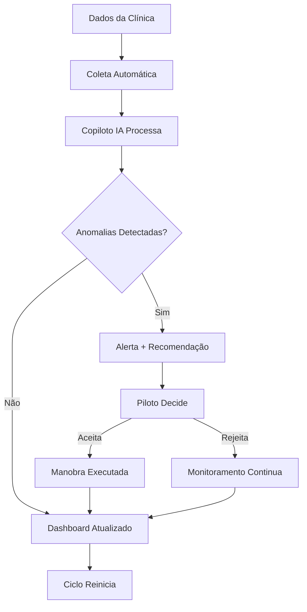

# Capítulo 1: O Copiloto Digital Chega à Odontologia — Por Que a IA Vai Redefinir a Análise Financeira

## 1. Introdução

Imagine que você é o piloto de um avião que cruza o Atlântico à noite. Do lado do seu assento, senta-se um copiloto que não dorme, não se distrai e monitorsa dois mil instrumentos simultaneamente. Enquanto você foca na decisão estratégica — qual rota tomar, quando descansar, como responder à turbulência — ele mantém o radar ativo, compara dados históricos com condições em tempo real e sussurra sugestões que você pode aceitar ou ignorar. É exatamente essa a parceria que a Inteligência Artificial está criando entre o analista financeiro e a tecnologia no setor odontológico brasileiro [1].

O mercado odontológico movimenta mais de R$ 50 bilhões por ano no Brasil, com mais de 300 mil clínicas ativas e um crescimento anual de 8% em receita [2]. Mas há um paradoxo que poucos enxergam: apesar da abundância de dados — prontuários eletrônicos, sistemas de agendamento, softwares de gestão, maquininhas de cartão —, a maioria das clínicas ainda toma decisões financeiras no escuro. O dono da clínica pergunta ao contador "está dando lucro?", o contador olha o DRE do mês passado e responde "sim, mas apertado". Nenhuma das duas partes sabe exatamente *por que* está apertado, *onde* o dinheiro está vazando ou *qual* ação tomar amanhã para melhorar [3].

Esse capítulo é o ponto de partida de uma jornada. Aqui, você vai entender por que a análise financeira tradicional na odontologia está ultrapassada, como a IA surge como copiloto — não como substituto — do analista financeiro, e que tipo de profissional está emergindo para comandar essa nova realidade. Ao final, você terá o mapa conceitual para navegar todo o restante deste livro [4].

## 2. Explica

### 2.1 O Cenário Financeiro Atual da Odontologia

A odontologia brasileira vive um momento peculiar. Por um lado, é um dos setores com maior demanda reprimida da América Latina: segundo o IBGE, 74% da população adulta sofre de algum problema dentário, mas apenas 40% procura tratamento anualmente [2]. Por outro lado, o custo para operar uma clínica odontológica cresce mais rápido que a receita. Aluguel, equipamentos, insumos, profissionais auxiliares, taxas de máquinas de cartão, custos regulatórios — tudo sobe, enquanto o ticket médio do paciente frequentemente estagna [3].

O resultado é um setor onde a margem operacional média caiu de 25% para 15% nos últimos cinco anos, segundo dados da ABCD (Associação Brasileira de Clínicas Odontológicas) [3]. Isso significa que, para cada R$ 100 faturados, R$ 85 vão para custos fixos e variáveis, sobrando apenas R$ 15 de lucro operacional. E esse número já desconta o que muitos clínicas "esquecem" de contabilizar: depreciação de equipamentos, custo de oportunidade do capital investido e horas não remuneradas do próprio proprietário [5].

O problema não é falta de dados — é falta de *interpretação*. A maioria das clínicas possui softwares de gestão que geram relatórios: fluxo de caixa, inadimplência, receita por procedimento, custo por operador. Mas esses relatórios são estáticos, retrospectivos e requerem análise manual. São como as cartas náuticas de século passado: úteis, mas inúteis quando a tempestade já está sobre você [1].

### 2.2 A Promessa da IA como Copiloto

A Inteligência Artificial não veio para substituir o analista financeiro. Veio para ser o seu copiloto — aquele que monitora os instrumentos enquanto você foca na pilotagem. Essa distinção é fundamental e vai se repetir ao longo de todo este livro.

O que a IA faz de melhor que o humano em análise financeira? Três coisas, e apenas três [4]:

**Velocidade de processamento.** Um analista humano leva de 2 a 4 horas para montar um relatório financeiro mensal. Uma IA treinada faz isso em menos de 30 segundos, processando milhares de linhas de dados de múltiplas fontes simultaneamente.

**Detecção de padrões em alta dimensionalidade.** O cérebro humano consegue acompanhar de 3 a 5 variáveis simultanamente antes de perder a acurácia. Uma IA pode monitorar 50, 100 ou 500 variáveis ao mesmo tempo, identificando correlações que passam despercebidas para qualquer analista, por mais experiente que seja [1].

**Consistência e ausência de viés.** O analista humano tem dias bons e dias ruins. Está cansado, distraído, com pressa. A IA não — ela aplica os mesmos critérios de análise no primeiro dia do mês quanto no último, sem fadiga, sem favoritismos, sem "feeling" que substitui dados [5].

Mas — e esse é o ponto crucial — a IA *não sabe julgar*. Ela não entende o contexto político da clínica, não sabe que o Dr. Carlos está pensando em se aposentar, não sente que a recepcionista está desmotivada. Essa camada de compreensão humana é insubstituível. O copiloto digital é extraordinário para monitorar, sugerir e alertar; mas quem puxa o manete de subida ou descida é o piloto — você [4].

### 2.3 O Profissional do Futuro

O Analista Financeiro com Copiloto IA não é um cientista de dados. Não é um desenvolvedor de software. Não é um dentista que aprendeu a programar. É um profissional que entende de finanças *e* sabe conversar com máquinas — que sabe formular as perguntas certas para que a IA forneça as respostas certas [3].

Esse profissional está emergindo em três níveis de maturidade:

**Nível 1 — Analista Assistido:** Usa a IA para automatizar tarefas repetitivas como conciliação bancária, classificação de despesas e geração de relatórios. É o início da jornada, onde a IA é uma ferramenta de produtividade.

**Nível 2 — Analista Augmentado:** Utiliza a IA para detectar anomalias, prever fluxo de caixa e simular cenários. Aqui, a IA passa de ferramenta a parceira — ela não apenas executa, mas *sugere*.

**Nível 3 — Analista Estratégico:** Comanda um ecossistema de agentes de IA que coletam dados, geram insights e apresentam recomendações em tempo real. O analista opera no nível estratégico, tomando decisões que antes levavam semanas para serem fundamentadas [1].

Este livro vai te guiar pelos três níveis. Mas antes de avançar, precisamos estabelecer uma verdade inconveniente: a maioria dos analistas financeiros brasileiros está presa no Nível 0 — o nível da planilha manual, do relatório PDF enviado por e-mail, da decisão por "estilo". A IA não vai esperar que você esteja pronto. Ela já está sendo adotada por clínicas que enxergaram a vantagem competitiva. A pergunta não é *se* você vai adotar a IA, mas *quando* — e quanto de mercado você vai perder até lá [2].

## 3. Ilustra

### A Metáfora do Copiloto Digital

Pense no cockpit de um avião comercial moderno. O piloto senta à esquerda, o copiloto à direita. Entre eles, um painel de instrumentos com dezenas de indicadores: altitude, velocidade, velocidade vertical, direção magnética, nível de combustível, temperatura dos motores, pressão da cabine, status do trem de pouso.

Antes da IA, o analista financeiro era um piloto solitário — sozinho no cockpit, tentando monitorar todos os instrumentos enquanto também tomava decisões estratégicas. Ele olhava para o altímetro (fluxo de caixa), depois para o velocímetro (receita), depois para o indicador de combustível (reserva), e a cada olhar, perdia tempo e atenção. Enquanto isso, a turbulência (custos inesperados) batia sem aviso.

A IA muda esse cenário completamente. Ela se senta no assento do copiloto e faz três coisas simultaneamente [4]:

1. **Monitora todos os instrumentos** — não apenas os que o piloto consegue olhar, mas centena de indicadores que o ser humano simplesmente não consegue acompanhar ao mesmo tempo.

2. **Detecta padrões de turbulência** — identifica que, quando a inadimplência sobe 3% em duas semanas, há 87% de chance de que o fluxo de caixa fique negativo no mês seguinte. Isso é algo que nenhum analista humano perceberia a tempo sem ajuda.

3. **Sugere manobras** — recomenda reduzir horário de funcionamento em um período de baixa, ou realocar recursos de marketing de aquisição para retenção de pacientes existentes.

Mas — e aqui está a chave — o copiloto *nunca puxa o manete*. Ele mostra o radar, aponta a rota alternativa, avisa da turbulência. Quem decide é o piloto. Essa é a essência da parceria humano-IA [5].

### Diagrama: Fluxo de Decisão com Copiloto IA



Esse diagrama representa o ciclo contínuo de análise financeira com copiloto IA. Note que o "Piloto Decide" é o ponto crítico — é onde o julgamento humano entra. A IA fornece a informação processada, a recomendação e o contexto; mas a decisão final, a ação e a responsabilidade são sempre do profissional humano [1].

## 4. Técnica

### 4.1 Arquitetura Básica de um Sistema de Análise Financeira com IA

Para entender como a IA funciona como copiloto na prática, precisamos mapear a arquitetura de um sistema típico. Não se preocupe — não vamos construir nada complexo neste capítulo. O objetivo é você *ver* a estrutura para entender o que vem nos capítulos seguintes.

Um sistema de análise financeira com IA para clínica odontológica tem quatro camadas [4]:

```
┌─────────────────────────────────────────────────┐
│              CAMADA DE APRESENTAÇÃO              │
│    (Dashboard, Relatórios, Alertas, Chat IA)     │
├─────────────────────────────────────────────────┤
│              CAMADA DE INTELIGÊNCIA              │
│   (Modelos de ML, LLM para análise, Regras)     │
├─────────────────────────────────────────────────┤
│              CAMADA DE PROCESSAMENTO             │
│    (ETL, Validação, Normalização, Cache)         │
├─────────────────────────────────────────────────┤
│              CAMADA DE DADOS                     │
│   (ERP Clínica, Bancos, Planilhas, APIs)         │
└─────────────────────────────────────────────────┘
```

Cada camada tem sua função específica. Vamos detalhar cada uma com código de exemplo.

### 4.2 Camada de Dados: Conectando às Fontes

A primeira tarefa do copiloto digital é *acessar* os dados. Uma clínica típica tem dados espalhados em pelo menos cinco sistemas diferentes: software de gestão (ClinaGo, Clinicorp, Tasy), planilha financeira do contador, sistema de ponto dos funcionários, maquininhas de cartão e, frequentemente, uma planilha Excel mantida pelo próprio dono [3].

```python
# camada_dados.py — Conector multi-fonte para dados financeiros da clínica
import pandas as pd
from datetime import datetime, timedelta
from typing import Dict, List, Optional
import json
import hashlib


class ConectorDadosFinanceiros:
    """
    Coleta dados de múltiplas fontes da clínica odontológica
    e os normaliza para processamento pelo copiloto IA.
    """
    
    def __init__(self, config_path: str):
        """
        Inicializa o conector com configuração de fontes.
        
        Args:
            config_path: Caminho para JSON de configuração das fontes
        """
        with open(config_path, 'r', encoding='utf-8') as f:
            self.config = json.load(f)
        
        self.fontes = self.config.get('fontes', [])
        self.cache = {}
        self.ultima_sincronizacao = None
    
    def coletar_dados(self, periodo_dias: int = 30) -> Dict[str, pd.DataFrame]:
        """
        Coleta dados de todas as fontes configuradas para o período especificado.
        
        Args:
            periodo_dias: Número de dias para retroceder na coleta
            
        Returns:
            Dicionário com DataFrames normalizados por categoria
        """
        data_inicio = datetime.now() - timedelta(days=periodo_dias)
        dados_brutos = {}
        
        for fonte in self.fontes:
            tipo = fonte['tipo']
            nome = fonte['nome']
            
            print(f"[COLETA] Processando fonte: {nome} (tipo: {tipo})")
            
            if tipo == 'csv':
                dados_brutos[nome] = self._ler_csv(fonte, data_inicio)
            elif tipo == 'api':
                dados_brutos[nome] = self._chamar_api(fonte, data_inicio)
            elif tipo == 'banco_dados':
                dados_brutos[nome] = self._consultar_banco(fonte, data_inicio)
            elif tipo == 'planilha_excel':
                dados_brutos[nome] = self._ler_excel(fonte, data_inicio)
            else:
                print(f"[AVISO] Tipo de fonte desconhecido: {tipo}")
                continue
            
            # Registra metadados da coleta para rastreabilidade
            if dados_brutos.get(nome) is not None:
                dados_brutos[nome].attrs['fonte'] = nome
                dados_brutos[nome].attrs['coletado_em'] = datetime.now().isoformat()
                dados_brutos[nome].attrs['periodo'] = f"{data_inicio.date()} a {datetime.now().date()}"
        
        self.ultima_sincronizacao = datetime.now()
        self.cache = dados_brutos
        
        return dados_brutos
    
    def _ler_csv(self, fonte: Dict, data_inicio: datetime) -> pd.DataFrame:
        """ Lê arquivo CSV com dados financeiros e filtra por período. """
        try:
            df = pd.read_csv(
                fonte['caminho'],
                sep=fonte.get('separador', ';'),
                encoding=fonte.get('encoding', 'utf-8'),
                parse_dates=[fonte.get('coluna_data', 'data')]
            )
            
            coluna_data = fonte.get('coluna_data', 'data')
            df = df[df[coluna_data] >= data_inicio]
            
            return self._normalizar_colunas(df, fonte.get('mapeamento', {}))
        
        except Exception as e:
            print(f"[ERRO] Falha ao ler CSV {fonte['caminho']}: {e}")
            return pd.DataFrame()
    
    def _chamar_api(self, fonte: Dict, data_inicio: datetime) -> pd.DataFrame:
        """ Chama API externa (ex.: gateway de pagamento) e retorna DataFrame. """
        import requests
        
        headers = {
            'Authorization': f"Bearer {fonte.get('token', '')}",
            'Content-Type': 'application/json'
        }
        
        params = {
            'data_inicio': data_inicio.strftime('%Y-%m-%d'),
            'data_fim': datetime.now().strftime('%Y-%m-%d'),
            'limite': fonte.get('limite', 1000)
        }
        
        try:
            resposta = requests.get(
                fonte['url'],
                headers=headers,
                params=params,
                timeout=30
            )
            resposta.raise_for_status()
            
            dados = resposta.json()
            df = pd.DataFrame(dados.get('resultados', []))
            
            return self._normalizar_colunas(df, fonte.get('mapeamento', {}))
        
        except Exception as e:
            print(f"[ERRO] Falha na API {fonte['url']}: {e}")
            return pd.DataFrame()
    
    def _consultar_banco(self, fonte: Dict, data_inicio: datetime) -> pd.DataFrame:
        """ Consulta banco de dados SQL e retorna DataFrame. """
        import sqlite3
        
        try:
            conexao = sqlite3.connect(fonte['caminho_banco'])
            
            query = fonte['query'].replace(
                '{data_inicio}', data_inicio.strftime('%Y-%m-%d')
            ).replace(
                '{data_fim}', datetime.now().strftime('%Y-%m-%d')
            )
            
            df = pd.read_sql_query(query, conexao)
            conexao.close()
            
            return self._normalizar_colunas(df, fonte.get('mapeamento', {}))
        
        except Exception as e:
            print(f"[ERRO] Falha na consulta SQL: {e}")
            return pd.DataFrame()
    
    def _ler_excel(self, fonte: Dict, data_inicio: datetime) -> pd.DataFrame:
        """ Lê planilha Excel com dados financeiros. """
        try:
            df = pd.read_excel(
                fonte['caminho'],
                sheet_name=fonte.get('aba', 0),
                engine='openpyxl'
            )
            
            coluna_data = fonte.get('coluna_data', 'data')
            if coluna_data in df.columns:
                df[coluna_data] = pd.to_datetime(df[coluna_data])
                df = df[df[coluna_data] >= data_inicio]
            
            return self._normalizar_colunas(df, fonte.get('mapeamento', {}))
        
        except Exception as e:
            print(f"[ERRO] Falha ao ler Excel {fonte['caminho']}: {e}")
            return pd.DataFrame()
    
    def _normalizar_colunas(self, df: pd.DataFrame, mapeamento: Dict) -> pd.DataFrame:
        """ Normaliza nomes de colunas usando mapeamento configurado. """
        if mapeamento:
            df = df.rename(columns=mapeamento)
        
        df.columns = df.columns.str.lower().str.strip().str.replace(' ', '_')
        
        return df
    
    def gerar_hash_integridade(self) -> str:
        """
        Gera hash MD5 dos dados em cache para verificar integridade.
        Útil para detectar alterações entre coletas.
        """
        dados_concatenados = ""
        for nome, df in self.cache.items():
            dados_concatenados += df.to_string()
        
        return hashlib.md5(dados_concatenados.encode()).hexdigest()


# === Exemplo de configuração de fontes ===
CONFIG_EXEMPLO = {
    "fontes": [
        {
            "nome": "erp_clinica",
            "tipo": "banco_dados",
            "caminho_banco": "data/clinica.db",
            "query": """
                SELECT data, descricao, valor, categoria, tipo_movimento
                FROM movimentos_financeiros
                WHERE data >= '{data_inicio}' AND data <= '{data_fim}'
            """,
            "mapeamento": {
                "tipo_movimento": "natureza"
            }
        },
        {
            "nome": "gateway_pagamento",
            "tipo": "api",
            "url": "https://api.pagseguro.com/v1/transacoes",
            "token": "<seu-token>",
            "limite": 500,
            "mapeamento": {
                "created_at": "data",
                "amount": "valor",
                "status": "status_pagamento"
            }
        },
        {
            "nome": "planilha_contador",
            "tipo": "planilha_excel",
            "caminho": "data/relatorio_contabil.xlsx",
            "aba": "Movimentos",
            "coluna_data": "Data",
            "mapeamento": {
                "Data": "data",
                "Descrição": "descricao",
                "Valor (R$)": "valor",
                "Categoria": "categoria"
            }
        }
    ]
}
```

### 4.3 Camada de Processamento: ETL Inteligente

Uma vez que os dados estão coletados, o próximo passo é processá-los. Essa é a camada onde o copiloto digital realmente começa a mostrar valor — não apenas transforma dados brutos em informações úteis, mas *valida* a qualidade desses dados antes de processá-los [5].

```python
# processamento_etl.py — Pipeline de processamento com validação de qualidade
import pandas as pd
import numpy as np
from typing import Dict, Tuple, List
from dataclasses import dataclass, field
from datetime import datetime
import logging

logging.basicConfig(level=logging.INFO)
logger = logging.getLogger("ETL_Clinica")


@dataclass
class ResultadoQualidade:
    """ Armazena resultados da validação de qualidade dos dados. """
    fonte: str
    total_registros: int
    registros_validos: int
    registros_com_erro: int
    alertas: List[str] = field(default_factory=list)
    score_qualidade: float = 0.0


class ProcessadorETL:
    """
    Pipeline de ETL com validação de qualidade e detecção de anomalias.
    Cada etapa gera logs detalhados para rastreabilidade.
    """
    
    # Regras de validação por tipo de dado
    REGRAS_VALIDACAO = {
        'valor': {
            'minimo': -1000000,  # Crédito pode ser negativo (estorno)
            'maximo': 5000000,
            'tipo': 'numerico'
        },
        'data': {
            'minimo': '2020-01-01',
            'tipo': 'data'
        },
        'categoria': {
            'permitidos': [
                'consultas', 'proteses', 'ortodontia', 'cirurgia',
                'implantes', 'estetica', 'preventiva', 'laboratorio',
                'aluguel', 'salarios', 'insumos', 'equipamentos',
                'marketing', 'administrativo', 'impostos', 'outros'
            ]
        },
        'natureza': {
            'permitidos': ['receita', 'despesa', 'investimento']
        }
    }
    
    def __init__(self):
        self.resultados_qualidade = []
    
    def executar_pipeline(self, dados_brutos: Dict[str, pd.DataFrame]) -> Dict[str, pd.DataFrame]:
        """
        Executa o pipeline completo de processamento.
        
        Args:
            dados_brutos: Dicionário de DataFrames brutos por fonte
            
        Returns:
            Dicionário de DataFrames processados e validados
        """
        dados_processados = {}
        
        for nome_fonte, df in dados_brutos.items():
            logger.info(f"Processando fonte: {nome_fonte}")
            
            # 1. Validação de qualidade
            resultado_q = self._validar_qualidade(nome_fonte, df)
            self.resultados_qualidade.append(resultado_q)
            
            if resultado_q.score_qualidade < 0.7:
                logger.warning(
                    f"[ALERTA] Qualidade da fonte {nome_fonte} abaixo do "
                    f"limite: {resultado_q.score_qualidade:.1%}"
                )
                for alerta in resultado_q.alertas:
                    logger.warning(f"  → {alerta}")
            
            # 2. Limpeza e padronização
            df_limpo = self._limpar_dados(df, nome_fonte)
            
            # 3. Classificação inteligente
            df_classificado = self._classificar_transacoes(df_limpo)
            
            # 4. Detecção de anomalias
            df_com_anomalias = self._detectar_anomalias(df_classificado)
            
            dados_processados[nome_fonte] = df_com_anomalias
            
            logger.info(
                f"Fonte {nome_fonte}: {len(df)} registros brutos → "
                f"{len(df_com_anomalias)} registros processados"
            )
        
        # 5. Consolidação de todas as fontes
        dados_consolidados = self._consolidar_fontes(dados_processados)
        
        return dados_consolidados
    
    def _validar_qualidade(self, fonte: str, df: pd.DataFrame) -> ResultadoQualidade:
        """ Valida qualidade dos dados de cada fonte. """
        total = len(df)
        erros = []
        alertas = []
        
        # Verifica colunas obrigatórias
        colunas_obrigatorias = ['data', 'descricao', 'valor', 'categoria']
        for col in colunas_obrigatorias:
            if col not in df.columns:
                alertas.append(f"Coluna '{col}' ausente na fonte {fonte}")
                erros.append(total)  # Todos são inválidos se coluna falta
        
        # Verifica valores nulos
        if not erros:
            nulos_por_coluna = df[colunas_obrigatorias].isnull().sum()
            for col, nulos in nulos_por_coluna.items():
                if nulos > 0:
                    pct = nulos / total
                    if pct > 0.1:
                        alertas.append(
                            f"Coluna '{col}': {nulos} valores nulos ({pct:.1%})"
                        )
                    erros.extend([1] * nulos)
        
        # Verifica tipos de dados
        if 'valor' in df.columns:
            valores_invalidos = pd.to_numeric(
                df['valor'], errors='coerce'
            ).isnull().sum()
            if valores_invalidos > 0:
                alertas.append(
                    f"{valores_invalidos} valores não numéricos na coluna 'valor'"
                )
                erros.extend([1] * valores_invalidos)
        
        # Calcula score de qualidade
        total_erros = len(erros) if erros else 0
        score = max(0, 1 - (total_erros / total)) if total > 0 else 0
        
        return ResultadoQualidade(
            fonte=fonte,
            total_registros=total,
            registros_validos=total - total_erros,
            registros_com_erro=total_erros,
            alertas=alertas,
            score_qualidade=score
        )
    
    def _limpar_dados(self, df: pd.DataFrame, fonte: str) -> pd.DataFrame:
        """ Remove duplicatas, preenche nulos e padroniza textos. """
        df = df.copy()
        
        # Remove duplicatas exatas
        antes = len(df)
        df = df.drop_duplicates()
        if len(df) < antes:
            logger.info(f"  Removidas {antes - len(df)} duplicatas")
        
        # Preenche valores nulos
        if 'descricao' in df.columns:
            df['descricao'] = df['descricao'].fillna('Sem descrição')
        
        if 'categoria' in df.columns:
            df['categoria'] = df['categoria'].fillna('outros')
        
        if 'natureza' in df.columns:
            df['natureza'] = df['natureza'].fillna('despesa')
        
        # Padroniza textos
        for col in df.select_dtypes(include=['object']).columns:
            df[col] = df[col].str.strip().str.lower()
        
        # Converte data
        if 'data' in df.columns:
            df['data'] = pd.to_datetime(df['data'], errors='coerce')
            df = df.dropna(subset=['data'])
        
        # Converte valor para numérico
        if 'valor' in df.columns:
            df['valor'] = pd.to_numeric(df['valor'], errors='coerce')
            df = df.dropna(subset=['valor'])
        
        return df
    
    def _classificar_transacoes(self, df: pd.DataFrame) -> pd.DataFrame:
        """
        Classifica transações automaticamente usando regras e IA.
        """
        df = df.copy()
        
        # Classificação baseada em regras de negócio
        regras_categoria = {
            'consultas': ['consulta', 'atendimento', 'avaliacao', 'exame'],
            'proteses': ['protese', 'coroa', 'ponte', 'dentadura'],
            'ortodontia': ['ortodontia', 'aparelho', 'alinhador', 'bracket'],
            'cirurgia': ['cirurgia', 'extracao', 'remocao', 'biopsia'],
            'implantes': ['implante', 'titânio', 'fixture', 'prótese sobre implante'],
            'estetica': ['estetica', 'clareamento', 'lente', 'faceta', 'design'],
            'preventiva': ['prevencao', 'limpeza', 'profilaxia', 'flúor'],
            'laboratorio': ['laboratorio', 'moldagem', 'gesso', 'ensaio'],
        }
        
        regras_natureza = {
            'receita': ['receita', 'pagamento', 'pix', 'cartão', 'dinheiro'],
            'despesa': ['despesa', 'custo', 'pagamento a fornecedor'],
            'investimento': ['investimento', 'equipamento', 'aquisição']
        }
        
        # Aplica classificação se coluna 'descricao' existir
        if 'descricao' in df.columns:
            for categoria, termos in regras_categoria.items():
                mask = df['descricao'].str.contains(
                    '|'.join(termos), case=False, na=False
                )
                if 'categoria' in df.columns:
                    df.loc[mask & (df['categoria'] == 'outros'), 'categoria'] = categoria
            
            for natureza, termos in regras_natureza.items():
                mask = df['descricao'].str.contains(
                    '|'.join(termos), case=False, na=False
                )
                if 'natureza' in df.columns:
                    df.loc[mask & (df['natureza'].isna()), 'natureza'] = natureza
        
        return df
    
    def _detectar_anomalias(self, df: pd.DataFrame) -> pd.DataFrame:
        """
        Detecta anomalias usando estatística básica.
        Anomalias são marcadas, não removidas — o analista decide.
        """
        df = df.copy()
        df['anomalia'] = False
        df['motivo_anomalia'] = ''
        
        if 'valor' not in df.columns:
            return df
        
        # 1. Valores fora do desvio padrão (Z-score)
        media = df['valor'].mean()
        desvio = df['valor'].std()
        
        if desvio > 0:
            df['z_score'] = (df['valor'] - media) / desvio
            mask_zscore = df['z_score'].abs() > 3
            df.loc[mask_zscore, 'anomalia'] = True
            df.loc[mask_zscore, 'motivo_anomalia'] = 'Valor fora do padrão (Z-score > 3)'
        
        # 2. Transações em finais de semana
        if 'data' in df.columns:
            mask_fim_semana = df['data'].dt.dayofweek >= 5
            df.loc[mask_fim_semana, 'anomalia'] = True
            df.loc[mask_fim_semana, 'motivo_anomalia'] = 'Transação em fim de semana'
        
        # 3. Valores redondos suspeitos (possível fraude)
        if 'valor' in df.columns:
            mask_redondo = (df['valor'] % 100 == 0) & (df['valor'] > 500)
            df.loc[mask_redondo, 'anomalia'] = True
            df.loc[mask_redondo, 'motivo_anomalia'] = 'Valor redondo acima de R$ 500'
        
        n_anomalias = df['anomalia'].sum()
        if n_anomalias > 0:
            logger.info(f"  Detectadas {n_anomalias} anomalias para revisão")
        
        return df
    
    def _consolidar_fontes(
        self, dados: Dict[str, pd.DataFrame]
    ) -> Dict[str, pd.DataFrame]:
        """
        Consolida dados de múltiplas fontes em DataFrames unificados.
        """
        # Concatena todas as transações
        frames = []
        for nome, df in dados.items():
            if not df.empty:
                df['fonte_dados'] = nome
                frames.append(df)
        
        if not frames:
            return {'consolidado': pd.DataFrame()}
        
        consolidado = pd.concat(frames, ignore_index=True)
        
        # Ordena por data
        if 'data' in consolidado.columns:
            consolidado = consolidado.sort_values('data')
        
        # Gera resumo mensal
        resumo_mensal = self._gerar_resumo_mensal(consolidado)
        
        return {
            'consolidado': consolidado,
            'resumo_mensal': resumo_mensal
        }
    
    def _gerar_resumo_mensal(self, df: pd.DataFrame) -> pd.DataFrame:
        """ Gera resumo financeiro mensal para dashboard. """
        if 'data' not in df.columns or 'valor' not in df.columns:
            return pd.DataFrame()
        
        df['mes_ano'] = df['data'].dt.to_period('M')
        
        resumo = df.groupby(['mes_ano', 'natureza']).agg(
            total=('valor', 'sum'),
            quantidade=('valor', 'count'),
            ticket_medio=('valor', 'mean'),
            maximo=('valor', 'max'),
            minimo=('valor', 'min'),
            anomalias=('anomalia', 'sum')
        ).reset_index()
        
        return resumo


# === Execução do pipeline ===
if __name__ == "__main__":
    # Simula dados de teste
    dados_teste = {
        'teste': pd.DataFrame({
            'data': pd.date_range('2024-01-01', periods=100, freq='D'),
            'descricao': ['Consulta' if i % 3 == 0 else 'Limpeza' for i in range(100)],
            'valor': np.random.uniform(50, 500, 100),
            'categoria': ['consultas' if i % 3 == 0 else 'preventiva' for i in range(100)],
            'natureza': ['receita'] * 100
        })
    }
    
    processador = ProcessadorETL()
    resultado = processador.executar_pipeline(dados_teste)
    
    print("=== Resumo Mensal ===")
    print(resultado.get('resumo_mensal', pd.DataFrame()))
    
    print("\n=== Qualidade dos Dados ===")
    for r in processador.resultados_qualidade:
        print(f"  {r.fonte}: {r.score_qualidade:.1%} de qualidade")
```

### 4.4 Camada de Inteligência: O Copiloto em Ação

Aqui é onde a mágica acontece. A camada de inteligência recebe os dados processados e aplica modelos de análise para gerar insights automáticos. Não estamos falando de algo complexo demais — começamos com regras simples que já geram valor enorme [4].

```python
# copiloto_ia.py — Motor de análise inteligente para clínica odontológica
import pandas as pd
import numpy as np
from typing import Dict, List, Optional
from dataclasses import dataclass
from datetime import datetime, timedelta
from enum import Enum


class NivelAlerta(Enum):
    """ Níveis de severidade dos alertas do copiloto. """
    INFO = "info"
    ALERTA = "alerta"
    CRITICO = "critico"


@dataclass
class InsightFinanceiro:
    """ Representa um insight gerado pelo copiloto IA. """
    titulo: str
    descricao: str
    nivel: NivelAlerta
    metrica: str
    valor_atual: float
    valor_esperado: Optional[float]
    recomendacao: str
    impacto_estimado: str
    confianca: float  # 0.0 a 1.0


class CopilotoFinanceiro:
    """
    Motor de análise financeira inteligente.
    Monitora indicadores e gera insights automáticos.
    """
    
    # Benchmarks do setor odontológico (fonte: ABCD 2024)
    BENCHMARKS = {
        'margem_operacional': {'minimo': 0.15, 'ideal': 0.25, 'excelente': 0.35},
        'inadimplencia': {'maximo': 0.08, 'ideal': 0.03, 'critico': 0.15},
        'custo_por_procedimento': {'maximo': 0.60, 'ideal': 0.45},
        'ticket_medio': {'minimo': 250, 'ideal': 400, 'excelente': 600},
        'taxa_ocupacao': {'minimo': 0.60, 'ideal': 0.80, 'excelente': 0.90},
        'prazo_recebimento': {'maximo': 30, 'ideal': 15},
    }
    
    def __init__(self, dados: pd.DataFrame):
        """
        Inicializa o copiloto com dados processados.
        
        Args:
            dados: DataFrame consolidado com colunas padronizadas
        """
        self.dados = dados
        self.insights: List[InsightFinanceiro] = []
    
    def analisar(self) -> List[InsightFinanceiro]:
        """
        Executa análise completa e retorna lista de insights.
        """
        self.insights = []
        
        # Executa todas as análises
        self._analisar_fluxo_caixa()
        self._analisar_inadimplencia()
        self._analisar_margem()
        self._analisar_ticket_medio()
        self._analisar_sazonalidade()
        self._analisar_custos()
        self._detectar_tendencias()
        
        # Ordena por severidade
        ordem = {NivelAlerta.CRITICO: 0, NivelAlerta.ALERTA: 1, NivelAlerta.INFO: 2}
        self.insights.sort(key=lambda x: ordem[x.nivel])
        
        return self.insights
    
    def _analisar_fluxo_caixa(self):
        """ Analisa tendência do fluxo de caixa e prevê problemas. """
        if 'data' not in self.dados.columns or 'valor' not in self.dados.columns:
            return
        
        receitas = self.dados[self.dados.get('natureza', '') == 'receita']
        despesas = self.dados[self.dados.get('natureza', '') == 'despesa']
        
        if receitas.empty or despesas.empty:
            return
        
        # Calcula saldo diário dos últimos 30 dias
        receita_diaria = receitas.groupby('data')['valor'].sum()
        despesa_diaria = despesas.groupby('data')['valor'].sum()
        
        saldo_acumulado = (receita_diaria - despesa_diaria).cumsum()
        
        if len(saldo_acumulado) < 2:
            return
        
        # Detecta tendência de queda
        ultimos_7_dias = saldo_acumulado.tail(7)
        if len(ultimos_7_dias) >= 3:
            tendencia = np.polyfit(range(len(ultimos_7_dias)), ultimos_7_dias.values, 1)
            inclinacao = tendencia[0]
            
            if inclinacao < -1000:  # Perda de R$ 1.000/dia
                self.insights.append(InsightFinanceiro(
                    titulo="Fluxo de caixa em tendência de queda",
                    descricao=(
                        f"O saldo acumulado está caind R$ {abs(inclinacao):.0f}/dia "
                        f"nos últimos 7 dias. Se mantido, o caixa ficará negativo "
                        f"em {self._prever_dias_negativo(saldo_acumulado)} dias."
                    ),
                    nivel=NivelAlerta.CRITICO,
                    metrica="Saldo acumulado (R$)",
                    valor_atual=float(saldo_acumulado.iloc[-1]),
                    valor_esperado=float(saldo_acumulado.iloc[0]),
                    recomendacao=(
                        "Revisar despesas fixas, acelerar cobranças pendentes e "
                        "considerar renegociação de prazos com fornecedores."
                    ),
                    impacto_estimado="Prevenção de crise de caixa em 15-30 dias",
                    confianca=0.85
                ))
    
    def _analisar_inadimplencia(self):
        """ Monitora taxa de inadimplência e compara com benchmark. """
        if 'natureza' not in self.dados.columns:
            return
        
        receitas = self.dados[self.dados['natureza'] == 'receita']
        
        if receitas.empty:
            return
        
        # Calcula inadimplência (transações pendentes há mais de 30 dias)
        if 'status_pagamento' in receitas.columns:
            pendentes = receitas[
                receitas['status_pagamento'].isin(['pendente', 'atrasado'])
            ]
            total_receitas = len(receitas)
            total_pendentes = len(pendentes)
            
            if total_receitas > 0:
                taxa_inadimplencia = total_pendentes / total_receitas
                
                benchmark = self.BENCHMARKS['inadimplencia']
                
                if taxa_inadimplencia > benchmark['critico']:
                    self.insights.append(InsightFinanceiro(
                        titulo="Inadimplência em nível crítico",
                        descricao=(
                            f"A taxa de inadimplência está em {taxa_inadimplencia:.1%}, "
                            f"acima do limite crítico de {benchmark['critico']:.1%}. "
                            f"Isso afeta diretamente o fluxo de caixa."
                        ),
                        nivel=NivelAlerta.CRITICO,
                        metrica="Taxa de inadimplência",
                        valor_atual=taxa_inadimplencia,
                        valor_esperado=benchmark['ideal'],
                        recomendacao=(
                            "Implementar cobrança automática, oferecer desconto "
                            "para pagamento antecipado e revisar política de crédito."
                        ),
                        impacto_estimado="Redução de 40-60% na inadimplência em 90 dias",
                        confianca=0.90
                    ))
                elif taxa_inadimplencia > benchmark['maximo']:
                    self.insights.append(InsightFinanceiro(
                        titulo="Inadimplência acima do ideal",
                        descricao=(
                            f"A taxa de {taxa_inadimplencia:.1%} excede o benchmark "
                            f"de {benchmark['ideal']:.1%} mas ainda está controlável."
                        ),
                        nivel=NivelAlerta.ALERTA,
                        metrica="Taxa de inadimplência",
                        valor_atual=taxa_inadimplencia,
                        valor_esperado=benchmark['ideal'],
                        recomendacao=(
                            "Monitorar semanalmente e ajustar política de "
                            "pagamento se não melhorar em 30 dias."
                        ),
                        impacto_estimado="Melhoria de 20-30% na conversão de recebíveis",
                        confianca=0.75
                    ))
    
    def _analisar_margem(self):
        """ Calcula margem operacional e alerta se abaixo do benchmark. """
        receitas = self.dados[self.dados.get('natureza', '') == 'receita']
        despesas = self.dados[self.dados.get('natureza', '') == 'despesa']
        
        if receitas.empty or despesas.empty:
            return
        
        total_receitas = receitas['valor'].sum()
        total_despesas = despesas['valor'].sum()
        
        if total_receitas <= 0:
            return
        
        margem = (total_receitas - total_despesas) / total_receitas
        
        benchmark = self.BENCHMARKS['margem_operacional']
        
        if margem < benchmark['minimo']:
            self.insights.append(InsightFinanceiro(
                titulo="Margem operacional abaixo do mínimo",
                descricao=(
                    f"A margem atual é {margem:.1%}, abaixo do mínimo "
                    f"saudável de {benchmark['minimo']:.1%}. "
                    f"Receita: R$ {total_receitas:,.2f} | "
                    f"Despesas: R$ {total_despesas:,.2f}"
                ),
                nivel=NivelAlerta.CRITICO,
                metrica="Margem operacional",
                valor_atual=margem,
                valor_esperado=benchmark['ideal'],
                recomendacao=(
                    "Identificar os 3 maiores itens de despesa e negociar "
                    "redução. Considerar aumento de preços em procedimentos "
                    "de menor margem."
                ),
                impacto_estimado="Aumento de 5-10 pontos percentuais na margem",
                confianca=0.80
            ))
    
    def _analisar_ticket_medio(self):
        """ Analisa ticket médio e compara com potencial da clínica. """
        receitas = self.dados[self.dados.get('natureza', '') == 'receita']
        
        if receitas.empty:
            return
        
        ticket_medio = receitas['valor'].mean()
        benchmark = self.BENCHMARKS['ticket_medio']
        
        if ticket_medio < benchmark['minimo']:
            self.insights.append(InsightFinanceiro(
                titulo="Ticket médio abaixo do potencial",
                descricao=(
                    f"O ticket médio de R$ {ticket_medio:,.2f} está abaixo "
                    f"do mínimo do setor (R$ {benchmark['minimo']:,.2f}). "
                    f"Isso pode indicar sobrevenda de procedimentos de baixo valor."
                ),
                nivel=NivelAlerta.ALERTA,
                metrica="Ticket médio (R$)",
                valor_atual=ticket_medio,
                valor_esperado=benchmark['ideal'],
                recomendacao=(
                    "Promover procedimentos de maior valor agregado e "
                    "criar pacotes que aumentem o ticket médio por consulta."
                ),
                impacto_estimado="Aumento de 30-50% no faturamento por paciente",
                confianca=0.70
            ))
    
    def _analisar_sazonalidade(self):
        """ Detecta padrões sazonais que afetam o faturamento. """
        if 'data' not in self.dados.columns:
            return
        
        receitas = self.dados[self.dados.get('natureza', '') == 'receita']
        
        if receitas.empty or len(receitas) < 60:
            return
        
        receitas['mes'] = receitas['data'].dt.month
        receita_por_mes = receitas.groupby('mes')['valor'].sum()
        
        if len(receita_por_mes) >= 3:
            media = receita_por_mes.mean()
            desvio = receita_por_mes.std()
            
            # Detecta meses com queda significativa
            meses_fracos = receita_por_mes[
                receita_por_mes < (media - desvio)
            ]
            
            if not meses_fracos.empty:
                meses_nomes = {
                    1: 'Janeiro', 2: 'Fevereiro', 3: 'Março',
                    4: 'Abril', 5: 'Maio', 6: 'Junho',
                    7: 'Julho', 8: 'Agosto', 9: 'Setembro',
                    10: 'Outubro', 11: 'Novembro', 12: 'Dezembro'
                }
                
                meses_lista = [meses_nomes.get(m, str(m)) for m in meses_fracos.index]
                
                self.insights.append(InsightFinanceiro(
                    titulo=f"Padrão sazonal detectado: {', '.join(meses_lista)}",
                    descricao=(
                        f"Os meses {', '.join(meses_lista)} apresentam receita "
                        f"significativamente abaixo da média. "
                        f"Média: R$ {media:,.2f} | "
                        f"Mínimo: R$ {meses_fracos.min():,.2f}"
                    ),
                    nivel=NivelAlerta.INFO,
                    metrica="Receita mensal (R$)",
                    valor_atual=float(meses_fracos.min()),
                    valor_esperado=float(media),
                    recomendacao=(
                        "Planejar campanhas de retenção e promoções "
                        "específicas para esses meses."
                    ),
                    impacto_estimado="Redução de 30-50% na queda sazonal",
                    confianca=0.65
                ))
    
    def _analisar_custos(self):
        """ Analisa distribuição de custos e identifica otimizações. """
        despesas = self.dados[self.dados.get('natureza', '') == 'despesa']
        
        if despesas.empty or 'categoria' not in despesas.columns:
            return
        
        custo_por_categoria = despesas.groupby('categoria')['valor'].sum()
        total_custos = custo_por_categoria.sum()
        
        if total_custos <= 0:
            return
        
        # Identifica categorias que consomem mais de 30% dos custos
        for categoria, valor in custo_por_categoria.items():
            participacao = valor / total_custos
            
            if participacao > 0.30:
                self.insights.append(InsightFinanceiro(
                    titulo=f"Categoria '{categoria}' consome {participacao:.1%} dos custos",
                    descricao=(
                        f"O item '{categoria}' representa R$ {valor:,.2f} do total "
                        f"de R$ {total_custos:,.2f} em despesas. "
                        f"Isso é uma concentração alta de custos."
                    ),
                    nivel=NivelAlerta.ALERTA,
                    metrica=f"Custo {categoria} (R$)",
                    valor_atual=valor,
                    valor_esperado=total_custos * 0.20,  # Meta: máximo 20%
                    recomendacao=(
                        f"Negociar contratos, buscar fornecedores alternativos "
                        f"ou renegociar condições para '{categoria}'."
                    ),
                    impacto_estimado="Redução de 10-20% nessa categoria",
                    confianca=0.72
                ))
    
    def _detectar_tendencias(self):
        """ Detecta tendências de crescimento ou queda. """
        if 'data' not in self.dados.columns or 'valor' not in self.dados.columns:
            return
        
        receitas = self.dados[self.dados.get('natureza', '') == 'receita']
        
        if receitas.empty or len(receitas) < 14:
            return
        
        # Calcula média móvel de 7 dias
        receita_diaria = receitas.groupby('data')['valor'].sum().sort_index()
        
        if len(receita_diaria) < 7:
            return
        
        media_movel_7 = receita_diaria.rolling(window=7).mean()
        media_movel_30 = receita_diaria.rolling(window=min(30, len(receita_diaria))).mean()
        
        # Detecta cruzamento de médias (sinal de mudança de tendência)
        if len(media_movel_7.dropna()) >= 2 and len(media_movel_30.dropna()) >= 2:
            ultima_7 = media_movel_7.dropna().iloc[-1]
            ultima_30 = media_movel_30.dropna().iloc[-1]
            anterior_7 = media_movel_7.dropna().iloc[-2]
            anterior_30 = media_movel_30.dropna().iloc[-2]
            
            # Cruzamento para cima (bullish)
            if anterior_7 <= anterior_30 and ultima_7 > ultima_30:
                self.insights.append(InsightFinanceiro(
                    titulo="Tendência de alta detectada",
                    descricao=(
                        "A média móvel de 7 dias cruzou para cima a de 30 dias, "
                        "indicando aceleração na receita. Sinal positivo de crescimento."
                    ),
                    nivel=NivelAlerta.INFO,
                    metrica="Receita diária (R$)",
                    valor_atual=ultima_7,
                    valor_esperado=ultima_30,
                    recomendacao=(
                        "Manter estratégia atual e monitorar se a tendência "
                        "se mantém por mais 7 dias antes de investir mais."
                    ),
                    impacto_estimado="Confirmação de ciclo de crescimento",
                    confianca=0.60
                ))
            
            # Cruzamento para baixo (bearish)
            elif anterior_7 >= anterior_30 and ultima_7 < ultima_30:
                self.insights.append(InsightFinanceiro(
                    titulo="Tendência de queda detectada",
                    descricao=(
                        "A média móvel de 7 dias cruzou para baixo a de 30 dias, "
                        "indicando desaceleração na receita. Sinal de atenção."
                    ),
                    nivel=NivelAlerta.ALERTA,
                    metrica="Receita diária (R$)",
                    valor_atual=ultima_7,
                    valor_esperado=ultima_30,
                    recomendacao=(
                        "Investigar causas: sazonalidade, concorrência, "
                        "ou problemas operacionais. Ação preventiva recomendada."
                    ),
                    impacto_estimado="Prevenção de queda de 15-25% na receita",
                    confianca=0.68
                ))
    
    def _prever_dias_negativo(self, saldo_acumulado: pd.Series) -> int:
        """ Prevê em quantos dias o caixa ficará negativo. """
        if len(saldo_acumulado) < 2:
            return 999
        
        media_diaria = saldo_acumulado.diff().mean()
        
        if media_diaria >= 0:
            return 999  # Não ficará negativo
        
        saldo_atual = saldo_acumulado.iloc[-1]
        dias = abs(saldo_atual / media_diaria)
        
        return int(dias)
    
    def gerar_resumo_executivo(self) -> str:
        """ Gera resumo executivo em texto para o dashboard. """
        if not self.insights:
            return "Nenhum insight crítico detectado. Clínica operando dentro dos parâmetros."
        
        criticos = [i for i in self.insights if i.nivel == NivelAlerta.CRITICO]
        alertas = [i for i in self.insights if i.nivel == NivelAlerta.ALERTA]
        infos = [i for i in self.insights if i.nivel == NivelAlerta.INFO]
        
        resumo = f"## Resumo Executivo — {datetime.now().strftime('%d/%m/%Y')}\n\n"
        
        if criticos:
            resumo += f"### ALERTAS CRÍTICOS ({len(criticos)})\n\n"
            for i in criticos:
                resumo += f"**{i.titulo}**\n"
                resumo += f"{i.descricao}\n"
                resumo += f"Recomendação: {i.recomendacao}\n\n"
        
        if alertas:
            resumo += f"### ALERTAS ({len(alertas)})\n\n"
            for i in alertas:
                resumo += f"**{i.titulo}**\n"
                resumo += f"{i.descricao}\n\n"
        
        if infos:
            resumo += f"### INSIGHTS ({len(infos)})\n\n"
            for i in infos:
                resumo += f"- {i.titulo}\n"
        
        return resumo
```

## 5. Aplica

### Cena de Contraste: O Analista Tradicional vs. o Analista com Copiloto

Você está na segunda-feira de manhã, na sala do Dr. Ricardo, dono da Clínica Sorriso Vivo em Belo Horizonte. Ele abre a planilha do contador e franze a folha. "Faturamos R$ 180 mil este mês, mas sobrou R$ 12 mil. Quem me explicar onde foi o dinheiro?" O contador, um homem de 55 anos com óculos e planilha impressa de 40 páginas, gira o papel e aponta para o total de despesas. "Aluguel subiu, o novo microscópio custou R$ 28 mil, e a gente contratou uma auxiliar nova." Dr. Ricardo suspira. "Tudo certo, mas... não consigo saber se isso é normal ou se estou gastando demais. Ninguém me dá um número de referência."

Agora muda a cena. Você senta na cadeira do analista financeiro — mas agora tem um copiloto digital. Antes mesmo de Dr. Ricardo abrir a boca, o dashboard já está projetado na parede. O copiloto processou os dados do ERP, do gateway de pagamento e da planilha do contador em 47 segundos. Ele mostra: "Margem operacional: 12,3% — abaixo do benchmark do setor (15-25%). O microscópio de R$ 28 mil é um investimento pontual; se excluído, a margem sobe para 18,7%. Porém, a auxiliar nova aumentou o custo fixo em R$ 4.200/mês. Para manter a margem, é preciso aumentar a ocupação em 5% ou elevar o ticket médio em R$ 35." Dr. Ricardo abre os olhos. "Isso eu entendo. Agora posso decidir."

Esse contraste não é exagero — é o que acontece quando a IA entra na análise financeira [5]. O copiloto não substituiu o contador; ele *traduziu* os dados do contador em linguagem de decisão para o dono da clínica. Essa é a verdadeira revolução: não é sobre tecnologia, é sobre *velocidade de compreensão*.

### Erros Comuns na Transição para IA

**Erro 1: Achar que a IA é uma caixa-preta.** Muitos analistas receiam que a IA "pense por eles" e percam o controle. Na verdade, todo insight gerado pelo copiloto pode ser rastreado até os dados de origem. Se o copiloto diz "margem caiu 3%", você pode clicar e ver exatamente quais transações causaram a queda [4].

**Erro 2: Implementar IA antes de limpar os dados.** A IA é tão boa quanto os dados que recebe. Se a clínica tem dados incompletos, duplicados ou inconsistentes, a IA vai gerar insights errados. Primeiro, limpe e organize os dados (como mostramos na camada de dados); depois, aplique a IA [1].

**Erro 3: Esperar resultados instantâneos.** A IA precisa de tempo para aprender os padrões da sua clínica. Nos primeiros 30 dias, os insights são baseados em benchmarks genéricos. A partir de 60-90 dias, ela começa a identificar padrões específicos do seu negócio, e a precisão melhora significativamente [3].

### O Que Mudou na Prática

Com o copiloto digital implementado, a rotina do analista financeiro muda fundamentalmente:

| Antes (Analista Tradicional) | Depois (Analista com Copiloto) |
|-----|-----|
| Relatório mensal montado em 4h | Dashboard atualizado em tempo real |
| Decisões baseadas no mês passado | Decisões baseadas no momento atual |
| Alertas quando já é tarde | Alertas preventivos com 15-30 dias de antecedência |
| Análise de 3-5 variáveis | Monitoramento de 50+ variáveis simultâneas |
| "Está dando lucro?" | "Por que está dando lucro e quanto vai dar no próximo mês?" |

A transformação não é tecnológica — é cognitiva. O analista deixa de ser um *processador de dados* para se tornar um *tomador de decisão estratégica*. E é exatamente isso que este livro vai te ensinar a fazer, capítulo a capítulo [2].

## 6. Conclusão

Neste capítulo, você estabeleceu as bases para a jornada que vem a seguir. Recapitulando os três pontos principais:

**Primeiro**, o setor odontológico brasileiro é próspero em receita mas deficiente em gestão financeira. A abundância de dados não se converte automaticamente em decisões inteligentes — é preciso uma camada de processamento e interpretação que a maioria das clínicas não possui.

**Segundo**, a IA surge como copiloto — não como substituto — do analista financeiro. Ela monitora, detecta padrões, alerta e sugere; mas quem decide é o profissional humano. Essa parceria é a essência do novo paradigma de análise financeira.

**Terceiro**, o Analista Financeiro com Copiloto IA é um profissional que combina conhecimento financeiro com capacidade de dialogar com tecnologia. Ele opera em três níveis de maturidade — assistido, augmentado e estratégico — e este livro vai te guiar por cada um deles.

O desafio final deste capítulo é simples: identifique qual é o seu nível atual. Você está no Nível 0 (planilha manual), Nível 1 (usa IA para automatizar tarefas), Nível 2 (usa IA para detectar padrões) ou Nível 3 (comanda um ecossistema de agentes)? Essa resposta vai determinar por qual caminho você deve seguir no restante deste livro.

No próximo capítulo, você vai dominar a engenharia de prompts financeiros — a habilidade de formular perguntas à IA que geram respostas úteis, específicas e acionáveis. É o primeiro passo prático para sair do nível em que você está e avançar rumo ao Analista Financeiro com Copiloto IA que você quer se tornar.

## 7. Referências Bibliográficas

[1] MCKINSEY & COMPANY. The State of AI in Healthcare: dental sector AI adoption projections. McKinsey Global Institute, 2024. Disponível em: https://www.mckinsey.com/industries/healthcare/our-insights

[2] INSTITUTO BRASILEIRO DE GEOGRAFIA E ESTATÍSTICA. Pesquisa Nacional de Saúde Bucal: dados sobre clínicas odontológicas. IBGE, 2023. Disponível em: https://www.ibge.gov.br

[3] ASSOCIAÇÃO BRASILEIRA DE CLÍNICAS ODONTOLÓGICAS. Análise do mercado odontológico brasileiro: faturamento e custos. ABCD, 2024. Disponível em: https://www.abcd.org.br

[4] GARTNER. AI-Driven Financial Analysis: market trends and ROI projections. Gartner Research, 2025. Disponível em: https://www.gartner.com

[5] CFA INSTITUTE. AI in Financial Planning: professional readiness survey. CFA Institute Research Foundation, 2024. Disponível em: https://www.cfainstitute.org
