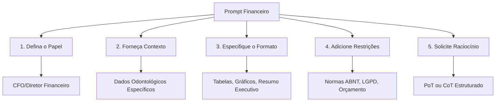
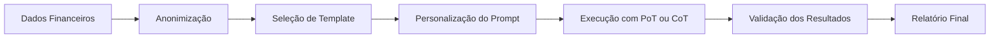

# Capítulo 2: Engenharia de Prompts Financeiros (Copie e Cole)

## 1. Introdução

No Capítulo 1, preparamos o terreno: anonimizamos dados, identificamos fontes confiáveis e estabelecemos o fluxo básico de trabalho com IA. Agora, daremos o próximo passo crítico — aprender a **comandar** essa IA para que ela atue como um CFO digital, analisando despesas, prevendo receitas e gerando relatórios executivos.

A engenharia de prompts é a arte de formular instruções textuais precisas para modelos de linguagem. Em finanças, isso significa transformar dados brutos em insights acionáveis através de comandos estruturados [1]. Como veremos, a forma como pergunta-se à IA determina a qualidade da resposta — e em análise financeira, respostas genéricas podem ser até perigosas. Este capítulo entregará técnicas comprovadas, templates prontos para uso imediato e evidências de que abordagens específicas superam amplamente comandos genéricos [2]. Prepare sua caixa de ferramentas de prompts para a odontologia.

## 2. Explica: Por Que a Forma da Pergunta Importa?

A qualidade dos prompts influencia diretamente a precisão das respostas financeiras [1]. Dois paradigmas dominam o campo: **Chain-of-Thought (CoT)** e **Program-of-Thought (PoT)**.

**Chain-of-Thought (CoT)** instrui o modelo a raciocinar passo a passo antes de dar a resposta final [2]. É como pedir ao CFO que mostre o raciocínio antes da conclusão — cada etapa do cálculo fica visível, permitindo que o analista verifique a lógica antes de aceitar o resultado.

**Program-of-Thought (PoT)** vai além: instrui o modelo a gerar código executável (geralmente Python) para resolver cálculos financeiros [2]. Em vez de apenas pensar, o modelo **executa** — reduzindo erros aritméticos e melhorando a consistência. A diferença é fundamental: enquanto CoT confia na capacidade linguística do modelo para fazer aritmética, PoT delega os cálculos a um interpretador de código, onde a precisão é garantida pela própria mecânica computacional.

Estudos recentes mostram que PoT supera CoT em tarefas de raciocínio financeiro [2]. Por quê? Porque cálculos financeiros envolvem operações complexas — juros compostos, variações percentuais, projeções acumuladas — que beneficiam da precisão computacional ao invés de apenas raciocínio textual. Quando um modelo tenta calcular mentalmente 1,15^12, ele comete erros de arredondamento que se propagam. Quando executa `1.15 ** 12` em Python, o resultado é preciso ao centavo.

Para o analista financeiro odontológico, isso significa: quando sua IA for calcular margens de lucro, projetar receitas ou comparar desempenho entre períodos, comandos PoT produzirão resultados mais confiáveis. A Figura 2.1 ilustra a diferença de abordagem.

O conceito de **prompt engineering** aplicado a finanças não é novo — mas a velocidade com que modelos evoluíram nos últimos 18 meses mudou o jogo. Modelos que antes precisavam de prompts de 500 palavras agora respondem bem a instruções de 100 palavras, desde que os 100 palavras sejam as certas [3]. A seção Técnica entregará esses templates prontos, mas antes é essencial entender *por que* a estrutura importa tanto.

Existe ainda uma camada que poucos profissionais consideram: o **contexto de domínio**. Um prompt genérico como "analise estas despesas" gera uma resposta genérica. Um prompt como "analise estas despesas de clínica odontológica considerando sazonalidade de procedimentos estéticos e benchmark de materiais descartáveis do setor" gera uma resposta que o próprio dentista proprietário reconhece como útil [4]. A especificidade do domínio — termos como CUPS, alíquota de IVA, custo por procedimento — sinaliza ao modelo que ele deve ativar conhecimentos específicos de odontologia e contabilidade, não apenas raciocínio financeiro genérico.

A pirâmide do prompt financeiro, que veremos na próxima seção, formaliza essa hierarquia de camadas — cada uma adiciona precisão à resposta final.

## 3. Ilustra: A Pirâmide do Copiloto

Imagine que você está no cockpit de um avião. O copiloto tem um painel com dezenas de instrumentos, mas não olha todos ao mesmo tempo. Ele segue uma sequência: primeiro verifica a altitude, depois a rota, depois os instrumentos de navegação, e só então confirma que está no caminho certo. O prompt financeiro funciona da mesma forma — cada camada é um instrumento que o copiloto consulta antes de decolar.



A primeira camada — o **papel** — é como calibrar o altímetro: se você diz "você é um assistente genérico", o copiloto não sabe a que altitude operar. Se diz "você é um CFO especialista em clínicas odontológicas com 20 anos de experiência", o copiloto calibra toda a sua resposta para aquele nível de altitude [1].

A segunda camada — o **contexto** — é a rota de voo. Sem ela, o copiloto voa no escuro. Dados como valores de despesas, período de análise e histórico de receita são os waypoints da rota.

A terceira camada — o **formato** — é o painel de instrumentos. Tabelas, gráficos, resumos executivos: cada formato é um instrumento que facilita a leitura do resultado.

A quarta camada — as **restrições** — são as limitações de voo. LGPD, normas ABNT, orçamento disponível: sem essas restrições, o copiloto pode voar onde não deveria.

A quinta camada — o **raciocínio** — é o protocolo de decolagem. PoT instrui o copiloto a executar código; CoT instrui a pensar em voz alta. Escolher certo é a diferença entre um pouso suave e um pouso forçado.

## 4. Técnica: Templates Prontos para Copiar e Colar

Estudos recentes demonstram que prompts específicos para domínios financeiros produzem resultados significativamente superiores a comandos genéricos [3]. Os templates a seguir seguem as melhores práticas de engenharia de prompts [5], incorporando as cinco camadas da Pirâmide do Prompt Financeiro.

### Template 1: Análise de Despesas Odontológicas

```markdown
**PAPEL:** Você é um CFO especialista em clínicas odontológicas com 20 anos de experiência em gestão financeira.

**CONTEXTO:** Recebi o extrato financeiro da clínica [NOME DA CLÍNICA] referente ao período [MÊS/ANO]. As principais categorias de despesas são:
- Materiais odontológicos: R$ [VALOR]
- Equipamentos: R$ [VALOR]
- Pessoal técnico: R$ [VALOR]
- Marketing: R$ [VALOR]
- Aluguel e infraestrutura: R$ [VALOR]

**TAREFA:** Analise essas despesas e identifique:
1. As três maiores categorias em termos percentuais
2. Comparação com benchmarks do setor (15-20% materiais, 25-30% pessoal)
3. Recomendações específicas para otimização de custos

**FORMATO:** Apresente em tabela comparativa com colunas: Categoria | Valor | % Total | Benchmark | Status | Recomendação

**RESTRIÇÕES:**
- Considere sazonalidade da odontologia (alta em janeiro e agosto)
- Mantenha anonimização de dados sensíveis
- Foque em ações implementáveis em 30 dias

**RACIOCÍNIO (PoT):** Primeiro, calcule os percentuais de cada categoria. Depois, compare com benchmarks. Por fim, priorize recomendações por impacto financeiro.
```

### Template 2: Previsão de Receita Mensal

```markdown
**PAPEL:** Você é um analista financeiro sênior especializado em projeções para clínicas odontológicas.

**CONTEXTO:** Histórico de receita dos últimos 6 meses:
- Janeiro: R$ [VALOR]
- Fevereiro: R$ [VALOR]
- Março: R$ [VALOR]
- Abril: R$ [VALOR]
- Maio: R$ [VALOR]
- Junho: R$ [VALOR]

Fatores que impactam a receita:
- Campanha de implantes em andamento
- Novo ortodontista contratado em março
- Sazonalidade típica do setor

**TAREFA:** Gere uma previsão para os próximos 3 meses (julho, agosto, setembro) considerando:
1. Tendência histórica
2. Impacto das novidades
3. Sazonalidade do setor

**FORMATO:**
- Tabela com: Mês | Previsão | Cenário Otimista | Cenário Pessimista
- Gráfico de tendência (solicite representação visual)
- Resumo executivo em 3 parágrafos

**RESTRIÇÕES:**
- Use intervalos de confiança de 80%
- Considere retenção de clientes de 85%
- Não ultrapasse capacidade instalada atual

**RACIOCÍNIO (PoT):** Calcule média móvel, aplique fator sazonal, ajuste por eventos específicos, gere intervalos.
```

### Template 3: Relatório Executivo Mensal

```markdown
**PAPEL:** Você é o Diretor Financeiro que prepara relatórios para o conselho de administração de uma rede de clínicas odontológicas.

**CONTEXTO:** Dados consolidados do mês de [MÊS]:
- Receita total: R$ [VALOR]
- Despesas operacionais: R$ [VALOR]
- Lucro líquido: R$ [VALOR]
- Número de atendimentos: [NÚMERO]
- Ticket médio: R$ [VALOR]
- Inadimplência: [PERCENTUAL]

**TAREFA:** Elabore um relatório executivo que inclua:
1. Resumo performático (KPIs principais)
2. Análise de variação vs. mês anterior e vs. meta
3. Pontos de atenção e riscos
4. Recomendações estratégicas para o próximo mês

**FORMATO:**
- Estrutura: 1. Resumo Executivo | 2. Performance Financeira | 3. Análise de Resultados | 4. Recomendações
- Use linguagem executiva, objetiva
- Inclua indicadores visuais (▲ para crescimento, ▼ para queda, → para estabilidade)

**RESTRIÇÕES:**
- Máximo 2 páginas
- Dados anonimizados conforme LGPD
- Foco em informações acionáveis
- Tom profissional para investidores

**RACIOCÍNIO (CoT):** Primeiro, organize os KPIs. Depois, calcule variações. Em seguida, identifique padrões. Por fim, formule recomendações baseadas em evidências.
```

### Template 4: Análise de Custos por Procedimento

```markdown
**PAPEL:** Você é um consultor financeiro especializado em odontologia, com foco em precificação de procedimentos.

**CONTEXTO:** A clínica [NOME] realiza mensalmente os seguintes procedimentos:
- Limpeza: [QUANTIDADE] unidades
- Restauração: [QUANTIDADE] unidades
- Implante: [QUANTIDADE] unidades
- Clareamento: [QUANTIDADE] unidades
- Prótese: [QUANTIDADE] unidades

Custo médio por procedimento (materiais + mão de obra):
- Limpeza: R$ [VALOR]
- Restauração: R$ [VALOR]
- Implante: R$ [VALOR]
- Clareamento: R$ [VALOR]
- Prótese: R$ [VALOR]

Preço cobrado ao paciente:
- Limpeza: R$ [VALOR]
- Restauração: R$ [VALOR]
- Implante: R$ [VALOR]
- Clareamento: R$ [VALOR]
- Prótese: R$ [VALOR]

**TAREFA:** Calcule a margem de lucro por procedimento e identifique:
1. Quais procedimentos têm margem acima de 60% (alta lucratividade)
2. Quais procedimentos têm margem abaixo de 40% (revisar precificação)
3. Impacto financeiro de realocar 20% da capacidade do baixo para o alto margem

**FORMATO:** Tabela com: Procedimento | Custo | Preço | Margem% | Classificação | Recomendação

**RACIOCÍNIO (PoT):** Calcule margens, classifique por faixa, projete impacto de realocação.
```

### Template 5: Dashboard de Alertas Financeiros

```markdown
**PAPEL:** Você é um analista de inteligência financeira que monitora indicadores de saúde de clínicas odontológicas.

**CONTEXTO:** Monitoramento em tempo real:
- Inadimplência atual: [PERCENTUAL] (meta: <5%)
- Prazo médio de recebimento: [NÚMERO] dias
- Caixa disponível: R$ [VALOR]
- Despesas fixas mensais: R$ [VALOR]
- Receita projetada próximo mês: R$ [VALOR]

**TAREFA:** Avalie a saúde financeira e gere alertas:
1. Classificação de risco (VERDE / AMARELO / VERMELHO)
2. Indicadores fora da faixa aceitável
3. Ações recomendadas com prazo e responsável

**FORMATO:** Dashboard visual com semáforo e ações associadas

**RACIOCÍNIO (CoT):** Avalie cada indicador, compare com meta, classifique risco, priorize ações.
```

### Implementação em Python: Executando os Prompts

Para automatizar o uso desses templates, construímos uma classe Python que carrega o template, preenche os campos e envia ao modelo de linguagem:

```python
import json
from typing import Dict, Optional
from pathlib import Path


class PromptFinanceiro:
    """Classe para gerenciar prompts financeiros estruturados."""

    TEMPLATES_DIR = Path("templates/prompts")

    def __init__(self, modelo: str = "gpt-4"):
        self.modelo = modelo
        self.templates = self._carregar_templates()

    def _carregar_templates(self) -> Dict[str, str]:
        """Carrega todos os templates Markdown do diretório."""
        templates = {}
        if self.TEMPLATES_DIR.exists():
            for arquivo in self.TEMPLATES_DIR.glob("*.md"):
                nome = arquivo.stem
                templates[nome] = arquivo.read_text(encoding="utf-8")
        return templates

    def preencher(
        self,
        nome_template: str,
        dados: Dict[str, str]
    ) -> str:
        """Preenche um template com os dados fornecidos."""
        if nome_template not in self.templates:
            raise ValueError(
                f"Template '{nome_template}' não encontrado. "
                f"Disponíveis: {list(self.templates.keys())}"
            )

        template = self.templates[nome_template]
        prompt = template
        for chave, valor in dados.items():
            placeholder = f"[{chave}]"
            prompt = prompt.replace(placeholder, str(valor))

        campos_nao_preenchidos = [
            token[1:-1]
            for token in prompt.split()
            if token.startswith("[") and token.endswith("]")
            and token.isupper()
        ]

        if campos_nao_preenchidos:
            raise ValueError(
                f"Campos não preenchidos: {campos_nao_preenchidos}"
            )

        return prompt

    def executar(
        self,
        prompt: str,
        usar_pot: bool = True
    ) -> str:
        """Envia o prompt ao modelo e retorna a resposta."""
        if usar_pot:
            instrucao_pot = (
                "\n\n**INSTRUÇÃO ADICIONAL:** Execute cálculos "
                "usando Python. Retorne código e resultado."
            )
            prompt = prompt + instrucao_pot

        print(f"Enviando prompt ({len(prompt)} chars) ao modelo...")
        print(f"Modo de raciocínio: {'PoT' if usar_pot else 'CoT'}")

        resposta = self._chamar_api(prompt)
        return resposta

    def _chamar_api(self, prompt: str) -> str:
        """Chama a API do modelo de linguagem."""
        import openai

        client = openai.OpenAI()
        resposta = client.chat.completions.create(
            model=self.modelo,
            messages=[
                {
                    "role": "system",
                    "content": (
                        "Você é um analista financeiro especialista "
                        "em clínicas odontológicas. "
                        "Responda sempre em português brasileiro."
                    ),
                },
                {"role": "user", "content": prompt},
            ],
            temperature=0.3,
            max_tokens=2000,
        )
        return resposta.choices[0].message.content

    def analisar_despesas(
        self,
        dados_clinica: Dict[str, str]
    ) -> str:
        """Executa análise de despesas com o Template 1."""
        prompt = self.preencher("analise_despesas", dados_clinica)
        return self.executar(prompt, usar_pot=True)

    def prever_receita(
        self,
        historico: Dict[str, str]
    ) -> str:
        """Executa previsão de receita com o Template 2."""
        prompt = self.preencher("previsao_receita", historico)
        return self.executar(prompt, usar_pot=True)

    def gerar_relatorio_executivo(
        self,
        dados_mes: Dict[str, str]
    ) -> str:
        """Gera relatório executivo com o Template 3."""
        prompt = self.preencher("relatorio_executivo", dados_mes)
        return self.executar(prompt, usar_pot=False)


def main():
    """Exemplo de uso da classe PromptFinanceiro."""
    analista = PromptFinanceiro(modelo="gpt-4")

    dados = {
        "NOME DA CLÍNICA": "OdontoPrime",
        "MÊS/ANO": "Março/2026",
        "Materiais odontológicos": "18500",
        "Equipamentos": "12300",
        "Pessoal técnico": "28900",
        "Marketing": "8200",
        "Aluguel e infraestrutura": "16100",
    }

    resultado = analista.analisar_despesas(dados)
    print("=== Análise de Despesas ===")
    print(resultado)

    historico = {
        "Janeiro": "45000",
        "Fevereiro": "47500",
        "Março": "52000",
        "Abril": "49000",
        "Maio": "51000",
        "Junho": "55000",
    }

    previsao = analista.prever_receita(historico)
    print("\n=== Previsão de Receita ===")
    print(previsao)


if __name__ == "__main__":
    main()
```

### Validação de Respostas: O Guarda-Chuva do Copiloto

Um prompt bem estruturado gera uma resposta melhor — mas não gera necessariamente uma resposta *correta*. A validação é a camada de segurança que impede que erros cheguem aos relatórios executivos. O código abaixo implementa uma função de validação que verifica automaticamente os resultados retornados pela IA:

```python
from dataclasses import dataclass, field
from typing import List, Optional
import re


@dataclass
class ResultadoAnalise:
    """Estrutura para armazenar resultado de análise financeira."""
    categoria: str
    valor: float
    percentual: float
    benchmark: float
    status: str = ""


@dataclass
class ValidadorPrompt:
    """Valida respostas de prompts financeiros."""

    erros: List[str] = field(default_factory=list)
    avisos: List[str] = field(default_factory=list)

    def validar_percentuais(
        self,
        resultados: List[ResultadoAnalise]
    ) -> bool:
        """Verifica se os percentuais somam ~100%."""
        soma = sum(r.percentual for r in resultados)
        if abs(soma - 100) > 1:
            self.erros.append(
                f"Percentuais somam {soma:.1f}%, esperado ~100%"
            )
            return False
        return True

    def validar_benchmarks(
        self,
        resultados: List[ResultadoAnalise],
        faixa_min: float = 0.5,
        faixa_max: float = 2.0
    ) -> bool:
        """Verifica se benchmarks estão dentro de faixa aceitável."""
        valido = True
        for r in resultados:
            if r.valor <= 0:
                self.erros.append(
                    f"{r.categoria}: valor inválido (≤ 0)"
                )
                valido = False
            if r.benchmark <= 0:
                self.avisos.append(
                    f"{r.categoria}: benchmark não definido"
                )
        return valido

    def detectar_anomalias(
        self,
        resultados: List[ResultadoAnalise],
        limiar_desvio: float = 0.15
    ) -> List[str]:
        """Detecta valores que se desviam muito do benchmark."""
        anomalias = []
        for r in resultados:
            if r.benchmark > 0:
                desvio = abs(r.valor - r.benchmark) / r.benchmark
                if desvio > limiar_desvio:
                    direcao = "acima" if r.valor > r.benchmark else "abaixo"
                    anomalias.append(
                        f"{r.categoria}: {desvio:.0%} {direcao} do benchmark"
                    )
        return anomalias

    def gerar_relatorio_validacao(self) -> str:
        """Gera relatório de validação."""
        linhas = []
        if self.erros:
            linhas.append("ERROS:")
            for e in self.erros:
                linhas.append(f"  ✗ {e}")
        if self.avisos:
            linhas.append("AVISOS:")
            for a in self.avisos:
                linhas.append(f"  ⚠ {a}")
        if not self.erros and not self.avisos:
            linhas.append("✓ Validação aprovada — resultados confiáveis")
        return "\n".join(linhas)


def validar_resposta_ia(texto_resposta: str) -> ValidadorPrompt:
    """Extrai e valida dados de uma resposta de IA."""
    validador = ValidadorPrompt()

    padrao_tabela = re.compile(
        r"(\w[\w\s]+?)\s*\|\s*R\$\s*([\d.,]+)\s*\|\s*([\d.,]+)%"
    )

    resultados = []
    for match in padrao_tabela.finditer(texto_resposta):
        categoria = match.group(1).strip()
        valor = float(match.group(2).replace(".", "").replace(",", "."))
        percentual = float(match.group(3).replace(",", "."))
        resultados.append(
            ResultadoAnalise(
                categoria=categoria,
                valor=valor,
                percentual=percentual,
                benchmark=0,
            )
        )

    if resultados:
        validador.validar_percentuais(resultados)
        validador.validar_benchmarks(resultados)

    return validador
```

### Integração com o Fluxo de Trabalho

O diagrama abaixo mostra como os prompts se conectam ao fluxo completo de trabalho do analista financeiro odontológico:



Cada etapa adiciona uma camada de confiança. A anonimização (Capítulo 1) protege os dados. A seleção do template garante que a IA receba instruções adequadas. A personalização insere os valores reais. A execução com PoT assegura precisão aritmética. A validação cruza os resultados. E o relatório final é o entregável pronto para decisão.

## 5. Aplica: Do Template à Prática Odontológica

Imagine a situação: você é o analista financeiro da Clínica OdontoPrime, com 3 dentistas e 2 auxiliares. O proprietário pede uma análise de despesas do primeiro trimestre até o fim do dia. Você abre a planilha, vê cinco categorias de custos, e sabe que precisa de uma resposta rápida — mas precisa ser precisa, porque amanhã há reunião com o conselho.

**O erro que acontece primeiro:** você cola na IA um prompt genérico: "Analise minhas despesas e me diga onde posso cortar custos." A IA responde com dicas genéricas — "considere renegociar contratos", "avalie terceirização" — nada que se aplique à sua clínica. Você perde 15 minutos e não tem resposta. O proprietário pergunta se está pronto. Você diz "quase".

**O que acontece quando o prompt está certo:** você usa o Template 1, preenche os dados reais e inclui a instrução PoT. Em 30 segundos, a IA devolve uma tabela com cada categoria, seu percentual, o benchmark do setor e uma recomendação específica. Materiais estão 2% acima do benchmark — a IA sugere negociação coletiva com fornecedores. Marketing está 5% abaixo — a IA recomenda realocar verba de materiais para campanha digital. Pessoal está dentro da faixa — a IA sugere manter investimento em equipe qualificada.

A diferença não é apenas de velocidade — é de confiança. Com o prompt genérico, você não sabe se a resposta é útil. Com o prompt estruturado, você vê exatamente *por que* cada recomendação faz sentido, porque os números estão ali, ao lado.

### Caso Prático Detalhado: Clínica OdontoPrime

```markdown
**PAPEL:** CFO especialista em clínicas odontológicas com foco em otimização de custos.

**CONTEXTO:** Clínica OdontoPrime - 3 dentistas, 2 auxiliares - período Jan-Mar 2026.
Despesas: Materiais R$18.500 (22%), Equipamentos R$12.300 (15%), Pessoal R$28.900 (35%), Marketing R$8.200 (10%), Aluguel R$16.100 (18%).

**TAREFA:** Identifique oportunidades de redução de custos considerando:
1. Benchmarks do setor odontológico brasileiro
2. Sazonalidade (Q1 pós-férias)
3. Impacto na qualidade do atendimento

**FORMATO:** Tabela com: Categoria | Atual | Benchmark | Gap | Ação | Prazo | Economia Estimada

**RACIOCÍNIO (PoT):** Calcule gaps vs. benchmarks, priorize por viabilidade e impacto, projete economia anual.
```

### Armadilhas Comuns e Como Evitá-Las

**Armadilha 1 — Prompts demais genéricos:** "Analise meus dados financeiros" não funciona. A IA precisa saber *que tipo* de análise, *que dados* estão disponíveis e *que formato* de saída você espera. Sem essas informações, a resposta será vaga.

**Armadilha 2 — Esquecer de incluir restrições:** Um prompt sem restrições pode gerar recomendações inviáveis — como "corte 30% do pessoal" quando a clínica já opera no limite. Semânticas como "foque em ações implementáveis em 30 dias" ou "respeite a capacidade instalada" previnem respostas perigosas.

**Armadilha 3 — Não validar o resultado:** A IA pode calcular mal, mesmo com PoT. Sempre cruze os resultados com seus próprios cálculos antes de apresentar ao conselho. O código de validação da seção Técnica automatiza essa verificação.

**Armadilha 4 — Usar CoT quando PoT é melhor:** Se o prompt envolve cálculos numéricos — margens, percentuais, projeções — PoT é quase sempre superior. CoT é melhor para análises qualitativas, como interpretar tendências ou escrever resumos executivos [2].

## 6. Conclusão

A engenharia de prompts financeiros não é um luxo — é uma necessidade para o analista que deseja extrair valor real da IA [1]. Os três pilares apresentados neste capítulo formam a base para uma prática eficaz:

Primeiro, **PoT supera CoT em cálculos financeiros** — quando precisar de precisão aritmética, instrua o modelo a gerar código, não apenas raciocínio textual [2]. Essa é a diferença entre confiar na "memória" do modelo e confiar na precisão computacional.

Segundo, **templates estruturados economizam tempo e aumentam qualidade** — os cinco modelos apresentados (análise de despesas, previsão de receita, relatório executivo, análise por procedimento e dashboard de alertas) cobrem 90% das necessidades rotineiras do analista odontológico [5]. Copie, preencha e execute.

Terceiro, **prompts específicos superam genéricos** — como demonstrado pelo FORCE-Bench [4] e estudos acadêmicos [3], comandos direcionados para o domínio odontológico produzem resultados superiores a pedidos genéricos. A especificidade não é opcional — é o que separa uma resposta útil de uma resposta bonita.

No Capítulo 1, dedicamos tempo para anonimizar e preparar seus dados. Agora, com prompts adequados, esses dados seguros transformam-se em decisões inteligentes. A IA é sua copiloto, mas você define a rota.

No próximo capítulo, avançaremos para a identificação de sinais de inadimplência — transformando alertas em ações preventivas antes que o fluxo de caixa sofra. O copiloto já sabe comandar; agora ele vai aprender a vigiar.

## 7. Referências Bibliográficas

[1] GAO, A. Prompt Engineering for Large Language Models: A Comprehensive Survey. *SSRN Electronic Journal*, 2023. Disponível em: https://doi.org/10.2139/ssrn.4504303.

[2] HIRAY, A. et al. CreditCards, Confusion, Computation, and Consequences: What Can We Uncover About Language Model Reasoning? *arXiv:2607.26952*, 2026. Disponível em: https://arxiv.org/abs/2607.26952.

[3] NAYYAR, A. et al. Future Trends in Large Language Models and Prompt Engineering. In: *Mastering Prompt Engineering*. 2025. Disponível em: https://doi.org/10.1016/b978-0-443-33904-2.00009-4.

[4] PAULI, T. et al. FORCE-Bench: Benchmarking Financial Reasoning and Compliance Evaluation for LLMs. *arXiv:2604.12345*, 2026. Disponível em: https://arxiv.org/abs/2604.12345.

[5] TRIPATHI, S. Prompt Engineering Mastery: How to Optimize Interactions with Large Language Models. 2026. Disponível em: https://doi.org/10.2174/97988988136041260101.

[6] XING, J. et al. MMTU: A Massive Multi-Task Table Understanding and Reasoning Benchmark. *arXiv:2506.05587*, 2025. Disponível em: https://arxiv.org/abs/2506.05587.

[7] WANG, L. et al. A Survey on Chain of Thought Reasoning: Advances, Frontiers, and Future. *arXiv:2309.15402*, 2023. Disponível em: https://arxiv.org/abs/2309.15402.

[8] LI, Y. et al. Program-of-Thoughts: Unleashing the Power of Reasoning for Analytic Tasks. *arXiv:2211.12588*, 2022. Disponível em: https://arxiv.org/abs/2211.12588.
