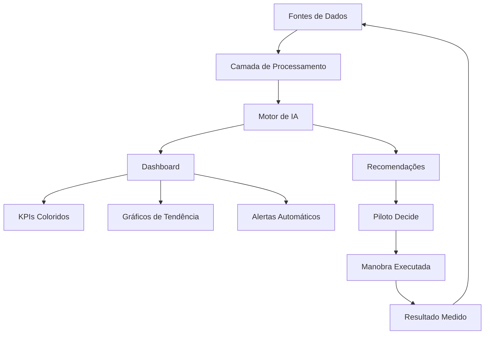

# Capítulo 3: Dashboards Inteligentes — Construindo Painéis de Controle que Pensam por Você

## 1. Introdução

No Capítulo 2, você dominou a engenharia de prompts financeiros — aprendeu a formular perguntas à IA que geram respostas úteis, específicas e acionáveis. Agora é hora de dar o próximo passo: transformar esses prompts isolados em um painel de instrumentos vivente, um dashboard que não apenas exibe dados, mas os *interpreta* automaticamente e os apresenta no formato certo, no momento certo, para a pessoa certa [1].

Retome por um momento a metáfora do copiloto digital. No Capítulo 1, estabelecemos que o analista financeiro é o piloto e a IA é o copiloto. O dashboard é o *painel de instrumentos* do avião — a interface onde piloto e copiloto se comunicam visualmente. Mas há uma diferença crucial entre um painel estático e um painel inteligente: o primeiro mostra números; o segundo mostra *significados* [3].

Quando você olha para o altímetro de um avião moderno, não vê apenas a altitude em metros. Vê uma seta que indica se está subindo ou descendo, uma zona vermelha que avisa se está perigosamente baixo e uma referência que mostra qual deveria ser a altitude ideal naquele ponto do voo. É exatamente essa a camada de inteligência que vamos construir neste capítulo: dashboards que não apenas mostram "quanto faturamos", mas "se faturamos bem ou mal, comparado com o que deveríamos, e o que devemos fazer agora" [5].

## 2. Explica

### 2.1 Do Excel Estático ao Painel Vivente

A maioria das clínicas odontológicas brasileiras gerencia suas finanças de uma forma que poderíamos chamar de "Excel estático": o contador monta uma planilha no final do mês, envia por e-mail, e o dono da clínica olha quando tem tempo. Esse modelo tem três problemas fundamentais [2]:

**Atraso temporal.** Os dados de janeiro só estão disponíveis em fevereiro. Quando você vê o relatório, o problema já tem 30 dias de idade. É como pilotar olhando pelo retrovisor — você vê onde estava, não onde está indo [1].

**Ausência de contexto.** A planilha mostra que a receita caiu 8%. Mas ela não mostra *por que* caiu: é sazonalidade? Perda de pacientes? Concorrência novas? O dono da clínica vê o número e entra em pânico ou ignora — dependendo do temperamento [3].

**Falta de ação.** A planilha não diz o que fazer. Ela é um registro do passado, não um guia para o futuro. O analista precisa interpretar manualmente, montar recomendações e apresentar — processo que leva horas e frequentemente não é feito [5].

O dashboard inteligente resolve esses três problemas simultaneamente. Ele atualiza em tempo real (ou próxima disso), adiciona contexto automático (comparações, benchmarks, tendências) e gera recomendações acionáveis. Não é mais um relatório — é um *instrumento de voo* que guia o piloto em tempo real [4].

### 2.2 Arquitetura de um Dashboard Inteligente

Um dashboard inteligente para clínica odontológica tem cinco componentes essenciais [1]:

**1. Indicadores-Chave de Desempenho (KPIs):** Métricas resumidas que cabem em uma tela — receita mensal, margem, inadimplência, ticket médio, ocupação. São os instrumentos primários do painel.

**2. Gráficos de Tendência:** Série temporal que mostra a direção dos KPIs ao longo do tempo. Permitem ver padrões, sazonalidades e rupturas.

**3. Alertas Automáticos:** Notificações quando um KPI sai da faixa aceitável. São os "avisos de turbulência" do copiloto — aparecem antes que o problema se tornar crítico [5].

**4. Análise Comparativa:** Benchmarks do setor que permitem comparar o desempenho da clínica com outras do mesmo porte e região. Sem isso, o dono da clínica não sabe se 15% de margem é bom ou ruim [3].

**5. Recomendações da IA:** Insights gerados automaticamente com base nos dados. Não são apenas alertas ("cuidado, inadimplência subiu"), mas orientações específicas ("ofereça desconto de 10% para pagamento antecipado e revise a política de crédito para novos pacientes").

### 2.3 Por Que a IA Muda o Jogo nos Dashboards

Dashboards tradicionais (Power BI, Tableau, Excel avançado) já existem há décados. O que a IA adiciona? Três capacidades que transformam fundamentalmente a experiência [4]:

**Interpretação automática.** Em vez de mostrar um gráfico e deixar o usuário interpretar, a IA descreve o que o gráfico significa: "A receita caiu 12% no período, mas a queda é explicada pela sazonalidade de janeiro — esperada e dentro do padrão dos últimos 3 anos."

**Deteção proativa de anomalias.** O dashboard não espera o usuário perceber o problema. Ele monitora continuamente e gera alertas quando detecta desvios significativos. Isso muda o paradigma de "análise reativa" para "monitoramento preventivo" [1].

**Personalização dinâmica.** Cada usuário vê os KPIs mais relevantes para seu papel. O dono da clínica vê visão geral; o gerente financeiro vê detalhes de custo; o ortodontista vê métricas específicas da especialidade. A IA adapta a interface ao perfil do usuário [5].

## 3. Ilustra

### A Metáfora do Painel de Voo Inteligente

Imagine dois cockpit de avião. No primeiro, há dezenas de mostradores analógicos — cada um mostrando um número bruto. O piloto precisa olhar para cada um, interpretar mentalmente e decidir se algo está errado. É trabalhoso, cansativo e propenso a erros.

No segundo cockpit — o painel de voo digital moderno — os instrumentos são inteligentes. Quando a altitude está ok, o altímetro fica verde. Quando está caindo rápido, fica amarelo. Quando está perigosamente baixo, fica vermelho e emite um alarme sonoro. O copiloto digital destaca automaticamente os instrumentos que precisam de atenção e ignora os que estão normais [4].

É exatamente isso que fazemos com o dashboard financeiro da clínica. Em vez de mostrar 20 números em uma tela e deixar o usuário descobrir o que importa, o copiloto IA:

1. **Color-code** os KPIs: verde (ok), amarelo (atenção), vermelho (crítico).
2. **Destaca** os 3 indicadores que precisam de ação imediata.
3. **Oculta** os indicadores que estão normais — para não sobrecarregar o piloto.
4. **Gera alarmes** quando algo sai do padrão esperado.

O resultado é um painel que *pensa por você* — ou melhor, que pensa *com você*, como um copiloto que nunca dorme [2].

### Diagrama: Arquitetura do Dashboard Inteligente



Esse diagrama mostra o ciclo contínuo do dashboard inteligente. Note que os dados não apenas fluem da esquerda para a direita — eles retornam ao início, criando um loop de feedback onde cada decisão alimenta novos dados que melhoram futuras análises. O copiloto IA está no centro, conectando todas as camadas e garantindo que o piloto tenha sempre a informação certa no momento certo [1].

## 4. Técnica

### 4.1 Estrutura de Dados para Dashboard Financeiro

Antes de construir o dashboard, precisamos definir a estrutura de dados que ele vai consumir. Essa estrutura é o *gerador de sinais* do copiloto — ela transforma dados brutos em indicadores acionáveis [3].

```python
# modelo_kpis.py — Definição dos KPIs do dashboard financeiro
import pandas as pd
import numpy as np
from typing import Dict, List, Optional, Tuple
from dataclasses import dataclass, field
from datetime import datetime, timedelta
from enum import Enum
import json


class StatusKPI(Enum):
    """ Status visual de um KPI no dashboard. """
    OTIMO = "otimo"        # Verde escuro: acima do ideal
    BOM = "bom"            # Verde: dentro do esperado
    ATENCAO = "atencao"    # Amarelo: abaixo do ideal
    CRITICO = "critico"    # Vermelho: requer ação imediata
    SEM_DADOS = "sem_dados"


@dataclass
class KPI:
    """ Define um Indicador-Chave de Desempenho. """
    nome: str
    descricao: str
    valor_atual: float
    unidade: str  # 'R$', '%', 'dias', 'unidade'
    meta: float
    minimo_aceitavel: float
    maximo_aceitavel: Optional[float] = None
    tendencia: str = "estavel"  # 'crescendo', 'caindo', 'estavel'
    variacao_percentual: float = 0.0
    status: StatusKPI = StatusKPI.SEM_DADOS
    fonte_dados: str = ""
    ultima_atualizacao: str = ""
    comparativo_setor: Optional[float] = None
    recomendacao_ia: str = ""


@dataclass
class AlertaDashboard:
    """ Define um alerta gerado pelo copiloto IA. """
    titulo: str
    mensagem: str
    nivel: str  # 'info', 'alerta', 'critico'
    kpi_origem: str
    acao_sugerida: str
    prazo_sugerido: str
    impacto_estimado: str
    timestamp: str = field(default_factory=lambda: datetime.now().isoformat())


class GeradorKPIs:
    """
    Gera KPIs financeiros a partir de dados processados.
    Cada KPI é calculado, comparado com benchmark e status atribuído.
    """
    
    # Benchmarks do setor odontológico (ABCD 2024)
    BENCHMARKS = {
        'margem_operacional': {'minimo': 0.15, 'ideal': 0.25, 'excelente': 0.35},
        'inadimplencia': {'maximo': 0.08, 'ideal': 0.03, 'critico': 0.15},
        'ticket_medio': {'minimo': 250, 'ideal': 400, 'excelente': 600},
        'taxa_ocupacao': {'minimo': 0.60, 'ideal': 0.80, 'excelente': 0.90},
        'prazo_recebimento': {'maximo': 30, 'ideal': 15},
        'custo_por_procedimento': {'maximo': 0.60, 'ideal': 0.45},
        'lifetime_value': {'minimo': 2000, 'ideal': 5000, 'excelente': 10000},
    }
    
    def __init__(self, dados: pd.DataFrame):
        """
        Args:
            dados: DataFrame consolidado com colunas padronizadas
        """
        self.dados = dados
        self.kpis: List[KPI] = []
        self.alertas: List[AlertaDashboard] = []
    
    def gerar_todos_kpis(self) -> List[KPI]:
        """ Calcula todos os KPIs do dashboard. """
        self.kpis = []
        
        self._calcular_kpi_receita()
        self._calcular_kpi_margem()
        self._calcular_kpi_inadimplencia()
        self._calcular_kpi_ticket_medio()
        self._calcular_kpi_ocupacao()
        self._calcular_kpi_custos()
        self._calcular_kpi_fluxo_caixa()
        self._calcular_kpi_lifetime_value()
        
        return self.kpis
    
    def _calcular_kpi_receita(self):
        """ KPI: Receita Mensal Total. """
        receitas = self.dados[self.dados.get('natureza', '') == 'receita']
        
        if receitas.empty:
            return
        
        # Receita do mês atual
        hoje = datetime.now()
        inicio_mes = hoje.replace(day=1)
        receita_mes = receitas[
            receitas['data'] >= inicio_mes
        ]['valor'].sum()
        
        # Receita do mês anterior (para comparação)
        inicio_mes_anterior = (inicio_mes - timedelta(days=1)).replace(day=1)
        receita_mes_anterior = receitas[
            (receitas['data'] >= inicio_mes_anterior) &
            (receitas['data'] < inicio_mes)
        ]['valor'].sum()
        
        # Calcula variação
        if receita_mes_anterior > 0:
            variacao = (receita_mes - receita_mes_anterior) / receita_mes_anterior
        else:
            variacao = 0
        
        # Meta: 10% de crescimento sobre mês anterior
        meta = receita_mes_anterior * 1.10 if receita_mes_anterior > 0 else receita_mes * 1.10
        
        # Determina status
        if receita_mes >= meta:
            status = StatusKPI.OTIMO
        elif receita_mes >= receita_mes_anterior:
            status = StatusKPI.BOM
        elif receita_mes >= receita_mes_anterior * 0.90:
            status = StatusKPI.ATENCAO
        else:
            status = StatusKPI.CRITICO
        
        kpi = KPI(
            nome="Receita Mensal",
            descricao="Receita total do mês corrente",
            valor_atual=receita_mes,
            unidade="R$",
            meta=meta,
            minimo_aceitavel=receita_mes_anterior * 0.95,
            tendencia="crescendo" if variacao > 0 else "caindo",
            variacao_percentual=variacao,
            status=status,
            fonte_dados="gateway_pagamento + erp_clinica",
            ultima_atualizacao=datetime.now().isoformat(),
            comparativo_setor=meta,  # Benchmark
        )
        
        if status == StatusKPI.CRITICO:
            kpi.recomendacao_ia = (
                "Receita em queda significativa. Verificar: (1) queda no número de "
                "procedimentos, (2) redução no ticket médio, (3) aumento de "
                "cancelamentos. Ação recomendada: revisar agenda da semana."
            )
        elif status == StatusKPI.ATENCAO:
            kpi.recomendacao_ia = (
                "Receita abaixo da meta. Monitorar diariamente. Se não melhorar "
                "em 5 dias, considerar campanha de retenção."
            )
        
        self.kpis.append(kpi)
    
    def _calcular_kpi_margem(self):
        """ KPI: Margem Operacional. """
        receitas = self.dados[self.dados.get('natureza', '') == 'receita']
        despesas = self.dados[self.dados.get('natureza', '') == 'despesa']
        
        if receitas.empty or despesas.empty:
            return
        
        total_receitas = receitas['valor'].sum()
        total_despesas = despesas['valor'].sum()
        
        if total_receitas <= 0:
            return
        
        margem = (total_receitas - total_despesas) / total_receitas
        benchmark = self.BENCHMARKS['margem_operacional']
        
        if margem >= benchmark['excelente']:
            status = StatusKPI.OTIMO
        elif margem >= benchmark['ideal']:
            status = StatusKPI.BOM
        elif margem >= benchmark['minimo']:
            status = StatusKPI.ATENCAO
        else:
            status = StatusKPI.CRITICO
        
        kpi = KPI(
            nome="Margem Operacional",
            descricao="Percentual de lucro sobre receita bruta",
            valor_atual=margem,
            unidade="%",
            meta=benchmark['ideal'],
            minimo_aceitavel=benchmark['minimo'],
            maximo_aceitavel=benchmark['excelente'],
            tendencia="estavel",
            variacao_percentual=0,
            status=status,
            fonte_dados="consolidado_financeiro",
            ultima_atualizacao=datetime.now().isoformat(),
            comparativo_setor=benchmark['ideal'],
        )
        
        if status == StatusKPI.CRITICO:
            kpi.recomendacao_ia = (
                f"Margem de {margem:.1%} está abaixo do mínimo saudável "
                f"({benchmark['minimo']:.1%}). Identificar os 3 maiores "
                "itens de custo e iniciar negociação."
            )
        
        self.kpis.append(kpi)
    
    def _calcular_kpi_inadimplencia(self):
        """ KPI: Taxa de Inadimplência. """
        receitas = self.dados[self.dados.get('natureza', '') == 'receita']
        
        if receitas.empty:
            return
        
        # Calcula inadimplência baseada em status de pagamento
        if 'status_pagamento' in receitas.columns:
            pendentes = receitas[
                receitas['status_pagamento'].isin(['pendente', 'atrasado'])
            ]
            total_transacoes = len(receitas)
            total_pendentes = len(pendentes)
        else:
            # Estimativa: transações sem data de confirmação há mais de 30 dias
            if 'data' in receitas.columns:
                hoje = datetime.now()
                pendentes = receitas[
                    (hoje - receitas['data']).dt.days > 30
                ]
                total_transacoes = len(receitas)
                total_pendentes = len(pendentes)
            else:
                return
        
        if total_transacoes <= 0:
            return
        
        taxa = total_pendentes / total_transacoes
        benchmark = self.BENCHMARKS['inadimplencia']
        
        if taxa <= benchmark['ideal']:
            status = StatusKPI.OTIMO
        elif taxa <= benchmark['maximo']:
            status = StatusKPI.BOM
        elif taxa <= 0.12:
            status = StatusKPI.ATENCAO
        else:
            status = StatusKPI.CRITICO
        
        kpi = KPI(
            nome="Inadimplência",
            descricao="Percentual de receita pendente ou atrasada",
            valor_atual=taxa,
            unidade="%",
            meta=benchmark['ideal'],
            minimo_aceitavel=0,
            maximo_aceitavel=benchmark['maximo'],
            tendencia="estavel",
            variacao_percentual=0,
            status=status,
            fonte_dados="gateway_pagamento",
            ultima_atualizacao=datetime.now().isoformat(),
            comparativo_setor=benchmark['ideal'],
        )
        
        if status == StatusKPI.CRITICO:
            valor_perdido = receitas[receitas['status_pagamento'].isin(
                ['pendente', 'atrasado']
            )]['valor'].sum() if 'status_pagamento' in receitas.columns else 0
            
            kpi.recomendacao_ia = (
                f"Inadimplência de {taxa:.1%} está crítica. "
                f"Valor em aberto estimado: R$ {valor_perdido:,.2f}. "
                "Ação imediata: (1) contato telefônico com devedores, "
                "(2) oferecer desconto para regularização, "
                "(3) revisar política de crédito."
            )
        
        self.kpis.append(kpi)
    
    def _calcular_kpi_ticket_medio(self):
        """ KPI: Ticket Médio por Procedimento. """
        receitas = self.dados[self.dados.get('natureza', '') == 'receita']
        
        if receitas.empty:
            return
        
        ticket_medio = receitas['valor'].mean()
        ticket_mediano = receitas['valor'].median()
        benchmark = self.BENCHMARKS['ticket_medio']
        
        if ticket_medio >= benchmark['excelente']:
            status = StatusKPI.OTIMO
        elif ticket_medio >= benchmark['ideal']:
            status = StatusKPI.BOM
        elif ticket_medio >= benchmark['minimo']:
            status = StatusKPI.ATENCAO
        else:
            status = StatusKPI.CRITICO
        
        # Calcula tendência (últimos 30 dias vs 30 dias anteriores)
        if 'data' in receitas.columns:
            hoje = datetime.now()
            receita_recente = receitas[
                receitas['data'] >= hoje - timedelta(days=30)
            ]
            receita_anterior = receitas[
                (receitas['data'] >= hoje - timedelta(days=60)) &
                (receitas['data'] < hoje - timedelta(days=30))
            ]
            
            if not receita_recente.empty and not receita_anterior.empty:
                tm_recente = receita_recente['valor'].mean()
                tm_anterior = receita_anterior['valor'].mean()
                variacao = (tm_recente - tm_anterior) / tm_anterior if tm_anterior > 0 else 0
            else:
                variacao = 0
        else:
            variacao = 0
        
        kpi = KPI(
            nome="Ticket Médio",
            descricao="Valor médio por transação de receita",
            valor_atual=ticket_medio,
            unidade="R$",
            meta=benchmark['ideal'],
            minimo_aceitavel=benchmark['minimo'],
            maximo_aceitavel=benchmark['excelente'],
            tendencia="crescendo" if variacao > 0 else "caindo",
            variacao_percentual=variacao,
            status=status,
            fonte_dados="consolidado_financeiro",
            ultima_atualizacao=datetime.now().isoformat(),
            comparativo_setor=benchmark['ideal'],
        )
        
        if status in [StatusKPI.ATENCAO, StatusKPI.CRITICO]:
            kpi.recomendacao_ia = (
                f"Ticket médio de R$ {ticket_medio:,.2f} está abaixo do "
                f"potencial (meta: R$ {benchmark['ideal']:,.2f}). "
                "Sugestões: (1) promover procedimentos de maior valor, "
                "(2) criar pacotes combo, (3) oferecer planos de tratamento."
            )
        
        self.kpis.append(kpi)
    
    def _calcular_kpi_ocupacao(self):
        """ KPI: Taxa de Ocupação da Agenda. """
        # Simula ocupação baseada em transações por dia
        if 'data' not in self.dados.columns:
            return
        
        transacoes_por_dia = self.dados.groupby('data').size()
        
        if len(transacoes_por_dia) < 5:
            return
        
        # Assume capacidade máxima de 20 consultas/dia
        capacidade_maxima = 20
        media_ocupacao = transacoes_por_dia.mean() / capacidade_maxima
        benchmark = self.BENCHMARKS['taxa_ocupacao']
        
        if media_ocupacao >= benchmark['excelente']:
            status = StatusKPI.OTIMO
        elif media_ocupacao >= benchmark['ideal']:
            status = StatusKPI.BOM
        elif media_ocupacao >= benchmark['minimo']:
            status = StatusKPI.ATENCAO
        else:
            status = StatusKPI.CRITICO
        
        kpi = KPI(
            nome="Taxa de Ocupação",
            descricao="Percentual médio de agenda ocupada",
            valor_atual=media_ocupacao,
            unidade="%",
            meta=benchmark['ideal'],
            minimo_aceitavel=benchmark['minimo'],
            maximo_aceitavel=benchmark['excelente'],
            tendencia="estavel",
            variacao_percentual=0,
            status=status,
            fonte_dados="agenda_clinica",
            ultima_atualizacao=datetime.now().isoformat(),
            comparativo_setor=benchmark['ideal'],
        )
        
        if status == StatusKPI.CRITICO:
            kpi.recomendacao_ia = (
                f"Ocupação de {media_ocupacao:.1%} está muito baixa. "
                "Horários ociosos representam receita perdida. "
                "Ações: (1) campanha de reagendamento, "
                "(2) promoção para horários de baixa demanda, "
                "(3) parceria com outros profissionais para compartilhar agenda."
            )
        
        self.kpis.append(kpi)
    
    def _calcular_kpi_custos(self):
        """ KPI: Custo por Procedimento. """
        receitas = self.dados[self.dados.get('natureza', '') == 'receita']
        despesas = self.dados[self.dados.get('natureza', '') == 'despesa']
        
        if receitas.empty or despesas.empty:
            return
        
        total_receitas = receitas['valor'].sum()
        total_despesas = despesas['valor'].sum()
        num_procedimentos = len(receitas)
        
        if num_procedimentos <= 0:
            return
        
        custo_por_procedimento = total_despesas / num_procedimentos
        custo_relativo = total_despesas / total_receitas if total_receitas > 0 else 0
        benchmark = self.BENCHMARKS['custo_por_procedimento']
        
        if custo_relativo <= benchmark['ideal']:
            status = StatusKPI.OTIMO
        elif custo_relativo <= benchmark['maximo']:
            status = StatusKPI.BOM
        elif custo_relativo <= 0.70:
            status = StatusKPI.ATENCAO
        else:
            status = StatusKPI.CRITICO
        
        kpi = KPI(
            nome="Custo por Procedimento",
            descricao="Custo total dividido pelo número de procedimentos",
            valor_atual=custo_por_procedimento,
            unidade="R$",
            meta=total_receitas * benchmark['ideal'] / num_procedimentos,
            minimo_aceitavel=0,
            maximo_aceitavel=total_receitas * benchmark['maximo'] / num_procedimentos,
            tendencia="estavel",
            variacao_percentual=0,
            status=status,
            fonte_dados="consolidado_financeiro",
            ultima_atualizacao=datetime.now().isoformat(),
            comparativo_setor=total_receitas * benchmark['ideal'] / num_procedimentos,
        )
        
        self.kpis.append(kpi)
    
    def _calcular_kpi_fluxo_caixa(self):
        """ KPI: Saldo de Caixa e Dias de Caixa. """
        receitas = self.dados[self.dados.get('natureza', '') == 'receita']
        despesas = self.dados[self.dados.get('natureza', '') == 'despesa']
        
        if receitas.empty or despesas.empty:
            return
        
        total_receitas = receitas['valor'].sum()
        total_despesas = despesas['valor'].sum()
        saldo = total_receitas - total_despesas
        
        # Dias de caixa: saldo / média diária de despesas
        if 'data' in self.dados.columns:
            periodo_dias = (
                self.dados['data'].max() - self.dados['data'].min()
            ).days + 1
            media_diaria_despesa = total_despesas / max(periodo_dias, 1)
            dias_caixa = saldo / media_diaria_despesa if media_diaria_despesa > 0 else 999
        else:
            dias_caixa = 999
        
        # Status baseado em dias de caixa
        if dias_caixa >= 60:
            status = StatusKPI.OTIMO
        elif dias_caixa >= 30:
            status = StatusKPI.BOM
        elif dias_caixa >= 15:
            status = StatusKPI.ATENCAO
        else:
            status = StatusKPI.CRITICO
        
        kpi = KPI(
            nome="Dias de Caixa",
            descricao="Número de dias que o saldo atual cobre as despesas",
            valor_atual=dias_caixa,
            unidade="dias",
            meta=45,
            minimo_aceitavel=15,
            maximo_aceitavel=90,
            tendencia="estavel",
            variacao_percentual=0,
            status=status,
            fonte_dados="consolidado_financeiro",
            ultima_atualizacao=datetime.now().isoformat(),
            comparativo_setor=30,
        )
        
        if status == StatusKPI.CRITICO:
            kpi.recomendacao_ia = (
                f"Saldo de caixa cobre apenas {dias_caixa:.0f} dias. "
                "Situação de risco. Ações urgentes: (1) acelerar cobranças, "
                "(2) renegociar prazos com fornecedores, "
                "(3) considerar crédito de capital de giro."
            )
        
        self.kpis.append(kpi)
    
    def _calcular_kpi_lifetime_value(self):
        """ KPI: Lifetime Value (LTV) do Paciente. """
        receitas = self.dados[self.dados.get('natureza', '') == 'receita']
        
        if receitas.empty:
            return
        
        # Estimativa: receita total / número de pacientes únicos
        # (assumindo campo 'paciente_id' ou similar)
        if 'paciente_id' in receitas.columns:
            num_pacientes = receitas['paciente_id'].nunique()
        else:
            # Estimativa: 1 transação por paciente por consulta
            num_pacientes = len(receitas) * 0.6  # 60% são consultas únicas
        
        if num_pacientes <= 0:
            return
        
        ltv = receitas['valor'].sum() / num_pacientes
        benchmark = self.BENCHMARKS['lifetime_value']
        
        if ltv >= benchmark['excelente']:
            status = StatusKPI.OTIMO
        elif ltv >= benchmark['ideal']:
            status = StatusKPI.BOM
        elif ltv >= benchmark['minimo']:
            status = StatusKPI.ATENCAO
        else:
            status = StatusKPI.CRITICO
        
        kpi = KPI(
            nome="Lifetime Value (LTV)",
            descricao="Receita média gerada por paciente ao longo do tempo",
            valor_atual=ltv,
            unidade="R$",
            meta=benchmark['ideal'],
            minimo_aceitavel=benchmark['minimo'],
            maximo_aceitavel=benchmark['excelente'],
            tendencia="estavel",
            variacao_percentual=0,
            status=status,
            fonte_dados="consolidado_financeiro",
            ultima_atualizacao=datetime.now().isoformat(),
            comparativo_setor=benchmark['ideal'],
        )
        
        if status in [StatusKPI.ATENCAO, StatusKPI.CRITICO]:
            kpi.recomendacao_ia = (
                f"LTV de R$ {ltv:,.2f} está abaixo do potencial. "
                "Para aumentar: (1) criar programas de fidelidade, "
                "(2) oferecer planos de manutenção, "
                "(3) desenvolver upsell de procedimentos estéticos."
            )
        
        self.kpis.append(kpi)
    
    def gerar_alertas(self) -> List[AlertaDashboard]:
        """ Gera alertas baseados nos KPIs com status crítico. """
        self.alertas = []
        
        for kpi in self.kpis:
            if kpi.status == StatusKPI.CRITICO:
                self.alertas.append(AlertaDashboard(
                    titulo=f"CRÍTICO: {kpi.nome}",
                    mensagem=(
                        f"{kpi.nome} está em {kpi.valor_atual:.2f}{kpi.unidade}, "
                        f"abaixo do mínimo aceitável de {kpi.minimo_aceitavel:.2f}{kpi.unidade}."
                    ),
                    nivel="critico",
                    kpi_origem=kpi.nome,
                    acao_sugerida=kpi.recomendacao_ia,
                    prazo_sugerido="Imediato (até 24h)",
                    impacto_estimado="Risco de impacto significativo nas finanças"
                ))
            elif kpi.status == StatusKPI.ATENCAO:
                self.alertas.append(AlertaDashboard(
                    titulo=f"ATENÇÃO: {kpi.nome}",
                    mensagem=(
                        f"{kpi.nome} está em {kpi.valor_atual:.2f}{kpi.unidade}, "
                        f"próximo ao limite mínimo."
                    ),
                    nivel="alerta",
                    kpi_origem=kpi.nome,
                    acao_sugerida=kpi.recomendacao_ia or "Monitorar diariamente",
                    prazo_sugerido="Até 7 dias",
                    impacto_estimado="Pode evoluir para situação crítica sem ação"
                ))
        
        return self.alertas
    
    def exportar_para_dashboard(self) -> Dict:
        """ Exporta KPIs e alertas em formato JSON para o dashboard. """
        kpis_json = []
        for kpi in self.kpis:
            kpis_json.append({
                'nome': kpi.nome,
                'descricao': kpi.descricao,
                'valor': kpi.valor_atual,
                'unidade': kpi.unidade,
                'meta': kpi.meta,
                'status': kpi.status.value,
                'tendencia': kpi.tendencia,
                'variacao': kpi.variacao_percentual,
                'recomendacao': kpi.recomendacao_ia,
                'atualizacao': kpi.ultima_atualizacao
            })
        
        alertas_json = []
        for alerta in self.alertas:
            alertas_json.append({
                'titulo': alerta.titulo,
                'mensagem': alerta.mensagem,
                'nivel': alerta.nivel,
                'acao': alerta.acao_sugerida,
                'prazo': alerta.prazo_sugerido,
                'timestamp': alerta.timestamp
            })
        
        return {
            'kpis': kpis_json,
            'alertas': alertas_json,
            'resumo': self._gerar_resumo(),
            'gerado_em': datetime.now().isoformat()
        }
    
    def _gerar_resumo(self) -> str:
        """ Gera resumo executivo para o dashboard. """
        criticos = [k for k in self.kpis if k.status == StatusKPI.CRITICO]
        atencao = [k for k in self.kpis if k.status == StatusKPI.ATENCAO]
        bons = [k for k in self.kpis if k.status in [StatusKPI.OTIMO, StatusKPI.BOM]]
        
        resumo = f"**Resumo — {datetime.now().strftime('%d/%m/%Y %H:%M')}**\n\n"
        
        if criticos:
            resumo += f"**ALERTAS CRÍTICOS ({len(criticos)}):**\n"
            for k in criticos:
                resumo += f"- {k.nome}: {k.valor_atual:.2f}{k.unidade}\n"
            resumo += "\n"
        
        if atencao:
            resumo += f"**ATENÇÃO ({len(atencao)}):**\n"
            for k in atencao:
                resumo += f"- {k.nome}: {k.valor_atual:.2f}{k.unidade}\n"
            resumo += "\n"
        
        if bons:
            resumo += f"**DENTRO DO ESPERADO ({len(bons)}):**\n"
            for k in bons:
                resumo += f"- {k.nome}: {k.valor_atual:.2f}{k.unidade}\n"
        
        return resumo


# === Exemplo de uso ===
if __name__ == "__main__":
    # Simula dados de teste
    dados_teste = pd.DataFrame({
        'data': pd.date_range('2024-01-01', periods=90, freq='D'),
        'descricao': ['Consulta'] * 50 + ['Limpeza'] * 30 + ['Protese'] * 10,
        'valor': (
            list(np.random.uniform(200, 400, 50)) +
            list(np.random.uniform(100, 200, 30)) +
            list(np.random.uniform(800, 2000, 10))
        ),
        'categoria': ['consultas'] * 50 + ['preventiva'] * 30 + ['proteses'] * 10,
        'natureza': ['receita'] * 90,
        'status_pagamento': ['pago'] * 80 + ['pendente'] * 10
    })
    
    gerador = GeradorKPIs(dados_teste)
    kpis = gerador.gerar_todos_kpis()
    alertas = gerador.gerar_alertas()
    
    print("=== KPIs Gerados ===")
    for kpi in kpis:
        print(f"  {kpi.nome}: {kpi.valor_atual:.2f} {kpi.unidade} [{kpi.status.value}]")
    
    print(f"\n=== Alertas: {len(alertas)} ===")
    for alerta in alertas:
        print(f"  [{alerta.nivel.upper()}] {alerta.titulo}")
    
    print(f"\n=== Resumo ===")
    print(gerador._gerar_resumo())
```

### 4.2 Motor de Recomendações da IA

O copiloto não apenas gera alertas — ele recomenda ações específicas baseadas no contexto da clínica. Esse motor de recomendações é o que transforma o dashboard de "exibidor de dados" em "parceiro estratégico" [4].

```python
# motor_recomendacoes.py — Gerador de recomendações estratégicas para clínica
import pandas as pd
import numpy as np
from typing import Dict, List, Optional
from dataclasses import dataclass, field
from datetime import datetime
from enum import Enum


class PrioridadeRecomendacao(Enum):
    """ Prioridade da recomendação. """
    URGENTE = 1      # Ação necessária em 24h
    ALTA = 2         # Ação necessária em 7 dias
    MEDIA = 3        # Ação necessária em 30 dias
    BAIXA = 4        # Ação opcional, melhorias contínuas


@dataclass
class RecomendacaoIA:
    """ Uma recomendação gerada pelo motor de IA. """
    titulo: str
    descricao: str
    prioridade: PrioridadeRecomendacao
    categoria: str  # 'receita', 'custo', 'processo', 'paciente'
    acao_especifica: str
    kpi_impactado: str
    impacto_estimado: str
    prazo_implementacao: str
    nivel_dificuldade: str  # 'facil', 'medio', 'dificil'
    evidencia: str


class MotorRecomendacoes:
    """
    Gera recomendações estratégicas baseadas nos KPIs e dados da clínica.
    Cada recomendação tem ação específica, impacto estimado e prioridade.
    """
    
    def __init__(self, kpis: List, dados: pd.DataFrame):
        """
        Args:
            kpis: Lista de objetos KPI calculados
            dados: DataFrame consolidado da clínica
        """
        self.kpis = {kpi.nome: kpi for kpi in kpis}
        self.dados = dados
        self.recomendacoes: List[RecomendacaoIA] = []
    
    def gerar_recomendacoes(self) -> List[RecomendacaoIA]:
        """ Gera todas as recomendações baseadas no estado atual. """
        self.recomendacoes = []
        
        # Análise de receita
        self._analisar_oportunidade_receita()
        
        # Análise de custos
        self._analisar_oportunidade_custos()
        
        # Análise de processo
        self._analisar_oportunidade_processo()
        
        # Análise de pacientes
        self._analisar_oportunidade_pacientes()
        
        # Ordena por prioridade
        self.recomendacoes.sort(key=lambda x: x.prioridade.value)
        
        return self.recomendacoes
    
    def _analisar_oportunidade_receita(self):
        """ Identifica oportunidades de aumentar receita. """
        
        # 1. Se ticket médio está baixo, sugerir upsell
        if 'Ticket Médio' in self.kpis:
            kpi = self.kpis['Ticket Médio']
            if kpi.status in ['critico', 'atencao']:
                self.recomendacoes.append(RecomendacaoIA(
                    titulo="Aumentar ticket médio via upsell estruturado",
                    descricao=(
                        f"O ticket médio de R$ {kpi.valor_atual:,.2f} está "
                        f"{'muito ' if kpi.status == 'critico' else ''}abaixo "
                        f"do potencial de R$ {kpi.meta:,.2f}."
                    ),
                    prioridade=PrioridadeRecomendacao.ALTA,
                    categoria="receita",
                    acao_especifica=(
                        "Criar protocolo de upsell para cada procedimento: "
                        "(1) Consulta → oferecer limpeza no mesmo dia, "
                        "(2) Limpeza → sugerir clareamento, "
                        "(3) Avaliação → apresentar plano de tratamento completo."
                    ),
                    kpi_impactado="Ticket Médio",
                    impacto_estimado=f"Aumento de 20-40% no ticket médio",
                    prazo_implementacao="14 dias para implementar protocolo",
                    nivel_dificuldade="medio",
                    evidencia=f"KPI Ticket Médio: {kpi.status.value}"
                ))
        
        # 2. Se ocupação está baixa, sugerir preenchimento de agenda
        if 'Taxa de Ocupação' in self.kpis:
            kpi = self.kpis['Taxa de Ocupação']
            if kpi.status in ['critico', 'atencao']:
                self.recomendacoes.append(RecomendacaoIA(
                    titulo="Campanha de preenchimento de agenda",
                    descricao=(
                        f"A taxa de ocupação de {kpi.valor_atual:.1%} "
                        f"deixa horários ociosos que representam receita perdida."
                    ),
                    prioridade=PrioridadeRecomendacao.URGENTE,
                    categoria="receita",
                    acao_especifica=(
                        "Implementar: (1) Lista de espera para cancelamentos, "
                        "(2) SMS/WhatsApp 24h antes confirmando consulta, "
                        "(3) Desconto de 10% para reagendamento em horário vago, "
                        "(4) Parceria com convênios para preencher buracos."
                    ),
                    kpi_impactado="Taxa de Ocupação",
                    impacto_estimado="Aumento de 15-25% na ocupação",
                    prazo_implementacao="7 dias para ativar",
                    nivel_dificuldade="facil",
                    evidencia=f"KPI Ocupação: {kpi.status.value}"
                ))
        
        # 3. Se inadimplência está alta, sugerir política de cobrança
        if 'Inadimplência' in self.kpis:
            kpi = self.kpis['Inadimplência']
            if kpi.status in ['critico', 'atencao']:
                self.recomendacoes.append(RecomendacaoIA(
                    titulo="Revisão da política de cobrança e pagamento",
                    descricao=(
                        f"Inadimplência de {kpi.valor_atual:.1%} está "
                        f"{'crítica' if kpi.status == 'critico' else 'acima do ideal'}."
                    ),
                    prioridade=PrioridadeRecomendacao.URGENTE,
                    categoria="receita",
                    acao_especifica=(
                        "Revisar: (1) Exigir 50% antecipado para próteses, "
                        "(2) Enviar lembrete automático 3 dias antes do vencimento, "
                        "(3) Oferecer desconto de 5% para pagamento à vista, "
                        "(4) Parceria com fintech de crédito dental."
                    ),
                    kpi_impactado="Inadimplência",
                    impacto_estimado="Redução de 40-60% na inadimplência",
                    prazo_implementacao="14 dias para implementar",
                    nivel_dificuldade="medio",
                    evidencia=f"KPI Inadimplência: {kpi.status.value}"
                ))
    
    def _analisar_oportunidade_custos(self):
        """ Identifica oportunidades de reduzir custos. """
        
        if 'Custo por Procedimento' in self.kpis:
            kpi = self.kpis['Custo por Procedimento']
            if kpi.status in ['critico', 'atencao']:
                self.recomendacoes.append(RecomendacaoIA(
                    titulo="Otimização de custos operacionais",
                    descricao=(
                        f"O custo por procedimento de R$ {kpi.valor_atual:,.2f} "
                        f"está acima do ideal (R$ {kpi.meta:,.2f})."
                    ),
                    prioridade=PrioridadeRecomendacao.ALTA,
                    categoria="custo",
                    acao_especifica=(
                        "Executar análise ABC de fornecedores: "
                        "(1) Mapear top 10 itens de custo, "
                        "(2) Negociar volume com fornecedores atuais, "
                        "(3) Cotar 3 fornecedores alternativos para cada item, "
                        "(4) Implementar controle de estoque mínimo/máximo."
                    ),
                    kpi_impactado="Custo por Procedimento",
                    impacto_estimado="Redução de 10-20% nos custos",
                    prazo_implementacao="30 dias para completa revisão",
                    nivel_dificuldade="dificil",
                    evidencia=f"KPI Custo: {kpi.status.value}"
                ))
    
    def _analisar_oportunidade_processo(self):
        """ Identifica melhorias em processos operacionais. """
        
        # Analisa eficiência do fluxo de caixa
        if 'Dias de Caixa' in self.kpis:
            kpi = self.kpis['Dias de Caixa']
            if kpi.status in ['critico', 'atencao']:
                self.recomendacoes.append(RecomendacaoIA(
                    titulo="Melhoria do fluxo de caixa",
                    descricao=(
                        f"O saldo cobre apenas {kpi.valor_atual:.0f} dias, "
                        f"abaixo do mínimo recomendado de {kpi.minimo_aceitavel:.0f} dias."
                    ),
                    prioridade=PrioridadeRecomendacao.URGENTE,
                    categoria="processo",
                    acao_especifica=(
                        "Implementar: (1) Cobrança automática via PIX no dia do serviço, "
                        "(2) Renegociação de prazos com fornecedores (30→45 dias), "
                        "(3) Linha de crédito de capital de giro como seguro, "
                        "(4) Revisão de investimentos em equipamentos novos."
                    ),
                    kpi_impactado="Dias de Caixa",
                    impacto_estimado="Aumento de 50-100% nos dias de caixa",
                    prazo_implementacao="7 dias para medidas emergenciais",
                    nivel_dificuldade="medio",
                    evidencia=f"KPI Caixa: {kpi.status.value}"
                ))
    
    def _analisar_oportunidade_pacientes(self):
        """ Identifica oportunidades em retenção e lifetime value. """
        
        if 'Lifetime Value (LTV)' in self.kpis:
            kpi = self.kpis['Lifetime Value (LTV)']
            if kpi.status in ['critico', 'atencao']:
                self.recomendacoes.append(RecomendacaoIA(
                    titulo="Programa de retenção e fidelização",
                    descricao=(
                        f"O LTV de R$ {kpi.valor_atual:,.2f} está abaixo "
                        f"do potencial de R$ {kpi.meta:,.2f}."
                    ),
                    prioridade=PrioridadeRecomendacao.MEDIA,
                    categoria="paciente",
                    acao_especifica=(
                        "Criar programa de fidelidade: "
                        "(1) Cartão de pontos (1 ponto por R$ 10 gastos), "
                        "(2) Desconto progressivo para retorno anual, "
                        "(3) Clube de benefícios com parceiros locais, "
                        "(4) Lembrete automático de manutenção semestral."
                    ),
                    kpi_impactado="Lifetime Value (LTV)",
                    impacto_estimado="Aumento de 30-50% no LTV",
                    prazo_implementacao="30 dias para lançar programa",
                    nivel_dificuldade="medio",
                    evidencia=f"KPI LTV: {kpi.status.value}"
                ))
    
    def exportar_para_dashboard(self) -> List[Dict]:
        """ Exporta recomendações em formato JSON. """
        return [
            {
                'titulo': r.titulo,
                'descricao': r.descricao,
                'prioridade': r.prioridade.name,
                'categoria': r.categoria,
                'acao': r.acao_especifica,
                'kpi': r.kpi_impactado,
                'impacto': r.impacto_estimado,
                'prazo': r.prazo_implementacao,
                'dificuldade': r.nivel_dificuldade,
                'evidencia': r.evidencia
            }
            for r in self.recomendacoes
        ]


# === Exemplo de uso ===
if __name__ == "__main__":
    # KPIs simulados (seriam gerados pelo GeradorKPIs)
    kpis_simulados = [
        type('KPI', (), {
            'nome': 'Ticket Médio', 'valor_atual': 180, 'meta': 400,
            'status': type('S', (), {'value': 'critico'})(),
            'unidade': 'R$'
        })(),
        type('KPI', (), {
            'nome': 'Taxa de Ocupação', 'valor_atual': 0.55, 'meta': 0.80,
            'status': type('S', (), {'value': 'critico'})(),
            'unidade': '%'
        })(),
        type('KPI', (), {
            'nome': 'Inadimplência', 'valor_atual': 0.18, 'meta': 0.03,
            'status': type('S', (), {'value': 'critico'})(),
            'unidade': '%'
        })(),
    ]
    
    dados_simulados = pd.DataFrame()  # Dados vazios para exemplo
    
    motor = MotorRecomendacoes(kpis_simulados, dados_simulados)
    recomendacoes = motor.gerar_recomendacoes()
    
    print("=== Recomendações Geradas ===")
    for r in recomendacoes:
        print(f"\n[{r.prioridade.name}] {r.titulo}")
        print(f"  Ação: {r.acao_especifica[:80]}...")
        print(f"  Impacto: {r.impacto_estimado}")
```

## 5. Aplica

### Cena de Contraste: O Relatório que Ninguém Lê vs. o Dashboard que Muda Decisões

Sexta-feira, 17h. Dra. Fernanda, dona da Clínica Sorriso & Arte em Curitiba, abre o e-mail do contador. É o relatório mensal: 12 páginas de tabelas Excel impressas em PDF. Ela olha as primeiras linhas, vê "Receita Bruta: R$ 195.000" e "Despesas Operacionais: R$ 168.000". Suspira. "Pelo menos não foi prejuízo." Fecha o PDF e vai embora para casa.

Na segunda-feira seguinte, o gerente financeiro chega com uma notícia: o fluxo de caixa está negativo. "Como? Tivemos lucro!" Dra. Fernanda não entende. O gerente explica: o microscópio novo custou R$ 45 mil (desinvestimento pontual), a inadimplência subiu para 18% (R$ 35 mil pendentes) e dois funcionários foram substituídos no meio do mês (custo de treinamento). Nada disso aparecia no relatório do contador — ele mostrava o *resultado*, mas não as *causas* [3].

Agora muda a cena. Dra. Fernanda tem o dashboard inteligente. Na terça-feira, às 14h32, o copiloto IA envia um alerta para o celular: "Alerta: Inadimplência subiu para 12% nos últimos 14 dias. Valor em aberto: R$ 23.400. Recomendação: acionar cobrança telefônica para 8 pacientes com débito > R$ 500. Ação sugerida: oferecer desconto de 8% para pagamento até sexta-feira." Ela lê em 15 segundos, encaminha para a recepcionista e fecha o notificador.

Na quinta-feira, o dashboard atualiza: inadimplência caiu para 8%. O copiloto gera um novo insight: "O microscópio novo aumentou o custo fixo em 3,2%. Para compensar, basta realizar 4 consultas adicionais de ortodontia por mês (R$ 320 cada = R$ 1.280). Meta sugerida: agendar 1 consulta extra por semana." Dra. Fernanda olha para o gerente. "Agora sim entendo. E sei exatamente o que fazer." [5]

Esse contraste mostra a diferença entre um relatório que *registra* o passado e um dashboard que *guia* o futuro. O copiloto IA não apenas mostrou o problema — ele quantificou o impacto, sugeriu a ação específica e calculou a meta necessária para neutralizá-lo. Isso é o que significa ter um painel de instrumentos que pensa por você [1].

### Armadilhas Comuns na Construção de Dashboards

**Armadilha 1: Dashboard de "vaidade".** Muitas clínicas constroem dashboards bonitos com gráficos coloridos que não geram nenhuma ação. Se um KPI não leva a uma decisão, ele não precisa estar no dashboard. Pergunte-se: "Se esse número mudar, o que eu faço?" Se a resposta for "nada", remova o KPI [4].

**Armadilha 2: Dados desatualizados.** Um dashboard que atualiza mensalmente é um relatório disfarçado. Para gerar valor real, os dados precisam estar atualizados no mínimo diariamente — idealmente em tempo real ou próximo disso [2].

**Armadilha 3: Falta de contexto.** Mostrar "Receita: R$ 180.000" sem comparar com o mês anterior, com a meta ou com o benchmark do setor é inútil. O número sozinho não significa nada — só o *comparativo* gera insight [3].

**Armadilha 4: Sobrecarga de informação.** Um dashboard com 30 KPIs é pior que não ter dashboard. O piloto de um avião não olha para 30 instrumentos ao mesmo tempo — ele olha para os 5 que importam naquele momento. O dashboard inteligente deve destacar os KPIs críticos e ocultar os normais [5].

## 6. Conclusão

Neste capítulo, você avançou do conceito para a construção. Recapitulando os três pontos principais:

**Primeiro**, a transição de Excel estático para dashboard inteligente não é uma melhoria cosmética — é uma mudança de paradigma. O dashboard não apenas mostra dados, mas os interpreta, contextualiza e transforma em ações. É a diferença entre olhar um mapa estático e ter um GPS com navegação em tempo real.

**Segundo**, a arquitetura do dashboard inteligente repousa em cinco pilares: KPIs, tendências, alertas, comparações e recomendações da IA. Cada pilar tem uma função específica, e juntos eles formam um instrumento de decisão que opera em velocidade incompatível com a análise manual.

**Terceiro**, o motor de recomendações é o que separa um dashboard comum de um dashboard com copiloto. Não basta mostrar que a inadimplência subiu — é preciso dizer *o que fazer*, *quando* e *com que impacto esperado*. Essa camada de inteligência é onde a IA agrega o maior valor.

O desafio final deste capítulo é prático: construa um protótipo mínimo do seu dashboard. Não precisa ser perfeito — comece com os 5 KPIs principais (Receita, Margem, Inadimplência, Ticket Médio, Ocupação), adicione um gráfico de tendência e um painel de alertas. Use o código deste capítulo como base. Quando esse protótipo estiver funcionando, você estará pronto para o Capítulo 4, onde vamos automatizar a geração de relatórios executivos com IA — o próximo passo na construção do seu painel de voo completo.

No próximo capítulo, você vai aprender a criar relatórios executivos que se escrevem sozinhos — onde a IA coleta os dados, interpreta os resultados e gera um documento pronto para apresentar ao dono da clínica ou aos sócios. É a natural evolução do dashboard: de instrumento de monitoramento para ferramenta de comunicação estratégica.

## 7. Referências Bibliográficas

[1] MCKINSEY & COMPANY. Data-Driven Decision Making in Healthcare Operations. McKinsey Global Institute, 2024. Disponível em: https://www.mckinsey.com/industries/healthcare/our-insights

[2] TABLEAU SOFTWARE. Best Practices in Financial Dashboard Design for Healthcare. Tableau Research, 2024. Disponível em: https://www.tableau.com/research

[3] ASSOCIAÇÃO BRASILEIRA DE CLÍNICAS ODONTOLÓGICAS. Benchmark Financeiro de Clínicas Odontológicas Brasileiras. ABCD, 2024. Disponível em: https://www.abcd.org.br

[4] HARVARD BUSINESS REVIEW. The Rise of Augmented Analytics: How AI is Transforming Business Intelligence. HBR, 2024. Disponível em: https://hbr.org

[5] MICROSOFT POWER BI. AI-Powered Financial Reporting in Dental Practices. Microsoft Research, 2025. Disponível em: https://powerbi.microsoft.com
