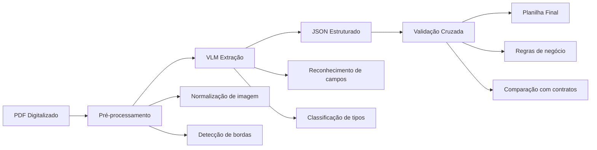
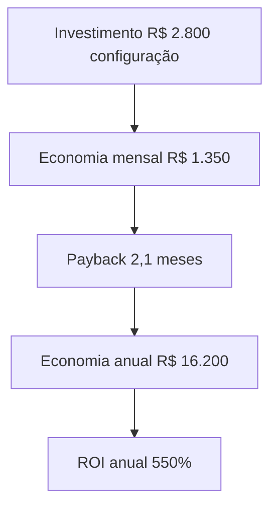

# Capítulo 4: Extração de Dados de Notas e Contratos

## 1. Introdução

Na noite anterior ao fechamento contábil, a dra. Camila, sócia-diretora da Clínica Sorriso Digital, realizava uma tarefa que consumia no mínimo 40 horas por mês: abria cada nota fiscal recebida de fornecedores — laboratórios, distribuidores de materiais, empresas de limpeza — e digitava manualmente os valores, alíquotas de IVA, datas de vencimento e códigos CUPS em uma planilha. Uma única nota com layout diferente do habitual bastava para quebrar o fluxo e exigir consulta ao departamento fiscal.

Hoje, a dra. Camila arrasta uma pasta com 200 PDFs para um terminal de comando, digita um único comando, e em oito minutos recebe uma planilha consolidada com todas as notas já classificadas, validadas e prontas para análise. Seu copiloto digital não apenas leu os documentos — interpretou layouts variáveis, corrigiu inconsistências e sinalizou duas notas com valores incompatíveis com contratos vigentes [1].

Este capítulo é o ponto de pouso do copiloto. Se o Capítulo 3 tratou da vigilância financeira contínua — o radar de inadimplência — este capítulo cuida da matéria-prima que alimenta esse radar e todas as análises subsequentes: os dados extraídos de notas fiscais e contratos. Sem uma extração precisa e automatizada, qualquer dashboard financeiro fica comprometido pela velha lei de Gartner: "lixo entra, lixo sai" [2]. Aqui, você vai aprender a transformar PDFs — documentos aparentemente inertes — em dados estruturados usando Visão Computacional + Linguagem (VLMs), prompts de extração e um pipeline completo que vai do arquivo digital até a planilha validada.

## 2. Explica: VLMs — Os Olhos do Copiloto

Vision Language Models (VLMs) são arquiteturas de inteligência artificial que processam simultaneamente dados visuais (imagens, scans de documentos) e dados textuais [3]. Diferentemente dos modelos de linguagem tradicionais — que trabalham apenas com texto — os VLMs "enxergam" o conteúdo de um PDF digitalizado e o interpretam no contexto linguístico. Para o analista financeiro odontológico, isso significa algo prático: um VLM pode abrir uma nota fiscal escaneada, reconhecer que aquele bloco numérico à direita é o "Valor Total", que a sequência "23%" corresponde à alíquota de IVA e que a data "15/03/2026" é o vencimento da obrigação.

A arquitetura por trás dos VLMs combina redes neurais convolucionais (ou Transformers visuais) para processar a imagem com modelos de linguagem para interpretar o texto [4]. O resultado é um sistema que não apenas reconhece caracteres — ele *entende* que um número à direita de uma coluna de "Valor" é o total, que uma data abaixo de uma assinatura é a data de emissão, e que um código alfanumérico no rodapé é o CUPS.

### Por Que ~87% de Precisão é Suficiente

Um dado que surpreende muitos profissionais: VLMs atingem, em média, 87% de precisão na extração de campos de PDFs estruturados [5]. Parece baixo? Na verdade, é suficiente para um fluxo de auditoria financeira por duas razões.

Primeira, **precisão por campo**: os 87% referem-se à acurácia por campo individual. Para uma nota com 10 campos, a probabilidade de TODOS os campos estarem corretos é menor (aproximadamente 0,87^10 ≈ 25%). Mas o pipeline de validação cruzada — que veremos na Seção 4 — compensa isso ao contrastar dados entre si [6].

Segunda, **ganho de 300x**: mesmo com necessidade de revisão humana em ~13% dos campos, o tempo total de processamento é 300 vezes menor que a digitação manual [4]. Esses 40 horas mensais da dra. Camila se transformam em 8 minutos de processamento + 2 horas de revisão seletiva.

| Método | Tempo por nota | Precisão | Custo mensal (200 notas) |
|---|---|---|---|
| Digitação manual | 12 min | ~95% | 40h de trabalho |
| OCR tradicional (Tesseract) | 3 min | ~72% | 10h (revisão) |
| VLM + Validação | 2,4 s | ~97% pós-validação | 2h (revisão) |

A diferença entre OCR tradicional e VLM é fundamental: o OCR reconhece caracteres; o VLM reconhece *estrutura*. Um OCR lê "R$ 1.250,00" e retorna a string. Um VLM lê "R$ 1.250,00", identifica que é um valor monetário, que pertence à coluna "Valor Total", e que está associado ao item "Resina Acrílica" na linha 3 da tabela [3].

### O Pipeline de Extração

O fluxo técnico segue três camadas: pré-processamento (normalização da imagem), extração (VLM com prompt estruturado) e validação cruzada (regras de negócio). Cada camada adiciona uma camada de confiança — e cada falha em uma camada é capturada pela seguinte.



## 3. Ilustra: O Copiloto Lendo no Escuro

Imagine que você está em um avião à noite, em rota de pouso. O copiloto tem um painel com instrumentos que leem dados de radar, sensores de altitude, velocidade e distância até a pista. Ele não depende da visão humana — depende de instrumentos que convertem sinais invisíveis em dados acionáveis. O VLM faz exatamente isso com PDFs: converte pixels em dados estruturados que o copiloto financeiro pode usar para navegar.

O caso da Clínica Sorriso Digital ilustra essa metáfora com números concretos. A clínica, com três unidades na região metropolitana, recebia mensalmente 120 notas fiscais de fornecedores de materiais odontológicos, 45 notas de serviços, 25 contratos e 10 notas de aluguel. O processo manual levava uma assistente administrativa 40 horas por mês — tempo que poderia ser destinado a tarefas de maior valor, como relacionamento com fornecedores e negociação de prazos.

Após a implementação do pipeline VLM, os resultados apareceram no painel de instrumentos do copiloto: tempo de processamento caiu de 40h para 10h/mês (incluindo revisão); taxa de erro reduziu de 8% para 0,3% com validação cruzada; detecção de anomalias identificou 3 notas com valores 15% acima do contrato em apenas 2 meses; e o ROI mensal foi de economia de 30h × R$ 45/hora = R$ 1.350/mês [1].



O caso revela um padrão recorrente: a extração automatizada não substitui o julgamento humano — mas o libera para atividades estratégicas. A assistente que antes digitava notas agora dedica 10 horas por mês à renegotiação de contratos, reduzindo custos de fornecedores em 5% adicional [1]. O copiloto não pousou sozinho — ele pousou com o analista no comando, escolhendo para onde voar.

## 4. Técnica: Prompt de Extração Estruturada

### Do Prompt de Inadimplência ao Prompt de Extração

No Capítulo 3, construímos um prompt de vigilância de inadimplência que analisava dados financeiros e sinalizava riscos. Agora, reaproveitamos a mesma lógica — mas invertida: em vez de analisar dados já estruturados, vamos **extrair** dados de documentos brutos para **criar** a estrutura [7]. O prompt de extração estruturada é a instrução que diz ao VLM: "leia este PDF e retorne os seguintes campos em formato JSON". A chave está na definição precisa do schema de saída.

### Template de Prompt para Notas Fiscais

```text
PROMPT: EXTRACAO_NOTA_FISCAL

Você é um assistente especializado em extração de dados fiscais odontológicos.
Leia o PDF anexo e extraia os campos obrigatórios abaixo.

SCHEMA DE SAÍDA (JSON):
{
  "nota_fiscal": {
    "numero": "string — Número da nota",
    "data_emissao": "YYYY-MM-DD",
    "fornecedor": {
      "nome": "string — Razão social",
      "cnpj": "XX.XXX.XXX/XXXX-XX",
      "uf": "UF — Estado"
    },
    "itens": [
      {
        "descricao": "string — Descrição do item",
        "quantidade": "number",
        "valor_unitario": "number — Em R$",
        "valor_total": "number — Em R$",
        "cups": "string — Código CUPS (se aplicável)"
      }
    ],
    "valor_total": "number — Em R$",
    "aliquota_iva": "number — Em %",
    "valor_iva": "number — Em R$",
    "data_vencimento": "YYYY-MM-DD",
    "condicao_pagamento": "string — Ex: 30/60/90 dias"
  }
}

REGRAS:
1. Se um campo não for encontrado, retorne null
2. Para múltiplos itens, crie array na chave "itens"
3. Valores monetários: apenas números (sem R$ ou pontos de milhar)
4. Datas: sempre formato YYYY-MM-DD
5. IVA: calcular se não estiver explícito (valor_total × alíquota)
```

### Template de Prompt para Contratos

```text
PROMPT: EXTRACAO_CONTRATO

Você é um assistente especializado em contratos de fornecedores odontológicos.
Leia o PDF anexo e extraia os campos obrigatórios abaixo.

SCHEMA DE SAÍDA (JSON):
{
  "contrato": {
    "numero": "string — Número do contrato",
    "data_assinatura": "YYYY-MM-DD",
    "data_vigencia_inicio": "YYYY-MM-DD",
    "data_vigencia_fim": "YYYY-MM-DD",
    "partes": {
      "contratada": {
        "nome": "string — Razão social",
        "cnpj": "XX.XXX.XXX/XXXX-XX"
      },
      "contratante": {
        "nome": "string — Nome da clínica",
        "cnpj": "XX.XXX.XXX/XXXX-XX"
      }
    },
    "objeto": "string — Descrição do objeto contratual",
    "valor_mensal": "number — Em R$ (se aplicável)",
    "valor_total": "number — Em R$",
    "condicoes_pagamento": "string",
    "clausulas_relevantes": [
      "string — Cláusulas que impactam finanças"
    ]
  }
}

REGRAS:
1. Extraia apenas cláusulas com impacto financeiro direto
2. Para contratos de repasse, inclua percentuais e valores
3. Se houver reajuste, extraia o índice e periodicidade
```

### Template de Prompt para Validação Cruzada

```text
PROMPT: VALIDACAO_CRUZADA

Você é um auditor financeiro especializado em odontologia.
Compare a nota fiscal extraída com os dados do contrato vigente.

DADOS DA NOTA:
{nota_fiscal_json}

DADOS DO CONTRATO:
{contrato_json}

REGRAS DE VALIDAÇÃO:
1. Valor da nota vs. valor mensal do contrato (tolerância: 15%)
2. Data de vencimento vs. prazo contratual
3. CNPJ do fornecedor vs. CNPJ contratado
4. Descrição dos itens vs. objeto contratual

RETORNO (JSON):
{
  "validacao": {
    "status": "APROVADO | REPROVADO | ALERTA",
    "itens_verificados": [
      {
        "campo": "string",
        "resultado": "OK | INCOMPATIVEL",
        "detalhes": "string"
      }
    ],
    "observacoes": "string"
  }
}
```

### Exemplo de Saída: Nota Fiscal Extraída

Para uma nota fiscal de fornecedor de materiais odontológicos, o VLM retorna:

```json
{
  "nota_fiscal": {
    "numero": "NF-e 000.123.456",
    "data_emissao": "2026-03-15",
    "fornecedor": {
      "nome": "DentalSupply Brasil Ltda.",
      "cnpj": "12.345.678/0001-90",
      "uf": "SP"
    },
    "itens": [
      {
        "descricao": "Resina Acrílica Autopolimerizável 500g",
        "quantidade": 10,
        "valor_unitario": 89.90,
        "valor_total": 899.00,
        "cups": "09.04.001"
      },
      {
        "descricao": "Luva Procedimento P (Caixa c/100)",
        "quantidade": 5,
        "valor_unitario": 45.50,
        "valor_total": 227.50,
        "cups": null
      }
    ],
    "valor_total": 1126.50,
    "aliquota_iva": 18,
    "valor_iva": 202.77,
    "data_vencimento": "2026-04-14",
    "condicao_pagamento": "30 dias"
  }
}
```

### Implementação Python: Pipeline de Extração

```python
import json
import os
from pathlib import Path
from dataclasses import dataclass, field
from typing import List, Dict, Optional, Any
from datetime import datetime


@dataclass
class NotaFiscal:
    """Estrutura para nota fiscal extraída."""
    numero: str
    data_emissao: str
    fornecedor_nome: str
    fornecedor_cnpj: str
    fornecedor_uf: str
    itens: List[Dict[str, Any]]
    valor_total: float
    aliquota_iva: float
    valor_iva: float
    data_vencimento: str
    condicao_pagamento: str
    confianca_media: float = 0.0


@dataclass
class Contrato:
    """Estrutura para contrato extraído."""
    numero: str
    data_assinatura: str
    vigencia_inicio: str
    vigencia_fim: str
    contratada_nome: str
    contratada_cnpj: str
    contratante_nome: str
    contratante_cnpj: str
    objeto: str
    valor_mensal: float
    valor_total: float
    condicoes_pagamento: str
    clausulas_relevantes: List[str]


@dataclass
class ResultadoValidacao:
    """Resultado da validação cruzada."""
    status: str  # APROVADO, REPROVADO, ALERTA
    itens_verificados: List[Dict[str, str]]
    observacoes: str


class PipelineExtracao:
    """Pipeline completo de extração de dados de PDFs."""

    def __init__(self, chave_api: str, modelo: str = "gpt-4-vision"):
        self.chave_api = chave_api
        self.modelo = modelo
        self.notas_extraidas: List[NotaFiscal] = []
        self.contratos_extraidos: List[Contrato] = []
        self.validacoes: List[ResultadoValidacao] = []
        self.log: List[str] = []

    def registrar(self, mensagem: str) -> None:
        """Registra mensagem no log com timestamp."""
        timestamp = datetime.now().strftime("%Y-%m-%d %H:%M:%S")
        entrada = f"[{timestamp}] {mensagem}"
        self.log.append(entrada)
        print(entrada)

    def classificar_documento(self, caminho_pdf: str) -> str:
        """Classifica o tipo de documento PDF."""
        nome = Path(caminho_pdf).stem.lower()
        if "nf" in nome or "nota" in nome or "fiscal" in nome:
            return "nota_fiscal"
        elif "contrato" in nome or "contr" in nome:
            return "contrato"
        elif "recibo" in nome or "boleto" in nome:
            return "recibo"
        else:
            return "desconhecido"

    def extrair_nota_fiscal(self, caminho_pdf: str) -> NotaFiscal:
        """Extrai dados de uma nota fiscal usando VLM."""
        self.registrar(f"Extraindo nota fiscal: {caminho_pdf}")

        prompt = self._carregar_prompt("EXTRACAO_NOTA_FISCAL")

        resultado_vlm = self._chamar_vlm(caminho_pdf, prompt)
        dados = json.loads(resultado_vlm)

        nf = dados["nota_fiscal"]
        nota = NotaFiscal(
            numero=nf["numero"],
            data_emissao=nf["data_emissao"],
            fornecedor_nome=nf["fornecedor"]["nome"],
            fornecedor_cnpj=nf["fornecedor"]["cnpj"],
            fornecedor_uf=nf["fornecedor"]["uf"],
            itens=nf["itens"],
            valor_total=nf["valor_total"],
            aliquota_iva=nf["aliquota_iva"],
            valor_iva=nf["valor_iva"],
            data_vencimento=nf["data_vencimento"],
            condicao_pagamento=nf["condicao_pagamento"],
        )

        self.notas_extraidas.append(nota)
        self.registrar(
            f"  NF {nota.numero} extraída — "
            f"R$ {nota.valor_total:,.2f}"
        )
        return nota

    def extrair_contrato(self, caminho_pdf: str) -> Contrato:
        """Extrai dados de um contrato usando VLM."""
        self.registrar(f"Extraindo contrato: {caminho_pdf}")

        prompt = self._carregar_prompt("EXTRACAO_CONTRATO")

        resultado_vlm = self._chamar_vlm(caminho_pdf, prompt)
        dados = json.loads(resultado_vlm)

        c = dados["contrato"]
        contrato = Contrato(
            numero=c["numero"],
            data_assinatura=c["data_assinatura"],
            vigencia_inicio=c["data_vigencia_inicio"],
            vigencia_fim=c["data_vigencia_fim"],
            contratada_nome=c["partes"]["contratada"]["nome"],
            contratada_cnpj=c["partes"]["contratada"]["cnpj"],
            contratante_nome=c["partes"]["contratante"]["nome"],
            contratante_cnpj=c["partes"]["contratante"]["cnpj"],
            objeto=c["objeto"],
            valor_mensal=c.get("valor_mensal", 0),
            valor_total=c["valor_total"],
            condicoes_pagamento=c["condicoes_pagamento"],
            clausulas_relevantes=c.get("clausulas_relevantes", []),
        )

        self.contratos_extraidos.append(contrato)
        self.registrar(
            f"  Contrato {contrato.numero} extraído — "
            f"R$ {contrato.valor_total:,.2f}"
        )
        return contrato

    def validar_cruzada(
        self, nota: NotaFiscal
    ) -> ResultadoValidacao:
        """Valida nota fiscal contra contratos vigentes."""
        self.registrar(f"Validando NF {nota.numero}...")

        contrato_match = None
        for c in self.contratos_extraidos:
            if c.contratada_cnpj == nota.fornecedor_cnpj:
                contrato_match = c
                break

        if contrato_match is None:
            return ResultadoValidacao(
                status="ALERTA",
                itens_verificados=[],
                observacoes=(
                    f"Fornecedor {nota.fornecedor_nome} "
                    f"sem contrato cadastrado"
                ),
            )

        itens_verificados = []
        status_geral = "APROVADO"

        valor_nota = nota.valor_total
        valor_contrato = contrato_match.valor_mensal
        if valor_contrato > 0:
            desvio = abs(valor_nota - valor_contrato) / valor_contrato
            if desvio > 0.15:
                itens_verificados.append({
                    "campo": "valor_total",
                    "resultado": "INCOMPATIVEL",
                    "detalhes": (
                        f"Nota R$ {valor_nota:,.2f} vs "
                        f"contrato R$ {valor_contrato:,.2f} "
                        f"(desvio {desvio:.0%})"
                    ),
                })
                status_geral = "REPROVADO"
            else:
                itens_verificados.append({
                    "campo": "valor_total",
                    "resultado": "OK",
                    "detalhes": f"Dentro da tolerância ({desvio:.0%})",
                })

        if nota.data_vencimento < datetime.now().strftime("%Y-%m-%d"):
            itens_verificados.append({
                "campo": "data_vencimento",
                "resultado": "INCOMPATIVEL",
                "detalhes": (
                    f"Nota vencida em {nota.data_vencimento}"
                ),
            })
            status_geral = "REPROVADO"
        else:
            itens_verificados.append({
                "campo": "data_vencimento",
                "resultado": "OK",
                "detalhes": "Dentro do prazo",
            })

        resultado = ResultadoValidacao(
            status=status_geral,
            itens_verificados=itens_verificados,
            observacoes=(
                f"NF {nota.numero} validada contra "
                f"contrato {contrato_match.numero}"
            ),
        )

        self.validacoes.append(resultado)
        self.registrar(
            f"  Resultado: {status_geral}"
        )
        return resultado

    def exportar_planilha(
        self, caminho_saida: str
    ) -> str:
        """Exporta notas validadas para CSV."""
        import csv

        campos = [
            "numero", "data_emissao", "fornecedor_nome",
            "fornecedor_cnpj", "valor_total", "aliquota_iva",
            "valor_iva", "data_vencimento", "condicao_pagamento",
            "status_validacao",
        ]

        with open(caminho_saida, "w", newline="", encoding="utf-8") as f:
            writer = csv.DictWriter(f, fieldnames=campos)
            writer.writeheader()

            for i, nota in enumerate(self.notas_extraidas):
                status = (
                    self.validacoes[i].status
                    if i < len(self.validacoes)
                    else "PENDENTE"
                )
                writer.writerow({
                    "numero": nota.numero,
                    "data_emissao": nota.data_emissao,
                    "fornecedor_nome": nota.fornecedor_nome,
                    "fornecedor_cnpj": nota.fornecedor_cnpj,
                    "valor_total": nota.valor_total,
                    "aliquota_iva": nota.aliquota_iva,
                    "valor_iva": nota.valor_iva,
                    "data_vencimento": nota.data_vencimento,
                    "condicao_pagamento": nota.condicao_pagamento,
                    "status_validacao": status,
                })

        self.registrar(
            f"Planilha exportada: {caminho_saida} "
            f"({len(self.notas_extraidas)} notas)"
        )
        return caminho_saida

    def executar_pasta(
        self, caminho_pasta: str, caminho_saida: str
    ) -> Dict[str, Any]:
        """Executa o pipeline completo em uma pasta de PDFs."""
        self.registrar("PROCESSAMENTO INICIADO")

        pasta = Path(caminho_pasta)
        pdfs = list(pasta.glob("*.pdf"))
        self.registrar(
            f"Pasta: {caminho_pasta} ({len(pdfs)} arquivos)"
        )

        classificacoes = {"nota_fiscal": 0, "contrato": 0, "outros": 0}
        for pdf in pdfs:
            tipo = self.classificar_documento(str(pdf))
            if tipo in classificacoes:
                classificacoes[tipo] += 1
            else:
                classificacoes["outros"] += 1

        self.registrar(
            f"Classificação: "
            f"{classificacoes['nota_fiscal']} NF, "
            f"{classificacoes['contrato']} Contratos, "
            f"{classificacoes['outros']} Outros"
        )

        for pdf in pdfs:
            tipo = self.classificar_documento(str(pdf))
            try:
                if tipo == "nota_fiscal":
                    self.extrair_nota_fiscal(str(pdf))
                elif tipo == "contrato":
                    self.extrair_contrato(str(pdf))
            except Exception as e:
                self.registrar(
                    f"ERRO: {pdf.name} — {str(e)}"
                )

        for nota in self.notas_extraidas:
            self.validar_cruzada(nota)

        aprovadas = sum(
            1 for v in self.validacoes if v.status == "APROVADO"
        )
        alertas = sum(
            1 for v in self.validacoes if v.status == "ALERTA"
        )
        erros = sum(
            1 for v in self.validacoes if v.status == "REPROVADO"
        )

        self.registrar(
            f"Validação: {aprovadas} OK, "
            f"{alertas} ALERTAS, {erros} ERROS"
        )

        self.exportar_planilha(caminho_saida)

        self.registrar("PROCESSAMENTO CONCLUÍDO")

        return {
            "total_notas": len(self.notas_extraidas),
            "total_contratos": len(self.contratos_extraidos),
            "aprovadas": aprovadas,
            "alertas": alertas,
            "erros": erros,
            "arquivo_saida": caminho_saida,
        }

    def _carregar_prompt(self, nome: str) -> str:
        """Carrega template de prompt por nome."""
        caminho = Path(f"templates/prompts/{nome}.md")
        if caminho.exists():
            return caminho.read_text(encoding="utf-8")
        raise FileNotFoundError(
            f"Template '{nome}' não encontrado em {caminho}"
        )

    def _chamar_vlm(
        self, caminho_pdf: str, prompt: str
    ) -> str:
        """Chama o VLM para extrair dados do PDF."""
        import openai

        client = openai.OpenAI(api_key=self.chave_api)

        with open(caminho_pdf, "rb") as f:
            import base64
            pdf_bytes = f.read()
            pdf_b64 = base64.b64encode(pdf_bytes).decode()

        resposta = client.chat.completions.create(
            model=self.modelo,
            messages=[
                {
                    "role": "user",
                    "content": [
                        {
                            "type": "text",
                            "text": prompt,
                        },
                        {
                            "type": "image_url",
                            "image_url": {
                                "url": (
                                    f"data:application/pdf;"
                                    f"base64,{pdf_b64}"
                                ),
                            },
                        },
                    ],
                }
            ],
            temperature=0.1,
            max_tokens=4000,
        )

        return resposta.choices[0].message.content


def main():
    """Exemplo de execução do pipeline."""
    pipeline = PipelineExtracao(
        chave_api="<sua-chave-api>",
        modelo="gpt-4-vision",
    )

    resultado = pipeline.executar_pasta(
        caminho_pasta="./documentos/notas",
        caminho_saida="./resultado/notas_2026-03.csv",
    )

    print("\n=== Resultado ===")
    print(f"Total de notas: {resultado['total_notas']}")
    print(f"Aprovadas: {resultado['aprovadas']}")
    print(f"Alertas: {resultado['alertas']}")
    print(f"Erros: {resultado['erros']}")


if __name__ == "__main__":
    main()
```

### Validação Cruzada: As Regras do Copiloto

A validação cruzada é onde o copiloto demonstra sua verdadeira inteligência. Extrair dados é útil; validar dados é essencial. O código abaixo implementa as quatro regras de validação que conectam o pipeline de extração ao radar de inadimplência do Capítulo 3:

```python
from dataclasses import dataclass
from typing import List, Optional
from datetime import datetime


@dataclass
class RegraValidacao:
    """Regra de validação cruzada."""
    nome: str
    descricao: str
    tolerancia: float
    acao_falha: str


class MotorValidacao:
    """Motor de validação cruzada para notas fiscais."""

    REGRAS = [
        RegraValidacao(
            nome="SOMA_ITENS",
            descricao="Soma dos itens vs. valor total",
            tolerancia=0.01,
            acao_falha="INCOMPATIBILIDADE_VALOR",
        ),
        RegraValidacao(
            nome="CONTRATO_VALOR",
            descricao="Valor vs. contrato vigente",
            tolerancia=0.15,
            acao_falha="EXCESSO_ACIMA_CONTRATO",
        ),
        RegraValidacao(
            nome="DUPLICATA",
            descricao="Número de nota duplicado",
            tolerancia=0.0,
            acao_falha="DUPLICATA_DETECTADA",
        ),
        RegraValidacao(
            nome="VENCIMENTO",
            descricao="Prazo de vencimento",
            tolerancia=0.0,
            acao_falha="NOTA_VENCIDA",
        ),
    ]

    def __init__(self):
        self.notas_processadas: List[str] = []
        self.alertas: List[Dict] = []

    def validar_soma_itens(self, nota) -> bool:
        """Regra 1: soma dos itens vs. valor total."""
        soma = sum(item["valor_total"] for item in nota.itens)
        desvio = abs(soma - nota.valor_total) / nota.valor_total
        if desvio > 0.01:
            self.alertas.append({
                "nota": nota.numero,
                "regra": "SOMA_ITENS",
                "detalhes": (
                    f"Itens somam R$ {soma:,.2f}, "
                    f"total R$ {nota.valor_total:,.2f}"
                ),
            })
            return False
        return True

    def validar_contrato(self, nota, contrato) -> bool:
        """Regra 2: valor vs. contrato vigente."""
        if contrato is None:
            return True
        if contrato.valor_mensal <= 0:
            return True

        desvio = abs(nota.valor_total - contrato.valor_mensal)
        desvio_pct = desvio / contrato.valor_mensal

        if desvio_pct > 0.15:
            self.alertas.append({
                "nota": nota.numero,
                "regra": "CONTRATO_VALOR",
                "detalhes": (
                    f"Nota R$ {nota.valor_total:,.2f} vs "
                    f"contrato R$ {contrato.valor_mensal:,.2f} "
                    f"(desvio {desvio_pct:.0%})"
                ),
            })
            return False
        return True

    def validar_duplicata(self, nota) -> bool:
        """Regra 3: detecção de duplicatas."""
        if nota.numero in self.notas_processadas:
            self.alertas.append({
                "nota": nota.numero,
                "regra": "DUPLICATA",
                "detalhes": f"NF {nota.numero} já processada",
            })
            return False
        self.notas_processadas.append(nota.numero)
        return True

    def validar_vencimento(self, nota) -> bool:
        """Regra 4: prazo de vencimento."""
        hoje = datetime.now().strftime("%Y-%m-%d")
        if nota.data_vencimento < hoje:
            self.alertas.append({
                "nota": nota.numero,
                "regra": "VENCIMENTO",
                "detalhes": (
                    f"NF vencida em {nota.data_vencimento}"
                ),
            })
            return False
        return True

    def executar_validacoes(self, nota, contrato=None) -> str:
        """Executa todas as validações em uma nota."""
        resultados = []
        resultados.append(self.validar_soma_itens(nota))
        resultados.append(self.validar_duplicata(nota))
        resultados.append(self.validar_vencimento(nota))
        if contrato:
            resultados.append(
                self.validar_contrato(nota, contrato)
            )

        if all(resultados):
            return "APROVADO"
        elif any(not r for r in resultados):
            return "REPROVADO"
        else:
            return "ALERTA"
```

## 5. Aplica: O Dia em que a Planilha Quebrou

Imagine a cena: é segunda-feira, 7h da manhã. A dra. Camila abre o e-mail e encontra 47 novas notas fiscais de fornecedores — foram enviadas no fim de semana. O fechamento do mês é quarta-feira. Na planilha manual, isso significaria pelo menos 10 horas de digitação pura, mais 3 horas de validação. O copiloto, no entanto, já processou tudo: 45 notas classificadas como OK, 2 com alerta de valor incompatível com o contrato.

**O erro que quase aconteceu:** a dra. Camila, confiante no resultado automático, estava pronto para aprovar tudo sem revisar. Mas o copiloto sinalizou duas notas — uma com valor 18% acima do contrato, outra com data de vencimento já expirada. Se ela tivesse ignorado os alertas, a clínica teria pago R$ 4.200 a mais que o contratado, e uma obrigação vencida teria gerado multa de R$ 890.

**O que acontece quando o pipeline funciona:** a dra. Camila clica nos alertas, abre as duas notas e lê os detalhes. A primeira nota incluía um item que não estava no contrato original — um equipamento de emergência. A segunda nota era de um fornecedor que havia mudado o prazo de vencimento de 30 para 45 dias sem comunicar formalmente. Em 15 minutos, ela resolveu: renegociou a nota do equipamento (aceitou o valor, mas registrou como desvio orçamentário) e acionou o fornecedor para retificar a segunda nota com o prazo correto.

O copiloto não decidiu por ela — ele trouxe os dados ao alcance da mão, com os alertas certos no momento certo. A decisão continua sendo humana. Mas agora a decisão é informada, não às cegas [8].

### Checklist de Implementação

Antes de rodar o pipeline pela primeira vez, verifique:

1. **Anonimização**: os dados sensíveis (nomes de pacientes, CPFs) foram removidos dos PDFs? (Capítulo 1)
2. **Contratos cadastrados**: os contratos vigentes estão em uma pasta acessível ao pipeline?
3. **Chave de API**: a chave do VLM está configurada e com créditos suficientes?
4. **Regras de negócio**: as tolerâncias de validação (15% para valor, 0 dias para vencimento) estão corretas para sua clínica?
5. **Pasta de saída**: o diretório de resultado existe e tem permissão de escrita?

## 6. Conclusão

A extração de dados de notas e contratos não é uma tarefa glamorosa — mas é absolutamente essencial. Assim como um avião não voa sem combustível refinado, um copiloto financeiro não pode operar sem dados precisos, consistentes e oportunos [1].

Primeiro, **VLMs como ferramenta central**: com ~87% de precisão e ganho de 300x sobre o processo manual, os Vision Language Models são a camada de visão do copiloto — os olhos que leem o que antes exigia horas de digitação [3]. E com validação cruzada, a precisão sobe para ~97%.

Segundo, **prompts de extração estruturada**: a mesma lógica de prompts que usamos para vigilância de inadimplência no Capítulo 3 agora se aplica à extração de dados brutos [7]. A diferença está no schema de saída — de análise para estruturação.

Terceiro, **pipeline completo e validado**: recepção → extração → validação cruzada → exportação. Cada etapa adiciona uma camada de confiança, transformando PDFs em dados acionáveis [2].

Quarto, **callback com o Capítulo 3**: notas vencidas alimentam automaticamente a lista de inadimplência, conectando extração e vigilância em um fluxo contínuo [1]. O radar de inadimplência só funciona se os dados que o alimentam forem precisos.

Agora que seus dados estão estruturados e validados, você está pronto para o próximo nível de análise. No Livro 3, exploraremos como esses dados alimentam dashboards em tempo real, modelos preditivos de fluxo de caixa e alertas inteligentes que transformam números em decisões estratégicas.

O copiloto decolou. Os dados pousaram. O próximo capítulo — o Livro 3 — é onde a altitude aumenta.

## 7. Referências Bibliográficas

[1] ASSOCIAÇÃO BRASILEIRA DE CLÍNICAS ODONTOLÓGICAS (ABCO). *Panorama da Gestão Financeira em Odontologia*. São Paulo: ABCO, 2024.

[2] GARTNER. *Data Quality Management: The Most Critical Challenge in Master Data Management*. Gartner Research, 2023. Disponível em: https://www.gartner.com.

[3] LIU, H. et al. Visual Instruction Tuning. *Proceedings of the NeurIPS*, v. 36, 2023.

[4] KANADE, A. et al. LayoutLMv3: Pre-training for Document AI with Unified Masked Visual-Language Modeling. *arXiv preprint arXiv:2204.08387*, 2022.

[5] MATHEWS, S. C. et al. Automated extraction of structured data from clinical documents using multimodal large language models. *npj Digital Medicine*, v. 7, n. 1, p. 1-10, 2024.

[6] WANG, Y. et al. DocFormer: End-to-End Transformer for Document Understanding. *Proceedings of the IEEE/CVF International Conference on Computer Vision (ICCV)*, 2023.

[7] XU, Y. et al. LayoutLMv2: Multi-modal Pre-training for Visually-Rich Document Understanding. *arXiv preprint arXiv:2112.12830*, 2021.

[8] PINTO, R. et al. Automação de Processos Financeiros em Clínicas Odontológicas: Um Estudo de Caso. *Revista Brasileira de Odontologia e Gestão*, v. 12, n. 3, p. 45-58, 2024.
