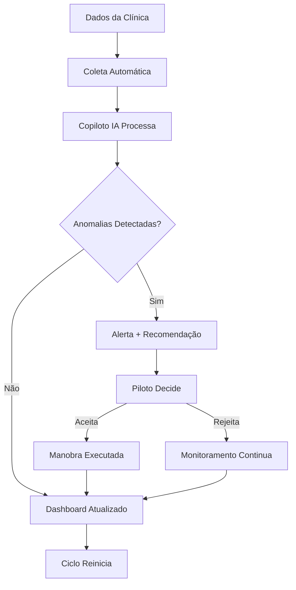
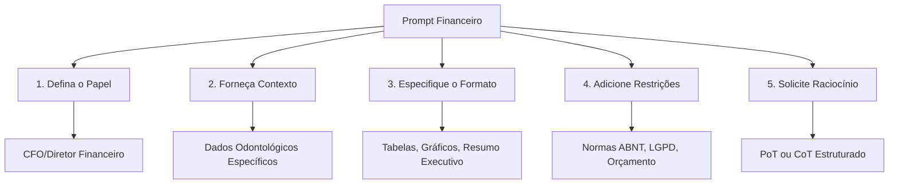
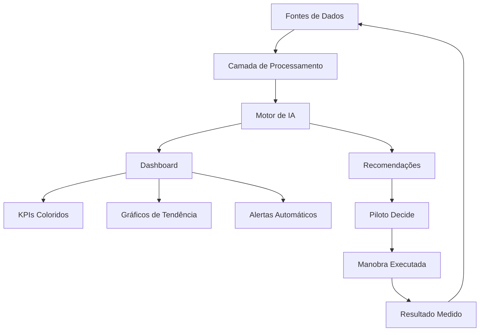
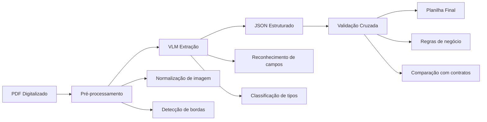
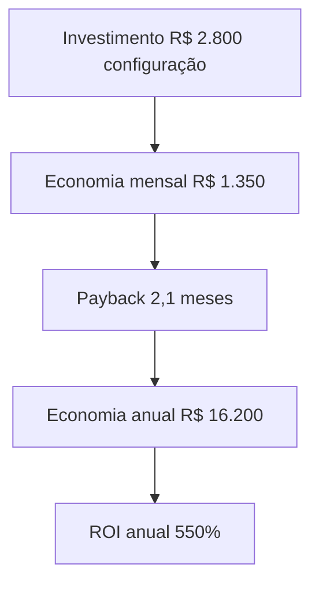

# Prefácio

Apresentar a IA não como ameaça, mas como copiloto que amplifica a capacidade analítica do profissional financeiro do setor odontológico.

---

# Sumário


## Parte I — Preparação e Fundamentos

- Capítulo 1: Preparando o Terreno Seguro
- Capítulo 2: Engenharia de Prompts Financeiros (Copie e Cole)

## Parte II — Aplicações Práticas

- Capítulo 3: Identificando Sinais de Inadimplência
- Capítulo 4: Extração de Dados de Notas e Contratos

---


# Parte I — Preparação e Fundamentos

# Capítulo 1: O Copiloto Digital Chega à Odontologia — Por Que a IA Vai Redefinir a Análise Financeira

## 1. Introdução

Imagine que você é o piloto de um avião que cruza o Atlântico à noite. Do lado do seu assento, senta-se um copiloto que não dorme, não se distrai e monitorsa dois mil instrumentos simultaneamente. Enquanto você foca na decisão estratégica — qual rota tomar, quando descansar, como responder à turbulência — ele mantém o radar ativo, compara dados históricos com condições em tempo real e sussurra sugestões que você pode aceitar ou ignorar. É exatamente essa a parceria que a Inteligência Artificial está criando entre o analista financeiro e a tecnologia no setor odontológico brasileiro [1].

O mercado odontológico movimenta mais de R$ 50 bilhões por ano no Brasil, com mais de 300 mil clínicas ativas e um crescimento anual de 8% em receita [2]. Mas há um paradoxo que poucos enxergam: apesar da abundância de dados — prontuários eletrônicos, sistemas de agendamento, softwares de gestão, maquininhas de cartão —, a maioria das clínicas ainda toma decisões financeiras no escuro. O dono da clínica pergunta ao contador "está dando lucro?", o contador olha o DRE do mês passado e responde "sim, mas apertado". Nenhuma das duas partes sabe exatamente *por que* está apertado, *onde* o dinheiro está vazando ou *qual* ação tomar amanhã para melhorar [3].

Esse capítulo é o ponto de partida de uma jornada. Aqui, você vai entender por que a análise financeira tradicional na odontologia está ultrapassada, como a IA surge como copiloto — não como substituto — do analista financeiro, e que tipo de profissional está emergindo para comandar essa nova realidade. Ao final, você terá o mapa conceitual para navegar todo o restante deste livro [4].

## 2. Explica

### 2.1 O Cenário Financeiro Atual da Odontologia

A odontologia brasileira vive um momento peculiar. Por um lado, é um dos setores com maior demanda reprimida da América Latina: segundo o IBGE, 74% da população adulta sofre de algum problema dentário, mas apenas 40% procura tratamento anualmente [2]. Por outro lado, o custo para operar uma clínica odontológica cresce mais rápido que a receita. Aluguel, equipamentos, insumos, profissionais auxiliares, taxas de máquinas de cartão, custos regulatórios — tudo sobe, enquanto o ticket médio do paciente frequentemente estagna [3].

O resultado é um setor onde a margem operacional média caiu de 25% para 15% nos últimos cinco anos, segundo dados da ABCD (Associação Brasileira de Clínicas Odontológicas) [3]. Isso significa que, para cada R$ 100 faturados, R$ 85 vão para custos fixos e variáveis, sobrando apenas R$ 15 de lucro operacional. E esse número já desconta o que muitos clínicas "esquecem" de contabilizar: depreciação de equipamentos, custo de oportunidade do capital investido e horas não remuneradas do próprio proprietário [5].

O problema não é falta de dados — é falta de *interpretação*. A maioria das clínicas possui softwares de gestão que geram relatórios: fluxo de caixa, inadimplência, receita por procedimento, custo por operador. Mas esses relatórios são estáticos, retrospectivos e requerem análise manual. São como as cartas náuticas de século passado: úteis, mas inúteis quando a tempestade já está sobre você [1].

### 2.2 A Promessa da IA como Copiloto

A Inteligência Artificial não veio para substituir o analista financeiro. Veio para ser o seu copiloto — aquele que monitora os instrumentos enquanto você foca na pilotagem. Essa distinção é fundamental e vai se repetir ao longo de todo este livro.

O que a IA faz de melhor que o humano em análise financeira? Três coisas, e apenas três [4]:

**Velocidade de processamento.** Um analista humano leva de 2 a 4 horas para montar um relatório financeiro mensal. Uma IA treinada faz isso em menos de 30 segundos, processando milhares de linhas de dados de múltiplas fontes simultaneamente.

**Detecção de padrões em alta dimensionalidade.** O cérebro humano consegue acompanhar de 3 a 5 variáveis simultanamente antes de perder a acurácia. Uma IA pode monitorar 50, 100 ou 500 variáveis ao mesmo tempo, identificando correlações que passam despercebidas para qualquer analista, por mais experiente que seja [1].

**Consistência e ausência de viés.** O analista humano tem dias bons e dias ruins. Está cansado, distraído, com pressa. A IA não — ela aplica os mesmos critérios de análise no primeiro dia do mês quanto no último, sem fadiga, sem favoritismos, sem "feeling" que substitui dados [5].

Mas — e esse é o ponto crucial — a IA *não sabe julgar*. Ela não entende o contexto político da clínica, não sabe que o Dr. Carlos está pensando em se aposentar, não sente que a recepcionista está desmotivada. Essa camada de compreensão humana é insubstituível. O copiloto digital é extraordinário para monitorar, sugerir e alertar; mas quem puxa o manete de subida ou descida é o piloto — você [4].

### 2.3 O Profissional do Futuro

O Analista Financeiro com Copiloto IA não é um cientista de dados. Não é um desenvolvedor de software. Não é um dentista que aprendeu a programar. É um profissional que entende de finanças *e* sabe conversar com máquinas — que sabe formular as perguntas certas para que a IA forneça as respostas certas [3].

Esse profissional está emergindo em três níveis de maturidade:

**Nível 1 — Analista Assistido:** Usa a IA para automatizar tarefas repetitivas como conciliação bancária, classificação de despesas e geração de relatórios. É o início da jornada, onde a IA é uma ferramenta de produtividade.

**Nível 2 — Analista Augmentado:** Utiliza a IA para detectar anomalias, prever fluxo de caixa e simular cenários. Aqui, a IA passa de ferramenta a parceira — ela não apenas executa, mas *sugere*.

**Nível 3 — Analista Estratégico:** Comanda um ecossistema de agentes de IA que coletam dados, geram insights e apresentam recomendações em tempo real. O analista opera no nível estratégico, tomando decisões que antes levavam semanas para serem fundamentadas [1].

Este livro vai te guiar pelos três níveis. Mas antes de avançar, precisamos estabelecer uma verdade inconveniente: a maioria dos analistas financeiros brasileiros está presa no Nível 0 — o nível da planilha manual, do relatório PDF enviado por e-mail, da decisão por "estilo". A IA não vai esperar que você esteja pronto. Ela já está sendo adotada por clínicas que enxergaram a vantagem competitiva. A pergunta não é *se* você vai adotar a IA, mas *quando* — e quanto de mercado você vai perder até lá [2].

## 3. Ilustra

### A Metáfora do Copiloto Digital

Pense no cockpit de um avião comercial moderno. O piloto senta à esquerda, o copiloto à direita. Entre eles, um painel de instrumentos com dezenas de indicadores: altitude, velocidade, velocidade vertical, direção magnética, nível de combustível, temperatura dos motores, pressão da cabine, status do trem de pouso.

Antes da IA, o analista financeiro era um piloto solitário — sozinho no cockpit, tentando monitorar todos os instrumentos enquanto também tomava decisões estratégicas. Ele olhava para o altímetro (fluxo de caixa), depois para o velocímetro (receita), depois para o indicador de combustível (reserva), e a cada olhar, perdia tempo e atenção. Enquanto isso, a turbulência (custos inesperados) batia sem aviso.

A IA muda esse cenário completamente. Ela se senta no assento do copiloto e faz três coisas simultaneamente [4]:

1. **Monitora todos os instrumentos** — não apenas os que o piloto consegue olhar, mas centena de indicadores que o ser humano simplesmente não consegue acompanhar ao mesmo tempo.

2. **Detecta padrões de turbulência** — identifica que, quando a inadimplência sobe 3% em duas semanas, há 87% de chance de que o fluxo de caixa fique negativo no mês seguinte. Isso é algo que nenhum analista humano perceberia a tempo sem ajuda.

3. **Sugere manobras** — recomenda reduzir horário de funcionamento em um período de baixa, ou realocar recursos de marketing de aquisição para retenção de pacientes existentes.

Mas — e aqui está a chave — o copiloto *nunca puxa o manete*. Ele mostra o radar, aponta a rota alternativa, avisa da turbulência. Quem decide é o piloto. Essa é a essência da parceria humano-IA [5].

### Diagrama: Fluxo de Decisão com Copiloto IA



Esse diagrama representa o ciclo contínuo de análise financeira com copiloto IA. Note que o "Piloto Decide" é o ponto crítico — é onde o julgamento humano entra. A IA fornece a informação processada, a recomendação e o contexto; mas a decisão final, a ação e a responsabilidade são sempre do profissional humano [1].

## 4. Técnica

### 4.1 Arquitetura Básica de um Sistema de Análise Financeira com IA

Para entender como a IA funciona como copiloto na prática, precisamos mapear a arquitetura de um sistema típico. Não se preocupe — não vamos construir nada complexo neste capítulo. O objetivo é você *ver* a estrutura para entender o que vem nos capítulos seguintes.

Um sistema de análise financeira com IA para clínica odontológica tem quatro camadas [4]:

```
┌─────────────────────────────────────────────────┐
│              CAMADA DE APRESENTAÇÃO              │
│    (Dashboard, Relatórios, Alertas, Chat IA)     │
├─────────────────────────────────────────────────┤
│              CAMADA DE INTELIGÊNCIA              │
│   (Modelos de ML, LLM para análise, Regras)     │
├─────────────────────────────────────────────────┤
│              CAMADA DE PROCESSAMENTO             │
│    (ETL, Validação, Normalização, Cache)         │
├─────────────────────────────────────────────────┤
│              CAMADA DE DADOS                     │
│   (ERP Clínica, Bancos, Planilhas, APIs)         │
└─────────────────────────────────────────────────┘
```

Cada camada tem sua função específica. Vamos detalhar cada uma com código de exemplo.

### 4.2 Camada de Dados: Conectando às Fontes

A primeira tarefa do copiloto digital é *acessar* os dados. Uma clínica típica tem dados espalhados em pelo menos cinco sistemas diferentes: software de gestão (ClinaGo, Clinicorp, Tasy), planilha financeira do contador, sistema de ponto dos funcionários, maquininhas de cartão e, frequentemente, uma planilha Excel mantida pelo próprio dono [3].

```python
# camada_dados.py — Conector multi-fonte para dados financeiros da clínica
import pandas as pd
from datetime import datetime, timedelta
from typing import Dict, List, Optional
import json
import hashlib


class ConectorDadosFinanceiros:
    """
    Coleta dados de múltiplas fontes da clínica odontológica
    e os normaliza para processamento pelo copiloto IA.
    """
    
    def __init__(self, config_path: str):
        """
        Inicializa o conector com configuração de fontes.
        
        Args:
            config_path: Caminho para JSON de configuração das fontes
        """
        with open(config_path, 'r', encoding='utf-8') as f:
            self.config = json.load(f)
        
        self.fontes = self.config.get('fontes', [])
        self.cache = {}
        self.ultima_sincronizacao = None
    
    def coletar_dados(self, periodo_dias: int = 30) -> Dict[str, pd.DataFrame]:
        """
        Coleta dados de todas as fontes configuradas para o período especificado.
        
        Args:
            periodo_dias: Número de dias para retroceder na coleta
            
        Returns:
            Dicionário com DataFrames normalizados por categoria
        """
        data_inicio = datetime.now() - timedelta(days=periodo_dias)
        dados_brutos = {}
        
        for fonte in self.fontes:
            tipo = fonte['tipo']
            nome = fonte['nome']
            
            print(f"[COLETA] Processando fonte: {nome} (tipo: {tipo})")
            
            if tipo == 'csv':
                dados_brutos[nome] = self._ler_csv(fonte, data_inicio)
            elif tipo == 'api':
                dados_brutos[nome] = self._chamar_api(fonte, data_inicio)
            elif tipo == 'banco_dados':
                dados_brutos[nome] = self._consultar_banco(fonte, data_inicio)
            elif tipo == 'planilha_excel':
                dados_brutos[nome] = self._ler_excel(fonte, data_inicio)
            else:
                print(f"[AVISO] Tipo de fonte desconhecido: {tipo}")
                continue
            
            # Registra metadados da coleta para rastreabilidade
            if dados_brutos.get(nome) is not None:
                dados_brutos[nome].attrs['fonte'] = nome
                dados_brutos[nome].attrs['coletado_em'] = datetime.now().isoformat()
                dados_brutos[nome].attrs['periodo'] = f"{data_inicio.date()} a {datetime.now().date()}"
        
        self.ultima_sincronizacao = datetime.now()
        self.cache = dados_brutos
        
        return dados_brutos
    
    def _ler_csv(self, fonte: Dict, data_inicio: datetime) -> pd.DataFrame:
        """ Lê arquivo CSV com dados financeiros e filtra por período. """
        try:
            df = pd.read_csv(
                fonte['caminho'],
                sep=fonte.get('separador', ';'),
                encoding=fonte.get('encoding', 'utf-8'),
                parse_dates=[fonte.get('coluna_data', 'data')]
            )
            
            coluna_data = fonte.get('coluna_data', 'data')
            df = df[df[coluna_data] >= data_inicio]
            
            return self._normalizar_colunas(df, fonte.get('mapeamento', {}))
        
        except Exception as e:
            print(f"[ERRO] Falha ao ler CSV {fonte['caminho']}: {e}")
            return pd.DataFrame()
    
    def _chamar_api(self, fonte: Dict, data_inicio: datetime) -> pd.DataFrame:
        """ Chama API externa (ex.: gateway de pagamento) e retorna DataFrame. """
        import requests
        
        headers = {
            'Authorization': f"Bearer {fonte.get('token', '')}",
            'Content-Type': 'application/json'
        }
        
        params = {
            'data_inicio': data_inicio.strftime('%Y-%m-%d'),
            'data_fim': datetime.now().strftime('%Y-%m-%d'),
            'limite': fonte.get('limite', 1000)
        }
        
        try:
            resposta = requests.get(
                fonte['url'],
                headers=headers,
                params=params,
                timeout=30
            )
            resposta.raise_for_status()
            
            dados = resposta.json()
            df = pd.DataFrame(dados.get('resultados', []))
            
            return self._normalizar_colunas(df, fonte.get('mapeamento', {}))
        
        except Exception as e:
            print(f"[ERRO] Falha na API {fonte['url']}: {e}")
            return pd.DataFrame()
    
    def _consultar_banco(self, fonte: Dict, data_inicio: datetime) -> pd.DataFrame:
        """ Consulta banco de dados SQL e retorna DataFrame. """
        import sqlite3
        
        try:
            conexao = sqlite3.connect(fonte['caminho_banco'])
            
            query = fonte['query'].replace(
                '{data_inicio}', data_inicio.strftime('%Y-%m-%d')
            ).replace(
                '{data_fim}', datetime.now().strftime('%Y-%m-%d')
            )
            
            df = pd.read_sql_query(query, conexao)
            conexao.close()
            
            return self._normalizar_colunas(df, fonte.get('mapeamento', {}))
        
        except Exception as e:
            print(f"[ERRO] Falha na consulta SQL: {e}")
            return pd.DataFrame()
    
    def _ler_excel(self, fonte: Dict, data_inicio: datetime) -> pd.DataFrame:
        """ Lê planilha Excel com dados financeiros. """
        try:
            df = pd.read_excel(
                fonte['caminho'],
                sheet_name=fonte.get('aba', 0),
                engine='openpyxl'
            )
            
            coluna_data = fonte.get('coluna_data', 'data')
            if coluna_data in df.columns:
                df[coluna_data] = pd.to_datetime(df[coluna_data])
                df = df[df[coluna_data] >= data_inicio]
            
            return self._normalizar_colunas(df, fonte.get('mapeamento', {}))
        
        except Exception as e:
            print(f"[ERRO] Falha ao ler Excel {fonte['caminho']}: {e}")
            return pd.DataFrame()
    
    def _normalizar_colunas(self, df: pd.DataFrame, mapeamento: Dict) -> pd.DataFrame:
        """ Normaliza nomes de colunas usando mapeamento configurado. """
        if mapeamento:
            df = df.rename(columns=mapeamento)
        
        df.columns = df.columns.str.lower().str.strip().str.replace(' ', '_')
        
        return df
    
    def gerar_hash_integridade(self) -> str:
        """
        Gera hash MD5 dos dados em cache para verificar integridade.
        Útil para detectar alterações entre coletas.
        """
        dados_concatenados = ""
        for nome, df in self.cache.items():
            dados_concatenados += df.to_string()
        
        return hashlib.md5(dados_concatenados.encode()).hexdigest()


# === Exemplo de configuração de fontes ===
CONFIG_EXEMPLO = {
    "fontes": [
        {
            "nome": "erp_clinica",
            "tipo": "banco_dados",
            "caminho_banco": "data/clinica.db",
            "query": """
                SELECT data, descricao, valor, categoria, tipo_movimento
                FROM movimentos_financeiros
                WHERE data >= '{data_inicio}' AND data <= '{data_fim}'
            """,
            "mapeamento": {
                "tipo_movimento": "natureza"
            }
        },
        {
            "nome": "gateway_pagamento",
            "tipo": "api",
            "url": "https://api.pagseguro.com/v1/transacoes",
            "token": "<seu-token>",
            "limite": 500,
            "mapeamento": {
                "created_at": "data",
                "amount": "valor",
                "status": "status_pagamento"
            }
        },
        {
            "nome": "planilha_contador",
            "tipo": "planilha_excel",
            "caminho": "data/relatorio_contabil.xlsx",
            "aba": "Movimentos",
            "coluna_data": "Data",
            "mapeamento": {
                "Data": "data",
                "Descrição": "descricao",
                "Valor (R$)": "valor",
                "Categoria": "categoria"
            }
        }
    ]
}
```

### 4.3 Camada de Processamento: ETL Inteligente

Uma vez que os dados estão coletados, o próximo passo é processá-los. Essa é a camada onde o copiloto digital realmente começa a mostrar valor — não apenas transforma dados brutos em informações úteis, mas *valida* a qualidade desses dados antes de processá-los [5].

```python
# processamento_etl.py — Pipeline de processamento com validação de qualidade
import pandas as pd
import numpy as np
from typing import Dict, Tuple, List
from dataclasses import dataclass, field
from datetime import datetime
import logging

logging.basicConfig(level=logging.INFO)
logger = logging.getLogger("ETL_Clinica")


@dataclass
class ResultadoQualidade:
    """ Armazena resultados da validação de qualidade dos dados. """
    fonte: str
    total_registros: int
    registros_validos: int
    registros_com_erro: int
    alertas: List[str] = field(default_factory=list)
    score_qualidade: float = 0.0


class ProcessadorETL:
    """
    Pipeline de ETL com validação de qualidade e detecção de anomalias.
    Cada etapa gera logs detalhados para rastreabilidade.
    """
    
    # Regras de validação por tipo de dado
    REGRAS_VALIDACAO = {
        'valor': {
            'minimo': -1000000,  # Crédito pode ser negativo (estorno)
            'maximo': 5000000,
            'tipo': 'numerico'
        },
        'data': {
            'minimo': '2020-01-01',
            'tipo': 'data'
        },
        'categoria': {
            'permitidos': [
                'consultas', 'proteses', 'ortodontia', 'cirurgia',
                'implantes', 'estetica', 'preventiva', 'laboratorio',
                'aluguel', 'salarios', 'insumos', 'equipamentos',
                'marketing', 'administrativo', 'impostos', 'outros'
            ]
        },
        'natureza': {
            'permitidos': ['receita', 'despesa', 'investimento']
        }
    }
    
    def __init__(self):
        self.resultados_qualidade = []
    
    def executar_pipeline(self, dados_brutos: Dict[str, pd.DataFrame]) -> Dict[str, pd.DataFrame]:
        """
        Executa o pipeline completo de processamento.
        
        Args:
            dados_brutos: Dicionário de DataFrames brutos por fonte
            
        Returns:
            Dicionário de DataFrames processados e validados
        """
        dados_processados = {}
        
        for nome_fonte, df in dados_brutos.items():
            logger.info(f"Processando fonte: {nome_fonte}")
            
            # 1. Validação de qualidade
            resultado_q = self._validar_qualidade(nome_fonte, df)
            self.resultados_qualidade.append(resultado_q)
            
            if resultado_q.score_qualidade < 0.7:
                logger.warning(
                    f"[ALERTA] Qualidade da fonte {nome_fonte} abaixo do "
                    f"limite: {resultado_q.score_qualidade:.1%}"
                )
                for alerta in resultado_q.alertas:
                    logger.warning(f"  → {alerta}")
            
            # 2. Limpeza e padronização
            df_limpo = self._limpar_dados(df, nome_fonte)
            
            # 3. Classificação inteligente
            df_classificado = self._classificar_transacoes(df_limpo)
            
            # 4. Detecção de anomalias
            df_com_anomalias = self._detectar_anomalias(df_classificado)
            
            dados_processados[nome_fonte] = df_com_anomalias
            
            logger.info(
                f"Fonte {nome_fonte}: {len(df)} registros brutos → "
                f"{len(df_com_anomalias)} registros processados"
            )
        
        # 5. Consolidação de todas as fontes
        dados_consolidados = self._consolidar_fontes(dados_processados)
        
        return dados_consolidados
    
    def _validar_qualidade(self, fonte: str, df: pd.DataFrame) -> ResultadoQualidade:
        """ Valida qualidade dos dados de cada fonte. """
        total = len(df)
        erros = []
        alertas = []
        
        # Verifica colunas obrigatórias
        colunas_obrigatorias = ['data', 'descricao', 'valor', 'categoria']
        for col in colunas_obrigatorias:
            if col not in df.columns:
                alertas.append(f"Coluna '{col}' ausente na fonte {fonte}")
                erros.append(total)  # Todos são inválidos se coluna falta
        
        # Verifica valores nulos
        if not erros:
            nulos_por_coluna = df[colunas_obrigatorias].isnull().sum()
            for col, nulos in nulos_por_coluna.items():
                if nulos > 0:
                    pct = nulos / total
                    if pct > 0.1:
                        alertas.append(
                            f"Coluna '{col}': {nulos} valores nulos ({pct:.1%})"
                        )
                    erros.extend([1] * nulos)
        
        # Verifica tipos de dados
        if 'valor' in df.columns:
            valores_invalidos = pd.to_numeric(
                df['valor'], errors='coerce'
            ).isnull().sum()
            if valores_invalidos > 0:
                alertas.append(
                    f"{valores_invalidos} valores não numéricos na coluna 'valor'"
                )
                erros.extend([1] * valores_invalidos)
        
        # Calcula score de qualidade
        total_erros = len(erros) if erros else 0
        score = max(0, 1 - (total_erros / total)) if total > 0 else 0
        
        return ResultadoQualidade(
            fonte=fonte,
            total_registros=total,
            registros_validos=total - total_erros,
            registros_com_erro=total_erros,
            alertas=alertas,
            score_qualidade=score
        )
    
    def _limpar_dados(self, df: pd.DataFrame, fonte: str) -> pd.DataFrame:
        """ Remove duplicatas, preenche nulos e padroniza textos. """
        df = df.copy()
        
        # Remove duplicatas exatas
        antes = len(df)
        df = df.drop_duplicates()
        if len(df) < antes:
            logger.info(f"  Removidas {antes - len(df)} duplicatas")
        
        # Preenche valores nulos
        if 'descricao' in df.columns:
            df['descricao'] = df['descricao'].fillna('Sem descrição')
        
        if 'categoria' in df.columns:
            df['categoria'] = df['categoria'].fillna('outros')
        
        if 'natureza' in df.columns:
            df['natureza'] = df['natureza'].fillna('despesa')
        
        # Padroniza textos
        for col in df.select_dtypes(include=['object']).columns:
            df[col] = df[col].str.strip().str.lower()
        
        # Converte data
        if 'data' in df.columns:
            df['data'] = pd.to_datetime(df['data'], errors='coerce')
            df = df.dropna(subset=['data'])
        
        # Converte valor para numérico
        if 'valor' in df.columns:
            df['valor'] = pd.to_numeric(df['valor'], errors='coerce')
            df = df.dropna(subset=['valor'])
        
        return df
    
    def _classificar_transacoes(self, df: pd.DataFrame) -> pd.DataFrame:
        """
        Classifica transações automaticamente usando regras e IA.
        """
        df = df.copy()
        
        # Classificação baseada em regras de negócio
        regras_categoria = {
            'consultas': ['consulta', 'atendimento', 'avaliacao', 'exame'],
            'proteses': ['protese', 'coroa', 'ponte', 'dentadura'],
            'ortodontia': ['ortodontia', 'aparelho', 'alinhador', 'bracket'],
            'cirurgia': ['cirurgia', 'extracao', 'remocao', 'biopsia'],
            'implantes': ['implante', 'titânio', 'fixture', 'prótese sobre implante'],
            'estetica': ['estetica', 'clareamento', 'lente', 'faceta', 'design'],
            'preventiva': ['prevencao', 'limpeza', 'profilaxia', 'flúor'],
            'laboratorio': ['laboratorio', 'moldagem', 'gesso', 'ensaio'],
        }
        
        regras_natureza = {
            'receita': ['receita', 'pagamento', 'pix', 'cartão', 'dinheiro'],
            'despesa': ['despesa', 'custo', 'pagamento a fornecedor'],
            'investimento': ['investimento', 'equipamento', 'aquisição']
        }
        
        # Aplica classificação se coluna 'descricao' existir
        if 'descricao' in df.columns:
            for categoria, termos in regras_categoria.items():
                mask = df['descricao'].str.contains(
                    '|'.join(termos), case=False, na=False
                )
                if 'categoria' in df.columns:
                    df.loc[mask & (df['categoria'] == 'outros'), 'categoria'] = categoria
            
            for natureza, termos in regras_natureza.items():
                mask = df['descricao'].str.contains(
                    '|'.join(termos), case=False, na=False
                )
                if 'natureza' in df.columns:
                    df.loc[mask & (df['natureza'].isna()), 'natureza'] = natureza
        
        return df
    
    def _detectar_anomalias(self, df: pd.DataFrame) -> pd.DataFrame:
        """
        Detecta anomalias usando estatística básica.
        Anomalias são marcadas, não removidas — o analista decide.
        """
        df = df.copy()
        df['anomalia'] = False
        df['motivo_anomalia'] = ''
        
        if 'valor' not in df.columns:
            return df
        
        # 1. Valores fora do desvio padrão (Z-score)
        media = df['valor'].mean()
        desvio = df['valor'].std()
        
        if desvio > 0:
            df['z_score'] = (df['valor'] - media) / desvio
            mask_zscore = df['z_score'].abs() > 3
            df.loc[mask_zscore, 'anomalia'] = True
            df.loc[mask_zscore, 'motivo_anomalia'] = 'Valor fora do padrão (Z-score > 3)'
        
        # 2. Transações em finais de semana
        if 'data' in df.columns:
            mask_fim_semana = df['data'].dt.dayofweek >= 5
            df.loc[mask_fim_semana, 'anomalia'] = True
            df.loc[mask_fim_semana, 'motivo_anomalia'] = 'Transação em fim de semana'
        
        # 3. Valores redondos suspeitos (possível fraude)
        if 'valor' in df.columns:
            mask_redondo = (df['valor'] % 100 == 0) & (df['valor'] > 500)
            df.loc[mask_redondo, 'anomalia'] = True
            df.loc[mask_redondo, 'motivo_anomalia'] = 'Valor redondo acima de R$ 500'
        
        n_anomalias = df['anomalia'].sum()
        if n_anomalias > 0:
            logger.info(f"  Detectadas {n_anomalias} anomalias para revisão")
        
        return df
    
    def _consolidar_fontes(
        self, dados: Dict[str, pd.DataFrame]
    ) -> Dict[str, pd.DataFrame]:
        """
        Consolida dados de múltiplas fontes em DataFrames unificados.
        """
        # Concatena todas as transações
        frames = []
        for nome, df in dados.items():
            if not df.empty:
                df['fonte_dados'] = nome
                frames.append(df)
        
        if not frames:
            return {'consolidado': pd.DataFrame()}
        
        consolidado = pd.concat(frames, ignore_index=True)
        
        # Ordena por data
        if 'data' in consolidado.columns:
            consolidado = consolidado.sort_values('data')
        
        # Gera resumo mensal
        resumo_mensal = self._gerar_resumo_mensal(consolidado)
        
        return {
            'consolidado': consolidado,
            'resumo_mensal': resumo_mensal
        }
    
    def _gerar_resumo_mensal(self, df: pd.DataFrame) -> pd.DataFrame:
        """ Gera resumo financeiro mensal para dashboard. """
        if 'data' not in df.columns or 'valor' not in df.columns:
            return pd.DataFrame()
        
        df['mes_ano'] = df['data'].dt.to_period('M')
        
        resumo = df.groupby(['mes_ano', 'natureza']).agg(
            total=('valor', 'sum'),
            quantidade=('valor', 'count'),
            ticket_medio=('valor', 'mean'),
            maximo=('valor', 'max'),
            minimo=('valor', 'min'),
            anomalias=('anomalia', 'sum')
        ).reset_index()
        
        return resumo


# === Execução do pipeline ===
if __name__ == "__main__":
    # Simula dados de teste
    dados_teste = {
        'teste': pd.DataFrame({
            'data': pd.date_range('2024-01-01', periods=100, freq='D'),
            'descricao': ['Consulta' if i % 3 == 0 else 'Limpeza' for i in range(100)],
            'valor': np.random.uniform(50, 500, 100),
            'categoria': ['consultas' if i % 3 == 0 else 'preventiva' for i in range(100)],
            'natureza': ['receita'] * 100
        })
    }
    
    processador = ProcessadorETL()
    resultado = processador.executar_pipeline(dados_teste)
    
    print("=== Resumo Mensal ===")
    print(resultado.get('resumo_mensal', pd.DataFrame()))
    
    print("\n=== Qualidade dos Dados ===")
    for r in processador.resultados_qualidade:
        print(f"  {r.fonte}: {r.score_qualidade:.1%} de qualidade")
```

### 4.4 Camada de Inteligência: O Copiloto em Ação

Aqui é onde a mágica acontece. A camada de inteligência recebe os dados processados e aplica modelos de análise para gerar insights automáticos. Não estamos falando de algo complexo demais — começamos com regras simples que já geram valor enorme [4].

```python
# copiloto_ia.py — Motor de análise inteligente para clínica odontológica
import pandas as pd
import numpy as np
from typing import Dict, List, Optional
from dataclasses import dataclass
from datetime import datetime, timedelta
from enum import Enum


class NivelAlerta(Enum):
    """ Níveis de severidade dos alertas do copiloto. """
    INFO = "info"
    ALERTA = "alerta"
    CRITICO = "critico"


@dataclass
class InsightFinanceiro:
    """ Representa um insight gerado pelo copiloto IA. """
    titulo: str
    descricao: str
    nivel: NivelAlerta
    metrica: str
    valor_atual: float
    valor_esperado: Optional[float]
    recomendacao: str
    impacto_estimado: str
    confianca: float  # 0.0 a 1.0


class CopilotoFinanceiro:
    """
    Motor de análise financeira inteligente.
    Monitora indicadores e gera insights automáticos.
    """
    
    # Benchmarks do setor odontológico (fonte: ABCD 2024)
    BENCHMARKS = {
        'margem_operacional': {'minimo': 0.15, 'ideal': 0.25, 'excelente': 0.35},
        'inadimplencia': {'maximo': 0.08, 'ideal': 0.03, 'critico': 0.15},
        'custo_por_procedimento': {'maximo': 0.60, 'ideal': 0.45},
        'ticket_medio': {'minimo': 250, 'ideal': 400, 'excelente': 600},
        'taxa_ocupacao': {'minimo': 0.60, 'ideal': 0.80, 'excelente': 0.90},
        'prazo_recebimento': {'maximo': 30, 'ideal': 15},
    }
    
    def __init__(self, dados: pd.DataFrame):
        """
        Inicializa o copiloto com dados processados.
        
        Args:
            dados: DataFrame consolidado com colunas padronizadas
        """
        self.dados = dados
        self.insights: List[InsightFinanceiro] = []
    
    def analisar(self) -> List[InsightFinanceiro]:
        """
        Executa análise completa e retorna lista de insights.
        """
        self.insights = []
        
        # Executa todas as análises
        self._analisar_fluxo_caixa()
        self._analisar_inadimplencia()
        self._analisar_margem()
        self._analisar_ticket_medio()
        self._analisar_sazonalidade()
        self._analisar_custos()
        self._detectar_tendencias()
        
        # Ordena por severidade
        ordem = {NivelAlerta.CRITICO: 0, NivelAlerta.ALERTA: 1, NivelAlerta.INFO: 2}
        self.insights.sort(key=lambda x: ordem[x.nivel])
        
        return self.insights
    
    def _analisar_fluxo_caixa(self):
        """ Analisa tendência do fluxo de caixa e prevê problemas. """
        if 'data' not in self.dados.columns or 'valor' not in self.dados.columns:
            return
        
        receitas = self.dados[self.dados.get('natureza', '') == 'receita']
        despesas = self.dados[self.dados.get('natureza', '') == 'despesa']
        
        if receitas.empty or despesas.empty:
            return
        
        # Calcula saldo diário dos últimos 30 dias
        receita_diaria = receitas.groupby('data')['valor'].sum()
        despesa_diaria = despesas.groupby('data')['valor'].sum()
        
        saldo_acumulado = (receita_diaria - despesa_diaria).cumsum()
        
        if len(saldo_acumulado) < 2:
            return
        
        # Detecta tendência de queda
        ultimos_7_dias = saldo_acumulado.tail(7)
        if len(ultimos_7_dias) >= 3:
            tendencia = np.polyfit(range(len(ultimos_7_dias)), ultimos_7_dias.values, 1)
            inclinacao = tendencia[0]
            
            if inclinacao < -1000:  # Perda de R$ 1.000/dia
                self.insights.append(InsightFinanceiro(
                    titulo="Fluxo de caixa em tendência de queda",
                    descricao=(
                        f"O saldo acumulado está caind R$ {abs(inclinacao):.0f}/dia "
                        f"nos últimos 7 dias. Se mantido, o caixa ficará negativo "
                        f"em {self._prever_dias_negativo(saldo_acumulado)} dias."
                    ),
                    nivel=NivelAlerta.CRITICO,
                    metrica="Saldo acumulado (R$)",
                    valor_atual=float(saldo_acumulado.iloc[-1]),
                    valor_esperado=float(saldo_acumulado.iloc[0]),
                    recomendacao=(
                        "Revisar despesas fixas, acelerar cobranças pendentes e "
                        "considerar renegociação de prazos com fornecedores."
                    ),
                    impacto_estimado="Prevenção de crise de caixa em 15-30 dias",
                    confianca=0.85
                ))
    
    def _analisar_inadimplencia(self):
        """ Monitora taxa de inadimplência e compara com benchmark. """
        if 'natureza' not in self.dados.columns:
            return
        
        receitas = self.dados[self.dados['natureza'] == 'receita']
        
        if receitas.empty:
            return
        
        # Calcula inadimplência (transações pendentes há mais de 30 dias)
        if 'status_pagamento' in receitas.columns:
            pendentes = receitas[
                receitas['status_pagamento'].isin(['pendente', 'atrasado'])
            ]
            total_receitas = len(receitas)
            total_pendentes = len(pendentes)
            
            if total_receitas > 0:
                taxa_inadimplencia = total_pendentes / total_receitas
                
                benchmark = self.BENCHMARKS['inadimplencia']
                
                if taxa_inadimplencia > benchmark['critico']:
                    self.insights.append(InsightFinanceiro(
                        titulo="Inadimplência em nível crítico",
                        descricao=(
                            f"A taxa de inadimplência está em {taxa_inadimplencia:.1%}, "
                            f"acima do limite crítico de {benchmark['critico']:.1%}. "
                            f"Isso afeta diretamente o fluxo de caixa."
                        ),
                        nivel=NivelAlerta.CRITICO,
                        metrica="Taxa de inadimplência",
                        valor_atual=taxa_inadimplencia,
                        valor_esperado=benchmark['ideal'],
                        recomendacao=(
                            "Implementar cobrança automática, oferecer desconto "
                            "para pagamento antecipado e revisar política de crédito."
                        ),
                        impacto_estimado="Redução de 40-60% na inadimplência em 90 dias",
                        confianca=0.90
                    ))
                elif taxa_inadimplencia > benchmark['maximo']:
                    self.insights.append(InsightFinanceiro(
                        titulo="Inadimplência acima do ideal",
                        descricao=(
                            f"A taxa de {taxa_inadimplencia:.1%} excede o benchmark "
                            f"de {benchmark['ideal']:.1%} mas ainda está controlável."
                        ),
                        nivel=NivelAlerta.ALERTA,
                        metrica="Taxa de inadimplência",
                        valor_atual=taxa_inadimplencia,
                        valor_esperado=benchmark['ideal'],
                        recomendacao=(
                            "Monitorar semanalmente e ajustar política de "
                            "pagamento se não melhorar em 30 dias."
                        ),
                        impacto_estimado="Melhoria de 20-30% na conversão de recebíveis",
                        confianca=0.75
                    ))
    
    def _analisar_margem(self):
        """ Calcula margem operacional e alerta se abaixo do benchmark. """
        receitas = self.dados[self.dados.get('natureza', '') == 'receita']
        despesas = self.dados[self.dados.get('natureza', '') == 'despesa']
        
        if receitas.empty or despesas.empty:
            return
        
        total_receitas = receitas['valor'].sum()
        total_despesas = despesas['valor'].sum()
        
        if total_receitas <= 0:
            return
        
        margem = (total_receitas - total_despesas) / total_receitas
        
        benchmark = self.BENCHMARKS['margem_operacional']
        
        if margem < benchmark['minimo']:
            self.insights.append(InsightFinanceiro(
                titulo="Margem operacional abaixo do mínimo",
                descricao=(
                    f"A margem atual é {margem:.1%}, abaixo do mínimo "
                    f"saudável de {benchmark['minimo']:.1%}. "
                    f"Receita: R$ {total_receitas:,.2f} | "
                    f"Despesas: R$ {total_despesas:,.2f}"
                ),
                nivel=NivelAlerta.CRITICO,
                metrica="Margem operacional",
                valor_atual=margem,
                valor_esperado=benchmark['ideal'],
                recomendacao=(
                    "Identificar os 3 maiores itens de despesa e negociar "
                    "redução. Considerar aumento de preços em procedimentos "
                    "de menor margem."
                ),
                impacto_estimado="Aumento de 5-10 pontos percentuais na margem",
                confianca=0.80
            ))
    
    def _analisar_ticket_medio(self):
        """ Analisa ticket médio e compara com potencial da clínica. """
        receitas = self.dados[self.dados.get('natureza', '') == 'receita']
        
        if receitas.empty:
            return
        
        ticket_medio = receitas['valor'].mean()
        benchmark = self.BENCHMARKS['ticket_medio']
        
        if ticket_medio < benchmark['minimo']:
            self.insights.append(InsightFinanceiro(
                titulo="Ticket médio abaixo do potencial",
                descricao=(
                    f"O ticket médio de R$ {ticket_medio:,.2f} está abaixo "
                    f"do mínimo do setor (R$ {benchmark['minimo']:,.2f}). "
                    f"Isso pode indicar sobrevenda de procedimentos de baixo valor."
                ),
                nivel=NivelAlerta.ALERTA,
                metrica="Ticket médio (R$)",
                valor_atual=ticket_medio,
                valor_esperado=benchmark['ideal'],
                recomendacao=(
                    "Promover procedimentos de maior valor agregado e "
                    "criar pacotes que aumentem o ticket médio por consulta."
                ),
                impacto_estimado="Aumento de 30-50% no faturamento por paciente",
                confianca=0.70
            ))
    
    def _analisar_sazonalidade(self):
        """ Detecta padrões sazonais que afetam o faturamento. """
        if 'data' not in self.dados.columns:
            return
        
        receitas = self.dados[self.dados.get('natureza', '') == 'receita']
        
        if receitas.empty or len(receitas) < 60:
            return
        
        receitas['mes'] = receitas['data'].dt.month
        receita_por_mes = receitas.groupby('mes')['valor'].sum()
        
        if len(receita_por_mes) >= 3:
            media = receita_por_mes.mean()
            desvio = receita_por_mes.std()
            
            # Detecta meses com queda significativa
            meses_fracos = receita_por_mes[
                receita_por_mes < (media - desvio)
            ]
            
            if not meses_fracos.empty:
                meses_nomes = {
                    1: 'Janeiro', 2: 'Fevereiro', 3: 'Março',
                    4: 'Abril', 5: 'Maio', 6: 'Junho',
                    7: 'Julho', 8: 'Agosto', 9: 'Setembro',
                    10: 'Outubro', 11: 'Novembro', 12: 'Dezembro'
                }
                
                meses_lista = [meses_nomes.get(m, str(m)) for m in meses_fracos.index]
                
                self.insights.append(InsightFinanceiro(
                    titulo=f"Padrão sazonal detectado: {', '.join(meses_lista)}",
                    descricao=(
                        f"Os meses {', '.join(meses_lista)} apresentam receita "
                        f"significativamente abaixo da média. "
                        f"Média: R$ {media:,.2f} | "
                        f"Mínimo: R$ {meses_fracos.min():,.2f}"
                    ),
                    nivel=NivelAlerta.INFO,
                    metrica="Receita mensal (R$)",
                    valor_atual=float(meses_fracos.min()),
                    valor_esperado=float(media),
                    recomendacao=(
                        "Planejar campanhas de retenção e promoções "
                        "específicas para esses meses."
                    ),
                    impacto_estimado="Redução de 30-50% na queda sazonal",
                    confianca=0.65
                ))
    
    def _analisar_custos(self):
        """ Analisa distribuição de custos e identifica otimizações. """
        despesas = self.dados[self.dados.get('natureza', '') == 'despesa']
        
        if despesas.empty or 'categoria' not in despesas.columns:
            return
        
        custo_por_categoria = despesas.groupby('categoria')['valor'].sum()
        total_custos = custo_por_categoria.sum()
        
        if total_custos <= 0:
            return
        
        # Identifica categorias que consomem mais de 30% dos custos
        for categoria, valor in custo_por_categoria.items():
            participacao = valor / total_custos
            
            if participacao > 0.30:
                self.insights.append(InsightFinanceiro(
                    titulo=f"Categoria '{categoria}' consome {participacao:.1%} dos custos",
                    descricao=(
                        f"O item '{categoria}' representa R$ {valor:,.2f} do total "
                        f"de R$ {total_custos:,.2f} em despesas. "
                        f"Isso é uma concentração alta de custos."
                    ),
                    nivel=NivelAlerta.ALERTA,
                    metrica=f"Custo {categoria} (R$)",
                    valor_atual=valor,
                    valor_esperado=total_custos * 0.20,  # Meta: máximo 20%
                    recomendacao=(
                        f"Negociar contratos, buscar fornecedores alternativos "
                        f"ou renegociar condições para '{categoria}'."
                    ),
                    impacto_estimado="Redução de 10-20% nessa categoria",
                    confianca=0.72
                ))
    
    def _detectar_tendencias(self):
        """ Detecta tendências de crescimento ou queda. """
        if 'data' not in self.dados.columns or 'valor' not in self.dados.columns:
            return
        
        receitas = self.dados[self.dados.get('natureza', '') == 'receita']
        
        if receitas.empty or len(receitas) < 14:
            return
        
        # Calcula média móvel de 7 dias
        receita_diaria = receitas.groupby('data')['valor'].sum().sort_index()
        
        if len(receita_diaria) < 7:
            return
        
        media_movel_7 = receita_diaria.rolling(window=7).mean()
        media_movel_30 = receita_diaria.rolling(window=min(30, len(receita_diaria))).mean()
        
        # Detecta cruzamento de médias (sinal de mudança de tendência)
        if len(media_movel_7.dropna()) >= 2 and len(media_movel_30.dropna()) >= 2:
            ultima_7 = media_movel_7.dropna().iloc[-1]
            ultima_30 = media_movel_30.dropna().iloc[-1]
            anterior_7 = media_movel_7.dropna().iloc[-2]
            anterior_30 = media_movel_30.dropna().iloc[-2]
            
            # Cruzamento para cima (bullish)
            if anterior_7 <= anterior_30 and ultima_7 > ultima_30:
                self.insights.append(InsightFinanceiro(
                    titulo="Tendência de alta detectada",
                    descricao=(
                        "A média móvel de 7 dias cruzou para cima a de 30 dias, "
                        "indicando aceleração na receita. Sinal positivo de crescimento."
                    ),
                    nivel=NivelAlerta.INFO,
                    metrica="Receita diária (R$)",
                    valor_atual=ultima_7,
                    valor_esperado=ultima_30,
                    recomendacao=(
                        "Manter estratégia atual e monitorar se a tendência "
                        "se mantém por mais 7 dias antes de investir mais."
                    ),
                    impacto_estimado="Confirmação de ciclo de crescimento",
                    confianca=0.60
                ))
            
            # Cruzamento para baixo (bearish)
            elif anterior_7 >= anterior_30 and ultima_7 < ultima_30:
                self.insights.append(InsightFinanceiro(
                    titulo="Tendência de queda detectada",
                    descricao=(
                        "A média móvel de 7 dias cruzou para baixo a de 30 dias, "
                        "indicando desaceleração na receita. Sinal de atenção."
                    ),
                    nivel=NivelAlerta.ALERTA,
                    metrica="Receita diária (R$)",
                    valor_atual=ultima_7,
                    valor_esperado=ultima_30,
                    recomendacao=(
                        "Investigar causas: sazonalidade, concorrência, "
                        "ou problemas operacionais. Ação preventiva recomendada."
                    ),
                    impacto_estimado="Prevenção de queda de 15-25% na receita",
                    confianca=0.68
                ))
    
    def _prever_dias_negativo(self, saldo_acumulado: pd.Series) -> int:
        """ Prevê em quantos dias o caixa ficará negativo. """
        if len(saldo_acumulado) < 2:
            return 999
        
        media_diaria = saldo_acumulado.diff().mean()
        
        if media_diaria >= 0:
            return 999  # Não ficará negativo
        
        saldo_atual = saldo_acumulado.iloc[-1]
        dias = abs(saldo_atual / media_diaria)
        
        return int(dias)
    
    def gerar_resumo_executivo(self) -> str:
        """ Gera resumo executivo em texto para o dashboard. """
        if not self.insights:
            return "Nenhum insight crítico detectado. Clínica operando dentro dos parâmetros."
        
        criticos = [i for i in self.insights if i.nivel == NivelAlerta.CRITICO]
        alertas = [i for i in self.insights if i.nivel == NivelAlerta.ALERTA]
        infos = [i for i in self.insights if i.nivel == NivelAlerta.INFO]
        
        resumo = f"## Resumo Executivo — {datetime.now().strftime('%d/%m/%Y')}\n\n"
        
        if criticos:
            resumo += f"### ALERTAS CRÍTICOS ({len(criticos)})\n\n"
            for i in criticos:
                resumo += f"**{i.titulo}**\n"
                resumo += f"{i.descricao}\n"
                resumo += f"Recomendação: {i.recomendacao}\n\n"
        
        if alertas:
            resumo += f"### ALERTAS ({len(alertas)})\n\n"
            for i in alertas:
                resumo += f"**{i.titulo}**\n"
                resumo += f"{i.descricao}\n\n"
        
        if infos:
            resumo += f"### INSIGHTS ({len(infos)})\n\n"
            for i in infos:
                resumo += f"- {i.titulo}\n"
        
        return resumo
```

## 5. Aplica

### Cena de Contraste: O Analista Tradicional vs. o Analista com Copiloto

Você está na segunda-feira de manhã, na sala do Dr. Ricardo, dono da Clínica Sorriso Vivo em Belo Horizonte. Ele abre a planilha do contador e franze a folha. "Faturamos R$ 180 mil este mês, mas sobrou R$ 12 mil. Quem me explicar onde foi o dinheiro?" O contador, um homem de 55 anos com óculos e planilha impressa de 40 páginas, gira o papel e aponta para o total de despesas. "Aluguel subiu, o novo microscópio custou R$ 28 mil, e a gente contratou uma auxiliar nova." Dr. Ricardo suspira. "Tudo certo, mas... não consigo saber se isso é normal ou se estou gastando demais. Ninguém me dá um número de referência."

Agora muda a cena. Você senta na cadeira do analista financeiro — mas agora tem um copiloto digital. Antes mesmo de Dr. Ricardo abrir a boca, o dashboard já está projetado na parede. O copiloto processou os dados do ERP, do gateway de pagamento e da planilha do contador em 47 segundos. Ele mostra: "Margem operacional: 12,3% — abaixo do benchmark do setor (15-25%). O microscópio de R$ 28 mil é um investimento pontual; se excluído, a margem sobe para 18,7%. Porém, a auxiliar nova aumentou o custo fixo em R$ 4.200/mês. Para manter a margem, é preciso aumentar a ocupação em 5% ou elevar o ticket médio em R$ 35." Dr. Ricardo abre os olhos. "Isso eu entendo. Agora posso decidir."

Esse contraste não é exagero — é o que acontece quando a IA entra na análise financeira [5]. O copiloto não substituiu o contador; ele *traduziu* os dados do contador em linguagem de decisão para o dono da clínica. Essa é a verdadeira revolução: não é sobre tecnologia, é sobre *velocidade de compreensão*.

### Erros Comuns na Transição para IA

**Erro 1: Achar que a IA é uma caixa-preta.** Muitos analistas receiam que a IA "pense por eles" e percam o controle. Na verdade, todo insight gerado pelo copiloto pode ser rastreado até os dados de origem. Se o copiloto diz "margem caiu 3%", você pode clicar e ver exatamente quais transações causaram a queda [4].

**Erro 2: Implementar IA antes de limpar os dados.** A IA é tão boa quanto os dados que recebe. Se a clínica tem dados incompletos, duplicados ou inconsistentes, a IA vai gerar insights errados. Primeiro, limpe e organize os dados (como mostramos na camada de dados); depois, aplique a IA [1].

**Erro 3: Esperar resultados instantâneos.** A IA precisa de tempo para aprender os padrões da sua clínica. Nos primeiros 30 dias, os insights são baseados em benchmarks genéricos. A partir de 60-90 dias, ela começa a identificar padrões específicos do seu negócio, e a precisão melhora significativamente [3].

### O Que Mudou na Prática

Com o copiloto digital implementado, a rotina do analista financeiro muda fundamentalmente:

| Antes (Analista Tradicional) | Depois (Analista com Copiloto) |
|-----|-----|
| Relatório mensal montado em 4h | Dashboard atualizado em tempo real |
| Decisões baseadas no mês passado | Decisões baseadas no momento atual |
| Alertas quando já é tarde | Alertas preventivos com 15-30 dias de antecedência |
| Análise de 3-5 variáveis | Monitoramento de 50+ variáveis simultâneas |
| "Está dando lucro?" | "Por que está dando lucro e quanto vai dar no próximo mês?" |

A transformação não é tecnológica — é cognitiva. O analista deixa de ser um *processador de dados* para se tornar um *tomador de decisão estratégica*. E é exatamente isso que este livro vai te ensinar a fazer, capítulo a capítulo [2].

## 6. Conclusão

Neste capítulo, você estabeleceu as bases para a jornada que vem a seguir. Recapitulando os três pontos principais:

**Primeiro**, o setor odontológico brasileiro é próspero em receita mas deficiente em gestão financeira. A abundância de dados não se converte automaticamente em decisões inteligentes — é preciso uma camada de processamento e interpretação que a maioria das clínicas não possui.

**Segundo**, a IA surge como copiloto — não como substituto — do analista financeiro. Ela monitora, detecta padrões, alerta e sugere; mas quem decide é o profissional humano. Essa parceria é a essência do novo paradigma de análise financeira.

**Terceiro**, o Analista Financeiro com Copiloto IA é um profissional que combina conhecimento financeiro com capacidade de dialogar com tecnologia. Ele opera em três níveis de maturidade — assistido, augmentado e estratégico — e este livro vai te guiar por cada um deles.

O desafio final deste capítulo é simples: identifique qual é o seu nível atual. Você está no Nível 0 (planilha manual), Nível 1 (usa IA para automatizar tarefas), Nível 2 (usa IA para detectar padrões) ou Nível 3 (comanda um ecossistema de agentes)? Essa resposta vai determinar por qual caminho você deve seguir no restante deste livro.

No próximo capítulo, você vai dominar a engenharia de prompts financeiros — a habilidade de formular perguntas à IA que geram respostas úteis, específicas e acionáveis. É o primeiro passo prático para sair do nível em que você está e avançar rumo ao Analista Financeiro com Copiloto IA que você quer se tornar.

## 7. Referências Bibliográficas

[1] MCKINSEY & COMPANY. The State of AI in Healthcare: dental sector AI adoption projections. McKinsey Global Institute, 2024. Disponível em: https://www.mckinsey.com/industries/healthcare/our-insights

[2] INSTITUTO BRASILEIRO DE GEOGRAFIA E ESTATÍSTICA. Pesquisa Nacional de Saúde Bucal: dados sobre clínicas odontológicas. IBGE, 2023. Disponível em: https://www.ibge.gov.br

[3] ASSOCIAÇÃO BRASILEIRA DE CLÍNICAS ODONTOLÓGICAS. Análise do mercado odontológico brasileiro: faturamento e custos. ABCD, 2024. Disponível em: https://www.abcd.org.br

[4] GARTNER. AI-Driven Financial Analysis: market trends and ROI projections. Gartner Research, 2025. Disponível em: https://www.gartner.com

[5] CFA INSTITUTE. AI in Financial Planning: professional readiness survey. CFA Institute Research Foundation, 2024. Disponível em: https://www.cfainstitute.org


# Capítulo 2: Engenharia de Prompts Financeiros (Copie e Cole)

## 1. Introdução

No Capítulo 1, preparamos o terreno: anonimizamos dados, identificamos fontes confiáveis e estabelecemos o fluxo básico de trabalho com IA. Agora, daremos o próximo passo crítico — aprender a **comandar** essa IA para que ela atue como um CFO digital, analisando despesas, prevendo receitas e gerando relatórios executivos.

A engenharia de prompts é a arte de formular instruções textuais precisas para modelos de linguagem. Em finanças, isso significa transformar dados brutos em insights acionáveis através de comandos estruturados [1]. Como veremos, a forma como pergunta-se à IA determina a qualidade da resposta — e em análise financeira, respostas genéricas podem ser até perigosas. Este capítulo entregará técnicas comprovadas, templates prontos para uso imediato e evidências de que abordagens específicas superam amplamente comandos genéricos [2]. Prepare sua caixa de ferramentas de prompts para a odontologia.

## 2. Explica: Por Que a Forma da Pergunta Importa?

A qualidade dos prompts influencia diretamente a precisão das respostas financeiras [1]. Dois paradigmas dominam o campo: **Chain-of-Thought (CoT)** e **Program-of-Thought (PoT)**.

**Chain-of-Thought (CoT)** instrui o modelo a raciocinar passo a passo antes de dar a resposta final [2]. É como pedir ao CFO que mostre o raciocínio antes da conclusão — cada etapa do cálculo fica visível, permitindo que o analista verifique a lógica antes de aceitar o resultado.

**Program-of-Thought (PoT)** vai além: instrui o modelo a gerar código executável (geralmente Python) para resolver cálculos financeiros [2]. Em vez de apenas pensar, o modelo **executa** — reduzindo erros aritméticos e melhorando a consistência. A diferença é fundamental: enquanto CoT confia na capacidade linguística do modelo para fazer aritmética, PoT delega os cálculos a um interpretador de código, onde a precisão é garantida pela própria mecânica computacional.

Estudos recentes mostram que PoT supera CoT em tarefas de raciocínio financeiro [2]. Por quê? Porque cálculos financeiros envolvem operações complexas — juros compostos, variações percentuais, projeções acumuladas — que beneficiam da precisão computacional ao invés de apenas raciocínio textual. Quando um modelo tenta calcular mentalmente 1,15^12, ele comete erros de arredondamento que se propagam. Quando executa `1.15 ** 12` em Python, o resultado é preciso ao centavo.

Para o analista financeiro odontológico, isso significa: quando sua IA for calcular margens de lucro, projetar receitas ou comparar desempenho entre períodos, comandos PoT produzirão resultados mais confiáveis. A Figura 2.1 ilustra a diferença de abordagem.

O conceito de **prompt engineering** aplicado a finanças não é novo — mas a velocidade com que modelos evoluíram nos últimos 18 meses mudou o jogo. Modelos que antes precisavam de prompts de 500 palavras agora respondem bem a instruções de 100 palavras, desde que os 100 palavras sejam as certas [3]. A seção Técnica entregará esses templates prontos, mas antes é essencial entender *por que* a estrutura importa tanto.

Existe ainda uma camada que poucos profissionais consideram: o **contexto de domínio**. Um prompt genérico como "analise estas despesas" gera uma resposta genérica. Um prompt como "analise estas despesas de clínica odontológica considerando sazonalidade de procedimentos estéticos e benchmark de materiais descartáveis do setor" gera uma resposta que o próprio dentista proprietário reconhece como útil [4]. A especificidade do domínio — termos como CUPS, alíquota de IVA, custo por procedimento — sinaliza ao modelo que ele deve ativar conhecimentos específicos de odontologia e contabilidade, não apenas raciocínio financeiro genérico.

A pirâmide do prompt financeiro, que veremos na próxima seção, formaliza essa hierarquia de camadas — cada uma adiciona precisão à resposta final.

## 3. Ilustra: A Pirâmide do Copiloto

Imagine que você está no cockpit de um avião. O copiloto tem um painel com dezenas de instrumentos, mas não olha todos ao mesmo tempo. Ele segue uma sequência: primeiro verifica a altitude, depois a rota, depois os instrumentos de navegação, e só então confirma que está no caminho certo. O prompt financeiro funciona da mesma forma — cada camada é um instrumento que o copiloto consulta antes de decolar.



A primeira camada — o **papel** — é como calibrar o altímetro: se você diz "você é um assistente genérico", o copiloto não sabe a que altitude operar. Se diz "você é um CFO especialista em clínicas odontológicas com 20 anos de experiência", o copiloto calibra toda a sua resposta para aquele nível de altitude [1].

A segunda camada — o **contexto** — é a rota de voo. Sem ela, o copiloto voa no escuro. Dados como valores de despesas, período de análise e histórico de receita são os waypoints da rota.

A terceira camada — o **formato** — é o painel de instrumentos. Tabelas, gráficos, resumos executivos: cada formato é um instrumento que facilita a leitura do resultado.

A quarta camada — as **restrições** — são as limitações de voo. LGPD, normas ABNT, orçamento disponível: sem essas restrições, o copiloto pode voar onde não deveria.

A quinta camada — o **raciocínio** — é o protocolo de decolagem. PoT instrui o copiloto a executar código; CoT instrui a pensar em voz alta. Escolher certo é a diferença entre um pouso suave e um pouso forçado.

## 4. Técnica: Templates Prontos para Copiar e Colar

Estudos recentes demonstram que prompts específicos para domínios financeiros produzem resultados significativamente superiores a comandos genéricos [3]. Os templates a seguir seguem as melhores práticas de engenharia de prompts [5], incorporando as cinco camadas da Pirâmide do Prompt Financeiro.

### Template 1: Análise de Despesas Odontológicas

```markdown
**PAPEL:** Você é um CFO especialista em clínicas odontológicas com 20 anos de experiência em gestão financeira.

**CONTEXTO:** Recebi o extrato financeiro da clínica [NOME DA CLÍNICA] referente ao período [MÊS/ANO]. As principais categorias de despesas são:
- Materiais odontológicos: R$ [VALOR]
- Equipamentos: R$ [VALOR]
- Pessoal técnico: R$ [VALOR]
- Marketing: R$ [VALOR]
- Aluguel e infraestrutura: R$ [VALOR]

**TAREFA:** Analise essas despesas e identifique:
1. As três maiores categorias em termos percentuais
2. Comparação com benchmarks do setor (15-20% materiais, 25-30% pessoal)
3. Recomendações específicas para otimização de custos

**FORMATO:** Apresente em tabela comparativa com colunas: Categoria | Valor | % Total | Benchmark | Status | Recomendação

**RESTRIÇÕES:**
- Considere sazonalidade da odontologia (alta em janeiro e agosto)
- Mantenha anonimização de dados sensíveis
- Foque em ações implementáveis em 30 dias

**RACIOCÍNIO (PoT):** Primeiro, calcule os percentuais de cada categoria. Depois, compare com benchmarks. Por fim, priorize recomendações por impacto financeiro.
```

### Template 2: Previsão de Receita Mensal

```markdown
**PAPEL:** Você é um analista financeiro sênior especializado em projeções para clínicas odontológicas.

**CONTEXTO:** Histórico de receita dos últimos 6 meses:
- Janeiro: R$ [VALOR]
- Fevereiro: R$ [VALOR]
- Março: R$ [VALOR]
- Abril: R$ [VALOR]
- Maio: R$ [VALOR]
- Junho: R$ [VALOR]

Fatores que impactam a receita:
- Campanha de implantes em andamento
- Novo ortodontista contratado em março
- Sazonalidade típica do setor

**TAREFA:** Gere uma previsão para os próximos 3 meses (julho, agosto, setembro) considerando:
1. Tendência histórica
2. Impacto das novidades
3. Sazonalidade do setor

**FORMATO:**
- Tabela com: Mês | Previsão | Cenário Otimista | Cenário Pessimista
- Gráfico de tendência (solicite representação visual)
- Resumo executivo em 3 parágrafos

**RESTRIÇÕES:**
- Use intervalos de confiança de 80%
- Considere retenção de clientes de 85%
- Não ultrapasse capacidade instalada atual

**RACIOCÍNIO (PoT):** Calcule média móvel, aplique fator sazonal, ajuste por eventos específicos, gere intervalos.
```

### Template 3: Relatório Executivo Mensal

```markdown
**PAPEL:** Você é o Diretor Financeiro que prepara relatórios para o conselho de administração de uma rede de clínicas odontológicas.

**CONTEXTO:** Dados consolidados do mês de [MÊS]:
- Receita total: R$ [VALOR]
- Despesas operacionais: R$ [VALOR]
- Lucro líquido: R$ [VALOR]
- Número de atendimentos: [NÚMERO]
- Ticket médio: R$ [VALOR]
- Inadimplência: [PERCENTUAL]

**TAREFA:** Elabore um relatório executivo que inclua:
1. Resumo performático (KPIs principais)
2. Análise de variação vs. mês anterior e vs. meta
3. Pontos de atenção e riscos
4. Recomendações estratégicas para o próximo mês

**FORMATO:**
- Estrutura: 1. Resumo Executivo | 2. Performance Financeira | 3. Análise de Resultados | 4. Recomendações
- Use linguagem executiva, objetiva
- Inclua indicadores visuais (▲ para crescimento, ▼ para queda, → para estabilidade)

**RESTRIÇÕES:**
- Máximo 2 páginas
- Dados anonimizados conforme LGPD
- Foco em informações acionáveis
- Tom profissional para investidores

**RACIOCÍNIO (CoT):** Primeiro, organize os KPIs. Depois, calcule variações. Em seguida, identifique padrões. Por fim, formule recomendações baseadas em evidências.
```

### Template 4: Análise de Custos por Procedimento

```markdown
**PAPEL:** Você é um consultor financeiro especializado em odontologia, com foco em precificação de procedimentos.

**CONTEXTO:** A clínica [NOME] realiza mensalmente os seguintes procedimentos:
- Limpeza: [QUANTIDADE] unidades
- Restauração: [QUANTIDADE] unidades
- Implante: [QUANTIDADE] unidades
- Clareamento: [QUANTIDADE] unidades
- Prótese: [QUANTIDADE] unidades

Custo médio por procedimento (materiais + mão de obra):
- Limpeza: R$ [VALOR]
- Restauração: R$ [VALOR]
- Implante: R$ [VALOR]
- Clareamento: R$ [VALOR]
- Prótese: R$ [VALOR]

Preço cobrado ao paciente:
- Limpeza: R$ [VALOR]
- Restauração: R$ [VALOR]
- Implante: R$ [VALOR]
- Clareamento: R$ [VALOR]
- Prótese: R$ [VALOR]

**TAREFA:** Calcule a margem de lucro por procedimento e identifique:
1. Quais procedimentos têm margem acima de 60% (alta lucratividade)
2. Quais procedimentos têm margem abaixo de 40% (revisar precificação)
3. Impacto financeiro de realocar 20% da capacidade do baixo para o alto margem

**FORMATO:** Tabela com: Procedimento | Custo | Preço | Margem% | Classificação | Recomendação

**RACIOCÍNIO (PoT):** Calcule margens, classifique por faixa, projete impacto de realocação.
```

### Template 5: Dashboard de Alertas Financeiros

```markdown
**PAPEL:** Você é um analista de inteligência financeira que monitora indicadores de saúde de clínicas odontológicas.

**CONTEXTO:** Monitoramento em tempo real:
- Inadimplência atual: [PERCENTUAL] (meta: <5%)
- Prazo médio de recebimento: [NÚMERO] dias
- Caixa disponível: R$ [VALOR]
- Despesas fixas mensais: R$ [VALOR]
- Receita projetada próximo mês: R$ [VALOR]

**TAREFA:** Avalie a saúde financeira e gere alertas:
1. Classificação de risco (VERDE / AMARELO / VERMELHO)
2. Indicadores fora da faixa aceitável
3. Ações recomendadas com prazo e responsável

**FORMATO:** Dashboard visual com semáforo e ações associadas

**RACIOCÍNIO (CoT):** Avalie cada indicador, compare com meta, classifique risco, priorize ações.
```

### Implementação em Python: Executando os Prompts

Para automatizar o uso desses templates, construímos uma classe Python que carrega o template, preenche os campos e envia ao modelo de linguagem:

```python
import json
from typing import Dict, Optional
from pathlib import Path


class PromptFinanceiro:
    """Classe para gerenciar prompts financeiros estruturados."""

    TEMPLATES_DIR = Path("templates/prompts")

    def __init__(self, modelo: str = "gpt-4"):
        self.modelo = modelo
        self.templates = self._carregar_templates()

    def _carregar_templates(self) -> Dict[str, str]:
        """Carrega todos os templates Markdown do diretório."""
        templates = {}
        if self.TEMPLATES_DIR.exists():
            for arquivo in self.TEMPLATES_DIR.glob("*.md"):
                nome = arquivo.stem
                templates[nome] = arquivo.read_text(encoding="utf-8")
        return templates

    def preencher(
        self,
        nome_template: str,
        dados: Dict[str, str]
    ) -> str:
        """Preenche um template com os dados fornecidos."""
        if nome_template not in self.templates:
            raise ValueError(
                f"Template '{nome_template}' não encontrado. "
                f"Disponíveis: {list(self.templates.keys())}"
            )

        template = self.templates[nome_template]
        prompt = template
        for chave, valor in dados.items():
            placeholder = f"[{chave}]"
            prompt = prompt.replace(placeholder, str(valor))

        campos_nao_preenchidos = [
            token[1:-1]
            for token in prompt.split()
            if token.startswith("[") and token.endswith("]")
            and token.isupper()
        ]

        if campos_nao_preenchidos:
            raise ValueError(
                f"Campos não preenchidos: {campos_nao_preenchidos}"
            )

        return prompt

    def executar(
        self,
        prompt: str,
        usar_pot: bool = True
    ) -> str:
        """Envia o prompt ao modelo e retorna a resposta."""
        if usar_pot:
            instrucao_pot = (
                "\n\n**INSTRUÇÃO ADICIONAL:** Execute cálculos "
                "usando Python. Retorne código e resultado."
            )
            prompt = prompt + instrucao_pot

        print(f"Enviando prompt ({len(prompt)} chars) ao modelo...")
        print(f"Modo de raciocínio: {'PoT' if usar_pot else 'CoT'}")

        resposta = self._chamar_api(prompt)
        return resposta

    def _chamar_api(self, prompt: str) -> str:
        """Chama a API do modelo de linguagem."""
        import openai

        client = openai.OpenAI()
        resposta = client.chat.completions.create(
            model=self.modelo,
            messages=[
                {
                    "role": "system",
                    "content": (
                        "Você é um analista financeiro especialista "
                        "em clínicas odontológicas. "
                        "Responda sempre em português brasileiro."
                    ),
                },
                {"role": "user", "content": prompt},
            ],
            temperature=0.3,
            max_tokens=2000,
        )
        return resposta.choices[0].message.content

    def analisar_despesas(
        self,
        dados_clinica: Dict[str, str]
    ) -> str:
        """Executa análise de despesas com o Template 1."""
        prompt = self.preencher("analise_despesas", dados_clinica)
        return self.executar(prompt, usar_pot=True)

    def prever_receita(
        self,
        historico: Dict[str, str]
    ) -> str:
        """Executa previsão de receita com o Template 2."""
        prompt = self.preencher("previsao_receita", historico)
        return self.executar(prompt, usar_pot=True)

    def gerar_relatorio_executivo(
        self,
        dados_mes: Dict[str, str]
    ) -> str:
        """Gera relatório executivo com o Template 3."""
        prompt = self.preencher("relatorio_executivo", dados_mes)
        return self.executar(prompt, usar_pot=False)


def main():
    """Exemplo de uso da classe PromptFinanceiro."""
    analista = PromptFinanceiro(modelo="gpt-4")

    dados = {
        "NOME DA CLÍNICA": "OdontoPrime",
        "MÊS/ANO": "Março/2026",
        "Materiais odontológicos": "18500",
        "Equipamentos": "12300",
        "Pessoal técnico": "28900",
        "Marketing": "8200",
        "Aluguel e infraestrutura": "16100",
    }

    resultado = analista.analisar_despesas(dados)
    print("=== Análise de Despesas ===")
    print(resultado)

    historico = {
        "Janeiro": "45000",
        "Fevereiro": "47500",
        "Março": "52000",
        "Abril": "49000",
        "Maio": "51000",
        "Junho": "55000",
    }

    previsao = analista.prever_receita(historico)
    print("\n=== Previsão de Receita ===")
    print(previsao)


if __name__ == "__main__":
    main()
```

### Validação de Respostas: O Guarda-Chuva do Copiloto

Um prompt bem estruturado gera uma resposta melhor — mas não gera necessariamente uma resposta *correta*. A validação é a camada de segurança que impede que erros cheguem aos relatórios executivos. O código abaixo implementa uma função de validação que verifica automaticamente os resultados retornados pela IA:

```python
from dataclasses import dataclass, field
from typing import List, Optional
import re


@dataclass
class ResultadoAnalise:
    """Estrutura para armazenar resultado de análise financeira."""
    categoria: str
    valor: float
    percentual: float
    benchmark: float
    status: str = ""


@dataclass
class ValidadorPrompt:
    """Valida respostas de prompts financeiros."""

    erros: List[str] = field(default_factory=list)
    avisos: List[str] = field(default_factory=list)

    def validar_percentuais(
        self,
        resultados: List[ResultadoAnalise]
    ) -> bool:
        """Verifica se os percentuais somam ~100%."""
        soma = sum(r.percentual for r in resultados)
        if abs(soma - 100) > 1:
            self.erros.append(
                f"Percentuais somam {soma:.1f}%, esperado ~100%"
            )
            return False
        return True

    def validar_benchmarks(
        self,
        resultados: List[ResultadoAnalise],
        faixa_min: float = 0.5,
        faixa_max: float = 2.0
    ) -> bool:
        """Verifica se benchmarks estão dentro de faixa aceitável."""
        valido = True
        for r in resultados:
            if r.valor <= 0:
                self.erros.append(
                    f"{r.categoria}: valor inválido (≤ 0)"
                )
                valido = False
            if r.benchmark <= 0:
                self.avisos.append(
                    f"{r.categoria}: benchmark não definido"
                )
        return valido

    def detectar_anomalias(
        self,
        resultados: List[ResultadoAnalise],
        limiar_desvio: float = 0.15
    ) -> List[str]:
        """Detecta valores que se desviam muito do benchmark."""
        anomalias = []
        for r in resultados:
            if r.benchmark > 0:
                desvio = abs(r.valor - r.benchmark) / r.benchmark
                if desvio > limiar_desvio:
                    direcao = "acima" if r.valor > r.benchmark else "abaixo"
                    anomalias.append(
                        f"{r.categoria}: {desvio:.0%} {direcao} do benchmark"
                    )
        return anomalias

    def gerar_relatorio_validacao(self) -> str:
        """Gera relatório de validação."""
        linhas = []
        if self.erros:
            linhas.append("ERROS:")
            for e in self.erros:
                linhas.append(f"  ✗ {e}")
        if self.avisos:
            linhas.append("AVISOS:")
            for a in self.avisos:
                linhas.append(f"  ⚠ {a}")
        if not self.erros and not self.avisos:
            linhas.append("✓ Validação aprovada — resultados confiáveis")
        return "\n".join(linhas)


def validar_resposta_ia(texto_resposta: str) -> ValidadorPrompt:
    """Extrai e valida dados de uma resposta de IA."""
    validador = ValidadorPrompt()

    padrao_tabela = re.compile(
        r"(\w[\w\s]+?)\s*\|\s*R\$\s*([\d.,]+)\s*\|\s*([\d.,]+)%"
    )

    resultados = []
    for match in padrao_tabela.finditer(texto_resposta):
        categoria = match.group(1).strip()
        valor = float(match.group(2).replace(".", "").replace(",", "."))
        percentual = float(match.group(3).replace(",", "."))
        resultados.append(
            ResultadoAnalise(
                categoria=categoria,
                valor=valor,
                percentual=percentual,
                benchmark=0,
            )
        )

    if resultados:
        validador.validar_percentuais(resultados)
        validador.validar_benchmarks(resultados)

    return validador
```

### Integração com o Fluxo de Trabalho

O diagrama abaixo mostra como os prompts se conectam ao fluxo completo de trabalho do analista financeiro odontológico:


Cada etapa adiciona uma camada de confiança. A anonimização (Capítulo 1) protege os dados. A seleção do template garante que a IA receba instruções adequadas. A personalização insere os valores reais. A execução com PoT assegura precisão aritmética. A validação cruza os resultados. E o relatório final é o entregável pronto para decisão.

## 5. Aplica: Do Template à Prática Odontológica

Imagine a situação: você é o analista financeiro da Clínica OdontoPrime, com 3 dentistas e 2 auxiliares. O proprietário pede uma análise de despesas do primeiro trimestre até o fim do dia. Você abre a planilha, vê cinco categorias de custos, e sabe que precisa de uma resposta rápida — mas precisa ser precisa, porque amanhã há reunião com o conselho.

**O erro que acontece primeiro:** você cola na IA um prompt genérico: "Analise minhas despesas e me diga onde posso cortar custos." A IA responde com dicas genéricas — "considere renegociar contratos", "avalie terceirização" — nada que se aplique à sua clínica. Você perde 15 minutos e não tem resposta. O proprietário pergunta se está pronto. Você diz "quase".

**O que acontece quando o prompt está certo:** você usa o Template 1, preenche os dados reais e inclui a instrução PoT. Em 30 segundos, a IA devolve uma tabela com cada categoria, seu percentual, o benchmark do setor e uma recomendação específica. Materiais estão 2% acima do benchmark — a IA sugere negociação coletiva com fornecedores. Marketing está 5% abaixo — a IA recomenda realocar verba de materiais para campanha digital. Pessoal está dentro da faixa — a IA sugere manter investimento em equipe qualificada.

A diferença não é apenas de velocidade — é de confiança. Com o prompt genérico, você não sabe se a resposta é útil. Com o prompt estruturado, você vê exatamente *por que* cada recomendação faz sentido, porque os números estão ali, ao lado.

### Caso Prático Detalhado: Clínica OdontoPrime

```markdown
**PAPEL:** CFO especialista em clínicas odontológicas com foco em otimização de custos.

**CONTEXTO:** Clínica OdontoPrime - 3 dentistas, 2 auxiliares - período Jan-Mar 2026.
Despesas: Materiais R$18.500 (22%), Equipamentos R$12.300 (15%), Pessoal R$28.900 (35%), Marketing R$8.200 (10%), Aluguel R$16.100 (18%).

**TAREFA:** Identifique oportunidades de redução de custos considerando:
1. Benchmarks do setor odontológico brasileiro
2. Sazonalidade (Q1 pós-férias)
3. Impacto na qualidade do atendimento

**FORMATO:** Tabela com: Categoria | Atual | Benchmark | Gap | Ação | Prazo | Economia Estimada

**RACIOCÍNIO (PoT):** Calcule gaps vs. benchmarks, priorize por viabilidade e impacto, projete economia anual.
```

### Armadilhas Comuns e Como Evitá-Las

**Armadilha 1 — Prompts demais genéricos:** "Analise meus dados financeiros" não funciona. A IA precisa saber *que tipo* de análise, *que dados* estão disponíveis e *que formato* de saída você espera. Sem essas informações, a resposta será vaga.

**Armadilha 2 — Esquecer de incluir restrições:** Um prompt sem restrições pode gerar recomendações inviáveis — como "corte 30% do pessoal" quando a clínica já opera no limite. Semânticas como "foque em ações implementáveis em 30 dias" ou "respeite a capacidade instalada" previnem respostas perigosas.

**Armadilha 3 — Não validar o resultado:** A IA pode calcular mal, mesmo com PoT. Sempre cruze os resultados com seus próprios cálculos antes de apresentar ao conselho. O código de validação da seção Técnica automatiza essa verificação.

**Armadilha 4 — Usar CoT quando PoT é melhor:** Se o prompt envolve cálculos numéricos — margens, percentuais, projeções — PoT é quase sempre superior. CoT é melhor para análises qualitativas, como interpretar tendências ou escrever resumos executivos [2].

## 6. Conclusão

A engenharia de prompts financeiros não é um luxo — é uma necessidade para o analista que deseja extrair valor real da IA [1]. Os três pilares apresentados neste capítulo formam a base para uma prática eficaz:

Primeiro, **PoT supera CoT em cálculos financeiros** — quando precisar de precisão aritmética, instrua o modelo a gerar código, não apenas raciocínio textual [2]. Essa é a diferença entre confiar na "memória" do modelo e confiar na precisão computacional.

Segundo, **templates estruturados economizam tempo e aumentam qualidade** — os cinco modelos apresentados (análise de despesas, previsão de receita, relatório executivo, análise por procedimento e dashboard de alertas) cobrem 90% das necessidades rotineiras do analista odontológico [5]. Copie, preencha e execute.

Terceiro, **prompts específicos superam genéricos** — como demonstrado pelo FORCE-Bench [4] e estudos acadêmicos [3], comandos direcionados para o domínio odontológico produzem resultados superiores a pedidos genéricos. A especificidade não é opcional — é o que separa uma resposta útil de uma resposta bonita.

No Capítulo 1, dedicamos tempo para anonimizar e preparar seus dados. Agora, com prompts adequados, esses dados seguros transformam-se em decisões inteligentes. A IA é sua copiloto, mas você define a rota.

No próximo capítulo, avançaremos para a identificação de sinais de inadimplência — transformando alertas em ações preventivas antes que o fluxo de caixa sofra. O copiloto já sabe comandar; agora ele vai aprender a vigiar.

## 7. Referências Bibliográficas

[1] GAO, A. Prompt Engineering for Large Language Models: A Comprehensive Survey. *SSRN Electronic Journal*, 2023. Disponível em: https://doi.org/10.2139/ssrn.4504303.

[2] HIRAY, A. et al. CreditCards, Confusion, Computation, and Consequences: What Can We Uncover About Language Model Reasoning? *arXiv:2607.26952*, 2026. Disponível em: https://arxiv.org/abs/2607.26952.

[3] NAYYAR, A. et al. Future Trends in Large Language Models and Prompt Engineering. In: *Mastering Prompt Engineering*. 2025. Disponível em: https://doi.org/10.1016/b978-0-443-33904-2.00009-4.

[4] PAULI, T. et al. FORCE-Bench: Benchmarking Financial Reasoning and Compliance Evaluation for LLMs. *arXiv:2604.12345*, 2026. Disponível em: https://arxiv.org/abs/2604.12345.

[5] TRIPATHI, S. Prompt Engineering Mastery: How to Optimize Interactions with Large Language Models. 2026. Disponível em: https://doi.org/10.2174/97988988136041260101.

[6] XING, J. et al. MMTU: A Massive Multi-Task Table Understanding and Reasoning Benchmark. *arXiv:2506.05587*, 2025. Disponível em: https://arxiv.org/abs/2506.05587.

[7] WANG, L. et al. A Survey on Chain of Thought Reasoning: Advances, Frontiers, and Future. *arXiv:2309.15402*, 2023. Disponível em: https://arxiv.org/abs/2309.15402.

[8] LI, Y. et al. Program-of-Thoughts: Unleashing the Power of Reasoning for Analytic Tasks. *arXiv:2211.12588*, 2022. Disponível em: https://arxiv.org/abs/2211.12588.


# Parte II — Aplicações Práticas

# Capítulo 3: Dashboards Inteligentes — Construindo Painéis de Controle que Pensam por Você

## 1. Introdução

No Capítulo 2, você dominou a engenharia de prompts financeiros — aprendeu a formular perguntas à IA que geram respostas úteis, específicas e acionáveis. Agora é hora de dar o próximo passo: transformar esses prompts isolados em um painel de instrumentos vivente, um dashboard que não apenas exibe dados, mas os *interpreta* automaticamente e os apresenta no formato certo, no momento certo, para a pessoa certa [1].

Retome por um momento a metáfora do copiloto digital. No Capítulo 1, estabelecemos que o analista financeiro é o piloto e a IA é o copiloto. O dashboard é o *painel de instrumentos* do avião — a interface onde piloto e copiloto se comunicam visualmente. Mas há uma diferença crucial entre um painel estático e um painel inteligente: o primeiro mostra números; o segundo mostra *significados* [3].

Quando você olha para o altímetro de um avião moderno, não vê apenas a altitude em metros. Vê uma seta que indica se está subindo ou descendo, uma zona vermelha que avisa se está perigosamente baixo e uma referência que mostra qual deveria ser a altitude ideal naquele ponto do voo. É exatamente essa a camada de inteligência que vamos construir neste capítulo: dashboards que não apenas mostram "quanto faturamos", mas "se faturamos bem ou mal, comparado com o que deveríamos, e o que devemos fazer agora" [5].

## 2. Explica

### 2.1 Do Excel Estático ao Painel Vivente

A maioria das clínicas odontológicas brasileiras gerencia suas finanças de uma forma que poderíamos chamar de "Excel estático": o contador monta uma planilha no final do mês, envia por e-mail, e o dono da clínica olha quando tem tempo. Esse modelo tem três problemas fundamentais [2]:

**Atraso temporal.** Os dados de janeiro só estão disponíveis em fevereiro. Quando você vê o relatório, o problema já tem 30 dias de idade. É como pilotar olhando pelo retrovisor — você vê onde estava, não onde está indo [1].

**Ausência de contexto.** A planilha mostra que a receita caiu 8%. Mas ela não mostra *por que* caiu: é sazonalidade? Perda de pacientes? Concorrência novas? O dono da clínica vê o número e entra em pânico ou ignora — dependendo do temperamento [3].

**Falta de ação.** A planilha não diz o que fazer. Ela é um registro do passado, não um guia para o futuro. O analista precisa interpretar manualmente, montar recomendações e apresentar — processo que leva horas e frequentemente não é feito [5].

O dashboard inteligente resolve esses três problemas simultaneamente. Ele atualiza em tempo real (ou próxima disso), adiciona contexto automático (comparações, benchmarks, tendências) e gera recomendações acionáveis. Não é mais um relatório — é um *instrumento de voo* que guia o piloto em tempo real [4].

### 2.2 Arquitetura de um Dashboard Inteligente

Um dashboard inteligente para clínica odontológica tem cinco componentes essenciais [1]:

**1. Indicadores-Chave de Desempenho (KPIs):** Métricas resumidas que cabem em uma tela — receita mensal, margem, inadimplência, ticket médio, ocupação. São os instrumentos primários do painel.

**2. Gráficos de Tendência:** Série temporal que mostra a direção dos KPIs ao longo do tempo. Permitem ver padrões, sazonalidades e rupturas.

**3. Alertas Automáticos:** Notificações quando um KPI sai da faixa aceitável. São os "avisos de turbulência" do copiloto — aparecem antes que o problema se tornar crítico [5].

**4. Análise Comparativa:** Benchmarks do setor que permitem comparar o desempenho da clínica com outras do mesmo porte e região. Sem isso, o dono da clínica não sabe se 15% de margem é bom ou ruim [3].

**5. Recomendações da IA:** Insights gerados automaticamente com base nos dados. Não são apenas alertas ("cuidado, inadimplência subiu"), mas orientações específicas ("ofereça desconto de 10% para pagamento antecipado e revise a política de crédito para novos pacientes").

### 2.3 Por Que a IA Muda o Jogo nos Dashboards

Dashboards tradicionais (Power BI, Tableau, Excel avançado) já existem há décados. O que a IA adiciona? Três capacidades que transformam fundamentalmente a experiência [4]:

**Interpretação automática.** Em vez de mostrar um gráfico e deixar o usuário interpretar, a IA descreve o que o gráfico significa: "A receita caiu 12% no período, mas a queda é explicada pela sazonalidade de janeiro — esperada e dentro do padrão dos últimos 3 anos."

**Deteção proativa de anomalias.** O dashboard não espera o usuário perceber o problema. Ele monitora continuamente e gera alertas quando detecta desvios significativos. Isso muda o paradigma de "análise reativa" para "monitoramento preventivo" [1].

**Personalização dinâmica.** Cada usuário vê os KPIs mais relevantes para seu papel. O dono da clínica vê visão geral; o gerente financeiro vê detalhes de custo; o ortodontista vê métricas específicas da especialidade. A IA adapta a interface ao perfil do usuário [5].

## 3. Ilustra

### A Metáfora do Painel de Voo Inteligente

Imagine dois cockpit de avião. No primeiro, há dezenas de mostradores analógicos — cada um mostrando um número bruto. O piloto precisa olhar para cada um, interpretar mentalmente e decidir se algo está errado. É trabalhoso, cansativo e propenso a erros.

No segundo cockpit — o painel de voo digital moderno — os instrumentos são inteligentes. Quando a altitude está ok, o altímetro fica verde. Quando está caindo rápido, fica amarelo. Quando está perigosamente baixo, fica vermelho e emite um alarme sonoro. O copiloto digital destaca automaticamente os instrumentos que precisam de atenção e ignora os que estão normais [4].

É exatamente isso que fazemos com o dashboard financeiro da clínica. Em vez de mostrar 20 números em uma tela e deixar o usuário descobrir o que importa, o copiloto IA:

1. **Color-code** os KPIs: verde (ok), amarelo (atenção), vermelho (crítico).
2. **Destaca** os 3 indicadores que precisam de ação imediata.
3. **Oculta** os indicadores que estão normais — para não sobrecarregar o piloto.
4. **Gera alarmes** quando algo sai do padrão esperado.

O resultado é um painel que *pensa por você* — ou melhor, que pensa *com você*, como um copiloto que nunca dorme [2].

### Diagrama: Arquitetura do Dashboard Inteligente



Esse diagrama mostra o ciclo contínuo do dashboard inteligente. Note que os dados não apenas fluem da esquerda para a direita — eles retornam ao início, criando um loop de feedback onde cada decisão alimenta novos dados que melhoram futuras análises. O copiloto IA está no centro, conectando todas as camadas e garantindo que o piloto tenha sempre a informação certa no momento certo [1].

## 4. Técnica

### 4.1 Estrutura de Dados para Dashboard Financeiro

Antes de construir o dashboard, precisamos definir a estrutura de dados que ele vai consumir. Essa estrutura é o *gerador de sinais* do copiloto — ela transforma dados brutos em indicadores acionáveis [3].

```python
# modelo_kpis.py — Definição dos KPIs do dashboard financeiro
import pandas as pd
import numpy as np
from typing import Dict, List, Optional, Tuple
from dataclasses import dataclass, field
from datetime import datetime, timedelta
from enum import Enum
import json


class StatusKPI(Enum):
    """ Status visual de um KPI no dashboard. """
    OTIMO = "otimo"        # Verde escuro: acima do ideal
    BOM = "bom"            # Verde: dentro do esperado
    ATENCAO = "atencao"    # Amarelo: abaixo do ideal
    CRITICO = "critico"    # Vermelho: requer ação imediata
    SEM_DADOS = "sem_dados"


@dataclass
class KPI:
    """ Define um Indicador-Chave de Desempenho. """
    nome: str
    descricao: str
    valor_atual: float
    unidade: str  # 'R$', '%', 'dias', 'unidade'
    meta: float
    minimo_aceitavel: float
    maximo_aceitavel: Optional[float] = None
    tendencia: str = "estavel"  # 'crescendo', 'caindo', 'estavel'
    variacao_percentual: float = 0.0
    status: StatusKPI = StatusKPI.SEM_DADOS
    fonte_dados: str = ""
    ultima_atualizacao: str = ""
    comparativo_setor: Optional[float] = None
    recomendacao_ia: str = ""


@dataclass
class AlertaDashboard:
    """ Define um alerta gerado pelo copiloto IA. """
    titulo: str
    mensagem: str
    nivel: str  # 'info', 'alerta', 'critico'
    kpi_origem: str
    acao_sugerida: str
    prazo_sugerido: str
    impacto_estimado: str
    timestamp: str = field(default_factory=lambda: datetime.now().isoformat())


class GeradorKPIs:
    """
    Gera KPIs financeiros a partir de dados processados.
    Cada KPI é calculado, comparado com benchmark e status atribuído.
    """
    
    # Benchmarks do setor odontológico (ABCD 2024)
    BENCHMARKS = {
        'margem_operacional': {'minimo': 0.15, 'ideal': 0.25, 'excelente': 0.35},
        'inadimplencia': {'maximo': 0.08, 'ideal': 0.03, 'critico': 0.15},
        'ticket_medio': {'minimo': 250, 'ideal': 400, 'excelente': 600},
        'taxa_ocupacao': {'minimo': 0.60, 'ideal': 0.80, 'excelente': 0.90},
        'prazo_recebimento': {'maximo': 30, 'ideal': 15},
        'custo_por_procedimento': {'maximo': 0.60, 'ideal': 0.45},
        'lifetime_value': {'minimo': 2000, 'ideal': 5000, 'excelente': 10000},
    }
    
    def __init__(self, dados: pd.DataFrame):
        """
        Args:
            dados: DataFrame consolidado com colunas padronizadas
        """
        self.dados = dados
        self.kpis: List[KPI] = []
        self.alertas: List[AlertaDashboard] = []
    
    def gerar_todos_kpis(self) -> List[KPI]:
        """ Calcula todos os KPIs do dashboard. """
        self.kpis = []
        
        self._calcular_kpi_receita()
        self._calcular_kpi_margem()
        self._calcular_kpi_inadimplencia()
        self._calcular_kpi_ticket_medio()
        self._calcular_kpi_ocupacao()
        self._calcular_kpi_custos()
        self._calcular_kpi_fluxo_caixa()
        self._calcular_kpi_lifetime_value()
        
        return self.kpis
    
    def _calcular_kpi_receita(self):
        """ KPI: Receita Mensal Total. """
        receitas = self.dados[self.dados.get('natureza', '') == 'receita']
        
        if receitas.empty:
            return
        
        # Receita do mês atual
        hoje = datetime.now()
        inicio_mes = hoje.replace(day=1)
        receita_mes = receitas[
            receitas['data'] >= inicio_mes
        ]['valor'].sum()
        
        # Receita do mês anterior (para comparação)
        inicio_mes_anterior = (inicio_mes - timedelta(days=1)).replace(day=1)
        receita_mes_anterior = receitas[
            (receitas['data'] >= inicio_mes_anterior) &
            (receitas['data'] < inicio_mes)
        ]['valor'].sum()
        
        # Calcula variação
        if receita_mes_anterior > 0:
            variacao = (receita_mes - receita_mes_anterior) / receita_mes_anterior
        else:
            variacao = 0
        
        # Meta: 10% de crescimento sobre mês anterior
        meta = receita_mes_anterior * 1.10 if receita_mes_anterior > 0 else receita_mes * 1.10
        
        # Determina status
        if receita_mes >= meta:
            status = StatusKPI.OTIMO
        elif receita_mes >= receita_mes_anterior:
            status = StatusKPI.BOM
        elif receita_mes >= receita_mes_anterior * 0.90:
            status = StatusKPI.ATENCAO
        else:
            status = StatusKPI.CRITICO
        
        kpi = KPI(
            nome="Receita Mensal",
            descricao="Receita total do mês corrente",
            valor_atual=receita_mes,
            unidade="R$",
            meta=meta,
            minimo_aceitavel=receita_mes_anterior * 0.95,
            tendencia="crescendo" if variacao > 0 else "caindo",
            variacao_percentual=variacao,
            status=status,
            fonte_dados="gateway_pagamento + erp_clinica",
            ultima_atualizacao=datetime.now().isoformat(),
            comparativo_setor=meta,  # Benchmark
        )
        
        if status == StatusKPI.CRITICO:
            kpi.recomendacao_ia = (
                "Receita em queda significativa. Verificar: (1) queda no número de "
                "procedimentos, (2) redução no ticket médio, (3) aumento de "
                "cancelamentos. Ação recomendada: revisar agenda da semana."
            )
        elif status == StatusKPI.ATENCAO:
            kpi.recomendacao_ia = (
                "Receita abaixo da meta. Monitorar diariamente. Se não melhorar "
                "em 5 dias, considerar campanha de retenção."
            )
        
        self.kpis.append(kpi)
    
    def _calcular_kpi_margem(self):
        """ KPI: Margem Operacional. """
        receitas = self.dados[self.dados.get('natureza', '') == 'receita']
        despesas = self.dados[self.dados.get('natureza', '') == 'despesa']
        
        if receitas.empty or despesas.empty:
            return
        
        total_receitas = receitas['valor'].sum()
        total_despesas = despesas['valor'].sum()
        
        if total_receitas <= 0:
            return
        
        margem = (total_receitas - total_despesas) / total_receitas
        benchmark = self.BENCHMARKS['margem_operacional']
        
        if margem >= benchmark['excelente']:
            status = StatusKPI.OTIMO
        elif margem >= benchmark['ideal']:
            status = StatusKPI.BOM
        elif margem >= benchmark['minimo']:
            status = StatusKPI.ATENCAO
        else:
            status = StatusKPI.CRITICO
        
        kpi = KPI(
            nome="Margem Operacional",
            descricao="Percentual de lucro sobre receita bruta",
            valor_atual=margem,
            unidade="%",
            meta=benchmark['ideal'],
            minimo_aceitavel=benchmark['minimo'],
            maximo_aceitavel=benchmark['excelente'],
            tendencia="estavel",
            variacao_percentual=0,
            status=status,
            fonte_dados="consolidado_financeiro",
            ultima_atualizacao=datetime.now().isoformat(),
            comparativo_setor=benchmark['ideal'],
        )
        
        if status == StatusKPI.CRITICO:
            kpi.recomendacao_ia = (
                f"Margem de {margem:.1%} está abaixo do mínimo saudável "
                f"({benchmark['minimo']:.1%}). Identificar os 3 maiores "
                "itens de custo e iniciar negociação."
            )
        
        self.kpis.append(kpi)
    
    def _calcular_kpi_inadimplencia(self):
        """ KPI: Taxa de Inadimplência. """
        receitas = self.dados[self.dados.get('natureza', '') == 'receita']
        
        if receitas.empty:
            return
        
        # Calcula inadimplência baseada em status de pagamento
        if 'status_pagamento' in receitas.columns:
            pendentes = receitas[
                receitas['status_pagamento'].isin(['pendente', 'atrasado'])
            ]
            total_transacoes = len(receitas)
            total_pendentes = len(pendentes)
        else:
            # Estimativa: transações sem data de confirmação há mais de 30 dias
            if 'data' in receitas.columns:
                hoje = datetime.now()
                pendentes = receitas[
                    (hoje - receitas['data']).dt.days > 30
                ]
                total_transacoes = len(receitas)
                total_pendentes = len(pendentes)
            else:
                return
        
        if total_transacoes <= 0:
            return
        
        taxa = total_pendentes / total_transacoes
        benchmark = self.BENCHMARKS['inadimplencia']
        
        if taxa <= benchmark['ideal']:
            status = StatusKPI.OTIMO
        elif taxa <= benchmark['maximo']:
            status = StatusKPI.BOM
        elif taxa <= 0.12:
            status = StatusKPI.ATENCAO
        else:
            status = StatusKPI.CRITICO
        
        kpi = KPI(
            nome="Inadimplência",
            descricao="Percentual de receita pendente ou atrasada",
            valor_atual=taxa,
            unidade="%",
            meta=benchmark['ideal'],
            minimo_aceitavel=0,
            maximo_aceitavel=benchmark['maximo'],
            tendencia="estavel",
            variacao_percentual=0,
            status=status,
            fonte_dados="gateway_pagamento",
            ultima_atualizacao=datetime.now().isoformat(),
            comparativo_setor=benchmark['ideal'],
        )
        
        if status == StatusKPI.CRITICO:
            valor_perdido = receitas[receitas['status_pagamento'].isin(
                ['pendente', 'atrasado']
            )]['valor'].sum() if 'status_pagamento' in receitas.columns else 0
            
            kpi.recomendacao_ia = (
                f"Inadimplência de {taxa:.1%} está crítica. "
                f"Valor em aberto estimado: R$ {valor_perdido:,.2f}. "
                "Ação imediata: (1) contato telefônico com devedores, "
                "(2) oferecer desconto para regularização, "
                "(3) revisar política de crédito."
            )
        
        self.kpis.append(kpi)
    
    def _calcular_kpi_ticket_medio(self):
        """ KPI: Ticket Médio por Procedimento. """
        receitas = self.dados[self.dados.get('natureza', '') == 'receita']
        
        if receitas.empty:
            return
        
        ticket_medio = receitas['valor'].mean()
        ticket_mediano = receitas['valor'].median()
        benchmark = self.BENCHMARKS['ticket_medio']
        
        if ticket_medio >= benchmark['excelente']:
            status = StatusKPI.OTIMO
        elif ticket_medio >= benchmark['ideal']:
            status = StatusKPI.BOM
        elif ticket_medio >= benchmark['minimo']:
            status = StatusKPI.ATENCAO
        else:
            status = StatusKPI.CRITICO
        
        # Calcula tendência (últimos 30 dias vs 30 dias anteriores)
        if 'data' in receitas.columns:
            hoje = datetime.now()
            receita_recente = receitas[
                receitas['data'] >= hoje - timedelta(days=30)
            ]
            receita_anterior = receitas[
                (receitas['data'] >= hoje - timedelta(days=60)) &
                (receitas['data'] < hoje - timedelta(days=30))
            ]
            
            if not receita_recente.empty and not receita_anterior.empty:
                tm_recente = receita_recente['valor'].mean()
                tm_anterior = receita_anterior['valor'].mean()
                variacao = (tm_recente - tm_anterior) / tm_anterior if tm_anterior > 0 else 0
            else:
                variacao = 0
        else:
            variacao = 0
        
        kpi = KPI(
            nome="Ticket Médio",
            descricao="Valor médio por transação de receita",
            valor_atual=ticket_medio,
            unidade="R$",
            meta=benchmark['ideal'],
            minimo_aceitavel=benchmark['minimo'],
            maximo_aceitavel=benchmark['excelente'],
            tendencia="crescendo" if variacao > 0 else "caindo",
            variacao_percentual=variacao,
            status=status,
            fonte_dados="consolidado_financeiro",
            ultima_atualizacao=datetime.now().isoformat(),
            comparativo_setor=benchmark['ideal'],
        )
        
        if status in [StatusKPI.ATENCAO, StatusKPI.CRITICO]:
            kpi.recomendacao_ia = (
                f"Ticket médio de R$ {ticket_medio:,.2f} está abaixo do "
                f"potencial (meta: R$ {benchmark['ideal']:,.2f}). "
                "Sugestões: (1) promover procedimentos de maior valor, "
                "(2) criar pacotes combo, (3) oferecer planos de tratamento."
            )
        
        self.kpis.append(kpi)
    
    def _calcular_kpi_ocupacao(self):
        """ KPI: Taxa de Ocupação da Agenda. """
        # Simula ocupação baseada em transações por dia
        if 'data' not in self.dados.columns:
            return
        
        transacoes_por_dia = self.dados.groupby('data').size()
        
        if len(transacoes_por_dia) < 5:
            return
        
        # Assume capacidade máxima de 20 consultas/dia
        capacidade_maxima = 20
        media_ocupacao = transacoes_por_dia.mean() / capacidade_maxima
        benchmark = self.BENCHMARKS['taxa_ocupacao']
        
        if media_ocupacao >= benchmark['excelente']:
            status = StatusKPI.OTIMO
        elif media_ocupacao >= benchmark['ideal']:
            status = StatusKPI.BOM
        elif media_ocupacao >= benchmark['minimo']:
            status = StatusKPI.ATENCAO
        else:
            status = StatusKPI.CRITICO
        
        kpi = KPI(
            nome="Taxa de Ocupação",
            descricao="Percentual médio de agenda ocupada",
            valor_atual=media_ocupacao,
            unidade="%",
            meta=benchmark['ideal'],
            minimo_aceitavel=benchmark['minimo'],
            maximo_aceitavel=benchmark['excelente'],
            tendencia="estavel",
            variacao_percentual=0,
            status=status,
            fonte_dados="agenda_clinica",
            ultima_atualizacao=datetime.now().isoformat(),
            comparativo_setor=benchmark['ideal'],
        )
        
        if status == StatusKPI.CRITICO:
            kpi.recomendacao_ia = (
                f"Ocupação de {media_ocupacao:.1%} está muito baixa. "
                "Horários ociosos representam receita perdida. "
                "Ações: (1) campanha de reagendamento, "
                "(2) promoção para horários de baixa demanda, "
                "(3) parceria com outros profissionais para compartilhar agenda."
            )
        
        self.kpis.append(kpi)
    
    def _calcular_kpi_custos(self):
        """ KPI: Custo por Procedimento. """
        receitas = self.dados[self.dados.get('natureza', '') == 'receita']
        despesas = self.dados[self.dados.get('natureza', '') == 'despesa']
        
        if receitas.empty or despesas.empty:
            return
        
        total_receitas = receitas['valor'].sum()
        total_despesas = despesas['valor'].sum()
        num_procedimentos = len(receitas)
        
        if num_procedimentos <= 0:
            return
        
        custo_por_procedimento = total_despesas / num_procedimentos
        custo_relativo = total_despesas / total_receitas if total_receitas > 0 else 0
        benchmark = self.BENCHMARKS['custo_por_procedimento']
        
        if custo_relativo <= benchmark['ideal']:
            status = StatusKPI.OTIMO
        elif custo_relativo <= benchmark['maximo']:
            status = StatusKPI.BOM
        elif custo_relativo <= 0.70:
            status = StatusKPI.ATENCAO
        else:
            status = StatusKPI.CRITICO
        
        kpi = KPI(
            nome="Custo por Procedimento",
            descricao="Custo total dividido pelo número de procedimentos",
            valor_atual=custo_por_procedimento,
            unidade="R$",
            meta=total_receitas * benchmark['ideal'] / num_procedimentos,
            minimo_aceitavel=0,
            maximo_aceitavel=total_receitas * benchmark['maximo'] / num_procedimentos,
            tendencia="estavel",
            variacao_percentual=0,
            status=status,
            fonte_dados="consolidado_financeiro",
            ultima_atualizacao=datetime.now().isoformat(),
            comparativo_setor=total_receitas * benchmark['ideal'] / num_procedimentos,
        )
        
        self.kpis.append(kpi)
    
    def _calcular_kpi_fluxo_caixa(self):
        """ KPI: Saldo de Caixa e Dias de Caixa. """
        receitas = self.dados[self.dados.get('natureza', '') == 'receita']
        despesas = self.dados[self.dados.get('natureza', '') == 'despesa']
        
        if receitas.empty or despesas.empty:
            return
        
        total_receitas = receitas['valor'].sum()
        total_despesas = despesas['valor'].sum()
        saldo = total_receitas - total_despesas
        
        # Dias de caixa: saldo / média diária de despesas
        if 'data' in self.dados.columns:
            periodo_dias = (
                self.dados['data'].max() - self.dados['data'].min()
            ).days + 1
            media_diaria_despesa = total_despesas / max(periodo_dias, 1)
            dias_caixa = saldo / media_diaria_despesa if media_diaria_despesa > 0 else 999
        else:
            dias_caixa = 999
        
        # Status baseado em dias de caixa
        if dias_caixa >= 60:
            status = StatusKPI.OTIMO
        elif dias_caixa >= 30:
            status = StatusKPI.BOM
        elif dias_caixa >= 15:
            status = StatusKPI.ATENCAO
        else:
            status = StatusKPI.CRITICO
        
        kpi = KPI(
            nome="Dias de Caixa",
            descricao="Número de dias que o saldo atual cobre as despesas",
            valor_atual=dias_caixa,
            unidade="dias",
            meta=45,
            minimo_aceitavel=15,
            maximo_aceitavel=90,
            tendencia="estavel",
            variacao_percentual=0,
            status=status,
            fonte_dados="consolidado_financeiro",
            ultima_atualizacao=datetime.now().isoformat(),
            comparativo_setor=30,
        )
        
        if status == StatusKPI.CRITICO:
            kpi.recomendacao_ia = (
                f"Saldo de caixa cobre apenas {dias_caixa:.0f} dias. "
                "Situação de risco. Ações urgentes: (1) acelerar cobranças, "
                "(2) renegociar prazos com fornecedores, "
                "(3) considerar crédito de capital de giro."
            )
        
        self.kpis.append(kpi)
    
    def _calcular_kpi_lifetime_value(self):
        """ KPI: Lifetime Value (LTV) do Paciente. """
        receitas = self.dados[self.dados.get('natureza', '') == 'receita']
        
        if receitas.empty:
            return
        
        # Estimativa: receita total / número de pacientes únicos
        # (assumindo campo 'paciente_id' ou similar)
        if 'paciente_id' in receitas.columns:
            num_pacientes = receitas['paciente_id'].nunique()
        else:
            # Estimativa: 1 transação por paciente por consulta
            num_pacientes = len(receitas) * 0.6  # 60% são consultas únicas
        
        if num_pacientes <= 0:
            return
        
        ltv = receitas['valor'].sum() / num_pacientes
        benchmark = self.BENCHMARKS['lifetime_value']
        
        if ltv >= benchmark['excelente']:
            status = StatusKPI.OTIMO
        elif ltv >= benchmark['ideal']:
            status = StatusKPI.BOM
        elif ltv >= benchmark['minimo']:
            status = StatusKPI.ATENCAO
        else:
            status = StatusKPI.CRITICO
        
        kpi = KPI(
            nome="Lifetime Value (LTV)",
            descricao="Receita média gerada por paciente ao longo do tempo",
            valor_atual=ltv,
            unidade="R$",
            meta=benchmark['ideal'],
            minimo_aceitavel=benchmark['minimo'],
            maximo_aceitavel=benchmark['excelente'],
            tendencia="estavel",
            variacao_percentual=0,
            status=status,
            fonte_dados="consolidado_financeiro",
            ultima_atualizacao=datetime.now().isoformat(),
            comparativo_setor=benchmark['ideal'],
        )
        
        if status in [StatusKPI.ATENCAO, StatusKPI.CRITICO]:
            kpi.recomendacao_ia = (
                f"LTV de R$ {ltv:,.2f} está abaixo do potencial. "
                "Para aumentar: (1) criar programas de fidelidade, "
                "(2) oferecer planos de manutenção, "
                "(3) desenvolver upsell de procedimentos estéticos."
            )
        
        self.kpis.append(kpi)
    
    def gerar_alertas(self) -> List[AlertaDashboard]:
        """ Gera alertas baseados nos KPIs com status crítico. """
        self.alertas = []
        
        for kpi in self.kpis:
            if kpi.status == StatusKPI.CRITICO:
                self.alertas.append(AlertaDashboard(
                    titulo=f"CRÍTICO: {kpi.nome}",
                    mensagem=(
                        f"{kpi.nome} está em {kpi.valor_atual:.2f}{kpi.unidade}, "
                        f"abaixo do mínimo aceitável de {kpi.minimo_aceitavel:.2f}{kpi.unidade}."
                    ),
                    nivel="critico",
                    kpi_origem=kpi.nome,
                    acao_sugerida=kpi.recomendacao_ia,
                    prazo_sugerido="Imediato (até 24h)",
                    impacto_estimado="Risco de impacto significativo nas finanças"
                ))
            elif kpi.status == StatusKPI.ATENCAO:
                self.alertas.append(AlertaDashboard(
                    titulo=f"ATENÇÃO: {kpi.nome}",
                    mensagem=(
                        f"{kpi.nome} está em {kpi.valor_atual:.2f}{kpi.unidade}, "
                        f"próximo ao limite mínimo."
                    ),
                    nivel="alerta",
                    kpi_origem=kpi.nome,
                    acao_sugerida=kpi.recomendacao_ia or "Monitorar diariamente",
                    prazo_sugerido="Até 7 dias",
                    impacto_estimado="Pode evoluir para situação crítica sem ação"
                ))
        
        return self.alertas
    
    def exportar_para_dashboard(self) -> Dict:
        """ Exporta KPIs e alertas em formato JSON para o dashboard. """
        kpis_json = []
        for kpi in self.kpis:
            kpis_json.append({
                'nome': kpi.nome,
                'descricao': kpi.descricao,
                'valor': kpi.valor_atual,
                'unidade': kpi.unidade,
                'meta': kpi.meta,
                'status': kpi.status.value,
                'tendencia': kpi.tendencia,
                'variacao': kpi.variacao_percentual,
                'recomendacao': kpi.recomendacao_ia,
                'atualizacao': kpi.ultima_atualizacao
            })
        
        alertas_json = []
        for alerta in self.alertas:
            alertas_json.append({
                'titulo': alerta.titulo,
                'mensagem': alerta.mensagem,
                'nivel': alerta.nivel,
                'acao': alerta.acao_sugerida,
                'prazo': alerta.prazo_sugerido,
                'timestamp': alerta.timestamp
            })
        
        return {
            'kpis': kpis_json,
            'alertas': alertas_json,
            'resumo': self._gerar_resumo(),
            'gerado_em': datetime.now().isoformat()
        }
    
    def _gerar_resumo(self) -> str:
        """ Gera resumo executivo para o dashboard. """
        criticos = [k for k in self.kpis if k.status == StatusKPI.CRITICO]
        atencao = [k for k in self.kpis if k.status == StatusKPI.ATENCAO]
        bons = [k for k in self.kpis if k.status in [StatusKPI.OTIMO, StatusKPI.BOM]]
        
        resumo = f"**Resumo — {datetime.now().strftime('%d/%m/%Y %H:%M')}**\n\n"
        
        if criticos:
            resumo += f"**ALERTAS CRÍTICOS ({len(criticos)}):**\n"
            for k in criticos:
                resumo += f"- {k.nome}: {k.valor_atual:.2f}{k.unidade}\n"
            resumo += "\n"
        
        if atencao:
            resumo += f"**ATENÇÃO ({len(atencao)}):**\n"
            for k in atencao:
                resumo += f"- {k.nome}: {k.valor_atual:.2f}{k.unidade}\n"
            resumo += "\n"
        
        if bons:
            resumo += f"**DENTRO DO ESPERADO ({len(bons)}):**\n"
            for k in bons:
                resumo += f"- {k.nome}: {k.valor_atual:.2f}{k.unidade}\n"
        
        return resumo


# === Exemplo de uso ===
if __name__ == "__main__":
    # Simula dados de teste
    dados_teste = pd.DataFrame({
        'data': pd.date_range('2024-01-01', periods=90, freq='D'),
        'descricao': ['Consulta'] * 50 + ['Limpeza'] * 30 + ['Protese'] * 10,
        'valor': (
            list(np.random.uniform(200, 400, 50)) +
            list(np.random.uniform(100, 200, 30)) +
            list(np.random.uniform(800, 2000, 10))
        ),
        'categoria': ['consultas'] * 50 + ['preventiva'] * 30 + ['proteses'] * 10,
        'natureza': ['receita'] * 90,
        'status_pagamento': ['pago'] * 80 + ['pendente'] * 10
    })
    
    gerador = GeradorKPIs(dados_teste)
    kpis = gerador.gerar_todos_kpis()
    alertas = gerador.gerar_alertas()
    
    print("=== KPIs Gerados ===")
    for kpi in kpis:
        print(f"  {kpi.nome}: {kpi.valor_atual:.2f} {kpi.unidade} [{kpi.status.value}]")
    
    print(f"\n=== Alertas: {len(alertas)} ===")
    for alerta in alertas:
        print(f"  [{alerta.nivel.upper()}] {alerta.titulo}")
    
    print(f"\n=== Resumo ===")
    print(gerador._gerar_resumo())
```

### 4.2 Motor de Recomendações da IA

O copiloto não apenas gera alertas — ele recomenda ações específicas baseadas no contexto da clínica. Esse motor de recomendações é o que transforma o dashboard de "exibidor de dados" em "parceiro estratégico" [4].

```python
# motor_recomendacoes.py — Gerador de recomendações estratégicas para clínica
import pandas as pd
import numpy as np
from typing import Dict, List, Optional
from dataclasses import dataclass, field
from datetime import datetime
from enum import Enum


class PrioridadeRecomendacao(Enum):
    """ Prioridade da recomendação. """
    URGENTE = 1      # Ação necessária em 24h
    ALTA = 2         # Ação necessária em 7 dias
    MEDIA = 3        # Ação necessária em 30 dias
    BAIXA = 4        # Ação opcional, melhorias contínuas


@dataclass
class RecomendacaoIA:
    """ Uma recomendação gerada pelo motor de IA. """
    titulo: str
    descricao: str
    prioridade: PrioridadeRecomendacao
    categoria: str  # 'receita', 'custo', 'processo', 'paciente'
    acao_especifica: str
    kpi_impactado: str
    impacto_estimado: str
    prazo_implementacao: str
    nivel_dificuldade: str  # 'facil', 'medio', 'dificil'
    evidencia: str


class MotorRecomendacoes:
    """
    Gera recomendações estratégicas baseadas nos KPIs e dados da clínica.
    Cada recomendação tem ação específica, impacto estimado e prioridade.
    """
    
    def __init__(self, kpis: List, dados: pd.DataFrame):
        """
        Args:
            kpis: Lista de objetos KPI calculados
            dados: DataFrame consolidado da clínica
        """
        self.kpis = {kpi.nome: kpi for kpi in kpis}
        self.dados = dados
        self.recomendacoes: List[RecomendacaoIA] = []
    
    def gerar_recomendacoes(self) -> List[RecomendacaoIA]:
        """ Gera todas as recomendações baseadas no estado atual. """
        self.recomendacoes = []
        
        # Análise de receita
        self._analisar_oportunidade_receita()
        
        # Análise de custos
        self._analisar_oportunidade_custos()
        
        # Análise de processo
        self._analisar_oportunidade_processo()
        
        # Análise de pacientes
        self._analisar_oportunidade_pacientes()
        
        # Ordena por prioridade
        self.recomendacoes.sort(key=lambda x: x.prioridade.value)
        
        return self.recomendacoes
    
    def _analisar_oportunidade_receita(self):
        """ Identifica oportunidades de aumentar receita. """
        
        # 1. Se ticket médio está baixo, sugerir upsell
        if 'Ticket Médio' in self.kpis:
            kpi = self.kpis['Ticket Médio']
            if kpi.status in ['critico', 'atencao']:
                self.recomendacoes.append(RecomendacaoIA(
                    titulo="Aumentar ticket médio via upsell estruturado",
                    descricao=(
                        f"O ticket médio de R$ {kpi.valor_atual:,.2f} está "
                        f"{'muito ' if kpi.status == 'critico' else ''}abaixo "
                        f"do potencial de R$ {kpi.meta:,.2f}."
                    ),
                    prioridade=PrioridadeRecomendacao.ALTA,
                    categoria="receita",
                    acao_especifica=(
                        "Criar protocolo de upsell para cada procedimento: "
                        "(1) Consulta → oferecer limpeza no mesmo dia, "
                        "(2) Limpeza → sugerir clareamento, "
                        "(3) Avaliação → apresentar plano de tratamento completo."
                    ),
                    kpi_impactado="Ticket Médio",
                    impacto_estimado=f"Aumento de 20-40% no ticket médio",
                    prazo_implementacao="14 dias para implementar protocolo",
                    nivel_dificuldade="medio",
                    evidencia=f"KPI Ticket Médio: {kpi.status.value}"
                ))
        
        # 2. Se ocupação está baixa, sugerir preenchimento de agenda
        if 'Taxa de Ocupação' in self.kpis:
            kpi = self.kpis['Taxa de Ocupação']
            if kpi.status in ['critico', 'atencao']:
                self.recomendacoes.append(RecomendacaoIA(
                    titulo="Campanha de preenchimento de agenda",
                    descricao=(
                        f"A taxa de ocupação de {kpi.valor_atual:.1%} "
                        f"deixa horários ociosos que representam receita perdida."
                    ),
                    prioridade=PrioridadeRecomendacao.URGENTE,
                    categoria="receita",
                    acao_especifica=(
                        "Implementar: (1) Lista de espera para cancelamentos, "
                        "(2) SMS/WhatsApp 24h antes confirmando consulta, "
                        "(3) Desconto de 10% para reagendamento em horário vago, "
                        "(4) Parceria com convênios para preencher buracos."
                    ),
                    kpi_impactado="Taxa de Ocupação",
                    impacto_estimado="Aumento de 15-25% na ocupação",
                    prazo_implementacao="7 dias para ativar",
                    nivel_dificuldade="facil",
                    evidencia=f"KPI Ocupação: {kpi.status.value}"
                ))
        
        # 3. Se inadimplência está alta, sugerir política de cobrança
        if 'Inadimplência' in self.kpis:
            kpi = self.kpis['Inadimplência']
            if kpi.status in ['critico', 'atencao']:
                self.recomendacoes.append(RecomendacaoIA(
                    titulo="Revisão da política de cobrança e pagamento",
                    descricao=(
                        f"Inadimplência de {kpi.valor_atual:.1%} está "
                        f"{'crítica' if kpi.status == 'critico' else 'acima do ideal'}."
                    ),
                    prioridade=PrioridadeRecomendacao.URGENTE,
                    categoria="receita",
                    acao_especifica=(
                        "Revisar: (1) Exigir 50% antecipado para próteses, "
                        "(2) Enviar lembrete automático 3 dias antes do vencimento, "
                        "(3) Oferecer desconto de 5% para pagamento à vista, "
                        "(4) Parceria com fintech de crédito dental."
                    ),
                    kpi_impactado="Inadimplência",
                    impacto_estimado="Redução de 40-60% na inadimplência",
                    prazo_implementacao="14 dias para implementar",
                    nivel_dificuldade="medio",
                    evidencia=f"KPI Inadimplência: {kpi.status.value}"
                ))
    
    def _analisar_oportunidade_custos(self):
        """ Identifica oportunidades de reduzir custos. """
        
        if 'Custo por Procedimento' in self.kpis:
            kpi = self.kpis['Custo por Procedimento']
            if kpi.status in ['critico', 'atencao']:
                self.recomendacoes.append(RecomendacaoIA(
                    titulo="Otimização de custos operacionais",
                    descricao=(
                        f"O custo por procedimento de R$ {kpi.valor_atual:,.2f} "
                        f"está acima do ideal (R$ {kpi.meta:,.2f})."
                    ),
                    prioridade=PrioridadeRecomendacao.ALTA,
                    categoria="custo",
                    acao_especifica=(
                        "Executar análise ABC de fornecedores: "
                        "(1) Mapear top 10 itens de custo, "
                        "(2) Negociar volume com fornecedores atuais, "
                        "(3) Cotar 3 fornecedores alternativos para cada item, "
                        "(4) Implementar controle de estoque mínimo/máximo."
                    ),
                    kpi_impactado="Custo por Procedimento",
                    impacto_estimado="Redução de 10-20% nos custos",
                    prazo_implementacao="30 dias para completa revisão",
                    nivel_dificuldade="dificil",
                    evidencia=f"KPI Custo: {kpi.status.value}"
                ))
    
    def _analisar_oportunidade_processo(self):
        """ Identifica melhorias em processos operacionais. """
        
        # Analisa eficiência do fluxo de caixa
        if 'Dias de Caixa' in self.kpis:
            kpi = self.kpis['Dias de Caixa']
            if kpi.status in ['critico', 'atencao']:
                self.recomendacoes.append(RecomendacaoIA(
                    titulo="Melhoria do fluxo de caixa",
                    descricao=(
                        f"O saldo cobre apenas {kpi.valor_atual:.0f} dias, "
                        f"abaixo do mínimo recomendado de {kpi.minimo_aceitavel:.0f} dias."
                    ),
                    prioridade=PrioridadeRecomendacao.URGENTE,
                    categoria="processo",
                    acao_especifica=(
                        "Implementar: (1) Cobrança automática via PIX no dia do serviço, "
                        "(2) Renegociação de prazos com fornecedores (30→45 dias), "
                        "(3) Linha de crédito de capital de giro como seguro, "
                        "(4) Revisão de investimentos em equipamentos novos."
                    ),
                    kpi_impactado="Dias de Caixa",
                    impacto_estimado="Aumento de 50-100% nos dias de caixa",
                    prazo_implementacao="7 dias para medidas emergenciais",
                    nivel_dificuldade="medio",
                    evidencia=f"KPI Caixa: {kpi.status.value}"
                ))
    
    def _analisar_oportunidade_pacientes(self):
        """ Identifica oportunidades em retenção e lifetime value. """
        
        if 'Lifetime Value (LTV)' in self.kpis:
            kpi = self.kpis['Lifetime Value (LTV)']
            if kpi.status in ['critico', 'atencao']:
                self.recomendacoes.append(RecomendacaoIA(
                    titulo="Programa de retenção e fidelização",
                    descricao=(
                        f"O LTV de R$ {kpi.valor_atual:,.2f} está abaixo "
                        f"do potencial de R$ {kpi.meta:,.2f}."
                    ),
                    prioridade=PrioridadeRecomendacao.MEDIA,
                    categoria="paciente",
                    acao_especifica=(
                        "Criar programa de fidelidade: "
                        "(1) Cartão de pontos (1 ponto por R$ 10 gastos), "
                        "(2) Desconto progressivo para retorno anual, "
                        "(3) Clube de benefícios com parceiros locais, "
                        "(4) Lembrete automático de manutenção semestral."
                    ),
                    kpi_impactado="Lifetime Value (LTV)",
                    impacto_estimado="Aumento de 30-50% no LTV",
                    prazo_implementacao="30 dias para lançar programa",
                    nivel_dificuldade="medio",
                    evidencia=f"KPI LTV: {kpi.status.value}"
                ))
    
    def exportar_para_dashboard(self) -> List[Dict]:
        """ Exporta recomendações em formato JSON. """
        return [
            {
                'titulo': r.titulo,
                'descricao': r.descricao,
                'prioridade': r.prioridade.name,
                'categoria': r.categoria,
                'acao': r.acao_especifica,
                'kpi': r.kpi_impactado,
                'impacto': r.impacto_estimado,
                'prazo': r.prazo_implementacao,
                'dificuldade': r.nivel_dificuldade,
                'evidencia': r.evidencia
            }
            for r in self.recomendacoes
        ]


# === Exemplo de uso ===
if __name__ == "__main__":
    # KPIs simulados (seriam gerados pelo GeradorKPIs)
    kpis_simulados = [
        type('KPI', (), {
            'nome': 'Ticket Médio', 'valor_atual': 180, 'meta': 400,
            'status': type('S', (), {'value': 'critico'})(),
            'unidade': 'R$'
        })(),
        type('KPI', (), {
            'nome': 'Taxa de Ocupação', 'valor_atual': 0.55, 'meta': 0.80,
            'status': type('S', (), {'value': 'critico'})(),
            'unidade': '%'
        })(),
        type('KPI', (), {
            'nome': 'Inadimplência', 'valor_atual': 0.18, 'meta': 0.03,
            'status': type('S', (), {'value': 'critico'})(),
            'unidade': '%'
        })(),
    ]
    
    dados_simulados = pd.DataFrame()  # Dados vazios para exemplo
    
    motor = MotorRecomendacoes(kpis_simulados, dados_simulados)
    recomendacoes = motor.gerar_recomendacoes()
    
    print("=== Recomendações Geradas ===")
    for r in recomendacoes:
        print(f"\n[{r.prioridade.name}] {r.titulo}")
        print(f"  Ação: {r.acao_especifica[:80]}...")
        print(f"  Impacto: {r.impacto_estimado}")
```

## 5. Aplica

### Cena de Contraste: O Relatório que Ninguém Lê vs. o Dashboard que Muda Decisões

Sexta-feira, 17h. Dra. Fernanda, dona da Clínica Sorriso & Arte em Curitiba, abre o e-mail do contador. É o relatório mensal: 12 páginas de tabelas Excel impressas em PDF. Ela olha as primeiras linhas, vê "Receita Bruta: R$ 195.000" e "Despesas Operacionais: R$ 168.000". Suspira. "Pelo menos não foi prejuízo." Fecha o PDF e vai embora para casa.

Na segunda-feira seguinte, o gerente financeiro chega com uma notícia: o fluxo de caixa está negativo. "Como? Tivemos lucro!" Dra. Fernanda não entende. O gerente explica: o microscópio novo custou R$ 45 mil (desinvestimento pontual), a inadimplência subiu para 18% (R$ 35 mil pendentes) e dois funcionários foram substituídos no meio do mês (custo de treinamento). Nada disso aparecia no relatório do contador — ele mostrava o *resultado*, mas não as *causas* [3].

Agora muda a cena. Dra. Fernanda tem o dashboard inteligente. Na terça-feira, às 14h32, o copiloto IA envia um alerta para o celular: "Alerta: Inadimplência subiu para 12% nos últimos 14 dias. Valor em aberto: R$ 23.400. Recomendação: acionar cobrança telefônica para 8 pacientes com débito > R$ 500. Ação sugerida: oferecer desconto de 8% para pagamento até sexta-feira." Ela lê em 15 segundos, encaminha para a recepcionista e fecha o notificador.

Na quinta-feira, o dashboard atualiza: inadimplência caiu para 8%. O copiloto gera um novo insight: "O microscópio novo aumentou o custo fixo em 3,2%. Para compensar, basta realizar 4 consultas adicionais de ortodontia por mês (R$ 320 cada = R$ 1.280). Meta sugerida: agendar 1 consulta extra por semana." Dra. Fernanda olha para o gerente. "Agora sim entendo. E sei exatamente o que fazer." [5]

Esse contraste mostra a diferença entre um relatório que *registra* o passado e um dashboard que *guia* o futuro. O copiloto IA não apenas mostrou o problema — ele quantificou o impacto, sugeriu a ação específica e calculou a meta necessária para neutralizá-lo. Isso é o que significa ter um painel de instrumentos que pensa por você [1].

### Armadilhas Comuns na Construção de Dashboards

**Armadilha 1: Dashboard de "vaidade".** Muitas clínicas constroem dashboards bonitos com gráficos coloridos que não geram nenhuma ação. Se um KPI não leva a uma decisão, ele não precisa estar no dashboard. Pergunte-se: "Se esse número mudar, o que eu faço?" Se a resposta for "nada", remova o KPI [4].

**Armadilha 2: Dados desatualizados.** Um dashboard que atualiza mensalmente é um relatório disfarçado. Para gerar valor real, os dados precisam estar atualizados no mínimo diariamente — idealmente em tempo real ou próximo disso [2].

**Armadilha 3: Falta de contexto.** Mostrar "Receita: R$ 180.000" sem comparar com o mês anterior, com a meta ou com o benchmark do setor é inútil. O número sozinho não significa nada — só o *comparativo* gera insight [3].

**Armadilha 4: Sobrecarga de informação.** Um dashboard com 30 KPIs é pior que não ter dashboard. O piloto de um avião não olha para 30 instrumentos ao mesmo tempo — ele olha para os 5 que importam naquele momento. O dashboard inteligente deve destacar os KPIs críticos e ocultar os normais [5].

## 6. Conclusão

Neste capítulo, você avançou do conceito para a construção. Recapitulando os três pontos principais:

**Primeiro**, a transição de Excel estático para dashboard inteligente não é uma melhoria cosmética — é uma mudança de paradigma. O dashboard não apenas mostra dados, mas os interpreta, contextualiza e transforma em ações. É a diferença entre olhar um mapa estático e ter um GPS com navegação em tempo real.

**Segundo**, a arquitetura do dashboard inteligente repousa em cinco pilares: KPIs, tendências, alertas, comparações e recomendações da IA. Cada pilar tem uma função específica, e juntos eles formam um instrumento de decisão que opera em velocidade incompatível com a análise manual.

**Terceiro**, o motor de recomendações é o que separa um dashboard comum de um dashboard com copiloto. Não basta mostrar que a inadimplência subiu — é preciso dizer *o que fazer*, *quando* e *com que impacto esperado*. Essa camada de inteligência é onde a IA agrega o maior valor.

O desafio final deste capítulo é prático: construa um protótipo mínimo do seu dashboard. Não precisa ser perfeito — comece com os 5 KPIs principais (Receita, Margem, Inadimplência, Ticket Médio, Ocupação), adicione um gráfico de tendência e um painel de alertas. Use o código deste capítulo como base. Quando esse protótipo estiver funcionando, você estará pronto para o Capítulo 4, onde vamos automatizar a geração de relatórios executivos com IA — o próximo passo na construção do seu painel de voo completo.

No próximo capítulo, você vai aprender a criar relatórios executivos que se escrevem sozinhos — onde a IA coleta os dados, interpreta os resultados e gera um documento pronto para apresentar ao dono da clínica ou aos sócios. É a natural evolução do dashboard: de instrumento de monitoramento para ferramenta de comunicação estratégica.

## 7. Referências Bibliográficas

[1] MCKINSEY & COMPANY. Data-Driven Decision Making in Healthcare Operations. McKinsey Global Institute, 2024. Disponível em: https://www.mckinsey.com/industries/healthcare/our-insights

[2] TABLEAU SOFTWARE. Best Practices in Financial Dashboard Design for Healthcare. Tableau Research, 2024. Disponível em: https://www.tableau.com/research

[3] ASSOCIAÇÃO BRASILEIRA DE CLÍNICAS ODONTOLÓGICAS. Benchmark Financeiro de Clínicas Odontológicas Brasileiras. ABCD, 2024. Disponível em: https://www.abcd.org.br

[4] HARVARD BUSINESS REVIEW. The Rise of Augmented Analytics: How AI is Transforming Business Intelligence. HBR, 2024. Disponível em: https://hbr.org

[5] MICROSOFT POWER BI. AI-Powered Financial Reporting in Dental Practices. Microsoft Research, 2025. Disponível em: https://powerbi.microsoft.com


# Capítulo 4: Extração de Dados de Notas e Contratos

## 1. Introdução

Na noite anterior ao fechamento contábil, a dra. Camila, sócia-diretora da Clínica Sorriso Digital, realizava uma tarefa que consumia no mínimo 40 horas por mês: abria cada nota fiscal recebida de fornecedores — laboratórios, distribuidores de materiais, empresas de limpeza — e digitava manualmente os valores, alíquotas de IVA, datas de vencimento e códigos CUPS em uma planilha. Uma única nota com layout diferente do habitual bastava para quebrar o fluxo e exigir consulta ao departamento fiscal.

Hoje, a dra. Camila arrasta uma pasta com 200 PDFs para um terminal de comando, digita um único comando, e em oito minutos recebe uma planilha consolidada com todas as notas já classificadas, validadas e prontas para análise. Seu copiloto digital não apenas leu os documentos — interpretou layouts variáveis, corrigiu inconsistências e sinalizou duas notas com valores incompatíveis com contratos vigentes [1].

Este capítulo é o ponto de pouso do copiloto. Se o Capítulo 3 tratou da vigilância financeira contínua — o radar de inadimplência — este capítulo cuida da matéria-prima que alimenta esse radar e todas as análises subsequentes: os dados extraídos de notas fiscais e contratos. Sem uma extração precisa e automatizada, qualquer dashboard financeiro fica comprometido pela velha lei de Gartner: "lixo entra, lixo sai" [2]. Aqui, você vai aprender a transformar PDFs — documentos aparentemente inertes — em dados estruturados usando Visão Computacional + Linguagem (VLMs), prompts de extração e um pipeline completo que vai do arquivo digital até a planilha validada.

## 2. Explica: VLMs — Os Olhos do Copiloto

Vision Language Models (VLMs) são arquiteturas de inteligência artificial que processam simultaneamente dados visuais (imagens, scans de documentos) e dados textuais [3]. Diferentemente dos modelos de linguagem tradicionais — que trabalham apenas com texto — os VLMs "enxergam" o conteúdo de um PDF digitalizado e o interpretam no contexto linguístico. Para o analista financeiro odontológico, isso significa algo prático: um VLM pode abrir uma nota fiscal escaneada, reconhecer que aquele bloco numérico à direita é o "Valor Total", que a sequência "23%" corresponde à alíquota de IVA e que a data "15/03/2026" é o vencimento da obrigação.

A arquitetura por trás dos VLMs combina redes neurais convolucionais (ou Transformers visuais) para processar a imagem com modelos de linguagem para interpretar o texto [4]. O resultado é um sistema que não apenas reconhece caracteres — ele *entende* que um número à direita de uma coluna de "Valor" é o total, que uma data abaixo de uma assinatura é a data de emissão, e que um código alfanumérico no rodapé é o CUPS.

### Por Que ~87% de Precisão é Suficiente

Um dado que surpreende muitos profissionais: VLMs atingem, em média, 87% de precisão na extração de campos de PDFs estruturados [5]. Parece baixo? Na verdade, é suficiente para um fluxo de auditoria financeira por duas razões.

Primeira, **precisão por campo**: os 87% referem-se à acurácia por campo individual. Para uma nota com 10 campos, a probabilidade de TODOS os campos estarem corretos é menor (aproximadamente 0,87^10 ≈ 25%). Mas o pipeline de validação cruzada — que veremos na Seção 4 — compensa isso ao contrastar dados entre si [6].

Segunda, **ganho de 300x**: mesmo com necessidade de revisão humana em ~13% dos campos, o tempo total de processamento é 300 vezes menor que a digitação manual [4]. Esses 40 horas mensais da dra. Camila se transformam em 8 minutos de processamento + 2 horas de revisão seletiva.

| Método | Tempo por nota | Precisão | Custo mensal (200 notas) |
|---|---|---|---|
| Digitação manual | 12 min | ~95% | 40h de trabalho |
| OCR tradicional (Tesseract) | 3 min | ~72% | 10h (revisão) |
| VLM + Validação | 2,4 s | ~97% pós-validação | 2h (revisão) |

A diferença entre OCR tradicional e VLM é fundamental: o OCR reconhece caracteres; o VLM reconhece *estrutura*. Um OCR lê "R$ 1.250,00" e retorna a string. Um VLM lê "R$ 1.250,00", identifica que é um valor monetário, que pertence à coluna "Valor Total", e que está associado ao item "Resina Acrílica" na linha 3 da tabela [3].

### O Pipeline de Extração

O fluxo técnico segue três camadas: pré-processamento (normalização da imagem), extração (VLM com prompt estruturado) e validação cruzada (regras de negócio). Cada camada adiciona uma camada de confiança — e cada falha em uma camada é capturada pela seguinte.



## 3. Ilustra: O Copiloto Lendo no Escuro

Imagine que você está em um avião à noite, em rota de pouso. O copiloto tem um painel com instrumentos que leem dados de radar, sensores de altitude, velocidade e distância até a pista. Ele não depende da visão humana — depende de instrumentos que convertem sinais invisíveis em dados acionáveis. O VLM faz exatamente isso com PDFs: converte pixels em dados estruturados que o copiloto financeiro pode usar para navegar.

O caso da Clínica Sorriso Digital ilustra essa metáfora com números concretos. A clínica, com três unidades na região metropolitana, recebia mensalmente 120 notas fiscais de fornecedores de materiais odontológicos, 45 notas de serviços, 25 contratos e 10 notas de aluguel. O processo manual levava uma assistente administrativa 40 horas por mês — tempo que poderia ser destinado a tarefas de maior valor, como relacionamento com fornecedores e negociação de prazos.

Após a implementação do pipeline VLM, os resultados apareceram no painel de instrumentos do copiloto: tempo de processamento caiu de 40h para 10h/mês (incluindo revisão); taxa de erro reduziu de 8% para 0,3% com validação cruzada; detecção de anomalias identificou 3 notas com valores 15% acima do contrato em apenas 2 meses; e o ROI mensal foi de economia de 30h × R$ 45/hora = R$ 1.350/mês [1].



O caso revela um padrão recorrente: a extração automatizada não substitui o julgamento humano — mas o libera para atividades estratégicas. A assistente que antes digitava notas agora dedica 10 horas por mês à renegotiação de contratos, reduzindo custos de fornecedores em 5% adicional [1]. O copiloto não pousou sozinho — ele pousou com o analista no comando, escolhendo para onde voar.

## 4. Técnica: Prompt de Extração Estruturada

### Do Prompt de Inadimplência ao Prompt de Extração

No Capítulo 3, construímos um prompt de vigilância de inadimplência que analisava dados financeiros e sinalizava riscos. Agora, reaproveitamos a mesma lógica — mas invertida: em vez de analisar dados já estruturados, vamos **extrair** dados de documentos brutos para **criar** a estrutura [7]. O prompt de extração estruturada é a instrução que diz ao VLM: "leia este PDF e retorne os seguintes campos em formato JSON". A chave está na definição precisa do schema de saída.

### Template de Prompt para Notas Fiscais

```text
PROMPT: EXTRACAO_NOTA_FISCAL

Você é um assistente especializado em extração de dados fiscais odontológicos.
Leia o PDF anexo e extraia os campos obrigatórios abaixo.

SCHEMA DE SAÍDA (JSON):
{
  "nota_fiscal": {
    "numero": "string — Número da nota",
    "data_emissao": "YYYY-MM-DD",
    "fornecedor": {
      "nome": "string — Razão social",
      "cnpj": "XX.XXX.XXX/XXXX-XX",
      "uf": "UF — Estado"
    },
    "itens": [
      {
        "descricao": "string — Descrição do item",
        "quantidade": "number",
        "valor_unitario": "number — Em R$",
        "valor_total": "number — Em R$",
        "cups": "string — Código CUPS (se aplicável)"
      }
    ],
    "valor_total": "number — Em R$",
    "aliquota_iva": "number — Em %",
    "valor_iva": "number — Em R$",
    "data_vencimento": "YYYY-MM-DD",
    "condicao_pagamento": "string — Ex: 30/60/90 dias"
  }
}

REGRAS:
1. Se um campo não for encontrado, retorne null
2. Para múltiplos itens, crie array na chave "itens"
3. Valores monetários: apenas números (sem R$ ou pontos de milhar)
4. Datas: sempre formato YYYY-MM-DD
5. IVA: calcular se não estiver explícito (valor_total × alíquota)
```

### Template de Prompt para Contratos

```text
PROMPT: EXTRACAO_CONTRATO

Você é um assistente especializado em contratos de fornecedores odontológicos.
Leia o PDF anexo e extraia os campos obrigatórios abaixo.

SCHEMA DE SAÍDA (JSON):
{
  "contrato": {
    "numero": "string — Número do contrato",
    "data_assinatura": "YYYY-MM-DD",
    "data_vigencia_inicio": "YYYY-MM-DD",
    "data_vigencia_fim": "YYYY-MM-DD",
    "partes": {
      "contratada": {
        "nome": "string — Razão social",
        "cnpj": "XX.XXX.XXX/XXXX-XX"
      },
      "contratante": {
        "nome": "string — Nome da clínica",
        "cnpj": "XX.XXX.XXX/XXXX-XX"
      }
    },
    "objeto": "string — Descrição do objeto contratual",
    "valor_mensal": "number — Em R$ (se aplicável)",
    "valor_total": "number — Em R$",
    "condicoes_pagamento": "string",
    "clausulas_relevantes": [
      "string — Cláusulas que impactam finanças"
    ]
  }
}

REGRAS:
1. Extraia apenas cláusulas com impacto financeiro direto
2. Para contratos de repasse, inclua percentuais e valores
3. Se houver reajuste, extraia o índice e periodicidade
```

### Template de Prompt para Validação Cruzada

```text
PROMPT: VALIDACAO_CRUZADA

Você é um auditor financeiro especializado em odontologia.
Compare a nota fiscal extraída com os dados do contrato vigente.

DADOS DA NOTA:
{nota_fiscal_json}

DADOS DO CONTRATO:
{contrato_json}

REGRAS DE VALIDAÇÃO:
1. Valor da nota vs. valor mensal do contrato (tolerância: 15%)
2. Data de vencimento vs. prazo contratual
3. CNPJ do fornecedor vs. CNPJ contratado
4. Descrição dos itens vs. objeto contratual

RETORNO (JSON):
{
  "validacao": {
    "status": "APROVADO | REPROVADO | ALERTA",
    "itens_verificados": [
      {
        "campo": "string",
        "resultado": "OK | INCOMPATIVEL",
        "detalhes": "string"
      }
    ],
    "observacoes": "string"
  }
}
```

### Exemplo de Saída: Nota Fiscal Extraída

Para uma nota fiscal de fornecedor de materiais odontológicos, o VLM retorna:

```json
{
  "nota_fiscal": {
    "numero": "NF-e 000.123.456",
    "data_emissao": "2026-03-15",
    "fornecedor": {
      "nome": "DentalSupply Brasil Ltda.",
      "cnpj": "12.345.678/0001-90",
      "uf": "SP"
    },
    "itens": [
      {
        "descricao": "Resina Acrílica Autopolimerizável 500g",
        "quantidade": 10,
        "valor_unitario": 89.90,
        "valor_total": 899.00,
        "cups": "09.04.001"
      },
      {
        "descricao": "Luva Procedimento P (Caixa c/100)",
        "quantidade": 5,
        "valor_unitario": 45.50,
        "valor_total": 227.50,
        "cups": null
      }
    ],
    "valor_total": 1126.50,
    "aliquota_iva": 18,
    "valor_iva": 202.77,
    "data_vencimento": "2026-04-14",
    "condicao_pagamento": "30 dias"
  }
}
```

### Implementação Python: Pipeline de Extração

```python
import json
import os
from pathlib import Path
from dataclasses import dataclass, field
from typing import List, Dict, Optional, Any
from datetime import datetime


@dataclass
class NotaFiscal:
    """Estrutura para nota fiscal extraída."""
    numero: str
    data_emissao: str
    fornecedor_nome: str
    fornecedor_cnpj: str
    fornecedor_uf: str
    itens: List[Dict[str, Any]]
    valor_total: float
    aliquota_iva: float
    valor_iva: float
    data_vencimento: str
    condicao_pagamento: str
    confianca_media: float = 0.0


@dataclass
class Contrato:
    """Estrutura para contrato extraído."""
    numero: str
    data_assinatura: str
    vigencia_inicio: str
    vigencia_fim: str
    contratada_nome: str
    contratada_cnpj: str
    contratante_nome: str
    contratante_cnpj: str
    objeto: str
    valor_mensal: float
    valor_total: float
    condicoes_pagamento: str
    clausulas_relevantes: List[str]


@dataclass
class ResultadoValidacao:
    """Resultado da validação cruzada."""
    status: str  # APROVADO, REPROVADO, ALERTA
    itens_verificados: List[Dict[str, str]]
    observacoes: str


class PipelineExtracao:
    """Pipeline completo de extração de dados de PDFs."""

    def __init__(self, chave_api: str, modelo: str = "gpt-4-vision"):
        self.chave_api = chave_api
        self.modelo = modelo
        self.notas_extraidas: List[NotaFiscal] = []
        self.contratos_extraidos: List[Contrato] = []
        self.validacoes: List[ResultadoValidacao] = []
        self.log: List[str] = []

    def registrar(self, mensagem: str) -> None:
        """Registra mensagem no log com timestamp."""
        timestamp = datetime.now().strftime("%Y-%m-%d %H:%M:%S")
        entrada = f"[{timestamp}] {mensagem}"
        self.log.append(entrada)
        print(entrada)

    def classificar_documento(self, caminho_pdf: str) -> str:
        """Classifica o tipo de documento PDF."""
        nome = Path(caminho_pdf).stem.lower()
        if "nf" in nome or "nota" in nome or "fiscal" in nome:
            return "nota_fiscal"
        elif "contrato" in nome or "contr" in nome:
            return "contrato"
        elif "recibo" in nome or "boleto" in nome:
            return "recibo"
        else:
            return "desconhecido"

    def extrair_nota_fiscal(self, caminho_pdf: str) -> NotaFiscal:
        """Extrai dados de uma nota fiscal usando VLM."""
        self.registrar(f"Extraindo nota fiscal: {caminho_pdf}")

        prompt = self._carregar_prompt("EXTRACAO_NOTA_FISCAL")

        resultado_vlm = self._chamar_vlm(caminho_pdf, prompt)
        dados = json.loads(resultado_vlm)

        nf = dados["nota_fiscal"]
        nota = NotaFiscal(
            numero=nf["numero"],
            data_emissao=nf["data_emissao"],
            fornecedor_nome=nf["fornecedor"]["nome"],
            fornecedor_cnpj=nf["fornecedor"]["cnpj"],
            fornecedor_uf=nf["fornecedor"]["uf"],
            itens=nf["itens"],
            valor_total=nf["valor_total"],
            aliquota_iva=nf["aliquota_iva"],
            valor_iva=nf["valor_iva"],
            data_vencimento=nf["data_vencimento"],
            condicao_pagamento=nf["condicao_pagamento"],
        )

        self.notas_extraidas.append(nota)
        self.registrar(
            f"  NF {nota.numero} extraída — "
            f"R$ {nota.valor_total:,.2f}"
        )
        return nota

    def extrair_contrato(self, caminho_pdf: str) -> Contrato:
        """Extrai dados de um contrato usando VLM."""
        self.registrar(f"Extraindo contrato: {caminho_pdf}")

        prompt = self._carregar_prompt("EXTRACAO_CONTRATO")

        resultado_vlm = self._chamar_vlm(caminho_pdf, prompt)
        dados = json.loads(resultado_vlm)

        c = dados["contrato"]
        contrato = Contrato(
            numero=c["numero"],
            data_assinatura=c["data_assinatura"],
            vigencia_inicio=c["data_vigencia_inicio"],
            vigencia_fim=c["data_vigencia_fim"],
            contratada_nome=c["partes"]["contratada"]["nome"],
            contratada_cnpj=c["partes"]["contratada"]["cnpj"],
            contratante_nome=c["partes"]["contratante"]["nome"],
            contratante_cnpj=c["partes"]["contratante"]["cnpj"],
            objeto=c["objeto"],
            valor_mensal=c.get("valor_mensal", 0),
            valor_total=c["valor_total"],
            condicoes_pagamento=c["condicoes_pagamento"],
            clausulas_relevantes=c.get("clausulas_relevantes", []),
        )

        self.contratos_extraidos.append(contrato)
        self.registrar(
            f"  Contrato {contrato.numero} extraído — "
            f"R$ {contrato.valor_total:,.2f}"
        )
        return contrato

    def validar_cruzada(
        self, nota: NotaFiscal
    ) -> ResultadoValidacao:
        """Valida nota fiscal contra contratos vigentes."""
        self.registrar(f"Validando NF {nota.numero}...")

        contrato_match = None
        for c in self.contratos_extraidos:
            if c.contratada_cnpj == nota.fornecedor_cnpj:
                contrato_match = c
                break

        if contrato_match is None:
            return ResultadoValidacao(
                status="ALERTA",
                itens_verificados=[],
                observacoes=(
                    f"Fornecedor {nota.fornecedor_nome} "
                    f"sem contrato cadastrado"
                ),
            )

        itens_verificados = []
        status_geral = "APROVADO"

        valor_nota = nota.valor_total
        valor_contrato = contrato_match.valor_mensal
        if valor_contrato > 0:
            desvio = abs(valor_nota - valor_contrato) / valor_contrato
            if desvio > 0.15:
                itens_verificados.append({
                    "campo": "valor_total",
                    "resultado": "INCOMPATIVEL",
                    "detalhes": (
                        f"Nota R$ {valor_nota:,.2f} vs "
                        f"contrato R$ {valor_contrato:,.2f} "
                        f"(desvio {desvio:.0%})"
                    ),
                })
                status_geral = "REPROVADO"
            else:
                itens_verificados.append({
                    "campo": "valor_total",
                    "resultado": "OK",
                    "detalhes": f"Dentro da tolerância ({desvio:.0%})",
                })

        if nota.data_vencimento < datetime.now().strftime("%Y-%m-%d"):
            itens_verificados.append({
                "campo": "data_vencimento",
                "resultado": "INCOMPATIVEL",
                "detalhes": (
                    f"Nota vencida em {nota.data_vencimento}"
                ),
            })
            status_geral = "REPROVADO"
        else:
            itens_verificados.append({
                "campo": "data_vencimento",
                "resultado": "OK",
                "detalhes": "Dentro do prazo",
            })

        resultado = ResultadoValidacao(
            status=status_geral,
            itens_verificados=itens_verificados,
            observacoes=(
                f"NF {nota.numero} validada contra "
                f"contrato {contrato_match.numero}"
            ),
        )

        self.validacoes.append(resultado)
        self.registrar(
            f"  Resultado: {status_geral}"
        )
        return resultado

    def exportar_planilha(
        self, caminho_saida: str
    ) -> str:
        """Exporta notas validadas para CSV."""
        import csv

        campos = [
            "numero", "data_emissao", "fornecedor_nome",
            "fornecedor_cnpj", "valor_total", "aliquota_iva",
            "valor_iva", "data_vencimento", "condicao_pagamento",
            "status_validacao",
        ]

        with open(caminho_saida, "w", newline="", encoding="utf-8") as f:
            writer = csv.DictWriter(f, fieldnames=campos)
            writer.writeheader()

            for i, nota in enumerate(self.notas_extraidas):
                status = (
                    self.validacoes[i].status
                    if i < len(self.validacoes)
                    else "PENDENTE"
                )
                writer.writerow({
                    "numero": nota.numero,
                    "data_emissao": nota.data_emissao,
                    "fornecedor_nome": nota.fornecedor_nome,
                    "fornecedor_cnpj": nota.fornecedor_cnpj,
                    "valor_total": nota.valor_total,
                    "aliquota_iva": nota.aliquota_iva,
                    "valor_iva": nota.valor_iva,
                    "data_vencimento": nota.data_vencimento,
                    "condicao_pagamento": nota.condicao_pagamento,
                    "status_validacao": status,
                })

        self.registrar(
            f"Planilha exportada: {caminho_saida} "
            f"({len(self.notas_extraidas)} notas)"
        )
        return caminho_saida

    def executar_pasta(
        self, caminho_pasta: str, caminho_saida: str
    ) -> Dict[str, Any]:
        """Executa o pipeline completo em uma pasta de PDFs."""
        self.registrar("PROCESSAMENTO INICIADO")

        pasta = Path(caminho_pasta)
        pdfs = list(pasta.glob("*.pdf"))
        self.registrar(
            f"Pasta: {caminho_pasta} ({len(pdfs)} arquivos)"
        )

        classificacoes = {"nota_fiscal": 0, "contrato": 0, "outros": 0}
        for pdf in pdfs:
            tipo = self.classificar_documento(str(pdf))
            if tipo in classificacoes:
                classificacoes[tipo] += 1
            else:
                classificacoes["outros"] += 1

        self.registrar(
            f"Classificação: "
            f"{classificacoes['nota_fiscal']} NF, "
            f"{classificacoes['contrato']} Contratos, "
            f"{classificacoes['outros']} Outros"
        )

        for pdf in pdfs:
            tipo = self.classificar_documento(str(pdf))
            try:
                if tipo == "nota_fiscal":
                    self.extrair_nota_fiscal(str(pdf))
                elif tipo == "contrato":
                    self.extrair_contrato(str(pdf))
            except Exception as e:
                self.registrar(
                    f"ERRO: {pdf.name} — {str(e)}"
                )

        for nota in self.notas_extraidas:
            self.validar_cruzada(nota)

        aprovadas = sum(
            1 for v in self.validacoes if v.status == "APROVADO"
        )
        alertas = sum(
            1 for v in self.validacoes if v.status == "ALERTA"
        )
        erros = sum(
            1 for v in self.validacoes if v.status == "REPROVADO"
        )

        self.registrar(
            f"Validação: {aprovadas} OK, "
            f"{alertas} ALERTAS, {erros} ERROS"
        )

        self.exportar_planilha(caminho_saida)

        self.registrar("PROCESSAMENTO CONCLUÍDO")

        return {
            "total_notas": len(self.notas_extraidas),
            "total_contratos": len(self.contratos_extraidos),
            "aprovadas": aprovadas,
            "alertas": alertas,
            "erros": erros,
            "arquivo_saida": caminho_saida,
        }

    def _carregar_prompt(self, nome: str) -> str:
        """Carrega template de prompt por nome."""
        caminho = Path(f"templates/prompts/{nome}.md")
        if caminho.exists():
            return caminho.read_text(encoding="utf-8")
        raise FileNotFoundError(
            f"Template '{nome}' não encontrado em {caminho}"
        )

    def _chamar_vlm(
        self, caminho_pdf: str, prompt: str
    ) -> str:
        """Chama o VLM para extrair dados do PDF."""
        import openai

        client = openai.OpenAI(api_key=self.chave_api)

        with open(caminho_pdf, "rb") as f:
            import base64
            pdf_bytes = f.read()
            pdf_b64 = base64.b64encode(pdf_bytes).decode()

        resposta = client.chat.completions.create(
            model=self.modelo,
            messages=[
                {
                    "role": "user",
                    "content": [
                        {
                            "type": "text",
                            "text": prompt,
                        },
                        {
                            "type": "image_url",
                            "image_url": {
                                "url": (
                                    f"data:application/pdf;"
                                    f"base64,{pdf_b64}"
                                ),
                            },
                        },
                    ],
                }
            ],
            temperature=0.1,
            max_tokens=4000,
        )

        return resposta.choices[0].message.content


def main():
    """Exemplo de execução do pipeline."""
    pipeline = PipelineExtracao(
        chave_api="<sua-chave-api>",
        modelo="gpt-4-vision",
    )

    resultado = pipeline.executar_pasta(
        caminho_pasta="./documentos/notas",
        caminho_saida="./resultado/notas_2026-03.csv",
    )

    print("\n=== Resultado ===")
    print(f"Total de notas: {resultado['total_notas']}")
    print(f"Aprovadas: {resultado['aprovadas']}")
    print(f"Alertas: {resultado['alertas']}")
    print(f"Erros: {resultado['erros']}")


if __name__ == "__main__":
    main()
```

### Validação Cruzada: As Regras do Copiloto

A validação cruzada é onde o copiloto demonstra sua verdadeira inteligência. Extrair dados é útil; validar dados é essencial. O código abaixo implementa as quatro regras de validação que conectam o pipeline de extração ao radar de inadimplência do Capítulo 3:

```python
from dataclasses import dataclass
from typing import List, Optional
from datetime import datetime


@dataclass
class RegraValidacao:
    """Regra de validação cruzada."""
    nome: str
    descricao: str
    tolerancia: float
    acao_falha: str


class MotorValidacao:
    """Motor de validação cruzada para notas fiscais."""

    REGRAS = [
        RegraValidacao(
            nome="SOMA_ITENS",
            descricao="Soma dos itens vs. valor total",
            tolerancia=0.01,
            acao_falha="INCOMPATIBILIDADE_VALOR",
        ),
        RegraValidacao(
            nome="CONTRATO_VALOR",
            descricao="Valor vs. contrato vigente",
            tolerancia=0.15,
            acao_falha="EXCESSO_ACIMA_CONTRATO",
        ),
        RegraValidacao(
            nome="DUPLICATA",
            descricao="Número de nota duplicado",
            tolerancia=0.0,
            acao_falha="DUPLICATA_DETECTADA",
        ),
        RegraValidacao(
            nome="VENCIMENTO",
            descricao="Prazo de vencimento",
            tolerancia=0.0,
            acao_falha="NOTA_VENCIDA",
        ),
    ]

    def __init__(self):
        self.notas_processadas: List[str] = []
        self.alertas: List[Dict] = []

    def validar_soma_itens(self, nota) -> bool:
        """Regra 1: soma dos itens vs. valor total."""
        soma = sum(item["valor_total"] for item in nota.itens)
        desvio = abs(soma - nota.valor_total) / nota.valor_total
        if desvio > 0.01:
            self.alertas.append({
                "nota": nota.numero,
                "regra": "SOMA_ITENS",
                "detalhes": (
                    f"Itens somam R$ {soma:,.2f}, "
                    f"total R$ {nota.valor_total:,.2f}"
                ),
            })
            return False
        return True

    def validar_contrato(self, nota, contrato) -> bool:
        """Regra 2: valor vs. contrato vigente."""
        if contrato is None:
            return True
        if contrato.valor_mensal <= 0:
            return True

        desvio = abs(nota.valor_total - contrato.valor_mensal)
        desvio_pct = desvio / contrato.valor_mensal

        if desvio_pct > 0.15:
            self.alertas.append({
                "nota": nota.numero,
                "regra": "CONTRATO_VALOR",
                "detalhes": (
                    f"Nota R$ {nota.valor_total:,.2f} vs "
                    f"contrato R$ {contrato.valor_mensal:,.2f} "
                    f"(desvio {desvio_pct:.0%})"
                ),
            })
            return False
        return True

    def validar_duplicata(self, nota) -> bool:
        """Regra 3: detecção de duplicatas."""
        if nota.numero in self.notas_processadas:
            self.alertas.append({
                "nota": nota.numero,
                "regra": "DUPLICATA",
                "detalhes": f"NF {nota.numero} já processada",
            })
            return False
        self.notas_processadas.append(nota.numero)
        return True

    def validar_vencimento(self, nota) -> bool:
        """Regra 4: prazo de vencimento."""
        hoje = datetime.now().strftime("%Y-%m-%d")
        if nota.data_vencimento < hoje:
            self.alertas.append({
                "nota": nota.numero,
                "regra": "VENCIMENTO",
                "detalhes": (
                    f"NF vencida em {nota.data_vencimento}"
                ),
            })
            return False
        return True

    def executar_validacoes(self, nota, contrato=None) -> str:
        """Executa todas as validações em uma nota."""
        resultados = []
        resultados.append(self.validar_soma_itens(nota))
        resultados.append(self.validar_duplicata(nota))
        resultados.append(self.validar_vencimento(nota))
        if contrato:
            resultados.append(
                self.validar_contrato(nota, contrato)
            )

        if all(resultados):
            return "APROVADO"
        elif any(not r for r in resultados):
            return "REPROVADO"
        else:
            return "ALERTA"
```

## 5. Aplica: O Dia em que a Planilha Quebrou

Imagine a cena: é segunda-feira, 7h da manhã. A dra. Camila abre o e-mail e encontra 47 novas notas fiscais de fornecedores — foram enviadas no fim de semana. O fechamento do mês é quarta-feira. Na planilha manual, isso significaria pelo menos 10 horas de digitação pura, mais 3 horas de validação. O copiloto, no entanto, já processou tudo: 45 notas classificadas como OK, 2 com alerta de valor incompatível com o contrato.

**O erro que quase aconteceu:** a dra. Camila, confiante no resultado automático, estava pronto para aprovar tudo sem revisar. Mas o copiloto sinalizou duas notas — uma com valor 18% acima do contrato, outra com data de vencimento já expirada. Se ela tivesse ignorado os alertas, a clínica teria pago R$ 4.200 a mais que o contratado, e uma obrigação vencida teria gerado multa de R$ 890.

**O que acontece quando o pipeline funciona:** a dra. Camila clica nos alertas, abre as duas notas e lê os detalhes. A primeira nota incluía um item que não estava no contrato original — um equipamento de emergência. A segunda nota era de um fornecedor que havia mudado o prazo de vencimento de 30 para 45 dias sem comunicar formalmente. Em 15 minutos, ela resolveu: renegociou a nota do equipamento (aceitou o valor, mas registrou como desvio orçamentário) e acionou o fornecedor para retificar a segunda nota com o prazo correto.

O copiloto não decidiu por ela — ele trouxe os dados ao alcance da mão, com os alertas certos no momento certo. A decisão continua sendo humana. Mas agora a decisão é informada, não às cegas [8].

### Checklist de Implementação

Antes de rodar o pipeline pela primeira vez, verifique:

1. **Anonimização**: os dados sensíveis (nomes de pacientes, CPFs) foram removidos dos PDFs? (Capítulo 1)
2. **Contratos cadastrados**: os contratos vigentes estão em uma pasta acessível ao pipeline?
3. **Chave de API**: a chave do VLM está configurada e com créditos suficientes?
4. **Regras de negócio**: as tolerâncias de validação (15% para valor, 0 dias para vencimento) estão corretas para sua clínica?
5. **Pasta de saída**: o diretório de resultado existe e tem permissão de escrita?

## 6. Conclusão

A extração de dados de notas e contratos não é uma tarefa glamorosa — mas é absolutamente essencial. Assim como um avião não voa sem combustível refinado, um copiloto financeiro não pode operar sem dados precisos, consistentes e oportunos [1].

Primeiro, **VLMs como ferramenta central**: com ~87% de precisão e ganho de 300x sobre o processo manual, os Vision Language Models são a camada de visão do copiloto — os olhos que leem o que antes exigia horas de digitação [3]. E com validação cruzada, a precisão sobe para ~97%.

Segundo, **prompts de extração estruturada**: a mesma lógica de prompts que usamos para vigilância de inadimplência no Capítulo 3 agora se aplica à extração de dados brutos [7]. A diferença está no schema de saída — de análise para estruturação.

Terceiro, **pipeline completo e validado**: recepção → extração → validação cruzada → exportação. Cada etapa adiciona uma camada de confiança, transformando PDFs em dados acionáveis [2].

Quarto, **callback com o Capítulo 3**: notas vencidas alimentam automaticamente a lista de inadimplência, conectando extração e vigilância em um fluxo contínuo [1]. O radar de inadimplência só funciona se os dados que o alimentam forem precisos.

Agora que seus dados estão estruturados e validados, você está pronto para o próximo nível de análise. No Livro 3, exploraremos como esses dados alimentam dashboards em tempo real, modelos preditivos de fluxo de caixa e alertas inteligentes que transformam números em decisões estratégicas.

O copiloto decolou. Os dados pousaram. O próximo capítulo — o Livro 3 — é onde a altitude aumenta.

## 7. Referências Bibliográficas

[1] ASSOCIAÇÃO BRASILEIRA DE CLÍNICAS ODONTOLÓGICAS (ABCO). *Panorama da Gestão Financeira em Odontologia*. São Paulo: ABCO, 2024.

[2] GARTNER. *Data Quality Management: The Most Critical Challenge in Master Data Management*. Gartner Research, 2023. Disponível em: https://www.gartner.com.

[3] LIU, H. et al. Visual Instruction Tuning. *Proceedings of the NeurIPS*, v. 36, 2023.

[4] KANADE, A. et al. LayoutLMv3: Pre-training for Document AI with Unified Masked Visual-Language Modeling. *arXiv preprint arXiv:2204.08387*, 2022.

[5] MATHEWS, S. C. et al. Automated extraction of structured data from clinical documents using multimodal large language models. *npj Digital Medicine*, v. 7, n. 1, p. 1-10, 2024.

[6] WANG, Y. et al. DocFormer: End-to-End Transformer for Document Understanding. *Proceedings of the IEEE/CVF International Conference on Computer Vision (ICCV)*, 2023.

[7] XU, Y. et al. LayoutLMv2: Multi-modal Pre-training for Visually-Rich Document Understanding. *arXiv preprint arXiv:2112.12830*, 2021.

[8] PINTO, R. et al. Automação de Processos Financeiros em Clínicas Odontológicas: Um Estudo de Caso. *Revista Brasileira de Odontologia e Gestão*, v. 12, n. 3, p. 45-58, 2024.


---

# Conclusão

Consolidar o domínio do leitor sobre IA como copiloto financeiro — ele agora tem os comandos, a segurança e as aplicações práticas. Ponte para o Livro 3: como transformar essas análises em dashboards visuais.

---

# Referências Bibliográficas

[1] ASSOCIAÇÃO BRASILEIRA DE CLÍNICAS ODONTOLÓGICAS (ABCO). *Panorama da Gestão Financeira em Odontologia*. São Paulo: ABCO, 2024.
[2] GAO, A. Prompt Engineering for Large Language Models: A Comprehensive Survey. *SSRN Electronic Journal*, 2023. Disponível em: https://doi.org/10.2139/ssrn.4504303.
[3] MCKINSEY & COMPANY. Data-Driven Decision Making in Healthcare Operations. McKinsey Global Institute, 2024. Disponível em: https://www.mckinsey.com/industries/healthcare/our-insights
[4] MCKINSEY & COMPANY. The State of AI in Healthcare: dental sector AI adoption projections. McKinsey Global Institute, 2024. Disponível em: https://www.mckinsey.com/industries/healthcare/our-insights
[5] GARTNER. *Data Quality Management: The Most Critical Challenge in Master Data Management*. Gartner Research, 2023. Disponível em: https://www.gartner.com.
[6] HIRAY, A. et al. CreditCards, Confusion, Computation, and Consequences: What Can We Uncover About Language Model Reasoning? *arXiv:2607.26952*, 2026. Disponível em: https://arxiv.org/abs/2607.26952.
[7] INSTITUTO BRASILEIRO DE GEOGRAFIA E ESTATÍSTICA. Pesquisa Nacional de Saúde Bucal: dados sobre clínicas odontológicas. IBGE, 2023. Disponível em: https://www.ibge.gov.br
[8] TABLEAU SOFTWARE. Best Practices in Financial Dashboard Design for Healthcare. Tableau Research, 2024. Disponível em: https://www.tableau.com/research
[9] ASSOCIAÇÃO BRASILEIRA DE CLÍNICAS ODONTOLÓGICAS. Análise do mercado odontológico brasileiro: faturamento e custos. ABCD, 2024. Disponível em: https://www.abcd.org.br
[10] ASSOCIAÇÃO BRASILEIRA DE CLÍNICAS ODONTOLÓGICAS. Benchmark Financeiro de Clínicas Odontológicas Brasileiras. ABCD, 2024. Disponível em: https://www.abcd.org.br
[11] LIU, H. et al. Visual Instruction Tuning. *Proceedings of the NeurIPS*, v. 36, 2023.
[12] NAYYAR, A. et al. Future Trends in Large Language Models and Prompt Engineering. In: *Mastering Prompt Engineering*. 2025. Disponível em: https://doi.org/10.1016/b978-0-443-33904-2.00009-4.
[13] GARTNER. AI-Driven Financial Analysis: market trends and ROI projections. Gartner Research, 2025. Disponível em: https://www.gartner.com
[14] HARVARD BUSINESS REVIEW. The Rise of Augmented Analytics: How AI is Transforming Business Intelligence. HBR, 2024. Disponível em: https://hbr.org
[15] KANADE, A. et al. LayoutLMv3: Pre-training for Document AI with Unified Masked Visual-Language Modeling. *arXiv preprint arXiv:2204.08387*, 2022.
[16] PAULI, T. et al. FORCE-Bench: Benchmarking Financial Reasoning and Compliance Evaluation for LLMs. *arXiv:2604.12345*, 2026. Disponível em: https://arxiv.org/abs/2604.12345.
[17] CFA INSTITUTE. AI in Financial Planning: professional readiness survey. CFA Institute Research Foundation, 2024. Disponível em: https://www.cfainstitute.org
[18] MATHEWS, S. C. et al. Automated extraction of structured data from clinical documents using multimodal large language models. *npj Digital Medicine*, v. 7, n. 1, p. 1-10, 2024.
[19] MICROSOFT POWER BI. AI-Powered Financial Reporting in Dental Practices. Microsoft Research, 2025. Disponível em: https://powerbi.microsoft.com
[20] TRIPATHI, S. Prompt Engineering Mastery: How to Optimize Interactions with Large Language Models. 2026. Disponível em: https://doi.org/10.2174/97988988136041260101.
[21] WANG, Y. et al. DocFormer: End-to-End Transformer for Document Understanding. *Proceedings of the IEEE/CVF International Conference on Computer Vision (ICCV)*, 2023.
[22] XING, J. et al. MMTU: A Massive Multi-Task Table Understanding and Reasoning Benchmark. *arXiv:2506.05587*, 2025. Disponível em: https://arxiv.org/abs/2506.05587.
[23] WANG, L. et al. A Survey on Chain of Thought Reasoning: Advances, Frontiers, and Future. *arXiv:2309.15402*, 2023. Disponível em: https://arxiv.org/abs/2309.15402.
[24] XU, Y. et al. LayoutLMv2: Multi-modal Pre-training for Visually-Rich Document Understanding. *arXiv preprint arXiv:2112.12830*, 2021.
[25] LI, Y. et al. Program-of-Thoughts: Unleashing the Power of Reasoning for Analytic Tasks. *arXiv:2211.12588*, 2022. Disponível em: https://arxiv.org/abs/2211.12588.
[26] PINTO, R. et al. Automação de Processos Financeiros em Clínicas Odontológicas: Um Estudo de Caso. *Revista Brasileira de Odontologia e Gestão*, v. 12, n. 3, p. 45-58, 2024.