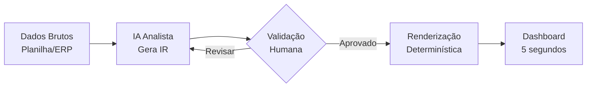

# Capítulo 1: O Design da Clareza Analítica

## 1. Introdução

Você já montou aquele relatório impecável — dezenas de abas, gráficos coloridos, dados consolidados — e entregou à diretoria esperando elogios. Dois dias depois, o CEO pergunta: "Mas e aí, estamos vendendo mais ou menos que o mês passado?" O relatório inteiro, com todas as suas camadas de sofisticação, não respondeu a pergunta que importava em cinco segundos. O problema não era falta de dados. Era falta de clareza.

Quando você assume o papel de Piloto Financeiro na ponte de comando de uma empresa do setor odontológico, seu dashboard deixa de ser um exercício de Excel avançado para se tornar um instrumento de voo: poucos indicadores, máxima clareza, decisão instantânea. Este capítulo abre a Parte I — Design e Estrutura — ensinando o princípio que separa um dashboard que impressiona visualmente de um que muda comportamento: a representação intermediária estruturada, a identificação de anti-padrões visuais e a escolha inteligente entre formato lista e lado a lado.

## 2. Explica

### O Princípio da Representação Intermediária (IR)

O conceito central que rege o design de dashboards com apoio de IA é a **separação entre análise e renderização** [1]. Quando você pede diretamente a uma LLM que "crie um dashboard", o resultado tende a ser genérico — o modelo gera código de visualização sem entender profundamente seus dados. A representação intermediária resolve isso: a IA atua como analista, produzindo uma estrutura de dados organizada, e a renderização fica a cargo de uma ferramenta determinística que você controla [2].

Pense no fluxo: seus dados brutos de vendas odontológicas entram como uma planilha bagunçada. A LLM recebe essa base e, em vez de gerar gráficos, produz um JSON estruturado com indicadores calculados, hierarquias definidas e metadados de contexto. Esse JSON é a representação intermediária — ele descreve *o que* o dashboard deve comunicar, não *como* ele fica visualmente. A etapa seguinte, executada por uma ferramenta como Google Sheets, Power BI ou até um script Python, transforma essa estrutura em pixels na tela [1].

O benefício é profundo: você ganha controle sobre cada decisão de design sem depender da aleatoriedade de uma LLM, e pode reutilizar a mesma representação em diferentes formatos de saída — um painel web, um PDF executivo, um e-mail matinal de KPIs.

### Anti-padrões: os 5 inimigos da clareza

Edward Tufte cunhou o termo *data-ink ratio* para medir a proporção de tinta no gráfico que realmente comunica dados versus a que é pura decoração [3]. Um alto data-ink ratio significa que quase tudo na sua tela serve para transmitir informação. Um baixo data-ink ratio significa que o leitor está gastando energia cognitiva filtrando ruído. Nosso setor odontológico B2B não pode se dar ao luxo de poluição visual — a diretoria precisa de decisões, não de arte.

Os cinco anti-padrões mais comuns que destroem a clareza do dashboard são [4]:

1. **Gráficos 3D desnecessários** — Adicionam profundidade que distorce a percepção de proporções. Um gráfico de pizza 3D faz a fatia da frente parecer maior do que é. Nunca use 3D para comparar valores.

2. **Cores sem semântica** — Se todas as barras são azuis, nenhuma se destaca. Use cores com significado: verde para métricas acima da meta, vermelho para abaixo, amarelo para zona de atenção. O olhar humano detecta contraste antes de ler texto.

3. **Legendas complexas** — Se o leitor precisa consultar uma legenda para entender o gráfico, o gráfico falhou. Legendas são o equivalente a um manual de instruções para ligar uma luz.

4. **Dados não normalizados** — Comparar faturação mensal (em euros) com número de pedidos (em unidades) no mesmo eixo sem eixo secundário é como comparar velocidade em km/h com altitude em metros.

5. **Excesso de gráficos** — Um dashboard com 15 gráficos é um relatório com pretensão de dashboard. A regra dos 5 segundos exige no máximo 5-7 indicadores visíveis simultaneamente.

### Formato Lista vs. Lado a Lado: a guerra pelo olhar

Aqui está uma verdade que poucos consideram: o formato como os dados são dispostos na tela afeta diretamente a velocidade de compreensão. Estudos de usabilidade mostram que layouts em lista — onde os indicadores estão empilhados verticalmente, um abaixo do outro — permitem que o olhar humano percorra a informação de forma sequencial e previsível [5]. O leitor sabe exatamente onde olhar: cima para baixo, como lendo uma página.

No formato lado a lado, o olhar precisa percorrer a tela em zigue-zague — da esquerda para a direita, depois baixar, depois da esquerda para a direita novamente. Cada curva é uma oportunidade de perder o foco. Para dashboards executivos, onde o tempo de leitura é medido em segundos, a lista vence.

A pesquisa de Knaflic sobre *storytelling with data* reforça: a hierarquia visual deve guiar o olhar do leitor para o insight mais importante primeiro, e layouts empilhados facilitam essa hierarquia [5].

## 3. Ilustra

Imagine que você está na ponte de comando de um avião. À sua frente, dois painéis diferentes. No primeiro, dezenas de manômetros, luzes coloridas e displays com três casas decimais espalhados pela cabine — você precisa de um mapa para encontrar o velocímetro. No segundo, cinco instrumentos essenciais, cada um na sua posição, com cores que indicam se tudo está normal (verde) ou se precisa de atenção (amarelo/vermelho).

Qual painel você prefere quando está a 10.000 metros e precisa tomar uma decisão em 3 segundos? O segundo. Sempre o segundo.

O mesmo vale para o seu dashboard financeiro. O fluxo de um dashboard bem projetado segue a lógica do painel de voo:



O ponto crítico é o *loop* de validação humana. A IA pode sugerir, mas o Piloto Financeiro decide. Esse é o controle que a representação intermediária oferece: você nunca perde a governança sobre o que aparece no painel.

### A analogia do supermercado

Há duas formas de organizar uma prateleira de supermercado. A primeira: jogar tudo na prateleira e deixar que o cliente encontre o que precisa. A segunda: colocar os produtos mais vendidos na altura dos olhos, agrupar por categoria, usar etiquetas de cor por tipo. Os dois formats contêm os mesmos itens. Mas um vende mais — porque o olhar do cliente não precisa trabalhar.

Formato lista é a prateleira organizada. Cada KPI tem sua posição, sua cor semântica, sua hierarquia. O olhar desce e captura tudo. Formato lado a lado é a prateleira bagunçada — potencialmente mais compacta, mas cognitivamente mais cara.

## 4. Técnica

### Construindo a Representação Intermediária com Python

Vamos implementar o princípio IR com um script Python que recebe dados brutos de uma clínica odontológica e gera uma estrutura de dashboard em formato intermediário.

```python
import json
from datetime import datetime

# === DADOS BRUTOS (simulando export de ERP) ===
vendas_brutas = [
    {"data": "2026-01-15", "cliente": "Clínica Sorriso", "produto": "Pontas Escovadas", "valor": 2400, "quantidade": 120},
    {"data": "2026-01-20", "cliente": "OdontoVida", "produto": "Limas Endodônticas", "valor": 1800, "quantidade": 60},
    {"data": "2026-02-03", "cliente": "Clínica Sorriso", "produto": "Resina Composta", "valor": 3200, "quantidade": 200},
    {"data": "2026-02-10", "cliente": "Dental Premium", "produto": "Agulhas Descartáveis", "valor": 950, "quantidade": 500},
    {"data": "2026-02-18", "cliente": "OdontoVida", "produto": "Pontas Escovadas", "valor": 2100, "quantidade": 105},
    {"data": "2026-03-05", "cliente": "Clínica Sorriso", "produto": "Limas Endodônticas", "valor": 2700, "quantidade": 90},
    {"data": "2026-03-12", "cliente": "Dental Premium", "produto": "Resina Composta", "valor": 4100, "quantidade": 260},
    {"data": "2026-03-20", "cliente": "OdontoVida", "produto": "Agulhas Descartáveis", "valor": 1200, "quantidade": 600},
]

# === REPRESENTAÇÃO INTERMEDIÁRIA ===
def gerar_ir(vendas):
    """Gera estrutura intermediária de dashboard a partir de dados brutos."""
    
    # KPIs consolidados
    faturacao_total = sum(v["valor"] for v in vendas)
    num_pedidos = len(vendas)
    ticket_medio = faturacao_total / num_pedidos if num_pedidos > 0 else 0
    
    # Único cliente (para demonstração — em produção, agrupar por cliente)
    clientes_unicos = list(set(v["cliente"] for v in vendas))
    
    # Primeiro e último pedido (formato lista — cronológico)
    vendas_ordenadas = sorted(vendas, key=lambda x: x["data"])
    primeiro_pedido = vendas_ordenadas[0]
    ultimo_pedido = vendas_ordenadas[-1]
    
    # Top produto por faturação
    vendas_por_produto = {}
    for v in vendas:
        prod = v["produto"]
        vendas_por_produto[prod] = vendas_por_produto.get(prod, 0) + v["valor"]
    top_produto = max(vendas_por_produto, key=vendas_por_produto.get)
    
    # Montagem da IR
    representacao = {
        "metadata": {
            "periodo": f"{primeiro_pedido['data']} a {ultimo_pedido['data']}",
            "gerado_em": datetime.now().isoformat(),
            "fonte": "ERP - Exportação Manual"
        },
        "kpis": {
            "faturacao_total": {"valor": faturacao_total, "moeda": "EUR", "label": "Faturação Total"},
            "ticket_medio": {"valor": round(ticket_medio, 2), "moeda": "EUR", "label": "Ticket Médio"},
            "num_pedidos": {"valor": num_pedidos, "label": "Nº de Pedidos"},
            "num_clientes": {"valor": len(clientes_unicos), "label": "Clientes Ativos"}
        },
        "indicadores_temporais": {
            "primeiro_pedido": {"data": primeiro_pedido["data"], "cliente": primeiro_pedido["cliente"], "valor": primeiro_pedido["valor"]},
            "ultimo_pedido": {"data": ultimo_pedido["data"], "cliente": ultimo_pedido["cliente"], "valor": ultimo_pedido["valor"]}
        },
        "ranking_produtos": [
            {"produto": p, "faturacao": f} 
            for p, f in sorted(vendas_por_produto.items(), key=lambda x: x[1], reverse=True)
        ],
        "layout_sugerido": {
            "formato": "lista",
            "ordem": ["faturacao_total", "ticket_medio", "num_pedidos", "primeiro_pedido", "ultimo_pedido", "ranking_produtos"],
            "cores": {"acima_meta": "#2ecc71", "abaixo_meta": "#e74c3c", "neutro": "#3498db"}
        }
    }
    
    return representacao

# === EXECUÇÃO ===
ir = gerar_ir(vendas_brutas)
print(json.dumps(ir, indent=2, ensure_ascii=False))
```

### Prompt Template para IA Gerar Esqueleto de Dashboard

Abaixo está um prompt estruturado que você pode adaptar e enviar a qualquer LLM para obter um esqueleto de dashboard em formato lista:

```markdown
# Prompt: Esqueleto de Dashboard em Formato Lista

Você é um analista financeiro especializado em dashboards executivos.
Receba os seguintes dados em formato lista e gere um esqueleto de dashboard
que um Diretor Financeiro possa ler em 5 segundos.

## Dados de Entrada
[Liste aqui seus dados em formato de tabela ou lista simples]

## Regras de Design (OBRIGATÓRIAS)
1. Formato: LISTA VERTICAL (nunca lado a lado)
2. Máximo 5 KPIs visíveis simultaneamente
3. Cores semânticas: verde = acima da meta, vermelho = abaixo, amarelo = atenção
4. Sem gráficos 3D — apenas barras, linhas ou cards simples
5. Sem legendas — cada dado deve ser autoexplicativo
6. Se precisa de legenda, o design está errado

## Saída Esperada
- JSON com a estrutura do dashboard
- Cada KPI com: nome, valor, tendência, cor sugerida
- Ordem de leitura de cima para baixo
- Indicação de qual KPI é o mais importante (destaque visual)
```

A IA receberá seus dados e retornará uma estrutura que você pode copiar direto para Google Sheets, Power BI ou qualquer ferramenta de renderização. O ponto chave: você está usando a IA como analista, não como designer gráfico.

### Validação: a Regra dos 5 Segundos

Após gerar o esqueleto, teste com a regra dos 5 segundos: mostre o dashboard para alguém que não participou da criação e cronometre. Se em 5 segundos a pessoa conseguir responder "o negócio está indo bem ou mal", o design está correto. Se precisar de mais tempo, volte à representação intermediária e simplifique.

## 5. Aplica

Carlos é analista financeiro de uma distribuidora de materiais odontológicos no Porto. Toda segunda-feira ele monta um relatório de vendas para a diretoria — 12 abas no Excel, com gráficos de barras empilhados, gráficos de pizza com 8 fatias e uma aba de dados brutos com 2.000 linhas. Ele gasta 3 horas montando e a diretoria gasta 10 minutos olhando e perguntando "mas e aí?"

O erro de Carlos não é falta de competência técnica — é design sem intenção. Ele está empilhando dados em vez de projetar a leitura. O relatório dele é uma prateleira de supermercado jogada no chão: tudo ali, nada organizado, o cliente precisa se virar.

A correção é aplicar o princípio da representação intermediária. Carlos pede para a IA analisar seus dados brutos e gerar um JSON estruturado com 5 KPIs essenciais: Faturação Total, Ticket Médio, Nº de Pedidos, Primeiro Pedido do Período e Último Pedido do Período. Ele valida o JSON, ajusta o que precisa, e renderiza em formato lista — um cartão por KPI, empilhados verticalmente, com cores semânticas.

Na segunda seguinte, o relatório tem uma página. A diretoria lê em 5 segundos e pergunta: "Por que o ticket médio caiu 12%?" — que é exatamente a pergunta certa.

**Armadilhas comuns ao aplicar este capítulo:**

- **Pedir à IA para gerar o dashboard completo de uma vez.** A IA gera código que você não controla. Use a IR: peça a estrutura, valide, depois renderize.
- **Ignorar a validação humana.** A IA erra — às vezes coloca o dado certo no lugar errado. Sempre revise antes de enviar ao painel.
- **Copiar layout de dashboards genéricos.** Cada empresa tem seus KPIs. O que funciona para um SaaS não funciona para uma distribuidora odontológica B2B.

## 6. Conclusão

Você dominou três fundamentos que sustentam qualquer dashboard financeiro de qualidade: a representação intermediária estruturada que separa análise de renderização, a identificação dos cinco anti-padrões visuais que destroem a clareza, e a escolha do formato lista como o mais eficiente para decisão executiva. Esses são os alicerces — sem eles, qualquer ferramenta, por mais avançada que seja, entrega um dashboard que ninguém lê.

No próximo capítulo, vamos substituir a complexidade pela praticidade: como transformar cálculos temporais confusos em cartões visuais diretos que mostram data do primeiro e último pedido, permitindo que a diretoria entenda a saúde do negócio sem precisar de um glossário.

## 7. Referências Bibliográficas

[1] FEW, Stephen. *Information Dashboard Design: The Effective Visual Communication of Data*. O'Reilly Media, 2006.

[2] MCKINSEY. *The Data-Driven Enterprise of 2025*. McKinsey & Company, 2024.

[3] TUFTE, Edward. *The Visual Display of Quantitative Information*. Graphics Press, 2001.

[4] SCHWABISH, Jonathan. An Economist's Guide to Visualizing Data. *Journal of Economic Perspectives*, v. 28, n. 1, p. 209-234, 2014.

[5] KNACLIC, Cole. *Storytelling with Data: A Data Visualization Guide for Business Professionals*. Wiley, 2015.
