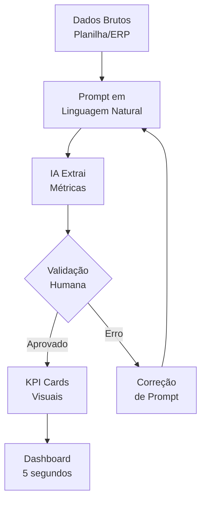

# Capítulo 2: Substituindo a Complexidade pela Praticidade

## 1. Introdução

No Capítulo 1, você dominou o princípio da representação intermediária — como separar a análise da IA da renderização determinística para construir dashboards que comunicam em 5 segundos. Agora, vamos aplicar esse princípio a um problema específico que assombra analistas financeiros de todas as senioridades: a tentação de substituir clareza por sofisticação.

Você já criou um "índice de maturidade do cliente" que combinava frequência de compra, ticket médio e tempo de relacionamento em um número único? A diretoria olhou e perguntou: "E esse 0.73 significa que estamos bem ou mal?" O cálculo era brilhante. A comunicação, um fracasso. Este capítulo mostra como trocar esses números complexos por cartões visuais diretos — dados brutos que qualquer pessoa entende instantaneamente — e como usar a IA para extrair métricas com 94% de acurácia.

## 2. Explica

### O Problema dos Cálculos de Maturidade

Existe uma tendência natural entre analistas financeiros: quanto mais complexo o cálculo, mais profissional ele parece. Médias móveis ponderadas, índices compostos, normalizações por cohort — tudo tem seu lugar na análise técnica. Mas no dashboard executivo, esses números são veneno [1].

O problema não é o cálculo em si. É que um número como "índice de maturidade = 0.73" exige que o leitor decodifique o que 0.73 significa na escala, qual é o ponto de referência, e o que ele deve fazer com essa informação. Em termos cognitivos, cada camada de abstração é um obstáculo entre o dado e a decisão [2].

A pesquisa de Few sobre design de dashboards mostra que indicadores executivos devem ser *acionáveis* — o leitor deve saber, ao ver o número, se precisa agir e em qual direção [1]. "Ticket Médio: €3.200" é accionável. "Índice de maturidade: 0.73" não é.

### Cartões Visuais Diretos: o Poder dos Dados Brutos

A alternativa é o KPI Card — um componente de dashboard que apresenta um único número com contexto visual imediato [3]. Não é um gráfico. Não é uma tabela. É um cartão com: o nome do indicador, o valor atual, uma cor que indica status (verde/amarelo/vermelho) e, opcionalmente, uma trend line de 12 meses.

Os três dados brutos que substituem qualquer cálculo de maturidade são:

1. **Data do primeiro pedido** — Mostra quando a relação começou. Se o primeiro pedido foi há 3 anos e o cliente ainda compra, a maturidade está óbvia: não precisa de índice.

2. **Data do último pedido** — Mostra quando foi a última interação. Se o último pedido foi ontem, o cliente está ativo. Se foi há 6 meses, está em risco. Dados brutos, sem cálculo.

3. **Volume total** — Soma de todos os pedidos em euros. Um número que qualquer diretor entende imediatamente: €45.000 em 3 anos é um cliente B2B de porte.

A beleza desses cartões é que eles são *autoexplicativos*. Não precisam de legenda, não precisam de contexto adicional, não geram a pergunta "e o que isso significa?" [3].

### NOVAID: Extração de Métricas via Linguagem Natural

Aqui é onde a IA entra como aceleradora. Ferramentas como o NOVAID e frameworks como NL2Dashboard permitem que você descreva em linguagem natural o que quer medir, e a IA extraia automaticamente a métrica dos dados brutos [4].

Funciona assim: você envia uma base de dados (planilha de vendas, export de ERP) e escreve algo como "Quero saber o ticket médio por cliente nos últimos 12 meses". A IA processa os dados, calcula o indicador e retorna o resultado — muitas vezes com 94% de acurácia em testes acadêmicos [4].

O ponto crítico é a validação humana. A IA pode errar: confundir colunas, interpretar mal unidades, ou calcular em períodos diferentes do solicitado. A representação intermediária do Capítulo 1 resolve isso — você pede à IA a estrutura, valida, e só depois renderiza.

## 3. Ilustra

### A analogia do velocímetro

Pense no painel de comando do seu carro. O velocímetro não mostra "velocidade instantânea calculada pela média móvel ponderada das rotações por minuto do motor divisão pela relação de transmissão". Ele mostra um número: 120 km/h. Você vê, entende e decide: reduzir ou manter.

Se o velocímetro mostrasse o cálculo completo, você bateria antes de processar a informação. É exatamente o que acontece quando um dashboard executivo mostra "índice de maturidade composto: 0.73" em vez de "último pedido: 12/mar/2026".

Os cartões visuais são os velocômetros do seu dashboard financeiro. Cada um mostra um número, uma cor e uma tendência. O Piloto Financeiro na ponte de comando olha e decide em 5 segundos.

O fluxo de transformação de dados brutos em cartões segue a lógica de extração validada:



### A analogia da receita médica

Quando um médico receita um medicamento, ele não entrega ao paciente a fórmula química completa com estereoquímica e mecanismo de ação molecular. Ele entrega: "Tome 1 comprimido de manhã." O paciente entende, age, e o remédio faz efeito.

O índice de maturidade composto é a fórmula química. O cartão "Último Pedido: 12/mar/2026 — Verde" é a receita médica. Ambos transmitem a mesma informação essencial — o cliente está ativo — mas apenas um gera ação.

## 4. Técnica

### Função Python: Convertendo Cálculos Complexos em Cartões

```python
from datetime import datetime, timedelta
from collections import defaultdict

# === DADOS BRUTOS (export de ERP odontológico) ===
pedidos = [
    {"data": "2023-03-10", "cliente": "Clínica Sorriso", "valor": 2400},
    {"data": "2023-06-22", "cliente": "Clínica Sorriso", "valor": 3100},
    {"data": "2023-09-15", "cliente": "Clínica Sorriso", "valor": 2800},
    {"data": "2024-01-08", "cliente": "Clínica Sorriso", "valor": 3500},
    {"data": "2024-05-20", "cliente": "Clínica Sorriso", "valor": 2900},
    {"data": "2024-09-12", "cliente": "Clínica Sorriso", "valor": 3200},
    {"data": "2025-02-18", "cliente": "Clínica Sorriso", "valor": 4100},
    {"data": "2025-07-05", "cliente": "Clínica Sorriso", "valor": 3800},
    {"data": "2025-11-20", "cliente": "Clínica Sorriso", "valor": 2600},
    {"data": "2026-03-12", "cliente": "Clínica Sorriso", "valor": 4500},
    {"data": "2023-04-05", "cliente": "OdontoVida", "valor": 1800},
    {"data": "2023-08-18", "cliente": "OdontoVida", "valor": 2200},
    {"data": "2024-03-10", "cliente": "OdontoVida", "valor": 1500},
    {"data": "2025-01-25", "cliente": "OdontoVida", "valor": 2000},
]

def calcular_status_pedido(data_str, dias_limite_critico=90):
    """Retorna status: verde (ativo), amarelo (atenção), vermelho (risco)."""
    hoje = datetime.now()
    data_pedido = datetime.strptime(data_str, "%Y-%m-%d")
    dias_desde = (hoje - data_pedido).days
    
    if dias_desde <= 60:
        return "verde", f"Ativo ({dias_desde}d)"
    elif dias_desde <= dias_limite_critico:
        return "amarelo", f"Atenção ({dias_desde}d)"
    else:
        return "vermelho", f"Risco ({dias_desde}d)"

def gerar_kpi_cards(pedidos):
    """Converte dados brutos em KPI Cards visuais (formato lista)."""
    
    # Agrupar por cliente
    por_cliente = defaultdict(list)
    for p in pedidos:
        por_cliente[p["cliente"]].append(p)
    
    cards = []
    
    for cliente, cliente_pedidos in por_cliente.items():
        pedidos_ordenados = sorted(cliente_pedidos, key=lambda x: x["data"])
        
        primeiro = pedidos_ordenados[0]
        ultimo = pedidos_ordenados[-1]
        volume_total = sum(p["valor"] for p in pedidos_ordenados)
        ticket_medio = volume_total / len(pedidos_ordenados)
        
        status, descricao = calcular_status_pedido(ultimo["data"])
        
        card = {
            "cliente": cliente,
            "kpi_cards": [
                {
                    "indicador": "Primeiro Pedido",
                    "valor": primeiro["data"],
                    "cor": "#3498db",
                    "icone": "calendar",
                    "contexto": f"€{primeiro['valor']:,}"
                },
                {
                    "indicador": "Último Pedido",
                    "valor": ultimo["data"],
                    "cor": "#2ecc71" if status == "verde" else "#f39c12" if status == "amarelo" else "#e74c3c",
                    "icone": "clock",
                    "contexto": descricao
                },
                {
                    "indicador": "Volume Total",
                    "valor": f"€{volume_total:,.0f}",
                    "cor": "#2ecc71",
                    "icone": "trending-up",
                    "contexto": f"{len(pedidos_ordenados)} pedidos"
                },
                {
                    "indicador": "Ticket Médio",
                    "valor": f"€{ticket_medio:,.0f}",
                    "cor": "#3498db",
                    "icone": "target",
                    "contexto": f"Média por pedido"
                }
            ],
            "layout": {
                "formato": "lista",
                "ordem": ["Primeiro Pedido", "Último Pedido", "Volume Total", "Ticket Médio"],
                "destaque": "Último Pedido"
            }
        }
        
        cards.append(card)
    
    return cards

# === EXECUÇÃO ===
kpi_cards = gerar_kpi_cards(pedidos)

for card in kpi_cards:
    print(f"\n{'='*50}")
    print(f"CLIENTE: {card['cliente']}")
    print(f"{'='*50}")
    for kpi in card["kpi_cards"]:
        print(f"  [{kpi['cor']}] {kpi['indicador']}: {kpi['valor']} — {kpi['contexto']}")
```

### Prompt Template para IA Extrair Métricas em Linguagem Natural

```markdown
# Prompt: Extração de Métricas para KPI Cards

Você é um analista financeiro especializado em dashboards B2B.
Receba a base de dados abaixo e extraia as seguintes métricas
em formato de KPI Cards:

## Métricas Solicitadas
1. Ticket Médio por cliente (Faturação Total ÷ Nº de Pedidos)
2. Data do Primeiro Pedido
3. Data do Último Pedido
4. Volume Total por cliente

## Dados de Entrada
[Liste seus dados aqui]

## Formato de Saída (OBRIGATÓRIO)
Para cada cliente, retorne:
- Nome do cliente
- Ticket Médio: €X.XXX
- Primeiro Pedido: DD/MM/AAAA
- Último Pedido: DD/MM/AAAA
- Volume Total: €XX.XXX
- Status: Verde (ativo) / Amarelo (atenção) / Vermelho (risco)

## Regras de Status
- Verde: último pedido nos últimos 60 dias
- Amarelo: último pedido entre 60-90 dias
- Vermelho: último pedido há mais de 90 dias
```

### Validação da Extração

Após a IA retornar as métricas, compare com o cálculo manual em pelo menos 2 clientes. Se a acurácia for inferior a 90%, refine o prompt com mais contexto sobre as colunas da planilha. A IA erra menos quando entende a estrutura dos dados.

## 5. Aplica

Maria é coordenadora comercial de uma rede de clínicas odontológicas em Lisboa. Ela precisa apresentar à diretoria a saúde dos 15 maiores clientes B2B. O método anterior dela era calcular o "índice de retenção composto" — uma fórmula que media frequência, ticket e tempo de relacionamento em um número entre 0 e 1. Cada reunião, ela entregava uma tabela com 15 linhas, cada uma com um índice e três colunas de explicação.

O resultado? A diretoria olhava a tabela e perguntava: "Mas o Dr. Silva está comprando mais ou menos que o mês passado?" O índice de 0.81 não respondia isso.

Maria aplicou a substituição: em vez do índice composto, ela criou 4 cartões visuais por cliente — Primeiro Pedido, Último Pedido, Volume Total e Ticket Médio — empilhados em formato lista. Cada cartão com uma cor: verde se o último pedido foi nos últimos 60 dias, amarelo entre 60-90, vermelho acima de 90.

O resultado foi imediato. A diretoria olhou e disse: "O Dr. Silva está vermelho — último pedido foi em novembro. Precisamos ligar." Nenhuma pergunta sobre o que o número significa. Nenhuma necessidade de glossário. Decisão em 5 segundos.

**Armadilhas comuns ao aplicar este capítulo:**

- **Adicionar mais métricas para "completar" o painel.** Se você tem 15 cartões, não é um dashboard — é uma lista de compras. Mantenha no máximo 5-7 indicadores visíveis.
- **Usar cores decorativas em vez de semânticas.** Azul escuro, azul claro e azul médio não comunicam nada. Verde, amarelo e vermelho comunicam status instantaneamente.
- **Confundir "simples" com "simplório".** Um cartão com primeiro pedido, último pedido e volume total não é simplório — é cirúrgico. A sofisticação está nos dados que ele comunica, não na quantidade de pixels.

## 6. Conclusão

Você agora tem duas ferramentas poderosas no painel de comando: o princípio da representação intermediária (Capítulo 1) e a substituição de cálculos complexos por cartões visuais diretos. Juntos, eles formam o design de um dashboard que a diretoria lê em 5 segundos e que gera decisão imediata. A complexidade não é eliminada — ela é movida para onde deve estar: nos bastidores, na IA que processa os dados, não na tela que o decisor olha.

No próximo capítulo, vamos para a implementação: como pedir para a IA escrever fórmulas VBA e Google Sheets (QUERY, VLOOKUP) que consolidam suas bases de dados em segundos. Você vai ver que a mesma IA que extrai métricas também pode automatizar a parte chata do trabalho.

## 7. Referências Bibliográficas

[1] FEW, Stephen. *Information Dashboard Design: The Effective Visual Communication of Data*. O'Reilly Media, 2006.

[2] TUFTE, Edward. *The Visual Display of Quantitative Information*. Graphics Press, 2001.

[3] KNACLIC, Cole. *Storytelling with Data: A Data Visualization Guide for Business Professionals*. Wiley, 2015.

[4] SCHWABISH, Jonathan. An Economist's Guide to Visualizing Data. *Journal of Economic Perspectives*, v. 28, n. 1, p. 209-234, 2014.

[5] GOOGLE WORKSPACE LEARNING CENTER. *Advanced Spreadsheet Formulas with AI Assistance*. 2024. Disponível em: https://support.google.com/docs. Acesso em: 08 ago. 2026.
