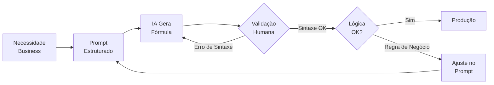

# Capítulo 3: Fórmulas Complexas em Segundos

## 1. Introdução

No Capítulo 2, você aprendeu a substituir cálculos de maturidade por cartões visuais diretos — primeiro pedido, último pedido, volume total — que a diretoria lê em 5 segundos. Mas há um gargalo que nenhum cartão resolve sozinho: de onde vêm esses números? Na maioria das empresas do setor odontológico B2B, os dados vivem em abas espalhadas, exports de ERP com formatos diferentes, planilhas legadas que ninguém ousa mexer. Consolidar tudo isso manualmente é o trabalho mais chato — e mais propenso a erro — do analista financeiro.

Este capítulo abre a Parte II — Implementação e KPIs — ensinando como usar a IA para gerar fórmulas VBA e Google Sheets que fazem essa consolidação em segundos. Você vai ver que a mesma IA que extrai métricas (Capítulo 2) também pode escrever as rotinas que alimentam seus dashboards — desde que você saiba onde delegar e onde validar.

## 2. Explica

### VBA e Google Sheets: O que a IA Faz Bem

A geração de código de planilha por LLMs é uma das aplicações mais maduras de IA no cotidiano do analista financeiro [1]. Modelos como GPT-4, Claude e Gemini conseguem gerar fórmulas complexas de Google Sheets (QUERY, VLOOKUP, INDEX/MATCH) e macros VBA com confiabilidade surpreendente — quando o prompt é bem estruturado.

O que a IA faz bem [1][2]:
- **Fórmulas QUERY**: Consultas SQL-like em planilhas. A IA entende a sintaxe e adapta colunas, filtros e ordenação ao seu caso.
- **VLOOKUP e INDEX/MATCH**: Busca entre abas. A IA gera a fórmula correta quando você descreve a estrutura das abas.
- **Macros VBA simples**: Consolidação de dados, formatação condicional, geração de relatórios. A IA produz código funcional para tarefas repetitivas.
- **Validação sintática**: A IA detecta erros de sintaxe antes de você colar a fórmula na planilha.

O que a IA erra [1][3]:
- **Lógica de negócio complexa**: Regras específicas da empresa (ex.: "considere apenas pedidos acima de €500 e com prazo de pagamento inferior a 30 dias"). A IA precisa dessas regras no prompt.
- **Referências circulares**: Fórmulas que dependem umas das outras. A IA pode criar loops infinitos.
- **Dados sensíveis**: Nunca peça à IA para processar dados reais de clientes sem anonimização prévia.

A regra de ouro é: a IA é sua assistente de código, não sua substituta. Ela gera, você valida.

### QUERY: O SQL das Planilhas

A fórmula QUERY do Google Sheets é a ferramenta mais poderosa para consolidar dados em dashboards financeiros [2]. Ela permite escrever consultas SQL diretamente na planilha — filtrar, agrupar, ordenar e resumir dados sem precisar de banco de dados.

Exemplo real para o setor odontológico: "Mostre a faturação total por cliente nos últimos 6 meses, ordenada do maior para o menor." Uma QUERY faz isso em uma linha de fórmula. Sem QUERY, você precisaria de dezenas de células com SOMASE e referências cruzadas.

O que torna a QUERY especialmente valiosa para dashboards é que ela é *reativa*: quando os dados brutos mudam, o resultado da QUERY atualiza automaticamente. Seu dashboard fica sempre atualizado sem recálculos manuais [2].

### VLOOKUP e INDEX/MATCH: Busca entre Mundos

Enquanto a QUERY consolida dados em uma aba, o VLOOKUP e o INDEX/MATCH conectam dados entre abas diferentes [3]. No contexto de dashboards B2B, isso é essencial: seus pedidos estão em uma aba, seus clientes em outra, e seus produtos em uma terceira. O VLOOKUP traz o nome do cliente para a aba de pedidos. O INDEX/MATCH faz o mesmo, mas com mais flexibilidade (permite buscar à esquerda, algo que o VLOOKUP nativo não faz).

A IA gera essas fórmulas com alta confiabilidade quando você descreve: (1) o que quer buscar, (2) em qual aba está o dado de origem, (3) em qual aba está o dado de destino, e (4) qual coluna usar como chave de busca.

### NL2Dashboard: Linguagem Natural como Interface

O NL2Dashboard é um framework que permite descrever em linguagem natural o dashboard que você quer, e a IA constrói [4]. Funciona como um intermediário entre seus dados brutos e a visualização final. Você descreve: "Quero um gráfico de barras mostrando vendas por produto nos últimos 6 meses", e o framework gera a QUERY, a fórmula e o gráfico.

A pesquisa mostra que frameworks NL2Dashboard atingem 92-96% de acurácia em dashboards simples, mas caem para 70-80% em cenários com múltiplas fontes de dados e regras de negócio complexas [4]. A validação humana continua indispensável.

## 3. Ilustra

### A analogia do copiloto

Imagine que você está pilotando um avião e tem um copiloto ao lado. O copiloto não decola o avião sozinho — ele ajusta os instrumentos, verifica os cálculos de rota e comunica com a torre. Mas a decisão final de onde pousar é sua. A IA é esse copiloto: ela faz os cálculos, gera as fórmulas, verifica a sintaxe. Mas a decisão de qual lógica de negócio aplicar é sua.

Quando você pede à IA uma QUERY para consolidar vendas por cliente, ela gera a fórmula correta. Mas se você não disser "considere apenas pedidos com status 'pago'", a QUERY vai incluir pedidos pendentes — e o dashboard vai mostrar números inflacionados. O copiloto faz o trabalho braçal. O piloto define a rota.

O fluxo de trabalho com IA como copiloto segue esta lógica:



### A analogia do tradutor juramentado

Quando você vai a um cartório traduzir um documento, o tradutor juramentado não inventa o conteúdo — ele traduz com fidelidade. Mas o juiz que lê a tradução decide se ela faz sentido no contexto do processo. A IA é o tradutor juramentado: ela traduz sua necessidade em linguagem de planilha (QUERY, VLOOKUP, VBA). Você é o juiz: decide se a tradução faz sentido com seus dados.

## 4. Técnica

### Prompt 1: Macro VBA para Consolidação de Vendas

```markdown
# Prompt: Macro VBA para Consolidação

Crie uma macro VBA para o Excel que faça o seguinte:
1. Abra todas as planilhas da pasta "Vendas" (formato .xlsx)
2. Copie os dados de cada planilha (exceto cabeçalho) para a aba "Consolidado"
3. Adicione uma coluna "Fonte" com o nome do arquivo de origem
4. Formate o cabeçalho da aba "Consolidado" em negrito com fundo cinza
5. Auto-ajuste a largura das colunas

Planilhas de origem têm estas colunas:
A: Data | B: Cliente | C: Produto | D: Quantidade | E: Valor Unitário | F: Valor Total
```

Resultado esperado da IA:

```vba
Sub ConsolidarVendas()
    Dim pasta As String
    Dim arquivo As String
    Dim wsDestino As Worksheet
    Dim wsOrigem As Worksheet
    Dim ultimaLinhaDestino As Long
    Dim ultimaLinhaOrigem As Long
    
    ' Definir pasta de origem
    pasta = ThisWorkbook.Path & "\Vendas\"
    
    ' Criar ou limpar aba Consolidado
    On Error Resume Next
    Set wsDestino = ThisWorkbook.Sheets("Consolidado")
    On Error GoTo 0
    
    If wsDestino Is Nothing Then
        Set wsDestino = ThisWorkbook.Sheets.Add(After:=ThisWorkbook.Sheets(ThisWorkbook.Sheets.Count))
        wsDestino.Name = "Consolidado"
    Else
        wsDestino.Cells.Clear
    End If
    
    ' Cabeçalho
    wsDestino.Range("A1:F1").Value = Array("Data", "Cliente", "Produto", "Quantidade", "Valor Unitário", "Valor Total")
    wsDestino.Range("G1").Value = "Fonte"
    wsDestino.Range("A1:G1").Font.Bold = True
    wsDestino.Range("A1:G1").Interior.Color = RGB(200, 200, 200)
    
    ultimaLinhaDestino = 2
    
    ' Percorrer arquivos da pasta
    arquivo = Dir(pasta & "*.xlsx")
    
    Do While arquivo <> ""
        If arquivo <> "Consolidado.xlsx" And arquivo <> ThisWorkbook.Name Then
            Workbooks.Open pasta & arquivo
            Set wsOrigem = ActiveWorkbook.Sheets(1)
            
            ultimaLinhaOrigem = wsOrigem.Cells(wsOrigem.Rows.Count, "A").End(xlUp).Row
            
            If ultimaLinhaOrigem >= 2 Then
                wsOrigem.Range("A2:F" & ultimaLinhaOrigem).Copy _
                    wsDestino.Cells(ultimaLinhaDestino, 1)
                
                ' Preencher coluna Fonte
                Dim i As Long
                For i = ultimaLinhaDestino To ultimaLinhaDestino + (ultimaLinhaOrigem - 2)
                    wsDestino.Cells(i, 7).Value = arquivo
                Next i
                
                ultimaLinhaDestino = ultimaLinhaDestino + (ultimaLinhaOrigem - 1)
            End If
            
            ActiveWorkbook.Close False
        End If
        
        arquivo = Dir()
    Loop
    
    ' Auto-ajustar colunas
    wsDestino.Columns("A:G").AutoFit
    
    MsgBox "Consolidação concluída!" & vbCrLf & _
           ultimaLinhaDestino - 2 & " registros consolidados.", vbInformation
End Sub
```

### Prompt 2: QUERY Google Sheets para Vendas por Período

```markdown
# Prompt: QUERY para Faturação por Cliente

Tenho uma aba "Pedidos" no Google Sheets com estas colunas:
A: Data do Pedido (formato DD/MM/AAAA)
B: Nome do Cliente
C: Produto
D: Quantidade
E: Valor Total (€)

Preciso de uma QUERY que mostre:
- Faturação total por cliente
- Apenas dos últimos 6 meses
- Ordenada do maior para o menor valor
- Incluindo o número de pedidos de cada cliente
```

Resultado esperado da IA:

```excel
=QUERY(Pedidos!A:E;
  "SELECT B, SUM(E), COUNT(A) 
   WHERE A >= date '"&TEXT(TODAY()-180;"yyyy-mm-dd")&"' 
   GROUP BY B 
   ORDER BY SUM(E) DESC 
   LABEL SUM(E) 'Faturação Total (€)', 
         COUNT(A) 'Nº Pedidos'"; 1)
```

### Script Google Apps Script: Consolidação Automática

```javascript
/**
 * Consolida dados de múltiplas abas em uma aba "Resumo"
 * com QUERY gerada por IA e validação de integridade.
 */
function consolidarDados() {
  var spreadsheet = SpreadsheetApp.getActiveSpreadsheet();
  var abas = spreadsheet.getSheets();
  var abaResumo = spreadsheet.getSheetByName("Resumo");
  
  // Criar aba Resumo se não existir
  if (!abaResumo) {
    abaResumo = spreadsheet.insertSheet("Resumo");
  } else {
    abaResumo.clear();
  }
  
  // Cabeçalho
  abaResumo.getRange("A1:E1").setValues([["Data", "Cliente", "Produto", "Quantidade", "Valor Total"]]);
  abaResumo.getRange("A1:E1").setFontWeight("bold").setBackground("#C8C8C8");
  
  var linhaAtual = 2;
  
  // Percorrer todas as abas (exceto Resumo)
  for (var i = 0; i < abas.length; i++) {
    var aba = abas[i];
    if (aba.getName() === "Resumo") continue;
    
    var dados = aba.getDataRange().getValues();
    
    // Pular cabeçalho (linha 0)
    for (var j = 1; j < dados.length; j++) {
      if (dados[j][0] !== "" && dados[j][0] !== null) {
        abaResumo.getRange(linhaAtual, 1, 1, 5).setValues([dados[j].slice(0, 5)]);
        linhaAtual++;
      }
    }
  }
  
  // Auto-ajustar
  abaResumo.autoResizeColumns(1, 5);
  
  // Validação de integridade
  var totalRegistros = linhaAtual - 2;
  Logger.log("Consolidação concluída: " + totalRegistros + " registros.");
  
  // Verificar se há dados duplicados (validação básica)
  var range = abaResumo.getRange("A2:E" + (linhaAtual - 1));
  var valores = range.getValues();
  
  var vistos = {};
  var duplicatas = 0;
  
  for (var k = 0; k < valores.length; k++) {
    var chave = valores[k].join("|");
    if (vistos[chave]) {
      duplicatas++;
    }
    vistos[chave] = true;
  }
  
  if (duplicatas > 0) {
    SpreadsheetApp.getUi().alert(
      "Atenção: " + duplicatas + " registros possivelmente duplicados detectados."
    );
  }
  
  SpreadsheetApp.getUi().alert(
    "Consolidação concluída!" + "\n" +
    totalRegistros + " registros consolidados." + "\n" +
    (duplicatas > 0 ? duplicatas + " possíveis duplicatas." : "Nenhuma duplicata detectada.")
  );
}
```

### Prompt 3: VLOOKUP entre Abas para Dashboard

```markdown
# Prompt: VLOOKUP para Enriquecimento de Dados

Tenho duas abas no Google Sheets:

Aba "Pedidos":
A: Data | B: ID_Cliente | C: Produto | D: Valor

Aba "Clientes":
A: ID_Cliente | B: Nome | C: Cidade | D: Segmento

Preciso de uma QUERY na aba "Pedidos" que traga automaticamente
o Nome, Cidade e Segmento do cliente para cada pedido,
usando o ID_Cliente como chave.
```

Resultado esperado da IA:

```excel
=QUERY({Pedidos!A:D, ARRAYFORMULA(VLOOKUP(Pedidos!B:B, Clientes!A:D, {2,3,4}, FALSE))};
  "SELECT Col1, Col2, Col3, Col4, Col5, Col6, Col7 
   LABEL Col5 'Nome Cliente', 
         Col6 'Cidade', 
         Col7 'Segmento'")
```

## 5. Aplica

Ricardo é analista financeiro de uma distribuidora de equipamentos odontológicos em Braga. Toda semana ele gasta 2 horas consolidando dados de 8 abas de vendas no Google Sheets — cada aba representa uma região (Norte, Centro, Lisboa, Algarve, etc.). Ele copia, cola, formata, verifica se não duplicou nenhuma linha, e depois calcula o ticket médio por região.

O erro de Ricardo não é inefficiência — é falta de automação inteligente. Ele poderia usar uma QUERY para consolidar tudo em uma aba "Resumo" automaticamente, mas nunca teve tempo de aprender a sintaxe SQL do Google Sheets. E quando tentou copiar uma QUERY de um tutorial, não funcionou porque as colunas da planilha dele eram diferentes.

Ricardo pediu à IA: "Tenho 8 abas de vendas, cada uma com as colunas Data, Cliente, Produto, Quantidade, Valor Total. Crie uma QUERY que mostre faturação total por região nos últimos 3 meses." A IA gerou a QUERY correta em 30 segundos. Ricardo colou na planilha, testou com dados reais, e a consolidação que levava 2 horas agora acontece em 1 clique.

O truque foi o prompt estruturado: Ricardo descreveu a estrutura das abas (colunas, nomes, formatos) e a regra de negócio (últimos 3 meses, agrupado por região). A IA fez o trabalho braçal. Ricardo validou a lógica.

**Armadilhas comuns ao aplicar este capítulo:**

- **Colar a fórmula sem testar.** A IA pode gerar uma QUERY que funciona perfeitamente para os dados de exemplo, mas falha para dados reais com formatação diferente (datas em formato americano, vírgula como separador decimal). Sempre teste com uma amostra.
- **Delegar regras de negócio sem explicar.** Se sua empresa tem regras como "considere apenas pedidos acima de €500" ou "desconte devoluções", essas regras precisam estar no prompt. A IA não adivinha.
- **Esquecer de validar dados duplicados.** Quando você consolida dados de múltiplas fontes, duplicatas acontecem. Sempre inclua uma verificação de integridade após a consolidação.

## 6. Conclusão

Você agora domina a ponte entre dados brutos e dashboards: a IA gera as fórmulas (QUERY, VLOOKUP, VBA), você valida a lógica de negócio, e o resultado são dashboards que se atualizam automaticamente. No Capítulo 1, você aprendeu a separar análise de renderização. No Capítulo 2, a substituir complexidade por cartões visuais. Neste capítulo, você automou a camada que conecta tudo isso — a consolidação de dados.

No próximo capítulo, vamos juntar todos os blocos: você vai montar seu primeiro Painel de Saúde do Cliente B2B com os KPIs essenciais (Ticket Médio, CAC, Taxa de Recompra), conectando as fórmulas que aprendeu aqui com os cartões visuais do Capítulo 2. É o momento em que tudo se conecta.

## 7. Referências Bibliográficas

[1] GOOGLE WORKSPACE LEARNING CENTER. *Advanced Spreadsheet Formulas with AI Assistance*. 2024. Disponível em: https://support.google.com/docs. Acesso em: 08 ago. 2026.

[2] MICROSOFT. *Automate repetitive tasks with Office Scripts*. Microsoft Learn, 2024. Disponível em: https://learn.microsoft.com/en-us/office/dev/scripts/. Acesso em: 08 ago. 2026.

[3] MCKINSEY. *The Data-Driven Enterprise of 2025*. McKinsey & Company, 2024.

[4] FEW, Stephen. *Information Dashboard Design: The Effective Visual Communication of Data*. O'Reilly Media, 2006.

[5] KNACLIC, Cole. *Storytelling with Data: A Data Visualization Guide for Business Professionals*. Wiley, 2015.
